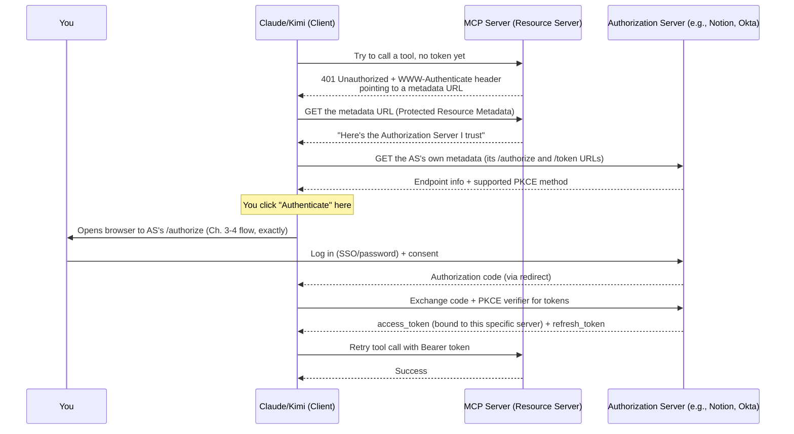

# Chapter 10: MCP and OAuth in Practice

## Learning Objectives

- Map every OAuth concept from Chapters 1–9 onto the exact Claude/Kimi "Authenticate" experience that prompted this course
- Understand the MCP-specific additions on top of plain OAuth: Protected Resource Metadata, Dynamic Client Registration, Resource Indicators
- Know why an MCP server is classified as an OAuth "Resource Server," never an "Authorization Server"

## Prerequisites for This Chapter

Chapters [2](./02-core-concepts-and-terminology.md), [3](./03-fundamental-components.md), and [4](./04-authorization-code-flow-with-pkce.md).

## Why MCP Needed More Than "Just Use OAuth"

Everything in Chapters 1–9 assumed one client, one Authorization Server, set up ahead of time by a developer who hardcodes a `client_id` and a known `/authorize` URL. MCP breaks that assumption on purpose: **Claude or Kimi (the Host) might connect to dozens of MCP servers it has never seen before**, each possibly backed by a *different* company's Authorization Server, discovered at runtime when you paste in a server URL. Plain OAuth 2.0 has no built-in answer for "how does my client even find out which Authorization Server this brand-new server trusts?" — so the [MCP specification](https://modelcontextprotocol.io/specification/2025-06-18/basic/authorization) layers a few extra, standardized discovery steps on top of the exact flow you already learned. It does not invent a new protocol — it's OAuth 2.1 (essentially OAuth 2.0 with PKCE mandatory and old insecure grants removed) plus a discovery layer.

This chapter is a plain-language bridge. This repository's [`mcp-course`, Chapter 13](../../AI-ML/mcp-course/13-authentication-and-authorization.md) covers the same ground at full spec-detail depth (exact RFC numbers, requirement levels per spec revision, production hardening) — read that next if you want the reference-grade version once this clicks.

## Mapping Your Exact Experience, Step by Step

Notice: the **entire middle section before "You click Authenticate"** is new compared to Chapters 1–9 — it's the automatic discovery process that figures out *where* to send you to log in, without a developer having hardcoded it. Everything from "Opens browser to AS's /authorize" onward is exactly the Authorization Code + PKCE flow from Chapter 4, unchanged.

## The Three MCP-Specific Additions, in Plain Language

| Addition | Plain-language explanation | Why it exists |
|---|---|---|
| **Protected Resource Metadata** (a JSON document the MCP server publishes at a well-known URL) | The server's way of saying "if you want to talk to me, here's whose login page you need" | Lets Claude discover the right Authorization Server automatically, instead of you manually configuring it |
| **Dynamic Client Registration** (optional) | The client can auto-register itself with an unfamiliar Authorization Server on the fly, instead of a developer manually creating a `client_id` in advance | Claude/Kimi connect to servers nobody pre-configured a client for |
| **Resource Indicators** (the `resource` parameter) | The access token gets stamped with "this token only works for *this* MCP server" | Stops a token meant for one MCP server from being reused against a different one — important once you've connected many servers |

You can actually see the first one yourself: many MCP servers expose a URL like `https://example.com/.well-known/oauth-protected-resource` that returns exactly this discovery JSON. If you're curious, try fetching one from an MCP server you use, the same way you'd `curl` any REST endpoint.

## Why "Authorization Server" and "Resource Server" Are Never the Same Role for an MCP Server

This is a subtle but important correction to how the flow might *look*. In the simple "Notion" example from earlier chapters, Notion happened to play both the Authorization Server (login page) and Resource Server (the actual API) roles, because it's one company's system. **The MCP specification formally requires that an MCP server itself be classified only as a Resource Server — never as the Authorization Server.** This means:

- The MCP server (the "tool" you're connecting, e.g., a Linear or Asana integration) never handles your password or runs its own login page directly as part of the MCP protocol.
- A separate, standard identity provider (which might be the underlying SaaS company's own login, or your company's SSO like Okta) always plays the Authorization Server role.
- This is *why* the browser window you see is often the underlying service's own real login page (Notion.com, Google, your company SSO) — not some UI built by the MCP server software itself.

## Why the Access Token Is Tied to *This* Server Specifically

Recall the `resource` parameter from the table above. When Claude requests a token for MCP Server A, it explicitly tells the Authorization Server "mint this token for Server A only." The resulting token carries that binding. If Server A's software were ever compromised and tried to reuse your token against a *different* MCP server, that other server checks the binding, sees it doesn't match, and rejects it. This is the practical reason you can safely connect many MCP servers to Claude/Kimi at once without one compromised integration being able to abuse tokens meant for another.

## Summary

- MCP layers automatic Authorization-Server discovery on top of plain OAuth 2.1 — the login/consent/token-exchange part you experience is identical to Chapters 1–9.
- Protected Resource Metadata tells the client which Authorization Server to trust; Dynamic Client Registration lets the client register itself on the fly with servers nobody pre-configured.
- An MCP server is always an OAuth *Resource Server*, never the Authorization Server itself — a separate identity system (the underlying SaaS company or your SSO) always handles login.
- The `resource` parameter binds your access token to one specific MCP server, containing the damage if any single integration is compromised.

## Knowledge Check

1. Which part of the flow you observed corresponds to "automatic discovery," and which part is identical to plain OAuth from earlier chapters?
2. Why can't an MCP server run its own login page as part of the protocol, even though it's the thing you're "authenticating with"?
3. What specific problem does binding a token to one MCP server (via the `resource` parameter) prevent?
4. Why does MCP need Dynamic Client Registration when a normal single-company OAuth integration doesn't?

## Hands-On Exercise

Pick an MCP server you use (or one from the [MCP servers directory](https://github.com/modelcontextprotocol/servers)) and try to fetch its Protected Resource Metadata document with `curl` (usually at `<server-base-url>/.well-known/oauth-protected-resource`). If you find one, identify the `authorization_servers` field and confirm it points at a real identity provider's domain.

## Further Reading

- [MCP Specification — Authorization](https://modelcontextprotocol.io/specification/2025-06-18/basic/authorization)
- This repo's [`mcp-course`, Chapter 13 — Authentication & Authorization](../../AI-ML/mcp-course/13-authentication-and-authorization.md) (full spec-level depth: RFC numbers, requirement levels, production hardening)

  <a href="./09-practical-usage-building-the-flow.md">← Previous: Practical Usage: Building the Flow</a>
  <a href="./00-index.md">🏠 Index</a>
  <a href="./11-security-and-risks.md">Next: Security & Risks →</a>

