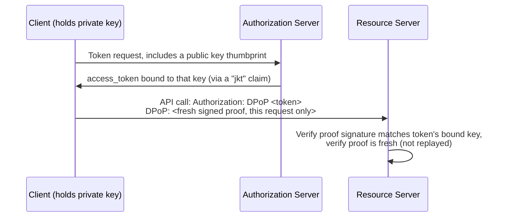
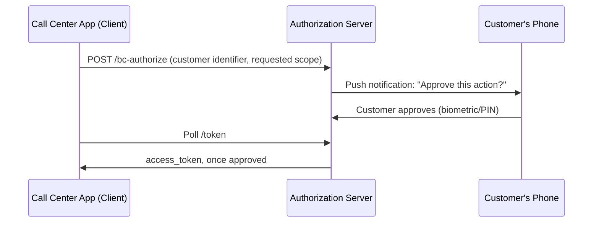

# Chapter 14: Advanced Concepts

## Learning Objectives

- Understand DPoP and mTLS as answers to "what if the access token itself gets stolen, even if I did everything else right?"
- Understand Pushed Authorization Requests (PAR) and why they harden the initial redirect
- Understand Token Exchange (RFC 8693) for service-to-service credential narrowing
- Recognize CIBA as the answer to "authenticate on a different device, without a redirect at all"
- Understand federation at a conceptual level (SAML/OIDC bridging across organizations)

## Prerequisites for This Chapter

Chapters [4](./04-authorization-code-flow-with-pkce.md)–[6](./06-architecture-and-internals.md) and [11](./11-security-and-risks.md).

## The Remaining Gap: A Perfectly Stolen Access Token Still Works

Every defense so far (PKCE, `state`, rotation, audience binding) protects the *issuance* process. None of them stop the following: an attacker who, through some completely separate vulnerability (a compromised proxy, a memory dump, a misconfigured log aggregator), obtains a **valid, unexpired, correctly-audienced access token**. As far as the Resource Server can tell, any request bearing that exact token *is* the legitimate client — this is the core limitation of "bearer tokens": possession is the only proof required. The next two mechanisms directly address this.

## DPoP (Demonstrating Proof of Possession, RFC 9449)

**The idea:** instead of a plain bearer token that works for anyone who has it, bind the token to a private key the client holds. Every API request includes a fresh, signed proof (a small JWT called a "DPoP proof") demonstrating the client still controls that private key — the Resource Server checks both the access token *and* the accompanying proof.



**Why it matters:** if an attacker steals just the access token string (say, from a log file) but not the private key, they cannot produce a valid DPoP proof, and the Resource Server rejects the request. This closes the "stolen bearer token" gap without requiring the heavier machinery of mutual TLS below.

## Mutual TLS (mTLS) Client Authentication

**The idea:** instead of (or in addition to) a `client_secret`, the client authenticates using a TLS client certificate during the connection handshake itself — the Authorization Server binds issued tokens to that certificate.

**Where it's used:** heavily in financial-grade APIs (Open Banking standards) and enterprise-to-enterprise integrations where both parties already manage a PKI (Public Key Infrastructure) for other purposes. It's a stronger, but operationally heavier, alternative to DPoP — appropriate when your organization already runs certificate infrastructure, less so for a general consumer app.

## Pushed Authorization Requests (PAR, RFC 9126)

**The problem it solves:** in the standard flow, all the authorization request parameters (`scope`, `redirect_uri`, `code_challenge`, etc.) travel in the initial browser redirect's URL — visible in browser history, referrer headers, and potentially tamperable by anything that can intercept or rewrite that URL before the AS sees it.

**The fix:** the client first POSTs those parameters directly to a `/par` endpoint on the Authorization Server (server-to-server, not through the browser), receives back a short-lived `request_uri` reference, and then redirects the browser with just that one opaque reference instead of the full parameter list.

```
POST /as/par  (server-to-server, not via browser)
  -> returns request_uri=urn:ietf:params:oauth:request_uri:abc123

Browser redirect becomes just:
  /authorize?client_id=...&request_uri=urn:ietf:params:oauth:request_uri:abc123
```

This shrinks the attack surface of the initial redirect considerably — nothing sensitive travels through the browser URL bar or history beyond an opaque, single-use reference.

## Token Exchange (RFC 8693)

**The problem it solves:** a service holds a token representing one identity/scope and needs to call a *different* downstream service with a narrower, more appropriate credential — without simply forwarding the original token (the token-passthrough anti-pattern from Chapter 11).

**The mechanism:** the service presents its existing token to the Authorization Server's token endpoint with `grant_type=urn:ietf:params:oauth:grant-type:token-exchange`, and receives back a *new*, differently-scoped/audienced token, appropriate for the downstream call, while the original token remains bound to its original purpose. This is exactly the "token exchange" pattern referenced in the MCP security discussion in [Chapter 10](./10-mcp-and-oauth-in-practice.md) as the correct alternative to blind forwarding.

## CIBA — Client-Initiated Backchannel Authentication

**The problem it solves:** the Device Authorization Grant (Chapter 7) requires the user to actively type a code into a second device. CIBA goes further: it's for scenarios like a call-center agent initiating an action on a customer's behalf, where the *customer's own device* (their phone, via a push notification) should prompt them to approve — with no redirect, no code to type, and no browser step on the initiating device at all.



## Federation: Bridging Across Organizations

Everything so far assumed one Authorization Server your client talks to directly. **Federation** extends trust across organizational boundaries — e.g., allowing Company A's users to access Company B's application using Company A's own identity provider, without Company B ever operating its own user database for those users. Conceptually, this is what protocols like **SAML** (an older, XML-based federation standard predating OAuth) and OIDC's own federation extensions solve, and it's the mechanism underlying most enterprise SSO ("log in with your company account" on a third-party SaaS tool). A full treatment of SAML is outside this course's scope, but recognizing the term and its purpose — "let an outside identity provider vouch for a user, without duplicating their account" — is enough to navigate enterprise identity discussions.

## Summary

- DPoP and mTLS both answer "what if a bearer token is stolen anyway," by binding the token to something an attacker doesn't also have (a private key or a certificate).
- PAR hardens the initial browser redirect by moving sensitive parameters to a direct server-to-server call.
- Token Exchange gives services a standard way to narrow a credential's scope/audience for a downstream call, instead of forwarding the original token.
- CIBA solves "approve on your own device with no redirect at all," useful for agent-initiated, customer-approved actions.
- Federation is the enterprise-scale mechanism for one organization's identity provider to be trusted by another's applications.

## Knowledge Check

1. Why doesn't PKCE alone protect against a token stolen *after* issuance, from a log file rather than in transit?
2. What specifically does a DPoP proof demonstrate that a bearer token alone cannot?
3. How does PAR reduce what's exposed in browser history compared to the standard flow?
4. Why would a call-center scenario prefer CIBA over the Device Authorization Grant from Chapter 7?

## Hands-On Exercise

Read RFC 9449's abstract and Section 1 (Introduction) and write, in your own words, two sentences explaining DPoP to a colleague who has completed Chapters 1–9 of this course but nothing further.

## Further Reading

- [RFC 9449 — OAuth 2.0 Demonstrating Proof of Possession (DPoP)](https://datatracker.ietf.org/doc/html/rfc9449)
- [RFC 9126 — OAuth 2.0 Pushed Authorization Requests](https://datatracker.ietf.org/doc/html/rfc9126)
- [RFC 8693 — OAuth 2.0 Token Exchange](https://datatracker.ietf.org/doc/html/rfc8693)
- [OpenID Connect CIBA Core specification](https://openid.net/specs/openid-client-initiated-backchannel-authentication-core-1_0.html)

<div style="display:flex;justify-content:space-between;align-items:center;">
  <a href="./13-common-mistakes-and-pitfalls.md">← Previous: Common Mistakes & Pitfalls</a>
  <a href="./00-index.md">🏠 Index</a>
  <a href="./15-capstone-projects.md">Next: Capstone Projects →</a>
</div>
