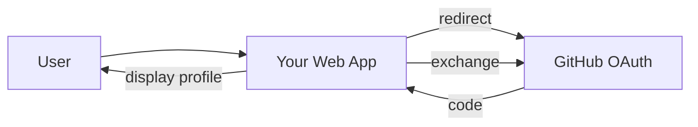
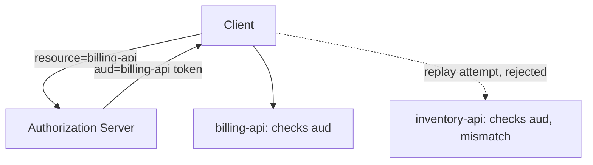
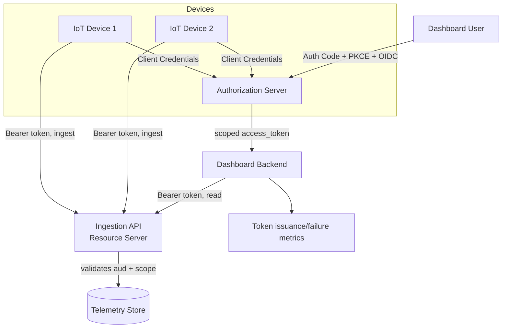

# Chapter 15: Capstone Projects

## Learning Objectives

- Apply the full course, from PKCE mechanics to production hardening, across four projects of increasing scope
- Build something that resembles your actual working context (dashboards, IoT) at the production-grade tier

## Prerequisites for This Chapter

The entire course, Chapters 1–14.

---

## Project 1 (Beginner): "Sign In With GitHub" for a Small Web App

**Requirements:**
- A minimal web app (Flask/FastAPI or plain `http.server`) with a "Sign in with GitHub" button
- Uses OAuth 2.0 (GitHub's real API) + the `read:user` scope
- Displays the logged-in user's GitHub username and avatar after login

**Architecture:**


**Folder structure:**
```
project1-github-login/
  app.py
  templates/
    login.html
    profile.html
  .env          # CLIENT_ID, CLIENT_SECRET (register a GitHub OAuth App first)
```

**Implementation plan:**
1. Register a GitHub OAuth App (github.com/settings/developers) to get a `client_id`/`client_secret`.
2. Build the `/login` route that redirects to GitHub's `/authorize` endpoint with the right scope.
3. Build the `/callback` route: validate `state`, exchange code for a token, call GitHub's `/user` API.
4. Store the resulting profile in a server-side session (not a client-visible cookie holding the raw token).

**Best practices to apply:** `state` validation (Ch. 3, 11), never expose the `client_secret` client-side (Ch. 13 Pitfall 4).

**Extensions:** add a "Sign in with Google" option too, and compare how similar the two integrations are — this demonstrates OAuth's interoperability value directly (Ch. 1).

---

## Project 2 (Intermediate): Your Own Authorization Server, Production-Shaped

**Requirements:** extend the Chapter 9 demo into something closer to real, without going all the way to Chapter 12's full checklist:
- Real login form with at least a hardcoded user table (username/hashed password) instead of auto-approve
- Persistent storage (SQLite is fine) instead of in-memory dicts
- Access tokens issued as signed JWTs (RS256, using a real keypair) instead of opaque random strings
- A `/revoke` endpoint (RFC 7009 shape)

**Architecture:** same as Chapter 9's diagram, but `AUTH_CODES`/`ACCESS_TOKENS`/`REFRESH_TOKENS` become SQLite tables, and `_issue_tokens` signs a JWT instead of generating `secrets.token_urlsafe`.

**Folder structure:**
```
project2-mini-as/
  server.py
  db.py            # SQLite schema + helpers
  keys/
    private.pem
    public.pem
  client.py        # reuse Chapter 9's client, mostly unchanged
```

**Implementation plan:**
1. Generate an RSA keypair (`openssl genrsa`) for signing.
2. Replace `ACCESS_TOKENS[token] = {...}` with `jwt.encode({...claims...}, private_key, algorithm="RS256")`.
3. Replace the `/api/data` bearer check with `jwt.decode(token, public_key, algorithms=["RS256"])` plus an `exp` check.
4. Add a real login form at `/authorize` (a simple username/password HTML form posting to a `/login` route) before showing consent.
5. Add `/revoke`: accepts a refresh token, deletes its DB row.

**Best practices to apply:** signed JWTs with asymmetric keys (Ch. 12), token revocation support (Ch. 12), real authentication before consent (Ch. 1's whole point).

**Extensions:** add scope-based authorization — issue different scopes based on which "app" is requesting (simulate two different registered clients with different allowed scopes).

---

## Project 3 (Advanced): Multi-Server Token Binding (an MCP-Shaped Scenario)

**Requirements:** simulate the exact problem Chapter 10/11 described — one Authorization Server, two independent Resource Servers, and a client that must not be able to replay a token from one server against the other.
- One AS (extend Project 2's server)
- Two separate Resource Servers (`billing-api` and `inventory-api`), each validating tokens independently
- Implement the `resource` parameter (RFC 8707-style) so tokens are minted with an audience claim bound to one specific Resource Server
- Demonstrate: a token minted for `billing-api` must be rejected by `inventory-api`

**Architecture:**


**Folder structure:**
```
project3-multi-server/
  auth_server.py
  billing_api.py
  inventory_api.py
  client_demo.py     # shows both the success case and the rejected replay
```

**Implementation plan:**
1. Extend the `/authorize` and `/token` endpoints to accept and require a `resource` parameter.
2. Bake `resource`'s value into the JWT's `aud` claim at signing time.
3. Each Resource Server validates `aud` against its own known identity, rejecting mismatches with `401`.
4. Write a client script that gets a token for `billing-api`, successfully calls it, then attempts (and confirms rejection) against `inventory-api` with the same token.

**Best practices to apply:** audience validation as the primary confused-deputy defense (Ch. 6, 10, 11).

**Extensions:** add a `/token-exchange` endpoint on `billing-api` implementing a simplified RFC 8693 pattern — it accepts its own valid token and mints a *new*, narrower-scoped token for calling `inventory-api` on the user's behalf, demonstrating the non-passthrough alternative from Chapter 14.

---

## Capstone (Production-Grade): OAuth-Secured IoT Telemetry Dashboard

This ties directly into your existing IoT and dashboard work — build something you could plausibly extend into a real internal tool.

**Requirements:**
- **Human users** log into a telemetry dashboard via Authorization Code + PKCE with OIDC (real login identity, Ch. 8)
- **IoT devices** authenticate to the ingestion API via Client Credentials grant (Ch. 7) — no human, no browser, per-device credentials
- Dashboard users only see devices/data their account's scope permits (scope design, Ch. 6, 12)
- Device credentials are short-lived and automatically rotated (mirroring refresh token rotation, Ch. 5, applied to machine credentials)
- Full observability: token issuance/failure metrics (Ch. 12) surfaced on the dashboard itself

**Architecture:**


**Folder structure:**
```
capstone-iot-dashboard/
  auth_server/
    server.py
    db.py
    keys/
  ingestion_api/
    server.py          # Resource Server: validates device + user tokens
  dashboard/
    backend.py          # OIDC client for human login, calls ingestion_api
    frontend/
  devices/
    simulate_device.py  # Client Credentials grant, posts fake telemetry
  observability/
    metrics.py           # token issuance/failure counters
```

**Implementation plan:**
1. Stand up the Authorization Server from Project 2/3, extended to support both grant types (Authorization Code+PKCE for humans, Client Credentials for devices) on the same `/token` endpoint, distinguished by `grant_type`.
2. Register each simulated device as its own confidential client with a unique `client_id`/`client_secret`, scoped to `telemetry:write` only.
3. Register the dashboard as a client using Authorization Code + PKCE + `openid` scope, scoped to `telemetry:read`.
4. Build the ingestion API as a Resource Server: validate signature, audience, and scope on every request; reject device tokens attempting `telemetry:read`-only operations and vice versa.
5. Add refresh-token rotation for the dashboard's user sessions and periodic credential rotation for devices (a scheduled job that issues new device secrets and revokes old ones).
6. Instrument token validation failures by cause (expired / bad signature / audience mismatch / insufficient scope) and surface counts on the dashboard.

**Best practices to apply:** the full Chapter 12 checklist — HTTPS, PKCE, short-lived tokens, audience validation, revocation, no raw tokens in logs, scope-per-action design.

**Extensions and improvements:**
- Add DPoP (Ch. 14) to the ingestion API's write endpoint, since compromised device credentials are a realistic IoT threat model.
- Add CIBA-style approval (Ch. 14) for a "remotely trigger a device action" feature, so a dashboard user's phone must approve high-privilege remote commands.
- Add a second Authorization Server and demonstrate federation (Ch. 14) for a partner organization's users to view read-only dashboards without your system managing their accounts.

## Summary

- Each project isolates one layer of the course: basic flow (1), your own AS (2), multi-server audience binding (3), and a production-shaped system in your own domain (capstone).
- The capstone deliberately mirrors real IoT/dashboard architecture so the skill transfers directly to your actual work.

## Knowledge Check

1. In Project 3, what specific claim in the token is the enforcement point that prevents cross-server replay?
2. In the capstone, why do devices use Client Credentials while dashboard users use Authorization Code + PKCE?
3. Why does device credential rotation mirror refresh token rotation conceptually, even though it's a different grant type?

## Hands-On Exercise

Before starting the capstone, sketch (on paper or in a `.md` file) the exact scopes your system will need, following the "design scopes around actions, not tools" guidance from Chapter 12 — e.g., `telemetry:write`, `telemetry:read`, `device:manage`. Review it against the "no blanket scope" pitfall from Chapter 13 before writing any code.

## Further Reading

- [PyJWT documentation](https://pyjwt.readthedocs.io/) — for Projects 2–4's signed-token work
- [RFC 8707 — Resource Indicators](https://datatracker.ietf.org/doc/html/rfc8707) — for Project 3
- Re-read [Chapter 10](./10-mcp-and-oauth-in-practice.md) before Project 3 — it's the same architecture MCP itself uses

<div style="display:flex;justify-content:space-between;align-items:center;">
  <a href="./14-advanced-concepts.md">← Previous: Advanced Concepts</a>
  <a href="./00-index.md">🏠 Index</a>
  <a href="./16-interview-preparation.md">Next: Interview Preparation →</a>
</div>
