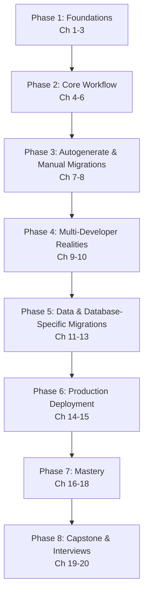

# Alembic & Database Schema Migrations — Complete Course

> From "what is a schema migration?" to writing safe, reviewable, zero-downtime migrations for production FastAPI + SQLAlchemy 2.0 + PostgreSQL applications — a structured, professional learning path.

---

## Course Overview

Alembic is the database schema migration tool built by the author of SQLAlchemy, and it is the de facto standard for versioning relational database schemas in the Python ecosystem — the same role Django migrations, Flyway, or Liquibase play elsewhere. Any production FastAPI + SQLAlchemy application that outlives its first deploy needs a disciplined way to evolve its database schema over time without ever running `DROP DATABASE` and starting over, and without taking the application down while it does it.

This course takes you from absolute beginner to professional, covering:

- What a schema migration actually is, and why "just change the model and re-create the tables" stops working the moment real data exists
- Alembic's internal architecture: the migration environment, the `op` directive system, offline vs. online execution, and how `env.py` bridges Alembic to your SQLAlchemy models
- Revisions and the migration graph: how a chain of small, reviewable changes becomes a full version history for your database
- The autogenerate workflow — Alembic's most-used feature — and exactly where its automatic detection is trustworthy and where it silently gets things wrong
- Writing manual migrations by hand: every common `op.*` operation for tables, columns, indexes, and constraints
- Multi-developer realities: the `alembic_version` table, diverging branches, and merging migration heads
- Data migrations as a distinct discipline from schema migrations, PostgreSQL-specific features (ENUM, JSONB, UUID, partial indexes, extensions), and SQLite batch mode for mixed test/production database backends
- **Zero-downtime production deployment**: the expand/contract pattern, backward/forward-compatible schema changes, and safe deployment sequencing — the material that separates "I can run `alembic upgrade head`" from "I can ship a schema change to production without an incident"
- CI/CD integration, best practices, common failure modes, the wider tooling ecosystem, capstone projects, and interview preparation

Every chapter builds on the last, and every chapter is grounded in one running example: **ExpenseFlow**, a FastAPI + SQLAlchemy 2.0 + PostgreSQL expense-tracking API whose schema grows, branches, and gets refactored in production exactly the way a real application's does — table by table, migration by migration, across the whole course.

This course deliberately spends real time on *why* a migration tool needs to exist at all and *how* Alembic works internally (Chapters 2–3) before touching day-to-day commands, because the commands are easy to memorize and mostly useless without the mental model underneath them — you cannot reason about a dangerous production migration by pattern-matching a command you copied once.

---

## Who This Course Is For

You should be comfortable with:

- **SQL basics** — `CREATE TABLE`, `ALTER TABLE`, primary/foreign keys, indexes, at a conceptual level
- **SQLAlchemy's ORM** — declarative models, `Mapped[...]`/`mapped_column(...)` style (SQLAlchemy 2.0), sessions, and how a model maps to a table
- **Command line & Docker basics** — running a shell, installing Python packages, running a Postgres container

You do **not** need prior experience with any migration tool, Alembic or otherwise. If you've used Django migrations, Flyway, or Liquibase before, the core ideas (versioned schema changes, an upgrade/downgrade pair, a migration history table) transfer directly, and this course calls out the parallels where useful. If you've taken this repo's [PostgreSQL](../postgresql-course/00-index.md) course, that SQL foundation will make Chapters 12 and 14 land faster — this course does not re-teach SQL or the SQLAlchemy ORM itself, only assumes working familiarity with both.

---

## Learning Roadmap

| Phase | Milestone | Chapters |
|---|---|---|
| 1. Foundations | Explain why migrations exist and how Alembic works internally, from memory | 1–3 |
| 2. Core Workflow | Set up `env.py`, create revisions, and upgrade/downgrade a real database confidently | 4–6 |
| 3. Autogenerate & Manual Migrations | Use `--autogenerate` correctly, know its blind spots, and hand-write any `op.*` migration | 7–8 |
| 4. Multi-Developer Realities | Understand the `alembic_version` table, and resolve a real branch/merge conflict | 9–10 |
| 5. Data & Database-Specific Migrations | Write safe data backfills, use PostgreSQL-specific DDL, and support SQLite batch mode | 11–13 |
| 6. Production Deployment | Design and execute a zero-downtime schema change, and wire migrations into CI/CD | 14–15 |
| 7. Mastery | Apply best practices and recognize known failure modes fluently | 16–18 |
| 8. Capstone & Interviews | Ship a production-grade capstone and pass a migration-focused system-design interview | 19–20 |

---

## Estimated Learning Timeline (2–3 Weeks)

**Week 1 — Foundations & Core Workflow** (Ch 1–6): install Alembic, understand why migrations exist, wire up `env.py` against a FastAPI + SQLAlchemy 2.0 + PostgreSQL project, create your first revisions, and practice upgrade/downgrade cycles.
*Project: ExpenseFlow's initial `users`/`expenses` schema, versioned from scratch.*

**Week 2 — Autogenerate, Manual Migrations & Multi-Developer Workflow** (Ch 7–10): generate and review autogenerated migrations, hand-write migrations for relationships autogenerate can't get right, understand the `alembic_version` table, and resolve a branched-heads merge.
*Project: add categories, tags, and receipts to ExpenseFlow across autogenerated and manual migrations; simulate and resolve a two-developer branch collision.*

**Week 3 — Data Migrations, PostgreSQL Features & Production Deployment** (Ch 11–15): write safe data backfills, use PostgreSQL-specific column types and indexes, support SQLite in tests via batch mode, execute a zero-downtime column rename, and wire migrations into a CI/CD pipeline.
*Project: a zero-downtime rename of a production column, plus a GitHub Actions pipeline that validates every migration before deploy.*

**Ongoing — Mastery & Capstone** (Ch 16–20): best practices, common pitfalls, the wider tooling ecosystem, capstone projects, and interview preparation.
*Project: a production-grade capstone combining multi-developer migrations, PostgreSQL-specific DDL, and a zero-downtime deployment gate in CI.*

If you can commit ~1–1.5 hours/day, 2–3 weeks is realistic for professional proficiency. Compress further if you already run PostgreSQL day to day and just need Alembic's mental model and the production-safety practices in Chapters 14–15.

---

## Prerequisites

See [Chapter 1](./01-introduction-and-prerequisites.md) for a full self-assessment, covering:

- **SQL fundamentals**: tables, columns, primary/foreign keys, indexes
- **SQLAlchemy 2.0 ORM familiarity**: declarative models with `Mapped[...]`/`mapped_column(...)`, sessions, engines
- **Docker & CLI comfort**: running a local PostgreSQL container, installing Python packages
- **Optional but helpful**: prior experience with any other migration tool (Django migrations, Flyway, Liquibase)

---

## Complete Chapter Index

| # | Chapter | What You'll Learn |
|---|---|---|
| 01 | [Introduction & Prerequisites](./01-introduction-and-prerequisites.md) | What a schema migration is, life without migrations, self-assessment, installing Alembic |
| 02 | [Core Concepts](./02-core-concepts.md) | Schema vs. data migration, migrations as version control for your database, upgrade/downgrade, terminology |
| 03 | [Architecture & Internals](./03-architecture-and-internals.md) | `MigrationContext`, `ScriptDirectory`, the `op` module, offline vs. online mode, how `env.py` bridges to SQLAlchemy |
| 04 | [The Migration Environment: `env.py` & `alembic.ini`](./04-migration-environment-env-py.md) | `alembic init`, project structure, `alembic.ini`, `env.py` line by line, async engine gotchas |
| 05 | [Revisions & Version History](./05-revisions-and-version-history.md) | Revision IDs, `down_revision` chains, `alembic history`/`current`/`heads`, migration file anatomy |
| 06 | [Upgrade & Downgrade](./06-upgrade-and-downgrade.md) | `alembic upgrade`/`downgrade`, relative vs. absolute targets, offline SQL generation |
| 07 | [Autogenerate Migrations](./07-autogenerate-migrations.md) | How autogenerate compares models to the live DB, what it detects vs. misses, reviewing generated SQL |
| 08 | [Writing Manual Migrations](./08-writing-manual-migrations.md) | The full `op.*` directive catalog: tables, columns, indexes, constraints, foreign keys |
| 09 | [The Version Table & Stamping](./09-the-version-table-and-stamping.md) | `alembic_version`, `alembic stamp`, adopting Alembic on an existing database |
| 10 | [Branches & Merge Migrations](./10-branches-and-merge-migrations.md) | Diverging heads, `alembic merge`, multi-developer migration workflows |
| 11 | [Data Migrations](./11-data-migrations.md) | Backfilling columns safely, seeding lookup data, batching large data changes |
| 12 | [PostgreSQL-Specific Features](./12-postgresql-specific-features.md) | ENUM, JSONB, UUID, generated columns, extensions, partial/GIN indexes |
| 13 | [SQLite & Batch Migrations](./13-sqlite-batch-migrations.md) | Why SQLite needs batch mode, `op.batch_alter_table`, testing against SQLite vs. Postgres |
| 14 | [Zero-Downtime Migrations & Production Deployment](./14-zero-downtime-migrations.md) | Expand/contract, backward/forward-compatible changes, safe vs. unsafe operations |
| 15 | [CI/CD Integration](./15-cicd-integration.md) | Running migrations in pipelines, drift detection, rollback testing, deployment sequencing |
| 16 | [Best Practices](./16-best-practices.md) | Consolidated professional checklist across the whole stack |
| 17 | [Common Mistakes & Pitfalls](./17-common-mistakes-and-pitfalls.md) | Failure modes and how to avoid them |
| 18 | [Tools & Ecosystem](./18-tools-and-ecosystem.md) | `alembic-utils`, `pytest-alembic`, FastAPI/Docker integration, comparisons to other migration tools |
| 19 | [Capstone Projects](./19-capstone-projects.md) | Beginner → production-grade project specs and architecture |
| 20 | [Interview Preparation](./20-interview-preparation.md) | Q&A, scenario-based questions, system design, troubleshooting, production case studies |

---

## Milestones Checklist

- [ ] Explain why schema migrations exist and what breaks without them, using version-control-for-databases as the mental model
- [ ] Trace what actually happens internally when `alembic upgrade head` runs, from `env.py` through to committed SQL
- [ ] Set up Alembic against a FastAPI + SQLAlchemy 2.0 + PostgreSQL project, with `env.py` reading the DB URL from configuration, not hardcoding it
- [ ] Create, read, and reorder revisions confidently, and explain the migration graph as a linked list of changes
- [ ] Generate an autogenerated migration, and correctly identify a case where autogenerate silently produces a destructive drop+add instead of a rename
- [ ] Hand-write a migration using at least six different `op.*` directives, in the correct dependency order
- [ ] Explain what the `alembic_version` table stores and why it is the only migration state Alembic keeps in the database
- [ ] Resolve a two-developer diverging-heads situation with `alembic merge`
- [ ] Write a safe data backfill for a new NOT NULL column without locking a large table
- [ ] Use at least three PostgreSQL-specific features (ENUM, JSONB, a partial index) in a migration
- [ ] Explain why SQLite needs batch mode and write a migration that works against both SQLite and PostgreSQL
- [ ] Design and execute a zero-downtime column rename using the expand/contract pattern
- [ ] Wire `alembic upgrade head` and a drift-detection check into a CI/CD pipeline
- [ ] Complete a production-grade capstone project
- [ ] Answer all interview questions in Chapter 20 confidently

---

## Recommended Resources

**Official docs**: [Alembic Documentation](https://alembic.sqlalchemy.org/en/latest/) (the tutorial, cookbook, and operation reference are the pages you'll return to most), [SQLAlchemy 2.0 ORM docs](https://docs.sqlalchemy.org/en/20/orm/).

**Tools**: the `alembic` CLI itself, `pytest-alembic` (testing migrations), `alembic-utils` (versioning Postgres views/functions/triggers), Docker/`docker compose` for local and CI Postgres instances.

**Interactive practice**: run PostgreSQL locally via Docker — every chapter's exercises are designed to work against a local instance, with SQLite used specifically where the course discusses batch mode.

**Related courses**: [PostgreSQL](../postgresql-course/00-index.md), for the SQL and database-internals depth (locking, indexes, `ALTER TABLE` behavior) that Chapters 12 and 14 build directly on.

Good luck. Start with **01-introduction-and-prerequisites.md**.

---

  
  <a href="./00-index.md">🏠 Index</a>
  <a href="./01-introduction-and-prerequisites.md">Next: Introduction & Prerequisites →</a>

