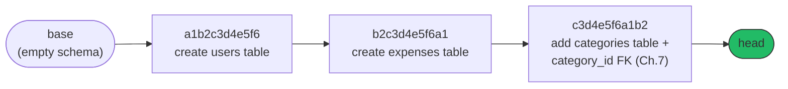
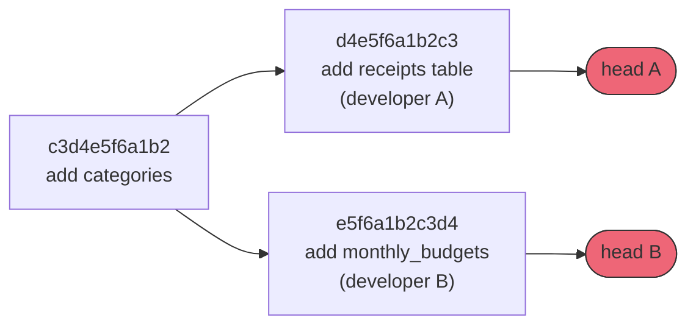
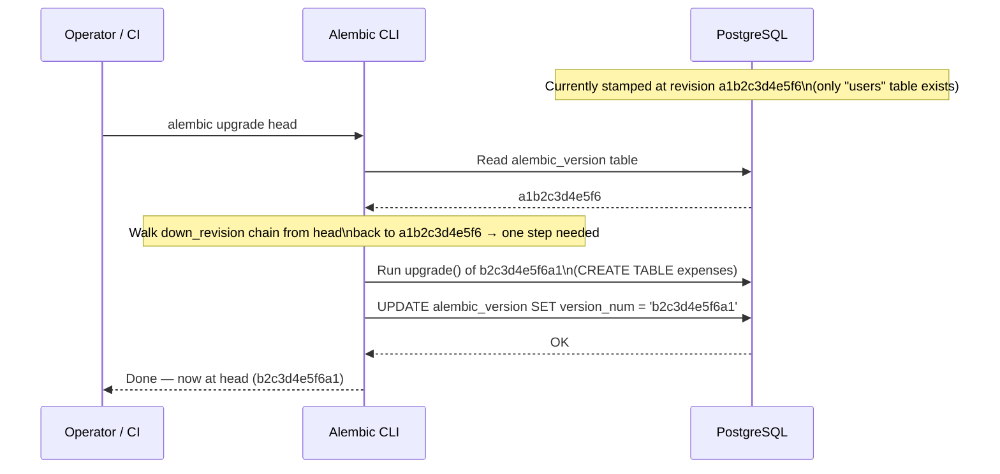

# Core Concepts

[Chapter 1](./01-introduction-and-prerequisites.md) established *why* a migration tool needs to exist at all: without one, schema changes either destroy real data (drop-and-recreate) or drift silently across environments (unrecorded manual `ALTER TABLE` statements). It also introduced ExpenseFlow — a FastAPI + SQLAlchemy 2.0 + PostgreSQL expense tracker starting with `users` and `expenses` — and got Alembic installed. This chapter builds the vocabulary and mental model every later chapter depends on: what precisely distinguishes a schema migration from a data migration, why "migrations are version control for your database" is a genuinely useful analogy and not just marketing, what upgrading and downgrading mean, what a migration *graph* is, and the exact meaning of terms like revision, `down_revision`, head, base, branch, and merge point — all defined plainly, before you see a single line of migration code. Chapter 3 then goes under the hood into how Alembic implements all of this; this chapter is strictly about the concepts themselves.

---

## Learning Objectives

By the end of this chapter, you will be able to:

- Distinguish schema migrations from data migrations precisely, including their different risk, rollback, and transactionality profiles.
- Explain the "migrations are version control for your database schema" analogy, and map its concepts (commit, history, revert) onto Alembic's equivalents.
- Define, without hesitation, each of the following terms: revision, `down_revision`, head, base, branch, and merge point.
- Draw and read a migration graph as a linked list of revisions, including what a linear history looks like versus a branched one.
- Explain what "upgrading" and "downgrading" a database mean in terms of moving through that graph.
- Explain why a migration should ideally define both an upgrade path and a downgrade path, even when the downgrade is rarely exercised.

---

## Prerequisites for This Chapter

This chapter builds directly on [Chapter 1: Introduction & Prerequisites](./01-introduction-and-prerequisites.md). We assume you already have:

- A working ExpenseFlow project skeleton (FastAPI + SQLAlchemy 2.0 + PostgreSQL) with `User` and `Expense` models, as built in Chapter 1's hands-on exercise.
- Alembic installed and verified (`alembic --version` working) in that project's virtual environment.
- The distinction between "drop and recreate" and "a real migration tool," and the schema-drift failure mode that motivates this course, from Chapter 1, Section 2.
- A first, informal preview of schema vs. data migrations from Chapter 1, Section 3 — this chapter sharpens that preview considerably.

If any of that feels unfamiliar, revisit Chapter 1 before continuing — this chapter uses that context without re-explaining it.

---

## 1. Schema Migrations vs. Data Migrations, In Depth

Chapter 1 previewed this distinction; here it's worth making precise, because conflating the two is one of the most common sources of production incidents involving migration tools (a topic Chapter 17 returns to with concrete failure stories).

### 1.1 Definitions, precisely

A **schema migration** changes the *shape* of the database: the tables that exist, the columns each table has, each column's type and nullability, the indexes, the constraints, and the foreign keys tying tables together. In SQL terms, a schema migration is built from DDL (Data Definition Language) statements — `CREATE TABLE`, `ALTER TABLE`, `CREATE INDEX`, `DROP CONSTRAINT`, and similar.

A **data migration** changes the *contents* — the actual rows already stored in existing tables. In SQL terms, a data migration is built from DML (Data Manipulation Language) statements — `UPDATE`, `INSERT`, `DELETE`. Backfilling every existing `expenses` row's `currency` column with `"USD"` after adding that column is a data migration; adding the `currency` column itself in the first place is a schema migration.

### 1.2 Why the distinction matters operationally

| Dimension | Schema migration | Data migration |
|---|---|---|
| **What it touches** | Structure: tables, columns, types, constraints, indexes | Contents: existing row values |
| **Typical duration** | Near-instant for new tables/columns; can be slow for `ALTER COLUMN` on huge existing tables | Proportional to row count — can take seconds or hours depending on table size |
| **Locking behavior** | Some DDL (adding a `NOT NULL` column with a default, on older Postgres versions) can lock the whole table for its duration | `UPDATE` statements typically lock only the rows they touch, but a single giant `UPDATE` can still hold a long transaction |
| **Rollback strategy** | Usually a clean, symmetric `downgrade()` (drop what you created) | Often *not* cleanly reversible — you may not be able to reconstruct exactly which rows were "USD" by inference versus explicit default |
| **Transactionality** | PostgreSQL wraps DDL in transactions well (mostly — a few exceptions, covered in Chapter 12) | Large data changes are sometimes deliberately split into smaller batched transactions to avoid one enormous transaction (Chapter 11) |
| **Where it runs** | Almost always inside the migration itself | Sometimes deliberately moved *outside* the migration entirely, into a background job, for very large datasets (Chapter 11) |

Both kinds of change are written as Alembic migrations — Alembic does not require or expect a separate tool for data changes — but that operational table is exactly why Chapter 11 treats data migrations as a distinct discipline with its own safety rules (add nullable → backfill → add `NOT NULL` as separate steps), and why Chapter 14's zero-downtime pattern cares deeply about which category a given production change falls into.

### 1.3 A worked contrast, using ExpenseFlow

It helps to see the two side by side against the same real change. Suppose ExpenseFlow needs every `expenses` row to have a non-null `currency`. A schema-only migration just changes structure:

```python
def upgrade() -> None:
    # Schema migration: structure only, no row values touched.
    op.add_column("expenses", sa.Column("currency", sa.String(3), nullable=True))
```

That statement alone doesn't populate a single existing row — every `expenses` row that existed before this migration ran now has `currency = NULL`. Making every existing row actually say `"USD"` is a data migration, operating on rows, not structure:

```python
def upgrade() -> None:
    expenses = sa.table("expenses", sa.column("currency", sa.String))
    op.execute(expenses.update().where(expenses.c.currency.is_(None)).values(currency="USD"))
```

Notice the second snippet contains no `CREATE`/`ALTER`/`DROP` at all — it's a plain `UPDATE`, expressed through Alembic's lightweight `sa.table()` helper rather than a full ORM model (Chapter 11 explains exactly why a lightweight table reflection, not your real `Expense` model, is the right tool inside a migration). Only after both steps have run would a *third* migration be safe to add a `NOT NULL` constraint on `currency` — attempting `nullable=False` before every row has a value would simply fail against existing NULLs. This three-step shape (add nullable → backfill → constrain) is exactly the "expand" half of the expand/contract pattern Chapter 14 builds into a full production deployment technique.

### 1.4 A migration can be, and often is, both at once

Nothing prevents a single Alembic revision from containing a schema change followed by a data change — for instance, adding the `currency` column (schema) and then immediately backfilling it (data) in the same `upgrade()` function. Whether to combine them or split them into two separate revisions is a judgment call this course returns to explicitly in Chapter 11 (short answer: for anything touching a large or actively-written production table, split them, so the fast schema change and the potentially slow data change can be reasoned about, timed, and rolled back independently).

---

## 2. The Version-Control Analogy: Migrations Are Git for Your Database Schema

The single most useful mental model for everything in this course is one you very likely already have installed in your head from using Git: **a sequence of Alembic migrations is a commit history for your database schema.**

| Git concept | Alembic equivalent |
|---|---|
| A commit | A revision (one migration file) |
| A commit's parent pointer | `down_revision` (Section 3) |
| `git log` | `alembic history` |
| The current commit `HEAD` is pointing at | The current revision the database is stamped at (Section 3, and Chapter 9's `alembic_version` table) |
| `git checkout <commit>` | `alembic upgrade <revision>` / `alembic downgrade <revision>` |
| `git revert` | A migration's `downgrade()` function |
| A merge commit (two parents) | A merge revision (two `down_revision`s — Chapter 10) |
| Two branches with diverging commits | Two Alembic heads (Chapter 9, Chapter 10) |

The analogy holds remarkably well because both systems solve a structurally similar problem: *how do you let multiple people make incremental changes to a shared, evolving artifact, in a way that's ordered, reproducible, and — when needed — reversible?* Git's artifact is a codebase; Alembic's artifact is a database schema. Just as `git log` lets you read the entire history of how a codebase got to its current state one commit at a time, `alembic history` lets you read the entire history of how ExpenseFlow's schema got to its current state one revision at a time — and just as a fresh `git clone` plus `git checkout <commit>` deterministically reproduces a specific codebase state on any machine, `alembic upgrade <revision>` deterministically reproduces a specific schema state on any database.

The analogy has one important limit worth flagging early, though: **Git tracks a file tree; Alembic's migrations track a stateful, external system (a live database) that already has other things depending on it** — running application instances, in-flight transactions, existing rows. `git checkout` rewriting your working directory has essentially zero real-world consequence beyond your own filesystem. `alembic downgrade` rewriting a *production* database's schema can drop columns still being read by running application code, or destroy data that has no corresponding "undo" (Section 1.2's point about data migrations often not cleanly reversing). Keep the analogy for structure and vocabulary; keep a healthier respect for consequences than you'd give `git checkout`. Chapter 14 is, in large part, about exactly this gap.

---

## 3. Core Terminology, Defined Plainly

Every remaining chapter in this course uses these terms freely and without re-explaining them, so get each one solid now.

### 3.1 Revision

A **revision** is a single migration — one Python file under `alembic/versions/`, containing an `upgrade()` function (apply this change) and a `downgrade()` function (undo this change), along with a unique **revision ID** (an autogenerated hex string, e.g. `a1b2c3d4e5f6`) that identifies it. "Revision" and "migration" are used near-interchangeably in Alembic's own documentation and throughout this course — a revision *is* a migration, viewed as one node in the history.

### 3.2 `down_revision`

Every revision file declares its own `revision` ID and a `down_revision` — the ID of the revision that must be applied *immediately before* this one. This single pointer is what turns a folder full of independent-looking Python files into an actual ordered sequence: Alembic doesn't infer order from filenames or timestamps, it follows the `down_revision` chain, exactly the way Git follows parent-commit pointers rather than file-creation timestamps to reconstruct history.

```python
# alembic/versions/b2c3d4e5f6a1_add_expenses_table.py
revision = "b2c3d4e5f6a1"
down_revision = "a1b2c3d4e5f6"  # the "create users table" revision

def upgrade():
    ...

def downgrade():
    ...
```

This says, plainly: "this revision (`b2c3d4e5f6a1`, adding the `expenses` table) comes immediately after revision `a1b2c3d4e5f6` (creating `users`)." A revision whose `down_revision` is `None` is the very first migration in the chain.

### 3.3 Head

The **head** is the most recent revision in a chain — the tip of the history, the one with no other revision pointing at it as a parent. `alembic upgrade head` means "bring the database up to the newest known migration." In a healthy, linear ExpenseFlow history, there is exactly one head at any given time, and `alembic heads` reports it plainly:

```text
$ alembic heads
c3d4e5f6a1b2 (head)
```

As you'll see in Section 4 and in full in Chapter 10, it's entirely possible — and a completely normal multi-developer occurrence — to end up with **multiple heads** at once, which Alembic will refuse to silently resolve for you:

```text
$ alembic heads
d4e5f6a1b2c3 (head)
e5f6a1b2c3d4 (head)
```

Two lines, both marked `(head)`, is Alembic telling you plainly: "I don't know which of these you mean by `head` — resolve this before asking me to upgrade to it."

### 3.4 Base

The **base** is the opposite end of the chain: the special, implicit starting point *before* the very first revision has been applied — an empty schema, migration-wise. `alembic downgrade base` means "undo every migration, all the way back to nothing." Unlike a revision, base has no revision ID of its own to display — it's simply the absence of any applied migration, which is why a brand-new, never-migrated database has no row at all in the `alembic_version` table (Chapter 9) rather than a row pointing at some special "base" sentinel value.

### 3.5 Branch

A **branch** occurs when two different revisions declare the *same* `down_revision` — in other words, two developers each wrote a new migration on top of the same starting point, without either one knowing about the other's change. This is the database-migration equivalent of two Git branches diverging from the same commit. It happens naturally in any team where more than one person adds migrations concurrently, and it is not, by itself, an error — it only becomes a problem if it's left unresolved when it's time to deploy (Chapter 10 works through ExpenseFlow's own branching incident in full). Concretely, this is what it looks like in the files themselves — two revision files, both pointing at the same parent:

```python
# alembic/versions/d4e5f6a1b2c3_add_receipts_table.py
revision = "d4e5f6a1b2c3"
down_revision = "c3d4e5f6a1b2"   # same parent as the file below
```

```python
# alembic/versions/e5f6a1b2c3d4_add_monthly_budgets.py
revision = "e5f6a1b2c3d4"
down_revision = "c3d4e5f6a1b2"   # same parent as the file above
```

### 3.6 Merge point

A **merge point** (or merge revision) is a special revision created specifically to reunite two diverged heads back into one linear history — it declares *two* `down_revision`s (one for each branch being merged) instead of one, exactly analogous to a Git merge commit having two parents:

```python
# alembic/versions/f6a1b2c3d4e5_merge_receipts_and_budgets.py
revision = "f6a1b2c3d4e5"
down_revision = ("d4e5f6a1b2c3", "e5f6a1b2c3d4")   # two parents, not one
```

`alembic merge heads` generates this file for you; Chapter 10 covers the mechanics and the ExpenseFlow scenario that necessitates it (two developers independently adding `receipts` and `monthly_budgets` off the same starting revision).

### 3.7 Terminology quick-reference

| Term | One-line definition |
|---|---|
| Revision | One migration file, identified by a unique revision ID, with `upgrade()`/`downgrade()` |
| `down_revision` | The parent pointer — which revision must be applied immediately before this one |
| Head | The newest revision in a chain — the tip of the migration history |
| Base | The implicit empty state before any migration has been applied |
| Branch | Two revisions sharing the same `down_revision`, creating two heads |
| Merge point | A revision with two `down_revision`s, reuniting two heads into one |
| Upgrade | Moving the database forward through the graph, applying revisions |
| Downgrade | Moving the database backward through the graph, undoing revisions |

### 3.8 A common point of confusion: "revision" vs. "migration" vs. "version"

Beginners often stall briefly on whether "revision," "migration," and "version" are three different things or three names for one thing. In Alembic's own vocabulary and throughout this course, they refer to the same object viewed from three angles: **"migration"** emphasizes the *action* (the change being applied), **"revision"** emphasizes the *identity* (this specific, uniquely-numbered node in the graph), and **"version"** emphasizes the *state* (which revision a given database is currently at — the word used by the `alembic_version` table itself, covered fully in Chapter 9). When you read "the database is at version `b2c3d4e5f6a1`," that's the exact same idea as "revision `b2c3d4e5f6a1` was the most recently applied migration." Alembic's CLI and documentation are not perfectly consistent about which word they use where, so it's worth internalizing now that all three point at one underlying concept rather than three separate ones.

---

## 4. The Migration Graph as a Linked List

Put the terms from Section 3 together and a clear structural picture emerges: **Alembic's migration history is a directed graph of revisions, most commonly shaped as a simple linked list**, where each revision points backward at exactly one parent via `down_revision` (until a branch or merge is involved).

### 4.1 A linear history (the common case)

For ExpenseFlow's first few chapters, the history is perfectly linear — one revision, one parent, one child, all the way up to the current head:



Each arrow *is* a `down_revision` pointer, drawn pointing from parent to child for readability (Alembic's own internal traversal walks it in the opposite direction — from a target revision backward through `down_revision` until it finds where the database currently is, then applies each `upgrade()` forward from there). "The migration graph" and "the revision chain" are used interchangeably in this course when the history is linear; the word "graph" earns its keep once branching enters the picture.

### 4.2 A branched history (introduced fully in Chapter 10)

Once two developers each add a revision on top of the *same* parent without coordinating, the picture stops being a simple line:



Both `d4e5f6a1b2c3` and `e5f6a1b2c3d4` declare `down_revision = "c3d4e5f6a1b2"` — that's precisely the definition of a branch from Section 3.5. `alembic heads` would now report *two* heads instead of one, and `alembic upgrade head` becomes ambiguous (which head?) until a merge revision reunites them, which is the entirety of Chapter 10's subject matter. This diagram is a direct preview of the exact scenario ExpenseFlow's team runs into in that chapter — it is not a hypothetical, it's foreshadowing.

---

## 5. Upgrade and Downgrade: Moving Through the Graph

With the graph established, "upgrade" and "downgrade" have precise meanings: they are **movements from the database's current position in the graph to a different, targeted position**, applying (`upgrade`) or reversing (`downgrade`) every revision strictly between the two.



**Upgrading** means moving forward: from the database's current revision toward a target (most commonly `head`, but a specific revision ID or a relative offset like `+1` work too — full command syntax is Chapter 6's subject). Alembic runs each intervening revision's `upgrade()` function, in order, and after each one, updates its own bookkeeping (the `alembic_version` table, detailed fully in Chapter 9) to record the new current position.

**Downgrading** means moving backward: from the current revision toward an earlier target (a specific revision, `-1` for "one step back," or `base` for "undo everything"). Alembic runs each intervening revision's `downgrade()` function, in *reverse* order, undoing the most recently applied change first — again, exactly like reverting commits in reverse chronological order.

### 5.1 Why downgrade paths matter, even though they're rarely run

It's tempting, especially under deadline pressure, to write a real `upgrade()` and leave `downgrade()` as a `pass` stub — "we're never going backward anyway." Resist this. A downgrade path earns its cost in exactly the situations you can't fully plan for: a migration that turns out to be subtly wrong gets caught in staging and needs a clean rollback before it reaches production; a production deploy needs to be reverted quickly and the schema change needs to revert with it; or a teammate six months from now needs to understand a change well enough to invert it, and an actual working `downgrade()` is far better documentation than a comment. Chapter 6 has you practice full upgrade/downgrade cycles against ExpenseFlow's first two tables specifically to build this habit early, and Chapter 17 catalogs real incidents caused by downgrade paths that were written but never actually tested and didn't work when finally needed.

### 5.2 What "current" means, precisely

One more piece of vocabulary worth nailing down here, since Section 5's definitions both refer to it: the database's **current revision** is whatever `alembic current` reports, which is read directly from the `alembic_version` table (Chapter 9) — not inferred from the shape of the tables that happen to exist. This matters because it means Alembic's notion of "where the database is" is entirely dependent on that one bookkeeping row being accurate. If someone manually runs the DDL from a migration by hand, outside of Alembic entirely (exactly the anti-pattern Chapter 1 opened this course by warning against), the actual table structure and Alembic's recorded `alembic_version` fall out of sync — the tables might reflect revision `c3d4e5f6a1b2`'s changes while `alembic_version` still says `b2c3d4e5f6a1`. Alembic has a tool specifically for correcting this kind of drift without re-running DDL (`alembic stamp`), covered fully in Chapter 9 — but the healthiest habit, by far, is never letting `alembic_version` and the real schema diverge in the first place by always changing schema *through* Alembic.

---

## 6. Putting the Concepts Together: ExpenseFlow's Planned History

It's worth previewing, at a purely conceptual level, how the terminology from this chapter maps onto the real chapters ahead — partly to cement the vocabulary, and partly so the rest of this course reads as one continuous story rather than a new example every chapter.

| Revision (conceptual) | What it does | Chapter | Schema, data, or both? |
|---|---|---|---|
| 1 | Create `users` table | 5–6 | Schema |
| 2 | Create `expenses` table | 5–6 | Schema |
| 3 | Add `categories` table + `category_id` FK | 7 (autogenerate) | Schema |
| 4 | Add `tags`/`expense_tags` many-to-many | 8 (manual) | Schema |
| 5a / 5b | Two developers each add `receipts` / `monthly_budgets` off the same parent | 9–10 | Schema (this is the branch from Section 4.2) |
| 6 | Merge revision reuniting 5a and 5b | 10 | Neither — a merge point has no DDL of its own, just two `down_revision`s |
| 7 | Backfill `currency`, seed default `categories` | 11 | Data |
| 8 | `ENUM`, `JSONB`, `UUID`, partial index, `pg_trgm` | 12 | Schema |
| 9 | `description` → `notes`, expand/contract sequence | 14 | Both, across three separate deploys |

Two things are worth noticing in this table. First, every single row is describable using nothing but this chapter's six terms (revision, `down_revision`, head, base, branch, merge point) plus Section 1's schema/data distinction — that vocabulary really is sufficient to describe the entire rest of the course's technical content at a conceptual level, before you've written a line of Alembic code. Second, row 6 is a useful preview of something slightly counterintuitive: a merge revision typically contains **no real DDL of its own** — its `upgrade()`/`downgrade()` are frequently empty (or near-empty) `pass`-equivalents, because its entire job is structural (declaring two `down_revision`s to reunite the graph), not making any actual schema change. Chapter 10 shows this concretely.

---

## Real-World Scenario

Three weeks into using Alembic, Priya (ExpenseFlow's backend lead, introduced in Chapter 1's scenario) is asked in a sprint planning meeting: "If we ship the new `category_id` column tomorrow and QA finds a blocking bug in it, how fast can we back it out?" Before Alembic, this question had no good answer — reverting a manual `ALTER TABLE` meant hand-writing and testing a second manual statement under time pressure, in production, during an incident.

With Alembic and the vocabulary from this chapter, Priya's answer is concrete and calm: "The `category_id` change is one revision, with a `down_revision` pointing at the previous head. If QA finds a blocker, we run `alembic downgrade -1` against staging, confirm the `categories` table and `category_id` column disappear cleanly and the app still runs against the older schema, and we do the same in production if needed. The downgrade path was written and tested at the same time as the upgrade — not bolted on afterward under pressure." This is possible only because the team internalized Section 5.1's discipline from the start: every revision they write gets a real `downgrade()`, exercised at least once against a disposable environment, well before it's ever needed for a real incident. The alternative — discovering during an actual production emergency that a downgrade function was never more than a `pass` stub — is exactly the failure mode Chapter 17 documents as one of the most common real-world Alembic incidents.

---

## Best Practices

- **Internalize the Git analogy deliberately** (Section 2) — when a migration concept feels unfamiliar, ask "what's the Git equivalent?" first; it resolves confusion faster than treating Alembic's model as a brand-new thing to memorize from scratch.
- **Classify every migration you write as schema, data, or both, before writing it** (Section 1) — this single habit determines whether you need Chapter 11's backfill safety patterns or Chapter 14's zero-downtime sequencing before you even start typing `op.` calls.
- **Always write a real `downgrade()`, even for changes you're confident you'll never revert** (Section 5.1) — the cost is small relative to what it buys you the one time you're wrong about "never."
- **Read `alembic history` the way you'd read `git log`** (Section 2) — before making a change, understand where the current head actually is and what the last few revisions did.
- **Treat "two developers, two heads" as an expected, routine occurrence, not a crisis** (Section 4.2) — Chapter 10 gives you the tools to resolve it calmly; panicking about it is a bigger risk than the branch itself.
- **Never change schema by hand outside of Alembic once a project has adopted it** (Section 5.2) — doing so desynchronizes the real schema from the `alembic_version` table's recorded position, and that gap is invisible until something depending on it breaks.

---

## Common Mistakes

- **Confusing a data migration's reversibility with a schema migration's.** Dropping a column you just added is a clean, symmetric downgrade; "un-backfilling" a column whose original NULL values you never recorded is often not reconstructable at all — Section 1.2's risk-profile table exists precisely to prevent this false equivalence.
- **Assuming migration order is determined by filename or timestamp.** Alembic follows the `down_revision` chain, not alphabetical or chronological file ordering — a renamed or manually reordered file does not change execution order, only the chain does (Section 3.2).
- **Writing `downgrade()` as an empty `pass` "for now" and never returning to it** — this is the single most common way teams discover, mid-incident, that their rollback plan doesn't actually work (Section 5.1).
- **Treating a branch (two heads) as something to panic-fix by deleting one developer's migration file.** Deleting a revision file that's already been applied anywhere creates exactly the kind of undocumented drift Chapter 1 introduced Alembic to prevent — the correct fix is a merge revision (Chapter 10), never manual file deletion.
- **Forgetting that `alembic downgrade base` truly means "all the way back to nothing"** — using `base` when you meant a specific earlier revision is an easy typo with an outsized blast radius; be deliberate about downgrade targets (Chapter 6 covers exact targeting syntax).
- **Using "revision," "migration," and "version" as if they might refer to different underlying artifacts** (Section 3.8) — a beginner who treats these as three separate concepts instead of three names for one concept will misread Alembic's own CLI output and documentation more often than the vocabulary actually warrants.

---

## Summary

- **Schema migrations** change structure (DDL); **data migrations** change row contents (DML) — they carry meaningfully different risk, duration, and rollback profiles (Section 1).
- "Migrations are version control for your database schema" is a precise, useful analogy: revisions are commits, `down_revision` chains are parent pointers, `alembic history` is `git log`, and a merge revision is a merge commit (Section 2) — with one key limit: Alembic's "artifact" is a live, stateful database, not a disposable working directory.
- **Revision, `down_revision`, head, base, branch, and merge point** are the six terms every later chapter assumes fluency in (Section 3).
- The migration history is a **graph** of revisions — usually a simple linked list, occasionally branched when two developers extend the same parent revision independently (Section 4).
- **Upgrading** moves the database forward through the graph, applying revisions in order; **downgrading** moves it backward, undoing them in reverse order (Section 5).
- Downgrade paths should be written and tested for real, not stubbed out, because the moment you actually need one is rarely a moment you can afford to write it from scratch (Section 5.1).

---

## Knowledge Check

1. ExpenseFlow adds a `category_id` foreign key to `expenses` and, in the same deploy, backfills every existing expense's category to a default "Uncategorized" value. Which part is the schema migration, which part is the data migration, and why might a senior engineer insist on splitting them into two separate revisions?
2. Explain the Git-to-Alembic analogy in your own words: what is Alembic's equivalent of a commit, a parent pointer, and `git log`?
3. Define `down_revision` precisely, and explain why Alembic relies on it instead of filename or file-creation-timestamp ordering.
4. What does it mean for a migration history to have "two heads," and is that inherently an error? Why or why not?
5. Draw (on paper or in your head) a five-revision linear ExpenseFlow history, then describe what `alembic downgrade -2` would do starting from the current head.
6. Why does this chapter recommend writing and testing a real `downgrade()` function for every migration, even ones the team is fairly confident they'll never need to reverse?
7. A teammate manually runs a migration's DDL by hand against production, bypassing Alembic entirely, then asks you why `alembic current` still reports the old revision even though the table clearly has the new column. Explain what happened, using Section 5.2's definition of "current revision."
8. Using Section 6's table of ExpenseFlow's planned history, explain why a merge revision (row 6) is unusual compared to every other row in that table.

---

## Hands-On Exercise

This exercise is conceptual and diagram-based — you will not run Alembic commands yet (Chapters 4–6 do that with real project wiring). The goal is to cement the graph/terminology model before adding tooling mechanics on top of it.

1. **Sketch ExpenseFlow's planned first five revisions** as a linear graph, using the terminology from Section 3, based on this course's chapter list: (1) create `users` table, (2) create `expenses` table, (3) add `categories` table + `category_id` FK, (4) add `tags`/`expense_tags` tables, (5) add `receipts` table. Label each node with a made-up revision ID and its `down_revision`.

2. **Identify the base and the head** of your sketch, using Section 3's definitions.

3. **Now sketch a branch**: imagine two developers both start from revision (5) — one adds a `monthly_budgets` table, the other adds an index to `expenses`. Draw both new revisions pointing at the same `down_revision`, and label the two resulting heads.

4. **Sketch a merge point** that reunites those two heads back into one, giving it two `down_revision`s (one for each of the two branch tips from step 3).

5. **Write out, in plain English, what `alembic upgrade head` and `alembic downgrade base` would each do** if run against a fresh, empty database, using your five-revision graph from step 1 (ignore the branch from steps 3–4 for this part).

6. **Classify each of your five revisions from step 1 as schema, data, or both**, using Section 1's definitions, and briefly justify each classification in one sentence.

7. **Cross-check your sketch against Section 6's table.** Your five revisions from step 1 should line up with rows 1–4 of that table (your revision 5, `receipts`, corresponds to one side of row 5a/5b's branch). Note anywhere your made-up revision IDs or ordering diverge from the table's chapter references, and reconcile them.

Keep your sketch — Chapter 5 has you build the *actual* files behind exactly this kind of graph, and Chapter 10 revisits the branch/merge sketch from steps 3–4 as a real, hands-on scenario.

---

## Further Reading

- [Alembic Official Documentation](https://alembic.sqlalchemy.org/en/latest/) — the canonical reference for every term introduced in this chapter.
- [Alembic Tutorial](https://alembic.sqlalchemy.org/en/latest/tutorial.html) — walks through revisions, `down_revision`, and upgrade/downgrade with real commands (Chapters 4–6 build on this directly).
- [Alembic Branches Documentation](https://alembic.sqlalchemy.org/en/latest/branches.html) — the authoritative reference on branches and merge points previewed in Section 4.2, expanded fully in Chapter 10.
- [Alembic Operation Reference (`op.*`)](https://alembic.sqlalchemy.org/en/latest/ops.html) — a preview of the operations that fill an `upgrade()`/`downgrade()` pair, covered in depth starting in Chapter 8.
- [SQLAlchemy 2.0 ORM Documentation](https://docs.sqlalchemy.org/en/20/orm/) — background for the `User`/`Expense` models this chapter's exercises and diagrams are built around.

---

<div style="display:flex;justify-content:space-between;align-items:center;">
  <a href="./01-introduction-and-prerequisites.md">← Previous: Introduction & Prerequisites</a>
  <a href="./00-index.md">🏠 Index</a>
  <a href="./03-architecture-and-internals.md">Next: Architecture & Internals →</a>
</div>
