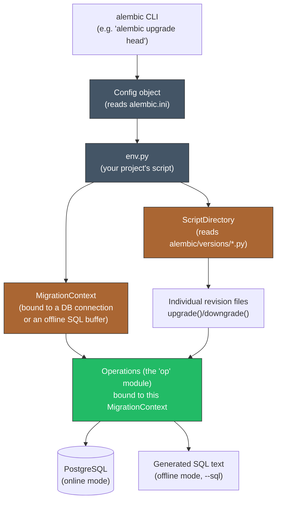
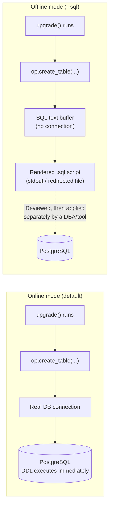
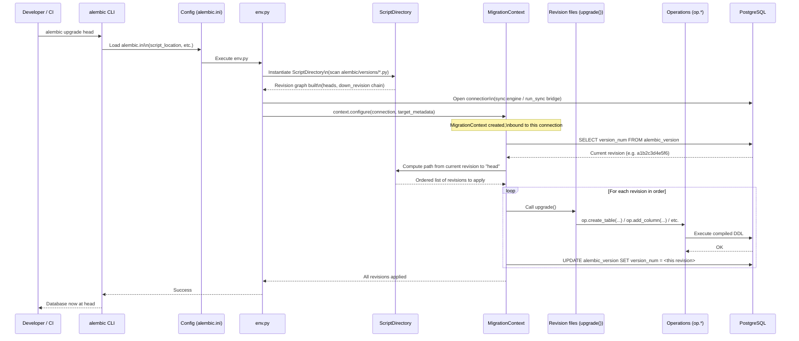

# Architecture & Internals

[Chapter 2](./02-core-concepts.md) gave you the vocabulary of Alembic's model — revision, `down_revision`, head, base, branch, merge point — using the migration graph as the mental picture for how a database's schema history is organized. That chapter treated `alembic upgrade head` as a black box: you run the command, and the database ends up at the newest revision. This chapter opens the box. We're going under the hood into the actual Python objects Alembic constructs at runtime — `ScriptDirectory`, `MigrationContext`, and the `Operations` class behind the `op.*` calls you'll start writing in Chapter 5 — how Alembic can run in two fundamentally different modes (offline, generating SQL text, versus online, executing directly against a live connection), and how `env.py` bridges all of this machinery to your actual SQLAlchemy `Base.metadata` and engine. Everything here is architecture-level understanding; Chapter 4 walks through building and configuring a real `env.py`/`alembic.ini` pair line by line, and this chapter is what makes that walkthrough make sense rather than feel like cargo-culting boilerplate.

---

## Learning Objectives

By the end of this chapter, you will be able to:

- Name Alembic's core runtime components — `ScriptDirectory`, `MigrationContext`, and `Operations` — and state what each one is responsible for.
- Explain what the `op` module actually is under the hood, and how `op.create_table(...)` reaches an `Operations` instance bound to a specific migration run.
- Distinguish offline mode (`--sql`) from online mode, explain what each produces, and state a concrete scenario where offline mode is the right choice.
- Explain, precisely, how `env.py` bridges Alembic's runtime to your SQLAlchemy `Base.metadata` and engine.
- Describe how responsibilities divide between `alembic.ini` (static configuration) and `env.py` (executable configuration/logic).
- Trace, step by step, everything that happens between running `alembic upgrade head` and the database being updated, and reproduce that trace as a sequence diagram.

---

## Prerequisites for This Chapter

This chapter builds directly on [Chapter 2: Core Concepts](./02-core-concepts.md). We assume you already know:

- The terminology of the migration graph: revision, `down_revision`, head, base, branch, merge point.
- The distinction between schema and data migrations, and why both are expressed as Alembic revisions.
- The "migrations are version control for your database" analogy, since several of this chapter's components map directly onto it (a `ScriptDirectory` is, loosely, Alembic's equivalent of Git's object database).
- ExpenseFlow's project skeleton and installed Alembic environment from [Chapter 1](./01-introduction-and-prerequisites.md), even though this chapter has not yet run `alembic init` against it — that command is Chapter 4's subject.

If any of that feels shaky, revisit Chapter 2 before continuing.

---

## 1. The Big Picture: Alembic's Component Map

Before naming individual classes, it helps to see how they fit together. Running any Alembic command assembles the same small set of collaborating objects, regardless of whether the command is `alembic upgrade head`, `alembic history`, or `alembic revision --autogenerate`:



Four ideas anchor this diagram, each expanded in its own section below:

1. **`Config`** reads `alembic.ini` and hands its settings to `env.py` — this is the thin, mostly-static configuration layer (Section 6).
2. **`ScriptDirectory`** is Alembic's view of the `alembic/versions/` folder as a navigable graph of revisions (Section 2).
3. **`MigrationContext`** is the runtime object that knows *how* to actually apply a migration step — against a live connection, or into an offline SQL buffer (Section 3, Section 5).
4. **`Operations`** (the `op` module you call inside `upgrade()`/`downgrade()`) is a thin, ergonomic wrapper that turns `op.create_table(...)`-style calls into the actual DDL, using whichever `MigrationContext` is currently active (Section 4).

`env.py` (Section 6) is the piece of code — yours, generated once by `alembic init` and then edited by your team — that wires all of this together for your specific project. It is not a magic file Alembic hides from you; it's ordinary Python you're expected to read and modify, and Chapter 4 walks through a full one line by line.

---

## 2. ScriptDirectory: Managing the Migration Files on Disk

`ScriptDirectory` is the component responsible for everything related to the `alembic/versions/` folder as a *collection of files that form a graph* — precisely the migration graph from Chapter 2, Section 4, now given a concrete implementation.

### 2.1 What it actually does

When Alembic needs to know things like "what is the current head?", "what's the chain of revisions between revision X and revision Y?", or "does a revision with this down_revision already exist (a branch)?", it asks `ScriptDirectory`, not the database. `ScriptDirectory`'s job is purely about the *files on disk* — it:

- Scans `alembic/versions/*.py` and parses out each file's `revision` and `down_revision` module-level variables (the ones introduced in Chapter 2, Section 3.2).
- Builds an in-memory graph from those pointers — exactly the linked-list/graph structure Chapter 2 drew with Mermaid diagrams, but as real Python objects.
- Answers graph queries: `get_heads()` (all current heads — plural, because branches are legal, Chapter 2 Section 4.2), `get_revision(rev_id)`, `walk_revisions(base, head)` (the ordered path between two points in the graph), and more.
- Knows how to generate a *new* revision file from the `script.py.mako` template (Chapter 4) when you run `alembic revision`, including picking a fresh unique revision ID and filling in the `down_revision` based on the current head(s).

### 2.2 Why this separation matters

Notice what `ScriptDirectory` deliberately does *not* know: it has no idea whether any of these revisions have actually been *applied* to any particular database. That's a completely separate question, answered by the `alembic_version` table (Chapter 9) via a live connection — a question `MigrationContext` (Section 3) is responsible for, not `ScriptDirectory`. This separation is precisely why commands like `alembic history` (which only needs to read files) can run instantly with zero database connection at all, while `alembic current` (which needs to know where a *specific* database actually is) requires connecting to that database and checking its `alembic_version` row. Keeping "what revisions exist and how do they connect" (files, `ScriptDirectory`) cleanly separate from "which one has this particular database actually applied" (database state, `MigrationContext`) is a deliberate architectural choice, not an accident — it's what lets the exact same `alembic/versions/` folder be applied consistently against a laptop, a CI database, staging, and production, each independently tracking its own current position.

---

## 3. MigrationContext: The Runtime Bridge to the Database

If `ScriptDirectory` answers "what revisions exist, and in what order?", `MigrationContext` answers the much more operational question: "given a target, what actually needs to happen right now, and how do I make it happen?"

### 3.1 What it holds

A `MigrationContext` is constructed once per Alembic run (inside `env.py`, via `context.configure(...)` — Section 6 shows the real call) and holds:

- **A connection to interact with** — either a live `sqlalchemy.engine.Connection` (online mode, Section 5) or an internal buffer that accumulates SQL text instead of executing it (offline mode, Section 5).
- **The current database's revision state** — read from the `alembic_version` table via that connection (online mode only; offline mode has no database to ask, and typically assumes a specific starting revision you supply explicitly).
- **Dialect information** — which SQL dialect (PostgreSQL, in ExpenseFlow's case) it needs to generate correct, backend-specific DDL for, since `ALTER COLUMN` syntax, `SERIAL` vs. identity columns, and other details genuinely differ between PostgreSQL, MySQL, and SQLite (a difference Chapter 13's batch mode exists specifically to paper over for SQLite).
- **Transaction/behavioral options** — such as whether to wrap the whole migration run in one transaction, run each revision in its own transaction, or (for a few PostgreSQL DDL statements that cannot run inside a transaction block at all, like adding an enum value — Chapter 12) run without one.

### 3.2 What it does during a run

When you run `alembic upgrade head`, the `MigrationContext` is what actually orchestrates applying each intervening revision: it consults `ScriptDirectory` for the ordered list of revisions between "where the database currently is" and "head," then, for each one in turn, invokes that revision's `upgrade()` function — which is where `Operations` (Section 4) comes in — and afterward updates the `alembic_version` table (online mode) to reflect the new current position, exactly as traced in Chapter 2's upgrade sequence diagram, now filled in with the real component doing that work.

---

## 4. The `op` Module and the `Operations` Class

Every migration file you'll write from Chapter 5 onward calls functions like `op.create_table(...)`, `op.add_column(...)`, and `op.drop_index(...)`. It's worth being precise about what `op` actually *is*, because the answer clarifies a lot of otherwise-mysterious behavior later.

### 4.1 `op` is a proxy, not a fixed object

`alembic.op` is a **module-level proxy** — when you write `from alembic import op` and then call `op.create_table(...)` inside a migration's `upgrade()` function, you are not calling a method on some globally fixed object. You're calling a method that, at the moment it actually executes, looks up the `Operations` instance associated with the `MigrationContext` currently running (Section 3), and dispatches the call to it. This is why `op` can be imported identically at the top of every single migration file, yet still correctly target whichever specific migration run (and whichever specific `MigrationContext` — online, offline, whatever database dialect) is currently in progress — the proxy indirection is what makes that possible without every migration file needing to receive an explicit context object as a function argument.

### 4.2 What `Operations` actually contains

The `Operations` class is a curated catalog of high-level, backend-portable methods that each compile down to one or more real DDL statements, dispatched through SQLAlchemy's DDL compiler for whichever dialect the current `MigrationContext` is targeting. A partial map, previewing the full catalog Chapter 8 covers operation by operation:

| `op.*` call | What it compiles to (conceptually) |
|---|---|
| `op.create_table("expenses", ...)` | `CREATE TABLE expenses (...)` |
| `op.add_column("expenses", sa.Column("currency", sa.String(3)))` | `ALTER TABLE expenses ADD COLUMN currency VARCHAR(3)` |
| `op.drop_column("expenses", "currency")` | `ALTER TABLE expenses DROP COLUMN currency` |
| `op.create_index("ix_expenses_user_id", "expenses", ["user_id"])` | `CREATE INDEX ix_expenses_user_id ON expenses (user_id)` |
| `op.create_foreign_key(...)` | `ALTER TABLE ... ADD CONSTRAINT ... FOREIGN KEY (...) REFERENCES ...` |
| `op.execute("CREATE EXTENSION IF NOT EXISTS pg_trgm")` | Raw SQL, passed through unchanged — the escape hatch for anything the catalog above doesn't cover (Chapter 12 uses this constantly for PostgreSQL-specific DDL) |

The value `Operations` adds over writing raw SQL yourself is real but bounded: it gives you a Pythonic, slightly more portable, slightly more typo-resistant interface over DDL you could always write by hand with `op.execute(...)` — it is not a query builder, an ORM, or a full DDL abstraction layer that hides every database's dialect differences from you. Chapter 12 is largely a chapter about exactly where that abstraction runs out (native `ENUM` handling, `JSONB` GIN indexes, `pg_trgm`) and `op.execute()` becomes the honest, correct tool.

---

## 5. Offline Mode vs. Online Mode

This is one of Alembic's most distinctive architectural features, and one every professional Alembic user needs to understand precisely rather than by vague reputation.

### 5.1 Online mode (the default)

In **online mode**, `env.py` opens a real `sqlalchemy.engine.Connection` to the target database, and the `MigrationContext` executes each `upgrade()`/`downgrade()` function's `op.*` calls directly against that live connection — DDL statements run immediately, in real time, against the real PostgreSQL instance. This is what happens by default when you run `alembic upgrade head` with no extra flags, and it's how the overwhelming majority of day-to-day development and CI usage works.

### 5.2 Offline mode (`--sql`)

In **offline mode**, invoked with the `--sql` flag (e.g. `alembic upgrade head --sql`), Alembic never opens a real connection to execute anything. Instead, the `MigrationContext` is configured against a SQL-text buffer: every `op.*` call still runs, but instead of executing its generated DDL against a live connection, that DDL is rendered as literal SQL text and written to stdout (or redirected to a file). The result is a **reviewable `.sql` script** — a plain, human-readable file containing exactly the statements that *would* run, in exact order, that a DBA or a formal change-review process can read, approve, and — separately, using its own tooling — apply to the actual database at a later, controlled time.



### 5.3 When offline mode is the right choice

- **Regulated environments requiring a formal, human-reviewed change record before any production DDL runs** — offline mode produces exactly that artifact, generated from the same migration files (and thus guaranteed consistent with) what online mode would have executed directly.
- **Environments where the machine running Alembic has no direct network access to the production database**, but does have access to the migration files — generate the SQL offline, hand it to whoever/whatever *does* have production access.
- **Producing a script to be applied through a separate deployment/change-management tool** that isn't Alembic itself, while still authoring and versioning the migrations in Alembic.

Chapter 6 shows the exact command syntax and a worked example generating a reviewable script for ExpenseFlow's first two tables. For now, the architectural point to hold onto is: **the same `upgrade()`/`downgrade()` Python code produces either real, immediate DDL execution or a text artifact for later execution, purely depending on which kind of `MigrationContext` `env.py` constructs** — nothing about the migration file itself needs to change or know which mode it's running under.

### 5.4 A key limitation of offline mode

Offline mode has one important constraint worth flagging now: because there's no live connection, Alembic cannot query the database for anything at runtime — no reading existing data to decide what to do, no reflecting an existing table's current structure. Migrations that rely on data migrations reading current row values (Chapter 11), or on `--autogenerate`'s live-database comparison (Chapter 7, which fundamentally requires a real connection to reflect against), simply don't apply in offline mode the same way. Offline mode is primarily suited to pure schema changes whose DDL doesn't depend on the database's current contents.

---

## 6. `env.py`: Where Alembic Meets Your SQLAlchemy Models

Every component described so far — `ScriptDirectory`, `MigrationContext`, `Operations`, online/offline mode — is generic Alembic machinery that knows nothing about ExpenseFlow specifically. `env.py` is the file, generated once by `alembic init` and owned by your project from then on, that connects that generic machinery to *your* actual SQLAlchemy setup: your `Base.metadata`, your database URL, your specific choice of online or offline configuration.

### 6.1 The two things `env.py` must supply

Stripped to its essence, `env.py` has exactly two jobs:

1. **Tell Alembic what your "target" schema looks like**, by handing it `target_metadata` — almost always your project's `Base.metadata` object (ExpenseFlow's, from `app/models.py`). This is what `--autogenerate` (Chapter 7) compares the live database against to compute a diff, and it's part of what `context.configure(...)` receives.
2. **Tell Alembic how to obtain a connection (or configure an offline buffer)**, using your project's actual database URL — read from an environment variable or your application's settings object in a real project, never hardcoded (Chapter 4 covers this specifically, since a hardcoded URL is one of the most common early Alembic misconfigurations).

A trimmed, illustrative shape of what `env.py` does — Chapter 4 walks the *complete*, real file line by line, including the async-engine handling flagged in Chapter 1:

```python
# alembic/env.py (illustrative excerpt — full version in Chapter 4)
from alembic import context
from app.models import Base  # ExpenseFlow's declarative Base
from app.config import get_database_url  # reads from env vars/settings, not hardcoded

target_metadata = Base.metadata


def run_migrations_offline() -> None:
    url = get_database_url()
    context.configure(
        url=url,
        target_metadata=target_metadata,
        literal_binds=True,
    )
    with context.begin_transaction():
        context.run_migrations()


def run_migrations_online() -> None:
    # Real version in Chapter 4 handles the async-engine bridge via run_sync
    connectable = create_sync_engine_for_migrations()
    with connectable.connect() as connection:
        context.configure(connection=connection, target_metadata=target_metadata)
        with context.begin_transaction():
            context.run_migrations()


if context.is_offline_mode():
    run_migrations_offline()
else:
    run_migrations_online()
```

Two calls here are the entire bridge described in Section 1's diagram: `context.configure(...)` is what constructs the `MigrationContext` (Section 3), wiring in either a live `connection` (online) or a `url` plus `literal_binds=True` (offline, Section 5.2's SQL-text buffer), along with `target_metadata`. `context.run_migrations()` is what then hands control to `ScriptDirectory` and `Operations` to actually walk the revision chain and execute each `upgrade()`/`downgrade()`.

### 6.2 The async engine detail, honestly

Chapter 1 flagged this and it's worth reinforcing here architecturally: `MigrationContext` and `Operations` are built around SQLAlchemy's **synchronous** connection/execution model. ExpenseFlow's application uses an async engine (`asyncpg`, via `create_async_engine`) because the FastAPI app itself is async end-to-end — but `env.py`'s `run_migrations_online()` typically either (a) uses a plain synchronous engine and driver (e.g., `psycopg2`) constructed independently just for migrations, or (b) bridges an async engine into a sync call using SQLAlchemy's `AsyncEngine.run_sync(...)`. Neither approach is a workaround or a hack — it's simply that Alembic's execution model predates, and has not been rewritten around, SQLAlchemy's async engine support, and the project has been explicit that migrations are expected to run synchronously even in async applications. Chapter 4 shows both real patterns in full; the architectural point for this chapter is just that `env.py` is where this bridging decision is made, once, for your whole project.

---

## 7. `alembic.ini` vs. `env.py`: Dividing Responsibilities

New users frequently ask which file is "the config" — the honest answer is both are, but they divide responsibilities cleanly, and understanding that division prevents a lot of confused edits to the wrong file later.

| | `alembic.ini` | `env.py` |
|---|---|---|
| **Nature** | Static configuration (an INI file) | Executable Python code |
| **Read by** | The `Config` object, at CLI startup (Section 1's diagram) | Alembic's runtime, on every command |
| **Typical contents** | `script_location`, a fallback `sqlalchemy.url`, `file_template`, logging configuration | `target_metadata`, database-URL resolution logic, `run_migrations_online`/`offline`, `context.configure(...)` calls |
| **Can contain logic/branching?** | No — it's declarative key-value configuration | Yes — full Python: conditionals, imports, environment-variable reads, async bridging |
| **Typically edited how often** | Rarely, after initial setup | Occasionally, as your project's config/connection needs evolve |
| **A real project usually...** | Keeps `sqlalchemy.url` out entirely, or leaves a clearly-fake placeholder | Overrides the URL at runtime from environment variables/app settings (Chapter 4) |

The practical rule of thumb: if the setting is a fixed, simple string (where your migration files live, how generated filenames are named), it belongs in `alembic.ini`. If the setting requires *logic* — reading an environment variable, choosing between offline/online behavior, bridging async to sync — it belongs in `env.py`, because `alembic.ini` has no way to express logic at all. Chapter 4 covers every commonly-used field in both files exhaustively; this chapter's goal was just to make the division itself make sense architecturally before you memorize field names.

---

## 8. End-to-End Trace: What Happens When You Run `alembic upgrade head`

Bringing every component from this chapter together, here is the complete, accurate sequence of what happens, in order, when a developer runs `alembic upgrade head` against ExpenseFlow's database in the ordinary (online) case:



Walking through it once more in prose, tying every step back to the section that explains it:

1. **The CLI loads `alembic.ini`** (Section 7) via a `Config` object — this tells it, among other things, where `env.py` and the `alembic/versions/` folder live.
2. **`env.py` executes** (Section 6) — your project's bridging code runs, importing `target_metadata` from `app.models.Base` and resolving the actual database connection.
3. **`ScriptDirectory` scans and parses every revision file** (Section 2), building the in-memory graph of revisions and identifying the current head.
4. **`env.py` opens a real connection and calls `context.configure(...)`**, which constructs the `MigrationContext` (Section 3) bound to that connection.
5. **`MigrationContext` reads the `alembic_version` table** to find out where this specific database currently is (Chapter 9 covers this table in full) — this is the one step in the whole trace that requires talking to the database *before* any migration runs.
6. **`MigrationContext` asks `ScriptDirectory` for the ordered path** from the current revision to `head` — this is Chapter 2's migration graph, walked programmatically.
7. **For each revision in that path, its `upgrade()` function runs**, and every `op.*` call inside it dispatches through the `Operations` proxy (Section 4) to compile and execute real DDL against the connection.
8. **After each individual revision succeeds, `alembic_version` is updated** to that revision's ID — meaning if the process is interrupted partway through a multi-revision upgrade, the database's recorded position accurately reflects exactly how far it got, not "all or nothing" across the whole run (though each *individual* revision's statements are typically wrapped in one transaction, per Section 3.1's transaction-configuration options).
9. **Once every revision up to `head` has applied successfully, control returns to the CLI**, which reports success to the developer or CI system that invoked it.

This is the trace to have fully internalized before Chapter 4, because Chapter 4's line-by-line `env.py` walkthrough is, in effect, showing you the real code behind steps 2 and 4 of this exact sequence.

---

## Real-World Scenario

Dana (the new hire from Chapter 1's and Chapter 2's scenarios) is now three weeks into using Alembic day to day and hits something confusing: a migration that works perfectly on her local Docker Postgres fails in ExpenseFlow's CI pipeline with a mysterious connection error, even though the migration file itself hasn't changed. Priya asks her to walk through what she thinks is happening, using this chapter's model rather than guessing.

Dana traces it correctly: the CLI loads `alembic.ini` and executes `env.py` (Section 6) exactly the same way locally and in CI — so the difference isn't in *that* part. The actual difference turns out to be in step 4 of Section 8's trace: `env.py` resolves the database URL from an environment variable, and CI's environment variable was pointing at a database hostname that only resolves inside the CI runner's own Docker network, not the one her local `env.py` assumed. Because `env.py` is ordinary, inspectable Python — not an opaque Alembic internal — she can put a `print(url)` right before the `connectable.connect()` call and immediately see the exact wrong URL being used in CI's logs.

This is precisely the payoff of understanding architecture over memorizing commands: Dana doesn't need to know an "Alembic CI troubleshooting checklist" by rote, because she understands *which* component (Section 6's `env.py`, specifically the URL-resolution logic) is responsible for the exact thing that differs between the two environments, and she knows exactly where in the sequence (Section 8, step 4) that resolution happens relative to everything else. Priya notes this is exactly why Chapter 3 exists in this course before Chapter 4's mechanical walkthrough — the mechanics are far easier to debug once you know what each piece is *for*.

---

## Best Practices

- **Learn the component map (Section 1) before memorizing `env.py` boilerplate** — understanding what `ScriptDirectory`, `MigrationContext`, and `Operations` each do turns "copy this file from the docs" into "I can explain and modify this file," which pays off the first time something doesn't work as expected.
- **Reach for offline mode (`--sql`) deliberately, not habitually**, for the specific scenarios in Section 5.3 (formal DBA review, no direct production connectivity) — for ordinary development and CI, online mode's directness is simpler and sufficient.
- **Never hardcode a database URL inside `env.py`.** Resolve it from an environment variable or your application's settings object (Section 6.1, point 2) — Chapter 4 shows the concrete pattern, and Chapter 15's CI/CD pipeline depends entirely on this being configurable per environment.
- **Remember that `op` is a proxy bound to the currently running `MigrationContext` (Section 4.1)**, not a fixed global — this explains why the exact same `from alembic import op` import at the top of every migration file correctly targets whichever database/mode is currently active.
- **Treat `alembic.ini` as declarative and `env.py` as where logic belongs (Section 7)** — if you find yourself wanting to add a conditional or read an environment variable inside `alembic.ini`, that's a sign the logic belongs in `env.py` instead.

---

## Common Mistakes

- **Assuming `alembic upgrade head` "just runs SQL files"** and never learning what `ScriptDirectory`/`MigrationContext` actually do — this leaves you unable to explain (or debug) anything that isn't a simple, happy-path linear upgrade, including branches, offline mode, or async-engine bridging issues.
- **Hardcoding a database URL directly inside `env.py`**, which then silently uses the wrong database the moment the same `env.py` runs in a different environment (staging vs. production) — exactly the bug in this chapter's Real-World Scenario.
- **Expecting offline mode (`--sql`) to work for data migrations or autogenerate**, not realizing Section 5.4's limitation that offline mode has no live connection to read existing data or reflect the current schema against.
- **Treating `op.execute("...")` as a last resort to be avoided at all costs**, rather than recognizing it as the correct, honest tool for DDL the `Operations` catalog doesn't cover (Section 4.2) — PostgreSQL-specific features in Chapter 12 rely on it constantly and appropriately.
- **Forgetting that Alembic's execution model is fundamentally synchronous**, and being surprised when a naive attempt to call `op.*` methods from inside genuinely async code doesn't work — Section 6.2's `run_sync` bridge (fully demonstrated in Chapter 4) is the correct pattern, not something to route around.

---

## Summary

- Alembic's runtime assembles four core collaborators on every command: `Config` (reads `alembic.ini`), `env.py` (your project's bridging code), `ScriptDirectory` (the revision graph on disk), and `MigrationContext` (the live execution engine) — Section 1.
- `ScriptDirectory` answers "what revisions exist and how do they connect," purely from files on disk, with no knowledge of any specific database's applied state (Section 2).
- `MigrationContext` answers "what does this specific database need, and how do I make it happen," bridging the revision graph to either a live connection or an offline SQL buffer (Section 3).
- `op` is a proxy that dispatches to an `Operations` instance bound to the currently active `MigrationContext`, compiling high-level calls like `op.create_table(...)` into real, dialect-specific DDL — with `op.execute(...)` as the escape hatch for anything the catalog doesn't cover (Section 4).
- **Online mode** executes DDL directly against a live connection; **offline mode** (`--sql`) renders the same migration code as reviewable SQL text instead, useful for DBA review or environments without direct database access — but it can't do anything requiring a live read of current data (Section 5).
- `env.py` supplies `target_metadata` (your `Base.metadata`) and the connection/URL logic, including the honest reality that Alembic's execution model is synchronous even in fully async applications (Section 6).
- `alembic.ini` holds static, declarative configuration; `env.py` holds executable logic — if a setting needs a conditional or an environment-variable read, it belongs in `env.py` (Section 7).
- Running `alembic upgrade head` is a precise, traceable sequence: load config, run `env.py`, scan revisions, open a connection, read `alembic_version`, compute the path to head, and apply each revision's `upgrade()` in order, updating `alembic_version` after each one (Section 8).

---

## Knowledge Check

1. Name the three core runtime components introduced in this chapter and, in one sentence each, state what each is responsible for.
2. Why can `alembic history` run without ever connecting to a database, while `alembic current` cannot?
3. Explain what `op` actually is, mechanically, and why the same `from alembic import op` import line works correctly inside every migration file regardless of which database or mode is currently active.
4. Give a concrete scenario, different from the ones listed in Section 5.3, where offline mode (`--sql`) would be the right choice, and explain why online mode wouldn't work as well there.
5. Why can't offline mode be used for a data migration that needs to read existing row values before deciding what to write?
6. A teammate hardcodes `sqlalchemy.url` directly into `env.py` with the local Docker Postgres connection string. Explain, using this chapter's trace of `alembic upgrade head`, exactly where and how this will cause a problem the first time it runs against staging or CI.
7. Walk through, from memory, the nine-step trace in Section 8, for a database that is already three revisions behind head.

---

## Hands-On Exercise

This exercise makes the architecture in this chapter tangible without yet building a full `env.py` (Chapter 4 does that formally). You will inspect Alembic's actual source to connect the concepts to real code.

1. **Locate Alembic's installed source** in your project's virtual environment (from Chapter 1's setup):
   ```bash
   python -c "import alembic; print(alembic.__file__)"
   ```

2. **Find the `ScriptDirectory` class** and skim its docstring and public methods:
   ```bash
   python -c "from alembic.script import ScriptDirectory; help(ScriptDirectory)" | head -60
   ```
   Identify the methods that correspond to Section 2's description — look specifically for `get_heads()` and `walk_revisions()`.

3. **Find the `MigrationContext` class** the same way:
   ```bash
   python -c "from alembic.runtime.migration import MigrationContext; help(MigrationContext)" | head -60
   ```
   Look for `configure(...)` — the exact method `env.py` calls, per Section 6.1.

4. **Find the `Operations` class** and count how many `op.*` methods it exposes:
   ```bash
   python -c "from alembic.operations import Operations; print([m for m in dir(Operations) if not m.startswith('_')])"
   ```
   Compare this list against the partial catalog in Section 4.2's table — notice how much larger the real catalog is; Chapter 8 works through the operations you'll use most.

5. **Read `alembic`'s own generated `env.py` template**, without running `alembic init` yet: find `alembic/templates/generic/env.py.mako` inside the installed package (use the path from step 1 to locate it), and identify the `run_migrations_offline()` and `run_migrations_online()` functions. Confirm they match the shape shown in Section 6.1.

6. **Write a two-paragraph note to yourself** (in a scratch file, not committed anywhere) explaining, in your own words: (a) what would break if `ScriptDirectory` and `MigrationContext` were merged into one object instead of being kept separate, and (b) why `op` needs to be a proxy rather than a plain object imported once at module load time. This is a comprehension check, not a graded exercise — but if you can't write both paragraphs confidently, revisit Sections 2–4 before Chapter 4.

---

## Further Reading

- [Alembic Official Documentation](https://alembic.sqlalchemy.org/en/latest/) — the canonical reference; its "API" section documents `ScriptDirectory`, `MigrationContext`, and `Operations` directly.
- [Alembic Tutorial](https://alembic.sqlalchemy.org/en/latest/tutorial.html) — includes the generated `env.py` this chapter previewed in Section 6, expanded fully in Chapter 4.
- [Alembic Cookbook](https://alembic.sqlalchemy.org/en/latest/cookbook.html) — includes recipes for offline-mode generation and custom `env.py` configurations referenced in Section 5.
- [Alembic Operation Reference (`op.*`)](https://alembic.sqlalchemy.org/en/latest/ops.html) — the full, authoritative catalog behind Section 4.2's partial table.
- [Alembic GitHub Repository](https://github.com/sqlalchemy/alembic) — the actual source code for `ScriptDirectory`, `MigrationContext`, and `Operations` explored in this chapter's Hands-On Exercise.

---

<div style="display:flex;justify-content:space-between;align-items:center;">
  <a href="./02-core-concepts.md">← Previous: Core Concepts</a>
  <a href="./00-index.md">🏠 Index</a>
  <a href="./04-migration-environment-env-py.md">Next: The Migration Environment: env.py & alembic.ini →</a>
</div>
