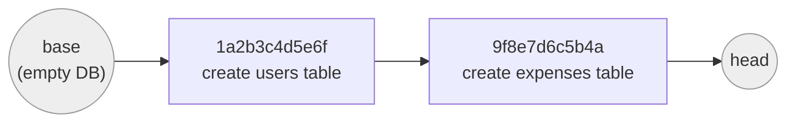

# Revisions & Version History

[Chapter 4](./04-migration-environment-env-py.md) left ExpenseFlow with a fully wired migration environment — `env.py` reading the database URL from application settings, `target_metadata` pointing at `Base.metadata`, and an empty `versions/` directory waiting for its first file. Nothing has actually been versioned yet: the `users` and `expenses` tables exist only as Python model classes, with no recorded history of how they came to be. This chapter creates that history. We'll run `alembic revision` for real, look at exactly what Alembic generates and why, learn the four inspection commands you'll run dozens of times a week (`history`, `current`, `heads`, `show`), and build the mental model of the migration graph as a literal linked list — the structure [Chapter 6](./06-upgrade-and-downgrade.md) then walks forward and backward through.

---

## Learning Objectives

By the end of this chapter, you will be able to:

- Create a new migration file with `alembic revision -m "..."` and explain what each generated field means.
- Explain how Alembic generates revision IDs and configure the `file_template` that controls resulting filenames.
- Trace the `down_revision` chain that links migration files together into an ordered sequence.
- Use `alembic history`, `alembic current`, `alembic heads`, and `alembic show <rev>` to inspect a migration graph's state.
- Read any migration file's anatomy — `revision`, `down_revision`, `branch_labels`, `depends_on`, `upgrade()`, `downgrade()` — and explain the purpose of each.
- Draw and interpret the migration graph as a linked list, including what a "head" is and why there's normally exactly one.
- Create ExpenseFlow's first two real revisions — `users` and `expenses` — and inspect the resulting two-node graph.

---

## Prerequisites for This Chapter

This chapter builds directly on [Chapter 4: The Migration Environment](./04-migration-environment-env-py.md). You'll need:

- A working `alembic.ini` and `env.py`, wired to ExpenseFlow's `Base.metadata` and reading the connection URL from settings, exactly as built in Chapter 4.
- A running local PostgreSQL instance the migration environment can connect to.
- The vocabulary from [Chapter 2: Core Concepts](./02-core-concepts.md) — *revision*, *upgrade*, *downgrade*, *head*, *base* — since this chapter uses those terms without re-defining them.

---

## 1. Creating a Revision

A revision is created with the `alembic revision` command, always with a `-m` message describing what the revision does:

```bash
alembic revision -m "create users table"
```

Alembic responds with something like:

```
Generating /path/to/expenseflow/alembic/versions/20260701_1a2b3c4d5e6f_create_users_table.py ... done
```

This is the entire mechanism by which a new, empty migration script gets written to disk, rendered from `script.py.mako` (Chapter 4, Section 6). Nothing has run against the database yet — `alembic revision` never touches a live connection or executes any SQL; it only creates a file. The file starts with empty `upgrade()`/`downgrade()` bodies (`pass`), which you then fill in by hand — exactly the workflow [Chapter 8](./08-writing-manual-migrations.md) covers in depth. (`alembic revision --autogenerate`, which pre-fills those bodies by diffing your models against the live database, is [Chapter 7](./07-autogenerate-migrations.md)'s subject — this chapter deliberately stays with plain, manual `alembic revision` so the mechanics of revisions themselves stay in focus.)

### 1.1 What "revision" actually means

Every migration file represents exactly one **revision** — one node in the migration graph, uniquely identified by a **revision ID**. A revision is simultaneously three things at once, and it's worth holding all three in mind:

1. **A file on disk**, in `alembic/versions/`, containing `upgrade()` and `downgrade()` Python functions.
2. **A node in a directed graph**, connected to the revision that came before it (its `down_revision`).
3. **A possible value stored in the database**, in the `alembic_version` table (Chapter 9), representing "the database schema currently matches whatever this revision left it in."

Nothing forces those three to stay in sync automatically — that's precisely why the rest of this chapter's inspection commands (`current`, `heads`, `history`) exist: to let you compare "what files exist" against "what state the database claims to be in."

---

## 2. Revision ID Generation

By default, Alembic generates each revision's ID as a random 12-character lowercase hexadecimal string — for example `1a2b3c4d5e6f`. This is deliberate: a random ID has no inherent ordering information baked into it. **Alembic does not use revision IDs to determine sequence** — sequence comes entirely from the `down_revision` chain (Section 3), not from comparing ID values alphabetically or numerically. Two revisions with IDs `9f8e7d6c5b4a` and `1a2b3c4d5e6f` might be in either order in the actual chain; you cannot tell by looking at the IDs themselves, only by following `down_revision` pointers.

This is a common point of confusion for anyone coming from a migration tool that uses sequential integers (Django's numbered migrations, or Rails' timestamp-prefixed files) as the *actual* ordering mechanism. Alembic's `file_template` setting (Chapter 4, Section 3) can make filenames *look* chronologically sortable — ExpenseFlow's `%%(year)d%%(month).2d%%(day).2d_%%(rev)s_%%(slug)s` template produces filenames like `20260701_1a2b3c4d5e6f_create_users_table.py`, which happen to sort correctly in a directory listing — but that's a filename convenience for humans scanning `ls alembic/versions/`, not something Alembic itself relies on. Alembic determines the true migration order by reading each file's `down_revision` value and walking the graph, regardless of what the file is named or when it was created.

### 2.1 Overriding the generated ID

You can pass an explicit ID instead of accepting the random one:

```bash
alembic revision --rev-id create_users_table -m "create users table"
```

Some teams do this to get short, memorable, hand-chosen IDs. ExpenseFlow's team sticks with Alembic's random default — with `file_template` already encoding the date and a readable slug, a memorable ID adds little, and hand-picking IDs across a team raises the odds of an accidental collision that random 12-character hex strings make vanishingly unlikely.

---

## 3. The `down_revision` Chain

Open the file `alembic revision -m "create users table"` just generated:

```python
"""create users table

Revision ID: 1a2b3c4d5e6f
Revises:
Create Date: 2026-07-01 09:14:22.184213

"""
from typing import Sequence, Union

from alembic import op
import sqlalchemy as sa

# revision identifiers, used by Alembic.
revision: str = "1a2b3c4d5e6f"
down_revision: Union[str, None] = None
branch_labels: Union[str, Sequence[str], None] = None
depends_on: Union[str, Sequence[str], None] = None


def upgrade() -> None:
    pass


def downgrade() -> None:
    pass
```

`down_revision: Union[str, None] = None` is the key line: `None` means this revision has no predecessor — it is the **base** of the migration graph, the very first migration that will run against a brand-new, empty database. Every migration graph has exactly one revision with `down_revision = None` (barring the multi-root edge cases Chapter 10 discusses), and it's always the one that runs first.

Now fill in the `upgrade()`/`downgrade()` bodies for the `users` table:

```python
def upgrade() -> None:
    op.create_table(
        "users",
        sa.Column("id", sa.Integer(), primary_key=True),
        sa.Column("email", sa.String(length=255), nullable=False),
        sa.Column("hashed_password", sa.String(length=255), nullable=False),
        sa.Column(
            "created_at",
            sa.DateTime(timezone=True),
            server_default=sa.text("now()"),
            nullable=False,
        ),
    )
    op.create_index(op.f("ix_users_email"), "users", ["email"], unique=True)


def downgrade() -> None:
    op.drop_index(op.f("ix_users_email"), table_name="users")
    op.drop_table("users")
```

Now create a second revision for `expenses`:

```bash
alembic revision -m "create expenses table"
```

Alembic writes a new file — and this time, `down_revision` is not `None`:

```python
"""create expenses table

Revision ID: 9f8e7d6c5b4a
Revises: 1a2b3c4d5e6f
Create Date: 2026-07-01 09:31:07.552891

"""
from typing import Sequence, Union

from alembic import op
import sqlalchemy as sa

# revision identifiers, used by Alembic.
revision: str = "9f8e7d6c5b4a"
down_revision: Union[str, None] = "1a2b3c4d5e6f"
branch_labels: Union[str, Sequence[str], None] = None
depends_on: Union[str, Sequence[str], None] = None


def upgrade() -> None:
    op.create_table(
        "expenses",
        sa.Column("id", sa.Integer(), primary_key=True),
        sa.Column("user_id", sa.Integer(), nullable=False),
        sa.Column("amount_cents", sa.Integer(), nullable=False),
        sa.Column("currency", sa.String(length=3), nullable=False),
        sa.Column("description", sa.String(length=500), nullable=True),
        sa.Column("expense_date", sa.Date(), nullable=False),
        sa.Column(
            "created_at",
            sa.DateTime(timezone=True),
            server_default=sa.text("now()"),
            nullable=False,
        ),
        sa.ForeignKeyConstraint(["user_id"], ["users.id"], ondelete="CASCADE"),
    )
    op.create_index(op.f("ix_expenses_user_id"), "expenses", ["user_id"], unique=False)


def downgrade() -> None:
    op.drop_index(op.f("ix_expenses_user_id"), table_name="expenses")
    op.drop_table("expenses")
```

`down_revision: Union[str, None] = "1a2b3c4d5e6f"` is the entire mechanism: this file's `down_revision` value is literally, textually, the previous file's `revision` value. Alembic constructs the whole migration graph by reading every file in `versions/`, and linking each one to whichever file has a `revision` matching its `down_revision`. There is no separate index, no database lookup, no ordering metadata anywhere else — just this one string field, copied from one file into the next.

Notice, too, the ordering dependency this encodes at the SQL level: `expenses.user_id` has a foreign key to `users.id`, so the `create_table` for `expenses` must run *after* the `create_table` for `users` — which is exactly what the `down_revision` chain guarantees, since Alembic always applies `1a2b3c4d5e6f` (users) before `9f8e7d6c5b4a` (expenses). Chapter 8 returns to this ordering concern in more general form (create table before FK referencing it, drop FK before dropping referenced table).

---

## 4. The Migration Graph as a Linked List

With these two files, ExpenseFlow's migration graph looks like this:



This is, structurally, exactly a singly linked list: each node (revision) points to exactly one predecessor via `down_revision`, the same way a linked-list node points to the previous node via a `prev` pointer. "Base" is the conceptual position before any revision has been applied — an empty database, or one that has never run any ExpenseFlow migration. "Head" is the conceptual position after the *last* revision in the chain has been applied — the most current possible schema state. Chapter 6 spends its entire chapter on moving a real database back and forth along exactly this line: `alembic upgrade head` walks forward from wherever the database currently sits to the end of the chain; `alembic downgrade base` walks all the way back to the empty start.

Right now, with only two revisions, there is exactly one head: `9f8e7d6c5b4a`. Chapter 9 and Chapter 10 explore what happens when two developers each add a revision on top of the same predecessor — the graph stops being a simple linked list and becomes a tree with two heads, which is precisely the scenario `alembic merge` (Chapter 10) resolves. For now, with ExpenseFlow's straightforward two-table history, "linked list" is the exactly correct mental model, not a simplification you'll have to unlearn later — it's simply the special case of the general graph where every revision has exactly one predecessor and one successor.

---

## 5. Inspecting the Graph: `history`, `current`, `heads`, `show`

Four read-only commands let you inspect the state of the migration graph and the database's position within it, without changing anything.

| Command | What it reports | Reads from |
|---|---|---|
| `alembic history` | Every revision in the graph, in order, with messages | `versions/` files only — no database connection needed |
| `alembic current` | Which revision(s) the connected database is currently stamped at | The `alembic_version` table in the live database (Chapter 9) |
| `alembic heads` | Every revision with no successor (normally exactly one) | `versions/` files only |
| `alembic show <rev>` | Full detail for one specific revision | `versions/` files only |

### 5.1 `alembic history`

```bash
alembic history
```

```
1a2b3c4d5e6f -> 9f8e7d6c5b4a (head), create expenses table
                          <base> -> 1a2b3c4d5e6f, create users table
```

Add `--verbose` for the full detail of every revision (including `Path:`, full docstring, and file location) in one command:

```bash
alembic history --verbose
```

Note the arrow direction: `1a2b3c4d5e6f -> 9f8e7d6c5b4a` reads as "revision `1a2b3c4d5e6f` is followed by revision `9f8e7d6c5b4a`" — i.e., left is the older/predecessor revision, right is the newer/successor revision, matching the `down_revision` relationship (the expenses revision's `down_revision` is the users revision's ID). `(head)` marks the revision with no successor — the end of the chain as it currently exists on disk.

### 5.2 `alembic current`

```bash
alembic current
```

Against a freshly created, empty ExpenseFlow database (before Chapter 6 runs any `upgrade`), this prints nothing at all — there is no row yet in `alembic_version`, because no migration has ever been applied. After running `alembic upgrade head` (Chapter 6), it would print:

```
9f8e7d6c5b4a (head)
```

This is the command you run when you're not sure what state a given database is in — a staging environment nobody's touched in a week, a teammate's local database, a freshly restored production backup. It answers "where, in the graph, does *this specific database* currently sit?" — a question `alembic history` cannot answer on its own, since `history` only knows about files, not any particular database's state.

### 5.3 `alembic heads`

```bash
alembic heads
```

```
9f8e7d6c5b4a (head)
```

With ExpenseFlow's simple two-revision chain, this returns exactly one line — exactly one head, as expected of a clean linked-list graph. The moment this command ever returns *more than one line*, you have a branching situation (Chapter 10) that needs a merge revision before you can safely run `alembic upgrade head` on any database that might be at either branch — `head` (singular) becomes ambiguous when there are multiple heads, and Alembic will refuse to guess which one you meant.

### 5.4 `alembic show <rev>`

```bash
alembic show 9f8e7d6c5b4a
```

```
Rev: 9f8e7d6c5b4a (head)
Parent: 1a2b3c4d5e6f
Path: alembic/versions/20260701_9f8e7d6c5b4a_create_expenses_table.py

    create expenses table

    Revision ID: 9f8e7d6c5b4a
    Revises: 1a2b3c4d5e6f
    Create Date: 2026-07-01 09:31:07.552891
```

You'll reach for `show` most often when a teammate mentions a revision ID in a PR review or an incident channel and you need to see exactly what it does without hunting through `versions/` by filename.

You can also reference revisions relatively rather than by full ID — `alembic show head`, `alembic current`, and (as Chapter 6 covers in depth) `alembic upgrade +1` all accept symbolic references (`head`, `base`, `current`, `+N`, `-N`) instead of requiring you to type out a 12-character hex string every time.

---

## 6. Migration File Anatomy, Field by Field

Having now seen two real, filled-in files, here is every field that appears at the top of a migration script, with its exact purpose:

| Field | Type | Purpose |
|---|---|---|
| `revision` | `str` | This file's own unique ID — matches the filename's ID segment and whatever an earlier `alembic revision` invocation generated. |
| `down_revision` | `str \| None` | The ID of the revision this one follows. `None` marks the base of the graph. This is the field the entire chain is built from (Section 3). |
| `branch_labels` | `str \| Sequence[str] \| None` | An optional human-readable label attached to a branch, used with multi-root graphs (Chapter 10) so you can refer to "the receipts branch" instead of a raw hex ID. Unused — `None` — in ExpenseFlow's current single-chain history. |
| `depends_on` | `str \| Sequence[str] \| None` | An optional *additional* dependency beyond `down_revision` — used when a revision requires another revision to have already run, even though it isn't directly "after" it in the same branch. A Chapter 10/11 topic; unused so far. |
| `upgrade()` | function | The `op.*` calls that move the schema *forward* — from this revision's predecessor to this revision. |
| `downgrade()` | function | The `op.*` calls that undo `upgrade()` — moving the schema back from this revision to its predecessor. Section 7 explains why this deserves real attention, not a lazy `pass`. |

The module-level docstring (`"""create expenses table\n\nRevision ID: ...\n..."""`) is purely informational — Alembic doesn't parse it for anything functionally significant, but tools like `alembic show` and `alembic history --verbose` display it, and IDE tooling/`git log`/GitHub diffs benefit from it being accurate and specific, not a copy-pasted placeholder.

---

## Real-World Scenario

Three weeks after ExpenseFlow's first two revisions ship, a new backend engineer joins the team and, on their first day, checks out the repository, sees an empty local Postgres instance, and asks in Slack: "do I need to run some setup script to get the schema created, or is there a seed file somewhere?" A teammate answers with three commands:

```bash
alembic current    # (nothing printed — empty DB, no revisions applied yet)
alembic history    # shows the full two-revision chain, in order, with messages
alembic upgrade head   # Chapter 6's command — applies both revisions in sequence
```

The new engineer runs all three, and within thirty seconds has a fully structured `users`/`expenses` schema, indexes and foreign key included, with zero manual SQL and zero "ask someone for the schema dump" back-and-forth. `alembic history` alone answered "what has this project's schema been through, and in what order" — reading exactly like a condensed `git log` for the database — without anyone needing to open a single migration file to understand the sequence of events.

A month later, that same history becomes useful for an entirely different reason: a production incident report needs to state precisely what schema version was live at the time of an outage. `alembic current`, run against a snapshot of the production database taken just before the incident, returns a single revision ID. Cross-referencing that ID against `alembic history --verbose` immediately tells the incident review "the `expenses` table's foreign key and index were in place; the `categories` table (added in a later revision, per Chapter 7) was not yet." That single ID, stored in one row of `alembic_version` (Chapter 9), is doing the job that would otherwise require someone's memory of "which sprint did we ship that in" — a question that scales badly and is exactly the kind of ambiguity structured version history exists to eliminate.

---

## Best Practices

- **Write a specific, descriptive `-m` message for every revision** — `"create expenses table"`, not `"update schema"` or `"fixes"`. `alembic history` is only as useful as the messages in it.
- **Keep one logical schema change per revision.** ExpenseFlow's `users` and `expenses` tables are two separate revisions, not one — a convention Chapter 16 elevates to a full best-practice rule, since small, single-purpose revisions are easier to review, easier to reason about in `alembic show`, and safer to roll back individually.
- **Run `alembic current` before touching any unfamiliar database** — local, staging, or production — so you know exactly what state it's in before running `upgrade`, `downgrade`, or anything else.
- **Treat `alembic heads` as a health check you run instinctively**, especially right before merging or deploying — a second head appearing unexpectedly (Chapter 10) is a sign two people wrote migrations against the same predecessor without coordinating.
- **Don't hand-edit the `revision` or `down_revision` fields of a file you didn't just generate**, unless you specifically understand the graph surgery you're performing (Chapter 10 covers the legitimate cases).
- **Let `file_template` do the chronological-sorting work for humans**, and let `down_revision` do the actual sequencing work for Alembic — don't rely on filename order as if it were authoritative.

---

## Common Mistakes

- **Assuming revision IDs are sortable/orderable on their own.** They're random hex strings by default; only the `down_revision` chain determines order, not string or numeric comparison of IDs.
- **Manually renumbering or "cleaning up" revision IDs** after the fact, which breaks the chain for every teammate whose local `alembic_version` table still points at the old ID.
- **Writing a vague `-m` message** ("fix", "changes", "update") that makes `alembic history` useless as a changelog six months later.
- **Confusing `alembic history` (what files exist) with `alembic current` (what state one specific database is in).** These answer different questions and are frequently conflated — `history` never touches a database connection at all.
- **Not noticing `alembic heads` returns more than one line** before attempting `alembic upgrade head` on a database that could apply to either branch — Chapter 6 and Chapter 10 both depend on you catching this before it becomes a production surprise.
- **Leaving `downgrade()` empty (`pass`) out of habit**, treating it as boilerplate rather than a real code path — Chapter 6 explains exactly why this bites teams later.

---

## Summary

- `alembic revision -m "..."` generates a new, mostly-empty migration file from `script.py.mako`, with no database interaction (Section 1).
- Revision IDs are random hex strings by default and carry no ordering information — order comes entirely from `down_revision` (Section 2).
- Each revision's `down_revision` field points at its predecessor's `revision` ID; a `down_revision` of `None` marks the base of the graph (Section 3).
- With one predecessor per revision, the migration graph is a linked list, running from "base" to "head" (Section 4).
- `alembic history`, `alembic current`, `alembic heads`, and `alembic show <rev>` are the four read-only commands for inspecting the graph and a database's position within it — each answers a distinct question (Section 5).
- A migration file's anatomy is `revision`, `down_revision`, `branch_labels`, `depends_on`, `upgrade()`, and `downgrade()` — each with a specific, well-defined role (Section 6).
- ExpenseFlow now has two real revisions — `create users table` and `create expenses table` — forming a two-node chain ready for Chapter 6's upgrade/downgrade cycles.

---

## Knowledge Check

1. What determines the order of revisions in the migration graph — filename, revision ID value, or something else? Explain.
2. A revision file has `down_revision: Union[str, None] = None`. What does this specifically tell Alembic about that revision's position in the graph?
3. What is the practical difference between what `alembic history` reports and what `alembic current` reports? Give an example of a situation where they'd give seemingly contradictory information, and explain why that's not actually a contradiction.
4. Why must ExpenseFlow's `create expenses table` revision have a `down_revision` pointing at `create users table`, given that `expenses.user_id` has a foreign key to `users.id`?
5. What would `alembic heads` printing two lines instead of one tell you about the current state of the `versions/` directory?
6. What are `branch_labels` and `depends_on` used for, and why are both `None` in ExpenseFlow's current two revisions?
7. Explain why hand-editing a `revision` ID in an already-committed migration file is dangerous for teammates who have already applied that migration locally.

---

## Hands-On Exercise

**Goal:** Create ExpenseFlow's first two real revisions by hand, and practice every inspection command against them.

1. **Starting from Chapter 4's wired environment**, run `alembic revision -m "create users table"` and confirm a new file appears in `alembic/versions/`.

2. **Fill in its `upgrade()` and `downgrade()`** using Section 3's `users` table example — `op.create_table` with `id`, `email`, `hashed_password`, `created_at`, plus a unique index on `email`.

3. **Run `alembic revision -m "create expenses table"`** and confirm the new file's `down_revision` automatically matches the first file's `revision` value.

4. **Fill in its `upgrade()` and `downgrade()`** using Section 3's `expenses` table example, including the foreign key to `users.id` and an index on `user_id`.

5. **Run `alembic history`** and confirm you see both revisions listed in the correct order, with your `-m` messages, and `(head)` marking the `expenses` revision.

6. **Run `alembic current`** against your local (still-empty) database and confirm it prints nothing — no migrations have been applied yet.

7. **Run `alembic heads`** and confirm exactly one line is printed, matching the `expenses` revision's ID.

8. **Run `alembic show <users-revision-id>`** (using the real ID from your generated filename) and confirm the output matches Section 5.4's shape — `Rev:`, `Parent:`, `Path:`, and the docstring.

9. **Draw the two-node graph yourself** — on paper or in a scratch Mermaid file — labeling `base`, both revision IDs, and `head`, to confirm you can reconstruct Section 4's diagram from the files alone, without looking back at this chapter.

You now have a real, inspectable two-revision migration graph. [Chapter 6](./06-upgrade-and-downgrade.md) picks up here and actually applies it to a database.

---

## Further Reading

- [Alembic Tutorial](https://alembic.sqlalchemy.org/en/latest/tutorial.html) — the official section on creating a migration script and understanding revision identifiers.
- [Alembic Official Documentation](https://alembic.sqlalchemy.org/en/latest/) — the `alembic.command` reference covers `history`, `current`, `heads`, and `show` in full.
- [Alembic Branches docs](https://alembic.sqlalchemy.org/en/latest/branches.html) — previews the multi-head/`branch_labels`/`depends_on` concepts this chapter mentions but defers fully to Chapter 10.
- [Alembic Operation Reference (`op.*`)](https://alembic.sqlalchemy.org/en/latest/ops.html) — full reference for `op.create_table`, `op.create_index`, and every other directive used in this chapter's `upgrade()`/`downgrade()` bodies.
- [Alembic GitHub Repository](https://github.com/sqlalchemy/alembic) — source for the exact revision-graph-construction logic (`alembic/script/base.py`) if you want to read the real implementation.

---

<div style="display:flex;justify-content:space-between;align-items:center;">
  <a href="./04-migration-environment-env-py.md">← Previous: The Migration Environment: env.py & alembic.ini</a>
  <a href="./00-index.md">🏠 Index</a>
  <a href="./06-upgrade-and-downgrade.md">Next: Upgrade & Downgrade →</a>
</div>
