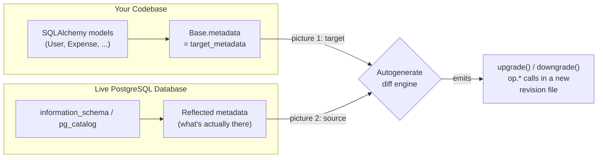

# Autogenerate Migrations

Chapter 6 got you comfortable moving ExpenseFlow's database forward and backward through its migration history — `alembic upgrade head`, `alembic downgrade -1`, and the `--sql` offline mode for handing a DBA a reviewable script instead of executing directly. Every migration you ran in that chapter, though, had its `upgrade()`/`downgrade()` bodies written by hand in Chapter 5. That's about to change. This chapter introduces `alembic revision --autogenerate`, the single most-used Alembic command in daily development, and the one most likely to lull you into a false sense of security if you don't understand exactly what it's doing under the hood. We'll walk through ExpenseFlow's next real schema change — a `categories` table and a `category_id` foreign key on `expenses` — generated automatically, and use it to build a precise mental model of what autogenerate reliably catches, what it silently gets wrong, and why "review before you commit" is not optional advice but a load-bearing part of the workflow.

---

## Learning Objectives

By the end of this chapter, you will be able to:

- Explain what `alembic revision --autogenerate` actually compares, and where each side of that comparison comes from.
- Run autogenerate against ExpenseFlow to add a `categories` table and a `category_id` foreign key on `expenses`.
- List the categories of schema change autogenerate reliably detects, and the categories it cannot detect at all.
- Recognize a column rename disguised as a destructive drop-and-add in a generated migration, and correct it.
- Configure autogenerate's comparison behavior (`compare_type`, `compare_server_default`, `include_object`) for a real project.
- Apply the "always review the generated script" discipline as a concrete, repeatable checklist rather than a vague warning.

---

## Prerequisites for This Chapter

This chapter builds on everything through [Chapter 6: Upgrade & Downgrade](./06-upgrade-and-downgrade.md). We assume you can already:

- Explain what `env.py`'s `target_metadata` is and how it's wired to your SQLAlchemy `Base.metadata` ([Chapter 4](./04-migration-environment-env-py.md)).
- Read a migration file's anatomy — `revision`, `down_revision`, `upgrade()`, `downgrade()` — and understand the migration graph as a linked list ([Chapter 5](./05-revisions-and-version-history.md)).
- Run `alembic upgrade head` and `alembic downgrade -1` against a real PostgreSQL database, and generate an offline SQL script with `--sql` ([Chapter 6](./06-upgrade-and-downgrade.md)).
- Recall ExpenseFlow's current schema: `users` (id, email, hashed_password, created_at) and `expenses` (id, user_id FK, amount_cents, currency, description, expense_date, created_at), already at `head` in a local PostgreSQL database.

If any of that feels shaky, revisit the linked chapters before continuing — this chapter assumes you can run the full revision-and-upgrade cycle without hesitation.

---

## 1. What Autogenerate Actually Compares

### 1.1 Two independent pictures of your schema

Every time you run `alembic revision --autogenerate`, Alembic builds two independent pictures of "what the schema looks like" and diffs them:

1. **The target**: your SQLAlchemy `target_metadata` object — the `MetaData` collected from every model class that inherits your `DeclarativeBase` and has been imported by the time `env.py` runs. This is *code* — it reflects what your Python models currently declare, not what's actually in any database.
2. **The source**: a live **reflection** of the actual database `env.py`'s `sqlalchemy.url` points at. Alembic connects to that database, inspects its catalog tables (`information_schema`, `pg_catalog` on PostgreSQL) and reconstructs its own in-memory picture of every table, column, index, and constraint that's really there right now.

Autogenerate's entire job is to diff picture 2 against picture 1, and emit the `op.*` calls that would turn picture 2 into picture 1 — that is, the operations that would make the live database match what your models say it should look like.



This is the single most important fact in this chapter: **autogenerate never looks at your migration history to know what "should" exist.** It has no memory of what earlier revisions did. It only compares "what do the models say" against "what's actually in the database right now." That has a very direct consequence — if your local database is already out of sync with `head` (you forgot to run `alembic upgrade head` after pulling a teammate's migration, say), autogenerate will happily generate a script to "fix" drift that a proper upgrade would have fixed for free, and that script will not look like what you expect.

### 1.2 Why this means `target_metadata` must be complete

Because side 1 of the diff comes entirely from whatever models happen to be imported into `target_metadata` at the moment `env.py` runs, a model class that's never imported anywhere Alembic's `env.py` reaches is, as far as autogenerate is concerned, invisible. It won't show up as "missing" — autogenerate has no idea it was ever supposed to exist. This is why Chapter 4's `env.py` walkthrough emphasized importing every model module (directly or via a package `__init__.py` that imports all of them) before `target_metadata` is set — a mistake here doesn't throw an error, it just silently produces incomplete migrations, which is far more dangerous than a crash.

### 1.3 The command

```bash
alembic revision --autogenerate -m "add categories table and expenses.category_id fk"
```

This is identical in shape to the plain `alembic revision -m "..."` from Chapter 5, with one flag added. Alembic still creates a new revision file from `script.py.mako`, still chains it onto the current `head` via `down_revision`, but this time it pre-populates `upgrade()` and `downgrade()` with the diff it computed instead of leaving them as `pass`.

---

## 2. Worked Example: Adding `categories` to ExpenseFlow

### 2.1 The model change

The ExpenseFlow team wants to let users tag each expense with a category — "Food," "Transport," "Utilities" — instead of a free-text field. That means a new `categories` table, and a nullable `category_id` foreign key on `expenses` (nullable for now, since existing rows have no category yet — this mirrors the "add nullable, backfill later" discipline Chapter 11 covers in depth for NOT NULL columns).

```python
# app/models.py
from datetime import datetime
from sqlalchemy import ForeignKey, String, Numeric
from sqlalchemy.orm import DeclarativeBase, Mapped, mapped_column, relationship


class Base(DeclarativeBase):
    pass


class User(Base):
    __tablename__ = "users"

    id: Mapped[int] = mapped_column(primary_key=True)
    email: Mapped[str] = mapped_column(String(255), unique=True, index=True)
    hashed_password: Mapped[str] = mapped_column(String(255))
    created_at: Mapped[datetime] = mapped_column(server_default="now()")


class Category(Base):
    __tablename__ = "categories"

    id: Mapped[int] = mapped_column(primary_key=True)
    name: Mapped[str] = mapped_column(String(100), unique=True)
    created_at: Mapped[datetime] = mapped_column(server_default="now()")


class Expense(Base):
    __tablename__ = "expenses"

    id: Mapped[int] = mapped_column(primary_key=True)
    user_id: Mapped[int] = mapped_column(ForeignKey("users.id"))
    category_id: Mapped[int | None] = mapped_column(
        ForeignKey("categories.id"), nullable=True
    )
    amount_cents: Mapped[int]
    currency: Mapped[str] = mapped_column(String(3))
    description: Mapped[str] = mapped_column(String(500))
    expense_date: Mapped[datetime]
    created_at: Mapped[datetime] = mapped_column(server_default="now()")

    category: Mapped["Category | None"] = relationship()
```

Note what changed relative to Chapter 6's schema: a wholly new `Category` class, and one new column plus one new relationship attribute on the existing `Expense` class. Nothing here touches the database yet — this is still just Python.

### 2.2 Generating the migration

```bash
alembic revision --autogenerate -m "add categories table and expenses.category_id fk"
```

Alembic connects using `sqlalchemy.url` from `alembic.ini` (or however `env.py` resolves it — Chapter 4), reflects the live database, diffs it against `target_metadata`, and writes a new file. A representative result:

```python
"""add categories table and expenses.category_id fk

Revision ID: 7f3a1c9d2b44
Revises: 4e1d8a90cf12
Create Date: 2026-07-27 10:14:22.881932

"""
from alembic import op
import sqlalchemy as sa

revision = "7f3a1c9d2b44"
down_revision = "4e1d8a90cf12"
branch_labels = None
depends_on = None


def upgrade() -> None:
    op.create_table(
        "categories",
        sa.Column("id", sa.Integer(), nullable=False),
        sa.Column("name", sa.String(length=100), nullable=False),
        sa.Column(
            "created_at", sa.DateTime(), server_default=sa.text("now()"), nullable=False
        ),
        sa.PrimaryKeyConstraint("id", name=op.f("pk_categories")),
        sa.UniqueConstraint("name", name=op.f("uq_categories_name")),
    )
    op.add_column(
        "expenses", sa.Column("category_id", sa.Integer(), nullable=True)
    )
    op.create_foreign_key(
        op.f("fk_expenses_category_id_categories"),
        "expenses",
        "categories",
        ["category_id"],
        ["id"],
    )


def downgrade() -> None:
    op.drop_constraint(
        op.f("fk_expenses_category_id_categories"), "expenses", type_="foreignkey"
    )
    op.drop_column("expenses", "category_id")
    op.drop_table("categories")
```

Two details worth stopping on:

- **Operation ordering is already correct.** Autogenerate created the `categories` table before adding the `category_id` column and before creating the foreign key that references it — you can't reference a table that doesn't exist yet. `downgrade()` reverses the order for the same reason: drop the foreign key before dropping either side it depends on. Chapter 8 covers this ordering discipline in full for hand-written migrations, but it's worth noticing autogenerate already gets it right for straightforward cases.
- **`op.f(...)` wrapping constraint names.** If your project's `env.py` configures a `naming_convention` on the `MetaData` (recommended, and assumed here), Alembic uses `op.f()` to apply that convention consistently to autogenerated constraint names, so names match what you'd get from a fresh `create_all()` — this keeps naming stable and predictable rather than relying on whatever default name PostgreSQL or SQLAlchemy would otherwise pick.

### 2.3 Applying it

```bash
alembic upgrade head
```

```
INFO  [alembic.runtime.migration] Running upgrade 4e1d8a90cf12 -> 7f3a1c9d2b44, add categories table and expenses.category_id fk
```

One command, and ExpenseFlow's database now has a `categories` table and a nullable FK column on `expenses`, generated without hand-typing a single `CREATE TABLE` or `ALTER TABLE` statement — this is autogenerate delivering on its promise for the case it's good at: purely additive, unambiguous structural changes.

---

## 3. What Autogenerate Reliably Detects

Autogenerate's diff engine is genuinely good at structural comparisons where "what changed" is unambiguous — where there's exactly one sensible interpretation of the difference between the reflected schema and `target_metadata`.

| Change | Detected? | Notes |
|---|---|---|
| New table added to models | Yes | `op.create_table(...)`, as seen above |
| Table removed from models | Yes | `op.drop_table(...)` — but see Section 4's warning on `include_object` |
| New column added to an existing table | Yes | `op.add_column(...)` |
| Column removed from an existing table | Yes | `op.drop_column(...)` — this is destructive; always double-check it's really intended |
| New index added | Yes | `op.create_index(...)`, matched by column list |
| Index removed | Yes | `op.drop_index(...)` |
| New foreign key constraint | Yes | `op.create_foreign_key(...)`, as seen above |
| Foreign key removed | Yes | `op.drop_constraint(..., type_="foreignkey")` |
| New unique constraint | Yes | `op.create_unique_constraint(...)` |
| Nullable → NOT NULL (or reverse) on an existing column | Yes | Emitted as part of `op.alter_column(...)`; still needs manual review for lock/backfill implications (Chapter 11, Chapter 14) |

For all of these, autogenerate is comparing two concrete, structurally comparable facts (a table exists or it doesn't; a column has a given nullability or it doesn't) and there's no ambiguity about what operation restores agreement. This is genuinely valuable — it's a large fraction of everyday schema changes, and hand-writing all of it, every time, would be needless toil.

---

## 4. What Autogenerate Cannot Detect

This is the part of the chapter to read twice. Autogenerate's diff is a **structural set comparison**, not a semantic understanding of your intent — and that distinction produces several categories of blind spot that look, superficially, like autogenerate "working," while actually generating something dangerously wrong.

### 4.1 Renames look like drop + add

This is the single most important limitation to internalize. Suppose, instead of adding `category_id`, the team had renamed `expenses.description` to `expenses.notes` directly in the model:

```python
notes: Mapped[str] = mapped_column(String(500))   # was: description
```

From autogenerate's point of view, comparing the reflected database (which still has a column named `description`) against `target_metadata` (which now has a column named `notes`), there is **no rename operation to detect** — a rename isn't a structural fact the diff engine can observe. What it sees is: a column named `description` exists in the database but not in the models (→ drop it), and a column named `notes` exists in the models but not in the database (→ add it). It generates exactly that:

```python
def upgrade() -> None:
    op.add_column("expenses", sa.Column("notes", sa.String(length=500), nullable=True))
    op.drop_column("expenses", "description")
```

Run this against a database with real rows, and **every existing expense loses its description text**, replaced by a new, empty `notes` column. Nothing in the generated script is syntactically wrong — it's a semantically catastrophic misreading of what you actually wanted, executed with total confidence. Chapter 14 covers the correct, zero-downtime way to rename a live column (`op.alter_column(..., new_column_name=...)`, expand/contract); the point here is narrower and more urgent: **autogenerate will never propose that correct rename on its own** — it structurally cannot distinguish "rename" from "drop one, add an unrelated one with the same shape."

The same blind spot applies to **table renames** — `op.rename_table(...)` is never something autogenerate emits; a renamed table is always seen as one dropped table plus one new table.

### 4.2 Type and server-default nuances

Comparing column *types* across a database driver boundary is genuinely hard, and by default Alembic's autogenerate is conservative about it — plain type changes (e.g., `String(255)` → `String(100)`) are often **not detected at all** unless you explicitly enable `compare_type` in `env.py`'s `context.configure(...)` call (Section 6). Even with it enabled, some type comparisons (timezone-aware vs. naive `DateTime`, precision/scale on `Numeric`, certain PostgreSQL-specific types) can produce false positives or false negatives depending on how the dialect represents the type internally versus how SQLAlchemy models it.

**Server defaults** are similar: by default, autogenerate does **not** compare `server_default` values at all — a `server_default="now()"` you added to a model may not trigger anything without `compare_server_default=True` configured, and even then the comparison is described in Alembic's own documentation as "fuzzy" for expressions (as opposed to simple literals), because comparing "is this SQL expression the same as that SQL expression" across a database round-trip is not a solved problem in general.

### 4.3 Check constraints

Whether autogenerate detects `CHECK` constraint changes depends on your Alembic/SQLAlchemy version and configuration — historically this has been one of the weaker-supported comparisons, and it's common for teams to find that a check constraint added purely in models is either missed entirely or requires an explicit autogenerate render hook to pick up correctly. Treat check constraints as a case to verify manually every time, not assume works.

### 4.4 Anything server-side that models don't represent

Views, stored procedures, triggers, and Postgres-specific objects like custom functions have no representation in vanilla SQLAlchemy `MetaData` at all — autogenerate cannot see them because there is no "model side" of the picture to compare against. (Chapter 18 covers `alembic-utils`, a community package that extends autogenerate specifically to cover this gap for views/functions/triggers.)

### 4.5 Summary table of blind spots

| Change | Detected by default? | Why |
|---|---|---|
| Column rename | No — appears as drop + add | No structural signal distinguishes rename from unrelated drop/add |
| Table rename | No — appears as drop + add | Same reason, at the table level |
| Column type change | Only with `compare_type=True`, and imperfectly | Cross-dialect type comparison is inherently fuzzy |
| Server default change | Only with `compare_server_default=True`, and imperfectly | Comparing SQL expressions textually/semantically is unreliable |
| Check constraint change | Inconsistent, version-dependent | Historically weak support in the diff engine |
| Views, triggers, stored procedures | No | No representation in SQLAlchemy `MetaData` at all |

---

## 5. The Review Discipline

Given Section 4, there is exactly one professional rule for autogenerate, and it is non-negotiable: **never run an autogenerated migration against a real database without reading the generated `upgrade()`/`downgrade()` bodies first.** Concretely, that means for every autogenerated revision:

1. **Read every `op.*` call and ask "is this the change I intended?"** — especially any pair of `add_column` + `drop_column` on the same table, which is the drop-and-add-disguised-as-rename pattern from Section 4.1.
2. **Check for unexpected drops.** If `op.drop_table(...)` or `op.drop_column(...)` appears and you didn't intend to remove anything, the most common cause is a model that failed to import into `target_metadata` (Section 1.2) — autogenerate concluded the table/column "shouldn't exist" because it never saw the model that declares it.
3. **Verify the `downgrade()` body is a true inverse**, not just present. Autogenerate does generate downgrade bodies, but always read them with the same scrutiny as `upgrade()` — a `downgrade()` that drops a column will permanently discard whatever data existed in it if a downgrade is ever actually run in production.
4. **Diff against zero.** After committing your reviewed migration, run `alembic revision --autogenerate -m "check"` once more (and delete the generated file if it's empty) — if it generates operations again, either your migration missed something or `target_metadata` still disagrees with the database, and either is worth investigating before you move on. (Chapter 15 formalizes this into a CI "drift check.")
5. **Rename generated migration messages if they're unhelpful.** Autogenerate names the file from your `-m` message, not from its contents — write a message that describes intent (`"add categories table and expenses.category_id fk"`), not a generic one, so `alembic history` stays readable months later.

---

## 6. Configuring Autogenerate's Comparison Behavior

`env.py`'s `context.configure(...)` call accepts several flags that tune what the diff engine looks at:

```python
# env.py, inside run_migrations_online() / run_migrations_offline()
context.configure(
    connection=connection,
    target_metadata=target_metadata,
    compare_type=True,
    compare_server_default=True,
    include_schemas=False,
)
```

| Option | Default | Effect when enabled |
|---|---|---|
| `compare_type` | `False` | Compares column types between reflected DB and models; can be a callable for custom per-dialect logic instead of `True`/`False` |
| `compare_server_default` | `False` | Compares `server_default` values; documented as "fuzzy" for expressions, reliable mainly for simple literals |
| `include_object` | `None` | A callable filter deciding whether a given table/column/index should even be considered in the diff — used to exclude tables Alembic shouldn't manage (e.g., a table owned by another service sharing the database) |
| `include_schemas` | `False` | Whether to autogenerate across non-default PostgreSQL schemas, not just `public` |
| `render_as_batch` | `False` | Wrap generated operations in `batch_alter_table` — mainly relevant for SQLite (Chapter 13); usually left off for PostgreSQL-only projects |

Turning on `compare_type` and `compare_server_default` for ExpenseFlow is generally worth the false-positive noise it occasionally introduces, precisely because the alternative — silently missing a real type or default drift — is worse. Treat any diff these settings surface as a prompt for a human decision, not something to blindly accept.

---

## Real-World Scenario

**Setup:** Two weeks after ExpenseFlow's `categories` migration ships, a junior engineer on the team is asked to rename the confusingly-named `expenses.description` column to `expenses.notes` — product feedback says "description" reads like a required field, and "notes" better reflects that it's optional freeform text. They make the obvious change in `models.py` (renaming the attribute and the `mapped_column` alongside it) and run `alembic revision --autogenerate -m "rename description to notes"`, exactly the same workflow that worked cleanly for `categories`. The generated migration looks completely normal: an `add_column` for `notes`, a `drop_column` for `description`, nicely ordered, no errors. They open a PR.

**What almost went wrong:** A reviewer familiar with Section 4.1 of this chapter catches it in review: this migration, if run against production, would silently discard every existing expense's description text — the new `notes` column starts empty for every row that already exists, because `add_column` has no way to know it's supposed to carry over data from a *different* column name. Nothing about the generated script would have raised an error or a warning; it would have executed successfully and produced exactly the described, disastrous result.

**The fix:** The reviewer rewrites the migration by hand to use `op.alter_column(..., new_column_name="notes")` instead of drop+add — a rename executed as an actual rename, preserving every row's existing value under the new name, with zero data loss:

```python
def upgrade() -> None:
    op.alter_column("expenses", "description", new_column_name="notes")


def downgrade() -> None:
    op.alter_column("expenses", "notes", new_column_name="description")
```

(This single-step version is safe for a maintenance-window deploy; Chapter 14 covers the multi-deploy expand/contract version needed for a genuinely zero-downtime rename with old and new application code running simultaneously.)

**The lesson institutionalized:** the team adds a line to their PR template — "if this migration touches a column or table that already existed, confirm it isn't actually a rename autogenerate mis-detected as drop+add" — turning Section 4.1's abstract warning into a concrete, repeatable review gate.

---

## Best Practices

- **Always read the generated `upgrade()`/`downgrade()` before committing** — treat autogenerate as a drafting assistant, never as a decision-maker (Section 5).
- **Enable `compare_type` and `compare_server_default`** in `env.py` for any project past its earliest prototyping stage — the false-positive noise is a small price for catching real drift (Section 6).
- **Import every model module before `target_metadata` is built** — an unimported model is invisible to autogenerate and produces silent, not loud, failures (Section 1.2).
- **Treat any `add_column` + `drop_column` pair touching the same table with suspicion** — verify it isn't a disguised rename before merging (Section 4.1).
- **Run autogenerate again after committing a migration, expecting an empty diff** — a non-empty second diff means something was missed (Section 5, item 4).
- **Give autogenerated migrations descriptive `-m` messages** — the file is named from the message, not the contents, and `alembic history` is only as readable as those messages are (Section 5, item 5).

---

## Common Mistakes

- **Trusting a generated drop+add as a real rename**, losing production data the moment the migration runs — the exact failure walked through in this chapter's Real-World Scenario.
- **Forgetting to import a new model module**, causing autogenerate to either miss a new table entirely or, worse, propose dropping an existing one it can no longer see.
- **Assuming type or server-default changes are caught by default** — they require explicit `compare_type`/`compare_server_default` configuration, and even then are imperfect (Section 4.2).
- **Never re-running autogenerate after committing a migration** to confirm the diff is now empty, allowing small drifts to accumulate silently across many migrations.
- **Applying an autogenerated migration to production without ever having run it against a copy of production-shaped data** — a script that "looks right" can still behave unexpectedly against real row counts and real constraints.
- **Blindly accepting every `drop_table`/`drop_column` in a generated script** without asking whether a model was simply omitted from `target_metadata`.

---

## Summary

- Autogenerate diffs two independent pictures of your schema: `target_metadata` (from imported models) versus a live reflection of the actual database — it has no memory of migration history (Section 1).
- ExpenseFlow's `categories` table and `category_id` FK were added cleanly via `alembic revision --autogenerate`, with correct operation ordering generated automatically (Section 2).
- Autogenerate reliably detects new/dropped tables, columns, indexes, foreign keys, and unique constraints, and nullable/NOT NULL changes (Section 3).
- Autogenerate cannot reliably detect renames (they appear as drop+add), and only partially detects type, server-default, and check-constraint changes, and never sees views/triggers/procedures (Section 4).
- The mandatory discipline is reviewing every generated script line by line before running it, and re-running autogenerate afterward to confirm an empty diff (Section 5).
- `compare_type`, `compare_server_default`, and `include_object` in `env.py`'s `context.configure(...)` tune what autogenerate actually compares (Section 6).

---

## Knowledge Check

1. Autogenerate diffs two "pictures" of your schema. What are they, and which one comes from your Python code versus your live database?
2. Why does autogenerate have no way to distinguish a column rename from an unrelated column drop plus an unrelated column add?
3. A teammate adds a new model class but forgets to import it anywhere `env.py` reaches before `target_metadata` is built. What does autogenerate do, and why is this more dangerous than an outright error?
4. What do `compare_type` and `compare_server_default` do, and why are they off by default instead of always-on?
5. You run `alembic revision --autogenerate` right after committing a migration you just wrote and reviewed. What result do you expect, and what would a non-empty result imply?
6. Give one example of a schema object that autogenerate can never detect changes to, regardless of configuration, and explain why.
7. In the Real-World Scenario, what specifically in the generated migration should have made the reviewer suspicious before even checking git blame or the model diff?

---

## Hands-On Exercise

**Goal:** Reproduce ExpenseFlow's `categories` migration yourself, then deliberately trigger and recognize the disguised-rename failure mode.

1. **Confirm your starting state.** Run `alembic current` against your local ExpenseFlow database and confirm it reports the `head` revision from Chapter 6 (just `users` and `expenses`, no `categories` yet).
2. **Add the `Category` model and `category_id` FK** to `app/models.py` exactly as shown in Section 2.1 of this chapter.
3. **Generate the migration**: `alembic revision --autogenerate -m "add categories table and expenses.category_id fk"`. Open the generated file and confirm the `op.create_table`, `op.add_column`, and `op.create_foreign_key` calls appear in that order.
4. **Apply it**: `alembic upgrade head`, then confirm with `psql` (or your client of choice) that `categories` exists and `expenses.category_id` is present and nullable.
5. **Insert a test row** into `expenses` with a non-null `description` value, so you have real data to lose in the next step (if you don't already have one).
6. **Reproduce the disguised rename.** In `models.py`, rename `description` to `notes` on the `Expense` class (keep the same type/length). Run `alembic revision --autogenerate -m "rename description to notes"` and open the generated file — confirm it contains `op.add_column(..., "notes", ...)` followed by `op.drop_column(..., "description")`, exactly the failure pattern from Section 4.1.
7. **Do not run this migration.** Instead, delete it, and hand-write the correct version using `op.alter_column("expenses", "description", new_column_name="notes")` for both `upgrade()` and the reverse in `downgrade()`.
8. **Apply your corrected migration**, then confirm the row you inserted in step 5 still has its original text — now under the `notes` column — proving no data was lost.
9. **Re-run autogenerate once more** with no model changes pending, and confirm it produces an empty migration (or reports nothing to do), demonstrating the "diff against zero" check from Section 5.

---

## Further Reading

- [Alembic Autogenerate Documentation](https://alembic.sqlalchemy.org/en/latest/autogenerate.html) — the authoritative reference for what autogenerate compares and its documented limitations, extending Sections 1, 3, and 4.
- [Alembic Operation Reference (`op.*`)](https://alembic.sqlalchemy.org/en/latest/ops.html) — full signatures for every operation autogenerate can emit, including `alter_column`, used in this chapter's Real-World Scenario fix.
- [Alembic Cookbook](https://alembic.sqlalchemy.org/en/latest/cookbook.html) — includes recipes for `include_object` filtering and other autogenerate customization from Section 6.
- [SQLAlchemy 2.0 ORM Documentation](https://docs.sqlalchemy.org/en/20/orm/) — for the `Mapped[...]`/`mapped_column(...)` model style used throughout this chapter's code.
- [Alembic Tutorial](https://alembic.sqlalchemy.org/en/latest/tutorial.html) — background on `target_metadata` wiring, useful if Chapter 4's `env.py` walkthrough needs a refresher.

---

<div style="display:flex;justify-content:space-between;align-items:center;">
  <a href="./06-upgrade-and-downgrade.md">← Previous: Upgrade & Downgrade</a>
  <a href="./00-index.md">🏠 Index</a>
  <a href="./08-writing-manual-migrations.md">Next: Writing Manual Migrations →</a>
</div>
