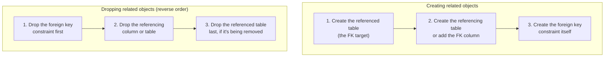

# Writing Manual Migrations

Chapter 7 showed you autogenerate at its best — a purely additive change (a new table, a new FK) diffed and scripted automatically — and at its worst, silently mangling a rename into a destructive drop-and-add. The natural conclusion is not "avoid autogenerate," it's "know the `op.*` directive vocabulary well enough to read, correct, and extend anything autogenerate hands you, and to write migrations from scratch when a change is too structurally ambiguous for a diff engine to get right." This chapter is that vocabulary. We'll work through every commonly used `op.*` directive, the ordering rules that keep a migration from failing against a real database with real constraints, and then hand-write a genuinely non-trivial migration for ExpenseFlow: a many-to-many `tags`/`expense_tags` relationship, built without autogenerate's help, exactly the way you'd build it in a real production codebase. (Chapter 10 adds a `receipts` table and a `monthly_budgets` table to this same schema, as part of a realistic two-developer branch collision — a good excuse to revisit this chapter's ordering rules under slightly higher stakes.)

---

## Learning Objectives

By the end of this chapter, you will be able to:

- Name and correctly use the core `op.*` directives for tables, columns, indexes, and constraints.
- Explain why `rename_table` is available but often better avoided in favor of an explicit plan (Chapter 14 previews why).
- State the two operation-ordering rules that prevent foreign-key-related migration failures, and apply them without needing to guess-and-check.
- Hand-write a migration creating a many-to-many relationship (junction table with composite primary key) from scratch.
- Hand-write a migration creating a new table with a foreign key to an existing table, complete with an index on the FK column.
- Choose between autogenerate and a hand-written migration for a given schema change, based on structural ambiguity.

---

## Prerequisites for This Chapter

This chapter assumes everything from [Chapter 7: Autogenerate Migrations](./07-autogenerate-migrations.md), specifically:

- That you understand autogenerate's blind spots (renames, type/default nuances) and why they sometimes require hand-writing or hand-correcting a migration instead.
- ExpenseFlow's current schema: `users`, `expenses` (now including the nullable `category_id` FK from Chapter 7), and `categories`, all at `head`.
- Comfort reading and writing a migration file's `upgrade()`/`downgrade()` bodies and running `alembic upgrade head` against them ([Chapter 5](./05-revisions-and-version-history.md), [Chapter 6](./06-upgrade-and-downgrade.md)).

---

## 1. The `op.*` Directive Catalog

Every operation you can perform inside a migration's `upgrade()`/`downgrade()` body comes from the `alembic.op` module — the same module autogenerate itself calls into to build its generated scripts (Chapter 3's `Operations` class, if you want the internals). Here is the working set you'll use in nearly every hand-written migration:

| Directive | Purpose | Reversed by |
|---|---|---|
| `op.create_table(name, *columns)` | Create a new table with its columns, primary key, and inline constraints | `op.drop_table(name)` |
| `op.drop_table(name)` | Drop an existing table | `op.create_table(...)` (must recreate the full definition) |
| `op.rename_table(old, new)` | Rename a table in place | `op.rename_table(new, old)` |
| `op.add_column(table, column)` | Add a new column to an existing table | `op.drop_column(table, column_name)` |
| `op.drop_column(table, column_name)` | Drop an existing column (destructive — data loss) | `op.add_column(table, column)` (data is not restored) |
| `op.alter_column(table, column_name, ...)` | Change a column's type, nullability, server default, or name | `op.alter_column(...)` with the prior values |
| `op.create_index(name, table, columns)` | Create an index | `op.drop_index(name, table_name=table)` |
| `op.drop_index(name, table_name=table)` | Drop an index | `op.create_index(...)` |
| `op.create_foreign_key(name, source, target, local_cols, remote_cols)` | Add a foreign key constraint | `op.drop_constraint(name, source, type_="foreignkey")` |
| `op.create_unique_constraint(name, table, columns)` | Add a unique constraint | `op.drop_constraint(name, table, type_="unique")` |
| `op.create_check_constraint(name, table, condition)` | Add a `CHECK` constraint | `op.drop_constraint(name, table, type_="check")` |
| `op.drop_constraint(name, table, type_=...)` | Drop any named constraint | The matching `create_*` call |
| `op.execute(sql)` | Run raw SQL Alembic has no dedicated directive for | Another `op.execute(sql)` with the inverse statement |
| `op.get_bind()` | Get the live `Connection` for manual queries/data operations inside a migration | N/A — used for data migrations (Chapter 11) |

You will use `create_table`, `add_column`, `create_index`, and `create_foreign_key` constantly. `create_check_constraint` and raw `op.execute` are rarer but essential once you start using PostgreSQL-specific features (Chapter 12).

### 1.1 `create_table` and `drop_table`

```python
def upgrade() -> None:
    op.create_table(
        "tags",
        sa.Column("id", sa.Integer(), nullable=False),
        sa.Column("name", sa.String(length=50), nullable=False),
        sa.PrimaryKeyConstraint("id", name=op.f("pk_tags")),
        sa.UniqueConstraint("name", name=op.f("uq_tags_name")),
    )


def downgrade() -> None:
    op.drop_table("tags")
```

`create_table` takes the table name followed by any number of `sa.Column(...)` definitions and inline constraint objects (`sa.PrimaryKeyConstraint`, `sa.UniqueConstraint`, `sa.ForeignKeyConstraint`, `sa.CheckConstraint`) — it's the same vocabulary SQLAlchemy's declarative models compile down to, just spelled out explicitly instead of derived from a model class. `drop_table` needs only the name; there's nothing to reverse it back into except re-running the matching `create_table`, which is exactly what `downgrade()` for a `create_table` migration does.

### 1.2 `add_column`, `drop_column`, and `alter_column`

```python
op.add_column("expenses", sa.Column("notes", sa.String(length=500), nullable=True))
op.drop_column("expenses", "notes")

op.alter_column(
    "expenses",
    "currency",
    existing_type=sa.String(length=3),
    nullable=False,
)
```

`alter_column` is the most flexible and most dangerous directive in the catalog — it covers type changes, nullability changes, server-default changes, and column renames (via `new_column_name=`), all through the same call signature. Because it can change several independent things at once, always pass `existing_type` (and `existing_nullable`, `existing_server_default` where relevant) even when you're not changing that particular attribute — this documents the column's prior state explicitly in the migration file itself and avoids Alembic needing to guess at dialect-specific rendering for the parts you didn't intend to touch.

### 1.3 `rename_table` — available, but think before reaching for it

```python
op.rename_table("expense_tags_old", "expense_tags")
```

`rename_table` works, and it's the correct tool when you genuinely, unambiguously want a table renamed with all its data intact and no application code needs to read both the old and new name simultaneously during a deploy. In practice, though, it's used less often than you'd expect for two reasons worth internalizing now, even though the full treatment is Chapter 14's:

- **A live application usually can't tolerate the rename atomically.** The moment `ALTER TABLE ... RENAME TO ...` commits, every query using the old name starts failing — and during a rolling deploy, some running instances are still on code that references the old name. A single-step rename is safe only during a full maintenance window with the application stopped.
- **It's rarely just a rename in practice.** Renaming a table is often bundled with other changes (new columns, changed constraints) that are easier to reason about, review, and roll back independently as separate migrations than as one combined `rename_table` plus everything else.

Chapter 14 covers the multi-deploy expand/contract sequence for renaming something a live application depends on without downtime; for now, know that `rename_table` exists, works correctly for a stop-the-world scenario, and should be a deliberate choice, not a reflex.

### 1.4 `create_index` and `drop_index`

```python
op.create_index(
    op.f("ix_expense_tags_tag_id"), "expense_tags", ["tag_id"], unique=False
)
op.drop_index(op.f("ix_expense_tags_tag_id"), table_name="expense_tags")
```

Every foreign key column you add should almost always get an index alongside it — PostgreSQL does not automatically index foreign key columns (unlike the primary key side, which is indexed via the primary key constraint itself), and an unindexed FK column means every join or cascade check against it does a sequential scan. This is easy to forget when hand-writing a migration, since `create_foreign_key` does not create an index as a side effect.

### 1.5 `create_foreign_key`, `create_unique_constraint`, `create_check_constraint`

```python
op.create_foreign_key(
    op.f("fk_expense_tags_expense_id_expenses"),
    "expense_tags", "expenses",
    ["expense_id"], ["id"],
    ondelete="CASCADE",
)

op.create_unique_constraint(
    op.f("uq_expense_tags_expense_id_tag_id"), "expense_tags", ["expense_id", "tag_id"]
)

op.create_check_constraint(
    op.f("ck_expenses_amount_positive"), "expenses", "amount_cents > 0"
)
```

`create_foreign_key` takes: a constraint name, the source (referencing) table, the target (referenced) table, the local column list, and the remote column list — in that order, which is easy to transpose by accident if you're not careful, since "source" and "target" read ambiguously out of context. `ondelete="CASCADE"` (or `"RESTRICT"`, `"SET NULL"`) is worth setting deliberately every time rather than accepting the database default, since it defines exactly what happens to dependent rows when a parent row is deleted — an easy thing to get wrong silently.

---

## 2. Operation Ordering Rules

Two ordering rules cover essentially every foreign-key-related migration failure you'll hit:



**Rule 1 — create the referenced side before the referencing side.** You cannot create a foreign key pointing at a table that doesn't exist yet, and PostgreSQL will reject it outright. If migration A creates `tags` and migration B creates `expense_tags` with a FK to `tags`, B's `down_revision` must point to (directly or transitively) a revision at or after A — the migration graph itself (Chapter 5) enforces this ordering for you, since Alembic will simply refuse to run B before A if the chain says so, but *within* a single migration file that creates both tables, you must still write the `create_table` calls in the correct order.

**Rule 2 — drop the foreign key before dropping either side it depends on.** This is `downgrade()`'s mirror image of Rule 1, and it's the one people forget, because `downgrade()` is usually written (or reviewed) more hastily than `upgrade()`. Attempting `op.drop_table("categories")` while `expenses.category_id` still has an active foreign key referencing it will fail with a database error (`cannot drop table categories because other objects depend on it`) — the constraint must be dropped first, explicitly, with `op.drop_constraint(...)`, even though PostgreSQL's `DROP TABLE ... CASCADE` could technically do this implicitly. Relying on `CASCADE` inside a migration is generally discouraged: it can silently drop *other* constraints and objects you didn't intend to touch, whereas an explicit `drop_constraint` followed by `drop_table` only removes exactly what you named.

Both rules generalize beyond foreign keys: any dependent object (an index on a column, a check constraint referencing a column) must be dropped before the thing it depends on, and created after the thing it depends on.

---

## 3. Worked Example: Tags (Many-to-Many)

### 3.1 Why this is a hand-written migration, not an autogenerate one

The ExpenseFlow team wants users to be able to attach multiple free-form tags to an expense — a tag like "reimbursable" might apply to dozens of expenses, and one expense might have several tags — a genuine many-to-many relationship. This *could* be autogenerated from models, and often would be in practice, but this chapter deliberately hand-writes it, for two reasons worth calling out explicitly. First, it's the best way to actually learn the `op.*` vocabulary from Section 1 rather than just reading autogenerate's output after the fact. Second, and more important: a composite-primary-key junction table like `expense_tags` is exactly the kind of structurally unusual shape where autogenerate's result depends heavily on incidental details of how you happen to declare the ORM `relationship(secondary=...)` — two developers writing what they believe is "the same" many-to-many relationship can easily get autogenerate to propose two different DDL shapes for it (a surrogate-key junction table versus a composite-key one), which is exactly the drift this chapter's Real-World Scenario walks through. Hand-writing the migration once, deliberately, and treating its shape as the team's house style for every future many-to-many relationship, avoids that drift entirely.

### 3.2 The models

```python
# app/models.py (additions)
from sqlalchemy import String
from sqlalchemy.orm import Mapped, mapped_column, relationship


class Tag(Base):
    __tablename__ = "tags"

    id: Mapped[int] = mapped_column(primary_key=True)
    name: Mapped[str] = mapped_column(String(50), unique=True)

    expenses: Mapped[list["Expense"]] = relationship(
        secondary="expense_tags", back_populates="tags"
    )
```

`Expense` gains one new relationship attribute, `tags`, declared via `secondary="expense_tags"` and a reciprocal `tags: Mapped[list["Tag"]] = relationship(secondary="expense_tags", back_populates="expenses")` on the `Expense` class itself. Note that `expense_tags` — the junction table — has **no dedicated model class** in this design; it's declared purely as DDL in the migration, since it carries no columns beyond the two foreign keys. This is a completely normal and common pattern for pure many-to-many junction tables, and it's also exactly the kind of table shape where hand-writing the migration is clearer than hoping autogenerate infers the right thing from a bare `secondary=` string.

### 3.3 The migration, section by section

```python
"""add tags and expense_tags tables

Revision ID: f3a9c1d8e2b7
Revises: 7f3a1c9d2b44
Create Date: 2026-08-03 09:02:17.442110

"""
from alembic import op
import sqlalchemy as sa

revision = "f3a9c1d8e2b7"
down_revision = "7f3a1c9d2b44"
branch_labels = None
depends_on = None


def upgrade() -> None:
    # 1. tags: a standalone lookup table, no dependencies on other new tables
    op.create_table(
        "tags",
        sa.Column("id", sa.Integer(), nullable=False),
        sa.Column("name", sa.String(length=50), nullable=False),
        sa.PrimaryKeyConstraint("id", name=op.f("pk_tags")),
        sa.UniqueConstraint("name", name=op.f("uq_tags_name")),
    )

    # 2. expense_tags: the many-to-many junction table. Both "expenses" and
    #    "tags" must already exist -- "expenses" does (Chapter 5), "tags" was
    #    just created above (Rule 1: referenced side before referencing side).
    op.create_table(
        "expense_tags",
        sa.Column("expense_id", sa.Integer(), nullable=False),
        sa.Column("tag_id", sa.Integer(), nullable=False),
        sa.ForeignKeyConstraint(
            ["expense_id"], ["expenses.id"],
            name=op.f("fk_expense_tags_expense_id_expenses"),
            ondelete="CASCADE",
        ),
        sa.ForeignKeyConstraint(
            ["tag_id"], ["tags.id"],
            name=op.f("fk_expense_tags_tag_id_tags"),
            ondelete="CASCADE",
        ),
        sa.PrimaryKeyConstraint(
            "expense_id", "tag_id", name=op.f("pk_expense_tags")
        ),
    )
    # Index the tag_id side explicitly: the primary key already indexes
    # (expense_id, tag_id) together and therefore speeds up lookups by
    # expense_id, but a lookup by tag_id alone ("which expenses have this
    # tag?") needs its own index, since it isn't the leading column of the PK.
    op.create_index(
        op.f("ix_expense_tags_tag_id"), "expense_tags", ["tag_id"], unique=False
    )


def downgrade() -> None:
    # Reverse order throughout: drop the newest / most-dependent objects first.
    op.drop_index(op.f("ix_expense_tags_tag_id"), table_name="expense_tags")
    op.drop_table("expense_tags")

    op.drop_table("tags")
```

Walking through why the ordering is what it is:

- **`upgrade()`** creates `tags` first (no dependencies on anything new), then `expense_tags` (depends on both `expenses`, which already existed, and `tags`, just created above it in the same file) — Rule 1 from Section 2 applied within a single migration, not just across the migration graph.
- **`expense_tags`'s primary key is composite** — `(expense_id, tag_id)` together, not a separate surrogate `id` column — which is the standard, idiomatic shape for a pure junction table with no attributes of its own beyond the two foreign keys. Note there's no separate `create_unique_constraint` needed for the pair, since the composite primary key already enforces that uniqueness.
- **`downgrade()` drops in exactly the reverse order**, dropping the index before the table itself (an index disappears automatically when its table is dropped in PostgreSQL, so this is technically belt-and-suspenders rather than strictly required — but writing it explicitly keeps the file symmetric and makes the dependency reasoning visible to the next reader, rather than relying on an implicit cascade behavior).

### 3.4 A second, independent example: a check constraint on `expenses`

Not every hand-written migration needs a new table. To see `create_check_constraint` from Section 1.5 applied in full, rather than as a one-line snippet, imagine the ExpenseFlow team also wants to enforce, at the database level, a rule the application has always assumed but never actually guaranteed: an expense's `amount_cents` must be positive. Written as its own standalone migration (illustrative here — in the actual ExpenseFlow chain this would land as its own revision after whatever the current `head` is at the time it's written, rather than at a fixed point in this course's specific revision graph):

```python
def upgrade() -> None:
    op.create_check_constraint(
        op.f("ck_expenses_amount_cents_positive"), "expenses", "amount_cents > 0"
    )


def downgrade() -> None:
    op.drop_constraint(
        op.f("ck_expenses_amount_cents_positive"), "expenses", type_="check"
    )
```

Two things worth noting here, both callbacks to earlier chapters: first, this is exactly the kind of change Chapter 7's Section 4.3 warned you not to expect autogenerate to reliably catch — check constraints are inconsistently detected, so a change like this is safer hand-written than hoped-for. Second, before running this against a database with existing rows, it's worth a quick `SELECT count(*) FROM expenses WHERE amount_cents <= 0;` — a check constraint applies to every existing row immediately on creation, and if even one historical row violates it, the migration fails outright rather than silently allowing the bad row through. (Chapter 11 covers this "verify before constraining" discipline in depth for NOT NULL columns; the same logic applies here.)

### 3.5 Applying the tags/expense_tags migration

```bash
alembic upgrade head
```

```
INFO  [alembic.runtime.migration] Running upgrade 7f3a1c9d2b44 -> f3a9c1d8e2b7, add tags and expense_tags tables
```

ExpenseFlow's schema is now five tables deep — `users`, `expenses`, `categories`, `tags`, `expense_tags` — every one of them either autogenerated cleanly (Chapter 7) or hand-written deliberately (this chapter). You now know, concretely, when each approach is the right call. Revision `f3a9c1d8e2b7` is the current single `head` as this chapter ends — exactly the starting point Chapter 10 picks up from, where two developers each add something new on top of it: a `receipts` table on one branch, a `monthly_budgets` table on the other.

---

## Real-World Scenario

**Setup:** A different engineer on the ExpenseFlow team, working from a feature branch created before the `tags`/`expense_tags` migration above was merged, tries to autogenerate a migration for the exact same schema addition independently, without reading this chapter's manual version first. Their generated migration creates `expense_tags` with a surrogate `id` primary key and two separate foreign key columns, because that's what their `Expense`/`Tag` model classes happened to imply given how they wrote the `secondary=` table declaration inline in `models.py` rather than as a dedicated migration. It technically works, but it diverges from the composite-primary-key design the rest of the team settled on, and doesn't match what `expense_tags` looks like once the "official" migration lands.

**What went wrong and why it matters:** Two developers independently arriving at different DDL for the same conceptual junction table is exactly the kind of drift that's easy to catch in code review *before* either migration is merged, but expensive to reconcile *after* both have been applied to different developers' local databases (this is a preview of Chapter 10's branches/merge material — two migrations built on the same starting revision, diverging). The reviewer flags it: "we should hand-write junction tables like this consistently, with a composite PK, not let autogenerate infer a shape from however the ORM `secondary=` relationship happens to get declared" — and the team standardizes on exactly the pattern from Section 3.3 as their house style for every future many-to-many relationship.

**The resolution:** The second engineer discards their autogenerated version, rebases onto the merged migration from this chapter, and confirms `alembic current` matches `head` before continuing their feature work — a small, early collision resolved with a rebase rather than a painful multi-head merge discovered at deploy time.

---

## Best Practices

- **Reach for `create_table` with explicit `sa.Column`/`sa.ForeignKeyConstraint` calls whenever a table's shape is structurally unusual** (composite keys, junction tables) rather than trusting autogenerate to infer it correctly from ORM relationship declarations.
- **Index every foreign key column explicitly** — PostgreSQL does not do this automatically, and `create_foreign_key` never creates an index as a side effect (Section 1.4).
- **Always pass `existing_type` (and other `existing_*` args) to `alter_column`**, even when unchanged, to keep the migration file's intent unambiguous (Section 1.2).
- **Set `ondelete` deliberately on every foreign key** rather than accepting the database default — decide and document what happens to child rows when a parent is deleted.
- **Drop dependent objects before the objects they depend on, always** — the two ordering rules in Section 2 prevent essentially every FK-related migration failure.
- **Avoid relying on `DROP TABLE ... CASCADE`** inside migrations — explicit `drop_constraint` calls make exactly what's being removed visible in the file, rather than delegating scope to an implicit cascade.

---

## Common Mistakes

- **Creating a foreign key before the table it references exists**, producing an immediate database error on `upgrade()`.
- **Forgetting to drop a foreign key constraint before dropping its table in `downgrade()`**, producing a "cannot drop table because other objects depend on it" error the first time anyone actually tests the downgrade path.
- **Leaving a foreign key column unindexed**, which silently degrades every query that joins or filters through it as the table grows — invisible until the table is large enough for it to matter.
- **Using a surrogate `id` primary key on a pure junction table** instead of a composite key on the two foreign key columns, adding an unnecessary column and losing the automatic uniqueness guarantee the composite key would have given for free.
- **Reordering `create_table` calls carelessly inside one migration file** when several new tables reference each other, producing a dependency error that only surfaces at migration-run time, not at authoring time.
- **Letting two developers independently autogenerate migrations for structurally similar new relationships**, producing inconsistent DDL for conceptually identical patterns across the codebase (this chapter's Real-World Scenario).

---

## Summary

- The `op.*` catalog covers tables, columns, indexes, and constraints; `alter_column` is the most flexible and most dangerous directive, covering type, nullability, default, and rename changes through one call (Section 1).
- `rename_table` works but is rarely the right first choice for a live table an application depends on — Chapter 14 covers the safe multi-deploy alternative (Section 1.3).
- Two ordering rules govern every FK-related migration: create the referenced side before the referencing side, and drop the foreign key before dropping either side it depends on (Section 2).
- ExpenseFlow's `tags`/`expense_tags` migration was hand-written deliberately, using a composite primary key for the pure junction table and explicit FK indexing throughout, alongside a standalone `create_check_constraint` example (Section 3).
- Structurally unusual shapes (composite keys, junction tables) are exactly where hand-writing a migration beats trusting autogenerate to infer the right DDL from ORM relationship declarations.

---

## Knowledge Check

1. Which single `op.*` directive can change a column's type, nullability, server default, and name — and why does that flexibility make it worth extra care when reviewing a migration?
2. Why doesn't `op.create_foreign_key` automatically create an index on the referencing column, and what's the practical consequence of skipping that index yourself?
3. State the two operation-ordering rules from Section 2 in your own words, and explain why `downgrade()` needs the reverse order from `upgrade()`.
4. Why does the `expense_tags` table in Section 3.3 use a composite primary key on `(expense_id, tag_id)` instead of a separate surrogate `id` column?
5. What database error would you expect if you tried to run `op.drop_table("categories")` while `expenses.category_id`'s foreign key constraint was still active, and how does Section 2's Rule 2 prevent it?
6. Why is `rename_table` available in the `op.*` catalog, but not the default recommendation for renaming a live production table?
7. Give one concrete reason a team might prefer to hand-write a migration for a many-to-many relationship instead of relying on autogenerate, even though autogenerate would likely produce *something* that works.

---

## Hands-On Exercise

**Goal:** Hand-write and apply ExpenseFlow's `tags`/`expense_tags` migration yourself, then deliberately break and observe the ordering rules from Section 2.

1. **Confirm your starting state**: `alembic current` should report the `categories`/`category_id` revision from Chapter 7 as `head`.
2. **Add the `Tag` model class** to `app/models.py` exactly as shown in Section 3.2, including the `secondary="expense_tags"` relationship on `Tag` and the reciprocal `tags` relationship attribute on `Expense`.
3. **Create a blank migration by hand** (not autogenerate): `alembic revision -m "add tags and expense_tags tables"`.
4. **Write the `upgrade()`/`downgrade()` bodies yourself**, following Section 3.3's structure and ordering, before looking back at the chapter's version — then compare your result against it.
5. **Apply it**: `alembic upgrade head`, and confirm via `psql` that `tags` and `expense_tags` both exist, that `expense_tags` has a composite primary key on `(expense_id, tag_id)`, and that `ix_expense_tags_tag_id` exists.
6. **Deliberately violate Rule 2.** In a scratch copy of your migration file, reorder `downgrade()` so `op.drop_table("expenses")`-style logic (simulate by trying `op.drop_table("tags")` before `op.drop_table("expense_tags")`) runs before the dependent junction table is dropped. Run `alembic downgrade -1` against a disposable test database and observe the actual PostgreSQL error message about dependent objects.
7. **Fix the ordering** back to the correct sequence, confirm `alembic downgrade -1` now succeeds cleanly, then `alembic upgrade head` again to return to the fully-migrated state.
8. **Insert a test row** into `tags`, one into `expenses` (if you don't have one), and a row in `expense_tags` linking them, to confirm the foreign keys and composite primary key behave as expected (try inserting a duplicate `(expense_id, tag_id)` pair and confirm PostgreSQL rejects it).
9. **Write and apply the check-constraint migration from Section 3.4** as a real revision on top of your `head`. Before applying it, insert one deliberately invalid row (`amount_cents = -500`) into `expenses`, and confirm the migration fails against a table containing that row — then delete the bad row and re-run the migration successfully, confirming for yourself why "verify before constraining" matters even for a single-statement migration.

---

## Further Reading

- [Alembic Operation Reference (`op.*`)](https://alembic.sqlalchemy.org/en/latest/ops.html) — the complete, authoritative signature reference for every directive in Section 1.
- [Alembic Tutorial](https://alembic.sqlalchemy.org/en/latest/tutorial.html) — background on writing `upgrade()`/`downgrade()` bodies by hand.
- [Alembic Cookbook](https://alembic.sqlalchemy.org/en/latest/cookbook.html) — recipes including composite foreign keys and constraint-naming conventions.
- [SQLAlchemy 2.0 ORM Documentation](https://docs.sqlalchemy.org/en/20/orm/) — for `relationship(secondary=...)` and many-to-many mapping patterns referenced in Section 3.2.
- [PostgreSQL `ALTER TABLE` Documentation](https://www.postgresql.org/docs/current/sql-altertable.html) — the underlying DDL semantics (including `CASCADE` behavior) behind `op.drop_constraint`/`op.drop_table` in Section 2.

---

<div style="display:flex;justify-content:space-between;align-items:center;">
  <a href="./07-autogenerate-migrations.md">← Previous: Autogenerate Migrations</a>
  <a href="./00-index.md">🏠 Index</a>
  <a href="./09-the-version-table-and-stamping.md">Next: The Version Table & Stamping →</a>
</div>
