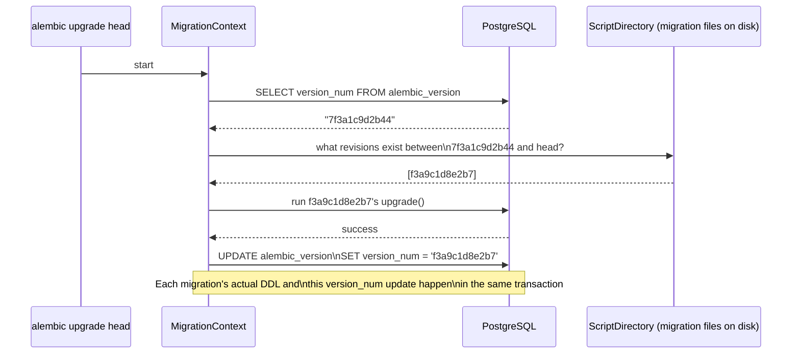
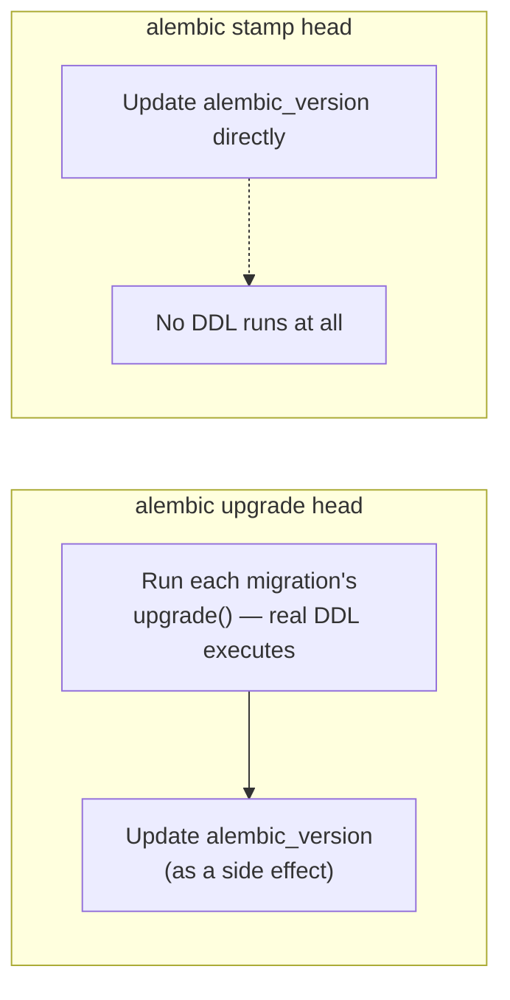
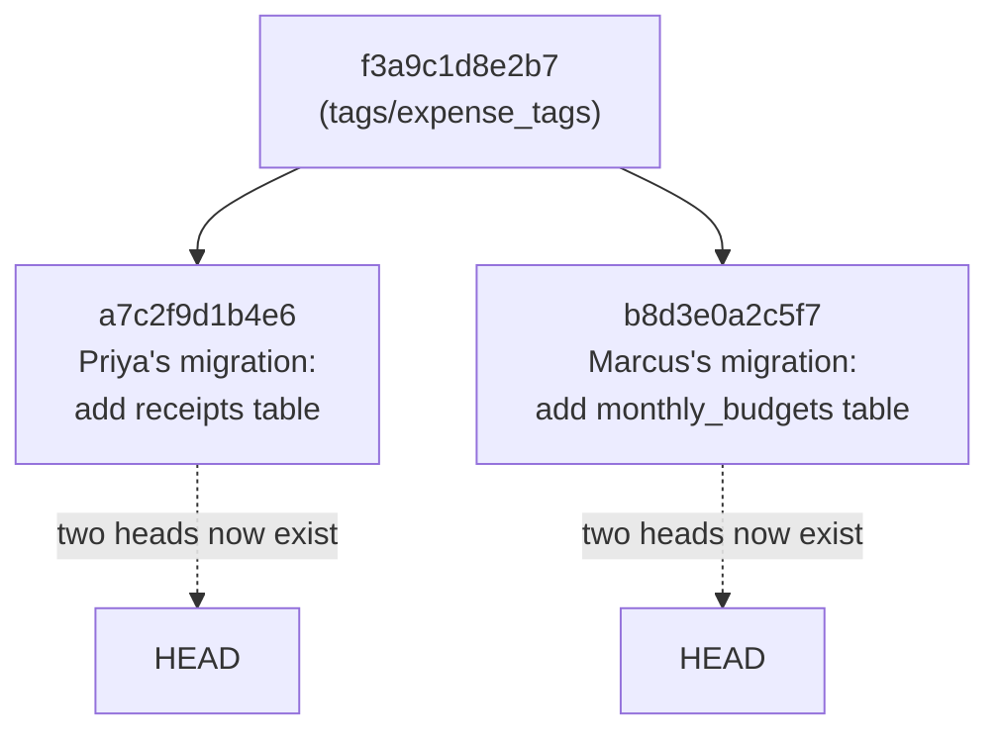

# The Version Table & Stamping

Chapters 7 and 8 covered *generating* and *writing* migrations — the code side of Alembic. This chapter turns to the other half of the picture: what Alembic actually stores *inside your database* to know which migrations have already run, and how you can deliberately manipulate that state directly with `alembic stamp` — a command that's essential for two very different situations (adopting Alembic on a database that already exists, and recovering from drift) and genuinely dangerous if used carelessly. Understanding this table precisely is also the last piece you need before Chapter 10, where two ExpenseFlow developers accidentally create a multi-head situation and you'll see exactly how the version table behaves once a migration graph stops being a simple straight line.

---

## Learning Objectives

By the end of this chapter, you will be able to:

- Describe the exact structure and contents of the `alembic_version` table.
- Explain why this one table is the entirety of Alembic's runtime state inside your database.
- Use `alembic stamp head` to adopt Alembic on a pre-existing database without running any migrations.
- Use `alembic stamp <revision>` to correct drift between what Alembic believes ran and what actually ran.
- Identify at least two ways stamping incorrectly can cause silent, serious damage.
- Predict how `alembic_version` behaves once a migration graph has multiple heads, as a bridge into Chapter 10.

---

## Prerequisites for This Chapter

This chapter builds on [Chapter 8: Writing Manual Migrations](./08-writing-manual-migrations.md) and, more distantly, on:

- The migration graph concept — `revision`, `down_revision`, `head`, `base` — from [Chapter 2](./02-core-concepts.md) and [Chapter 5](./05-revisions-and-version-history.md).
- `alembic upgrade`/`downgrade` mechanics from [Chapter 6](./06-upgrade-and-downgrade.md).
- ExpenseFlow's current schema at `head`: `users`, `expenses`, `categories`, `tags`, `expense_tags` — five tables, all created through the migrations built in Chapters 5 through 8.

---

## 1. What `alembic_version` Actually Is

### 1.1 A one-row (usually) bookkeeping table

The first time you run `alembic upgrade` against any database, Alembic creates a table named `alembic_version` if it doesn't already exist, with a structure this simple:

```sql
CREATE TABLE alembic_version (
    version_num VARCHAR(32) NOT NULL,
    CONSTRAINT alembic_version_pkc PRIMARY KEY (version_num)
);
```

That's the entire schema: one column, `version_num`, holding a revision ID string, with that column also serving as the primary key. For a normal, unbranched project — which is everything you've built through Chapter 8 — this table holds **exactly one row**, containing the revision ID of whichever migration was most recently applied. After ExpenseFlow's Chapter 8 migration, querying it directly returns:

```sql
SELECT * FROM alembic_version;
```

```
       version_num
--------------------
 f3a9c1d8e2b7
(1 row)
```

That's the same `f3a9c1d8e2b7` you saw as the `revision` field inside the migration file from Chapter 8 — the table literally just names "the last migration file that ran here."

### 1.2 How `alembic current` and `alembic upgrade` use it

Every time you run `alembic current`, `alembic upgrade`, or `alembic downgrade`, Alembic's `MigrationContext` (Chapter 3) reads this table first, before doing anything else, to establish "where is this specific database, right now, in the migration graph." Concretely:



Two things to notice: first, Alembic reads `alembic_version` to find its **starting point**, then consults the migration files on disk (`ScriptDirectory`, Chapter 3) to compute the **path** from there to the requested target — the table alone doesn't know about the whole graph, only "where are we." Second, and more important: **the `UPDATE alembic_version` statement runs inside the same transaction as the migration's own DDL.** If a migration's `upgrade()` fails partway through, PostgreSQL rolls back the whole transaction, including the `alembic_version` update — so the table never claims a migration succeeded when it didn't. This is exactly why Alembic can be trusted after a failed migration: `alembic current` will still correctly report the *previous* successful revision, not the one that just failed.

### 1.3 Why this is the *only* state Alembic keeps in the database

This is worth stating as plainly as possible, because it's easy to assume there's more going on: **`alembic_version` is the entire runtime state Alembic stores inside your database.** There is no table of "migrations that ran and when," no checksum of each migration file's contents, no history log, no record of who ran what. Every other piece of information Alembic needs — the full migration graph, each revision's `upgrade()`/`downgrade()` code, commit messages, authorship — lives entirely in the migration files under `alembic/versions/`, i.e., in your **version control system** (git), not in the database at all.

| Lives in the database (`alembic_version`) | Lives in your migration files / git |
|---|---|
| The single revision ID the database is currently at | Every revision's ID, `down_revision`, and code |
| — | The entire migration graph structure |
| — | Commit history, PR review, blame |
| — | Which migrations exist at all |

This split is deliberate and important: it means the database's migration state is minimal and cheap to inspect or repair (Section 3), while the actual source of truth for "what changes exist and in what order" is code, reviewable and diffable exactly like any other code change. It's also why two different databases (say, your local dev database and CI's ephemeral database) can be at completely different revisions and Alembic handles that correctly by design — it just reads each database's own `alembic_version` row and computes its own path to `head` independently.

### 1.4 The table name and location are configurable, but rarely need to be

By default the table is literally named `alembic_version` and lives in the database's default schema (`public`, on PostgreSQL). Two `env.py`/`context.configure(...)` options let you change this, which matters mainly for multi-tenant or multi-service setups sharing one physical database:

```python
context.configure(
    connection=connection,
    target_metadata=target_metadata,
    version_table="alembic_version",       # default; override if it collides
    version_table_schema="public",         # override to isolate per-schema migration state
)
```

ExpenseFlow doesn't need either override today — one service, one schema, one database. But it's worth knowing they exist, because the moment a second service starts sharing the same physical PostgreSQL instance (a common real-world scenario as a company grows past its first service), each service's Alembic project needs its own `alembic_version` table — either via `version_table_schema` pointing each service at its own schema, or via entirely separate databases. Without this, two independently-versioned services would silently stomp on the same one-row bookkeeping table, and each would believe the other's migrations were its own.

### 1.5 Inspecting version state across environments

Because `alembic_version` is just an ordinary table, nothing stops you from checking it directly with a plain SQL client — this is often faster than parsing `alembic current`'s output when you're checking several environments at once, or when you don't have Alembic's Python environment set up on a machine but do have `psql` access:

```bash
psql "$STAGING_DATABASE_URL" -c "SELECT * FROM alembic_version;"
psql "$PROD_DATABASE_URL" -c "SELECT * FROM alembic_version;"
```

Comparing the two outputs against `alembic heads` (which revision(s) the migration files on disk consider current) is a fast, dependency-free sanity check before any deploy that includes a new migration — if staging's `version_num` doesn't match what you expect after your last deploy there, that's worth investigating before you repeat whatever happened on production.

---

## 2. `alembic stamp`: Setting Version State Without Running Migrations

### 2.1 What `stamp` does, precisely

```bash
alembic stamp head
```

`alembic stamp <target>` writes `<target>`'s resolved revision ID directly into `alembic_version` — **without running any `upgrade()` or `downgrade()` code at all.** No DDL executes. No tables are created, altered, or dropped. The only effect is an `INSERT` or `UPDATE` against that one-column table. This is fundamentally different from `alembic upgrade head`, which runs every pending migration's actual code *and* updates the table as a side effect of doing so — `stamp` skips straight to updating the table, on the assumption that whatever the target revision describes already matches reality.



### 2.2 Use case 1: adopting Alembic on an existing database

The most common legitimate use of `stamp` is bringing Alembic into a project whose database *already has* tables — created some other way (a hand-run `CREATE TABLE` script, a previous migration tool, `Base.metadata.create_all()` during early prototyping) — and you want Alembic to take over from here without trying to recreate tables that already exist.

The workflow: write (or autogenerate, then heavily review) an initial migration whose `upgrade()` describes the *current* state of that database exactly, then instead of running it with `alembic upgrade head` (which would try to `CREATE TABLE users`, fail immediately because `users` already exists), you tell Alembic "the database is already at this revision" with:

```bash
alembic stamp head
```

From that point forward, `alembic upgrade head` on this database is a no-op (there's nothing pending), and every *future* migration — the first genuinely new one — runs normally against a database Alembic now correctly believes is at `head`. This is precisely how a team would introduce Alembic into an ExpenseFlow-like project that started life with a single hand-written `schema.sql` file before anyone set up migrations at all: write one migration matching `schema.sql`'s current state, `alembic stamp head` every existing environment (dev, staging, prod) against it, and migrate normally from there on.

### 2.3 Use case 2: fixing drift

The second legitimate use is recovering from a database whose `alembic_version` has fallen out of sync with reality — for example, someone ran a migration's SQL manually against production during an incident (bypassing Alembic entirely) instead of through `alembic upgrade`, and now `alembic current` reports a revision that's technically behind what the schema actually contains. If you're confident the schema now genuinely matches a specific later revision (because you've manually verified every table/column/constraint that revision would have created is actually present), `alembic stamp <that-revision>` corrects `alembic_version` to reflect reality — again, without re-running any DDL, which would fail anyway since the objects already exist.

```bash
alembic stamp 7f3a1c9d2b44
```

You can stamp any specific revision, not just `head` — useful for both partial-drift correction and, in Chapter 10, for scenarios involving more than one active head.

### 2.4 `--sql` mode and `--purge`

Like `upgrade`/`downgrade` (Chapter 6), `stamp` supports offline `--sql` mode:

```bash
alembic stamp head --sql
```

This prints the `INSERT`/`UPDATE` statement that *would* run against `alembic_version`, without executing it — useful when a DBA or change-management process requires every statement touching a production database to go through a reviewed, explicit script, even a one-line bookkeeping update. It's a smaller version of the same offline-mode discipline from Chapter 6, applied here to the version table itself rather than to schema DDL.

`alembic stamp --purge head` is a related, more forceful variant: it deletes *all* rows from `alembic_version` before inserting the new one, rather than updating in place. This matters specifically in the multi-head scenario previewed in Section 4 below — if a database somehow ended up with stale or duplicate rows in `alembic_version` (for instance, after a botched manual fix), `--purge` gives you a clean way to reset the table to a single, known-correct row rather than trying to reason about whatever rows are currently sitting in it.

---

## 3. The Dangers of Stamping Incorrectly

`stamp` is powerful precisely because it bypasses every safety mechanism Alembic normally provides — no DDL runs, so there's nothing to fail, which means there's also nothing to catch you if the revision you stamp to doesn't actually match the database's real state. This produces a specific, serious failure mode: **a false sense of synchronization.**

Concretely, if you `alembic stamp head` a database that is *not* actually at `head` — say, a colleague meant to run `alembic upgrade head` after pulling new migrations but typed `stamp` by muscle memory instead — the immediate symptom is nothing at all. `alembic current` now reports `head`. Everything looks fine. The actual damage surfaces later and indirectly: every migration between the database's true state and `head` is now permanently invisible to Alembic on this database. `alembic upgrade head` will report nothing pending, forever, on this specific database, even though tables or columns those skipped migrations would have created are simply missing. The application then fails at runtime — a query against a column that was never actually added — and the failure looks like an application bug or a data problem, not a migration problem, because Alembic itself insists this database is fully up to date.

| Scenario | What actually happens | How it's discovered |
|---|---|---|
| Correct: `stamp head` on a DB whose schema genuinely matches `head` (Section 2.2 adoption case) | `alembic_version` now correctly reflects reality | No problem — this is the intended use |
| Incorrect: `stamp head` on a DB that's actually several migrations behind | `alembic_version` claims `head`, but tables/columns from skipped migrations don't exist | Application errors at runtime, often much later, disconnected from the stamp command itself |
| Incorrect: `stamp <rev>` to a revision *earlier* than the DB's real state | `alembic upgrade head` will try to re-run migrations whose DDL already applied | Migration fails loudly (e.g., "table already exists") — safer than the above because it fails immediately |

Notice the asymmetry in that table: stamping *forward* of reality fails silently and later; stamping *backward* of reality tends to fail loudly and immediately, the next time someone runs `upgrade`. That asymmetry is worth remembering — a mistaken stamp in the "too far ahead" direction is the one that actually causes production incidents, because nothing catches it until an unrelated code path hits the missing schema object.

The rule that follows directly from this: **never stamp a revision without independently verifying, by inspecting the actual database schema, that it truly matches what that revision describes.** `stamp` should feel like a deliberate, manually-verified administrative action — closer to editing a production database directly than to running a normal migration — never a shortcut to "make the error go away."

---

## 4. Preview: Multiple Heads and `alembic_version`

Everything in Sections 1–3 assumed a single, linear migration history — exactly what ExpenseFlow has had through Chapter 8, one `down_revision` chain, one `head`, one row in `alembic_version`. Chapter 10 introduces a realistic complication: two developers, Priya and Marcus, each branch off this chapter's `head` (`f3a9c1d8e2b7`, the `tags`/`expense_tags` migration) at the same time — Priya adds a `receipts` table, Marcus adds a `monthly_budgets` table — and both of their migrations end up with the *same* `down_revision`, because neither developer's local `head` had seen the other's work yet.



The migration graph now has **two heads** instead of one — `alembic heads` reports both revision IDs, and `alembic upgrade head` (singular) becomes ambiguous in a way Alembic will refuse to resolve silently. This matters directly for this chapter's topic because of how `alembic_version` behaves once a database has actually applied migrations down *both* branches (which requires the merge machinery Chapter 10 covers): the table is capable of holding **more than one row simultaneously**, one row per currently-applied head, until a merge revision (`alembic merge heads`) unifies them back into a single row pointing at one merge-point revision.

### 4.1 Why the table can hold more than one row at all

Recall from Section 1.1 that `version_num` is itself the primary key — not an auto-incrementing surrogate `id` with `version_num` as a separate column. That design choice is precisely what makes multiple simultaneous rows possible and meaningful: each row is an independent, uniquely-identified "this database has applied everything up through this specific head" fact, not a single mutable pointer that could only ever hold one value. When `alembic upgrade heads` (plural — a real subcommand distinct from `upgrade head`) is run against a database sitting at `f3a9c1d8e2b7`, Alembic applies both Priya's and Marcus's migrations and inserts **two** rows into `alembic_version`, one per branch tip:

```sql
SELECT * FROM alembic_version;
```

```
       version_num
--------------------
 a7c2f9d1b4e6
 b8d3e0a2c5f7
(2 rows)
```

### 4.2 What each state means operationally

| `alembic_version` state | What it means | What `alembic upgrade head` (singular) does |
|---|---|---|
| One row, pointing at a single linear head | Normal, healthy state — everything through Chapter 8 | Applies any newly-added linear migrations normally |
| Two rows, one per branch tip | Database has applied both divergent migrations, but they've never been reconciled into one lineage | Alembic refuses — `head` is ambiguous with more than one current head; you must specify `heads` (plural) or merge first |
| One row, pointing at a merge revision | `alembic merge heads` (Chapter 10) created a new revision whose `down_revision` is a tuple of both branch tips, and it's been applied | Back to normal — a single, well-defined head to target |

The practical implication for this chapter: if you ever run `SELECT * FROM alembic_version` and see more than one row, that is not corruption and not a bug — it is Alembic accurately reporting "this database has independently applied two migrations that were never given a defined order relative to each other." It's a real, if temporary, state that demands a decision (which of Chapter 10's merge strategies to apply), not a state to panic over or try to manually collapse with a raw `DELETE`.

For now, the takeaway to carry into Chapter 10 is narrow but important: `alembic_version` holding a single row is a property of a linear graph, not a fundamental limit of the table's design — its schema (`version_num` as primary key) already anticipates multiple simultaneous rows, and you're about to see exactly when and why that happens, and how `alembic merge heads` resolves it back to one.

---

## Real-World Scenario

**Setup:** ExpenseFlow's platform team is asked to bring a legacy internal reporting database under Alembic's management. This database was created years ago by a predecessor team, has `users` and `expenses`-equivalent tables already populated with years of real data, and has never had any migration tool pointed at it — schema changes so far have all been hand-run `ALTER TABLE` statements during deploys, tracked (inconsistently) in a shared wiki page.

**The naive approach, and why it's wrong:** A new team member's first instinct is to run `alembic upgrade head` directly against this database using ExpenseFlow's existing migration chain from Chapters 5–8. This fails immediately and loudly — `CREATE TABLE users` fails because `users` already exists — which is at least a safe failure (Section 3's "stamping backward of reality" pattern, except here it's "running forward against a DB that's already ahead of revision zero"). It's the right instinct that something needs reconciling, but the wrong mechanism.

**The correct approach:** The team writes one new initial migration (a `down_revision = None` root, or grafted appropriately depending on how they want the two histories to relate) whose `upgrade()` body exactly matches this legacy database's real, current schema — verified column by column, constraint by constraint, against the live database, not guessed from the wiki page. Critically, they do **not** run this migration with `alembic upgrade head`. Instead:

```bash
alembic stamp head
```

This marks the legacy database as being at that revision without attempting to re-create anything that already exists. `alembic current` now correctly reports the new revision. From this point forward, every future schema change to this database goes through a normal, reviewed migration, exactly like ExpenseFlow's primary database — the wiki page is retired.

**Where it almost went wrong:** During review, a teammate points out that the migration's `upgrade()` body, written from the wiki page rather than the live database, is missing a `created_by` column that was added in an undocumented hotfix eighteen months ago and never made it into the wiki. Had the team stamped against the wiki-derived migration without cross-checking the *actual* live schema first, `alembic_version` would have claimed a state that didn't quite match reality — a smaller-scale version of exactly the "stamped too far ahead" failure mode from Section 3, except discovered in review instead of in production. The fix: they add the missing column to the initial migration's `upgrade()` body before stamping, so what gets stamped is accurate, not just plausible.

---

## Best Practices

- **Treat `stamp` as a manual administrative action, not a routine command** — always verify the actual database schema matches the target revision before stamping, never stamp to "make an error go away" without that verification (Section 3).
- **Use `stamp` for its two legitimate purposes only**: adopting Alembic on a pre-existing database (Section 2.2), and correcting confirmed, verified drift (Section 2.3).
- **When adopting Alembic on an existing database, derive the initial migration from the live schema, not from documentation** — wiki pages and README notes drift from reality; `information_schema`/`pg_catalog` does not (this chapter's Real-World Scenario).
- **Never assume `alembic_version` tracks more than "where is this database right now"** — it holds no history, no checksums, no author information; that all lives in your migration files and git (Section 1.3).
- **Remember the transactional guarantee**: a failed migration's DDL and its `alembic_version` update roll back together, so `alembic current` never lies about a partially-applied migration (Section 1.2) — but `stamp` has no such safety net, since it never runs DDL to fail in the first place.
- **Query `alembic_version` directly when debugging drift** — `SELECT * FROM alembic_version` is a completely safe, read-only way to see exactly what Alembic believes, independent of whatever `alembic current` prints.

---

## Common Mistakes

- **Running `alembic stamp head` instead of `alembic upgrade head` by habit or typo**, silently marking a database as current when real migrations were never actually applied — the single most damaging mistake in this chapter (Section 3).
- **Stamping a database to a revision derived from documentation instead of the live schema**, producing a mismatch that surfaces later as a confusing runtime error unrelated to the stamp itself.
- **Assuming `alembic_version` records *when* or *by whom* a migration ran** — it records neither; that information, if you need it, must come from your own deployment logs or git history, not from Alembic's internal state.
- **Manually editing `alembic_version` with a raw `UPDATE` statement** instead of using `alembic stamp` — functionally similar, but bypasses Alembic's own revision-resolution logic (e.g., resolving `head`, partial revision ID prefixes), making it easier to write an invalid or malformed revision ID by hand.
- **Forgetting that `stamp` performs zero validation against the migration graph's actual structure** — it will happily accept a revision ID that doesn't logically follow from the database's prior migrations if you tell it to.
- **Discovering a bad stamp only after a subsequent teammate's `alembic upgrade head` silently does nothing**, then spending hours debugging an application error before realizing the migration state itself was wrong all along.

---

## Summary

- `alembic_version` is a single-column table holding the revision ID(s) a database currently believes it's at — for a linear history, exactly one row (Section 1.1).
- Every `alembic current`/`upgrade`/`downgrade` invocation reads this table first to establish its starting point, and updates it inside the same transaction as any DDL it runs (Section 1.2).
- This table is the **entire** state Alembic keeps in the database — history, authorship, and the full migration graph all live in your migration files and git, not here (Section 1.3).
- `alembic stamp <target>` writes a revision ID into this table directly, without running any migration code — used for adopting Alembic on an existing database and for correcting verified drift (Section 2).
- Stamping incorrectly is dangerous specifically because it bypasses every safety check DDL execution would normally provide; stamping too far ahead of reality fails silently and later, which is the more damaging direction (Section 3).
- The table's schema already anticipates holding more than one row simultaneously — exactly what happens once a migration graph has multiple heads, previewed here and covered fully in Chapter 10 (Section 4).

---

## Knowledge Check

1. What columns does `alembic_version` have, and what does each row represent?
2. Why is it safe to trust `alembic current` after a migration fails partway through, in terms of what happens to `alembic_version` specifically?
3. Name the two legitimate use cases for `alembic stamp`, and explain why each one is a case where you deliberately do not want `upgrade()`'s DDL to run.
4. Why is stamping a database "too far ahead" of its real state more dangerous in practice than stamping it "too far behind"?
5. What information about your migration history does `alembic_version` *not* store, and where does that information actually live instead?
6. In the Real-World Scenario, what specifically went wrong with the first draft of the legacy-database migration, and how was it caught?
7. Why does `alembic_version`'s schema (a `version_num` primary key column) already anticipate the multi-head scenario previewed in Section 4, even before Chapter 10 introduces branching?

---

## Hands-On Exercise

**Goal:** Inspect `alembic_version` directly, then simulate both the correct and incorrect uses of `alembic stamp` against a disposable copy of ExpenseFlow's database.

1. **Confirm your starting state.** Run `alembic current` against your ExpenseFlow database (should report the Chapter 8 `head`, `f3a9c1d8e2b7`), then connect with `psql` and run `SELECT * FROM alembic_version;` directly — confirm the row matches.
2. **Simulate adopting Alembic on an existing database.** Create a fresh, empty PostgreSQL database (e.g., `createdb expenseflow_legacy_sim`). Manually run the `CREATE TABLE` statements for `users` and `expenses` only (copy them from Chapter 5's or Chapter 6's migration files, or from `psql`'s `\d` output against your main database) — simulating a database that predates Alembic.
3. **Point Alembic at this new database** (temporarily override `sqlalchemy.url`, or pass `-x` a config option if your `env.py` supports it) and confirm `alembic upgrade head` fails with a "relation already exists" error — this is the "running forward against a DB that's already ahead" failure from the Real-World Scenario.
4. **Stamp it correctly.** Identify (or write) the specific revision ID whose `upgrade()` matches exactly what you manually created (just `users`/`expenses`, nothing else) — likely an early Chapter 5/6 revision, not `head`. Run `alembic stamp <that-revision-id>` against the simulated legacy database, then confirm `alembic current` now reports it.
5. **Verify forward migration now works.** Run `alembic upgrade head` against the simulated database and confirm it applies exactly the migrations after your stamped revision (categories, then tags/expense_tags) — proving the stamp correctly told Alembic "everything up to here already exists."
6. **Now deliberately reproduce the dangerous case.** Create a second fresh empty database, this time genuinely empty (no tables at all), and run `alembic stamp head` directly against it — no `upgrade` first. Confirm `alembic current` now falsely reports `head` even though the database has zero tables.
7. **Observe the silent failure.** Run `alembic upgrade head` against this second database and confirm it reports nothing to do, despite the database being completely empty — then try querying `SELECT * FROM users;` against it and observe the "relation does not exist" error, disconnected from any Alembic command. This is the exact failure mode described in Section 3 — reproduce it deliberately here, in a disposable database, so you recognize it instantly if you ever see it for real.
8. **Clean up** both simulated databases (`dropdb`) once you've confirmed both outcomes.

---

## Further Reading

- [Alembic Official Documentation](https://alembic.sqlalchemy.org/en/latest/) — the `alembic_version` table and `stamp` command are documented throughout the command reference and tutorial.
- [Alembic Tutorial](https://alembic.sqlalchemy.org/en/latest/tutorial.html) — covers the basic `stamp` workflow for adopting Alembic on an existing database.
- [Alembic Branches Documentation](https://alembic.sqlalchemy.org/en/latest/branches.html) — the authoritative reference for the multiple-heads behavior previewed in Section 4, fully covered in Chapter 10.
- [Alembic GitHub Repository](https://github.com/sqlalchemy/alembic) — for reading `MigrationContext`'s actual implementation if you want to see exactly how `alembic_version` reads/writes are performed.
- [PostgreSQL `information_schema`/`pg_catalog` reference, via ALTER TABLE docs](https://www.postgresql.org/docs/current/sql-altertable.html) — useful background for verifying a live schema by hand, as required before any responsible `stamp` (Section 3, Real-World Scenario).

---

<div style="display:flex;justify-content:space-between;align-items:center;">
  <a href="./08-writing-manual-migrations.md">← Previous: Writing Manual Migrations</a>
  <a href="./00-index.md">🏠 Index</a>
  <a href="./10-branches-and-merge-migrations.md">Next: Branches & Merge Migrations →</a>
</div>
