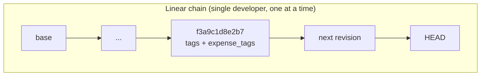
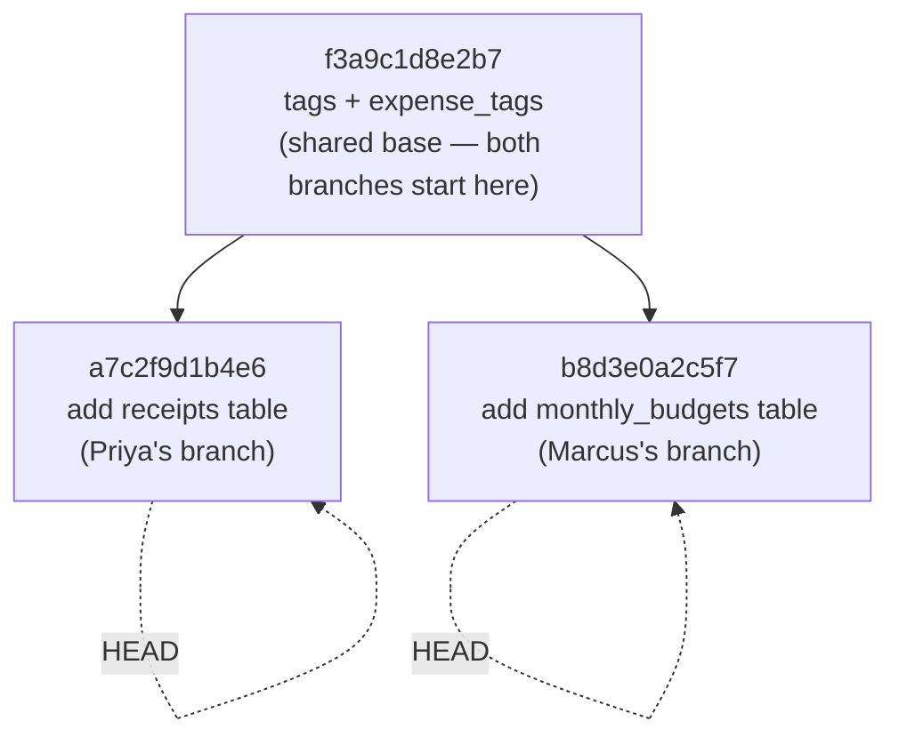
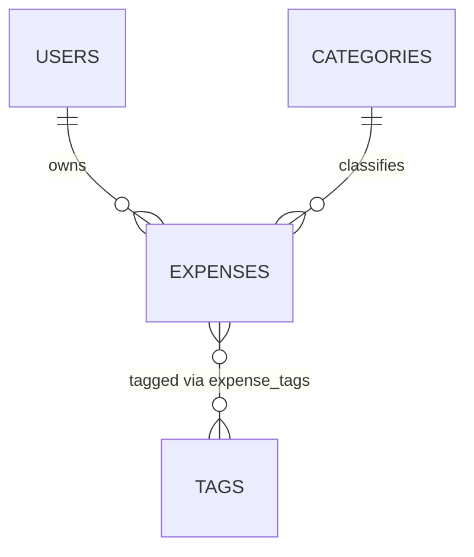
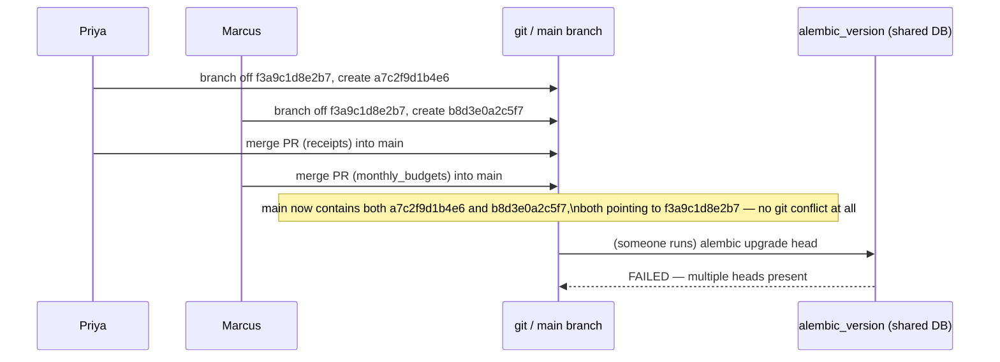
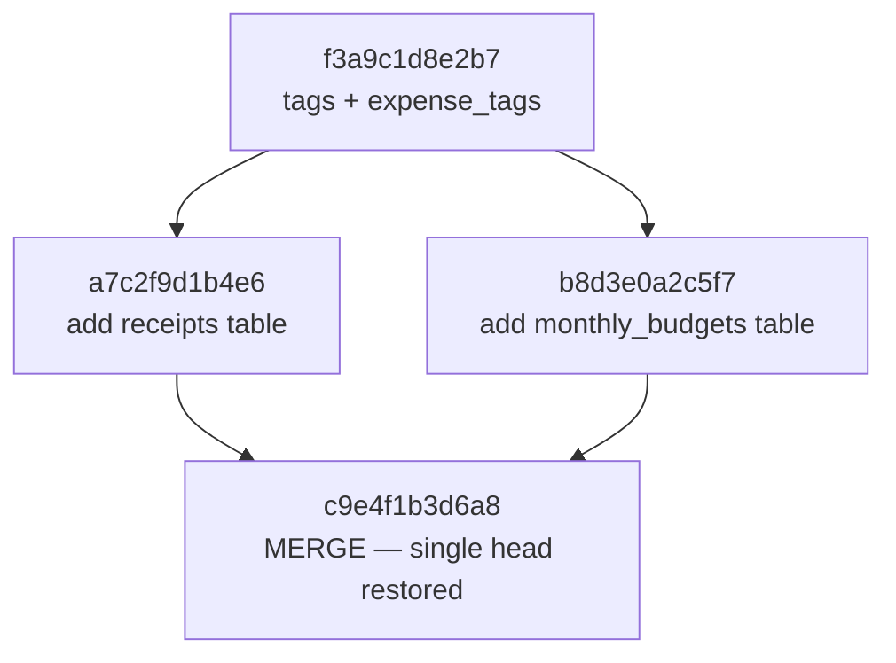

# Branches & Merge Migrations

[Chapter 9](./09-the-version-table-and-stamping.md) opened up the `alembic_version` table and showed you the one piece of state Alembic actually keeps in the database: a pointer (or, as you saw in passing, potentially more than one pointer) to the revision(s) currently applied. We deferred the "more than one pointer" case to this chapter, and now it's time to earn that deferral. The moment more than one developer works on ExpenseFlow's schema at the same time, the single, tidy chain of revisions you've been building since Chapter 5 stops being a chain at all — it becomes a tree. This chapter is about what happens when that tree grows two tips instead of one, how Alembic represents that honestly instead of hiding it from you, and how you fold the two tips back into one without losing anyone's work.

---

## Learning Objectives

By the end of this chapter, you will be able to:

- Explain precisely how a migration graph goes from linear to branched, in terms of `down_revision` values.
- Read the output of `alembic heads` and `alembic branches` and correctly diagnose a multi-head situation.
- Create a merge revision with `alembic merge heads` and explain what a merge revision's `down_revision` tuple means.
- Resolve a real two-developer branch collision on ExpenseFlow's schema (`receipts` vs. `monthly_budgets`) from divergence to a single head.
- Apply a merge migration with `alembic upgrade head` and verify the `alembic_version` table returns to a single row.
- Adopt team practices that make branch collisions rare and, when they do happen, cheap to resolve.

---

## Prerequisites for This Chapter

This chapter assumes you're comfortable with everything from [Chapter 5: Revisions & Version History](./05-revisions-and-version-history.md) (the migration graph as a linked list, `down_revision`, `alembic history`) and [Chapter 9: The Version Table & Stamping](./09-the-version-table-and-stamping.md) (the `alembic_version` table, and its preview of multi-head storage). You should also have read [Chapter 8: Writing Manual Migrations](./08-writing-manual-migrations.md), since the worked example in this chapter picks up right where Chapter 8 left off: ExpenseFlow's schema after the `tags`/`expense_tags` many-to-many migration, with revision `f3a9c1d8e2b7` as the current single head.

---

## 1. How a Migration Graph Branches

### 1.1 The linear chain, and where it stops being one

Every revision file Alembic generates carries a `down_revision` — the ID of the revision it was written on top of. Chapter 5 showed you that this single attribute is the entire mechanism behind `alembic history`: walk the chain of `down_revision` pointers backwards from any revision and you get the full order in which migrations must run. As long as every new revision is created against whatever the *current* single head is, that chain stays a straight line — revision B points back to A, revision C points back to B, and so on, with exactly one revision at the front (the **head**) and exactly one at the back (the **base**).

Nothing in Alembic *requires* that discipline, though. `down_revision` is just a value written into a Python file — nothing stops two different revision files from both pointing back to the *same* `down_revision`. And that is exactly what happens, almost by accident, the moment two developers each run `alembic revision` against the same starting point without coordinating:





Both `a7c2f9d1b4e6` and `b8d3e0a2c5f7` are perfectly valid revisions on their own. Each one's `down_revision` correctly points at `f3a9c1d8e2b7`, the revision that really was the head at the moment its author ran `alembic revision`. Neither developer did anything wrong in isolation. The problem only exists in the union of both branches: there are now **two heads**, and Alembic has no way to know which one should come "after" the other, because neither one's `down_revision` points at the other.

### 1.2 Why Alembic doesn't just pick one

It would be technically possible for Alembic to silently pick a winner — say, whichever revision file has the lexicographically larger ID — and quietly apply both in some arbitrary order. Alembic deliberately does not do this, and the reason is the same reason `git` refuses to silently resolve a merge conflict by picking one side: **doing so would apply someone's migration without them ever having reviewed how it interacts with the other branch's migration.** If Priya's `receipts` migration and Marcus's `monthly_budgets` migration were combined without a human looking at the result, an accidental table-name collision, a shared index name, or an ordering assumption ("my migration expects the `tags` table already renamed" — something a *later*, uncoordinated migration might have done) could all slip through silently.

Instead, Alembic surfaces the branch explicitly, refuses to run `alembic upgrade head` at all (there are two heads — which one is "head"?), and forces a human to create an explicit **merge revision** — a real file, checked into version control, reviewed in a pull request like any other migration, that says "these two branches are now reconciled, in this order, with these interactions accounted for." That review step is the entire point.

---

## 2. Detecting a Branch: `alembic heads` and `alembic branches`

### 2.1 `alembic heads` — how many tips does the graph have right now?

`alembic heads` prints every revision that currently has no children — every tip of the tree. On a healthy, unbranched project, this prints exactly one revision ID. The moment two developers' branches both land in the same migrations directory (via a `git merge` of their feature branches, or simply both being present on `main`), running `alembic heads` reveals the problem immediately:

```bash
$ alembic heads
a7c2f9d1b4e6 (head)
b8d3e0a2c5f7 (head)
```

Two lines, both marked `(head)`. This is Alembic's most direct signal that something needs your attention before you can run `alembic upgrade head` — in fact, it will refuse to, with an error to that effect:

```bash
$ alembic upgrade head
FAILED: Multiple head revisions are present for given argument 'head'; please specify a specific
target revision, '<branchname>@head' to narrow to a specific head, or 'heads' for all heads
```

### 2.2 `alembic branches` — where did the graph actually split?

`alembic heads` tells you *how many* tips there are, but `alembic branches` tells you *where the tree forked* — it lists every revision that has more than one child, i.e., every point where the linear chain stopped being linear:

```bash
$ alembic branches
f3a9c1d8e2b7 -> a7c2f9d1b4e6, b8d3e0a2c5f7 (branchpoint)
    tags + expense_tags (Chapter 8's last migration)
```

Reading this: revision `f3a9c1d8e2b7` — the tags/expense_tags migration from Chapter 8 — has two children instead of one. That single line *is* the diagnosis: whatever went into ExpenseFlow's schema since that shared point diverged into two independent stories that both need to be told, in order, before the graph is whole again.

### 2.3 Command reference

| Command | What it shows | When you'd run it |
|---|---|---|
| `alembic heads` | Every revision with no children (every current tip) | Before `upgrade head`, to confirm there's exactly one head |
| `alembic heads --verbose` | Same, plus the docstring/summary of each head revision | Diagnosing *which* branch is which, by content |
| `alembic branches` | Every revision that has more than one child (every fork point) | Finding *where* a graph diverged, not just that it did |
| `alembic current` | The revision(s) actually applied to the connected database | Confirming what the live DB thinks its state is, versus what the script directory contains |
| `alembic history --indicate-current` | Full revision history, marking the current one(s) | Getting an at-a-glance picture of the whole graph plus where you are in it |
| `alembic merge heads -m "..."` | Creates a new merge revision resolving all current heads into one | Once you've decided how the two branches should be reconciled |

### 2.4 Why this shows up at the worst possible time if you're not looking

The dangerous version of this scenario isn't a developer running `alembic heads` locally and noticing two heads — that's the *easy* case, caught early, fixed in five minutes. The dangerous version is when nobody runs `alembic heads` at all until a deploy pipeline tries to run `alembic upgrade head` against a shared staging or production database and gets the `FAILED: Multiple head revisions` error in the middle of a release. At that point you're debugging a migration graph problem under deploy pressure, possibly with a half-finished release blocking other work. Chapter 15's CI/CD pipeline adds a step that runs `alembic heads` (or the modern `alembic check`) *before* merging any pull request specifically to prevent this — but until you have that gate in place, catching multi-head situations is a manual discipline.

---

## 3. Worked Example: The `receipts` vs. `monthly_budgets` Collision

### 3.1 The setup

ExpenseFlow's schema, immediately after Chapter 8's `tags`/`expense_tags` migration (revision `f3a9c1d8e2b7`), looks like this:



Two feature tickets land on the team's board in the same sprint:

- **ENG-214** (assigned to Priya): "Let users attach a receipt image to an expense." This needs a new `receipts` table, one-to-many from `expenses`.
- **ENG-219** (assigned to Marcus): "Let users set a monthly spending budget per category." This needs a new `monthly_budgets` table, one-to-many from `users` (and referencing `categories`).

Neither ticket depends on the other. Both developers pull the latest `main`, see `f3a9c1d8e2b7` as the current head, and each creates a new branch off it — exactly as Chapter 8 taught them to.

### 3.2 Priya's migration — `receipts`

```bash
$ alembic revision -m "add receipts table"
Generating alembic/versions/a7c2f9d1b4e6_add_receipts_table.py ... done
```

```python
"""add receipts table

Revision ID: a7c2f9d1b4e6
Revises: f3a9c1d8e2b7
Create Date: 2026-03-03 09:14:22.185213
"""
from alembic import op
import sqlalchemy as sa

revision = "a7c2f9d1b4e6"
down_revision = "f3a9c1d8e2b7"
branch_labels = None
depends_on = None


def upgrade() -> None:
    op.create_table(
        "receipts",
        sa.Column("id", sa.Integer(), primary_key=True),
        sa.Column(
            "expense_id",
            sa.Integer(),
            sa.ForeignKey("expenses.id", ondelete="CASCADE"),
            nullable=False,
        ),
        sa.Column("file_url", sa.String(length=512), nullable=False),
        sa.Column("uploaded_at", sa.DateTime(timezone=True), server_default=sa.func.now()),
    )
    op.create_index("ix_receipts_expense_id", "receipts", ["expense_id"])


def downgrade() -> None:
    op.drop_index("ix_receipts_expense_id", table_name="receipts")
    op.drop_table("receipts")
```

### 3.3 Marcus's migration — `monthly_budgets`

```bash
$ alembic revision -m "add monthly_budgets table"
Generating alembic/versions/b8d3e0a2c5f7_add_monthly_budgets_table.py ... done
```

```python
"""add monthly_budgets table

Revision ID: b8d3e0a2c5f7
Revises: f3a9c1d8e2b7
Create Date: 2026-03-03 11:02:47.660981
"""
from alembic import op
import sqlalchemy as sa

revision = "b8d3e0a2c5f7"
down_revision = "f3a9c1d8e2b7"
branch_labels = None
depends_on = None


def upgrade() -> None:
    op.create_table(
        "monthly_budgets",
        sa.Column("id", sa.Integer(), primary_key=True),
        sa.Column("user_id", sa.Integer(), sa.ForeignKey("users.id", ondelete="CASCADE"), nullable=False),
        sa.Column("category_id", sa.Integer(), sa.ForeignKey("categories.id", ondelete="CASCADE"), nullable=False),
        sa.Column("year", sa.Integer(), nullable=False),
        sa.Column("month", sa.Integer(), nullable=False),
        sa.Column("limit_cents", sa.Integer(), nullable=False),
    )
    op.create_unique_constraint(
        "uq_monthly_budgets_user_category_period",
        "monthly_budgets",
        ["user_id", "category_id", "year", "month"],
    )


def downgrade() -> None:
    op.drop_constraint("uq_monthly_budgets_user_category_period", "monthly_budgets", type_="unique")
    op.drop_table("monthly_budgets")
```

### 3.4 The collision surfaces

Both developers write tests, get their PRs reviewed, and merge to `main` on the same afternoon — Priya's PR merges first, Marcus's ten minutes later with no conflicts (the two migration files touch entirely different tables, so `git` sees no textual conflict at all). Whoever next pulls `main` and runs `alembic heads` sees exactly the two-head output from Section 2.1. Git happily merged two files that are individually valid and mutually silent about each other's existence — this is precisely why a *textual* merge conflict is the wrong tool for catching this: there isn't one. The graph conflict is semantic, not textual, and only Alembic (or a human who thinks to run `alembic heads`) will catch it.



---

## 4. Resolving It: `alembic merge heads`

### 4.1 Creating the merge revision

Whoever discovers the two-head situation — ideally a developer running `alembic heads` locally before it ever reaches a shared environment — resolves it with a single command:

```bash
$ alembic merge heads -m "merge receipts and monthly_budgets branches"
Generating alembic/versions/c9e4f1b3d6a8_merge_receipts_and_monthly_budgets_.py ... done
```

Alembic inspects the script directory, finds every current head (both `a7c2f9d1b4e6` and `b8d3e0a2c5f7`), and generates a new revision whose `down_revision` is a **tuple** of both:

```python
"""merge receipts and monthly_budgets branches

Revision ID: c9e4f1b3d6a8
Revises: a7c2f9d1b4e6, b8d3e0a2c5f7
Create Date: 2026-03-03 15:40:03.912776
"""
from alembic import op
import sqlalchemy as sa

revision = "c9e4f1b3d6a8"
down_revision = ("a7c2f9d1b4e6", "b8d3e0a2c5f7")
branch_labels = None
depends_on = None


def upgrade() -> None:
    pass


def downgrade() -> None:
    pass
```

Notice `down_revision` is `("a7c2f9d1b4e6", "b8d3e0a2c5f7")`, not a single string — this is the one place in the whole revision-file format where `down_revision` is genuinely plural, and it's exactly how the graph records "this revision requires both of these to have already run." `upgrade()` and `downgrade()` are empty by default: a merge revision's *only* job, in the common case, is to exist as a graph join point. Both branches' actual schema changes (`receipts`, `monthly_budgets`) were already fully applied by their own migrations — the merge revision doesn't need to redo any of that DDL.

### 4.2 When the merge revision needs real code

Leave `upgrade()`/`downgrade()` empty whenever the two branches are genuinely independent, as `receipts` and `monthly_budgets` are here — neither table references the other, and nothing about one migration assumes anything about the other's result. Sometimes, though, reconciling two branches requires a small adjustment that could only be written once both sides are known — for example, if both branches had (independently, and without knowing about each other) each added a column named `notes` to two *different* tables that later needed a shared check constraint spanning both, or if one branch's table needs an index that references a column the other branch added. In that case, write real DDL into the merge revision's `upgrade()`/`downgrade()` exactly as you would in any other migration — a merge revision is a completely normal migration file in every respect except that it has two parents instead of one.

### 4.3 The graph after merging



One head again: `c9e4f1b3d6a8`. Both `receipts` and `monthly_budgets` are fully represented in the graph, in the order they were actually written, with an explicit, reviewable record of how the divergence was resolved.

### 4.4 Applying it

```bash
$ alembic heads
c9e4f1b3d6a8 (head)

$ alembic upgrade head
INFO  [alembic.runtime.migration] Running upgrade f3a9c1d8e2b7 -> a7c2f9d1b4e6, add receipts table
INFO  [alembic.runtime.migration] Running upgrade f3a9c1d8e2b7 -> b8d3e0a2c5f7, add monthly_budgets table
INFO  [alembic.runtime.migration] Running upgrade a7c2f9d1b4e6, b8d3e0a2c5f7 -> c9e4f1b3d6a8, merge receipts and monthly_budgets branches

$ alembic current
c9e4f1b3d6a8 (head)
```

Alembic applies both branch migrations (in some valid topological order — it does not matter which of the two independent branches runs first, precisely *because* they're independent) and then the merge revision, landing the database on a single row in `alembic_version` again, exactly as Chapter 9 described the version table's normal, unbranched state.

---

## 5. Team Practices to Minimize Painful Merges

A merge revision like `c9e4f1b3d6a8` is cheap when the two branches genuinely don't interact — which is the common case, and exactly what happened here. Merges get expensive when branches quietly *do* interact (competing for the same table, the same index name, or making conflicting assumptions about a shared column), and nobody notices until the merge migration is being written under time pressure. A few habits keep this rare:

- **Run `alembic heads` before opening a PR, and again before merging it.** This is the single cheapest habit on this list — it turns a multi-head situation into a two-minute local fix instead of a shared-environment incident.
- **Rebase (or at least re-check) your migration against the latest `main` before merging your feature branch**, not just your application code. If someone else's migration landed on `main` while your branch was open, your `down_revision` may need to change, or you may need a merge revision before your PR is even mergeable.
- **Coordinate on who's touching what schema, informally, for overlapping work.** A five-second Slack message ("I'm adding a `receipts` table this sprint, working off `f3a9c1d8e2b7`") costs nothing and lets a second developer notice they're about to branch off the exact same revision.
- **Keep each migration scoped to one logical change.** Small, single-purpose migrations (one new table, one new column) are far easier to reorder or merge around than large migrations that bundle several unrelated schema changes — a small migration rarely has anything to actually conflict *about*.
- **Add a CI check that fails the build on multiple heads**, previewed here and built out fully in [Chapter 15](./15-cicd-integration.md). This converts "someone eventually notices in production" into "the PR simply won't merge until it's resolved," which is a categorically safer failure mode.
- **Treat the merge revision as a real migration, not busywork.** Review it in the PR like anything else — confirm its `down_revision` tuple actually lists the heads you expect, and if it contains real DDL (Section 4.2), review that DDL with the same scrutiny as any hand-written migration from Chapter 8.

---

## Real-World Scenario

ExpenseFlow's team has grown to six engineers, and the two-ticket collision above (`receipts` vs. `monthly_budgets`) is the second time this quarter that two people have branched off the same revision without knowing it. The first time, nobody noticed until a deploy to staging failed with `FAILED: Multiple head revisions are present`, in the middle of a Friday afternoon release window, with the on-call engineer paged in to figure out why `alembic upgrade head` was refusing to run against a database that "should" have been ready to deploy.

The postmortem is short and unglamorous: both migrations were fine in isolation, git merged both PRs cleanly because there was no textual conflict, and the two-head situation existed silently on `main` for four days before anyone ran `alembic heads` against it. The fix that day was exactly the `alembic merge heads` workflow from Section 4 — five minutes of work once someone actually looked. The team's real takeaway wasn't about that specific migration; it was that **the four days of silence were the actual problem**, not the branch itself. Branches are a normal, unavoidable consequence of more than one person changing a schema — the goal was never to prevent them, it was to catch them within minutes of creation instead of days later during a deploy.

The concrete follow-up, adopted the same week: a one-line addition to the team's pre-merge CI job (`alembic heads | wc -l` must equal `1`, failing the build otherwise — Chapter 15 shows the fuller version using `alembic check`), and a norm that `alembic heads` gets run locally before pushing any branch that touches `alembic/versions/`. The `receipts`/`monthly_budgets` collision in this chapter's worked example was caught the same day it happened, by the CI check, precisely because that norm was now in place — a direct, measurable improvement over the Friday-afternoon incident that prompted it.

---

## Best Practices

- Run `alembic heads` (and, ideally, an automated CI equivalent) before every merge to `main` — catching a multi-head state early is nearly free; catching it during a deploy is not.
- Let `alembic merge heads -m "..."` generate the merge revision rather than hand-writing the `down_revision` tuple — it's easy to typo a revision ID by hand and produce a merge revision that silently doesn't actually depend on both branches.
- Keep merge revisions' `upgrade()`/`downgrade()` empty unless the two branches genuinely need reconciling code — don't manufacture work the merge doesn't need.
- Review a merge revision in its pull request exactly as you would any other migration, especially if it contains real DDL.
- Prefer small, single-purpose migrations — they branch and merge far more cheaply than large, multi-table migrations.
- Communicate proactively about schema work in flight; a shared migrations channel or a quick note in standup costs seconds and prevents days-long silent divergence.

---

## Common Mistakes

- **Not noticing a multi-head state until a deploy fails.** `alembic heads` costs nothing to run locally — not running it regularly is the actual root cause behind most painful merge stories, not branching itself.
- **Hand-editing a merge revision's `down_revision` tuple instead of letting `alembic merge heads` generate it**, risking a typo'd revision ID that silently produces an incomplete merge.
- **Treating the merge revision as pure ceremony and skipping review of it**, even when it happens to contain real reconciliation DDL (Section 4.2).
- **Assuming a clean `git merge` means the schema is fine.** Two migration files can merge with zero textual conflicts and still leave the database in a multi-head state — git's merge algorithm knows nothing about `down_revision` semantics.
- **Deleting or renaming one branch's revision file to "resolve" the collision**, instead of merging. Both branches' changes are real, already-reviewed schema changes — the resolution is a merge revision, not deleting either side's history.
- **Letting multi-head situations persist for days because no CI gate exists.** The window between divergence and discovery is exactly what turns a five-minute fix into an incident — see this chapter's Real-World Scenario.

---

## Summary

- A migration graph branches whenever two revisions share the same `down_revision` — usually because two developers each branched off the same head without coordinating (Section 1).
- `alembic heads` shows every current tip of the graph; `alembic branches` shows every point the graph forked from — together they diagnose a multi-head state precisely (Section 2).
- ExpenseFlow's worked collision — Priya's `receipts` table and Marcus's `monthly_budgets` table, both branching off `f3a9c1d8e2b7` — produced two heads with zero git conflict, because the conflict is semantic, not textual (Section 3).
- `alembic merge heads -m "..."` generates a merge revision whose `down_revision` is a tuple of all current heads, restoring a single head; its `upgrade()`/`downgrade()` are empty unless the branches need real reconciliation code (Section 4).
- Team practices — running `alembic heads` before merging, rebasing migrations against the latest `main`, keeping migrations small, and adding a CI gate — turn multi-head situations from rare incidents into routine, cheap merges (Section 5).

---

## Knowledge Check

1. Two developers each run `alembic revision -m "..."` against the same current head on the same day. Why does `git merge` not report any conflict between their two PRs, even though Alembic will refuse to run `alembic upgrade head` afterward?
2. What does `alembic branches` show you that `alembic heads` does not?
3. After running `alembic merge heads -m "..."`, what value does the new revision's `down_revision` hold, and why is it different in kind from every other revision's `down_revision` you've seen so far in this course?
4. In the ExpenseFlow worked example, why were `upgrade()` and `downgrade()` left empty in the merge revision `c9e4f1b3d6a8`? Describe a hypothetical scenario in which a merge revision would need real code in those functions.
5. Your team's deploy pipeline just failed with `FAILED: Multiple head revisions are present for given argument 'head'`. What are the exact commands you'd run, in order, to diagnose and fix this?
6. Why is "run `alembic heads` before merging" a more effective practice than "avoid having two developers touch schema in the same sprint"?

---

## Hands-On Exercise

**Goal:** Reproduce the `receipts`/`monthly_budgets` branch collision from this chapter against a local ExpenseFlow database, and resolve it with a merge revision.

1. Starting from ExpenseFlow's schema at the end of Chapter 8 (current head `f3a9c1d8e2b7`), confirm you're on a single head: `alembic heads`.
2. Create the first branch: `alembic revision -m "add receipts table"`. Edit the generated file so its `upgrade()`/`downgrade()` match Section 3.2's `receipts` table (id, `expense_id` FK to `expenses.id`, `file_url`, `uploaded_at`).
3. Without applying that migration yet, create the second branch off the *same* original head: temporarily note the revision ID from step 2, then hand-edit the new file's `down_revision` back to `f3a9c1d8e2b7` (simulating a second developer who branched before step 2's migration existed) — or, more realistically, use `git stash` to set aside step 2's file, run `alembic revision -m "add monthly_budgets table"`, restore the stashed file, and confirm both files now share the same `down_revision`.
4. Edit the `monthly_budgets` file to match Section 3.3 (id, `user_id` FK, `category_id` FK, `year`, `month`, `limit_cents`, plus the unique constraint).
5. Run `alembic heads` and confirm you now see two head revisions, matching Section 2.1's output.
6. Run `alembic branches` and confirm the shared branch point is reported as `f3a9c1d8e2b7`.
7. Resolve it: `alembic merge heads -m "merge receipts and monthly_budgets branches"`. Open the generated file and confirm its `down_revision` is a tuple containing both branch revision IDs.
8. Run `alembic upgrade head` against your local Postgres instance, then `alembic current`, and confirm the database lands on a single head — the merge revision's ID.
9. Inspect the database directly (`\d receipts` and `\d monthly_budgets` in `psql`) to confirm both tables exist, proving both branches' changes were applied even though only the merge revision is now reported as current.

---

## Further Reading

- [Alembic Branches documentation](https://alembic.sqlalchemy.org/en/latest/branches.html) — the canonical reference for everything in this chapter: branch points, merge revisions, and multi-head workflows.
- [Alembic Tutorial](https://alembic.sqlalchemy.org/en/latest/tutorial.html) — background on the revision graph mechanics this chapter builds on.
- [Alembic Operation Reference (`op.*`)](https://alembic.sqlalchemy.org/en/latest/ops.html) — reference for the `op.create_table`/`op.create_unique_constraint` directives used in the worked example.
- [Alembic Cookbook](https://alembic.sqlalchemy.org/en/latest/cookbook.html) — includes recipes for more advanced branch-management scenarios (labeled branches, `depends_on`).
- [Alembic GitHub Repository](https://github.com/sqlalchemy/alembic) — for browsing real-world merge-revision examples across the project's own migration history.

---

<div style="display:flex;justify-content:space-between;align-items:center;">
  <a href="./09-the-version-table-and-stamping.md">← Previous: The Version Table & Stamping</a>
  <a href="./00-index.md">🏠 Index</a>
  <a href="./11-data-migrations.md">Next: Data Migrations →</a>
</div>
