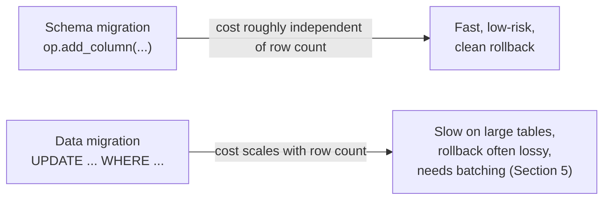
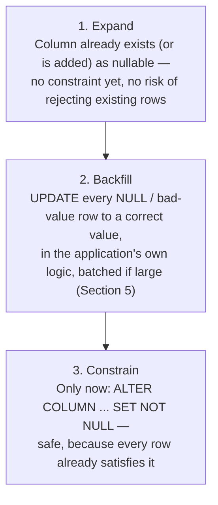
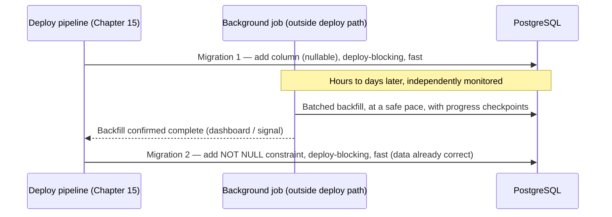

# Data Migrations

[Chapter 10](./10-branches-and-merge-migrations.md) resolved a purely structural problem: two developers' schema changes had diverged and needed reconciling, but neither `receipts` nor `monthly_budgets` needed a single row of data touched to bring them into existence — `CREATE TABLE` doesn't care what's already in the database. This chapter is about a different, harder problem: changes that need to reach into rows that already exist and transform them. Every migration you've written since Chapter 6 has changed the *shape* of ExpenseFlow's tables. This chapter is about changing the *contents* — safely, on a database that real users are actively reading from and writing to while your migration runs.

---

## Learning Objectives

By the end of this chapter, you will be able to:

- Explain why a data migration is a fundamentally different operational risk than a schema migration, even when both live in the same `alembic/versions/` directory.
- Apply the expand → backfill → constrain pattern to add a `NOT NULL` guarantee to an existing column without ever locking the table on a inconsistent state.
- Use `op.get_bind()` and `sa.table()`/`sa.column()` to run `UPDATE`/`INSERT` statements inside a migration without importing your live ORM models.
- Seed static lookup data (ExpenseFlow's default categories) idempotently, so the seed migration is safe to re-run or re-deploy.
- Batch a large backfill into bounded chunks to avoid holding one enormous transaction or one long-lived table lock.
- Decide, with a concrete rule of thumb, when a data migration belongs in the deploy path at all versus in an out-of-band background job.

---

## Prerequisites for This Chapter

You'll need everything from [Chapter 8: Writing Manual Migrations](./08-writing-manual-migrations.md) (the `op.*` directive catalog, and comfort writing `upgrade()`/`downgrade()` by hand) and [Chapter 2: Core Concepts](./02-core-concepts.md)'s early distinction between schema and data migrations, which this chapter now makes fully concrete. [Chapter 10](./10-branches-and-merge-migrations.md)'s merge resolved ExpenseFlow's schema to a single head containing `users`, `expenses`, `categories`, `tags`, `expense_tags`, `receipts`, and `monthly_budgets` — that's the schema this chapter's migrations run against.

---

## 1. Schema Migrations and Data Migrations Are Different Operational Concerns

It's tempting to think of a "data migration" as just a migration file whose `upgrade()` happens to contain an `UPDATE` statement instead of an `op.add_column()` call — mechanically, that's true, and Alembic draws no hard line between the two. Operationally, though, they differ in nearly every dimension that matters when something goes wrong at 2 a.m.:

| Dimension | Schema migration (e.g. `op.add_column`) | Data migration (e.g. backfilling a column) |
|---|---|---|
| **Runtime cost** | Roughly constant — a metadata-only change on most databases, regardless of table size | Scales with row count — a backfill on a 50-row table and a 50-million-row table are different projects |
| **Locking behavior** | Often brief (metadata lock), though some `ALTER TABLE` variants scan the whole table (Chapter 14) | An `UPDATE` touching many rows can hold row/page locks for as long as it runs, and can block concurrent writers |
| **Rollback strategy** | `downgrade()` reverses structure cleanly (`drop_column` undoes `add_column`) | `downgrade()` often *cannot* cleanly undo a data change — if you backfilled `NULL` currencies to `'USD'`, downgrading can't tell which rows were genuinely `'USD'` before and which were backfilled |
| **Transactionality** | Usually one clean transaction, safe to run atomically | Sometimes must be deliberately split into multiple transactions (Section 5) — an "all or nothing" 50-million-row `UPDATE` may be actively unsafe |
| **Idempotency needs** | Rarely a concern — `CREATE TABLE` fails loudly if re-run | Often essential — a seed migration or backfill that partially completes and gets retried must not double-insert or clobber good data |
| **Failure blast radius** | A failed schema change usually rolls back cleanly, leaving the old schema intact | A failed data migration partway through can leave data in a genuinely mixed state — some rows updated, some not |

The practical consequence: don't reach for the same instincts for both. A schema-only migration you write and review the way Chapter 8 taught you — one `op.*` call after another, downgrade mirroring upgrade. A data migration needs you to also think about row counts, transaction size, and what "partially applied" looks like — questions a `CREATE TABLE` never raises.



---

## 2. The Safe Pattern for a New `NOT NULL` Constraint: Expand, Backfill, Constrain

### 2.1 Why "just add the column as `NOT NULL`" doesn't work on a live table

ExpenseFlow's `expenses` table has had a `currency` column since Chapter 1 — a plain `VARCHAR`, nullable, with no default ever enforced at the database level. The application always *meant* to set it (the model's default was `"USD"` at the Python layer), but a nullable column with an application-level default is exactly the kind of thing that quietly accumulates `NULL` rows over time: a bulk-import script that didn't go through the normal API path, an early bug before the default was added, a direct `INSERT` run by hand during an incident. The finance team wants to start relying on `currency` being genuinely non-null — for reporting, and because a new multi-currency feature needs to know, with certainty, what currency *every* historical expense was recorded in.

The naive migration looks tempting:

```python
def upgrade() -> None:
    op.alter_column("expenses", "currency", nullable=False)
```

This fails immediately and loudly the moment a single `NULL` exists in the table — PostgreSQL will refuse the `ALTER TABLE ... ALTER COLUMN ... SET NOT NULL` if it finds even one violating row, aborting the migration mid-deploy. Even if you were certain no `NULL`s existed today, this is fragile: it depends on a fact about the data that the migration itself never verifies or fixes, and it gives you no chance to decide what a `NULL` *should* become before the constraint starts rejecting it.

### 2.2 The three-step pattern

The safe version separates the schema promise from the data guarantee into three distinct, independently-reviewable steps:



For a genuinely *new* column, step 1 is `op.add_column(..., nullable=True)`. For ExpenseFlow's `currency` column, step 1 already happened, years ago, in Chapter 1's original migration — the column has always been nullable. This migration only needs steps 2 and 3, which is common in practice: you're often tightening a constraint on a column that's been sitting there loosely typed for a while, not introducing brand-new state.

```python
"""backfill and constrain expenses.currency

Revision ID: d2f8a4c1e9b3
Revises: c9e4f1b3d6a8
Create Date: 2026-03-10 10:05:41.221904
"""
from alembic import op
import sqlalchemy as sa

revision = "d2f8a4c1e9b3"
down_revision = "c9e4f1b3d6a8"
branch_labels = None
depends_on = None

# Lightweight table reference for data operations — see Section 3 for why
# this is preferred over importing the app's ORM model.
expenses = sa.table(
    "expenses",
    sa.column("id", sa.Integer),
    sa.column("currency", sa.String),
)


def upgrade() -> None:
    # Step 2: backfill. Every historical row with no currency recorded is
    # assumed USD — this was ExpenseFlow's only supported currency until
    # now, so this assumption is safe and was confirmed with the finance team.
    bind = op.get_bind()
    bind.execute(
        expenses.update()
        .where(expenses.c.currency.is_(None))
        .values(currency="USD")
    )

    # Step 3: constrain. Safe now — no row can violate this.
    op.alter_column("expenses", "currency", existing_type=sa.String(length=3), nullable=False)


def downgrade() -> None:
    # Reversing the constraint is clean; reversing the backfill is not —
    # we cannot tell which rows were genuinely "USD" before this migration
    # ran versus which were NULL and got backfilled. Downgrade only undoes
    # the constraint, not the data change. See Section 1's rollback-strategy
    # row in the comparison table for why this asymmetry is expected and
    # acceptable, not a bug in this migration.
    op.alter_column("expenses", "currency", existing_type=sa.String(length=3), nullable=True)
```

The comment in `downgrade()` is not an afterthought — it's the single most important thing to internalize about data migrations' rollback story. Schema changes downgrade cleanly because structure is reversible. Data changes frequently are not, because the migration destroyed information (which rows were `NULL`) in the process of fixing it. Write the honest downgrade — undo what can be undone, and say plainly, in a comment, what can't be.

### 2.3 Why this generalizes beyond `NOT NULL`

The same three-step shape — make the target state *possible* without breaking anything, *populate* it correctly, *then* enforce it — is the same pattern Chapter 14 builds into a full production deployment strategy under the name **expand/contract**. A `NOT NULL` backfill is expand/contract's simplest possible instance: expand (column already nullable), migrate the data (backfill), contract (add the constraint). Recognizing this pattern here, in the smaller and lower-stakes context of a data migration, is exactly the preparation Chapter 14 assumes you already have when it applies the same idea to renaming a column across a zero-downtime rolling deploy.

---

## 3. Running Data Statements Inside a Migration: `op.get_bind()` and `sa.table()`

### 3.1 The temptation to import your ORM models — and why not to

ExpenseFlow's application code has a perfectly good `Expense` model in `app/models.py`, built with SQLAlchemy 2.0's `Mapped[...]`/`mapped_column(...)` declarative style. It's tempting to `import` it directly into a migration and write `session.query(Expense).filter(...)`. Resist this. A migration file, once written and applied anywhere, is frozen in time — it represents the schema and data operations that were correct *at that point in the project's history*. Your `Expense` model, by contrast, keeps evolving: six months from now it might gain a new required field, a renamed column, or a changed relationship. If a migration imports the live model and that model later changes incompatibly with what the historical migration expected, **running that old migration against a fresh database will break**, even though it worked perfectly the day it was written — because it's now executing against a model that no longer matches the migration's assumptions.

The fix is `sa.table()` and `sa.column()` — a deliberately minimal, throwaway table construct that describes only the columns a given migration actually needs, frozen in the migration file itself, with zero dependency on your application's real model classes:

```python
import sqlalchemy as sa

expenses = sa.table(
    "expenses",
    sa.column("id", sa.Integer),
    sa.column("currency", sa.String),
)
```

This isn't a full model — it has no relationships, no validation, no `__tablename__` magic, nothing but exactly enough shape to build `UPDATE`/`INSERT`/`SELECT` statements against it using SQLAlchemy Core's expression language. That's a feature: this migration will still run correctly ten years from now, regardless of how many times the *real* `Expense` model has changed shape in the meantime, because it never depended on that model at all.

### 3.2 `op.get_bind()` — getting a real connection to execute against

`op.get_bind()` returns the live `Connection` Alembic is currently running the migration against — the same connection `env.py` set up back in Chapter 4, whether that's a genuine Postgres connection in online mode or (in offline `--sql` mode) something that instead renders SQL text rather than executing it. Section 2.2's migration used it directly:

```python
bind = op.get_bind()
bind.execute(
    expenses.update().where(expenses.c.currency.is_(None)).values(currency="USD")
)
```

This is ordinary SQLAlchemy Core — `expenses.update()` builds an `Update` construct against the lightweight table object, `.where(...)` and `.values(...)` shape it, and `bind.execute(...)` runs it through whatever connection Alembic has already configured. You do not open a new engine, a new session, or a new connection pool inside a migration — you always reuse the one Alembic hands you via `op.get_bind()`, so your data operations participate in the same transaction (and the same offline/online mode) as the rest of the migration run.

### 3.3 `op.execute()` for raw SQL

For statements that don't map cleanly onto the Core expression language — or when you'd simply rather write plain SQL — `op.execute()` takes a raw string (or a `sqlalchemy.text()` construct) and runs it the same way:

```python
def upgrade() -> None:
    op.execute(
        "UPDATE expenses SET currency = 'USD' WHERE currency IS NULL"
    )
```

Both approaches are equally valid inside a migration; `sa.table()` plus Core expressions is generally preferred for anything with real logic (conditionals, joins, values computed from other columns) because it composes and reads more safely than string-built SQL, while `op.execute()` is fine — and often clearer — for a single, simple, one-shot statement like this one.

---

## 4. Seeding Lookup Data: ExpenseFlow's Default Categories

### 4.1 The requirement

Since Chapter 7 introduced the `categories` table (via `--autogenerate`, alongside `expenses.category_id`), it's existed as an empty table — every category a user has created themselves, one row at a time, through the API. Product wants every new ExpenseFlow account to start with a sensible default set: Food, Transport, Utilities, Entertainment, and Other. This is a data migration in its purest form: no schema changes at all, just rows that need to exist.

### 4.2 Writing it idempotently

A seed migration has one property that backfills like Section 2's don't automatically need: it must be safe to run more than once. If this migration is ever re-applied against a database that already has these rows (a restored backup, a test fixture that runs migrations from scratch, a developer who stamped the database incorrectly and is re-running a range of migrations), a naive `INSERT` will either duplicate rows or fail on a unique constraint. Guard against both:

```python
"""seed default expense categories

Revision ID: e1a5f7c3b8d2
Revises: d2f8a4c1e9b3
Create Date: 2026-03-11 08:30:12.774310
"""
from alembic import op
import sqlalchemy as sa

revision = "e1a5f7c3b8d2"
down_revision = "d2f8a4c1e9b3"
branch_labels = None
depends_on = None

categories = sa.table(
    "categories",
    sa.column("name", sa.String),
)

DEFAULT_CATEGORIES = ["Food", "Transport", "Utilities", "Entertainment", "Other"]


def upgrade() -> None:
    bind = op.get_bind()
    # ON CONFLICT DO NOTHING makes this migration safe to re-run: a
    # category name that already exists (unique constraint on `name`) is
    # silently skipped rather than raising or duplicating.
    for name in DEFAULT_CATEGORIES:
        bind.execute(
            sa.text(
                "INSERT INTO categories (name) VALUES (:name) "
                "ON CONFLICT (name) DO NOTHING"
            ),
            {"name": name},
        )


def downgrade() -> None:
    bind = op.get_bind()
    bind.execute(
        categories.delete().where(categories.c.name.in_(DEFAULT_CATEGORIES))
    )
```

`ON CONFLICT (name) DO NOTHING` assumes `categories.name` has a unique constraint — which it does, added back in Chapter 7's autogenerate migration once the team noticed autogenerate had correctly detected it from the `unique=True` on the model column. If your target table has no natural unique constraint to conflict on, an explicit existence check (`SELECT ... WHERE name = :name`, insert only if absent) achieves the same idempotency at the cost of an extra round trip per row — entirely reasonable for a handful of seed rows like this one.

### 4.3 `downgrade()` here is intentionally narrow

Notice the `downgrade()` only deletes rows matching `DEFAULT_CATEGORIES` by name, not "delete everything in `categories`." If a user created a custom category called `"Travel"` after this migration ran, downgrading should not touch it — only the specific rows this migration is responsible for. This is the same discipline as Section 2's honest downgrade: undo exactly what you did, not a blunt approximation of it.

---

## 5. Batching Large Backfills to Avoid Long Locks

### 5.1 Why a single giant `UPDATE` is dangerous at scale

Section 2's `currency` backfill ran as one `UPDATE` statement with no `LIMIT`. On ExpenseFlow's `expenses` table today — a few thousand rows — that's instant and entirely safe. The exact same migration, run against a table that's since grown to 40 million rows (a very plausible size a couple of years into a successful product), is a different operation entirely: PostgreSQL will hold row-level (and potentially escalate toward broader) locks for the full duration of that single `UPDATE`, which could run for minutes, during which concurrent writers touching the same rows queue up behind it, and the transaction's write-ahead log (WAL) volume for one enormous statement can itself become a problem — especially on replicated setups where that WAL has to ship to replicas before the transaction can even commit.

### 5.2 The batching pattern

The fix is to break the single large `UPDATE` into many small ones, each its own transaction, so no single lock is held for longer than it takes to update one bounded chunk of rows:

```python
def upgrade() -> None:
    bind = op.get_bind()
    batch_size = 5_000

    while True:
        result = bind.execute(
            sa.text(
                """
                UPDATE expenses
                SET currency = 'USD'
                WHERE id IN (
                    SELECT id FROM expenses
                    WHERE currency IS NULL
                    LIMIT :batch_size
                )
                """
            ),
            {"batch_size": batch_size},
        )
        if result.rowcount == 0:
            break
```

Each iteration of the loop is its own bounded `UPDATE ... LIMIT`, and — because Alembic normally wraps an entire migration in one transaction — you generally want to make sure batches actually commit independently rather than accumulating inside one giant enclosing transaction that defeats the purpose. In online mode, this typically means either configuring the migration to run with autocommit-per-statement (some teams set `transaction_per_migration=False` semantics via their `env.py`, or explicitly commit the bound connection between iterations), or — often the more honest and more thoroughly reviewed option — moving the loop out of the deploy-time migration entirely, which Section 6 covers directly.

### 5.3 Sizing the batch

| Batch size | Effect |
|---|---|
| Too small (e.g. 50) | Many round trips, migration takes much longer wall-clock time than necessary, more total overhead |
| Too large (e.g. 1,000,000) | Approaches the same lock-duration and WAL-volume problem the batching was meant to solve in the first place |
| A reasonable middle ground (1,000–10,000, tuned to row width and table activity) | Each batch completes in well under a second on typical hardware, keeping any single lock's lifetime negligible |

There's no universally correct number — it depends on row width, index maintenance cost, and how busy the table is with concurrent traffic. Start conservative, watch lock wait times and total migration duration in a staging environment sized close to production, and adjust.

---

## 6. When a Data Migration Should Not Run Inline at All

### 6.1 The deploy-blocking migration path has a cost

Every migration in ExpenseFlow's `alembic/versions/` directory runs, by the CI/CD design Chapter 15 builds out, as a blocking step before the new application code goes live — the deploy waits for `alembic upgrade head` to finish. That's exactly the right design for schema changes, which are almost always fast. It becomes the wrong design the moment a data migration's expected runtime is measured in minutes or hours rather than seconds, because now every deploy is gated on a slow, data-volume-dependent operation, and a large backfill sitting in the critical path turns an ordinary release into a multi-hour event — or worse, a release that times out and gets killed mid-backfill by a deploy orchestrator that assumed migrations are fast.

### 6.2 The decision

| Signal | Inline migration (deploy-blocking) | Out-of-band background job |
|---|---|---|
| Row count affected | Hundreds to low millions, sub-second to low-single-digit-minute runtime | Tens of millions+, or genuinely unpredictable/unbounded runtime |
| Table's live traffic | Low-traffic table, or the migration runs in a maintenance window | High-traffic table where any extended lock risks visible latency/errors for users |
| Need for progress tracking / retries | Not needed — the operation either fully succeeds or the whole migration fails and rolls back | Needed — a job that can checkpoint progress, retry failed batches, and be monitored independently of a deploy |
| Coupling to a schema constraint | The very next migration in the same deploy needs the data already correct (e.g., immediately adding `NOT NULL`) | The constraint can be safely deferred to a *later* deploy, once the background job confirms completion |

When the right column is checked in that "background job" side, the pattern splits into two, deliberately decoupled pieces:

1. **A migration that only expands the schema** — adds the new nullable column, or leaves an existing column exactly as loose as it already is. No data is touched in this migration at all.
2. **A background job — a Celery task, a one-off management command, an ad hoc script run by an engineer under supervision** — performs the actual backfill, batched (Section 5), outside the deploy pipeline, at whatever pace is safe for the live table, with its own logging, retry logic, and progress visibility.
3. **A later migration**, deployed only once the background job has been confirmed complete (via a dashboard, a row-count check, or an explicit "done" signal the job writes somewhere durable), adds the constraint (`NOT NULL`, a foreign key, a `CHECK`) that depends on every row already being correct.



This is the same expand/backfill/constrain shape from Section 2 — the only thing that changed is *where* the backfill step physically runs. For ExpenseFlow's `currency` backfill (a few thousand rows), Section 2's fully-inline version is the right call; nothing here suggests otherwise. The decision in this section only starts to matter once ExpenseFlow's tables grow to a size where "just run it in the migration" stops being obviously safe — a threshold every successful application eventually crosses for at least one of its tables.

---

## Real-World Scenario

Eighteen months after the `currency` backfill in Section 2, ExpenseFlow's `expenses` table has grown to 12 million rows, and the team is adding a new `merchant_id` foreign key to support a "spending by merchant" reporting feature. Every historical expense needs a best-effort `merchant_id` inferred from its existing free-text `description` field — a genuinely non-trivial per-row computation (fuzzy string matching against a new `merchants` table) that the team estimates will take roughly four hours to run across the full table, even batched.

The team almost ships this as one large migration, following exactly the shape of Section 2 and Section 5 — add the column nullable, batch-backfill it, then constrain it `NOT NULL` — before someone points out the obvious problem in review: a four-hour deploy-blocking migration means the release pipeline (and the deploy of the new reporting feature's application code, which depends on `merchant_id` existing) is stuck for four hours, and if anything goes wrong at hour three, the whole deploy has to be rolled back and restarted from scratch.

They split it using Section 6's pattern instead. Migration one (fast, inline, ships that day) adds `merchant_id` as a nullable foreign key — no data touched. A background Celery task, kicked off manually by an engineer and monitored via a simple progress dashboard (rows processed / total rows), performs the actual fuzzy-matching backfill over the following two days, checkpointing its position so it can be paused and resumed safely. Once the dashboard confirms 100% of rows have a non-null `merchant_id` (with a small percentage falling back to a synthetic "Unknown Merchant" row rather than blocking on unmatched descriptions), a second migration — again fast, inline, entirely ordinary — adds the `NOT NULL` constraint. The reporting feature's application code, meanwhile, was written from day one to tolerate `merchant_id IS NULL` gracefully, so it could ship and start working immediately for any row the background job had already processed, rather than waiting for the entire backfill to finish before providing any value at all.

---

## Best Practices

- Add a constraint (`NOT NULL`, `CHECK`, a foreign key) only after every existing row already satisfies it — never in the same step that might still be backfilling.
- Use `sa.table()`/`sa.column()` inside migrations instead of importing your application's live ORM models — a migration must keep working correctly regardless of how the model evolves afterward.
- Write seed/lookup-data migrations idempotently (`ON CONFLICT DO NOTHING`, or an explicit existence check) so they're safe to re-run.
- Write an honest `downgrade()` for data migrations — reverse what can genuinely be reversed, and say plainly (in a comment, if nothing else) what can't be.
- Batch any backfill whose row count is large enough that a single statement's lock duration or transaction size becomes a real concern.
- Decide deliberately, using Section 6's table, whether a data migration belongs in the deploy-blocking path at all — don't default to "just put it in a migration" once row counts get large.

---

## Common Mistakes

- **Adding a `NOT NULL` constraint in the same migration that adds the column**, with no backfill step in between — this either fails immediately against existing `NULL`s or, for a brand-new column, is fine only until the very next bulk-import or manual `INSERT` slips a `NULL` in before the migration runs.
- **Importing live ORM models into a migration file** instead of using `sa.table()`, silently coupling a frozen-in-time migration to code that will keep changing after the migration is written.
- **Writing a non-idempotent seed migration**, so re-running it (in a restored backup, a fresh test database, or a redeploy) either duplicates rows or crashes on a unique-constraint violation.
- **Running one enormous `UPDATE` against a multi-million-row table inline in a migration**, holding locks and generating WAL volume for the full duration of a deploy-blocking step.
- **Writing a `downgrade()` that silently deletes more than the migration itself added** — e.g., a category-seed downgrade that does `DELETE FROM categories` unconditionally, destroying user-created data along with the seeded rows.
- **Defaulting every large data change to "just put it in a migration"** without ever asking whether it belongs in a background job instead, and discovering the problem only when a deploy times out mid-backfill.

---

## Summary

- Data migrations differ from schema migrations in runtime cost, locking behavior, rollback strategy, transactionality, and idempotency needs — treat them with a different risk calculus (Section 1).
- A new (or newly-strict) `NOT NULL` constraint is applied safely via expand → backfill → constrain: the column is already (or becomes) nullable, every row is corrected, and only then is the constraint added (Section 2).
- `sa.table()`/`sa.column()` plus `op.get_bind()` gives migrations a stable, frozen-in-time way to run `UPDATE`/`INSERT` statements without depending on the application's live, evolving ORM models (Section 3).
- Seed/lookup-data migrations (ExpenseFlow's default categories) must be written idempotently, and their `downgrade()` should remove only what they added (Section 4).
- Large backfills should be batched into bounded chunks to avoid long-held locks and oversized transactions (Section 5).
- Not every data migration belongs in the deploy-blocking migration path — large or unpredictable backfills are often better run as an out-of-band background job, bracketed by a fast "expand" migration before it and a fast "constrain" migration after it's confirmed complete (Section 6).

---

## Knowledge Check

1. Give two concrete reasons a data migration is operationally riskier than a schema migration, even though both are just Python functions in the same kind of file.
2. Why does `op.alter_column("expenses", "currency", nullable=False)` fail immediately on a table with even one `NULL` in that column, and what three-step sequence avoids the failure entirely?
3. Why should a migration use `sa.table()` instead of importing the application's real `Expense` ORM model to run an `UPDATE`?
4. What makes ExpenseFlow's categories-seeding migration in Section 4 safe to re-run against a database that already has those rows?
5. A migration runs one `UPDATE expenses SET ... WHERE ...` with no `LIMIT`, against a table with 40 million rows. What two specific operational problems does this risk, and how does batching address them?
6. Give a concrete signal that should make a team decide a backfill belongs in a background job rather than inline in a migration, and describe the three-migration/job structure that results.
7. Why is it acceptable — and often correct — for a data migration's `downgrade()` to not fully reverse the data change it made?

---

## Hands-On Exercise

**Goal:** Write, apply, and verify a realistic backfill-and-constrain migration against a local ExpenseFlow database.

1. Using `psql` (or your preferred client), manually insert a handful of `expenses` rows with `currency` set to `NULL`, alongside some rows with `currency = 'USD'` already set, so your local data resembles the scenario in Section 2.1.
2. Run `alembic revision -m "backfill and constrain expenses.currency"` and write the migration from Section 2.2, adapting the `down_revision` to match your local head.
3. Before applying it, run `SELECT COUNT(*) FROM expenses WHERE currency IS NULL;` in `psql` and note the count.
4. Apply the migration with `alembic upgrade head`. Re-run the same `SELECT COUNT(*)` query and confirm it now returns `0`.
5. Attempt to manually insert a new row with `currency = NULL` via `psql` and confirm PostgreSQL rejects it — proof the `NOT NULL` constraint is now enforced.
6. Write a second migration seeding ExpenseFlow's default categories (Section 4.2). Apply it, then query `SELECT name FROM categories;` and confirm all five default names are present.
7. Re-run `alembic upgrade head` a second time with no new migrations pending (it should be a no-op), then manually re-execute just the seed migration's `upgrade()` function body directly in `psql` (copy the equivalent SQL by hand) to confirm it doesn't error or duplicate rows — this is the idempotency check from Section 4.2 in practice.
8. Downgrade the seed migration (`alembic downgrade -1`) and confirm only the five seeded categories are removed, not any custom category you create by hand beforehand.

---

## Further Reading

- [Alembic Operation Reference (`op.*`)](https://alembic.sqlalchemy.org/en/latest/ops.html) — includes `op.get_bind()` and the full `op.execute()` reference used throughout this chapter.
- [Alembic Cookbook](https://alembic.sqlalchemy.org/en/latest/cookbook.html) — data-migration recipes, including the lightweight-table pattern from Section 3.
- [SQLAlchemy 2.0 ORM documentation](https://docs.sqlalchemy.org/en/20/orm/) — background on why declarative models and Core `Table`/`sa.table()` constructs are different tools for different purposes.
- [PostgreSQL `ALTER TABLE` documentation](https://www.postgresql.org/docs/current/sql-altertable.html) — the authoritative reference on when `ALTER TABLE` variants take table-level locks, directly relevant to Section 5's batching rationale.
- [FastAPI SQL Databases guide](https://fastapi.tiangolo.com/tutorial/sql-databases/) — for context on how ExpenseFlow's actual application-layer models and sessions relate to (and differ from) the migration-time `sa.table()` constructs in this chapter.

---

<div style="display:flex;justify-content:space-between;align-items:center;">
  <a href="./10-branches-and-merge-migrations.md">← Previous: Branches & Merge Migrations</a>
  <a href="./00-index.md">🏠 Index</a>
  <a href="./12-postgresql-specific-features.md">Next: PostgreSQL-Specific Features →</a>
</div>
