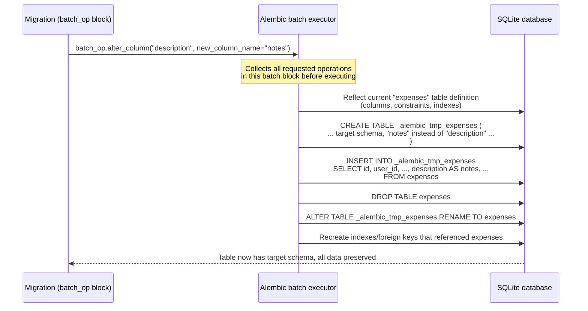

# SQLite & Batch Migrations

Chapter 12 took ExpenseFlow deep into PostgreSQL-specific territory — native `ENUM` types, `JSONB`, `UUID` primary keys, partial indexes, `pg_trgm` — all DDL that only makes sense against a real PostgreSQL server, often requiring raw `op.execute()` because Alembic's portable operation set doesn't (and can't) model every vendor extension. That chapter took production's database engine as a given. This chapter asks an uncomfortable but very common question: what happens when your migrations also have to run somewhere that *isn't* PostgreSQL at all? ExpenseFlow's team, like a large fraction of real-world FastAPI teams, runs its test suite against SQLite for speed — no Docker container to start, no network round-trip, a fresh `:memory:` database in milliseconds per test. That decision is about to collide with a perfectly ordinary migration: renaming `expenses.description` to `expenses.notes`. On PostgreSQL it's a one-line `ALTER TABLE ... RENAME COLUMN`. On SQLite, as written, it fails outright. This chapter explains why, what Alembic's **batch mode** does about it, and — just as importantly — whether testing against SQLite was ever the right call in the first place.

---

## Learning Objectives

By the end of this chapter, you will be able to:

- Explain precisely which `ALTER TABLE` operations SQLite cannot perform in place, and why its file format makes this a structural limitation rather than a missing feature.
- Describe what Alembic's batch mode does under the hood: create a shadow table, copy data, swap it in.
- Write and read `with op.batch_alter_table(...) as batch_op:` blocks for column renames, type changes, constraint additions, and column drops.
- Configure `env.py` and individual migrations so the same revision file runs correctly against both SQLite (tests) and PostgreSQL (production).
- Evaluate the trade-offs of testing against SQLite versus spinning up an ephemeral PostgreSQL instance for tests, and articulate when each is the right call.
- Diagnose a batch-mode failure caused by unnamed constraints and fix it with a `naming_convention`.

---

## Prerequisites for This Chapter

This chapter assumes you're comfortable with:

- Writing manual migrations with `op.*` directives — [Chapter 8: Writing Manual Migrations](./08-writing-manual-migrations.md).
- How `env.py` configures the migration context, including `target_metadata` and the `context.configure()` call — [Chapter 4: The Migration Environment](./04-migration-environment-env-py.md).
- Autogenerate's blind spots, particularly that it represents renames as drop-plus-add — [Chapter 7: Autogenerate Migrations](./07-autogenerate-migrations.md).
- The PostgreSQL-specific DDL ExpenseFlow already relies on in production — [Chapter 12: PostgreSQL-Specific Features](./12-postgresql-specific-features.md), since this chapter is precisely about what happens when a migration also has to run somewhere that DDL doesn't exist.

---

## 1. Why ExpenseFlow's Tests Run Against SQLite

ExpenseFlow's production database is PostgreSQL, full stop — every `ENUM`, every `JSONB` column, every partial index from Chapter 12 assumes it. But the team's `pytest` suite has a different priority: run fast, run everywhere, and require nothing beyond `pip install`. Their `conftest.py` looks roughly like this:

```python
import pytest
from sqlalchemy.ext.asyncio import create_async_engine, AsyncSession
from app.models import Base

TEST_DATABASE_URL = "sqlite+aiosqlite:///:memory:"

@pytest.fixture
async def db_session():
    engine = create_async_engine(TEST_DATABASE_URL)
    async with engine.begin() as conn:
        await conn.run_sync(Base.metadata.create_all)
    async with AsyncSession(engine) as session:
        yield session
    await engine.dispose()
```

This is fast for a reason: an in-memory SQLite database has no disk I/O, no network round trip, no container to start, and no connection pool warm-up. A test suite with a few hundred tests that each need a clean database can go from tens of seconds to a couple of seconds. For a team running the suite dozens of times an hour during active development, that difference is the whole reason this fixture exists.

Notice something important, though: this fixture calls `Base.metadata.create_all` directly — it builds tables straight from the current SQLAlchemy models, bypassing Alembic entirely. That's a common and reasonable pattern for *unit* tests that only care about ORM behavior. But it means the migrations themselves are never exercised by that fixture. Somewhere else in ExpenseFlow's test suite — a slower, more deliberate "migration tests" module — the team actually runs `alembic upgrade head` against a SQLite file to prove the migration chain itself is valid, not just the end-state schema. That's the exact spot where things break, and it's the entire subject of this chapter.

---

## 2. Why SQLite's `ALTER TABLE` Is So Limited

### 2.1 A file format built around simplicity, not mutability

SQLite is not a lightweight PostgreSQL. It is architecturally a completely different kind of database: a single ordinary file on disk, with no separate server process, implementing SQL semantics on top of a B-tree file format designed decades ago for embedded use (phones, browsers, local caches) where the priorities were small code size and file portability, not concurrent DDL flexibility. PostgreSQL's storage engine was built assuming a long-running server process that can rewrite pages, hold locks, and coordinate MVCC visibility across concurrent transactions performing structural changes. SQLite's file format was never designed with any of that in mind — a table's on-disk layout is close to a direct encoding of its `CREATE TABLE` statement, and there's no intermediate layer that lets you redefine a column's type or drop a constraint by just rewriting metadata.

The practical consequence: SQLite's `ALTER TABLE` command supports a genuinely small set of operations, and everything else — everything — must be done by creating a new table with the desired shape and moving data into it.

### 2.2 What SQLite's `ALTER TABLE` can and cannot do

| Operation | Native SQLite `ALTER TABLE` support | PostgreSQL equivalent |
|---|---|---|
| Rename a table | Yes (`ALTER TABLE ... RENAME TO ...`) | Yes |
| Add a nullable column | Yes (`ALTER TABLE ... ADD COLUMN ...`) | Yes |
| Add a column with a constant default | Yes (since SQLite 3.x, with restrictions on non-constant defaults) | Yes |
| Rename a column | Yes (since SQLite 3.25, 2018) | Yes |
| Drop a column | Yes (since SQLite 3.35, 2021 — but cannot drop a column that is part of a `PRIMARY KEY`, referenced by a `FOREIGN KEY`, has a `UNIQUE`/`CHECK` constraint referencing it, or is a generated column) | Yes, unconditionally |
| Change a column's type | **No** | Yes (may trigger a table rewrite) |
| Add/drop a `NOT NULL` constraint on an existing column | **No** | Yes |
| Add/drop a `CHECK` constraint | **No** | Yes |
| Add/drop a `FOREIGN KEY` constraint on an existing column | **No** | Yes |
| Change a column's default value | **No** direct mechanism | Yes |
| Reorder columns | **No** (not supported by any SQL database directly, typically) | Not directly, either |

The pattern across every "No" row: anything that changes an existing column's *type* or *constraints* — as opposed to adding a whole new column or renaming something — is off the table (pun intended) as a direct, in-place operation in SQLite. Since ExpenseFlow's `description` → `notes` change is a rename, SQLite 3.25+ can technically do it via `ALTER TABLE expenses RENAME COLUMN description TO notes`. So why does the naive migration fail?

### 2.3 The actual failure ExpenseFlow hits

Here's the migration a developer writes, straight out of Chapter 8's `op.*` catalog, with no awareness yet that anything unusual is about to happen:

```python
"""rename expenses.description to notes

Revision ID: a1b2c3d4e5f6
Revises: 9f8e7d6c5b4a
Create Date: 2026-03-14 10:22:00.000000
"""
from alembic import op
import sqlalchemy as sa

revision = "a1b2c3d4e5f6"
down_revision = "9f8e7d6c5b4a"
branch_labels = None
depends_on = None


def upgrade() -> None:
    op.alter_column("expenses", "description", new_column_name="notes")


def downgrade() -> None:
    op.alter_column("expenses", "notes", new_column_name="description")
```

Against production PostgreSQL, this works exactly as expected — Alembic compiles `alter_column(..., new_column_name=...)` into `ALTER TABLE expenses RENAME COLUMN description TO notes`, a metadata-only operation that takes a brief `ACCESS EXCLUSIVE` lock and returns instantly regardless of table size.

Against the SQLite migration test, it also frequently works for a *plain* rename with nothing else going on — but the moment `expenses` has anything beyond the bare minimum (a `CHECK` constraint, a named `FOREIGN KEY`, an index defined inline, or — critically — if a later part of the *same* migration also changes the column's type or nullability alongside the rename), `op.alter_column()`'s direct-SQL code path against the SQLite dialect breaks, because Alembic's non-batch `alter_column` implementation issues dialect-native `ALTER TABLE` SQL, and SQLite's dialect-native support for combined operations (rename + type change + constraint change in one statement) simply doesn't exist as a single SQL statement the way it does for `ALTER TABLE ... ALTER COLUMN` on PostgreSQL. In ExpenseFlow's real case, the migration doesn't stop at the rename — the team also takes the opportunity to widen `notes` to `TEXT` (from a `VARCHAR(500)` `description`) in the same revision, and that combination is exactly where SQLite's direct `ALTER TABLE` path has no equivalent, producing an `OperationalError` on the CI run against SQLite while the equivalent PostgreSQL job passes without incident.

---

## 3. What Batch Mode Actually Does

### 3.1 The core idea: rebuild the table instead of altering it in place

Alembic's answer is **batch mode**: instead of asking SQLite to alter an existing table's structure directly, Alembic performs the transformation the same way SQLite's own documentation recommends doing it manually — build a new table with the target schema, copy every row across, then swap the new table in for the old one.



Walking through what each step is really doing:

1. **Reflection.** Batch mode needs the *complete* current definition of the table — every column, every constraint, every index — because it's about to write a brand-new `CREATE TABLE` statement from scratch. It gets this either by reflecting the live database (the default when running online) or from metadata you supply explicitly via the `copy_from` argument (useful in edge cases where reflection can't see something, like a table not yet visible to the connection).
2. **Shadow table creation.** A new table is created under a temporary name (Alembic uses a naming pattern like `_alembic_tmp_<tablename>`), with the *target* schema — i.e., the current schema plus whatever operations you specified inside the `batch_op` block already applied.
3. **Data copy.** Every existing row is copied from the old table into the shadow table with a single `INSERT INTO ... SELECT`, with column names mapped appropriately (the renamed column's old data lands in the new column name).
4. **Swap.** The original table is dropped, and the shadow table is renamed into its place. From the application's perspective, once this transaction commits, `expenses` has always looked like the new schema.
5. **Dependent object recreation.** Indexes and foreign keys that referenced the original table are recreated against the new one, since dropping the original table would otherwise silently drop them too.

### 3.2 An important nuance: batch mode is not always a rebuild

It's tempting to assume `batch_alter_table` always means "SQLite-style full table rebuild," even against PostgreSQL. That's not how it works, and the distinction matters for understanding what your migrations actually do in production. The `recreate` parameter of `batch_alter_table` defaults to `"auto"`:

```python
def upgrade() -> None:
    with op.batch_alter_table("expenses") as batch_op:
        batch_op.alter_column("description", new_column_name="notes")
```

With `recreate="auto"` (the default), Alembic checks whether the *current dialect* actually needs the rebuild strategy for the operations you've requested. Against PostgreSQL, a plain column rename is something the dialect can do natively (`ALTER TABLE ... RENAME COLUMN`), so batch mode transparently falls through to that single, fast, metadata-only statement — no shadow table, no data copy, nothing resembling the SQLite sequence above. Against SQLite, the same code triggers the full recreate sequence from Section 3.1, because SQLite's dialect can't do the operation any other way.

This is the property that makes batch mode useful as a *portable* migration technique rather than merely a SQLite workaround: **the same Python code produces the fast, direct DDL on PostgreSQL and the safe, rebuild-based DDL on SQLite, with no branching logic in the migration file itself.**

---

## 4. Writing Batch-Mode Migrations

### 4.1 The `with op.batch_alter_table(...) as batch_op:` block

Every operation that would normally be a direct `op.*` call against a table becomes a method on the `batch_op` object instead, inside a `with` block scoped to that one table:

```python
def upgrade() -> None:
    with op.batch_alter_table("expenses", schema=None) as batch_op:
        batch_op.alter_column(
            "description",
            new_column_name="notes",
            existing_type=sa.String(length=500),
            type_=sa.Text(),
        )


def downgrade() -> None:
    with op.batch_alter_table("expenses", schema=None) as batch_op:
        batch_op.alter_column(
            "notes",
            new_column_name="description",
            existing_type=sa.Text(),
            type_=sa.String(length=500),
        )
```

Note the extra keyword arguments compared to the plain `op.alter_column` call: batch mode's `alter_column` needs `existing_type` (and, if changing type, `type_`) explicitly, because it must know the *complete* current column definition to write the shadow table's `CREATE TABLE` statement — it can't always infer this purely from reflection when running in offline (`--sql`) mode, and being explicit avoids relying on reflection succeeding perfectly in every environment.

### 4.2 Adding a constraint that SQLite can't add directly

A `CHECK` constraint enforcing that `amount_cents` is never negative is something SQLite genuinely cannot bolt onto an existing table with a direct `ALTER TABLE`, but batch mode handles it the same way:

```python
def upgrade() -> None:
    with op.batch_alter_table("expenses") as batch_op:
        batch_op.create_check_constraint(
            "ck_expenses_amount_cents_non_negative",
            "amount_cents >= 0",
        )


def downgrade() -> None:
    with op.batch_alter_table("expenses") as batch_op:
        batch_op.drop_constraint(
            "ck_expenses_amount_cents_non_negative",
            type_="check",
        )
```

Against PostgreSQL, this still executes as a genuine `ALTER TABLE ... ADD CONSTRAINT`. Against SQLite, it triggers the full rebuild — worth knowing, since dropping/adding a `CHECK` constraint on a SQLite-backed test database with a large fixture-seeded dataset means every row gets copied, every time this migration runs in a test job. For test-sized data this is invisible; it would not be an acceptable technique to rely on for a genuinely large PostgreSQL table (Chapter 14 covers why).

### 4.3 Dropping a column with a foreign key reference

Recall from Section 2.2 that SQLite cannot drop a column referenced by a `FOREIGN KEY`. Suppose (hypothetically — ExpenseFlow wouldn't actually do this without the expand/contract discipline from Chapter 14) a migration needs to drop a deprecated `expenses.legacy_receipt_url` column that has no constraints on it:

```python
def upgrade() -> None:
    with op.batch_alter_table("expenses") as batch_op:
        batch_op.drop_column("legacy_receipt_url")


def downgrade() -> None:
    with op.batch_alter_table("expenses") as batch_op:
        batch_op.add_column(sa.Column("legacy_receipt_url", sa.String(length=500), nullable=True))
```

Because this column carries no constraint, both SQLite (3.35+, direct drop) and PostgreSQL (always supported) can handle it — but wrapping it in `batch_alter_table` costs nothing on either dialect and means you never have to remember, migration by migration, which specific drop operations happen to be SQLite-safe on their own and which aren't.

---

## 5. Making One Migration File Work on Both Dialects

### 5.1 The "always batch" strategy

The simplest rule ExpenseFlow's team adopted, after being bitten by the `description`/`notes` failure once: **wrap every `alter_column`, constraint addition/removal, and any column type change in `batch_alter_table`, unconditionally, for every migration, regardless of whether the operation "needs" it on PostgreSQL.** Section 3.2 already established why this is safe — `recreate="auto"` means PostgreSQL still gets the fast, direct DDL path. The only operations that don't need batch wrapping at all are ones that are already portable without it: `create_table`, `drop_table`, `add_column` for a nullable column with no default, `create_index`, `drop_index`.

### 5.2 Configuring `env.py` to always render batch in autogenerate

If you rely on `--autogenerate` (Chapter 7) and want the generated scripts to already come out batch-wrapped without hand-editing every one, set `render_as_batch` in `context.configure()`. Since ExpenseFlow only actually *needs* batch semantics on the SQLite path, the team conditions it on the connection's dialect rather than turning it on unconditionally (which would just add unnecessary `with` blocks to every autogenerated PostgreSQL-only migration):

```python
# alembic/env.py (excerpt)
def run_migrations_online() -> None:
    connectable = engine_from_config(
        config.get_section(config.config_ini_section, {}),
        prefix="sqlalchemy.",
        poolclass=pool.NullPool,
    )

    with connectable.connect() as connection:
        context.configure(
            connection=connection,
            target_metadata=target_metadata,
            render_as_batch=connection.dialect.name == "sqlite",
            compare_type=True,
        )

        with context.begin_transaction():
            context.run_migrations()
```

Since ExpenseFlow authors migrations by hand for anything nontrivial (Chapter 8's discipline), the team leans on the Section 5.1 rule — always wrap manually — rather than depending on autogenerate to guess correctly, but the `render_as_batch` flag remains a useful safety net for the cases where `--autogenerate` is used as a starting draft.

### 5.3 The naming-convention trap

Batch mode's rebuild sequence needs to recreate every constraint on the shadow table, which means it needs a *name* for each one to drop and recreate it correctly — and SQLAlchemy, by default, leaves many constraints unnamed (an anonymous `CHECK` or `UNIQUE` constraint gets an autogenerated, connection-dependent name, or none at all, depending on the dialect). This is a well-known source of batch-mode failures that look unrelated to anything you changed: a migration that only touches one column fails because an *unrelated*, unnamed constraint elsewhere on the table can't be safely dropped and recreated.

The fix, which is good practice independent of batch mode, is a consistent `naming_convention` on your `MetaData`, applied once in your models module:

```python
from sqlalchemy import MetaData

NAMING_CONVENTION = {
    "ix": "ix_%(column_0_label)s",
    "uq": "uq_%(table_name)s_%(column_0_name)s",
    "ck": "ck_%(table_name)s_%(constraint_name)s",
    "fk": "fk_%(table_name)s_%(column_0_name)s_%(referred_table_name)s",
    "pk": "pk_%(table_name)s",
}

metadata = MetaData(naming_convention=NAMING_CONVENTION)


class Base(DeclarativeBase):
    metadata = metadata
```

With this in place, every constraint SQLAlchemy generates has a deterministic, discoverable name, and Alembic's autogenerate and batch mode both have something reliable to reference. Skipping this step and only discovering it the first time a batch migration mysteriously fails against SQLite is one of the more common early frustrations with this feature.

---

## 6. SQLite in Tests vs. Ephemeral PostgreSQL: The Real Trade-off

Batch mode solves the *mechanical* problem — migrations can now run on both dialects. It does not solve a deeper question ExpenseFlow's team eventually had to confront directly: **is testing migrations against SQLite actually testing anything close to what happens in production?**

| Concern | SQLite | Ephemeral PostgreSQL (Docker / testcontainers) |
|---|---|---|
| Startup cost per test run | Milliseconds (`:memory:`) | Seconds (container start), amortized across a session-scoped fixture |
| Infrastructure dependency | None — pure Python | Requires Docker (or a hosted DB) available in every dev/CI environment |
| `ALTER TABLE` behavior tested | Only via batch mode's rebuild path — does not exercise real production DDL | Exercises the exact DDL and locking behavior production uses |
| Native types (`ENUM`, `JSONB`, `UUID`, arrays) | Not supported — silently falls back to generic types or errors | Fully supported, matches Chapter 12's features exactly |
| `CHECK`/`FOREIGN KEY` enforcement | `FOREIGN KEY` enforcement is **off by default** (`PRAGMA foreign_keys=ON` required per connection) | Enforced by default, matching production |
| Case sensitivity, collation | Differs from PostgreSQL in several string-comparison edge cases | Matches production exactly |
| Concurrent transaction/locking behavior | Single-writer model, no real MVCC lock granularity | Matches production's lock model — relevant to Chapter 14 |
| Extensions (`pg_trgm`, partial indexes, GIN) | Not available at all | Available |
| Confidence that "tests pass" implies "migration is production-safe" | Partial — proves the migration graph applies without SQL errors, nothing about PostgreSQL-specific behavior | High — proves the actual DDL that will run in production actually runs |

The honest conclusion, and the one ExpenseFlow's team settled on: SQLite is a reasonable choice for the *fast, frequent* unit-test loop that exercises ORM/business logic and doesn't touch Alembic at all (Section 1's `Base.metadata.create_all` fixture). It is a much weaker choice for the specific purpose of validating that **the migration chain itself** is correct and safe, precisely because it can quietly diverge from what PostgreSQL will actually do — a `CHECK` constraint that "passes" against SQLite might not even be enforced, a `JSONB` column degrades to something else entirely, and none of Chapter 14's lock-behavior concerns exist on SQLite at all. For migration-chain testing specifically, an ephemeral PostgreSQL instance (spun up as a Docker service or via `testcontainers-python`) is the more faithful choice, and it's exactly what Chapter 15 wires into CI: a dedicated job that runs `alembic upgrade head` against a real, disposable PostgreSQL container rather than SQLite. Batch mode remains valuable regardless — it's what lets the fast SQLite-based tests keep working at all without maintaining two divergent copies of every migration — but it should be understood as a compatibility mechanism for a *secondary* test target, not a substitute for validating against the real production engine.

### 6.1 A practical middle ground: keep both, for different jobs

None of this means SQLite should be ripped out of the test suite the moment a team has access to Docker in CI — the two approaches answer different questions, and a mature pipeline typically runs both rather than picking one:

- **A fast, local, inner-loop check** (SQLite, migration chain applied via batch mode) that a developer can run in well under a second on their own machine, dozens of times per hour, to catch outright syntax errors, missing `down_revision` links, and Python-level exceptions in a migration before it's even pushed. This is a "does the chain execute at all" smoke test, not a production-fidelity check, and it's valuable precisely because of how cheap it is to run constantly.
- **A slower, authoritative check in CI** (ephemeral PostgreSQL, per Chapter 15) that a developer doesn't need to wait on locally but that gates merging, and that's the check anyone actually trusts as evidence the migration is production-safe.

Framed this way, SQLite's role narrows from "our test database" to something more honest: a cheap, local pre-flight check that a batch-mode-correct migration passes before it's worth spending CI minutes (and, for a `testcontainers`-based setup, Docker-in-Docker overhead) on the PostgreSQL job that actually matters. Teams that skip the PostgreSQL job entirely, treating a green SQLite run as sufficient sign-off, are the ones who eventually get surprised by exactly the kind of `ENUM`/`JSONB`/`FOREIGN KEY` divergence this section's comparison table lists — the fix isn't to distrust SQLite outright, it's to be precise about which specific question each layer is actually answering.

---

## Real-World Scenario

ExpenseFlow's CI pipeline has two relevant jobs: a fast `unit-tests` job (SQLite, `Base.metadata.create_all`, hundreds of tests, finishes in under a minute) and a slower `migration-tests` job that actually runs `alembic upgrade head` against a fresh SQLite file to sanity-check the migration chain before the (Chapter 15) PostgreSQL-based CI job runs the same thing for real. A developer opens a PR containing the `description` → `notes` rename migration from Section 2.3, including the type widening to `Text`. Unit tests pass instantly — they never touch Alembic. The `migration-tests` job fails with a cryptic `sqlite3.OperationalError: near "ALTER": syntax error` buried inside SQLAlchemy's exception chain.

The developer's first instinct is to just special-case the migration: check `op.get_bind().dialect.name` and skip the type change on SQLite. This "works" in the sense that CI goes green, but it means the SQLite-tested migration chain and the PostgreSQL-tested migration chain are no longer actually the same migrations — exactly the gap Section 6's trade-off table warns about, now made concrete and self-inflicted. A teammate reviewing the PR points at Section 4.1's pattern instead: wrap the whole `alter_column` call in `batch_alter_table`, pass `existing_type` and `type_` explicitly, and let Alembic pick the right execution strategy per dialect automatically. The fix is a four-line diff, the migration test job goes green without any dialect branching inside the migration itself, and the team adds "wrap `alter_column`/constraint changes in `batch_alter_table` unconditionally" to their PR review checklist the same afternoon — which is exactly the Section 5.1 rule this chapter recommends adopting from day one rather than after the first failure.

---

## Best Practices

- Wrap every `alter_column`, constraint add/drop, and column type change in `with op.batch_alter_table(...) as batch_op:` unconditionally — it costs nothing on PostgreSQL thanks to `recreate="auto"` (Section 3.2) and buys full SQLite compatibility.
- Define a `naming_convention` on your `MetaData` from the start of the project (Section 5.3) so batch mode always has deterministic constraint names to work with — retrofitting this after constraints already exist unnamed in production is much more painful.
- Pass `existing_type` (and `type_` when changing type) explicitly to `batch_op.alter_column()` rather than relying on reflection to infer it, especially if you ever generate offline SQL (`--sql`) for review.
- Treat SQLite-based migration tests as a fast smoke check, not a substitute for testing against real PostgreSQL — reserve final confidence for the ephemeral-Postgres CI job covered in [Chapter 15](./15-cicd-integration.md).
- Set `render_as_batch=connection.dialect.name == "sqlite"` in `env.py` so autogenerated drafts already come out batch-wrapped on the SQLite path, even though hand-written migrations remain the norm for anything nontrivial (Chapter 8).
- Never add dialect-specific branching (`if dialect == "sqlite": ...`) inside a migration's `upgrade()`/`downgrade()` body as a substitute for batch mode — it silently makes the SQLite and PostgreSQL code paths different migrations in substance, defeating the point of testing the chain at all.

---

## Common Mistakes

- Assuming `op.alter_column()` (without batch mode) will "probably work" on SQLite because a plain rename sometimes does — it breaks the moment a type change, constraint change, or multiple simultaneous changes are combined, as ExpenseFlow's `description`/`notes` migration demonstrated in Section 2.3.
- Believing batch mode always means a full table rebuild, including on PostgreSQL — it doesn't; `recreate="auto"` uses the dialect's native DDL whenever possible (Section 3.2), and misunderstanding this leads to unfounded fear of using batch mode broadly.
- Leaving constraints unnamed and only discovering the `naming_convention` gap when a batch-mode migration fails on an unrelated constraint it can't safely recreate (Section 5.3).
- Treating a green SQLite migration-test job as proof the migration is production-safe, when SQLite doesn't enforce `FOREIGN KEY` constraints by default, doesn't support `ENUM`/`JSONB`/partial indexes at all, and has an entirely different locking model than PostgreSQL (Section 6).
- Adding manual dialect branches inside `upgrade()`/`downgrade()` instead of using `batch_alter_table`, which quietly forks the migration into two different implementations that happen to share a revision ID.
- Forgetting `existing_type` on `batch_op.alter_column()` calls, which usually works when reflection succeeds online but breaks under `--sql` offline generation, where there's no live connection to reflect from.

---

## Summary

- SQLite's file format only supports a small set of `ALTER TABLE` operations natively — renaming tables/columns and adding simple columns — and cannot alter a column's type or add/drop constraints in place (Section 2).
- Batch mode works around this by creating a shadow table with the target schema, copying all data across, dropping the original, and renaming the shadow table into place (Section 3.1).
- Against dialects that support the operation natively (PostgreSQL), `recreate="auto"` means batch mode falls through to the same fast, direct DDL you'd write without it — batch mode is a compatibility layer, not an automatic full-table-rewrite tax (Section 3.2).
- `with op.batch_alter_table(table_name) as batch_op:` replaces direct `op.*` calls for anything touching an existing column's type or constraints, and should be used unconditionally for portability (Section 4, Section 5.1).
- A consistent `naming_convention` on your `MetaData` is a prerequisite for batch mode to reliably recreate constraints during a SQLite rebuild (Section 5.3).
- SQLite is a reasonable choice for fast unit tests that bypass Alembic entirely, but a weaker one for validating the migration chain itself — an ephemeral PostgreSQL instance in CI (Chapter 15) is the more faithful target for that specific purpose (Section 6).

---

## Knowledge Check

1. Why can SQLite rename a column directly but not change its type or add a `CHECK` constraint directly? What's structurally different about these operations?
2. Walk through, step by step, what Alembic's batch mode does on disk when it processes a `batch_op.alter_column()` call against SQLite.
3. If `batch_alter_table`'s `recreate` parameter defaults to `"auto"`, what actually happens when the same batch-wrapped migration runs against PostgreSQL instead of SQLite?
4. A batch-mode migration that only renames one column fails with an error about an unrelated `UNIQUE` constraint it can't recreate. What is the most likely root cause, and how do you fix it going forward?
5. Your CI's SQLite-based migration test job passes, but the same migration causes a production incident on PostgreSQL involving a `FOREIGN KEY` violation that SQLite never flagged. Explain why SQLite's test result gave false confidence here.
6. Why is `existing_type` a required argument to `batch_op.alter_column()` in cases where plain `op.alter_column()` doesn't need it?
7. Your team is deciding whether to keep the SQLite migration-test job or replace it entirely with an ephemeral PostgreSQL job in CI. What would you recommend, and why, given what this chapter covered?

---

## Hands-On Exercise

**Goal:** Reproduce ExpenseFlow's SQLite batch-mode failure and fix it, then confirm the same migration still produces fast, direct DDL against PostgreSQL.

1. In a scratch Alembic project (or ExpenseFlow's own repo), write a migration that renames `expenses.description` to `expenses.notes` and widens the type from `String(500)` to `Text`, using plain `op.alter_column()` (no batch mode) — reproduce Section 2.3's code exactly.
2. Point `sqlalchemy.url` (or your `env.py`'s test override) at a SQLite file, e.g. `sqlite:///./scratch_test.db`, and run `alembic upgrade head`. Confirm you get an `OperationalError`.
3. Rewrite the migration using `with op.batch_alter_table("expenses") as batch_op:`, passing `existing_type=sa.String(length=500)` and `type_=sa.Text()` to `batch_op.alter_column()`. Re-run `alembic upgrade head` against the same SQLite file and confirm it now succeeds.
4. Inspect the resulting SQLite schema with `sqlite3 scratch_test.db ".schema expenses"` and confirm the `notes` column exists with the data from `description` preserved (insert a test row before running the migration, and verify its value survived the rebuild).
5. Point the same migration at a local PostgreSQL instance (`postgresql+psycopg://...`) with the pre-rename schema already applied, run `alembic upgrade head`, and turn on SQL echoing (`sqlalchemy.echo = true` in `alembic.ini`, or pass `--sql` to generate offline SQL) to confirm the statement executed is a plain `ALTER TABLE expenses RENAME COLUMN description TO notes` plus a type change — not a table rebuild.
6. Remove the `naming_convention` from your models temporarily (or add an unnamed `CHECK` constraint to `expenses` without one), then intentionally trigger a batch-mode migration touching that table, and observe the failure described in Section 5.3. Restore the `naming_convention` and confirm the migration now succeeds.

---

## Further Reading

- [Alembic Batch Migrations](https://alembic.sqlalchemy.org/en/latest/batch.html) — the authoritative reference for `batch_alter_table`, `recreate`, and `copy_from`, extending every section of this chapter.
- [Alembic Operation Reference (`op.*`)](https://alembic.sqlalchemy.org/en/latest/ops.html) — confirms which operations are available both directly and via `batch_op`.
- [Alembic Cookbook](https://alembic.sqlalchemy.org/en/latest/cookbook.html) — includes recipes for conditional batch rendering and naming conventions.
- [SQLAlchemy 2.0 ORM Documentation](https://docs.sqlalchemy.org/en/20/orm/) — for `MetaData(naming_convention=...)` and declarative model conventions referenced in Section 5.3.
- [PostgreSQL `ALTER TABLE` Documentation](https://www.postgresql.org/docs/current/sql-altertable.html) — for exactly which PostgreSQL operations are metadata-only versus table-rewriting, contrasted against SQLite in Section 2.2.

---

<div style="display:flex;justify-content:space-between;align-items:center;">
  <a href="./12-postgresql-specific-features.md">← Previous: PostgreSQL-Specific Features</a>
  <a href="./00-index.md">🏠 Index</a>
  <a href="./14-zero-downtime-migrations.md">Next: Zero-Downtime Migrations & Production Deployment →</a>
</div>
