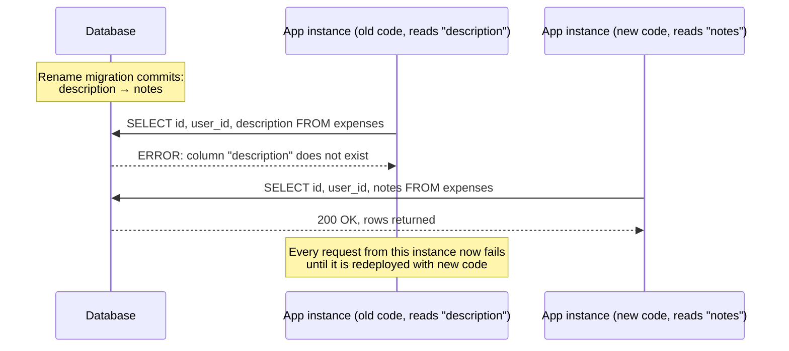
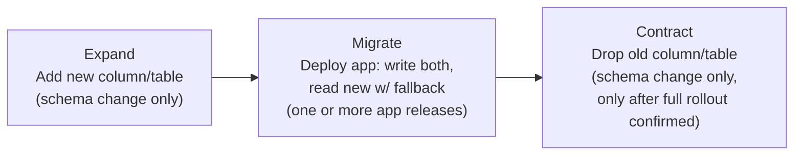
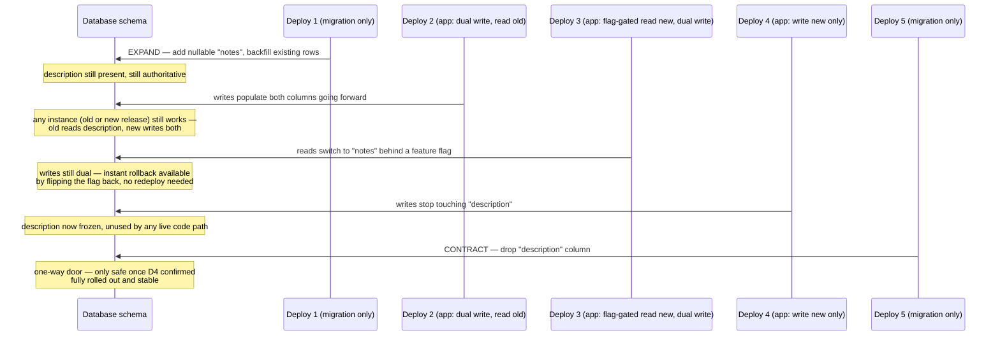
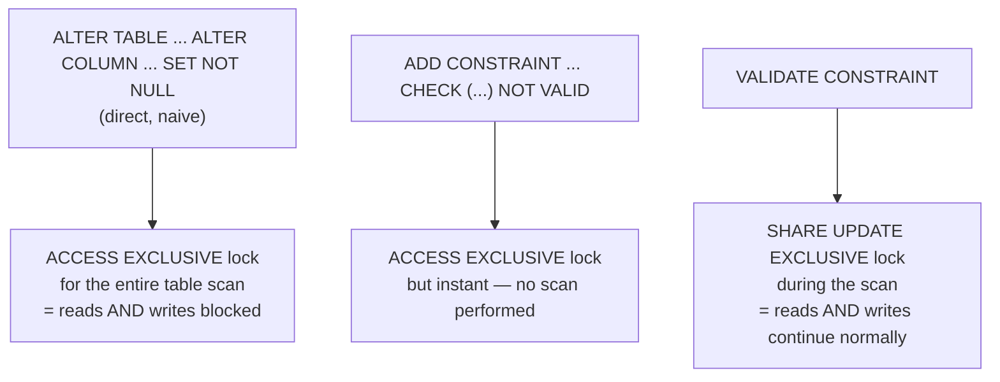
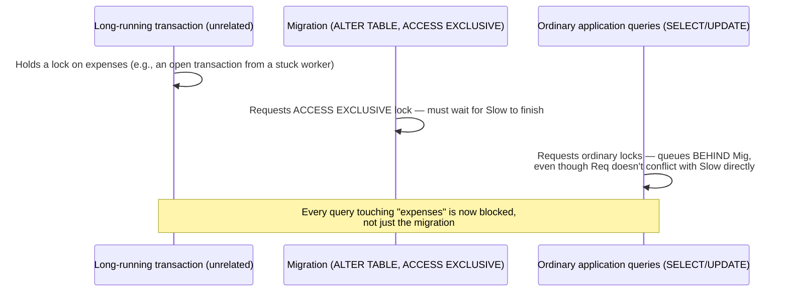

# Zero-Downtime Migrations & Production Deployment

Chapter 13 solved a portability problem: the same migration file now runs correctly whether the connection behind it is a SQLite file in a CI job or a PostgreSQL server in production. That chapter quietly assumed something this chapter is going to take apart in detail: that once a migration *runs successfully*, the deployment is fine. It isn't, necessarily — and this is the gap between "I can write a migration that executes without errors" and "I can ship a schema change to a live production system without taking it down or corrupting data in flight." ExpenseFlow's team is about to rename `expenses.description` to `expenses.notes` in production, where multiple application instances are running simultaneously, old and new code overlapping during a rolling deploy, real users submitting expenses the entire time. A naive version of that migration — the exact one Chapter 13 fixed for SQLite — would still be dangerous in production for reasons that have nothing to do with SQL syntax and everything to do with locking, timing, and the fact that "the database" and "the application" are never actually updated at the same instant. This is the chapter where the course's production-safety material concentrates, and it deserves the most careful reading of anything so far.

---

## Learning Objectives

By the end of this chapter, you will be able to:

- Explain concretely why naive schema changes cause production downtime: long-held locks on `ALTER TABLE`, and application instances reading columns that no longer exist.
- Describe the expand/contract pattern in full — expand, migrate, contract — and identify which phase a given schema change belongs to.
- Distinguish backward-compatible from forward-compatible schema changes, and explain why a rolling deploy needs both simultaneously satisfied at every point in time.
- Classify any given migration operation as safe, conditionally safe, or unsafe to run directly against a live, traffic-serving table.
- Walk through a real column rename as a concrete multi-deploy sequence, including the role of feature flags in coordinating code and schema rollout.
- Add a `NOT NULL` constraint to a large existing table without holding a long-lived exclusive lock, using the `NOT VALID` / `VALIDATE CONSTRAINT` technique or PostgreSQL's fast-default optimization.
- Configure `lock_timeout` and `statement_timeout` as a deployment safety net, and explain what specific failure mode they prevent.

---

## Prerequisites for This Chapter

This is the most demanding chapter in the course so far, and it draws on nearly everything before it:

- Writing manual migrations and understanding operation ordering — [Chapter 8: Writing Manual Migrations](./08-writing-manual-migrations.md).
- Data migrations, and specifically the "add nullable → backfill → add `NOT NULL`" sequence this chapter formalizes into a general pattern — [Chapter 11: Data Migrations](./11-data-migrations.md).
- PostgreSQL-specific DDL and why some operations need raw `op.execute()` — [Chapter 12: PostgreSQL-Specific Features](./12-postgresql-specific-features.md).
- Portable migrations across SQLite and PostgreSQL — [Chapter 13: SQLite & Batch Migrations](./13-sqlite-batch-migrations.md), since production behavior (this chapter) is exactly what SQLite testing cannot validate.
- A working mental model of PostgreSQL locking is helpful but not assumed — this chapter explains the relevant lock behavior from first principles as it goes.

---

## 1. Why Naive Migrations Cause Downtime

### 1.1 The two distinct failure modes

Everything in this chapter traces back to two different, easily confused failure modes, and it's worth separating them clearly before going further:

1. **Lock-based downtime.** Some `ALTER TABLE` operations require PostgreSQL to hold an `ACCESS EXCLUSIVE` lock on the table for the duration of the operation — and some of those operations take a *long* time on a large table, because they require scanning or rewriting every row. During that window, every other query touching the table — including plain `SELECT`s — queues up behind the lock and cannot proceed. If the migration takes ninety seconds on a busy table, the application effectively stops responding to any request touching that table for ninety seconds. This is downtime caused by the *database engine's own mechanics*, independent of application code.
2. **Application-compatibility downtime.** Even if the migration itself is instantaneous, if it removes or renames something the *currently running* application code still references, every instance still running the old code starts throwing errors the moment the schema change commits — a `SELECT description FROM expenses` against a table that no longer has a `description` column fails immediately, on every request that touches it, from every old-code instance, until every last one of them has been replaced. This is downtime caused by a **timing mismatch between schema and code**, and no amount of migration performance tuning fixes it, because the migration ran perfectly fine — the problem is what ran *against* it.

Both failure modes matter, and this chapter addresses each with a distinct set of techniques: Section 2 through Section 5 (expand/contract, safe/unsafe operations, the worked rename example) are primarily about failure mode 2; Section 6 and Section 7 (`NOT NULL` on big tables, lock timeouts) are primarily about failure mode 1. Real incidents are frequently a combination of both at once.

### 1.2 A concrete lock-based incident, illustrated

Suppose ExpenseFlow's `expenses` table has grown to 40 million rows, and a developer — reasonably, by the standards of everything covered up through Chapter 11 — writes a migration that both adds a column and immediately marks it `NOT NULL`:

```python
def upgrade() -> None:
    op.add_column("expenses", sa.Column("notes", sa.Text(), nullable=False, server_default=""))
```

On a small table, this is invisible. On 40 million rows, in PostgreSQL versions before 11, adding a column with any default required rewriting every existing row to physically store that default value — an operation that holds `ACCESS EXCLUSIVE` for as long as the rewrite takes, which for tens of millions of rows can easily be minutes. Every request touching `expenses` anywhere in the application — reads and writes alike — blocks for that entire duration. Section 6 covers exactly which PostgreSQL versions and default kinds avoid this rewrite, and how to structure the migration to avoid it regardless.

### 1.3 A concrete compatibility-based incident, illustrated

Now suppose the migration is cheap — a plain column rename, `ALTER TABLE expenses RENAME COLUMN description TO notes`, which is metadata-only and returns in milliseconds even on 40 million rows. The team runs it during a rolling deploy where three application instances are still running the *old* code (which does `SELECT ..., description, ... FROM expenses` on every request) and two instances are already running the *new* code (which references `notes`). The instant the rename commits, all three old instances start failing every single request that touches an expense — not because the migration was slow, but because the column they're compiled to reference by name is simply gone. This is the failure mode expand/contract exists to prevent, and it is arguably the more common and more dangerous of the two in real incident histories, because it's easy to test in isolation (the migration "works") and only manifests under the specific timing of a live rolling deploy.



---

## 2. Backward-Compatible vs. Forward-Compatible Changes

Two terms do a lot of work in this chapter, and it's worth defining them precisely rather than loosely:

- A schema change is **backward-compatible** if *old* application code continues to function correctly after the change has been applied. Adding a new nullable column is backward-compatible: code compiled before the column existed simply never references it, and keeps working exactly as before.
- A schema change is **forward-compatible** if *new* application code (already updated to expect the eventual final schema) continues to function correctly *before* the change has been applied — i.e., the new code degrades gracefully or doesn't crash against the current, not-yet-updated schema.

During any rolling deploy, there is necessarily a window where old code and new code run simultaneously against the *same* database, because instances are replaced one at a time, not atomically. That means a schema change is only genuinely safe to deploy if it is backward-compatible with the *code being retired* and the new code being deployed is forward-compatible with whatever schema state exists at each point during the rollout. Most real incidents in this space come from satisfying only one direction: teams routinely check "does my migration run without error" (a database-only concern) without asking "is there any moment during this deploy where a running instance, old or new, issues a query the database can't currently satisfy" (a joint schema-and-code timing concern). The expand/contract pattern, covered next, is precisely a recipe for keeping both directions satisfied at every point in a multi-step rollout, by never taking away something old code depends on until every trace of that old code is gone, and never having new code depend on something the schema doesn't have yet.

---

## 3. The Expand/Contract Pattern

### 3.1 The three phases

Expand/contract breaks a schema change that would otherwise be a single, unsafe, atomic step into three separate, individually-safe deploys, each satisfying Section 2's compatibility rules on its own:

| Phase | What changes | What it must NOT do |
|---|---|---|
| **Expand** | Add new schema (a new nullable column, a new table) alongside the old, unchanged schema. Optionally backfill the new structure from the old. | Must not touch, rename, or remove anything the currently-deployed application code depends on. |
| **Migrate** (transition) | Deploy new application code that is aware of both old and new schema — writing to both, and/or reading the new with a fallback to the old. This phase may span multiple app releases. | Must not require the old schema to be gone yet, and must not break if some instances are still running the previous app release. |
| **Contract** | Once every application instance (and every other consumer — background workers, other services, replicas) is confirmed running code that no longer touches the old schema, remove the old schema in its own migration. | Must not run until you are certain nothing is still reading or writing the old structure — this is a one-way door. |



### 3.2 Why three phases instead of one

The entire reason for this ceremony is that a schema change and an application deploy are **never atomic with respect to each other** in any realistic production system. Even a single-instance deployment has a gap between "migration runs" and "new process starts serving traffic." A multi-instance rolling deploy stretches that gap across however long it takes every instance to cycle — often minutes, sometimes longer for careful canary rollouts. Expand/contract's discipline is to ensure that at every point along that timeline, whichever combination of schema-state and code-version happens to be live at that instant is a combination that actually works — which is only possible if no single step simultaneously removes something old code needs and adds a requirement new code can't yet satisfy.

---

## 4. Safe vs. Unsafe Operations

Not every schema change needs the full three-phase treatment — many are safe to run directly, in a single step, with no coordination at all. This table is the practical cheat sheet ExpenseFlow's team pinned to their deployment runbook:

| Operation | Safety | Why |
|---|---|---|
| Add a new nullable column, no default | **Always safe** | Old code never references it; new code can use it immediately once deployed. Metadata-only in PostgreSQL. |
| Add a new table | **Always safe** | Nothing references it until code is deployed to use it. |
| Add a new index (with `CREATE INDEX CONCURRENTLY`) | **Safe** | Does not block reads/writes to the table, at the cost of a slower index build and a small risk of needing retry if it fails partway (Chapter 12 covers `op.execute()` for the `CONCURRENTLY` variant, which cannot run inside Alembic's default transactional DDL — see Section 4.1 note below). |
| Add a new index (plain `CREATE INDEX`) | **Unsafe on a busy large table** | Takes a lock that blocks writes for the duration of the index build. |
| Add a column with a constant default (PostgreSQL 11+) | **Safe** | Fast-default optimization avoids a table rewrite (Section 6.2). |
| Add a column with a volatile default (e.g., `now()`, `gen_random_uuid()`) | **Unsafe on large tables** | Cannot use the fast-default optimization; forces a full table rewrite under an exclusive lock. |
| Add a `NOT NULL` constraint directly (`ALTER COLUMN ... SET NOT NULL`) | **Unsafe on large tables (pre-12 semantics)** | Requires a full table scan to validate every existing row, under a lock that blocks writes (Section 6.1 covers the safe alternative). |
| Rename a column | **Never safe directly** | Instantly breaks any running code still referencing the old name (Section 1.3) — always requires expand/contract. |
| Rename a table | **Never safe directly** | Same reasoning as column rename, at a larger blast radius. |
| Change a column's type | **Usually unsafe** | Frequently requires a table rewrite; even when it doesn't, old code may not tolerate the new type's representation. |
| Drop a column | **Never safe directly** | Any running old code still selecting it (including `SELECT *`) breaks immediately; always requires a deploy gap first (contract phase). |
| Drop a table | **Never safe directly** | Same reasoning, larger blast radius; also irreversible without a backup. |
| Add a foreign key constraint (validated immediately) | **Unsafe on large tables** | Validating requires scanning the referencing table under a lock; use `NOT VALID` + `VALIDATE CONSTRAINT` (same technique as Section 6.1). |
| Add a `CHECK` constraint (validated immediately) | **Unsafe on large tables** | Same reasoning; same `NOT VALID` fix applies. |

### 4.1 A note on `CREATE INDEX CONCURRENTLY` inside Alembic

PostgreSQL's `CREATE INDEX CONCURRENTLY` cannot run inside a transaction block, but Alembic wraps each migration in a transaction by default. Getting this right requires either running the migration with `context.configure(transaction_per_migration=True)` combined with marking the specific revision non-transactional, or issuing it via raw `op.execute()` outside Alembic's managed transaction using `autocommit_block()`:

```python
def upgrade() -> None:
    with op.get_context().autocommit_block():
        op.execute(
            "CREATE INDEX CONCURRENTLY IF NOT EXISTS "
            "ix_expenses_description_trgm ON expenses USING gin (description gin_trgm_ops)"
        )
```

`autocommit_block()` temporarily steps outside the migration's enclosing transaction for exactly this kind of statement, which is otherwise incompatible with Alembic's default transactional wrapping.

---

## 5. Worked Example: `description` → `notes`, End to End

This is the exact rename Chapter 13 made SQLite-safe. Now it needs to actually go to production, where `expenses` has tens of millions of rows and five application instances are running behind a load balancer during any given rolling deploy. Here is the full three-deploy sequence ExpenseFlow's team runs.

### 5.1 Deploy 1 — Expand

**Migration** (schema only, no app code changes needed for this step):

```python
"""expand: add notes column to expenses

Revision ID: b2c3d4e5f6a7
Revises: a1b2c3d4e5f6
Create Date: 2026-03-20 09:00:00.000000
"""
from alembic import op
import sqlalchemy as sa

revision = "b2c3d4e5f6a7"
down_revision = "a1b2c3d4e5f6"
branch_labels = None
depends_on = None


def upgrade() -> None:
    op.add_column("expenses", sa.Column("notes", sa.Text(), nullable=True))

    # Backfill existing rows in batches to avoid one giant transaction
    # locking the table for an extended period (Chapter 11's batching discipline).
    connection = op.get_bind()
    connection.execute(sa.text(
        "UPDATE expenses SET notes = description WHERE notes IS NULL AND description IS NOT NULL"
    ))


def downgrade() -> None:
    op.drop_column("expenses", "notes")
```

This is safe under Section 4's table: adding a nullable column is always safe, and the backfill only ever writes to the brand-new column — nothing existing code reads or writes is touched. No application deploy is required to accompany this migration; it can run ahead of any code change, at any time, with zero coordination.

### 5.2 Deploy 2 — Migrate (dual write, read old)

Application code is updated to write both columns on every create/update, while still reading `description` — so this release is safe to run against both the pre-expand and post-expand schema, and old instances still running the previous release are entirely unaffected since they never touch `notes` at all:

```python
from sqlalchemy import update

async def create_expense(session: AsyncSession, *, user_id: int, amount_cents: int, text: str) -> Expense:
    expense = Expense(
        user_id=user_id,
        amount_cents=amount_cents,
        description=text,   # old column, still the source of truth for reads
        notes=text,          # new column, kept in sync starting now
    )
    session.add(expense)
    await session.commit()
    return expense


async def update_expense_text(session: AsyncSession, expense_id: int, text: str) -> None:
    await session.execute(
        update(Expense)
        .where(Expense.id == expense_id)
        .values(description=text, notes=text)
    )
    await session.commit()
```

Once this release is fully rolled out (every instance replaced), every row created or modified from this point forward has both columns populated and in sync — closing the gap left by Deploy 1's one-time backfill, which only covered rows that existed *before* the expand migration ran.

### 5.3 Deploy 3 — Migrate (switch reads, keep dual write)

A second application release switches reads to `notes`, behind a feature flag, while continuing to write both columns as a safety net in case a rollback to the previous release becomes necessary:

```python
from app.config import settings

async def get_expense_text(expense: Expense) -> str:
    if settings.feature_read_notes_column:
        return expense.notes
    return expense.description
```

`settings.feature_read_notes_column` starts `False` at deploy time (so the release itself is a no-op behavior change) and is flipped to `True` afterward, once the release has fully rolled out and the team has confirmed there's no need to roll back — decoupling "deploy the code that's capable of reading `notes`" from "actually start reading `notes`," which gives an instant, code-deploy-free rollback lever if anything looks wrong (Section 5.5 below). Writes continue to populate both columns during this entire phase, so a rollback to Deploy 2's behavior (or even a rollback that disables the flag) is always safe.

### 5.4 Deploy 4 — Stop writing the old column

Once reads have been on `notes` for a confidence-building period (the team's rule of thumb: at least one full deploy cycle with no incidents, and ideally covering a full business week to catch any weekly-batch job that might still reference `description`), a further release removes the dual-write, writing only to `notes`:

```python
async def create_expense(session: AsyncSession, *, user_id: int, amount_cents: int, text: str) -> Expense:
    expense = Expense(user_id=user_id, amount_cents=amount_cents, notes=text)
    session.add(expense)
    await session.commit()
    return expense
```

### 5.5 Deploy 5 — Contract

Only now — with every application instance, every background worker, every scheduled job confirmed to reference `notes` exclusively, and `description` confirmed unused anywhere in the codebase (a repository-wide search is cheap insurance) — does the contract migration run:

```python
"""contract: drop expenses.description

Revision ID: c3d4e5f6a7b8
Revises: b2c3d4e5f6a7
Create Date: 2026-04-10 09:00:00.000000
"""
from alembic import op
import sqlalchemy as sa

revision = "c3d4e5f6a7b8"
down_revision = "b2c3d4e5f6a7"
branch_labels = None
depends_on = None


def upgrade() -> None:
    op.drop_column("expenses", "description")


def downgrade() -> None:
    op.add_column("expenses", sa.Column("description", sa.String(length=500), nullable=True))
    connection = op.get_bind()
    connection.execute(sa.text(
        "UPDATE expenses SET description = notes WHERE description IS NULL"
    ))
```

### 5.6 The full sequence, visualized



Five deploys to rename one column sounds like a lot of ceremony for what is, syntactically, a one-line `ALTER TABLE`. It is exactly that much ceremony, and that is the entire point: the "one-line" version is precisely the naive migration Section 1.3 showed taking down every old-code instance simultaneously. The number of steps can compress — small teams with fast, well-tested deploy cycles sometimes collapse Deploy 2 and Deploy 3 into one release, or skip the feature flag if rollback risk is judged low enough — but the underlying discipline (never remove something before nothing depends on it anymore) doesn't compress away.

---

## 6. Avoiding Locks on `NOT NULL` and Big-Table Changes

### 6.1 The `NOT VALID` / `VALIDATE CONSTRAINT` technique

Suppose, after the rename above, the team wants `notes` to be genuinely `NOT NULL` (every expense should have text, going forward). The naive approach:

```python
op.alter_column("expenses", "notes", nullable=False)
```

compiles to `ALTER TABLE expenses ALTER COLUMN notes SET NOT NULL`. In PostgreSQL versions before 12, this always requires a full table scan under `ACCESS EXCLUSIVE` to verify no existing row violates the new constraint — on tens of millions of rows, this can hold that exclusive lock, blocking all reads and writes to the table, for as long as the scan takes.

The safe alternative uses a `CHECK` constraint added in two steps:

```python
def upgrade() -> None:
    # Step 1: add the constraint but skip validating existing rows.
    # This only takes a brief ACCESS EXCLUSIVE lock to add the constraint's
    # metadata — it does NOT scan the table, so it returns almost instantly
    # regardless of table size.
    op.execute(
        "ALTER TABLE expenses ADD CONSTRAINT ck_expenses_notes_not_null "
        "CHECK (notes IS NOT NULL) NOT VALID"
    )

    # Step 2: validate the constraint against existing rows. This DOES scan
    # the whole table, but it only takes a SHARE UPDATE EXCLUSIVE lock, which
    # allows concurrent reads AND writes to continue throughout the scan —
    # it just blocks other schema-changing DDL on the same table meanwhile.
    op.execute("ALTER TABLE expenses VALIDATE CONSTRAINT ck_expenses_notes_not_null")


def downgrade() -> None:
    op.execute("ALTER TABLE expenses DROP CONSTRAINT ck_expenses_notes_not_null")
```

The critical distinction is the lock *level* each step takes, not just its duration:



As of PostgreSQL 12, once a validated `CHECK (col IS NOT NULL)` constraint exists, `ALTER TABLE ... ALTER COLUMN ... SET NOT NULL` itself becomes fast — PostgreSQL recognizes the existing validated constraint as proof and skips its own redundant scan. Some teams use the `NOT VALID`/`VALIDATE CONSTRAINT` pair purely as a stepping stone toward a "real" `NOT NULL` constraint for exactly this reason; others leave the validated `CHECK` constraint in place permanently, since it enforces the same guarantee.

### 6.2 PostgreSQL's fast-default optimization

Separately, PostgreSQL 11 removed the table-rewrite requirement for adding a column with a **constant** default value — `ADD COLUMN status TEXT DEFAULT 'active'` is metadata-only regardless of table size, because PostgreSQL stores the default as metadata and returns it for any row that doesn't yet have a physically stored value, computing the real value lazily. This optimization applies only to constant defaults — a default expressed as a function call that isn't guaranteed constant per row, such as `DEFAULT now()` or `DEFAULT gen_random_uuid()`, still forces a full rewrite, because each row genuinely needs its own distinct value.

| Default kind | Example | PostgreSQL 11+ behavior |
|---|---|---|
| Constant literal | `DEFAULT 'USD'`, `DEFAULT 0`, `DEFAULT false` | Fast — metadata only, no rewrite |
| Constant expression foldable at plan time | `DEFAULT (1 + 1)` | Fast — folded to a constant |
| Volatile/row-dependent function | `DEFAULT now()`, `DEFAULT gen_random_uuid()`, `DEFAULT random()` | Slow — full table rewrite required |

Confirming which case a given `add_column` call falls into is worth doing deliberately before shipping it against a large table — the difference between "instant" and "minutes-long exclusive lock" is entirely in whether the default is a genuine constant.

---

## 7. `lock_timeout` and `statement_timeout` as a Safety Net

### 7.1 The lock-queue pileup failure mode

Even a migration built entirely from Section 6's safe techniques can still cause an outage through a subtler mechanism: **lock queue pileup**. PostgreSQL grants locks roughly in request order for a given table — if your migration's `ALTER TABLE` requests an `ACCESS EXCLUSIVE` lock while some unrelated, long-running transaction (a slow analytics query, an ORM session someone forgot to close, a batch job) already holds *any* lock on that table that conflicts with it, your migration doesn't fail — it queues, waiting for that other transaction to finish. And because PostgreSQL's queue is FIFO with respect to conflicting requests, every *subsequent* query against that table — including ordinary `SELECT`s that would otherwise run instantly — queues up behind your waiting migration too, even though those `SELECT`s don't conflict with whatever the original long-running transaction was doing. One slow, unrelated transaction plus one waiting migration can cascade into the entire table becoming unresponsive to everything.



### 7.2 The fix: fail fast instead of queueing indefinitely

The safety net is to make the migration itself refuse to wait indefinitely for a lock, by setting a short `lock_timeout` before issuing the DDL:

```python
def upgrade() -> None:
    op.execute("SET lock_timeout = '2s'")
    op.execute("SET statement_timeout = '30s'")

    op.execute(
        "ALTER TABLE expenses ADD CONSTRAINT ck_expenses_notes_not_null "
        "CHECK (notes IS NOT NULL) NOT VALID"
    )
```

With `lock_timeout` set, if the migration's `ALTER TABLE` can't acquire its lock within the timeout, PostgreSQL cancels *that statement* with an error instead of letting it (and everything behind it) queue indefinitely. This turns a potential multi-minute full-table outage into a clean, fast, loud migration failure — annoying, but recoverable: rerun the migration once the blocking transaction has cleared, rather than discovering the incident from a paging alert. `statement_timeout` serves a similar purpose for the run time of the statement itself once it does acquire its lock, guarding against, say, an unexpectedly enormous `VALIDATE CONSTRAINT` scan running far longer than anticipated during a deployment window.

Most teams set both values at the connection/session level for the migration run specifically — either inside the migration via `op.execute("SET ...")` as shown, or at the `env.py` level for every migration, via a `SET` issued right after the connection is established:

```python
# alembic/env.py (excerpt)
def run_migrations_online() -> None:
    connectable = engine_from_config(...)
    with connectable.connect() as connection:
        connection.execute(sa.text("SET lock_timeout = '4s'"))
        connection.execute(sa.text("SET statement_timeout = '60s'"))
        context.configure(connection=connection, target_metadata=target_metadata)
        with context.begin_transaction():
            context.run_migrations()
```

Setting it once in `env.py` is the more robust choice for a team, since it applies uniformly without relying on every migration author remembering to add it individually — treat it the same way you'd treat a linter rule rather than a per-migration judgment call.

---

## Real-World Scenario

ExpenseFlow's team schedules the Section 5.5 contract migration (`DROP COLUMN description`) for a routine Tuesday afternoon deploy, confident the rollout from Deploy 4 has been stable for two weeks. Thirty seconds after the migration starts, the on-call engineer gets a latency alert: p99 response time on the `/expenses` endpoint has jumped from 80ms to over 8 seconds, and it's climbing. `pg_stat_activity` shows the `DROP COLUMN` statement itself waiting, not running — it's queued behind a lock held by a background reporting job that a data analyst kicked off twenty minutes earlier and left running in a long-lived, uncommitted transaction. Behind the queued `DROP COLUMN`, every ordinary `SELECT`, `INSERT`, and `UPDATE` against `expenses` from every application instance is now also queued, exactly matching Section 7.1's lock-pileup pattern.

Two things go right here that keep this a minor blip instead of a real incident. First, the migration was run with `lock_timeout = '2s'` set at the `env.py` level (Section 7.2) — the `DROP COLUMN` statement itself fails cleanly after two seconds with a lock-timeout error rather than continuing to queue for the full duration of the analyst's job, so the pileup resolves the moment the migration statement gives up. Second, because the team follows the expand/contract discipline from Section 3, the `description` column being briefly still present for a few more minutes while they retry the contract migration later that evening is a complete non-event — no application code has depended on it since Deploy 4, two weeks earlier, so there's no urgency at all to get the contract step in immediately. The incident retro's actual action item isn't "fix the migration" — the migration was already written correctly — it's "block long-lived uncommitted transactions from analytics tooling via a session-level `idle_in_transaction_session_timeout`," a separate PostgreSQL safety setting entirely, addressing the root cause rather than the symptom.

---

## Best Practices

- Never rename or drop a column or table directly against a live production database — always use expand/contract (Section 3), even when the direct operation would technically succeed.
- Classify every migration operation against the safe/unsafe table (Section 4) before running it against a production-sized table, not after something goes wrong.
- For any `NOT NULL` addition on a table beyond trivial size, use `NOT VALID` + `VALIDATE CONSTRAINT` (Section 6.1) rather than a direct `SET NOT NULL`.
- Confirm whether a column default is a genuine constant before adding it to a large table — only constants get PostgreSQL 11+'s fast-default optimization (Section 6.2); volatile defaults still force a full rewrite.
- Set `lock_timeout` and `statement_timeout` at the migration-runner level (`env.py`), not ad hoc per migration, so every migration benefits from the safety net automatically (Section 7.2).
- Use feature flags to decouple "deploy code capable of the new behavior" from "activate the new behavior," giving yourself an instant rollback lever that doesn't require a redeploy (Section 5.3).
- Treat the contract phase as a one-way door — only run it once you have positively confirmed, not assumed, that nothing in the system still depends on the old structure, including background jobs and other services sharing the database.

---

## Common Mistakes

- Renaming or dropping a column in a single migration deployed alongside the corresponding app code change, assuming the deploy is "basically instantaneous" — a rolling deploy always has a window of old-code/new-schema or new-code/old-schema mismatch (Section 1.3, Section 2).
- Adding a `NOT NULL` constraint directly with `ALTER COLUMN ... SET NOT NULL` on a large table without realizing the historical full-table-scan cost (Section 6.1).
- Adding a column with a volatile default (`DEFAULT now()`, `DEFAULT gen_random_uuid()`) on a large table and being surprised it doesn't get PostgreSQL 11's fast-default treatment (Section 6.2).
- Running migrations in production with no `lock_timeout` set, so an unrelated long-running transaction turns a routine schema change into a full-table outage via lock-queue pileup (Section 7.1).
- Running the contract phase too early, based on "the new release has been out for a day" rather than positively confirming every consumer — including batch jobs, other services, and read replicas — has actually stopped touching the old structure.
- Treating the expand/contract sequence as optional ceremony for "small" changes, then discovering the same rename/drop failure mode doesn't actually care how small the team considers the change to be.
- Forgetting that dual-write code (Section 5.2, Section 5.3) must remain in place until the contract migration has actually run — removing dual-write prematurely reintroduces exactly the gap expand/contract exists to close.

---

## Summary

- Naive migrations cause downtime through two distinct mechanisms: long-held locks from expensive `ALTER TABLE` operations, and running application code referencing schema that a migration just removed or renamed (Section 1).
- A schema change must be backward-compatible with retiring old code and paired with forward-compatible new code at every point during a rolling deploy (Section 2).
- The expand/contract pattern — expand (add new schema), migrate (deploy code handling both old and new), contract (remove old schema once nothing depends on it) — turns one unsafe atomic change into several individually safe steps (Section 3).
- Most operations fall clearly into "always safe," "unsafe on large tables," or "never safe directly" — memorize the comparison table in Section 4 as a first filter for any migration touching a live table.
- ExpenseFlow's `description` → `notes` rename requires five separate deploys — expand, dual-write, flag-gated read switch, drop dual-write, contract — each individually safe under Section 2's compatibility rules (Section 5).
- `NOT NULL` and other validating constraints on large tables should use `NOT VALID` + `VALIDATE CONSTRAINT` to trade a long exclusive lock for a longer, but non-blocking, validation scan (Section 6.1); constant column defaults get a free fast-path in PostgreSQL 11+ (Section 6.2).
- `lock_timeout`/`statement_timeout` turn "migration silently queues and takes the whole table down with it" into "migration fails fast and loud, safely retryable later" (Section 7).

---

## Knowledge Check

1. Explain the difference between lock-based downtime and application-compatibility downtime, and give an example migration that would cause each one specifically.
2. Why does a rolling deploy make even a "correct" migration potentially unsafe, if the corresponding schema change and code change ship in the same release?
3. Walk through all three (or five, in ExpenseFlow's worked example) phases required to safely rename a column in a table serving live production traffic. Why can't the contract phase run immediately after the expand phase?
4. What is the practical difference, in terms of lock type and duration, between `ALTER TABLE ... ALTER COLUMN ... SET NOT NULL` directly versus the `NOT VALID` + `VALIDATE CONSTRAINT` sequence?
5. A teammate adds `sa.Column("uuid_key", sa.String, server_default=sa.text("gen_random_uuid()"))` to a 60-million-row table and is surprised the migration takes eleven minutes. Explain why, referencing PostgreSQL's fast-default optimization.
6. What specific failure mode does setting `lock_timeout` before a migration's DDL protect against, and what happens to the migration when the timeout is hit?
7. Why does a feature flag matter in Deploy 3 of the worked rename example, given that the application code deployed in Deploy 2 already writes to both columns?

---

## Hands-On Exercise

**Goal:** Reproduce a lock-queue pileup locally, then verify `lock_timeout` prevents it from cascading, and separately execute the `NOT VALID`/`VALIDATE CONSTRAINT` technique against a populated table.

1. Start a local PostgreSQL instance and create a scratch `expenses`-like table, then seed it with a few hundred thousand rows (a simple `INSERT INTO ... SELECT generate_series(...)` loop is sufficient).
2. In one `psql` session, start a transaction and run an unrelated but lock-holding statement against the table, and deliberately leave the transaction open (do not commit or roll back yet) — e.g. `BEGIN; SELECT * FROM expenses FOR UPDATE;` in one session.
3. In a second session, attempt `ALTER TABLE expenses ADD CONSTRAINT ck_test CHECK (amount_cents >= 0) NOT VALID;` and observe that it hangs, waiting on the lock from step 2.
4. In a third session, attempt a plain `SELECT * FROM expenses LIMIT 1;` and observe that it *also* hangs, queued behind the waiting `ALTER TABLE` from step 3 — reproducing Section 7.1's lock-queue pileup.
5. Roll back the transaction from step 2, and confirm both queued statements complete immediately once the lock is released.
6. Repeat steps 2–4, but this time run `SET lock_timeout = '2s';` in the session from step 3 before the `ALTER TABLE`. Confirm the `ALTER TABLE` now fails with a lock-timeout error after two seconds instead of hanging indefinitely, and that the plain `SELECT` from step 4 is never blocked at all as a result.
7. Finally, write and run an Alembic migration implementing the two-step `NOT VALID` / `VALIDATE CONSTRAINT` pattern from Section 6.1 against your seeded table, and use `\d expenses` in `psql` to confirm the constraint is listed and marked as validated after the second step runs.

---

## Further Reading

- [PostgreSQL `ALTER TABLE` Documentation](https://www.postgresql.org/docs/current/sql-altertable.html) — the authoritative reference for which operations rewrite a table, which are metadata-only, and their exact lock levels, underlying Sections 1, 4, and 6.
- [Alembic Operation Reference (`op.*`)](https://alembic.sqlalchemy.org/en/latest/ops.html) — `alter_column`, `create_check_constraint`, `execute`, and `autocommit_block` used throughout this chapter's code.
- [Alembic Cookbook](https://alembic.sqlalchemy.org/en/latest/cookbook.html) — includes recipes relevant to running non-transactional DDL and concurrent index creation, referenced in Section 4.1.
- [SQLAlchemy 2.0 ORM Documentation](https://docs.sqlalchemy.org/en/20/orm/) — for the async session and dual-write code patterns in Section 5.
- [PostgreSQL Data Types](https://www.postgresql.org/docs/current/datatype.html) — background on constant vs. volatile defaults referenced in Section 6.2.

---

<div style="display:flex;justify-content:space-between;align-items:center;">
  <a href="./13-sqlite-batch-migrations.md">← Previous: SQLite & Batch Migrations</a>
  <a href="./00-index.md">🏠 Index</a>
  <a href="./15-cicd-integration.md">Next: CI/CD Integration →</a>
</div>
