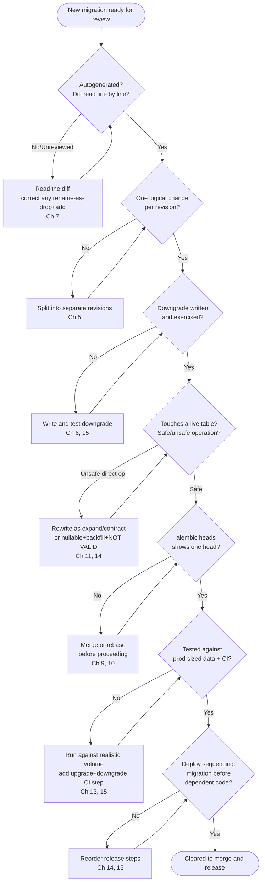

# Best Practices

[Chapter 15](./15-cicd-integration.md) closed out the "how ExpenseFlow ships a schema change safely" arc: ephemeral Postgres in CI, a drift check, a dedicated migration job ahead of the rolling deploy. Across the fifteen chapters before it you picked up dozens of individually sound recommendations — always write a downgrade, review autogenerate's diff before committing it, never widen an erasure-set... no, wrong course, but the shape of the problem is identical: every practice made sense in the chapter that taught it, and none of them were ever gathered in one place. This chapter is that place. It's organized by theme rather than by chapter number, so you can run it as a checklist — before you open a pull request with a new revision, before a production release, before you hand a junior engineer the migrations folder and walk away. Chapter 17 is the mirror image of this chapter: the same territory, described instead through the concrete failure modes you get when you skip these practices under deadline pressure.

---

## Learning Objectives

By the end of this chapter, you will be able to:

- Recite a defensible, professional-grade checklist covering migration authoring, schema-change safety, team/branch discipline, testing, environment configuration, and deployment operations.
- Explain the reasoning behind each practice well enough to adapt it when your situation doesn't match the textbook case (a tiny startup table vs. a 50-million-row production table behave very differently).
- Run a structured pre-merge and pre-release review of a migration and identify the highest-severity gaps first.
- Recognize the small number of decisions that are effectively one-way doors — an applied migration file, a merged branch head, a column dropped in production — and get them right before they're exercised.
- Distinguish practices that are stylistic preference from the smaller set that are load-bearing for data integrity or uptime.

---

## Prerequisites for This Chapter

This is a **synthesis** chapter. It assumes you've completed Chapters 1–15 and treats their content as settled ground — it does not re-teach any technique, it distills what you've already learned into one operational reference, organized by theme:

- **[Chapter 4: env.py & alembic.ini](./04-migration-environment-env-py.md)** — configuring the DB URL from environment/settings, the async engine gotcha.
- **[Chapter 5: Revisions & Version History](./05-revisions-and-version-history.md)** and **[Chapter 6: Upgrade & Downgrade](./06-upgrade-and-downgrade.md)** — the anatomy of a revision file, why downgrades matter.
- **[Chapter 7: Autogenerate Migrations](./07-autogenerate-migrations.md)** and **[Chapter 8: Writing Manual Migrations](./08-writing-manual-migrations.md)** — what autogenerate gets right and wrong, and hand-writing `op.*` directives.
- **[Chapter 9: The Version Table & Stamping](./09-the-version-table-and-stamping.md)** and **[Chapter 10: Branches & Merge Migrations](./10-branches-and-merge-migrations.md)** — `alembic_version`, diverging heads, merge revisions.
- **[Chapter 11: Data Migrations](./11-data-migrations.md)** — backfills, seeding, batching.
- **[Chapter 12: PostgreSQL-Specific Features](./12-postgresql-specific-features.md)** and **[Chapter 13: SQLite & Batch Migrations](./13-sqlite-batch-migrations.md)** — ENUM/JSONB/UUID DDL, batch mode.
- **[Chapter 14: Zero-Downtime Migrations & Production Deployment](./14-zero-downtime-migrations.md)** and **[Chapter 15: CI/CD Integration](./15-cicd-integration.md)** — expand/contract, safe deployment sequencing, pipeline gates.

If any of these feel unfamiliar, a quick re-read before continuing will make this chapter considerably more useful — every bullet below has a full chapter behind it if you need the complete explanation.

A handful of the decisions below are effectively **one-way doors** — cheap to get right up front, expensive or impossible to undo once real data or real deploys depend on them. Keep this short list in mind as you read the rest of the chapter; it's the fastest way to triage which bullet deserves the most attention in any given review:

| Decision | Reversible after the fact? | Where it's covered |
|---|---|---|
| Editing an already-applied migration file | No — different environments already disagree | Section 1 |
| A direct column/table rename against a live table | Effectively no — data loss or an outage happens before anyone can react | Section 2 |
| Letting two branches' heads diverge silently | Recoverable, but the merge gets more expensive the longer it waits | Section 3 |
| Skipping a downgrade test | Recoverable right up until the moment you actually need the downgrade | Section 4 |
| An unpinned Alembic/SQLAlchemy version | Recoverable, but an autogenerate behavior change can surface with no warning | Section 5 |
| Dropping a column still read by a running instance | Recoverable only via restore-from-backup if the data itself is gone | Section 2, Section 6 |

---

## 1. Migration Authoring Practices

*(Builds on Chapters 5, 7, and 8)*

- **Review every autogenerated migration's diff before you let it anywhere near a commit.** `--autogenerate` (Chapter 7) compares reflected DB state against `target_metadata` and writes what it infers — it is a first draft, not a finished migration. It reliably catches new/dropped tables and columns; it reliably gets renames wrong (a `drop_column` + `add_column` pair instead of `alter_column(...)`), and it can miss check constraints or server-default nuances depending on configuration. Reading the generated script line by line, every time, is not optional caution — it's the single highest-leverage habit in this entire chapter.
- **One logical schema change per revision.** A migration that adds a `monthly_budgets` table, alters `expenses.amount_cents`'s nullability, and drops an unrelated index all in one `upgrade()` is difficult to review, difficult to bisect when something breaks, and impossible to selectively roll back. If you find yourself writing "and" in a revision message, consider whether it should be two revisions.
- **Always write a downgrade, even for the migrations you're confident you'll never roll back.** Chapter 6 covered why: a downgrade path is cheap to write at authoring time (you already have full context on what changed) and expensive to reconstruct later, under pressure, after a bad release. An empty `downgrade()` with a `pass` is a decision, not an oversight — make it consciously, and prefer writing the real inverse operation instead.
- **Never edit an already-applied migration file. Write a new one.** This is the single rule in this chapter that, if violated, causes state that's genuinely hard to recover from. Once a revision has run anywhere — your machine, a teammate's, staging, production — its `revision` ID is baked into every database's `alembic_version` history and its checksum (implicit, via content) is what everyone's local copy assumes it is. Editing it in place means different environments now disagree about what "revision `a1b2c3d4`" actually did, with no record of the disagreement anywhere. If the migration was wrong, write a follow-up revision that corrects it.
- **Name revisions descriptively and let Alembic's autogenerated IDs be opaque.** `-m "add category_id fk to expenses"` reads like a git log; `-m "fix"` or `-m "migration2"` does not. Chapter 5's `alembic history` is only as useful as the messages in it.

```python
# Bad: an autogenerated rename accepted without review — this DROPS
# the description column and its data, then creates an empty notes column
def upgrade() -> None:
    op.drop_column("expenses", "description")
    op.add_column("expenses", sa.Column("notes", sa.String(), nullable=True))

# Good: reviewed and hand-corrected to preserve data (Chapter 7's central lesson)
def upgrade() -> None:
    op.alter_column("expenses", "description", new_column_name="notes")
```

---

## 2. Schema-Change Safety Practices

*(Builds on Chapters 11, 12, and 14)*

- **Use expand/contract for anything touching a live table with real rows in it.** Chapter 14 covered this in full: expand (add the new nullable column/table without touching the old one), migrate (deploy app code that handles both shapes), contract (drop the old column once every instance is on new code). A direct rename or a direct `NOT NULL` addition on a table serving live traffic is the most common way a "small" migration takes an app down.
- **Keep migrations fast — no unbounded, un-batched data operations inline in a schema migration.** An `UPDATE expenses SET currency = 'USD' WHERE currency IS NULL` against a two-row test table is instant; against ten million production rows it's a long-held lock and a long transaction, exactly the anti-pattern Chapter 11 warned about. Batch large backfills, or move them to a background job entirely and let the schema migration only add the (nullable) column.
- **Treat `NOT NULL` and type changes on existing columns as needing a plan, not a one-line `alter_column`.** The safe sequence from Chapters 11 and 14: add nullable → backfill in batches → add the constraint as `NOT VALID` and `VALIDATE CONSTRAINT` separately (or use Postgres 11+'s fast default path for a new column with a constant default) — never a single blocking `ALTER TABLE ... ALTER COLUMN ... SET NOT NULL` against a large, live table.
- **Consult the safe/unsafe operations table below before writing any migration that touches an already-deployed table**, and default to the safe column whenever you're unsure which side an operation falls on.

| Operation | Safety on a live table | Why |
|---|---|---|
| Add a new nullable column | Safe | No existing row needs to change; no lock beyond a brief metadata update on modern Postgres |
| Add a new table | Safe | Nothing references it yet |
| Add an index (with `CONCURRENTLY` outside a transaction, or accepted brief lock otherwise) | Safe with care | `CREATE INDEX CONCURRENTLY` avoids the write lock a plain `CREATE INDEX` takes |
| Rename a column or table directly | Unsafe | Old code reading/writing the old name breaks immediately — needs expand/contract (Chapter 14) |
| Add `NOT NULL` directly to an existing column | Unsafe on large tables | Full table scan/lock to validate; use nullable + backfill + `NOT VALID` constraint instead |
| Change a column's type | Unsafe in general | Usually requires a table rewrite; treat like a rename — expand/contract with a new column |
| Drop a column still read by any running instance | Unsafe | Breaks old code mid-rollout; only safe after a deploy gap (contract phase) |
| Add a column with a volatile/complex default | Unsafe on large tables pre-PG11 semantics | Can force a full rewrite depending on version/default type |
| Add a `UNIQUE` constraint to an existing column | Unsafe without preparation | Requires a full scan to check for duplicates first; validate uniqueness offline before adding |
| Add a foreign key referencing an existing table | Unsafe on large tables unless `NOT VALID` | Same shape as the `NOT NULL` case — add `NOT VALID`, then `VALIDATE CONSTRAINT` separately |

```sql
-- Unsafe: full-table lock while every row is checked for NULLs
ALTER TABLE expenses ALTER COLUMN currency SET NOT NULL;

-- Safer sequence: constraint added NOT VALID (no scan), validated separately
ALTER TABLE expenses ADD CONSTRAINT currency_not_null
  CHECK (currency IS NOT NULL) NOT VALID;
ALTER TABLE expenses VALIDATE CONSTRAINT currency_not_null;
```

The same "avoid the blocking lock" logic applies to indexes. A plain `op.create_index(...)` takes a lock that blocks writes to the table for the duration of the build; on a small `categories` table that's instant and harmless, but on `expenses` it's the same class of mistake as a naive `NOT NULL` addition:

```python
# Unsafe on a large, live table — blocks writes for the whole index build
def upgrade() -> None:
    op.create_index("ix_expenses_expense_date", "expenses", ["expense_date"])

# Safer — builds without blocking writes, at the cost of needing to run
# outside a transaction block (Alembic's batch/transactional-DDL handling
# needs `with op.get_context().autocommit_block():` for this)
def upgrade() -> None:
    with op.get_context().autocommit_block():
        op.create_index(
            "ix_expenses_expense_date",
            "expenses",
            ["expense_date"],
            postgresql_concurrently=True,
        )
```

---

## 3. Team and Version-Graph Practices

*(Builds on Chapters 9 and 10)*

- **Run `alembic heads` before opening a pull request that adds a revision, and again before merging it.** Chapter 10 walked through exactly how two developers branching off the same revision creates a divergent-heads situation — the earlier it's caught, the cheaper the merge revision is to write.
- **Rebase your migration onto the current head before merging your feature branch**, the same discipline as rebasing application code onto `main`. If someone else's revision landed on top of the one your migration branched from, regenerate your `down_revision` to point at the new head instead of leaving two heads for someone else to discover at deploy time.
- **Coordinate on shared revision heads in any team bigger than one person.** A quick Slack message ("I'm adding a revision on top of `f3a9...`, don't base yours there without checking") costs nothing; an unnoticed multi-head situation discovered during a production deploy costs an incident.
- **Treat `alembic stamp` as a last resort, not a routine tool**, and never stamp a database to a revision whose migration didn't actually run against it — Chapter 9 covered exactly how that silently desynchronizes what Alembic believes ran from what the schema actually looks like.
- **Merge divergent heads with `alembic merge heads -m "..."` promptly, not after several more revisions have piled onto each branch.** The longer two heads diverge before merging, the more surface area the merge revision has to reconcile.

```bash
# Routine pre-merge check — run this before opening or merging any PR
# that touches alembic/versions/
alembic heads
# a1b2c3d4e5f6 (head)          <- exactly one head: safe to proceed

# If a second head appears, resolve it before merging, not after:
alembic merge heads -m "merge receipts and monthly_budgets branches"
```

- **Keep the migration graph shallow where possible by shipping small, frequent revisions instead of large, infrequent ones.** Teams that batch up a month of model changes into one enormous revision right before a release create exactly the conditions for a painful multi-head merge — small, frequent revisions from multiple developers interleave far more gracefully than a handful of giant ones.

---

## 4. Testing Practices

*(Builds on Chapters 13 and 15)*

- **Test migrations against a dataset sized like production, not a handful of seed rows.** A migration that runs in 40ms against your local ExpenseFlow dev database with twelve `expenses` rows can hold a table lock for minutes against a production-sized table with tens of millions — and the only way to catch that before it happens live is to actually measure it against a realistically sized (or production-cloned/anonymized) dataset before shipping.
- **Run the full upgrade-then-downgrade cycle in CI, not just upgrade.** Chapter 15's pipeline runs `alembic upgrade head` and — as a rollback-testing step — `alembic downgrade -1` immediately after, proving the downgrade you wrote in Section 1 above actually executes cleanly rather than merely existing.
- **Use ephemeral, real Postgres in CI, and reserve SQLite for the specific place batch mode (Chapter 13) is actually relevant** — a fast local test suite. Don't let "the tests pass against SQLite" stand in for "the migration works," since SQLite's relaxed `ALTER TABLE` semantics can hide problems (and require batch mode workarounds) that never surface against the database you actually deploy to.
- **Wire a drift-detection check into CI** (Chapter 15's `alembic check` or an empty-diff autogenerate comparison) so a model change that was never captured in a revision fails the build instead of silently drifting until the next unrelated migration papers over it.

```yaml
# .github/workflows/migrations.yml excerpt — the round-trip test
# this section calls for, alongside drift detection
- name: Upgrade to head
  run: alembic upgrade head

- name: Verify no drift between models and migrations
  run: alembic check

- name: Downgrade one step and re-upgrade (rollback safety net)
  run: |
    alembic downgrade -1
    alembic upgrade head
```

- **Anonymize or synthetically generate the production-scale dataset you test against**, never test against a raw, unredacted production dump on a laptop or in CI — Chapter 15's ephemeral-Postgres pattern combines cleanly with a seeded, realistically-sized, privacy-safe fixture set.

---

## 5. Environment and Dependency Practices

*(Builds on Chapters 1 and 4)*

- **Pin Alembic and SQLAlchemy versions explicitly** in `requirements.txt`/`pyproject.toml`, and upgrade them deliberately, in their own commit, tested against your migration suite — not as a transitive side effect of upgrading an unrelated dependency. Alembic and SQLAlchemy's autogenerate comparison logic has changed behavior across versions; an unplanned version bump can change what a `--autogenerate` diff looks like without anyone asking for that.
- **Read the database URL from environment/settings, never hardcode it in `env.py`.** Chapter 4 covered wiring `env.py` to your FastAPI app's settings object — the same `env.py` should work unmodified against local, CI, staging, and production simply by changing environment variables.
- **Keep `env.py`'s async-engine handling explicit and understood by the whole team**, not treated as boilerplate nobody reads. Chapter 4's honest point stands: Alembic itself typically runs migrations through a sync connection (via `run_sync` or a sync driver URL) even in an async FastAPI app using `asyncpg` — a detail that trips up engineers who assume "the app is async, so migrations must be too."
- **Keep `alembic.ini`'s `script_location` and `file_template` consistent across environments** so a revision generated on one engineer's machine looks identical in structure to one generated in CI — divergent templates are a minor but real source of merge noise.

```python
# requirements.txt — pin, don't float, the two packages whose
# autogenerate/DDL behavior your entire migrations folder depends on
alembic==1.13.1
sqlalchemy==2.0.29

# alembic/env.py — DB URL from settings, never a literal connection string
from app.core.config import get_settings

settings = get_settings()
config.set_main_option("sqlalchemy.url", settings.database_url)
```

---

## 6. Deployment and Operations Practices

*(Builds on Chapters 14 and 15)*

- **Run migrations as a single, dedicated release step before rolling out new application instances — never as a race between concurrently starting containers.** Chapter 15 covered why: several app instances each running `alembic upgrade head` on startup can collide, and even where Alembic's locking prevents actual corruption, it's an unpredictable and unnecessary risk compared to one deliberate migration job gating the rollout.
- **Set a `lock_timeout` (and a reasonable `statement_timeout`) for the session running migrations**, so a migration that would otherwise queue behind a long-running query and silently accumulate lock-wait time instead fails fast and loudly, prompting a human to look rather than holding up a production release indefinitely.
- **Sequence code and schema deploys deliberately: migrate before the code that depends on the new shape ships, and only remove old-shape support after every instance is confirmed on new code.** This is expand/contract's real-world enforcement point — the plan from Chapter 14 is only as good as the deploy pipeline actually respecting the order it specifies.
- **Use a feature flag to decouple "the schema change is live" from "the application behavior change is live"** whenever the two don't strictly need to ship in the same release. Chapter 14's rolling `description`→`notes` rename used exactly this coordination: the column existed before any user-facing behavior depended on it, and the flag — not the migration — controlled when the new code path actually activated.
- **Keep a rollback plan for the release, not just a `downgrade()` function.** A production incident rarely wants "run downgrade and hope" as the only option — know in advance whether downgrading is even safe post-deploy (Section 2's unsafe operations may have already discarded data a downgrade can't restore) or whether "roll forward with a fix" is the real plan.

### Diagram: Pre-Merge / Pre-Release Migration Review



---

## 7. Documentation and Review Culture Practices

*(Cuts across every earlier chapter)*

- **Treat a migration's docstring/message as documentation for the next person reading `alembic history`, not a formality.** A message like `"backfill expenses.currency to USD for pre-2026 rows, part of TICKET-482"` tells a future engineer why the migration exists without them having to read the diff; `"update expenses"` does not.
- **Require a second reviewer on any migration that touches a table with production traffic**, the same bar you'd apply to a database credential rotation or an infrastructure change — a migration is infrastructure, even though it lives in the application repository and is easy to review with the same light touch as a typo fix.
- **Keep a lightweight, living record of "which tables are considered live/high-traffic" for the team** (a wiki page, a comment in the models file, anything actually maintained) so a new engineer reviewing a migration against `expenses` knows to apply Section 2's full checklist, while a migration against a brand-new, empty table can move faster.
- **Write the "why," not just the "what," in the pull request description for any non-trivial migration** — autogenerate already tells a reviewer *what* changed; what it can't tell them is *why* this shape was chosen over an alternative, which matters most exactly when a reviewer is deciding whether an unsafe-looking operation is actually justified.
- **Revisit this chapter itself periodically as a team**, not just individually — a shared checklist that only lives in one senior engineer's head isn't a team practice, it's a bus-factor-of-one risk with an extra step.

### Quick Command Reference

The commands this chapter leans on most, gathered in one place — each was introduced in an earlier chapter and is used here as a review/verification tool rather than being re-taught:

| Command | What it checks/does | Chapter it was introduced in |
|---|---|---|
| `alembic history` | Full revision chain, oldest to newest, with messages | Chapter 5 |
| `alembic heads` | Every current head — more than one means an unresolved fork | Chapter 9/10 |
| `alembic show <rev>` | Full detail of one revision, including its docstring | Chapter 5 |
| `alembic merge heads -m "..."` | Creates a merge revision reconciling two heads | Chapter 10 |
| `alembic upgrade head` / `alembic downgrade -1` | Applies/reverts migrations — the CI round-trip test | Chapter 6/15 |
| `alembic check` | Diffs models against migrations to detect drift | Chapter 15 |
| `alembic stamp head` | Marks a DB as current without running SQL — use sparingly | Chapter 9 |
| `alembic revision --autogenerate -m "..."` | Generates a draft migration from a model/DB diff | Chapter 7 |
| `alembic current` | Which revision(s) a specific database is actually at right now | Chapter 9 |
| `alembic branches` | Lists every point in the graph where history split | Chapter 10 |

Keep this table (or your team's equivalent) somewhere more discoverable than "the Alembic docs, if you remember to look" — a pinned wiki page or a `MIGRATIONS.md` in the repo root works well.

Pair the command table with a one-paragraph "who to ask" note for anything genuinely ambiguous — a safe/unsafe judgment call on an unusual operation, a stamping decision on a database with an uncertain history — since a checklist answers the routine 90% of cases, and the remaining 10% is exactly where a quick second opinion from someone who's seen a similar incident before is worth more than any documented rule.

---

## Real-World Scenario

**Setup:** You're the senior backend engineer running the pre-release review for ExpenseFlow's next deploy, which bundles three migrations: adding a `monthly_budgets.rollover_enabled` boolean column, a data backfill for existing `expenses.currency` values, and a fix to a `receipts` foreign key constraint. You walk each one against this chapter's checklist before approving the pull request.

**Migration authoring.** The `rollover_enabled` migration was generated with `--autogenerate` and, on inspection, looks correct — a straightforward `add_column` with `server_default=sa.false()`. But the `receipts` foreign-key fix migration is a hand-edit of a revision file that's **already been applied on staging three days ago**. **This is Issue #1**: whoever wrote it needed to fix a mistake in the original foreign-key definition, and instead of writing a new revision, edited the applied file in place. Staging's `alembic_version` table already points at that revision ID, having run the old (wrong) content — staging and a fresh local database now disagree about what that revision actually does, even though both claim to be "at" the same revision. The fix is to revert the edit and write a proper follow-up revision that corrects the constraint.

**Schema-change safety.** The `expenses.currency` backfill migration runs a single unbatched `UPDATE expenses SET currency = 'USD' WHERE currency IS NULL` with no `LIMIT`/batching. **This is Issue #2**: `expenses` is ExpenseFlow's largest table by a wide margin, and an unbatched update against a table with several million rows in production would hold row locks and generate a large single transaction for the whole run — exactly the anti-pattern Chapter 11 and Section 2 above warn against. The fix is to batch it (update in chunks by primary-key range) or move it to a background job outside the deploy-blocking migration path.

**Team and version-graph.** Running `alembic heads` against the migration branch shows a single head — no divergence — so this section passes cleanly.

**Testing.** None of the three migrations have been run against a production-sized clone; the CI pipeline runs `alembic upgrade head` but not a subsequent `downgrade -1`. **This is Issue #3**: the `rollover_enabled` migration's downgrade (`op.drop_column`) has never actually been executed, only written — and it turns out the author forgot the corresponding index drop, so the downgrade would currently fail if ever invoked.

**Environment and dependency.** `alembic==1.13.1` and `sqlalchemy==2.0.29` are both pinned in `requirements.txt`, unchanged by this PR — this section passes.

**Deployment and operations.** The release plan correctly sequences the migration job before the new application code that reads `rollover_enabled` rolls out — this section passes.

**Documentation and review culture.** All three migrations carry clear, ticket-referencing commit messages, and the PR description explains why the `receipts` foreign key needed fixing at all (a mismatched `ondelete` behavior discovered during a data-integrity audit) — this section passes, and the clear write-up is in fact what let you spot Issue #1 as quickly as you did, since the description made it obvious the "fix" touched a migration that had already shipped elsewhere.

**Outcome:** Three issues are caught before merge — an already-applied migration edited in place rather than corrected with a new revision, an unbatched backfill against ExpenseFlow's largest table, and an untested downgrade that would have failed on first real use — each mapping directly to a section of this chapter, and each far cheaper to fix in review than after a staging/production divergence, a long-held lock, or a failed rollback attempt during an incident.

---

## Best Practices

The condensed top-10 cheat sheet — the fastest possible pass through this chapter:

1. **Always review an autogenerated migration's diff before committing it**; never trust it blindly, especially around renames.
2. **One logical change per revision; write and test a downgrade for every migration**, even ones you don't expect to roll back.
3. **Never edit an already-applied migration file — write a new revision instead.** This is the one rule in this chapter with no safe exception.
4. **Use expand/contract for any change touching a live table**; consult the safe/unsafe operations table before writing a direct rename, type change, or `NOT NULL` addition.
5. **Never run unbounded data operations inline in a schema migration** — batch backfills, or move large ones to a background job.
6. **Run `alembic heads` before every merge**, rebase onto the current head, and merge divergent heads promptly rather than letting them accumulate.
7. **Test migrations against a production-sized dataset**, and run upgrade-then-downgrade in CI, not upgrade alone.
8. **Pin Alembic and SQLAlchemy versions deliberately**, and read the DB URL from environment/settings, never hardcoded.
9. **Run migrations as a dedicated release step before the app rolls out**, never as a race between starting containers.
10. **Set `lock_timeout` for migration sessions, and know your rollback plan** — not just whether a `downgrade()` exists, but whether running it post-deploy is actually safe.
11. **Write revision messages and PR descriptions that explain *why*, not just *what*, and require a second reviewer on any migration touching a live table** — a migration is infrastructure, and deserves the same review bar.

---

## Common Mistakes

This chapter's list has a mirror image — every practice above corresponds to a specific, recurring failure mode when it's skipped. **[Chapter 17: Common Mistakes & Pitfalls](./17-common-mistakes-and-pitfalls.md)** catalogs those failure modes in full detail, Symptom/Root Cause/Fix style, including the exact scenarios this chapter only gestures at: autogenerate silently turning a rename into a destructive drop-and-add, divergent heads discovered only at deploy time, an edited migration causing state drift between environments, a long lock from an unbatched `ALTER COLUMN` on a large table, and an untested downgrade that doesn't actually run. If any bullet above felt abstract, the next chapter makes it concrete.

---

## Summary

- **Migration authoring** (Section 1): review every autogenerated diff, one logical change per revision, always write a downgrade, never edit an applied migration file.
- **Schema-change safety** (Section 2): expand/contract for live tables, no unbounded inline data operations, the safe/unsafe operations table as a quick reference before writing `alter_column`.
- **Team and version-graph discipline** (Section 3): check `alembic heads` before merging, rebase onto the current head, merge divergent heads promptly, use `stamp` sparingly.
- **Testing** (Section 4): production-sized datasets, upgrade-then-downgrade in CI, real Postgres over SQLite-only testing, drift detection wired into the pipeline.
- **Environment and dependencies** (Section 5): pin Alembic/SQLAlchemy versions, read the DB URL from configuration, keep the async-engine handling in `env.py` understood by the team.
- **Deployment and operations** (Section 6): migrations as a dedicated release step, `lock_timeout` as a safety net, a real rollback plan beyond "a `downgrade()` function exists."
- **Documentation and review culture** (Section 7): descriptive revision messages, a second reviewer on any migration touching a live table, and a "why" written down for every non-trivial schema change.
- The **Real-World Scenario** showed this checklist catching three real, planted issues in a single ExpenseFlow release review — an edited applied migration, an unbatched backfill, and an untested downgrade — before any of them reached production.
- Chapter 17 is this chapter's mirror image: the same territory, described through concrete failure modes instead of positive practices.

---

## Knowledge Check

1. Why is "never edit an already-applied migration file" treated as the one rule in this chapter with no safe exception? What state actually goes wrong if you violate it?
2. A colleague argues that writing a downgrade for a migration you're "100% sure" you'll never roll back is wasted effort. What's the counterargument, and when (if ever) is an empty `downgrade()` actually the right call?
3. Explain why an `UPDATE` statement that runs instantly in your local dev database can become a production incident when run against ExpenseFlow's `expenses` table. What two mitigations does Section 2 offer?
4. What specifically does running `alembic downgrade -1` in CI verify that running only `alembic upgrade head` does not?
5. Why does pinning Alembic and SQLAlchemy versions matter specifically for autogenerate, beyond ordinary dependency-management hygiene?
6. A team's deploy pipeline starts three application containers simultaneously, each configured to run `alembic upgrade head` on startup before serving traffic. What does this chapter recommend instead, and why?
7. You're asked whether a given migration's downgrade is "safe" to run against production after a bad release. What do you need to check before assuming a downgrade actually restores the prior state? Separately, of the five "one-way door" decisions listed near the start of this chapter, which one is the most expensive to get wrong, and why?

---

## Hands-On Exercise

You've inherited the following migration, written against ExpenseFlow's `expenses` table (several million rows in production), and asked to review it before it merges. Audit it against this chapter's checklist.

```python
"""add currency not null constraint

Revision ID: c7f1a2b3d4e5
Revises: b6e0918273ac
Create Date: 2026-07-20 10:15:00
"""
from alembic import op
import sqlalchemy as sa

revision = "c7f1a2b3d4e5"
down_revision = "b6e0918273ac"


def upgrade() -> None:
    op.execute("UPDATE expenses SET currency = 'USD' WHERE currency IS NULL")
    op.alter_column("expenses", "currency", nullable=False)


def downgrade() -> None:
    pass
```

1. Identify every violation of this chapter's practices in the migration above — there are at least three. For each, name the section it violates and the concrete risk.
2. Rewrite `upgrade()` so the backfill is batched (update in chunks of, say, 5,000 rows by primary-key range) instead of a single unbatched statement.
3. Rewrite the `NOT NULL` addition using the `NOT VALID` + `VALIDATE CONSTRAINT` sequence from Section 2, instead of a direct `alter_column(..., nullable=False)`.
4. Write a real `downgrade()` that reverses the constraint addition (dropping the constraint is sufficient — the backfilled data doesn't need to be un-backfilled for the schema to be considered "downgraded").
5. Run `alembic upgrade head` followed immediately by `alembic downgrade -1` against a local Postgres instance to confirm your rewritten downgrade actually executes without error.
6. Write one sentence describing the deploy-sequencing plan you'd use to ship this migration safely (which section of this chapter does it draw from?).
7. Run `alembic heads` against your local migrations folder before and after adding your corrected revision, and confirm it still reports a single head — the review isn't complete until Section 3's check passes too, even for a migration that has nothing to do with branching.

---

## Further Reading

- [Alembic Official Documentation](https://alembic.sqlalchemy.org/en/latest/) — the umbrella reference for everything this chapter consolidates.
- [Alembic Operation Reference (`op.*`)](https://alembic.sqlalchemy.org/en/latest/ops.html) — the authoritative catalog behind Section 1 and 2's examples.
- [Alembic Autogenerate documentation](https://alembic.sqlalchemy.org/en/latest/autogenerate.html) — the detection rules and caveats behind Section 1's "review every diff" practice.
- [PostgreSQL ALTER TABLE documentation](https://www.postgresql.org/docs/current/sql-altertable.html) — lock behavior behind Section 2's safe/unsafe operations table.
- [Alembic Cookbook](https://alembic.sqlalchemy.org/en/latest/cookbook.html) — worked recipes, including batching and offline-mode patterns referenced across this chapter.

<div style="display:flex;justify-content:space-between;align-items:center;">
  <a href="./15-cicd-integration.md">← Previous: CI/CD Integration</a>
  <a href="./00-index.md">🏠 Index</a>
  <a href="./17-common-mistakes-and-pitfalls.md">Next: Common Mistakes & Pitfalls →</a>
</div>
