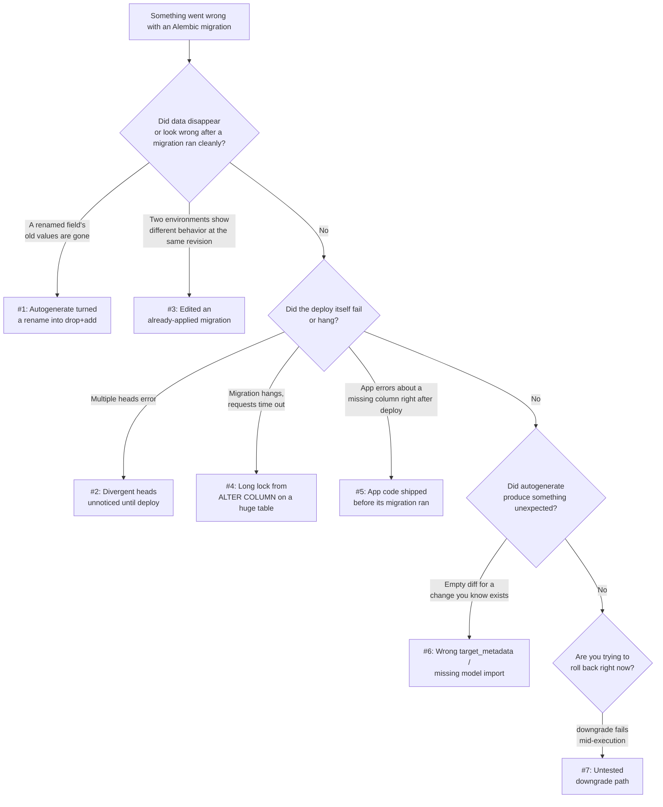

# Common Mistakes & Pitfalls

[Chapter 16](./16-best-practices.md) gave you a positive checklist — the things a well-run Alembic workflow does right, organized by theme. This chapter is the negative image of that checklist: a **failure mode catalog**. Every numbered section below documents one real, recurring, production-grade mistake teams make with Alembic and schema migrations generally — not typos, but structural misunderstandings that work fine in a demo and fail expensively in production, usually weeks later and usually under deploy pressure. Each mistake is told the way an incident report tells it: **Symptom** (what you'd actually observe — a failing deploy, a data-loss report, a confused teammate), **Root Cause** (the misunderstanding that actually caused it), and **Fix** (the concrete change that prevents it, with before/after code). Treat this chapter as a pre-mortem: if you recognize your own migrations folder in any section below, that's the chapter doing its job.

---

## Learning Objectives

By the end of this chapter, you will be able to:

- Recognize seven common, production-grade Alembic/migration mistakes from their symptoms alone, before digging into root cause.
- Explain *why* each mistake happens — usually a reasonable-sounding assumption that breaks down under a specific condition or at a specific scale.
- Apply the concrete fix for each mistake, including the exact Alembic commands or code changes involved.
- Distinguish mistakes that are recoverable after the fact (an untested downgrade you can still fix) from mistakes that are only preventable *before* the fact (a rename that's already shipped as a destructive drop+add against production data).
- Diagnose a real incident where two or more of these mistakes compound into one larger failure, and unwind them one at a time.
- Use this chapter's diagnostic tree to triage an unfamiliar migration incident against a known failure mode.

---

## Prerequisites for This Chapter

This chapter assumes you've worked through **Chapters 1–16** and treats their content as settled ground. In particular, it assumes fluency with:

- Autogenerate's detection rules and blind spots (**[Chapter 7: Autogenerate Migrations](./07-autogenerate-migrations.md)**)
- The migration graph, revision anatomy, and `env.py`'s `target_metadata` wiring (**[Chapter 4](./04-migration-environment-env-py.md)**, **[Chapter 5: Revisions & Version History](./05-revisions-and-version-history.md)**)
- The `alembic_version` table and branches/merges (**[Chapter 9: The Version Table & Stamping](./09-the-version-table-and-stamping.md)**, **[Chapter 10: Branches & Merge Migrations](./10-branches-and-merge-migrations.md)**)
- PostgreSQL lock behavior on `ALTER TABLE` (**[Chapter 12: PostgreSQL-Specific Features](./12-postgresql-specific-features.md)**)
- Expand/contract and safe deployment sequencing (**[Chapter 14: Zero-Downtime Migrations & Production Deployment](./14-zero-downtime-migrations.md)**)
- CI/CD pipeline design and rollback testing (**[Chapter 15: CI/CD Integration](./15-cicd-integration.md)**)
- The consolidated best-practices checklist (**[Chapter 16: Best Practices](./16-best-practices.md)**)

If any of those feel shaky, this chapter will still make sense at a narrative level, but the fixes will be more useful if you refresh the relevant chapter first — each section below links back to what it depends on.

A quick orientation before the detailed sections — which of these seven mistakes are recoverable after the fact, and which are effectively one-way doors once they've happened against real data:

| # | Mistake | Recoverable after the fact? |
|---|---|---|
| 1 | Autogenerate turns a rename into drop+add | Only via backup restore — the dropped column's data is gone from the live table |
| 2 | Divergent heads unnoticed until deploy | Yes — a merge revision resolves it, though the delay raises the cost |
| 3 | Editing an already-applied migration | No clean fix — requires manually reconciling every environment's actual state |
| 4 | Long lock from `ALTER COLUMN` on a huge table | Yes — cancel the statement; the table itself isn't damaged, only unavailable |
| 5 | App code shipped before its migration ran | Yes — usually a fast-follow migration or a rollback of the code deploy |
| 6 | Wrong `target_metadata` / missing model import | Yes — fix the import and regenerate the migration |
| 7 | Untested downgrade paths | Yes, if caught before an incident forces you to rely on it |

Mistakes #1 and #3 stand out for a reason: both involve data or state that's already been silently and irreversibly altered by the time anyone notices, which is exactly why Sections 1 and 3 get the most detailed treatment below.

---

## 1. Autogenerate Silently Turning a Rename Into a Destructive Drop + Add

**Symptom:** A migration that was supposed to rename `expenses.description` to `expenses.notes` runs cleanly in every environment. A week later, someone notices every expense's description text is gone — `notes` is empty for every historical row, even though `description` clearly had data before the deploy.

**Root Cause:** Autogenerate (Chapter 7) compares reflected column names against `target_metadata` structurally, not semantically — it has no way to know that removing `description` and adding `notes` in the same model change was *intended as a rename* rather than as two independent, coincidental operations. It generates exactly what it observes: `op.drop_column("expenses", "description")` followed by `op.add_column("expenses", sa.Column("notes", ...))`. Both operations are individually valid DDL, so nothing errors — the migration "succeeds," and the data loss is silent until someone goes looking for the old values.

**Fix:** Never accept an autogenerated rename at face value — this is exactly why Chapter 16's "review every diff" practice exists. Rewrite the generated drop+add as a single `alter_column(..., new_column_name=...)`, which renames the column in place and preserves every existing value.

```python
# What autogenerate actually produces for a rename — looks plausible,
# silently discards every row's existing description text
def upgrade() -> None:
    op.drop_column("expenses", "description")
    op.add_column("expenses", sa.Column("notes", sa.String(), nullable=True))

# Corrected by hand after reviewing the diff — preserves existing data
def upgrade() -> None:
    op.alter_column("expenses", "description", new_column_name="notes")
```

If the rename also needs zero-downtime handling because the table is already live in production, this single `alter_column` is still only the *schema* half — see **[Chapter 14](./14-zero-downtime-migrations.md)** for the full expand/contract sequence needed on a table serving live traffic.

**A closely related variant of this mistake:** autogenerate can also miss a *table* rename the same way, producing `op.drop_table("old_name")` followed by `op.create_table("new_name", ...)` — losing every row, not just a column's worth of data. The fix is the same principle at a different granularity: `op.rename_table("old_name", "new_name")` instead of accepting the generated drop/create pair. Because table renames are rarer than column renames in practice, teams are often less primed to catch this variant during review — which is exactly why it's worth calling out explicitly rather than assuming "we already know to check for renames" covers both cases.

---

## 2. Divergent Heads Going Unnoticed Until Deploy

**Symptom:** Two engineers each add a migration on their own feature branch, both based on the same revision — one for `receipts`, one for `monthly_budgets` — and both branches are individually reviewed, approved, and merged into `main` without incident. The next deploy fails with an Alembic error about multiple heads, and nobody on the team can immediately say which of the two migrations should run first.

**Root Cause:** Each engineer's local `alembic revision` command set `down_revision` to whatever the current head was on their own branch at the time they created it (Chapter 10). Because neither branch was rebased onto the other before merging, `main` ends up with two migrations that both point at the same parent — a fork in the migration graph that Alembic (correctly) refuses to silently resolve, since it has no way to know which order the team intends. This isn't a bug; it's Alembic doing exactly what Chapter 9's `alembic heads` check would have caught in code review, if anyone had run it.

**Fix:** Run `alembic heads` before merging any branch that adds a revision, as part of the standard pre-merge checklist (Chapter 16). Once divergence is discovered, resolve it with a proper merge revision rather than manually reordering `down_revision` values.

```bash
# Discover the fork
alembic heads
# f1a2b3c4d5e6 (head)   <- receipts branch
# a9b8c7d6e5f4 (head)   <- monthly_budgets branch

# Resolve it with a merge revision naming both parents
alembic merge heads -m "merge receipts and monthly_budgets branches"
# creates a new revision whose down_revision is a tuple of both heads
```

The earlier this is caught, the smaller the merge revision — teams that only discover divergence at deploy time are usually discovering it after several more migrations have piled onto each branch, turning a two-line merge into a real reconciliation exercise.

---

## 3. Editing an Already-Applied Migration and Causing Environment Drift

**Symptom:** A migration that ran successfully on staging three weeks ago is edited to fix a bug in its `upgrade()` logic. The fix is deployed to production, which has never run the original revision. Staging and production are both "at" the same revision ID according to `alembic_version` — but staging's schema reflects the old (buggy) logic and production's reflects the new (fixed) logic. Nobody notices until a query that depends on the difference behaves inconsistently between the two environments.

**Root Cause:** Alembic's only durable record of migration state is the `alembic_version` table (Chapter 9), and it records a revision *ID*, not a checksum or hash of the revision's actual content. Nothing prevents editing an already-applied migration file in place — Alembic has no mechanism to detect that "revision `c7f1a2b3d4e5`" now means something different than it did when staging ran it. Every environment that already executed the old version of the file is now silently out of sync with any environment that runs (or re-runs) the edited version, with no error, warning, or drift signal anywhere.

**Fix:** Chapter 16's rule stated plainly: never edit an already-applied migration file. If a revision that's already run somewhere turns out to be wrong, write a new revision that corrects it — the fix is itself a migration, applied forward, exactly like any other schema change.

```python
# Wrong: editing c7f1a2b3d4e5's upgrade() after it already ran on staging
# — staging and production now disagree about what this revision did

# Right: leave c7f1a2b3d4e5 untouched; add a new revision that corrects it
"""fix currency backfill from c7f1a2b3d4e5

Revision ID: d8e2b3c4f5a6
Revises: c7f1a2b3d4e5
"""
def upgrade() -> None:
    op.execute("UPDATE expenses SET currency = 'USD' WHERE currency = ''")
```

If you inherit a codebase where this has already happened, treat it as an active incident: diff the file against its state in version control history at the time each environment ran it, and reconcile each environment's actual schema against what it should be — don't assume `alembic_version` agreeing across environments means the schemas agree.

---

## 4. A Long Lock From `ALTER COLUMN` on a Huge Table Taking the App Down

**Symptom:** A migration that adds a `NOT NULL` constraint to `expenses.currency` runs without error in every lower environment. In production, the deploy hangs; requests touching the `expenses` table start timing out; on-call gets paged for what looks like a full outage, not a slow migration.

**Root Cause:** `ALTER TABLE expenses ALTER COLUMN currency SET NOT NULL` (Chapter 12) requires Postgres to scan the entire table to verify no existing row violates the new constraint, and it holds an `ACCESS EXCLUSIVE` lock on the table for the duration — blocking every read and write against `expenses`, including the application's normal traffic, until the scan finishes. Lower environments never surface this because their `expenses` tables have a few dozen rows and the scan is instantaneous; production's table, with millions of rows, turns the same statement into a multi-minute (or longer) lock that the running application experiences as a full outage on every code path that touches expenses.

**Fix:** Never add a `NOT NULL` constraint directly against a large, live table. Use the `NOT VALID` + `VALIDATE CONSTRAINT` sequence (Chapter 11/14), which avoids the blocking scan on the initial `ALTER TABLE` and validates existing rows in a separate step that takes only a lighter lock.

```sql
-- Before: blocks the whole table for the full scan duration
ALTER TABLE expenses ALTER COLUMN currency SET NOT NULL;

-- After: constraint added without a blocking scan, validated separately
ALTER TABLE expenses ADD CONSTRAINT currency_not_null
  CHECK (currency IS NOT NULL) NOT VALID;
ALTER TABLE expenses VALIDATE CONSTRAINT currency_not_null;
```

Set a `lock_timeout` on the session running production migrations (Chapter 16) as a safety net — a migration that would otherwise queue and hold up traffic fails fast and loudly instead, which turns this mistake into an immediately visible failed deploy rather than a silent multi-minute outage.

---

## 5. Shipping New Application Code Before Its Migration Has Run

**Symptom:** A new release deploys application code that reads `expenses.category_id` — added in an earlier chapter's autogenerate example — but the corresponding migration hasn't run yet against this particular environment. Every request touching expenses throws a database error about a missing column, and the error only appears in the environment where the deploy order was different (a customer's on-prem instance, a secondary region, a hotfix pipeline that skipped the usual migration step).

**Root Cause:** Application code and schema migrations are deployed through different mechanisms in most pipelines — one is a container image rollout, the other is a database operation — and nothing enforces that the migration completes before the new code that depends on it starts serving traffic, unless the pipeline is explicitly built to guarantee that order (Chapter 15). Teams that got away with "the app container runs migrations on startup" for a long time can still hit this the moment a deploy path bypasses that startup hook — a hotfix pushed directly, a secondary environment with a slightly different pipeline, a rollback that redeploys old code onto a database that already has the new schema (the mirror-image version of this same mistake).

**Fix:** Treat "migration completed" as an explicit, checked precondition of the application rollout, not an assumption baked into deploy ordering by convention. Chapter 15's dedicated migration job before the rolling app deploy is exactly this: a single, verified step that must succeed before any new application instance starts.

```yaml
# GitHub Actions excerpt: migration job is a hard dependency of the deploy job,
# not something the app container is trusted to handle on its own
jobs:
  migrate:
    steps:
      - run: alembic upgrade head

  deploy:
    needs: migrate  # deploy cannot start until migrate succeeds
    steps:
      - run: ./deploy.sh
```

Also verify the *reverse* ordering for rollbacks: rolling back application code without also considering whether the schema needs to roll back (or whether the old code even still works against the new schema) reintroduces the same class of mistake from the opposite direction.

---

## 6. Autogenerate Against the Wrong `target_metadata` or Missing Model Imports

**Symptom:** A new `Category` model is added to the codebase, `alembic revision --autogenerate` is run, and the generated migration is empty — no `create_table` for `categories` at all, despite the model clearly existing in the codebase.

**Root Cause:** Autogenerate only knows about tables that are actually registered on the `Base.metadata` object passed to `env.py`'s `target_metadata` (Chapter 4) at the moment the command runs — and a SQLAlchemy declarative model only registers itself on that metadata when its module is *imported* somewhere in the process. If `Category` lives in a new module that nothing imports yet (not wired into the models `__init__.py`, not imported by any file `env.py` transitively loads), SQLAlchemy never sees the class, `target_metadata` never includes the `categories` table, and autogenerate's diff — comparing the live database against an incomplete `target_metadata` — correctly reports "no difference" for a table it doesn't know exists. This is arguably worse than an error, because nothing fails; the migration is simply silently wrong.

**Fix:** Ensure `env.py`'s model import path pulls in every model module before `target_metadata` is read — typically by importing a single models package `__init__.py` that itself imports every model module, so adding a new model file only requires adding one import line in one place, not remembering to wire `env.py` itself every time.

```python
# app/models/__init__.py — the single place new models must be imported
from app.models.user import User
from app.models.expense import Expense
from app.models.category import Category  # forgetting this line is Mistake #6

# alembic/env.py
from app.models import Base  # importing Base after the package above
                              # guarantees every model is registered first
target_metadata = Base.metadata
```

After adding any new model, run `alembic revision --autogenerate -m "..."` and actually read the generated file before assuming it captured the change — an empty or suspiciously small diff for a change you know should be substantial is itself a signal something wasn't imported.

---

## 7. Untested Downgrade Paths That Don't Actually Work

**Symptom:** A production incident forces a decision to roll back a recent release. `alembic downgrade -1` is run against production for the first time this particular migration has ever been downgraded, and it fails partway through with an error about a constraint that doesn't exist — leaving the database in neither the old nor the new schema state, mid-incident.

**Root Cause:** Chapter 6 established that every migration should have a downgrade, and Chapter 16 restated it as a best practice — but a downgrade function that was written once, never executed, and never touched again is a downgrade in name only. It's easy for a `downgrade()` to silently rot: a later migration adds an index that the downgrade doesn't know to drop first, a constraint name gets renamed in a follow-up revision without updating the original downgrade, or the downgrade was simply written against an assumption about column order that a later autogenerate run quietly changed. None of this shows up until the downgrade is actually invoked — which, for many teams, is precisely during the highest-pressure moment possible: an active incident.

**Fix:** Run the upgrade-then-downgrade cycle in CI for every migration, not just upgrade (Chapter 15/16) — this is the only way to know a downgrade actually executes before you need it to, rather than discovering it doesn't during an incident.

```bash
# CI step that would have caught a broken downgrade before it ever
# reached production, instead of during an active rollback
alembic upgrade head
alembic downgrade -1
alembic upgrade head   # confirm re-upgrading also still works cleanly
```

If a downgrade is found to be broken only during an incident, don't burn more time trying to fix it live — evaluate whether "roll forward with a corrective migration" (Section 3's pattern) is faster and safer than continuing to debug a downgrade under pressure.

**A note on why this mistake is so easy to accumulate silently:** unlike Sections 1-6, nothing about an untested downgrade fails loudly at authoring time — the migration file looks complete, code review sees a `downgrade()` function with sensible-looking `op.*` calls, and the CI pipeline (if it only runs `alembic upgrade head`) never exercises it. The gap between "looks complete" and "actually works" only closes the moment someone runs it, which is precisely why Chapter 15 and Chapter 16 both insist on making that a routine, automated CI step rather than a manual, easy-to-skip one.

---

## Which Mistake Is It? A Diagnostic Decision Tree



### Which Process Control Would Have Caught It First

Every mistake in this chapter has a specific, mundane process control that catches it before it reaches production — none of them require exotic tooling, only the discipline to actually run them every time:

| Mistake | Process control that catches it | Where it's automated |
|---|---|---|
| #1 — rename as drop+add | Manual review of the autogenerated diff | Code review, Chapter 16 Section 1 |
| #2 — divergent heads | `alembic heads` returning exactly one result | Pre-merge check, Chapter 16 Section 3 |
| #3 — edited applied migration | Treating migration files as immutable once merged | Code review norm, no tooling substitute |
| #4 — long lock on `ALTER COLUMN` | Reviewing DDL against the safe/unsafe operations table | Code review, Chapter 16 Section 2 |
| #5 — code before migration | A dedicated migration job gating the app rollout | CI/CD pipeline, Chapter 15 |
| #6 — missing model import | A non-empty, reviewed diff for every model change | Code review + drift check, Chapter 15 |
| #7 — untested downgrade | `alembic downgrade -1` run in CI, not just upgrade | CI/CD pipeline, Chapter 15/16 |

Notice that only Mistake #3 has no automated backstop at all — it depends entirely on human discipline and code-review norms, which is exactly why Chapter 16 calls it out as the one rule with no safe exception rather than something a pipeline can enforce for you.

---

## Real-World Scenario

**Setup:** ExpenseFlow's platform team ships what looks like a routine Friday-afternoon release: a rename of `expenses.description` to `expenses.notes` (planned as a quick autogenerate-and-review job), bundled with an unrelated new `Category` field added earlier in the sprint. An hour after deploy, two separate reports land in the team's incident channel within minutes of each other.

**Diagnosis — pulling the thread:**

The first report: a customer support engineer notices every expense's notes field is blank for anything created before today, even though users clearly entered descriptions historically. Pulling up the migration that ran, the on-call engineer finds it's exactly **Mistake #1** — the rename was generated via `--autogenerate`, and nobody caught that the diff contained a `drop_column`/`add_column` pair instead of a single `alter_column`. The review step that would have caught it (Chapter 16's "read every autogenerated diff") was skipped under Friday-afternoon time pressure.

The second report, arriving almost simultaneously: the mobile team says their new "filter by category" feature is throwing 500 errors in production, despite working fine in staging. Investigating, the `categories` table simply doesn't exist in production — the migration that should have created it was never generated, because the `Category` model lives in a new `app/models/category.py` file that was never added to `app/models/__init__.py`'s import list. This is **Mistake #6**: `target_metadata` never saw the model, autogenerate produced an empty diff for it weeks ago, and nobody noticed because nothing errored at the time — it only became visible once application code that assumed the table's existence finally shipped.

**The fix, applied as two separate, urgent follow-up actions:**

1. For the rename: since `description`'s data is unrecoverable from the database itself (the column was actually dropped), the team restores it from the most recent point-in-time backup taken before the deploy, re-populates `notes` from the recovered data via a new corrective migration, and — per Chapter 16 — does **not** edit the original faulty migration file; a new revision performs the recovery.
2. For the missing table: `Category` is added to the models package's import list, a fresh `--autogenerate` immediately picks up the now-visible `categories` table, and the resulting migration is reviewed and deployed as an urgent out-of-band release, restoring the mobile team's filter feature.

**Lesson:** Neither mistake was individually complex to explain, and neither required unusual conditions to trigger — a normal rename and a normal new-model addition, both handled the way autogenerate handles them by default. What made the incident sting was that both slipped through the exact review step Chapter 16 names as the single highest-leverage habit in the whole course: reading the generated diff, every time, without exception. A Friday-afternoon deploy under time pressure is precisely when that habit is most tempting to skip and most expensive to have skipped.

---

## Best Practices

- **Make Chapter 16's checklist a gate, not a suggestion** — read every autogenerated diff, check `alembic heads`, and run upgrade-then-downgrade in CI before any migration reaches production, especially under deadline pressure, which is exactly when these steps get skipped.
- **Treat autogenerate's output as a first draft you are responsible for, never as a finished migration** — Mistakes #1 and #6 both come from trusting it past that point.
- **Run `alembic heads` as a matter of routine before every merge that touches the migrations folder**, not just when you suspect a conflict (Mistake #2).
- **Treat an already-applied migration file as immutable** — if it's wrong, the fix is always a new revision, never an edit (Mistake #3).
- **Know the lock behavior of every DDL statement you're about to run against a large table** before running it in production, not after (Mistake #4).
- **Make "migration complete" an explicit, verified precondition of the application rollout**, never an assumption based on deploy ordering convention (Mistake #5).
- **Exercise every downgrade in CI, not just write it** — a downgrade that's never run is a hypothesis, not a safety net (Mistake #7).

---

## Common Mistakes

- **#1 — Autogenerate silently turning a rename into a destructive drop+add:** a structural diff has no way to know a drop and an add were meant as one rename; the fix is always a hand-written `alter_column`.
- **#2 — Divergent heads going unnoticed until deploy:** two branches based on the same revision, merged without rebasing or checking `alembic heads`, produce a multi-head graph Alembic correctly refuses to guess an order for.
- **#3 — Editing an already-applied migration file:** `alembic_version` records a revision ID, not its content, so editing a file after it's run elsewhere silently desynchronizes environments with no error.
- **#4 — A long lock from `ALTER COLUMN` on a huge table:** a `NOT NULL`/type change that's instant on a tiny table can hold an `ACCESS EXCLUSIVE` lock for minutes on a production-sized one, reading as a full outage.
- **#5 — Shipping app code before its migration has run:** without an explicit, enforced ordering, a deploy path that skips the usual migration step ships code that references schema that isn't there yet.
- **#6 — Autogenerate against the wrong `target_metadata` / missing model imports:** a model that's never imported never registers on `Base.metadata`, so autogenerate correctly reports "no difference" for a table it simply doesn't know exists.
- **#7 — Untested downgrade paths:** a `downgrade()` written once and never executed can silently rot as later migrations change the schema underneath it, and the failure surfaces exactly when you can least afford it — during an incident.

---

## Summary

- This chapter is a failure-mode catalog: each numbered mistake follows the same shape — a reasonable-sounding shortcut, a symptom that surfaces later, a root cause rooted in a real misunderstanding of how Alembic actually works, and a concrete fix.
- Authoring mistakes (Sections 1, 6) come from trusting autogenerate past what it can actually infer — it detects structural differences, not intent, and only sees models that are actually imported.
- Team/graph mistakes (Sections 2, 3) come from treating the migration graph and `alembic_version` as more forgiving than they are — divergent heads and edited applied files both produce silent, hard-to-diagnose disagreement between environments.
- Production-safety mistakes (Sections 4, 5) come from underestimating what a "simple" DDL statement or deploy-ordering assumption actually costs at production scale and under real deploy-pipeline conditions.
- Testing-discipline mistakes (Section 7) come from writing a safety mechanism (a downgrade) without ever verifying it actually works, which only surfaces the gap during the exact moment it matters most.
- Real incidents are rarely one mistake in isolation — the Real-World Scenario showed a destructive rename and a missing-model-import bug surfacing within the same hour, both traceable to the same skipped review step under deadline pressure.
- The fastest way to avoid ending up in this chapter is to treat **[Chapter 16](./16-best-practices.md)**'s checklist as a pre-release gate, not a post-incident reading list.

---

## Knowledge Check

1. A migration that renames a column ran without any errors, but a week later the historical data in the new column is empty. Which mistake is this, and what specifically should the migration have contained instead?
2. Two feature branches, each with their own migration based on the same parent revision, are merged into `main` on the same day without incident during review. What command should have been run before each merge, and what would it have shown?
3. Why does `alembic_version` agreeing across two environments not guarantee their schemas actually match? Describe a concrete scenario where it doesn't.
4. A migration that adds a `NOT NULL` constraint runs instantly in staging but hangs for several minutes in production, causing request timeouts. What Postgres behavior explains the difference, and what two-step alternative avoids it?
5. `alembic revision --autogenerate` produces an empty migration file despite a new model clearly being added to the codebase. What's the most likely root cause, and where should you look first?
6. A production incident forces an emergency `alembic downgrade -1`, which fails partway through. What should have happened earlier to prevent discovering this during the incident itself?
7. Describe a realistic sequence of two compounding mistakes from this chapter that could surface within the same release, and explain why fixing them independently (without recognizing the shared root cause) might miss the real lesson.

---

## Hands-On Exercise

**Goal:** Reproduce Mistake #1 (autogenerate turning a rename into a destructive drop+add) locally, observe the data loss, then apply the correct fix.

1. Set up a local ExpenseFlow-style table with sample data:

```sql
CREATE TABLE expenses (
    id SERIAL PRIMARY KEY,
    description VARCHAR NOT NULL
);
INSERT INTO expenses (description) VALUES ('Coffee with client'), ('Taxi to airport');
```

2. Update the SQLAlchemy model to rename the column, simulating a real code change:

```python
class Expense(Base):
    __tablename__ = "expenses"
    id: Mapped[int] = mapped_column(primary_key=True)
    notes: Mapped[str] = mapped_column(sa.String, nullable=False)  # was "description"
```

3. Generate a migration with autogenerate and inspect the output before applying it:

```bash
alembic revision --autogenerate -m "rename description to notes"
```

Read the generated file. Confirm it contains a `drop_column("expenses", "description")` and `add_column("expenses", sa.Column("notes", ...))` pair rather than a single `alter_column`.

4. Apply it as generated, and confirm the data loss:

```bash
alembic upgrade head
```

```sql
SELECT * FROM expenses;
-- notes column exists but is NULL for every row — the original text is gone
```

5. Roll back, hand-correct the migration to use `alter_column`, and re-apply:

```bash
alembic downgrade -1
```

```python
def upgrade() -> None:
    op.alter_column("expenses", "description", new_column_name="notes")

def downgrade() -> None:
    op.alter_column("expenses", "notes", new_column_name="description")
```

```bash
alembic upgrade head
```

```sql
SELECT * FROM expenses;
-- notes column now contains the original description text for every row
```

6. Write one sentence describing what specific step in your normal review process would have caught this before step 4 ran against a real database.

---

## Further Reading

- [Alembic Autogenerate documentation](https://alembic.sqlalchemy.org/en/latest/autogenerate.html) — the authoritative reference on what autogenerate detects and what it structurally cannot, behind Sections 1 and 6.
- [Alembic Branches documentation](https://alembic.sqlalchemy.org/en/latest/branches.html) — the mechanics of divergent heads and merge revisions behind Section 2.
- [PostgreSQL ALTER TABLE documentation](https://www.postgresql.org/docs/current/sql-altertable.html) — lock behavior behind Section 4's `NOT NULL`/lock discussion.
- [Alembic Operation Reference (`op.*`)](https://alembic.sqlalchemy.org/en/latest/ops.html) — the correct `alter_column` usage referenced in Section 1's fix.
- [SQLAlchemy 2.0 ORM documentation](https://docs.sqlalchemy.org/en/20/orm/) — declarative model registration on `Base.metadata`, relevant to Section 6's missing-import failure mode.

<div style="display:flex;justify-content:space-between;align-items:center;">
  <a href="./16-best-practices.md">← Previous: Best Practices</a>
  <a href="./00-index.md">🏠 Index</a>
  <a href="./18-tools-and-ecosystem.md">Next: Tools & Ecosystem →</a>
</div>
