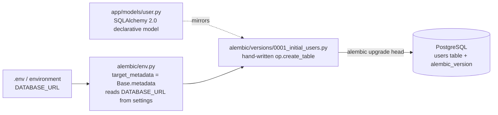
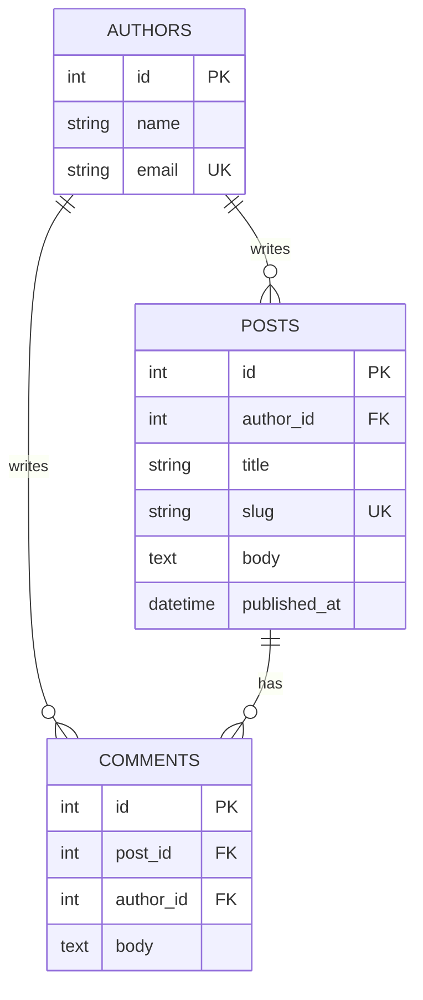
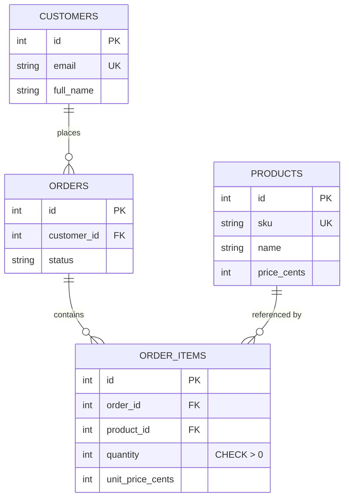
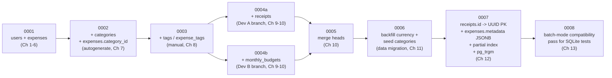
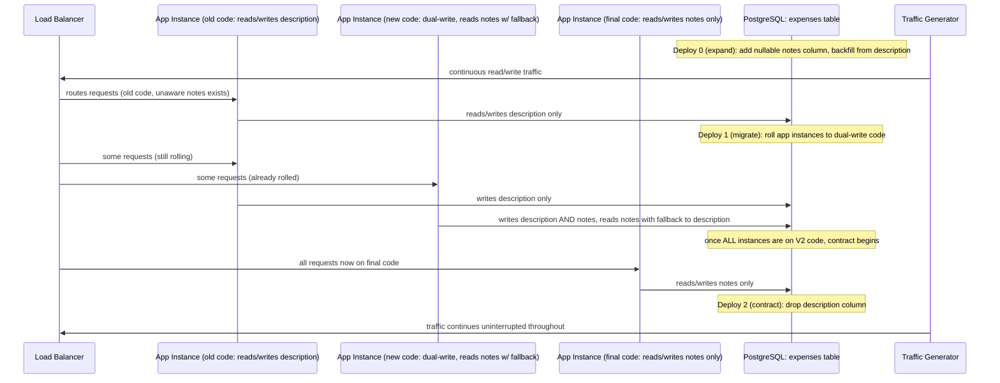
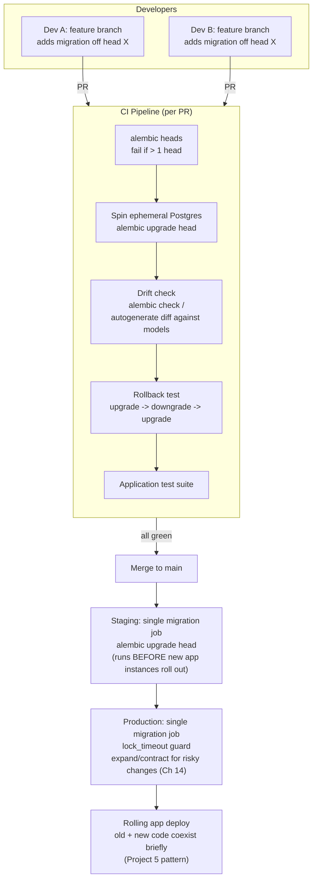

# Capstone Projects

Eighteen chapters have handed you every individual piece: what a schema migration is and why "just change the model" stops working the moment real data exists (Ch 1–2), how Alembic actually works under the hood and how `env.py` bridges it to your SQLAlchemy models (Ch 3–4), the revision graph and the upgrade/downgrade mechanics that walk it (Ch 5–6), the autogenerate workflow and its blind spots (Ch 7), hand-writing every `op.*` directive (Ch 8), the `alembic_version` table and what happens when two developers branch at once (Ch 9–10), data migrations as a distinct discipline (Ch 11), PostgreSQL-specific DDL and SQLite batch mode (Ch 12–13), zero-downtime production deployment (Ch 14), CI/CD integration (Ch 15), and the consolidated best practices, failure modes, and tooling ecosystem that wrap the whole course (Ch 16–18). This chapter is where all of that stops being theory and becomes six real, portfolio-worthy projects — from a single hand-written migration to a production-grade platform with branching developers, PostgreSQL-native DDL, a zero-downtime deploy, and a CI/CD gate that refuses to ship a broken migration. Each project is a self-contained brief: requirements, architecture, folder structure, a phased implementation plan that points back to the exact chapter teaching each step, best practices to bake in from day one, and extensions to attempt once the core works. Read a brief fully before writing a line of code, and build the six projects in order — each one deliberately reuses the migration discipline built in the one before it, and Projects 4–6 together assemble and then operate on the exact ExpenseFlow schema this course has been building since Chapter 1.

---

## Learning Objectives

By the end of this chapter, you will be able to:

- Initialize Alembic against a brand-new FastAPI + SQLAlchemy 2.0 + PostgreSQL project and hand-write a correct first revision without autogenerate
- Design a multi-table schema with foreign keys and indexes across several dependency-ordered revisions
- Build a multi-relationship e-commerce schema with constraints (unique, check) evolved across autogenerated and manual revisions
- Reconstruct ExpenseFlow's entire schema history end to end, including a realistic two-developer branch-and-merge collision
- Execute a zero-downtime column rename using the expand/contract pattern under simulated concurrent application traffic
- Combine branching workflows, PostgreSQL-specific DDL, zero-downtime deployment, and a CI/CD gate (drift detection plus rollback testing) into one production-grade migration platform
- Recognize which mistakes from Chapter 17 tend to resurface at each project tier, and design around them before they happen

## Prerequisites for This Chapter

This is the **synthesis chapter** of the course. It assumes you have completed Chapters 1 through 18 — no new Alembic theory is introduced here, only application. If an implementation step below references a mechanism you don't remember (the migration graph, autogenerate's blind spots, `op.batch_alter_table`, the expand/contract pattern, `alembic merge heads`), treat that as a signal to revisit the cited chapter, not to skip the step.

You will also need, practically:

- A local PostgreSQL instance (Docker is fine) and a working `alembic` + SQLAlchemy 2.0 install (Ch 1, Ch 4)
- Comfort creating a FastAPI project skeleton with `Mapped[...]`/`mapped_column(...)` declarative models (Ch 1, Ch 2)
- For Project 5: a way to generate simulated concurrent traffic against a running app (a small `asyncio`/`httpx` script or `pgbench`-style load is enough — no dedicated load-testing tool is required)
- For Project 6: GitHub Actions familiarity (or any CI system) and Docker Compose, since it wires ephemeral Postgres, drift detection, and rollback testing into a real pipeline
- Comfort reading Mermaid diagrams, since every project below is specified with one

Work through the six projects **in order**. Each one deliberately reuses the revision-writing, review, and deployment instincts built in the one before it — jumping straight to Project 6 means re-learning fundamentals under the pressure of the hardest project in the course.

---

## Project 1 (Beginner): User Table — Initial Migration From Scratch

### Requirements

- A brand-new FastAPI + SQLAlchemy 2.0 + PostgreSQL project skeleton, with Alembic installed and initialized for the first time (`alembic init`)
- One table only: `users` (`id` PK, `email` unique + indexed, `hashed_password`, `created_at`)
- Exactly **one** revision — the initial migration — written **by hand**, not with `--autogenerate`, so the first thing you build understanding for is `op.create_table` itself, before autogenerate ever does it for you
- `env.py` wired to read the database URL from an environment variable, not hardcoded (Ch 4)
- A full, verified upgrade → downgrade → upgrade cycle against a real local Postgres instance

### Architecture



The point of Project 1 is the smallest possible end-to-end loop: one model, one hand-written revision, one table, one verified round trip. No autogenerate, no second table, nothing to hide behind.

### Folder Structure

```text
expenseflow-user-service/
├── app/
│   ├── models/
│   │   ├── base.py                     # DeclarativeBase
│   │   └── user.py                     # User model (Ch 2)
│   ├── core/
│   │   └── config.py                   # reads DATABASE_URL from environment
│   └── main.py                         # minimal FastAPI app (not required to run for this project)
├── alembic/
│   ├── env.py                          # target_metadata + DATABASE_URL wiring (Ch 4)
│   ├── script.py.mako
│   └── versions/
│       └── 0001_initial_users_table.py # the one hand-written revision
├── alembic.ini
├── docker-compose.yml                  # local Postgres for development
└── README.md
```

### Implementation Plan

1. **Scaffold the FastAPI project and write the `User` model first.** `id: Mapped[int]`, `email: Mapped[str]` (unique, indexed), `hashed_password: Mapped[str]`, `created_at: Mapped[datetime]` with a server default — write the model before the migration, exactly as a real app would (Ch 2).
2. **Run `alembic init alembic`** and inspect the generated `alembic.ini` and `env.py` before changing anything, so the defaults are visible before you override them (Ch 4).
3. **Wire `env.py` to your app's configuration**, importing `Base.metadata` as `target_metadata` and reading the connection URL from `app.core.config` (which itself reads `DATABASE_URL` from the environment) rather than the hardcoded placeholder Alembic scaffolds by default (Ch 4).
4. **Write the first revision by hand.** Run `alembic revision -m "initial users table"` (deliberately without `--autogenerate`), then fill in `upgrade()` with `op.create_table("users", ...)` including the unique index on `email`, and a correct, symmetric `downgrade()` that drops the table (Ch 5, Ch 8).
5. **Run `alembic upgrade head`** against a local Postgres instance and confirm the table and its constraints exist exactly as written, using `\d users` in `psql` (Ch 6).
6. **Run `alembic downgrade base`, then `alembic upgrade head` again**, confirming the full cycle is idempotent and the downgrade path actually works — don't assume it does just because you wrote it (Ch 6, Ch 16).
7. **Inspect `alembic_version`** directly in the database and confirm it holds exactly the one revision ID you created — this is the entirety of Alembic's database-side state at this point (Ch 9, previewed).

### Best Practices to Apply

- Write the model first, then the migration by hand — understanding what `op.create_table` actually has to express is easier before autogenerate starts writing it for you (Ch 8).
- Read `DATABASE_URL` from environment configuration in `env.py`, never hardcode a connection string, even for a throwaway first project (Ch 4, Ch 16).
- Write the `downgrade()` function and actually run it — a downgrade path that has never been executed is not a downgrade path you can trust later (Ch 6, Ch 17).
- Index the `email` column and enforce uniqueness at the database level, not only in application validation — a unique constraint is the actual source of truth (Ch 8).

### Extensions / Improvements to Try Next

- Add a second table (`sessions` or `refresh_tokens`) and write that revision with `--autogenerate` this time, comparing the generated script against the one you hand-wrote for `users` (Ch 7).
- Add `pytest-alembic` and write a test that asserts the upgrade/downgrade cycle succeeds automatically in CI, foreshadowing Project 6 (Ch 18).
- Containerize the app and Postgres together with `docker compose`, and run `alembic upgrade head` as an entrypoint step before the app starts (Ch 15, previewed).
- Add a `created_at`/`updated_at` pair with a database-side `onupdate` trigger instead of only an application-side default.

---

## Project 2 (Beginner): Blog Schema with Foreign Keys and Indexes

### Requirements

- A blog schema: `authors` (`id`, `name`, `email` unique), `posts` (`id`, `author_id` FK → `authors.id`, `title`, `slug` unique, `body`, `published_at` nullable, `created_at`), `comments` (`id`, `post_id` FK → `posts.id`, `author_id` FK → `authors.id`, `body`, `created_at`)
- Built across **three revisions**, one table per revision, in dependency order — `authors` before `posts` before `comments` — since a foreign key cannot reference a table that doesn't exist yet (Ch 8)
- An index on every foreign key column (`posts.author_id`, `comments.post_id`, `comments.author_id`) and a unique index on `posts.slug` for URL lookups
- At least one revision generated with `--autogenerate` after the models are written, to practice reviewing autogenerate's output against the schema you designed

### Architecture



### Folder Structure

```text
blog-schema-project/
├── app/
│   └── models/
│       ├── author.py
│       ├── post.py
│       └── comment.py
├── alembic/
│   ├── env.py
│   └── versions/
│       ├── 0001_create_authors_table.py
│       ├── 0002_create_posts_table.py           # FK to authors, unique index on slug
│       └── 0003_create_comments_table.py        # FK to posts + authors
├── alembic.ini
└── README.md
```

### Implementation Plan

1. **Write all three models first** (`Author`, `Post`, `Comment`) with their relationships expressed via `Mapped[list["Post"]]`/`relationship()`, so the target schema is fully designed before any revision is written (Ch 2).
2. **Write revision 1 by hand: `authors`.** No foreign keys yet, so this is the simplest possible table (Ch 8).
3. **Write revision 2 by hand: `posts`.** Include `op.create_foreign_key` (or inline `sa.ForeignKey` in `op.create_table`) referencing `authors.id`, plus `op.create_index` on `author_id` and a separate unique index on `slug` — creating the table before adding the FK if you split it into two operations is unnecessary here since the referenced table already exists, but note explicitly *why* order matters (Ch 8).
4. **Write revision 3 by hand: `comments`.** Two foreign keys (`post_id`, `author_id`), each indexed — this is the revision most likely to have ordering mistakes if attempted before `posts` exists, so verify `alembic upgrade head` fails cleanly if you try to apply it against a database missing `posts` (Ch 8).
5. **Add a fourth column later via autogenerate.** Add `posts.view_count` (integer, default 0, not null) to the model, run `alembic revision --autogenerate -m "add view_count to posts"`, and review the generated script line by line before applying it — confirm it produced an `add_column` with a server default, not something unexpected (Ch 7).
6. **Run the full upgrade/downgrade cycle** across all four revisions in order and in reverse, confirming every `downgrade()` correctly drops indexes before tables and tables in reverse dependency order (`comments` before `posts` before `authors`) (Ch 6, Ch 8).
7. **Query the migration history** with `alembic history` and `alembic show <rev>` for each revision, confirming the `down_revision` chain matches what you intended (Ch 5).

### Best Practices to Apply

- Create tables in dependency order — the referenced table before the referencing table — in both `upgrade()` and the reverse order in `downgrade()` (Ch 8, Ch 16).
- Index every foreign key column explicitly; Postgres does not create one automatically for you the way it does for primary keys (Ch 8).
- Use a unique index (not just a unique constraint) on `slug` if you expect to look posts up by slug frequently — the index does double duty as both the uniqueness guarantee and the lookup accelerator.
- Always review an autogenerated script before applying it, even for a change as simple as adding one column with a default (Ch 7, Ch 16).

### Extensions / Improvements to Try Next

- Add a `tags`/`post_tags` many-to-many relationship, hand-written, foreshadowing ExpenseFlow's own `tags`/`expense_tags` design in Project 4 (Ch 8).
- Add a `deleted_at` nullable column to `posts` for soft deletes, and a partial index `WHERE deleted_at IS NULL` (Ch 12, previewed).
- Enable `pg_trgm` and add a trigram index on `posts.title` for fuzzy search (Ch 12, previewed).
- Add a `pytest-alembic` test asserting that every model's columns are represented in some migration (catching the "forgot to import a model" mistake from Ch 17).

---

## Project 3 (Intermediate): E-Commerce Database

### Requirements

- Four tables: `customers` (`id`, `email` unique, `full_name`, `created_at`), `products` (`id`, `sku` unique, `name`, `price_cents`, `created_at`), `orders` (`id`, `customer_id` FK, `status`, `created_at`), `order_items` (`id`, `order_id` FK, `product_id` FK, `quantity`, `unit_price_cents`)
- Store money as integer cents (`price_cents`, `unit_price_cents`), the same pattern ExpenseFlow uses for `amount_cents` — never `FLOAT` for currency (Ch 2, Ch 12)
- A `CHECK` constraint enforcing `order_items.quantity > 0`, and a composite unique constraint on `(order_id, product_id)` so the same product can't appear twice on one order as separate rows
- Built across **several revisions**: independent tables first, then relationship tables, then constraints added in a dedicated later revision — mirroring how a real schema's constraints often get tightened after the fact once business rules are clarified

### Architecture



### Folder Structure

```text
ecommerce-db-project/
├── app/
│   └── models/
│       ├── customer.py
│       ├── product.py
│       ├── order.py
│       └── order_item.py
├── alembic/
│   └── versions/
│       ├── 0001_create_customers_and_products.py   # two independent tables, one revision
│       ├── 0002_create_orders_table.py              # FK to customers
│       ├── 0003_create_order_items_table.py         # FK to orders + products
│       ├── 0004_add_order_items_constraints.py       # CHECK quantity>0, unique (order_id, product_id)
│       └── 0005_add_order_status_enum.py             # native Postgres ENUM (Ch 12 preview)
├── alembic.ini
└── README.md
```

### Implementation Plan

1. **Revision 1: `customers` and `products` together.** Both are independent (no FK between them), so one revision covering two unrelated `op.create_table` calls is a reasonable "one logical change" rather than an artificial split (Ch 8, Ch 16).
2. **Revision 2: `orders`,** with `customer_id` as a not-null foreign key to `customers.id`, indexed, and a plain string `status` column for now (upgraded to a native ENUM later) (Ch 8).
3. **Revision 3: `order_items`,** with two foreign keys (`order_id`, `product_id`), both indexed, and no constraints beyond the foreign keys yet — deliberately deferring business-rule constraints to their own revision (Ch 8).
4. **Revision 4: add constraints in their own dedicated revision.** `op.create_check_constraint("ck_order_items_quantity_positive", "order_items", "quantity > 0")` and `op.create_unique_constraint("uq_order_items_order_product", "order_items", ["order_id", "product_id"])` — keeping constraint-tightening separate from table creation makes this revision easy to review and easy to roll back independently if a constraint turns out to conflict with existing data (Ch 8, Ch 11).
5. **Before applying revision 4 against a non-empty database, check for existing rows that would violate the new constraints** (a `SELECT` for `quantity <= 0` or duplicate `(order_id, product_id)` pairs) — this is exactly the kind of check Chapter 11 teaches you to do before tightening a constraint on live data.
6. **Revision 5: convert `orders.status` to a native Postgres `ENUM`** (`pending`, `paid`, `shipped`, `cancelled`), using `op.execute("CREATE TYPE order_status AS ENUM (...)")` followed by `ALTER COLUMN ... TYPE order_status USING status::order_status` — and note explicitly why this needs raw `op.execute()` rather than a single `op.alter_column()` call (Ch 12).
7. **Run the full upgrade/downgrade cycle**, paying particular attention to revision 5's downgrade — converting an ENUM back to a plain string is straightforward, but dropping the now-unused `order_status` type requires an explicit `DROP TYPE` that's easy to forget (Ch 12, Ch 17).
8. **Add one autogenerated revision** (a `discount_cents` column on `order_items`) and confirm the generated script matches your expectations before applying it (Ch 7).

### Best Practices to Apply

- Store all money values as integer cents, never floating point, to avoid rounding errors compounding across order totals (Ch 2, Ch 12).
- Add business-rule constraints (`CHECK`, composite `UNIQUE`) in their own revision, separate from table creation, so they can be reviewed, tested against existing data, and rolled back independently (Ch 8, Ch 11, Ch 16).
- Before tightening any constraint against a populated table, query for violating rows first — a constraint migration that fails halfway through a deploy because of pre-existing bad data is a self-inflicted production incident (Ch 11, Ch 17).
- Prefer a native Postgres `ENUM` over a plain string once a column has a small, well-defined set of valid values, and know that changing an ENUM's members later has its own transaction-block caveats (Ch 12).

### Extensions / Improvements to Try Next

- Add an `inventory` table with a `quantity_available` column and a data migration that seeds it from existing `order_items` history (Ch 11).
- Add a partial index on `orders` `WHERE status = 'pending'` to accelerate a common "outstanding orders" query (Ch 12).
- Add `pytest-alembic`'s upgrade/downgrade test suite and run it against a Postgres test container in CI, foreshadowing Project 6 (Ch 15, Ch 18).
- Model an `order_status` state-machine transition table and add a trigger-based (or application-enforced) guard against invalid transitions.

---

## Project 4 (Intermediate): ExpenseFlow End-to-End — The Full Running Example, Assembled

### Requirements

This project asks you to build, from a clean repository, the **entire ExpenseFlow schema history this course has been narrating since Chapter 1** — not a simplified version of it, the actual sequence of revisions a real team would have produced:

- **Revision set 1 (Ch 1–6):** `users` (`id`, `email`, `hashed_password`, `created_at`) and `expenses` (`id`, `user_id` FK, `amount_cents`, `currency`, `description`, `expense_date`, `created_at`) — the starting schema
- **Revision set 2 (Ch 7):** `categories` (`id`, `name`) and `expenses.category_id` FK, generated with `--autogenerate` and reviewed
- **Revision set 3 (Ch 8):** `tags` and `expense_tags` (many-to-many join table) — hand-written, since autogenerate can't be trusted to get a fresh many-to-many junction table exactly right
- **Revision set 4 (Ch 9–10):** a simulated **two-developer branch collision** — Developer A branches off the tags/expense_tags revision to add a brand-new `receipts` table (`id`, `expense_id` FK, `file_key`, `uploaded_at`), Developer B branches off the *same* parent revision to add the entire `monthly_budgets` table (`id`, `user_id` FK, `category_id` FK, `year`, `month`, `limit_cents`) — producing two heads that must be resolved with `alembic merge heads`
- **Revision set 5 (Ch 11):** a data migration backfilling `expenses.currency` to `"USD"` for historical rows before making the column `NOT NULL`, plus seeding `categories` with default rows (Food, Transport, Utilities, Entertainment, Other)
- **Revision set 6 (Ch 12):** convert `receipts.id` to a client-generated `UUID` primary key (new-ish table, low volume, no incoming foreign keys — the easy case), add a `metadata` `JSONB` column to `expenses`, add a partial index on `expenses` `WHERE deleted_at IS NULL`, and enable `pg_trgm` for fuzzy search on `expenses.description`
- **Revision set 7 (Ch 13):** confirm the entire chain applies cleanly against **both** PostgreSQL and SQLite, adjusting any column-altering migration in the chain to use `op.batch_alter_table(...)` so the test suite's SQLite backend doesn't break

### Architecture



This is the single most important diagram in the course: it is the exact migration graph an ExpenseFlow developer would see from `alembic history` at the end of Chapter 13, branch point and merge included.

### Folder Structure

```text
expenseflow/
├── app/
│   ├── models/
│   │   ├── base.py
│   │   ├── user.py
│   │   ├── expense.py             # includes metadata JSONB, deleted_at, category_id FK (Ch 7, 12)
│   │   ├── category.py
│   │   ├── tag.py                 # Tag + ExpenseTag association (Ch 8)
│   │   ├── receipt.py             # added Ch 9-10 branch, UUID PK added Ch 12
│   │   └── monthly_budget.py      # Ch 9-10 branch
│   └── core/
│       └── config.py
├── alembic/
│   ├── env.py                     # sync engine via run_sync, reads DATABASE_URL (Ch 4)
│   └── versions/
│       ├── 0001_initial_users_and_expenses.py
│       ├── 0002_add_categories_autogenerate.py
│       ├── 0003_add_tags_and_expense_tags_manual.py
│       ├── 0004a_add_receipts_table.py             # branch A, down_revision = 0003
│       ├── 0004b_add_monthly_budgets.py            # branch B, down_revision = 0003
│       ├── 0005_merge_receipts_and_budgets.py      # down_revision = (0004a, 0004b)
│       ├── 0006_backfill_currency_and_seed_categories.py
│       ├── 0007_postgres_features_uuid_jsonb_pgtrgm.py
│       └── 0008_batch_mode_sqlite_compat.py
├── tests/
│   └── test_migrations.py         # pytest-alembic upgrade/downgrade cycle (Ch 18)
├── alembic.ini
├── docker-compose.yml             # Postgres for dev, used alongside SQLite in tests
└── README.md
```

### Implementation Plan

1. **Build revision set 1 exactly as Project 1 did**, but this time with two tables and a real FK from day one — `expenses.user_id → users.id`, indexed (Ch 5, Ch 6, Ch 8).
2. **Add `Category` and `expenses.category_id`, then run `--autogenerate`.** Review the generated script carefully: confirm it produced `op.create_table("categories", ...)` followed by `op.add_column("expenses", ...)` and `op.create_foreign_key(...)` in the correct order (table before the column that references it) (Ch 7).
3. **Hand-write revision set 3.** `tags` and `expense_tags` (composite PK or a surrogate PK plus a unique constraint on `(expense_id, tag_id)`) — none of this is autogenerate-friendly to get exactly right on the first try, which is the whole reason Chapter 8 exists (Ch 8).
4. **Deliberately create the branch.** From revision 0003, create two independent revisions (`0004a` adding `receipts`, `0004b` adding `monthly_budgets`) each with `down_revision = "0003"` — do this by checking out two separate feature branches in git (or just writing both files by hand) to simulate two developers working in parallel without coordinating. Run `alembic heads` and confirm it reports **two** heads (Ch 9, Ch 10).
5. **Resolve the collision.** Run `alembic merge heads -m "merge receipts and monthly_budgets"`, inspect the generated merge revision's two `down_revision` entries, and run `alembic upgrade head` to confirm both branches' changes land together (Ch 10).
6. **Write the data migration (revision 0006).** Add `expenses.currency` as nullable first if it wasn't already, `UPDATE expenses SET currency = 'USD' WHERE currency IS NULL` via `op.execute()` or a lightweight `sa.table()` reflection, *then* alter the column to `NOT NULL` — never all three steps as one unreviewable operation. In the same revision (or a clearly separated one), seed `categories` with default rows, guarding the `INSERT` so re-running the migration isn't destructive (Ch 11).
7. **Apply PostgreSQL-specific features (revision 0007).** Convert `receipts.id` to `UUID` with `server_default=sa.text("gen_random_uuid()")` (a new table, so this is the easy case — explicitly note in a comment why altering an *existing* table's PK to UUID is a much harder problem this project intentionally avoids), add `expenses.metadata` as `JSONB`, add the partial index on `expenses` `WHERE deleted_at IS NULL`, and enable `pg_trgm` with `op.execute("CREATE EXTENSION IF NOT EXISTS pg_trgm")` (Ch 12).
8. **Verify SQLite compatibility (revision 0008 or retrofitted into earlier ones).** Run the entire test suite against SQLite and identify exactly which earlier migration breaks (almost certainly the `currency` `NOT NULL` alter, or the FK-heavy table creation), then wrap the offending operations in `with op.batch_alter_table(...) as batch_op:` so the same migration file works against both backends (Ch 13).
9. **Run the full chain forwards and backwards** — `alembic upgrade head` then `alembic downgrade base` then `alembic upgrade head` again — against both a Postgres container and an in-memory SQLite database, confirming every downgrade in the chain, including the merge revision's, actually works (Ch 6, Ch 10, Ch 13).

### Best Practices to Apply

- Treat the branch-and-merge step as a rehearsal, not a one-off gimmick — real teams hit this exact situation any time two feature branches each add a migration off the same head, and knowing the resolution motion cold is the actual skill (Ch 9, Ch 10).
- Keep the data migration (revision 0006) strictly separate from the schema migrations around it, and never combine "add nullable column," "backfill," and "add NOT NULL" into a single unreviewable step (Ch 11, Ch 16).
- Comment explicitly, in the migration file itself, on which PostgreSQL-specific operations required raw `op.execute()` and why the standard `op.*` directives didn't cover them (Ch 12).
- Run the full test suite against SQLite specifically to catch the operations that need batch mode — don't assume a migration "probably" works against both backends without actually running it (Ch 13).

### Extensions / Improvements to Try Next

- Introduce a *second*, later branch collision (e.g., two developers each adding a different index to `expenses` off the same head) and resolve it the same way, building repetition into the branch-merge motion (Ch 10).
- Add a `pytest-alembic` test suite (Ch 18) that runs the entire upgrade/downgrade cycle automatically, so this project's correctness doesn't depend on manually remembering to re-verify it.
- Add `alembic-utils` to version a Postgres view (e.g., a `monthly_spending_summary` view joining `expenses` and `categories`) as a first-class migrated entity (Ch 18).
- Carry this exact schema forward into Project 5 and Project 6 below — both are designed to operate directly on the database this project produces.

---

## Project 5 (Advanced): Zero-Downtime Rename of a Heavily-Read Production Column

### Requirements

- Starting from Project 4's ExpenseFlow schema, rename `expenses.description` to `expenses.notes` in a simulated production environment — **with zero downtime**, while multiple application instances (some still running old code, some already running new code) serve real traffic during a rolling deploy
- Use the full **expand/contract** pattern from Chapter 14: expand (add the new column without touching the old one), migrate (deploy app code that writes both, reads the new one with a fallback), contract (drop the old column only once every instance has rolled forward)
- Simulate concurrent traffic against the `expenses` table throughout the exercise — a simple script issuing continuous reads and writes against a running API is sufficient; the goal is to *observe* whether any request errors or times out during each migration step, not to build a full load-testing harness
- Apply a `lock_timeout` as a safety net on every migration in the sequence, and prove, by observation, that a naive single-step `ALTER TABLE ... RENAME COLUMN` approach would have caused exactly the outage this exercise is designed to avoid

### Architecture



### Folder Structure

```text
expenseflow-zero-downtime-rename/
├── app/
│   ├── models/
│   │   └── expense.py              # three successive versions checked in as v1/v2/v3 for clarity
│   └── api/
│       └── expenses.py             # read/write logic that changes shape across the three deploys
├── alembic/
│   └── versions/
│       ├── 0009_expand_add_notes_column.py         # nullable, no drop yet
│       ├── 0010_backfill_notes_from_description.py  # data migration, batched
│       └── 0011_contract_drop_description_column.py # only run after full rollout confirmed
├── scripts/
│   ├── traffic_generator.py         # continuous read/write load against the running API
│   └── observe_deploy.sh            # runs each migration step while traffic_generator.py is active
├── docs/
│   └── deploy-runbook.md            # the exact 3-deploy sequence with rollback notes at each step
└── README.md
```

### Implementation Plan

1. **Write and apply the expand migration (0009).** `op.add_column("expenses", sa.Column("notes", sa.Text(), nullable=True))` — nullable, no default backfill inline, no lock beyond a brief metadata change; set `SET lock_timeout = '2s'` at the top of the migration (via `op.execute`) so if this ever *does* contend for a lock unexpectedly, it fails fast and loud instead of quietly blocking every other query on the table (Ch 14).
2. **Start the traffic generator** against a running instance of the *old* application code, hitting both read and write endpoints for expenses continuously, and confirm zero errors before you touch anything else — this is your baseline (Ch 14, Ch 17).
3. **Apply the expand migration while traffic is running** and confirm the traffic generator shows no errors or elevated latency — adding a nullable column should be instantaneous even on a large table (Ch 14).
4. **Write and apply the backfill migration (0010).** Copy existing `description` values into `notes` in batches (e.g., 5,000 rows per transaction via a loop with `LIMIT`/`OFFSET` or a keyset-based batch), never as one giant unbatched `UPDATE`, and confirm the traffic generator sees no long-held locks or timeouts during the backfill (Ch 11, Ch 14).
5. **Deploy the "migrate" application code** (a new app version that writes both `description` and `notes` on every write, and reads `notes` with a fallback to `description` if `notes` is `NULL`), and roll it out instance by instance while the traffic generator keeps running — confirm the mixed-version window (some instances on old code, some on new) produces zero errors, since both versions remain fully compatible with the current schema (Ch 14).
6. **Confirm every application instance has rolled forward** to the dual-write code before proceeding — this is a deployment-tooling check (all instances report the new version), not a database check, and skipping it is the single most common way this pattern goes wrong in practice (Ch 14, Ch 17).
7. **Deploy the "final" application code** that reads and writes only `notes`, confirm again that all instances are on it, and only then apply the contract migration (0011): `op.drop_column("expenses", "description")`, again with a `lock_timeout` guard (Ch 14).
8. **Confirm throughout the entire sequence** that the traffic generator recorded zero failed requests and no latency spike — that is the actual deliverable of this project, not just "the migrations ran" (Ch 14, Ch 16).
9. **Deliberately reproduce the failure mode this pattern avoids.** On a scratch copy of the database (never on the one your traffic generator is hitting), try a naive `op.alter_column("expenses", "description", new_column_name="notes")` in one step while old-code instances are still reading/writing the old name, and observe the errors that immediately result — this is the concrete, felt contrast that makes the expand/contract discipline stick (Ch 14, Ch 17).

### Best Practices to Apply

- Never rename a column directly in one migration step if the table is read or written by running application code — expand/contract exists precisely because a rename is invisible to Alembic's dependency graph but very visible to a running app instance mid-query (Ch 14, Ch 16).
- Set `lock_timeout` explicitly on every migration touching a live, heavily-read table, so an unexpected lock contention fails fast with a clear error instead of silently blocking the whole application (Ch 14).
- Batch any backfill touching more than a trivial number of rows, and verify the batch size against a realistic row count, not a small test dataset (Ch 11, Ch 14).
- Treat "confirm every instance has rolled forward" as a deployment-orchestration gate, not an assumption — the contract step is only safe once it's actually true (Ch 14, Ch 17).
- Run the deliberate failure-mode reproduction (implementation step 9) against a scratch copy, never the live traffic-serving database, so the lesson is safe to learn by feeling it break.

### Extensions / Improvements to Try Next

- Automate the "confirm all instances rolled forward" check by querying your deployment platform's API instead of eyeballing it, and gate the contract migration behind that automated check — this is exactly what Project 6's CI/CD gate formalizes.
- Apply the same three-deploy pattern to a `NOT NULL` type change instead of a rename, and compare which parts of the pattern change and which stay identical (Ch 14).
- Add a feature flag controlling which column the application reads from, decoupling the schema rollout timeline from the code deploy timeline even further (Ch 14).
- Measure and record actual lock duration for each migration step using `pg_stat_activity` during the exercise, turning "I believe this was zero-downtime" into "I measured zero lock contention above N milliseconds."

---

## Project 6 (Production-Grade Capstone): Multi-Developer Migration Platform with a CI/CD Safety Gate

### Requirements

This capstone combines every prior project's skill into one operating platform:

- A **multi-developer migration workflow**: at least two simulated feature branches each adding a migration, occasionally colliding into multiple heads that must be resolved with `alembic merge heads`, exactly as Project 4 rehearsed
- **PostgreSQL-specific DDL** reused from Project 4 (ENUM, JSONB, UUID PKs, partial indexes, `pg_trgm`) so the CI gate has to deal with realistic, not toy, migrations
- A **zero-downtime deploy** for at least one schema change, using Project 5's expand/contract sequence, wired into the pipeline's staged rollout
- A **CI/CD gate that validates every migration before it reaches production**: spins up ephemeral Postgres, runs `alembic upgrade head`, runs a drift-detection check (`alembic check`, or an equivalent autogenerate-diff-against-empty check) confirming the models and the migration chain agree, and runs a **rollback test** (upgrade then downgrade then upgrade again) proving every downgrade path in the chain actually executes without error
- A documented deploy sequencing rule: migrations run as a **single dedicated job**, never as a side effect of each application container's own startup, since concurrent instances racing to migrate is a known Chapter 17 failure mode

### Architecture



### Folder Structure

```text
expenseflow-migration-platform/
├── app/                              # ExpenseFlow app code (from Project 4)
├── alembic/
│   └── versions/                     # full history including Project 4's branch/merge
├── .github/
│   └── workflows/
│       └── migrations.yml            # CI pipeline: heads check, ephemeral PG, drift, rollback test
├── scripts/
│   ├── ci/
│   │   ├── check_single_head.sh      # `alembic heads` must return exactly one line
│   │   ├── check_drift.sh            # `alembic check` (or autogenerate-diff-against-empty)
│   │   └── rollback_test.sh          # upgrade -> downgrade -1 -> upgrade, per revision or full chain
│   └── deploy/
│       ├── run_migration_job.sh      # the ONE place `alembic upgrade head` is invoked in prod
│       └── verify_all_instances_rolled.sh   # gate before any contract-phase migration
├── docs/
│   ├── runbook-stuck-migration.md    # what to do if a production migration holds a lock (Ch 17, Ch 20)
│   └── branch-policy.md              # rebase-before-merge, coordinate on shared heads (Ch 10, Ch 16)
└── docker-compose.ci.yml             # ephemeral Postgres for CI
```

### Implementation Plan

1. **Reuse Project 4's ExpenseFlow schema and history as the starting point**, including its branch-and-merge revision — this capstone is explicitly about *operating* a realistic migration history, not designing a new one from scratch (Ch 9, Ch 10).
2. **Add the single-head CI check first.** `alembic heads` should print exactly one line; wire a CI step that fails the build if it prints more than one, catching an unresolved branch collision at PR time rather than at deploy time (Ch 10, Ch 17).
3. **Wire ephemeral Postgres into CI** (a Docker Compose service or testcontainers), run `alembic upgrade head` against it fresh on every PR, and fail the build on any migration error (Ch 15).
4. **Add the drift-detection step.** Run `alembic check` (or, on older Alembic versions, generate an autogenerate revision against the now-migrated database and fail the build if it produces any operations at all) — this catches the Chapter 17 failure mode where a model change was made without a corresponding migration, or vice versa (Ch 15, Ch 17).
5. **Add the rollback-test step.** For the newest revision(s) introduced in the PR, run upgrade, then downgrade one step, then upgrade again, and fail the build if any step errors — this is the only way to catch a downgrade path that was written but never actually exercised (Ch 6, Ch 15, Ch 16).
6. **Simulate a second branch collision deliberately** (two PRs, each adding a migration off the same current head) and confirm the single-head CI check correctly fails one of them until `alembic merge heads` is run — rehearsing the exact motion under CI pressure this time, not just locally (Ch 10).
7. **Wire a staging deploy job that runs the migration as a single, dedicated step** before any new application instance starts, and explicitly design the pipeline so application containers never run `alembic upgrade head` themselves on startup — multiple instances racing to migrate concurrently is a real failure mode this course warned about in Chapter 17 (Ch 15, Ch 17).
8. **Apply Project 5's zero-downtime rename (or a new column of your choosing) through this full pipeline** — expand migration merged and deployed first, backfill next, contract only after confirming (via `scripts/deploy/verify_all_instances_rolled.sh` or your platform's equivalent) that every instance is on the new code (Ch 14).
9. **Add a production safety net**: `lock_timeout`/`statement_timeout` set on the migration job's connection, and a documented runbook (`docs/runbook-stuck-migration.md`) describing exactly what to do if a production migration is holding a lock and the application is timing out right now — this runbook is also the backbone of a scenario question in Chapter 20 (Ch 14, Ch 17).
10. **Run the entire pipeline end to end** on a fresh clone: open a PR with a new migration, watch every CI gate execute, merge, watch the staging job run, and confirm the deploy sequence matches the documented runbook exactly.

### Best Practices to Apply

- Fail CI on more than one head, always — an unresolved branch collision merged into `main` is a problem for every developer after you, not just the two who caused it (Ch 10, Ch 16).
- Run migrations as one dedicated job in the deploy pipeline, never as a side effect of application container startup — concurrent instances racing to apply the same migration is a real, documented failure mode (Ch 15, Ch 17).
- Treat drift detection and rollback testing as non-negotiable CI gates, not optional extras — a migration that "probably" matches the models, or a downgrade that "should" work, is exactly the assumption this gate exists to remove (Ch 15, Ch 16).
- Set `lock_timeout`/`statement_timeout` on every production migration connection as a blast-radius limiter, never rely on operator vigilance alone to catch a runaway lock (Ch 14, Ch 17).
- Document the exact rollout-verification gate (all instances confirmed on new code) before any contract-phase migration runs, and make it a pipeline check, not a manual judgment call under deploy pressure (Ch 14).

### Extensions / Improvements to Try Next

- Add an automated Slack/PagerDuty alert if a production migration job runs longer than a threshold, surfacing exactly the "is this migration stuck" question the Chapter 20 scenario asks about.
- Require a second reviewer's explicit approval for any migration containing `DROP COLUMN`/`DROP TABLE`, as a deliberate manual gate on top of the automated ones.
- Extend the rollback test to run against a database seeded with a realistic data volume (not an empty ephemeral instance), catching lock-duration and backfill-timing issues CI wouldn't otherwise see.
- Add `alembic-utils` (Ch 18) to version a Postgres view or function used by the reporting layer, and confirm the CI gate treats it identically to any other migrated entity.

---

## Real-World Scenario

Read the six projects back to back and they trace the same arc a database-owning backend engineer walks over a career. Project 1 is the first task a junior engineer gets: wire up Alembic for real, by hand, on a project that doesn't exist yet — no autogenerate, no shortcuts, just `op.create_table` and a downgrade that actually runs. Project 2 and Project 3 are the next assignments: a schema with real foreign keys and indexes, then a schema with real business-rule constraints evolved across several revisions — this is where "I can run a migration" turns into "I can design a schema's evolution deliberately." Project 4 is the moment the engineer inherits ownership of a real, growing application's schema — not a toy example, the *exact* history a small team actually produced, branch collision included, because two developers working in parallel off the same revision is not a hypothetical, it is what happens the first time two people touch the same migration chain in the same week. Project 5 is what a senior engineer gets handed when product tells them a column name that shipped in the MVP is now embarrassing and has to change — and "just rename it" turns out to require an entire deploy sequence, because the table in question is read by every request the API serves. Project 6 is the staff-level, cross-team problem: leadership wants confidence that *no* migration can reach production without being proven safe first, which means building the exact CI/CD gate — single-head check, drift detection, rollback test — that turns "we're pretty sure this migration is fine" into "the pipeline would have caught it if it weren't." Very few engineers are handed Project 6 on day one, and the ones who succeed at it are almost always the ones who quietly built the muscle memory of Projects 1 through 5 first, even if nobody called them "capstones" at the time.

---

## Best Practices

- **Build incrementally, project by project.** The hand-written-revision discipline from Project 1, the FK-ordering instincts from Project 2, the constraint-and-ENUM handling from Project 3, and the branch/merge and data-migration fluency from Project 4 are exactly the building blocks Projects 5 and 6 assume you already have — skipping ahead means learning them under deploy pressure instead of in a scratch repository.
- **Never trust a downgrade path you haven't executed.** Every project above calls for actually running `alembic downgrade`, not just writing `downgrade()` and assuming it's correct — this single habit, repeated across all six projects, is the difference between a downgrade path that works and one that only looks like it does.
- **Validate zero-downtime assumptions by actually simulating traffic.** Don't trust the expand/contract pattern because Chapter 14 said it works — run a traffic generator against a real migration sequence (Project 5) and watch for zero errors yourself, the same way Project 6's CI gate refuses to trust an unproven rollback path.
- **Treat CI validation as a design input from Project 4 onward, not a Project 6 afterthought.** A `pytest-alembic` check added in Project 1 or Project 4 costs almost nothing; retrofitting drift detection and rollback testing onto a schema history nobody has been protecting is a much bigger lift by Project 6.
- **Version the migration history itself as the source of truth**, never edit an already-applied migration file — every project above should end with a clean, linear (or deliberately branched-and-merged) revision chain that a teammate could read and understand without asking you anything.
- **Reuse rather than rewrite.** By Project 6 you should be importing and extending Project 4's schema and Project 5's zero-downtime pattern directly — that reuse is itself evidence the earlier projects' lessons have become instinct rather than reference material.
- **Document every non-default decision** — why a constraint was added in its own revision, why an ENUM was chosen over a string, why a lock_timeout value was set where it was — so a teammate or your future self can reconstruct the reasoning without re-deriving it.

---

## Common Mistakes

- **Reaching for `--autogenerate` before understanding what `op.create_table` actually does.** Project 1 exists specifically to build that understanding first — autogenerate is a productivity tool for engineers who already know what correct output looks like, not a substitute for knowing it.
- **Creating tables out of dependency order**, attempting to create a table with a foreign key to a table that doesn't exist yet, or dropping a referenced table before dropping the foreign key that points to it in a downgrade.
- **Bundling "add nullable column," "backfill," and "add NOT NULL" into a single unreviewable migration** instead of three separate, individually-safe steps — exactly the discipline Project 4's data migration and Project 5's expand phase both depend on.
- **Not actually simulating traffic during a zero-downtime exercise** and declaring victory because "the migrations ran without an error" — a migration can succeed with zero SQL errors while still causing real request failures if application code and schema state were briefly incompatible.
- **Letting two developers' migrations collide silently** and discovering multiple heads only at deploy time, rather than catching it at PR time with an automated single-head CI check.
- **Running `alembic upgrade head` as a side effect of every application container's startup** instead of as one dedicated deploy-pipeline job — concurrent instances racing to migrate the same database is a real, not hypothetical, production incident shape.
- **Treating a CI pipeline's green checkmark as proof a migration is production-safe** without the pipeline actually testing the things that make migrations dangerous (multiple heads, model/migration drift, an unexercised downgrade path) — a CI gate that only runs `alembic upgrade head` and stops there is not the gate Project 6 is asking you to build.

---

## Summary

- **Project 1** (User Table) is a pure hand-written-migration exercise — one table, one revision, no autogenerate, a verified upgrade/downgrade round trip.
- **Project 2** (Blog Schema) adds foreign keys, indexes, and dependency-ordered revisions, plus a first taste of reviewing autogenerate output.
- **Project 3** (E-Commerce Database) adds business-rule constraints (`CHECK`, composite `UNIQUE`) evolved in their own revision, and a native Postgres `ENUM` conversion.
- **Project 4** (ExpenseFlow End-to-End) reconstructs the entire course's running example as one continuous revision history, including a realistic two-developer branch-and-merge collision, a data migration, and PostgreSQL-specific features.
- **Project 5** (Zero-Downtime Rename) applies the expand/contract pattern to Project 4's schema under simulated concurrent traffic, proving — not just claiming — zero downtime.
- **Project 6** (Migration Platform Capstone) wraps everything in a CI/CD gate that refuses to let an unresolved branch collision, schema drift, or an unproven downgrade path reach production, and formalizes the deploy sequencing Project 5 rehearsed by hand.
- Each project deliberately builds on the one before it: the review discipline, branch/merge fluency, and deployment safety instincts are meant to carry forward, so working through them in order is itself part of the curriculum.
- The recurring meta-lesson across all six tiers is that **an executed downgrade, an observed zero-error deploy, and an automated CI gate are what separate "this migration should be fine" from "this migration is proven safe."**

---

## Knowledge Check

1. In Project 1, why is it valuable to write the first migration by hand instead of using `--autogenerate`, even though autogenerate could produce the same `op.create_table` call?
2. In Project 2 and Project 3, why must tables be created in dependency order, and what specifically goes wrong (in both `upgrade()` and `downgrade()`) if that order is violated?
3. In Project 4, walk through exactly what `alembic heads` would show immediately after Developer A and Developer B each commit their revision off the same parent, and what `alembic merge heads` changes about that output.
4. In Project 5, why is "confirm all application instances have rolled forward to the new code" a required gate before running the contract migration, and what specifically could go wrong if that gate were skipped?
5. In Project 6, name the three things the CI pipeline validates that a plain `alembic upgrade head` run alone would not catch, and explain what production failure mode each one is designed to prevent.

---

## Hands-On Exercise

Scaffold **Project 1 (User Table — Initial Migration From Scratch)** right now, end to end:

1. Create a new project directory, install `alembic` and `sqlalchemy` (2.0+), and stand up a local PostgreSQL instance (Docker is fine).
2. Write the `User` model by hand (`id`, `email` unique + indexed, `hashed_password`, `created_at`), using SQLAlchemy 2.0's `Mapped[...]`/`mapped_column(...)` style.
3. Run `alembic init alembic`, then edit `env.py` so `target_metadata` points at your model's `Base.metadata` and the connection URL is read from an environment variable, not hardcoded.
4. Run `alembic revision -m "initial users table"` **without** `--autogenerate`, and write `upgrade()`/`downgrade()` by hand.
5. Run `alembic upgrade head` against your local Postgres instance and confirm the table exists with `\d users` in `psql`.
6. Run `alembic downgrade base`, confirm the table is gone, then run `alembic upgrade head` again and confirm it's back — a full, verified round trip.
7. Query `alembic_version` directly in `psql` and confirm it holds exactly the one revision ID you created.

Stop there for today — resist adding a second table or reaching for `--autogenerate` until this single hand-written revision has actually been run, downgraded, and re-applied; that discipline is the whole point of the beginner tier.

---

## Further Reading

- [Alembic Official Documentation](https://alembic.sqlalchemy.org/en/latest/) — the reference you'll return to across every project in this chapter.
- [Alembic Tutorial](https://alembic.sqlalchemy.org/en/latest/tutorial.html) — the canonical walkthrough of exactly what Project 1 asks you to do by hand.
- [Alembic Operation Reference (`op.*`)](https://alembic.sqlalchemy.org/en/latest/ops.html) — every directive used across Projects 2–6.
- [Alembic Branches Documentation](https://alembic.sqlalchemy.org/en/latest/branches.html) — the mechanics behind Project 4's branch-and-merge scenario.
- [Alembic Batch Migrations](https://alembic.sqlalchemy.org/en/latest/batch.html) — needed for Project 4's SQLite compatibility pass.
- [PostgreSQL `ALTER TABLE` Documentation](https://www.postgresql.org/docs/current/sql-altertable.html) — the lock-behavior reference behind Project 5's zero-downtime design.
- [`pytest-alembic`](https://pytest-alembic.readthedocs.io/) — the testing tool that underpins Project 6's rollback-test CI gate.

---

<div style="display:flex;justify-content:space-between;align-items:center;">
  <a href="./18-tools-and-ecosystem.md">← Previous: Tools & Ecosystem</a>
  <a href="./00-index.md">🏠 Index</a>
  <a href="./20-interview-preparation.md">Next: Interview Preparation →</a>
</div>
