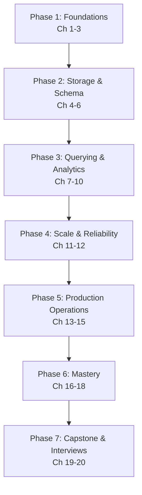

# ClickHouse & Columnar Databases — Complete Course

> From "what is a column store?" to designing, tuning, and operating production-grade ClickHouse clusters — a structured, professional learning path.

---

## Course Overview

ClickHouse is the reference implementation of the modern **columnar OLAP database**: it stores data column-by-column instead of row-by-row, uses vectorized execution and aggressive compression, and can scan and aggregate billions of rows per second on a single node. It powers real-time analytics, observability, and BI workloads at companies like Cloudflare, Uber, and eBay.

This course takes you from absolute beginner to professional, covering:

- Why columnar storage exists, and exactly how it differs from row-oriented databases like PostgreSQL or MongoDB
- ClickHouse's internal architecture: the MergeTree family, parts, merges, and vectorized query execution
- Data types, schema design, and the table engines that make ClickHouse fast
- The sparse primary index and skip indexes — a fundamentally different indexing model from B-trees
- Aggregation, materialized views, and projections for pre-computed analytics
- Replication and sharding for scale and high availability
- Performance tuning, ingestion pipelines, and production operations
- Security, best practices, and common failure modes
- Capstone projects and interview preparation

Every chapter builds on the previous one. Concepts are introduced in plain language first, then formalized, then connected to production practice. Because ClickHouse's whole reason for existing is architectural — column storage, sparse indexing, background merges — this course spends real time on internals (Chapters 3, 5, 6) before touching SQL syntax, and returns to a row-store comparison throughout so the *why* is never lost.

---

## Who This Course Is For

You should be comfortable with:

- **Basic SQL** — `SELECT`, `WHERE`, `GROUP BY`, `JOIN` at a beginner level
- **Command line basics** — running a shell, installing software, using Docker
- **General data modeling intuition** — what a table, row, and column are

You do **not** need prior experience with analytical/OLAP databases, distributed systems, or ClickHouse itself. If you've taken this repo's [PostgreSQL course](../postgresql-course/00-index.md), you already have the SQL foundation — this course spends significant time contrasting the row-oriented, transactional mental model you built there with the column-oriented, analytical model ClickHouse is built around, since that contrast is the fastest way to really understand *why* ClickHouse is shaped the way it is.

---

## Learning Roadmap

| Phase | Milestone | Chapters |
|---|---|---|
| 1. Foundations | Explain columnar storage and ClickHouse's architecture from memory, and contrast it with row stores | 1–3 |
| 2. Storage & Schema | Choose correct data types, table engines, and a sparse-index-friendly `ORDER BY` for a given workload | 4–6 |
| 3. Querying & Analytics | Write efficient analytical queries, aggregate combinators, materialized views, and projections | 7–10 |
| 4. Scale & Reliability | Explain replication and sharding well enough to design a cluster topology | 11–12 |
| 5. Production Operations | Tune slow queries, build ingestion pipelines, and secure a deployment | 13–15 |
| 6. Mastery | Apply best practices and recognize known failure modes fluently | 16–18 |
| 7. Capstone & Interviews | Ship a production-grade capstone and pass a ClickHouse/OLAP system-design interview | 19–20 |

---

## Estimated Learning Timeline (70 Days)

**Weeks 1–2 — Foundations & Storage** (Ch 1–6): install ClickHouse, understand columnar storage and the MergeTree engine internals, choose data types and table engines, master the sparse primary index and `ORDER BY`-as-index mental model.
*Project: Load a public analytics dataset (e.g. NYC taxi trips) and design its schema from scratch.*

**Weeks 3–4 — Querying & Analytics** (Ch 7–10): ClickHouse SQL extensions, aggregate function combinators, window functions, materialized views, projections, joins and dictionaries.
*Project: A real-time analytics dashboard backend answering rollup queries in milliseconds over 100M+ rows.*

**Weeks 5–6 — Scale, Reliability & Performance** (Ch 11–14): replication with Keeper, sharding with the Distributed engine, `EXPLAIN`-driven query tuning, and ingestion pipelines (Kafka, files, client libraries).
*Project: A replicated + sharded cluster ingesting a streaming event source.*

**Weeks 7–8 — Production, Mastery & Capstone** (Ch 15–20): security, best practices, common pitfalls, tooling, capstone project, interview preparation.
*Project: A production-grade capstone — a real-time observability/analytics platform on a multi-shard, multi-replica ClickHouse cluster.*

If you can commit ~1–1.5 hours/day, 70 days is realistic for professional proficiency. Compress to ~3 weeks at 3–4 hours/day if you already know SQL and basic distributed-systems concepts well.

---

## Prerequisites

See [Chapter 1](./01-introduction-and-prerequisites.md) for a full self-assessment, covering:

- **SQL fundamentals**: `SELECT`/`WHERE`/`GROUP BY`/`JOIN` syntax and semantics
- **Command line & Docker**: comfort running containers and a terminal
- **Optional but helpful**: familiarity with a row-oriented database (this course's [PostgreSQL course](../postgresql-course/00-index.md) is an ideal companion for contrast, never required)

---

## Complete Chapter Index

| # | Chapter | What You'll Learn |
|---|---|---|
| 01 | [Introduction & Prerequisites](./01-introduction-and-prerequisites.md) | What ClickHouse is, OLAP vs. OLTP, row vs. columnar storage, self-assessment, installation |
| 02 | [Core Concepts](./02-core-concepts.md) | Databases/tables, ClickHouse data types overview, terminology, the ClickHouse SQL dialect |
| 03 | [Architecture & Internals](./03-architecture-and-internals.md) | The MergeTree engine, parts and merges, columnar file layout, vectorized execution |
| 04 | [Data Types & Schema Design](./04-data-types-and-schema-design.md) | Numeric/string/date types, `LowCardinality`, `Nullable`, `Array`, `Nested`, `Map`, schema design for OLAP |
| 05 | [Table Engines Deep Dive](./05-table-engines-deep-dive.md) | MergeTree family (`Replacing`, `Summing`, `Aggregating`, `Collapsing`), Log family, `Distributed`, others |
| 06 | [Primary Keys & Sparse Indexing](./06-primary-keys-and-sparse-indexing.md) | The sparse primary index, `ORDER BY` as the index, partitioning, skip indexes |
| 07 | [Inserting & Querying Data](./07-inserting-and-querying-data.md) | Batch inserts, `SELECT` patterns, ClickHouse SQL extensions, sampling |
| 08 | [Aggregate Functions & Analytics](./08-aggregate-functions-and-analytics.md) | Aggregate combinators (`-If`, `-Array`, `-State`/`-Merge`), `GROUP BY`, window functions |
| 09 | [Materialized Views & Projections](./09-materialized-views-and-projections.md) | Incremental materialized views, projections, pre-aggregated rollups |
| 10 | [Joins & Data Modeling](./10-joins-and-data-modeling.md) | Join algorithms, dictionaries, denormalization patterns for analytical workloads |
| 11 | [Replication & High Availability](./11-replication-and-high-availability.md) | `ReplicatedMergeTree`, ClickHouse Keeper, replica recovery |
| 12 | [Sharding & Distributed Queries](./12-sharding-and-distributed-queries.md) | The `Distributed` engine, shard key selection, distributed DDL, cluster topology |
| 13 | [Performance Tuning & Query Optimization](./13-performance-tuning-and-query-optimization.md) | `EXPLAIN`, query profiling, system tables, index/partition-aware tuning |
| 14 | [Data Ingestion & Integrations](./14-data-ingestion-and-integrations.md) | Kafka engine, file formats, client libraries, BI tool integration |
| 15 | [Security](./15-security.md) | Users/roles, RBAC, TLS, quotas, row-level security |
| 16 | [Best Practices](./16-best-practices.md) | Consolidated professional checklist across the whole stack |
| 17 | [Common Mistakes & Pitfalls](./17-common-mistakes-and-pitfalls.md) | Failure modes and how to avoid them |
| 18 | [Tools & Ecosystem](./18-tools-and-ecosystem.md) | `clickhouse-client`, `clickhouse-local`, ClickHouse Cloud, monitoring, Grafana |
| 19 | [Capstone Projects](./19-capstone-projects.md) | Beginner → production-grade project specs and architecture |
| 20 | [Interview Preparation](./20-interview-preparation.md) | Q&A, system design, query-optimization challenges, production case studies |

---

## Milestones Checklist

- [ ] Explain columnar vs. row-oriented storage and why it makes analytical queries fast
- [ ] Choose the right MergeTree variant and `ORDER BY` key for a given table's access patterns
- [ ] Explain the sparse primary index and design a schema that uses it effectively
- [ ] Write analytical queries using aggregate combinators and window functions
- [ ] Build an incremental materialized view and a projection for pre-computed rollups
- [ ] Explain replication (Keeper) and sharding (`Distributed` engine) well enough to defend a cluster design
- [ ] Diagnose and fix a slow query using `EXPLAIN` and system tables
- [ ] Build an ingestion pipeline from Kafka or files into ClickHouse
- [ ] Complete a production-grade capstone project
- [ ] Answer all interview questions in Chapter 20 confidently

---

## Recommended Resources

**Official docs**: `https://clickhouse.com/docs` (the SQL reference and MergeTree settings pages are the ones you'll return to most).

**Interactive practice**: ClickHouse's public playground (`sql.clickhouse.com`), and public datasets in the docs (NYC taxi rides, GitHub events, Anonymized Web Analytics).

**Tools**: `clickhouse-client` (CLI), `clickhouse-local` (serverless single-binary queries over files), ClickHouse Cloud (managed service with a free trial), Grafana with the ClickHouse plugin for dashboards.

**Books/talks**: *The ClickHouse video channel* (conference talks on internals), community Slack/GitHub discussions for real production war stories.

**Related courses**: [PostgreSQL — From Absolute Beginner to Professional](../postgresql-course/00-index.md) and [MongoDB & the Aggregation Pipeline](../mongodb-course/00-index.md), for contrast with row-oriented OLTP and document models.

Good luck. Start with **01-introduction-and-prerequisites.md**.

---

  
  <a href="./00-index.md">🏠 Index</a>
  <a href="./01-introduction-and-prerequisites.md">Next: Introduction & Prerequisites →</a>

