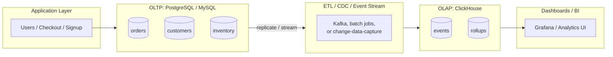
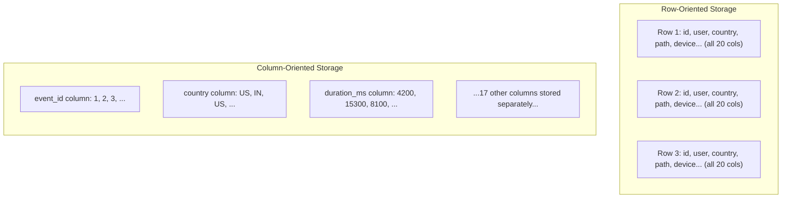

# Introduction & Prerequisites

This is the opening chapter of the ClickHouse & Columnar Databases course. Before you write a single `CREATE TABLE` statement, you need a mental model of *what kind of database ClickHouse is* and *why it exists* — otherwise every design decision in later chapters (why the primary index doesn't work like a B-tree, why `UPDATE` is discouraged, why you batch inserts) will feel arbitrary instead of obviously correct. This chapter builds that mental model, gets ClickHouse running on your machine, and runs your first queries.

---

## Learning Objectives

By the end of this chapter, you will be able to:

- Define ClickHouse and explain what "columnar OLAP database" means, term by term.
- Distinguish OLAP (analytical) workloads from OLTP (transactional) workloads, and classify a given query as one or the other.
- Explain, at a conceptual level, how row-oriented storage and column-oriented storage lay data out differently on disk, and why that difference matters for analytical queries.
- Describe ClickHouse's origin at Yandex and the problem it was built to solve.
- List realistic use cases where ClickHouse excels, and honestly name workloads where it is a poor fit.
- Install ClickHouse locally via Docker and connect to it with `clickhouse-client`.
- Create a database and a `MergeTree` table, insert rows, and query them back.

---

## Prerequisites for This Chapter

This course assumes you are comfortable with:

- **Basic SQL** — you can read and write `SELECT`, `WHERE`, `GROUP BY`, and a simple `JOIN` without looking up syntax for every clause. You don't need to be an expert; you just need SQL to not be intimidating.
- **The command line** — you can open a terminal, run a command, read its output, and navigate directories. Nothing more advanced than that is required.
- **Docker basics** — you know that `docker run` starts a container, and roughly what an image, a container, and a port mapping are. If you've never used Docker at all, install it now ([docs.docker.com/get-started](https://docs.docker.com/get-started/)) — you'll use it in this very chapter.
- **General data modeling intuition** — you know what a table, a row, and a column are, in the everyday spreadsheet sense.

You do **not** need any prior experience with analytical databases, distributed systems, or ClickHouse itself — that's what this course teaches. If you've taken this repo's [PostgreSQL course](../postgresql-course/00-index.md), you have exactly the SQL foundation this course expects, and you'll find yourself contrasting ClickHouse against PostgreSQL constantly — that contrast is intentional and is one of the fastest ways to understand *why* ClickHouse looks the way it does.

**Self-assessment checklist** — before continuing, confirm you can honestly check off each item:

- [ ] I can write a `SELECT ... FROM ... WHERE ... GROUP BY ...` query from memory for a simple table.
- [ ] I understand what a `JOIN` does, even if I'm rusty on the exact syntax for every join type.
- [ ] I can open a terminal and run a command-line program.
- [ ] I have Docker installed, or am willing to install it right now.
- [ ] I know what a "row" and a "column" mean in a table, and could sketch a small table on paper.

If any of these feel shaky, it's fine — this chapter re-explains storage concepts from first principles. But if SQL syntax itself is completely unfamiliar to you, consider skimming a basic SQL tutorial first; this course teaches ClickHouse's dialect and internals, not introductory SQL.

---

## 1. What Is ClickHouse?

**ClickHouse** is an open-source **columnar OLAP (Online Analytical Processing) database management system** designed for real-time analytics over very large volumes of data — routinely billions of rows, on hardware as modest as a single server.

Let's unpack every word in that definition, because each one is load-bearing:

- **Open-source**: the full source code is public (Apache 2.0 licensed), developed on GitHub, with both a thriving community edition and a managed cloud offering (ClickHouse Cloud) built on the same engine.
- **Columnar**: data is physically stored on disk organized by *column*, not by *row*. Section 3 below walks through exactly what this means and why it's the single most important architectural fact about ClickHouse.
- **OLAP**: it is optimized for *analytical* queries — aggregations, scans, and computations over large numbers of rows — rather than for *transactional* workloads like "update this one customer's address." Section 2 draws this line precisely.
- **Database management system**: it's a full DBMS, not a library or a file format — it has its own SQL dialect, its own storage engine, users and permissions, replication, and a query planner, all of which this course covers.
- **Real-time analytics over huge volumes**: the specific promise ClickHouse makes is that you can run an aggregation query — "sum this column, grouped by that column, filtered by a third" — over billions of rows and get an answer in well under a second, on hardware you can reasonably afford.

In short: ClickHouse is what you reach for when your question is "tell me something about millions or billions of rows of data, right now" rather than "fetch or modify this one specific row."

---

## 2. OLAP vs. OLTP

Almost every database system on earth is built to serve one of two fundamentally different access patterns. Understanding this split is the single most useful lens for the rest of this course.

### 2.1 OLTP: Online Transaction Processing

**OLTP** systems are built around many small, fast operations that each touch a handful of rows and typically only a few columns of each row. Think of the database behind an e-commerce checkout page, a banking app, or a ticketing system:

- "Fetch order #4521."
- "Update the shipping address for customer #88."
- "Insert one new row for this new signup."
- "Decrement inventory count for SKU X by 1, inside a transaction, guaranteeing it never goes negative."

These queries are **narrow and frequent**: thousands or millions of them fire per second across a busy application, each one cheap, each one touching a tiny slice of the data, and each one usually needing strong consistency guarantees (ACID transactions) because real money or real state changes are on the line. PostgreSQL and MySQL are the classic examples of row-oriented, OLTP-optimized databases. This repo's own [PostgreSQL course](../postgresql-course/00-index.md) is built entirely around this transactional mental model. MongoDB, covered in this repo's [MongoDB course](../mongodb-course/00-index.md), is a document database rather than strictly OLTP, but shares the same fundamental shape: it's optimized for reading and writing whole documents/records efficiently, not for scanning and aggregating across a huge collection.

### 2.2 OLAP: Online Analytical Processing

**OLAP** systems are built around the opposite pattern: relatively few queries, but each one scans a *huge* number of rows, and typically touches only a handful of columns out of many. Think of a business intelligence dashboard or an analytics report:

- "What was the average order value by country, for last quarter?" — scans millions of order rows, but only reads `order_total`, `country`, and `order_date`.
- "How many unique users visited each page path in the last 24 hours?" — scans potentially billions of clickstream events, touching only `user_id`, `page_path`, and `timestamp`.
- "What's the p99 API latency, broken down by endpoint, per 5-minute window, for the last week?" — scans a huge volume of observability data, reading only a few numeric and categorical columns.

These queries are **wide (in row count) and narrow (in column count)**: each one might scan a billion rows, but reads maybe 3-5 columns out of a table that has 50. They're also comparatively infrequent (dozens to thousands per second at most, not millions), and near-perfect consistency on every single row is far less important than getting a correct-enough aggregate answer *fast*.

### 2.3 Side-by-side comparison

| Dimension | OLTP (e.g. PostgreSQL) | OLAP (e.g. ClickHouse) |
|---|---|---|
| **Typical query** | "Get order #4521" | "Average order value by country, last quarter" |
| **Rows touched per query** | A handful | Millions to billions |
| **Columns touched per query** | Most/all columns of the row | A handful of columns out of many |
| **Query frequency** | Very high (thousands-millions/sec) | Lower (often dozens-thousands/sec) |
| **Write pattern** | Frequent small inserts/updates/deletes, one row at a time | Large batch inserts; updates/deletes are rare and expensive |
| **Consistency needs** | Strong (ACID transactions, no lost updates) | Eventual/relaxed is usually fine for analytics |
| **Storage layout** | Row-oriented (Section 3) | Column-oriented (Section 3) |
| **Optimized for** | Low-latency point reads/writes | High-throughput scans and aggregations |
| **This repo's sibling course** | [PostgreSQL course](../postgresql-course/00-index.md) | *(this course)* |

Neither category is "better" — they're optimized for opposite access patterns, and using one where the other belongs is a recurring, expensive mistake (more on that in Common Mistakes below). A mature system architecture very often uses *both*: an OLTP database like PostgreSQL as the system of record for transactional writes, and an OLAP database like ClickHouse fed from it (via CDC, ETL, or event streaming) to power dashboards and analytics without ever putting analytical load on the transactional system.



---

## 3. Row-Oriented vs. Column-Oriented Storage (a First Look)

This section gives you the conceptual picture. Chapter 3 (Architecture & Internals) goes deep on ClickHouse's actual on-disk file formats, compression, and vectorized execution — for now, focus on building the right intuition.

### 3.1 A concrete example table

Imagine a simplified `events` table for a web analytics product:

| event_id | user_id | country | page_path | device | browser | os | referrer | duration_ms | is_bounce | ... (more columns) | timestamp |
|---|---|---|---|---|---|---|---|---|---|---|---|
| 1 | 501 | US | /home | mobile | Chrome | iOS | google.com | 4200 | false | ... | 2026-07-01 09:00:01 |
| 2 | 502 | IN | /pricing | desktop | Firefox | Linux | direct | 15300 | false | ... | 2026-07-01 09:00:03 |
| 3 | 501 | US | /pricing | mobile | Chrome | iOS | /home | 8100 | false | ... | 2026-07-01 09:00:07 |

Assume this table has 20 columns in total (only 8 are shown), and holds a billion rows.

### 3.2 How a row store lays this out

A **row-oriented** database (like PostgreSQL) physically stores each *row* contiguously on disk: all 20 column values for `event_id = 1` are written next to each other, then all 20 values for `event_id = 2`, and so on.

```
Disk layout (row store):
[1, 501, US, /home,    mobile,  Chrome,  iOS,   google.com, 4200,  false, ...][2, 502, IN, /pricing, desktop, Firefox, Linux, direct,     15300, false, ...][3, 501, US, /pricing, mobile,  Chrome,  iOS,   /home,      8100,  false, ...]
     └──────────────────────── row 1 (20 columns) ────────────────────────┘└──────────────────────── row 2 (20 columns) ────────────────────────┘...
```

This is excellent for OLTP: "fetch everything about event #1" reads one contiguous chunk of disk and you're done — exactly the access pattern Section 2.1 described.

### 3.3 How a column store lays this out

A **column-oriented** database (like ClickHouse) instead stores each *column* contiguously: all `event_id` values together, then all `user_id` values together, then all `country` values together, and so on — 20 separate contiguous runs instead of interleaved rows.

```
Disk layout (column store):
event_id:  [1, 2, 3, ...]
user_id:   [501, 502, 501, ...]
country:   [US, IN, US, ...]
page_path: [/home, /pricing, /pricing, ...]
device:    [mobile, desktop, mobile, ...]
browser:   [Chrome, Firefox, Chrome, ...]
os:        [iOS, Linux, iOS, ...]
referrer:  [google.com, direct, /home, ...]
...
```



### 3.4 Why this matters: the query that touches 2 of 20 columns

Now run this analytical query against a billion-row `events` table:

```sql
SELECT country, avg(duration_ms)
FROM events
GROUP BY country;
```

This query needs exactly **2 of the 20 columns**: `country` and `duration_ms`.

- In a **row store**, the database still has to read every row's full contiguous block off disk to get at `country` and `duration_ms`, because the other 18 columns are physically interleaved in between. You pay the I/O cost of reading roughly 20/20ths of the data to use 2/20ths of it.
- In a **column store**, the database reads *only* the `country` column file and the `duration_ms` column file, completely skipping the other 18 columns' data on disk. That's a potential ~10x reduction in I/O for this query, before any compression or indexing is even considered — and compression compounds this further, because a column of repeated `country` values (a "low-cardinality" column, more in Chapter 4) compresses dramatically better than a row of mixed types ever could.

This single idea — *analytical queries touch few columns but many rows, so store data by column so you only pay for the columns you actually read* — is the entire architectural reason ClickHouse exists. Everything else in this course (compression, the sparse primary index, vectorized execution) is built on top of this one decision.

---

## 4. History and Motivation

ClickHouse was originally built inside **Yandex** (the Russian search and internet company) to power **Yandex.Metrica**, a web analytics product comparable to Google Analytics. Yandex.Metrica needed to let customers run ad-hoc, arbitrary aggregation queries — "how many unique visitors from this country, on this page, over this date range" — over clickstream data at a scale of trillions of events, with sub-second response times, without pre-computing every possible report in advance.

Existing row-oriented databases and even early data warehouse systems of the time couldn't keep up with that combination of scale, flexibility, and speed. So Yandex engineers built a new database engine from scratch, specifically for this workload, with column-oriented storage as the foundational decision.

The name **ClickHouse** is a portmanteau of "**Click**stream" (the web analytics data it was built to process — every user click is an event) and "Data **House**" / "warehouse" (the class of system it belongs to — a place data is stored and analyzed at scale, as opposed to a transactional operational database).

Yandex open-sourced ClickHouse in **2016**, releasing it under the Apache 2.0 license. The motivation for open-sourcing was, by the project's own account, straightforward: no comparable open-source system existed that combined column storage, this level of query speed, and true SQL support, and open-sourcing it let the wider industry (and Yandex's own hiring and reputation) benefit from — and contribute back to — the engine. Since then, ClickHouse has grown well beyond its Yandex origins: ClickHouse Inc. was spun out as an independent company, the project has an active open-source community and enterprise customers across ad-tech, observability, and finance, and it now powers analytics at companies like Cloudflare, Uber, and eBay — organizations with no direct connection to Yandex.Metrica's original use case, but with the same underlying shape of problem: huge volumes of data, analytical queries, and a need for real-time answers.

---

## 5. Real-World Use Cases

ClickHouse shows up wherever the workload looks like "aggregate over a huge amount of data, fast, often in near real time." The most common patterns:

- **Real-time analytics dashboards** — product analytics, user behavior dashboards, and business metrics that need to reflect the last few seconds or minutes of data, not yesterday's batch job.
- **Observability: logs, metrics, and traces at scale** — many modern observability platforms use ClickHouse (or something ClickHouse-shaped) under the hood to store and query enormous volumes of structured log lines, time-series metrics, and distributed traces, because the query pattern ("p99 latency for this service over the last hour, broken down by endpoint") is a textbook OLAP query.
- **Clickstream and web analytics** — ClickHouse's original use case: tracking page views, clicks, and sessions across huge volumes of website or app traffic.
- **Ad-tech** — bid logs, impression tracking, and attribution reporting, where every ad request generates an event and reports need to slice that data by hundreds of dimensions.
- **Time-series data** — IoT sensor readings, financial market data, infrastructure metrics — anything that's fundamentally "a timestamp plus some measurements, arriving continuously, queried in aggregate."
- **Business intelligence over huge datasets** — traditional BI reporting (revenue by region, cohort retention, funnel analysis) but at a scale where a row-oriented data warehouse becomes too slow or too expensive.

The common thread across every one of these: high-volume writes (often via streaming ingestion), infrequent updates to historical data, and queries that aggregate across large row counts while touching relatively few columns.

---

## 6. Honest Tradeoffs: What ClickHouse Is Bad At

A recurring failure mode with any powerful, popular tool is treating it as a universal hammer. ClickHouse is exceptional at some things and genuinely bad at others — knowing the boundary now will save you significant pain later in this course and in production.

**What ClickHouse is exceptional at:**

- Aggregating (sum, count, average, percentile) over billions of rows, in well under a second, on a single reasonably-provisioned server.
- Ingesting extremely high volumes of append-only data (millions of rows per second, given proper batching).
- Compressing data far beyond what row stores typically achieve, thanks to column-oriented storage.
- Scaling out horizontally via sharding and replication for both volume and availability (Chapters 11-12).

**What ClickHouse is bad at:**

- **Frequent single-row updates or deletes.** ClickHouse's `MergeTree` storage engine (Chapter 3) is fundamentally append-oriented; `UPDATE`/`DELETE` exist but are implemented as asynchronous, expensive background rewrite operations (`ALTER TABLE ... UPDATE/DELETE`, called *mutations*), not the instant, cheap, row-level operations you'd expect from PostgreSQL. Doing this frequently will degrade a ClickHouse cluster badly.
- **Highly transactional workloads.** ClickHouse does not provide the ACID transaction guarantees across multiple statements that OLTP systems do. There's no "begin transaction, debit this account, credit that account, commit atomically" primitive in the way PostgreSQL provides it.
- **Small OLTP-style point lookups at high frequency.** "Fetch the single row for user #12345" works in ClickHouse, but it's not what the engine is optimized for — its indexing model (the sparse primary index, Chapter 6) trades away fast single-row lookups in exchange for extreme scan speed. A properly indexed row store will usually beat ClickHouse badly on this specific access pattern.
- **Workloads requiring strict, immediate consistency after every write.** Because of how merges and replication work, there are brief windows where different replicas or query paths can observe slightly different states — usually a non-issue for analytics, but a real problem if you're expecting bank-account-transfer-grade guarantees.

The honest one-line summary, which you'll see repeated throughout this course: **ClickHouse trades away cheap point writes and instant per-row consistency in exchange for enormous scan and aggregation throughput.** If your workload is mostly narrow, frequent, single-row operations, you want PostgreSQL or MongoDB, not ClickHouse — see this repo's [PostgreSQL course](../postgresql-course/00-index.md) and [MongoDB course](../mongodb-course/00-index.md).

---

## 7. Installing ClickHouse

You have three realistic options for getting ClickHouse running. This course uses Docker for all examples because it's the fastest path to a clean, disposable, reproducible environment — but all three are worth knowing about.

### 7.1 Option A: Docker (recommended for this course)

Pull and run the official ClickHouse server image:

```bash
docker run -d \
  --name clickhouse-server \
  -p 8123:8123 \
  -p 9000:9000 \
  --ulimit nofile=262144:262144 \
  clickhouse/clickhouse-server
```

What these pieces mean:

- `-d` runs the container in the background (detached).
- `--name clickhouse-server` gives the container a friendly name you'll use in later commands.
- `-p 8123:8123` exposes ClickHouse's **HTTP interface** on port 8123 (Section 8.2).
- `-p 9000:9000` exposes ClickHouse's **native TCP protocol** on port 9000, used by `clickhouse-client` and most native client libraries.
- `--ulimit nofile=262144:262144` raises the open-file-descriptor limit, which ClickHouse recommends because it can open many files under load; without it you may see warnings on startup (harmless for learning, but good practice to include).

Verify it's running:

```bash
docker ps --filter name=clickhouse-server
```

Stop and remove it later with `docker stop clickhouse-server && docker rm clickhouse-server` — because container state disappears with the container, consider a mounted volume (`-v clickhouse-data:/var/lib/clickhouse`) once you want data to survive a restart; the Hands-On Exercise below does not require this.

### 7.2 Option B: Native install

ClickHouse publishes native packages for Linux (`.deb`/`.rpm`), and a single install script works across most Linux distributions and macOS:

```bash
curl https://clickhouse.com/ | sh
```

This downloads a single `clickhouse` binary that bundles the server, client, and `clickhouse-local` (Section 8.3). Native installs are the right choice for production servers where you want ClickHouse to run as a system service rather than inside a container; see the [official install docs](https://clickhouse.com/docs/en/install) for distribution-specific package manager instructions.

### 7.3 Option C: ClickHouse Cloud (managed)

[ClickHouse Cloud](https://clickhouse.com/cloud) is the managed, hosted offering run by ClickHouse Inc., with a free trial. It removes the operational burden entirely (replication, backups, scaling, upgrades are handled for you) and is a reasonable choice if you'd rather not manage infrastructure at all while learning — you get a connection string and a web-based SQL console immediately after signup. Chapters 11-15 of this course, on replication, sharding, and operations, are far more relevant if you're self-hosting; Cloud users still benefit from understanding those chapters conceptually, since the underlying engine is the same.

---

## 8. Connecting to ClickHouse

### 8.1 `clickhouse-client`

The primary way you'll interact with ClickHouse throughout this course is **`clickhouse-client`**, the official command-line SQL client. If you're running the Docker container from Section 7.1, the image already includes the client — run it against the running container like this:

```bash
docker exec -it clickhouse-server clickhouse-client
```

You should land in an interactive prompt:

```
ClickHouse client version 24.x.x.
Connecting to localhost:9000 as user default.
Connected to ClickHouse server version 24.x.x.

my-host :)
```

From here you can type SQL statements directly, terminated by a semicolon, exactly as you would in `psql` or `mysql`. If you installed ClickHouse natively (Section 7.2), run `clickhouse-client` directly from your shell instead — it connects to `localhost:9000` by default.

### 8.2 The HTTP interface

ClickHouse also exposes a full **HTTP interface** on port 8123, which accepts SQL queries as plain HTTP requests and is what most application client libraries, BI tools, and scripts use under the hood instead of the native protocol. You can try it immediately with `curl`, without any client installed:

```bash
curl 'http://localhost:8123/?query=SELECT%20version()'
```

This returns the ClickHouse server version as plain text. The HTTP interface matters because it means "does anything speak HTTP and can it POST a string" is sufficient to query ClickHouse — extremely convenient for scripting, health checks, and integrating with tools that have no native ClickHouse driver.

### 8.3 A preview: `clickhouse-local`

Alongside the server, ClickHouse ships **`clickhouse-local`** — a serverless, single-binary tool that gives you the full power of ClickHouse's SQL engine and functions to query files directly (CSV, Parquet, JSON, and more) without ever starting a server. Think of it as "SQL over files, powered by ClickHouse's query engine, with zero setup." You won't need it for this chapter, but it's worth knowing it exists — Chapter 18 (Tools & Ecosystem) covers it in depth, including using it as an ad-hoc data-wrangling tool on your own machine.

---

## 9. Your First Commands

With `clickhouse-client` open (Section 8.1), run through this sequence to get comfortable with the basic shape of ClickHouse SQL — it will look almost entirely familiar if you know any SQL dialect.

**See what databases already exist:**

```sql
SHOW DATABASES;
```

A fresh install typically shows `default`, `system`, `information_schema`, and `INFORMATION_SCHEMA`. The `system` database is worth remembering now — it holds ClickHouse's introspection tables (query logs, table metadata, merge history) that Chapter 13 uses heavily for performance tuning.

**Create a database for this course's examples:**

```sql
CREATE DATABASE course;
```

**Switch into it and create your first table:**

```sql
USE course;

CREATE TABLE page_views
(
    event_id    UInt64,
    user_id     UInt32,
    country     String,
    page_path   String,
    duration_ms UInt32,
    event_time  DateTime
)
ENGINE = MergeTree
ORDER BY (country, event_time);
```

Don't worry yet about *why* `ENGINE = MergeTree` or `ORDER BY (country, event_time)` were chosen — `MergeTree` is ClickHouse's flagship table engine family (fully covered in Chapter 5) and `ORDER BY` doubles as the sparse primary index (Chapter 6). For now, just notice the shape: it's `CREATE TABLE` with typed columns, plus an `ENGINE` clause that row-oriented databases simply don't have — that clause is where ClickHouse tells you *how* the data will physically be stored and organized, which is a decision row stores rarely expose to you this directly.

**Insert a few rows:**

```sql
INSERT INTO page_views (event_id, user_id, country, page_path, duration_ms, event_time) VALUES
    (1, 501, 'US', '/home',    4200,  '2026-07-01 09:00:01'),
    (2, 502, 'IN', '/pricing', 15300, '2026-07-01 09:00:03'),
    (3, 501, 'US', '/pricing', 8100,  '2026-07-01 09:00:07'),
    (4, 503, 'DE', '/home',    2100,  '2026-07-01 09:01:12'),
    (5, 502, 'IN', '/home',    6700,  '2026-07-01 09:02:45');
```

**Query them back:**

```sql
SELECT * FROM page_views;
```

```sql
SELECT country, avg(duration_ms) AS avg_duration_ms, count() AS views
FROM page_views
GROUP BY country
ORDER BY avg_duration_ms DESC;
```

That last query is a genuine, if tiny, analytical query: it's exactly the shape from Section 3.4 — touching only `country` and `duration_ms` out of six columns, aggregated across every row. At five rows the engine doesn't matter; the entire rest of this course is about what happens when that table has five billion rows instead of five.

---

## Real-World Scenario

**Setup:** You're a backend engineer at a mid-sized SaaS company. Your product's analytics dashboard — "sessions over time," "top pages," "conversion funnel" — is currently powered by the same PostgreSQL database that runs the application itself. It worked fine for the first two years. Now the `events` table has grown to 400 million rows, and the dashboard's core query (aggregate session duration and page views, grouped by day and country, filtered to the last 90 days) has gone from "instant" to "sometimes over two minutes," occasionally timing out the dashboard entirely. Worse, when a customer runs a heavy report, other customers' pages slow down too, because the analytical query is competing for the same database resources as live checkout traffic.

**Applying this chapter's concepts:**

- The dashboard query is a textbook **OLAP** query (Section 2.2): it scans a huge number of rows (potentially all 400 million, filtered down by date) but only touches a handful of columns (`session_id`, `country`, `event_date`, `duration_ms`) out of a wide `events` table that also stores browser, referrer, device, and a dozen other fields for other purposes.
- PostgreSQL is a **row store** (Section 3.2): even with a good index on `event_date`, once the date filter narrows things down, PostgreSQL still reads full rows off disk for every matching event, including columns the dashboard query never asked for. At 400 million rows, that I/O overhead is exactly why the query has slowed to minutes.
- The competition-for-resources problem is a direct consequence of mixing an OLTP workload (checkout, signups, live app queries) and an OLAP workload (the dashboard) on one database. Section 2.3's advice — separate the transactional system of record from the analytical query path — applies directly here.
- The engineering team evaluates ClickHouse: they stand up a container using the Docker command from Section 7.1, model an `events` table with `MergeTree` (Section 9), and set up a pipeline that streams new events from PostgreSQL into ClickHouse (a pattern this course builds toward in Chapter 14). The dashboard's queries get pointed at ClickHouse instead.
- The result the team is hoping for — and one this course will teach you to reason about concretely, not just trust — is exactly what Section 3.4 predicted: reading only the 4 relevant columns instead of full rows across 400 million records, plus much better compression, turning a 2-minute query into a sub-second one, while completely isolating analytical load from the transactional PostgreSQL database that still runs checkout.
- They also go in with eyes open about Section 6's tradeoffs: they know they won't be running per-row updates against this new ClickHouse table, and they design the pipeline to be append-mostly, batching inserts rather than streaming one event at a time.

---

## Best Practices

- **Use Docker (or ClickHouse Cloud's free trial) to learn.** Both give you a clean, disposable environment; you can destroy and recreate a Docker container in seconds if you make a mess experimenting.
- **Batch your inserts, even in throwaway examples.** ClickHouse is built around receiving data in reasonably large batches (thousands of rows at a time, ideally), not one row per `INSERT` statement. Build this habit from day one — Chapter 7 explains exactly why small, frequent inserts are actively harmful.
- **Think in columns, not rows, when designing queries and tables.** Before writing a query, ask "which columns does this actually need?" — that question is meaningless for OLTP databases but central to getting good performance out of ClickHouse.
- **Never treat ClickHouse like a transactional database.** If you catch yourself wanting `UPDATE ... WHERE id = 5` to behave like it does in PostgreSQL — instant, cheap, transactional — stop and reconsider whether the data belongs in ClickHouse at all, or whether your schema needs a different pattern (Chapter 5 covers engines like `ReplacingMergeTree` designed for this).
- **Keep your OLTP and OLAP systems separate from day one**, even in a learning project. Practice the habit of treating ClickHouse as a downstream analytical store fed from an operational system, not as a replacement for it.
- **Read query plans and system tables early**, even in this first chapter. Try `SELECT * FROM system.tables` after creating your `course` database — getting comfortable with `system.*` now pays off heavily by Chapter 13.

---

## Common Mistakes

- **Assuming ClickHouse is a drop-in PostgreSQL replacement.** It is not a general-purpose database; it's a specialized analytical engine. Porting an OLTP schema and workload straight into ClickHouse without rethinking the access pattern is one of the most common and costly mistakes newcomers make.
- **Doing single-row inserts in a loop.** Inserting one row at a time (e.g., in a per-event application code path) creates a huge number of small storage "parts" that ClickHouse then has to continuously merge in the background (Chapter 3), degrading performance and potentially exhausting server resources. Always batch.
- **Expecting instant consistency for updates and deletes.** `ALTER TABLE ... UPDATE/DELETE` in ClickHouse are asynchronous mutations, not immediate row-level operations — expecting PostgreSQL-style immediacy will lead to confusing, hard-to-debug behavior.
- **Ignoring the `ORDER BY`/engine choice as an afterthought.** Unlike a row store where you can add indexes later without re-architecting, `MergeTree`'s `ORDER BY` (Chapter 6) is foundational to how the table performs — treating it as a cosmetic detail during a "quick prototype" often means redesigning the table later.
- **Running heavy analytical queries against a database that also serves live transactional traffic**, whether that's PostgreSQL under analytical load or ClickHouse under point-lookup load — each engine is fast specifically because it isn't trying to do the other one's job too.
- **Skipping the "why" and jumping straight to syntax.** ClickHouse's SQL looks enough like standard SQL that it's tempting to treat it as "PostgreSQL with a different `CREATE TABLE` line." The engine, indexing, and merge behavior underneath are fundamentally different, and that difference is what the next several chapters exist to teach.

---

## Summary

- ClickHouse is an open-source, **columnar OLAP** database built for real-time analytics over huge data volumes.
- **OLTP** workloads (PostgreSQL, MongoDB) are narrow, frequent, and touch few rows per query but most columns of each row; **OLAP** workloads (ClickHouse) are wide, less frequent, and touch millions/billions of rows but only a few columns.
- **Row stores** lay data out row-by-row on disk; **column stores** lay data out column-by-column — meaning a query that only needs 2 of 20 columns reads only those 2 columns' data in ClickHouse, not full rows.
- ClickHouse originated at **Yandex** for **Yandex.Metrica**, a web analytics product, and was open-sourced in 2016; its name blends "clickstream" and "data warehouse."
- It excels at dashboards, observability, clickstream analytics, ad-tech, time-series, and BI over huge datasets — and is a poor fit for frequent single-row updates/deletes, transactional workloads, and high-frequency point lookups.
- You can install ClickHouse via **Docker**, a **native package**, or **ClickHouse Cloud**; this course standardizes on Docker.
- `clickhouse-client` is the primary CLI; ClickHouse also exposes an **HTTP interface** (port 8123) and a serverless **`clickhouse-local`** tool for querying files directly.
- The basic SQL shape — `CREATE DATABASE`, `CREATE TABLE ... ENGINE = MergeTree`, `INSERT INTO`, `SELECT ... GROUP BY` — looks familiar immediately; the differences that matter are underneath, starting with the `ENGINE` clause.

---

## Knowledge Check

1. In your own words, define "columnar OLAP database," explaining what each of the three words/phrases contributes to the definition.
2. Classify each of the following as primarily an OLTP or OLAP query, and justify your answer: (a) "Update the email address for user #883," (b) "What percentage of sessions bounced, by device type, over the last 30 days?", (c) "Insert one new row for a form submission."
3. Explain why a query that only needs 2 out of 20 columns is faster on a column store than a row store, using the disk layout diagrams from Section 3 as part of your explanation.
4. Name two things ClickHouse is exceptionally good at and two things it is a poor fit for. For each "poor fit" item, briefly explain *why* it's a poor fit given what you now know about `MergeTree`'s append-oriented design.
5. You're advising a team that wants to point their live application directly at ClickHouse for both checkout transactions and analytics dashboards, using one shared table. What would you tell them, and what alternative architecture would you suggest instead?

---

## Hands-On Exercise

Complete these steps on your own machine. They mirror Section 9 but ask you to do it independently, without copy-pasting.

1. **Start ClickHouse via Docker.** Run the `docker run` command from Section 7.1. Confirm the container is running with `docker ps`.
2. **Connect with `clickhouse-client`.** Use `docker exec -it clickhouse-server clickhouse-client` and confirm you land in an interactive prompt. Run `SELECT version();` to confirm connectivity.
3. **Create a database** named `practice` and switch to it with `USE practice;`.
4. **Design and create a `MergeTree` table** named `orders` with at least these columns: `order_id` (`UInt64`), `customer_country` (`String`), `order_total` (`Decimal(10, 2)`), `order_date` (`Date`). Use `ENGINE = MergeTree ORDER BY (customer_country, order_date)`.
5. **Insert at least 8 rows** in a single `INSERT` statement, covering at least 3 different countries and at least 2 different dates.
6. **Run three queries**: (a) a plain `SELECT *` to see all rows, (b) a `GROUP BY customer_country` query computing `sum(order_total)` and `count()` per country, (c) a query filtering `WHERE order_date >= '<some date>'` and ordering by `order_total DESC`.
7. **Inspect your table's metadata.** Run `SELECT * FROM system.tables WHERE database = 'practice';` and note what columns of information ClickHouse tracks about your table — you'll use `system.*` tables extensively starting in Chapter 13.
8. **Clean up (optional).** Run `docker stop clickhouse-server && docker rm clickhouse-server` if you want to remove the container, or leave it running for Chapter 2.

If every step ran without error and you can explain, in one sentence, why you chose the `ORDER BY` you did, you're ready for Chapter 2.

---

## Further Reading

- [ClickHouse Docs: What Is ClickHouse?](https://clickhouse.com/docs/en/intro) — the official overview and architecture summary.
- [ClickHouse Docs: Installation](https://clickhouse.com/docs/en/install) — Docker, native packages, and Cloud, in full detail.
- [ClickHouse Docs: clickhouse-client](https://clickhouse.com/docs/en/interfaces/cli) — the full CLI reference.
- [ClickHouse Docs: HTTP Interface](https://clickhouse.com/docs/en/interfaces/http) — every option the HTTP endpoint supports.
- [ClickHouse Docs: MergeTree Engine](https://clickhouse.com/docs/en/engines/table-engines/mergetree-family/mergetree) — a preview of the engine you just used; covered fully starting in Chapter 3.

---

<div style="display:flex;justify-content:space-between;align-items:center;">
  <a href="./00-index.md">← Previous: Index</a>
  <a href="./00-index.md">🏠 Index</a>
  <a href="./02-core-concepts.md">Next: Core Concepts →</a>
</div>
