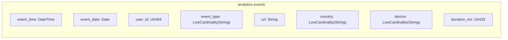
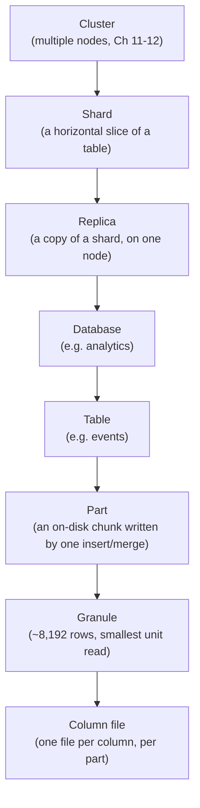

# Core Concepts

Chapter 1 made the case for ClickHouse: it's a column-oriented OLAP database that trades transactional row-by-row guarantees for blistering aggregate scan speed, and it does this by making fundamentally different architectural choices than PostgreSQL or MongoDB. That was the "what" and the "why." This chapter is the vocabulary and mental model you'll use for the rest of the course — the nouns and verbs that every later chapter assumes you already know.

Nothing here requires you to tune anything or reason about performance yet. This chapter is deliberately a survey: it names things, defines them at a plain-language level, and tells you exactly which later chapter will go deep. Skimming it will cost you later — Chapter 3 assumes you know what a "part" is, Chapter 4 assumes you've seen the data type names before, and Chapter 6 assumes you already sense that something is unusual about ClickHouse's "primary key." We also introduce the **`events` table** here — a small web-analytics clickstream schema that every subsequent chapter (3 through 10 and beyond) reuses, so you build intuition on one running example instead of a new toy table every chapter.

---

## Learning Objectives

By the end of this chapter, you will be able to:

- Create a ClickHouse database and a table, and explain why `CREATE TABLE` requires an explicit `ENGINE` clause when most databases don't ask you for one.
- Recite the schema of the `events` table — this course's running example — and explain, briefly, why each column has the type it has.
- Recognize ClickHouse's core data types on sight (`UInt*`, `Int*`, `Float*`, `String`, `Date`/`DateTime`/`DateTime64`, `Enum8`/`Enum16`, `Array(T)`, `Nullable(T)`, `LowCardinality(T)`) well enough to read a schema, without yet needing to choose between them expertly.
- Define, in plain language, ClickHouse-specific terms: part, merge, granule, sparse index — plus standard terms: table, column, row, partition, shard, replica.
- Compare ClickHouse's terminology to PostgreSQL's and MongoDB's side by side, and state precisely why ClickHouse's "primary key" is not a uniqueness constraint the way a Postgres primary key or a MongoDB `_id` is.
- Preview the ways ClickHouse's SQL dialect extends standard SQL (arrays as first-class values, aggregate combinators, sampling, approximate functions) without yet needing to write any of it.

---

## Prerequisites for This Chapter

This chapter builds directly on [Chapter 1: Introduction & Prerequisites](./01-introduction-and-prerequisites.md). We assume you already know:

- What OLAP and OLTP mean, and why ClickHouse is built for the former.
- The high-level difference between row-oriented and column-oriented storage.
- Basic SQL: `SELECT`, `WHERE`, `GROUP BY`, `JOIN` at a beginner level (per the course's [self-assessment](./01-introduction-and-prerequisites.md)).
- That you have a working ClickHouse instance reachable via `clickhouse-client`, per Chapter 1's installation steps.

If any of that feels shaky, go back to Chapter 1 before continuing — everything below assumes it as settled ground.

---

## 1. Databases and Tables in ClickHouse

At the surface, ClickHouse looks reassuringly familiar: it has databases, it has tables, and you talk to it in SQL. Underneath, both concepts map to something more concrete than in most RDBMSs.

### 1.1 Databases

A ClickHouse **database** is a namespace that groups tables together — conceptually identical to a PostgreSQL schema or a MongoDB database. Creating one is exactly as simple as it looks:

```sql
CREATE DATABASE IF NOT EXISTS analytics;
```

Under the hood, a database corresponds (with the default configuration) to a directory on disk, and each table inside it corresponds to its own subdirectory holding the table's data files. You don't need to think about this yet — Chapter 3 walks through the on-disk layout in full — but keep the mental image: **database → directory, table → subdirectory** is a far more literal mapping in ClickHouse than the abstract "logical container" most RDBMSs present.

### 1.2 Tables and the mandatory `ENGINE` clause

Creating a table is where ClickHouse immediately signals that it is not "just another SQL database":

```sql
CREATE TABLE analytics.example
(
    id UInt64,
    name String
)
ENGINE = MergeTree
ORDER BY id;
```

Notice the `ENGINE = MergeTree` clause. In PostgreSQL or MySQL, you never think about a table "engine" (MySQL is a partial exception with InnoDB/MyISAM, but it defaults sensibly and most users never touch it). In ClickHouse, **the engine is mandatory, and there is no sensible universal default** — you must choose one every time you create a table.

Why does ClickHouse force this choice on you? Because in ClickHouse, the table engine *is* the storage engine, the indexing strategy, the merge behavior, and the replication behavior, all bundled into one decision. Two tables with identical columns but different engines can behave completely differently: one might deduplicate rows in the background, one might pre-aggregate on insert, one might not persist to disk at all. There is no single "right" default because ClickHouse is built to serve very different access patterns (raw event ingestion, deduplicated dimension tables, pre-aggregated rollups, distributed query routing) with purpose-built engines rather than one generic table structure flexible enough to do all of them adequately.

This is previewed here on purpose and left shallow. Chapter 5 (Table Engines Deep Dive) is an entire chapter about choosing among the MergeTree family, Log family, `Distributed`, and others. For now, remember one rule of thumb: **for real tables holding real analytical data, you will almost always reach for a member of the `MergeTree` family** — it's the default starting point in this course and in production ClickHouse deployments generally.

---

## 2. The Running Example: the `events` Table

Every chapter from here through the end of this course refers back to one table: `events`, a clickstream table representing page views, clicks, and purchases on a hypothetical web product. Introducing it fully now means later chapters can say "recall the `events` table from Chapter 2" and mean something concrete.

### 2.1 The `CREATE TABLE` statement

```sql
CREATE DATABASE IF NOT EXISTS analytics;

CREATE TABLE analytics.events
(
    event_time   DateTime,
    event_date   Date,
    user_id      UInt64,
    event_type   LowCardinality(String),
    url          String,
    country      LowCardinality(String),
    device       LowCardinality(String),
    duration_ms  UInt32
)
ENGINE = MergeTree
ORDER BY (event_type, event_time);
```

This is the canonical schema used throughout this course. Whenever a later chapter says "the `events` table established in Chapter 2," this is the table it means — sometimes with an added column or index to illustrate a specific feature, but always starting from this shape.

### 2.2 Why each column has the type it has (preview)

You don't need to master ClickHouse's type system yet — that's Chapter 4 in full — but a one-line justification per column builds the right instincts early:

| Column | Type | Why (brief — full depth in Chapter 4) |
|---|---|---|
| `event_time` | `DateTime` | Second-resolution timestamp of when the event happened; the natural time axis for analytics queries. |
| `event_date` | `Date` | A denormalized, purely-day-resolution copy of `event_time`, stored cheaply (2 bytes) and commonly used for partitioning (Chapter 3) and quick date-range filtering. |
| `user_id` | `UInt64` | User identifiers are non-negative integers; unsigned integer types avoid wasting a sign bit and let ClickHouse pick the tightest-fitting width. |
| `event_type` | `LowCardinality(String)` | Only a handful of distinct values ever occur (`page_view`, `click`, `purchase`, ...) — `LowCardinality` dictionary-encodes these for major storage and speed wins. |
| `url` | `String` | Free-form, high-cardinality text with no fixed length — a plain `String` is the right fit. |
| `country` | `LowCardinality(String)` | A bounded set of country names/codes — the same low-cardinality reasoning as `event_type`. |
| `device` | `LowCardinality(String)` | A bounded set (`desktop`, `mobile`, `tablet`, ...) — again, ideal for `LowCardinality`. |
| `duration_ms` | `UInt32` | A non-negative duration in milliseconds; `UInt32` comfortably covers realistic durations while staying compact. |

The `ORDER BY (event_type, event_time)` clause is doing real, important work — it defines the physical sort order of the data on disk and is the foundation of ClickHouse's sparse index. We name it here so it doesn't look mysterious, but its full meaning is deliberately deferred to Chapter 6 (Primary Keys & Sparse Indexing).



---

## 3. ClickHouse Data Types: A Survey

ClickHouse's type system is richer than a typical RDBMS's, precisely because column-oriented storage rewards choosing the tightest, most specific type for each column — a smaller type means less data read off disk and better compression. This section is a name-and-recognize pass; Chapter 4 covers each type's storage representation, edge cases, and selection criteria in depth.

### 3.1 Numeric types

- **Unsigned integers**: `UInt8`, `UInt16`, `UInt32`, `UInt64` (and larger, `UInt128`/`UInt256`, for specialized use) — non-negative whole numbers, sized by the range you need.
- **Signed integers**: `Int8`, `Int16`, `Int32`, `Int64` (and larger variants) — whole numbers that can be negative.
- **Floating point**: `Float32`, `Float64` — approximate real numbers, standard IEEE 754 semantics.

The naming convention is refreshingly literal: the number in the type name is the bit width. Picking the smallest width that safely fits your data's range is a routine, expected optimization in ClickHouse schema design — unlike in many RDBMSs where "just use `INTEGER`/`BIGINT` for everything" is common, unremarkable advice.

### 3.2 String types

- **`String`** — an arbitrary-length byte string (usually treated as UTF-8 text), with no fixed size, no fixed encoding enforcement, and no separate "varchar with a length limit" concept.
- **`FixedString(N)`** — a fixed-length byte string of exactly `N` bytes, more storage-efficient than `String` when every value genuinely has the same length (e.g., certain hash digests, ISO country codes).

### 3.3 Date and time types

- **`Date`** — a calendar date, stored internally as a small integer day count, giving it a very compact 2-byte representation.
- **`DateTime`** — a timestamp with **second** resolution, timezone-aware, stored as a 4-byte Unix timestamp.
- **`DateTime64`** — a timestamp with configurable sub-second precision (milliseconds, microseconds, or nanoseconds), for workloads where second resolution isn't enough.

### 3.4 Enum types

- **`Enum8`** and **`Enum16`** — a fixed, named set of string values mapped internally to small integers (`Enum8` for up to 256 values, `Enum16` for up to 65,536). They give you the readability of strings with the storage and comparison speed of integers, at the cost of needing to declare the full value set up front.

### 3.5 Array type

- **`Array(T)`** — a variable-length list of values of type `T`, e.g., `Array(String)` or `Array(UInt32)`. Arrays are first-class values in ClickHouse — you can store them in a column, and the SQL dialect has a rich set of functions for filtering, transforming, and aggregating over them (previewed in Section 4, detailed in Chapters 4 and 7).

### 3.6 `Nullable(T)`

- **`Nullable(T)`** wraps any base type `T` to allow a `NULL` marker. It's supported, but used more sparingly in ClickHouse schema design than in typical RDBMS schemas, because `Nullable` columns carry a real storage and performance cost (a separate bitmap tracking nullness, plus code paths that can't use certain fast-path optimizations). Chapter 4 covers when `Nullable` is worth that cost and when a sentinel default value is the better choice.

### 3.7 `LowCardinality(T)`

- **`LowCardinality(T)`** wraps a base type (commonly `String`) and tells ClickHouse "this column has relatively few distinct values across the whole table." ClickHouse responds by dictionary-encoding the column: it stores a small table of unique values once, and each row just stores a compact integer reference into that dictionary. This is why `event_type`, `country`, and `device` in the `events` table are all declared as `LowCardinality(String)` — a handful of distinct strings repeated across millions of rows compresses beautifully and speeds up filtering and grouping.

This is a reading-level survey only. You will not be asked to make an expert type-selection decision until Chapter 4 — for now, just be able to look at a `CREATE TABLE` statement and know roughly what each type name implies.

---

## 4. The ClickHouse SQL Dialect: What's Different (Preview)

ClickHouse speaks SQL — `SELECT`, `WHERE`, `GROUP BY`, `JOIN`, subqueries, and `CREATE TABLE` all look immediately familiar if you know PostgreSQL or MySQL. But the dialect has meaningful, ClickHouse-specific extensions that exist specifically to serve fast analytics. None of these are explained fully here; this is a "so you recognize the name later" list.

- **Arrays as first-class query citizens.** Functions like `arrayJoin`, `arrayMap`, `arrayFilter`, and `has()` let you manipulate `Array(T)` columns directly inside a query — a capability with no clean equivalent in standard SQL. Full coverage in Chapters 4 and 7.
- **Aggregate function combinators.** Suffixes like `-If` (conditional aggregation: `sumIf`, `countIf`), `-Array` (aggregate over an array column), and `-State`/`-Merge` (store a partial aggregate state and merge it later, the mechanism behind `AggregatingMergeTree` and materialized views) turn a handful of base aggregate functions into a combinatorial toolkit. Full coverage in Chapter 8.
- **Sampling.** `SELECT ... SAMPLE 0.1` lets you run a query against a statistically representative fraction of a table's data — trading exactness for speed on very large tables, a pattern with no standard-SQL equivalent. Covered in Chapter 7.
- **Approximate functions.** Functions like `uniq()` (HyperLogLog-based approximate distinct count) and `quantile()` (approximate percentile) trade a small, bounded error for dramatic speed and memory improvements over their exact counterparts (`COUNT(DISTINCT ...)`, exact percentile calculations). Covered in Chapters 7 and 8.

Keep this list as a "coming attractions" reel — you'll meet each of these properly with working examples in later chapters.

---

## 5. ClickHouse-Specific Terminology

These four terms are used constantly starting in Chapter 3, so they're defined here in plain language first. Treat these as "know the shape of the idea," not "know the mechanics" — full explanations, with diagrams of the merge process and index structure, are Chapter 3's job (parts and merges) and Chapter 6's job (granules and the sparse index).

- **Part.** When you insert data into a MergeTree-family table, ClickHouse doesn't rewrite the whole table — it writes a new, self-contained chunk of data called a **part** (a directory on disk holding sorted column files for that batch of rows). A table is, physically, a collection of parts.
- **Merge.** ClickHouse periodically and automatically combines smaller parts into larger ones in the background — this is a **merge**. Merging keeps the number of parts manageable (too many small parts hurts query and insert performance) and is also where certain engines do their special row-collapsing or summing work (Chapter 5).
- **Granule.** Within a part, rows are grouped into small batches called **granules** (typically 8,192 rows each) — the smallest unit ClickHouse reads during a query. You cannot read "half a granule"; ClickHouse always reads whole granules.
- **Sparse index.** Instead of indexing every row (as a B-tree in PostgreSQL effectively does), ClickHouse's primary index stores just one entry *per granule* — a sparse, lightweight index that fits in memory even for huge tables, at the cost of always scanning at least a whole granule once you've located the right neighborhood. This is the single most important architectural idea in the whole course, and Chapter 6 is dedicated to it.

Alongside these, you'll keep using standard relational vocabulary exactly as you'd expect:

- **Table** — a named collection of rows with a fixed set of typed columns (like `events`).
- **Column** — a single named, typed field within a table (like `event_type`).
- **Row** — one record: a single value for every column, conceptually — though physically, as Chapter 3 explains, ClickHouse never stores a "row" contiguously on disk.
- **Partition** — a coarse-grained grouping of parts, typically by a time unit (e.g., by month, via `PARTITION BY toYYYYMM(event_date)`), used to make bulk operations like dropping old data cheap. Full depth in Chapter 6.

---

## 6. A Three-Way Terminology Map: RDBMS ↔ ClickHouse ↔ MongoDB

Since this repo also has courses on [PostgreSQL](../postgresql-course/00-index.md) and [MongoDB](../mongodb-course/00-index.md), it's worth mapping vocabulary directly across all three so prior knowledge transfers instead of confuses.

| Concept | RDBMS (PostgreSQL) | ClickHouse | MongoDB |
|---|---|---|---|
| Top-level namespace | Database / schema | Database | Database |
| A named collection of records | Table | Table | Collection |
| One record | Row | Row | Document |
| A named field within a record | Column | Column | Field |
| Physical storage unit | Heap page / B-tree page | Part (a directory of column files) | Extent / document within a collection |
| Background storage maintenance | Autovacuum | Merge (combines parts) | Compaction |
| Primary lookup structure | B-tree index on the primary key | Sparse primary index (`ORDER BY`) over granules | `_id` index (default B-tree) |
| Row/document identity & uniqueness | **Primary key enforces uniqueness** | **No built-in row-uniqueness concept** (see below) | **`_id` enforces uniqueness** |
| Horizontal scale-out unit | Partition / (manual) shard | Shard | Shard (in a sharded cluster) |
| Copy for availability | Standby replica | Replica | Replica set member |

### 6.1 The one row genuinely surprising to readers coming from Postgres or Mongo

Look closely at the "Row/document identity & uniqueness" row in that table — it's phrased differently on purpose. In PostgreSQL, a `PRIMARY KEY` constraint *is* a uniqueness guarantee enforced by the database: try to insert a duplicate, and Postgres rejects it. In MongoDB, `_id` plays the identical role — every document has one, it's unique, and MongoDB enforces that.

**ClickHouse's `ORDER BY` clause is frequently called its "primary key," and it is genuinely not the same kind of thing.** It does not enforce uniqueness. It does not identify a row. You can `INSERT` the exact same row, with the exact same `ORDER BY` column values, as many times as you like, and ClickHouse will happily store every duplicate — no error, no rejection, no deduplication (with a couple of specialized-engine exceptions covered in Chapter 5, like `ReplacingMergeTree`, which deduplicates asynchronously and only under specific conditions, not as a hard guarantee).

So what *is* ClickHouse's primary key for, if not uniqueness? **It's a physical data-organization directive**: it tells ClickHouse how to sort each part's rows on disk, which in turn is what makes the sparse index (Section 5, full depth Chapter 6) possible at all. Its entire purpose is to make range scans and filtering on the leading key columns fast, not to identify or deduplicate rows. This is a deliberate trade: giving up per-row uniqueness/identity buys ClickHouse the ability to ingest data at extremely high throughput without paying the cost of a uniqueness check (an expensive, contention-prone operation at scale) on every single insert.

This distinction is genuinely surprising the first time you hear it, and it's easy to forget under the pull of familiar vocabulary — "primary key" *sounds* like it should mean what it means everywhere else. Plant this now; Chapter 6 builds the sparse index concept on top of exactly this idea, and Chapter 17 (Common Mistakes & Pitfalls) revisits it as one of the most common production surprises for engineers new to ClickHouse.

---

## 7. Distributed/Cluster Terms (Preview)

Two more terms appear starting in Chapter 11 and 12, but they're worth naming now so they don't feel foreign later:

- **Shard.** A horizontal slice of a table's data, held on one node (or set of replica nodes). Splitting a huge table across shards is how ClickHouse scales beyond what a single machine can hold or process.
- **Replica.** A copy of a shard's data kept on a different node for redundancy and read scaling. If one node holding a replica goes down, the data is still available from another replica of the same shard.

Full depth — including ClickHouse Keeper, the `ReplicatedMergeTree` engine, and the `Distributed` table engine that ties shards together — is Chapters 11 and 12's job. For now, just know that "shard" answers "how is the data split up?" and "replica" answers "how many copies of each piece exist?"

---

## 8. The Containment Hierarchy

Putting Sections 1, 5, and 7 together, here is how everything nests, from a whole cluster down to an individual column value:



Every layer in this diagram gets its own full treatment later: parts and granules in Chapter 3, the sparse index built on top of granules in Chapter 6, and shards/replicas in Chapters 11-12. For now, the point is simply that ClickHouse's "table" sits in the middle of a much deeper hierarchy than a single-node RDBMS table does — and every layer above and below it exists for a specific performance or scaling reason, not incidentally.

---

## Real-World Scenario

You're the first engineer building the analytics backend for a small SaaS product. Product wants a dashboard showing page views, clicks, and purchases by country and device, updated in near-real time. You've been told "just use ClickHouse," and now you have to actually design the first table.

Walking through the decisions using this chapter's vocabulary:

1. **Database first.** You create a `analytics` database — a plain namespace, same idea as a Postgres schema: `CREATE DATABASE analytics;`.

2. **One table, one engine choice.** You need a table for raw events. Since `ENGINE` is mandatory and there's no generic default, you reach for the workhorse of the MergeTree family: `ENGINE = MergeTree`. You don't yet know all the engine alternatives (Chapter 5 covers `ReplacingMergeTree`, `SummingMergeTree`, and friends) — but you know enough to know MergeTree is the safe, standard starting point for a table that just needs to store and query raw rows fast.

3. **Columns, chosen deliberately, not defaulted.** Rather than reach for generic `VARCHAR`/`TEXT`/`INT` the way you might in Postgres, you pick ClickHouse-native types for each field: `DateTime` for the event timestamp, `Date` for a cheap day-level copy used for partitioning, `UInt64` for the always-positive `user_id`, `LowCardinality(String)` for the small fixed vocabularies (`event_type`, `country`, `device`), plain `String` for the unbounded `url`, and `UInt32` for `duration_ms`. This is exactly the `events` table from Section 2 — this scenario *is* how that table came to be.

4. **`ORDER BY`, chosen for the queries you expect, not for uniqueness.** You know the dashboard will filter and group heavily by `event_type` and scan by time, so you set `ORDER BY (event_type, event_time)`. You explicitly do *not* reach for a uniqueness guarantee here — you already know (Section 6.1) that ClickHouse's primary key isn't that kind of thing, so you don't waste time looking for a `UNIQUE` constraint or worrying about duplicate event delivery from your ingestion pipeline causing an insert to fail. If duplicates matter later, that's a Chapter 5 (`ReplacingMergeTree`) or application-level concern, not something `ORDER BY` was ever going to solve.

5. **Naming the invisible machinery.** You know that as data streams in, ClickHouse will write new **parts**, periodically **merge** them together in the background, and organize each part's rows into **granules** that the **sparse index** can navigate quickly. You don't need to tune any of this yet — you just need to trust that MergeTree is designed to do it well, and know the vocabulary so that when Chapter 3 explains the mechanism, none of the terms are new.

By the end of this exercise, you have a real, running table — the same `events` table this whole course will keep coming back to — and you made every decision by naming the concept first (engine, type, sort key) rather than defaulting the way you might in a general-purpose RDBMS.

---

## Best Practices

- **Always choose your table engine deliberately, never by habit.** Even though `MergeTree` is the right default for most raw-data tables, say out loud *why* you're choosing it — the engine decision shapes everything about how the table behaves later.
- **Pick the narrowest type that safely fits your data**, especially for numeric columns (`UInt32` instead of `UInt64` when you know the range) — this is expected, routine practice in ClickHouse, unlike in most RDBMSs.
- **Reach for `LowCardinality(String)` on any string column with a small, bounded set of repeated values** (status codes, categories, country names, device types) — it is one of the cheapest, highest-leverage optimizations available and costs nothing to apply from day one.
- **Establish your running schema early and keep it consistent** across your own learning/prototyping, the same way this course reuses `events` — consistent examples make it far easier to see how each new concept (engines, indexes, materialized views) changes the same underlying table.
- **Learn the vocabulary (part, merge, granule, sparse index) before you learn the tuning knobs.** Every performance conversation about ClickHouse is conducted in this vocabulary; skipping it makes Chapters 3 and 6 much harder to absorb.
- **Never assume `ORDER BY` gives you uniqueness.** If your application needs deduplication or upsert-like behavior, that's a deliberate engine or application-layer decision (Chapter 5), not a side effect of declaring a sort key.

---

## Common Mistakes

- **Assuming ClickHouse's "primary key" guarantees row uniqueness, the way Postgres's `PRIMARY KEY` or MongoDB's `_id` does.** It does not. This is the single most common and most consequential misconception for engineers arriving from a traditional RDBMS or MongoDB background — re-read Section 6.1 until it's automatic.
- **Forgetting the `ENGINE` clause and being surprised `CREATE TABLE` fails.** Unlike most databases, there is no silent default — you must state an engine every time.
- **Defaulting every numeric column to the widest type "to be safe."** This is backwards in ClickHouse: oversized types waste storage and slow down scans across a column-oriented store far more than they would in a row store, because you're reading and decompressing more bytes per column, for every row, on every query that touches that column.
- **Reaching for plain `String` everywhere instead of `LowCardinality(String)`** for genuinely low-cardinality columns, leaving significant, easy compression and speed gains on the table.
- **Treating "table" and "row" as physically real, contiguous things**, the way they are in a row store. As Chapter 3 will show, a "row" in ClickHouse is a logical concept reconstructed at query time from separate per-column files — it has no single physical location on disk.
- **Skipping the terminology (part, merge, granule, sparse index) as "internals I don't need yet."** These terms are used constantly, without re-explanation, from Chapter 3 onward — arriving there without them makes everything harder than it needs to be.

---

## Summary

- A ClickHouse database is a namespace mapping conceptually to a directory; a table maps to a subdirectory of data files — a more literal mapping than in most RDBMSs.
- `CREATE TABLE` requires an explicit `ENGINE` clause because the engine determines storage, indexing, and merge behavior all at once — there is no one-size-fits-all default (full depth: Chapter 5).
- This course's running example, the `events` table, models web clickstream data with `event_time`, `event_date`, `user_id`, `event_type`, `url`, `country`, `device`, and `duration_ms` — every later chapter builds on this exact schema.
- ClickHouse's type system (`UInt*`/`Int*`/`Float*`, `String`/`FixedString`, `Date`/`DateTime`/`DateTime64`, `Enum8`/`Enum16`, `Array(T)`, `Nullable(T)`, `LowCardinality(T)`) rewards precise, narrow type choices — full depth in Chapter 4.
- The SQL dialect is standard SQL plus meaningful extensions: first-class array functions, aggregate combinators, sampling, and approximate functions — all previewed here, all detailed in Chapters 4, 7, and 8.
- ClickHouse-specific terms — part, merge, granule, sparse index — describe how data is physically written, consolidated, and indexed; full depth is Chapters 3 and 6.
- **ClickHouse's `ORDER BY`/"primary key" organizes data physically for fast range scans — it is not a uniqueness or identity mechanism**, unlike Postgres's primary key or MongoDB's `_id`. This is a foundational, easy-to-miss distinction that Chapter 6 builds directly on.
- Shard and replica are cluster-level concepts previewed here and covered fully in Chapters 11-12.

---

## Knowledge Check

1. Why does ClickHouse require an explicit `ENGINE` clause on every `CREATE TABLE` statement, when most relational databases don't require you to think about a storage engine at all?
2. Recite the `events` table's eight columns and their types from memory, and give one reason for each type choice.
3. What is a "part," and how does it relate to a "merge"? (Plain-language answer expected — full depth is Chapter 3.)
4. A colleague coming from PostgreSQL says, "I set `ORDER BY (user_id)` on my ClickHouse table, so `user_id` is now my primary key and duplicates will be rejected." What is wrong with this statement, and what would you tell them instead?
5. Name the standard-SQL-incompatible extension in ClickHouse's dialect that lets you run a query over a statistically representative fraction of a table's rows, and explain in one sentence why you might want that.

---

## Hands-On Exercise

Work through these steps in `clickhouse-client` (from your Chapter 1 installation).

**1. Create the database and table.**

```sql
CREATE DATABASE IF NOT EXISTS analytics;

CREATE TABLE analytics.events
(
    event_time   DateTime,
    event_date   Date,
    user_id      UInt64,
    event_type   LowCardinality(String),
    url          String,
    country      LowCardinality(String),
    device       LowCardinality(String),
    duration_ms  UInt32
)
ENGINE = MergeTree
ORDER BY (event_type, event_time);
```

**2. Insert a handful of sample rows.**

```sql
INSERT INTO analytics.events
    (event_time, event_date, user_id, event_type, url, country, device, duration_ms)
VALUES
    ('2026-07-01 09:15:00', '2026-07-01', 101, 'page_view', '/home',      'US', 'desktop', 1200),
    ('2026-07-01 09:16:30', '2026-07-01', 101, 'click',     '/pricing',   'US', 'desktop',  350),
    ('2026-07-01 10:02:10', '2026-07-01', 202, 'page_view', '/home',      'IN', 'mobile',   900),
    ('2026-07-01 10:05:45', '2026-07-01', 202, 'purchase',  '/checkout',  'IN', 'mobile',  4200),
    ('2026-07-02 14:30:00', '2026-07-02', 303, 'page_view', '/blog/intro','DE', 'tablet',  1500);
```

**3. Confirm the data landed.**

```sql
SELECT * FROM analytics.events ORDER BY event_time;
```

**4. Inspect the schema with `DESCRIBE TABLE`.**

```sql
DESCRIBE TABLE analytics.events;
```

Confirm the output lists all eight columns with the exact types you declared.

**5. Inspect table metadata via `system.tables`.**

```sql
SELECT database, name, engine, total_rows, total_bytes
FROM system.tables
WHERE database = 'analytics' AND name = 'events';
```

**6. Inspect column-level metadata via `system.columns`.**

```sql
SELECT name, type, data_compressed_bytes, data_uncompressed_bytes
FROM system.columns
WHERE database = 'analytics' AND table = 'events'
ORDER BY name;
```

Notice that `system.tables` and `system.columns` are themselves queryable tables — a pattern you'll rely on constantly for introspection and performance tuning starting in Chapter 13. Take note of which columns compress best; you should see the `LowCardinality` columns (`event_type`, `country`, `device`) compress disproportionately well even with this tiny sample, a preview of Chapter 4's deeper look at type-driven compression.

---

## Further Reading

- [CREATE TABLE statement reference](https://clickhouse.com/docs/en/sql-reference/statements/create/table) — full syntax, including engine and `ORDER BY` clauses.
- [Data types overview](https://clickhouse.com/docs/en/sql-reference/data-types) — the authoritative index of every ClickHouse data type covered at survey level in Section 3.
- [LowCardinality](https://clickhouse.com/docs/en/sql-reference/data-types/lowcardinality) — how dictionary encoding works under the hood.
- [MergeTree engine overview](https://clickhouse.com/docs/en/engines/table-engines/mergetree-family/mergetree) — the engine this chapter previews and Chapter 5 covers in depth.
- [system.tables and system.columns](https://clickhouse.com/docs/en/operations/system-tables/tables) — reference for the introspection tables used in this chapter's Hands-On Exercise.

---

<div style="display:flex;justify-content:space-between;align-items:center;">
  <a href="./01-introduction-and-prerequisites.md">← Previous: Introduction & Prerequisites</a>
  <a href="./00-index.md">🏠 Index</a>
  <a href="./03-architecture-and-internals.md">Next: Architecture & Internals →</a>
</div>
