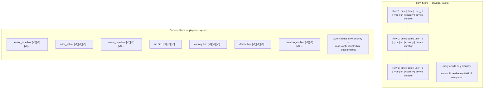
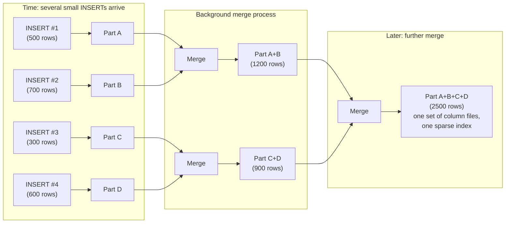
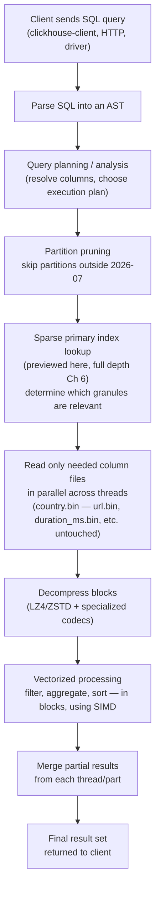

# Architecture & Internals

Chapter 2 gave you the `events` table — `event_time DateTime`, `event_date Date`, `user_id UInt64`, `event_type LowCardinality(String)`, `url String`, `country LowCardinality(String)`, `device LowCardinality(String)`, `duration_ms UInt32` — and the vocabulary to talk about ClickHouse's data types and SQL dialect. You know *what* the table looks like from the outside. This chapter goes under the hood and shows you exactly *how* ClickHouse stores those eight columns on disk and *how* it processes them when you run a query, because every performance characteristic you'll rely on for the rest of this course — sub-second aggregations over billions of rows, 10-30x compression ratios, near-linear scaling with CPU cores — is a direct, mechanical consequence of the storage and execution model described here. Nothing in this chapter is trivia. It is the reason ClickHouse exists.

---

## Learning Objectives

By the end of this chapter, you will be able to:

- Explain, at the byte level, how a columnar table like `events` is laid out on disk, and why that layout is fundamentally different from a row store.
- Explain precisely why `SELECT country, count() FROM events GROUP BY country` reads only the `country` column's bytes, and why a row store cannot do the same without a covering index.
- Describe the general-purpose (LZ4, ZSTD) and specialized (Delta, DoubleDelta, Gorilla, T64) compression codecs ClickHouse uses, and why columnar layout makes them so much more effective.
- Explain vectorized query execution and why processing data in blocks of thousands of values beats the traditional row-at-a-time iterator model for analytical workloads.
- Describe the MergeTree storage model: immutable parts, background merges, and why this design was chosen over in-place row updates.
- Explain partitioning at a conceptual level and how it lets ClickHouse skip entire chunks of data before a query even starts scanning.
- Trace a query's full execution path from client to result, including where parts, granules, and threads enter the picture.
- Explain why merges and mutations are asynchronous, background, heavyweight operations — and connect this back to Chapter 1's honesty about ClickHouse being a poor fit for frequent updates and deletes.

---

## Prerequisites for This Chapter

This chapter builds directly on [Chapter 2: Core Concepts](./02-core-concepts.md). We assume you already know:

- The shape of the `events` table and its columns' data types (`DateTime`, `Date`, `UInt64`, `LowCardinality(String)`, `String`, `UInt32`).
- Basic ClickHouse terminology: databases, tables, and the general idea that ClickHouse is a column-oriented OLAP database, distinct from row-oriented OLTP databases like PostgreSQL.
- Introductory SQL: `SELECT`, `WHERE`, `GROUP BY` at the level Chapter 1 assumed.

If any of that feels shaky, revisit Chapter 2 before continuing — this chapter treats it as settled ground and builds straight up from it.

---

## 1. Columnar Storage in Full Depth

### 1.1 The row store you already know

In a row-oriented database (PostgreSQL, MySQL, MongoDB's underlying document layout), the unit of physical storage is the **row**. All the fields of one event — its time, user, type, URL, country, device, and duration — are written next to each other on disk, one row after another:

```
Row store, physical layout on disk (conceptually):

Page/Block 1:
[ 2026-07-06 10:00:01 | 2026-07-06 | 8831 | "page_view" | "/pricing"  | "US" | "desktop" | 812  ]
[ 2026-07-06 10:00:02 | 2026-07-06 | 4421 | "click"     | "/signup"   | "DE" | "mobile"  | 44   ]
[ 2026-07-06 10:00:02 | 2026-07-06 | 9012 | "page_view" | "/docs"     | "IN" | "desktop" | 2310 ]
[ 2026-07-06 10:00:03 | 2026-07-06 | 8831 | "purchase"  | "/checkout" | "US" | "desktop" | 501  ]
...
```

This layout is excellent for one specific access pattern: "give me everything about event X" — a single row, all columns, fetched together in one disk read. That's the transactional (OLTP) access pattern: look up an order, update a user's profile, insert a new signup. One row, all its fields, read or written as a unit.

### 1.2 The columnar layout

ClickHouse throws that layout away entirely. Instead of storing rows contiguously, it stores each **column** contiguously, in its own file (technically, its own *stream* — more on that below). For the `events` table, conceptually:

```
Column store, physical layout on disk (conceptually):

event_time.bin:   [10:00:01][10:00:02][10:00:02][10:00:03]...
event_date.bin:   [07-06][07-06][07-06][07-06]...
user_id.bin:      [8831][4421][9012][8831]...
event_type.bin:   [page_view][click][page_view][purchase]...
url.bin:          [/pricing][/signup][/docs][/checkout]...
country.bin:      [US][DE][IN][US]...
device.bin:       [desktop][mobile][desktop][desktop]...
duration_ms.bin:  [812][44][2310][501]...
```

Every value in `country.bin` belongs to a different logical row, but they now sit next to each other on disk, packed tightly, with nothing from `url` or `duration_ms` interleaved between them. Row `N`'s `country` value and row `N+1`'s `country` value are physical neighbors. This single structural decision is the root of essentially every ClickHouse performance property covered in this chapter.

### 1.3 Why this matters: the `GROUP BY country` example

Consider the query you'll write dozens of times in this course:

```sql
SELECT country, count()
FROM events
GROUP BY country;
```

To answer this, ClickHouse needs exactly two things per row: `country`, and the fact that the row exists (for the count). It needs **nothing** from `event_time`, `user_id`, `event_type`, `url`, `device`, or `duration_ms`.

In the columnar layout, this maps directly onto physical reality: ClickHouse opens `country.bin` (and its associated mark/index files, covered in Chapter 6), streams through its bytes sequentially, and never touches `url.bin`, `duration_ms.bin`, or any of the other five column files at all. If `events` has 8 columns of roughly equal byte-width, this query does something on the order of **one-eighth of the total table's I/O** — and in practice often far less, once you factor in that `country` is `LowCardinality` and compresses far better than, say, `url` (Section 2).

Now consider the same query against the row store from Section 1.1. Every row on every page contains `country` interleaved with `url`, `duration_ms`, and everything else. There is no way to read "just the `country` bytes" — the disk has no concept of a `country`-only region. To get `country` for row 1, the storage engine must read the entire row (or at minimum, the whole page containing it), because `country` and `url` are physically fused together at the byte level. The database ends up pulling the *entire table's* bytes off disk — `url` strings, `duration_ms` integers, `event_time` timestamps and all — just to extract one 2-byte field from each row.

### 1.4 The row-store escape hatch, and why it isn't really one

Experienced PostgreSQL/MySQL users will immediately object: "but I'd add a covering index on `country`!" That's true, and it helps — a B-tree index on `(country)` (or a covering index including `country` and nothing else) lets the row store answer `COUNT(*) GROUP BY country`-style queries by scanning a much smaller structure instead of the full table.

But notice what that requires: **you must have anticipated this exact query shape in advance** and built a dedicated index for it. If tomorrow's dashboard needs `GROUP BY device` instead, you need another covering index. Needs `GROUP BY event_type, device`? Another one. Every new analytical angle on the data needs its own bespoke index, each of which duplicates data, must be maintained on every write, and only helps the specific query shapes it was built for.

ClickHouse's columnar layout gives you this property **for every column, for free, with no index to design**, because the separation-by-column *is* the storage layout, not a bolt-on structure over a row-oriented base. That's the fundamental, structural difference — not "ClickHouse has cleverer indexes," but "ClickHouse's disk layout already matches what analytical queries need, before you write a single index."

### 1.5 Diagram: row store vs. column store



### 1.6 Streams, not just files

One refinement worth knowing now (Chapter 6 goes deeper): a single logical column can map to more than one physical stream. A `Nullable(String)` column, for example, is actually stored as *two* streams — a `.null.bin` stream of bits marking which values are null, and a `.bin` stream of the actual string data. An `Array(String)` column stores stream(s) for the array's flattened data plus an "offsets" stream marking where each row's array ends. `LowCardinality(String)` — used for `event_type`, `country`, and `device` in the `events` table — stores a dictionary of unique strings plus a stream of small integer indexes into that dictionary. You don't need the full mechanics yet (Chapter 4 covers `LowCardinality` and friends in depth); the point for this chapter is just that "one column, one file" is a simplification — the real unit is "one column, one or more streams," each stored contiguously, and each independently readable without touching the others.

---

## 2. Compression: Why Columns Compress So Much Better Than Rows

### 2.1 Similar values sit next to each other

Compression algorithms work by finding and exploiting *redundancy* — repeated patterns, small ranges of values, predictable sequences. Redundancy is far easier to find when similar values are physically adjacent.

Look again at `country.bin`: `[US][DE][IN][US][US][DE]...`. Across millions of rows, this column likely has a few dozen distinct values at most (there are under 250 countries), each repeated an enormous number of times. Sitting next to each other in one contiguous stream, a compressor can represent long runs of "US" or "DE" extremely cheaply.

Now imagine trying to compress that same `country` data *while it's interleaved* with `url` strings, `event_time` timestamps, and `duration_ms` integers, the way it sits in a row store. The compressor sees `US`, then a URL, then a timestamp, then a number, then `DE`, then another unrelated URL... The redundancy in `country` is still there in principle, but it's buried under unrelated bytes from six other columns, wrecking the local patterns most compression algorithms rely on. Row stores can and do compress (page-level compression exists), but it is compressing much noisier, more heterogeneous byte sequences than a pure `country.bin` stream ever is.

This is the second pillar of columnar performance, right alongside I/O reduction from Section 1: **columnar layout doesn't just let you skip irrelevant columns — it makes the columns you do read dramatically smaller on disk**, which means less I/O even when a column *is* needed.

### 2.2 General-purpose codecs: LZ4 and ZSTD

ClickHouse compresses column data in blocks, using a codec you can choose per column (or accept the sensible default). The two general-purpose codecs you'll use most:

- **LZ4** (the default): a very fast compressor with a moderate compression ratio. It prioritizes decompression speed above almost everything else, which matters enormously for ClickHouse — every query that reads a column has to decompress it first, so a slow codec directly taxes every single query. LZ4 is the right choice when you want speed and don't want to think hard about it.
- **ZSTD**: a modern compressor that trades some CPU time for a noticeably better compression ratio than LZ4, at various configurable levels. It's a good choice for columns you write once and query relatively rarely, or when disk space/network transfer cost matters more than shaving the last microseconds off decompression, or for cold/archival data.

Choosing between them is a real, per-column engineering decision, not a formality — Chapter 4 and Chapter 13 return to this trade-off with concrete guidance.

### 2.3 Specialized codecs: Delta, DoubleDelta, Gorilla, T64

Beyond general-purpose compression, ClickHouse ships codecs that exploit *known structure* in specific kinds of data, and can be layered before a general-purpose codec for a combined effect:

- **Delta**: instead of storing raw values, stores the *difference* between each value and the previous one. This is a natural fit for `event_time` in the `events` table: consecutive events inserted close together in time have timestamps that differ by small numbers of seconds, so storing `+1, +0, +2, +1...` instead of full Unix timestamps produces much smaller numbers, which compress far better afterward.
- **DoubleDelta**: takes the delta of the deltas — ideal for sequences that increase at a roughly constant rate, such as monotonically increasing IDs or evenly spaced time series ticks. If the "delta between deltas" is usually zero or tiny, DoubleDelta collapses long stretches of data to almost nothing.
- **Gorilla**: designed for floating-point time-series data (originally from Facebook's Gorilla in-memory TSDB), it exploits the fact that consecutive floating-point metric readings (CPU load, temperature, latency) tend to be very close to each other, using XOR-based encoding to represent that similarity compactly. Relevant if you extend the `events` schema with, say, a `response_time_seconds Float64` column.
- **T64**: transposes a block of 64-bit integers into a bit matrix and truncates unused high bits when the actual value range is small — effective for integer columns like `user_id` or `duration_ms` where values don't use the full width of their declared type.

You don't need to memorize codec internals yet — the conceptual point matters more: **ClickHouse gives you the tools to compress each column according to the shape of its own data**, rather than treating all bytes identically the way a generic file compressor would. A `DateTime` column compresses very differently, and best, with a different strategy than a free-text `url` column — and because columns are stored separately, ClickHouse can apply a different codec to each one without affecting its neighbors at all. This, again, is only possible *because* of columnar storage: in a row store, you cannot apply a time-series-aware delta codec to just the timestamp bytes of a row without also somehow dealing with the unrelated string and integer bytes sitting next to it.

### 2.4 Compression ratio is I/O reduction is speed

It's worth stating the causal chain explicitly, because it's easy to think of compression as merely a disk-space optimization:

**smaller bytes on disk → fewer bytes physically read per query → less time spent on disk/network I/O → faster queries.**

A `country` column that compresses 20x means a query touching that column reads roughly 1/20th the bytes it would uncompressed. Compression in ClickHouse is not primarily about saving storage cost (though it does that too) — it is a direct multiplier on query throughput, working hand-in-hand with the "only read the columns you need" property from Section 1.

---

## 3. Vectorized Query Execution

### 3.1 The traditional model: Volcano/iterator, one row at a time

Many traditional database engines (including classic row-store implementations) execute queries using what's called the **Volcano** or iterator model: each operator in a query plan (a filter, a join, an aggregation) exposes a `next()` method that produces exactly *one row* at a time, pulled on demand by the operator above it. A `WHERE` filter calls `next()` on its child, checks one row against the predicate, and either passes it up or asks for another. An aggregation calls `next()` in a loop, updating its running state one row per call.

This model is elegant and composable, but it's expensive at the CPU level for analytical workloads: every single row incurs the overhead of a function call, virtual dispatch (many of these engines use polymorphic operator interfaces), and branch prediction resets, for what is often a trivially cheap piece of work (comparing one integer, adding one number). When you're processing billions of rows, that per-row overhead — not the actual arithmetic — dominates the runtime.

### 3.2 ClickHouse's model: process a block, not a row

ClickHouse instead processes data in **blocks** — batches of typically a few thousand values per column at a time — pushed through the query pipeline together. An aggregation operator doesn't call `next()` once per row; it receives a block containing (say) 8,192 `country` values and 8,192 corresponding "increment count" operations, and processes the *entire block* in one call, using a tight loop over a contiguous array of values.

This has two compounding benefits:

1. **Amortized overhead.** The cost of a function call, branch, or dispatch is now paid once per 8,192 rows instead of once per row — a roughly four-orders-of-magnitude reduction in per-row bookkeeping cost.
2. **SIMD (Single Instruction, Multiple Data).** Because each block is a contiguous array of same-typed values (exactly what columnar storage already gives you — see the throughline back to Section 1), modern CPU vector instructions can operate on multiple values *in a single CPU instruction*. Summing `duration_ms` for a block of `UInt32` values, for example, can be done 4, 8, or 16 values at a time depending on the CPU's SIMD width (SSE/AVX2/AVX-512), rather than one add instruction per value. The compiler and ClickHouse's hand-tuned code paths exploit this aggressively for exactly the kind of arithmetic-heavy, scan-heavy work (`count()`, `sum()`, `avg()`, filters, comparisons) that analytical queries are made of.

### 3.3 Why this is a natural fit for columnar storage

Notice that vectorized execution and columnar storage reinforce each other. A block of `country` values pulled straight off disk in the columnar layout is *already* a contiguous, densely packed array of the same type — precisely the shape vectorized/SIMD processing wants. A row store would have to first "shred" rows apart, gathering the `country` field out of scattered row structures into a temporary contiguous buffer, before it could even attempt the same trick — an extra, costly step that columnar storage skips entirely because the data was already contiguous by column to begin with.

This is why you'll sometimes see ClickHouse's execution model summarized as simply "vectorized columnar execution" — the two ideas are designed as one system, not two independent optimizations that happen to be bolted together.

---

## 4. The MergeTree Storage Model, In Depth

Everything covered so far describes *how a column's data is laid out and read*. This section covers *how that data actually gets written and organized on disk over time* — the MergeTree engine, which is the default and most important table engine family in ClickHouse (Chapter 5 covers the full family; this section builds the core mental model).

### 4.1 Parts: the unit of storage

When you run an `INSERT` against a `MergeTree`-family table like `events`, ClickHouse does not modify any existing on-disk structure. Instead, it writes a brand-new, self-contained directory called a **part**. A part contains:

- One file (stream) per column — `event_time.bin`, `user_id.bin`, `country.bin`, and so on, compressed as described in Section 2.
- The sparse primary index for just that part (previewed here, full depth in Chapter 6).
- Small metadata files: checksums, column list, the count of rows, the partition this part belongs to, and more.

Crucially, **a part, once written, is immutable.** ClickHouse never opens an existing part's `country.bin` and rewrites bytes in the middle of it to reflect an update. It only ever writes whole new parts, and (as covered next) merges existing parts into new, larger parts — data inside a written part is never edited in place.

### 4.2 Why immutable parts?

This design decision cascades into most of MergeTree's behavior, so it's worth understanding *why*, not just *what*:

- **Append-friendly writes.** Writing a brand-new directory of sequential files is about as fast and simple as storage I/O gets — no seeking into the middle of existing files, no in-place patching, no locking of shared structures mid-write.
- **No in-place row updates needed.** Because nothing already on disk is ever mutated, ClickHouse sidesteps an enormous amount of complexity that row stores deal with: write-ahead logging for crash-safe in-place updates, MVCC row versioning, lock manager contention on hot rows. A part is either fully written and durable, or it doesn't exist yet — there's no partially-updated state to reason about.
- **Simplified concurrency.** Readers can safely read an existing part while new parts are being written or merged elsewhere, with no risk of reading a half-updated row, because existing parts are never touched. Multiple `INSERT`s can proceed concurrently, each producing its own independent part, without contending for a shared, mutable structure.

This is the same fundamental trade-off you'll recognize from log-structured storage engines elsewhere in the database world: give up cheap in-place mutation, gain simple, fast, highly concurrent appends — a trade that is exactly right for an analytical system whose dominant operation is "ingest a lot of new data, then read huge ranges of it," and exactly wrong for a system whose dominant operation is "update this one row right now" (that system is PostgreSQL, and Chapter 1 already told you as much).

### 4.3 Merges: where the "MergeTree" name comes from

Immutable, ever-accumulating parts have an obvious problem: if every `INSERT` produces a new part, a busy table could accumulate thousands of small parts, and every query would need to check *every part* for relevant data — each part having its own separate column files, its own separate sparse index, its own separate everything. Query performance would degrade steadily as part count grows, and the filesystem itself starts to strain under enormous numbers of small files.

ClickHouse solves this with a **background merge process**, running continuously and automatically: it periodically selects a set of existing parts (typically smaller, older ones) and merges them into a single new, larger part, containing the union of their rows, re-sorted according to the table's `ORDER BY` key, with column files rewritten fresh and freshly compressed. Once the merge completes and the new merged part is confirmed durable, the old input parts are marked inactive and eventually deleted.

This is a genuine background process — it consumes CPU and I/O on the server independently of any client query, runs on its own schedule based on heuristics (roughly: prefer merging parts of similar size, prioritize keeping total part count low), and there is no way to force ClickHouse to merge everything into one part on every insert (you *can* manually trigger merging with `OPTIMIZE TABLE ... FINAL`, used in this chapter's hands-on exercise, but this is a heavyweight operation you'd rarely run routinely in production).

This merge behavior is the origin of the whole engine family's name: **MergeTree** — a tree (well, a flat collection, but organized and periodically consolidated) of parts, continuously merged.

### 4.4 The direct consequence: small inserts create small-part problems

Here is the practical, load-bearing takeaway this section has been building to, and one you'll see reinforced with concrete tuning guidance in Chapter 5 and Chapter 7: **every `INSERT` statement creates at least one new part, regardless of how many rows it contains.** Insert one row, and you get one part holding one row — with the full overhead of a directory, per-column files, and index metadata, just to hold that single row. Insert that way a thousand times a second, and you create a thousand tiny parts a second, far faster than the background merge process can consolidate them.

The result, in practice: query slowdowns (many tiny parts to check instead of a few large ones), filesystem pressure, and eventually ClickHouse actively refusing new inserts with a "too many parts" error as a self-protection mechanism, until merges catch up. This is precisely why Chapter 7's best-practice guidance on batch inserts exists, and why it's introduced here as a direct architectural consequence, not an arbitrary rule: **batch your inserts into the fewest, largest statements your application can reasonably buffer for** (thousands to tens of thousands of rows per `INSERT` is a common target), because doing so produces fewer, larger, healthier parts from the start, instead of relying entirely on background merges to clean up after many tiny ones.

### 4.5 Diagram: inserts creating parts, merges consolidating them



Each merge step rewrites full column files for the merged rows (re-sorted by the table's `ORDER BY` key) and produces one coherent new part; the smaller inputs are deleted once the merge is confirmed safe.

---

## 5. Partitioning, Conceptually

Partitioning is a *physical* segmentation of parts based on an expression you choose — most commonly a date truncation such as:

```sql
CREATE TABLE events
(
    event_time  DateTime,
    event_date  Date,
    user_id     UInt64,
    event_type  LowCardinality(String),
    url         String,
    country     LowCardinality(String),
    device      LowCardinality(String),
    duration_ms UInt32
)
ENGINE = MergeTree
PARTITION BY toYYYYMM(event_date)
ORDER BY (event_type, event_time);
```

`PARTITION BY toYYYYMM(event_date)` tells ClickHouse: every part belongs to exactly one calendar month, determined by the `event_date` of the rows it holds. Concretely, rows from July 2026 and rows from August 2026 are *never* mixed into the same part — ClickHouse maintains entirely separate sets of parts (and separate ongoing background merges) per partition.

The payoff comes at query time: if a query includes a filter on the partitioning expression — for example `WHERE event_date >= '2026-07-01' AND event_date < '2026-08-01'` — ClickHouse can determine, before reading a single row, which partitions are even relevant, and skip every part belonging to excluded partitions entirely. A query scoped to "this month" against a table holding three years of `events` data physically touches only one month's worth of parts; the other 35 months of parts are never opened at all.

This chapter only needs you to hold the concept: **partitioning is about skipping large, physically separated chunks of irrelevant data before a scan even begins**, layered on top of everything Sections 1-4 already gave you (column skipping, compression, vectorized processing, and part-based storage). Partition key selection, the trade-offs of too many or too few partitions, and how partitioning interacts with the sparse primary index are full topics reserved for Chapter 6.

---

## 6. The Full Query Execution Flow, End to End

Pulling everything in this chapter together, here is what actually happens when you run:

```sql
SELECT country, count()
FROM events
WHERE event_date >= '2026-07-01' AND event_date < '2026-08-01'
GROUP BY country
ORDER BY count() DESC;
```



Walking through each stage:

1. **Client → parsing.** The SQL text arrives over the native protocol or HTTP and is parsed into an abstract syntax tree.
2. **Planning/analysis.** ClickHouse resolves which table and columns are involved (here: `country`, `event_date` for filtering — `count()` needs no specific column), and builds an execution plan.
3. **Partition pruning.** Because the query filters on `event_date`, and the table is `PARTITION BY toYYYYMM(event_date)`, ClickHouse immediately discards every partition outside July 2026 — no parts from other months are even opened.
4. **Sparse index lookup.** Within the surviving partition's parts, ClickHouse consults each part's sparse primary index to narrow down which **granules** (small physical row ranges — full mechanics in Chapter 6) are worth reading, further shrinking the scan.
5. **Parallel column reads.** For the granules that remain, ClickHouse reads only the column files actually needed by the query — here, `country.bin` (for grouping) and enough of `event_date.bin` to confirm the filtered range. `url.bin`, `duration_ms.bin`, `device.bin`, and the rest are never opened, exactly as Section 1 described. This reading happens in parallel across multiple threads, since different parts/granule ranges are independent of each other.
6. **Decompression.** Each column block read off disk is decompressed (Section 2) before use.
7. **Vectorized processing.** Filtering and aggregation happen on blocks of thousands of values at a time, using SIMD-friendly code paths (Section 3) — each thread computes partial `country → count` totals for the granules it was assigned.
8. **Merging results.** The partial per-thread, per-part aggregation states are combined into one final result.
9. **Return to client.** The final, small result set (one row per distinct country) is serialized and sent back.

Every stage in this pipeline exists *because* of a design decision covered earlier in this chapter — parts and partitions from Section 4-5 determine what's even scanned; columnar layout from Section 1 determines what's read within a scan; compression from Section 2 determines how many bytes that read actually costs; and vectorized execution from Section 3 determines how fast the CPU work on those bytes runs. None of these stages is independently responsible for ClickHouse's speed — the combination is.

---

## 7. Background Operations: Merges and Mutations

### 7.1 Merges, revisited as a background cost

Section 4.3 introduced merges as the mechanism that consolidates small parts into larger ones. It's worth stating plainly: merges are **asynchronous background work**. They are not triggered synchronously by your `INSERT`, and they are not instantaneous — merging large parts can take real wall-clock time and consumes real CPU and disk I/O on the server, competing with your queries for resources. ClickHouse schedules merges using internal heuristics to try to keep this cost manageable, but on a heavily-loaded server with high insert throughput, merge activity is a real, monitorable, sometimes-tunable operational concern (Chapter 13 covers watching and tuning this via system tables).

### 7.2 Mutations: `ALTER UPDATE` / `ALTER DELETE`

Given that parts are immutable, what happens when you run:

```sql
ALTER TABLE events DELETE WHERE user_id = 8831;
```

ClickHouse cannot flip a bit in an existing part to mark that row deleted the way a row store's MVCC engine might. Instead, this kind of statement — called a **mutation** — is handled by scheduling a background job that reads through every affected existing part, rewrites entirely new parts with the matching rows filtered out (for `DELETE`) or updated (for `UPDATE`), and then swaps the new parts in for the old ones, just like a merge. `ALTER TABLE ... UPDATE` works the same way: not an in-place field edit, but a rewrite of whole parts with the new values baked in.

This means mutations are:

- **Asynchronous** — the `ALTER` statement returns quickly, having only *scheduled* the mutation; the actual rewrite happens in the background, and you can track its progress via `system.mutations`.
- **Heavyweight** — a mutation affecting a large table can mean rewriting a large fraction of that table's on-disk data, which takes real time and I/O, proportional to the size of the *affected parts*, not just the number of rows logically changed.
- **Eventually consistent with reads** — until the mutation finishes, queries continue to see old data (or in some configurations, a mix), because the old parts are still valid until the rewrite completes and swaps them out.

This is the mechanical, precise version of a claim Chapter 1 already made in plain language: **ClickHouse is a poor fit for workloads dominated by frequent single-row updates or deletes.** Now you know exactly why — every such operation, however small logically, triggers a background rewrite of whole parts, competing with merges and queries for the same disk and CPU resources, and never happening instantly the way a transactional database's in-place row update does. If your application needs frequent per-row updates, that's a signal to reach for a different engine variant (`ReplacingMergeTree`, `CollapsingMergeTree` — Chapter 5) or a different database entirely for that specific workload, not to fight MergeTree's grain.

---

## Real-World Scenario

**Setup:** You're the engineer on call when a product manager asks, reasonably: "Our dashboard runs a query that scans 500 million rows of event data and returns in under a second. The same query pattern against our old PostgreSQL reporting replica used to take three to four minutes. What changed? Is this magic?"

It isn't magic — walk them through the concrete reasoning, in order:

1. **Columnar layout eliminates most of the I/O before anything else happens.** The dashboard query is something like `SELECT country, device, avg(duration_ms) FROM events WHERE event_date >= today() - 7 GROUP BY country, device`. It touches four of the table's eight columns (`event_date`, `country`, `device`, `duration_ms`). In PostgreSQL's row layout, every one of those 500 million rows had to be read in full — including `url` (often the largest field, sometimes hundreds of bytes) and `event_time`, `user_id`, and `event_type`, none of which the query needs. ClickHouse reads only the four needed column files; the other four are never opened. That alone is close to a 2x-plus reduction in bytes read, before compression is even considered, and grows further if `url` dominates row width.

2. **Compression multiplies that reduction again.** `country` and `device` are `LowCardinality(String)` with only a few dozen and a handful of distinct values respectively — they compress by an order of magnitude or more, because a compressor sees long, tightly clustered runs of the same small set of values (Section 2.1). `duration_ms`, a `UInt32`, compresses well too, especially with a codec like T64 if its actual range is narrower than 32 bits. The bytes ClickHouse actually pulls off disk for those four columns, across 500 million rows, might be a few gigabytes rather than tens of gigabytes.

3. **Partition and index pruning shrink the scan further.** The `WHERE event_date >= today() - 7` filter, combined with `PARTITION BY toYYYYMM(event_date)`, lets ClickHouse discard essentially all partitions outside the last week or two immediately (Section 5) — the "500 million rows" framing describes the whole table, not necessarily what's actually scanned once partition pruning applies. Within the surviving partitions, the sparse primary index (previewed in Section 6, full depth Chapter 6) narrows things further to only the relevant granules.

4. **Vectorized execution makes the CPU-side work nearly free by comparison.** Once the (now much smaller, already-decompressed) blocks of `country`, `device`, and `duration_ms` values are in memory, ClickHouse doesn't loop row by row to compute the average — it processes blocks of thousands of values at a time using SIMD instructions (Section 3), across multiple CPU cores in parallel, each handling a different part or granule range. PostgreSQL's row-at-a-time iterator model, even with an index-assisted scan, pays per-row overhead that dominates at this scale; ClickHouse's vectorized engine barely notices the arithmetic.

5. **The parts model kept ingestion from ever blocking this query.** All of this works smoothly because the `events` table's data arrived as well-batched inserts (Section 4), producing a manageable number of parts that background merges have consolidated into large, efficient units — rather than as millions of tiny single-row parts that would themselves have degraded scan performance.

The honest summary for the PM: it's not one trick, it's four multiplicative effects — less I/O from column skipping, fewer bytes per column from compression, less scanned data from partition/index pruning, and far less CPU overhead from vectorized execution — stacked on top of each other. Each one alone might be a 2-10x win; together, on a query shaped like this one, a 100-1000x speedup over a row store handling the identical logical query is entirely ordinary, not exceptional.

---

## Best Practices

- **Batch your inserts.** Because every `INSERT` creates at least one new part (Section 4.4), send data in batches of thousands to tens of thousands of rows wherever your application can buffer that much, rather than issuing one `INSERT` per event. This is the single highest-leverage operational habit for MergeTree health.
- **Choose compression codecs deliberately, not by default alone.** LZ4 (the default) is right for most columns most of the time, but a monotonic or near-monotonic column like a timestamp or auto-incrementing ID is a strong candidate for `Delta` or `DoubleDelta`, and cold, rarely-queried columns are strong candidates for `ZSTD` at a higher level.
- **Design queries — and mentally verify — around "which columns does this actually touch?"** Since column skipping is where most of the I/O savings come from, avoid `SELECT *` in production analytical queries, and be conscious that adding an unnecessary wide column (like `url`) to a query's `SELECT` or `WHERE` list defeats part of the columnar advantage for that query.
- **Treat `ALTER UPDATE`/`ALTER DELETE` as rare, heavyweight, asynchronous maintenance operations, not routine application logic.** If your workload needs frequent per-row updates or deletes, that's a signal to model the table differently (Chapter 5's `ReplacingMergeTree`/`CollapsingMergeTree`) rather than to fight MergeTree's immutable-part design.
- **Let background merges do their job — don't fight them.** Avoid manually forcing `OPTIMIZE TABLE ... FINAL` as a routine, scheduled operation in production; it's a heavyweight, resource-intensive rewrite meant for occasional maintenance or demonstration (as in this chapter's exercise), not a substitute for healthy batch-insert habits.
- **Use `PARTITION BY` for genuine physical segmentation you'll filter on, not as a general-purpose grouping tool.** A date-based partition key that matches how your queries actually filter (e.g., "last 7 days," "this month") is what enables the partition-pruning benefit from Section 5; an overly fine-grained or query-irrelevant partition key adds overhead without buying you skip benefits.

---

## Common Mistakes

- **Doing frequent single-row (or tiny-batch) inserts.** This is the single most common MergeTree misuse: each insert creates a new part, part counts explode, query performance degrades as more parts must be checked, and ClickHouse eventually throws a "too many parts" error to protect itself.
- **Expecting `UPDATE`/`DELETE` to be instantaneous, in-place operations like in a transactional database.** They are asynchronous, background, whole-part-rewriting mutations (Section 7.2) — assuming otherwise leads to confusing "why hasn't my delete taken effect yet" debugging sessions and underestimated resource impact on large tables.
- **Ignoring partition design and losing the ability to skip irrelevant data.** A poorly chosen (or absent) partition key means queries that logically only need "this week's data" end up scanning far more than necessary, silently giving up one of the biggest wins covered in this chapter.
- **Using `SELECT *` habitually in analytical queries.** This defeats column skipping outright — you pay to read, decompress, and process every column, even ones the actual business logic never uses.
- **Manually running `OPTIMIZE TABLE ... FINAL` routinely "just to be safe."** This forces an expensive, full-table merge that competes heavily for CPU and I/O; it's a diagnostic/maintenance tool, not something to schedule as a cron job on a production table under normal circumstances.
- **Assuming compression is "free" and picking codecs at random, or never picking them at all.** While ClickHouse's defaults are reasonable, treating codec choice as irrelevant leaves real compression-ratio (and therefore I/O and speed) gains on the table for columns with obviously exploitable structure, like timestamps or slowly-varying metrics.

---

## Summary

- ClickHouse stores each column contiguously in its own file/stream, not interleaved row-by-row — this columnar layout is why a query touching 2 of 8 columns physically reads only those 2 columns' bytes, something a row store cannot do without a purpose-built covering index.
- Columnar layout also makes compression dramatically more effective, because similar values (like the handful of distinct `country` values) sit physically adjacent, giving both general-purpose codecs (LZ4, ZSTD) and specialized codecs (Delta, DoubleDelta, Gorilla, T64) far more redundancy to exploit — and every byte of compression saved is a byte of I/O saved.
- ClickHouse processes data in vectorized blocks of thousands of values using SIMD CPU instructions, instead of the traditional row-at-a-time Volcano iterator model, amortizing per-row overhead and exploiting the same contiguous, homogeneous layout that columnar storage already provides.
- The MergeTree engine stores data as immutable **parts**; every `INSERT` creates a new part, and a background **merge** process consolidates smaller parts into larger ones over time — a design chosen for append-friendly writes, no in-place mutation, and simplified concurrency, at the cost of needing healthy batch-insert habits to avoid "too many parts."
- `PARTITION BY` (commonly on a date expression) physically segments parts so that queries with a matching filter can skip entire partitions before scanning even begins — full depth in Chapter 6.
- A query's execution flow moves from parsing/planning, through partition pruning and sparse-index-driven granule selection, to parallel, columnar, vectorized reads, and finally a merge of partial results — every stage benefiting from a design decision covered in this chapter.
- Merges and mutations (`ALTER UPDATE`/`ALTER DELETE`) are both asynchronous, background, whole-part-rewriting operations, not instant in-place edits — the precise mechanical reason ClickHouse is a poor fit for update/delete-heavy workloads.

---

## Knowledge Check

1. Explain, in your own words, why `SELECT country, count() FROM events GROUP BY country` reads only the `country` column's bytes in ClickHouse, and why a row-oriented database cannot do the same without a dedicated covering index.
2. Why does columnar storage make general-purpose compression codecs like LZ4 and ZSTD more effective, independent of any specialized codec?
3. Name one specialized compression codec covered in this chapter and describe the specific kind of column data it's designed to exploit.
4. What is a "part" in the MergeTree engine, and what event always creates a new one?
5. Why was immutability of parts chosen as a design principle, and what does ClickHouse give up (and gain) by choosing it over in-place row updates?
6. A teammate runs `ALTER TABLE events DELETE WHERE event_type = 'test'` and asks why the row count in a subsequent `SELECT` hasn't changed a few seconds later. What's the accurate explanation?

---

## Hands-On Exercise

Using `clickhouse-client` against the `events` table from Chapter 2, observe parts and merges directly.

1. **Insert data in several small batches**, deliberately creating multiple parts:

   ```sql
   INSERT INTO events (event_time, event_date, user_id, event_type, url, country, device, duration_ms)
   VALUES (now(), today(), 1001, 'page_view', '/home', 'US', 'desktop', 820);

   INSERT INTO events (event_time, event_date, user_id, event_type, url, country, device, duration_ms)
   VALUES (now(), today(), 1002, 'click', '/pricing', 'DE', 'mobile', 55);

   INSERT INTO events (event_time, event_date, user_id, event_type, url, country, device, duration_ms)
   VALUES (now(), today(), 1003, 'purchase', '/checkout', 'IN', 'desktop', 410);
   ```

   Run each `INSERT` as a separate statement (not batched together) so each produces its own part.

2. **Inspect `system.parts` to see the parts you just created:**

   ```sql
   SELECT
       table,
       partition,
       name,
       active,
       rows,
       bytes_on_disk
   FROM system.parts
   WHERE table = 'events' AND active
   ORDER BY modification_time;
   ```

   You should see multiple distinct part names (each ClickHouse part directory name encodes its partition, a min/max block number, and a merge level), each holding only a handful of rows — direct, visible evidence of Section 4.4's "every insert creates a part."

3. **Force a merge with `OPTIMIZE TABLE ... FINAL`:**

   ```sql
   OPTIMIZE TABLE events FINAL;
   ```

   This is the heavyweight, on-demand version of the background merge process from Section 4.3 — normally ClickHouse would do this automatically, on its own schedule, without being asked.

4. **Re-check `system.parts`** with the same query from step 2. You should now see the small parts you created marked `active = 0` (or gone, depending on timing) and a single new, larger active part containing the union of all rows you inserted — the merge consolidation from Section 4.3-4.5, made concrete on your own table.

5. **Optional:** repeat steps 1-2 with 20-30 small inserts instead of 3, and watch how part count grows before you run `OPTIMIZE`, to get a visceral feel for why unbatched inserts are an operational problem at real production insert rates.

---

## Further Reading

- [ClickHouse Docs: MergeTree Table Engine](https://clickhouse.com/docs/engines/table-engines/mergetree-family/mergetree) — the authoritative reference for the engine covered in Section 4.
- [ClickHouse Docs: How ClickHouse Stores Data](https://clickhouse.com/docs/parts) — the official deep dive on parts, part directory naming, and merges.
- [ClickHouse Docs: Column Compression Codecs](https://clickhouse.com/docs/sql-reference/statements/create/table#column-compression-codecs) — the full list and syntax for codecs mentioned in Section 2, including Delta, DoubleDelta, Gorilla, and T64.
- [ClickHouse Docs: OPTIMIZE Statement](https://clickhouse.com/docs/sql-reference/statements/optimize) — details on forcing merges, used in this chapter's hands-on exercise.
- [ClickHouse Docs: Mutations](https://clickhouse.com/docs/sql-reference/statements/alter#mutations) — the mechanics of `ALTER UPDATE`/`ALTER DELETE` covered in Section 7.2.

---

<div style="display:flex;justify-content:space-between;align-items:center;">
  <a href="./02-core-concepts.md">← Previous: Core Concepts</a>
  <a href="./00-index.md">🏠 Index</a>
  <a href="./04-data-types-and-schema-design.md">Next: Data Types & Schema Design →</a>
</div>
