# Data Types & Schema Design

Chapter 2 surveyed ClickHouse's data types the way a phrasebook surveys a language: enough to recognize `UInt32`, `String`, and `DateTime` when you see them, and enough to write a working `CREATE TABLE` statement for the `events` table you've been using as a running example. Chapter 3 then went underneath the SQL, into parts, columns-as-files, and the codecs that compress each column on disk. This chapter fuses those two threads. Its entire premise is a single idea that beginners coming from row-oriented databases consistently underestimate: **in a columnar database, the data type you choose for a column is not a cosmetic detail — it is a direct, measurable input to storage size, compression ratio, and query speed.** In PostgreSQL, using `BIGINT` instead of `SMALLINT` for a status code column is mostly a rounding error, buried inside rows that also contain a dozen other columns and per-row overhead. In ClickHouse, that same column is compressed and read as one long, homogeneous file — so every byte you don't need is a byte that gets scanned, decompressed, and paid for in latency, on every query that touches it, forever. Schema design here is not a data-modeling nicety; it is a performance lever as significant as engine choice or indexing, arguably more so, because the whole database is downstream of the columns you defined.

---

## Learning Objectives

By the end of this chapter, you will be able to:

- Choose the narrowest correct integer or floating-point type for a column, and explain in storage-and-compression terms why that choice matters more in ClickHouse than in a row store.
- Decide when to use `Decimal` instead of `Float64` for exact numeric arithmetic (money, quantities), and explain the rounding-error risk of getting this wrong.
- Explain what `LowCardinality(String)` does at the storage level (dictionary encoding), and apply a concrete rule of thumb for when to wrap a string column in it.
- Choose correctly among `Date`, `Date32`, `DateTime`, and `DateTime64(precision)` for a given time-tracking requirement, including timezone handling.
- Explain the real storage cost of `Nullable(T)` and know when a sentinel default is the more idiomatic ClickHouse choice.
- Model semi-structured or one-to-many data using `Array(T)`, `Nested`, or `Map(K, V)` instead of reaching for a joined table out of row-store habit.
- Select an appropriate compression codec (`DoubleDelta`, `Delta`, `ZSTD`, `LZ4`) for a given column's data pattern, and redesign a naively-typed table into an optimized one.

---

## Prerequisites for This Chapter

This chapter builds directly on two earlier chapters, and assumes you're comfortable with both:

- **[Chapter 2: Core Concepts](./02-core-concepts.md)** — you should already recognize ClickHouse's basic type names (`UInt*`, `Int*`, `Float*`, `String`, `Date`, `DateTime`, `Array`) and be able to read the `events` table's `CREATE TABLE` statement without translation. This chapter reuses that same `events` table throughout, so keep its shape in mind: an event stream with an `event_id`, `event_time`, `user_id`, `event_type`, `country`, `device`, `url`, `status_code`, and `duration_ms`.
- **[Chapter 3: Architecture & Internals](./03-architecture-and-internals.md)** — specifically the sections on columnar file layout and general-purpose compression (`LZ4`, `ZSTD`). This chapter assumes you understand *that* each column is stored as its own compressed file inside a part, and now goes deep on *which* codec and *which* type to pick for a given column, and why.

If either of those feels shaky, a quick re-read before continuing will pay for itself — nearly everything below is expressed in terms of "how does this type/codec choice affect the bytes actually written to disk and read back at query time."

---

## 1. Why Data Types Matter More in a Column Store

Picture a table with 50 columns and one billion rows. In a row store, a query that touches 3 of those columns still has to read every row in full — the storage engine can't cheaply skip the other 47 columns, because they're interleaved with the ones you wanted, all packed into the same row. Whether `status_code` is stored as a 2-byte `SMALLINT` or an 8-byte `BIGINT` barely registers: it's 6 extra bytes buried inside a row that might already be 500+ bytes wide with all its neighboring columns and per-row overhead.

In a column store, that same table is physically 50 separate column files. A query that touches 3 columns reads only those 3 files — and each file is a long, uninterrupted run of values of a single type. Two consequences follow directly from this:

1. **Every byte of column width is now visible and repeated across every row.** A `UInt64` column of a billion status codes is *always* at least 8 GB of raw data before compression, no matter what else the table contains. A `UInt8` column holding the same values is 1 GB. That 8x difference in raw size doesn't just cost disk space — it costs I/O bandwidth on every scan and, crucially, compresses differently (see point 2).
2. **General-purpose compression works on runs of similar values, and type choice changes what those runs look like.** A narrower integer type has a smaller range of possible bit patterns, which typically compresses better with the same codec. A `String` column repeating "mobile" and "desktop" a billion times looks nothing like a dictionary-encoded `LowCardinality(String)` column doing the same job — one repeats full byte strings per row, the other repeats a tiny integer code per row and stores the strings once.

This is the mental shift this chapter asks you to make: **type choice is a compression decision and an I/O decision, not just a correctness decision.** Every section below returns to this same throughline.

---

## 2. Numeric Types in Depth

Chapter 2 listed ClickHouse's numeric types. Here's the rule that should now govern how you actually pick one: **use the smallest type that can hold every legal value the column will ever take, with headroom for known growth — nothing more.**

### 2.1 Integer types: match the type to the domain, not the language default

ClickHouse gives you unsigned and signed integers at four widths:

| Type | Range | Bytes |
|---|---|---|
| `UInt8` / `Int8` | 0–255 / -128–127 | 1 |
| `UInt16` / `Int16` | 0–65,535 / ±32,767 | 2 |
| `UInt32` / `Int32` | 0–4.29B / ±2.15B | 4 |
| `UInt64` / `Int64` | 0–1.8×10¹⁹ / huge | 8 |

Consider the `events` table's `status_code` column. HTTP status codes range from 100 to 599 — comfortably inside `UInt16` (0–65,535), and you could even squeeze a *coded* representation into `UInt8` if you mapped the ~60 real-world codes to small integers yourself (most teams don't bother; `UInt16` is the pragmatic choice for raw HTTP codes). Storing it as `UInt64`, which is what an instinct of "just use a big type to be safe" produces, wastes 6 bytes per row for no benefit — across a billion rows, that's 6 GB of raw data, before compression, spent on nothing.

Compare that to `user_id`. If your user base is application-scoped and will plausibly exceed 4.29 billion users over the table's lifetime, `UInt64` is the *correct* choice, not a wasteful one — the point isn't "always pick small," it's "pick the type that matches the actual domain of the data." A `UInt32` `user_id` that overflows in production is a much worse outcome than a few wasted bytes.

A practical checklist:

- **Booleans / small enumerated flags** (is_active, has_error) → `UInt8` (ClickHouse has no dedicated boolean type; `UInt8` with values 0/1 is idiomatic, or use `Bool`, which is stored as `UInt8` under the hood).
- **Status codes, small counters, percentages** → `UInt8` or `UInt16` depending on range.
- **IDs, counts that can grow large, timestamps-as-integers** → `UInt32` or `UInt64` depending on realistic ceiling.
- **Values that can be negative** (temperature deltas, signed offsets) → the `Int*` family, not `UInt*` with a workaround.

### 2.2 Floating-point types: `Float32` vs `Float64`

`Float32` (4 bytes) and `Float64` (8 bytes) follow IEEE 754 and behave like floats in any other language: fast, compact, and *approximate*. `Float32` gives you roughly 7 significant decimal digits of precision; `Float64` gives you about 15–17. For measurements like `duration_ms` (a request latency in milliseconds) or a sensor reading, `Float32` is usually sufficient and halves the storage footprint compared to `Float64` — a real saving at scale, and one directly analogous to the integer-width argument above.

### 2.3 Decimal: when "approximately right" isn't good enough

Floats cannot represent most decimal fractions exactly — `0.1 + 0.2` famously doesn't equal `0.3` in IEEE 754 arithmetic. For a metrics or logging column, that's a rounding error nobody notices. For **money**, it's a bug: summing a `Float64` column of prices across millions of rows accumulates visible drift, and the further problem is that the *error is inconsistent* — it depends on the exact sequence of additions, so re-running the same aggregation can yield a different-looking (if tiny) discrepancy.

ClickHouse's `Decimal(P, S)` type (`P` = total precision, `S` = digits after the decimal point) stores values as scaled integers internally and does exact fixed-point arithmetic — no representation error, period. If you added a `price` column to `events` (say, for a purchase event), the idiomatic choice is:

```sql
price Decimal(12, 2)   -- up to 10 digits before the decimal, 2 after, e.g. 12345678.90
```

`Decimal32`, `Decimal64`, and `Decimal128` are also available as shorthand for specific precision ranges (they map to 4, 8, and 16-byte storage respectively) — `Decimal(P, S)` picks the right underlying width automatically based on `P`. The rule of thumb: **any column that represents currency, or any value where "exact" matters more than "fast to compute," should be `Decimal`, never `Float32`/`Float64`.**

---

## 3. String Types: `String`, `FixedString(N)`, and `LowCardinality`

### 3.1 `String`

ClickHouse's `String` is a variable-length byte string with no declared maximum length and no encoding assumption (it's binary-safe; UTF-8 validity isn't enforced). It's the right default for genuinely free-form or high-cardinality text — a `url` column full of nearly-unique paths and query strings, a free-text `comment` field, a JSON blob. Chapter 2 used `String` for several `events` columns as a reasonable starting survey; this chapter is about recognizing which of those choices deserve a second look.

### 3.2 `FixedString(N)`

`FixedString(N)` stores exactly `N` bytes per value, padding shorter values with null bytes. It exists for genuinely fixed-width binary or text data — MD5 hashes (16 bytes), country ISO codes if you store them as raw 2-byte codes rather than names, fixed-format identifiers. It saves the small per-value length overhead that `String` carries, but the saving is minor and the type is inflexible (a value longer than `N` is an error, and shorter values still consume the full `N` bytes with padding). In practice, `FixedString` is a narrow, situational tool, not a default — reach for it only when every value genuinely has the same byte length.

### 3.3 `LowCardinality(String)` — the one that changes everything

This is the string optimization that matters most in real ClickHouse schemas, and it deserves the deepest treatment in this section.

**What it does, mechanically:** `LowCardinality(String)` dictionary-encodes the column. Instead of storing the actual string bytes repeated in every row, ClickHouse builds a small dictionary of the distinct values that appear (e.g., `{0: "mobile", 1: "desktop", 2: "tablet"}`) and stores, per row, a small integer index into that dictionary. The dictionary itself is stored once per part. So a billion-row `device` column with 3 distinct values becomes, on disk, roughly: one tiny dictionary (a handful of bytes) plus a billion tiny integer codes (1 byte each, growing to 2 bytes only if the dictionary exceeds 255 entries) — instead of a billion repetitions of the strings `"mobile"`, `"desktop"`, `"tablet"` at their full byte length. This has three compounding effects:

1. **Raw size drops sharply** before compression even runs, because you've replaced repeated variable-length strings with fixed, tiny integer codes.
2. **General compression works even better on top of that**, because a column of small integer codes with few distinct values compresses extremely well with codecs like `ZSTD` or `LZ4`.
3. **Some operations get faster directly**, because comparing and grouping by small integers is cheaper than comparing and grouping by variable-length strings — `GROUP BY` and equality filters on a `LowCardinality` column can operate on the dictionary codes instead of the raw text in many cases.

**The rule of thumb:** use `LowCardinality(String)` when the column's *cardinality* — the number of distinct values it actually takes — is low relative to the row count, roughly up to the tens of thousands of distinct values. Good candidates in the `events` table:

- `event_type` (`"page_view"`, `"click"`, `"purchase"`, ... — a few dozen distinct values)
- `country` (< 250 ISO countries)
- `device` (`"mobile"`, `"desktop"`, `"tablet"`)
- `browser` (a few dozen to low hundreds of distinct user agents, if normalized)

**Bad candidates:**

- `user_id` stored as a string — if you have millions of distinct users, the dictionary itself becomes enormous and you lose the entire benefit (and you should be using an integer type for a user ID anyway, per Section 2).
- A genuinely free-text `url` column with near-unique values per row — the dictionary approaches one entry per row, which is pure overhead with no compression benefit.

**The nuance worth remembering:** even a `url` column can benefit from `LowCardinality` if it's *not* actually high-cardinality in practice — e.g., a fixed set of a few thousand landing pages hit repeatedly by millions of visits. The rule is about *actual* observed cardinality, not the column's apparent semantic type. When in doubt, run `SELECT uniqExact(url) FROM events` and compare it to `count()` — if the ratio is small, `LowCardinality` is worth trying.

```sql
event_type LowCardinality(String),
country    LowCardinality(String),
device     LowCardinality(String)
```

---

## 4. Date and Time Types

ClickHouse gives you four time-related types, each trading off range and precision for storage size:

| Type | Storage | Range | Precision |
|---|---|---|---|
| `Date` | 2 bytes | 1970-01-01 to 2149-06-06 | 1 day |
| `Date32` | 4 bytes | 1900-01-01 to 2299-12-31 | 1 day |
| `DateTime` | 4 bytes | 1970-01-01 to 2106-02-07 | 1 second |
| `DateTime64(P)` | 8 bytes | wide range, timezone-aware | down to nanoseconds (`P` up to 9) |

**`Date`** is a plain 2-byte day counter — the cheapest possible way to store a calendar date, and exactly what you want for a partitioning helper column (Chapter 6 covers partitioning by `Date` in depth) or any column where "which day" is all that matters. `Date32` exists only for the rare case where you need dates before 1970 or after 2149; if you don't need that range, `Date` is strictly better (half the size).

**`DateTime`** stores a Unix timestamp in 4 bytes at 1-second resolution — this is what the `events` table's `event_time` column should be, for most analytics use cases where sub-second event ordering doesn't matter.

**`DateTime64(precision)`** stores a timestamp with configurable sub-second precision (milliseconds at `DateTime64(3)`, microseconds at `DateTime64(6)`, nanoseconds at `DateTime64(9)`), at a flat 8-byte cost regardless of the precision digit chosen. Reach for `DateTime64` only when you genuinely need sub-second granularity — e.g., ordering trades in a financial feed, or correlating log lines emitted milliseconds apart — because it costs double the storage of `DateTime` for a benefit most analytics workloads never use. Choosing `DateTime64(9)` "just in case" when your event source only has second-level granularity anyway is the date/time equivalent of the `UInt64`-everywhere mistake from Section 2.

**Timezone handling:** both `DateTime` and `DateTime64` can carry an explicit timezone (`DateTime('UTC')`, `DateTime64(3, 'America/New_York')`). Internally, the value is still stored as a timezone-independent instant (seconds or sub-seconds since the Unix epoch); the timezone only affects how the value is *displayed and parsed* in text form, and how calendar-aware functions (like extracting "day of week") interpret it. The strong convention in ClickHouse — as in most analytical systems — is to **store everything in UTC** and apply timezone conversion only at query/display time via functions like `toTimeZone()`. Storing raw timestamps in a mix of local timezones is a common source of subtle bugs (a partition boundary or a `GROUP BY toDate(event_time)` silently shifting by hours depending on which timezone a given row was written with).

---

## 5. `Nullable(T)`: What It Costs

Coming from a row-oriented database, it's second nature to make almost every column nullable "just in case." ClickHouse asks you to unlearn that habit, and the reason is concrete, not stylistic.

**How `Nullable(T)` is actually stored:** ClickHouse doesn't have a special in-band "null" bit pattern for arbitrary types the way some formats do. Instead, `Nullable(T)` is implemented as **two separate columns on disk**: the underlying `T` column (holding a default/placeholder value where the logical value is null), plus a parallel `UInt8` bitmap column recording, per row, whether that row's value is actually null. Every `Nullable` column you declare is, physically, two columns to store, compress, and read — not one.

This has real costs:

- **Extra storage**, however small per row (roughly 1 bit conceptually, 1 byte in practice per row for the bitmap, before compression) — it adds up across every nullable column, across every row.
- **Extra I/O on every read** of that column, since the engine must read and merge both the data file and the null-bitmap file to reconstruct the logical value.
- **Disabled or degraded optimizations.** Some vectorized operations and codecs assume a dense, gap-free run of values of type `T`; wrapping a column in `Nullable` adds a branch (check the bitmap, then read or skip the value) that a plain `T` column never needs. ClickHouse's documentation and maintainers are explicit that `Nullable` columns are measurably slower to process than non-nullable ones, independent of the storage overhead.

**The idiomatic alternative:** for most columns, a well-chosen **sentinel default value** does the same job without any of this cost. If `status_code` can legitimately be "not yet known," don't make it `Nullable(UInt16)` — default it to `0` (an HTTP status code that never legitimately occurs) and treat `0` as "unknown" in your queries. If `duration_ms` is absent for events that don't have a duration, default it to `0` or a documented sentinel like `4294967295` (`UInt32` max) rather than `NULL`, depending on which reads more naturally in your aggregations.

`Nullable` isn't banned — there are genuine cases where "unknown" is semantically distinct from any possible real value and a sentinel would be actively misleading (e.g., a nullable `discount_percent` where `0` is a valid real discount and can't double as "no discount data recorded"). The point is to make `Nullable` a deliberate choice for those cases, not a reflexive default carried over from row-store habits.

---

## 6. `Enum8` and `Enum16`

`Enum8` and `Enum16` let you declare a fixed, named set of string-like values that are stored internally as a single integer (`Int8` for `Enum8`, giving up to 256 named values; `Int16` for `Enum16`, up to 65,536):

```sql
event_type Enum8('page_view' = 1, 'click' = 2, 'purchase' = 3, 'signup' = 4)
```

Reads and inserts use the string labels (`INSERT ... VALUES ('click', ...)`, `WHERE event_type = 'click'`), but storage and comparisons happen on the underlying integer — giving you both compactness and readability at once, with the added benefit that **the database enforces the set of legal values** at insert time; an attempt to insert `'unknown_event'` into the `Enum8` above is rejected outright.

**`Enum` vs. `LowCardinality(String)` — when to use which:**

| | `Enum8`/`Enum16` | `LowCardinality(String)` |
|---|---|---|
| Value set | Fixed at table-creation time (though alterable via `ALTER TABLE ... MODIFY COLUMN`) | Open — any string can appear, dictionary grows automatically |
| Validation | Enforced — invalid values rejected on insert | None — any string is accepted |
| Storage | 1 or 2 bytes flat, no separate dictionary structure | Small integer code + a dictionary (usually similarly compact) |
| Best fit | A truly closed, rarely-changing set you want to validate (HTTP methods, a fixed list of event types your application enumerates in code) | An open-ended but practically-low-cardinality set that evolves without a schema change (country names, dynamically-added device models) |

In the `events` table, `event_type` is a reasonable candidate for *either*: if your application defines a fixed, versioned list of event types in code and wants the database to reject typos, `Enum8` is the stricter, self-documenting choice. If new event types get added by other teams without a coordinated schema migration, `LowCardinality(String)` is the more flexible one. Both solve the storage problem identically well; the difference is entirely about validation and schema evolution ergonomics.

---

## 7. `Array(T)`: First-Class Arrays

This is a genuinely different modeling tool than what most SQL row stores offer. In PostgreSQL or MySQL, a one-to-many relationship ("this event has multiple tags") is almost always normalized into a separate child table joined back via a foreign key. ClickHouse instead gives you `Array(T)` as a **first-class column type** — an entire array value lives in a single cell of a single row, and is itself stored as a column (internally, as a column of offsets plus a flat column of all the elements concatenated together).

```sql
ALTER TABLE events ADD COLUMN tags Array(String);

INSERT INTO events (event_id, event_time, event_type, tags, ...)
VALUES (generateUUIDv4(), now(), 'purchase', ['sale', 'mobile-app', 'first-time-buyer'], ...);
```

Why this matters for schema design: modeling `tags` as a joined child table (`event_tags(event_id, tag)`) would force every tag lookup through a `JOIN`, and joins in an OLAP columnar engine are a meaningfully heavier operation than scanning a native array column in place (Chapter 10 covers join algorithms and their costs in depth). For attributes that are genuinely "a small bag of values attached to this row" — tags, a list of category IDs, a set of feature flags triggered — an `Array` column is both simpler to write and typically faster to query than the normalized equivalent, precisely because it avoids the join entirely.

A brief preview of what you can do with arrays (full depth arrives in Chapters 7–8, once you know ClickHouse's SQL dialect properly): `has(tags, 'mobile-app')` to test membership, `arrayJoin(tags)` to "explode" an array column back into one row per element for aggregation, and `length(tags)` for a count. These functions are why arrays aren't just a storage convenience — they come with a full query-side toolkit.

The trade-off to keep in mind: arrays are the right tool for a *bounded, row-scoped* collection. If the "many" side of a one-to-many relationship has independent identity, its own attributes, and needs to be queried or joined against on its own terms (e.g., "find all events associated with tag X across all users, and enrich with a tags-metadata table"), a proper joined table or a dictionary (Chapter 10) is still the better model. Arrays shine when the collection only ever needs to be read *alongside* its parent row.

---

## 8. `Nested` and `Map(K, V)` for Semi-Structured Data

Two more tools exist for data that doesn't fit a flat row cleanly, each suited to a different shape of problem.

### 8.1 `Nested`

A `Nested` column is syntactic sugar for **several `Array` columns that are guaranteed to stay the same length and move together** — effectively, a "table within a column" for a fixed, known set of sub-fields:

```sql
CREATE TABLE events
(
    ...
    properties Nested
    (
        key   String,
        value String
    )
)
```

Internally this is exactly equivalent to declaring `properties.key Array(String)` and `properties.value Array(String)` side by side, with ClickHouse enforcing that both arrays have matching lengths per row. It's most useful when you know the sub-fields in advance (e.g., every event might carry a parallel list of `metric_name`/`metric_value` pairs with a known, fixed pair of roles) and want the ergonomics of accessing them as `properties.key` and `properties.value`.

### 8.2 `Map(K, V)`

`Map(K, V)` is the more general and, in modern ClickHouse schemas, more commonly reached-for tool: a genuine key-value structure per row, for **open-ended, dynamic attributes you can't enumerate as fixed columns ahead of time**:

```sql
ALTER TABLE events ADD COLUMN custom_properties Map(String, String);

INSERT INTO events (..., custom_properties)
VALUES (..., {'campaign': 'summer_sale', 'referrer': 'newsletter'});
```

Querying a specific key looks like `custom_properties['campaign']`, and functions like `mapKeys()`, `mapValues()`, and `mapContains()` operate on the whole structure. Internally, a `Map` is stored similarly to a `Nested` pair of arrays (keys and values), so the same storage characteristics apply — no query-time schema migration is needed when a new key starts appearing in the data, which is precisely the appeal for event-tracking or log-style tables where the attribute set legitimately varies row to row.

### 8.3 When to normalize instead

Both tools trade query ergonomics for the fact that filtering or aggregating *by key* across many rows (e.g., "give me the average value of `custom_properties['campaign']` for every distinct campaign, fast") is inherently less optimized than a proper column, because the database can't build the same kind of per-column statistics or apply the same codecs to an arbitrary key buried inside a map. If a particular key turns out to be important, high-cardinality-of-access, and queried constantly, the better long-term move is to **promote it to a real, typed, top-level column** (with `LowCardinality`/codec tuning as appropriate) rather than leaving it forever buried in a `Map`. Use `Nested`/`Map` for genuinely variable or long-tail attributes; graduate the "hot" ones into first-class columns once you know which they are. This is the reverse of the row-store instinct to always normalize into a separate joined table — here, staying denormalized inside one row (via `Array`/`Nested`/`Map`) is usually the *faster* path, and normalization is reserved for cases where the "many" side has real independent identity (Section 7's closing point).

---

## 9. Codec Selection, Revisited

Chapter 3 introduced the idea that every column can specify a compression **codec** independently, and that codecs stack (a delta-style codec followed by a general-purpose compressor). This section makes that actionable, per data pattern.

| Column pattern | Recommended codec | Why |
|---|---|---|
| Monotonic or slowly-drifting timestamps (`event_time`) | `CODEC(DoubleDelta, ZSTD)` | `DoubleDelta` stores the *change in the difference* between consecutive values — for a steadily-increasing timestamp column, that second-order delta is often near-zero, which `ZSTD` then compresses extremely well. |
| Slowly-changing counters (a running total, a monotonically-increasing sequence ID) | `CODEC(Delta, LZ4)` | `Delta` stores the difference from the previous value rather than the value itself — small, repetitive deltas compress far better than the raw increasing numbers, and `LZ4` keeps decompression cheap for a column likely to be scanned often. |
| General text / `String` columns with real entropy (a `url` or free-text field not suited to `LowCardinality`) | `CODEC(ZSTD(3))` | `ZSTD` at a moderate compression level gives a strong general-purpose ratio for text without the specialized structure the delta codecs assume. Higher levels (`ZSTD(9)`, etc.) trade slower compression (a one-time cost at insert/merge time) for a smaller footprint — worth it for cold, rarely-queried data; often not worth it for hot data written and read constantly. |
| `LowCardinality` columns | Usually left at the table/column default (`LZ4`) or `ZSTD` | The dictionary encoding has already done the heavy lifting; the residual integer-code column is small and compresses well with either codec, so the choice matters less here than getting `LowCardinality` applied in the first place. |
| High-precision floating point with genuine noise (raw sensor data) | `CODEC(ZSTD)` or `Gorilla` (specialized for floating-point time series) | `Delta`/`DoubleDelta` assume smooth, slowly-changing values; noisy floats don't benefit from them the way timestamps do. |

The unifying principle: **pick a codec that matches the actual shape of the data's changes, not a single "best" codec applied everywhere.** A `DoubleDelta` codec on a column that jumps around unpredictably (not monotonic) will not help and can occasionally hurt; a general `ZSTD` on a smoothly-increasing timestamp leaves compression on the table compared to `DoubleDelta`. This is why Chapter 3 deferred the "which codec, when" question to this chapter — you need to already know the data types (this chapter, Sections 2–8) before the codec choice makes sense.

---

## 10. Worked Example: Redesigning the `events` Table

Let's put every idea in this chapter to work on one table. Imagine `events` had originally been modeled by someone applying row-store instincts wholesale — copying habits from a system where these choices barely mattered:

```sql
-- NAIVE VERSION (a plausible first draft, not what Chapter 2 recommends)
CREATE TABLE events_naive
(
    event_id     String,
    event_time   DateTime,
    user_id      UInt64,
    event_type   String,
    country      String,
    device       String,
    browser      String,
    url          String,
    status_code  UInt64,
    duration_ms  UInt64,
    is_bounce    Nullable(UInt8)
)
ENGINE = MergeTree
ORDER BY (event_type, event_time);
```

Walking through every decision that's costing storage and speed for no benefit:

- **`event_id String`** — if this is genuinely a UUID, storing it as a 36-character text string (with dashes) wastes bytes and comparison cost versus the native 16-byte `UUID` type, which stores and compares the value in binary form.
- **`event_type String`, `country String`, `device String`, `browser String`** — all four are low-cardinality (a few dozen to a few hundred distinct values across billions of rows), and none is wrapped in `LowCardinality`. Every row pays for the full string bytes, repeated, with no dictionary encoding.
- **`status_code UInt64`** — HTTP status codes top out at 599; `UInt64` allocates 8 bytes to hold a value that fits in 2.
- **`duration_ms UInt64`** — a millisecond duration virtually never needs more than `UInt32`'s ~4.29 billion range (that's over 49 days of milliseconds); 8 bytes here is 4 bytes wasted per row.
- **`is_bounce Nullable(UInt8)`** — a boolean-ish flag wrapped in `Nullable` costs a full extra bitmap column, when a sentinel (say, treating "never recorded" the same as `0`/false, if that's semantically acceptable) would avoid it entirely.
- **No codecs specified anywhere** — `event_time`, despite being a naturally near-monotonic column within each part, is left on the default codec instead of `DoubleDelta`.

Now the optimized redesign, applying Sections 2–9 directly:

```sql
-- OPTIMIZED VERSION
CREATE TABLE events_optimized
(
    event_id     UUID,
    event_time   DateTime CODEC(DoubleDelta, ZSTD),
    user_id      UInt64,
    event_type   LowCardinality(String),
    country      LowCardinality(String),
    device       LowCardinality(String),
    browser      LowCardinality(String),
    url          String CODEC(ZSTD(3)),
    status_code  UInt16,
    duration_ms  UInt32,
    is_bounce    UInt8 DEFAULT 0,
    tags         Array(String)
)
ENGINE = MergeTree
PARTITION BY toYYYYMM(event_time)
ORDER BY (event_type, event_time);
```

Every change traces to a specific rule from this chapter: `UUID` for a real UUID (Section 3), `LowCardinality` for the four naturally low-cardinality strings (Section 3.3), `UInt16`/`UInt32` matched to actual value ranges instead of a reflexive `UInt64` (Section 2.1), `Decimal`-style exactness isn't needed here but would apply the moment a `price` column appeared (Section 2.3), a sentinel default instead of `Nullable` for a flag that doesn't need true three-valued logic (Section 5), `DoubleDelta` + `ZSTD` for the near-monotonic timestamp and plain `ZSTD(3)` for the genuinely high-entropy `url` text (Section 9), and an `Array(String)` for `tags` instead of a joined child table (Section 7).

### Storage impact, illustrated

The exact savings depend on real data distributions, but the *shape* of the improvement is consistent and worth internalizing as a mental model:

```mermaid
flowchart LR
    subgraph Naive["Naive schema — per-row raw width"]
        N1["event_id (String, 36B)"]
        N2["status_code (UInt64, 8B)"]
        N3["duration_ms (UInt64, 8B)"]
        N4["event_type (String, ~8B avg)"]
        N5["is_bounce (Nullable, 1B + bitmap)"]
    end

    subgraph Optimized["Optimized schema — per-row raw width"]
        O1["event_id (UUID, 16B)"]
        O2["status_code (UInt16, 2B)"]
        O3["duration_ms (UInt32, 4B)"]
        O4["event_type (LowCardinality, ~1B code)"]
        O5["is_bounce (UInt8, 1B, no bitmap)"]
    end

    Naive -. "type + LowCardinality + Nullable fixes" .-> Optimized
```



| Column | Naive raw width | Optimized raw width | Why smaller |
|---|---|---|---|
| `event_id` | 36 bytes (`String` UUID text) | 16 bytes (`UUID`) | Native binary UUID vs. text representation |
| `status_code` | 8 bytes (`UInt64`) | 2 bytes (`UInt16`) | Matched to real value range |
| `duration_ms` | 8 bytes (`UInt64`) | 4 bytes (`UInt32`) | Matched to real value range |
| `event_type` | ~8+ bytes/row (`String`, repeated text) | ~1 byte/row (`LowCardinality` code) | Dictionary encoding replaces repeated text |
| `is_bounce` | 1 byte + a full bitmap column (`Nullable`) | 1 byte, no bitmap (sentinel default) | No parallel null-tracking column |

Stacked across a billion-row table, these are not rounding errors — they routinely translate into 3–10x differences in on-disk size for the affected columns once compression is applied on top, because (per Section 1) narrower, dictionary-encoded, better-matched columns don't just start smaller, they *compress* better too. Smaller compressed columns mean less to read from disk per query, which is the direct, mechanical link between "boring type choices" and "queries feel fast."

---

## Real-World Scenario

**Setup:** You've inherited an `events`-style table at a mid-sized analytics company. It's grown to 2 billion rows over 18 months, and dashboards that used to return in under a second now routinely take 8–12 seconds. Nobody has touched the table's schema since it was first created; it was modeled quickly, by someone more familiar with MySQL, to "get ingestion working."

**Auditing the schema, using this chapter's tools:**

- You run `DESCRIBE TABLE events` and immediately spot three things: `event_type`, `country`, and `browser` are declared as plain `String`; `status_code` is `UInt64`; and four columns — `referrer`, `session_id`, `campaign_id`, `is_bounce` — are all wrapped in `Nullable`, apparently because "some events don't have that data."
- You check `system.columns` for `data_compressed_bytes` and `data_uncompressed_bytes` per column, and confirm the suspicion: `event_type` and `country`, despite having only a few dozen and a few hundred distinct values respectively (verified with `SELECT uniqExact(event_type), uniqExact(country) FROM events`), are consuming a disproportionate share of the table's total compressed size relative to how little *information* they actually carry per row.
- You check `system.parts` and sum `bytes_on_disk` for the table, giving you a concrete "before" baseline to compare against after the redesign.
- Following Section 3.3's rule of thumb, you wrap `event_type`, `country`, and `browser` in `LowCardinality(String)`. Following Section 2.1, you narrow `status_code` to `UInt16`. Following Section 5, you inspect whether the four `Nullable` columns actually need three-valued semantics — `session_id` and `campaign_id` turn out to have a natural sentinel (an empty string or `0` never occurs legitimately in real data), so they lose their `Nullable` wrapper and gain a `DEFAULT` sentinel; `is_bounce` similarly becomes a plain `UInt8` defaulting to `0`; only `referrer` genuinely needs "missing" to be distinguishable from "known empty string," so it stays `Nullable(String)`.
- You apply `CODEC(DoubleDelta, ZSTD)` to `event_time`, per Section 9, since it's a near-monotonic column within each part.
- You create the new table alongside the old one, backfill it with `INSERT INTO events_v2 SELECT ... FROM events`, and compare `bytes_on_disk` between the two via `system.parts` before cutting dashboards over — exactly the workflow in this chapter's Hands-On Exercise below, just at production scale.
- The result: a meaningfully smaller on-disk footprint (less to read per query) and measurably faster dashboard queries, achieved without touching a single query, a single index, or the `ORDER BY` key — purely from correcting type and `Nullable` choices made carelessly at the very first schema draft.

This is the pattern worth internalizing: a schema audit — checking types against actual value ranges and cardinalities, and challenging every `Nullable` — is often the highest-leverage, lowest-risk first step when a ClickHouse table "used to be fast and isn't anymore," well before reaching for engine changes or hardware.

---

## Best Practices

- **Default to the narrowest integer type that fits the real domain, with headroom for known growth** — not the largest type "to be safe." Verify assumptions with `SELECT min(col), max(col) FROM table` on real or representative data before finalizing a type.
- **Wrap every naturally low-cardinality `String` column in `LowCardinality`** unless you've measured (via `uniqExact`) that its cardinality is actually high. Treat this as a near-default for categorical columns like status, type, country, device, and browser fields.
- **Reserve `Nullable` for columns where "unknown" is genuinely distinct from every possible real value**, and use a documented sentinel default everywhere else. When you do use `Nullable`, know you're paying for an extra bitmap column and some disabled optimizations.
- **Use `Decimal` for any value where exactness matters — money, above all** — and never let `Float32`/`Float64` anywhere near a column that gets summed and reported as a financial figure.
- **Match codecs to the actual shape of a column's data**, not by copy-pasting `CODEC(ZSTD)` everywhere: `DoubleDelta`/`Delta` for monotonic or slowly-changing numeric sequences, general `ZSTD` for high-entropy text, and the plain default when a column is already compact (e.g., a `LowCardinality` code).
- **Prefer `Array`/`Map`/`Nested` over a joined child table for row-scoped, bounded collections** (tags, per-event key-value attributes) — reserve real joins and normalization for data with independent identity that's queried on its own terms.
- **Re-audit schemas periodically as data evolves**, using `system.columns` and `system.parts` — a column that was low-cardinality at launch can silently grow (e.g., a `campaign_id` set expanding into the hundreds of thousands), at which point `LowCardinality`'s benefit shrinks and should be re-evaluated.

---

## Common Mistakes

- **Using `String` for an obviously low-cardinality categorical column** (status, type, country, device) without ever reaching for `LowCardinality` — the single most common and most costly mistake in real ClickHouse schemas, because it silently multiplies both storage and I/O for the table's most frequently filtered/grouped columns.
- **Defaulting every column to `Nullable` out of row-store habit** — "just in case a value is missing someday" — without checking whether a sentinel default would serve the same purpose at a fraction of the storage and processing cost.
- **Using `UInt64` (or `Int64`) everywhere "just in case,"** rather than checking the column's actual value range. This habit is cheap to form and expensive to carry across a multi-billion-row table.
- **Storing money, or any exact quantity, as `Float32`/`Float64`** and later discovering that aggregated sums don't match hand-calculated totals — a `Decimal` type avoids this category of bug entirely rather than requiring compensating rounding logic downstream.
- **Reaching for a joined child table to model a small, row-scoped collection** (tags, flags, small attribute sets) purely out of normalization habit, when an `Array`, `Map`, or `Nested` column would avoid the join cost entirely and match the data's actual access pattern.
- **Picking a codec without checking whether the column's data pattern actually matches it** — e.g., applying `DoubleDelta` to a column that jumps around unpredictably rather than changing smoothly, which provides no benefit over a general-purpose codec and adds needless complexity to the schema.
- **Treating `DateTime64` as a safe "more precision, why not" default** instead of `DateTime`, doubling storage for sub-second precision that the actual event source never provides in the first place.

---

## Summary

- In a columnar database, a column's data type directly determines its raw storage width, how well it compresses, and how much I/O every query touching it pays — unlike a row store, where type choice is comparatively cosmetic.
- Choose the **narrowest integer or float type that matches the column's real value range**; use `Decimal` instead of floating-point for any value requiring exact arithmetic, especially money.
- `LowCardinality(String)` **dictionary-encodes** a string column, replacing repeated text bytes with small integer codes plus a shared dictionary — apply it to naturally low-cardinality columns (up to tens of thousands of distinct values) like `event_type`, `country`, and `device`, but not to high-cardinality columns like `user_id`-as-string or genuinely unique `url`s.
- Choose among `Date`, `Date32`, `DateTime`, and `DateTime64(precision)` based on the range and precision the data actually needs, store timestamps in UTC, and apply timezone conversion only at query/display time.
- `Nullable(T)` costs a full extra bitmap column and disables some optimizations — prefer a sentinel default value unless "unknown" is genuinely distinct from every real value the column can take.
- `Enum8`/`Enum16` give you a validated, compact, named-integer alternative to `LowCardinality(String)` for a truly fixed, closed set of values; `Array(T)`, `Nested`, and `Map(K, V)` let you model bounded, row-scoped collections and semi-structured attributes natively, without reaching for a join.
- Compression codecs should match a column's actual data pattern: `DoubleDelta`/`Delta` for monotonic or slowly-changing numeric sequences, general `ZSTD` for high-entropy text — this is the actionable, type-aware follow-up to Chapter 3's introduction of codecs.
- A schema audit — narrowing types, adding `LowCardinality`, removing unnecessary `Nullable`, and applying matched codecs — is frequently the highest-leverage, lowest-risk first step when diagnosing a slow or oversized ClickHouse table.

---

## Knowledge Check

1. Why does choosing `UInt64` instead of `UInt16` for a status-code column matter more in ClickHouse than it would in a row-oriented database like PostgreSQL?
2. Explain, at a storage level, what `LowCardinality(String)` actually does to a column's on-disk representation. Give one example of a good candidate column and one example of a poor candidate column from the `events` table, and justify each.
3. What does `Nullable(T)` cost that a plain `T` column with a sentinel default value does not, and when is `Nullable` still the right choice despite that cost?
4. A column of purchase prices is currently stored as `Float64`. What concrete problem can this cause, and what type should replace it? Why does that replacement type avoid the problem?
5. You need to store a per-event set of dynamic, unpredictable key-value attributes (different events may have entirely different attribute keys). Which type from this chapter fits best, and why would normalizing into a separate joined table typically be the worse choice here?

---

## Hands-On Exercise

Compare the on-disk footprint of a naively-typed table against an optimized one, using synthetic data.

**Step 1 — Create both table versions:**

```sql
CREATE TABLE events_naive
(
    event_id     String,
    event_time   DateTime,
    user_id      UInt64,
    event_type   String,
    country      String,
    device       String,
    status_code  UInt64,
    duration_ms  UInt64,
    is_bounce    Nullable(UInt8)
)
ENGINE = MergeTree
ORDER BY (event_type, event_time);

CREATE TABLE events_optimized
(
    event_id     UUID,
    event_time   DateTime CODEC(DoubleDelta, ZSTD),
    user_id      UInt64,
    event_type   LowCardinality(String),
    country      LowCardinality(String),
    device       LowCardinality(String),
    status_code  UInt16,
    duration_ms  UInt32,
    is_bounce    UInt8 DEFAULT 0
)
ENGINE = MergeTree
ORDER BY (event_type, event_time);
```

**Step 2 — Populate both with the same synthetic data** (adjust the row count upward, e.g. to 50–100 million, for a more dramatic and realistic comparison):

```sql
INSERT INTO events_naive
SELECT
    toString(generateUUIDv4()),
    now() - rand() % 2592000,
    rand() % 5000000,
    ['page_view','click','purchase','signup','logout'][(rand() % 5) + 1],
    ['US','IN','DE','BR','JP','GB','FR','CA'][(rand() % 8) + 1],
    ['mobile','desktop','tablet'][(rand() % 3) + 1],
    [200, 301, 404, 500][(rand() % 4) + 1],
    rand() % 5000,
    if(rand() % 2 = 0, 1, NULL)
FROM numbers(10000000);

INSERT INTO events_optimized
SELECT
    generateUUIDv4(),
    now() - rand() % 2592000,
    rand() % 5000000,
    ['page_view','click','purchase','signup','logout'][(rand() % 5) + 1],
    ['US','IN','DE','BR','JP','GB','FR','CA'][(rand() % 8) + 1],
    ['mobile','desktop','tablet'][(rand() % 3) + 1],
    [200, 301, 404, 500][(rand() % 4) + 1],
    rand() % 5000,
    (rand() % 2)::UInt8
FROM numbers(10000000);
```

**Step 3 — Force a merge so `system.parts` reflects steady-state compression** (background merges may take a moment otherwise):

```sql
OPTIMIZE TABLE events_naive FINAL;
OPTIMIZE TABLE events_optimized FINAL;
```

**Step 4 — Compare total on-disk size via `system.parts`:**

```sql
SELECT
    table,
    formatReadableSize(sum(bytes_on_disk)) AS size_on_disk,
    sum(rows) AS total_rows
FROM system.parts
WHERE database = currentDatabase()
  AND table IN ('events_naive', 'events_optimized')
  AND active
GROUP BY table;
```

**Step 5 — Break the difference down per column via `system.columns`:**

```sql
SELECT
    table,
    name,
    type,
    formatReadableSize(data_compressed_bytes)   AS compressed,
    formatReadableSize(data_uncompressed_bytes) AS uncompressed
FROM system.columns
WHERE database = currentDatabase()
  AND table IN ('events_naive', 'events_optimized')
ORDER BY table, data_compressed_bytes DESC;
```

Inspect which specific columns account for most of the size difference — you should see `event_type`, `country`, and `device` shrink the most dramatically (the `LowCardinality` effect), with `status_code`, `duration_ms`, and `event_id` contributing smaller but still real reductions. Record the overall percentage size reduction and note which single change (narrower integers, `LowCardinality`, removing `Nullable`, or the `DoubleDelta` codec) contributed the most in your specific dataset — it's a useful intuition-builder to see that the answer isn't always the same one.

---

## Further Reading

- [ClickHouse Docs — Data Types](https://clickhouse.com/docs/en/sql-reference/data-types) — the full, authoritative reference for every type covered in this chapter and several niche ones not covered here.
- [ClickHouse Docs — LowCardinality](https://clickhouse.com/docs/en/sql-reference/data-types/lowcardinality) — the dictionary-encoding mechanism explained directly from the source, including implementation notes.
- [ClickHouse Docs — Column Compression Codecs](https://clickhouse.com/docs/en/sql-reference/statements/create/table#column-compression-codecs) — the full list of specialized and general-purpose codecs, including `Delta`, `DoubleDelta`, `Gorilla`, `T64`, `ZSTD`, and `LZ4`.
- [ClickHouse Docs — Nullable](https://clickhouse.com/docs/en/sql-reference/data-types/nullable) — the official documentation of `Nullable`'s storage cost and performance guidance.
- [ClickHouse Docs — Map(K, V)](https://clickhouse.com/docs/en/sql-reference/data-types/map) — semantics, functions, and storage details for the `Map` type introduced in Section 8.

---

<div style="display:flex;justify-content:space-between;align-items:center;">
  <a href="./03-architecture-and-internals.md">← Previous: Architecture & Internals</a>
  <a href="./00-index.md">🏠 Index</a>
  <a href="./05-table-engines-deep-dive.md">Next: Table Engines Deep Dive →</a>
</div>
