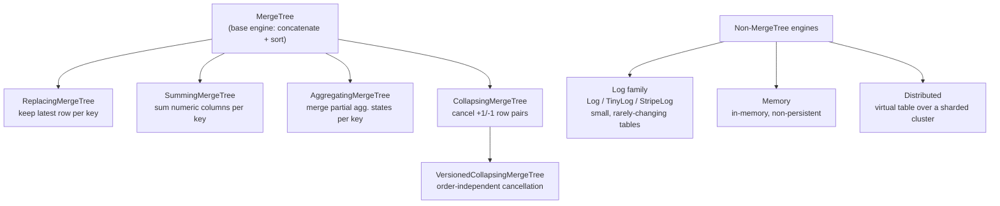
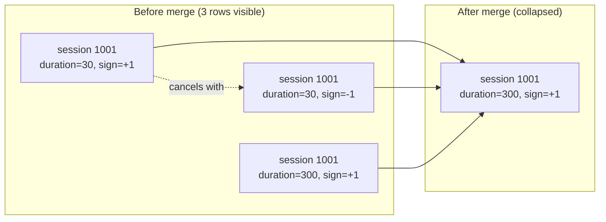

# Table Engines Deep Dive

Chapter 3 introduced *the* MergeTree engine — parts, background merges, the columnar on-disk layout, and why ClickHouse never updates a row in place. That was enough to understand how ClickHouse stores and merges data in general. What it deliberately left out is that `MergeTree` is not one engine — it's a **family**, and plain `MergeTree` is just the base member: the simplest possible policy of "accept inserted rows, group them into parts, merge parts together, change nothing about the rows in the process." That policy is exactly right for immutable, append-only fact data (page views, log lines, sensor readings) but wrong for a surprising number of very common real-world needs: keeping only the latest version of a row, maintaining a running total without re-aggregating from scratch, representing an "update" or a "cancellation" in a database that fundamentally refuses to update rows in place, or storing a tiny 200-row lookup table where MergeTree's part/merge machinery is pure overhead. Each of the engines in this chapter takes the same parts-and-merges foundation from Chapter 3 and bolts on one extra piece of merge-time logic to solve exactly one of those problems — no more, no less. Understanding *which* problem each engine solves, and just as importantly what it does **not** guarantee, is one of the highest-leverage skills in this entire course, because engine choice is baked into `CREATE TABLE` and is expensive to change later.

---

## Learning Objectives

By the end of this chapter, you will be able to:

- Explain why plain `MergeTree` is insufficient for deduplication, rollups, or mutable-looking data, and name the purpose-built engine for each case.
- Use `ReplacingMergeTree` correctly, and explain precisely why its deduplication is "eventual" (merge-time), not a live uniqueness constraint.
- Use `SummingMergeTree` to maintain pre-aggregated rollup tables without re-summing raw data on every query.
- Explain, at a preview level, what `AggregatingMergeTree` and `-State` functions are for, ahead of full depth in Chapters 8–9.
- Apply the sign-column pattern with `CollapsingMergeTree` and `VersionedCollapsingMergeTree` to represent updates and cancellations in an insert-only engine.
- Choose between the `Log` family, `Memory`, and `MergeTree`-family engines based on table size, mutability, and durability needs.
- Describe what the `Distributed` engine is at a conceptual level, ahead of full depth in Chapter 12.
- Use a decision framework to pick the correct engine for a given workload without guessing.

---

## Prerequisites for This Chapter

This chapter builds directly on two earlier chapters:

- **[Chapter 3: Architecture & Internals](./03-architecture-and-internals.md)** — you should already be comfortable with parts, background merges, why merges happen asynchronously and non-deterministically in time, and the columnar on-disk file layout. Everything in this chapter is "what extra logic runs during that same merge process," so if merges themselves are fuzzy, revisit Chapter 3 first.
- **[Chapter 4: Data Types & Schema Design](./04-data-types-and-schema-design.md)** — engine choice and column type choice are made together in practice (e.g., a version column is usually a `UInt32`/`DateTime`, a sign column is always `Int8`), so you should be comfortable choosing numeric and date/time types before continuing.

If either feels shaky, this chapter will still make sense conceptually, but the `CREATE TABLE` examples will read more smoothly after a refresher.

---

## 1. Recap: Plain `MergeTree` Is the Base Policy, Not the Whole Story

Chapter 3 established the core MergeTree loop: `INSERT` creates a new part, parts sit immutable on disk, and a background process periodically merges smaller parts into larger ones, re-sorting rows by the table's `ORDER BY` key as it goes. Plain `MergeTree` does nothing else during that merge — rows with identical sorting keys are simply concatenated and re-sorted, duplicates and all.

That's the correct behavior for genuinely immutable, append-only analytical facts: a page view happened, a sensor reading was taken, an order was placed. These events never change after the fact, so there is nothing to reconcile during a merge. Every other engine in this chapter is `MergeTree` **plus one extra rule** that runs when rows sharing a sorting key meet during a merge:

| Engine | Extra merge-time rule |
|---|---|
| `MergeTree` | None — rows are just concatenated and sorted |
| `ReplacingMergeTree` | Keep only the newest row per sorting key |
| `SummingMergeTree` | Sum numeric columns per sorting key |
| `AggregatingMergeTree` | Merge partial aggregation states per sorting key |
| `CollapsingMergeTree` | Cancel out `(+1, -1)` row pairs per sorting key |
| `VersionedCollapsingMergeTree` | Same, but order-independent via a version column |

Every one of these engines still produces parts, still merges in the background, still uses the sparse primary index from `ORDER BY` (Chapter 6 covers that index in depth). Nothing about *storage* changes — only what happens to rows that collide on the sorting key during a merge.



The rest of this chapter walks through each branch of that tree, in the order you're most likely to need them.

---

## 2. `ReplacingMergeTree` — Eventual Deduplication

**Problem it solves:** you're ingesting rows that represent the *current state* of an entity (a user profile, a product listing, a device's last-known status), and new inserts should logically replace old ones for the same key — but you're using an insert-only, update-hostile database.

`ReplacingMergeTree` tells the merge process: "when two or more rows share the same sorting key, keep only one of them — the one with the highest value in the optional version column (or, if no version column is given, the most recently inserted one)."

```sql
CREATE TABLE user_profiles
(
    user_id     UInt64,
    email       String,
    plan        String,
    updated_at  DateTime
)
ENGINE = ReplacingMergeTree(updated_at)
ORDER BY user_id;
```

Insert two versions of the same user:

```sql
INSERT INTO user_profiles VALUES (1, 'a@old.com', 'free', '2026-01-01 10:00:00');
INSERT INTO user_profiles VALUES (1, 'a@new.com', 'pro',  '2026-02-15 09:30:00');
```

### 2.1 The critical gotcha: deduplication is NOT immediate

Immediately after both inserts, a plain `SELECT * FROM user_profiles` will very likely return **both rows**. This is not a bug — it's the mechanism working as documented. Deduplication only happens when ClickHouse's background merge process physically merges the parts containing those two rows, and merges are scheduled asynchronously, on ClickHouse's own timetable, not yours. Two rows landing in two different, still-unmerged parts will both be visible to queries indefinitely, until a merge happens to touch both of them.

This makes `ReplacingMergeTree` **eventually deduplicated**, not a live `UNIQUE` constraint. There is no guarantee about *when* "eventually" happens — it could be seconds, or it could be days on a lightly-written partition that never triggers another merge.

Two ways to force the issue at query time:

```sql
-- Option A: force a synchronous merge across the whole table (expensive!)
OPTIMIZE TABLE user_profiles FINAL;

-- Option B: ask the query itself to deduplicate on the fly
SELECT * FROM user_profiles FINAL;
```

Both give correct, deduplicated results, but both cost extra work at query or maintenance time — `FINAL` forces ClickHouse to merge matching rows in memory during the scan itself, and `OPTIMIZE ... FINAL` forces a real, potentially very large, merge across the whole table (or partition). Neither is "free," which is why Section 7 (Best Practices) recommends `argMax`-style queries for correctness-critical reads instead of leaning on either.

---

## 3. `SummingMergeTree` — Pre-Aggregated Rollups

**Problem it solves:** you're maintaining a rollup/summary table (e.g., "total sales per product per day") and want new incoming rows for an existing key to add to the running total, not sit alongside it as a separate duplicate row.

`SummingMergeTree` tells the merge process: "when two or more rows share the same sorting key, sum their numeric columns into a single row instead of keeping duplicates."

```sql
CREATE TABLE daily_sales_rollup
(
    sale_date    Date,
    product_id   UInt32,
    quantity     UInt32,
    revenue      Decimal(18, 2)
)
ENGINE = SummingMergeTree()
ORDER BY (sale_date, product_id);
```

If two rows are inserted for the same `(sale_date, product_id)`:

```sql
INSERT INTO daily_sales_rollup VALUES ('2026-07-06', 42, 3, 89.97);
INSERT INTO daily_sales_rollup VALUES ('2026-07-06', 42, 2, 59.98);
```

After a merge, they collapse into a single row: `('2026-07-06', 42, 5, 149.95)` — `quantity` and `revenue` summed, because both are numeric columns not part of the sorting key. Like `ReplacingMergeTree`, this collapsing happens **during background merges**, so the same "not immediately visible" caveat applies: query with `SELECT sum(quantity), sum(revenue) ... GROUP BY sale_date, product_id` if you need a correct total *right now*, rather than trusting that all matching rows have already merged. Summing at query time over not-yet-merged rows still produces the correct total either way — summing `3+2` gives the same answer whether it happened at merge time or query time — which is precisely why `SummingMergeTree` is more forgiving than `ReplacingMergeTree`: partial merge state doesn't produce a *wrong* answer, only a temporarily less-compact one.

You can optionally specify which columns to sum (`SummingMergeTree((quantity, revenue))`); columns not listed and not part of the key take an arbitrary value from one of the merged rows, so explicit column lists are recommended once a table has more than a couple of numeric columns.

---

## 4. `AggregatingMergeTree` — Partial Aggregation States (Preview)

**Problem it solves:** `SummingMergeTree` only knows how to `sum()`. What if your rollup needs `avg()`, `uniq()` (distinct counts), `quantile()`, or any other aggregate function that can't just be added together?

`AggregatingMergeTree` generalizes the idea: instead of storing final numeric values, columns store **partial aggregation states** — intermediate, mergeable snapshots produced by functions with the `-State` combinator suffix (e.g., `sumState()`, `avgState()`, `uniqState()`). During a merge, ClickHouse merges these states together (`avgMergeState`-style logic happens automatically), and at query time you call the matching `-Merge` function (e.g., `avgMerge()`) to get the final value.

```sql
CREATE TABLE page_view_stats
(
    event_date   Date,
    page_url     String,
    visits       AggregateFunction(sum, UInt64),
    unique_users AggregateFunction(uniq, UInt64)
)
ENGINE = AggregatingMergeTree()
ORDER BY (event_date, page_url);
```

Rows are normally written into this kind of table by an incremental **materialized view** sitting in front of a raw events table, using `-State` functions in its `SELECT`:

```sql
-- Conceptual preview only — materialized views are covered in full in Chapter 9
INSERT INTO page_view_stats
SELECT
    event_date,
    page_url,
    sumState(toUInt64(1))   AS visits,
    uniqState(user_id)      AS unique_users
FROM raw_page_views
GROUP BY event_date, page_url;
```

Querying requires the `-Merge` counterpart:

```sql
SELECT
    event_date,
    page_url,
    sumMerge(visits)       AS total_visits,
    uniqMerge(unique_users) AS distinct_users
FROM page_view_stats
GROUP BY event_date, page_url;
```

This is deliberately just a preview: `-State`/`-Merge` combinators get full treatment in **Chapter 8** (aggregate function combinators), and the incremental-materialized-view pattern that feeds an `AggregatingMergeTree` table automatically as new raw data arrives is the centerpiece of **Chapter 9**. For now, the important takeaway is the shape of the problem: `AggregatingMergeTree` is what `SummingMergeTree` grows into once "sum" isn't the only aggregation you need pre-computed.

---

## 5. `CollapsingMergeTree` and `VersionedCollapsingMergeTree` — The Sign-Column Pattern

### 5.1 Why this pattern exists at all

ClickHouse is built around the assumption that data is inserted once and never modified in place — Chapter 3 explained why (immutable parts, no in-place row rewriting, `UPDATE`/`DELETE` exist only as expensive asynchronous "mutations," not a real-time operation). But real systems frequently need to represent something that *looks* like an update: "this order's status changed," "this sensor reading was recorded wrong and needs correcting," "this session was cancelled." `CollapsingMergeTree` gives you an idiomatic, insert-only way to represent exactly that: instead of updating a row, you insert a **cancelling row** and then insert the corrected replacement — all as plain `INSERT`s.

### 5.2 The sign-column mechanic

A `CollapsingMergeTree` table has a designated `Int8` **sign column**, conventionally called `sign`, that must contain only `+1` or `-1`:

- `+1` means "this row is (or should be treated as) present."
- `-1` means "cancel out the most recent `+1` row with the same sorting key."

During a merge, ClickHouse looks for `(+1, -1)` pairs that share the same sorting key and **removes both rows entirely** from the merged output, as if they had cancelled each other into nonexistence. Rows that don't find a partner survive the merge untouched.

```sql
CREATE TABLE session_durations
(
    session_id  UInt64,
    user_id     UInt64,
    duration_s  UInt32,
    sign        Int8
)
ENGINE = CollapsingMergeTree(sign)
ORDER BY session_id;
```

**Example: correcting a mis-recorded event.** Suppose session `1001` was first recorded with a duration of 30 seconds, but a bug meant the real duration was 300 seconds:

```sql
-- Original (wrong) row
INSERT INTO session_durations VALUES (1001, 55, 30, 1);

-- Cancel the wrong row, then insert the corrected one
INSERT INTO session_durations VALUES (1001, 55, 30,  -1);
INSERT INTO session_durations VALUES (1001, 55, 300,  1);
```

After a merge, the first `(30, +1)` and `(30, -1)` rows cancel out, leaving only `(1001, 55, 300, 1)` — the corrected row. Until that merge happens, all three rows are visible, and a naive `SELECT sum(duration_s)` would overcount. The idiomatic query pattern sums `duration_s * sign` instead, which is correct at any point in time, merged or not: `30*1 + 30*(-1) + 300*1 = 300`, exactly right, with or without a completed merge.



### 5.3 The insert-order requirement — and why `VersionedCollapsingMergeTree` exists

`CollapsingMergeTree`'s cancellation logic assumes the `-1` row is inserted **after** its matching `+1` row, in that order, so that the sorting-key-adjacent rows a merge sees actually look like a cancel pair. In a single-threaded, single-node insert pattern that's usually easy to guarantee. But once inserts come from multiple sources concurrently (multiple ingestion workers, retried batches, out-of-order delivery from a queue), that ordering guarantee can break, and mismatched pairs can fail to collapse correctly.

`VersionedCollapsingMergeTree` solves exactly this by adding a second column: an explicit version number. The merge algorithm then matches `+1`/`-1` pairs correctly **regardless of the order they were inserted or merged in**, because it can compare version numbers instead of relying on insertion order.

```sql
CREATE TABLE session_durations_versioned
(
    session_id  UInt64,
    user_id     UInt64,
    duration_s  UInt32,
    sign        Int8,
    version     UInt32
)
ENGINE = VersionedCollapsingMergeTree(sign, version)
ORDER BY session_id;
```

Rule of thumb: reach for plain `CollapsingMergeTree` when a single writer inserts cancel/replace pairs in guaranteed order; reach for `VersionedCollapsingMergeTree` the moment multiple writers or an out-of-order delivery pipeline are in play.

---

## 6. The Log Family — `Log`, `TinyLog`, `StripeLog`

**Problem it solves:** you have a small (thousands, not billions, of rows), rarely-written, rarely-changing lookup or reference table — a country-code table, a small config table, a list of product categories — where MergeTree's part-management, background-merge, and sparse-index machinery is pure overhead with no payoff.

The Log family engines skip almost all of that machinery. They store data far more simply (each column mostly as one contiguous file, with much lighter metadata) and in exchange give up most of MergeTree's capabilities: no primary key / sparse index, no partitioning, generally no concurrent writes, and reading/writing whole tables is more of an all-or-nothing operation.

```sql
CREATE TABLE country_codes
(
    code String,
    name String
)
ENGINE = TinyLog();
```

| Engine | Characteristics |
|---|---|
| `TinyLog` | Simplest; no concurrent reads while writing; fine for very small, single-writer tables |
| `Log` | Like `TinyLog` but supports some concurrent reads; slightly more metadata overhead |
| `StripeLog` | Stores all columns interleaved in one file rather than one file per column; simpler still for genuinely tiny tables |

In practice, `Log`-family tables show up as small dimension/lookup tables joined against large `MergeTree` fact tables, or as staging tables for a one-off data load — never as the primary store for anything resembling an analytical fact table. If a table is expected to grow past a few hundred thousand rows or needs any of MergeTree's indexing or partitioning, use `MergeTree` (or a variant) instead, even if it currently feels "too heavy" for a small table — it isn't, and it scales, whereas the Log family does not.

---

## 7. `Memory` Engine — In-Memory Scratch Tables

**Problem it solves:** you need a genuinely temporary table for an intermediate result within a session, a scratch area for testing, or the fastest possible read/write path for data you're fully prepared to lose.

`Memory` tables store their rows purely in RAM — no files on disk at all, no compression, no persistence. They are wiped the instant the server restarts.

```sql
CREATE TABLE scratch_results
(
    id    UInt64,
    value Float64
)
ENGINE = Memory();
```

`Memory` tables are useful for things like: staging intermediate results of a multi-step ETL script that all happens within one server's uptime, small temporary tables in test suites, or extremely low-latency lookup tables rebuilt from a source-of-truth on every server start. They are **never** appropriate for data that must survive a restart, a crash, or a deployment — there is no WAL, no snapshot, no recovery path; the data is simply gone.

---

## 8. `Distributed` Engine — The Virtual Table Over a Cluster (Preview)

**Problem it solves:** once your data is large enough to be **sharded** — split across multiple ClickHouse nodes, each holding a slice of the rows — you need something a client can query as if it were one table, that transparently fans a query out to every shard and merges the partial results back together.

That "something" is the `Distributed` engine. It does not store any data itself — it's a thin, virtual routing layer sitting in front of real `MergeTree`-family tables (typically `ReplicatedMergeTree`, covered in Chapter 11) that live on each shard.

```sql
-- Conceptual preview only — full depth, including shard key selection and
-- cluster topology, is Chapter 12.
CREATE TABLE events_distributed AS events_local
ENGINE = Distributed(my_cluster, default, events_local, rand());
```

Querying `events_distributed` transparently issues the query to every node in `my_cluster`, against each node's local `events_local` table, and merges the partial results. This is genuinely a whole chapter's worth of material — shard key selection, distributed `INSERT` behavior, and cluster topology all matter a great deal — so this section is intentionally just enough to place `Distributed` on the engine family tree and explain what class of problem it solves: **querying across shards as if they were one table.** Full mechanics live in **Chapter 12**.

---

## 9. Decision Guide: Choosing the Right Engine

| Scenario | Engine | Why |
|---|---|---|
| Immutable, append-only analytical facts (page views, logs, orders placed) | `MergeTree` | No merge-time reconciliation needed; the baseline for most fact tables |
| Need "latest known value per key," tolerant of eventual consistency | `ReplacingMergeTree` | Deduplicates old versions of a row during merges; combine with `FINAL`/`argMax` for correctness-critical reads |
| Pre-summed rollup table (totals, counts) where `sum()` is the only aggregation needed | `SummingMergeTree` | Automatically sums numeric columns sharing a key during merges |
| Pre-aggregated rollup needing `avg`, `uniq`, `quantile`, or other non-additive aggregates | `AggregatingMergeTree` | Stores mergeable partial aggregation states via `-State` functions |
| Need to represent updates/cancellations without in-place `UPDATE` | `CollapsingMergeTree` | Cancels matching `(+1, -1)` row pairs during merges (single-writer, ordered inserts) |
| Same as above, but multiple writers or out-of-order inserts | `VersionedCollapsingMergeTree` | Order-independent cancellation via an explicit version column |
| Tiny (thousands of rows), rarely-written reference/lookup table | `Log` / `TinyLog` / `StripeLog` | Skips MergeTree's part/merge/index overhead, which has no payoff at that scale |
| Temporary/scratch data, fine to lose on restart | `Memory` | Pure RAM, no persistence, fastest possible read/write |
| Querying across a sharded cluster as one logical table | `Distributed` | Fans queries out to shard-local `MergeTree`-family tables and merges results |

A useful mental filter when you're unsure: **ask what happens to a row after it's inserted.** Never changes → `MergeTree`. Superseded by a later version → `ReplacingMergeTree`. Needs to accumulate into a running total → `SummingMergeTree`/`AggregatingMergeTree`. Needs to be corrected or cancelled → `CollapsingMergeTree`/`VersionedCollapsingMergeTree`. That single question resolves the large majority of real engine-choice decisions.

---

## Real-World Scenario

**Setup:** You're building a "current user profile" table for a product analytics platform. Profile updates (email changes, plan upgrades, name changes) arrive continuously from multiple upstream services via a message queue, and — critically — they can arrive **out of order**: a plan-upgrade event generated at 10:00:05 might reach ClickHouse a few seconds *after* a profile-name-change event generated at 10:00:07, simply due to queue partitioning and retries. Downstream dashboards need to show each user's current, correct profile.

**Design:** A `ReplacingMergeTree` keyed on `user_id`, with an explicit version column driven by the **event's own timestamp**, not ClickHouse's insertion time:

```sql
CREATE TABLE user_profiles_current
(
    user_id     UInt64,
    email       String,
    plan        String,
    display_name String,
    event_time  DateTime64(3)
)
ENGINE = ReplacingMergeTree(event_time)
ORDER BY user_id;
```

Because the version column is `event_time` — the moment the change actually happened upstream — out-of-order arrival at ClickHouse is harmless: whichever row has the *latest* `event_time` wins during a merge, regardless of which row physically landed in ClickHouse first. This is precisely why `ReplacingMergeTree`'s version column should almost always be a meaningful business timestamp or monotonically increasing sequence number, not "time of insert" — insert time only reflects pipeline behavior, not the truth of what happened.

**The query-time implication that must be designed around:** dashboards querying `user_profiles_current` directly with a plain `SELECT * WHERE user_id = ...` can see stale, duplicate, or (very rarely) even out-of-order-looking rows at any given moment, because merges are asynchronous and give no completion guarantee. Two defensive patterns handle this:

1. For interactive, ad-hoc lookups where a small performance cost is acceptable: `SELECT * FROM user_profiles_current FINAL WHERE user_id = 42` — forces in-query deduplication for that one lookup.
2. For high-throughput dashboard queries scanning many users at once, where `FINAL` across a large scan would be expensive: an explicit `argMax` query is the standard idiom —

```sql
SELECT
    user_id,
    argMax(email, event_time)        AS email,
    argMax(plan, event_time)         AS plan,
    argMax(display_name, event_time) AS display_name
FROM user_profiles_current
GROUP BY user_id;
```

This always returns the row with the greatest `event_time` per user, correctly, regardless of whether a background merge has run yet — the query itself does the "keep only the latest" work instead of depending on merge timing. This is the pattern Section 7 (Best Practices) recommends generally: treat `ReplacingMergeTree`'s automatic deduplication as a storage-compaction optimization that happens to also make ad-hoc queries faster over time, not as the mechanism you depend on for correctness.

---

## Best Practices

- **Use `FINAL` sparingly.** It forces ClickHouse to merge matching rows during the scan itself, which is CPU- and memory-intensive and can turn a fast query into a slow one on large tables — reserve it for smaller tables or low-traffic ad-hoc lookups.
- **Prefer `argMax`-style queries over relying on `ReplacingMergeTree`/`CollapsingMergeTree` merge timing for correctness-critical reads.** `argMax(col, version_col)` (or summing `value * sign`) gives a correct answer regardless of whether a merge has happened, which is a strictly stronger guarantee than hoping background merges have caught up.
- **Choose `SummingMergeTree`/`AggregatingMergeTree` for known, stable rollup patterns rather than re-aggregating raw data on every query.** If you already know you need daily totals by product, materialize them once via a rollup engine instead of scanning and `GROUP BY`-ing billions of raw rows repeatedly.
- **Pick a real business timestamp or monotonically increasing counter as your version column**, never "row insertion time," so that out-of-order delivery from upstream systems doesn't silently corrupt "latest wins" logic.
- **Run `OPTIMIZE TABLE ... FINAL` deliberately and rarely, not as a scheduled habit**, and never on a large table during peak query load — it's a genuinely heavy operation that rewrites large amounts of data.
- **Match table scale to engine weight**: use the `Log` family only for genuinely small, rarely-written reference data, and move to `MergeTree` the moment a "small lookup table" starts growing or needs concurrent writes.
- **Document the sign-column insert contract on `CollapsingMergeTree` tables** (which service is responsible for emitting `-1` cancellation rows, and in what order) since the entire correctness of the pattern depends on that discipline being followed by every writer.

---

## Common Mistakes

- **Assuming `ReplacingMergeTree` guarantees uniqueness at query time.** Without `FINAL` or an `argMax`-style query, a plain `SELECT` can and will return duplicate rows for the same sorting key whenever a merge hasn't yet run.
- **Using `CollapsingMergeTree` without respecting insert order.** If `-1` rows can arrive before their matching `+1` row, or from multiple concurrent writers, plain `CollapsingMergeTree` can fail to collapse pairs correctly — that's exactly the scenario `VersionedCollapsingMergeTree` exists for.
- **Reaching for plain `MergeTree` on a dataset that's conceptually mutable** (user profiles, order status, inventory counts) instead of a purpose-built engine, then trying to bolt on correctness with application-side workarounds instead of using `ReplacingMergeTree`/`CollapsingMergeTree` as designed.
- **Using the `Memory` engine for anything that needs to survive a restart.** `Memory` tables have zero persistence — a server restart, crash, or redeploy silently and permanently erases them.
- **Treating `SummingMergeTree` as a general-purpose aggregation engine.** It only sums; if a rollup needs `avg`, `uniq`, or `quantile`, `SummingMergeTree` will silently give a meaningless result for non-additive metrics (or you'll be forced into computing them incorrectly from summed sub-parts) — reach for `AggregatingMergeTree` instead.
- **Running `OPTIMIZE ... FINAL` on a large production table as a routine "cleanup" job.** This can consume enormous I/O and CPU and is rarely necessary — background merges eventually achieve the same compaction on their own schedule.
- **Forgetting that columns outside the sorting key and outside an explicit sum list in `SummingMergeTree` take an arbitrary value from one of the merged rows** — silently producing inconsistent-looking data in columns nobody meant to leave unmanaged.

---

## Summary

- Plain `MergeTree` (Chapter 3) is the base policy — concatenate and sort rows sharing a key, with no reconciliation. Every other engine in this chapter adds exactly one extra merge-time rule on top of that same foundation.
- `ReplacingMergeTree` keeps only the latest row per sorting key (by an optional version column), but only **during background merges** — deduplication is eventual, not a live constraint; use `FINAL` or `argMax`-style queries for correctness-critical reads.
- `SummingMergeTree` sums numeric columns per sorting key, ideal for pre-aggregated rollups where the only aggregation needed is `sum()`.
- `AggregatingMergeTree` generalizes this to any aggregate function via `-State`/`-Merge` combinators, and is the engine behind incremental materialized-view rollups (full depth in Chapters 8–9).
- `CollapsingMergeTree` and `VersionedCollapsingMergeTree` implement the sign-column pattern (`+1`/`-1` rows) for representing updates and cancellations in an insert-only database; the versioned variant tolerates out-of-order or multi-writer inserts.
- The `Log` family (`Log`, `TinyLog`, `StripeLog`) trades away MergeTree's indexing/merging machinery for simplicity, appropriate only for small, rarely-written lookup tables.
- `Memory` is pure RAM with zero persistence — useful for scratch data, never for anything that must survive a restart.
- `Distributed` is a virtual, data-less routing engine that fans queries across shard-local `MergeTree`-family tables on a cluster; full depth arrives in Chapter 12.
- A single question — "what happens to a row after it's inserted?" — resolves most engine-choice decisions.

---

## Knowledge Check

1. Why does `ReplacingMergeTree` not behave like a live `UNIQUE` constraint, and what two mechanisms can you use to force deduplicated results at query time?
2. You are asked to build a table that tracks total daily revenue per store, updated by frequent small inserts. Which engine would you choose, and why is it a better fit than plain `MergeTree` with a `GROUP BY` at query time?
3. Explain why `AggregatingMergeTree` exists even though `SummingMergeTree` already performs merge-time aggregation.
4. Walk through what happens, step by step, when a `CollapsingMergeTree` table receives a `+1` row, then a `-1` row, then a new `+1` row, all for the same sorting key, and explain what a query would see before and after a merge.
5. Under what circumstance should you prefer `VersionedCollapsingMergeTree` over plain `CollapsingMergeTree`?
6. A junior engineer proposes using the `Memory` engine to store a critical daily summary table because "it's the fastest engine." What is wrong with this plan?

---

## Hands-On Exercise

**Part 1 — `ReplacingMergeTree` deduplication timing.**

1. Start `clickhouse-client` and create a test table:
   ```sql
   CREATE TABLE rmt_demo
   (
       id      UInt32,
       value   String,
       version UInt32
   )
   ENGINE = ReplacingMergeTree(version)
   ORDER BY id;
   ```
2. Insert two rows with the same `id` but different `version` values, **as two separate `INSERT` statements** (so they land in two separate parts):
   ```sql
   INSERT INTO rmt_demo VALUES (1, 'first-value', 1);
   INSERT INTO rmt_demo VALUES (1, 'second-value', 2);
   ```
3. Run `SELECT * FROM rmt_demo;` immediately. Observe that **both rows are returned** — deduplication has not happened yet.
4. Run `SELECT * FROM rmt_demo FINAL;` and compare — only the `version = 2` row should appear.
5. Now force a real merge and re-check the plain (non-`FINAL`) query:
   ```sql
   OPTIMIZE TABLE rmt_demo FINAL;
   SELECT * FROM rmt_demo;
   ```
   Confirm that only one row remains now that an actual merge has occurred.

**Part 2 — `CollapsingMergeTree` cancel/correct pattern.**

1. Create a small demo table:
   ```sql
   CREATE TABLE cmt_demo
   (
       event_id UInt32,
       amount   Int32,
       sign     Int8
   )
   ENGINE = CollapsingMergeTree(sign)
   ORDER BY event_id;
   ```
2. Insert an initial (incorrect) row, then cancel and correct it:
   ```sql
   INSERT INTO cmt_demo VALUES (100, 50, 1);
   INSERT INTO cmt_demo VALUES (100, 50, -1);
   INSERT INTO cmt_demo VALUES (100, 75, 1);
   ```
3. Run `SELECT *, amount * sign AS signed_amount FROM cmt_demo;` and confirm `sum(signed_amount)` gives the correct value (`75`) even before any merge.
4. Run `OPTIMIZE TABLE cmt_demo FINAL;` then `SELECT * FROM cmt_demo;` and confirm the cancelled pair has disappeared, leaving only the corrected row.

---

## Further Reading

- [MergeTree Engine Family Overview](https://clickhouse.com/docs/en/engines/table-engines/mergetree-family) — the full index of MergeTree-family engines.
- [ReplacingMergeTree](https://clickhouse.com/docs/en/engines/table-engines/mergetree-family/replacingmergetree) — official reference, including `FINAL` and deduplication semantics.
- [SummingMergeTree](https://clickhouse.com/docs/en/engines/table-engines/mergetree-family/summingmergetree) — official reference on column-sum behavior and column selection.
- [AggregatingMergeTree](https://clickhouse.com/docs/en/engines/table-engines/mergetree-family/aggregatingmergetree) — official reference on `-State`/`-Merge` usage with this engine.
- [CollapsingMergeTree](https://clickhouse.com/docs/en/engines/table-engines/mergetree-family/collapsingmergetree) and [VersionedCollapsingMergeTree](https://clickhouse.com/docs/en/engines/table-engines/mergetree-family/versionedcollapsingmergetree) — official references on the sign-column pattern.

---

<div style="display:flex;justify-content:space-between;align-items:center;">
  <a href="./04-data-types-and-schema-design.md">← Previous: Data Types & Schema Design</a>
  <a href="./00-index.md">🏠 Index</a>
  <a href="./06-primary-keys-and-sparse-indexing.md">Next: Primary Keys & Sparse Indexing →</a>
</div>
