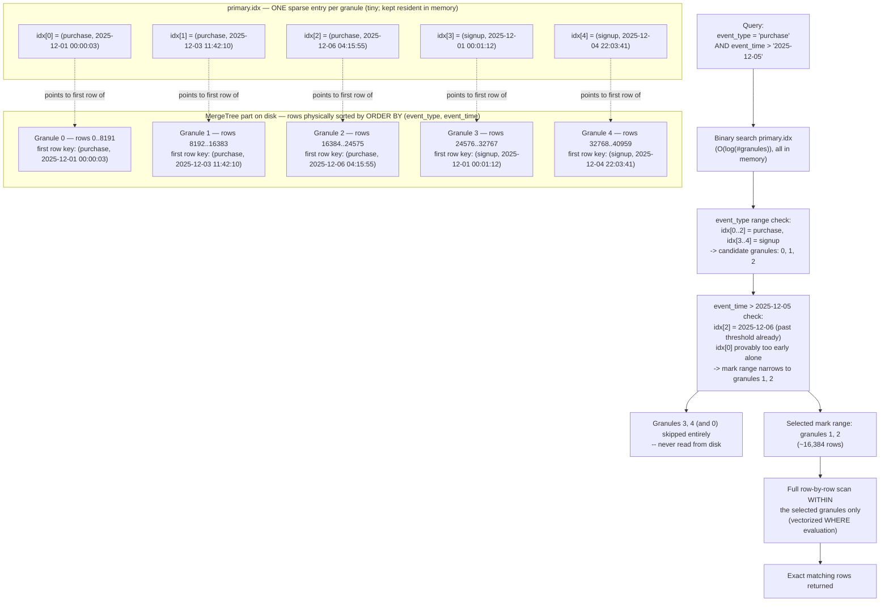

# Primary Keys & Sparse Indexing

Chapter 2 planted a deliberate tension and asked you to sit with it: ClickHouse has a `PRIMARY KEY`, and it looks like the `PRIMARY KEY` you already know from Postgres or the `_id` field you already know from MongoDB — but it does not behave like either one. You can insert the same primary key value a thousand times and ClickHouse will not complain. You cannot ask it to fetch "the row with `id = 42`" and expect a millisecond point lookup the way a B-tree index guarantees. If you came in expecting a uniqueness constraint and an exact-match accelerator, ClickHouse's primary key will, at some point, quietly disappoint you — usually in production, usually on a query you assumed would be fast. This chapter resolves that tension for good. By the end of it you will understand exactly what `ORDER BY` and `PRIMARY KEY` do in a `MergeTree` table, why the on-disk structure ClickHouse builds is called a *sparse* index instead of a dense one, why that design is precisely what lets ClickHouse scan billions of rows per second on modest hardware, and how to choose an `ORDER BY` deliberately rather than by habit carried over from row-store databases.

---

## Learning Objectives

By the end of this chapter, you will be able to:

- State precisely what `ORDER BY` and `PRIMARY KEY` control in a `MergeTree` table, and explain why neither enforces row uniqueness.
- Contrast ClickHouse's sparse primary index against a B-tree primary key index (Postgres) or a B-tree `_id` index (MongoDB), including what each can and cannot do.
- Explain granules — the 8192-row (by default) unit ClickHouse actually reads — and their relationship to the sparse index.
- Walk through, mechanically, how ClickHouse uses the sparse index to narrow a query down to a range of granules via binary search, and why it then must scan within that range.
- Design an `ORDER BY` column order deliberately, using reasoning that parallels — but is not identical to — the ESR (Equality-Sort-Range) rule for B-tree compound indexes.
- Explain partition pruning via `PARTITION BY` and why over-partitioning is a real, common failure mode.
- Recognize when and how to add a data-skipping index (`minmax`, `set`, `bloom_filter`, `ngrambf_v1`/`tokenbf_v1`) for columns outside the `ORDER BY`.
- Read a basic `EXPLAIN indexes = 1` output and connect "granules selected" back to the design choices that produced it.

---

## Prerequisites for This Chapter

This chapter assumes you're comfortable with:

- [Chapter 2: Core Concepts](./02-core-concepts.md) — ClickHouse terminology (tables, engines, the general shape of the SQL dialect). That chapter previewed the idea that ClickHouse's "primary key" would need its own chapter — this is that chapter.
- [Chapter 3: Architecture & Internals](./03-architecture-and-internals.md) — the MergeTree storage model: data is written into immutable **parts**, each part stores columns in separate files, and parts are periodically merged in the background. Chapter 3 also introduced **granules** in passing as the unit of I/O; this chapter is where that concept earns its full explanation.

If either of those feels shaky — especially the idea that a `MergeTree` table is physically a set of self-contained, sorted parts on disk — pause and revisit them, because everything below is a direct mechanical consequence of that model.

---

## 1. The Critical Distinction: `ORDER BY` Is Physical Sort Order, Not a Uniqueness Constraint

Say this sentence enough times that it becomes reflexive, because it is the single most important idea in this chapter:

> **In ClickHouse, `ORDER BY` controls the physical sort order of rows within each part on disk. It is not a uniqueness constraint, and duplicate key values are completely normal and expected.**

```sql
CREATE TABLE events
(
    event_date  Date,
    event_time  DateTime,
    event_type  LowCardinality(String),
    country     LowCardinality(String),
    user_id     UInt64,
    url         String,
    duration_ms UInt32
)
ENGINE = MergeTree
PARTITION BY toYYYYMM(event_date)
ORDER BY (country, event_type, event_time);
```

Here, `ORDER BY (country, event_type, event_time)` is — unless you separately declare a `PRIMARY KEY` — *also* the table's primary key. Nothing stops you from inserting a million rows that all share `country = 'US', event_type = 'purchase', event_time = '2026-01-01 00:00:00'`. ClickHouse will happily store all of them, sorted together, with no complaint and no deduplication. There is no equivalent of a `UNIQUE` constraint violation here.

### 1.1 Why `PRIMARY KEY` and `ORDER BY` are (usually) the same thing

`ORDER BY` is mandatory for a `MergeTree` table (with rare exceptions using `ORDER BY tuple()` for genuinely unordered data). `PRIMARY KEY` is optional. When you omit `PRIMARY KEY`, ClickHouse uses `ORDER BY`'s columns as the primary key automatically. You can also explicitly declare a `PRIMARY KEY` that is a **prefix** of `ORDER BY` — useful when you want to sort by more columns than you want indexed (the index only needs to be built over the leading columns you actually filter on):

```sql
ORDER BY (country, event_type, event_time, user_id)
PRIMARY KEY (country, event_type)
```

This sorts rows on disk by all four columns (which helps compression, since sorted columns compress better — see Chapter 4) but only builds the sparse index over `(country, event_type)`, keeping the index itself smaller. This is a real, common tuning technique, not an edge case.

### 1.2 Direct contrast with a B-tree primary key

| | ClickHouse `ORDER BY` / primary key (sparse index) | Postgres `PRIMARY KEY` / MongoDB `_id` (B-tree) |
|---|---|---|
| **Enforces uniqueness?** | No — duplicates are fine and common | Yes — rejected on conflict |
| **Structure** | One sparse entry per *granule* (8192 rows, by default) | One dense entry per *row* |
| **Point lookup by key** | Not directly supported — narrows to a granule, then scans it | Direct, near-O(log n), single-row lookup |
| **Primary purpose** | Physical sort order + coarse range pruning for scans | Uniqueness + fast exact-match/point lookups |
| **Index size relative to data** | Tiny — a few index entries per million rows | Roughly proportional to row count |
| **Typical use** | Filter/range predicates over huge analytical scans | Fetch/update/delete a single known row |

If you learned indexing from this repo's [PostgreSQL course](../postgresql-course/11-indexes-fundamentals.md) or [MongoDB course](../mongodb-course/06-indexes-fundamentals.md), you learned that a B-tree index stores a sorted entry **for every row**, letting the database walk straight to one matching row in roughly `O(log n)` steps. That mental model is now actively wrong for ClickHouse, and holding onto it is the single most common source of "why is this simple filter still slow?" confusion for people arriving from row-store backgrounds. Section 3 explains exactly what ClickHouse builds instead, and why.

---

## 2. Granules: The Unit ClickHouse Actually Reads

Chapter 3 introduced parts — the immutable, sorted, self-contained chunks of data a `MergeTree` table is physically made of. Within each part, rows are further grouped into **granules**: the smallest unit of data ClickHouse ever reads from disk for a query.

- The default granule size is **8192 rows** (`index_granularity = 8192`), configurable per table.
- ClickHouse cannot read "half a granule" — I/O and the index both operate at granule granularity. If even one row in a granule might match your query, the *entire* granule is read and processed.
- Granules are not separate files; they're conceptual row ranges within each column's file in a part. A part with 1,000,000 rows and the default granularity has roughly 123 granules per column.
- There is a related setting, `index_granularity_bytes`, which lets ClickHouse adapt granule size when rows are unusually wide or narrow (adaptive granularity) — but the row-count intuition of "~8192 rows per granule" is the right mental model for this chapter.

Why does this matter before we even get to indexing? Because the sparse index (Section 3) is built at exactly this granularity — **one index entry per granule, not one per row.** Understanding granules first makes the sparse index's design feel inevitable rather than arbitrary.

---

## 3. The Sparse Index in Depth

### 3.1 The core idea

A B-tree index answers "where exactly is this row?" A ClickHouse sparse index answers a coarser but far cheaper question: "which granules could *possibly* contain rows matching this filter?" It does this by storing, per granule, only the primary key value of that granule's **first row**.

For our `events` table with `ORDER BY (event_type, event_time)`, imagine 40,960 rows spread across five granules of 8192 rows each. The sparse index (ClickHouse calls the on-disk file `primary.idx`) has exactly five entries:

```
Granule 0 → first row's key: (purchase, 2025-12-01 00:00:03)
Granule 1 → first row's key: (purchase, 2025-12-03 11:42:10)
Granule 2 → first row's key: (purchase, 2025-12-06 04:15:55)
Granule 3 → first row's key: (signup,   2025-12-01 00:01:12)
Granule 4 → first row's key: (signup,   2025-12-04 22:03:41)
```

That's it. Five entries covering 40,960 rows. Scale this up: a table with 10 billion rows and the default granularity has roughly 1.2 million index entries — small enough to sit entirely in memory, even for a table so large that a dense, per-row B-tree index would itself be a multi-gigabyte structure requiring its own disk I/O to traverse. This is the entire point of "sparse": ClickHouse trades index precision for index size, and wins big, because analytical queries scan so many rows anyway that "narrow down to the right granule, then scan ~8192 rows" is a rounding error compared to the alternative of scanning the whole table.

### 3.2 Walking through a real query

Take the query:

```sql
SELECT count()
FROM events
WHERE event_type = 'purchase' AND event_time > '2025-12-05 00:00:00';
```

Given `ORDER BY (event_type, event_time)`, here's mechanically what happens:

1. **Binary search the sparse index** for `event_type = 'purchase'`. Because the index is sorted (it mirrors the physical sort order), ClickHouse can binary-search — not linear-scan — its way to the range of index entries whose `event_type` is `'purchase'`. That's granules 0, 1, and 2 in the example above.
2. **Within that range, binary search on `event_time`.** Granule 0's first row has `event_time = 2025-12-01 00:00:03` and granule 2's first row has `2025-12-06 04:15:55`. Since we want `event_time > '2025-12-05'`, ClickHouse can determine that granule 0 is entirely too early to be interesting on its own boundary, but — critically — it cannot know exactly where within granule 0, 1, or 2 the `2025-12-05` threshold falls, because the index only knows about **first rows**, not every row.
3. **Select the mark range.** ClickHouse conservatively selects every granule whose row range could contain a matching row: here, granules 1 and 2 (granule 0's rows might extend right up to the granule 1 boundary, so ClickHouse must be exact about which granules are provably excludable and which aren't).
4. **Skip granules 3 and 4 entirely** — their first-row keys (`signup`, ...) prove they, and everything after them up to the next `event_type`, cannot contain `event_type = 'purchase'` rows given the sort order. This is the actual performance win: those rows are never read from disk, never decompressed, never touched.
5. **Scan the selected granules fully.** Within granules 1 and 2, ClickHouse reads all ~16,384 rows and applies the `WHERE` filter row-by-row (vectorized, per Chapter 3) to find the exact matches, because the index cannot pinpoint individual rows — only granules.



### 3.3 Why this trade-off is the right one for analytics

A dense B-tree over billions of rows is a real, multi-level, disk-resident (or at best partially-cached) structure — walking it costs real I/O, and maintaining it on every insert costs real write amplification. ClickHouse's bet is that analytical queries almost never want "exactly row #4,829,113" — they want "every row from the last 30 days where `country = 'DE'`," which is inherently a *range* of rows, not a point. A sparse index is:

- **Small enough to always be in memory** — binary-searching a few hundred thousand entries is essentially free compared to reading data off disk.
- **Cheap to maintain** — appending to a sorted part only needs new sparse entries per granule, not a full B-tree rebalance per row.
- **Good enough**, because the cost model of analytics is dominated by "how many granules did we have to read," not "how precisely did we land on one row." Losing the ability to jump to a single row is an acceptable price for never needing a heavyweight, per-row index structure at all.

The cost, stated plainly, is real: the sparse index can only ever narrow a search down to a granule *range* — it cannot skip *within* a granule. If your filter matches one row somewhere inside a granule of 8192, ClickHouse still reads and evaluates all 8192. This is why granule-level selectivity — driven entirely by `ORDER BY` design — is the lever that matters, and why the next section is the practical heart of this chapter.

---

## 4. Why `ORDER BY` Column Choice and Order Matters Enormously

Because the sparse index can only narrow the search along a **prefix** of the `ORDER BY` columns — exactly like the leftmost-prefix rule for B-tree compound indexes you may already know from Postgres or MongoDB — column order is not a stylistic choice. It determines whether a given query touches a handful of granules or effectively all of them.

### 4.1 The rule, ClickHouse-flavored

Put columns in `ORDER BY` in this general priority:

1. **Columns you filter on with equality, especially low-cardinality ones, first.** A low-cardinality equality filter (e.g., `country = 'DE'`) lets the sparse index rule out huge contiguous ranges of granules immediately, because all rows for a given `country` value are physically clustered together.
2. **Columns you filter on next most often, increasing in cardinality**, follow. Each additional prefix column narrows the *remaining* candidate range further, the same way `(country, event_type)` narrows within a `country` before `(country, event_type, event_time)` narrows again within that.
3. **High-cardinality range/timestamp columns last.** `event_time` is a near-perfect *last* column: within a fixed `(country, event_type)`, it lets ClickHouse binary-search a tight time range, but placing it first would be a mistake (Section 4.3) because ClickHouse would have to consider nearly every distinct timestamp before it could use any other column to narrow further.

### 4.2 Explicit comparison: ESR vs. sparse-index prefix reasoning

This repo's Postgres and MongoDB courses teach the **ESR rule** (Equality, Sort, Range) for ordering compound B-tree index columns: equality-filtered fields first, then a field used for sorting, then range-filtered fields — because a B-tree's sortedness can only be exploited left-to-right, one prefix at a time, and range conditions "break" the useful ordering for any column that comes after them.

ClickHouse's `ORDER BY` design follows the **same leftmost-prefix logic**, for a structurally similar reason (the physical data is sorted left-to-right by these columns, so only a prefix can be binary-searched) — but the *mechanism and payoff* are different:

| | ESR / B-tree compound index | ClickHouse `ORDER BY` prefix |
|---|---|---|
| **What breaks with a skipped prefix column** | Index becomes unusable for that query (falls back to a scan) | Sparse index still narrows on earlier columns, but cannot narrow further on skipped ones — falls back to scanning within the wider granule range it could establish |
| **Granularity of what's "found"** | Individual matching rows, precisely | A range of granules (8192 rows each) that might contain matches |
| **Why range columns go last** | A range condition breaks the sorted-prefix walk for later columns in the B-tree | Same idea: once a column's value is a range rather than an equality, later columns are no longer usefully sorted *within* that range for narrowing |
| **What a "miss" costs you** | Full table scan of every row | Full scan of every granule (still avoids skipping — but at 8192-row granularity, not per-row) |

The takeaway: **think in ESR-like terms when choosing `ORDER BY`, but remember the unit of victory is a granule, not a row.** A well-chosen `ORDER BY` prefix lets the sparse index rule out most of the table's granules cheaply; a poorly chosen one still forces ClickHouse to scan nearly every granule regardless of how "correct" the index configuration looks on paper.

### 4.3 What goes wrong with the wrong order

Suppose you had instead written `ORDER BY (event_time, event_type)` and ran the same query (`event_type = 'purchase' AND event_time > '2025-12-05'`). Now the physical sort order is primarily by time. The `event_time > '2025-12-05'` range filter *does* narrow things down well (recent data is clustered at the end) — but a query that filtered `event_type = 'purchase'` **without** a time bound would be forced to scan almost every granule in the table, because purchases and signups are now interleaved throughout the entire time range rather than clustered together. The lesson generalizes: **there is no universally correct `ORDER BY` — only one that matches your dominant, real query patterns**, exactly as with B-tree compound index design, just applied to physical row placement instead of a separate structure.

---

## 5. Compound `ORDER BY` Example: `(country, event_type, event_time)`

Let's fix the design and be explicit about which query shapes benefit and which don't, for:

```sql
ORDER BY (country, event_type, event_time)
```

| Query filters on... | Benefits from the sparse index? | Why |
|---|---|---|
| `country = 'US'` | **Yes, strongly** | Leading prefix column; rules out all non-`US` granules immediately |
| `country = 'US' AND event_type = 'purchase'` | **Yes, even more strongly** | Two-column prefix; narrows within `US` down to just `purchase` rows |
| `country = 'US' AND event_type = 'purchase' AND event_time > '2026-01-01'` | **Yes, maximally** | Full three-column prefix; narrows to a tight granule range |
| `country IN ('US', 'DE', 'FR')` | **Yes, partially** | ClickHouse can evaluate the index for each value in the `IN` list and union the resulting granule ranges — still far better than a full scan, though not as tight as a single equality |
| `event_type = 'purchase'` (no `country`) | **No meaningful benefit** | `event_type` is not a *leading* prefix column — purchases for every country are scattered across the table's full sort range |
| `event_time > '2026-01-01'` alone | **No meaningful benefit** | Same problem — `event_time` is the third column; skipping `country` and `event_type` means the index can't narrow at all, and ClickHouse must consider essentially every granule |
| `duration_ms > 500` | **No benefit from the primary index at all** | Not part of `ORDER BY` in any position — this is exactly the gap data-skipping indexes (Section 7) exist to fill |

This table is worth internalizing because it is the single most common real-world diagnostic exercise you'll perform against any ClickHouse table: given an `ORDER BY`, mentally check whether a slow query's filters actually form a usable leading prefix.

---

## 6. Partitioning Revisited: Pruning Before the Index Is Even Consulted

Chapter 3 previewed partitioning as part of the MergeTree storage model; here's the query-performance angle in full.

```sql
CREATE TABLE events (...)
ENGINE = MergeTree
PARTITION BY toYYYYMM(event_date)
ORDER BY (country, event_type, event_time);
```

`PARTITION BY` splits a table's parts into separate physical groups — one per distinct partition key value (here, one per calendar month). This matters for query performance because **partition pruning happens before the sparse index is even consulted.** If a query includes a filter that lets ClickHouse prove an entire partition is irrelevant — e.g., `WHERE event_date >= '2026-01-01'` against a table partitioned by month — ClickHouse discards every part belonging to earlier partitions without opening a single one of their index files or data files. Only the surviving partitions' parts go on to have their sparse indexes searched as described in Sections 3–5.

Think of it as a two-stage filter:

1. **Partition pruning** — coarse, whole-partition granularity, based on `PARTITION BY` expression matching.
2. **Sparse index granule selection** — finer, per-granule granularity, based on `ORDER BY` prefix matching, applied only within surviving partitions.

### 6.1 The over-partitioning trap

It's tempting to partition aggressively — by day, by `country`, by `user_id` bucket — reasoning "more pruning is always better." This is wrong, and it's one of the most common operational mistakes in production ClickHouse deployments (Chapter 17 covers failure modes in depth; this is the preview). Each partition requires its own set of parts, and:

- **Every partition accumulates its own small parts from every insert**, and background merges (Chapter 3) can only merge parts *within* the same partition — never across partitions. Fine-grained partitioning multiplies the total number of parts across the table.
- **Too many parts** slows down every query (more files to open, more index files to consult, more merge overhead) and can eventually trigger ClickHouse's built-in "too many parts" protection, which throttles or rejects inserts entirely until background merges catch up.
- **A good partition key is coarse and aligned with your data lifecycle** (commonly month, sometimes week or day for very high-volume tables), not a filter column you merely want fast lookups on — that job belongs to `ORDER BY` and skip indexes, not `PARTITION BY`.

A reasonable rule of thumb: aim for partitions that each hold from tens of millions up to a few hundred million rows once mature, and that align with a real operational unit (a retention window you'll want to `DROP PARTITION` wholesale, e.g., "drop data older than 12 months" — a whole-partition drop is one of the cheapest, most useful operations in ClickHouse, since it deletes a partition's part files directly with no per-row deletion cost).

---

## 7. Data-Skipping (Secondary) Indexes

`ORDER BY` and `PARTITION BY` cover your *primary* access patterns, but real tables get queried on other columns too — `duration_ms`, `url`, `user_agent`. You generally should not try to cram every possible filter column into `ORDER BY` (each additional column adds sort/compression cost and dilutes the effectiveness of earlier columns' prefixes). Instead, ClickHouse offers **data-skipping indexes** — coarse, approximate, per-granule (or per-group-of-granules) structures declared on *any* column, that let ClickHouse skip granules based on that column too, without it being part of the physical sort order.

```sql
ALTER TABLE events
    ADD INDEX idx_duration duration_ms TYPE minmax GRANULARITY 4;

ALTER TABLE events
    ADD INDEX idx_url url TYPE bloom_filter GRANULARITY 4;
```

The `GRANULARITY 4` here means each skip-index entry summarizes 4 granules' worth of rows (so, by default, 4 × 8192 = 32,768 rows per index entry) — a second, coarser level of granularity layered on top of the base granule size.

### 7.1 The index types

| Type | What it stores per granule group | Good for | Weakness |
|---|---|---|---|
| `minmax` | The min and max value of the column in that range | Numeric/date range filters, e.g. `duration_ms > 5000` — skips ranges provably outside `[min, max]` | Useless if the column's values are scattered rather than clustered within the sort order |
| `set(N)` | Up to `N` distinct values seen in that range (falls back to "no help" past `N` distinct values) | Low-cardinality columns not in `ORDER BY`, equality filters | Not useful once distinct-value count in a range exceeds `N` |
| `bloom_filter` | A probabilistic bloom filter over the column's values | Equality/`IN` filters on higher-cardinality columns, e.g. `url = '...'` | Probabilistic — can produce false positives (reads a granule that turns out not to match) but never false negatives; cannot help range queries |
| `ngrambf_v1` / `tokenbf_v1` | A bloom filter over n-grams / tokens of a string column | Substring (`LIKE '%checkout%'`) or full-word matches inside long text/URL columns | Same probabilistic caveat, plus real tuning cost (false-positive rate depends on filter size and n-gram/token parameters) |

### 7.2 A concrete example

```sql
CREATE TABLE events
(
    event_date  Date,
    event_time  DateTime,
    event_type  LowCardinality(String),
    country     LowCardinality(String),
    user_id     UInt64,
    url         String,
    duration_ms UInt32,
    INDEX idx_duration duration_ms TYPE minmax GRANULARITY 4,
    INDEX idx_url_bf url TYPE bloom_filter(0.01) GRANULARITY 4
)
ENGINE = MergeTree
PARTITION BY toYYYYMM(event_date)
ORDER BY (country, event_type, event_time);
```

Now a query like:

```sql
SELECT count() FROM events WHERE country = 'US' AND duration_ms > 30000;
```

first uses the sparse primary index to narrow to `country = 'US'` granules (Section 3), and *within* that already-narrowed set, consults `idx_duration`'s per-4-granule min/max summaries to additionally skip groups where `max(duration_ms) <= 30000` — a second, independent pruning pass stacked on top of the primary index's pruning, on a column that isn't part of `ORDER BY` at all.

### 7.3 The crucial mental model: coarse and probabilistic, not precise

Treat skip indexes as **hints that let ClickHouse sometimes avoid reading a chunk of data** — not as a B-tree-grade guarantee of precision. A `minmax` index over a column whose values are randomly scattered relative to the `ORDER BY` sort order will have a `[min, max]` range that spans nearly the whole column's domain in every group, and will skip nothing. A `bloom_filter` can and will occasionally cause ClickHouse to read a granule that, after the full row-level filter runs, turns out to have zero matches — that's an expected false positive, not a bug. Skip indexes pay off when the underlying column happens to be naturally clustered (e.g., `duration_ms` correlates loosely with `event_type`, which *is* in the sort order) — they are not magic dust to sprinkle on every column.

---

## 8. `EXPLAIN indexes = 1`: A First Look

You'll get the full `EXPLAIN` picture in Chapter 13, but a one-line preview here ties everything above directly to observable output. Running:

```sql
EXPLAIN indexes = 1
SELECT count() FROM events
WHERE country = 'US' AND event_type = 'purchase' AND event_time > '2026-01-01';
```

produces output along these lines (abbreviated):

```
Expression (Projection)
  Aggregating
    Expression (Before GROUP BY)
      Filter (WHERE)
        ReadFromMergeTree (default.events)
        Indexes:
          PrimaryKey
            Keys:
              country
              event_type
              event_time
            Condition: and((event_time in [...]), and((event_type in ['purchase']), (country in ['US'])))
            Parts: 3/12
            Granules: 41/1520
```

The line to focus on is `Granules: 41/1520` — of 1,520 total granules across the surviving parts, the sparse index narrowed the query down to just 41 that needed scanning. That ratio — granules read versus total granules — is the single clearest, most concrete proof that everything in Sections 3–5 is actually working for a given query, and it's the first thing to check whenever a query "should" be fast but isn't. If you instead see something close to `Granules: 1500/1520`, your `ORDER BY` (or lack of a matching prefix in the query's filters) is the first thing to investigate — not compression settings, not hardware, not merge tuning.

---

## Real-World Scenario

**Setup:** Your `events` table is defined exactly as designed above:

```sql
ORDER BY (country, event_type, event_time)
PARTITION BY toYYYYMM(event_date)
```

An analyst on your team writes a dashboard query that filters purely on time — "show me event volume for the last 24 hours, across all countries and event types":

```sql
SELECT toStartOfHour(event_time) AS hour, count()
FROM events
WHERE event_time >= now() - INTERVAL 1 DAY
GROUP BY hour
ORDER BY hour;
```

It's noticeably slower than expected on a table with a few hundred million rows, despite filtering to "just the last day."

**Diagnosis.** Run `EXPLAIN indexes = 1` on the query. You see something like `Granules: 1480/1520` — almost every granule in the surviving (recent) partitions gets read. The reason maps directly to Section 5's table: `event_time` is the **third** column in `ORDER BY (country, event_type, event_time)`, not a leading prefix column. Within any given day, rows for every `country` and every `event_type` are interleaved across the table's physical sort order (sorted first by `country`, then `event_type`) — so a time-only filter cannot meaningfully narrow the granule range at all. Partition pruning (Section 6) does help — old months are excluded — but *within* the current month's partition, the sparse index provides almost no benefit for this specific query shape.

**Two ways to fix it, with honest trade-offs:**

1. **Change the query pattern, if realistic.** If most dashboard queries actually do care about a specific `country` or `event_type` (even a broad `IN (...)` list), encourage that filter to be present — it's the cheapest fix and requires no schema change. But if "all countries, all event types, just recent time" is a genuinely common, legitimate access pattern (which it often is for an overview dashboard), the schema itself doesn't serve it well, and forcing every dashboard to add an artificial filter is the wrong answer.
2. **Serve this access pattern with a projection or materialized view (previewed here; full depth in [Chapter 9](./09-materialized-views-and-projections.md)).** A projection lets the *same table* maintain a second, differently-sorted physical copy of the data (or a pre-aggregated rollup) — for instance, one physically ordered by `(event_time)` alone or pre-aggregated by `(hour, country, event_type)`. ClickHouse automatically picks whichever projection best serves a given query's filter shape. This gives you both access patterns — `country`-first for per-country dashboards, `event_time`-first for the volume-over-time dashboard — without forcing one `ORDER BY` to be a compromise that serves neither well.

The underlying lesson: a slow query on a well-designed table is rarely a "ClickHouse is slow" problem — it's almost always a "this query's filter shape doesn't form a usable `ORDER BY` prefix" problem, diagnosable in one `EXPLAIN` call, fixable with either a query change or a second physical layout purpose-built for that access pattern.

---

## Best Practices

- **Design `ORDER BY` around your most common and most selective filter patterns first** — treat it as the single highest-leverage schema decision you make for a MergeTree table, not an afterthought.
- **Put low-cardinality, equality-filtered columns first in `ORDER BY`**, increasing cardinality as you move right, and put high-cardinality range/timestamp columns last — the ESR-adjacent reasoning from Section 4.
- **Don't try to cram every filterable column into `ORDER BY`.** Use it for your dominant access pattern, and reach for data-skipping indexes (Section 7) for secondary filter columns instead of diluting the primary sort's effectiveness.
- **Choose a coarse, lifecycle-aligned `PARTITION BY` key** (typically month) — don't over-partition by high-cardinality columns just to chase pruning; the part-count cost usually outweighs the benefit.
- **Verify with `EXPLAIN indexes = 1` before and after any `ORDER BY` or skip-index change** — "granules selected vs. total" is ground truth, not intuition.
- **Remember `minmax`/`bloom_filter`/`ngrambf_v1` indexes are coarse and probabilistic** — they help when the underlying column happens to correlate with the physical sort order or has natural clustering; they are not a substitute for a well-chosen `ORDER BY`.
- **When one `ORDER BY` genuinely can't serve two important, differently-shaped query patterns well, reach for a projection or materialized view** rather than compromising the primary table design for everyone.

---

## Common Mistakes

- **Assuming `ORDER BY` / the primary key enforces uniqueness the way a B-tree primary key or `_id` does.** It does not — duplicate key values are normal, and deduplication (when needed) is a job for engines like `ReplacingMergeTree` (Chapter 5), not the index.
- **Expecting a fast point lookup by primary key**, the way you would with `WHERE id = 42` against a B-tree-indexed table. ClickHouse can only narrow to a granule and then scan it — there's no way to jump directly to one row.
- **Choosing an `ORDER BY` that doesn't match real query patterns** — often copied by habit from an OLTP schema's primary key (e.g., `ORDER BY id`) instead of being derived from actual analytical filter and aggregation patterns.
- **Filtering on a non-prefix column and expecting the sparse index to help** — e.g., filtering only on the third column of a three-column `ORDER BY` and being surprised that `EXPLAIN` shows nearly every granule read.
- **Over-partitioning by a high-cardinality column** (per-user, per-day-when-volume-is-low, per-UUID) and hitting the "too many parts" problem — slow inserts, slow queries, and eventually inserts being throttled or rejected outright.
- **Expecting a skip index to behave like a precise B-tree index.** A `minmax` or `bloom_filter` index is a coarse, sometimes-probabilistic hint, not a guarantee — it can still result in reading (and finding zero matches in) a granule, and it provides no benefit at all if the indexed column isn't naturally clustered.
- **Adding skip indexes indiscriminately to every column "just in case."** Each skip index has its own storage and (for `bloom_filter`-family types) write-time computation cost; add them for columns with real, verified secondary-filter traffic, not speculatively.

---

## Summary

- `ORDER BY` (which, unless overridden by an explicit `PRIMARY KEY`, *is* the primary key) defines the **physical sort order of rows within each part** — it is not, and never enforces, uniqueness.
- Rows are grouped into **granules** (8192 rows by default) — the smallest unit ClickHouse ever reads from disk.
- The **sparse index** stores exactly one entry per granule — the primary key of that granule's first row — making it small enough to always live in memory, at the cost of only narrowing down to a granule range rather than a single row.
- A query's filters must form a **leading prefix** of `ORDER BY` to benefit from the sparse index — directly analogous to (but mechanically distinct from) the leftmost-prefix/ESR rule for B-tree compound indexes.
- Design `ORDER BY` with low-cardinality equality-filtered columns first, increasing cardinality and range-ness toward the end.
- **`PARTITION BY`** prunes entire partitions before the sparse index is even consulted — powerful, but easy to overdo; keep partitions coarse and lifecycle-aligned.
- **Data-skipping indexes** (`minmax`, `set`, `bloom_filter`, `ngrambf_v1`/`tokenbf_v1`) let ClickHouse skip granules based on columns outside `ORDER BY`, at a coarser and often probabilistic level.
- `EXPLAIN indexes = 1` shows exactly how many granules were selected versus the total — the ground-truth tool for verifying all of the above, in full depth in Chapter 13.

---

## Knowledge Check

1. A colleague inserts the same `(country, event_type, event_time)` triple into the `events` table twice and is surprised ClickHouse doesn't reject the second insert. Explain why this is expected behavior.
2. Given `ORDER BY (country, event_type, event_time)`, which of these queries can the sparse index narrow effectively, and which can't: (a) `WHERE country = 'DE'`, (b) `WHERE event_type = 'signup'`, (c) `WHERE country = 'DE' AND event_time > '2026-01-01'`, (d) `WHERE country = 'DE' AND event_type = 'signup' AND event_time > '2026-01-01'`?
3. Explain, in your own words, why a sparse index can fit in memory even for a table with tens of billions of rows, while a dense B-tree index over the same table would not.
4. What does `EXPLAIN indexes = 1` reporting `Granules: 1490/1520` tell you, and what would you investigate first in response?
5. Why does over-partitioning (e.g., `PARTITION BY user_id`) hurt performance even though it seems like it should help pruning?
6. A `bloom_filter` skip index on a `url` column occasionally causes ClickHouse to read a granule that turns out to contain no matching rows once the row-level filter runs. Is this a bug? Explain what's actually happening.

---

## Hands-On Exercise

Work through this against a local `clickhouse-client` session (per [Chapter 1](./01-introduction-and-prerequisites.md)'s setup).

1. **Create the table** with an explicit `ORDER BY` and `PARTITION BY`:

   ```sql
   CREATE TABLE events
   (
       event_date  Date,
       event_time  DateTime,
       event_type  LowCardinality(String),
       country     LowCardinality(String),
       user_id     UInt64,
       url         String,
       duration_ms UInt32
   )
   ENGINE = MergeTree
   PARTITION BY toYYYYMM(event_date)
   ORDER BY (country, event_type, event_time);
   ```

2. **Insert enough synthetic rows to span multiple granules** (a few hundred thousand rows comfortably exceeds several 8192-row granules per partition):

   ```sql
   INSERT INTO events
   SELECT
       toDate('2026-01-01') + toIntervalDay(number % 180)                        AS event_date,
       toDateTime('2026-01-01 00:00:00') + toIntervalSecond(number * 37)         AS event_time,
       ['purchase', 'signup', 'pageview', 'logout'][(number % 4) + 1]            AS event_type,
       ['US', 'DE', 'FR', 'IN', 'BR'][(number % 5) + 1]                          AS country,
       number % 50000                                                            AS user_id,
       concat('/checkout/', toString(number % 1000))                             AS url,
       (number % 60000)::UInt32                                                  AS duration_ms
   FROM numbers(2000000);
   ```

3. **Check total granules and parts:**

   ```sql
   SELECT count() AS total_rows, uniq(_part) AS parts
   FROM events;
   ```

4. **Run `EXPLAIN indexes = 1` on a query matching the `ORDER BY` prefix:**

   ```sql
   EXPLAIN indexes = 1
   SELECT count() FROM events
   WHERE country = 'DE' AND event_type = 'purchase';
   ```

   Note the `Granules: X/Y` line — `X` should be a small fraction of `Y`.

5. **Run the same style of query on a non-prefix column:**

   ```sql
   EXPLAIN indexes = 1
   SELECT count() FROM events
   WHERE duration_ms > 55000;
   ```

   Note that `Granules` is now close to the total — `duration_ms` isn't part of `ORDER BY` and there's no skip index on it yet.

6. **Add a `minmax` skip index on `duration_ms` and re-run:**

   ```sql
   ALTER TABLE events ADD INDEX idx_duration duration_ms TYPE minmax GRANULARITY 4;
   ALTER TABLE events MATERIALIZE INDEX idx_duration;

   EXPLAIN indexes = 1
   SELECT count() FROM events
   WHERE duration_ms > 55000;
   ```

   Compare the new `Granules: X/Y` ratio to step 5 — since `duration_ms` values here are effectively uniform-random relative to the sort order, you may see only a modest improvement, which is itself an instructive, honest result: a skip index only pays off when the column is naturally clustered relative to the physical sort order, not automatically.

7. **Compare against a query that skips the leading prefix column** (`country`) entirely, filtering only on `event_time`, and observe the granule ratio degrade back toward "most of the table," tying the exercise back to Section 5's table directly.

---

## Further Reading

- [ClickHouse Docs — MergeTree Table Engine (primary keys and indexes in query)](https://clickhouse.com/docs/en/engines/table-engines/mergetree-family/mergetree) — the canonical reference for `ORDER BY`, `PRIMARY KEY`, and how the sparse index is used during query execution.
- [ClickHouse Docs — Data Skipping Indexes](https://clickhouse.com/docs/en/optimize/skipping-indexes) — full reference for `minmax`, `set`, `bloom_filter`, `ngrambf_v1`, and `tokenbf_v1` index types and their parameters.
- [ClickHouse Docs — Table Partitioning](https://clickhouse.com/docs/en/engines/table-engines/mergetree-family/custom-partitioning-key) — partition key design and partition pruning mechanics.
- [ClickHouse Docs — EXPLAIN Statement](https://clickhouse.com/docs/en/sql-reference/statements/explain) — full syntax for `EXPLAIN indexes = 1` and other `EXPLAIN` modes, expanded in Chapter 13.
- [ClickHouse Blog — A Practical Introduction to Primary Indexes](https://clickhouse.com/docs/en/guides/best-practices/sparse-primary-indexes) — a worked, visual walkthrough of sparse index mechanics with real query traces.

---

<div style="display:flex;justify-content:space-between;align-items:center;">
  <a href="./05-table-engines-deep-dive.md">← Previous: Table Engines Deep Dive</a>
  <a href="./00-index.md">🏠 Index</a>
  <a href="./07-inserting-and-querying-data.md">Next: Inserting & Querying Data →</a>
</div>
