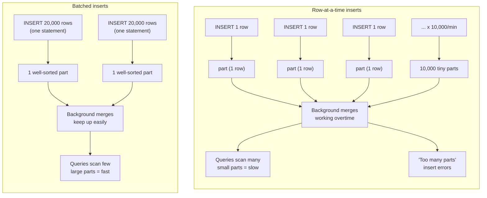

# Inserting & Querying Data

Chapter 6 gave you the mental model that makes ClickHouse fast: the `ORDER BY` tuple becomes a sparse primary index, `PARTITION BY` slices the table into independently-managed chunks, and everything lives inside immutable **parts** that get merged in the background. That's the theory of *how ClickHouse organizes data on disk*. This chapter is the practice: how do you actually get data in, and how do you write queries that work *with* that storage model instead of against it? Get the insert pattern wrong and you'll create the exact "too many small parts" pathology Chapter 3 warned about, no matter how well you chose your `ORDER BY` key. Get the query patterns right — `LIMIT BY`, sampling, `FINAL`, approximate aggregates — and you'll write SQL that feels unfamiliar coming from Postgres or MongoDB, but that is unmistakably ClickHouse: built for scanning billions of rows in milliseconds, not for surgically updating one row at a time.

We'll do everything against the `events` table from Chapter 6 — a `MergeTree` table with `ORDER BY (country, event_type, event_time)` and `PARTITION BY toYYYYMM(event_date)`.

---

## Learning Objectives

By the end of this chapter, you will be able to:

- Explain why batching inserts is the single most important operational rule in ClickHouse, and describe the exact mechanism (small inserts → small parts → merge pressure → degraded performance) by which violating it breaks a cluster.
- Write `INSERT INTO ... VALUES`, `INSERT INTO ... SELECT`, and file-based inserts (`FROM INFILE`), and know when each is the right tool.
- Explain what `async_insert` does and when it's the right fix for a client that can't batch on its own.
- Write `SELECT` queries using ClickHouse's core dialect, including the `LIMIT BY` extension for top-N-per-group queries.
- Use `WITH` clauses (CTEs and scalar subquery shorthand) to structure complex queries readably.
- Explain the `SAMPLE` clause: what problem it solves, what it requires at table-creation time, and its fundamental accuracy/speed tradeoff.
- Explain when the `FINAL` modifier is necessary for `ReplacingMergeTree`/`CollapsingMergeTree`-style engines, its performance cost, and when an `argMax`-based query is the faster alternative.
- Use `arrayJoin()` to explode array columns into rows, and use `uniq`/`uniqCombined`/`uniqHLL12` for fast approximate distinct counts.

---

## Prerequisites for This Chapter

This chapter assumes you're comfortable with:

- [Chapter 3: Architecture & Internals](./03-architecture-and-internals.md) — specifically, the parts-and-merges mechanism: every `INSERT` creates one new part per partition touched, and a background merge process periodically combines small parts into larger ones. If that sentence is unfamiliar, revisit Chapter 3's "Parts and Merges" section before continuing — this entire chapter's opening argument depends on it.
- [Chapter 6: Primary Keys & Sparse Indexing](./06-primary-keys-and-sparse-indexing.md) — the `events` table's `ORDER BY (country, event_type, event_time)` / `PARTITION BY toYYYYMM(event_date)` design, and the idea that the sparse index only helps queries that filter on a *prefix* of the `ORDER BY` tuple.
- Basic SQL: `SELECT`, `WHERE`, `GROUP BY`, `JOIN`, as listed in the course's [Chapter 1 prerequisites](./01-introduction-and-prerequisites.md).

---

## 1. The Golden Rule: Batch Your Inserts

If you remember exactly one operational fact from this course, make it this one.

> **Every `INSERT` statement creates at least one new part per partition it writes to.** ClickHouse parts are immutable — nothing is ever appended to an existing part. A part, once written, sits on disk until a background merge combines it with others.

Chapter 3 explained the mechanism; here's the consequence spelled out for insert design specifically.

### 1.1 What happens when you insert one row at a time

Imagine an application doing this, once per incoming event, in a hot loop:

```sql
INSERT INTO events (event_id, event_date, event_time, country, event_type, user_id, payload)
VALUES (123456, '2024-03-14', '2024-03-14 10:22:01', 'US', 'page_view', 4821, '{"page":"/home"}');
```

If this runs 500 times a second, ClickHouse creates roughly 500 new parts a second (assuming they all land in the same partition — if they spread across partitions, it's worse: one part *per partition touched, per insert*). Each part is disk-resident: it has its own column files, its own sparse index, its own metadata. A part holding one row costs almost as much bookkeeping overhead as a part holding 100,000 rows — the fixed cost per part is what kills you.

### 1.2 Why this degrades the system

- **Merge pressure explodes.** The background merge scheduler now has an enormous backlog of tiny parts to combine. Merges compete for CPU and I/O with your actual queries, and a system permanently behind on merges just falls further behind.
- **"Too many parts" errors.** ClickHouse enforces `parts_to_throw_insert` (default in the many hundreds per partition) as a hard safety limit — once a partition accumulates too many active parts, *new inserts start failing outright* with a "Too many parts" exception, specifically to protect the cluster from the death spiral this pattern causes.
- **Query performance degrades.** Reading a table means reading from *every active part* and merging results. Ten large parts is a cheap fan-out; ten thousand tiny parts is ten thousand small reads, ten thousand sets of index lookups, ten thousand column-file opens — even though the *total* row count might be modest.
- **It fights the whole design philosophy.** ClickHouse's sparse index (Chapter 6) is built to make scanning huge, well-organized parts cheap. One-row inserts guarantee you never get well-organized, well-sorted-together parts — you get shrapnel that background merges must spend enormous effort cleaning up.



### 1.3 The rule in practice

**Batch thousands to tens of thousands of rows per `INSERT`.** ClickHouse's own recommendation is roughly 1,000+ rows per insert as a floor, with 10,000–100,000+ rows per batch being a comfortable, efficient target for most workloads. Fewer, larger `INSERT`s beat many small ones — always. This single principle drives almost every ingestion architecture decision covered in [Chapter 14](./14-data-ingestion-and-integrations.md): buffering layers, Kafka consumer batch sizes, and client-library configuration all exist to serve this one constraint.

---

## 2. Insert Fundamentals

### 2.1 `INSERT INTO ... VALUES`

The straightforward form, and the right one when you already have the batch of rows in hand (e.g., assembled in application code):

```sql
INSERT INTO events (event_id, event_date, event_time, country, event_type, user_id, payload) VALUES
    (1001, '2024-03-14', '2024-03-14 09:00:01', 'US', 'page_view', 42, '{"page":"/home"}'),
    (1002, '2024-03-14', '2024-03-14 09:00:03', 'US', 'click',     42, '{"el":"signup-btn"}'),
    (1003, '2024-03-14', '2024-03-14 09:00:07', 'DE', 'page_view', 77, '{"page":"/pricing"}'),
    -- ... thousands more rows in this same statement ...
    (1004, '2024-03-14', '2024-03-14 09:00:09', 'DE', 'purchase',  77, '{"amount":49.99}');
```

All rows in a single `VALUES` statement land in the same `INSERT`, and — for rows sharing a partition key — the same new part(s). This is exactly the batching behavior Section 1 asked for.

### 2.2 `INSERT INTO ... SELECT` — server-side copy and transform

When the source data is *already inside ClickHouse* (another table, or the same table with a filter/transform applied), never round-trip rows through a client. `INSERT INTO ... SELECT` runs entirely server-side:

```sql
-- Copy a day's worth of events into an archive table with the same schema
INSERT INTO events_archive
SELECT *
FROM events
WHERE event_date = '2024-01-01';

-- Populate a summary table with an aggregation, in one server-side pass
INSERT INTO daily_country_summary
SELECT
    event_date,
    country,
    event_type,
    count() AS event_count,
    uniqCombined(user_id) AS approx_unique_users
FROM events
WHERE event_date = yesterday()
GROUP BY event_date, country, event_type;
```

This pattern is the backbone of materialized views (Chapter 9) and of most ETL-style pipelines inside ClickHouse: it avoids network round-trips entirely, and ClickHouse's vectorized execution engine (Chapter 3) makes the `SELECT` side of this fast even over huge source tables.

### 2.3 Inserting from files

For one-off loads or batch pipelines, ClickHouse can read directly from a local file in `clickhouse-client`:

```sql
INSERT INTO events
FROM INFILE '/data/events_2024_03_14.csv'
FORMAT CSVWithNames;
```

ClickHouse supports dozens of formats this way — `CSV`, `CSVWithNames`, `TSV`, `JSONEachRow`, `Parquet`, `ORC`, and more — and can even read compressed files directly (`.csv.gz`, etc.) by inferring the compression from the extension. This is only a preview: [Chapter 14](./14-data-ingestion-and-integrations.md) covers file-based ingestion, format nuances, schema inference, and building real production pipelines (Kafka engine, S3 table functions, client libraries) in full depth.

### 2.4 Async inserts: batching when the client can't

Batching is easy when your application controls the write path and can accumulate rows before flushing. It's much harder when you have thousands of independent, low-throughput clients each producing a trickle of rows — think IoT devices, or many small services each emitting a few log lines a second. Asking each one to implement its own buffering logic is a lot of duplicated complexity, and if they can't, you're back to the row-at-a-time problem from Section 1.

**Async inserts** are ClickHouse's built-in answer: the client sends small (even single-row) inserts as usual, but instead of immediately creating a part, the server holds incoming data in an in-memory buffer and flushes it as one batched part once a size or time threshold is hit.

```sql
INSERT INTO events (event_id, event_date, event_time, country, event_type, user_id, payload)
SETTINGS async_insert = 1, wait_for_async_insert = 1
VALUES (2001, '2024-03-14', '2024-03-14 09:05:00', 'FR', 'click', 88, '{}');
```

Key settings:

- `async_insert = 1` — enable the buffering behavior for this insert.
- `wait_for_async_insert` — if `1` (default), the client's `INSERT` blocks until the buffered data is actually flushed to a part (safer, slightly higher latency); if `0`, the server acknowledges immediately and flushes later (lower latency, small window of data-loss risk on server crash).
- `async_insert_max_data_size` / `async_insert_busy_timeout_ms` — control how large the server-side buffer can grow, and how long it will wait, before forcing a flush.

Async inserts are a safety net, not a replacement for application-side batching — if your application *can* batch rows itself before sending, do that first, since it gives you full control and avoids any server-side buffering latency. Reach for `async_insert` when you don't control the client, or when you have many small independent producers that structurally cannot coordinate a shared batch.

---

## 3. `SELECT` Fundamentals in the ClickHouse Dialect

The core of ClickHouse `SELECT` will feel completely familiar if you know standard SQL:

```sql
SELECT
    country,
    event_type,
    count() AS event_count
FROM events
WHERE event_date >= '2024-03-01' AND event_date < '2024-04-01'
GROUP BY country, event_type
ORDER BY event_count DESC
LIMIT 10;
```

A few dialect notes worth flagging early:

- `count()` (no arguments) is idiomatic ClickHouse for counting rows — equivalent to `count(*)`.
- Column aliases (`AS event_count`) can be reused directly in `GROUP BY` and `ORDER BY` in the same query — unlike stricter SQL dialects, you don't need to repeat the expression.
- `WHERE` filters that touch the leading columns of `ORDER BY` (here, `country`) or the partition expression (`event_date`, since `PARTITION BY toYYYYMM(event_date)`) get accelerated by partition pruning and the sparse index, per Chapter 6. A filter on `payload` gets neither — it's a full column scan.

### 3.1 `LIMIT BY` — top-N per group, a ClickHouse extension

Standard SQL makes "top 3 rows per group" annoying: you typically need a window function (`ROW_NUMBER() OVER (PARTITION BY ... ORDER BY ...)`) wrapped in a subquery. ClickHouse gives you a direct, simpler syntax for the common case: `LIMIT n BY <expression>`.

**Worked example: the 3 most recent events per user.**

```sql
SELECT
    user_id,
    event_time,
    event_type,
    country
FROM events
ORDER BY user_id, event_time DESC
LIMIT 3 BY user_id;
```

Read this as: "sort the rows, then for each distinct value of `user_id`, keep only the first 3 rows encountered." Because the outer `ORDER BY` sorts `event_time DESC` within each `user_id`, "first 3 encountered" means "3 most recent." `LIMIT BY` operates on already-sorted output, so the `ORDER BY` clause and the `LIMIT n BY` expression need to agree on what "first" means for your use case.

You can also combine it with a global `LIMIT`:

```sql
-- Top 3 most recent events per user, but only for the first 100 users returned
SELECT user_id, event_time, event_type
FROM events
ORDER BY user_id, event_time DESC
LIMIT 3 BY user_id
LIMIT 100;
```

`LIMIT BY` is simpler to write and typically faster than a `ROW_NUMBER()` window-function equivalent for this common shape — it's worth reaching for by default before writing a window-function workaround. Window functions in full (including cases `LIMIT BY` *can't* express) are covered in [Chapter 8](./08-aggregate-functions-and-analytics.md).

### 3.2 `WITH` clauses: CTEs and scalar shorthand

ClickHouse supports the standard CTE form for structuring multi-step queries:

```sql
WITH recent_events AS (
    SELECT *
    FROM events
    WHERE event_date >= today() - 7
)
SELECT country, count() AS event_count
FROM recent_events
GROUP BY country
ORDER BY event_count DESC;
```

It also supports a ClickHouse-specific shorthand: binding a **scalar** expression to a name with `WITH ... AS`, usable anywhere later in the query as if it were a constant:

```sql
WITH (SELECT max(event_time) FROM events) AS latest_event_time
SELECT
    user_id,
    event_time,
    latest_event_time - event_time AS seconds_since_this_event
FROM events
WHERE event_date = today()
ORDER BY event_time DESC
LIMIT 20;
```

This shorthand is handy for avoiding repeated subqueries or precomputing a constant (a threshold, a max timestamp, a total) once instead of recomputing it per row.

---

## 4. Sampling: Fast, Approximate Exploration

Sometimes you don't need an exact answer — you need a fast, "roughly right" answer while exploring a table with billions of rows. ClickHouse supports this natively with the `SAMPLE` clause, *if the table was defined with a sampling key*.

A sampling key is declared at table-creation time as part of the engine clause:

```sql
CREATE TABLE events_sampled
(
    event_id UInt64,
    event_date Date,
    event_time DateTime,
    country LowCardinality(String),
    event_type LowCardinality(String),
    user_id UInt64,
    payload String
)
ENGINE = MergeTree
PARTITION BY toYYYYMM(event_date)
ORDER BY (country, event_type, event_time)
SAMPLE BY intHash32(user_id);
```

The `SAMPLE BY` expression must be (or be derivable from) a prefix of the `ORDER BY` key, and typically wraps an evenly-distributed hash of a column so that sampling gets a statistically representative slice rather than an arbitrary chunk.

Once defined, you can query a fraction of the table directly:

```sql
-- Scan roughly 10% of the data
SELECT
    event_type,
    count() * 10 AS estimated_total_count   -- scale the sample back up
FROM events_sampled
SAMPLE 0.1
GROUP BY event_type;

-- Or sample a fixed approximate row count instead of a fraction
SELECT event_type, count()
FROM events_sampled
SAMPLE 1000000
GROUP BY event_type;
```

**Use case:** interactive, exploratory queries over huge tables — "roughly what does the distribution of `event_type` look like this month?" — where waiting for an exact full-table scan is wasted time when a 10% sample gives you a directionally correct answer in a fraction of the runtime.

**Tradeoff:** results are approximate by construction. Counts need manual rescaling (as above), rare categories can be under- or over-represented in the sample, and you should never use `SAMPLE` for anything requiring an exact number (billing, compliance reporting, financial totals). It's an exploration tool, not a production-query default.

Note: our original `events` table from Chapter 6 was **not** defined with `SAMPLE BY` — you cannot retrofit sampling onto an existing table without redefining its engine clause, which is why the sampling key is a decision to make at schema-design time, not an afterthought.

---

## 5. `FINAL`: Forcing Merges at Query Time

Chapter 5 introduced `ReplacingMergeTree` (keeps only the latest version of a row per `ORDER BY` key, resolved during background merges) and `CollapsingMergeTree` (cancels out row pairs to simulate updates/deletes). Both rely on the **background merge process** to actually do the deduplication/collapsing — and background merges run on ClickHouse's own schedule, not yours. At any given moment, a table using these engines may have several unmerged parts still containing stale or not-yet-collapsed rows.

The `FINAL` modifier forces ClickHouse to perform that merge logic *at query time*, guaranteeing a fully deduplicated/collapsed result regardless of what background merges have or haven't happened yet:

```sql
SELECT user_id, email, updated_at
FROM user_profiles   -- a ReplacingMergeTree table
FINAL
WHERE user_id = 42;
```

### 5.1 The cost

`FINAL` is not free — it makes the query engine merge matching rows across *all* active parts on the fly, for every row the query touches, instead of reading pre-merged data straight off disk. On a table with many parts, or over a large result set, this can be dramatically slower than a plain `SELECT`, and that cost scales with how far behind background merges are, which is inherently unpredictable.

### 5.2 When you actually need it vs. the `argMax` alternative

Use `FINAL` when:

- Correctness genuinely requires the fully deduplicated view *right now* (e.g., a single-row point lookup like the example above, where the query touches few rows and the cost is negligible).
- You're doing ad-hoc debugging or validation and want ground truth without worrying about merge timing.

Prefer an **`argMax`-based query** when you're aggregating over many rows and performance matters — this pattern gets you the "latest version per key" result without forcing a full merge:

```sql
SELECT
    user_id,
    argMax(email, updated_at) AS latest_email,
    max(updated_at) AS updated_at
FROM user_profiles
GROUP BY user_id;
```

`argMax(column, order_by_column)` returns the value of `column` from the row with the maximum `order_by_column`, per group — which is exactly what `ReplacingMergeTree` is doing internally during a merge, except computed directly by the query engine's aggregation path (which ClickHouse is extremely fast at) instead of by forcing on-the-fly part merging. For dashboards and any query running frequently or over large row counts, `argMax` is almost always the better-performing choice; reserve `FINAL` for low-volume, correctness-critical lookups. This tradeoff is revisited in [Chapter 13](./13-performance-tuning-and-query-optimization.md) when we look at `EXPLAIN` output for `FINAL` queries directly.

---

## 6. Array Extensions: `arrayJoin()`

ClickHouse's `Array(T)` columns (Chapter 4) are powerful for storage — you can keep a whole list of tags, item IDs, or scores in a single cell — but sometimes you need to treat each array *element* as its own row for aggregation. `arrayJoin()` does this: it explodes an array column into multiple output rows, one per element, duplicating every other column across the rows produced.

This is ClickHouse's rough equivalent of Postgres's `UNNEST()` or MongoDB's `$unwind` stage — if you've taken this repo's [MongoDB course](../mongodb-course/00-index.md), `arrayJoin()` here plays exactly the role `$unwind` plays in [Chapter 8 of that course](../mongodb-course/08-aggregation-stages-deep-dive.md): one array-valued input row becomes many single-valued output rows.

Suppose `events` had a `tags Array(String)` column (e.g., `['mobile', 'checkout', 'promo']`):

```sql
SELECT
    event_id,
    arrayJoin(tags) AS tag
FROM events
WHERE event_date = today();
```

If a row has `tags = ['mobile', 'checkout', 'promo']`, this produces three output rows, each with the same `event_id` and one of the three tag values. This is exactly what you want for a query like "count events by tag" — grouping by the exploded column:

```sql
SELECT
    arrayJoin(tags) AS tag,
    count() AS tag_count
FROM events
WHERE event_date = today()
GROUP BY tag
ORDER BY tag_count DESC;
```

`arrayJoin()` can appear anywhere in the `SELECT` list (not just as a dedicated clause the way `UNNEST` is in Postgres), which is convenient but also means it's easy to accidentally call it multiple times in one query and get a cross-product explosion — a detail worth remembering, and one Chapter 17 revisits as a common mistake.

---

## 7. Approximate Aggregates: `uniq()`, `uniqCombined()`, `uniqHLL12()`

Computing an *exact* `count(DISTINCT user_id)` over billions of rows requires tracking every distinct value seen — memory usage grows with cardinality, and on a high-cardinality column over a huge table this can mean gigabytes of intermediate state and a slow query.

ClickHouse's answer, and one of its most defining idioms, is a family of **approximate distinct-count functions** built on HyperLogLog-style probabilistic algorithms, which estimate cardinality using a small, fixed amount of memory regardless of how many distinct values actually exist:

```sql
-- Exact, but memory- and time-expensive at scale
SELECT count(DISTINCT user_id) FROM events WHERE event_date = today();

-- Approximate, fast, low fixed memory footprint
SELECT uniqCombined(user_id) FROM events WHERE event_date = today();
```

- **`uniq()`** — ClickHouse's original approximate-cardinality estimator (adaptive, combines several algorithms depending on input size); a solid default.
- **`uniqCombined()`** — generally the recommended choice: combines a hash-set for small cardinalities with a HyperLogLog-style estimator for large ones, giving good accuracy across the whole range with a small, bounded memory footprint. Typical error is well under 1% for most real-world cardinalities.
- **`uniqHLL12()`** — a "pure" HyperLogLog implementation with fixed memory usage regardless of cardinality; slightly less accurate than `uniqCombined()` at small scale, but useful when you want fully predictable, constant memory cost.

The point isn't which specific function to memorize — it's the *idiom*: **trading a small, well-understood amount of accuracy for a large, predictable amount of speed and memory savings is a defining ClickHouse pattern**, not a corner case. It shows up again with `quantile()`/`quantileTDigest()` for approximate percentiles, and with sketch-based functions generally. Full coverage of the aggregate-function ecosystem, including combinators like `-If` and `-State`/`-Merge`, is in [Chapter 8](./08-aggregate-functions-and-analytics.md).

---

## Real-World Scenario

**Setup:** Your team owns an application emitting user events (`page_view`, `click`, `purchase`) into ClickHouse's `events` table. Two problems have landed on your desk this sprint.

**Problem 1: Part explosion from row-at-a-time inserts.**

The event-tracking service was written to call `INSERT INTO events VALUES (...)` synchronously, once per event, directly from the request-handling code path — "just write it right away, it's simple." At low traffic this looked fine. At current traffic (roughly 800 events/second), the `events` table's most recent partition has ballooned to thousands of active parts, background merges are constantly behind, and dashboard queries against today's data have gotten visibly slower over the past two weeks — some now intermittently fail with a "too many parts" insert error during traffic spikes.

Using this chapter's Section 1 diagnosis: this is a textbook case of small-part explosion. The fix has two layers:

1. **Application-side batching where possible** — the request-handling code is refactored to push events onto an in-memory queue, flushed to ClickHouse as a single `INSERT` every 2 seconds or every 5,000 rows, whichever comes first. This alone turns ~800 tiny inserts/second into roughly one batched insert every couple of seconds.
2. **`async_insert` as a safety net for stragglers** — a handful of lower-traffic internal services that emit events sporadically and can't easily justify their own buffering logic are switched to send inserts with `async_insert = 1, wait_for_async_insert = 1`, letting ClickHouse itself absorb and batch their trickle of writes server-side.

Within a day, active part counts per partition drop back to a healthy range, background merge backlog clears, and dashboard query latency returns to baseline.

**Problem 2: A slow exact-distinct dashboard query.**

The main analytics dashboard runs, on every page load:

```sql
SELECT country, count(DISTINCT user_id) AS unique_users
FROM events
WHERE event_date = today()
GROUP BY country;
```

On a table with tens of millions of events per day and high-cardinality `user_id`s, this query takes several seconds — noticeably slow for a dashboard users expect to load instantly. Since the dashboard is explicitly framed as "approximately how many unique users," exact precision isn't a real requirement. Swapping to:

```sql
SELECT country, uniqCombined(user_id) AS unique_users
FROM events
WHERE event_date = today()
GROUP BY country;
```

cuts query time by more than 10x, with the reported numbers differing from the exact count by a fraction of a percent — well within what a dashboard consumer needs. The team documents the change with a one-line note: "unique user counts on this dashboard are approximate (`uniqCombined`), by design, for speed."

---

## Best Practices

- **Always batch inserts** — thousands to tens of thousands of rows per `INSERT`, never one row per statement in a loop. This is the single highest-leverage operational habit in ClickHouse.
- **Use `async_insert` for client-side batching gaps, not as your primary ingestion strategy.** If your application can batch rows itself, do that first; reach for async inserts when you genuinely can't control or coordinate the client side.
- **Prefer `uniq()`/`uniqCombined()` over `count(DISTINCT ...)` for large-scale distinct counts** whenever approximation is acceptable — which, for most dashboards and exploratory analytics, it is.
- **Avoid `FINAL` in hot query paths.** Reserve it for low-volume, correctness-critical lookups; for aggregations over many rows on `ReplacingMergeTree`-style tables, use `argMax()`/`max()` patterns instead.
- **Reach for `LIMIT BY` before a window-function workaround** for simple "top N per group" queries — it's simpler to write and typically faster for the cases it covers.
- **Design sampling keys at table-creation time if you'll need `SAMPLE`.** You cannot bolt a sampling key onto an existing table without redefining its engine clause.
- **Use `INSERT INTO ... SELECT` for any data movement that's already inside ClickHouse.** Never round-trip rows through a client just to write them back into another table.

---

## Common Mistakes

- **Inserting one row at a time in a loop.** This is the single most common ClickHouse anti-pattern in the wild, and the direct cause of "too many parts" production incidents.
- **Running exact `count(DISTINCT ...)` over huge, high-cardinality columns** and being surprised by high memory usage and slow queries — when `uniqCombined()` would have given a near-identical answer in a fraction of the time and memory.
- **Overusing `FINAL` in production dashboards** — sprinkling it onto every query against a `ReplacingMergeTree` table "just to be safe," turning cheap reads into expensive on-the-fly merges at query time.
- **Trying to use `SAMPLE` on a table with no sampling key defined**, and being confused when ClickHouse rejects the query — the sampling key must exist in the table's engine definition from creation time.
- **Calling `arrayJoin()` more than once in the same `SELECT` list** and getting an unexpected cross-product of rows, rather than the intended one-array-explosion.
- **Treating async inserts as a substitute for good application design** rather than a safety net — leaning on `async_insert` everywhere instead of fixing a client that genuinely could batch its own writes.
- **Forgetting that `LIMIT n BY` depends on `ORDER BY` agreeing with its intent** — writing `LIMIT 3 BY user_id` without an `ORDER BY user_id, event_time DESC` first gives you "some 3 rows per user," not "the 3 most recent."

---

## Summary

- ClickHouse's golden insert rule: **batch thousands to tens of thousands of rows per `INSERT`.** Row-at-a-time inserts create one tiny part per insert, overwhelming background merges and eventually triggering "too many parts" errors and degraded query performance — the direct, practical consequence of Chapter 3's parts-and-merges architecture.
- `INSERT INTO ... VALUES` covers direct batch loads; `INSERT INTO ... SELECT` moves/transforms data entirely server-side; `INSERT ... FROM INFILE` loads from local files in formats like `CSVWithNames` — a preview of Chapter 14's ingestion depth.
- `async_insert` lets ClickHouse itself buffer and batch many small client-side inserts server-side, for cases where the client can't easily batch on its own.
- `SELECT` follows familiar SQL shape, plus ClickHouse extensions: `LIMIT n BY <expr>` for top-N-per-group without window functions, and `WITH` for both full CTEs and scalar shorthand bindings.
- `SAMPLE` enables fast, approximate queries over a fraction of a table, but requires a `SAMPLE BY` key defined at table-creation time, and trades exactness for speed.
- `FINAL` forces query-time merging for `ReplacingMergeTree`/`CollapsingMergeTree`-style tables, guaranteeing correctness but at real performance cost — `argMax()`-based aggregation is usually the faster alternative for anything beyond small, targeted lookups.
- `arrayJoin()` explodes array columns into rows (ClickHouse's analog to Postgres `UNNEST` or MongoDB's `$unwind`); `uniq()`/`uniqCombined()`/`uniqHLL12()` trade a small amount of accuracy for large speed and memory wins on distinct counts — a defining ClickHouse idiom, expanded fully in Chapter 8.

---

## Knowledge Check

1. Explain, mechanically, why inserting one row at a time in a loop eventually causes "too many parts" errors, tracing the chain from `INSERT` through parts through background merges.
2. When would you reach for `INSERT INTO ... SELECT` instead of reading rows out with a client and writing them back with a separate `INSERT`?
3. What problem does `async_insert` solve, and why is it not a replacement for application-side batching when the application is capable of batching itself?
4. Write a query (in words or SQL) that returns the 5 highest-value purchases per country, most recent first, using `LIMIT BY`.
5. You need the exact number of distinct users for a monthly billing report, and separately, an approximate unique-user count for a real-time dashboard. Which function would you use for each, and why?
6. A colleague adds `FINAL` to every query against a `ReplacingMergeTree` table "to be safe." What's the performance risk, and what alternative would you suggest for a high-volume aggregation query?

---

## Hands-On Exercise

Work through this in `clickhouse-client` against the `events` table from Chapter 6 (create it first if you haven't already, matching its `ORDER BY (country, event_type, event_time)` / `PARTITION BY toYYYYMM(event_date)` design).

**1. Batch-insert synthetic data.**

Generate and insert a few thousand rows in a single statement using `INSERT INTO ... SELECT` against ClickHouse's built-in `numbers()` table function, rather than typing rows by hand:

```sql
INSERT INTO events (event_id, event_date, event_time, country, event_type, user_id, payload)
SELECT
    number AS event_id,
    today() - (number % 30) AS event_date,
    now() - (number % 100000) AS event_time,
    ['US', 'DE', 'FR', 'IN', 'BR'][(number % 5) + 1] AS country,
    ['page_view', 'click', 'purchase'][(number % 3) + 1] AS event_type,
    number % 500 AS user_id,
    '{}' AS payload
FROM numbers(5000);
```

Confirm all 5,000 rows landed in a small number of parts (not 5,000 parts) by checking `system.parts`:

```sql
SELECT table, partition, count() AS part_count, sum(rows) AS total_rows
FROM system.parts
WHERE table = 'events' AND active
GROUP BY table, partition
ORDER BY partition;
```

**2. Write a `LIMIT BY` top-N-per-group query.**

Find the 3 most recent events per user, per day:

```sql
SELECT
    user_id,
    event_date,
    event_time,
    event_type
FROM events
ORDER BY user_id, event_date, event_time DESC
LIMIT 3 BY user_id, event_date;
```

**3. Compare exact vs. approximate distinct counts.**

First, scale up your synthetic dataset (repeat step 1's insert a few more times with different `number` offsets, or increase the `numbers(...)` argument to `numbers(2000000)`, to get a dataset large enough to see a real timing difference). Then run both queries and compare wall-clock time and results:

```sql
SELECT count(DISTINCT user_id) FROM events;

SELECT uniqCombined(user_id) FROM events;
```

Use ClickHouse client's `--time` output (or wrap each in `clickhouse-client --time -q "..."` from the shell) to compare execution time directly, and note how close the two counts are.

---

## Further Reading

- [ClickHouse Docs: INSERT INTO Statement](https://clickhouse.com/docs/en/sql-reference/statements/insert-into) — full syntax for `VALUES`, `SELECT`, and `FROM INFILE` forms.
- [ClickHouse Docs: SELECT Query](https://clickhouse.com/docs/en/sql-reference/statements/select) — the full `SELECT` clause reference, including `LIMIT BY` and `SAMPLE`.
- [ClickHouse Docs: LIMIT BY Clause](https://clickhouse.com/docs/en/sql-reference/statements/select/limit-by) — detailed semantics and edge cases for top-N-per-group queries.
- [ClickHouse Docs: uniq, uniqCombined, uniqHLL12](https://clickhouse.com/docs/en/sql-reference/aggregate-functions/reference/uniqcombined) — accuracy/performance characteristics of each approximate-distinct-count function.
- [ClickHouse Docs: Asynchronous Inserts](https://clickhouse.com/docs/en/optimize/asynchronous-inserts) — settings, guarantees, and when to use `async_insert` in production.

---

<div style="display:flex;justify-content:space-between;align-items:center;">
  <a href="./06-primary-keys-and-sparse-indexing.md">← Previous: Primary Keys & Sparse Indexing</a>
  <a href="./00-index.md">🏠 Index</a>
  <a href="./08-aggregate-functions-and-analytics.md">Next: Aggregate Functions & Analytics →</a>
</div>
