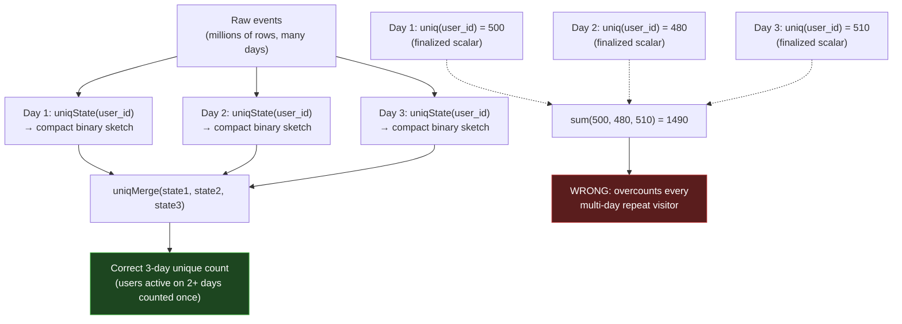

# Aggregate Functions & Analytics

Chapter 7 got raw rows into `analytics.events` and back out again with `SELECT`, `WHERE`, `ORDER BY`, and a first, deliberately shallow look at approximate aggregation via `uniqCombined`. That was necessary plumbing. This chapter is the point of the whole exercise. An OLAP database exists to answer questions like "how many," "how much," "what's the p95," and "what's the running total" over enormous row counts — aggregation *is* the workload, not a feature bolted onto one. ClickHouse's SQL dialect reflects that priority: alongside the aggregate functions you already know from any SQL database, it ships a genuinely unusual mechanism — **aggregate function combinators** — that lets you bolt a suffix onto almost any aggregate function to change its behavior: filter it, run it over array elements, or split it into a cheap, mergeable partial state. That last capability, `-State`/`-Merge`, is the mechanism every incremental materialized view in Chapter 9 is built on, so understanding it here is not optional — it's the hinge the rest of this course's analytics story swings on.

---

## Learning Objectives

By the end of this chapter, you will be able to:

- Use ClickHouse's standard aggregate functions (`count`, `sum`, `avg`, `min`/`max`, `groupArray`, `any`/`anyLast`) fluently, including their NULL and array-collection behavior.
- Explain the aggregate combinator mechanism in general — what a combinator is, how it composes with any aggregate function name, and why ClickHouse designed aggregation this way.
- Write single-pass conditional aggregations with `-If` instead of multiple filtered queries, and relate this to `FILTER (WHERE ...)` in PostgreSQL and `$sum`-with-`$cond` patterns in MongoDB's aggregation pipeline.
- Apply the `-Array` combinator to aggregate values stored inside `Array` columns.
- Explain precisely what `-State` produces (an intermediate, unfinished aggregation state) and what `-Merge` does with it, and why this pair is the mechanism behind correct incremental rollups — including the classic "summing daily uniques is wrong" trap.
- Produce subtotal/grand-total reports using `GROUP BY ... WITH ROLLUP`, `WITH CUBE`, and `WITH TOTALS`.
- Write standard SQL window functions (`OVER (PARTITION BY ... ORDER BY ...)`) in ClickHouse, including ranking, offset, and running-total patterns.
- Choose between exact and approximate quantile functions (`quantileExact`, `quantileTDigest`, `quantile`) for percentile calculations at different data scales.

---

## Prerequisites for This Chapter

This chapter builds directly on [Chapter 7: Inserting & Querying Data](./07-inserting-and-querying-data.md). We assume you can already:

- Insert batches of rows into `analytics.events` and run basic `SELECT` / `WHERE` / `ORDER BY` / `LIMIT` queries against it.
- Recognize ClickHouse's SQL-dialect extensions at a "seen the name before" level, including the brief introduction to `uniqCombined` for approximate distinct counting.
- Recall the `events` table schema from [Chapter 2](./02-core-concepts.md): `event_time`, `event_date`, `user_id`, `event_type`, `url`, `country`, `device`, `duration_ms`.

If any of that feels shaky, revisit Chapter 7 before continuing — this chapter assumes comfortable, unhesitating `SELECT` syntax so it can spend its attention on aggregation semantics.

---

## 1. Recap: Standard Aggregate Functions

Every SQL database has a baseline set of aggregate functions, and ClickHouse's baseline will look immediately familiar if you've used PostgreSQL, MySQL, or MongoDB's `$group` stage. Working against `analytics.events`:

```sql
SELECT
    count()                    AS total_events,
    sum(duration_ms)           AS total_duration_ms,
    avg(duration_ms)           AS avg_duration_ms,
    min(duration_ms)           AS fastest_ms,
    max(duration_ms)           AS slowest_ms
FROM analytics.events;
```

A few ClickHouse-specific notes worth internalizing now, before combinators pile on top:

- **`count()` with no argument** counts rows, exactly like `COUNT(*)` in standard SQL. `count(column)` counts non-NULL values in that column — same NULL-skipping behavior you know from Postgres. Because most `events` columns are declared without `Nullable`, `count(column)` and `count()` usually agree here; the distinction resurfaces the moment a column is `Nullable`.
- **`groupArray(column)`** collects every value in the group into an `Array`, in arrival order (or in the group's iteration order, which is not guaranteed unless you also sort). It's the rough equivalent of Postgres's `array_agg` or MongoDB's `$push`:

```sql
SELECT
    country,
    groupArray(event_type) AS event_types_seen
FROM analytics.events
GROUP BY country;
```

  `groupArray` is memory-hungry on huge groups — it materializes every value — so it's a tool for exploratory queries and moderate-cardinality groups, not a routine production aggregation over billions of rows. `groupArray(N)(column)` caps the array at `N` elements if you just need a sample.

- **`any(column)` and `anyLast(column)`** return *an* arbitrary value from the group — `any` returns roughly the first value it encounters, `anyLast` the last, and neither guarantees which row that came from unless you've established an order some other way. They exist because ClickHouse's `GROUP BY` is strict like Postgres's: every non-aggregated `SELECT` column must be wrapped in an aggregate function. When you don't actually care which representative value shows up (e.g., "any URL this user visited, I just need a non-null example"), `any()` is cheaper than `groupArray()[1]` because it doesn't materialize an array first.

```sql
SELECT
    user_id,
    any(url)   AS sample_url,
    count()    AS event_count
FROM analytics.events
GROUP BY user_id;
```

This baseline is competent but unremarkable — it's the part of ClickHouse's aggregation story that needs no new mental model. The interesting part starts now.

---

## 2. Aggregate Combinators: The Core Mechanism

A **combinator** is a suffix you append to the *name* of almost any aggregate function to change how it behaves, without changing what it fundamentally computes. The general shape is:

```
<aggregateFunction><Combinator>(arguments)
```

So `sum` becomes `sumIf`, `uniq` becomes `uniqState`, `avg` becomes `avgArray`, and — because combinators compose — you can even stack them: `sumIfMerge`, `uniqStateIf`, and so on, in specific orders the documentation spells out per combinator.

This is not a small set of special-cased functions someone hand-wrote. It's a **general mechanism**: ClickHouse's aggregate function framework was designed from the start so that any conforming aggregate function — built-in or user-defined — automatically gains combinator variants. That's a deliberate architectural choice, and it's worth pausing on *why* it exists rather than treating it as syntax trivia.

Most databases treat "aggregate with a condition," "aggregate over array elements," and "aggregate incrementally, mergeable later" as three unrelated features, each solved with its own bolted-on syntax (`FILTER`, `unnest`+`array_agg`, and materialized-view-specific machinery, respectively). ClickHouse instead asked: what if these are all just *transformations of an aggregate function's behavior*, and any aggregate function should be able to opt into any of them uniformly? The combinator suffix is the answer. It's the same design instinct you'll recognize from functional programming's higher-order functions — `-If`, `-Array`, and `-State` are each, in effect, a small function that takes an aggregate function and returns a modified one.

The combinators this chapter covers in depth:

| Combinator | What it does | Section |
|---|---|---|
| `-If` | Aggregates only rows matching a condition, in one pass | §3 |
| `-Array` | Aggregates over the elements of an `Array` column instead of scalar column values | §4 |
| `-State` | Produces an intermediate, not-yet-finalized aggregation state (a binary blob), not a scalar | §5 |
| `-Merge` | Combines multiple `-State` values into one finalized result | §5 |

And a few named briefly for completeness in §6: `-OrDefault`, `-OrNull`, `-Distinct`, `-Resample`.

---

## 3. The `-If` Combinator: Conditional Aggregation in One Pass

The `-If` combinator appends a condition as the aggregate function's *last* argument. The function only "sees" rows where that condition is true — everything else is skipped, as if filtered, but without a separate query or a separate scan.

```sql
SELECT
    count()                                            AS total_events,
    countIf(event_type = 'purchase')                   AS purchases,
    sumIf(duration_ms, event_type = 'purchase')         AS purchase_duration_ms,
    avgIf(duration_ms, event_type = 'page_view')        AS avg_page_view_duration_ms,
    uniqIf(user_id, country = 'US')                     AS us_unique_users
FROM analytics.events;
```

One query, one pass over the data, five differently-filtered aggregates. Compare the alternatives you'd reach for in other systems:

**PostgreSQL** — the `FILTER (WHERE ...)` clause covered in the sibling course's [Chapter 7 on Aggregation & Grouping](../postgresql-course/07-aggregation-grouping.md) does exactly the same conceptual job:

```sql
SELECT
    count(*)                                      AS total_orders,
    count(*) FILTER (WHERE status = 'paid')       AS paid_orders,
    sum(total) FILTER (WHERE status = 'paid')     AS paid_revenue
FROM orders;
```

Or the older, more portable `CASE WHEN` idiom that `FILTER` replaced:

```sql
SELECT sum(CASE WHEN status = 'paid' THEN total ELSE 0 END) AS paid_revenue
FROM orders;
```

**MongoDB's aggregation pipeline** reaches the same result with a `$cond` inside a `$group` accumulator, or a `$match`-then-`$group` pair split into two conceptual stages:

```javascript
db.orders.aggregate([
  { $group: {
      _id: null,
      totalOrders: { $sum: 1 },
      paidRevenue: {
        $sum: { $cond: [{ $eq: ["$status", "paid"] }, "$total", 0] }
      }
  }}
])
```

All three — ClickHouse's `-If`, Postgres's `FILTER`, and MongoDB's `$cond`-inside-`$sum` — are the *same idea* wearing three different syntaxes: compute a conditional aggregate without a separate filtered scan or a self-join of pre-filtered subqueries. ClickHouse's spin is that this isn't one special clause bolted onto `GROUP BY` — it's a combinator that composes with *every* aggregate function uniformly, including ones you'll meet later like `uniqIf` or `quantileIf`.

`-If` combines naturally with `GROUP BY`:

```sql
SELECT
    country,
    countIf(event_type = 'purchase')            AS purchases,
    countIf(event_type = 'page_view')           AS page_views,
    sumIf(duration_ms, event_type = 'purchase') AS purchase_duration_ms
FROM analytics.events
GROUP BY country
ORDER BY purchases DESC;
```

This single query replaces what would otherwise be several separate `WHERE`-filtered queries (or a `UNION ALL` of them) — a real win in an OLAP system where each additional full scan of a large table has a real, non-trivial cost.

---

## 4. The `-Array` Combinator: Aggregating Inside Array Columns

ClickHouse treats `Array(T)` as a first-class value (Chapter 2 previewed this), and the `-Array` combinator lets an aggregate function operate on the *elements* of an array column across all rows, rather than on one scalar value per row.

To illustrate, extend `events` with a column this section needs — a small array of engagement scores attached to each event (imagine a scoring model that tags each event with a few relevance scores):

```sql
ALTER TABLE analytics.events
    ADD COLUMN IF NOT EXISTS tag_scores Array(Float32) DEFAULT [];

-- example rows
INSERT INTO analytics.events
    (event_time, event_date, user_id, event_type, url, country, device, duration_ms, tag_scores)
VALUES
    (now(), today(), 1001, 'page_view', '/pricing', 'US', 'desktop', 850, [0.9, 0.4, 0.1]),
    (now(), today(), 1002, 'click',     '/pricing', 'US', 'mobile',  120, [0.2, 0.7]);
```

`sumArray` sums every element across every array in the group, as if all the arrays were flattened into one long list first:

```sql
SELECT
    country,
    sumArray(tag_scores) AS total_tag_score
FROM analytics.events
GROUP BY country;
```

`avgArray`, `maxArray`, `minArray`, and `countArray` follow the same pattern — apply the base aggregate to the flattened multiset of all array elements seen in the group. This is distinct from ClickHouse's separate *array functions* (`arraySum`, `arrayMax`, and friends), which operate on **one array at a time**, per row, and return one value per row rather than collapsing across rows:

```sql
-- per-row: one value per row, no aggregation across rows
SELECT event_time, arraySum(tag_scores) AS row_score_sum
FROM analytics.events;

-- -Array combinator: aggregates across rows AND across each row's array elements
SELECT sumArray(tag_scores) AS grand_total_score
FROM analytics.events;
```

Keep those two mental models separate: `arraySum` is a per-row array function; `sumArray` is a combinator that turns `sum` into something that consumes many arrays across many rows and produces one number (or one number per group).

---

## 5. The `-State` and `-Merge` Combinators: Partial Aggregation and Rollups

This is the combinator pair that matters most in this course, because it is the exact mechanism behind `AggregatingMergeTree` (Chapter 5) and every incremental materialized view you'll build in Chapter 9. It deserves the deepest treatment in this chapter.

### 5.1 The problem: re-aggregating without re-scanning

Suppose you compute a daily unique-user count and store it:

```sql
SELECT event_date, uniq(user_id) AS daily_uniques
FROM analytics.events
GROUP BY event_date;
```

Now someone asks: "what was the unique-user count for the whole *week*?" The tempting, wrong shortcut is to sum the daily numbers you already have:

```sql
-- WRONG: this overcounts
SELECT sum(daily_uniques) AS weekly_uniques_WRONG
FROM daily_unique_counts
WHERE event_date BETWEEN '2026-06-29' AND '2026-07-05';
```

This is wrong for a structural reason, not a rounding error: **a `uniq()` result is not additive.** If user 1001 visits on Monday and again on Wednesday, they get counted once in Monday's `daily_uniques` and once in Wednesday's — summing those two numbers counts that one user twice. The only fully correct way to get the true weekly unique count from raw data is to re-run `uniq(user_id)` over the *entire week's rows at once*, so the dedup happens across the whole window in one computation. But that means re-scanning every raw row every time you want a coarser rollup — for a database whose entire premise is avoiding unnecessary re-scans, that's an unacceptable cost at scale.

### 5.2 The fix: `-State` produces a mergeable partial answer

`-State` changes what an aggregate function *returns*. Instead of a finished scalar (a number, a string), it returns an **intermediate aggregation state** — an opaque, engine-specific binary representation of "everything this aggregate function needs to remember so far to eventually produce a correct answer, if given more data later."

```sql
SELECT
    event_date,
    uniqState(user_id) AS daily_uniques_state
FROM analytics.events
GROUP BY event_date;
```

`daily_uniques_state` is **not a number** — it's a blob (internally, for `uniq`, something resembling a HyperLogLog-style sketch) that fully captures the set of distinct `user_id`s seen that day, in a form far smaller than storing every raw `user_id`, but rich enough to be combined correctly with other days' states later.

`-Merge` is the inverse operation: it takes many such states and combines them into one finalized, correct result — as if the underlying raw rows for all of them had been aggregated together in a single pass, without ever touching the raw rows again:

```sql
SELECT uniqMerge(daily_uniques_state) AS weekly_uniques_CORRECT
FROM daily_unique_counts
WHERE event_date BETWEEN '2026-06-29' AND '2026-07-05';
```

Because the state carries enough internal information to deduplicate correctly across the merge, a user who appears in both Monday's and Wednesday's state is counted **once** in the merged weekly result — exactly the correct answer, computed without re-touching a single raw event row.

### 5.3 Why this matters beyond one query

This pattern generalizes to any partial-aggregation-then-rollup need: daily sums merged into monthly sums, hourly quantile sketches merged into daily percentiles, per-shard partial aggregates merged into a cluster-wide total. The state/merge split is what lets you pay the expensive "scan raw rows" cost exactly once, store a small durable summary of the result, and cheaply recombine those summaries at whatever coarser granularity you need later — a materialized view (Chapter 9) is, mechanically, a background process that computes `-State` values incrementally as data arrives, and an `AggregatingMergeTree` table (Chapter 5) is a storage engine whose *job* is to merge those states together during background part merges. Every time Chapter 9 says "the materialized view keeps a running pre-aggregation," it means "a table storing `AggregateFunction(...)`-typed columns produced by `-State`, kept up to date and periodically compacted by `-Merge`-style combination." Understanding `-State`/`-Merge` now is what makes Chapter 9 feel inevitable rather than magical.

### 5.4 The type system detail: `AggregateFunction(...)`

A `-State` value needs somewhere to live if you want to store it in a table rather than consume it immediately — and it cannot live in an ordinary column type, because it isn't an ordinary value. ClickHouse has a dedicated column type family for exactly this purpose: `AggregateFunction(function_name, arg_types...)`.

```sql
CREATE TABLE analytics.daily_unique_users
(
    event_date  Date,
    uniques_state AggregateFunction(uniq, UInt64)
)
ENGINE = AggregatingMergeTree
ORDER BY event_date;

INSERT INTO analytics.daily_unique_users
SELECT
    event_date,
    uniqState(user_id) AS uniques_state
FROM analytics.events
GROUP BY event_date;
```

Notice the type parameters mirror the aggregate function's own signature: `AggregateFunction(uniq, UInt64)` because `uniq` is being applied to a `UInt64` column (`user_id`). Reading this column back with an ordinary `SELECT *` shows unreadable binary data — you must finalize it with the matching `-Merge` function to get a usable number:

```sql
SELECT event_date, uniqMerge(uniques_state) AS daily_uniques
FROM analytics.daily_unique_users
GROUP BY event_date;

-- and the correct weekly rollup, from the same stored states:
SELECT uniqMerge(uniques_state) AS weekly_uniques
FROM analytics.daily_unique_users
WHERE event_date BETWEEN '2026-06-29' AND '2026-07-05';
```

`AggregatingMergeTree` (previewed in Chapter 5, used heavily in Chapter 9) is specifically the table engine that knows how to merge rows sharing the same `ORDER BY` key by calling each `AggregateFunction` column's `-Merge` logic during background part merges — so the table itself stays pre-aggregated over time, with no application code needed to trigger the merging.

### 5.5 The flow, visually



The top path (`-State` → `-Merge`) never finalizes a number until all the data it needs has been combined, so the dedup logic stays correct across the merge. The bottom path finalizes too early — each `uniq()` throws away exactly the cross-day information needed to dedupe correctly — and simple arithmetic on the finalized numbers can never recover it.

---

## 6. Other Combinators at a Glance

A handful of additional combinators are worth knowing exist, without going as deep:

- **`-OrDefault`** — returns the aggregate function's type's default value (e.g., `0`, `''`) instead of throwing an error or returning nothing when the input set is empty. `maxOrDefault(duration_ms)` returns `0` rather than failing on an empty group.
- **`-OrNull`** — returns `NULL` instead of a default when there's nothing to aggregate, useful when you need to distinguish "aggregated to zero" from "had no data at all." `sumOrNull(duration_ms)`.
- **`-Distinct`** — aggregates only over distinct values of the argument before applying the function, e.g. `sumDistinct` (sums each distinct value once) — different from `uniq`, which *counts* distinct values rather than summing them.
- **`-Resample`** — buckets rows by a numeric argument (commonly used for age-bracket-style reports) and applies the aggregate independently within each bucket, returning an array of per-bucket results in one pass.

These exist for completeness; you'll reach for `-If`, `-Array`, and `-State`/`-Merge` far more often in real work than any of these four.

---

## 7. `GROUP BY` Extensions: `WITH ROLLUP`, `WITH CUBE`, `WITH TOTALS`

Dashboards routinely need subtotals and a grand total alongside the detail rows — "sales by country and device, plus a subtotal per country, plus one grand total" — in a single query rather than several. ClickHouse supports the same conceptual feature the sibling PostgreSQL course covers as `ROLLUP`/`CUBE`/`GROUPING SETS` in its [Aggregation & Grouping chapter](../postgresql-course/07-aggregation-grouping.md#6-grouping-sets-rollup-cube--subtotals-in-one-pass), with ClickHouse's own `WITH` syntax.

**`WITH ROLLUP`** produces subtotals along a hierarchy, collapsing from the most detailed grouping up to a grand total:

```sql
SELECT country, device, count() AS events
FROM analytics.events
GROUP BY country, device
    WITH ROLLUP;
-- yields: (country, device) rows, then a (country, NULL) subtotal per country,
-- then a final (NULL, NULL) grand total row
```

**`WITH CUBE`** goes further, producing subtotals for *every* combination of the grouping columns, not just the hierarchical rollup path:

```sql
SELECT country, device, count() AS events
FROM analytics.events
GROUP BY country, device
    WITH CUBE;
-- yields: (country, device), (country, NULL), (NULL, device), and (NULL, NULL)
```

**`WITH TOTALS`** is different in kind, not just degree: it doesn't add subtotal rows for combinations of the grouping columns — it appends exactly **one extra row** at the end of the result set, holding the aggregate computed over the *entire* filtered dataset (a grand total only, no intermediate subtotals):

```sql
SELECT country, count() AS events
FROM analytics.events
GROUP BY country
    WITH TOTALS;
-- yields: one row per country, then one final row with country = '' holding the overall total
```

Reach for `WITH TOTALS` when you just need "the detail rows plus one grand total" (the common case for a table footer in a UI); reach for `WITH ROLLUP`/`WITH CUBE` when you actually need the intermediate subtotal breakdowns of a multi-level report. `NULL`/empty-string sentinel rows for the subtotal/total levels are how ClickHouse marks "this row is a summary, not real group data" — filter them out explicitly (e.g. `WHERE country != ''`) if a downstream consumer isn't expecting them.

---

## 8. Window Functions

ClickHouse supports the standard SQL window function syntax you'd recognize immediately from PostgreSQL — `<function>() OVER (PARTITION BY ... ORDER BY ... <frame>)` — with the same core mental model the sibling course's [Chapter 17: Window Functions](../postgresql-course/17-window-functions.md) teaches: unlike `GROUP BY`, a window function computes across a set of related rows *without collapsing them* — every input row survives in the output, now carrying an extra computed column.

### 8.1 Ranking

```sql
SELECT
    country,
    event_time,
    duration_ms,
    row_number() OVER (PARTITION BY country ORDER BY duration_ms DESC) AS rn,
    rank()       OVER (PARTITION BY country ORDER BY duration_ms DESC) AS rnk
FROM analytics.events;
```

`row_number()`, `rank()`, and `dense_rank()` behave exactly as in Postgres: `row_number()` is a unique, arbitrary-among-ties sequence; `rank()` gives ties the same rank and then skips (1, 1, 3); `dense_rank()` gives ties the same rank with no gap (1, 1, 2).

### 8.2 Offsets within the frame: `lagInFrame()` / `leadInFrame()`

Where Postgres has plain `LAG`/`LEAD`, ClickHouse's window function offset functions are named `lagInFrame()` and `leadInFrame()` — the naming makes explicit that they look at a neighboring row **within the current window frame**, rather than treating the whole partition as implicitly the frame the way Postgres's `LAG`/`LEAD` effectively do:

```sql
SELECT
    event_date,
    country,
    countIf(event_type = 'page_view') AS daily_page_views,
    lagInFrame(countIf(event_type = 'page_view'), 1) OVER (
        PARTITION BY country ORDER BY event_date
        ROWS BETWEEN UNBOUNDED PRECEDING AND CURRENT ROW
    ) AS prev_day_page_views
FROM analytics.events
GROUP BY event_date, country
ORDER BY country, event_date;
```

### 8.3 Running totals — the worked example

The classic running-total pattern is identical in shape to the Postgres version, just against `events`. Compute a running total of daily event counts per country:

```sql
SELECT
    country,
    event_date,
    count() AS daily_events,
    sum(count()) OVER (
        PARTITION BY country
        ORDER BY event_date
        ROWS BETWEEN UNBOUNDED PRECEDING AND CURRENT ROW
    ) AS running_total_events
FROM analytics.events
GROUP BY country, event_date
ORDER BY country, event_date;
```

Reading this: `GROUP BY country, event_date` first collapses raw events into one row per (country, day) with its own `daily_events` count; the window function then runs `sum()` over those already-grouped rows, accumulating within each `country` partition as `event_date` increases. This is exactly the pattern the Postgres course calls out with `ROWS BETWEEN UNBOUNDED PRECEDING AND CURRENT ROW` — and the same warning applies here: always specify `ROWS` explicitly for a running total. Relying on the default frame when only `ORDER BY` is given can silently include peer rows sharing the same `ORDER BY` value (ClickHouse, like Postgres, defaults to a `RANGE`-based frame in that case), which is rarely what you want for a precise day-by-day running total.

### 8.4 Where ClickHouse's window functions match — and slightly diverge from — standard SQL

If you've been through the Postgres course, the syntax will feel almost entirely transferable: `PARTITION BY`, `ORDER BY`, explicit `ROWS BETWEEN` frames, and a `WINDOW` clause for naming and reusing a window definition all work the same way. The two differences worth flagging:

- Function names: `lagInFrame`/`leadInFrame` instead of bare `LAG`/`LEAD` (though ClickHouse does also support `lag`/`lead` as of recent versions with slightly different framing semantics — prefer the explicit `InFrame` variants to avoid ambiguity).
- Evaluation cost model: because ClickHouse is column-oriented and built for scanning huge partitions, window functions here are commonly used over far larger row counts than a typical OLTP Postgres window-function query — the syntax is the same, but the scale you should expect to throw at it is not.

---

## 9. Approximate Aggregate Functions Revisited: Quantiles at Scale

Chapter 7 previewed `uniqCombined` as a fast approximate distinct-count function without dwelling on the general principle behind it. This section makes that principle explicit and applies it to one of the most common real-world analytics needs: percentile/quantile calculations, as in "what's our p95 request latency?"

### 9.1 The exact-vs-approximate tradeoff

Computing an **exact** quantile (say, the median) requires, in the general case, having all the values available to sort or partially order them. That's fine for a thousand rows; it becomes a serious memory and time cost for a metric computed over hundreds of millions or billions of rows — exactly the row counts ClickHouse is built for. **Approximate** quantile algorithms trade a small, bounded, quantifiable error for dramatically lower memory use and better performance at scale, using techniques like reservoir sampling or t-digest sketches that summarize the distribution's shape without retaining every value.

ClickHouse gives you the whole spectrum, and lets you choose deliberately per query:

```sql
SELECT
    event_type,
    quantile(0.5)(duration_ms)         AS p50_approx,
    quantile(0.95)(duration_ms)        AS p95_approx,
    quantile(0.99)(duration_ms)        AS p99_approx,
    quantileTDigest(0.99)(duration_ms) AS p99_tdigest,
    quantileExact(0.99)(duration_ms)   AS p99_exact
FROM analytics.events
GROUP BY event_type;
```

- **`quantile()`** — the general-purpose approximate quantile function, using reservoir sampling internally. Fast, low memory, small statistical error — the right default for dashboards and monitoring at any real scale.
- **`quantileTDigest()`** — uses the t-digest algorithm, which concentrates its accuracy at the *tails* of the distribution (exactly where p95/p99 latency numbers live), often giving better accuracy than the plain reservoir-sampling `quantile()` for extreme percentiles, at a similar memory cost.
- **`quantileExact()`** — computes the mathematically exact quantile by holding enough of the data in memory to fully order it. Correct to the last decimal, but memory usage grows with the number of values in the group — a `quantileExact` over a billion-row group can exhaust available memory in a way `quantile()`/`quantileTDigest()` structurally cannot.

There's also `quantiles(0.5, 0.95, 0.99)(duration_ms)` (plural), which computes several quantiles from the same underlying sketch in a single pass — cheaper than calling `quantile()` three separate times if you need a standard p50/p95/p99 triple, since building the sketch is the expensive part and it can be reused for multiple cutoffs.

### 9.2 Why this matters for a p50/p95/p99 dashboard

Latency percentiles are the textbook use case: nobody needs a `duration_ms` p99 accurate to the microsecond, but everybody needs it computed fast, continuously, over the full firehose of events, without the query itself becoming the next latency problem. This is precisely the tradeoff `uniqCombined` (Chapter 7) makes for distinct counts and `quantile`/`quantileTDigest` make for percentiles: give up an immaterial amount of precision in exchange for a query that finishes in milliseconds instead of minutes, and that doesn't fall over on a group with a billion rows in it. Default to the approximate functions; reach for `quantileExact` only when a specific requirement (a billing calculation, a compliance report) makes exactness a hard, non-negotiable constraint — and even then, consider whether that requirement can be satisfied on a smaller, pre-filtered slice of data rather than the full table.

---

## Real-World Scenario

**Setup:** Your team owns the observability dashboard for the web product `analytics.events` tracks. Two features are due this sprint: a latency dashboard showing p50/p95/p99 of `duration_ms` per `event_type`, refreshed continuously; and a "unique visitors this week" counter that must be numerically correct, not just close.

**The latency dashboard.** You reach directly for approximate quantile functions, because this is exactly the use case they exist for:

```sql
SELECT
    event_type,
    quantile(0.50)(duration_ms) AS p50_ms,
    quantile(0.95)(duration_ms) AS p95_ms,
    quantile(0.99)(duration_ms) AS p99_ms
FROM analytics.events
WHERE event_date = today()
GROUP BY event_type;
```

You deliberately do **not** reach for `quantileExact` here: the dashboard refreshes every few seconds against a table growing by millions of rows a day, and a fraction-of-a-percent error in a reported p95 is invisible to anyone looking at the chart, while an exact computation's memory footprint would make the query itself a latency problem the dashboard would then need to report on.

**The weekly unique-visitor count.** Here correctness is the explicit requirement — "unique visitors this week" is a number that gets quoted in a stakeholder report, and being subtly wrong every week is worse than being slow. You resist the naive shortcut of summing seven pre-computed daily `uniq()` scalars (which would overcount every visitor active on more than one day that week — the exact trap from §5.1) and instead maintain daily `-State` values:

```sql
CREATE TABLE analytics.daily_unique_users
(
    event_date    Date,
    uniques_state AggregateFunction(uniq, UInt64)
)
ENGINE = AggregatingMergeTree
ORDER BY event_date;

INSERT INTO analytics.daily_unique_users
SELECT event_date, uniqState(user_id)
FROM analytics.events
GROUP BY event_date;
```

Then, whenever the weekly report runs, you finalize the merge over exactly the seven days in question:

```sql
SELECT uniqMerge(uniques_state) AS weekly_unique_visitors
FROM analytics.daily_unique_users
WHERE event_date BETWEEN '2026-06-29' AND '2026-07-05';
```

This gives you the correct, deduplicated weekly figure while only ever having scanned each raw event row once — on the day it happened, when the daily state was first computed. The same `daily_unique_users` table can now answer "unique visitors this month" or "this quarter" with the identical `uniqMerge` pattern over a wider date range, with no additional raw-row scanning ever required again. This is, not coincidentally, exactly the shape of the incremental materialized views Chapter 9 builds next.

---

## Best Practices

- **Prefer `-If` combinators over multiple separately-filtered queries or `UNION ALL` blocks.** Each additional full scan of a large table has a real cost; `-If` gets several conditional aggregates out of a single pass.
- **Use `-State`/`-Merge` for any rollup you know you'll need to re-aggregate at a coarser granularity later** — daily-to-weekly, hourly-to-daily, per-shard-to-cluster-wide. Storing finalized scalars instead of states is a one-way door: you cannot correctly recover a coarser non-additive aggregate (like `uniq` or `quantile`) from finalized daily numbers.
- **Default to approximate `uniq`/`quantile`/`quantileTDigest` functions at scale**, and reach for exact variants (`uniqExact`, `quantileExact`) only when a specific, named requirement demands exactness — and even then, prefer running the exact function over the smallest slice of data that satisfies the requirement.
- **Match the `AggregateFunction(...)` column type's arguments exactly to the `-State` call that populates it.** `AggregateFunction(uniq, UInt64)` must be fed by `uniqState(user_id)` where `user_id` really is `UInt64` — a mismatched type is a schema bug that surfaces at insert time, not silently.
- **Choose `WITH TOTALS` for a simple grand-total footer row, and reserve `WITH ROLLUP`/`WITH CUBE` for genuinely hierarchical or multi-dimensional subtotal reports** — reaching for `CUBE` when you only needed one total row produces far more result rows than a UI usually wants to render.
- **Always specify an explicit `ROWS BETWEEN ...` frame for running totals and moving aggregates**, rather than relying on the default `ORDER BY`-implied `RANGE` frame, to avoid ties silently pulling in more rows than intended.

---

## Common Mistakes

- **Summing daily unique-visitor counts instead of using `uniqState`/`uniqMerge`.** `uniq()` results are not additive across time windows; a user active on multiple days gets counted once per day in the naive sum, silently inflating the "true" multi-day unique count.
- **Reaching for `quantileExact` (or `uniqExact`) by default "to be safe," at a scale where it blows available memory** or makes the query orders of magnitude slower than the approximate equivalent, for a precision improvement nobody downstream actually needed.
- **Forgetting that `-State` columns need a matching `AggregateFunction(...)` column type to be stored.** Trying to insert a `uniqState(...)` result into a plain `UInt64` or `String` column fails — the state is a distinct binary representation, not a regular scalar value.
- **Reading an `AggregateFunction` column with a plain `SELECT` and being confused by unreadable binary output**, instead of remembering it must be passed through the matching `-Merge` function to become a usable, finalized value.
- **Mixing up `WITH TOTALS` and `WITH ROLLUP`.** `WITH TOTALS` appends exactly one grand-total row; `WITH ROLLUP`/`WITH CUBE` add a whole hierarchy (or full combinatorial set) of subtotal rows across the grouping columns. Using `ROLLUP` when you only wanted a single footer total produces a result set with unexpected extra rows a naive consumer will misrender.
- **Relying on the default window frame for a running total.** Omitting an explicit `ROWS BETWEEN UNBOUNDED PRECEDING AND CURRENT ROW` and getting the implicit `RANGE`-based frame instead, which folds in every row sharing the current `ORDER BY` value — a subtle correctness bug that only shows up when there are ties.

---

## Summary

- ClickHouse's standard aggregate functions (`count`, `sum`, `avg`, `min`/`max`, `groupArray`, `any`/`anyLast`) will feel immediately familiar coming from any SQL or document database.
- **Aggregate combinators** are a general mechanism: append a suffix to any aggregate function's name to change its behavior — `-If` for conditional aggregation, `-Array` for aggregating over array elements, `-State`/`-Merge` for partial, mergeable aggregation.
- **`-If`** does in one pass what `FILTER (WHERE ...)` does in Postgres and `$cond`-inside-`$sum` does in MongoDB's pipeline — the same idea, ClickHouse-flavored.
- **`-State`/`-Merge`** is the chapter's centerpiece: `-State` produces an intermediate, unfinalized aggregation state storable in an `AggregateFunction(...)` column; `-Merge` combines many such states into one correct final result — without re-scanning raw data. This is the exact mechanism behind `AggregatingMergeTree` and every incremental materialized view in Chapter 9.
- Naively summing finalized daily `uniq()` (or `quantile()`) results overcounts (or misrepresents) multi-day/window aggregates because those aggregates aren't additive; `-State`/`-Merge` is the correct fix.
- `GROUP BY ... WITH ROLLUP/CUBE/TOTALS` produce subtotal and grand-total reports in one query, parallel to Postgres's `ROLLUP`/`CUBE`/`GROUPING SETS`.
- ClickHouse's window function syntax (`OVER (PARTITION BY ... ORDER BY ...)`) is standard SQL, with `lagInFrame`/`leadInFrame` in place of bare `LAG`/`LEAD` as the main naming difference from Postgres.
- Approximate quantile functions (`quantile`, `quantileTDigest`) trade a small, bounded error for dramatically better performance and memory use at scale — the right default for latency percentiles; reserve `quantileExact` for hard exactness requirements.

---

## Knowledge Check

1. What exactly does a combinator do to an aggregate function, mechanically, and why did ClickHouse design aggregation around a general suffix mechanism rather than one-off special syntax per feature?
2. Write a single query against `analytics.events` that returns, in one pass, the total event count, the count of `purchase` events, and the sum of `duration_ms` for `purchase` events only.
3. Explain precisely why `sum(daily_uniq_count)` across seven days gives the wrong weekly unique-user count, and what `uniqState`/`uniqMerge` do differently that makes the result correct.
4. What column type must you use to store a `-State` value in a table, and what happens if you try to store it in an ordinary scalar column type instead?
5. When would you choose `WITH TOTALS` over `WITH ROLLUP`, and vice versa?
6. Why would you choose `quantileTDigest` or `quantile` over `quantileExact` for a production latency dashboard, and under what circumstance would you reverse that choice?

---

## Hands-On Exercise

Using `clickhouse-client` against the `analytics.events` table from Chapter 2 (adjust row counts/dates as needed for your own inserted sample data):

1. **Percentile dashboard.** Compute p50, p95, and p99 of `duration_ms`, grouped by `event_type`, using `quantile()`:
   ```sql
   SELECT event_type,
          quantile(0.50)(duration_ms) AS p50,
          quantile(0.95)(duration_ms) AS p95,
          quantile(0.99)(duration_ms) AS p99
   FROM analytics.events
   GROUP BY event_type;
   ```
   Re-run the same query with `quantileExact` in place of `quantile` and compare the results and (if your dataset is large enough) the query timing.

2. **Prove the naive-sum trap wrong.** Create a small table of daily unique-user states, insert a few days of data where at least one `user_id` appears on more than one day, then compare the naive sum against the correct merge:
   ```sql
   CREATE TABLE analytics.daily_unique_users
   (
       event_date    Date,
       uniques_state AggregateFunction(uniq, UInt64)
   )
   ENGINE = AggregatingMergeTree
   ORDER BY event_date;

   INSERT INTO analytics.daily_unique_users
   SELECT event_date, uniqState(user_id)
   FROM analytics.events
   GROUP BY event_date;

   -- naive (wrong) approach: finalize each day, then sum the scalars
   SELECT sum(daily_uniq) AS naive_weekly_total
   FROM (
       SELECT event_date, uniqMerge(uniques_state) AS daily_uniq
       FROM analytics.daily_unique_users
       GROUP BY event_date
   );

   -- correct approach: merge the states directly across the whole window
   SELECT uniqMerge(uniques_state) AS correct_weekly_total
   FROM analytics.daily_unique_users;
   ```
   Confirm the two numbers differ whenever a user appears on multiple days, and explain why in your own words.

3. **Running total window function.** Write a query computing a running daily total of event counts per `country`, using an explicit frame:
   ```sql
   SELECT country, event_date, count() AS daily_events,
          sum(count()) OVER (
              PARTITION BY country ORDER BY event_date
              ROWS BETWEEN UNBOUNDED PRECEDING AND CURRENT ROW
          ) AS running_total
   FROM analytics.events
   GROUP BY country, event_date
   ORDER BY country, event_date;
   ```
   Then remove the explicit `ROWS BETWEEN ...` frame, leaving only `ORDER BY`, and check whether the result changes on any date where two countries' rows tie on `event_date` — this demonstrates the default-frame gotcha from §8.3 directly.

---

## Further Reading

- [Aggregate Functions Reference](https://clickhouse.com/docs/en/sql-reference/aggregate-functions/reference) — the full list of built-in aggregate functions, including `uniq`, `quantile`, and their variants.
- [Combinators for Aggregate Functions](https://clickhouse.com/docs/en/sql-reference/aggregate-functions/combinators) — the authoritative reference for `-If`, `-Array`, `-State`, `-Merge`, and every other combinator, with composition rules.
- [Window Functions](https://clickhouse.com/docs/en/sql-reference/window-functions) — full syntax reference for `OVER`, frame specifications, and ClickHouse-specific functions like `lagInFrame`/`leadInFrame`.
- [AggregatingMergeTree](https://clickhouse.com/docs/en/engines/table-engines/mergetree-family/aggregatingmergetree) — the table engine built specifically around `AggregateFunction` columns and `-Merge` semantics.
- [GROUP BY Modifiers (ROLLUP, CUBE, TOTALS)](https://clickhouse.com/docs/en/sql-reference/statements/select/group-by) — full syntax and semantics for `WITH ROLLUP`, `WITH CUBE`, and `WITH TOTALS`.

---

<div style="display:flex;justify-content:space-between;align-items:center;">
  <a href="./07-inserting-and-querying-data.md">← Previous: Inserting & Querying Data</a>
  <a href="./00-index.md">🏠 Index</a>
  <a href="./09-materialized-views-and-projections.md">Next: Materialized Views & Projections →</a>
</div>
