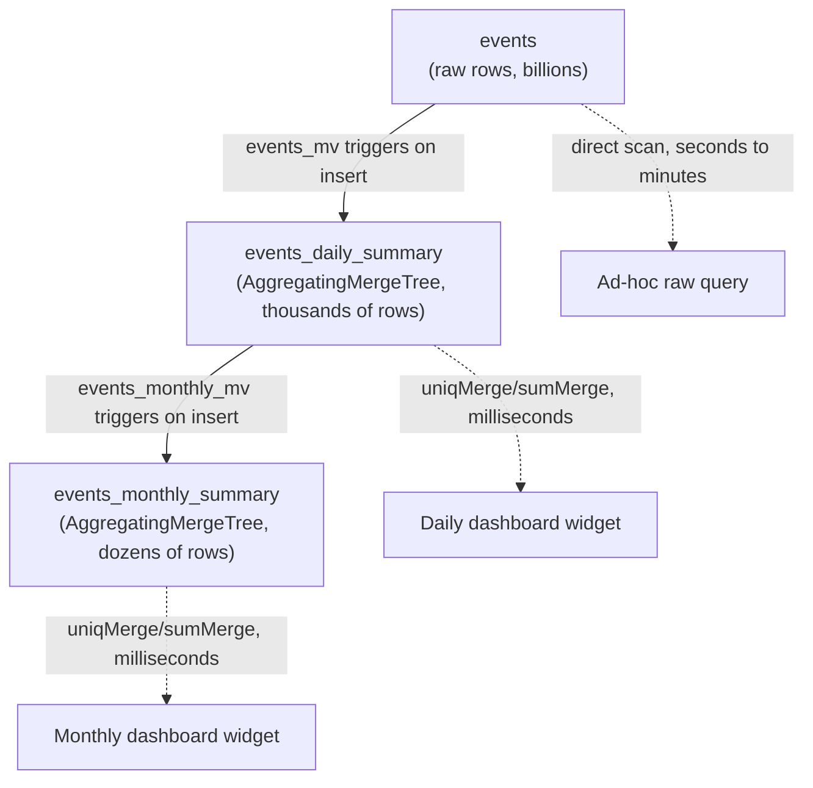
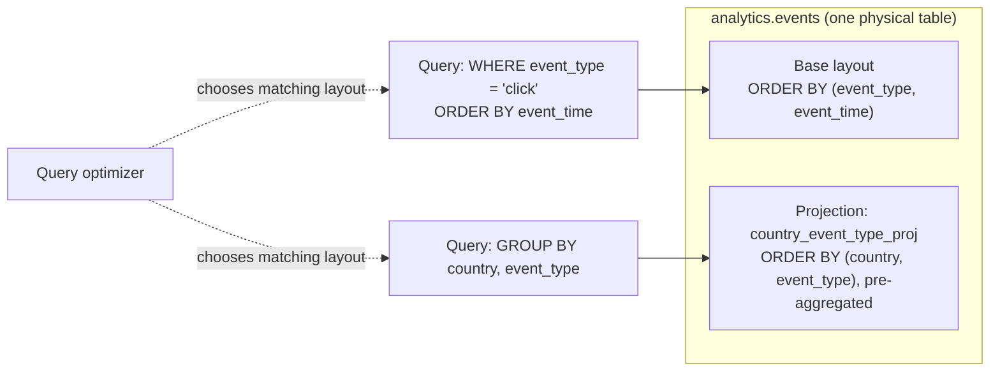

# Materialized Views & Projections

Chapter 5 introduced `AggregatingMergeTree` as the engine that lets a table hold *partial aggregation states* instead of final numbers, merging those states together in the background as parts combine. Chapter 8 completed the picture with the `-State`/`-Merge` combinator pair: `-State` functions (`uniqState`, `sumState`, `avgState`, ...) produce those partial-aggregation states as a value you can store, and `-Merge` functions (`uniqMerge`, `sumMerge`, `avgMerge`) combine stored states back into a final answer. Individually, those two chapters gave you a storage engine and a set of functions. This chapter fuses them into the actual mechanism that makes ClickHouse dashboards return in milliseconds even when the underlying raw table has tens of billions of rows: **materialized views** that incrementally push `-State` aggregates into an `AggregatingMergeTree` target table on every insert, plus **projections**, ClickHouse's other, complementary precomputation tool. By the end of this chapter you'll know how to build the pre-computed rollup pyramid that sits behind essentially every production ClickHouse analytics dashboard.

---

## Learning Objectives

By the end of this chapter, you will be able to:

- Explain precisely what a ClickHouse materialized view is — a trigger on inserted blocks, not a scheduled snapshot — and contrast it with a PostgreSQL materialized view.
- Build a materialized view that feeds pre-aggregated `-State` values into an `AggregatingMergeTree` target table, and explain exactly what happens on every new insert.
- Correctly query an `AggregatingMergeTree` table populated by `-State` functions using the matching `-Merge` functions.
- Use `POPULATE` to backfill a materialized view at creation time, explain its race-condition risk, and apply the safer manual-backfill pattern instead.
- Chain materialized views into a multi-level "rollup pyramid" (raw → daily → monthly) for dashboards that need multiple granularities.
- Explain what a projection is, how it differs fundamentally from a materialized view, and when the query optimizer will choose to use one automatically.
- Add a projection to an existing table and confirm via `EXPLAIN` that it gets selected for a matching query.
- Choose confidently between a plain `GROUP BY` query, a materialized view, and a projection for a given workload.

---

## Prerequisites for This Chapter

This chapter builds directly on two earlier chapters and assumes both as settled ground:

- [Chapter 5: Table Engines Deep Dive](./05-table-engines-deep-dive.md) — specifically `AggregatingMergeTree`: how it stores `AggregateFunction` columns and merges partial states together in the background as parts merge. If you don't remember why an `AggregatingMergeTree` table needs `AggregateFunction(...)`-typed columns rather than plain numeric columns, revisit that chapter before continuing.
- [Chapter 8: Aggregate Functions & Analytics](./08-aggregate-functions-and-analytics.md) — specifically the `-State`/`-Merge` combinator pair: `uniqState`/`uniqMerge`, `sumState`/`sumMerge`, and the general rule that a partial aggregation state produced by `-State` must be finalized by the matching `-Merge` (or `-Finalize`) function before it becomes a normal, readable value.
- The `events` table from Chapter 2, used throughout this chapter as the running example: `event_time`, `event_date`, `user_id`, `event_type`, `url`, `country`, `device`, `duration_ms`.
- Comfort with `INSERT INTO ... SELECT` and basic `GROUP BY` queries (Chapter 7).

If either chapter feels shaky, this chapter will not make sense — everything here is the two of them combined into one working system.

---

## 1. What a ClickHouse Materialized View Actually Is

### 1.1 Forget what "materialized view" means in Postgres

If you've used PostgreSQL, "materialized view" means something specific: a `CREATE MATERIALIZED VIEW` statement runs a query once, snapshots the result set into storage, and then just sits there — stale — until you explicitly run `REFRESH MATERIALIZED VIEW`. It's a cache you have to remember to invalidate.

**A ClickHouse materialized view is a completely different animal, and the shared name is one of the most common sources of confusion in the entire ClickHouse ecosystem.** Set the Postgres mental model aside completely before continuing.

### 1.2 The correct mental model: a trigger on inserted blocks

A ClickHouse materialized view (MV) is best understood as **a `SELECT` query wired up as a trigger on a source table**. Here is precisely what happens:

1. You define an MV with a `SELECT ... FROM source_table` query and, usually, a `TO target_table` clause.
2. Every time a block of rows is inserted into `source_table` — whether via a single `INSERT` statement, a batch load, or a Kafka engine feeding rows in continuously — ClickHouse runs the MV's `SELECT` query **against just that newly inserted block**, not against the whole table.
3. The *result* of running that query against the new block is appended into `target_table`, exactly as if you had run `INSERT INTO target_table SELECT ... FROM new_block`.

This is fundamentally an **incremental, streaming, insert-triggered transformation**, not a periodic snapshot. There is no "staleness" concept the way there is in Postgres, because the MV never re-runs against old data — it only ever reacts to genuinely new blocks, the instant they land.

```mermaid
sequenceDiagram
    participant App as Ingestion client
    participant Src as events (source table)
    participant MV as events_mv (SELECT query)
    participant Tgt as events_daily_summary (target table)

    App->>Src: INSERT INTO events VALUES (...) — new block
    Note over Src: New block written to a part
    Src-->>MV: New block triggers MV's SELECT
    MV->>MV: Run SELECT ... GROUP BY ... over ONLY the new block
    MV->>Tgt: INSERT the transformed/aggregated result
    Note over Tgt: Target table now has new partial rows;<br/>background merges combine them over time
```

Two consequences fall directly out of this "trigger on the block" model, and both surprise newcomers constantly:

- **A materialized view does *not* retroactively process data that already existed in the source table before the view was created.** If `events` already had 500 million rows when you ran `CREATE MATERIALIZED VIEW`, those 500 million rows are never seen by the MV — only rows inserted *after* the `CREATE MATERIALIZED VIEW` statement trigger it. This trips up nearly everyone the first time: they create an MV, query the target table, and find it empty (or missing history) even though the source table clearly has data. This is not a bug — it's the direct consequence of "trigger on insert," and Section 4 below covers the correct backfill patterns.
- **A materialized view does not see `UPDATE`s or `DELETE`s on the source table** the way you might hope. ClickHouse's mutation machinery (`ALTER TABLE ... UPDATE/DELETE`) rewrites parts in the background; it is not modeled as a stream of "new inserted blocks," so it does not re-trigger the MV's `SELECT`. If your source data can be updated or deleted (which, for `MergeTree`-family tables generally, should be rare — see Chapter 5's discussion of `ReplacingMergeTree`/`CollapsingMergeTree` for the idiomatic way to model changing data), the materialized view's target table will silently drift out of sync with reality. Design your source tables assuming inserts are (mostly) immutable, and materialized views will behave exactly as expected.

### 1.3 Why this is more powerful, not just different

The trigger-on-block model is what makes ClickHouse materialized views suitable for real-time, streaming-style incremental aggregation at a scale that would make Postgres's "recompute the whole query" refresh model impractical. A materialized view over a table taking in millions of events per second never has to "catch up" — it does a small, constant amount of work per insert, proportional to the size of the new block, not the size of the whole table. This is precisely the property that lets a dashboard query a rollup table with a few thousand rows instead of scanning a raw table with billions.

---

## 2. A Full Worked Example: Daily Rollups of `events`

Let's build the canonical pattern: a daily, per-country summary of visits and total duration, fed automatically from every insert into `events`.

### 2.1 Step 1 — create the target table

The target table must be an `AggregatingMergeTree` whose columns hold `AggregateFunction(...)` states, matching exactly what Chapter 5 taught about that engine:

```sql
CREATE TABLE analytics.events_daily_summary
(
    event_date      Date,
    country         LowCardinality(String),
    visits          AggregateFunction(uniq, UInt64),
    total_duration  AggregateFunction(sum, UInt32)
)
ENGINE = AggregatingMergeTree
ORDER BY (event_date, country);
```

Notice `visits` is typed `AggregateFunction(uniq, UInt64)` — not `UInt64`. It doesn't hold a count; it holds an opaque, mergeable *partial aggregation state* for the `uniq` function, applied to a `UInt64` argument (`user_id`). Same story for `total_duration`: it holds a partial state for `sum` over a `UInt32` argument (`duration_ms`). This is exactly the `AggregatingMergeTree` contract from Chapter 5 — the engine's whole job is to merge these state values together as background merges combine parts, cheaply and correctly, regardless of how many partial states need combining.

### 2.2 Step 2 — create the materialized view

```sql
CREATE MATERIALIZED VIEW analytics.events_mv
TO analytics.events_daily_summary
AS
SELECT
    event_date,
    country,
    uniqState(user_id)      AS visits,
    sumState(duration_ms)   AS total_duration
FROM analytics.events
GROUP BY event_date, country;
```

Read this carefully — every clause is deliberate:

- `TO analytics.events_daily_summary` — this MV writes into an existing, independently-managed table rather than creating an implicit hidden storage table (the alternative, older syntax without `TO`, auto-creates a hidden `.inner` table; using an explicit `TO` target is the recommended modern pattern because the target table is a first-class, inspectable object you designed yourself).
- `uniqState(user_id)` and `sumState(duration_ms)` — these are exactly the `-State` combinators from Chapter 8. They don't return a final unique count or sum; they return the intermediate state object that an `AggregatingMergeTree` column knows how to store and merge.
- `GROUP BY event_date, country` — this `GROUP BY` doesn't run once over the whole table. Per Section 1.2, it runs **once per inserted block**, grouping only the rows in that block.

### 2.3 Walking through exactly what happens on insert

Suppose 10,000 new rows land in `events` via one `INSERT`:

1. ClickHouse writes those 10,000 rows into a new part of `events`, as normal.
2. Because `events_mv` is attached to `events`, ClickHouse immediately runs the MV's `SELECT ... GROUP BY event_date, country` against **only those 10,000 rows** — not the table's full history.
3. Say that block covers 2 distinct `(event_date, country)` combinations after grouping — the result is 2 rows, each holding a `uniqState` and a `sumState` computed from just this block's rows.
4. Those 2 result rows are inserted into `events_daily_summary`, landing as their own tiny part.
5. If `events_daily_summary` already has existing rows for those same `(event_date, country)` keys (from earlier inserts), they are **not** merged synchronously — `events_daily_summary` now temporarily has multiple partial rows for the same key, sitting in different parts. ClickHouse's normal background merge process for `AggregatingMergeTree` (Chapter 5) will eventually combine them, calling the appropriate merge logic for each `AggregateFunction` column.
6. Until that background merge happens, a query against `events_daily_summary` might see several not-yet-merged partial rows for the same `(event_date, country)`. This is fine and expected — Section 3 shows how the correct query pattern handles this transparently.

This is the entire mechanism. No cron job, no manual refresh, no scheduled batch job — every `INSERT` into `events` incrementally, automatically keeps `events_daily_summary` up to date.

---

## 3. Querying the Target Table Correctly: `-Merge`, Not Plain Aggregates

This is the single most common mistake made against `AggregatingMergeTree` target tables, and Chapter 8 set up exactly the vocabulary needed to avoid it.

The `visits` and `total_duration` columns in `events_daily_summary` do not hold numbers — they hold `AggregateFunction` state blobs. You cannot `SUM()` or count them with ordinary aggregate functions; you must **finalize** them with the `-Merge` combinator matching the function that created them:

```sql
SELECT
    event_date,
    country,
    uniqMerge(visits)         AS visits,
    sumMerge(total_duration)  AS total_duration
FROM analytics.events_daily_summary
WHERE event_date = today()
GROUP BY event_date, country
ORDER BY visits DESC;
```

Notice this query still has a `GROUP BY` — and that's correct and necessary, precisely because of step 6 above: multiple not-yet-background-merged partial rows can exist for the same `(event_date, country)` key across different parts. `uniqMerge`/`sumMerge` combine *all* the partial states matching each group into one correct final answer, regardless of how many physical rows (parts) they were spread across. This makes the query correct whether or not a background merge has happened yet — you never have to wait for or trigger merges manually to get a right answer.

If you instead try `SELECT sum(total_duration) FROM events_daily_summary`, you'll get either a type error or nonsense, because `total_duration` is not a number — it's an opaque state blob that only `-Merge` functions (or `-Finalize`, its single-value equivalent used by `SimpleAggregateFunction` columns and some contexts) know how to interpret. This exact `-State`-in / `-Merge`-out symmetry is the same pairing Chapter 8 introduced in the abstract; here it's the load-bearing mechanism of the whole rollup.

---

## 4. `POPULATE`: Backfilling at Creation Time, and Why to Avoid It

Recall from Section 1.2: a materialized view only sees rows inserted *after* it's created. If `events` already has months of history when you create `events_mv`, that history is invisible to the MV by default.

ClickHouse offers a `POPULATE` keyword to backfill immediately at creation time:

```sql
CREATE MATERIALIZED VIEW analytics.events_mv
TO analytics.events_daily_summary
POPULATE
AS
SELECT
    event_date,
    country,
    uniqState(user_id)     AS visits,
    sumState(duration_ms)  AS total_duration
FROM analytics.events
GROUP BY event_date, country;
```

`POPULATE` runs the MV's `SELECT` once against all *existing* rows in `events` at creation time, in addition to setting up the ongoing insert trigger.

**The caveat, and why production teams generally avoid it:** `POPULATE` has a documented race condition. Rows inserted into the source table *while the population query is still running* can be missed entirely — they land in `events` after the population's snapshot read has already passed them by, but the ongoing insert-trigger isn't guaranteed to be fully wired up in a way that cleanly covers that exact window. On a quiet table this is a non-issue. On a table under continuous, high-volume write load — precisely the tables that most need materialized views — `POPULATE` risks silently dropping a chunk of history right at the seam.

**The safer pattern: separate the view's creation from the historical backfill.**

```sql
-- Step 1: create the MV WITHOUT populate. From this exact moment forward,
-- every new insert into events is captured correctly, with no race window.
CREATE MATERIALIZED VIEW analytics.events_mv
TO analytics.events_daily_summary
AS
SELECT
    event_date,
    country,
    uniqState(user_id)     AS visits,
    sumState(duration_ms)  AS total_duration
FROM analytics.events
GROUP BY event_date, country;

-- Step 2: manually backfill history for a FIXED, bounded range that you
-- know precedes the MV's creation, using a plain INSERT ... SELECT.
INSERT INTO analytics.events_daily_summary
SELECT
    event_date,
    country,
    uniqState(user_id)     AS visits,
    sumState(duration_ms)  AS total_duration
FROM analytics.events
WHERE event_date < today()   -- a fixed historical boundary you control
GROUP BY event_date, country;
```

Because Step 1 happens first, there is no window where a concurrent insert could fall through the cracks — anything inserted after Step 1 is captured by the trigger, and anything before it is explicitly covered by Step 2's bounded `WHERE` clause. If inserts are still happening in the tiny gap between the two statements, that's fine too: they're either already captured by the trigger (Step 1 already ran) or included in Step 2's scan (since Step 2 scans the table as it exists when it runs, not a stale snapshot). The two steps are individually safe; `POPULATE` tries to fuse them into one operation and that fusion is exactly where the race lives.

---

## 5. Chained Materialized Views: Building a Rollup Pyramid

A single daily rollup often isn't the whole story — dashboards frequently need weekly, monthly, or all-time numbers too. Rather than re-aggregating the huge raw `events` table for every granularity, chain materialized views: a coarser-grained MV can read from an already-aggregated target table instead of from raw `events`.

```sql
CREATE TABLE analytics.events_monthly_summary
(
    event_month     Date,      -- first-of-month date, used as the month key
    country         LowCardinality(String),
    visits          AggregateFunction(uniq, UInt64),
    total_duration  AggregateFunction(sum, UInt32)
)
ENGINE = AggregatingMergeTree
ORDER BY (event_month, country);

CREATE MATERIALIZED VIEW analytics.events_monthly_mv
TO analytics.events_monthly_summary
AS
SELECT
    toStartOfMonth(event_date) AS event_month,
    country,
    uniqMergeState(visits)         AS visits,
    sumMergeState(total_duration)  AS total_duration
FROM analytics.events_daily_summary
GROUP BY event_month, country;
```

Two details matter here:

- The monthly MV's source is `events_daily_summary` — an `AggregatingMergeTree` table already holding `AggregateFunction` states — not raw `events`. Because it's reading *states*, not raw rows, it uses `uniqMergeState`/`sumMergeState` (merge existing partial states together, but keep the result as a state, rather than finalizing it to a plain number) instead of `uniqState`/`sumState`. This is exactly the composability Chapter 8 hinted at: state combinators chain across levels of aggregation.
- This monthly MV triggers on inserts into `events_daily_summary` — which happen automatically every time the daily MV fires from a raw `events` insert. One raw insert can now ripple through two levels of pre-aggregation without you doing anything further.



This is the **rollup pyramid**: raw data at the base (huge, flexible, slow to scan for aggregates), progressively coarser pre-aggregated layers above it (small, fast, purpose-built for a specific granularity), each layer maintained automatically and incrementally by the layer below it. Production ClickHouse dashboards backing real-time analytics almost always look like this pyramid rather than a single flat rollup — you add a new layer whenever a new dashboard granularity needs one, without ever touching the layers below.

---

## 6. Projections: The Other Precomputation Mechanism

Materialized views solve "keep a *separate* target table incrementally updated." ClickHouse has a second, structurally different tool for a related but distinct problem: **projections**.

### 6.1 What a projection is

A **projection** is an alternate, automatically-maintained physical layout — a different sort order, and optionally a different aggregation — of the *same table*, stored alongside the table's normal data. It is not a separate table you query directly. Instead, when you run a query against the base table, ClickHouse's query optimizer inspects the query's `WHERE`/`GROUP BY`/`ORDER BY` pattern and, if a defined projection matches it better than the base table's own physical layout, **transparently substitutes the projection's data** to answer the query faster — without you ever naming the projection in your SQL.

### 6.2 Projections vs. materialized views — the core contrast

| | Materialized View | Projection |
|---|---|---|
| **Storage** | A separate target table (can have an entirely different schema, even different source columns via arbitrary `SELECT` transformations) | Part of the *same* table — an alternate physical layout stored alongside the base data |
| **How you query it** | You must know it exists and query the target table by name (or, for cascades, another MV downstream of it) | Transparent — you query the base table normally; the optimizer decides whether to use the projection |
| **Sync guarantee** | Eventually consistent with source via the trigger mechanism; safe as long as you understand the "no retroactive processing" and "no UPDATE/DELETE" caveats from Section 1 | Always in sync — updated as part of the same write path as the base table, since it's not a separate object |
| **Flexibility** | Arbitrary: can join, filter, transform, aggregate into a wildly different shape than the source | Constrained: must be an alternate ordering/aggregation of the *same* table's columns — no joins, no arbitrary target schema |
| **Best for** | Cross-table transformation, a genuinely different target schema, chained/multi-granularity rollups | A same-table alternate sort key or pre-aggregation, applied transparently without rewriting queries |

The transparency is the headline feature: application code and dashboard queries never need to know a projection exists. You add one, and previously-slow queries against the base table simply get faster, because the optimizer starts routing matching queries to the projection instead.

### 6.3 A worked projection example

Suppose most country-level rollup queries against `events` look like this:

```sql
SELECT country, event_type, count() AS cnt, sum(duration_ms) AS total_duration
FROM analytics.events
GROUP BY country, event_type;
```

Because `events` is physically sorted `ORDER BY (event_type, event_time)` (per Chapter 2's schema), a query grouping by `country` first has to touch data spread across the table's whole sort order — no sparse-index benefit for this particular access pattern (Chapter 6). A projection can give this exact query pattern its own optimized layout:

```sql
ALTER TABLE analytics.events
ADD PROJECTION country_event_type_proj
(
    SELECT
        country,
        event_type,
        count()             AS cnt,
        sum(duration_ms)    AS total_duration
    GROUP BY country, event_type
);

-- Projections are declared instantly, but must be built (materialized)
-- over existing data explicitly:
ALTER TABLE analytics.events MATERIALIZE PROJECTION country_event_type_proj;
```

Once materialized, ClickHouse maintains this pre-aggregated-by-`(country, event_type)` layout automatically for every future insert — no separate MV, no separate target table to remember to query. Run the original query again, and check `EXPLAIN`:

```sql
EXPLAIN
SELECT country, event_type, count() AS cnt, sum(duration_ms) AS total_duration
FROM analytics.events
GROUP BY country, event_type;
```

Conceptually, the plan now shows the projection being read instead of the base table's primary layout — something like a line indicating `Projection: country_event_type_proj` in the plan output, confirming the optimizer chose the pre-aggregated, country-sorted data over scanning the base table's `(event_type, event_time)`-ordered parts. You changed nothing about the query text; the win came entirely from adding the projection.



### 6.4 The limitation

Projections cannot do everything a materialized view can. They cannot join against other tables, cannot write to a differently-shaped target table with unrelated columns, and cannot form the kind of multi-level cascade described in Section 5 (a projection is inherently tied to one base table, not chained to another projection). When a query needs a genuinely different schema, a join, or a downstream rollup-of-a-rollup, reach for a materialized view. When a query just needs the *same* table's data sorted or pre-aggregated differently, and you'd rather not maintain a second table and rewrite queries to target it, reach for a projection.

---

## 7. Decision Guide: `GROUP BY`, Materialized View, or Projection?

Use this as a quick decision checklist:

- **Plain `GROUP BY` query over the base table** — the query is rare, run ad hoc, or exploratory; the table is small enough (or well-enough indexed for it, per Chapter 6) that a direct scan is fast enough; you don't want the write-time overhead or maintenance burden of any precomputed structure at all. Default to this until a specific query proves too slow often enough to justify precomputation.
- **Materialized view** — you need to transform data into a genuinely different target schema; you need to combine or filter across columns in a way that doesn't fit "same table, different sort/aggregation"; you're building a chained rollup pyramid (Section 5) with multiple independent granularities each queried by name; or the target needs to live in a different table entirely (e.g., feeding a `Kafka` engine table's output into a `MergeTree` table for querying).
- **Projection** — the query pattern is a same-table alternate sort order or pre-aggregation (e.g., "usually filter/group by `event_type`, but sometimes by `country` instead"); you want the optimizer to pick the best layout transparently, with zero query rewriting, and zero risk of the "forgot to query the right target table" mistake; you're fine with the constraint that it can't reshape data arbitrarily or join other tables.

In practice, mature ClickHouse schemas use **all three**: ad hoc `GROUP BY` for exploration, a small number of carefully chosen materialized views for the dashboard-critical rollup pyramid, and a handful of projections on the base table for the two or three alternate access patterns that come up often enough to matter but don't warrant a whole separate target table.

---

## Real-World Scenario

**Setup:** Your team owns the backend for a real-time analytics dashboard sitting on top of the `events` table, which ingests on the order of 50,000 events per second from a global web product. The dashboard has two main widgets: a headline "unique visitors and total engagement time, by day" chart, and a secondary "breakdown by country" table.

**Applying this chapter's concepts:**

- Querying raw `events` directly for the headline chart would mean scanning and aggregating a table growing by billions of rows a year, on every dashboard page load — completely incompatible with a "loads in under a second" product requirement.
- You create `events_daily_summary` as an `AggregatingMergeTree`, exactly as in Section 2, and `events_mv` to feed it incrementally. From the moment it's created, every one of those 50,000-events-per-second inserts triggers the MV's `SELECT`, appending small, cheap partial-aggregate rows into `events_daily_summary`. The dashboard's headline chart now queries a table with a few hundred rows per day instead of billions, using `uniqMerge`/`sumMerge` as shown in Section 3, and returns in milliseconds.
- Because `events` already had a year of history when this project started, you follow Section 4's guidance: create the MV first (so no future data is ever missed), then run a bounded `INSERT INTO events_daily_summary SELECT ... WHERE event_date < today()` to backfill the prior year in one controlled batch job, rather than risking `POPULATE`'s race condition against a table taking live writes at 50,000 events/second.
- For the secondary country-breakdown widget, the query pattern is "same `events` table, just grouped by `country` and `event_type` instead of the base `ORDER BY`." Rather than standing up a second materialized view and a second target table for what is fundamentally the same data, you add a projection (Section 6.3) directly on `events`. The widget's query is unchanged — it still queries `events` — but now runs against the projection's pre-aggregated-by-country layout automatically.
- Three months later, product asks for a monthly retention view. Rather than re-aggregating raw `events` again, you add `events_monthly_summary` and `events_monthly_mv` reading from `events_daily_summary` (Section 5), extending the rollup pyramid by one more layer without touching anything already in production.

This is, in miniature, exactly the shape of the Chapter 8 project mentioned in this course's roadmap: "a real-time analytics dashboard backend answering rollup queries in milliseconds over 100M+ rows."

---

## Best Practices

- **Always backfill history explicitly, in a bounded batch, rather than relying solely on `POPULATE`** — especially for any source table taking concurrent writes. Create the MV first, then run a scoped `INSERT INTO target SELECT ... FROM source WHERE <fixed historical range>` (Section 4).
- **Design target tables' columns to exactly match the combinators you use.** An `AggregatingMergeTree` column fed by `uniqState` must be typed `AggregateFunction(uniq, ...)`; a column fed by `sumState` must be `AggregateFunction(sum, ...)`. Mismatches surface as confusing type errors at insert or query time.
- **Prefer `SimpleAggregateFunction` over `AggregateFunction` when the underlying function is simple and commutative** (e.g., `sum`, `min`, `max`) — it stores the plain finalized value instead of an opaque state, needs no `-Merge` at query time, and is cheaper, at the cost of only supporting a narrower set of functions. (Chapter 5 introduces this variant; keep it in mind as an alternative to `uniqState`/`sumState`-heavy schemas where a plain running sum/min/max is all you need.)
- **Reach for a projection instead of a materialized view whenever the need is "the same table, a different sort order or aggregation"** — you get automatic sync and zero query-rewriting for free, at the cost of losing the flexibility of an arbitrary target schema.
- **Keep the number of materialized views on a hot source table deliberately small.** Every MV attached to a table adds real work to every single insert; a table with a dozen overlapping MVs pays that cost a dozen times over, on every write, forever.
- **Name target tables and MVs so the pipeline is self-documenting** (`events_daily_summary` + `events_mv`, `events_monthly_summary` + `events_monthly_mv`) — a rollup pyramid gets hard to reason about quickly if the naming doesn't make the raw → daily → monthly chain obvious at a glance.
- **Monitor `system.parts` and merge activity on `AggregatingMergeTree` target tables**, the same way Chapter 5 recommended for any MergeTree-family table — a target table accumulating many small unmerged parts faster than background merges can combine them will degrade query latency even though every individual insert succeeded.

---

## Common Mistakes

- **Assuming a newly created materialized view retroactively covers existing data.** It does not — it only reacts to blocks inserted after its creation (Section 1.2). Always plan an explicit backfill.
- **Querying an `AggregatingMergeTree` target table with plain `sum()`/`uniq()`/`count()` instead of `sumMerge()`/`uniqMerge()`/etc.** The columns hold opaque partial states, not finalized values; plain aggregate functions over them either error or silently produce meaningless results, depending on the ClickHouse version and column type.
- **Expecting a materialized view to react to `UPDATE`/`DELETE`** on the source table. MVs trigger on inserted blocks only; mutations do not replay through them, so a target table can silently drift out of sync with a source table that's being updated or deleted from. If your data changes after the fact, model that with `ReplacingMergeTree`/`CollapsingMergeTree` semantics on the source (Chapter 5) rather than assuming the MV will "just handle it."
- **Relying on `POPULATE` for backfilling a table under active concurrent writes**, and unknowingly dropping a slice of history in the race window described in Section 4.
- **Creating too many overlapping materialized views on the same hot source table**, each re-running its own `GROUP BY`/transformation on every single insert. Each additional MV is pure added write-path overhead — bundle related aggregations into a single MV and target table where possible instead of one MV per metric.
- **Confusing a projection with a materialized view and expecting one to do the other's job** — trying to make a projection reshape data into an unrelated schema (it can't; it's the same table's alternate layout), or trying to query a materialized view's target table "transparently" through the source table's name (you can't; you must query the target table directly by name, or rely on `EXPLAIN` to confirm a projection — not an MV — is being auto-selected).
- **Forgetting to run `MATERIALIZE PROJECTION` after `ADD PROJECTION`** — declaring a projection only registers its definition; it does not build the projection's data over existing parts until you explicitly materialize it (or wait for parts to be rewritten by unrelated merges, which is slow and not something to rely on).

---

## Summary

- A ClickHouse **materialized view is a trigger**: its `SELECT` query runs incrementally on every newly inserted block of the source table, pushing results into a separate target table — fundamentally different from PostgreSQL's manually-`REFRESH`ed snapshot model.
- MVs do **not** retroactively process pre-existing data and do **not** react to `UPDATE`/`DELETE` on the source — both are direct, permanent consequences of the "trigger on insert" design, not bugs.
- The canonical pattern pairs an `AggregatingMergeTree` target table (Chapter 5) with an MV whose `SELECT` uses `-State` combinators (Chapter 8) — e.g., `uniqState`/`sumState` feeding `AggregateFunction(uniq, ...)`/`AggregateFunction(sum, ...)` columns.
- Reading that target table correctly requires the matching `-Merge` functions (`uniqMerge`, `sumMerge`) plus a `GROUP BY`, because unmerged partial states from separate inserted blocks can coexist across multiple parts until background merges combine them.
- `POPULATE` backfills at MV-creation time but has a race-condition risk against concurrent writes; the safer pattern is creating the MV first, then backfilling history explicitly with a bounded `INSERT ... SELECT`.
- Materialized views can be **chained** — a daily rollup MV feeding a monthly rollup MV — building a "rollup pyramid" that serves multiple dashboard granularities, each maintained incrementally and automatically.
- **Projections** are an alternate, always-in-sync physical layout of the *same* table that the query optimizer selects transparently when it matches a query's `GROUP BY`/`ORDER BY` pattern — more constrained than an MV (no joins, no arbitrary target schema) but requiring zero query rewriting and no separate table to maintain.
- Choose plain `GROUP BY` for rare/small queries, a materialized view for cross-table transformation or chained rollups, and a projection for a same-table alternate layout used transparently.

---

## Knowledge Check

1. A colleague creates a materialized view on `events` and is confused that `events_daily_summary` shows no data for last year, even though `events` clearly has a full year of history. Explain exactly why, and what they should do about it.
2. Why must you query an `AggregatingMergeTree` target table with `uniqMerge(visits)` rather than `uniq(visits)` or `count(DISTINCT visits)`? What would go wrong if the column were queried with a plain aggregate function?
3. What specific race condition does `POPULATE` risk, and what two-step pattern avoids it entirely?
4. Describe, step by step, what happens inside ClickHouse when 10,000 rows are inserted into `events` and a materialized view targeting `events_daily_summary` is attached to it.
5. A teammate wants a query that's sometimes grouped by `event_type` and sometimes by `country` to be fast in both directions without rewriting the query or maintaining a second table. Should they reach for a materialized view or a projection, and why?
6. Explain why a chained materialized view (daily → monthly) uses `uniqMergeState`/`sumMergeState` in its `SELECT`, rather than `uniqState`/`sumState` or `uniqMerge`/`sumMerge`.

---

## Hands-On Exercise

Work through this end to end in `clickhouse-client`, using the `events` table from Chapter 2 (create it first if it doesn't already exist in your session).

**Step 1 — Create the target table and materialized view.**

```sql
CREATE TABLE analytics.events_daily_summary
(
    event_date      Date,
    country         LowCardinality(String),
    visits          AggregateFunction(uniq, UInt64),
    total_duration  AggregateFunction(sum, UInt32)
)
ENGINE = AggregatingMergeTree
ORDER BY (event_date, country);

CREATE MATERIALIZED VIEW analytics.events_mv
TO analytics.events_daily_summary
AS
SELECT
    event_date,
    country,
    uniqState(user_id)     AS visits,
    sumState(duration_ms)  AS total_duration
FROM analytics.events
GROUP BY event_date, country;
```

**Step 2 — Insert new rows into `events` and confirm the summary updates automatically.**

```sql
INSERT INTO analytics.events (event_time, event_date, user_id, event_type, url, country, device, duration_ms)
VALUES
    (now(), today(), 1001, 'page_view', '/home', 'US', 'desktop', 4200),
    (now(), today(), 1002, 'page_view', '/pricing', 'US', 'mobile', 1800),
    (now(), today(), 1003, 'click', '/pricing', 'IN', 'desktop', 500);

-- Confirm rows landed in the target table WITHOUT any manual step:
SELECT count() FROM analytics.events_daily_summary WHERE event_date = today();
```

**Step 3 — Query the summary table correctly with `-Merge` functions.**

```sql
SELECT
    event_date,
    country,
    uniqMerge(visits)         AS visits,
    sumMerge(total_duration)  AS total_duration
FROM analytics.events_daily_summary
WHERE event_date = today()
GROUP BY event_date, country
ORDER BY country;
```

Try `SELECT sum(total_duration) FROM analytics.events_daily_summary` (without `-Merge`) and observe the error or nonsensical result, to see firsthand why the `-Merge` combinator is required.

**Step 4 — Backfill history the safe way (simulate pre-existing data).**

Insert a batch of rows with an `event_date` from a week ago (simulating "history that predates the MV"), then confirm they do *not* appear in `events_daily_summary` until you manually backfill:

```sql
INSERT INTO analytics.events (event_time, event_date, user_id, event_type, url, country, device, duration_ms)
VALUES (now() - INTERVAL 7 DAY, today() - 7, 2001, 'page_view', '/home', 'DE', 'mobile', 3000);

-- This will return 0 rows for last week — the MV never saw this insert's "past" framing;
-- more importantly, imagine this row existed BEFORE events_mv was created at all.
SELECT count() FROM analytics.events_daily_summary WHERE event_date = today() - 7;

-- Manually backfill a fixed historical range:
INSERT INTO analytics.events_daily_summary
SELECT
    event_date,
    country,
    uniqState(user_id)     AS visits,
    sumState(duration_ms)  AS total_duration
FROM analytics.events
WHERE event_date = today() - 7
GROUP BY event_date, country;
```

**Step 5 — Add a projection and confirm it's used via `EXPLAIN`.**

```sql
ALTER TABLE analytics.events
ADD PROJECTION country_event_type_proj
(
    SELECT
        country,
        event_type,
        count()             AS cnt,
        sum(duration_ms)    AS total_duration
    GROUP BY country, event_type
);

ALTER TABLE analytics.events MATERIALIZE PROJECTION country_event_type_proj;

-- Give the MATERIALIZE a moment on larger tables, then check the plan:
EXPLAIN
SELECT country, event_type, count() AS cnt, sum(duration_ms) AS total_duration
FROM analytics.events
GROUP BY country, event_type;
```

Inspect the `EXPLAIN` output for a reference to `country_event_type_proj` (the exact wording varies by ClickHouse version; look for `Projection` in the plan) confirming the optimizer chose the projection over a full scan of the base table's layout.

---

## Further Reading

- [ClickHouse Docs — Materialized View](https://clickhouse.com/docs/en/sql-reference/statements/create/view#materialized-view) — the canonical reference for `CREATE MATERIALIZED VIEW` syntax, `TO` targets, and `POPULATE`.
- [ClickHouse Docs — AggregatingMergeTree](https://clickhouse.com/docs/en/engines/table-engines/mergetree-family/aggregatingmergetree) — the target-table engine used throughout this chapter, including `AggregateFunction` and `SimpleAggregateFunction` column types.
- [ClickHouse Docs — Projections](https://clickhouse.com/docs/en/sql-reference/statements/alter/projection) — `ADD PROJECTION`, `MATERIALIZE PROJECTION`, and the constraints on what a projection can express.
- [ClickHouse Docs — Combinators (State, Merge)](https://clickhouse.com/docs/en/sql-reference/aggregate-functions/combinators) — the full reference for `-State`, `-Merge`, `-MergeState`, and other combinators used in this chapter's chained-rollup example.
- [ClickHouse Docs — EXPLAIN](https://clickhouse.com/docs/en/sql-reference/statements/explain) — how to read query plans, useful for confirming projection selection as in Section 6.3.

---

<div style="display:flex;justify-content:space-between;align-items:center;">
  <a href="./08-aggregate-functions-and-analytics.md">← Previous: Aggregate Functions & Analytics</a>
  <a href="./00-index.md">🏠 Index</a>
  <a href="./10-joins-and-data-modeling.md">Next: Joins & Data Modeling →</a>
</div>
