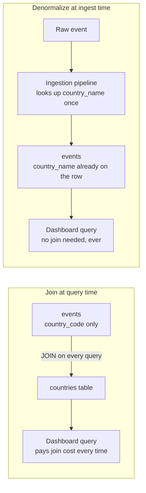
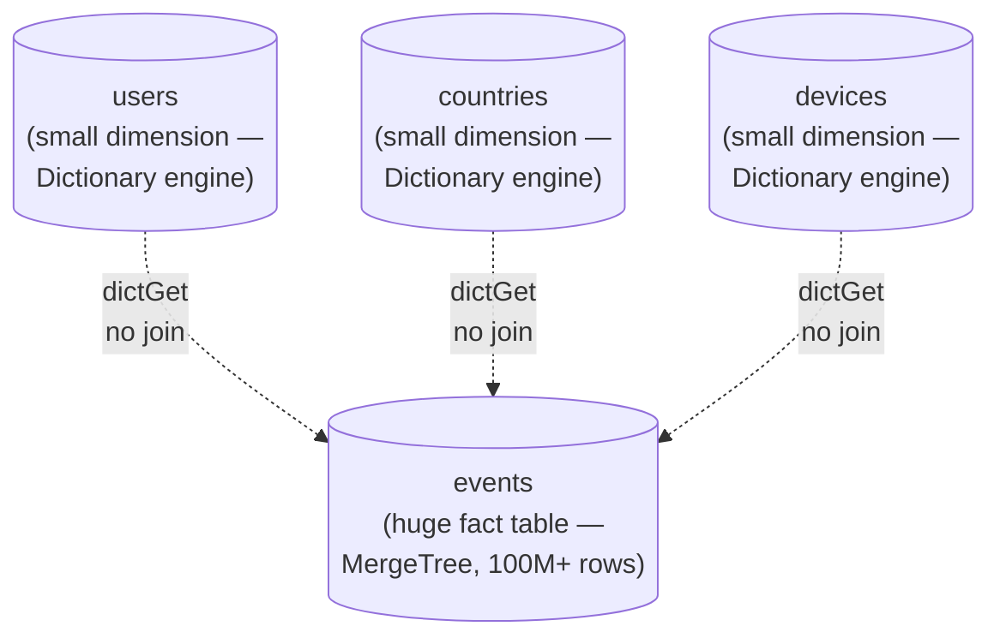
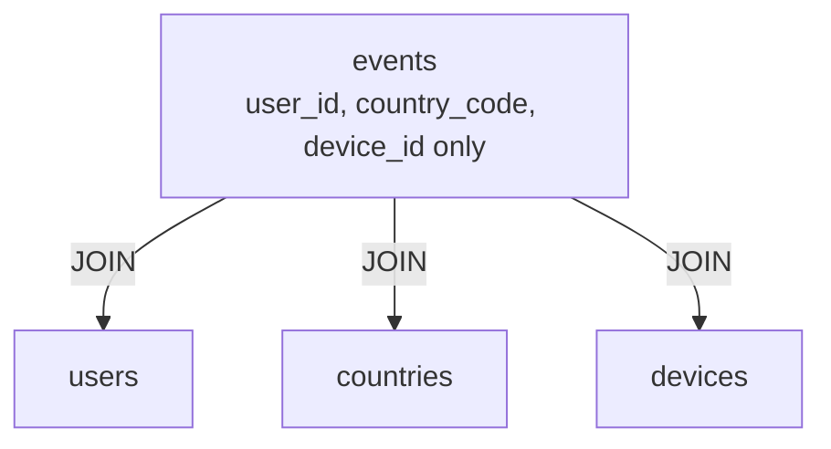

# Joins & Data Modeling

This chapter closes out Phase 3 — Querying & Analytics (Chapters 7–10). Chapter 7 taught you how to get data in and out efficiently; Chapter 8 taught you how to aggregate it at scale; Chapter 9 taught you how to pre-compute expensive aggregations with materialized views and projections. This chapter tackles the one relational operation ClickHouse is genuinely not built around: the `JOIN`. You'll learn exactly why joins are structurally awkward for a column store, how ClickHouse's join algorithms work well enough to be usable in practice, and — more importantly — the idiomatic OLAP data-modeling patterns (dictionaries and denormalization) that experienced ClickHouse users reach for *instead of* joining, most of the time. By the end, you'll know when a join is genuinely the right tool, and when it's an OLTP habit quietly making your analytics slower than it needs to be.

---

## Learning Objectives

By the end of this chapter, you will be able to:

- Explain, at a conceptual level, why joins are structurally harder for a columnar engine than for a row store, and why ClickHouse historically loaded the right-hand table of a hash join fully into memory.
- Describe ClickHouse's join algorithms (`hash`, `partial_merge`, `full_sorting_merge`) and when each is appropriate.
- Use `ANY`/`ALL` join modifiers correctly and explain the difference in row-matching semantics.
- Explain why `GLOBAL JOIN` exists and why omitting it on a distributed query can silently produce wrong results.
- Explain what a ClickHouse **dictionary** is, why it exists, and rewrite a join-based lookup as a `dictGet()` call.
- Justify denormalization as the default OLAP data-modeling strategy, including its real tradeoffs around storage and historical accuracy.
- Design a star-schema-shaped model for ClickHouse — one large fact table plus small dimension tables/dictionaries — and contrast it with a fully normalized OLTP schema.
- Diagnose and fix a slow dashboard query that joins a huge fact table against a small dimension table on every request.

---

## Prerequisites for This Chapter

This chapter builds on:

- [Chapter 7 — Inserting & Querying Data](./07-inserting-and-querying-data.md): batch inserts, `SELECT` patterns, and ClickHouse SQL extensions, which this chapter assumes you can write comfortably.
- [Chapter 8 — Aggregate Functions & Analytics](./08-aggregate-functions-and-analytics.md): `GROUP BY`, aggregate combinators, and window functions — the query shapes that dictionaries and denormalized columns most often feed into.
- The `events` table schema established in [Chapter 2](./02-core-concepts.md) and used consistently since (see [Chapter 6](./06-primary-keys-and-sparse-indexing.md) for its `ORDER BY`/sparse-index behavior):

```sql
CREATE TABLE analytics.events
(
    event_time   DateTime,
    event_date   Date,
    user_id      UInt64,
    event_type   LowCardinality(String),
    url          String,
    country      LowCardinality(String),
    device       LowCardinality(String),
    duration_ms  UInt32
)
ENGINE = MergeTree
ORDER BY (event_type, event_time);
```

Notice something you may not have flagged before: `country` and `device` are *already* stored directly on `events`, not normalized out into separate `countries` or `devices` tables with a foreign key. That was not an accident — it's a preview of this entire chapter's argument, made three chapters before this one existed.

- Basic SQL `JOIN` syntax (`INNER`, `LEFT`, `RIGHT`) at the level assumed by this course's [prerequisites](./00-index.md).

---

## 1. The Honest Framing: ClickHouse *Can* Join, But It Isn't the Point

If you're coming from PostgreSQL, MySQL, or any normalized OLTP database, joins are muscle memory. You normalize your schema into small, single-purpose tables — `orders`, `customers`, `products` — specifically *so that* you can join them back together at query time without duplicating data. The join is the payoff for normalization, and the database's query planner and B-tree indexes are built to make it cheap.

ClickHouse supports `JOIN` — `INNER`, `LEFT`, `RIGHT`, `FULL`, `CROSS`, `ANY`, `ALL`, `ASOF` (a time-series-specific join covered briefly later) — and the syntax looks reassuringly familiar. But underneath, joining is not what a column-oriented, MergeTree-based engine is optimized for, for two structural reasons worth understanding rather than memorizing:

**1. A join correlates rows across two independently column-stored structures.** ClickHouse's entire performance story — Chapter 3's vectorized execution, Chapter 6's sparse index — is built around scanning *columns* of *one* table efficiently: read only the columns you need, in long contiguous runs, and skip whole granules using the sparse index. A join breaks that clean story. To join `events` to `users` on `user_id`, ClickHouse must take rows from one column-oriented structure and rows from another, correlate them by a key that isn't the physical sort order of either side (usually), and materialize matched row-pairs before it can go back to columnar, vectorized processing on the result. That correlation step is inherently more row-like than the rest of the engine, and it's where a lot of the columnar advantage temporarily evaporates.

**2. The default algorithm loads the right-hand table fully into memory.** ClickHouse's default join strategy is a **hash join**: it builds an in-memory hash table from the *right-hand* table (keyed on the join columns), then streams the left-hand table through, probing the hash table row by row. This is fast — often very fast — but it has an obvious ceiling: the right-hand table must fit in memory (or you must explicitly opt into slower, disk-spilling strategies). Join a 500-million-row fact table against another 500-million-row fact table with the naive default, and you can exhaust server memory outright. This is the single most common way new ClickHouse users get an out-of-memory error.

Contrast this with a normalized OLTP database, which is *built* to make small, indexed, row-at-a-time joins its bread and butter — a B-tree index means a join lookup is a handful of page reads, not a full-table hash build. ClickHouse inverts the whole picture: it wants to touch *few columns* across *many rows* in one pass, not correlate two separately structured row sets.

None of this means "never join in ClickHouse." It means: **know the cost, keep the right-hand side small, and reach for dictionaries or denormalization whenever the join is really just a small, slowly-changing lookup** — which, in practice, is most of the joins an analytics workload actually needs.

---

## 2. Join Algorithms: Hash, Partial Merge, and Full Sorting Merge

ClickHouse exposes the join strategy as a setting, `join_algorithm`, because no single algorithm is right for every join shape.

| Algorithm | How it works (conceptually) | Best for |
|---|---|---|
| `hash` (default) | Builds an in-memory hash table from the right-hand table; streams and probes the left-hand table against it. | Small-to-medium right-hand table that comfortably fits in memory — the common case, and the fastest when it applies. |
| `parallel_hash` | Same idea as `hash`, but builds and probes the hash table using multiple threads concurrently. | Same as `hash`, when you want to use more CPU cores to build/probe faster. |
| `partial_merge` | Sorts both sides by the join key in chunks and merges them incrementally, spilling to disk as needed, rather than holding the whole right-hand side in memory at once. | Larger right-hand tables that don't comfortably fit in memory — trades some speed for a much lower memory ceiling. |
| `full_sorting_merge` | Fully sorts both sides by the join key, then performs a classic merge-join pass. | Very large joins on both sides where you're willing to pay a full sort to keep memory bounded and predictable. |
| `auto` | ClickHouse picks a strategy automatically, falling back from `hash` to a memory-safer strategy if the hash table would grow too large. | A reasonable default if you don't want to reason about this per-query. |

You don't need to master the internals of `partial_merge` or `full_sorting_merge` to use ClickHouse productively — the important takeaway is conceptual: **when the default in-memory hash join won't fit, ClickHouse has slower, disk-aware fallbacks, and you select them via `join_algorithm` rather than the engine silently degrading for you.** In practice, most well-modeled ClickHouse schemas (Sections 5–6 below) avoid ever needing the heavier algorithms, because the right-hand side of any join that does happen is small by design.

```sql
SELECT count()
FROM events AS e
INNER JOIN users AS u ON e.user_id = u.user_id
SETTINGS join_algorithm = 'partial_merge';
```

---

## 3. `ANY` / `ALL` and `GLOBAL JOIN`

### 3.1 `ANY` vs. `ALL`

Standard SQL joins are `ALL` joins by default: if a left-hand row matches multiple right-hand rows, you get multiple output rows — one per match. ClickHouse lets you opt into `ANY` semantics instead, which caps matching at **at most one** right-hand row per left-hand key, picking an arbitrary (implementation-defined, effectively "first found") match and discarding the rest:

```sql
-- ALL (default): one output row per matching pair — can multiply rows if the
-- right-hand side has duplicate keys.
SELECT e.user_id, e.event_type, u.plan
FROM events AS e
ALL INNER JOIN users AS u ON e.user_id = u.user_id;

-- ANY: at most one match per left-hand row, even if `users` has duplicate
-- user_id rows — useful precisely when you expect the right side to be
-- "one row per key" and want to defend against accidental duplicates.
SELECT e.user_id, e.event_type, u.plan
FROM events AS e
ANY INNER JOIN users AS u ON e.user_id = u.user_id;
```

`ANY` is a pragmatic tool: dimension tables are *supposed* to have one row per key, but real pipelines occasionally produce duplicates (a late-arriving update, a re-run backfill). `ANY` protects a query from silently exploding into duplicate fact rows when that assumption is violated, at the cost of an arbitrary (not deterministic-by-business-logic) pick among duplicates. Don't reach for `ANY` as a substitute for actually deduplicating your dimension table — it's a safety net, not a data-quality strategy.

### 3.2 `GLOBAL JOIN` (previewed here, full depth in Chapter 12)

Everything above assumes a single ClickHouse node. Once you shard a table across multiple nodes with the `Distributed` engine (full treatment in [Chapter 12](./12-sharding-and-distributed-queries.md)), a plain `JOIN` becomes dangerous in a specific, easy-to-miss way.

A `Distributed` table is a thin proxy: a query against it is rewritten and sent to *every shard*, and each shard executes its own local copy of the query independently, on its own local data. If the right-hand side of your join is *also* a `Distributed` table, each shard will try to join against only the slice of the right-hand table that happens to live on that shard — not the full table. Depending on how the two tables are sharded, that can silently produce incomplete or outright wrong results, with no error raised.

`GLOBAL JOIN` fixes this: it tells ClickHouse to first gather the *entire* right-hand table from all shards to the initiating (coordinator) node, then broadcast that complete copy back out to every shard before each shard runs its local join against the *full* dataset rather than its own local fragment.

```sql
-- Dangerous on a sharded cluster: each shard joins against only its own
-- local slice of `users_distributed`, which may not contain the matching row.
SELECT e.user_id, u.plan
FROM events_distributed AS e
INNER JOIN users_distributed AS u ON e.user_id = u.user_id;

-- Correct: the full `users_distributed` table is gathered once and
-- broadcast to every shard before joining.
SELECT e.user_id, u.plan
FROM events_distributed AS e
GLOBAL INNER JOIN users_distributed AS u ON e.user_id = u.user_id;
```

The rule of thumb to carry until Chapter 12 goes deep: **if either side of a join on a distributed table isn't guaranteed to be fully co-located on every shard, use `GLOBAL`.** It costs network traffic to broadcast the right-hand table, but that cost is far cheaper than a dashboard silently under-reporting numbers because half the join keys never matched.

---

## 4. Dictionaries: The Idiomatic Alternative to Small-Table Joins

### 4.1 Why dictionaries exist

Think about what actually happens if you join `events` (500 million rows) against a `countries` table (200 rows mapping `country_code` → `country_name`) on *every single dashboard query*. Every query pays the cost of a hash-join build — reconstructing an in-memory hash table from `countries` — even though `countries` almost never changes and is tiny enough to just... keep in memory permanently, once, and reuse across every query.

That observation is exactly what ClickHouse **dictionaries** are built for. A dictionary is a purpose-built, in-memory (or partially cached) key-value structure:

- **Loaded from a source** — another ClickHouse table, MySQL, PostgreSQL, a flat file, an HTTP endpoint, Redis, and others.
- **Refreshed periodically** on a configurable interval (`LIFETIME`), rather than re-read on every query.
- **Queried directly with `dictGet()` functions** (or, less commonly, joined via a special `dictionary` join type) — no hash-table build step at query time, because the dictionary is already resident and ready.

The mental model: a dictionary is what you reach for when a join's right-hand side is really "a small, slowly-changing lookup table" rather than "another dataset I need to correlate at scale." Country codes, currency symbols, a user segment mapping, a device-model-to-manufacturer table, a small `users` table — all textbook dictionary candidates. A second 500-million-row fact table is not; that's a genuine join (Sections 1–3), if you need it at all.

### 4.2 Defining and querying a dictionary

```sql
CREATE DICTIONARY analytics.countries_dict
(
    country_code String,
    country_name String
)
PRIMARY KEY country_code
SOURCE(CLICKHOUSE(TABLE 'countries' DB 'analytics'))
LAYOUT(HASHED())
LIFETIME(MIN 300 MAX 600);
```

- `SOURCE(...)` says where the data comes from — here, another ClickHouse table; it could equally be `SOURCE(MYSQL(...))`, `SOURCE(POSTGRESQL(...))`, `SOURCE(HTTP(...))`, or `SOURCE(FILE(...))`.
- `LAYOUT(HASHED())` says how the dictionary is held in memory — a flat in-memory hash table keyed on `country_code`. Other layouts exist for different size/access tradeoffs (`FLAT`, `CACHE`, `COMPLEX_KEY_HASHED` for composite keys, and others), but `HASHED` is the sensible default for a small, fully-resident lookup table.
- `LIFETIME(MIN 300 MAX 600)` tells ClickHouse to reload the dictionary from its source somewhere between every 300–600 seconds (the range avoids every replica reloading in perfect lockstep and hammering the source simultaneously). This is your **freshness knob** — see the Real-World Scenario below for the tradeoff it represents.

Querying it is a plain function call, not a join clause:

```sql
SELECT
    event_time,
    dictGet('analytics.countries_dict', 'country_name', country) AS country_name
FROM analytics.events
LIMIT 10;
```

`dictGet(dictionary_name, attribute_name, key)` looks up `key` in the dictionary and returns the requested attribute — an O(1) in-memory hash lookup per row, with no join planning, no hash-table rebuild, and no risk of blowing past a memory limit no matter how many rows of `events` you scan.

---

## 5. Denormalization: The Primary OLAP Data-Modeling Strategy

### 5.1 The OLTP instinct, and why it fights you here

In a normalized OLTP schema, storing `country_name` redundantly on every `events` row would look like a rookie mistake — a textbook violation of third normal form, inviting update anomalies. The correct OLTP move is: store `country_code` on `events`, store the canonical `country_name` once in a `countries` table, and join whenever you need the name.

In ClickHouse, that instinct is frequently backwards. Storage is cheap and extremely well compressed (Chapter 4's `LowCardinality` alone makes repeating a small set of country names across a billion rows nearly free), while *query-time joins are the expensive, fragile operation* (Sections 1–3). So the idiomatic OLAP move is often the opposite of the OLTP one: **denormalize the dimension attribute directly onto the fact row at ingest time**, and never join for it again.

This is precisely why the `events` table from Chapter 2 already stores `country` and `device` directly, rather than `country_code` and `device_id` foreign keys pointing at separate tables. It wasn't presented as an optimization back in Chapter 2 — it was presented as the obvious way to model a `LowCardinality(String)` column. Now you know *why* it's obvious: joining 500 million events against a 200-row country table on every query would be pure overhead for data that essentially never changes and costs almost nothing to store redundantly.

### 5.2 The real tradeoff — this is not a free lunch

Denormalization is a genuine tradeoff, not a strictly-better move, and being honest about both sides is what separates a considered data model from cargo-culting "wide tables are good":

| | Join-at-query-time (normalized) | Denormalize-at-ingest-time |
|---|---|---|
| **Storage** | Compact — dimension value stored once | Larger — dimension value repeated on every fact row (though `LowCardinality`/compression usually makes this cheap) |
| **Query speed** | Pays a join cost on every query | No join cost — the value is already on the row |
| **Update complexity** | Change the dimension row once; every future join sees the new value immediately | Existing fact rows keep the *old* denormalized value; only newly ingested rows see the new value, unless you explicitly rewrite history |
| **Historical accuracy** | Reflects the *current* dimension value even for old facts (can misrepresent "what was true at the time") | Reflects the value *as it was when the fact was recorded* — often exactly what you want for point-in-time reporting |

That last row is the subtle, important one. Imagine a `users` table where `plan` (free/pro/enterprise) changes over a user's lifetime. If you denormalize `plan` onto every `events` row at ingest time, a report on "revenue by plan, June 2025" correctly reflects what plan the user was on *in June 2025* — even if they've since upgraded. If you instead joined `events` to a live `users` table, that same historical report would incorrectly show the user's *current* plan applied retroactively to June's events. Here, denormalization isn't just faster — it's *more correct* for point-in-time analysis.

The failure mode runs the other direction too: if what you actually want is "current plan for every historical event, always" (e.g., a live customer-success view), a stale denormalized value is a bug, and either a join against a live table or a dictionary with a short `LIFETIME` is the right call. **Decide, deliberately, whether a dimension attribute should be a fact-at-the-time (denormalize) or a fact-as-of-now (join/dictionary) — this is a data-modeling decision, not an implementation detail.**

### 5.3 Denormalize at ingest, not on every read

When denormalization is the right call, do it once, in the ingestion pipeline (Chapter 14 covers pipelines in depth), not by joining at query time and hoping the optimizer is fast enough: enrich each event with `country_name`, `device_manufacturer`, or `user_plan_at_event_time` *before* the `INSERT`, using whatever lookup (application-side cache, dictionary, small join against a staging table) is convenient at ingest volume — which is far lower and far more forgiving than dashboard query volume.



---

## 6. The Star Schema, ClickHouse-Style

Put dictionaries and denormalization together and you get ClickHouse's default shape for analytical data: a **star schema** — one large, wide fact table at the center, surrounded by a handful of small, slowly-changing dimension tables (often modeled as dictionaries rather than plain tables you'd join).



Contrast this with a fully normalized OLTP schema for the same domain, where `events` would carry only foreign keys (`user_id`, `country_code`, `device_id`) and every reporting query would need three or four joins to reconstruct a human-readable row:



Both diagrams describe the *same information*. The difference is where the cost is paid: the OLTP shape pays it on every read (a join), the ClickHouse shape pays it once, either at ingest time (denormalization) or once per dictionary `LIFETIME` refresh (dictionaries) — and reads for free from then on. That shift — from "pay per read" to "pay per write, or per refresh interval" — is the single biggest data-modeling mindset change this chapter is asking you to make.

---

## 7. Worked Example: Modeling `users` as a Dictionary

Suppose you have a small, slowly-changing `users` table — a natural dimension:

```sql
CREATE TABLE analytics.users
(
    user_id     UInt64,
    user_name   String,
    signup_date Date,
    plan        LowCardinality(String)
)
ENGINE = MergeTree
ORDER BY user_id;
```

A few hundred thousand or even a few million users is small by ClickHouse standards — exactly the size a dictionary is built for. Define a dictionary sourced from it:

```sql
CREATE DICTIONARY analytics.users_dict
(
    user_id     UInt64,
    user_name   String,
    signup_date Date,
    plan        String
)
PRIMARY KEY user_id
SOURCE(CLICKHOUSE(TABLE 'users' DB 'analytics'))
LAYOUT(HASHED())
LIFETIME(MIN 300 MAX 600);
```

Now compare the two ways to answer "how many events per plan, in the last 7 days?"

**Version A — plain JOIN (works, but pays the join cost on every run):**

```sql
SELECT
    u.plan,
    count() AS event_count
FROM analytics.events AS e
INNER JOIN analytics.users AS u ON e.user_id = u.user_id
WHERE e.event_time >= now() - INTERVAL 7 DAY
GROUP BY u.plan
ORDER BY event_count DESC;
```

Every execution rebuilds (or at least re-probes) a hash table from `users`, on top of scanning the relevant slice of `events`.

**Version B — `dictGet()` (no join at all):**

```sql
SELECT
    dictGet('analytics.users_dict', 'plan', user_id) AS plan,
    count() AS event_count
FROM analytics.events
WHERE event_time >= now() - INTERVAL 7 DAY
GROUP BY plan
ORDER BY event_count DESC;
```

Version B never touches the `JOIN` planner at all: `analytics.users_dict` is already resident in memory, refreshed on its own schedule, and each `dictGet()` call is an O(1) lookup keyed on `user_id` — indistinguishable, cost-wise, from reading a column that was already denormalized onto the row. This is the idiomatic ClickHouse rewrite: same result, no per-query join cost, and a data-freshness tradeoff you control explicitly via `LIFETIME` rather than implicitly via "how fast is my join today."

---

## Real-World Scenario

**Setup:** Your team runs a customer-facing analytics dashboard backed by a 500-million-row `events` table. Every dashboard load runs a query that joins `events` against a `users` table (2 million rows: `user_id`, `plan`, `signup_country`, `account_tier`) to break down activity by plan and tier. The query used to take 300ms when `events` had 20 million rows; today, at 500 million rows, it regularly takes 8–12 seconds, and the on-call engineer has twice seen it get OOM-killed during a traffic spike when several dashboard loads landed at once and each one tried to build its own copy of the `users` hash table concurrently.

**Diagnosis, using this chapter's framework:**

- The join itself is legitimate SQL — nothing is *wrong* with it — but `users` is being treated as if it were a second fact table, when it's actually a textbook dimension: small (2 million rows is tiny by ClickHouse standards), and changes rarely (a user's plan or tier updates maybe a few times a year, not per event).
- Every one of those 8–12 second query runs is redundantly rebuilding an in-memory hash table from the exact same 2-million-row `users` snapshot that barely changed since the last query five seconds ago. That's pure waste, and under concurrent load it multiplies: N simultaneous dashboard loads means N simultaneous hash-table builds competing for the same memory.

**The fix:**

1. Convert `users` into a dictionary:

```sql
CREATE DICTIONARY analytics.users_dict
(
    user_id        UInt64,
    plan           String,
    signup_country String,
    account_tier   String
)
PRIMARY KEY user_id
SOURCE(CLICKHOUSE(TABLE 'users' DB 'analytics'))
LAYOUT(HASHED())
LIFETIME(MIN 120 MAX 180);
```

2. Rewrite the dashboard query from a `JOIN` to `dictGet()` calls:

```sql
SELECT
    dictGet('analytics.users_dict', 'plan', user_id) AS plan,
    dictGet('analytics.users_dict', 'account_tier', user_id) AS account_tier,
    count() AS events_last_30d
FROM analytics.events
WHERE event_time >= now() - INTERVAL 30 DAY
GROUP BY plan, account_tier
ORDER BY events_last_30d DESC;
```

**Result and tradeoff:** The query now scans only `events` — no hash-table build, no per-query dependency on `users` table size at all — and the 8–12 second query drops to well under a second, dominated entirely by the `events` scan itself, which Chapter 6's sparse index and Chapter 9's projections can further optimize independently. The OOM risk under concurrent load disappears too, because `users_dict` is loaded into memory *once*, shared across every concurrent query, rather than rebuilt per query.

The tradeoff the team explicitly accepts: dashboard numbers can lag a user's *very latest* plan/tier change by up to `LIFETIME`'s upper bound — 180 seconds in this configuration. For a plan that changes a handful of times a year per user, a 3-minute worst-case staleness window on a customer-facing analytics dashboard was judged an obviously acceptable price for a 10-20x latency improvement and the elimination of an OOM risk. If the business had instead needed *guaranteed* real-time plan changes (e.g., feeding a billing enforcement system), the team would have picked a much shorter `LIFETIME`, a `CACHE` layout that fetches on miss, or accepted the join's cost as the price of strict freshness — the right choice always follows from how stale is actually tolerable, not from a blanket "dictionaries are always better" rule.

---

## Best Practices

- **Default to dictionaries for small, slowly-changing dimension data.** If a "table" you'd join against is a few thousand to a few million rows and changes on the order of minutes-to-days, it is very likely a dictionary candidate, not a join candidate.
- **Denormalize frequently-needed dimension attributes into the fact table at ingest time when point-in-time accuracy matters.** If a report needs to reflect "what was true when the event happened" rather than "what's true right now," denormalization is not just faster — it's the *correct* semantics.
- **Keep the right-hand side of any hash join small on purpose.** If you must join two ClickHouse tables directly, structure the query so the smaller table is unambiguously the right-hand side; don't rely on the optimizer to guess your intent.
- **Use `GLOBAL JOIN` whenever either side of a join on a `Distributed` table isn't guaranteed to be fully co-located per shard.** Treat this as a correctness requirement, not a performance tweak — getting it wrong doesn't error, it just quietly under-joins.
- **Choose a dictionary's `LIFETIME` deliberately, based on how stale the business can tolerate**, not by leaving the default. Document that choice next to the `CREATE DICTIONARY` statement so the next engineer understands the freshness contract.
- **Reach for `ANY` join semantics as a defensive measure against unexpected dimension-table duplicates, not as a substitute for actually deduplicating** a table that's supposed to be one-row-per-key.
- **Reserve real joins for genuinely large-to-large correlations** (e.g., joining two large fact tables for a one-off analytical/ad-hoc investigation), and expect to reach for `partial_merge` or `full_sorting_merge` and generous memory limits when you do.

---

## Common Mistakes

- **Joining two huge fact-sized tables with the default hash join and running out of memory.** The right-hand table of a hash join must fit in memory; nothing enforces this for you ahead of time — the query simply fails (or degrades the whole node) once it doesn't.
- **Forgetting `GLOBAL` on a join against a `Distributed` table and getting silently incomplete or wrong results.** There's no error — each shard just joins against its own local fragment of the right-hand table, and totals quietly come out low.
- **Over-normalizing a ClickHouse schema purely out of RDBMS habit**, splitting out every attribute into its own small table and paying a join tax on every single analytical query, when a dictionary or a denormalized column would have made most of those joins unnecessary.
- **Setting no sensible dictionary `LIFETIME` (or leaving an overly long default) and unknowingly serving stale dimension data** — e.g., a customer's plan upgrade not reflecting in reports for hours because nobody thought about the refresh interval when the dictionary was created.
- **Denormalizing a dimension attribute that actually needs "current value" semantics**, then being confused when historical dashboards don't reflect a recent correction — the fix there is a dictionary or a live join, not a denormalized column, because the whole point of denormalization is to freeze the value at ingest time.
- **Assuming `ANY JOIN` deduplicates your dimension table for you.** It only decides which single match survives per key at query time; the underlying table still has duplicates, and the "surviving" row is not guaranteed to be the one your business logic would prefer.
- **Testing a join or dictionary only at small scale.** A join that performs fine against a 10,000-row `users` table in a dev fixture can behave completely differently once it faces the 2-million-row production table, or once the dictionary source table itself grows past the memory budget of the chosen `LAYOUT`.

---

## Summary

- ClickHouse supports the full range of standard SQL joins, but joins are structurally harder for a column store than for a row store: they correlate rows across two separately column-stored structures, and the default hash join loads the entire right-hand table into memory.
- `join_algorithm` lets you choose between the fast, memory-hungry default (`hash`/`parallel_hash`) and memory-safer, sort-based fallbacks (`partial_merge`, `full_sorting_merge`) for joins that don't fit comfortably in RAM.
- `ANY` caps matching to one right-hand row per key (a safety net against unexpected duplicates); `ALL` (the default) preserves every match. `GLOBAL JOIN` is required on distributed tables whenever the right-hand side isn't guaranteed to be fully present on every shard — omitting it produces silently wrong results, not an error.
- **Dictionaries** are ClickHouse's purpose-built alternative to small-table joins: an in-memory key-value structure loaded from a source and refreshed on a `LIFETIME` schedule, queried via `dictGet()` with no per-query join cost.
- **Denormalization** — storing dimension attributes directly on the fact table at ingest time — is the primary OLAP data-modeling strategy, trading storage and update complexity for query-time simplicity and, often, better point-in-time historical accuracy.
- The idiomatic ClickHouse shape is a **star schema**: one large fact table (`events`) surrounded by small dimension tables/dictionaries (`users`, `countries`, `devices`), the opposite of a fully normalized OLTP schema that would require several joins per report.
- The right tool follows from the shape of the data: small and slowly-changing → dictionary or denormalize; genuinely large on both sides → a real join, sized and configured deliberately.

---

## Knowledge Check

1. Explain, in your own words, why ClickHouse's default hash join requires the right-hand table to fit in memory, and what happens conceptually when it doesn't.
2. What is the practical difference between `ANY INNER JOIN` and `ALL INNER JOIN`, and when would you deliberately choose `ANY`?
3. A colleague runs a query against two `Distributed` tables, omits `GLOBAL`, and gets a result that looks plausible but is actually undercounted. Explain what went wrong and why no error was raised.
4. Why does storing `country` and `device` directly on the `events` table (as established back in Chapter 2) count as "denormalization," and why is that a reasonable design for ClickHouse even though it would be considered poor practice in a normalized OLTP schema?
5. Describe a scenario where denormalizing a dimension attribute at ingest time produces the *correct* answer, and a different scenario where it produces the *wrong* answer — and explain what differs between the two.
6. What does a dictionary's `LIFETIME` setting control, and what tradeoff are you making when you set it very short versus very long?

---

## Hands-On Exercise

Using `clickhouse-client` against the `analytics.events` table from Chapter 2 (create it first if you haven't already), do the following:

**1. Create a small `users` dimension table and populate it:**

```sql
CREATE TABLE analytics.users
(
    user_id     UInt64,
    user_name   String,
    signup_date Date,
    plan        LowCardinality(String)
)
ENGINE = MergeTree
ORDER BY user_id;

INSERT INTO analytics.users (user_id, user_name, signup_date, plan) VALUES
    (1, 'ada',   '2024-01-15', 'pro'),
    (2, 'grace', '2024-03-02', 'free'),
    (3, 'linus', '2024-06-20', 'enterprise');
```

Make sure you also have some rows in `analytics.events` with `user_id` values `1`, `2`, and `3` (reuse your Chapter 7/8 sample data, or insert a few rows now).

**2. Create a `Dictionary`-engine table sourced from `users`:**

```sql
CREATE DICTIONARY analytics.users_dict
(
    user_id     UInt64,
    user_name   String,
    plan        String
)
PRIMARY KEY user_id
SOURCE(CLICKHOUSE(TABLE 'users' DB 'analytics'))
LAYOUT(HASHED())
LIFETIME(MIN 60 MAX 120);
```

Confirm it loaded:

```sql
SELECT * FROM system.dictionaries WHERE name = 'users_dict';
SELECT dictGet('analytics.users_dict', 'plan', toUInt64(1));
```

**3. Query `events` using `dictGet()` instead of a join:**

```sql
SELECT
    dictGet('analytics.users_dict', 'user_name', user_id) AS user_name,
    dictGet('analytics.users_dict', 'plan', user_id) AS plan,
    count() AS event_count
FROM analytics.events
GROUP BY user_name, plan
ORDER BY event_count DESC;
```

**4. Write the equivalent query using a plain `JOIN`, and compare:**

```sql
SELECT
    u.user_name,
    u.plan,
    count() AS event_count
FROM analytics.events AS e
INNER JOIN analytics.users AS u ON e.user_id = u.user_id
GROUP BY u.user_name, u.plan
ORDER BY event_count DESC;
```

Confirm both queries return the same results. Then run each with `SELECT ... SETTINGS log_queries = 1` and inspect `system.query_log` for `query_duration_ms` on both — at this tiny data volume the difference will be negligible, but note in a sentence or two what you'd expect to happen to each version as `events` grows to hundreds of millions of rows, and why.

**5. (Optional stretch)** Update a row in `analytics.users` (change `ada`'s plan to `'enterprise'`), then immediately re-run the `dictGet()` query and the `JOIN` query. Note that the `JOIN` reflects the change instantly, while the dictionary only picks it up after its next `LIFETIME` refresh — run `SYSTEM RELOAD DICTIONARY analytics.users_dict;` to force it early, and observe the difference. This is the freshness tradeoff from Section 4 and the Real-World Scenario, made concrete on your own machine.

---

## Further Reading

- [JOIN clause reference](https://clickhouse.com/docs/en/sql-reference/statements/select/join) — full syntax, join types, and `ANY`/`ALL` semantics.
- [Join algorithms (`join_algorithm` setting)](https://clickhouse.com/docs/en/operations/settings/settings#join_algorithm) — the full list of supported algorithms and when each is chosen.
- [Dictionaries overview](https://clickhouse.com/docs/en/sql-reference/dictionaries) — sources, layouts, and `LIFETIME` in full depth.
- [`dictGet` and related functions](https://clickhouse.com/docs/en/sql-reference/functions/ext-dict-functions) — the complete function reference for querying dictionaries.
- [Distributed table engine and `GLOBAL` joins](https://clickhouse.com/docs/en/engines/table-engines/special/distributed) — the sharding context that makes `GLOBAL JOIN` necessary, previewed here and covered in full in Chapter 12.

---

<div style="display:flex;justify-content:space-between;align-items:center;">
  <a href="./09-materialized-views-and-projections.md">← Previous: Materialized Views & Projections</a>
  <a href="./00-index.md">🏠 Index</a>
  <a href="./11-replication-and-high-availability.md">Next: Replication & High Availability →</a>
</div>
