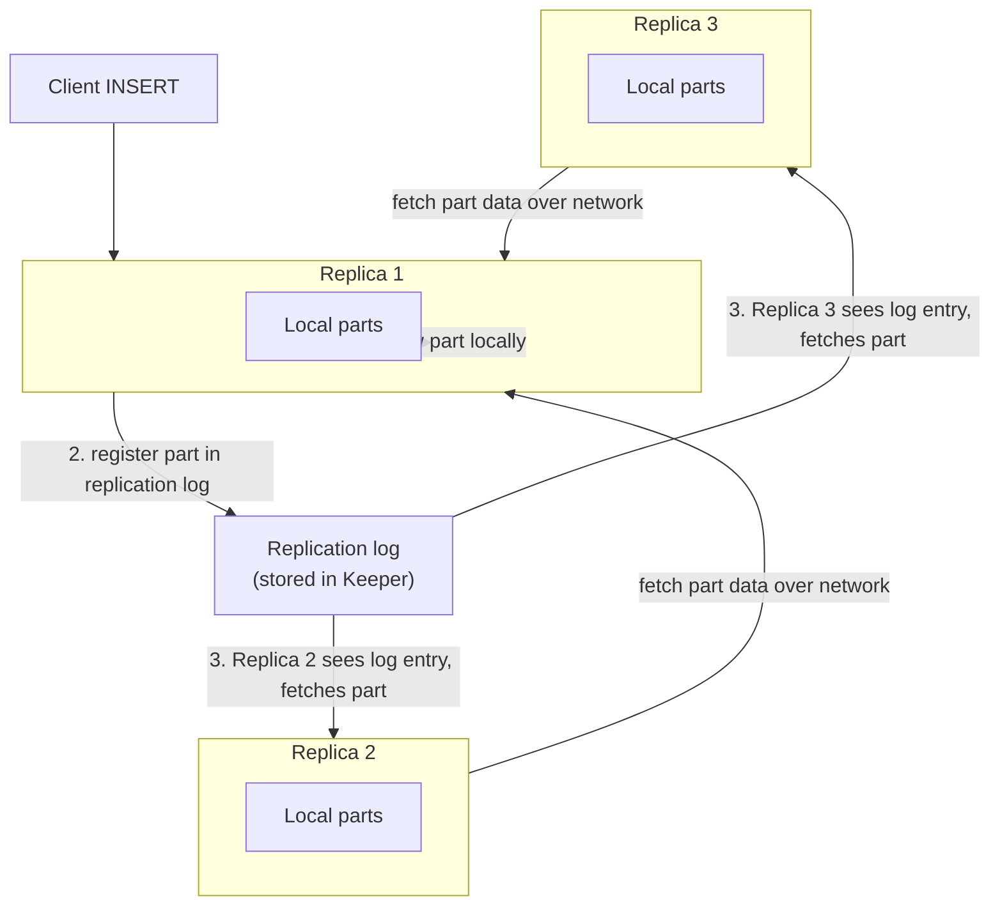
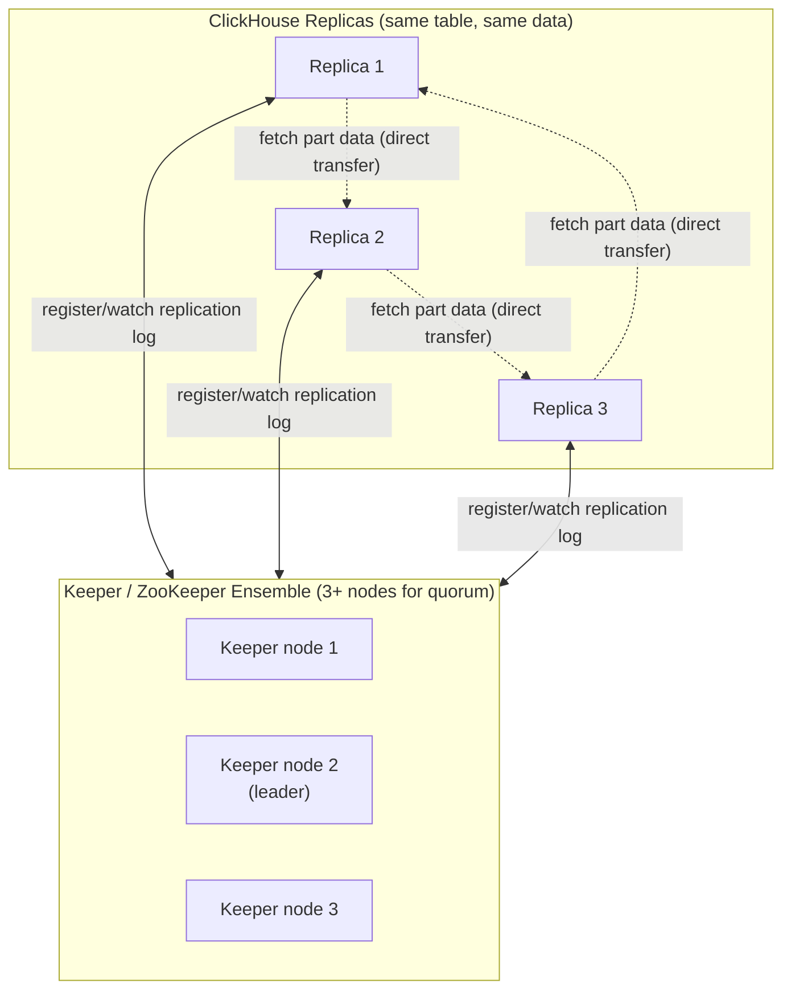
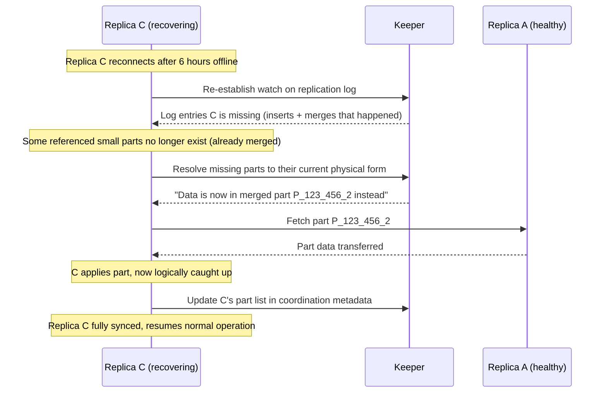

# Replication & High Availability

Every chapter so far has quietly assumed a world with exactly one ClickHouse node. Chapter 3 showed you how that single node turns inserts into immutable parts and merges them in the background; Chapter 5 showed you the family of engines that layer extra merge-time logic on top of that same mechanism. All of it has been about a single machine doing its job well. But a single machine, no matter how well-tuned, has two structural problems that no amount of internal cleverness can fix: it is a **single point of failure** (disk dies, process crashes, the rack loses power — your data becomes unavailable, or worse, gone), and it is a **hard ceiling on read throughput** (only one machine's CPU and disk bandwidth are ever available to serve queries, no matter how many clients are asking). This chapter is about removing both limits with **replication**: keeping multiple independent copies of the same data on different nodes, kept in sync automatically, so that losing one node costs you nothing and reading can be spread across several. The mechanism ClickHouse uses to do this — part-level replication coordinated through a dedicated service called Keeper — looks nothing like the row-level or WAL-based replication you may know from PostgreSQL or MongoDB, and understanding exactly how it differs is the point of this chapter.

---

## Learning Objectives

By the end of this chapter, you will be able to:

- Explain why a single ClickHouse node is both a fault-tolerance risk and a read-throughput ceiling, and how replication addresses each.
- Describe how `ReplicatedMergeTree` (and its `Replicated*` siblings) replicates data at the **part** level via a replication log, and contrast this with row-level/WAL-based replication in PostgreSQL and MongoDB.
- Explain the role of ClickHouse Keeper (or ZooKeeper) as the coordination layer: what metadata it stores, and why ClickHouse needs an external coordinator rather than peer-to-peer gossip.
- Explain ClickHouse's multi-master write model and how the coordination service prevents write conflicts without a single elected primary.
- Trace what happens when a replica goes offline and reconnects, including the case where source parts have already been merged away.
- Use `insert_quorum` to require multi-replica acknowledgment for durability-critical inserts.
- Write a `CREATE TABLE ... ENGINE = ReplicatedMergeTree(...)` statement piece by piece, including the ZooKeeper/Keeper path and replica name macros.

---

## Prerequisites for This Chapter

This chapter builds directly on two earlier chapters:

- **[Chapter 3: Architecture & Internals](./03-architecture-and-internals.md)** — you need to be comfortable with parts as the unit of storage, immutability of parts once written, and background merges consolidating smaller parts into larger ones. Replication in ClickHouse is built entirely on top of that model: it replicates *parts*, not rows, so if "a part is an immutable file set produced by one insert or one merge" is still fuzzy, revisit Chapter 3 first.
- **[Chapter 5: Table Engines Deep Dive](./05-table-engines-deep-dive.md)** — you should know that `MergeTree` is a family (`ReplacingMergeTree`, `SummingMergeTree`, `AggregatingMergeTree`, `CollapsingMergeTree`, etc.), each adding one extra merge-time rule on the same parts-and-merges foundation. This chapter shows that the `Replicated` prefix is an orthogonal add-on to *any* member of that family, not a separate engine choice you have to pick instead of `ReplacingMergeTree` or `SummingMergeTree`.

If either feels shaky, this chapter will still make conceptual sense, but the mechanics will click faster with those foundations fresh.

---

## 1. Why Replication: Fault Tolerance and Read Scale

A single ClickHouse node gives you two guarantees you almost certainly don't want in production:

1. **Single point of failure.** If the node's disk fails, the process crashes, or the host loses power, every table on that node is unavailable — and if the failure is a disk failure rather than a transient crash, the data may be unavailable *permanently*. There is no copy anywhere else.
2. **A hard read-throughput ceiling.** Every `SELECT` your application issues competes for the same CPU cores, the same disk I/O, and the same memory bandwidth as every other query and every background merge running on that one machine. Adding more client load doesn't get you more capacity — it gets you queueing.

Replication solves both problems with the same mechanism: maintain **more than one full copy** of a table's data, on different nodes, kept continuously in sync. If one replica dies, the others keep serving reads and writes without interruption. If read load grows, you add more replicas and spread `SELECT` queries across them (typically via a load balancer or ClickHouse's own `Distributed` engine, previewed in Chapter 5 and covered fully in Chapter 12).

It's worth being precise about what replication does *not* solve: it does not let you store more data than fits on one node, and it does not parallelize a single query across machines holding *different* slices of the data. That's **sharding** — a different technique, covered in Chapter 12 — for splitting one logical dataset across multiple nodes so no single node needs to hold all of it. Replication and sharding are complementary and are normally used together in a production cluster: each shard holds a slice of the data, and each shard is itself replicated for fault tolerance. This chapter is about replication only; keep the distinction in mind so you don't reach for `ReplicatedMergeTree` expecting it to solve a storage-capacity problem.

---

## 2. `ReplicatedMergeTree`: Part-Level Replication, Not Row-Level

### 2.1 The engine family, with `Replicated` bolted on

Chapter 5 established that `MergeTree` is a base policy and every other engine in the family (`ReplacingMergeTree`, `SummingMergeTree`, `AggregatingMergeTree`, `CollapsingMergeTree`, `VersionedCollapsingMergeTree`) adds exactly one extra merge-time rule on top of it. Replication is a second, entirely independent axis: the `Replicated` prefix can be added to **any** engine in that family:

| Non-replicated | Replicated equivalent |
|---|---|
| `MergeTree` | `ReplicatedMergeTree` |
| `ReplacingMergeTree` | `ReplicatedReplacingMergeTree` |
| `SummingMergeTree` | `ReplicatedSummingMergeTree` |
| `AggregatingMergeTree` | `ReplicatedAggregatingMergeTree` |
| `CollapsingMergeTree` | `ReplicatedCollapsingMergeTree` |
| `VersionedCollapsingMergeTree` | `ReplicatedVersionedCollapsingMergeTree` |

All of the merge-time logic from Chapter 5 — deduplication, summing, aggregate-state merging, sign-column collapsing — is completely unaffected by whether the engine is replicated. Replication only changes **how parts get onto multiple nodes**; it has no opinion about what happens to rows that collide on a sorting key during a merge. You choose the base engine for your data's mutation semantics (Chapter 5's decision) and independently decide whether it needs to be replicated (this chapter's decision).

### 2.2 How it actually works: a replication log, not row shipping

This is the single most important idea in the chapter, so it's worth stating plainly before the mechanics:

> **ClickHouse does not replicate individual rows or SQL statements. It replicates parts — the same immutable, on-disk part objects from Chapter 3 — by recording *which parts exist* in a shared log, and having each replica independently fetch and apply the parts it's missing.**

Contrast this with the replication you may already know:

- **PostgreSQL** streams a **write-ahead log (WAL)** of low-level page/row changes to standbys, which replay them in order.
- **MongoDB** replicates via the **oplog**, an ordered log of idempotent per-document operations that secondaries apply one at a time.

Both are fundamentally row/statement/page-level: replicas replay a stream of small logical changes. ClickHouse instead leans entirely on the fact that a part, once written, never changes — so instead of shipping the changes that *produced* a part, it just needs to tell other replicas "a new part named X now exists; go fetch it," and shipping the whole part (a directory of column files) is a cheap, embarrassingly parallelizable file-transfer problem, not a stream of edits that must be replayed in exact order against mutable state.

Concretely, here's the sequence for a single `INSERT`:

1. A client sends an `INSERT` to **any** replica of a `ReplicatedMergeTree` table.
2. That replica writes the data to a new local part on disk, exactly as it would for a non-replicated `MergeTree` (Chapter 3's mechanics, unchanged).
3. The replica **registers this event in a replication log** stored in the coordination service (ClickHouse Keeper or ZooKeeper — Section 3), recording metadata like the part's name and checksum — not the row data itself.
4. Every other replica of that table is watching that same log. On seeing a new log entry, each replica **fetches the actual part data** (the column files) directly from a replica that has it, over the network, and adds it to its own local set of parts.
5. Once fetched, the new part participates in that replica's own independent background merge process exactly as if it had been inserted locally — merges are not themselves replicated as a single global operation; each replica merges its own parts on its own schedule, and (deterministically, given the same input parts) arrives at the same logical result.



Notice what is *not* happening: no replica is replaying individual `INSERT` statements, no replica is reconstructing rows from a WAL, and the coordination service itself never stores or transmits the bulk row data — only lightweight metadata (part names, checksums, block numbers) small enough to comfortably live in a coordination service built for metadata, not bulk storage.

### 2.3 Why part-level replication is a natural fit here

This design isn't an arbitrary implementation choice — it falls directly out of the immutable-parts architecture you learned in Chapter 3. Because a part, once written, is never modified in place, "does replica B have an up-to-date copy of this data" reduces to a much simpler question than in a mutable-row system: "does replica B have a copy of this exact immutable file set, yes or no?" There's no need to diff row contents, resolve conflicting in-place edits, or replay operations in a precise order to reconstruct current state — a replica either has fetched a given part or it hasn't, and once fetched, that part is byte-identical everywhere and never drifts. Row-level replication earns its complexity handling exactly the problem ClickHouse's architecture makes moot: reconciling ongoing mutations to the same row across replicas.

---

## 3. ClickHouse Keeper: The Coordination Service

### 3.1 What it stores

The replication log from Section 2.2 has to live somewhere every replica can reliably read and write, with strong consistency guarantees (every replica must agree on the ordering of log entries, and entries must never be silently lost). ClickHouse delegates this to a dedicated **coordination service**:

- **ZooKeeper** — the original choice, a mature, widely-used distributed coordination system also used by Kafka, HBase, and others.
- **ClickHouse Keeper** — ClickHouse's own purpose-built reimplementation of the same coordination protocol, wire-compatible with ZooKeeper's client API but built directly into the `clickhouse-server` binary (or runnable as a separate lightweight `keeper` process). Keeper is now the recommended choice for new deployments.

Per replicated table, the coordination service stores:

- The **replication log** itself — the ordered list of "a part was added / a part was merged / a part was dropped" events described in Section 2.2.
- The **current list of parts** each replica believes it has, used to detect what a given replica is missing.
- **Block number / insert-order bookkeeping**, so replicas agree on a single logical ordering of inserts even though inserts can land on any replica (Section 4).
- Metadata needed for **leader election for background operations** — at any moment, one replica acts as the coordinator for scheduling merges so that (for example) two replicas don't redundantly merge the same parts at the same time; this is an internal efficiency mechanism, not a write-availability restriction (Section 4 explains why writes are unaffected by which replica currently holds this role).

### 3.2 Why an external coordinator, not peer-to-peer

It's reasonable to ask why ClickHouse doesn't just have replicas talk directly to each other — gossip about which parts exist, negotiate merges, and so on — instead of introducing an entirely separate distributed system as a dependency. The answer is that the problems Keeper solves (agreeing on a single order of events across multiple unreliable, possibly-partitioned nodes; electing a coordinator without split-brain; storing small amounts of state with strict consistency) are exactly the class of problem **distributed consensus** algorithms (Keeper and ZooKeeper both implement variants in the Paxos/Raft family) are built to solve correctly, and getting that correct from scratch, peer-to-peer, inside every database engine that needs it, is a well-known way to introduce subtle, hard-to-reproduce correctness bugs. By outsourcing consensus to a dedicated, independently-hardened service, ClickHouse's own replication logic can stay comparatively simple: "watch the log, fetch what's missing," rather than "implement distributed consensus correctly, in addition to everything else a database does." ClickHouse Keeper exists specifically because running a separate, general-purpose ZooKeeper cluster (a JVM-based system with its own operational quirks) was, for many teams, a heavier dependency than the coordination job actually required — Keeper gives the same consensus guarantees in a smaller, purpose-built, C++ package with no JVM to tune.



Note the two distinct kinds of traffic in that diagram: replicas talk to Keeper for small, metadata-only coordination (who has what, what's the log say), and replicas talk **directly to each other** for the actual bulk part-data transfer. Keeper is deliberately kept out of the data path — it coordinates, it doesn't move your rows.

---

## 4. Multi-Master Writes: Any Replica Accepts Inserts

### 4.1 Contrast with primary/secondary models

If you've worked with PostgreSQL streaming replication or MongoDB replica sets (this course's sibling MongoDB course covers this in depth), you're used to a **primary/secondary** model: one node is elected primary and is the *only* node that accepts writes; secondaries are read-only copies that apply the primary's oplog/WAL. Writing to a secondary either fails outright or requires an explicit topology change.

`ReplicatedMergeTree` does not work this way. **Any replica can accept an `INSERT` at any time** — there is no single elected "write primary" for data traffic. A client (or a load balancer in front of several replicas) can send an `INSERT` to whichever replica is most convenient, and that replica handles it exactly as described in Section 2.2: write locally, register in the log, let others catch up.

### 4.2 The implication: no write bottleneck, but coordination still matters

The upside is exactly what you'd expect: no single node's write capacity caps the whole table's insert throughput, and there's no failover dance required to keep writes flowing if one particular replica goes down — the others simply keep accepting inserts as if nothing happened.

The catch is that multiple replicas accepting writes concurrently creates two problems that a primary/secondary system sidesteps by construction, and both are solved by the coordination service rather than by the replicas negotiating directly:

- **Conflicting part names.** Two replicas independently writing new parts at nearly the same moment must not collide on naming or on the logical position those parts occupy in the table's history. The coordination service hands out unique, ordered block numbers as part of registering each insert in the log, so every part gets a globally consistent identity regardless of which replica produced it.
- **Insert ordering for correctness-sensitive scenarios.** For most append-only analytical data, the exact interleaving of concurrently-inserted parts from different replicas doesn't matter — but for features that care about order (like `ReplacingMergeTree`'s "latest version wins" semantics from Chapter 5, when the version column ties), having a single, coordinator-assigned ordering of insert events avoids ambiguity about which insert is considered "later."

The earlier mention of a "leader" for background merge scheduling (Section 3.1) is part of this same picture but should not be confused with a write primary: that leader role only decides which replica initiates a given background merge (so the same merge work isn't wastefully duplicated across replicas), and if the leader replica goes down, another replica is elected via Keeper to take over — meanwhile, writes to any surviving replica were never affected by this leader role in the first place.

---

## 5. Replica Recovery: Catching Up After Downtime

### 5.1 The normal case: fetch what's missing

When a replica has been offline (crashed, restarted, network-partitioned) and reconnects, it re-establishes its watch on the coordination service and compares the replication log against its own local part list. Any log entries it missed while it was down correspond to parts it doesn't yet have. It simply fetches those parts from a healthy replica, one by one, exactly as it would for parts arriving in real time — recovery is not a special code path, it's the same "fetch missing parts" logic run against a backlog instead of a live stream.

### 5.2 The trickier case: source parts have already been merged away

Here's a scenario worth thinking through carefully. Suppose replica C goes offline for six hours. During that time, replicas A and B each receive a steady stream of inserts, and — as always happens on a healthy MergeTree table — the background merge process on A and B consolidates many of those small parts into fewer, larger ones. By the time C reconnects, the small parts that were originally logged as "new" no longer exist on A or B at all; they were merged into bigger parts hours ago and deleted.

Does C need those exact original small parts to catch up? No — and this is precisely where the "replicate logical data, not exact physical objects" design pays off. The replication log doesn't just say "part X was created" in a way that becomes stale once X is merged away; it also records merge events and maintains enough lineage information that a replica catching up can be told, in effect, "the data you're missing is now contained in this larger, already-merged part instead — fetch that one." C fetches the larger merged part directly, which is strictly less work than reconstructing and re-merging all the small originals itself. The logical content C ends up with is identical to what it would have gotten by replaying every small insert and merge individually — the log tracks *what data needs to exist*, not *which literal file must be transferred* — so a replica can always be caught up by fetching whatever the current physical representation of that data happens to be, no matter how much consolidation happened while it was away.



### 5.3 What if a replica is gone for good?

If a replica is permanently lost (disk failure, decommissioned host) rather than temporarily offline, it's removed from the table's replica set in the coordination service, and a fresh replica can be added in its place — which, having no data at all, simply fetches the *entire* current part set from a healthy replica. This is the same fetch mechanism as ordinary catch-up, just starting from zero instead of from a partial backlog.

---

## 6. Quorum Inserts: `insert_quorum`

By default, an `INSERT` against a `ReplicatedMergeTree` table returns success once the part is written locally and registered in the replication log — it does **not** wait for other replicas to have actually fetched and applied that part. That's normally fine (the data isn't lost; it's durably logged and will propagate), but for data where you cannot tolerate even a brief window where only one replica has the newest rows, ClickHouse offers the `insert_quorum` setting:

```sql
INSERT INTO events SETTINGS insert_quorum = 2 VALUES (...);
```

With `insert_quorum = 2`, the insert only returns success once **at least 2 replicas** (including the one that received the write) confirm they have the part. This is directly analogous to write concern `w: "majority"` in the sibling MongoDB course, or `synchronous_commit`/quorum-based replication settings in PostgreSQL: you are trading a small amount of write latency for a stronger durability guarantee — an acknowledged write is guaranteed to survive the loss of any single replica, because more than one replica already has it. As with any quorum write, choose a quorum size relative to your replication factor and tolerance for latency; requiring all replicas (`insert_quorum` equal to the full replica count) means an insert can't succeed at all if any single replica is temporarily down, which is often too strict for real deployments.

---

## 7. Setting Up a Minimal Replicated Table

Here is the syntax for turning a plain `MergeTree` table into a replicated one, explained piece by piece:

```sql
CREATE TABLE events
(
    event_time DateTime,
    user_id    UInt64,
    event_type String
)
ENGINE = ReplicatedMergeTree('/clickhouse/tables/{shard}/events', '{replica}')
ORDER BY (user_id, event_time);
```

Breaking down the two arguments to `ReplicatedMergeTree`:

- **`'/clickhouse/tables/{shard}/events'`** — the **ZooKeeper/Keeper path** for this table. This is the location in the coordination service's own hierarchical namespace where this table's replication log, part list, and other metadata will live. Every replica of *this same table* must be configured with the **exact same path**, because that's how they find each other and agree they're replicas of one logical table rather than independent tables that happen to share a name. The `{shard}` placeholder is a macro (defined per-server in ClickHouse's configuration, e.g. `<shard>01</shard>` in that server's macros config) that gets substituted at table-creation time — it exists so the same `CREATE TABLE` statement, distributed identically to every node via distributed DDL (Chapter 12), resolves to a different, correct path per shard without hand-editing SQL per node.
- **`'{replica}'`** — the **replica's own name** within that shard's replica set, also a per-server macro (e.g. `<replica>replica_1</replica>`). This is how a given node identifies *itself* to the coordination service as one specific replica among however many exist for that shard, distinguishing "replica_1's view of what parts it has" from "replica_2's view."

A second replica of the same table, running on a different physical host, uses the **identical** `CREATE TABLE` statement — the macros resolve differently per-host because each host's local configuration defines its own `{shard}`/`{replica}` values, but the SQL text sent to every node is the same, which is exactly what makes distributed DDL (`ON CLUSTER`, covered in Chapter 12) practical: one statement, correctly replicated topology, no per-node SQL authoring.

Applying the `Replicated` prefix to a different family member works identically — only the engine name and its own constructor arguments change, with the ZooKeeper path and replica name always coming first:

```sql
CREATE TABLE user_profiles_current
(
    user_id    UInt64,
    email      String,
    event_time DateTime64(3)
)
ENGINE = ReplicatedReplacingMergeTree('/clickhouse/tables/{shard}/user_profiles_current', '{replica}', event_time)
ORDER BY user_id;
```

Note that `event_time` — the `ReplacingMergeTree` version-column argument from Chapter 5 — simply moves to a third position, after the two replication arguments. The merge-time dedup logic is completely unchanged from Chapter 5; only the replication plumbing was added.

---

## Real-World Scenario

**Setup:** You operate a 3-replica `ReplicatedMergeTree` `events` table ingesting clickstream data at high volume during a marketing campaign's traffic peak. At 2:14 AM, replica 2 (of 3) suffers an out-of-memory crash and its `clickhouse-server` process dies. On-call is paged by your monitoring.

**What happens to ongoing inserts:** Your ingestion workers are configured to round-robin `INSERT`s across all three replicas (this is the multi-master model from Section 4 — there was never a single write bottleneck to fail over). The moment replica 2 stops responding, your load balancer's health check marks it unhealthy and routes all new inserts to replicas 1 and 3 instead. Those inserts succeed immediately and completely normally — nothing about ClickHouse's replication design required replica 2 to be up for the other two to keep accepting writes. If you had `insert_quorum = 2` configured for this table, quorum is still satisfiable with 2 of the remaining 2 replicas (or 2 of 3 total, depending on exact quorum size chosen) — worth confirming your quorum setting was chosen with an eye toward how many replicas can be down before inserts start blocking.

**What the operator does:** The on-call engineer restarts the `clickhouse-server` process on replica 2's host (or, if the crash indicates a deeper host problem, provisions a fresh host with the same `{shard}`/`{replica}` macro configuration pointing at the same Keeper path). No data-copying step is manually triggered — that's the point of the architecture.

**How it catches up automatically:** On startup, replica 2 reconnects to the Keeper ensemble, re-registers its watch on the `events` table's replication log, and immediately sees a large backlog of log entries covering every insert and merge that happened on replicas 1 and 3 during its downtime — exactly the mechanism from Section 5. It begins fetching missing parts (some of which, per Section 5.2, may already be larger merged parts rather than the original small ones from 2:14 AM). The operator's only job during recovery is to **watch `system.replication_queue`** on replica 2 (queued fetch/merge tasks shrinking toward zero) and **`system.replicas`** (checking `is_readonly = 0`, `future_parts` and `queue_size` trending down, and `absolute_delay` approaching zero) to confirm catch-up is progressing rather than stuck. Once `system.replicas` shows replica 2 fully caught up, it silently rejoins normal read/write rotation — no manual data reconciliation, no replay of a change log by hand, no downtime beyond replica 2's own unavailability window.

---

## Best Practices

- **Run Keeper (or ZooKeeper) as a dedicated quorum of at least 3 nodes in production.** A single Keeper node is itself a single point of failure for your *coordination layer*, which defeats the purpose of replicating your data — see Common Mistakes below.
- **Use `insert_quorum` for data where losing a just-written, not-yet-propagated row is unacceptable**, accepting the small latency cost in exchange for the durability guarantee, analogous to `w: "majority"` write concern.
- **Monitor `system.replicas` continuously** — specifically `is_readonly`, `absolute_delay`, `queue_size`, and `future_parts` — to catch replication lag or a stuck replica before it becomes a production incident rather than after.
- **Monitor `system.replication_queue`** for tasks that are retrying repeatedly or stuck, which usually indicates a network problem between replicas, a corrupted part, or a Keeper connectivity issue.
- **Keep Keeper's own storage on fast, dedicated disks**, separate from ClickHouse's data disks — Keeper's performance directly gates how quickly replication metadata updates propagate, and it should never compete with heavy `MergeTree` I/O for the same spindle.
- **Give every replica a distinct, meaningful `{replica}` macro value** (hostname-derived is common) so operational tooling and `system.replicas` output are immediately legible during an incident.
- **Size your replication factor deliberately** (2 or 3 replicas per shard is typical) based on how many simultaneous node failures you need to tolerate without losing availability or falling below your durability requirements.

---

## Common Mistakes

- **Running a single Keeper/ZooKeeper node in production.** This provides zero fault tolerance for the coordination layer itself — if that one node dies, every replicated table's ability to coordinate new writes and fetches stalls, even though the ClickHouse data nodes themselves are perfectly healthy. Always run an odd-sized quorum (3, 5) of Keeper nodes.
- **Not monitoring `system.replication_queue` / `system.replicas` and missing silent replication lag.** A replica can fall behind for hours without any query ever failing outright (reads against a healthy replica just look normal), so lag has to be actively monitored, not discovered when someone eventually notices stale data.
- **Assuming `ReplicatedMergeTree` alone provides sharding or horizontal scaling.** Replication gives you multiple copies of the *same* data for redundancy and read spread — it does not split a dataset too large for one node across multiple nodes. That's sharding, a separate concern covered fully in Chapter 12; conflating the two leads to under-provisioned clusters that are highly available but still can't hold the data.
- **Forgetting or misconfiguring the `{shard}`/`{replica}` macro conventions.** If two replicas of what should be the same table end up with different Keeper paths (a typo in `{shard}`, or a macro left unset), they will never discover each other — you'll have two independent, unreplicated tables that happen to share a name, discovered only when a "replica" mysteriously never receives any data.
- **Treating quorum inserts as a substitute for monitoring.** `insert_quorum` protects a single insert's durability; it does not tell you about a replica that's been silently falling behind on catch-up work for unrelated historical data. Both mechanisms are needed, not either/or.
- **Restarting or reprovisioning a failed replica without preserving its `{replica}` macro identity**, which can confuse the coordination service about whether this is the same replica resuming or a brand-new one — check your deployment tooling assigns replica names deterministically, not randomly, per host.
- **Over-provisioning replication factor as a substitute for actually testing failover.** Having 5 replicas is not the same as knowing recovery actually works — periodically kill a replica in a non-production environment and confirm `system.replicas` shows a clean catch-up, rather than assuming the mechanism works because the documentation says so.

---

## Summary

- A single ClickHouse node is both a fault-tolerance risk and a hard ceiling on read throughput; replication addresses both by maintaining multiple synced copies of the same data.
- `ReplicatedMergeTree` (and any `Replicated`-prefixed sibling engine) replicates at the **part level**: inserts are registered in a replication log stored in a coordination service, and other replicas fetch and apply the actual part files — this is fundamentally different from row-level/WAL-based replication in PostgreSQL or MongoDB, and falls naturally out of Chapter 3's immutable-parts design.
- **ClickHouse Keeper** (or legacy ZooKeeper) is the external coordination service storing the replication log, part lists, and leader-election metadata; ClickHouse delegates to it rather than implementing peer-to-peer consensus itself, and Keeper exists as a lighter-weight, purpose-built alternative to running a separate ZooKeeper cluster.
- ClickHouse uses a **multi-master** write model: any replica can accept inserts at any time, avoiding a single write bottleneck — the coordination service resolves part-naming and insert-ordering conflicts that this model would otherwise create.
- A recovering replica catches up by fetching parts referenced in the replication log's backlog; if source parts were already merged away while it was offline, it fetches the resulting larger merged parts instead, because the log tracks logical data lineage, not exact physical part identity.
- `insert_quorum` requires acknowledgment from multiple replicas before an insert is considered durable — the ClickHouse analog of majority write concern in MongoDB.
- `ENGINE = ReplicatedMergeTree('/clickhouse/tables/{shard}/events', '{replica}')` establishes a table's identity in the coordination service via a shared Keeper path (identical across all replicas of the same table) and a distinct per-replica name.

---

## Knowledge Check

1. Explain, in your own words, why ClickHouse replicates at the part level instead of the row level, and how that choice connects to the immutable-parts architecture from Chapter 3.
2. What specific problem does ClickHouse Keeper (or ZooKeeper) solve that peer-to-peer replica communication alone would struggle to solve correctly?
3. In ClickHouse's multi-master model, what stops two replicas from producing conflicting part names or ambiguous insert ordering when both accept writes concurrently?
4. A replica has been offline for two days, during which the parts it needs were merged into much larger parts on the surviving replicas. Explain why the recovering replica doesn't need the original small parts to catch up correctly.
5. Why is running `ReplicatedMergeTree` with a replication factor of 3 not, by itself, a solution to a dataset that's too large to fit on a single node's disk?

---

## Hands-On Exercise

Stand up a minimal 2-replica ClickHouse cluster with Keeper, and observe replication and recovery firsthand.

1. **Provision three containers** (Docker Compose or three terminal sessions with separately configured instances): one running ClickHouse Keeper (`clickhouse-keeper` or `clickhouse-server` with the `<keeper_server>` config block enabled), and two running `clickhouse-server` — `ch-replica-1` and `ch-replica-2` — each configured with a `<zookeeper>` block pointing at the Keeper instance, and each with its own `{shard}`/`{replica}` macros defined (both `shard` = `01`, but `replica` = `replica_1` and `replica_2` respectively).

2. **On `ch-replica-1`**, create the replicated table:
   ```sql
   CREATE TABLE events
   (
       event_time DateTime,
       user_id    UInt64,
       event_type String
   )
   ENGINE = ReplicatedMergeTree('/clickhouse/tables/{shard}/events', '{replica}')
   ORDER BY (user_id, event_time);
   ```

3. **On `ch-replica-2`**, run the identical `CREATE TABLE` statement. Confirm both replicas now show the table, and check `SELECT * FROM system.replicas WHERE table = 'events'` on either node — you should see both replica names listed.

4. **Insert data via `ch-replica-1` only:**
   ```sql
   INSERT INTO events VALUES (now(), 1, 'page_view'), (now(), 2, 'click');
   ```
   Immediately query `SELECT count() FROM events` on **`ch-replica-2`** — you should see the rows appear within a second or two, having never been directly inserted there.

5. **Stop `ch-replica-2`** (`docker stop` or kill the process).

6. **Insert more data via `ch-replica-1`** while replica 2 is down:
   ```sql
   INSERT INTO events VALUES (now(), 3, 'purchase'), (now(), 4, 'page_view');
   ```
   Confirm this succeeds normally — replica 1 doesn't know or care that replica 2 is down.

7. **Restart `ch-replica-2`.** Immediately query `SELECT database, table, is_readonly, queue_size, absolute_delay FROM system.replicas WHERE table = 'events'` on replica 2 repeatedly (every second or two) and watch `queue_size` drop to 0 and `absolute_delay` drop to 0 as it catches up.

8. **Confirm final consistency:** run `SELECT count() FROM events` on both replicas and confirm they match, without you having performed any manual data copy or reconciliation step.

---

## Further Reading

- [Data Replication](https://clickhouse.com/docs/en/engines/table-engines/mergetree-family/replication) — official reference on `ReplicatedMergeTree`, setup, and recovery behavior.
- [ClickHouse Keeper](https://clickhouse.com/docs/en/guides/sre/keeper/clickhouse-keeper) — architecture and configuration guide for Keeper as a ZooKeeper replacement.
- [system.replicas](https://clickhouse.com/docs/en/operations/system-tables/replicas) — system table reference for monitoring replication state.
- [system.replication_queue](https://clickhouse.com/docs/en/operations/system-tables/replication_queue) — system table reference for in-flight replication tasks.
- [Settings: insert_quorum](https://clickhouse.com/docs/en/operations/settings/settings#insert_quorum) — official reference on quorum-insert semantics and related settings.

---

<div style="display:flex;justify-content:space-between;align-items:center;">
  <a href="./10-joins-and-data-modeling.md">← Previous: Joins & Data Modeling</a>
  <a href="./00-index.md">🏠 Index</a>
  <a href="./12-sharding-and-distributed-queries.md">Next: Sharding & Distributed Queries →</a>
</div>
