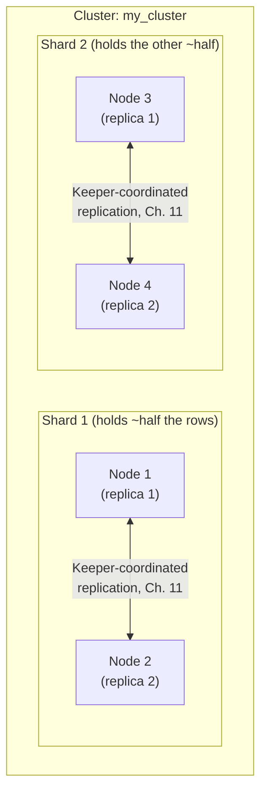
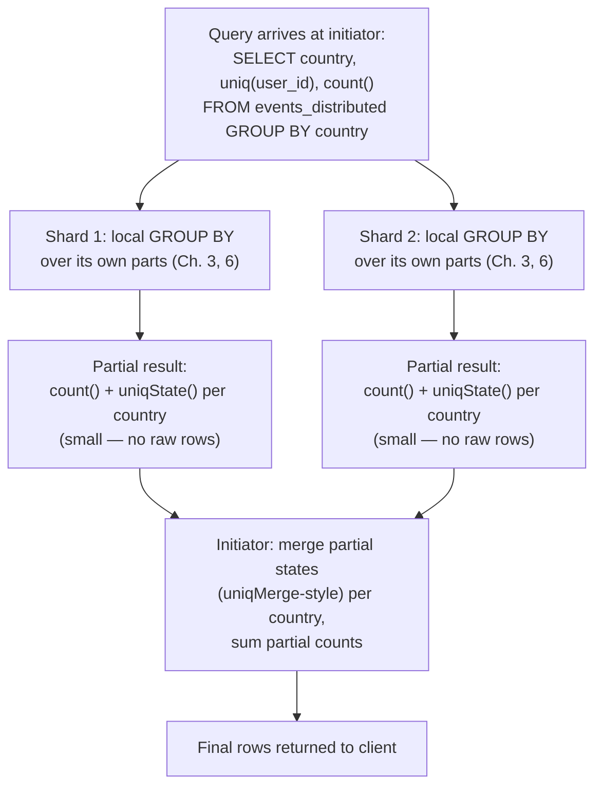

# Sharding & Distributed Queries

Chapter 11 solved a specific problem: what happens when a node dies, or when read traffic outgrows what one node can serve. `ReplicatedMergeTree` plus Keeper gave you multiple synchronized **copies** of the same data, so a lost node doesn't mean lost data, and read queries can be spread across replicas. But replication, by design, does not grow how much data you can hold or how much work you can do per query — every replica still stores the *entire* dataset and still has to scan it with its own CPU and its own disk. If your `events` table outgrows one node's RAM for its working set, or a single node's CPU cores can no longer scan a full day's partition inside your latency budget, adding more replicas of that same full dataset does not help even a little — you'd just have more copies of the same bottleneck. Sharding is the other axis of scale: instead of copying the whole dataset, you **split** it — horizontally partitioning rows across multiple independent nodes so that each one only has to store and scan its own slice. This chapter is about how ClickHouse does that: the `Distributed` table engine, shard key selection, distributed query execution, and the very real operational costs sharding introduces that replication alone never did.

---

## Learning Objectives

By the end of this chapter, you will be able to:

- Describe a ClickHouse cluster's full topology model — shards and replicas as two independent, combinable axes — and configure it conceptually via `remote_servers`.
- Explain what the `Distributed` table engine actually is (a data-less routing proxy), what each of its constructor arguments does, and how it fans a query out and merges results back.
- Choose a shard key deliberately, and explain the concrete trade-off between an even, random distribution (`rand()`) and a data-locality-preserving key (`cityHash64(user_id)`).
- Trace exactly how a distributed `GROUP BY` avoids shipping raw rows across the network, using the partial-aggregation-state mechanism from Chapter 8.
- Explain precisely why `GLOBAL JOIN`/`GLOBAL IN` exist, what goes wrong without them, and what they cost when used.
- Run schema changes across an entire cluster with `ON CLUSTER`, instead of hand-repeating DDL per node.
- Explain honestly why ClickHouse does not auto-rebalance data after you add a shard, and what rebalancing actually requires in practice.

---

## Prerequisites for This Chapter

This chapter builds directly on [Chapter 11: Replication & High Availability](./11-replication-and-high-availability.md). We assume you're comfortable with:

- `ReplicatedMergeTree` and how Keeper coordinates multiple replicas of the *same* data.
- Why replication solves fault tolerance and read scaling, but not storage or compute scaling — the exact gap this chapter fills.
- The sparse primary index and how a single node executes a query against its own local parts (Chapter 6) — sharding fans that same local execution model out across many nodes.
- Aggregate function combinators, especially `-State`/`-Merge` (Chapter 8) — distributed aggregation reuses this mechanism, just automatically and across the network rather than inside one `AggregatingMergeTree` table.
- Join algorithms and the `GLOBAL` keyword's brief introduction (Chapter 10) — this chapter gives it the full explanation that chapter deferred.

If any of that feels shaky, revisit those chapters first — this one assumes all of it as settled ground.

---

## 1. Cluster Topology: Shards and Replicas Are Two Different Axes

It's tempting, coming from Chapter 11, to think of a "cluster" as just "a group of replicated nodes." ClickHouse's model is more specific, and the distinction matters for everything that follows:

- A **shard** is a slice of your data — some subset of the rows.
- A **replica** is a redundant copy of one shard.
- A **cluster** is a named collection of shards, where each shard can itself have one or more replicas.

These two axes are orthogonal. You can have one shard with three replicas (pure replication, no sharding — this was Chapter 11's whole world). You can have four shards with one replica each (pure sharding, no fault tolerance — usually a bad idea in production). Or, realistically, you combine both: multiple shards, each replicated, so you get horizontal scale *and* fault tolerance at the same time.

### 1.1 A concrete topology: 2 shards × 2 replicas = 4 nodes



Four physical nodes, but only **two** distinct slices of data exist — nodes 1 and 2 hold identical copies of shard 1's rows, and nodes 3 and 4 hold identical copies of shard 2's rows. Losing node 1 costs you nothing but capacity (node 2 still serves shard 1's data — Chapter 11's guarantee, unchanged). Losing node 1 *and* node 2 together, however, loses shard 1's data entirely, because sharding means no other shard has a copy of those rows. Replication and sharding solve different failure modes, and neither substitutes for the other.

### 1.2 Declaring the topology: `remote_servers`

A cluster's shape is declared in ClickHouse server configuration (`config.xml`, or a file included via `config.d/`), as a `remote_servers` entry. Conceptually, this XML *is* the topology diagram above:

```xml
<remote_servers>
    <my_cluster>
        <shard>
            <!-- Shard 1: two replicas -->
            <replica>
                <host>ch-node-1</host>
                <port>9000</port>
            </replica>
            <replica>
                <host>ch-node-2</host>
                <port>9000</port>
            </replica>
        </shard>
        <shard>
            <!-- Shard 2: two replicas -->
            <replica>
                <host>ch-node-3</host>
                <port>9000</port>
            </replica>
            <replica>
                <host>ch-node-4</host>
                <port>9000</port>
            </replica>
        </shard>
    </my_cluster>
</remote_servers>
```

Read this the same way you'd read the diagram: `<my_cluster>` names the cluster (this is the identifier you'll pass to the `Distributed` engine and to `ON CLUSTER`); each `<shard>` block is one horizontal slice of data; each `<replica>` inside a `<shard>` block is a redundant copy of that specific slice. This file must be present (identically) on every node that needs to know about the cluster — typically all four nodes, plus any lightweight "query router" nodes that only ever query through `Distributed` tables and never store shard data themselves.

Note what this configuration does *not* do: it doesn't create any tables, and it doesn't move a single row of data. It only tells ClickHouse "here is the shape of the cluster" so that the `Distributed` engine (Section 2) has something to route queries against, and so `ON CLUSTER` (Section 6) knows which nodes to run DDL on.

---

## 2. The `Distributed` Table Engine, In Depth

Chapter 5 previewed the `Distributed` engine just enough to place it on the engine family tree: a "virtual" table that stores no data of its own, fanning queries out to real `MergeTree`-family tables living on each shard. Now we go the rest of the way.

### 2.1 It is a proxy, not a table

Every other engine you've studied so far — `MergeTree`, `ReplacingMergeTree`, `ReplicatedMergeTree` — physically owns parts on disk (Chapters 3, 5, 11). `Distributed` owns nothing. It stores no parts, no columns, no rows, anywhere. All it holds is metadata: which cluster to talk to, which local table on each node actually has the data, and which expression decides where a given row belongs. Every `SELECT` against a `Distributed` table is translated into a query against that local table, run once per shard, with results merged back on the node that received the original query (the **initiator**).

### 2.2 The constructor, argument by argument

Building on the local, per-shard table you'd define with `ReplicatedMergeTree` (Chapter 11) — created on every node via `ON CLUSTER`, Section 6 below — the proxy sits on top:

```sql
-- The real, physical table — one copy per replica, per shard, using the
-- {shard}/{replica} macros Chapter 11 introduced for ReplicatedMergeTree paths.
CREATE TABLE events_local ON CLUSTER my_cluster
(
    event_time DateTime,
    user_id    UInt64,
    event_type LowCardinality(String),
    country    LowCardinality(String)
)
ENGINE = ReplicatedMergeTree('/clickhouse/tables/{shard}/events_local', '{replica}')
ORDER BY (event_type, event_time);

-- The virtual proxy table, created on every node the same way
CREATE TABLE events_distributed ON CLUSTER my_cluster AS events_local
ENGINE = Distributed(my_cluster, currentDatabase(), events_local, rand());
```

The `Distributed(...)` constructor takes four arguments here:

| Argument | Value in this example | Meaning |
|---|---|---|
| `cluster` | `my_cluster` | The name of the `remote_servers` entry (Section 1.2) — where the shards and replicas actually are. |
| `database` | `currentDatabase()` | The database, on each remote node, that holds the local table. `currentDatabase()` is a convenient idiom meaning "whatever database this `Distributed` table itself lives in" — it avoids hardcoding a database name that might differ between environments. |
| `table` | `events_local` | The name of the local table on each node that actually stores rows. It must exist, with a compatible schema, on every node in the cluster. |
| `sharding_key` | `rand()` | An expression evaluated **per row, at insert time into the `Distributed` table**, whose value determines which shard receives that row. `rand()` produces a uniformly random value with no relationship to the row's content, so rows land on shards with even probability regardless of what's in them. |

We're starting with `rand()` deliberately, as the simplest possible sharding key, before Section 3 makes the case for choosing one more carefully.

### 2.3 What happens when you query it

```sql
SELECT event_type, count()
FROM events_distributed
WHERE event_time >= today() - 1
GROUP BY event_type;
```

Run this against `events_distributed`, and here's the full path the query takes:

1. The node you connected to (the **initiator**) parses the query and sees it targets a `Distributed` table.
2. It rewrites the query to run against `events_local` instead, and sends that rewritten query to **one replica of every shard** in `my_cluster` (which replica gets picked per shard is a load-balancing decision — see the `load_balancing` setting — but only one replica per shard is queried, since querying every replica of every shard would just waste work re-reading identical data).
3. Each shard executes the query **entirely locally**: it uses its own sparse primary index to skip granules (Chapter 6), reads only the columns actually needed (Chapter 3's columnar layout), and computes a local, partial result — for this query, a local `event_type → count()` partial aggregation.
4. Each shard ships back only its (small) partial result, not raw rows — the subject of Section 4.
5. The initiator merges the partial results from every shard into the final answer and returns it to the client.

Notice how much of this chapter's plumbing sits directly on top of earlier chapters rather than replacing them: each shard's local execution is exactly the single-node engine you already know from Chapters 3–8. Sharding doesn't introduce a new query engine — it introduces a router that fans the *existing* engine out across machines and reassembles the pieces.

### 2.4 Inserting into a `Distributed` table

`INSERT INTO events_distributed VALUES (...)` is legal, and the sharding key decides where each row actually lands — the initiator evaluates the sharding key expression per row and forwards it to the corresponding shard's local table. It works, but it adds a network hop and a point of failure (the initiator buffering and forwarding rows) that inserting directly into each node's local table avoids entirely. Production pipelines commonly insert directly into `events_local` on each node — computing the target shard client-side — and reserve `Distributed` purely for reads. This isn't a hard rule, but it's a very common pattern worth recognizing.

---

## 3. Choosing a Shard Key: Even Distribution vs. Data Locality

`rand()` guarantees one thing well: no shard ends up disproportionately larger than another, purely by chance of what values happen to appear in your data. But it guarantees nothing about *where* any particular row ends up, which has a direct, unavoidable consequence: **any query that needs a specific row (or a specific entity's rows) must ask every shard**, because there is no way to know in advance which shard has them. A point lookup for one `user_id` becomes a full scatter-gather across every shard in the cluster, even though at most one shard's worth of the answer is actually useful.

### 3.1 The alternative: a deliberate, content-derived key

```sql
ENGINE = Distributed(my_cluster, currentDatabase(), events_local, cityHash64(user_id));
```

`cityHash64(user_id)` is a fast, well-distributed hash function applied to `user_id`. Two rows with the same `user_id` always hash to the same value, and (combined with the number of shards) always route to the *same shard* — deterministically, every time, for every insert. The practical payoff: **all of one user's events live on exactly one shard.** A query that filters or aggregates by `user_id` — "this user's last 30 days of activity," "this user's session count" — can, in principle, be answered by a single shard, because the guarantee that all of that user's rows are co-located means no other shard could possibly hold relevant data.

### 3.2 The trade-off, stated plainly

| | `rand()` | `cityHash64(user_id)` |
|---|---|---|
| **Distribution evenness** | Excellent — genuinely uniform regardless of data skew | Good, if `user_id` has decent cardinality and no single user dominates the dataset |
| **Data locality for per-entity queries** | None — a query for one user's data must still ask every shard | Strong — one user's rows are guaranteed to live on one shard |
| **Cost of a per-entity query** | Full scatter-gather across all shards, every time | A single shard can answer it (with `optimize_skip_unused_shards`, ClickHouse can even skip issuing the query to shards it can prove don't hold the matching key) |
| **Cost of a cross-entity aggregate (e.g. daily totals across all users)** | Same either way — always requires all shards and a merge step | Same either way — always requires all shards and a merge step |

The setting referenced above, `optimize_skip_unused_shards`, is what actually lets a hashed shard key pay off at query time: when it's enabled and a query filters on an exact value of the sharding key expression (e.g. `WHERE user_id = 12345`), ClickHouse can prove which single shard could possibly contain matching rows and skip querying the rest entirely — turning an N-shard scatter-gather into a single targeted request. This doesn't happen automatically just by choosing a good key; it requires this setting and a query shape the planner can actually reason about (an equality or `IN` filter directly on the hashed column).

### 3.3 A note on the parallel to MongoDB's shard-key discussion

If you've been through this repo's [MongoDB course](../mongodb-course/13-sharding-and-scalability.md), this trade-off will feel familiar — but the underlying concern is genuinely different, not just re-skinned. MongoDB's shard-key analysis centers on **cardinality, frequency, and monotonicity** because MongoDB is an OLTP system worried about *write* hotspots: a monotonically increasing key concentrates every new insert onto one shard, starving the others of write throughput. ClickHouse's concern here is almost the mirror image — it's an OLAP system, and the sharding-key question is overwhelmingly about **read fan-out cost for analytical queries**, not write hotspots (bulk analytical inserts are typically batched and don't suffer the same single-shard insert bottleneck MongoDB's point-insert workload does). A shard key that's perfectly fine for ClickHouse write distribution can still be a poor choice if it destroys the locality your dominant queries need — and vice versa, a key chosen purely to distribute writes evenly (like `rand()`) can quietly force every single query into an unnecessary full-cluster scatter-gather. Evaluate ClickHouse shard keys against your query patterns first; write-distribution evenness is a secondary, usually easier, concern.

---

## 4. Distributed Query Execution: Partial Aggregation and the Merge Step

Sharding a table across N nodes only helps if a query against it doesn't require shipping N nodes' worth of raw rows back to one place — that would just relocate the bottleneck to the network and the initiator's CPU. ClickHouse avoids this using exactly the mechanism Chapter 8 introduced for `AggregatingMergeTree`: **partial aggregation states**.

### 4.1 What actually crosses the network

Take a distributed aggregate query:

```sql
SELECT country, uniq(user_id) AS distinct_users, count() AS total_events
FROM events_distributed
GROUP BY country;
```

Each shard does **not** send its matching rows to the initiator. Instead, each shard runs the `GROUP BY` **locally**, against its own local parts, using its own sparse index and vectorized execution (Chapters 3, 6) — and for each `country`, produces:

- A partial `count()` — just an integer.
- A partial `uniq(user_id)` **state** — not a distinct-count number yet, but the underlying sketch (a HyperLogLog-style structure) that `uniq()` uses internally to estimate cardinality. This is precisely the same kind of object a `uniqState()` column would hold in an `AggregatingMergeTree` table (Chapter 8) — ClickHouse is using the identical `-State`/`-Merge` machinery here, just automatically, transiently, and across the network rather than persisted to disk.

Only these compact partial states travel back to the initiator — a handful of bytes per group, per shard, regardless of how many billions of raw rows were scanned to produce them. The initiator then performs the `-Merge` half: it merges the partial `uniq` states per `country` across all shards into a single sketch, finalizes it into an actual number, sums the partial counts, and returns the final rows.



### 4.2 Why this matters at scale

Compare the alternative: if ClickHouse instead shipped every matching raw row from every shard to the initiator and did the entire `GROUP BY` in one place, sharding would buy you *nothing* for aggregate queries — you'd still be moving the full dataset over the network and aggregating it single-threaded on one machine, just with extra network latency added on top. Partial aggregation is what actually lets you add shards and see aggregate queries get faster (more machines doing local, parallel work) rather than slower (more network overhead). It's also exactly why the `-State`/`-Merge` combinator model from Chapter 8 isn't just a nice trick for `AggregatingMergeTree` tables — it's the same idea the whole distributed query engine depends on to keep cluster-wide analytics network-cheap.

---

## 5. `GLOBAL JOIN` and `GLOBAL IN`, Fully Explained

Chapter 10 introduced `GLOBAL` briefly as a keyword that changes distributed join semantics. Here's the complete picture.

### 5.1 The problem: each shard sees only its own local data

Suppose `events_distributed` is sharded (by whatever key), and you join it against `user_dimension`, a separate table:

```sql
SELECT e.event_type, u.plan_tier, count()
FROM events_distributed AS e
JOIN user_dimension AS u ON e.user_id = u.user_id
GROUP BY e.event_type, u.plan_tier;
```

Without `GLOBAL`, ClickHouse rewrites this the same way it rewrites any query on a `Distributed` table: it sends the join down to run **independently, once per shard**, against whatever `user_dimension` looks like **locally on that shard**. If `user_dimension` is a table that itself only exists as identical full copies on every node (e.g., a small `ReplicatedMergeTree` reference table, replicated everywhere in full), this happens to produce a correct answer, because "the local copy" and "the whole table" are the same thing on every shard. But if `user_dimension` is itself sharded, or is a `Distributed` table whose local piece on each node only holds part of the data, each shard silently joins against an **incomplete** slice of the right-hand side — rows whose matching `user_dimension` entry happens to live on a different shard simply fail to join, and you get a quietly wrong (typically undercounted) result, with no error raised anywhere.

### 5.2 The fix: `GLOBAL` broadcasts once

```sql
SELECT e.event_type, u.plan_tier, count()
FROM events_distributed AS e
GLOBAL JOIN user_dimension AS u ON e.user_id = u.user_id
GROUP BY e.event_type, u.plan_tier;
```

With `GLOBAL`, ClickHouse changes the execution plan: it first runs the right-hand side (`user_dimension`, fully, across whatever shards it may live on) **once**, on the initiator, materializing the complete result set. It then **broadcasts that complete result** to every shard as a temporary in-memory table, and only then does each shard run its local join — this time against the *complete* right-hand side, not just its own local fragment. Correctness is now guaranteed regardless of how `user_dimension` itself is distributed.

`GLOBAL IN` works identically for subqueries used with `IN`:

```sql
SELECT count()
FROM events_distributed
WHERE user_id GLOBAL IN (SELECT user_id FROM active_trial_users);
```

Without `GLOBAL`, the subquery would be re-evaluated independently, per shard, against each shard's local view — with `GLOBAL`, it's evaluated once, and the resulting set of `user_id`s is broadcast to every shard before filtering.

### 5.3 What `GLOBAL` costs

The broadcast is not free: the entire right-hand-side result set is sent to, and held in memory by, **every shard**, not just the one that happens to need a particular row. If `user_dimension` (or the `IN` subquery's result) is small — the common case for dimension tables and filter lists — this is cheap and correct. If it's large, `GLOBAL` can become a real memory and network cost multiplied by your shard count. This is exactly the tradeoff Chapter 10 flagged without fully resolving: `GLOBAL` buys correctness across a sharded cluster at the price of a broadcast, and the right call depends on how big the broadcast side actually is.

---

## 6. Distributed DDL: `ON CLUSTER`

Every `CREATE`/`ALTER`/`DROP` example so far in this chapter has included `ON CLUSTER my_cluster`. Here's what that clause actually does.

Without it, DDL is purely local — `CREATE TABLE events_local (...) ENGINE = ReplicatedMergeTree(...)` run against one node only creates the table on that one node. To get the identical table onto all four nodes in our example topology, you'd otherwise have to connect to each node individually and repeat the exact same statement four times — a process that's tedious, and worse, error-prone: a typo or a forgotten node on the fourth repetition leaves that node's schema silently out of sync with the rest of the cluster.

`ON CLUSTER my_cluster` fixes this by having the *initiating* node coordinate execution of the DDL statement across **every node listed in the `my_cluster` topology** (Section 1.2), using Keeper (the same coordination service Chapter 11 introduced for replication) to track which nodes have completed it. One statement, run once, ends up applied identically everywhere:

```sql
CREATE TABLE events_local ON CLUSTER my_cluster
(
    event_time DateTime,
    user_id    UInt64,
    event_type LowCardinality(String),
    country    LowCardinality(String)
)
ENGINE = ReplicatedMergeTree('/clickhouse/tables/{shard}/events_local', '{replica}')
ORDER BY (event_type, event_time);

-- Adding a column later: also run once, applied everywhere
ALTER TABLE events_local ON CLUSTER my_cluster
    ADD COLUMN referrer LowCardinality(String) DEFAULT '';
```

Execution is asynchronous per node — the initiator queues the task via Keeper and each node picks it up and runs it — so `ON CLUSTER` doesn't imply instantaneous, atomic, all-or-nothing application. You can (and should) monitor progress and catch partial failures using `system.distributed_ddl_queue`, which shows, per node, whether a given distributed DDL task has completed, is still pending, or failed — and `system.clusters`, which shows the cluster's live topology as the server currently understands it (useful for confirming a node is actually reachable and correctly registered before you assume DDL against it will succeed).

---

## 7. Resharding and Rebalancing: The Honest Story

Here's a piece of information that surprises people coming from systems that advertise "just add a node and it rebalances automatically": **ClickHouse does not do that.**

### 7.1 Why there's no automatic rebalancer

The `remote_servers` topology (Section 1.2) is static configuration, not a live, self-adjusting membership protocol. If you add a fifth node as a third shard, ClickHouse does not notice, does not recompute which rows "should" now live where under your sharding key, and does not move a single byte of existing data to the new shard on its own. Existing rows stay exactly where the sharding key originally put them, computed against the *old* shard count; only brand-new inserts (correctly configured to use the updated cluster definition) start landing on the new shard. Your data is now unevenly distributed — old shards over-full relative to the new one — until you do something about it manually.

### 7.2 What "doing something about it" actually looks like

There's no built-in, one-command reshard operation. In practice, teams handle this one of a few ways:

- **Re-ingest from the source of truth.** If your `events` data originally arrived via Kafka or a similar durable, replayable source, the simplest and safest fix is often to create a new cluster definition with the target shard count and replay ingestion from the beginning (or from a known offset) into the new topology, retiring the old one once it's caught up. This sidesteps in-place data movement entirely, at the cost of needing a replayable upstream source.
- **`INSERT ... SELECT ... FROM remote(...)`.** For data that isn't easily replayed, you can manually copy data off existing shards and re-insert it against the new shard key using the `remote()` (or `cluster()`) table function, which lets a query address another node or cluster directly: `INSERT INTO events_distributed_new SELECT * FROM remote('old-shard-host', default.events_local)`. This is a real, working pattern, but it's a manual, monitored, resource-intensive operation you run and babysit — not something ClickHouse triggers or manages for you.
- **Export/import via files.** For smaller or one-off resharding jobs, dumping to Parquet/CSV and reloading into a differently-sharded cluster is sometimes the simplest option, trading elegance for operational simplicity.

None of these are instantaneous, and all of them mean real downtime-or-dual-write complexity, extra storage, and extra load on a production cluster while the migration runs. This is precisely why Section 3's shard-key discussion isn't academic: a shard key chosen well upfront, based on real query patterns and reasonable growth headroom (e.g., a few more shards than you strictly need today, so you can grow replica count within existing shards for a while before ever needing to reshard), is what keeps you out of this operation entirely for as long as possible.

---

## Real-World Scenario

**Setup:** The `events` table has been running happily as a replicated (but unsharded) `ReplicatedMergeTree` since Chapter 11, but it has now grown past what a single shard's disk and CPU can comfortably serve — nightly `OPTIMIZE` and merge activity is eating into query latency budgets, and peak-hour aggregate queries are queueing. The team decides to shard.

**Design decisions, applying this chapter:**

- **Topology:** Four shards, two replicas each (eight nodes total) — enough shards to meaningfully divide the current dataset's size and query load, with replication preserved per shard so Chapter 11's fault-tolerance guarantees aren't lost in the process.
- **Shard key:** The dominant query pattern, by far, is "show this user's activity" — session reconstructions, per-user funnels, per-user anomaly checks — run constantly by the product-analytics team. The team chooses `cityHash64(user_id)` as the sharding key specifically so that every one of a given user's events lands on exactly one shard. Combined with `optimize_skip_unused_shards`, a query filtered on a specific `user_id` now hits a single shard instead of scattering across all four, and per-user joins/aggregations execute shard-locally without needing `GLOBAL` at all.
- **The honest trade-off, acknowledged upfront:** Not every query benefits. A dashboard tile showing "total events by country, all users, last 24 hours" has no `user_id` filter to exploit — it still requires querying all four shards and merging partial aggregation states (Section 4), exactly as it would under any shard key. The team accepts this consciously: `cityHash64(user_id)` was chosen because the *majority* of query volume is per-user, not because it makes every query shard-local — no single key does that, and pretending otherwise would be a design mistake.
- **DDL discipline:** Both the local `events_local` `ReplicatedMergeTree` and the `events_distributed` proxy are created via `ON CLUSTER analytics_cluster`, so all eight nodes stay schema-identical without a manual per-node rollout process, and `system.distributed_ddl_queue` is checked after every schema change to confirm all nodes completed it.
- **Growth headroom:** Knowing resharding is a real, manual operational cost (Section 7), the team deliberately provisions four shards now rather than the two that would technically satisfy today's load — buying room to add replicas within existing shards for a while before ever needing to run a full reshard again.

---

## Best Practices

- **Choose a shard key based on your most common query's grouping/filtering entity, not on distribution evenness alone.** A key that scatters every query across every shard has erased most of sharding's benefit for those queries, even if it distributes storage perfectly.
- **Enable and rely on `optimize_skip_unused_shards` when you've chosen a hashed key for locality** — the locality benefit doesn't materialize automatically just because rows are co-located; the query planner needs this setting and an equality/`IN` filter on the sharding expression to actually skip shards.
- **Always use `ON CLUSTER` for schema changes**, and check `system.distributed_ddl_queue` afterward to confirm every node actually completed the change — never assume success silently.
- **Use `GLOBAL JOIN`/`GLOBAL IN` deliberately, not defensively-everywhere or never.** Understand what's being broadcast and roughly how large it is before adding `GLOBAL`; for genuinely small dimension tables it's nearly free, for large ones it can be the most expensive part of the query.
- **Monitor `system.clusters`** to confirm the server's live view of cluster topology matches what you believe is configured, especially after adding or replacing nodes.
- **Provision more shards than today's minimum**, if growth is expected, specifically to defer the operational cost of resharding (Section 7) as long as possible.
- **Prefer inserting directly into each node's local table** for high-throughput pipelines, reserving `Distributed`-table inserts for lower-volume or simplicity-over-throughput cases.

---

## Common Mistakes

- **Forgetting `GLOBAL` on a distributed join and silently getting wrong (usually undercounted) results.** No error is raised — the query simply joins each shard against its own local, possibly incomplete, view of the right-hand table, and returns a plausible-looking but incorrect number.
- **Choosing `rand()` as a shard key when the dominant query pattern would have benefited enormously from data locality.** This is a design mistake that's expensive to notice late, since fixing it means resharding (Section 7), not just changing a setting.
- **Assuming ClickHouse rebalances automatically after adding a shard.** It does not; new shards only receive new inserts under the updated topology, and existing data stays exactly where it was until someone manually moves it.
- **Running DDL against individual nodes instead of `ON CLUSTER`**, causing schema drift that surfaces later as confusing per-node query errors or `Distributed`-table failures that are hard to trace back to "node 3 never got the `ALTER`."
- **Treating `GLOBAL` as free or as something to sprinkle on every join "to be safe."** For a large right-hand-side table, the broadcast cost multiplied across every shard can dwarf the cost of the join itself.
- **Sharding before replication is solid.** Adding shards multiplies the number of independent things that can fail; do this on top of a cluster where Chapter 11's replication and Keeper setup is already healthy and understood, not as a way to paper over an unstable single-shard deployment.

---

## Summary

- A ClickHouse **cluster** is a set of **shards**; each shard can independently have multiple **replicas**. Sharding and replication are orthogonal — replication (Chapter 11) solves fault tolerance and read scaling for one copy of the data; sharding scales beyond what one node's disk/RAM/CPU can hold or process.
- Cluster topology is declared in `remote_servers` configuration — a nested `<shard>`/`<replica>` structure that both the `Distributed` engine and `ON CLUSTER` DDL depend on.
- The **`Distributed` engine** is a data-less proxy: it stores nothing, but knows a cluster name, a remote database/table name, and a sharding-key expression, and fans queries out to each shard's local table, merging results on the initiator.
- **Shard key choice** is a real trade-off: `rand()` gives perfectly even distribution but no locality (every query touches every shard); a deliberate key like `cityHash64(user_id)` gives strong locality for per-entity queries (with `optimize_skip_unused_shards`) at the cost of depending on that entity being your dominant access pattern.
- **Distributed aggregation** ships only small partial aggregation states between shards and the initiator — the same `-State`/`-Merge` mechanism from Chapter 8 — which is exactly why aggregate queries scale with shard count instead of drowning in network transfer.
- **`GLOBAL JOIN`/`GLOBAL IN`** broadcast the right-hand side once to every shard before joining, trading a network/memory cost for correctness that a non-`GLOBAL` distributed join cannot guarantee.
- **`ON CLUSTER`** runs DDL across every node in a cluster from one statement, tracked via Keeper and visible in `system.distributed_ddl_queue`.
- ClickHouse **does not auto-rebalance** after you add a shard — resharding is a manual, operationally expensive process (re-ingestion, `remote()`-based copy, or export/import), which is the strongest practical argument for choosing a good shard key upfront.

---

## Knowledge Check

1. A cluster has 3 shards, each with 2 replicas. How many total nodes does this require, and how many independent copies of the full dataset exist?
2. What, precisely, does a `Distributed` table store on disk? What are its four constructor arguments, and what does each control?
3. You shard `events` on `cityHash64(user_id)` instead of `rand()`. Explain what changes for a query filtered on a single `user_id`, and what stays exactly the same for a query aggregating totals across all users.
4. Why does a distributed `GROUP BY uniq(user_id)` ship a partial aggregation *state* between shards rather than either raw matching rows or a final distinct count computed per shard?
5. Without `GLOBAL`, why can a join between a `Distributed` table and a sharded (not fully replicated) dimension table silently produce an undercounted result rather than an error?
6. Your team just added a fifth shard to a four-shard cluster to relieve disk pressure. A week later, disk usage on the original four shards has barely changed. What's the most likely explanation, and what would you actually need to do about it?

---

## Hands-On Exercise

Design a 2-shard, 2-replica-per-shard deployment for the `events` table, and work through the queries that would run against it.

**Step 1 — Cluster definition.** Write the `remote_servers` XML for a cluster named `events_cluster` with 2 shards, 2 replicas each (4 nodes: `ev-node-1` through `ev-node-4`, all on port `9000`).

**Step 2 — Local and distributed tables.** Using `ON CLUSTER events_cluster`, write:
- The `CREATE TABLE events_local (...)` statement using `ReplicatedMergeTree` with `{shard}`/`{replica}` macros, with columns `event_time DateTime`, `user_id UInt64`, `event_type LowCardinality(String)`, `country LowCardinality(String)`, ordered by `(event_type, event_time)`.
- The `CREATE TABLE events_distributed AS events_local ENGINE = Distributed(...)` statement, choosing `cityHash64(user_id)` as a deliberate shard key rather than `rand()`, and briefly justify the choice in one sentence.

**Step 3 — Two queries, two execution shapes.** Write:
- One query that benefits from shard-local locality under your chosen key (e.g., a single user's event history or count), and explain in a sentence why it can, in principle, be answered by a single shard.
- One query that necessarily requires a full cross-shard merge regardless of shard key (e.g., total events per `country` across all users for the last 7 days), and explain what partial state each shard would compute and ship back for it.

**Step 4 — Resharding scenario.** Suppose this deployment later needs to grow from 2 shards to 3. Write 3-4 sentences describing, concretely, how you would move existing data onto the new topology, given that ClickHouse will not do this automatically (Section 7).

---

## Further Reading

- [Distributed Table Engine](https://clickhouse.com/docs/en/engines/table-engines/special/distributed) — the official reference for the engine's constructor, insert behavior, and settings covered in this chapter.
- [Cluster Deployment Guide](https://clickhouse.com/docs/en/architecture/horizontal-scaling) — ClickHouse's own guide to horizontal scaling, cluster configuration, and shard/replica topology.
- [Distributed DDL](https://clickhouse.com/docs/en/sql-reference/distributed-ddl) — the `ON CLUSTER` clause in full, including how execution is tracked via Keeper.
- [system.clusters](https://clickhouse.com/docs/en/operations/system-tables/clusters) — the system table for inspecting live cluster topology.
- [system.distributed_ddl_queue](https://clickhouse.com/docs/en/operations/system-tables/distributed_ddl_queue) — monitoring in-flight and completed `ON CLUSTER` DDL tasks per node.

---

<div style="display:flex;justify-content:space-between;align-items:center;">
  <a href="./11-replication-and-high-availability.md">← Previous: Replication & High Availability</a>
  <a href="./00-index.md">🏠 Index</a>
  <a href="./13-performance-tuning-and-query-optimization.md">Next: Performance Tuning & Query Optimization →</a>
</div>
