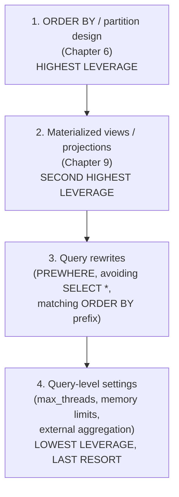
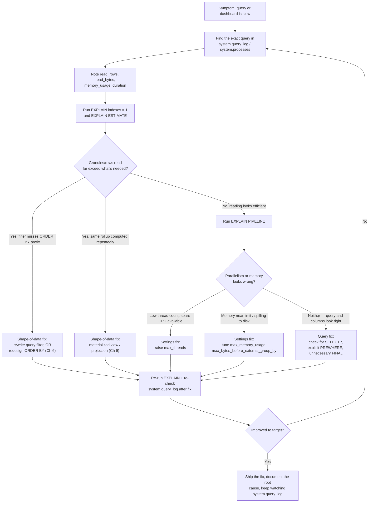

# Performance Tuning & Query Optimization

Chapter 6 ended with a promise: a one-line preview of `EXPLAIN indexes = 1` and a statement that "you'll get the full `EXPLAIN` picture in Chapter 13." This is that chapter. Chapters 9 and 10 then gave you two more levers — materialized views/projections for pre-computed rollups, and join algorithms/dictionaries for combining data — without ever formally teaching you how to *prove*, with tooling rather than intuition, whether a given query is using any of it well. This chapter closes that loop. It is the deep, systematic answer to the question every engineer eventually asks in production: "this query used to be fast, and now it isn't — how do I find out why, and fix it, without guessing?" You'll learn ClickHouse's full introspection toolkit (`EXPLAIN`'s several modes, `system.query_log`, `system.processes`), the memory model that governs `GROUP BY`/`DISTINCT`/joins and when ClickHouse spills to disk instead of failing outright, the query-level settings that actually move the needle, and — most importantly — a clear priority order that puts schema and materialization fixes (Chapters 6 and 9) ahead of settings-tuning, because that priority order is itself the single highest-leverage lesson in performance work on ClickHouse.

---

## Learning Objectives

By the end of this chapter, you will be able to:

- Use `EXPLAIN PLAN`, `EXPLAIN PIPELINE`, `EXPLAIN indexes = 1`, and `EXPLAIN ESTIMATE` to answer four different diagnostic questions about a query, and know which mode answers which question.
- Query `system.query_log`, `system.query_thread_log`, and `system.processes` to find your slowest production queries and see exactly what they read and how much memory they used.
- Explain how `GROUP BY`, `DISTINCT`, and joins consume memory, and how `max_bytes_before_external_group_by`/`max_bytes_before_external_sort` let ClickHouse spill to disk instead of failing with an out-of-memory error.
- Tune `max_threads` deliberately, and explain what `optimize_read_in_order` does to avoid an unnecessary sort step.
- Explain what `PREWHERE` is, when ClickHouse applies it automatically, and when to write it explicitly yourself.
- Prioritize `ORDER BY`/partition design and materialized views/projections over query-level settings as the two highest-leverage performance levers, and explain why.
- Recognize the most common performance-hurting query patterns (`SELECT *`, non-prefix filters, excessive `FINAL`, too many parts) and diagnose them systematically rather than by trial and error.
- Identify the key `system.metrics`/`system.asynchronous_metrics` worth watching in production, as a preview of full observability tooling in Chapter 18.

---

## Prerequisites for This Chapter

This chapter assumes you're comfortable with:

- [Chapter 6: Primary Keys & Sparse Indexing](./06-primary-keys-and-sparse-indexing.md) — granules, the sparse primary index, `ORDER BY` prefix reasoning, partition pruning, data-skipping indexes, and the one-line `EXPLAIN indexes = 1` preview this chapter expands on directly. If "granules selected vs. total granules" doesn't feel intuitive yet, stop and revisit Chapter 6 first — this entire chapter builds on it.
- [Chapter 9: Materialized Views & Projections](./09-materialized-views-and-projections.md) — incremental materialized views and projections as ways to maintain a second, purpose-built physical layout or pre-aggregated rollup of your data. This chapter treats "add a projection/materialized view" as a first-class fix, not a footnote.
- [Chapter 12: Sharding & Distributed Queries](./12-sharding-and-distributed-queries.md) — the `Distributed` engine and how a query fans out across shards. Some of this chapter's tools (`system.query_log`, `EXPLAIN`) behave slightly differently on a distributed table versus a local `MergeTree` table, and it helps to already know why a query might touch multiple nodes at all.
- Basic SQL and the `events` table schema from Chapter 6: `MergeTree`, `PARTITION BY toYYYYMM(event_date)`, `ORDER BY (country, event_type, event_time)`, columns `event_date`, `event_time`, `event_type`, `country`, `user_id`, `url`, `duration_ms`.

---

## 1. `EXPLAIN` in Depth: Four Modes, Four Different Questions

Chapter 6 showed you one flavor of `EXPLAIN` — `EXPLAIN indexes = 1` — because that was exactly enough to answer "did my `ORDER BY` design work for this query?" But `EXPLAIN` supports several distinct modes, and each one answers a genuinely different question. Picking the right mode for the question you're actually asking is half the skill.

| Mode | Question it answers |
|---|---|
| `EXPLAIN PLAN` | What logical steps (filter, aggregate, sort, join...) will the query execute, and in what order? |
| `EXPLAIN indexes = 1` | Which parts and granules were selected or pruned by the primary index and any skip indexes? |
| `EXPLAIN PIPELINE` | What does the actual physical execution pipeline look like — how many threads, how much parallelism? |
| `EXPLAIN ESTIMATE` | Roughly how many rows, marks, and parts would this query touch, without running it? |

All four run against the same query and cost nothing beyond planning time — none of them execute the query for real (with one caveat for `ESTIMATE`, covered in 1.4).

### 1.1 `EXPLAIN PLAN`: the logical query plan

```sql
EXPLAIN PLAN
SELECT country, count() AS n
FROM events
WHERE event_type = 'purchase'
GROUP BY country
ORDER BY n DESC;
```

```
Expression (Projection)
  Sorting
    Aggregating
      Expression (Before GROUP BY)
        Filter (WHERE)
          ReadFromMergeTree (default.events)
```

Read this top-down as "what happens last is drawn first" — actually, read it as a tree where execution flows bottom-up: `ReadFromMergeTree` runs first (read rows from the table), then `Filter` applies `WHERE event_type = 'purchase'`, then `Expression` prepares columns for aggregation, then `Aggregating` performs the `GROUP BY`, then `Sorting` orders by `n DESC`, then `Expression (Projection)` produces the final output columns. This is the same shape of plan you'd get from `EXPLAIN` in Postgres in spirit — a logical description of *what* will happen — but it says nothing yet about indexes, parallelism, or actual cost. That's what the other three modes are for.

`EXPLAIN PLAN` accepts extra options that add detail:

```sql
EXPLAIN PLAN header = 1, actions = 1
SELECT country, count() FROM events WHERE event_type = 'purchase' GROUP BY country;
```

- `header = 1` shows the exact columns flowing between each step — useful for spotting when a step is unexpectedly carrying more columns than it needs (a `SELECT *` symptom, Section 6).
- `actions = 1` expands the specific expressions/functions each step evaluates.
- `indexes = 1` is technically a `PLAN`-mode option too — it's what Chapter 6's `EXPLAIN indexes = 1` really was under the hood (ClickHouse defaults the mode to `PLAN` when you don't name one explicitly). Section 1.2 goes further with it than Chapter 6 did.

### 1.2 `EXPLAIN indexes = 1`, revisited: exactly which parts and granules survived

Chapter 6 showed you the headline number — `Granules: 41/1520` — as proof that the sparse index worked. The full output carries more than that single ratio, and reading all of it matters once your table has skip indexes too:

```sql
EXPLAIN indexes = 1
SELECT count() FROM events
WHERE country = 'US' AND duration_ms > 30000;
```

```
Expression (Projection)
  Aggregating
    Expression (Before GROUP BY)
      Filter (WHERE)
        ReadFromMergeTree (default.events)
        Indexes:
          PrimaryKey
            Keys:
              country
            Condition: (country in ['US', 'US'])
            Parts: 4/12
            Granules: 380/1520
          Skip
            Name: idx_duration
            Description: minmax GRANULARITY 4
            Parts: 4/4
            Granules: 210/380
```

Two separate pruning stages are visible here, stacked in the order they actually run:

1. **`PrimaryKey`** — the sparse index from Chapter 6, narrowing on the `country` prefix. `Parts: 4/12` means only 4 of the table's 12 active parts even contain `country = 'US'` rows at all (the rest were ruled out entirely); `Granules: 380/1520` is the familiar ratio from Chapter 6, now scoped to those 4 surviving parts.
2. **`Skip`** — a secondary, independent pass using the `idx_duration` `minmax` skip index (Chapter 6, Section 7) *within* the 380 granules the primary index already selected. It further narrows to 210 granules whose `[min, max]` range for `duration_ms` could contain values `> 30000`.

Reading this top-to-bottom tells you exactly which mechanism did how much work — critical when a query is still slow despite "using the index," because it lets you see whether the skip index actually helped (a big drop from 380 → 210) or did nothing (little to no drop, meaning the column isn't clustered relative to the sort order, per Chapter 6 Section 7.3).

If a query has **no** `Indexes:` block at all in its `EXPLAIN` output, that itself is a diagnosis: the query's filters don't touch `ORDER BY` or any skip-indexed column, and ClickHouse will read every granule in every surviving partition.

### 1.3 `EXPLAIN PIPELINE`: the actual physical execution plan

`EXPLAIN PLAN` tells you the *logical* steps. `EXPLAIN PIPELINE` tells you the *physical* ones ClickHouse's vectorized engine (Chapter 3) will actually run — including how many parallel execution lanes (threads) each step gets.

```sql
EXPLAIN PIPELINE
SELECT country, count() FROM events WHERE event_type = 'purchase' GROUP BY country;
```

```
(Expression)
ExpressionTransform

(Sorting)
MergingSortedTransform
  MergeSortingTransform × 8
    LimitsCheckingTransform × 8
      PartialSortingTransform × 8

(Aggregating)
Resize 8 → 8
  AggregatingTransform × 8

(Expression)
ExpressionTransform × 8

(Filter)
FilterTransform × 8

(ReadFromMergeTree)
MergeTreeThread × 8
```

The `× 8` next to most transforms is `max_threads` in action (Section 4.1) — ClickHouse read, filtered, and pre-aggregated this query across 8 parallel execution lanes before merging their partial results back together in the `Aggregating`/`Sorting` stages. This is the tool to reach for when a query's `EXPLAIN indexes = 1` output already looks good (few granules selected) but the query is still slower than expected — the bottleneck may not be *what* is read but *how little parallelism* is being applied to reading and processing it. A pipeline showing `× 1` everywhere on a multi-core machine, for a query that should parallelize well, is a strong signal to check `max_threads` (Section 4.1) or whether the query is reading from so few parts that there's nothing to parallelize across in the first place (Section 6).

### 1.4 `EXPLAIN ESTIMATE`: rows, marks, and parts without running the query

`EXPLAIN ESTIMATE` answers a narrower, very practical question: *"if I ran this, roughly how much would it touch?"* — useful for sanity-checking an expensive-looking query before you actually run it against a production table with billions of rows.

```sql
EXPLAIN ESTIMATE
SELECT count() FROM events
WHERE country = 'US' AND event_type = 'purchase';
```

```
┌─database─┬─table──┬─parts─┬─rows───┬─marks─┐
│ default  │ events │   4   │ 335872 │  41   │
└──────────┴────────┴───────┴────────┴───────┘
```

Here, "marks" is the same concept as "granules" from Chapter 6 (a "mark" is the index entry that points at a granule — the two terms are used near-interchangeably in ClickHouse's own tooling and documentation). `rows: 335872` is ClickHouse's estimate of how many rows those 41 marks/granules actually contain — useful for a fast, cheap gut-check on query cost before running something against a table you don't want to accidentally scan in full. Unlike `EXPLAIN PLAN`/`indexes`/`PIPELINE`, which are purely static analyses of the query, `EXPLAIN ESTIMATE` does consult the table's actual current index statistics, so its numbers are grounded in the real state of your data at query time — but it still does not read any actual row data.

---

## 2. Query Profiling via System Tables: Finding Your Slowest Queries in Production

`EXPLAIN` tells you what *should* happen for a query you already have in hand. In production, the harder problem is usually the opposite: you don't know *which* query is the slow one, or someone reports "the dashboard is slow" with no query text at all. This is what `system.query_log` and its relatives are for.

### 2.1 `system.query_log`: every query ClickHouse has ever run

With `log_queries = 1` (the default), ClickHouse records every executed query — its full text, timing, and resource usage — into `system.query_log`. This is, in practice, the single most useful table in the entire system for performance work.

```sql
SELECT
    query,
    query_duration_ms,
    read_rows,
    formatReadableSize(read_bytes) AS read_size,
    formatReadableSize(memory_usage) AS memory,
    result_rows
FROM system.query_log
WHERE type = 'QueryFinish'
  AND event_date = today()
ORDER BY query_duration_ms DESC
LIMIT 20;
```

Key columns worth knowing by name:

| Column | What it tells you |
|---|---|
| `query` | The full query text — your starting point for `EXPLAIN` |
| `type` | `QueryStart`, `QueryFinish`, or `ExceptionWhileProcessing` — always filter to `QueryFinish` for completed-query analysis |
| `query_duration_ms` | Wall-clock time the query took |
| `read_rows` / `read_bytes` | How much data was actually read from disk — the ground truth for "is this query reading more than it should?" |
| `memory_usage` | Peak memory the query consumed |
| `result_rows` | How many rows the query returned — a huge gap between `read_rows` and `result_rows` is itself a diagnostic signal (Section 6) |
| `query_id` | Correlates a row here with a row in `system.query_thread_log` or an earlier `system.processes` snapshot |

This is where "find your slowest queries" stops being guesswork: sort by `query_duration_ms` or `memory_usage`, look at the top offenders' `query` text, and feed each one into `EXPLAIN indexes = 1`/`EXPLAIN PIPELINE` from Section 1. A single query against `system.query_log`, run daily or wired into a dashboard, is the entire foundation of a proactive (rather than complaint-driven) performance practice.

### 2.2 `system.query_thread_log`: per-thread detail

`system.query_thread_log` (enabled via `log_query_threads`, on by default alongside `query_log`) breaks a single query down into the individual threads that executed it — useful when `EXPLAIN PIPELINE` (Section 1.3) told you *how many* threads a query should use, and you want to confirm, after the fact, that it actually got that parallelism and that work was spread evenly rather than dominated by one straggling thread:

```sql
SELECT thread_id, read_rows, memory_usage, query_duration_ms
FROM system.query_thread_log
WHERE query_id = 'a1b2c3d4-...'
ORDER BY read_rows DESC;
```

A large imbalance between threads (one thread reading far more rows than the others for the same query) often points to skewed data distribution across parts, rather than a settings problem.

### 2.3 `system.processes`: what's running right now

`system.query_log` is historical — it only has a row once a query finishes (or the periodic flush interval elapses). For "what is running *right now* and eating all my CPU/memory," use `system.processes`:

```sql
SELECT query_id, user, elapsed, memory_usage, read_rows, query
FROM system.processes
ORDER BY elapsed DESC;
```

If you find a runaway query, you can cancel it directly:

```sql
KILL QUERY WHERE query_id = 'a1b2c3d4-...';
```

### 2.4 `EXPLAIN ... SETTINGS`: testing a hypothesis without changing server config

You can attach settings directly to an `EXPLAIN` (or a real query) to test a hypothesis about a specific setting's effect without touching global configuration:

```sql
EXPLAIN PIPELINE
SELECT country, count() FROM events WHERE event_type = 'purchase' GROUP BY country
SETTINGS max_threads = 4;
```

Comparing this output against the default-`max_threads` pipeline from Section 1.3 lets you see exactly how thread count changes the shape of the pipeline before committing to the change anywhere permanent. The same `SETTINGS` clause works on real queries too, which is how you safely experiment with anything in Sections 3–4 on a single query at a time, in production, without touching `users.xml`/`config.xml` or restarting anything.

---

## 3. Memory: How ClickHouse Spends It, and What Happens When It Runs Out

### 3.1 `max_memory_usage`

Every query has a memory budget, enforced by the `max_memory_usage` setting (a per-query limit, commonly defaulted to a multi-gigabyte value and very often set explicitly per environment). Exceed it, and ClickHouse kills the query with a `Memory limit exceeded` exception rather than let it degrade the whole server — this is a deliberate, aggressive safety valve, not a bug to work around by disabling the limit.

### 3.2 What actually consumes memory

Three query shapes are responsible for the overwhelming majority of memory pressure in ClickHouse:

- **`GROUP BY`** builds an in-memory hash table keyed by the distinct combinations of grouping columns. A `GROUP BY` over a low-cardinality column (`country`) is cheap; a `GROUP BY user_id` over a table with 500 million distinct users is a hash table with 500 million entries, built entirely in memory by default.
- **`DISTINCT`** is, under the hood, the same hash-table-of-seen-values problem as `GROUP BY` — memory scales with the number of distinct values, not the number of input rows.
- **Joins** (Chapter 10) — the default hash join algorithm loads the entire right-hand table into an in-memory hash table before it can match a single row from the left-hand (streamed) table. A join against a large "right" table is a memory problem waiting to happen if you get the join order backwards (Chapter 10's guidance to put the smaller table on the right applies directly here).

### 3.3 External aggregation and sorting: spilling to disk instead of failing

For `GROUP BY`/`DISTINCT` specifically, ClickHouse doesn't have to choose between "fit in memory" and "fail the query." Setting `max_bytes_before_external_group_by` tells ClickHouse: once the in-progress aggregation state exceeds this many bytes, write the partial state to disk, free the memory, and continue — merging the spilled, on-disk partial states back together at the end.

```sql
SELECT user_id, count() AS events
FROM events
GROUP BY user_id
SETTINGS max_bytes_before_external_group_by = 10000000000; -- 10 GB
```

The equivalent setting for `ORDER BY` on data too large to sort in memory is `max_bytes_before_external_sort`. Both trade query latency (disk I/O is slower than memory) for the ability to complete at all, rather than crash with an out-of-memory error — the exact same tradeoff MongoDB's `allowDiskUse: true` makes for aggregation pipeline stages that exceed the in-memory limit (this repo's [MongoDB course](../mongodb-course/00-index.md) covers that setting directly): both databases refuse unbounded in-memory blowups by default, and both offer an explicit, opt-in "spill to disk" escape hatch rather than silently degrading everyone else on the server.

Joins have a parallel story: the default `hash` join algorithm keeps the right-hand table fully in memory, but `join_algorithm = 'grace_hash'` (or `'partial_merge'`) trades some speed for the ability to spill join state to disk when the right-hand table is too large to fit in memory outright — the join-specific analog of external aggregation.

### 3.4 The practical rule

Don't reach for external aggregation/sorting as a default. It's a safety net for genuinely large, high-cardinality aggregations that cannot be avoided — not a substitute for asking "should this `GROUP BY` be pre-aggregated in a materialized view instead?" (Section 5 makes this prioritization explicit).

---

## 4. Query-Level Settings That Matter

### 4.1 `max_threads`: how much parallelism a query gets

`max_threads` controls how many CPU threads a single query can use to read and process data in parallel, and defaults to the number of CPU cores available. Section 1.3's `EXPLAIN PIPELINE` output is the direct, visible consequence of this setting — the `× 8` you saw there came from `max_threads = 8` on an 8-core test machine.

Raising `max_threads` for one query can speed it up if there's genuine parallelism to exploit (many parts/granules to read concurrently) and spare CPU capacity on the box. Lowering it is the right move for background/batch queries you deliberately want to deprioritize relative to interactive dashboard traffic sharing the same server — a common, real production pattern is setting a lower `max_threads` (via a settings profile) for a "reporting" user than for a "dashboard" user.

### 4.2 `optimize_read_in_order`: skipping a sort you don't need

If a query's `ORDER BY` matches (or is a prefix of) the table's physical `ORDER BY` from Chapter 6, the data is *already* sorted correctly on disk — asking ClickHouse to sort it again would be pure waste. `optimize_read_in_order` (on by default) lets ClickHouse recognize this and stream rows out in the required order directly from the sorted parts, skipping the `Sorting` step entirely:

```sql
-- Table ORDER BY (country, event_type, event_time)
SELECT country, event_type, event_time
FROM events
WHERE country = 'US'
ORDER BY event_type, event_time  -- matches the ORDER BY prefix
LIMIT 100;
```

`EXPLAIN PLAN` on a query like this will simply have no `Sorting` step at all — proof the optimization applied. Change the `ORDER BY` in the query to something unrelated to the table's physical sort order (e.g., `ORDER BY duration_ms`), and a real sort step reappears, because now there genuinely is sorting work to do.

### 4.3 `PREWHERE`: filtering cheap columns before reading expensive ones

This is one of ClickHouse's most distinctive optimizations, and one most engineers coming from row-store databases have never encountered because it only makes sense in a columnar engine.

**The idea:** if a query filters on a small/cheap column (say, a `LowCardinality(String)` like `event_type`) and also selects a large/expensive column (say, a `String url` or a big `payload`), there's no reason to read the expensive column for rows that are about to be filtered out anyway. `PREWHERE` reads and evaluates the cheap filter column *first*, across a granule, and only reads the expensive columns for the rows that survive.

```sql
SELECT url, duration_ms
FROM events
PREWHERE event_type = 'purchase'
WHERE duration_ms > 5000;
```

Here, `event_type` is read and filtered first (cheap — it's `LowCardinality`). Only for the granules/rows that pass that filter does ClickHouse go on to read `duration_ms` (for the `WHERE` clause) and `url` (for the `SELECT`). Contrast this with a single `WHERE event_type = 'purchase' AND duration_ms > 5000` with no `PREWHERE`: without the optimization, all filter/select columns are read together, before any filtering happens.

**Automatic vs. manual.** In practice, you rarely need to write `PREWHERE` yourself: the `optimize_move_to_prewhere` setting (on by default) makes ClickHouse's optimizer automatically move a suitable `WHERE` condition into an implicit `PREWHERE` step, using heuristics based on column size and estimated selectivity. `EXPLAIN PLAN actions = 1` will show you a `Prewhere` step in the plan even if you never typed the word — that's the optimizer doing this automatically.

You should reach for an *explicit* `PREWHERE` when:

- You have **multiple** candidate filter columns, and you know (from data distribution, not just column size) which one is actually more selective than the optimizer's heuristic guesses — the automatic heuristic optimizes for column *size*, not necessarily for how many rows a given condition actually eliminates.
- You're on an older ClickHouse version where the automatic optimizer only ever moves a single condition, and you have a multi-condition filter where you want more than one part of it prioritized.
- You want the guarantee to be explicit and readable in the query itself, rather than relying on an optimizer heuristic that could theoretically change between versions.

The mental model to keep: **`PREWHERE` is a columnar-storage-specific optimization that has no equivalent in a row store** — in Postgres or MongoDB, a row is read as one unit regardless of which columns/fields you filter on first, so there's nothing to reorder. In ClickHouse, columns are physically separate files (Chapter 3), so "read the cheap column first, skip the expensive one for filtered-out rows" is a real, first-class I/O optimization, not a cosmetic query rewrite.

---

## 5. The Priority Order: Fix the Shape of the Data Before You Fix the Query

Everything in Sections 3 and 4 is real and useful — but it's worth being blunt about where it ranks. In descending order of leverage:



1. **`ORDER BY`/partition design (Chapter 6) is the single highest-leverage lever there is.** A table whose `ORDER BY` doesn't match its dominant query pattern will be slow *no matter what settings you apply* — you cannot `max_threads` your way out of scanning 1,490 of 1,520 granules. This is a schema decision, and Chapter 6's entire "which queries benefit from this prefix" table (Section 5 there) is the diagnostic to run first, every time.
2. **Materialized views and projections (Chapter 9) are the second-highest-leverage lever.** If a genuinely important, recurring query shape simply cannot be served well by any single `ORDER BY` (Chapter 6's real-world scenario — an hour-by-hour dashboard query against a table sorted by `(country, event_type, event_time)` — is exactly this situation), don't compromise the base table's design for everyone. Maintain a second physical layout (a projection) or a pre-aggregated rollup (a materialized view) purpose-built for that access pattern instead.
3. **Query-level rewrites** — matching the `ORDER BY` prefix in your `WHERE` clause, avoiding `SELECT *` (Section 6), adding an explicit `PREWHERE` when the optimizer's heuristic picks wrong — come next. These cost nothing to try and often produce large wins, but they only work *within* whatever the schema already makes possible.
4. **Settings-level tuning** (`max_threads`, `max_memory_usage`, external aggregation thresholds) is real, but it is fundamentally about making a query that's already reading roughly the right amount of data run a bit faster or fit in memory — it cannot compensate for a query reading 40x more data than it needs to because the schema doesn't support its access pattern. Reaching for settings first is treating a symptom while leaving the actual disease (Section 6, and the Real-World Scenario below) undiagnosed.

If you remember one sentence from this chapter, make it this one: **check `EXPLAIN indexes = 1` and consider a schema or materialization fix before you touch a single setting.**

---

## 6. Common Performance-Hurting Patterns and a Diagnosis Workflow

### 6.1 The patterns, and how to spot each one

| Pattern | How to spot it | Fix |
|---|---|---|
| **Filtering on a non-`ORDER BY`-prefix column** | `EXPLAIN indexes = 1` shows `Granules: <big number>/<total>`, close to the total | Rewrite the query to include a leading-prefix filter if realistic; otherwise a projection/materialized view (Chapter 9) |
| **`SELECT *` reading unneeded columns** | `system.query_log`'s `read_bytes` is far larger than the columns you actually use would justify; `EXPLAIN PLAN header = 1` shows a wide column set flowing through every step | Select only the columns you need — see the concrete comparison in the Hands-On Exercise |
| **Too many parts** | `SELECT count() FROM system.parts WHERE table = 'events' AND active` returns a surprisingly large number relative to data volume; queries feel slow across the board, not just one query | Batch inserts properly (Chapter 7's golden rule); check for over-partitioning (Chapter 6, Section 6.1) |
| **Excessive `FINAL`** | Query uses `FROM events FINAL` habitually on a `ReplacingMergeTree`/`CollapsingMergeTree` table even when exact-latest-state precision isn't actually required | Use an `argMax`-based query instead where Chapter 7 showed it's usually the faster equivalent, or restrict `FINAL` to only the specific queries that truly need row-level dedup precision |
| **Unindexed high-cardinality filter** | A frequently-filtered column is outside `ORDER BY` and has no skip index at all; `EXPLAIN indexes = 1` shows no `Skip` block | Add a `minmax`/`bloom_filter`/`ngrambf_v1` skip index per Chapter 6, Section 7 — after confirming the column is naturally clustered enough to benefit |

`SELECT *` deserves one extra sentence of emphasis because it directly contradicts the entire reason columnar storage (Chapter 3) exists: ClickHouse's whole performance model is "read only the columns a query touches, and skip the rest of the row entirely." `SELECT *` throws that model away by forcing every column to be read regardless of whether the query needs it — the exact waste columnar storage was invented to eliminate, self-inflicted by query text.

### 6.2 A systematic troubleshooting workflow



The workflow is deliberately ordered to match Section 5's priority: diagnose with `EXPLAIN`/`query_log` first, always check for a shape-of-data fix before reaching for a settings-level one, and always close the loop by re-verifying with the same tools rather than assuming the fix worked.

---

## 7. Monitoring Essentials for Production

Full observability tooling and dashboard-building arrive in [Chapter 18](./18-tools-and-ecosystem.md); this section previews the handful of system tables and metrics you should have an eye on well before that chapter, because they catch problems before they become "why is the dashboard slow" tickets.

- **`system.metrics`** — a live snapshot of current, instantaneous counters. Watch metrics like the background merge pool's active/queued task count: a persistently deep merge queue is an early warning that inserts are outpacing the system's ability to merge parts (Chapter 3/7's "too many parts" failure mode, caught before it bites).
- **`system.asynchronous_metrics`** — periodically recomputed gauges, including replication lag (relevant if you followed [Chapter 11](./11-replication-and-high-availability.md)) and overall memory tracking across the whole server, not just one query. A steadily climbing memory metric across many queries — as opposed to one query with a high `memory_usage` in `query_log` — points to a systemic issue (e.g., too many concurrent expensive `GROUP BY`s) rather than a single bad query.
- **`system.parts`** — not a metrics table strictly, but essential for the "too many parts" check from Section 6.1: `SELECT table, count() FROM system.parts WHERE active GROUP BY table ORDER BY count() DESC`.
- **Grafana integration (previewed here, full depth in Chapter 18)** — ClickHouse ships an official Grafana data source plugin that can query `system.query_log`, `system.metrics`, and `system.asynchronous_metrics` directly, turning the manual `SELECT`s in this chapter into always-on dashboards and alerts (e.g., alert when the slowest query in the last 5 minutes exceeds a duration threshold, or when merge queue depth crosses a limit). The queries you've been running by hand in this chapter are, almost verbatim, the queries that back those dashboard panels.

---

## Real-World Scenario

**Setup:** Your `events` table (`ORDER BY (country, event_type, event_time)`, `PARTITION BY toYYYYMM(event_date)`) has grown from a few million rows during initial rollout to a few hundred million. A dashboard query that used to return in under a second now takes 8-10 seconds, and support tickets are starting to arrive.

**Step 1 — find the query.** Rather than guessing, you query `system.query_log` for the dashboard's known user account, sorted by duration:

```sql
SELECT query, query_duration_ms, read_rows, memory_usage
FROM system.query_log
WHERE type = 'QueryFinish' AND user = 'dashboard_svc'
ORDER BY query_duration_ms DESC
LIMIT 5;
```

The top result is:

```sql
SELECT url, count() AS visits
FROM events
WHERE duration_ms > 10000
GROUP BY url
ORDER BY visits DESC
LIMIT 20;
```

Its `read_rows` is essentially the entire table — a red flag on its own, since the dashboard is supposed to be a narrow, recent-data view.

**Step 2 — diagnose with `EXPLAIN indexes = 1`.**

```sql
EXPLAIN indexes = 1
SELECT url, count() AS visits FROM events WHERE duration_ms > 10000 GROUP BY url ORDER BY visits DESC LIMIT 20;
```

The output has no `PrimaryKey` restriction worth mentioning — `duration_ms` isn't part of `ORDER BY (country, event_type, event_time)` at all, and there's no skip index on it either. `Granules` shows something close to the table's full total. This confirms exactly what `read_rows` already hinted at: the query is doing a full-table scan every time it runs, and it always was going to — the query didn't get slower because ClickHouse got slower, it got slower purely because the table got bigger and the query was never selective in the first place.

Digging into recent history (via `git blame`/deploy logs on the dashboard's query definitions, not a ClickHouse tool), the team confirms this query used to also filter on `event_type = 'purchase'`, which *did* form a usable `ORDER BY` prefix — but a well-intentioned dashboard change three months ago dropped that filter to "show all high-duration events regardless of type," silently converting a cheap, prefix-filtered query into a full scan, at exactly the time the table was also growing fastest.

**Step 3 — fix it.** Three real options, matching Section 5's priority order:

1. **Rewrite the query** to reintroduce a real filter if "all event types" genuinely isn't required — often the fastest, cheapest fix, and worth checking first.
2. **Add a skip index** on `duration_ms` (`minmax`, since duration values loosely cluster with `event_type`, which is in the sort order) — a small, low-risk schema change that helps this exact query and any other `duration_ms`-filtered query, without touching the base `ORDER BY`.
3. **Add a projection** (Chapter 9) that maintains `url`, `duration_ms`-oriented pre-aggregated counts, if this "high-duration events by URL" view is itself a permanent, important dashboard panel rather than a one-off query — the second-highest-leverage fix from Section 5, appropriate when the access pattern is here to stay.

The team ships option 2 immediately (lowest risk, fast to deploy) and schedules option 3 as a follow-up once it's clear the panel is a permanent fixture. Re-running `EXPLAIN indexes = 1` after the skip index is added and materialized shows a large drop in granules read, and `system.query_log` confirms `query_duration_ms` and `read_rows` both fall back in line — closing the loop exactly as Section 6.2's workflow prescribes.

---

## Best Practices

- **Run `EXPLAIN indexes = 1` (and `EXPLAIN PIPELINE` for anything aggregation-heavy) before shipping any new dashboard or reporting query** — catching a full-table-scan query in review is far cheaper than catching it after the table has grown 100x.
- **Avoid `SELECT *` in production application code and dashboard queries.** Name the columns you need; it costs nothing to type and directly preserves the columnar-storage I/O savings from Chapter 3.
- **Prioritize `ORDER BY`/partition fixes and materialized views/projections over settings tuning**, per Section 5 — settings can make an already-reasonable query faster, but cannot fix a query reading far more data than it needs to.
- **Monitor `system.query_log` proactively**, on a schedule or via a Grafana panel (Section 7, full depth Chapter 18), rather than waiting for a user complaint to tell you a query has degraded.
- **Treat every skip-index or `ORDER BY` change as something to verify with `EXPLAIN`, not assume.** A skip index that doesn't correlate with the physical sort order (Chapter 6, Section 7.3) can look like a fix on paper and do almost nothing in practice.
- **Use `EXPLAIN ... SETTINGS` to test a settings hypothesis on a single query** before rolling any setting out globally via a settings profile.
- **Reserve `FINAL` for queries that genuinely need row-level dedup precision**, and prefer an `argMax`-based rewrite (Chapter 7) elsewhere — `FINAL` is one of the easiest ways to accidentally turn a cheap scan into an expensive merge-on-read.

---

## Common Mistakes

- **Reaching for `max_threads` or memory settings before checking `EXPLAIN indexes = 1`.** If the query is reading 40x more granules than it needs to, no amount of parallelism or memory headroom fixes the root cause — it just makes the wasted work finish slightly faster.
- **Carrying over `SELECT *` habits from row-store databases**, where reading a whole row is often "free" once you've paid the cost of locating it. In a columnar engine, every additional selected column is additional I/O, full stop.
- **Ignoring `system.query_log` until a production incident forces a look at it.** Teams that never proactively query it only ever find degraded queries reactively, after users complain — usually well after a query has silently doubled or tripled in cost as the table grew.
- **Not understanding `PREWHERE` and missing an easy optimization** — either not trusting `optimize_move_to_prewhere` to do its job automatically (and manually restructuring queries unnecessarily), or, in the opposite direction, having a multi-condition filter where the automatic heuristic picks a suboptimal column and never noticing because the query "still works," just slower than it should.
- **Treating external aggregation/sorting settings as a first-line fix for a slow `GROUP BY`**, instead of first asking whether the aggregation should be pre-computed via a materialized view (Chapter 9) so it never needs to run over raw data at query time at all.
- **Adding a skip index or changing `ORDER BY` without re-verifying with `EXPLAIN`.** A change that looks correct in theory can fail to help in practice if the indexed/reordered column doesn't have the clustering behavior the index type assumes (Chapter 6, Section 7.3).
- **Confusing "the query plan looks right" (`EXPLAIN PLAN`) with "the query is well-parallelized" (`EXPLAIN PIPELINE`).** These answer different questions; a clean logical plan can still execute with far less parallelism than the hardware could support.

---

## Summary

- `EXPLAIN` has (at least) four modes worth knowing by name: `PLAN` (logical steps), `indexes = 1` (which parts/granules survived pruning, including skip indexes now), `PIPELINE` (actual physical execution and parallelism), and `ESTIMATE` (rows/marks/parts a query would touch, without running it).
- `system.query_log` is the ground-truth record of every executed query's timing, memory, and rows read — the starting point for finding your slowest production queries. `system.query_thread_log` adds per-thread detail; `system.processes` shows what's running right now and lets you `KILL QUERY` a runaway one.
- Memory-heavy operations (`GROUP BY`, `DISTINCT`, joins) build in-memory hash tables sized by cardinality, governed by `max_memory_usage`; `max_bytes_before_external_group_by`/`max_bytes_before_external_sort` let ClickHouse spill to disk rather than fail outright, conceptually parallel to MongoDB's `allowDiskUse`.
- `max_threads` controls query parallelism; `optimize_read_in_order` skips a redundant sort when the query's `ORDER BY` already matches the table's physical sort order; `PREWHERE` reads cheap filter columns before expensive ones, applied automatically by `optimize_move_to_prewhere` in most cases, with a manual override available when the heuristic guesses wrong.
- **`ORDER BY`/partition design (Chapter 6) is the single highest-leverage performance lever**, followed by **materialized views/projections (Chapter 9)** — both outrank query-level settings, which can only make an already-reasonable query faster, not fix one that's reading far more data than it needs to.
- The most common performance-hurting patterns are filters that miss the `ORDER BY` prefix, `SELECT *` (which defeats the entire point of columnar storage), too many parts, excessive `FINAL`, and unindexed high-cardinality filter columns — all diagnosable with the tools from Sections 1-2.
- `system.metrics`/`system.asynchronous_metrics` (merge queue depth, replication lag, memory) are the production monitoring essentials to watch continuously, with Grafana integration previewed here and covered fully in Chapter 18.

---

## Knowledge Check

1. You run `EXPLAIN PLAN` and `EXPLAIN PIPELINE` on the same query. What different question does each one answer, and can you think of a scenario where `EXPLAIN PLAN` looks fine but `EXPLAIN PIPELINE` reveals a problem?
2. A colleague wants to find "our five slowest queries from yesterday." Write the `system.query_log` query you'd use, and name the two or three columns you'd look at next to start diagnosing the top result.
3. Explain what `max_bytes_before_external_group_by` does, and why setting it very low (so it triggers on almost every query) is not automatically a good idea.
4. A query filters on `WHERE country = 'US' AND duration_ms > 30000` against the `events` table with `ORDER BY (country, event_type, event_time)` and a `minmax` skip index on `duration_ms`. Walk through, in order, which pruning mechanisms apply and in what sequence, per Section 1.2's `EXPLAIN indexes = 1` output.
5. Why is `PREWHERE` a concept that has no real equivalent in a row-oriented database like Postgres or MongoDB?
6. Rank these four fixes for a slow query from highest to lowest expected leverage, and justify the order: (a) raising `max_threads`, (b) adding a projection, (c) rewriting `SELECT *` to name specific columns, (d) redesigning `ORDER BY`.

---

## Hands-On Exercise

Work through this against the `events` table you created in Chapter 6's exercise (or recreate it using that chapter's `CREATE TABLE`/`INSERT` steps first).

1. **Run and compare `EXPLAIN indexes = 1` and `EXPLAIN PIPELINE`** on the same query:

   ```sql
   EXPLAIN indexes = 1
   SELECT country, count() FROM events WHERE country = 'DE' AND event_type = 'purchase' GROUP BY country;

   EXPLAIN PIPELINE
   SELECT country, count() FROM events WHERE country = 'DE' AND event_type = 'purchase' GROUP BY country;
   ```

   Note the `Granules: X/Y` ratio from the first, and the thread count (`× N`) on each transform in the second.

2. **Run the query for real, then find it in `system.query_log`:**

   ```sql
   SELECT country, count() FROM events WHERE country = 'DE' AND event_type = 'purchase' GROUP BY country;

   SELECT query, read_rows, formatReadableSize(read_bytes) AS read_size, memory_usage, query_duration_ms
   FROM system.query_log
   WHERE type = 'QueryFinish' AND query LIKE '%event_type = ''purchase''%'
   ORDER BY event_time DESC
   LIMIT 1;
   ```

   Confirm that `read_rows` roughly matches what the `Granules` ratio from step 1 predicted (granules selected × ~8192 rows/granule).

3. **Compare `SELECT *` against a narrow `SELECT` for the same filter.** Run each of these and record `read_rows`/`read_bytes` from `system.query_log` afterward:

   ```sql
   SELECT * FROM events WHERE country = 'DE' AND event_type = 'purchase';

   SELECT country, event_type FROM events WHERE country = 'DE' AND event_type = 'purchase';
   ```

   ```sql
   SELECT query, read_rows, formatReadableSize(read_bytes) AS read_size
   FROM system.query_log
   WHERE type = 'QueryFinish' AND query LIKE 'SELECT%FROM events WHERE country%'
   ORDER BY event_time DESC
   LIMIT 2;
   ```

   Both queries return the same *rows* (`read_rows` should match), but `read_bytes` should be visibly smaller for the narrow `SELECT` — direct, measured proof of Section 6.1's `SELECT *` warning, using your own table rather than taking the chapter's word for it.

4. **Force and observe external aggregation.** Run a high-cardinality `GROUP BY` with a deliberately tiny `max_bytes_before_external_group_by` to see the mechanism trigger (this is for observation only — don't ship a value this low):

   ```sql
   SELECT user_id, count() FROM events GROUP BY user_id
   SETTINGS max_bytes_before_external_group_by = 1000000;
   ```

   Compare its `query_duration_ms` in `system.query_log` against the same query without the setting override.

---

## Further Reading

- [ClickHouse Docs — EXPLAIN Statement](https://clickhouse.com/docs/en/sql-reference/statements/explain) — full syntax and options for `PLAN`, `PIPELINE`, `indexes = 1`, and `ESTIMATE`.
- [ClickHouse Docs — system.query_log](https://clickhouse.com/docs/en/operations/system-tables/query_log) — full column reference for query-level profiling.
- [ClickHouse Docs — system.processes](https://clickhouse.com/docs/en/operations/system-tables/processes) — inspecting and killing currently-running queries.
- [ClickHouse Docs — PREWHERE Clause](https://clickhouse.com/docs/en/sql-reference/statements/select/prewhere) — the mechanics and constraints of `PREWHERE`, and `optimize_move_to_prewhere`.
- [ClickHouse Docs — Settings: Query Complexity and Resource Limits](https://clickhouse.com/docs/en/operations/settings/query-complexity) — `max_memory_usage`, `max_threads`, `max_bytes_before_external_group_by`/`max_bytes_before_external_sort`, and related limits.

---

<div style="display:flex;justify-content:space-between;align-items:center;">
  <a href="./12-sharding-and-distributed-queries.md">← Previous: Sharding & Distributed Queries</a>
  <a href="./00-index.md">🏠 Index</a>
  <a href="./14-data-ingestion-and-integrations.md">Next: Data Ingestion & Integrations →</a>
</div>
