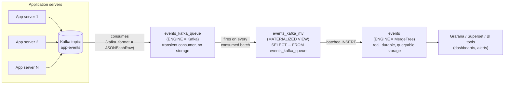
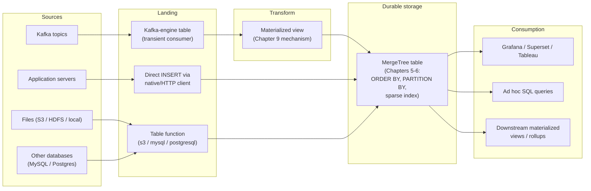

# Data Ingestion & Integrations

Chapter 7 taught you the mechanics of getting rows into a single `MergeTree` table by hand: `INSERT INTO ... VALUES`, `INSERT INTO ... SELECT`, a preview of `FROM INFILE` for local files, and `async_insert` as a safety net when clients can't batch on their own. That chapter's golden rule — batch thousands of rows per insert, never one row at a time — is the physics every ingestion pipeline in production has to respect. This chapter is where that physics meets the real world: data doesn't usually arrive as a hand-typed `VALUES` list. It streams continuously from Kafka topics, sits in Parquet files on S3, lives in an operational Postgres or MySQL database, or gets pushed by application code through a client library thousands of times a second. This chapter covers the tools, table engines, and architectural patterns ClickHouse gives you to turn all of those sources into a well-batched, continuously-fed `MergeTree` table — the production ingestion pipelines that keep dashboards and alerts fresh around the clock.

---

## Learning Objectives

By the end of this chapter, you will be able to:

- Explain ClickHouse's native multi-format support (`CSV`, `TSV`, `JSONEachRow`, `Parquet`, `ORC`, `Avro`, `Native`) and why the `FORMAT` clause makes ClickHouse interoperable with data lakes and other systems on both read and write paths.
- Use `clickhouse-local` to run SQL directly over local files without a running server, and know when it's the right tool instead of standing up a full deployment.
- Explain the idiomatic Kafka ingestion pattern precisely: a `Kafka`-engine table as a transient consumer, paired with a materialized view that pushes transformed rows into a real `MergeTree` table.
- Build the concrete three-table Kafka pipeline (`*_kafka_queue`, a `MergeTree` target, and a connecting materialized view) and explain what each table is and is not responsible for.
- Query external systems directly from ClickHouse using integration engines and table functions (`MySQL`, `PostgreSQL`, `S3`, `HDFS`, `URL`, `remote()`) without standing up a separate ETL job.
- Choose between the native TCP protocol, the HTTP interface, and official client libraries for a given ingestion workload, and write a basic Python ingestion snippet using `clickhouse-connect`.
- Connect a BI tool (Grafana, Superset, Tableau) to ClickHouse via HTTP, native drivers, or JDBC/ODBC, and describe a complete ingestion-to-dashboard architecture.

---

## Prerequisites for This Chapter

This chapter builds directly on [Chapter 7: Inserting & Querying Data](./07-inserting-and-querying-data.md). We assume you're comfortable with:

- The golden batching rule and why row-at-a-time inserts create a "too many parts" death spiral (Chapter 7, Section 1) — every pattern in this chapter exists to keep that rule satisfied even when the data source is external and out of your direct control.
- `INSERT INTO ... SELECT` and `INSERT ... FROM INFILE` (Chapter 7, Sections 2.2–2.3) — this chapter picks up file ingestion where that chapter left off.
- `async_insert` (Chapter 7, Section 2.4) as the pattern for absorbing many small, uncoordinated writers.
- Materialized views conceptually as covered by this course's Chapter 9 — a materialized view is attached to a source table and fires automatically on every `INSERT` into that source, like a trigger, immediately pushing the transformed result of a `SELECT` into a target table. If you haven't reached Chapter 9 yet, that one sentence is enough context to follow this chapter's Kafka section; Chapter 9 covers the mechanism (and projections) in full depth.
- Basic familiarity with the `MergeTree` engine and `ORDER BY`/`PARTITION BY` from [Chapter 5](./05-table-engines-deep-dive.md) and [Chapter 6](./06-primary-keys-and-sparse-indexing.md).

---

## 1. File Format Support: `FORMAT` as a Universal Adapter

ClickHouse supports an unusually large number of serialization formats natively, on **both** the insert and select paths, controlled by a single `FORMAT` clause. This is one of the most underrated reasons ClickHouse fits so easily into an existing data ecosystem: you rarely need a separate transformation step just to get data in the door, and you can just as easily get data *out* in whatever format the next system in line expects.

### 1.1 Reading and writing formats

```sql
-- Insert from a CSV file with a header row
INSERT INTO events
FROM INFILE '/data/events.csv'
FORMAT CSVWithNames;

-- Insert from newline-delimited JSON (one JSON object per line)
INSERT INTO events
FROM INFILE '/data/events.ndjson'
FORMAT JSONEachRow;

-- Insert from a Parquet file straight from a data lake export
INSERT INTO events
FROM INFILE '/data/events.parquet'
FORMAT Parquet;

-- Export query results as Parquet for another system to consume
SELECT * FROM events WHERE event_date = today()
INTO OUTFILE '/data/today_events.parquet'
FORMAT Parquet;
```

The same `FORMAT` clause works whether the file is local (`INFILE`/`OUTFILE` in `clickhouse-client`), piped through the HTTP interface (Section 5), or referenced directly via a table function (Section 4).

### 1.2 The formats worth knowing by name

| Format | Typical use | Notes |
|---|---|---|
| `CSV` / `CSVWithNames` | Interop with spreadsheets, legacy exports | `WithNames` variants read/write a header row |
| `TSV` / `TabSeparated` | Interop with Hadoop-era tools, simple pipelines | Tab-delimited equivalent of CSV |
| `JSONEachRow` | Streaming/line-delimited JSON, log pipelines | One JSON object per line — the most common JSON ingestion format |
| `Parquet` | Data lake interop (S3, HDFS, Spark, Pandas) | Columnar on-disk format — a very natural fit for ClickHouse's own columnar model |
| `ORC` | Hadoop/Hive ecosystem interop | Another columnar format, common in older big-data stacks |
| `Avro` | Kafka ecosystems, schema-registry-driven pipelines | Row-oriented with embedded schema; common alongside Confluent Schema Registry |
| `Native` | ClickHouse-to-ClickHouse transfer | ClickHouse's own binary wire format — fastest possible serialization, but not human-readable or cross-tool portable |

### 1.3 Why this matters for interoperability

Most organizations don't have a green-field pipeline that only ever talks to ClickHouse — they have a data lake full of Parquet files on S3, an existing Kafka cluster serializing with Avro, or a partner who only exports CSV. Because format handling lives at the SQL statement level (`FORMAT X`) rather than requiring an external conversion tool, ClickHouse slots into whatever the surrounding ecosystem already uses instead of forcing everything to be re-encoded first. This is also what makes `clickhouse-local` (Section 2) and the `S3`/`HDFS`/`URL` table functions (Section 4) so practical: they're all built on the same format-aware read/write machinery.

---

## 2. `clickhouse-local`: A Serverless SQL Engine for Files

Every other tool in this course assumes a running `clickhouse-server` you connect to. `clickhouse-local` is different — and genuinely distinctive among databases: it's a single, self-contained binary that embeds ClickHouse's entire query engine (parser, vectorized executor, format readers, everything from Chapter 3) with **no server, no daemon, no persistent storage setup required**. You point it at files, write SQL, and get results.

### 2.1 Why this is unusual

Most databases require you to load data into a running instance before you can query it with SQL. `clickhouse-local` inverts that: it treats arbitrary local files as ad hoc tables, using the exact same format-detection and reading machinery as a full server (Section 1). Under the hood it's the same query engine you already know from every other chapter — same SQL dialect, same aggregate combinators, same speed characteristics — just packaged to run once, over files, and exit.

### 2.2 A concrete example

Suppose you have a CSV export you want to explore without spinning up a database at all:

```bash
clickhouse-local --query "
    SELECT
        country,
        event_type,
        count() AS event_count
    FROM file('/data/events.csv', CSVWithNames)
    GROUP BY country, event_type
    ORDER BY event_count DESC
    LIMIT 10
"
```

This single command line parses the CSV, runs a full `GROUP BY`/`ORDER BY` aggregation with ClickHouse's vectorized engine, and prints the result — no `CREATE TABLE`, no server process, nothing left running afterward. You can just as easily point it at a directory of Parquet files, join two files against each other, or convert formats:

```bash
# Convert a directory of CSVs into a single Parquet file
clickhouse-local --query "
    SELECT * FROM file('/data/exports/*.csv', CSVWithNames)
" --output-format Parquet > combined.parquet

# Join two local files as if they were tables
clickhouse-local --query "
    SELECT u.user_id, u.country, count() AS event_count
    FROM file('/data/events.parquet', Parquet) AS e
    JOIN file('/data/users.csv', CSVWithNames) AS u ON e.user_id = u.user_id
    GROUP BY u.user_id, u.country
"
```

### 2.3 When to reach for it

- **Ad hoc analysis** of a file someone handed you, without provisioning any infrastructure.
- **ETL scripting**: format conversion, filtering, or reshaping data as one step in a shell pipeline or cron job, using SQL instead of a bespoke script.
- **Local development and testing** of queries you'll eventually run against a real server-hosted table, using a representative sample file.
- **CI pipelines** that need to validate or transform data files without the overhead of starting a database container.

It is *not* meant for serving live queries to applications or dashboards, and it holds no state between invocations — every run starts from the files on disk. For anything continuously queried by users, you want a real `clickhouse-server` instance and a `MergeTree` table.

---

## 3. The `Kafka` Table Engine: Continuous Streaming Ingestion

This is the idiomatic, production-grade way to get a continuous stream of events from Kafka into ClickHouse, and it's built on a pattern that surprises people the first time they see it: **the table you query is not the table Kafka writes into.**

### 3.1 The core idea: Kafka-engine table as a consumer, not storage

A table created with `ENGINE = Kafka` is **not a place ClickHouse stores your data long-term**. It's a live Kafka consumer wearing a table-shaped interface. When you `SELECT` from a `Kafka`-engine table, you're not reading rows off disk the way you would from a `MergeTree` table — you're triggering ClickHouse to poll the configured Kafka topic and hand you whatever messages it consumes in that moment. Every message is read **exactly once, then gone** from the table's perspective; there's no persisted history to re-query.

This is the single most important thing to internalize about this engine: **treat it as a pipe, never as a table you query for analytics.** If you try to run `SELECT count() FROM my_kafka_table` twice in a row, you will get different (and often surprising, possibly empty) results, because the first `SELECT` already consumed and discarded those messages.

### 3.2 The three-table pattern

Because a `Kafka`-engine table can't be queried for analytics directly, the standard pattern wires it up to a **materialized view** — the exact mechanism from this course's Chapter 9, where a materialized view is attached to a source table and fires automatically, trigger-style, on every insert into that source, pushing a transformed `SELECT` result into a target table. Here, the "insert into the source" isn't a `SELECT`-invoked read; it's the Kafka engine's own internal polling loop delivering a batch of consumed messages as a virtual insert. The materialized view treats that exactly like any other insert trigger and fires immediately, moving the data into a real `MergeTree` table before it disappears.

Three tables, three distinct jobs:

1. **`events_kafka_queue`** (`ENGINE = Kafka`) — the consumer. Declares the topic, broker list, consumer group, and message format. Holds no durable data of its own.
2. **`events`** (`ENGINE = MergeTree`) — the real, durable, queryable storage. This is the table your dashboards and analytical queries actually hit — the same kind of table this course has used since Chapter 5.
3. **`events_kafka_mv`** (a materialized view) — the glue. `SELECT`s from `events_kafka_queue`, applies any needed transformation, and its `TO` target is `events`. It fires automatically every time the Kafka engine's background polling loop delivers a new batch of messages.

```sql
-- 1. The consumer: declares how to talk to Kafka, holds no data
CREATE TABLE events_kafka_queue
(
    event_id UInt64,
    event_date Date,
    event_time DateTime,
    country String,
    event_type String,
    user_id UInt64,
    payload String
)
ENGINE = Kafka
SETTINGS
    kafka_broker_list = 'kafka-broker1:9092,kafka-broker2:9092',
    kafka_topic_list = 'app-events',
    kafka_group_name = 'clickhouse-events-consumer',
    kafka_format = 'JSONEachRow',
    kafka_num_consumers = 3;

-- 2. The real storage: an ordinary MergeTree table, queried by dashboards
CREATE TABLE events
(
    event_id UInt64,
    event_date Date,
    event_time DateTime,
    country LowCardinality(String),
    event_type LowCardinality(String),
    user_id UInt64,
    payload String
)
ENGINE = MergeTree
PARTITION BY toYYYYMM(event_date)
ORDER BY (country, event_type, event_time);

-- 3. The glue: fires on every batch the Kafka engine delivers, inserts into `events`
CREATE MATERIALIZED VIEW events_kafka_mv TO events AS
SELECT
    event_id,
    event_date,
    event_time,
    country,
    event_type,
    user_id,
    payload
FROM events_kafka_queue;
```

Once all three objects exist, the pipeline runs itself: application servers publish JSON messages to the `app-events` Kafka topic, `events_kafka_queue` continuously polls and consumes them in the format declared by `kafka_format`, the materialized view fires on each consumed batch, and rows land — already batched, since the Kafka engine delivers messages in blocks rather than one at a time — in the `events` `MergeTree` table. No application code ever needs to know ClickHouse exists; no cron job or external consumer process is required.

### 3.3 Why this satisfies Chapter 7's golden rule automatically

Notice what this pattern gives you for free: the Kafka engine's internal poll loop naturally batches consumed messages before handing them to the materialized view, and the materialized view's `INSERT` into `events` is a normal, properly-batched insert — not a row-at-a-time trickle. Settings like `kafka_max_block_size` and the poll interval let you tune exactly how large those batches are, directly controlling part creation in the target `MergeTree` table, per Chapter 7's Section 1 mechanics.



### 3.4 Operational notes

- **Consumer group and offsets are managed by Kafka itself**, using the `kafka_group_name` you configure — ClickHouse behaves like any other Kafka consumer group member for offset tracking and rebalancing.
- **`kafka_num_consumers`** lets one `Kafka`-engine table run multiple consumer threads in parallel against multiple topic partitions, for higher ingest throughput.
- If the materialized view is dropped or broken (e.g., a schema mismatch causes it to fail), messages are still being consumed and *acknowledged* by the `Kafka`-engine table — meaning they can be silently lost from ClickHouse's perspective even though Kafka correctly delivered them. Always monitor the materialized view's health, not just the Kafka engine's consumer lag.
- You can temporarily detach the `Kafka`-engine table (`DETACH TABLE events_kafka_queue`) to pause consumption without losing your topic offset position, useful during maintenance on the `events` table itself.

---

## 4. Other Integration Engines and Table Functions

The Kafka engine is ClickHouse's answer to *streaming* ingestion. For *pull-based* access to other systems — querying them directly, or pulling a one-off batch — ClickHouse ships a family of integration table engines and equivalent table functions that let you read (and sometimes write) external data without standing up a separate ETL tool.

| Engine / Function | Talks to | Typical use |
|---|---|---|
| `MySQL` engine / `mysql()` function | A MySQL server | Query MySQL tables directly from ClickHouse SQL, or import a table's data in one `INSERT ... SELECT` |
| `PostgreSQL` engine / `postgresql()` function | A PostgreSQL server | Same pattern for Postgres — including this course's own [PostgreSQL course](../postgresql-course/00-index.md) database, if you want to try it |
| `S3` engine / `s3()` function | Amazon S3 (or S3-compatible object storage) | Query Parquet/CSV/etc. files sitting in a bucket directly, or bulk-load them into a `MergeTree` table |
| `HDFS` engine / `hdfs()` function | Hadoop Distributed File System | Same pattern for data lakes still running on HDFS |
| `URL` engine / `url()` function | Any HTTP(S) endpoint serving data | Query or import data from a REST endpoint or static file server |
| `remote()` / `remoteSecure()` functions | Another ClickHouse server | Ad hoc cross-server queries without configuring a full `Distributed` table (Chapter 12) |

Two concrete examples:

```sql
-- Query files sitting in S3 directly, no import step, using the same
-- format-aware machinery from Section 1
SELECT country, count() AS event_count
FROM s3(
    'https://my-bucket.s3.amazonaws.com/events/2024/*.parquet',
    'AWS_ACCESS_KEY', 'AWS_SECRET_KEY',
    'Parquet'
)
GROUP BY country;

-- One-off cross-server query against another ClickHouse node,
-- without creating a Distributed table
SELECT count()
FROM remote('other-clickhouse-host:9000', 'default', 'events', 'default_user', 'password');
```

The pattern across all of these is the same: **pull data in with a single SQL statement, at query time or as an `INSERT ... SELECT`, instead of writing and operating a dedicated ETL job.** For a genuinely recurring, high-volume import from S3 or another database, you'd typically wrap one of these in a scheduled `INSERT INTO ... SELECT` (or, for continuous cases, prefer the Kafka pattern from Section 3 if the source can be made to flow through a topic) — but for exploration, backfills, and lightweight recurring jobs, querying the source directly is often all you need.

---

## 5. Client Libraries and Interfaces

Everything so far has been server-side (table engines, `clickhouse-local`, file formats). This section covers how *application code* talks to ClickHouse over the wire.

### 5.1 The native TCP protocol

ClickHouse's own binary protocol, spoken over TCP (default port `9000`). It's the protocol `clickhouse-client` itself uses, and it's the fastest option available — lower overhead per request, native support for the `Native` binary format from Section 1, and the least serialization work on both ends. Any workload sending a genuinely high volume of inserts (think: a busy Kafka materialized view's downstream, or a bulk-loading job) benefits measurably from using the native protocol over HTTP.

### 5.2 The HTTP interface

ClickHouse also exposes a full HTTP interface (default port `8123`), which accepts SQL as a query-string parameter or POST body and returns results in whatever `FORMAT` you request. It's the easiest interface to script against — a single `curl` call is a complete client:

```bash
curl 'http://localhost:8123/?query=SELECT+country,count()+FROM+events+GROUP+BY+country+FORMAT+JSON'

# Or POST the query body directly
curl 'http://localhost:8123/' -d 'INSERT INTO events FORMAT JSONEachRow
{"event_id":1,"event_date":"2024-03-14","event_time":"2024-03-14 10:00:00","country":"US","event_type":"click","user_id":42,"payload":"{}"}'
```

Because it's plain HTTP, it's trivially reachable from any language, any monitoring tool, load balancers, and most BI tools (Section 6) — the tradeoff is somewhat higher per-request overhead than the native protocol, which matters at very high insert rates but is irrelevant for interactive queries or moderate ingestion volumes.

### 5.3 Official and community drivers

Most application code doesn't speak either protocol directly — it uses a driver:

- **Python**: `clickhouse-connect` (official, HTTP-based) and `clickhouse-driver` (community, native-protocol-based) are the two most common choices.
- **Go**: `clickhouse-go` (official), supporting both protocols.
- **Java**: `clickhouse-jdbc` and a native Java client, for JVM-based ingestion pipelines.
- **Node.js**: `@clickhouse/client`, an official HTTP-based client.

A realistic ingestion snippet using `clickhouse-connect` in Python, batching rows before sending — exactly the discipline Chapter 7 asked for, now expressed in application code:

```python
import clickhouse_connect

client = clickhouse_connect.get_client(
    host='clickhouse.internal',
    port=8123,
    username='ingest_user',
    password='***',
)

# Accumulate rows in application code, then send one batched insert
batch = [
    (1001, '2024-03-14', '2024-03-14 09:00:01', 'US', 'page_view', 42, '{"page":"/home"}'),
    (1002, '2024-03-14', '2024-03-14 09:00:03', 'US', 'click', 42, '{"el":"signup-btn"}'),
    # ... thousands more rows accumulated before flushing ...
]

client.insert(
    'events',
    batch,
    column_names=['event_id', 'event_date', 'event_time', 'country', 'event_type', 'user_id', 'payload'],
)
```

This is the client-library equivalent of Chapter 7's `INSERT INTO ... VALUES` batching pattern: accumulate a meaningful batch in memory, then send it as a single call. The same "batch first" discipline applies regardless of which driver or protocol you choose.

### 5.4 Choosing between them

| Interface | Best for |
|---|---|
| Native TCP protocol | `clickhouse-client`, high-throughput ingestion jobs, anywhere raw speed matters |
| HTTP interface | Scripting, curl-based debugging, monitoring integrations, BI tools without a native driver |
| Client libraries | Application code — pick the one matching your protocol needs and language |

---

## 6. BI Tool Integration

ClickHouse's format-agnostic HTTP interface and driver ecosystem make it straightforward to plug into standard business-intelligence tooling.

- **Grafana**: has an official ClickHouse data source plugin that talks to ClickHouse over HTTP (or native protocol, depending on plugin version), letting you build real-time dashboards directly against `MergeTree` tables — including, commonly, the exact tables fed by the Kafka pipeline from Section 3.
- **Apache Superset**: connects via the `clickhouse-connect` SQLAlchemy dialect, treating ClickHouse like any other SQL data source for chart-building and exploration.
- **Tableau** and other traditional enterprise BI tools: typically connect via **JDBC** (using `clickhouse-jdbc`) or **ODBC** (using ClickHouse's official ODBC driver) — the drivers exist specifically so that tools built around the assumption of "a traditional SQL database behind a JDBC/ODBC connection string" work against ClickHouse without any special-casing.
- **Generic BI/reporting tools**: anything that can either speak HTTP with a SQL query string, or load a JDBC/ODBC driver, can be pointed at ClickHouse. This is a direct consequence of the interfaces covered in Section 5 — BI tool support isn't a separate integration surface, it's built entirely on the same native/HTTP/driver foundation everything else in this chapter uses.

---

## 7. The Full Ingestion Pipeline Pattern, Recap

Pulling together this chapter with what you already know from Chapters 3, 7, and (conceptually) 9, most production ClickHouse ingestion pipelines follow one recognizable shape:



- **Source** — application code, a Kafka topic app servers publish to, files sitting in a data lake, or another operational database.
- **Landing** — either a `Kafka`-engine table acting as a transient consumer (Section 3), a direct batched insert via a client library (Section 5), or a table function pulling from an external system (Section 4).
- **Transform** — a materialized view, using the exact trigger-on-insert mechanism from Chapter 9, reshaping and routing rows into their final home.
- **Final storage** — a `MergeTree`-family table, designed with the `ORDER BY`/`PARTITION BY`/sparse-index principles from Chapters 5 and 6, and respecting Chapter 7's batching discipline throughout.
- **Consumption** — BI tools, dashboards, ad hoc analytical queries, or even further materialized views/projections layered on top for pre-aggregated rollups.

Every ingestion architecture in this chapter is a variation on this same five-stage shape — the only thing that changes is what fills in the "source" and "landing" boxes.

---

## Real-World Scenario

**Setup:** Your `events` table (from Chapter 6 onward) currently gets populated by an application-side batching job, per Chapter 7's Real-World Scenario. Leadership now wants events to show up in dashboards within seconds of happening, not minutes, and the app team has already migrated event publishing to a Kafka topic called `app-events` as part of a broader move toward event-driven architecture. Your job: wire ClickHouse into that Kafka topic, and get a live Grafana dashboard on top of it.

**Step 1 — Stand up the Kafka-engine consumer.** You create `events_kafka_queue` with `ENGINE = Kafka`, pointing at the `app-events` topic and the shared Kafka broker list, with `kafka_format = 'JSONEachRow'` matching the JSON schema the app team already publishes, and a dedicated consumer group name so this pipeline's offset tracking doesn't collide with any other consumer of the same topic.

**Step 2 — Confirm the real storage table is ready.** The `events` `MergeTree` table already exists from earlier chapters, with `ORDER BY (country, event_type, event_time)` and `PARTITION BY toYYYYMM(event_date)` — no changes needed here; it's exactly the durable, query-optimized table this pipeline needs to feed.

**Step 3 — Wire them together with a materialized view.** You create `events_kafka_mv AS SELECT ... FROM events_kafka_queue`, with a `TO events` target, casting and renaming a couple of fields to match `events`' schema exactly (the app team's JSON uses `ts` where the table expects `event_time`, for instance — handled with a simple column alias in the view's `SELECT`).

**Step 4 — Verify end to end.** You publish a handful of test events to the `app-events` topic manually and confirm, within seconds, that rows appear in `events` via a plain `SELECT count() FROM events WHERE event_date = today()`. Critically, you do **not** try to `SELECT` from `events_kafka_queue` to "check if it's working" more than once — you already know from Section 3.1 that doing so consumes and discards those messages, and a second identical query would misleadingly show nothing.

**Step 5 — Connect Grafana.** Using ClickHouse's official Grafana data source plugin, connected over HTTP with a read-only user (Chapter 15 covers setting this up securely), you build a dashboard panel querying `events` directly, refreshing every 10 seconds. Because the materialized view is pushing properly-batched inserts into `events` continuously, the dashboard now reflects events within seconds of publication — no manual batch job, no cron schedule, and the underlying `MergeTree` table never sees a row-at-a-time insert pattern despite the pipeline running continuously.

**Step 6 — Monitor for pipeline health.** You add an alert on Kafka consumer lag for the `clickhouse-events-consumer` group (Section 3.4) and a separate check that the materialized view hasn't silently failed (e.g., by comparing recent row counts in `events` against expected traffic volume) — because a broken materialized view would otherwise fail silently while the Kafka engine keeps acknowledging and discarding messages underneath it.

---

## Best Practices

- **Never query a `Kafka`-engine table directly for analytics.** Treat it strictly as a transient consumer feeding a materialized view — querying it for dashboards or ad hoc counts consumes and discards the very messages you're trying to inspect.
- **Batch client-side inserts before sending**, regardless of protocol or driver — the discipline from Chapter 7 applies identically whether you're using `INSERT INTO ... VALUES`, a Python client, or a Kafka materialized view's internal batching.
- **Prefer the native TCP protocol over HTTP for high-throughput ingestion jobs** — the reduced per-request overhead is meaningful at volume, even though HTTP is perfectly fine for moderate loads and much easier to script against.
- **Use `clickhouse-local` for one-off file analysis and ETL scripting** instead of provisioning a server — it's faster to reach for and leaves nothing running afterward.
- **Monitor both Kafka consumer lag and materialized view health separately.** A stalled materialized view can silently stop moving data into your `MergeTree` table while the Kafka engine keeps consuming and acknowledging messages, making consumer-lag metrics alone insufficient.
- **Match `kafka_format` exactly to what your producers actually publish**, and add a dedicated `kafka_group_name` per consuming pipeline so offset tracking never collides with unrelated consumers of the same topic.
- **Reach for table functions (`s3()`, `mysql()`, `postgresql()`) for one-off or lightweight recurring pulls**, and reserve the Kafka pattern for genuinely continuous, high-volume streams — don't build streaming infrastructure for a monthly batch job.

---

## Common Mistakes

- **Treating a `Kafka`-engine table as persistent storage** and pointing a dashboard or `count()` query directly at it — messages are consumed and gone the moment they're read, so results are inconsistent and typically wrong.
- **Forgetting that the materialized view is what actually moves data from the Kafka-engine table into real storage.** Dropping or breaking the materialized view (e.g., a schema mismatch after the app team changes their JSON shape) silently stops ingestion entirely, even though the Kafka-engine table keeps happily consuming and acknowledging messages.
- **Using the HTTP interface for very high-throughput ingestion** where the native protocol would be meaningfully faster — a reasonable default for moderate volume, but worth revisiting once ingestion rates climb.
- **Not handling Kafka consumer group/offset issues when debugging a stalled pipeline** — assuming the problem is "ClickHouse is slow" when it's actually a rebalancing consumer group, a misconfigured `kafka_group_name` colliding with another pipeline, or offsets stuck behind a poison-pill message the format parser can't handle.
- **Skipping application-side or Kafka-engine batching and inserting via a client library one row at a time**, recreating Chapter 7's "too many parts" problem with an extra network hop in the middle.
- **Standing up a full `clickhouse-server` deployment just to explore a CSV or Parquet file once**, when `clickhouse-local` would answer the same question in one command with none of the operational overhead.
- **Assuming a JDBC/ODBC connection behaves identically to a native or HTTP-based tool** — some traditional BI tools generate SQL patterns (heavy use of certain join forms, transactions, etc.) that don't map cleanly onto ClickHouse's analytical engine; test real dashboard queries against the actual driver before committing to a BI tool for production use.

---

## Summary

- ClickHouse's `FORMAT` clause gives native, first-class support for `CSV`, `TSV`, `JSONEachRow`, `Parquet`, `ORC`, `Avro`, and its own `Native` binary format, on both insert and select — a major reason ClickHouse interoperates easily with data lakes and other systems without a separate conversion step.
- `clickhouse-local` is a serverless, single-binary tool that runs the full ClickHouse SQL engine directly over local files — ideal for ad hoc analysis, format conversion, and ETL scripting without provisioning a server.
- The idiomatic Kafka ingestion pattern is three tables: a `Kafka`-engine table as a transient consumer (never queried directly), a `MergeTree` table as real durable storage, and a materialized view — using the same trigger-on-insert mechanism from Chapter 9 — connecting the two.
- Integration engines and table functions (`MySQL`, `PostgreSQL`, `S3`, `HDFS`, `URL`, `remote()`/`remoteSecure()`) let you query or import external systems directly from SQL, without standing up a dedicated ETL job.
- The native TCP protocol is fastest and used by `clickhouse-client`; the HTTP interface (port 8123) is easiest to script and used by most language drivers; official/community client libraries (`clickhouse-connect` for Python, plus Go/Java/Node.js drivers) wrap either protocol for application code.
- BI tools connect via the HTTP interface, native drivers, or JDBC/ODBC — the same interface foundation everything else in this chapter is built on.
- Every production ingestion pipeline is a variation on one shape: source → landing (Kafka engine / direct insert / table function) → materialized view transform → `MergeTree` storage → BI tools/dashboards, tying together Chapters 3, 7, 9, and this chapter into one coherent architecture.

---

## Knowledge Check

1. Why is it incorrect — and actively dangerous for dashboards — to query a `Kafka`-engine table directly for analytics? What happens to the messages when you `SELECT` from it?
2. Walk through the three-table Kafka ingestion pattern by name and role: what does each of `events_kafka_queue`, `events`, and `events_kafka_mv` do, and what would break if the materialized view were dropped?
3. You need to explore a one-off 2 GB Parquet file a partner team emailed you, and you don't want to provision any infrastructure. What tool would you reach for, and what does the command look like?
4. When would you choose the native TCP protocol over the HTTP interface for a ClickHouse client, and why does the choice matter more at high insert volumes than at low ones?
5. Describe, end to end, the five-stage ingestion pipeline shape from Section 7, using a concrete example other than Kafka (e.g., a nightly S3 import) mapped onto each stage.

---

## Hands-On Exercise

**1. Query a local CSV file with `clickhouse-local`, no server required.**

Create a small CSV file (or reuse the synthetic `events` data pattern from Chapter 7's exercise, exported to CSV), then run:

```bash
clickhouse-local --query "
    SELECT
        country,
        event_type,
        count() AS event_count
    FROM file('/path/to/events.csv', CSVWithNames)
    GROUP BY country, event_type
    ORDER BY event_count DESC
"
```

Confirm you get correct aggregated results with no `CREATE TABLE`, no running server, and no leftover process once the command exits.

**2. Set up the three-table Kafka ingestion pattern.**

If you have Docker available, run a local Kafka (or Redpanda, which speaks the Kafka protocol and is lighter-weight for local testing) instance alongside your ClickHouse container. Then:

- Create a topic (e.g., `app-events`).
- Create `events_kafka_queue` with `ENGINE = Kafka`, pointing at your local broker and the `app-events` topic, with `kafka_format = 'JSONEachRow'`.
- Confirm your `events` `MergeTree` table from earlier chapters exists with a schema matching what you'll produce.
- Create `events_kafka_mv AS SELECT ... FROM events_kafka_queue` with a `TO events` target.

**3. Produce test messages and confirm end-to-end delivery.**

Using your Kafka/Redpanda tooling's producer CLI (or a short Python script with `kafka-python`/`confluent-kafka`), publish a handful of JSON messages matching the `events` schema to the `app-events` topic. Then run:

```sql
SELECT count() FROM events WHERE event_date = today();
```

Confirm the count reflects the messages you just produced, within a few seconds. If nothing shows up, check (in order): whether the topic name and broker address in `events_kafka_queue` match your setup, whether `kafka_format` matches your message shape exactly, and whether the materialized view was created successfully (`SHOW CREATE TABLE events_kafka_mv`).

**4. Break it on purpose, then fix it.**

Drop the materialized view (`DROP TABLE events_kafka_mv`) and produce a few more test messages. Confirm they do *not* appear in `events` even though the Kafka-engine table is still consuming them (check consumer lag/offsets to prove messages were indeed consumed and silently discarded). Recreate the materialized view and confirm ingestion resumes — a concrete demonstration of the "materialized view is what actually moves the data" mistake from this chapter's Common Mistakes section.

---

## Further Reading

- [ClickHouse Docs: Kafka Table Engine](https://clickhouse.com/docs/en/engines/table-engines/integrations/kafka) — full settings reference for the `Kafka` engine, including consumer tuning and format options.
- [ClickHouse Docs: clickhouse-local](https://clickhouse.com/docs/en/operations/utilities/clickhouse-local) — complete usage guide for the serverless local-file query tool.
- [ClickHouse Docs: Formats for Input and Output Data](https://clickhouse.com/docs/en/interfaces/formats) — the full list of supported formats and their options.
- [ClickHouse Docs: Integrations Overview](https://clickhouse.com/docs/en/integrations) — the full catalog of official integrations, including BI tools, language clients, and data source connectors.
- [ClickHouse Docs: HTTP Interface](https://clickhouse.com/docs/en/interfaces/http) — full reference for the HTTP interface used for scripting and most BI tool connections.

---

<div style="display:flex;justify-content:space-between;align-items:center;">
  <a href="./13-performance-tuning-and-query-optimization.md">← Previous: Performance Tuning & Query Optimization</a>
  <a href="./00-index.md">🏠 Index</a>
  <a href="./15-security.md">Next: Security →</a>
</div>
