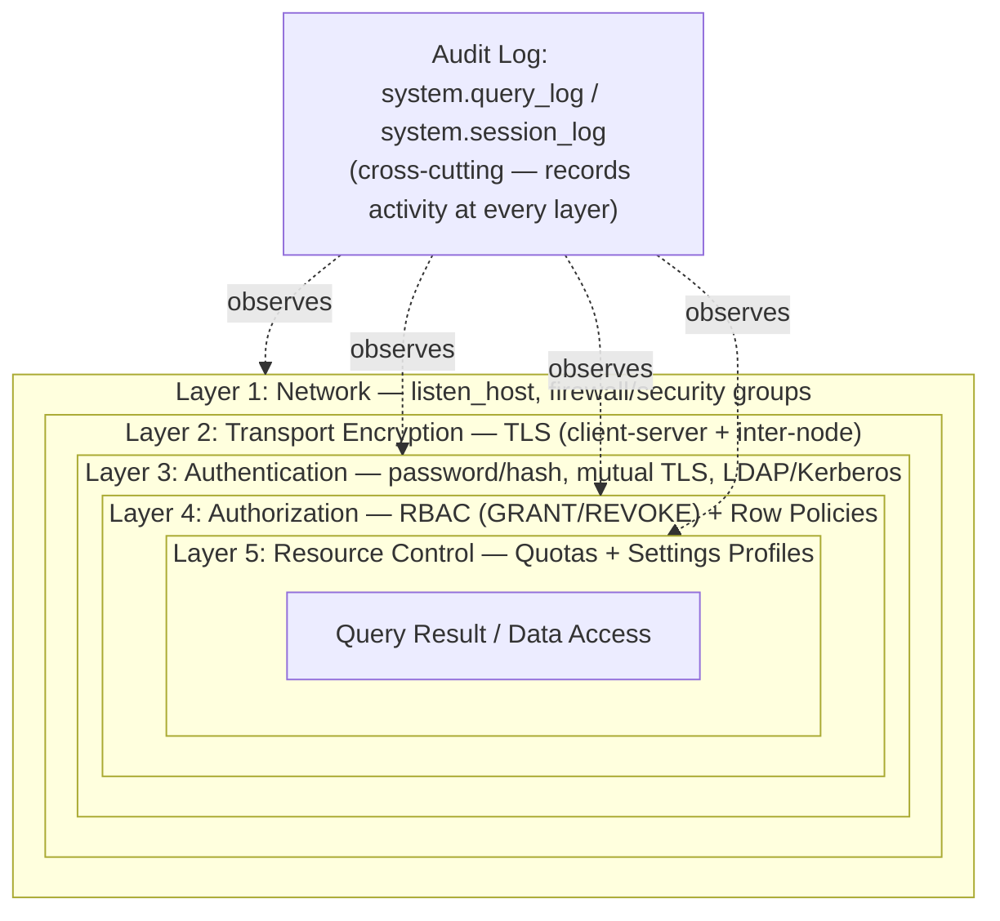

# Security

Chapter 14 got data flowing into ClickHouse fast and reliably — Kafka topics streaming into `MergeTree` tables, files loading in bulk, BI tools querying live over HTTP and the native protocol. None of that engineering effort is worth anything if the cluster on the receiving end is an open door. A pipeline that ingests a million rows a second into a database anyone on the internet can `SELECT * FROM` — or worse, `DROP TABLE` — isn't a fast analytics platform, it's a fast way to leak or lose your data. ClickHouse has a full, if sometimes underused, security model: SQL- and config-driven users, role-based access control, a genuinely distinctive row-level security feature built for multi-tenant analytics, resource quotas that keep one bad dashboard from starving everyone else, settings profiles that cap what a query is even allowed to ask for, TLS for data in motion, and a built-in audit trail via `system.query_log`. This chapter walks through each layer and how they compose into a defense-in-depth posture suitable for production.

---

## Learning Objectives

By the end of this chapter, you will be able to:

- Create and manage ClickHouse users via SQL (`CREATE USER`) and XML configuration, using password/hash-based authentication and mutual TLS certificates.
- Design a role-based access control (RBAC) scheme with `CREATE ROLE` and `GRANT`/`REVOKE`, scoped down to individual columns, following the principle of least privilege.
- Implement row-level security with `CREATE ROW POLICY` so different users or roles see different subsets of the same table's rows.
- Protect shared cluster resources with `CREATE QUOTA` and constrain query-level settings per user group with `CREATE SETTINGS PROFILE`.
- Configure `listen_host` and firewall rules correctly, and explain why an unauthenticated, internet-exposed ClickHouse instance is a well-known, actively exploited class of incident.
- Enable TLS for client-server and inter-node (replication/distributed) traffic.
- Use `system.query_log` and `system.session_log` as an audit trail for security and compliance review, building on their performance use from Chapter 13.

---

## Prerequisites for This Chapter

This chapter assumes the deployment topology from [Chapter 11: Replication & High Availability](./11-replication-and-high-availability.md) and [Chapter 12: Sharding & Distributed Queries](./12-sharding-and-distributed-queries.md) — securing a cluster means securing *every* replica and shard consistently, plus the inter-node traffic between them, not just a single standalone server. It also assumes you're comfortable with:

- Basic `clickhouse-client` usage and connecting to a server (Chapter 1).
- The `Distributed` engine and cluster configuration (`remote_servers`, Keeper) from Chapters 11–12, since inter-node security applies to exactly those connections.
- Query-level settings such as `max_memory_usage` and `max_threads` from [Chapter 13](./13-performance-tuning-and-query-optimization.md) — this chapter shows how to turn those from suggestions into enforced ceilings.

If any of that is shaky, revisit those chapters first — this chapter assumes you already know how a ClickHouse cluster is shaped and queried, and focuses entirely on who is allowed to connect, what they're allowed to do once connected, and how you'd know afterward.

---

## 1. Authentication: Users and How They Prove Who They Are

By default, a fresh ClickHouse install ships with a `default` user that has **no password** and full access — convenient for a five-minute local trial, dangerous the moment the server is reachable from anywhere but your own laptop. The first real security step on any deployment is defining real users and disabling (or tightly restricting) `default`.

### 1.1 Users defined via SQL

The modern, recommended approach is SQL-driven access management, enabled by `access_management: 1` on the user creating other users (or by default in recent versions for users with sufficient rights):

```sql
CREATE USER analyst_alice
    IDENTIFIED WITH sha256_password BY 'a-strong-unique-password'
    HOST IP '10.0.0.0/8'
    SETTINGS PROFILE 'analyst_profile';
```

Key clauses:

- `IDENTIFIED WITH ...` — the authentication method (Section 1.3).
- `HOST` — restricts *which client addresses* this user is even allowed to connect from (`HOST IP`, `HOST NAME`, `HOST REGEXP`, or `HOST ANY` — avoid `ANY` in production).
- `SETTINGS PROFILE` — attaches a settings profile (Section 4) at creation time.

Users created this way are stored in ClickHouse's own access-control metadata (backed by Keeper in a cluster, or local disk on a single node) and are visible in `system.users`. They can be altered and dropped with ordinary SQL:

```sql
ALTER USER analyst_alice IDENTIFIED WITH sha256_password BY 'new-password';
DROP USER analyst_alice;
```

### 1.2 Users defined via XML configuration

The legacy (and still fully supported) approach defines users declaratively in `users.xml` or a file under `users.d/`:

```xml
<clickhouse>
  <users>
    <analyst_alice>
      <password_sha256_hex>5e884898da28047151d0e56f8dc6292773603d0d6aabbdd62a11ef721d1542d</password_sha256_hex>
      <networks>
        <ip>10.0.0.0/8</ip>
      </networks>
      <profile>analyst_profile</profile>
      <quota>default</quota>
    </analyst_alice>
  </users>
</clickhouse>
```

XML-configured users are useful for infrastructure-as-code workflows (checked into version control, deployed via configuration management) and for the very first admin user before SQL-based management is fully bootstrapped. Note the two approaches can coexist, but a user defined in XML cannot be altered via SQL (`ALTER USER` fails on config-defined users) — pick one system of record per user and be consistent, or you'll end up with drift between what's in Git and what's in Keeper.

### 1.3 Password and hash-based authentication

`IDENTIFIED WITH` supports several mechanisms, from weakest to strongest for real deployments:

| Method | Behavior |
|---|---|
| `no_password` | No authentication at all — never use beyond a throwaway local container |
| `plaintext_password` | Password stored and compared in plaintext in config — convenient for local dev, never for production |
| `sha256_password` / `sha256_hash` | Password hashed with SHA-256; `_password` takes the plaintext and hashes it server-side at creation, `_hash` lets you supply a pre-computed hash (useful for provisioning without ever transmitting the plaintext) |
| `double_sha1_password` / `double_sha1_hash` | Compatible with MySQL-style auth, used mainly for MySQL-protocol compatibility connections |
| `ssl_certificate` | Mutual TLS — see Section 1.4 |
| `ldap` / `kerberos` | Delegates authentication to an external directory (Enterprise/large-org setups), conceptually the same "prove your identity" step just outsourced |

`sha256_password` is the sensible default for username/password authentication: ClickHouse never stores the plaintext, and the hash is one-way.

### 1.4 Mutual TLS (certificate) authentication

For service-to-service connections — application servers, inter-node replication traffic, or any automated client where "type a password" isn't the right model — ClickHouse supports authenticating via the client's TLS certificate instead of a password:

```sql
CREATE USER app_service
    IDENTIFIED WITH ssl_certificate CN 'app-service.internal.example.com';
```

This requires the server to have TLS enabled with client certificate verification turned on (Section 6), so the identity check happens as part of the TLS handshake itself rather than as a separate authentication round-trip. The trade-off mirrors mTLS anywhere: you need a certificate authority, an issuance process, and a rotation/revocation story, but you get strong, password-free identity that scales naturally to machine-to-machine traffic and pairs neatly with the same TLS infrastructure protecting the connection's contents.

---

## 2. Authorization and Role-Based Access Control (RBAC)

Authentication proves *who* connected. Authorization decides *what they're allowed to touch*. ClickHouse's model is standard RBAC: privileges are granted to roles, roles are granted to users, and a user's effective permissions are the union of everything granted directly to them plus everything granted to their roles.

### 2.1 Creating roles and granting privileges

```sql
CREATE ROLE analyst;

-- Table-level grant
GRANT SELECT ON analytics.events TO analyst;

-- Database-level grant
GRANT SELECT ON analytics.* TO analyst;

-- Column-level grant — analyst can query only these two columns
GRANT SELECT(event_time, event_type) ON analytics.raw_events TO analyst;

-- Attach the role to a user
GRANT analyst TO analyst_alice;
```

Revoking works symmetrically:

```sql
REVOKE SELECT(event_type) ON analytics.raw_events FROM analyst;
REVOKE analyst FROM analyst_alice;
```

`SHOW GRANTS FOR analyst_alice` and the `system.grants` / `system.role_grants` tables let you audit exactly what any user or role can currently do — essential when troubleshooting "why can this user see that" or reviewing access before a compliance audit.

### 2.2 Roles are composable, users are not privilege containers

Grant privileges to **roles**, not directly to individual users, even for a single-person case. This keeps the model auditable: a user's access is legible by reading their role memberships (`SHOW GRANTS`/`SHOW CREATE USER`) instead of hunting through a scattered history of ad hoc `GRANT`s. It also means onboarding or offboarding a person is one `GRANT role TO user` / `REVOKE role FROM user`, not a re-derivation of what they individually need.

```sql
CREATE ROLE billing_readonly;
GRANT SELECT ON billing.* TO billing_readonly;

CREATE USER new_hire IDENTIFIED WITH sha256_password BY '...';
GRANT billing_readonly TO new_hire;
SET DEFAULT ROLE billing_readonly TO new_hire;
```

### 2.3 Principle of least privilege

The same discipline that applies to every database applies here, with ClickHouse-specific shape:

- Dashboard/BI service accounts get `SELECT` on the specific databases or tables they render, never `SELECT *` cluster-wide and never `INSERT`/`ALTER`/`DROP`.
- Ingestion service accounts (Chapter 14's Kafka consumers, ETL jobs) get `INSERT` on the exact target tables, not blanket `readWrite`-equivalent access to every database.
- Administrative privileges (`CREATE`, `DROP`, `ALTER`, cluster DDL, user/role management) stay with a small number of named operator accounts, ideally using mTLS (Section 1.4) rather than shared passwords.
- Avoid `GRANT ALL ON *.* TO user` outside of a genuine break-glass admin role — it is the ClickHouse equivalent of handing out `root`.

### 2.4 Row-level security with `CREATE ROW POLICY`

This is where ClickHouse's access control goes beyond a typical RBAC checklist, and it's a genuinely useful feature for the kind of multi-tenant analytical workloads ClickHouse is often built for: a **row policy** filters *which rows* of a table a given user or role can see, transparently, without changing a single query the application sends.

```sql
CREATE ROW POLICY tenant_isolation ON analytics.events
    FOR SELECT
    USING tenant_id = currentUser()
    TO tenant_dashboard_role;
```

Here, every query run by `tenant_dashboard_role` against `analytics.events` — no matter what the application asked for — is transparently rewritten as if it had an extra `WHERE tenant_id = currentUser()` clause. A dashboard user querying `SELECT count() FROM analytics.events` sees only their own tenant's rows; they cannot bypass this by adding `OR 1=1` or any other query trick, because the filter is enforced by the server at the access-control layer, beneath the SQL the client wrote.

Row policies compose with a few useful modifiers:

- **`AS PERMISSIVE` (default) vs. `AS RESTRICTIVE`** — permissive policies are OR'd together (any matching policy grants access to a row); restrictive policies are AND'd (all restrictive policies must pass). Use restrictive policies when you need multiple independent conditions all to hold (e.g., tenant isolation *and* a data-retention cutoff).
- **`TO ALL EXCEPT role`** — apply a policy broadly while carving out an exception for an admin/analytics role that needs the unfiltered view.
- Policies can reference any expression, not just an equality check — a common pattern is `USING tenant_id IN (SELECT tenant_id FROM tenant_mapping WHERE user = currentUser())` for users who legitimately span more than one tenant.

This single feature is what lets a shared, single-table `events` schema safely back a multi-tenant analytics product: one physical table, one set of materialized views and projections from Chapter 9, and a per-role row policy doing the tenant isolation — instead of maintaining a separate table (or separate ClickHouse database) per customer.

---

## 3. Quotas: Protecting a Shared Analytical Resource

ClickHouse is usually a genuinely **shared** resource — many dashboards, ad hoc analysts, and scheduled reports all querying the same cluster concurrently. A single unbounded query (an analyst's exploratory `SELECT *` over a multi-billion-row table with no filter, or a dashboard stuck in a refresh loop) can consume enough memory, CPU, or I/O to degrade or starve every other query on the cluster. `CREATE QUOTA` exists specifically for this: a cap on *resource consumption* per user over a rolling time window, independent of whether any single query is individually "valid" SQL.

```sql
CREATE QUOTA dashboard_quota
    KEYED BY user_name
    FOR INTERVAL 1 HOUR
        MAX queries = 1000,
        MAX errors = 100,
        MAX result_rows = 100000000,
        MAX read_rows = 5000000000,
        MAX execution_time = 3600
    TO tenant_dashboard_role;
```

What each limit protects against:

- **`queries`** — caps request volume, guarding against a misbehaving dashboard polling in a tight loop.
- **`errors`** — catches a client stuck retrying a broken query.
- **`result_rows` / `read_rows`** — bounds how much data a user's queries are allowed to touch/return in the window, independent of any single query's own limits.
- **`execution_time`** — total CPU-time budget across all of a user's queries in the interval, not just one query's timeout.

`KEYED BY user_name` tracks consumption per individual user; `KEYED BY none` (the default if omitted) tracks one shared bucket across everyone the quota is assigned to — useful for a coarse "this whole team gets X total" cap. Current usage is inspectable live via `SHOW QUOTA` (from an affected session) and `system.quotas` / `system.quota_usage` for an admin view across all users — the same system-tables-driven observability habit from Chapter 13, applied to enforcement rather than diagnostics.

Quotas are ClickHouse's answer to a problem row-store OLTP databases rarely have to think about this explicitly: a handful of expensive analytical queries can dominate shared cluster capacity in a way that a bunch of small OLTP transactions typically can't, so bounding *cumulative* consumption per user, not just per-query settings, is a first-class concern.

---

## 4. Settings Profiles: Constraining What a Query Is Allowed to Ask For

Chapter 13 introduced query-level settings like `max_memory_usage` and `max_threads` as tools *you* use to tune a query. Left unconstrained, though, nothing stops any user from setting `max_memory_usage = 0` (unlimited) on their own connection and running a query that takes down the box. **Settings profiles** turn those settings from suggestions into enforced defaults and ceilings, assigned per user or role.

```sql
CREATE SETTINGS PROFILE analyst_profile
    SETTINGS
        max_memory_usage = 10000000000 MIN 0 MAX 20000000000 READONLY,
        max_threads = 4 CHANGEABLE_IN_READONLY,
        max_execution_time = 300 MAX 600,
        readonly = 1
    TO analyst;
```

The constraint keywords matter:

- **`MIN` / `MAX`** — a user can still override the setting within a query (`SETTINGS max_threads = 2`), but never outside this range.
- **`READONLY`** on a setting — the value is fixed; the user cannot change it at all, even within the allowed range.
- **`CHANGEABLE_IN_READONLY`** — allows the setting to be adjusted even when the overall session is in read-only mode (`readonly = 1`/`2`), useful for settings that don't affect data safety.
- **`readonly = 1`** as a profile-level setting — the classic way to create a genuinely query-only user: no `INSERT`, `ALTER`, or DDL is possible for the session regardless of what RBAC grants exist, an extra belt-and-suspenders layer on top of Section 2's `GRANT`s.

Profiles can inherit from one another (`INHERIT 'default'`), so you typically define one restrictive baseline profile and layer team-specific overrides on top, rather than repeating every setting per team. Combined with quotas (Section 3), settings profiles are the two ClickHouse-specific levers for making sure "many people query one shared cluster" doesn't turn into "one query ruins it for everyone" — quotas bound *cumulative* usage over time, profiles bound what *any single query* is even allowed to request.

---

## 5. Network Security

Everything above assumes a connection already reached the server. Network security decides which connections get that far at all — and it is, in practice, the layer most often gotten wrong.

### 5.1 `listen_host`

By default, ClickHouse's packaged config listens only on loopback addresses (`::1`, `127.0.0.1`). Making it reachable from anywhere else requires deliberately uncommenting a broader `listen_host` in `config.xml`:

```xml
<clickhouse>
  <listen_host>0.0.0.0</listen_host>   <!-- reachable from every interface -->
</clickhouse>
```

Setting `listen_host` to `0.0.0.0` (or `::`) is sometimes done casually to "just get Docker/cross-host access working," and it's the single most consequential line in the whole security chapter: it's the difference between "only reachable from inside my private network" and "reachable from anywhere that can route to this host at all," including the public internet if the host has any public-facing path.

### 5.2 Firewalling the ports

ClickHouse exposes several ports; each needs to be deliberately scoped, not left open by default:

| Port | Protocol | Purpose |
|---|---|---|
| 8123 | HTTP | HTTP interface — used by many client libraries, BI tools, and `curl`-based health checks |
| 9000 | Native TCP | `clickhouse-client` and native-protocol client libraries |
| 9440 | Native TCP + TLS | Encrypted native protocol |
| 8443 | HTTPS | Encrypted HTTP interface |
| 9009 | Interserver HTTP | Replica-to-replica data exchange (Chapter 11) |

A correctly configured firewall (OS-level `iptables`/`nftables`, or a cloud security group) should permit inbound connections on these ports only from the specific hosts that need them — application/BI servers on 8123/9000/9440/8443, and other cluster members on 9009 — and nothing else. This is a second, independent barrier: even if `listen_host` were ever misconfigured, a correctly scoped firewall rule still blocks the outside world.

### 5.3 Never expose an unauthenticated instance to the public internet

This deserves its own callout because it is, empirically, a real and recurring class of incident — the same pattern documented in this course's sibling MongoDB security chapter for unauthenticated `mongod` instances shows up for ClickHouse too: automated internet scanners specifically look for hosts answering on 8123/9000 with the default `default` user and no password, then use the exposed HTTP or native interface to read, exfiltrate, or destroy data — or, in a pattern seen repeatedly with exposed ClickHouse instances, to drop and execute cryptomining payloads via ClickHouse's own SQL functions (e.g., abusing `url()`/table functions or the ability to execute OS-level actions from an admin-privileged connection). None of this requires breaking a password or exploiting a ClickHouse vulnerability — it requires only that `listen_host` was widened and authentication was never turned on. The floor, non-negotiable before any real data touches a cluster: `default` user has a password (or is disabled), `listen_host` is scoped to trusted interfaces, and a firewall or private network boundary sits in front of every port.

---

## 6. TLS for Client-Server and Inter-Node Traffic

Network scoping controls who can open a connection; TLS protects what travels over the connections you do allow. Two distinct paths need it, and it's easy to secure one and forget the other:

- **Client-to-server** — `clickhouse-client`, BI tools, and application drivers talking to a ClickHouse node.
- **Inter-node** — replica-to-replica traffic (Chapter 11) and distributed query traffic between shards (Chapter 12).

```xml
<clickhouse>
  <tcp_port_secure>9440</tcp_port_secure>
  <https_port>8443</https_port>

  <openSSL>
    <server>
      <certificateFile>/etc/clickhouse-server/server.crt</certificateFile>
      <privateKeyFile>/etc/clickhouse-server/server.key</privateKeyFile>
      <caConfig>/etc/clickhouse-server/ca.crt</caConfig>
      <verificationMode>strict</verificationMode>   <!-- required for mTLS -->
    </server>
  </openSSL>

  <!-- encrypt interserver replication traffic -->
  <interserver_https_port>9010</interserver_https_port>
  <interserver_http_credentials>
    <user>interserver</user>
    <password>a-strong-shared-secret</password>
  </interserver_http_credentials>
</clickhouse>
```

Notes on what each piece buys you:

- `tcp_port_secure` / `https_port` add TLS-wrapped equivalents of the native and HTTP ports; clients connect with `--secure` (`clickhouse-client --secure`) or an HTTPS URL.
- `verificationMode: strict` on the server, paired with `ssl_certificate`-based users (Section 1.4), is what turns plain TLS into **mutual** TLS — the server validates the client's certificate, not just the other way around.
- `interserver_https_port` and `interserver_http_credentials` specifically protect the traffic between replicas and shards — a distributed cluster's internal chatter is otherwise plaintext HTTP by default, which matters a great deal on a shared or multi-tenant network fabric.

As with the MongoDB course's equivalent point: encrypting only client connections while leaving inter-node replication traffic in plaintext still exposes every row being replicated to anyone positioned on the internal network — both paths need TLS, not just the client-facing one.

---

## 7. Auditing: `system.query_log` and `system.session_log`

Every layer above answers "can this happen." Auditing answers a different question: **after the fact, who did what, when, and how much did it cost?** ClickHouse's answer is built in and requires no separate product: `system.query_log` and `system.session_log` are themselves ordinary (if system-managed) MergeTree tables, queryable with SQL like anything else.

Chapter 13 used `system.query_log` to find *slow* queries. The exact same table, read with a security lens, is an audit trail:

```sql
SELECT
    event_time,
    user,
    client_hostname,
    query,
    read_rows,
    read_bytes,
    memory_usage,
    exception
FROM system.query_log
WHERE type = 'QueryFinish'
  AND user = 'analyst_alice'
  AND event_date = today()
ORDER BY event_time DESC;
```

Useful fields for security/compliance review, beyond the performance-tuning ones from Chapter 13:

- `user` / `initial_user` — who ran the query, and (for queries that fan out across a distributed cluster) who originated it.
- `client_hostname` / `address` — where the connection came from.
- `query` — the exact SQL executed, including DDL like `GRANT`/`CREATE USER` changes.
- `exception` / `type` (`QueryStart`, `QueryFinish`, `ExceptionBeforeStart`, `ExceptionWhileProcessing`) — whether a query succeeded, failed validation, or errored mid-execution — useful for spotting repeated failed access attempts.
- `read_rows` / `read_bytes` / `memory_usage` — exactly how much data a user's query touched, tying resource consumption back to a specific identity, which is the piece a quota (Section 3) enforces going forward and `query_log` documents after the fact.

`system.session_log` complements this with connection-level events — logins, logouts, and authentication failures, including the auth method used — which `query_log` alone doesn't capture. Together they answer "who connected, when, using what identity, and what did they run" — the standard shape of an audit trail for SOC 2, HIPAA-adjacent, or internal data-access review purposes.

Two operational notes: these log tables are regular MergeTree tables with their own retention (governed by `TTL` and partitioning, same as any table from Chapter 6), so a busy cluster needs a deliberate retention/rotation policy or the audit tables themselves become a storage and performance concern; and, for genuine tamper-evidence, many production setups also ship these logs to an external, write-once store (a separate ClickHouse cluster, or an object-store/SIEM sink) rather than relying solely on the local copy an attacker with sufficient privileges could otherwise alter.

---

## 8. Defense in Depth: How the Layers Stack

No single control in this chapter is sufficient by itself — each exists to catch what the layer before it might miss. Read top to bottom as the order a connection and query actually pass through:



Reading it end to end: network controls decide who can open a socket at all; TLS protects what travels over that socket; authentication confirms an identity; RBAC and row policies decide what that identity can see and touch, down to the row; quotas and settings profiles bound how much of the cluster's shared capacity any single identity's queries can consume even for actions they're otherwise permitted to do. Auditing doesn't block anything at any layer — it watches all of them, so that when something does go wrong (a misconfigured grant, a compromised credential, a runaway query someone insists "shouldn't have happened"), there's a queryable record of exactly what occurred.

---

## Real-World Scenario

**Setup:** Your team has just provisioned a fresh, replicated ClickHouse cluster (per Chapter 11's topology) to serve as the backend for a multi-tenant analytics product. A single shared `analytics.events` table holds event data for every customer, distinguished by a `tenant_id` column. Three customer-facing dashboards (for three different tenants) will query this cluster directly, alongside your own internal data team running ad hoc exploration. It's fresh off `docker run`, with the `default` user still passwordless and `listen_host` still at its loopback-only default — safe for now, but not yet production-shaped.

**Working through it, layer by layer:**

1. **Lock down the default user and the network first.** Set a strong password on `default` (or disable it entirely and require every connection to use a named user), and leave `listen_host` scoped to the private subnet the application and BI servers live on — never `0.0.0.0` reachable from the internet (Section 5). Confirm with a firewall rule that only the app/BI hosts and cluster peers can reach ports 8123/9000/9440/9009 at all.

2. **Create one role per team, not one shared login.** The three tenant dashboards and the internal data team are functionally different consumers with different needs, so they get different roles:

   ```sql
   CREATE ROLE tenant_dashboard;
   GRANT SELECT ON analytics.events TO tenant_dashboard;

   CREATE ROLE internal_analyst;
   GRANT SELECT ON analytics.* TO internal_analyst;
   ```

3. **Add the row policy that makes shared-table multi-tenancy safe.** Every tenant dashboard user queries the same physical table, so a row policy — not application-layer trust — is what actually keeps tenants isolated (Section 2.4):

   ```sql
   CREATE ROW POLICY tenant_isolation ON analytics.events
       FOR SELECT
       USING tenant_id = currentUser()
       TO tenant_dashboard;
   ```

   Each dashboard's service account is named to match its tenant ID (`tenant_acme`, `tenant_globex`, `tenant_initech`), so `currentUser()` naturally scopes the filter per account with no per-tenant SQL branching anywhere in the app. The internal analyst role is deliberately left off this policy's `TO` list, so the data team retains a full cross-tenant view for legitimate internal analysis.

4. **Cap what any one dashboard can consume.** A single misbehaving dashboard widget (an unbounded date-range picker, a runaway auto-refresh) shouldn't be able to degrade the query experience for the other two tenants or the internal team:

   ```sql
   CREATE QUOTA dashboard_quota
       KEYED BY user_name
       FOR INTERVAL 1 HOUR
           MAX queries = 2000,
           MAX read_rows = 2000000000,
           MAX execution_time = 1800
       TO tenant_dashboard;

   CREATE SETTINGS PROFILE dashboard_profile
       SETTINGS
           max_memory_usage = 4000000000 MAX 8000000000 READONLY,
           max_execution_time = 30 MAX 60,
           readonly = 1
       TO tenant_dashboard;
   ```

   `readonly = 1` also guarantees a compromised or buggy dashboard credential can never write or alter data — only read within its tenant's row-policy-filtered view.

5. **Enable TLS end to end.** Client connections from the dashboards and BI tool use `--secure`/HTTPS against `tcp_port_secure`/`https_port`; replica-to-replica traffic between cluster nodes uses `interserver_https_port` with credentials, so tenant data isn't sitting in plaintext on the internal network either (Section 6).

6. **Confirm the whole chain before cutover.** Connect as `tenant_acme` and confirm `SELECT count() FROM analytics.events` returns only Acme's rows, that `INSERT`/`ALTER` are rejected, and that running an intentionally heavy query trips the quota after enough repetitions. Then check `system.query_log` filtered to `user = 'tenant_acme'` and confirm every one of those test queries shows up with the right `read_rows`/`memory_usage` — proving the audit trail captures exactly the activity the RBAC/row-policy/quota layers were built to constrain.

This is the general shape of "secure a shared analytical cluster": one role and one row policy per tenant, a quota and settings profile bounding each dashboard's blast radius, TLS covering both connection paths, and `query_log` as the record that proves it's all actually working.

---

## Best Practices

- **Set a password on (or disable) the `default` user and scope `listen_host` before the cluster ever holds real data.** Doing this after launch means there was a window where the cluster was genuinely exposed.
- **Grant privileges to roles, not directly to users**, even for single-person accounts — it keeps access legible via `SHOW GRANTS` and makes onboarding/offboarding a single `GRANT`/`REVOKE`, not an audit of scattered individual privileges.
- **Use row policies for multi-tenant tables instead of one table per tenant.** A single shared table with `CREATE ROW POLICY` per tenant role keeps schema, materialized views, and projections (Chapter 9) unified, while still giving airtight per-tenant isolation enforced by the server, not application code.
- **Pair quotas with settings profiles, not one or the other.** Quotas bound *cumulative* resource use over a time window; settings profiles bound what *any single query* is even allowed to request (`max_memory_usage`, `readonly`). Together they cover both the "many small abuses" and "one huge query" failure modes.
- **Enable TLS for both client-server and inter-node traffic**, and treat them as two separate checklist items — it's easy to secure the client-facing port and forget the interserver replication port.
- **Review `system.query_log` and `system.session_log` on a schedule, not only after an incident.** An audit trail nobody reads is a checkbox, not a control — wire slow/anomalous-query alerts or periodic access reviews into an actual workflow.
- **Rotate credentials and certificates routinely.** Password rotation for SQL-defined users and certificate renewal for mTLS/interserver TLS should be scheduled operational hygiene, not a reaction to a suspected compromise.

---

## Common Mistakes

- **Leaving the `default` user without a password and `listen_host` set to `0.0.0.0` (or otherwise internet-reachable).** This exact combination — unauthenticated plus exposed — is the well-documented root cause behind real incidents where scanners find open ClickHouse instances on ports 8123/9000 and use them to exfiltrate data or drop cryptomining payloads. Treat "authentication on + network scoped" as non-negotiable before go-live.
- **Giving every application or dashboard service account a broad, admin-equivalent role** instead of a scoped role with exactly the `SELECT`/`INSERT` privileges it needs. This turns any single leaked credential into full cluster compromise instead of a contained incident.
- **Not setting quotas and letting one bad dashboard query starve the whole cluster.** Without `CREATE QUOTA` and a `max_memory_usage`/`max_execution_time` ceiling from a settings profile, a single unbounded analytical query can consume enough memory or CPU to degrade every other concurrent user — a failure mode fairly unique to a shared OLAP resource with many concurrent readers.
- **Forgetting that row policies apply per role, and pointing a shared BI-tool service account at the wrong role.** If a BI tool's single service account is accidentally granted the internal analyst role (unfiltered) instead of the tenant-scoped role, every tenant using that BI connection sees everyone's data — a row-policy misconfiguration is invisible in application code review because the application never changes; only the role attached to the connecting user does.
- **Enabling TLS for client connections but leaving inter-node replication traffic in plaintext.** A cluster that encrypts application traffic but leaves replica-to-replica and interserver traffic unencrypted still exposes every replicated row on the internal network to anyone positioned to intercept it.
- **Treating security as a one-time setup step at cluster creation.** New tables get created without anyone re-applying existing row policies or grants to them, certificates expire, and staff turnover leaves stale roles attached to accounts that should have been revoked. Access control needs periodic review, not a single pass at launch.
- **Relying on the local `system.query_log` alone as a tamper-evident audit record.** A user with sufficient privileges can, in principle, alter or truncate a local system table; genuinely durable audit trails ship these logs to an external, access-controlled sink.

---

## Summary

- **Authentication** can be defined via SQL (`CREATE USER`) or XML config, using password/SHA-256-hash-based methods for humans and services, or mutual TLS certificates (`IDENTIFIED WITH ssl_certificate`) for password-free, certificate-based identity.
- **RBAC** (`CREATE ROLE`, `GRANT`/`REVOKE`) scopes access down to the database, table, or individual column, following least privilege; **row policies** (`CREATE ROW POLICY`) go a level deeper, filtering *which rows* of a shared table a role can see — the feature that makes single-table multi-tenant analytics safe.
- **Quotas** (`CREATE QUOTA`) bound cumulative resource consumption (queries, rows read, execution time) per user over a rolling window, protecting a cluster that many teams and dashboards query concurrently from any one of them monopolizing it.
- **Settings profiles** (`CREATE SETTINGS PROFILE`) turn query-level settings from Chapter 13 into enforced ceilings and safe defaults per user or role, using `MIN`/`MAX`/`READONLY` constraints.
- **Network security** (`listen_host`, firewalling ports 8123/9000/9440/8443/9009) controls which connections reach the server at all — an unauthenticated instance bound to a public interface is a real, recurring class of incident, not a hypothetical one.
- **TLS** must cover both client-server and inter-node (replication/distributed-query) traffic — securing only one leaves the other exposed.
- **Auditing** via `system.query_log`/`system.session_log` gives ClickHouse a built-in, queryable record of who ran what, when, and how much it cost — the same tables Chapter 13 used for performance, now read for security and compliance.
- These controls form **defense in depth**: network, transport, authentication, authorization/row-policies, and resource controls each catch what the layer before might miss, with the audit log observing all of them.

---

## Knowledge Check

1. What is the difference between a `GRANT`-based RBAC privilege and a row policy (`CREATE ROW POLICY`), and why does a multi-tenant analytics product typically need both?
2. Why is `CREATE QUOTA` a more distinctly important concern for ClickHouse than for a typical single-tenant OLTP database?
3. A settings profile sets `max_memory_usage = 10000000000 MAX 20000000000 READONLY`. Explain what a user attached to this profile can and cannot do with that setting.
4. Explain the difference between securing client-server TLS and inter-node TLS in a replicated/sharded ClickHouse cluster, and why both are necessary.
5. A shared BI-tool service account was accidentally granted the `internal_analyst` role instead of a tenant-scoped role with a row policy attached. What would this misconfiguration look like from the outside, and how would you detect it using `system.query_log`?

---

## Hands-On Exercise

Work through this on a local ClickHouse instance (not a shared or production cluster):

1. **Create a scoped role.** Create a role `events_reader` with `SELECT`-only access to a table `analytics.events` (create the table first if it doesn't exist, with at least `tenant_id`, `country`, and `event_time` columns and some sample rows spanning a few different `country` values):

   ```sql
   CREATE ROLE events_reader;
   GRANT SELECT ON analytics.events TO events_reader;
   ```

2. **Create a demo user restricted by a row policy.** Create a user `demo_us` attached to `events_reader`, then add a row policy limiting what that role can see to `country = 'US'` rows only:

   ```sql
   CREATE USER demo_us IDENTIFIED WITH sha256_password BY 'demo-password';
   GRANT events_reader TO demo_us;

   CREATE ROW POLICY us_only ON analytics.events
       FOR SELECT
       USING country = 'US'
       TO events_reader;
   ```

3. **Create a quota limiting query volume.** Add an hourly cap on how many queries `demo_us` can run:

   ```sql
   CREATE QUOTA demo_quota
       KEYED BY user_name
       FOR INTERVAL 1 HOUR
           MAX queries = 20
       TO events_reader;
   ```

4. **Verify all three as the restricted user.** Connect with `clickhouse-client --user demo_us --password demo-password` and confirm:
   - `SELECT DISTINCT country FROM analytics.events;` returns only `US`, even though the underlying table has other countries — proving the row policy is enforced.
   - `INSERT INTO analytics.events VALUES (...)` and `ALTER TABLE analytics.events ...` are both rejected with an authorization error — proving the `SELECT`-only grant is enforced.
   - Running more than 20 queries within the hour trips the quota, returning a quota-exceeded error — proving `CREATE QUOTA` is enforced. (`SHOW QUOTA` from the `demo_us` session shows current usage against the limit.)

5. **Confirm the audit trail.** As an admin user, query `system.query_log` filtered to `user = 'demo_us'` and confirm every query you ran in step 4 — including the rejected `INSERT`/`ALTER` attempts — appears with the correct `type` (`QueryFinish` vs. `ExceptionBeforeStart`), `read_rows`, and `exception` fields.

---

## Further Reading

- [Access Control and Account Management](https://clickhouse.com/docs/operations/access-rights) — the full reference for `CREATE USER`, `CREATE ROLE`, `GRANT`/`REVOKE`, and SQL-driven RBAC.
- [Row Policies](https://clickhouse.com/docs/operations/access-rights#row-policy-management) — `CREATE ROW POLICY` syntax, `PERMISSIVE`/`RESTRICTIVE` semantics, and examples.
- [Quotas](https://clickhouse.com/docs/operations/quotas) — `CREATE QUOTA` reference and the resource metrics it can constrain.
- [Settings Profiles](https://clickhouse.com/docs/operations/settings/settings-profiles) — `CREATE SETTINGS PROFILE`, constraint syntax, and profile inheritance.
- [Configuring SSL-TLS](https://clickhouse.com/docs/guides/sre/configuring-ssl) — end-to-end TLS setup for client and interserver connections.

---

<div style="display:flex;justify-content:space-between;align-items:center;">
  <a href="./14-data-ingestion-and-integrations.md">← Previous: Data Ingestion & Integrations</a>
  <a href="./00-index.md">🏠 Index</a>
  <a href="./16-best-practices.md">Next: Best Practices →</a>
</div>
