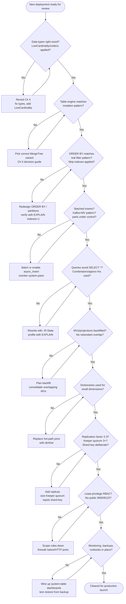

# Best Practices

Across the last fifteen chapters you learned dozens of individually correct recommendations: use `LowCardinality` on repeated strings, pick `ReplacingMergeTree` when rows get corrected rather than only appended, put your most-filtered columns first in `ORDER BY`, batch inserts instead of trickling them in one row at a time, prefer a dictionary over a `JOIN` for a small slowly-changing dimension, and lock a cluster down with least-privilege RBAC before it ever sees a production credential. Each one made sense in the context of the chapter that introduced it. What's been missing is the **view from above** — every one of these recommendations gathered in one place, organized by theme instead of by chapter number, so you can run through them quickly before a design review, a schema migration, or a production launch. This chapter is that reference: the checklist a senior data engineer runs a ClickHouse design or deployment against before signing off on it. Treat it as a document you return to repeatedly — before you finalize a schema, before you ship a new materialized view, before you flip a new cluster into production — not as a one-time read.

---

## Learning Objectives

By the end of this chapter, you will be able to:

- Recite a concise, defensible checklist of best practices spanning schema design, table engines, `ORDER BY`/indexing, ingestion, query writing, materialized views/projections, joins, high availability, security, and operations.
- Explain the reasoning behind each practice well enough to adapt it when your workload doesn't match the textbook case.
- Run a structured pre-production review of a ClickHouse deployment and identify the highest-severity gaps first.
- Recognize the handful of decisions (`ORDER BY` key, shard key, replication factor, Keeper topology) that are expensive to change after data and traffic accumulate, and get them right before launch.
- Distinguish practices that are "nice to have" from the small set that are load-bearing for correctness, availability, or cost.
- Audit a real or hypothetical schema/cluster configuration against this chapter's consolidated checklist.

---

## Prerequisites for This Chapter

This chapter is a **synthesis** chapter. It assumes you have completed Chapters 1 through 15 and have working knowledge of everything it references — it does not re-teach any technique, it distills and cross-links what you've already learned into one operational reference. The major theme areas it draws from:

- **[Chapter 4: Data Types & Schema Design](./04-data-types-and-schema-design.md)** — right-sized numeric types, `LowCardinality`, `Nullable`'s cost, codec selection.
- **[Chapter 5: Table Engines Deep Dive](./05-table-engines-deep-dive.md)** — matching the MergeTree variant (or Log/Distributed/Memory) to how data actually gets mutated.
- **[Chapter 6: Primary Keys & Sparse Indexing](./06-primary-keys-and-sparse-indexing.md)** — `ORDER BY` as the index, partition granularity, skip indexes.
- **[Chapter 3: Architecture & Internals](./03-architecture-and-internals.md)** and **[Chapter 7: Inserting & Querying Data](./07-inserting-and-querying-data.md)** and **[Chapter 14: Data Ingestion & Integrations](./14-data-ingestion-and-integrations.md)** — batching, parts and merges, the Kafka-engine ingestion pattern.
- **[Chapter 8: Aggregate Functions & Analytics](./08-aggregate-functions-and-analytics.md)** and **[Chapter 13: Performance Tuning & Query Optimization](./13-performance-tuning-and-query-optimization.md)** — combinators, `PREWHERE`, `EXPLAIN`-driven tuning.
- **[Chapter 9: Materialized Views & Projections](./09-materialized-views-and-projections.md)** — incremental MVs, backfill strategy, projections.
- **[Chapter 10: Joins & Data Modeling](./10-joins-and-data-modeling.md)** — join algorithms, dictionaries, denormalization.
- **[Chapters 11–12: Replication & High Availability, Sharding & Distributed Queries](./11-replication-and-high-availability.md)** — Keeper, replication factor, shard key selection, `ON CLUSTER`.
- **[Chapter 15: Security](./15-security.md)** — RBAC, row policies, quotas, network exposure.

If any of these feel unfamiliar, a quick re-read before continuing will make this chapter much more useful — every bullet below has a full chapter behind it if you need the complete explanation.

---

## 1. Schema and Data Type Best Practices

*(Builds on Chapter 4: Data Types & Schema Design)*

- **Right-size every numeric column.** Don't default to `Int64`/`Float64` out of habit — an `UInt8` `status` code or an `Int32` `user_id` compresses better, fits more values per cache line, and is exactly as fast or faster to scan. Reserve `Decimal` for money and anything where floating-point rounding is unacceptable.
- **Wrap every repeated, bounded-cardinality string in `LowCardinality`.** Country codes, browser names, HTTP methods, status enums — anything with roughly under 10,000 distinct values benefits from `LowCardinality`'s dictionary encoding, which turns string comparisons into integer comparisons and shrinks storage dramatically.
- **Avoid `Nullable` unless the column's absence is semantically meaningful and common.** `Nullable(T)` stores a separate bitmap column alongside `T` and disables some optimizations; a sentinel default (`0`, `''`, a specific "unknown" enum value) is usually cheaper and just as expressive for OLAP-style analytical columns.
- **Choose compression codecs deliberately, not just the table-level default.** `Delta`/`DoubleDelta` for monotonic or slowly-changing numeric columns (timestamps, counters), `Gorilla` for slowly-changing floats (metrics), `T64` for integer columns with a narrow value range, general-purpose `ZSTD` (with a tuned level) as the default for everything else.
- **Prefer `Enum8`/`Enum16` over free-text strings for a small, known, stable set of values** — it's self-documenting, validated at insert time, and stores as a single byte or two.
- **Use `Array`, `Map`, and `Nested` for genuinely semi-structured or repeating attributes** instead of normalizing into a join-requiring child table, but don't reach for them as a substitute for real columns on frequently-filtered fields — a value buried in a `Map` can't benefit from a skip index the way a first-class column can.

```sql
-- Before: naive types straight from an ORM export
CREATE TABLE events_naive (
    event_id    String,
    user_id     Int64,
    country     String,
    http_method String,
    status_code Int64,
    is_bot      Nullable(UInt8),
    event_time  DateTime
) ENGINE = MergeTree ORDER BY event_time;

-- After: right-sized types, LowCardinality, no unnecessary Nullable, tuned codecs
CREATE TABLE events (
    event_id    UUID,
    user_id     UInt32,
    country     LowCardinality(String),
    http_method LowCardinality(String),
    status_code UInt16,
    is_bot      UInt8 DEFAULT 0,               -- sentinel instead of Nullable
    event_time  DateTime CODEC(Delta, ZSTD)
) ENGINE = MergeTree ORDER BY (country, event_time);
```

---

## 2. Table Engine Selection Best Practices

*(Builds on Chapter 5: Table Engines Deep Dive)*

- **Default to plain `MergeTree` for pure insert-only, append-only fact data** — most event/log/metric tables never need a specialized variant.
- **Use `ReplacingMergeTree` only when duplicates are corrected later, not to enforce real-time uniqueness.** Deduplication happens at merge time, not at insert time — never rely on `ReplacingMergeTree` (even with `FINAL`) as a substitute for a uniqueness constraint on the hot query path without understanding the `FINAL` cost.
- **Use `SummingMergeTree`/`AggregatingMergeTree` for pre-aggregated rollup tables**, typically fed by a materialized view, not as the primary landing table for raw events — collapsing rows too early throws away the ability to re-aggregate differently later.
- **Reserve `CollapsingMergeTree`/`VersionedCollapsingMergeTree` for genuine mutable-state-via-append workloads** (e.g., session state, running totals that get corrected) where the sign-column pattern's insert-order discipline is something your ingestion pipeline can actually guarantee.
- **Never use the `Log` family (`Log`, `TinyLog`, `StripeLog`) for anything but small, single-threaded, throwaway or staging tables** — they have no support for concurrent modification and no primary index.
- **Use the `Distributed` engine as a thin routing layer, not a storage engine** — it holds no data itself; point it at a real MergeTree-family table on each shard.
- **When in doubt, ask: "does this data get corrected/updated after the fact, and if so, how often and by what mechanism?"** — that single question routes you to the right engine faster than any other heuristic.

```sql
-- Raw fact table: plain MergeTree, append-only
CREATE TABLE page_views (
    user_id UInt32, url String, ts DateTime
) ENGINE = MergeTree ORDER BY (user_id, ts);

-- Corrected-in-place dimension snapshot: ReplacingMergeTree keyed on version
CREATE TABLE user_profile_latest (
    user_id UInt32, plan LowCardinality(String), updated_at DateTime
) ENGINE = ReplacingMergeTree(updated_at)
ORDER BY user_id;

-- Pre-aggregated rollup fed by a materialized view: SummingMergeTree
CREATE TABLE daily_revenue (
    day Date, region LowCardinality(String), revenue Decimal(18,2)
) ENGINE = SummingMergeTree
ORDER BY (region, day);
```

---

## 3. `ORDER BY`, Partitioning, and Indexing Best Practices

*(Builds on Chapter 6: Primary Keys & Sparse Indexing)*

- **Order `ORDER BY` columns by descending selectivity/filter frequency, ESR-style: the column your queries equality-filter on most often goes first**, then columns used for range filters or sorting, then the rest. This directly determines how much of the sparse index can be skipped per query.
- **Keep the `ORDER BY` key reasonably short (typically 2-4 columns).** Every additional column adds sort/merge overhead and diminishing selectivity gains — a key with eight columns is rarely better than a well-chosen key with three plus a couple of skip indexes.
- **Partition by coarse time granularity (usually month) for time-series fact tables, not by every dimension you can think of.** Over-partitioning (partitioning by day, or by a high-cardinality dimension) creates thousands of small parts, which increases merge pressure and can push you into the "too many parts" failure mode covered in Section 4.
- **Design partitions for pruning, not for data organization.** A partition key should match the predicate your queries actually filter on for date-range exclusion (`toYYYYMM(event_time)`), not an arbitrary business dimension that doesn't appear in `WHERE` clauses.
- **Add data-skipping (secondary) indexes only on columns that are filtered often but aren't part of the primary key**, and pick the index type to match the predicate: `minmax` for numeric/date range filters, `set` for a small number of distinct filtered values, `bloom_filter`/`tokenbf_v1`/`ngrambf_v1` for equality or substring matches on strings.
- **Validate every `ORDER BY` and skip-index decision with `EXPLAIN indexes = 1` against production-representative data**, not intuition — check how many granules are actually pruned before committing to a key.

```sql
-- ORDER BY tuned to the dashboard's actual filter pattern:
-- equality-heavy filter on tenant_id, then a range filter/sort on event_time
CREATE TABLE events (
    tenant_id   LowCardinality(String),
    event_type  LowCardinality(String),
    event_time  DateTime,
    user_agent  String
)
ENGINE = MergeTree
PARTITION BY toYYYYMM(event_time)          -- coarse, monthly pruning
ORDER BY (tenant_id, event_time)           -- most-filtered column first
SETTINGS index_granularity = 8192;

-- Skip index for an occasional substring search that isn't in the primary key
ALTER TABLE events ADD INDEX ua_idx user_agent TYPE tokenbf_v1(4096, 3, 0) GRANULARITY 4;
```

---

## 4. Insert and Ingestion Best Practices

*(Builds on Chapters 3, 7, and 14)*

- **Always batch inserts.** Target thousands to tens of thousands of rows per `INSERT`, not one row at a time — each `INSERT` creates at least one new part, and ClickHouse's background merge process is designed around infrequent, large writes, not high-frequency single-row writes.
- **Avoid the "too many parts" trap.** If your ingestion pattern can't naturally batch client-side (many small producers, IoT devices, microservices each emitting a few rows), enable `async_insert` server-side so ClickHouse buffers and batches on your behalf instead of creating a part per request.
- **Use the Kafka engine plus a materialized view as the standard streaming-ingestion pattern**: a `Kafka`-engine table consumes the topic, and a materialized view attached to it transforms and inserts into the real MergeTree-family target table — never query the Kafka engine table directly for analytics.
- **Monitor `system.parts` and `system.merges` proactively**, watching for a rising count of small, unmerged parts — that's the leading indicator of the "too many parts" error before it actually fires and starts rejecting inserts.
- **Prefer `INSERT ... SELECT` for server-side transforms/backfills** over pulling data out to a client and back in — it avoids the network round trip entirely.
- **Set `max_insert_block_size` and related batching settings deliberately for high-throughput pipelines**, and always insert into the real target table (or its Kafka-engine + MV pipeline) rather than round-tripping through a `Distributed` table when a direct write to the correct shard is possible.

```sql
-- Kafka-engine + materialized view ingestion pattern
CREATE TABLE events_queue (
    raw String
) ENGINE = Kafka
SETTINGS kafka_broker_list = 'kafka:9092',
         kafka_topic_list = 'events',
         kafka_group_name = 'clickhouse_events',
         kafka_format = 'JSONEachRow';

CREATE MATERIALIZED VIEW events_mv TO events AS
SELECT
    JSONExtractString(raw, 'tenant_id') AS tenant_id,
    JSONExtractString(raw, 'event_type') AS event_type,
    parseDateTimeBestEffort(JSONExtractString(raw, 'ts')) AS event_time
FROM events_queue;
```

```bash
# Client-side batching: thousands of rows per insert, not one HTTP call per row
cat events_batch.jsonl | clickhouse-client --query="INSERT INTO events FORMAT JSONEachRow"
```

---

## 5. Query-Writing Best Practices

*(Builds on Chapters 7, 8, and 13)*

- **Never `SELECT *` in production queries or views.** ClickHouse reads only the columns you name, so an explicit column list can be an order of magnitude faster than `SELECT *` on a wide table — this is the single highest-leverage habit in this entire chapter.
- **Use `-If` combinators to fold multiple conditional aggregates into a single pass** (`countIf`, `sumIf`, `avgIf`) instead of separate subqueries or multiple full-table scans.
- **Use `-State`/`-Merge` combinators for incremental, re-aggregatable rollups** — store partial aggregate states (`uniqState`, `sumState`) in an `AggregatingMergeTree`, and finalize with the matching `-Merge` function at query time, rather than re-scanning raw data for every dashboard refresh.
- **Reach for approximate functions (`uniqCombined`, `uniqHLL12`, `quantileTDigest`) when an exact answer isn't required and the column has high cardinality** — the accuracy loss is usually negligible and the speed/memory savings are large; reserve exact `uniqExact`/`quantileExact` for cases (billing, compliance) where precision is a hard requirement.
- **Understand `PREWHERE` and let ClickHouse apply it automatically in most cases**, but be aware of it when hand-tuning a query on a wide table: `PREWHERE` filters using a cheap column before reading the rest of the row's columns, which can meaningfully cut I/O on tables with dozens of columns.
- **Profile every non-trivial or newly-shipped query with `EXPLAIN` (`EXPLAIN indexes = 1`, `EXPLAIN PIPELINE`) before it reaches production**, and re-check it after any schema or data-volume-relevant change — a query plan that was fine at 10M rows can degrade sharply at 1B.

```sql
-- Wrong: SELECT *, separate scans for conditional aggregates
SELECT * FROM events WHERE event_time > now() - INTERVAL 1 DAY;
SELECT count() FROM events WHERE status_code >= 500 AND event_time > now() - INTERVAL 1 DAY;

-- Right: explicit columns, folded conditional aggregates, approximate distinct count
SELECT
    country,
    countIf(status_code >= 500) AS error_count,
    count() AS total_count,
    uniqCombined(user_id) AS approx_unique_users
FROM events
WHERE event_time > now() - INTERVAL 1 DAY
GROUP BY country;
```

---

## 6. Materialized View and Projection Best Practices

*(Builds on Chapter 9: Materialized Views & Projections)*

- **Have a deliberate backfill plan before creating a materialized view.** A newly created MV only sees rows inserted after its creation — backfilling history requires a separate `INSERT INTO target SELECT ... FROM source` over the historical range, done carefully to avoid double-counting rows the MV will also process going forward.
- **Avoid overlapping/chained materialized views on the same source table** where multiple MVs perform near-identical transforms — consolidate into one MV feeding a rollup table with enough granularity to serve all the downstream queries, rather than fanning out redundant write amplification on every insert.
- **Choose a projection over a materialized view when you need an alternate physical sort order or a pre-aggregation of the *same* table**, transparently selected by the query optimizer — choose an MV when you need a genuinely different target table, different engine, or a transform/join against another table.
- **Remember that both MVs and projections cost write amplification** — every insert into the source table triggers the MV's `SELECT` and/or the projection's rebuild; don't stack more of them onto a hot ingestion table than the workload can absorb.
- **Test MV/projection correctness against a known query result before relying on it** — an MV whose aggregation logic doesn't match the "ground truth" query it's meant to replace is a silent correctness bug that surfaces as "the dashboard numbers don't match" weeks later.

```sql
-- Materialized view: pre-aggregate into a SummingMergeTree, then backfill history
CREATE MATERIALIZED VIEW daily_revenue_mv TO daily_revenue AS
SELECT toDate(event_time) AS day, region, sum(amount) AS revenue
FROM orders
GROUP BY day, region;

-- Backfill: run once, immediately after creating the MV, over historical data
INSERT INTO daily_revenue
SELECT toDate(event_time) AS day, region, sum(amount) AS revenue
FROM orders
WHERE event_time < '2026-07-06'
GROUP BY day, region;

-- Projection: same table, alternate sort order for a different filter pattern
ALTER TABLE orders ADD PROJECTION by_region (
    SELECT * ORDER BY (region, event_time)
);
ALTER TABLE orders MATERIALIZE PROJECTION by_region;
```

---

## 7. Join and Data-Modeling Best Practices

*(Builds on Chapter 10: Joins & Data Modeling)*

- **Replace joins against small, slowly-changing dimension tables with dictionaries.** A `Dictionary` engine table (or external dictionary) loaded into memory turns a join into a fast `dictGet()` lookup and avoids ClickHouse's join algorithms and memory overhead entirely — this is the single highest-value join optimization available.
- **Denormalize read-hot dimension attributes onto the fact table when the join would otherwise happen on every query.** A `country_name` or `plan_tier` copied onto the events table at insert time trades a small amount of storage and a data-freshness constraint for eliminating a join from the hot path — the same tradeoff MongoDB's Extended Reference Pattern makes, just applied to a columnar OLAP table.
- **Put the smaller table on the right-hand side of a `JOIN`** so ClickHouse can build its in-memory hash table from the smaller relation.
- **Filter both sides of a join before the join executes, not after** — an unfiltered fact table joined against a dimension table, filtered afterward in an outer `WHERE`, pays the full join cost for rows that get thrown away anyway.
- **Avoid joining two large fact tables at query time as a routine pattern.** ClickHouse's join engines were not designed to be the primary way you combine large datasets the way a normalized OLTP schema would — prefer denormalizing at ingestion time, or precomputing the join result into a materialized rollup.

```sql
-- Dictionary instead of a join for a small, slowly-changing dimension
CREATE DICTIONARY country_dict (
    country_code String,
    country_name String
)
PRIMARY KEY country_code
SOURCE(CLICKHOUSE(TABLE 'countries'))
LAYOUT(HASHED())
LIFETIME(3600);

SELECT
    dictGet('country_dict', 'country_name', country_code) AS country_name,
    count()
FROM events
GROUP BY country_name;
```

---

## 8. High Availability and Scaling Best Practices

*(Builds on Chapters 11–12: Replication & High Availability, Sharding & Distributed Queries)*

- **Run a replication factor of at least 2 (ideally 3) for any table holding data you can't afford to lose**, using `ReplicatedMergeTree` — a single unreplicated node is a single point of both data loss and downtime.
- **Size ClickHouse Keeper as an odd-numbered quorum, minimum 3 nodes, in production.** A single-node Keeper deployment has no failover and turns Keeper into the one component whose loss takes down every replicated/distributed DDL operation on the whole cluster — this is one of the most common corners cut in early deployments.
- **Choose a shard key deliberately, before production data volume accumulates**, matched to your dominant query pattern (so most queries can be routed to a single shard) and with high enough cardinality to distribute writes evenly — changing a shard key after the fact means a full data redistribution.
- **Run schema changes via `ON CLUSTER` DDL with discipline**, not by manually applying `ALTER TABLE` to each node — `ON CLUSTER` keeps replicas' schemas synchronized, and skipping it is a common source of "why does this replica have a different column set" incidents.
- **Understand the difference between scaling replicas (read throughput, availability) and scaling shards (write throughput, dataset size beyond one node's disk/RAM)** and don't reach for sharding until you've confirmed a single well-tuned node/replica set genuinely can't hold or serve the workload — sharding adds real operational complexity (`Distributed` engine routing, cross-shard `GROUP BY`, harder ad hoc joins).
- **Monitor `system.replication_queue` for stuck or growing replication tasks** — a replica falling behind is both a stale-read risk and a signal of an underlying resource or network problem.

```sql
-- ReplicatedMergeTree, deployed via ON CLUSTER for schema consistency
CREATE TABLE events ON CLUSTER production_cluster (
    tenant_id LowCardinality(String),
    event_time DateTime,
    payload String
)
ENGINE = ReplicatedMergeTree('/clickhouse/tables/{shard}/events', '{replica}')
PARTITION BY toYYYYMM(event_time)
ORDER BY (tenant_id, event_time);

-- Distributed table routing to shards with a deliberate, high-cardinality shard key
CREATE TABLE events_distributed ON CLUSTER production_cluster AS events
ENGINE = Distributed(production_cluster, default, events, cityHash64(tenant_id));
```

```xml
<!-- Keeper: minimum 3-node quorum in production, never a single node -->
<keeper_server>
    <server_id>1</server_id>
    <raft_configuration>
        <server><id>1</id><hostname>keeper1</hostname><port>9444</port></server>
        <server><id>2</id><hostname>keeper2</hostname><port>9444</port></server>
        <server><id>3</id><hostname>keeper3</hostname><port>9444</port></server>
    </raft_configuration>
</keeper_server>
```

---

## 9. Security Best Practices

*(Builds on Chapter 15: Security)*

- **Apply least-privilege RBAC to every account.** Application service accounts get `SELECT`/`INSERT` scoped to exactly the databases and tables they need, never the default `default` superuser account; human operators get roles scoped to their actual responsibilities.
- **Use row policies for multi-tenant data isolation at the database layer**, not solely as an application-level `WHERE` clause convention — a row policy is enforced server-side regardless of what query the client sends.
- **Set quotas on interval-based resource consumption (queries, result rows, execution time) per user/role**, especially for any account with ad hoc query access — an unbounded analyst account can otherwise saturate a shared cluster with one runaway query.
- **Never expose the native protocol port (9000) or the HTTP interface (8123) directly to the public internet.** Put ClickHouse behind a VPC/security-group boundary, a bastion, or an authenticating proxy, and require TLS for both client connections and inter-node/inter-replica traffic.
- **Disable or tightly restrict the `default` user** (no password, broad grants) that ships enabled on a fresh install — this is one of the most common real-world ClickHouse exposure incidents, mirroring the "unauthenticated `mongod`" mistake in adjacent database ecosystems.
- **Enable query logging (`system.query_log`) and audit who ran what**, especially for accounts with elevated privileges, and rotate credentials/certificates on a defined schedule.

```sql
-- Least-privilege role for an application service account
CREATE ROLE events_writer;
GRANT INSERT, SELECT ON analytics.events TO events_writer;
CREATE USER events_service IDENTIFIED WITH sha256_password BY '...' DEFAULT ROLE events_writer;

-- Row policy: tenant isolation enforced server-side, not just in application code
CREATE ROW POLICY tenant_isolation ON analytics.events
    USING tenant_id = currentUser()
    TO events_service;

-- Quota: cap a role's resource usage per hour
CREATE QUOTA analyst_quota
    FOR INTERVAL 1 HOUR MAX QUERIES 1000, MAX RESULT ROWS 10000000
    TO analyst_role;
```

---

## 10. Operational and Production Best Practices

These practices don't belong to a single earlier chapter — they're what "running ClickHouse in production" means once the schema, engines, and pipelines are already correct.

- **Monitor the system tables that predict trouble before it becomes an outage**: `system.merges` (merge backlog and duration), `system.replication_queue` (stuck/growing replication tasks), `system.parts` (part count trending toward "too many parts"), and `system.metrics`/`system.asynchronous_metrics` for memory pressure, CPU, and background pool saturation.
- **Plan capacity for parts and merges, not just disk space.** A table receiving many small inserts accumulates parts faster than the background merge pool can consolidate them — track `system.parts` part count per table against `parts_to_throw_insert`/`parts_to_delay_insert` thresholds, and fix the ingestion pattern (batch more, use `async_insert`) before it becomes an insert-rejection incident.
- **Have a tested backup and restore strategy, not just a backup job.** Use the native `BACKUP`/`RESTORE` SQL commands or the community `clickhouse-backup` tool for full/incremental backups, and consider S3/object-storage-backed `MergeTree` tables (`disk` configuration with an S3 backend) for tiered, durable storage of cold data. Critically: **actually run a restore drill periodically** — an untested backup is a hope, not a plan.
- **Roll out upgrades one replica at a time on a replicated cluster.** Upgrade/restart a minority of replicas first, confirm they rejoin healthy and catch up, then proceed — never take a whole replicated cluster down simultaneously for a routine version bump.
- **Test schema and settings changes in a staging environment with production-representative data volume before applying them in production.** An `ORDER BY` change, a new skip index, or a `merge_tree` setting tweak can behave very differently at 10GB versus 10TB.
- **Keep a documented, rehearsed incident-response runbook** for the failure modes most likely to actually occur: a stuck merge backlog, a Keeper quorum loss, a runaway ad hoc query saturating the cluster, and a replica falling behind after a network partition.

```sql
-- Native BACKUP/RESTORE
BACKUP TABLE analytics.events TO Disk('backups', 'events_2026_07_06.zip');
RESTORE TABLE analytics.events FROM Disk('backups', 'events_2026_07_06.zip');

-- Watch for the "too many parts" leading indicator
SELECT table, count() AS part_count
FROM system.parts
WHERE active
GROUP BY table
ORDER BY part_count DESC
LIMIT 10;

-- Replication health check
SELECT database, table, count() AS queued_entries
FROM system.replication_queue
GROUP BY database, table
ORDER BY queued_entries DESC;
```

### Diagram: Pre-Production Launch Checklist



---

## Real-World Scenario

**Setup:** You're the senior data engineer running the pre-launch review for a mid-sized analytics product's new production ClickHouse deployment — a web-analytics platform tracking page views and conversion events for several hundred customer websites. The team demos the system, and you walk it theme by theme against this chapter's checklist.

**Schema and data types.** The `page_views` table uses `UInt32` for `site_id` and `user_id`, `DateTime` with a `Delta` codec on the timestamp, and an `Enum8` for `device_type`. This section mostly passes — except the `browser` column, which stores raw browser strings (`"Chrome"`, `"Safari"`, `"Firefox"`, a few dozen distinct values total) as plain `String`. **This is Issue #1**: a clearly low-cardinality column left as `String` instead of `LowCardinality(String)`. It's not a correctness bug, but on a table already past 2 billion rows it's a meaningful, free storage and scan-speed win the team is leaving on the table.

**Table engines and `ORDER BY`.** The `page_views` fact table correctly uses plain `MergeTree` (pure append-only data). But when you pull up the table definition, `ORDER BY` is `(event_time)` alone — and the team's own dashboard's single most common query filters on `site_id` first (customers only ever look at their own site) and then a date range. **This is Issue #2**: an `ORDER BY` that doesn't match the dashboard's actual filter pattern. Every dashboard query is scanning across all customers' data within a time window and filtering `site_id` after the fact, instead of pruning to one customer's granules immediately. Fixing this requires recreating the table with `ORDER BY (site_id, event_time)` and backfilling — expensive, but far cheaper now than after another 6 months of data accumulates.

**Ingestion.** Events arrive via a Kafka topic, consumed by a `Kafka`-engine table feeding a materialized view into the real target table, batched appropriately — this section passes cleanly.

**Query writing and materialized views.** The conversion-funnel dashboard query uses `countIf` combinators and `uniqCombined` for distinct visitor counts — appropriately approximate for a dashboard, not a billing calculation. A daily rollup materialized view was created recently but nobody backfilled the historical months before it went live, so the "trailing 12 months" chart on the rollup silently only has three months of data. This is flagged as a pre-launch fix: run the backfill `INSERT ... SELECT` before go-live.

**Joins and dictionaries.** A small `sites` dimension table (customer metadata, a few thousand rows) is currently joined against `page_views` on every dashboard query. It's converted to a `Dictionary` during the review — a quick, high-value fix.

**High availability and scaling.** Data is replicated with `ReplicatedMergeTree`, replication factor 2 — reasonable. But ClickHouse Keeper is running as a **single node** "temporarily, until we get to it." **This is Issue #3**: a single-node Keeper deployment. If that one Keeper node is lost, every replicated table and every `ON CLUSTER` DDL operation on the cluster stops working — this is a hard launch blocker, not a nice-to-have, and needs to become a 3-node quorum before go-live.

**Security.** RBAC is scoped correctly per service account, and the native protocol port isn't exposed publicly — this section passes.

**Operations.** Monitoring dashboards cover `system.merges` and CPU/memory, but nobody has ever tested a restore from the nightly `BACKUP` job. You flag this as a pre-launch requirement: run one full restore drill before go-live.

**Outcome:** Three issues are caught before launch — the `String` column that should be `LowCardinality`, the `ORDER BY` mismatched to the real filter pattern, and the single-node Keeper deployment — plus two lower-priority fixes (the un-backfilled MV, the un-tested backup restore). Each maps directly to a checklist item in this chapter, and each would have been materially more expensive to discover after the product had real production traffic and a full year of data behind it.

---

## Best Practices

The condensed top-10 cheat sheet — the fastest possible pass through this chapter:

1. **Right-size numeric types and wrap low-cardinality strings in `LowCardinality`**; avoid `Nullable` unless absence is genuinely meaningful; choose codecs deliberately.
2. **Match the table engine to how data actually mutates** — plain `MergeTree` for append-only, `ReplacingMergeTree`/`SummingMergeTree`/`AggregatingMergeTree` for corrected/rolled-up data, never the `Log` family in production.
3. **Order `ORDER BY` by filter selectivity (ESR-style), keep partitions coarse, and verify the choice with `EXPLAIN indexes = 1`** against real query patterns and real data volume.
4. **Always batch inserts** (or use `async_insert` when the client can't), monitor `system.parts` for the "too many parts" trap, and standardize streaming ingestion on the Kafka-engine + materialized view pattern.
5. **Never `SELECT *`; use `-If`/`-State`/`-Merge` combinators and approximate aggregate functions deliberately** on the query path.
6. **Have a backfill plan before creating any materialized view, avoid overlapping MVs on the same source, and choose projections over MVs when it's the same table, alternate sort order.**
7. **Replace joins on small dimension tables with dictionaries**; denormalize deliberately where a join would otherwise sit on every hot query.
8. **Run replication factor 2-3, a 3+ node Keeper quorum, and a deliberately chosen shard key** — and apply schema changes via `ON CLUSTER`, never node-by-node by hand.
9. **Apply least-privilege RBAC and row policies, never expose the native/HTTP ports publicly, and disable the default unauthenticated superuser account.**
10. **Monitor `system.merges`/`system.replication_queue`/`system.parts` continuously, test backups by actually restoring them, and roll out upgrades and schema changes to staging first, one replica at a time in production.**

---

## Common Mistakes

Synthesizing the most consequential anti-patterns from across the whole course:

- **Choosing an `ORDER BY` key based on how the data feels natural to sort, rather than on the actual, measured filter pattern of the queries hitting the table** — the single most expensive-to-fix mistake, since fixing it after data accumulates means rewriting the whole table.
- **Leaving obviously repetitive strings (country codes, statuses, categories) as plain `String` instead of `LowCardinality`**, paying for it in both storage and scan speed on every single query that touches the column.
- **Trickling in single-row inserts instead of batching**, and discovering the "too many parts" error under production load instead of catching the accumulating part count in `system.parts` ahead of time.
- **Running a single-node ClickHouse Keeper "temporarily"** and forgetting about it until a Keeper outage takes down every replicated table and DDL operation on the cluster simultaneously.
- **Joining large fact tables (or a fact table against a dimension table) on every query** instead of reaching for a dictionary or denormalizing the read-hot fields at ingestion time.
- **Creating a materialized view without a backfill plan**, then being surprised months later that a "trailing 12 months" report only has data since the MV was created.
- **Leaving the default ClickHouse user enabled with no password, or exposing the native (9000) or HTTP (8123) port to the public internet** — mirroring the same "unauthenticated database instance" root cause behind a large share of real-world data breaches across every database technology, not just ClickHouse.

---

## Summary

- **Schema and types**: right-size numeric types, use `LowCardinality` for repeated strings, avoid unnecessary `Nullable`, and pick codecs deliberately.
- **Table engines**: match the engine to the data's actual mutation pattern — append-only, corrected-later, or pre-aggregated.
- **`ORDER BY`/partitioning/indexing**: order by real filter selectivity, keep partitions coarse, add skip indexes only where they earn their keep, and verify everything with `EXPLAIN`.
- **Ingestion**: batch always, use `async_insert` or the Kafka-engine + MV pattern when clients can't batch themselves, and watch part counts.
- **Queries**: never `SELECT *`, use combinators and approximate functions deliberately, and profile before shipping.
- **MVs and projections**: plan the backfill, avoid redundant overlapping views, and choose the right tool for "same table, different shape" versus "genuinely different target."
- **Joins**: dictionaries over joins for small dimensions; denormalize deliberately where it removes a hot-path join.
- **High availability and scaling**: replication factor 2-3, a real Keeper quorum, a deliberately chosen shard key, and disciplined `ON CLUSTER` DDL.
- **Security**: least-privilege RBAC, row policies, quotas, and no public exposure of native/HTTP ports — ever, including staging.
- **Operations**: monitor the leading indicators, plan capacity for parts and merges, test backups by restoring them, and roll out changes to staging first, one replica at a time in production.
- The **Real-World Scenario** showed exactly how this checklist catches real, planted issues — a `String` that should be `LowCardinality`, an `ORDER BY` mismatched to the dashboard's filter pattern, and a single-node Keeper deployment — before they become production incidents.

---

## Knowledge Check

1. A colleague argues that adding more columns to `ORDER BY` "can only help" query performance since it makes the index more specific. What's wrong with this reasoning, and what's the actual tradeoff?
2. You're reviewing a table with a `browser_name` column (a dozen distinct values across 3 billion rows) stored as plain `String`. What's the fix, and what two things does it improve?
3. Why does a single-node ClickHouse Keeper deployment put the *entire* cluster at risk, not just one table — even if every MergeTree table is nicely replicated across three nodes?
4. A team materializes a rollup view but skips the backfill step. What breaks, specifically, and why doesn't the MV "just handle" historical data automatically?
5. Explain why joining two large fact tables at query time is discouraged in ClickHouse specifically, in terms of how ClickHouse's join algorithms and columnar execution model actually work — and name the two alternatives this chapter recommends instead.
6. Name three system tables you would want on a production monitoring dashboard before launching a new ClickHouse deployment, and explain what a bad trend in each one would indicate.

---

## Hands-On Exercise

You've been handed the following description of a deployment ahead of its production launch. Audit it against this chapter's checklist and write down every violation you find, along with which section of this chapter it maps to and why it matters.

**The deployment:**

- The `orders` table stores `status` (5 distinct values: pending/paid/shipped/delivered/cancelled) as plain `String`, and `customer_id` as `Int64` even though the application only ever generates values that fit in `UInt32`.
- The table's `ORDER BY` is `(order_id)`. The dashboard's most common query filters on `region` and a date range, then sorts by `order_date`.
- Data arrives from the application backend as individual `INSERT INTO orders VALUES (...)` statements fired once per checkout, with no batching and no `async_insert` setting enabled.
- A nightly report joins the (600-million-row) `orders` table directly against the (40-row) `warehouses` dimension table on every run, and against the (2-million-row) `customers` table.
- The cluster runs `ReplicatedMergeTree` with 2 replicas per shard, but ClickHouse Keeper is deployed as a single node "to save on infrastructure cost during the initial rollout."
- The `default` user has no password set and the native protocol port (9000) is open to the office IP range "for convenience during development," with no plan yet to close it before launch.
- A materialized view aggregating daily revenue by region was created three weeks ago; the team has not backfilled it, and the revenue dashboard is currently showing "3 weeks of data" under a "last 12 months" label.
- Backups run nightly via a cron job calling `BACKUP TABLE orders TO Disk(...)`; no one has run `RESTORE` since the job was set up.

For each bullet, identify: (a) which section of this chapter it violates, (b) the concrete risk if left as-is, and (c) the specific fix you'd propose. Then rank your findings by severity, as you would in an actual pre-launch review — not every violation is equally urgent.

---

## Further Reading

- [ClickHouse Docs — Production Usage Recommendations](https://clickhouse.com/docs/en/operations/tips) — the official baseline configuration and operational checklist for production deployments.
- [ClickHouse Docs — Best Practices](https://clickhouse.com/docs/en/best-practices) — the official cross-cutting best-practices index, covering schema design, query optimization, and cluster sizing.
- [ClickHouse Docs — Choosing a Primary Key](https://clickhouse.com/docs/en/guides/best-practices/sparse-primary-indexes) — deeper detail on `ORDER BY` selection directly from the source, referenced in Chapter 6 and Section 3 here.
- [ClickHouse Docs — Backup and Restore](https://clickhouse.com/docs/en/operations/backup) — `BACKUP`/`RESTORE` syntax, destinations, and incremental backup strategy.
- [ClickHouse Docs — ClickHouse Keeper](https://clickhouse.com/docs/en/guides/sre/keeper/clickhouse-keeper) — quorum sizing, deployment topology, and failure-mode guidance directly relevant to Section 8's Keeper checklist item.

<div style="display:flex;justify-content:space-between;align-items:center;">
  <a href="./15-security.md">← Previous: Security</a>
  <a href="./00-index.md">🏠 Index</a>
  <a href="./17-common-mistakes-and-pitfalls.md">Next: Common Mistakes & Pitfalls →</a>
</div>
