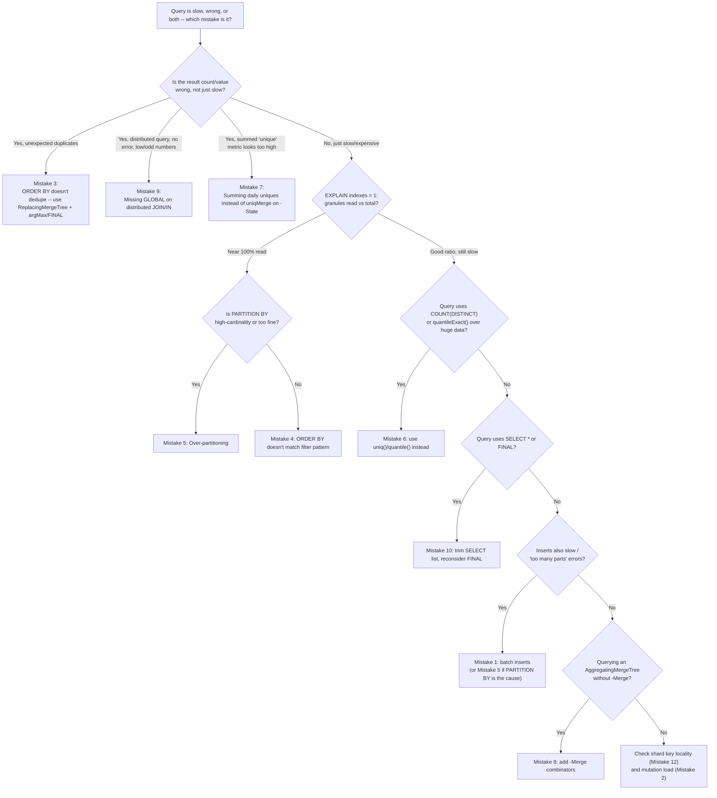

# Common Mistakes & Pitfalls

Chapter 16 gave you the consolidated checklist of what to do. This chapter is the mirror image: a **failure mode catalog** of what actually goes wrong in production ClickHouse deployments, told the way an incident review would tell it — symptom first (what you'd actually see paged for, or notice in a dashboard), then root cause (the architectural reason it happens, tracing back to the internals you learned in Chapters 3, 6, 8, 9, 10, 12, and 15), then the fix (concrete, before/after SQL). None of the mistakes below are exotic edge cases. Every one of them is a mistake a team with real production traffic has made, usually more than once, usually by carrying over a mental model from a row-oriented OLTP database or a different distributed system. If Chapter 16 was "here's the map," this chapter is "here's exactly where people drive off the road, and why the road is shaped that way."

---

## Learning Objectives

By the end of this chapter, you will be able to:

- Diagnose a "too many parts" error back to its root cause in insert batching, and fix the ingestion pattern that caused it.
- Explain why `UPDATE`/`DELETE` in ClickHouse are asynchronous, heavyweight mutations rather than instant operations, and avoid designing application logic that assumes otherwise.
- Recognize when duplicate rows in query results trace back to a misunderstanding of what `ORDER BY`/the primary key actually guarantees.
- Read an `EXPLAIN indexes = 1` granule ratio and connect a bad ratio back to an `ORDER BY` that doesn't match real filter patterns.
- Identify over-partitioning as the cause of a "too many parts" performance collapse, distinct from the small-insert version of the same error.
- Choose `uniq()`/`quantile()` over `COUNT(DISTINCT ...)`/`quantileExact()` at scale, and use `-State`/`-Merge` combinators correctly when aggregating pre-aggregated data.
- Spot a missing `GLOBAL` on a distributed `JOIN`/`IN` and a bad shard key before they produce silently wrong answers or a hot-spotted cluster.
- Recognize and remediate an unauthenticated, internet-exposed ClickHouse instance.

---

## Prerequisites for This Chapter

This chapter assumes you have completed Chapters 1 through 16 — in particular:

- **Chapter 3 (Architecture & Internals)** and **Chapter 7 (Inserting & Querying Data)** — parts, merges, and batch-insert guidance (Mistake 1).
- **Chapter 6 (Primary Keys & Sparse Indexing)** — `ORDER BY`, the sparse index, granules, and partitioning (Mistakes 3, 4, 5).
- **Chapter 8 (Aggregate Functions & Analytics)** — approximate aggregate functions and `-State`/`-Merge` combinators (Mistakes 6, 7).
- **Chapter 9 (Materialized Views & Projections)** — `AggregatingMergeTree` and incremental rollups (Mistake 8).
- **Chapter 10 (Joins & Data Modeling)** and **Chapter 12 (Sharding & Distributed Queries)** — the `Distributed` engine, shard keys, and distributed `JOIN`/`IN` semantics (Mistakes 9, 12).
- **Chapter 15 (Security)** — authentication, users, and network exposure (Mistake 11).
- **Chapter 16 (Best Practices)** — this chapter is the "why" behind every checklist item there.

If any of those feel shaky, this chapter will still make sense, but the fixes will land better if you go back and refresh the relevant chapter first — each mistake below links back to where the underlying mechanism was taught.

---

## 1. "Too Many Parts" From Row-at-a-Time Inserts

**Symptom:** Inserts start failing with errors like `Too many parts (600). Merges are processing significantly slower than inserts`, or insert latency climbs steadily over hours until the application's write path starts timing out. `system.parts` shows thousands of active parts, many holding a handful of rows each.

**Root Cause:** Chapter 3 established that every `INSERT` statement creates at least one new part, regardless of row count. An application that inserts one event per HTTP request, or a naive ETL job that runs `INSERT INTO events VALUES (...)` in a per-row loop, creates one part per row. The background merge process (also Chapter 3) can consolidate parts, but merging has a throughput ceiling — if parts are created faster than merges can absorb them, the part count grows without bound, and ClickHouse's self-protection throttle (`max_parts_in_total` / per-partition part-count limits) starts rejecting inserts outright to avoid a filesystem and query-performance collapse.

**Fix:** Batch inserts into the fewest, largest statements your producer can reasonably buffer for — thousands to tens of thousands of rows per `INSERT` is the common target (Chapter 7).

```sql
-- Before: one INSERT per event, issued a thousand times a second
INSERT INTO events (event_time, user_id, event_type) VALUES (now(), 8831, 'click');
INSERT INTO events (event_time, user_id, event_type) VALUES (now(), 4421, 'view');
-- ... repeated per-request, each call creating its own part

-- After: buffer client-side (or use a Buffer table / async inserts) and flush in bulk
INSERT INTO events (event_time, user_id, event_type) VALUES
    (now(), 8831, 'click'),
    (now(), 4421, 'view'),
    (now(), 9012, 'purchase');
    -- ... thousands of rows per statement
```

If your application architecture genuinely cannot batch client-side (many small independent producers), use `Buffer` tables or ClickHouse's server-side **asynchronous inserts** (`async_insert = 1`, `wait_for_async_insert = 0`), which accumulate many small inserts server-side and flush them as one part on your behalf — covered in depth in Chapter 14. Either way, the fix is the same underlying idea: make ClickHouse's fundamental unit of write work (a part) hold a meaningful number of rows, not one.

---

## 2. Treating ClickHouse Like an OLTP Database (Frequent Single-Row `UPDATE`/`DELETE`)

**Symptom:** An application issues `ALTER TABLE ... UPDATE` or `ALTER TABLE ... DELETE` per user action (a profile edit, a "delete my account" request, a status flip), and the team is baffled that: (a) the change doesn't appear immediately in subsequent reads, (b) `system.mutations` shows a backlog of pending mutations, and (c) overall cluster CPU/I/O climbs and background merges start competing with mutation rewrites, slowing down unrelated queries.

**Root Cause:** Chapter 3 covered this mechanically: MergeTree parts are immutable. There is no in-place row edit. `ALTER ... UPDATE`/`DELETE` is a **mutation** — a background job that rewrites entire affected parts with the changed or filtered rows baked in, then atomically swaps the new parts in. This is proportional to the size of the affected *parts*, not the number of logically changed rows — updating one row in a 50 GB part means rewriting some fraction of that 50 GB. Coming from Postgres or MongoDB, where a single-row `UPDATE` is a near-instant, in-place, transactional operation, teams naturally assume ClickHouse's `UPDATE` behaves the same way. It does not, and treating it that way at OLTP-style frequency (many small mutations per second) will degrade a cluster fast.

**Fix:** Model mutable data with an engine designed for it instead of fighting MergeTree's grain (Chapter 5):

```sql
-- Before: OLTP-style in-place update pattern, run frequently
ALTER TABLE users UPDATE status = 'inactive' WHERE user_id = 8831;
-- run thousands of times a day against a large `users` table
```

```sql
-- After: model as an append-only stream of versions, deduplicated by ReplacingMergeTree
CREATE TABLE users
(
    user_id    UInt64,
    status     LowCardinality(String),
    updated_at DateTime
)
ENGINE = ReplacingMergeTree(updated_at)
ORDER BY user_id;

-- "Update" becomes a cheap, batched INSERT of the new version:
INSERT INTO users VALUES (8831, 'inactive', now());

-- Reads that need the latest version per key use FINAL (sparingly, see Mistake 10)
-- or, better, an aggregating query pattern:
SELECT user_id, argMax(status, updated_at) AS status
FROM users
GROUP BY user_id;
```

For row-level deletes that need to happen often, `CollapsingMergeTree`/`VersionedCollapsingMergeTree` (Chapter 5) or the lightweight-delete feature (`DELETE FROM ... WHERE ...`, which marks rows rather than rewriting immediately) are better fits than routine heavyweight mutations. If your workload is fundamentally OLTP-shaped — frequent point updates, transactional consistency, row-level locking — that is a strong signal the data belongs in Postgres or MongoDB, with ClickHouse consuming a change stream from it for analytics, not serving as the system of record itself.

---

## 3. Assuming `ORDER BY`/the Primary Key Enforces Row Uniqueness

**Symptom:** A dashboard shows a `count()` that's higher than expected, or a report has visibly duplicated rows for what should be a unique entity (one row per `order_id`, one row per `session_id`). The team suspects a bug in the ingestion pipeline, or — worse — ships a workaround that patches over duplicates in application code, query after query, forever.

**Root Cause:** Chapter 6 stated this as the single most important idea in that chapter: `ORDER BY` (and the primary key derived from it) controls **physical sort order**, not uniqueness. Unlike a Postgres `PRIMARY KEY` or a MongoDB `_id`, ClickHouse will silently accept and store any number of rows with an identical key. If an upstream system retries a failed write, or a Kafka consumer replays a batch after a rebalance, or a client double-submits, those duplicate rows land in the table with no rejection, no error, no warning — because there is no uniqueness constraint to violate in the first place.

**Fix:** Two layers of defense, because deduplication in ClickHouse is a design choice, not a default:

```sql
-- Before: assuming a MergeTree with ORDER BY order_id prevents duplicate order_id rows
CREATE TABLE orders
(
    order_id   UInt64,
    status     LowCardinality(String),
    updated_at DateTime
)
ENGINE = MergeTree
ORDER BY order_id;
-- A retried insert produces a second row with the same order_id — both are kept, both are counted
```

```sql
-- After: use ReplacingMergeTree so background merges eventually collapse duplicates by key,
-- AND query with -Merge-aware patterns since merges are eventual, not immediate
CREATE TABLE orders
(
    order_id   UInt64,
    status     LowCardinality(String),
    updated_at DateTime
)
ENGINE = ReplacingMergeTree(updated_at)
ORDER BY order_id;

-- For correctness at query time (don't wait on background merges), use FINAL sparingly and
-- deliberately (see Mistake 10), or explicitly pick the latest version per key:
SELECT order_id, argMax(status, updated_at) AS status
FROM orders
GROUP BY order_id;
```

The deeper lesson: never write a query that implicitly assumes "one row per key" against a plain `MergeTree` table unless you have independently verified, at the ingestion layer, that duplicates truly cannot occur (e.g., an idempotent, exactly-once ingestion pipeline). If duplicates are even remotely possible, either deduplicate explicitly with `ReplacingMergeTree` + `argMax`/`FINAL`, or use `GROUP BY` with a deduplicating aggregate at query time.

---

## 4. `ORDER BY` That Doesn't Match Actual Query Filter Patterns

**Symptom:** A query filters on what looks like an obviously selective column, but `EXPLAIN indexes = 1` shows `Granules: 1490/1520` — nearly every granule read despite "having an index." The table has an `ORDER BY`, so the team's first instinct is to blame hardware, compression, or ClickHouse itself, rather than the schema.

**Root Cause:** Chapter 6 covered this at length: the sparse index can only narrow a search along a **leading prefix** of `ORDER BY`'s columns. A filter on a column that isn't a prefix column — or a filter that only lands on the *third* column of a three-column `ORDER BY` without also constraining the first two — gets essentially no benefit, because rows matching that filter are scattered evenly across the table's physical sort order rather than being clustered together.

**Fix:** Design (or redesign) `ORDER BY` around the dominant, real filter pattern — not around habit carried over from an OLTP primary key, and not around whichever column merely "feels" important.

```sql
-- Before: ORDER BY chosen by OLTP habit (an auto-increment-style ID first)
CREATE TABLE events
(
    id          UInt64,
    event_time  DateTime,
    country     LowCardinality(String),
    event_type  LowCardinality(String)
)
ENGINE = MergeTree
ORDER BY id;

-- Dominant real query pattern:
-- SELECT count() FROM events WHERE country = 'DE' AND event_type = 'purchase' AND event_time > ...
-- This filters on country/event_type/event_time -- none of which is a leading prefix of `id`.
-- EXPLAIN shows nearly every granule scanned: Granules: 1490/1520
```

```sql
-- After: ORDER BY derived from the actual dominant filter shape (Chapter 6, Section 4)
CREATE TABLE events
(
    id          UInt64,
    event_time  DateTime,
    country     LowCardinality(String),
    event_type  LowCardinality(String)
)
ENGINE = MergeTree
ORDER BY (country, event_type, event_time);
-- Same query now narrows to a tight granule range: Granules: 41/1520
```

If two genuinely important, differently-shaped query patterns both need to be fast, don't compromise one `ORDER BY` to serve both poorly — add a projection or a second materialized view with a different physical sort order (Chapter 9), and let ClickHouse pick whichever layout best serves each query.

---

## 5. Over-Partitioning: A High-Cardinality or Too-Fine `PARTITION BY`

**Symptom:** Inserts and queries both degrade over time, `system.parts` shows an enormous number of partitions each holding only a handful of parts, and eventually the same "too many parts" throttling from Mistake 1 kicks in — but this time batching inserts properly doesn't fix it.

**Root Cause:** Chapter 6 flagged this directly: background merges can only combine parts **within the same partition**, never across partitions. Partitioning by a high-cardinality column (`user_id`, a UUID) or too fine a time grain (by minute, or by day on a low-volume table) fragments every insert across many small, separate partitions, each accumulating its own small parts that can never be merged with parts from a different partition. The result is a part-count explosion that batching cannot fix, because the problem isn't insert size — it's that the partition key itself scatters related rows across too many physically separate groups.

**Fix:** Choose a coarse, lifecycle-aligned partition key (typically month, sometimes week for very high-volume tables), and let `ORDER BY` and skip indexes (not `PARTITION BY`) handle fine-grained filtering.

```sql
-- Before: partitioning by user_id (high cardinality) "for faster per-user queries"
CREATE TABLE events (...)
ENGINE = MergeTree
PARTITION BY user_id
ORDER BY (user_id, event_time);
-- Millions of distinct user_id values -> millions of partitions, each with a handful of tiny parts

-- Also common: partitioning by day on a table that only receives a few hundred rows/day
CREATE TABLE audit_log (...)
ENGINE = MergeTree
PARTITION BY toYYYYMMDD(event_date)
ORDER BY event_time;
-- Every day is its own partition holding almost no data -- thousands of near-empty partitions over time
```

```sql
-- After: coarse, lifecycle-aligned partitioning; per-user filtering handled by ORDER BY instead
CREATE TABLE events (...)
ENGINE = MergeTree
PARTITION BY toYYYYMM(event_date)
ORDER BY (user_id, event_time);

CREATE TABLE audit_log (...)
ENGINE = MergeTree
PARTITION BY toYYYYMM(event_date)   -- month, not day, for a low-volume table
ORDER BY event_time;
```

A useful sanity check: a mature partition should typically hold tens of millions to a few hundred million rows, and the partition key should correspond to a real operational unit you'd want to `DROP PARTITION` wholesale (e.g., a retention window), not a column you merely want fast point lookups on.

---

## 6. Exact `COUNT(DISTINCT ...)` / `quantileExact()` Over Huge-Cardinality Data

**Symptom:** A "unique visitors" or "p99 latency" query that used to run fine at moderate scale suddenly runs out of memory (`Memory limit (for query) exceeded`) or takes minutes instead of milliseconds once the underlying table grows into the hundreds of millions or billions of rows.

**Root Cause:** `COUNT(DISTINCT column)` and `quantileExact()` compute their answer **exactly**, which requires holding every distinct value (or every value, for the quantile) in memory simultaneously to determine true uniqueness or true rank order. This is fundamentally an `O(n)`-memory operation in the number of distinct values / total values. Chapter 8 introduced ClickHouse's alternative: probabilistic, sketch-based aggregate functions (`uniq()`, `uniqHLL12()`, `uniqCombined()`, `quantile()`, `quantileTDigest()`) that trade a small, bounded, well-understood error (typically well under 1-2% for `uniq()`) for constant, tiny memory usage and dramatically faster execution — a trade that is almost always the right one for dashboards and monitoring, where "approximately 4,812,003 unique visitors" is exactly as useful as an exact count that takes 40x longer and risks OOM-killing the query.

**Fix:**

```sql
-- Before: exact distinct count and exact quantile over a huge table
SELECT
    count(DISTINCT user_id)              AS unique_visitors,
    quantileExact(0.99)(response_time_ms) AS p99_latency
FROM events
WHERE event_date = today();
-- Memory limit (for query) exceeded, or multi-minute runtime, once event_date = today() is 500M+ rows
```

```sql
-- After: approximate equivalents, from Chapter 8
SELECT
    uniq(user_id)                    AS unique_visitors,       -- ~1-2% error, constant memory
    quantile(0.99)(response_time_ms) AS p99_latency             -- bounded-memory t-digest/reservoir estimate
FROM events
WHERE event_date = today();
```

Reserve `COUNT(DISTINCT ...)`/`quantileExact()` for cases where you have independently verified the cardinality is small (a handful of distinct values, or the query is scoped to a small enough slice that memory truly isn't a concern) and exactness genuinely matters — e.g., a financial reconciliation report, not a real-time dashboard tile.

---

## 7. Summing Pre-Aggregated Daily Unique-Visitor Counts Instead of Using `-State`/`-Merge`

**Symptom:** A "monthly unique visitors" number computed by summing 30 rows of "daily unique visitors" is dramatically higher than the true monthly unique count — sometimes 3-10x higher for a product with returning users — and nobody notices until a stakeholder cross-checks it against a different, correct calculation.

**Root Cause:** This is Chapter 8's core cautionary example, worth restating precisely here. `uniq(user_id)` computed per day and stored as a plain number is **not additive across days** — a user active on both Monday and Tuesday is counted once in Monday's number and once again in Tuesday's number. Summing daily uniques to get a "monthly unique" figure silently double-, triple-, or N-times-counts every returning user, producing a number that isn't an undercount or an overcount in any bounded, predictable way — it's simply the wrong statistic, computed correctly-looking arithmetic on numbers that were never meant to be summed.

**Fix:** Store the aggregate function's **intermediate state** (via the `-State` combinator), not its final numeric output, and combine states across time periods with `-Merge`, which correctly accounts for overlapping users instead of blindly adding counts.

```sql
-- Before: storing and summing final uniq() values per day
CREATE TABLE daily_uniques
(
    day              Date,
    unique_visitors  UInt64
)
ENGINE = MergeTree ORDER BY day;

INSERT INTO daily_uniques
SELECT event_date, uniq(user_id)
FROM events
GROUP BY event_date;

-- "Monthly unique visitors" -- WRONG: double-counts every returning user
SELECT sum(unique_visitors) AS monthly_uniques
FROM daily_uniques
WHERE day >= '2026-06-01' AND day < '2026-07-01';
```

```sql
-- After: store the AggregateFunction state, merge correctly across any time range
CREATE TABLE daily_uniques_state
(
    day                    Date,
    unique_visitors_state  AggregateFunction(uniq, UInt64)
)
ENGINE = AggregatingMergeTree ORDER BY day;

INSERT INTO daily_uniques_state
SELECT event_date, uniqState(user_id)
FROM events
GROUP BY event_date;

-- "Monthly unique visitors" -- CORRECT: merges the underlying sketches, not the numbers
SELECT uniqMerge(unique_visitors_state) AS monthly_uniques
FROM daily_uniques_state
WHERE day >= '2026-06-01' AND day < '2026-07-01';
```

The rule of thumb: **the moment you plan to re-aggregate an aggregate across a coarser time window or a different grouping, store its `-State`, not its final value.** Final aggregate values are a dead end for anything except display at the exact grain they were computed at.

---

## 8. Querying an `AggregatingMergeTree` Table With Plain Aggregate Functions

**Symptom:** A query against an `AggregatingMergeTree` rollup table returns a type error (`Illegal type AggregateFunction(uniq, UInt64) of argument`), or — worse, if a `-Merge` was used somewhere and not elsewhere — returns numbers that look plausible but are subtly wrong because they mixed merged and unmerged partial states.

**Root Cause:** Chapter 9 covered `AggregatingMergeTree` tables as storing columns typed `AggregateFunction(func, T)` — not the final aggregated value, but an intermediate, mergeable state (the same concept as Mistake 7, applied to an incrementally-maintained materialized view rather than a manually-computed daily table). Background merges on an `AggregatingMergeTree` table combine these states for rows sharing the same `ORDER BY` key using the aggregate function's merge logic, not simple arithmetic. A plain `SELECT uniq(...)` or `SELECT sum(...)` against a column that's already an `AggregateFunction` state doesn't do what it looks like it does — it's a type mismatch at best, and a logic error at worst if some other function type-coerces its way through.

**Fix:** Always query `AggregatingMergeTree` state columns with the matching `-Merge` combinator.

```sql
-- Rollup table, maintained incrementally by a materialized view (Chapter 9)
CREATE TABLE hourly_rollup
(
    hour             DateTime,
    country          LowCardinality(String),
    unique_users     AggregateFunction(uniq, UInt64),
    total_events     AggregateFunction(sum, UInt64)
)
ENGINE = AggregatingMergeTree
ORDER BY (hour, country);
```

```sql
-- Before: querying state columns as if they were plain numbers
SELECT country, uniq(unique_users), sum(total_events)   -- type error / nonsensical
FROM hourly_rollup
GROUP BY country;
```

```sql
-- After: -Merge combinators finish the aggregation correctly across the underlying states
SELECT
    country,
    uniqMerge(unique_users)  AS unique_users,
    sumMerge(total_events)   AS total_events
FROM hourly_rollup
GROUP BY country;
```

A good habit: any time a table's `DESCRIBE TABLE` output shows a column typed `AggregateFunction(...)`, treat that as a visual flag that every query touching it needs the corresponding `-Merge` function — never a bare aggregate, never a raw arithmetic operation.

---

## 9. Forgetting `GLOBAL` on a Distributed `JOIN`/`IN`

**Symptom:** A query run against a `Distributed` table with a `JOIN` or `IN (subquery)` returns results that are silently *smaller or different* than expected — missing matches, incomplete counts — with no error at all. The query "works," which is what makes this dangerous: nobody investigates a query that returns a plausible-looking, wrong number.

**Root Cause:** Chapters 10 and 12 covered this: in a sharded cluster, a plain (non-`GLOBAL`) `JOIN` or `IN (subquery)` executed against a `Distributed` table is pushed down and re-executed **independently, per shard**, against whatever local data that shard happens to hold. If the right-hand side of the join (or the subquery in the `IN`) is itself a distributed table, each shard only joins against its own local slice of that table's data — not the full dataset spread across all shards. Rows on Shard A that would have matched a row living on Shard B's local table simply never see each other. There's no error because, from each individual shard's point of view, it correctly executed a perfectly valid local join — it just joined against an incomplete subset of the intended data.

**Fix:** Use `GLOBAL JOIN`/`GLOBAL IN`, which tells ClickHouse to compute the right-hand side **once**, on the initiator node, and broadcast the full result to every shard before the per-shard join runs — trading some network transfer for correctness.

```sql
-- Before: plain JOIN against a Distributed table -- silently wrong on a multi-shard cluster
SELECT e.user_id, e.event_type, u.plan
FROM events_distributed AS e
JOIN users_distributed AS u ON e.user_id = u.user_id;
-- Each shard joins events_distributed's local rows against users_distributed's LOCAL rows only
```

```sql
-- After: GLOBAL JOIN broadcasts the full right-hand side to every shard first
SELECT e.user_id, e.event_type, u.plan
FROM events_distributed AS e
GLOBAL JOIN users_distributed AS u ON e.user_id = u.user_id;

-- Same idea applies to IN with a distributed subquery:
SELECT count()
FROM events_distributed
WHERE user_id GLOBAL IN (SELECT user_id FROM premium_users_distributed);
```

The deeper defense is architectural, not just syntactic: when your shard key already colocates the join keys of two tables (Mistake 12 below), a local, non-`GLOBAL` join can be not just correct but *faster*, because each shard genuinely holds everything it needs locally. `GLOBAL` is the safe default when you haven't deliberately engineered that colocation — treat every distributed `JOIN`/`IN` as needing `GLOBAL` unless you can specifically justify why the data is already colocated by shard key.

---

## 10. Overusing `SELECT *` and `FINAL`

**Symptom:** Queries that should be fast — touching one or two narrow columns logically — run far slower than expected, use far more memory, and show high I/O in `system.query_log`, even though the table's `ORDER BY` and partitioning look well-designed.

**Root Cause:** Two separate but frequently co-occurring habits, both of which quietly cancel out ClickHouse's core architectural advantages:

- **`SELECT *`** forces ClickHouse to read, decompress, and process *every* column's data for every row touched, not just the ones the query logically needs — directly defeating the column-skipping benefit that Chapter 3 identified as the single biggest reason columnar storage is fast. A `url` or JSON `payload` column sitting unused in a `SELECT *` can dominate a query's I/O even when it contributes nothing to the actual output.
- **`FINAL`** forces ClickHouse to perform the equivalent of an on-the-fly merge across all parts at query time, deduplicating or collapsing rows according to the table's engine logic (`ReplacingMergeTree`, `CollapsingMergeTree`), before returning results. This is correct but expensive — it defeats the "let background merges do this work asynchronously and cheaply" model and instead pays that cost synchronously, in the query's own latency budget, every single time the query runs.

**Fix:** Select only the columns a query actually needs, and reserve `FINAL` for cases where correctness genuinely requires it and the table/partition being queried is small, or an equivalent `argMax`/`GROUP BY` pattern isn't practical.

```sql
-- Before: habitual SELECT * and routine FINAL on every read
SELECT * FROM orders FINAL WHERE customer_id = 8831;
```

```sql
-- After: select only needed columns; avoid FINAL where an aggregation achieves the same correctness
SELECT order_id, status, updated_at
FROM orders
WHERE customer_id = 8831;

-- If deduplication is required, prefer an explicit aggregation over FINAL where it's feasible:
SELECT order_id, argMax(status, updated_at) AS status
FROM orders
WHERE customer_id = 8831
GROUP BY order_id;
```

`FINAL` is not wrong to use — sometimes it's genuinely the simplest correct tool, especially on a small, well-partitioned lookup — but it should be a deliberate choice made after considering the `argMax`/`GROUP BY` alternative, not a reflexive habit applied to every query against a `ReplacingMergeTree` table.



---

## 11. Exposing an Unauthenticated ClickHouse Instance to the Public Internet

**Symptom:** A security scan, a surprise cloud bill from cryptomining, or — in the worst case — a public data leak discovery reveals that a ClickHouse instance has been reachable from the open internet with the `default` user and no password, sometimes for months.

**Root Cause:** ClickHouse ships, by default in many quick-start/Docker configurations, with a `default` user that has no password and broad privileges, and with its HTTP (8123) and native (9000) ports bound to `0.0.0.0`. Teams that spin up ClickHouse for a quick prototype — on a cloud VM, in a Docker container with ports mapped outward — routinely forget to lock this down before the same instance quietly becomes "the real one," especially when infrastructure-as-code templates get copy-pasted forward without a security review. Chapter 15 covered the specific mechanisms; this is the failure mode of skipping them.

**Fix:** Require authentication for every user (including `default`), bind listener interfaces deliberately, and put ClickHouse behind a firewall/VPC boundary rather than relying on the database layer as the only line of defense.

```xml
<!-- Before: default user, no password, wide open (users.xml / config.xml) -->
<users>
    <default>
        <password></password>
        <networks>
            <ip>::/0</ip>
        </networks>
    </default>
</users>
```

```xml
<!-- After: password (or better, no password auth at all -- use LDAP/Kerberos/mTLS),
     restricted networks, and a dedicated least-privilege application user -->
<users>
    <default>
        <password_sha256_hex>DISABLED_OR_ROTATED_STRONG_HASH</password_sha256_hex>
        <networks>
            <ip>127.0.0.1</ip>
        </networks>
    </default>
    <analytics_app>
        <password_sha256_hex>...</password_sha256_hex>
        <networks>
            <ip>10.0.0.0/8</ip>
        </networks>
        <profile>readonly_analytics</profile>
        <quota>default</quota>
    </analytics_app>
</users>
```

Pair this with network-level controls (security groups, VPC-only binding, a reverse proxy or load balancer that terminates TLS and enforces IP allowlisting) — defense in depth, not a single password, per Chapter 15's RBAC and network security guidance. Treat "can this instance be reached from the public internet at all" as a question to answer explicitly and deliberately for every deployment, never as an accidental default left over from a quick-start guide.

---

## 12. Choosing a Shard Key Like `rand()` When Data Locality Would Have Helped

**Symptom:** Every query against a sharded `Distributed` table involves heavy cross-shard network traffic, `GLOBAL JOIN`s are unavoidably expensive because matching rows are scattered evenly across every shard, and per-user or per-tenant queries (a common access pattern) fan out to *every* shard even though only one shard's worth of data is logically relevant.

**Root Cause:** Chapter 12 covered shard key selection as a genuine design decision, and `rand()` (or `sipHash64(rand())`) is a tempting default because it guarantees a perfectly even distribution of rows across shards — no hot shards, no imbalance. But even distribution is not the only goal, and for many workloads it isn't even the most important one. If queries and joins are dominated by a natural key — `user_id`, `tenant_id`, `customer_id` — sharding by `rand()` guarantees that related rows for the *same* entity are scattered across every shard, which means a query or join scoped to one entity's data must still fan out to the entire cluster and gather partial results from everywhere, and joins against a same-keyed table can never be safely done as a fast local join (forcing `GLOBAL`, Mistake 9, on every single one).

**Fix:** Shard by the column your dominant queries and joins actually key on, accepting some risk of skew, rather than defaulting to `rand()` for its balance guarantee alone.

```sql
-- Before: sharded by rand() -- perfectly balanced, but destroys locality for per-tenant queries
CREATE TABLE events_distributed AS events
ENGINE = Distributed(my_cluster, default, events, rand());

-- A per-tenant query must fan out to every shard even though logically it's about one tenant:
SELECT count() FROM events_distributed WHERE tenant_id = 42;
```

```sql
-- After: shard by tenant_id (or sipHash64(tenant_id) for better balance while preserving locality)
CREATE TABLE events_distributed AS events
ENGINE = Distributed(my_cluster, default, events, sipHash64(tenant_id));

-- Now this query, and any JOIN keyed on tenant_id, can be routed to (or executed within) the
-- one shard that owns tenant_id = 42's data, without fanning out to the whole cluster.
SELECT count() FROM events_distributed WHERE tenant_id = 42;

-- A same-keyed JOIN can now safely be a local (non-GLOBAL) join for this access pattern,
-- since both tables are colocated by tenant_id on every shard:
SELECT e.tenant_id, count()
FROM events_distributed AS e
JOIN tenant_metadata_distributed AS m ON e.tenant_id = m.tenant_id
GROUP BY e.tenant_id;
```

The trade-off is real and worth stating honestly: hashing by a business key like `tenant_id` risks skew if a small number of tenants are dramatically larger than the rest (a "hot shard" problem), whereas `rand()` never has that problem. Chapter 12's guidance applies here: know your data's actual distribution before choosing, and consider a hybrid (hash a business key, but monitor and rebalance/split hot shards manually) rather than reaching for `rand()` purely to sidestep the analysis.

---

## Real-World Scenario

**Setup:** A mid-sized ad-tech company runs a three-shard, two-replica-per-shard ClickHouse cluster serving a real-time "campaign performance" dashboard. One Monday morning, the dashboard shows unique-reach numbers roughly **40% higher** than a reconciliation report pulled from the raw event log, and a related "cross-campaign overlap" query — which joins impressions against a `Distributed` clicks table — is returning numbers that don't match manual spot checks either. Three mistakes from this chapter are compounding.

**Mistake A — bad `ORDER BY` masking the real problem for weeks.** The `impressions` table is `ORDER BY (impression_id, event_time)` — a holdover from an early schema where `impression_id` felt like "the primary key, so it goes first," copied from the team's Postgres habits. The dashboard's dominant query filters on `campaign_id` and a date range, neither of which is a leading prefix of `ORDER BY`. `EXPLAIN indexes = 1` on the dashboard's query shows `Granules: 38,200/38,600` — essentially the entire table scanned on every refresh. This alone was making the dashboard slow, but slow queries get blamed on "ClickHouse needs more hardware" long before anyone re-examines the schema — so it had persisted, unfixed, for months, as background noise rather than a diagnosed problem.

**Mistake B — daily uniques summed instead of merged.** To make the slow dashboard query faster, an engineer had precomputed a `daily_campaign_reach` table: one row per `(campaign_id, day)` with a plain `UInt64` `unique_users` column populated by `uniq(user_id)`. The "monthly reach" tile on the dashboard summed `unique_users` across the month's rows — silently double-, triple-, and N-counting every user who saw a given campaign's ads on more than one day within the month, which for a well-targeted retargeting campaign is the *majority* of reached users. This single mistake accounts for most of the 40% inflation once measured directly.

**Mistake C — missing `GLOBAL` on the cross-campaign overlap join.** The overlap query joined `impressions_distributed` against `clicks_distributed` on `user_id`, with no `GLOBAL` keyword. Since neither table was sharded by `user_id` (both were sharded by `rand()` — the cluster's default), each shard's join only ever matched impressions and clicks that happened to land on the *same* shard by chance, silently undercounting true overlap by roughly two-thirds on a three-shard cluster (each shard was, in effect, only ever joining against a random third of the other table's users). No error was raised — the query "worked" and returned a plausible, wrong number, which is exactly why it went unnoticed until someone cross-checked it against a single-node, non-distributed reproduction.

**Diagnosis process:**

1. The on-call engineer started, correctly, with the retrieval-adjacent question for analytics systems: "is this a computation problem or a data problem?" They ran the reconciliation report's underlying raw-event query directly against `impressions` with `EXPLAIN indexes = 1` first, since the dashboard was known to be slow — and found the near-100%-granule-scan ratio, immediately pointing at Mistake A.
2. Fixing `ORDER BY` to `(campaign_id, event_time)` (via a `CREATE TABLE ... AS ... ORDER BY` rebuild, since `ORDER BY` cannot be altered in place) made the dashboard fast, but the reach number was still wrong — proving the slowness and the correctness bug were two separate, coincidentally co-located problems, not one.
3. Inspecting `daily_campaign_reach`'s schema immediately surfaced Mistake B: a plain `UInt64` column being summed across days. The team rebuilt it as an `AggregatingMergeTree` storing `uniqState(user_id)`, with the dashboard's monthly tile switched to `uniqMerge(...)`.
4. The overlap query was reproduced against a single-node copy of the same data — where it returned the correct, higher overlap number, immediately isolating the discrepancy to something specific to the distributed execution path, which led straight to the missing `GLOBAL` (Mistake C, Chapters 10/12's exact warning). Adding `GLOBAL JOIN` fixed the number immediately, at the cost of extra network transfer that was easily within the cluster's headroom.
5. As a longer-term fix, the team also revisited the shard key (Mistake 12): since `user_id`-keyed joins were common, they migrated to `sipHash64(user_id)` sharding, which both removed the need for `GLOBAL` on the most common join pattern going forward and made per-user lookups shard-local instead of cluster-wide fan-outs.

**Outcome:** All three fixes were independently necessary and none would have fully resolved the dashboard's problems alone — the `ORDER BY` fix addressed latency, the `-State`/`-Merge` fix addressed the inflated reach number, and the `GLOBAL` fix addressed the overlap undercount. The postmortem's lasting change was procedural: schema changes and new rollup tables now go through a short checklist drawn directly from this chapter before shipping — verify `EXPLAIN` granule ratios, verify any pre-aggregated "unique" column uses `-State`, and verify every distributed `JOIN`/`IN` explicitly justifies its `GLOBAL`/local choice.

---

## Best Practices

- **Batch inserts and let merges do their job.** Never insert row-at-a-time in a hot path; buffer or use async inserts, and don't fight the background merge process with routine `OPTIMIZE ... FINAL`.
- **Never assume uniqueness from `ORDER BY` alone.** If duplicates are even remotely possible, use `ReplacingMergeTree` with explicit `argMax`/`FINAL` at read time, or deduplicate at the ingestion layer.
- **Design `ORDER BY` from real query filter patterns, verified with `EXPLAIN indexes = 1`** — not from OLTP habit, and not from guesswork. A granule ratio near 100% is always worth investigating before blaming hardware.
- **Keep `PARTITION BY` coarse and lifecycle-aligned.** If you can't articulate what operational unit a partition boundary represents (a retention window, a reporting month), it's probably the wrong partition key.
- **Reach for `uniq()`/`quantile()` by default; reserve exact functions for genuinely small or genuinely exactness-critical cases.** Approximate functions are the right default for analytics at scale, not a fallback for when exact ones fail.
- **Any time you store a pre-aggregated metric you'll later re-aggregate, store its `-State`, not its final value** — and query `AggregatingMergeTree` state columns exclusively with `-Merge` functions.
- **Default to `GLOBAL` on distributed `JOIN`/`IN` unless you've deliberately engineered shard-key colocation** — a silently wrong answer is worse than a slower, correct one.
- **Choose shard keys around real join/filter locality, not just even distribution** — `rand()` is a starting point for "no hot shards," not a substitute for understanding your access patterns.
- **Treat network exposure and authentication as a deliberate, reviewed decision for every environment**, prototype included — "just for now" internet-facing databases are how breaches start.

---

## Common Mistakes

- **Too many parts** from row-at-a-time or overly frequent small inserts, overwhelming the background merge process (Mistake 1).
- **Treating `UPDATE`/`DELETE` as instant** instead of the asynchronous, heavyweight, whole-part-rewriting mutations they actually are (Mistake 2).
- **Assuming `ORDER BY`/the primary key enforces uniqueness**, leading to unnoticed duplicate rows (Mistake 3).
- **Choosing an `ORDER BY` that doesn't match real filter patterns**, causing near-full granule scans despite "having an index" (Mistake 4).
- **Over-partitioning** by high-cardinality columns or too fine a time grain, fragmenting merges and collapsing performance (Mistake 5).
- **Using exact `COUNT(DISTINCT ...)`/`quantileExact()`** over huge-cardinality data instead of `uniq()`/`quantile()`, risking OOM or slow queries (Mistake 6).
- **Summing pre-aggregated daily unique counts** instead of using `-State`/`-Merge`, silently over-counting returning entities (Mistake 7).
- **Querying `AggregatingMergeTree` state columns with plain aggregate functions** instead of `-Merge` combinators (Mistake 8).
- **Forgetting `GLOBAL` on a distributed `JOIN`/`IN`**, producing silently incomplete or wrong results with no error (Mistake 9).
- **Overusing `SELECT *` and `FINAL`**, defeating column skipping and merge-avoidance — the two core columnar/MergeTree performance wins (Mistake 10).
- **Exposing an unauthenticated ClickHouse instance to the public internet**, a pure security failure with no query-correctness upside (Mistake 11).
- **Choosing a shard key like `rand()` when data locality would have made queries and joins dramatically cheaper** (Mistake 12).

---

## Summary

- Most ClickHouse production incidents trace back to carrying over a row-store or general-distributed-systems mental model into a place where ClickHouse's actual architecture (immutable parts, sparse indexing, sketch-based aggregation, per-shard execution) behaves differently — often silently, without an error.
- Ingestion-shaped mistakes (row-at-a-time inserts, over-partitioning) and mutation-shaped mistakes (treating `UPDATE`/`DELETE` as instant) both stem from the same root cause: MergeTree's immutable-part design, covered mechanically in Chapter 3.
- Correctness-shaped mistakes (assuming `ORDER BY` dedupes, summing daily uniques, querying `AggregatingMergeTree` without `-Merge`, missing `GLOBAL`) are the most dangerous class, because they produce **plausible, silently wrong answers** rather than errors — always the hardest kind of bug to catch.
- Performance-shaped mistakes (bad `ORDER BY`, `SELECT *`, routine `FINAL`, exact aggregates at scale) don't corrupt results, but they quietly cancel out the specific architectural wins — column skipping, sparse indexing, approximate aggregation — that are ClickHouse's entire reason for existing.
- A security-shaped mistake (unauthenticated public exposure) has nothing to do with ClickHouse's internals and everything to do with deployment discipline — it's included here because it remains one of the most common real-world ClickHouse incidents.
- `EXPLAIN indexes = 1`, `system.parts`, and `system.mutations` are your primary diagnostic tools for distinguishing which of these mistakes you're looking at — always check ground truth before guessing.

---

## Knowledge Check

1. A team's inserts start failing with a "too many parts" error, but they insist they're inserting "normal" volumes of data. What two distinct root causes from this chapter could produce this identical symptom, and how would you tell them apart?
2. A colleague runs `ALTER TABLE events DELETE WHERE event_type = 'test'` and then immediately queries `count()` expecting the deleted rows to be gone. They aren't gone yet. What's happening, and is this a bug?
3. A `GROUP BY order_id` query returns more rows than there are actual orders, on a table that has an `ORDER BY order_id`. What's the most likely explanation, and what engine/query change would fix it going forward?
4. A dashboard's "monthly active users" metric, computed by summing 30 rows of a stored "daily active users" column, is suspiciously high. What's wrong, and what would you change about how the daily numbers are stored?
5. A distributed `JOIN` against two `Distributed` tables runs without error but returns fewer matched rows than a single-node reproduction of the same logical join. What's the most likely single-word fix, and why does the query not simply error out instead?
6. You inherit a sharded cluster where the shard key is `rand()`. Every per-tenant query fans out to all shards, and every tenant-keyed join needs `GLOBAL`. What would you investigate before deciding whether to re-shard, and what's the risk of the alternative you'd be moving to?

---

## Hands-On Exercise

Reproduce Mistake 7 (summing pre-aggregated daily uniques) locally in `clickhouse-client`, observe the double-counting, then apply the `-State`/`-Merge` fix and confirm it's resolved.

1. **Create a raw events table and generate synthetic data with realistic overlap** — deliberately make many users active on multiple days, so the double-counting effect is visible:

   ```sql
   CREATE TABLE demo_events
   (
       event_date Date,
       user_id    UInt64
   )
   ENGINE = MergeTree
   ORDER BY event_date;

   -- 10,000 distinct users, each active on roughly 5 of 7 days -> heavy day-to-day overlap
   INSERT INTO demo_events
   SELECT
       toDate('2026-06-01') + toIntervalDay(number % 7) AS event_date,
       intHash64(number) % 10000                        AS user_id
   FROM numbers(200000);
   ```

2. **Confirm the true weekly unique count directly against raw data** (the ground truth to compare against):

   ```sql
   SELECT uniq(user_id) AS true_weekly_uniques
   FROM demo_events
   WHERE event_date >= '2026-06-01' AND event_date < '2026-06-08';
   ```

3. **Reproduce the mistake: store daily uniques as plain numbers, then sum them:**

   ```sql
   CREATE TABLE daily_uniques_wrong
   (
       day             Date,
       unique_visitors UInt64
   )
   ENGINE = MergeTree ORDER BY day;

   INSERT INTO daily_uniques_wrong
   SELECT event_date, uniq(user_id)
   FROM demo_events
   GROUP BY event_date;

   SELECT sum(unique_visitors) AS naive_weekly_uniques
   FROM daily_uniques_wrong
   WHERE day >= '2026-06-01' AND day < '2026-06-08';
   ```

   Compare `naive_weekly_uniques` to `true_weekly_uniques` from step 2 — the naive sum should be visibly higher (roughly 5x the true count, given ~5 active days per user), a direct, observable reproduction of the bug.

4. **Apply the fix: store `-State`, merge with `-Merge`:**

   ```sql
   CREATE TABLE daily_uniques_state
   (
       day                   Date,
       unique_visitors_state AggregateFunction(uniq, UInt64)
   )
   ENGINE = AggregatingMergeTree ORDER BY day;

   INSERT INTO daily_uniques_state
   SELECT event_date, uniqState(user_id)
   FROM demo_events
   GROUP BY event_date;

   SELECT uniqMerge(unique_visitors_state) AS correct_weekly_uniques
   FROM daily_uniques_state
   WHERE day >= '2026-06-01' AND day < '2026-06-08';
   ```

5. **Confirm the fix:** `correct_weekly_uniques` should closely match `true_weekly_uniques` from step 2 (within `uniq()`'s normal small approximation error), while `naive_weekly_uniques` remains far off. Optionally, try `quantile()`/`uniqExact()` at each stage too, to build intuition for the trade-offs from Mistake 6 on the same dataset.

---

## Further Reading

- [ClickHouse Docs — Approximate Aggregate Functions (`uniq`, `quantile`)](https://clickhouse.com/docs/sql-reference/aggregate-functions/reference/uniq) — the reference for the approximate functions used in Mistakes 6 and 7.
- [ClickHouse Docs — Combinator Functions (`-State`, `-Merge`, `-If`)](https://clickhouse.com/docs/sql-reference/aggregate-functions/combinators) — full mechanics behind Mistakes 7 and 8.
- [ClickHouse Docs — Distributed Table Engine](https://clickhouse.com/docs/engines/table-engines/special/distributed) — sharding, `GLOBAL IN`/`GLOBAL JOIN` semantics behind Mistakes 9 and 12.
- [ClickHouse Docs — Mutations](https://clickhouse.com/docs/sql-reference/statements/alter#mutations) — the mechanics behind Mistake 2.
- [ClickHouse Docs — User Settings & Access Control](https://clickhouse.com/docs/operations/access-rights) — authentication and network restriction guidance behind Mistake 11.

---

<div style="display:flex;justify-content:space-between;align-items:center;">
  <a href="./16-best-practices.md">← Previous: Best Practices</a>
  <a href="./00-index.md">🏠 Index</a>
  <a href="./18-tools-and-ecosystem.md">Next: Tools & Ecosystem →</a>
</div>
