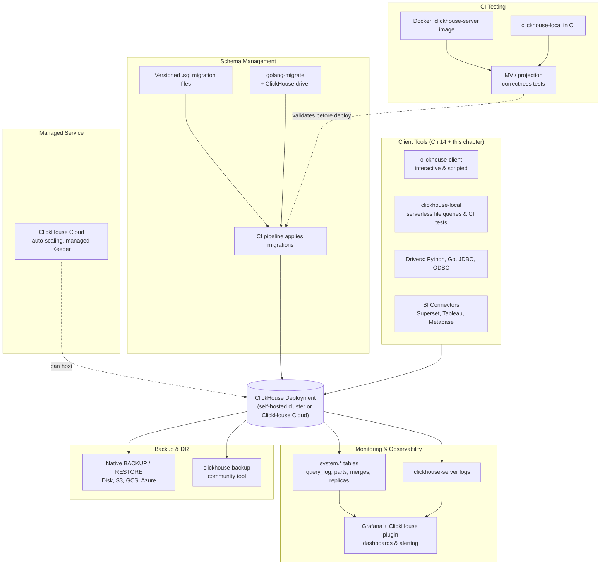

# Tools & Ecosystem

Chapter 14 covered the technical mechanics of getting data *into* ClickHouse: the Kafka engine, file formats, client libraries, and the query-level details of BI tool integration. That chapter answered "how do I move bytes into and out of ClickHouse correctly?" This chapter answers a different question: once ClickHouse is running in production, what does the rest of your day-to-day toolbox look like? Having mastered the concepts, internals, and ingestion pipelines from the previous seventeen chapters, it's time to zoom out and survey the operational and ecosystem tooling an engineer should know exists — the CLI habits, the managed-service option, the dashboards, the backup story, the migration discipline, and the testing patterns that surround a real deployment. This is deliberately a tour rather than a deep dive: the goal is that you know a tool exists, roughly what it's for, and where to look when you need it, not that you memorize every flag.

---

## Learning Objectives

By the end of this chapter, you will be able to:

- Use `clickhouse-client` non-interactively in shell scripts and cron jobs, choosing the right output format (`Pretty`, `JSONEachRow`, `Vertical`) for the task at hand.
- Explain what ClickHouse Cloud abstracts away operationally compared to self-hosting the replication and sharding topologies from Chapters 11–12.
- Describe how to monitor a ClickHouse deployment using `system.*` tables, server logs, and the official Grafana plugin, and name a concrete, useful dashboard panel.
- Compare the built-in `BACKUP`/`RESTORE` commands against the third-party `clickhouse-backup` tool and choose between them.
- Explain why ClickHouse has no built-in schema migration framework and describe at least one disciplined community pattern for managing schema changes across environments.
- Design a lightweight CI testing strategy for a ClickHouse-backed application, including realistic data volumes and materialized view correctness checks.
- Draw a mental map of the full ecosystem surrounding a production ClickHouse deployment.

---

## Prerequisites for This Chapter

This chapter assumes you've completed Chapters 1–17, in particular:

- **Chapter 9** (Materialized Views & Projections) — the "trigger on insert, doesn't backfill, doesn't react to `UPDATE`/`DELETE`" gotchas that make MV correctness testing non-optional.
- **Chapter 11–12** (Replication & Sharding) — what self-managed Keeper, replicas, and shards actually involve operationally, since ClickHouse Cloud's value proposition is precisely *not* having to do that yourself.
- **Chapter 13** (Performance Tuning) and **Chapter 16** (Best Practices) — the `system.*` tables (`system.query_log`, `system.parts`, `system.merges`, `system.replication_queue`) that this chapter's monitoring section builds directly on top of.
- **Chapter 14** (Data Ingestion & Integrations) — `clickhouse-client`, drivers, the Kafka engine, and BI connectors at a technical level. This chapter does not re-explain how those work; it places them on a map alongside the tools you haven't met yet.
- **Chapter 17** (Common Mistakes & Pitfalls) — several of that chapter's failure modes (no backup strategy, schema drift, un-tested MVs) are exactly what this chapter's tooling exists to prevent.

If any of those feel shaky, a quick pass back through the relevant chapter will make this one land better — this chapter is intentionally broad rather than deep, and leans on you already trusting the underlying concepts.

---

## 1. `clickhouse-client` for Scripting and Administration

Chapter 14 introduced `clickhouse-client` as a way to load data. In daily operations, it's just as often used as a lightweight administrative and scripting tool — the Swiss Army knife you reach for before writing a whole application.

### 1.1 Interactive vs. non-interactive use

Run without arguments, `clickhouse-client` drops you into an interactive REPL — the mode you've used throughout this course to explore data and run ad hoc `SELECT`s. That's the right mode for exploration, but it's the wrong mode for automation: anything that runs unattended (a cron job, a CI step, a deploy hook) needs **non-interactive, scripted** invocation.

The `--query` (or `-q`) flag runs a single statement and exits, making `clickhouse-client` trivially composable with the rest of the Unix toolchain:

```bash
clickhouse-client --host clickhouse.internal --user monitoring --password "$CH_PASSWORD" \
  --query="SELECT count() FROM events WHERE event_date = today()"
```

You can also pipe a `.sql` file in via stdin, which is the pattern most CI and migration scripts use:

```bash
clickhouse-client --host clickhouse.internal --multiquery < migrations/0007_add_referrer_column.sql
```

`--multiquery` (the default in recent versions when reading from a file or stdin) allows multiple semicolon-separated statements in one invocation — essential for migration files that run several `ALTER TABLE` statements in sequence.

### 1.2 Output formats for different consumers

ClickHouse supports dozens of input/output formats, but three cover the overwhelming majority of operational use:

| Format | Best for | Example use |
|---|---|---|
| `Pretty` (default in an interactive terminal) | Humans reading a small result set | Eyeballing a query result while debugging |
| `Vertical` | Humans reading a **wide** row (many columns) | Inspecting one row of `system.query_log`, which has 60+ columns — `Pretty`'s horizontal table becomes unreadable |
| `JSONEachRow` | Machines — piping into `jq`, another service, or a log aggregator | A cron job that queries a metric and forwards it as newline-delimited JSON |
| `TSV` / `CSV` | Spreadsheets, quick exports, `LOAD DATA`-style loads into other systems | Exporting a table for a one-off analysis in Excel |

```bash
# Human-friendly, wide row inspection
clickhouse-client --query="SELECT * FROM system.query_log ORDER BY event_time DESC LIMIT 1 FORMAT Vertical"

# Machine-friendly, for piping into jq or another service
clickhouse-client --query="SELECT event_type, count() AS c FROM events GROUP BY event_type FORMAT JSONEachRow" | jq .

# Explicit Pretty formatting even when output isn't a terminal (e.g. redirected to a log file for a human to read later)
clickhouse-client --query="SELECT * FROM events LIMIT 5" --format Pretty > sample.log
```

Getting into the habit of *choosing* a format rather than accepting whatever the default happens to be is a small thing that pays off constantly — a script that silently assumed `Pretty` output was machine-parseable is a classic source of brittle cron jobs.

### 1.3 Shell scripts and cron jobs for admin tasks

Because `clickhouse-client --query` behaves like any other CLI tool with clean exit codes and stdout/stderr, it slots naturally into shell scripts for recurring administrative tasks:

```bash
#!/usr/bin/env bash
# nightly-partition-check.sh — alert if any table has an unexpectedly large number of parts
set -euo pipefail

RESULT=$(clickhouse-client --query="
  SELECT table, count() AS part_count
  FROM system.parts
  WHERE active AND database = 'analytics'
  GROUP BY table
  HAVING part_count > 300
  FORMAT JSONEachRow
")

if [[ -n "$RESULT" ]]; then
  echo "$RESULT" | mail -s "ClickHouse: high part count detected" oncall@example.com
fi
```

Common patterns you'll see in real operations teams: a cron job that runs `OPTIMIZE TABLE ... FINAL` off-peak on small dimension tables, a script that snapshots `system.query_log` aggregates into a long-term metrics table nightly (since `query_log` itself has a TTL), and health-check scripts that `clickhouse-client --query="SELECT 1"` against every node as a liveness probe. None of this is exotic — it's the same "boring shell script plus cron" discipline you'd apply to any database, and it's worth having in your toolbox rather than reaching for a heavier orchestration tool for simple recurring checks.

---

## 2. ClickHouse Cloud: The Managed Service

Chapters 11 and 12 walked through self-managed replication (ClickHouse Keeper, `ReplicatedMergeTree`) and sharding (the `Distributed` engine, shard key selection, distributed DDL) in detail — because understanding those mechanics is essential even if you never touch a self-hosted cluster yourself. **ClickHouse Cloud** is the company's own managed service, and its core value proposition is making almost all of that operational machinery disappear from your day-to-day concerns.

### 2.1 What it is

ClickHouse Cloud is a fully managed, multi-cloud (AWS, GCP, Azure) offering where you get a ClickHouse endpoint without provisioning servers, installing the binary, or configuring Keeper yourself. It includes a generous **free trial** tier, making it a reasonable way to experiment with a production-shaped environment without standing up your own infrastructure first.

### 2.2 What it abstracts away

This is the operationally important part, and it maps directly back to what you learned was *hard* in Chapters 11–12:

| Self-hosted (Ch 11–12) | ClickHouse Cloud |
|---|---|
| You install and operate ClickHouse Keeper (or ZooKeeper) yourself for replica coordination | Keeper is fully managed; you never see it |
| You manually define replicas and `ReplicatedMergeTree` topology per table | Replication is handled transparently by the service |
| You choose a shard key and configure the `Distributed` engine and cluster XML | Cloud's storage/compute separation means most workloads don't need manual sharding decisions the same way — compute scales independently of storage |
| You provision fixed-size nodes and manually add capacity ahead of load | **Automatic scaling**: compute resources scale up and down based on load, and you're billed closer to actual usage |
| You run your own monitoring stack against `system.*` tables and OS-level metrics | Built-in monitoring dashboards are provided out of the box, though you can still query `system.*` tables directly |
| You handle upgrades, patching, and node replacement | Handled by the service |

The underlying query engine, SQL dialect, table engines, and `system.*` introspection tables are the **same ClickHouse** you've learned throughout this course — Cloud doesn't change the mental model from Chapters 1–10, it changes who's on call for the infrastructure underneath it.

### 2.3 When self-hosting still makes sense

Cloud isn't a strict upgrade for every situation. Teams with strict data-residency requirements that Cloud's regions don't cover, extremely cost-sensitive workloads at massive steady-state scale where dedicated hardware amortizes better, or organizations with existing Kubernetes/infrastructure investment and in-house ClickHouse expertise may reasonably choose to self-host. The honest framing: Cloud trades operational control and some cost-at-scale for a large reduction in operational burden — know which side of that trade your team is actually on before choosing.

---

## 3. Monitoring and Observability

Chapters 13 and 16 already introduced the `system.*` tables as ClickHouse's built-in observability foundation — this section recaps that foundation briefly and then focuses on how to make it *visible* over time, which raw SQL queries don't do well on their own.

### 3.1 The foundation: `system.*` tables and server logs

As a quick recap, the tables you'll query most for operational health are:

- **`system.query_log`** — every query executed, with duration, memory usage, rows read, and the user/client that ran it. The single richest source for "what is slow and who's running it."
- **`system.parts`** — the current state of every data part per table, used to catch part-count blowups (too many small parts, a classic precursor to slow inserts and merge pressure).
- **`system.merges`** — merges currently in progress; a good place to check when write throughput unexpectedly drops.
- **`system.replication_queue`** and **`system.replicas`** — replication lag and pending replication tasks, essential for catching a lagging or broken replica before an application reads stale data from it.

Alongside these SQL-queryable tables, **`clickhouse-server` logs** (typically at `/var/log/clickhouse-server/clickhouse-server.log` and `clickhouse-server.err.log`) capture startup issues, crash traces, and detailed per-query execution logs at higher log levels — the place to look when a `system.*` table query doesn't explain an anomaly (e.g., a node that won't start, or an out-of-memory kill that happened before it could even be logged to `query_log`).

### 3.2 From tables to dashboards: the Grafana plugin

Querying `system.query_log` by hand is fine for a one-off investigation, but nobody wants to run ad hoc SQL to answer "is the cluster healthy right now?" or "was there a spike in slow queries three hours ago?" That's exactly the gap the **official ClickHouse data source plugin for Grafana** fills: it lets Grafana query ClickHouse directly (including the `system.*` tables) and render the results as time-series dashboards, so cluster health becomes something you glance at rather than something you interrogate from scratch each time.

ClickHouse publishes official Grafana dashboards (and the community maintains several more) covering:

- **Cluster health** — node up/down status, CPU/memory/disk usage per node.
- **Query performance** — queries per second, query duration percentiles, and error rates over time.
- **Merge activity** — number of active merges, merge duration, and parts-per-table trends (catching the "too many parts" problem before it becomes a production incident).
- **Replication lag** — how far behind each replica is, sourced from `system.replicas`.

**A concrete example panel** — queries per second and p99 query latency, both derived from `system.query_log`:

```sql
-- Queries per second (as a Grafana time-series panel, bucketed by time)
SELECT
    toStartOfMinute(event_time) AS minute,
    count() AS qps
FROM system.query_log
WHERE type = 'QueryFinish'
  AND event_time >= now() - INTERVAL 1 HOUR
GROUP BY minute
ORDER BY minute

-- p99 query latency over the same window
SELECT
    toStartOfMinute(event_time) AS minute,
    quantile(0.99)(query_duration_ms) AS p99_latency_ms
FROM system.query_log
WHERE type = 'QueryFinish'
  AND event_time >= now() - INTERVAL 1 HOUR
GROUP BY minute
ORDER BY minute
```

Wired into a Grafana panel refreshing every 30–60 seconds, this single pair of queries turns "is something wrong with query performance right now?" from a manual investigation into a glance at a graph — precisely the kind of dashboard you want built and trusted *before* an incident, not improvised during one (see Best Practices below).

---

## 4. Backup and Disaster Recovery Tooling

Chapter 16 and 17 both touched on the *importance* of backups; this section covers the actual tooling.

### 4.1 Built-in `BACKUP` / `RESTORE`

ClickHouse has native `BACKUP` and `RESTORE` SQL commands, making backup a first-class SQL operation rather than something you bolt on externally. Backups can target local disk, or object storage such as S3, GCS, or Azure Blob:

```sql
-- Back up a single table to local disk
BACKUP TABLE events TO Disk('backups', 'events_2026_07_06.zip');

-- Back up an entire database to S3
BACKUP DATABASE analytics
  TO S3('https://my-bucket.s3.amazonaws.com/clickhouse-backups/analytics_2026_07_06/', 'ACCESS_KEY', 'SECRET_KEY');

-- Restore into a table with a different name, to verify without touching production data
RESTORE TABLE events AS events_restore_check
  FROM Disk('backups', 'events_2026_07_06.zip');
```

`BACKUP`/`RESTORE` supports incremental backups (backing up only what changed since a previous backup), which matters a great deal at scale — a full nightly backup of a multi-terabyte table is often infeasible, while an incremental one is routine.

### 4.2 The third-party option: `clickhouse-backup`

**`clickhouse-backup`** is a widely used, open-source, community-maintained tool that predates and extends beyond the built-in `BACKUP`/`RESTORE` commands. It wraps ClickHouse's native part-freezing mechanism and adds features many teams want out of the box: scheduled backups, easier multi-cloud object storage targets, backup retention/rotation policies, and a simpler CLI/config-file workflow for orchestrating backups across a whole cluster rather than table-by-table SQL statements.

### 4.3 Choosing between them

| | Built-in `BACKUP`/`RESTORE` | `clickhouse-backup` |
|---|---|---|
| Installation | None — it's SQL, built into the server | Separate binary to install and maintain |
| Interface | SQL statements | CLI tool + YAML config |
| Incremental backups | Supported natively | Supported, with more retention/rotation tooling around it |
| Cluster-wide orchestration | You script it yourself (per table/database, per node) | Built-in cluster-aware commands |
| Maturity/adoption | Native, official | Very widely adopted in the community, but a separate dependency to track and upgrade |

A reasonable default: start with the built-in `BACKUP`/`RESTORE` commands for their simplicity and zero-install nature — they're often sufficient — and reach for `clickhouse-backup` when you need cluster-wide scheduling, retention policies, and orchestration that would otherwise mean writing and maintaining that logic yourself in shell scripts.

---

## 5. Schema Migration Tooling

Unlike many OLTP databases with a mature built-in or de facto standard migration framework, **ClickHouse has no official schema migration tool**. This is a real gap, not an oversight to shrug off — and it's exactly the kind of gap that, left unaddressed, produces the "schema drift across environments" failure mode covered in Chapter 17.

### 5.1 The plain versioned `.sql` files pattern

The simplest and most widely used pattern, requiring no extra tooling, is:

1. Every schema change (a `CREATE TABLE`, `ALTER TABLE ... ADD COLUMN`, a new materialized view) is written as a standalone, numbered `.sql` file: `0001_create_events.sql`, `0002_add_referrer_column.sql`, `0003_create_daily_rollup_mv.sql`.
2. These files are committed to version control alongside application code, never edited after being merged (a new file is added for any further change, the same discipline you'd apply to any migration system).
3. A CI/CD step (or a small runner script) applies any migration files not yet recorded as applied, in order, to each environment — typically tracked via a simple `schema_migrations` table in ClickHouse itself, holding which migration IDs have run.
4. The same numbered files run identically against dev, staging, and production, which is what actually prevents drift — the property Chapter 17 identifies as the core danger of ad hoc, per-environment manual changes.

```bash
# A minimal migration runner, conceptually
for file in migrations/*.sql; do
  version=$(basename "$file" .sql)
  already_applied=$(clickhouse-client --query="SELECT count() FROM schema_migrations WHERE version = '$version'")
  if [[ "$already_applied" == "0" ]]; then
    clickhouse-client --multiquery < "$file"
    clickhouse-client --query="INSERT INTO schema_migrations VALUES ('$version', now())"
  fi
done
```

### 5.2 Off-the-shelf tools

For teams that don't want to hand-roll a runner, general-purpose migration tools with ClickHouse support exist — **`golang-migrate`** is the most commonly cited, offering a ClickHouse driver alongside its Postgres/MySQL/etc. drivers, giving you versioned up/down migrations, a CLI, and library bindings for embedding migrations into a Go application's startup sequence. Language-specific ORMs and migration frameworks in other ecosystems (Python, Java) have varying, generally less mature, ClickHouse support — check current status before committing to one, since this is an area that changes faster than most.

### 5.3 The underlying discipline matters more than the tool

Whichever approach you pick, the properties that actually matter are: migrations are **version-controlled**, **ordered**, **idempotent or safely re-runnable**, and **applied identically across environments** through CI rather than by a human typing `ALTER TABLE` into a production `clickhouse-client` session. The tool is much less important than whether the team actually follows that discipline consistently — this is the single biggest gap between teams that get burned by schema drift and teams that don't.

---

## 6. Testing Strategies for ClickHouse-Backed Applications

### 6.1 Integration tests with `clickhouse-local` or Docker

Chapter 14 introduced `clickhouse-local` as a way to run SQL over files without a server. It's equally valuable as a **CI testing tool**: because it's a single binary with no server process to manage, it starts near-instantly, making it ideal for fast integration tests that need real ClickHouse SQL semantics (not a mock) without the overhead of standing up a full server.

For tests that need closer-to-production fidelity — a real `clickhouse-server` process, actual replication behavior, or Kafka engine integration — a lightweight Docker container (the official `clickhouse/clickhouse-server` image) in a CI pipeline is the standard alternative. It's still fast to start (seconds, not minutes) and disposable, making it practical to spin up fresh per test run.

```yaml
# Illustrative CI step (concept, not tied to a specific CI vendor)
services:
  clickhouse:
    image: clickhouse/clickhouse-server:latest
    ports:
      - "8123:8123"
steps:
  - run: clickhouse-client --host localhost --multiquery < migrations/*.sql
  - run: pytest tests/integration/  # runs real queries against the containerized instance
```

### 6.2 Seed realistic data volumes, not toy fixtures

A recurring lesson across this repo's courses (and one worth repeating explicitly here) is: **don't skip realistic data-volume testing**. A materialized view, a projection, or a query that looks correct and fast against 100 seed rows can behave completely differently against 50 million — a `GROUP BY` that fits in memory at toy scale can spill or OOM at real scale, and a merge-heavy `AggregatingMergeTree` pattern that looks fine in a 10-row test can reveal state-combination bugs only under real cardinality. Seed CI test data at a volume and cardinality that's at least representative of production shape (even if not full production *size*) — this is precisely how performance regressions and correctness bugs get caught in CI instead of in production.

### 6.3 Testing materialized view and projection correctness explicitly

Chapter 9 covered two gotchas worth re-emphasizing here because they're easy to miss and expensive to discover late: materialized views do **not** retroactively process pre-existing rows, and they do **not** react to `UPDATE`/`DELETE` on the source table (a direct consequence of the "trigger on insert" design, not a bug). Both are exactly the kind of subtle-until-it-isn't behavior that a good test suite should assert on directly rather than trust by inspection:

- **Backfill test**: insert rows into the source table, *then* create the MV, and assert the target table is empty for that pre-existing data (proving your team understands and has accounted for the behavior, rather than being surprised by it later).
- **Rollup correctness test**: insert a known, hand-computed set of rows, query the MV's target table, and assert the aggregated values match your hand-computed expectation exactly — not just "it returned something," but the *correct* number.
- **`AggregatingMergeTree` merge test**: insert the same logical entity across multiple batches (forcing multiple parts), then query with the appropriate `-Merge` combinator (Chapter 8) and assert the merged result is correct — the single most common way rollup bugs slip through, per Chapter 9.

Treat MV and projection correctness tests as first-class parts of your test suite, not an afterthought — a subtly wrong rollup silently feeding a business dashboard is a far worse failure than an obviously broken query, precisely because nothing about it looks broken.

---

## 7. The Broader Ecosystem Map

Pulling everything in this chapter (and Chapter 14) together, here's the full picture of what surrounds a production ClickHouse deployment:



No single tool in this map is mandatory — a small team might run only `clickhouse-client`, native `BACKUP`, and plain `.sql` migration files, while a large platform team runs ClickHouse Cloud, `clickhouse-backup`, `golang-migrate`, and a full Grafana observability stack. What matters is knowing this map exists so you reach for the right tool deliberately, rather than discovering each piece only after being burned by its absence (the theme of Chapter 17).

---

## Real-World Scenario

**Setup:** A new data platform team has just stood up a fresh ClickHouse cluster (following the replication and sharding design from Chapters 11–12) to serve as the backend for a product analytics dashboard. Before writing a single feature query, the team lead insists on setting up the *operational* tooling first — a lesson learned the hard way at a previous job where a data-loss incident happened before anyone had configured backups.

**What they build, in order:**

1. **Monitoring first.** They install the official ClickHouse Grafana plugin and import the community cluster-health dashboard, wiring in the queries-per-second and p99-latency panels from Section 3.2 against `system.query_log`, plus a replication-lag panel against `system.replicas`. This ships *before* any production traffic hits the cluster, so the team has a baseline of "normal" to compare against later — exactly the "dashboard it before you need it" principle from Best Practices below.

2. **Backups from day one.** A nightly cron job runs `BACKUP DATABASE analytics TO S3(...)` against the object storage bucket the team already uses for other backups, with a lifecycle policy retaining 30 days of nightly snapshots. The team deliberately chooses the native `BACKUP` command over `clickhouse-backup` for now, since a single database and straightforward retention needs don't yet justify a second tool to operate — they note `clickhouse-backup` as the natural next step if retention/rotation needs grow more complex.

3. **CI pipeline for schema changes.** Every schema change is a new numbered `.sql` file in the `migrations/` directory. The CI pipeline, on every merge to `main`, spins up a `clickhouse/clickhouse-server` Docker container, applies all pending migrations against it (Section 5.1's runner pattern), and then runs a smoke-test query — a known-shape `INSERT` followed by a `SELECT` against both the raw table and its materialized view target — to catch both migration failures and MV wiring mistakes (the Chapter 9 gotcha about MVs not backfilling) before anything reaches production. Only after that smoke test passes does the pipeline apply the same migration files against the real staging and production clusters.

The result: by the time real user traffic and real feature queries arrive, the team already has visibility, a tested recovery path, and a repeatable, drift-free way to evolve the schema — the operational equivalent of learning to swim before being pushed into the deep end.

---

## Best Practices

- **Automate backups from day one, not as an afterthought.** Set up `BACKUP` (or `clickhouse-backup`) before the first production table exists, not after the first data-loss scare — Chapter 17's most expensive mistake is exactly this one arriving too late.
- **Version-control every schema migration, and never hand-edit production schema.** Plain numbered `.sql` files run identically through CI across every environment are what actually prevents the schema-drift failure mode.
- **Dashboard the metrics you'll actually need during an incident *before* you need them.** Build the Grafana queries-per-second, p99-latency, merge-activity, and replication-lag panels while the cluster is calm — building them for the first time mid-incident wastes precious minutes and invites mistakes.
- **Test materialized views and projections with realistic data volumes and multiple insert batches**, not a single toy insert — this is the only way to catch `AggregatingMergeTree` merge-combinator bugs and backfill-timing surprises before they reach a dashboard a stakeholder trusts.
- **Choose `clickhouse-local`/Docker-based integration tests over hand-mocking ClickHouse behavior.** ClickHouse's SQL dialect and aggregate-state semantics are distinctive enough that a mock will drift from reality; a real (if lightweight) instance in CI won't.
- **Match the tool to the team's actual scale, not the most sophisticated option available.** Native `BACKUP`/`RESTORE` and a shell-script migration runner are entirely sufficient for many teams; reach for `clickhouse-backup` or `golang-migrate` when the operational complexity actually justifies the extra dependency.
- **Use `--format` deliberately in every script**, rather than relying on `clickhouse-client`'s default — a script that assumes `Pretty` output is machine-parseable is a subtle, recurring source of brittle automation.

---

## Common Mistakes

- **No backup strategy until after a data-loss incident.** The single most common and most expensive tooling gap; backups are cheap to set up in advance and painful to need retroactively.
- **Manually applying schema changes per environment without version control**, leading to drift where production's actual schema no longer matches what anyone can reconstruct from history — exactly the failure the versioned-`.sql`-files discipline in Section 5 exists to prevent.
- **Not monitoring merge and replication health until a query is already slow.** By the time a user-facing query regresses, the underlying part-count blowup or replication lag has often been building silently for hours or days — a dashboard would have surfaced it earlier.
- **Skipping integration tests for materialized views and shipping a subtly wrong rollup.** Because MVs and projections often power dashboards nobody scrutinizes line-by-line, a wrong aggregate can go unnoticed for a long time — untested MV logic is a uniquely quiet way to ship a bug.
- **Testing only against toy data volumes in CI**, missing performance regressions and cardinality-dependent correctness bugs that only appear at realistic scale.
- **Treating ClickHouse Cloud and self-hosted ClickHouse as requiring entirely different operational knowledge.** The SQL dialect, table engines, and `system.*` introspection are the same either way — Cloud changes who manages the infrastructure, not how you query or reason about the database.
- **Picking a heavyweight tool (a full migration framework, a complex backup orchestrator) before the team's actual scale justifies it**, adding operational surface area without a corresponding benefit.

---

## Summary

- `clickhouse-client` is as valuable for scripted administration as for interactive exploration — use `--query`, pick the right `--format` (`Pretty` for humans, `Vertical` for wide rows, `JSONEachRow` for machines), and wire it into shell scripts and cron jobs for recurring admin tasks.
- **ClickHouse Cloud** is the managed service option: it offers a free trial and automatic scaling, and it abstracts away the Keeper/replica/shard management that Chapters 11–12 covered as self-hosted operational work — the underlying SQL and engine semantics are unchanged.
- **Monitoring** builds on the `system.*` tables and server logs from Chapters 13/16, made visible over time through the official **Grafana plugin** — queries per second and p99 latency from `system.query_log` are a concrete, high-value starting dashboard.
- **Backup/DR** has two options: the built-in `BACKUP`/`RESTORE` SQL commands (simple, zero-install, targets Disk/S3/GCS/Azure) and the third-party **`clickhouse-backup`** tool (more orchestration and retention features, at the cost of an extra dependency).
- ClickHouse has **no official schema migration framework** — the community pattern is versioned, CI-applied `.sql` files, optionally managed with a general-purpose tool like `golang-migrate`.
- **Testing** should use `clickhouse-local` or a Docker `clickhouse-server` in CI, seed realistic data volumes to catch performance regressions, and explicitly test materialized view/projection correctness given how easy MV bugs are to miss (Chapter 9).
- The full ecosystem — client tools, Cloud, monitoring, backup, migration tooling, and CI testing — surrounds every production ClickHouse deployment, and knowing the map matters even before you need every piece of it.

---

## Knowledge Check

1. You need a script that runs nightly via cron and forwards a metric to another service as JSON. Which `clickhouse-client` flag and output format would you use, and why would the default interactive `Pretty` format be a poor choice here?
2. Name two operational responsibilities that ClickHouse Cloud takes off your plate compared to the self-hosted replication/sharding setup from Chapters 11–12, and one situation where self-hosting might still be the better choice.
3. Write (in words, not necessarily exact SQL) what a Grafana panel showing p99 query latency over the last hour would need to query from `system.query_log`, and explain why this kind of dashboard is more useful built proactively than during an incident.
4. Compare the built-in `BACKUP`/`RESTORE` commands with `clickhouse-backup`. What's a concrete scenario where you'd reach for the third-party tool instead of the native commands?
5. Explain, referencing Chapter 9's materialized view gotchas, why a CI test that only inserts one row and checks the MV target table once is insufficient to catch real MV correctness bugs. What would a stronger test look like?

---

## Hands-On Exercise

Work through the following using a local ClickHouse instance (Docker or a native install):

1. **Compare output formats.** Create a small table and insert a handful of rows. Run the same `SELECT * FROM your_table` non-interactively three ways and compare the output:
   ```bash
   clickhouse-client --query="SELECT * FROM your_table" --format Pretty
   clickhouse-client --query="SELECT * FROM your_table" --format JSONEachRow
   clickhouse-client --query="SELECT * FROM your_table LIMIT 1" --format Vertical
   ```
   Note which format you'd pick for a cron job piping into `jq`, and which you'd pick for a human debugging session with a wide row.

2. **Back up and restore into a differently named table.** Using a table called `events` (reuse one from an earlier chapter's exercises, or create a small sample one):
   ```sql
   BACKUP TABLE events TO Disk('backups', 'events_backup.zip');
   RESTORE TABLE events AS events_restored FROM Disk('backups', 'events_backup.zip');
   SELECT count() FROM events;
   SELECT count() FROM events_restored;
   ```
   Confirm the row counts match, proving the backup is actually restorable — not just that the `BACKUP` command "succeeded."

3. **Sketch a versioned migration file.** Create a checked-in file `migrations/0002_add_referrer_to_events.sql` with a simple, idempotent-in-spirit schema change:
   ```sql
   -- migrations/0002_add_referrer_to_events.sql
   ALTER TABLE events ADD COLUMN IF NOT EXISTS referrer String DEFAULT '';
   ```
   Apply it with `clickhouse-client --multiquery < migrations/0002_add_referrer_to_events.sql`, then verify with `DESCRIBE TABLE events`. Note how this file, combined with a `0001_...` file for the original `CREATE TABLE`, forms the start of a disciplined, version-controlled migration history you could run identically against dev, staging, and production.

---

## Further Reading

- [BACKUP and RESTORE](https://clickhouse.com/docs/en/operations/backup) — official reference for the native backup/restore commands, including S3 and other object storage targets.
- [clickhouse-client](https://clickhouse.com/docs/en/interfaces/cli) — the full CLI reference, including all output formats and scripting options.
- [ClickHouse Cloud](https://clickhouse.com/cloud) — overview of the managed service, free trial, and automatic scaling.
- [Grafana integration](https://clickhouse.com/docs/en/integrations/grafana) — the official ClickHouse data source plugin for Grafana and dashboard setup.
- [system.query_log](https://clickhouse.com/docs/en/operations/system-tables/query_log) — full column reference for the table underpinning most monitoring dashboards.

---

<div style="display:flex;justify-content:space-between;align-items:center;">
  <a href="./17-common-mistakes-and-pitfalls.md">← Previous: Common Mistakes & Pitfalls</a>
  <a href="./00-index.md">🏠 Index</a>
  <a href="./19-capstone-projects.md">Next: Capstone Projects →</a>
</div>
