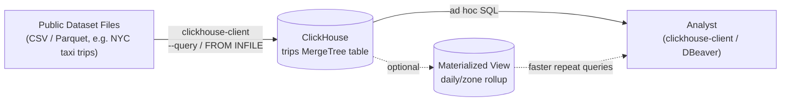
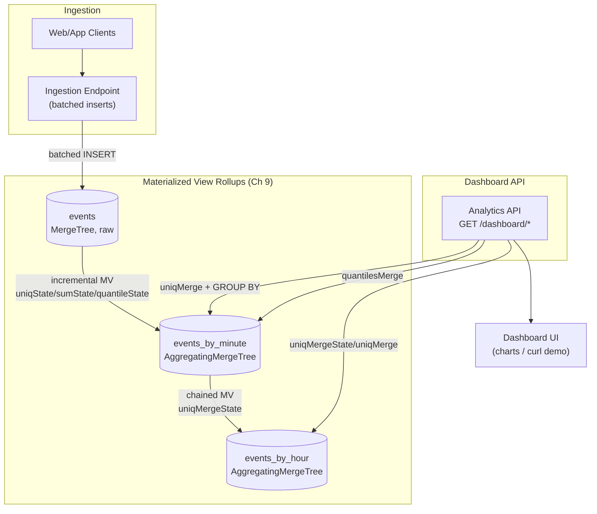
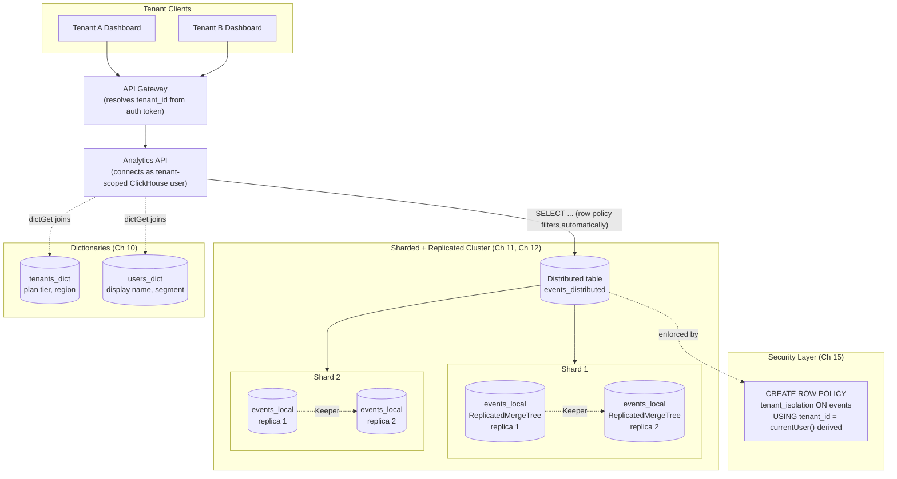
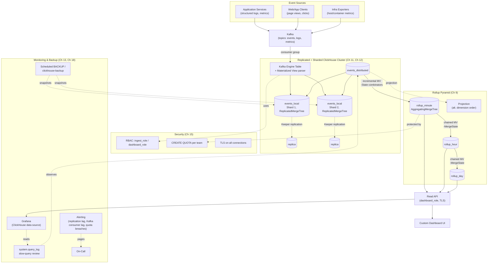

# Capstone Projects

Eighteen chapters have handed you every individual piece: why columnar storage exists and how ClickHouse's internals work (Ch 1–3), data types and schema design (Ch 4), the `MergeTree` engine family (Ch 5), the sparse primary index and partitioning (Ch 6), inserting and querying data (Ch 7), aggregate combinators and window functions (Ch 8), materialized views and projections (Ch 9), joins and dictionaries (Ch 10), replication (Ch 11), sharding and distributed queries (Ch 12), performance tuning (Ch 13), ingestion pipelines (Ch 14), security (Ch 15), a professional best-practices checklist (Ch 16), the failure modes to avoid (Ch 17), and the tooling/monitoring ecosystem (Ch 18). This chapter is where all of that stops being theory and becomes four real, portfolio-worthy systems — from a simple public-dataset exploration to a production-grade, real-time analytics platform running on a replicated, sharded cluster. Each project is a self-contained brief: requirements, architecture, folder structure, a phased implementation plan that points back to the exact chapter teaching each step, best practices to bake in from day one, and extensions to attempt once the core works. Read a brief fully before writing a line of SQL, and build the four projects in order — each one deliberately reuses schema, query, and operational skills from the one before it.

---

## Learning Objectives

By the end of this chapter, you will be able to:

- Translate a one-paragraph analytics requirement into a justified `MergeTree` schema — `ORDER BY`, partition key, and data types — rather than accepting engine and column defaults
- Build an analytics API whose every endpoint is powered by a ClickHouse query or a pre-aggregated rollup, never by pulling raw rows and computing in application code
- Design `AggregatingMergeTree` materialized views and projections that keep dashboard queries fast as raw tables grow past hundreds of millions of rows
- Design a multi-tenant cluster topology using `Distributed` + `ReplicatedMergeTree`, a tenant-aware shard key, dictionaries for dimension lookups, and row-policy-based tenant isolation
- Build a Kafka-based ingestion pipeline feeding a replicated, sharded cluster with a full rollup pyramid across multiple dashboard granularities
- Secure, monitor, and back up a ClickHouse deployment the way a production on-call engineer would, not just the way a tutorial would
- Recognize which mistakes from Chapter 17 tend to resurface at each project tier, and design around them before they happen

## Prerequisites for This Chapter

This is the **synthesis chapter** of the course. It assumes you have completed Chapters 1 through 18 — no new ClickHouse theory is introduced here, only application. If an implementation step below references a mechanism you don't remember (the sparse primary index, an aggregate combinator, `ReplicatedMergeTree` Keeper paths, a shard key, row policies, the Kafka engine), treat that as a signal to revisit the cited chapter, not to skip the step.

You will also need, practically:

- A local ClickHouse installation (single node is enough for Projects 1–2; a multi-node Docker Compose cluster for Projects 3–4) (Ch 1, Ch 11, Ch 12)
- `clickhouse-client` and, ideally, `clickhouse-local` for quick file-based exploration (Ch 18)
- A working backend environment in any language you're comfortable with (Python, Go, Node.js) and an HTTP client library, for the API layers in Projects 2–4
- Comfort reading and writing Mermaid diagrams, since every project below is specified with one
- For Project 4: Docker Compose familiarity, since it stands up Kafka, a multi-shard/multi-replica ClickHouse cluster, and Grafana together

Work through the four projects **in order**. Each one deliberately reuses the schema-design, aggregation, and operational instincts built in the one before it — jumping straight to Project 4 means re-learning fundamentals under the pressure of the hardest project in the course.

---

## Project 1 (Beginner): Public Dataset Analytics Explorer

### Requirements

- Load a well-known public dataset — the NYC taxi trips dataset (millions of trip records: pickup/dropoff time, location, fare, distance, passenger count) is the canonical ClickHouse example, though a Kaggle-style e-commerce orders dataset works equally well
- Design a single `MergeTree` table with a deliberately chosen `ORDER BY` and partition key, justified in writing, not left at defaults (Ch 4, Ch 6)
- Load the full dataset from CSV/TSV/Parquet files using `clickhouse-client`'s native file-insert support or the `INSERT INTO ... FROM INFILE` / `clickhouse-client --query ... < file` pattern (Ch 7)
- Answer at least five realistic business questions purely in SQL: e.g., busiest hours/days, average fare and distance by pickup zone, longest trips, revenue trends by month, and a percentile-based fare distribution
- No API layer required — this project's deliverable is the schema design and the query set, run directly via `clickhouse-client`

### Architecture



This is intentionally the simplest architecture in the course: no API, no cluster, no ingestion pipeline — just files, one well-designed table, and SQL. The entire point of Project 1 is to make schema design and query fluency solid before any operational complexity is added anywhere else.

### Folder Structure

```text
taxi-analytics-explorer/
├── data/
│   └── raw/                        # downloaded CSV/Parquet source files (gitignored)
├── sql/
│   ├── 01_create_database.sql
│   ├── 02_create_table.sql         # trips MergeTree, justified ORDER BY + PARTITION BY (Ch 4, Ch 6)
│   ├── 03_load_data.sql            # INSERT ... FROM INFILE / clickhouse-client load commands
│   ├── 04_materialized_view.sql    # optional daily/zone rollup (Ch 9, extension)
│   └── queries/
│       ├── busiest_hours.sql
│       ├── avg_fare_by_zone.sql
│       ├── longest_trips.sql
│       ├── monthly_revenue.sql
│       └── fare_percentiles.sql
├── scripts/
│   ├── download_dataset.sh         # fetches the public dataset files
│   └── load.sh                     # runs 01-03 against a local ClickHouse instance
├── notes/
│   └── schema-design.md            # written justification for ORDER BY / PARTITION BY choice
└── README.md
```

### Implementation Plan

1. **Pick and download the dataset.** NYC taxi trips (one or more months, tens of millions of rows total) or an equivalent e-commerce orders dataset. Inspect the raw columns and their natural types before writing any DDL (Ch 4).
2. **Design the schema deliberately.** Choose ClickHouse-native types (`DateTime`, `LowCardinality(String)` for low-cardinality text like vendor or payment type, `Decimal` for money, `UInt8`/`UInt16` for small integers) instead of defaulting every column to `String`/`Float64` (Ch 4).
3. **Choose and justify `ORDER BY` and `PARTITION BY`.** For taxi trips, a reasonable `ORDER BY (pickup_zone, pickup_datetime)` supports both "trips in this zone over time" and time-range queries via the sparse index; `PARTITION BY toYYYYMM(pickup_datetime)` keeps monthly data physically separable for efficient dropping/backfilling of old months. Write the reasoning down — this is the single most important design decision in the project (Ch 6).
4. **Create the table and load the data.** Use `clickhouse-client --query "INSERT INTO trips FORMAT CSVWithNames" < file.csv` or `FROM INFILE`, loading in batches large enough to be efficient but small enough to monitor for errors (Ch 7).
5. **Verify row counts and spot-check data quality.** Compare loaded row counts against the source file line counts, and query `system.parts` to see how many parts and partitions were created (Ch 3, Ch 6).
6. **Write and run the analytical query set.** At minimum: busiest pickup hours/days of week, average fare and trip distance by pickup zone, the longest trips by distance and by duration, monthly revenue trend, and a `quantile`/`quantiles` based fare distribution (Ch 7, Ch 8).
7. **Run `EXPLAIN` on at least two queries** to confirm the `ORDER BY` key is actually being used to prune data via the sparse index, not falling back to a full-column scan (Ch 6, Ch 13).
8. **Document findings.** Write down, in plain English, the business answer each query produces — this project's value is as much in the analysis as the schema.

### Best Practices to Apply

- Choose `ORDER BY` from the queries you actually intend to run, not from habit — a key that doesn't match your `WHERE`/`GROUP BY` patterns gives you no sparse-index benefit at all (Ch 6, Ch 16).
- Use `LowCardinality(String)` for repeated categorical text columns (zone names, vendor IDs, payment types) instead of plain `String` — it's a near-free compression and speed win at this data volume (Ch 4).
- Partition by a coarse, natural time grain (month, not day) unless you have a specific reason for finer partitions — over-partitioning creates too many small parts and hurts merge and query performance (Ch 6, Ch 17).
- Load in large batches, not row-by-row `INSERT`s — ClickHouse is built for bulk columnar inserts, and single-row inserts create excessive tiny parts (Ch 7, Ch 16).
- Run `EXPLAIN` before trusting that a query is fast just because it "feels fast" on a warm cache — confirm the primary key is actually pruning granules (Ch 6, Ch 13).

### Extensions / Improvements to Try Next

- Add a materialized view with an `AggregatingMergeTree` target table that pre-computes a daily-by-zone rollup (`uniqState`/`sumState`) so the monthly revenue query becomes a `uniqMerge`/`sumMerge` read over a tiny table instead of a full scan of raw trips (Ch 9) — a first taste of the pattern Project 2 builds fully.
- Re-run the exact same dataset and queries through `clickhouse-local` instead of a running server, and compare setup time and query latency — this is the "no server needed" workflow useful for one-off analysis (Ch 18).
- Add a skip index (e.g., a `minmax` or `set` index) on a column used in a selective `WHERE` clause that isn't part of `ORDER BY`, and confirm with `EXPLAIN` that it prunes granules (Ch 6).
- Try loading the same dataset as Parquet instead of CSV and compare load time and final on-disk size (Ch 7, Ch 14).

---

## Project 2 (Intermediate): Real-Time Web Analytics Dashboard Backend

### Requirements

- Extend the `events` table used throughout the course (page views, clicks, and API-latency style events with `event_time`, `page_url`, `user_id`, `country`, `duration_ms`, etc.) into a real backend-served dashboard
- A backend API (any language) exposing dashboard endpoints, where **every endpoint is answered by a ClickHouse query or rollup**, never by post-processing raw rows in application code:
  - Traffic over time (requests/events per minute or hour)
  - Top pages by view count over a date range
  - Unique visitors, computed correctly across time windows using `uniqState`/`uniqMerge` (Ch 8, Ch 9)
  - p95 (and p50/p99) latency using `quantileState`/`quantilesMerge`-style combinators
- `AggregatingMergeTree` rollup tables fed by incremental materialized views so dashboard queries never scan the full raw `events` table (Ch 9)
- A minimal dashboard UI (or a documented set of `curl` calls) demonstrating the endpoints — this project is about the data layer, not UI polish

### Architecture



### Folder Structure

```text
web-analytics-backend/
├── clickhouse/
│   ├── ddl/
│   │   ├── 01_events.sql              # raw events MergeTree (Ch 4, Ch 6)
│   │   ├── 02_events_by_minute.sql    # AggregatingMergeTree rollup (Ch 5, Ch 9)
│   │   ├── 03_mv_events_by_minute.sql # incremental MV: uniqState/sumState/quantileState
│   │   ├── 04_events_by_hour.sql      # chained rollup (Ch 9)
│   │   └── 05_mv_events_by_hour.sql   # uniqMergeState/quantilesMergeState
│   └── queries/
│       ├── traffic_over_time.sql
│       ├── top_pages.sql
│       ├── unique_visitors.sql
│       └── p95_latency.sql
├── src/
│   ├── db/
│   │   └── clickhouseClient.js        # connection pool / HTTP client config (Ch 7, Ch 18)
│   ├── routes/
│   │   └── dashboard.routes.js        # GET /dashboard/traffic, /top-pages, /uniques, /latency
│   ├── services/
│   │   └── dashboard.service.js       # builds and runs the ClickHouse queries above
│   └── app.js
├── scripts/
│   ├── loadgen.js                     # synthetic event generator at realistic volume
│   └── verify_rollups.js              # compares MV rollup output against raw-table ground truth
├── tests/
│   └── dashboard.test.js
├── docker-compose.yml                 # single-node ClickHouse for local dev
└── README.md
```

### Implementation Plan

1. **Design the raw `events` table.** Columns: `event_time DateTime`, `event_type LowCardinality(String)`, `page_url String`, `user_id UInt64`, `country LowCardinality(String)`, `duration_ms UInt32`. `ORDER BY (event_type, event_time)`, `PARTITION BY toYYYYMM(event_time)` (Ch 4, Ch 6).
2. **Build the ingestion endpoint.** Accept batched event payloads and insert them in bulk, never one row per HTTP request (Ch 7, Ch 16).
3. **Build the minute-level rollup.** Create an `events_by_minute` `AggregatingMergeTree` table with columns typed `AggregateFunction(uniq, UInt64)`, `AggregateFunction(sum, UInt32)`, `AggregateFunction(quantiles(0.5, 0.95, 0.99), UInt32)`, and an incremental materialized view whose `SELECT` uses `uniqState(user_id)`, `sumState(...)`, `quantilesState(0.5, 0.95, 0.99)(duration_ms)` grouped by minute + `page_url` + `country` (Ch 5, Ch 8, Ch 9).
4. **Build the chained hourly rollup.** A second `AggregatingMergeTree` (`events_by_hour`) fed by an MV reading from `events_by_minute` using `uniqMergeState`/`quantilesMergeState`, exactly the daily→monthly chaining pattern from Chapter 9 (Ch 9).
5. **Implement the traffic-over-time endpoint.** `GROUP BY` minute or hour on the appropriate rollup table with `sumMerge`, returning a time series (Ch 8, Ch 9).
6. **Implement the top-pages endpoint.** `GROUP BY page_url`, `sumMerge(views)` or `uniqMerge(visitors)`, `ORDER BY ... DESC LIMIT N`, over a caller-supplied date range (Ch 7, Ch 8).
7. **Implement the unique-visitors endpoint.** Use `uniqMerge` over the minute or hour rollup for the requested window — never `count(DISTINCT user_id)` over raw events for a wide date range, and never sum per-minute unique counts (which double-counts returning visitors) (Ch 8, Ch 9).
8. **Implement the p95-latency endpoint.** Use `quantilesMerge(0.5, 0.95, 0.99)(duration_ms_state)` over the rollup table, returning all three percentiles in one query (Ch 8).
9. **Load-test with a synthetic generator** at a volume large enough (tens of millions of raw events) that the difference between querying raw `events` and querying the rollups is dramatic and measurable (Ch 16, Ch 17).
10. **Verify rollup correctness against ground truth.** For a fixed historical window, compute unique visitors and p95 latency directly from raw `events` and confirm the rollup-based answer matches within expected tolerance before trusting the dashboard (Ch 9, Ch 17).

### Best Practices to Apply

- Type every `AggregatingMergeTree` column to exactly match the `-State` combinator that feeds it (`AggregateFunction(uniq, UInt64)` fed by `uniqState(user_id)` where `user_id` really is `UInt64`) — a mismatch is a schema bug that surfaces at insert time (Ch 8, Ch 9).
- Never query an `AggregatingMergeTree` rollup table with a plain `uniq()`/`sum()` — always the matching `-Merge` function, and always with the accompanying `GROUP BY`, since unmerged partial states can coexist across parts (Ch 9).
- Never sum per-period unique-visitor counts across a wider window — `uniq()` results are not additive; use `uniqMerge` over states spanning the full requested window instead (Ch 8).
- Serve every dashboard endpoint from a rollup table, never from an on-the-fly aggregation over raw `events`, once that rollup exists — the entire architectural point of this project is that expensive aggregation happens off the request path (Ch 9, Ch 13).
- Load-test before declaring the backend done — a dashboard that returns instantly against a hundred thousand seeded rows can behave completely differently against the hundreds of millions a real deployment accumulates (Ch 16, Ch 17).

### Extensions / Improvements to Try Next

- Add a `daily` rollup level above `events_by_hour` for month-over-month dashboard views, continuing the chaining pattern (Ch 9).
- Add a projection on the raw `events` table for a query shape the rollups don't cover well (e.g., an ad hoc `country`-first breakdown), and compare its performance against a rollup-table equivalent (Ch 9).
- Add response caching in front of the dashboard API for the most frequently requested date ranges, with a cache TTL shorter than the rollup refresh interval.
- Swap the synthetic load generator for a real Kafka producer and the Kafka table engine as the ingestion path, previewing Project 4's architecture (Ch 14).

---

## Project 3 (Advanced): Multi-Tenant SaaS Analytics Platform

### Requirements

- Convert the events/rollup core into a genuinely **multi-tenant** system: every row carries a `tenant_id`, and no query, materialized view, or dictionary lookup may ever cross tenant boundaries
- A **cluster topology** using `ReplicatedMergeTree` for durability and `Distributed` for horizontal scale, with a **deliberately chosen, tenant-aware shard key** — not `rand()` — so a given tenant's data is colocated as much as the tenant-size distribution allows (Ch 11, Ch 12)
- **Dictionaries** for tenant and user dimension lookups (tenant plan tier, user display name/segment) joined into analytical queries without repeated `JOIN`s against a growing dimension table (Ch 10)
- **Row-policy-based tenant isolation** enforced at the database layer via `CREATE ROW POLICY`, not only by an application-level `WHERE tenant_id = ?` that a bug could omit (Ch 15)
- Tenant-scoped API authentication mapping each request to exactly one `tenant_id`, which is then trusted only because the row policy — not the application — is the actual enforcement boundary

### Architecture



### Folder Structure

```text
saas-analytics-platform/
├── clickhouse/
│   ├── cluster/
│   │   └── remote_servers.xml         # cluster topology: shards, replicas (Ch 11, Ch 12)
│   ├── ddl/
│   │   ├── 01_events_local.sql        # ON CLUSTER, ReplicatedMergeTree, tenant_id leading ORDER BY
│   │   ├── 02_events_distributed.sql  # Distributed engine, tenant-aware shard key
│   │   ├── 03_tenants_dict.sql        # CREATE DICTIONARY tenants_dict (Ch 10)
│   │   ├── 04_users_dict.sql          # CREATE DICTIONARY users_dict (Ch 10)
│   │   └── 05_rollups.sql             # per-tenant AggregatingMergeTree rollups (Ch 9)
│   └── security/
│       ├── roles.sql                  # CREATE ROLE per tenant tier
│       ├── row_policies.sql           # CREATE ROW POLICY tenant_isolation (Ch 15)
│       └── users.sql                  # CREATE USER tenant_<id>, GRANT role
├── src/
│   ├── middleware/
│   │   └── tenantAuth.js              # resolves tenant_id, maps to ClickHouse user/role
│   ├── services/
│   │   └── analytics.service.js       # queries, always via the tenant-scoped connection
│   └── app.js
├── docs/
│   └── shard-key-decision.md          # shard key options considered and justification (Ch 12)
├── scripts/
│   ├── seed_multi_tenant.js           # many tenants, skewed size distribution
│   └── verify_isolation.js            # asserts cross-tenant queries return zero rows
├── docker-compose.yml                 # 2-shard x 2-replica local cluster + Keeper
└── README.md
```

### Implementation Plan

1. **Stand up the cluster.** Define a 2-shard, 2-replica-per-shard topology in `remote_servers.xml` with ClickHouse Keeper for coordination, and confirm `ON CLUSTER` DDL reaches every node (Ch 11, Ch 12).
2. **Design the tenant-aware schema.** `tenant_id` becomes the leading column of `ORDER BY` on `events_local` so per-tenant queries always benefit from the sparse index, and every compound index/materialized view groups by `tenant_id` first (Ch 4, Ch 6, Ch 15).
3. **Create `events_local` as `ReplicatedMergeTree` and `events_distributed` as `Distributed`.** Evaluate shard-key candidates — `rand()` (even distribution, no tenant locality), `cityHash64(tenant_id)` (good distribution, keeps a given tenant's data on one shard), and a manually assigned shard per large tenant tier (best locality and isolation for big tenants, most operational overhead) — and justify a final choice given an assumed tenant-size distribution (Ch 12).
4. **Build the tenant and user dictionaries.** Define `tenants_dict` and `users_dict` as `CREATE DICTIONARY` sourced from a small ClickHouse or external table, with a `LIFETIME` chosen deliberately based on how stale tenant/user metadata can tolerably be, and use `dictGet` in analytical queries instead of repeated `JOIN`s against a growing dimension table (Ch 10).
5. **Apply row-policy-based tenant isolation.** `CREATE ROW POLICY tenant_isolation ON events_distributed USING tenant_id = ...` scoped so each tenant's ClickHouse user can only ever see their own rows, enforced by the server regardless of what the application's `WHERE` clause does or forgets to do (Ch 15).
6. **Wire tenant-scoped authentication.** The API resolves `tenant_id` from the caller's auth token and connects to ClickHouse as that tenant's dedicated user (or role), so the row policy — not application code — is the actual security boundary (Ch 15, Ch 16).
7. **Rebuild the Project 2 rollups, tenant-scoped.** Every `AggregatingMergeTree` rollup and its feeding materialized view groups by `tenant_id` first, and dashboard queries continue to use `uniqMerge`/`quantilesMerge` exactly as in Project 2, now correctly isolated per tenant (Ch 9).
8. **Seed a realistic multi-tenant distribution.** Many small tenants and a few very large ones, so shard balance and row-policy correctness are exercised under a believable skew, not an artificially even toy dataset (Ch 16, Ch 17).
9. **Write and run an isolation verification script.** For every tenant, assert that querying as that tenant's user never returns another tenant's rows, even for crafted or malformed query parameters (Ch 15, Ch 17).
10. **Document the shard-key decision.** Write `shard-key-decision.md` explaining the options considered, the choice made, and the operational plan if one tenant later grows to dominate total data volume (Ch 12, Ch 16).

### Best Practices to Apply

- Enforce tenant isolation at the database layer with `CREATE ROW POLICY`, never only in application code — a forgotten `WHERE tenant_id = ?` in one code path is exactly how cross-tenant data leaks happen, and a row policy makes that mistake structurally impossible (Ch 15, Ch 17).
- Put `tenant_id` first in every `ORDER BY` and every rollup `GROUP BY` — this is both a correctness convention (never mix tenants inside one aggregate) and a performance one (the sparse index prunes to one tenant's granules) (Ch 6, Ch 15).
- Choose a shard key based on the actual tenant-size distribution you expect, and document the reasoning — `rand()` is rarely correct once tenant locality or per-tenant operational isolation matters, but a naive `tenant_id`-only key risks oversized, unsplittable shards for your largest tenants (Ch 12, Ch 16).
- Set dictionary `LIFETIME` deliberately based on how stale tenant/user metadata can tolerably be, and document that freshness contract next to the `CREATE DICTIONARY` statement (Ch 10).
- Grant privileges through roles, not directly to individual tenant users, so a tenant's effective access is legible by reading role membership rather than a scattered history of ad hoc `GRANT`s (Ch 15).

### Extensions / Improvements to Try Next

- Add a `CREATE QUOTA` per tenant tier so one tenant's heavy dashboard usage can never starve another tenant's queries on the shared cluster (Ch 15).
- Promote a very large or regulated tenant onto a dedicated shard or even a dedicated cluster, and document the operational runbook for doing so without downtime (Ch 12).
- Add a settings profile capping `max_memory_usage`/`max_execution_time` per tenant tier, so a free-tier tenant cannot run a query heavy enough to affect a paying tenant's experience (Ch 15).
- Build a per-tenant usage/billing rollup (queries run, rows scanned) using the same `system.query_log`-driven auditing pattern from Chapter 15.

---

## Project 4 (Production-Grade Capstone): Real-Time Observability & Analytics Platform

### Requirements

- A **Kafka-based ingestion pipeline**: event/metric/log sources publish to Kafka topics, consumed into ClickHouse via the `Kafka` table engine plus a materialized view pushing parsed rows into the real storage table (Ch 14)
- A **replicated, sharded cluster** (`ReplicatedMergeTree` + `Distributed`) sized and topologized for sustained high-volume ingestion, with a documented topology decision (Ch 11, Ch 12)
- A **rollup pyramid**: multiple chained `AggregatingMergeTree` materialized views (raw → per-minute → per-hour → per-day) plus at least one projection, so every dashboard granularity is served from pre-computed data, never from scanning raw events (Ch 9)
- **Security**: RBAC separating an ingestion-only role from a read-only dashboard role, row policies if the platform serves multiple teams/tenants, resource quotas protecting the shared cluster, and TLS on every client connection (Ch 15)
- **Monitoring**: a Grafana dashboard backed by the ClickHouse data source plus `system.*` tables, with slow queries surfaced from `system.query_log` and at least one documented tuning pass (Ch 13, Ch 18)
- An **automated backup strategy** using `BACKUP`/`RESTORE` or `clickhouse-backup`, scheduled and tested with an actual restore drill, not just configured and assumed to work (Ch 18)

### Architecture



### Folder Structure

```text
realtime-observability-platform/
├── infra/
│   ├── docker-compose.yml             # Kafka, ClickHouse cluster (2 shard x 2 replica), Keeper, Grafana
│   └── clickhouse-cluster/
│       └── remote_servers.xml
├── clickhouse/
│   ├── ddl/
│   │   ├── 01_events_local.sql        # ReplicatedMergeTree, ON CLUSTER (Ch 11)
│   │   ├── 02_events_distributed.sql  # Distributed engine (Ch 12)
│   │   ├── 03_kafka_engine.sql        # ENGINE = Kafka(...) staging table (Ch 14)
│   │   ├── 04_mv_kafka_to_events.sql  # MV: Kafka engine table -> events_local
│   │   ├── 05_rollup_minute.sql       # AggregatingMergeTree + incremental MV (Ch 9)
│   │   ├── 06_rollup_hour.sql         # chained MV, -MergeState (Ch 9)
│   │   ├── 07_rollup_day.sql          # chained MV, -MergeState (Ch 9)
│   │   └── 08_projection.sql          # ADD PROJECTION + MATERIALIZE PROJECTION (Ch 9)
│   └── security/
│       ├── roles.sql                  # ingest_role, dashboard_role (Ch 15)
│       ├── row_policies.sql           # if multi-team (Ch 15)
│       ├── quotas.sql                 # CREATE QUOTA per team/dashboard (Ch 15)
│       └── tls/                       # certs + server config notes
├── api/
│   ├── read.api.js                    # GET /dashboard/*, connects as dashboard_role over TLS
│   └── queries/
│       └── rollupQueries.js           # queries rollup_minute/hour/day only
├── ops/
│   ├── topology.md                    # shard/replica layout, sizing rationale (Ch 11, Ch 12)
│   ├── monitoring.md                  # Grafana panels, query_log alert thresholds (Ch 13, Ch 18)
│   ├── backup-strategy.md             # schedule, retention, tested restore procedure (Ch 18)
│   └── grafana/
│       └── dashboards/                # exported Grafana JSON dashboards
├── scripts/
│   ├── kafka_producer_loadgen.js      # synthetic event stream at sustained realistic volume
│   ├── verify_rollup_correctness.js   # rollup pyramid vs. raw-table ground truth
│   ├── run_backup.sh                  # scheduled backup invocation
│   └── restore_drill.sh               # documented, tested restore procedure
├── tests/
│   ├── rollupConsistency.test.js
│   └── failover.test.js               # dashboard reads survive a replica/shard node loss
└── README.md
```

### Implementation Plan

1. **Stand up Kafka and the cluster together.** Docker Compose brings up a Kafka broker, a 2-shard/2-replica ClickHouse cluster, and Keeper. Confirm `ON CLUSTER` DDL reaches every node before building anything on top (Ch 11, Ch 12, Ch 14).
2. **Design the raw event schema and the Kafka ingestion path.** Create a `Kafka`-engine staging table matching the topic's message format, and a materialized view that parses and inserts each consumed message into `events_local` (`ReplicatedMergeTree`, `ORDER BY` chosen for the dominant query pattern, e.g., `(service, event_time)`) (Ch 4, Ch 6, Ch 14).
3. **Create the `Distributed` table and confirm end-to-end flow.** Publish synthetic messages to the Kafka topic and confirm they land in `events_distributed` across both shards within the expected consumer lag (Ch 12, Ch 14).
4. **Build the rollup pyramid.** `rollup_minute` (`AggregatingMergeTree`, fed by an incremental MV using `-State` combinators), then `rollup_hour` and `rollup_day` chained on top using `-MergeState`, exactly the daily→monthly chaining pattern generalized to three levels (Ch 9).
5. **Add at least one projection.** For a query shape the rollup pyramid doesn't serve well (e.g., a different leading dimension), add a projection on `events_local` and confirm with `EXPLAIN` that queries matching its shape use it (Ch 9).
6. **Apply RBAC, quotas, and TLS.** Create an `ingest_role` scoped to `INSERT` on the Kafka/raw tables only, a `dashboard_role` scoped to `SELECT` on rollup tables only, a `CREATE QUOTA` bounding per-team resource consumption, and require TLS on every client connection (Ch 15).
7. **Build the read API against the rollup pyramid only.** Every dashboard endpoint selects the coarsest rollup level that satisfies the requested granularity/date range — day-level rollups for a yearly view, minute-level for a live "last hour" view — never the raw `events_distributed` table (Ch 9, Ch 13).
8. **Load-test with a sustained Kafka producer.** Run the load generator at a rate high enough to make consumer lag, replication lag, and merge backlog observable, not theoretical (Ch 14, Ch 16, Ch 17).
9. **Wire up Grafana and `system.query_log`-based monitoring.** Connect Grafana's ClickHouse data source to the cluster, build panels for ingestion rate, Kafka consumer lag, replication lag, and slow queries pulled from `system.query_log`; run at least one real tuning pass using `EXPLAIN`/`system.query_log` and document the fix (Ch 13, Ch 18).
10. **Implement and test the backup strategy.** Schedule `BACKUP`/`RESTORE` or `clickhouse-backup` runs, document retention policy, and — critically — actually run a restore drill against a scratch instance to confirm the backups are usable, not merely produced (Ch 18).
11. **Test failure scenarios end-to-end.** Kill a replica mid-ingestion and confirm the Kafka consumer/materialized view keeps working via the surviving replica; kill a Kafka broker (if running a multi-broker setup) and confirm consumer rebalancing; confirm dashboard reads stay available throughout (Ch 11, Ch 12, Ch 17).
12. **Write the operational documentation.** Finalize `topology.md`, `monitoring.md`, and `backup-strategy.md` as if handing this system to another on-call engineer — topology, alert thresholds, known failure modes, and the tested restore procedure.

### Best Practices to Apply

- Serve every dashboard query from the coarsest rollup level that satisfies the request, and never fall back to scanning raw events once a rollup exists for that metric — the entire architectural point of this project is that expensive aggregation happens off the request path (Ch 9, Ch 13).
- Grant the ingestion path and the read path **separate, minimally scoped roles** — an ingestion service should never hold `SELECT` on operational tables it doesn't need, and a dashboard service should never hold `INSERT` privileges at all (Ch 15, Ch 16).
- Treat the backup strategy as unproven until a restore drill has actually succeeded against a scratch instance — a backup schedule that has never been restored from is a false sense of safety, not a real one (Ch 18, Ch 17).
- Load-test with a sustained producer before declaring the platform done — Kafka consumer lag, replication lag, and merge backlog are invisible at low synthetic volume and very visible at the volume a real observability platform actually ingests (Ch 14, Ch 16, Ch 17).
- Document cluster topology, monitoring thresholds, and the backup/restore runbook as artifacts, not tribal knowledge — this is what makes the system operable by someone other than the person who built it (Ch 16, Ch 18).
- Match every `AggregateFunction(...)` column type exactly to the `-State` combinator that feeds it at every level of the rollup pyramid, and verify each level with `uniqMerge`/`quantilesMerge` against the level below it, not just against raw data at the very top (Ch 9).

### Extensions / Improvements to Try Next

- Add anomaly detection over `rollup_hour` (e.g., flag an hour that deviates significantly from its trailing average) using window functions from Chapter 8.
- Add a documented (or actually rehearsed) shard-rebalancing runbook for the scenario where ingestion volume outgrows the current shard count.
- Add audit logging for all RBAC/quota changes, and wire Grafana alerting to page on-call for replication lag, Kafka consumer lag, or a quota breach crossing a defined threshold (Ch 15, Ch 18).
- Extend the platform to a second data center/region and document the cross-region replication and failover strategy.

---

## Real-World Scenario

Read the four projects back to back and they trace the same arc a real data engineer walks over a career. Project 1 is the first task a junior engineer gets: load a well-understood dataset, design a schema instead of accepting defaults, and answer real questions with SQL — no API, no cluster, nothing to hide behind. Project 2 is the mid-level engineer's assignment: the business wants a live dashboard, not a nightly export, and "aggregate the raw table on every page load" stops being acceptable the moment the table passes a few hundred million rows — this is where materialized-view and `-State`/`-Merge` fluency start mattering more than general backend skill. Project 3 is what a senior engineer gets handed when the product goes multi-tenant and a customer's data shows up in another customer's dashboard because an application-level filter was missed in one code path — suddenly row policies, a defensible shard key, and dictionary-backed dimension lookups aren't academic, they're the difference between a postmortem and a non-event. Project 4 is the staff-level, cross-team problem: leadership wants a real-time observability platform that never goes down, ingests continuously from Kafka, stays secure and auditable, and can prove — via a tested restore drill, not a hopeful assumption — that its backups actually work. Very few engineers are handed Project 4 on day one, and the ones who succeed at it are almost always the ones who quietly built the muscle memory of Projects 1 through 3 first, even if nobody called them "capstones" at the time.

---

## Best Practices

- **Build incrementally, project by project.** The schema-design instincts from Project 1, the rollup fluency from Project 2, and the cluster/security discipline from Project 3 are exactly the building blocks Project 4 assumes you already have — skipping ahead means learning them under the pressure of the hardest project instead of the easiest one.
- **Load realistic data volumes early, not at the end.** A schema, `ORDER BY`, or materialized view that looks fine against a few thousand hand-generated rows can behave completely differently at the hundreds of millions a real deployment accumulates — generate realistic volume as early as Project 1, not as an afterthought before shipping Project 4.
- **Validate `ORDER BY` and materialized-view correctness before declaring a project done.** Run `EXPLAIN` to confirm the primary key is actually pruning granules, and compare rollup output against raw-data ground truth on a fixed window — a fast-looking dashboard backed by a silently wrong rollup is worse than a slow, correct one.
- **Run `EXPLAIN` on every query and pipeline you ship**, not just the ones that feel slow — an unindexed `WHERE`, a shard key that doesn't distribute writes evenly, or a projection that never gets used are all invisible on a small local dataset and very visible in production.
- **Treat security and operability as core requirements from Project 3 onward**, not extensions to bolt on later — row policies, RBAC, quotas, and documented topology are far cheaper to design in from the beginning than to retrofit onto a system already serving traffic.
- **Version schema, rollup, and security definitions as code** (SQL files checked into the repo, not statements typed once into `clickhouse-client` and forgotten), so a fresh environment can be stood up reproducibly and a teammate can see exactly what exists and why.
- **Reuse rather than rewrite.** By Project 4 you should be importing and adapting the connection layer, rollup-pipeline patterns, and dashboard-query builders from the earlier projects — that reuse is itself evidence the earlier chapters have become instinct rather than reference material.

---

## Common Mistakes

- **Skipping schema and `ORDER BY` design and dumping data in with defaults.** Loading a dataset into a table with no deliberate `ORDER BY`/partition key works fine at demo scale and produces a table with no usable sparse index the moment it needs to serve a real query pattern.
- **Not testing at realistic scale.** A dashboard that returns instantly against a hundred thousand seeded rows can hide a missing rollup, an unindexed filter, or an oversized partition scheme that only becomes visible — usually in production — once the table reaches real volume.
- **Not verifying materialized view or projection correctness against raw-data ground truth.** A rollup pyramid that was never checked against the numbers raw `events` actually produces can silently drift wrong for months before anyone notices the dashboard disagrees with reality.
- **Querying an `AggregatingMergeTree` table with a plain aggregate function instead of the matching `-Merge`.** The columns hold opaque partial states, not finalized values; this either errors or silently produces meaningless results depending on the column type and ClickHouse version.
- **Treating multi-tenant isolation as an application-level convention instead of a database-enforced guarantee.** Relying on every code path to remember `WHERE tenant_id = ?` is exactly how cross-tenant data leaks happen; a `CREATE ROW POLICY` makes the mistake structurally impossible instead of merely discouraged.
- **Choosing a shard key without evaluating alternatives or documenting the reasoning.** `rand()` is rarely the right default once tenant locality, per-tenant isolation, or hot-shard avoidance matter, and an undocumented choice is far harder to revisit once data has grown around it.
- **Declaring the production capstone "done" after one successful manual demo run**, without a load test, a failure-injection test, or a tested backup restore — a backup that has never been restored from and a cluster that has never lost a node under load haven't been proven production-ready, they've only been proven to work when nothing goes wrong.

---

## Summary

- **Project 1** (Public Dataset Analytics Explorer) is a pure schema-and-query exercise over a public dataset — the deliverable is a justified `ORDER BY`/partition scheme and a set of real analytical answers, with nothing else added.
- **Project 2** (Real-Time Web Analytics Dashboard Backend) adds a backend API and a full `AggregatingMergeTree` rollup pyramid so traffic, top-pages, unique-visitor, and latency queries return from pre-computed rollups instead of scanning raw events.
- **Project 3** (Multi-Tenant SaaS Analytics Platform) adds a replicated, sharded cluster with a justified tenant-aware shard key, dictionaries for dimension lookups, and database-enforced row-policy tenant isolation.
- **Project 4** (Real-Time Observability & Analytics Platform) adds Kafka-based ingestion, a multi-level rollup pyramid with projections, full RBAC/quotas/TLS, Grafana and `system.query_log`-based monitoring, and a tested automated backup strategy — synthesizing nearly every chapter in this course into one working system.
- Each project deliberately builds on the one before it: the schema instincts, the rollup patterns, and the operational discipline are meant to carry forward, so working through them in order is itself part of the curriculum.
- The recurring meta-lesson across all four tiers is that **realistic data volume, `EXPLAIN`, rollup-vs-ground-truth verification, and a tested failure/restore drill are what separate "it worked in the demo" from "it's ready for production."**

---

## Knowledge Check

1. In Project 1, what specific query patterns should have driven your choice of `ORDER BY` and `PARTITION BY` for the taxi/e-commerce table, and what would you expect to go wrong if you had left both at defaults?
2. In Project 2, why is it incorrect to compute a weekly unique-visitor count by summing seven daily `uniqMerge` results, and what does querying the correctly designed rollup do differently?
3. In Project 3, why does a `CREATE ROW POLICY` provide a stronger tenant-isolation guarantee than an application-level `WHERE tenant_id = ?` clause, even if every current code path includes that clause correctly?
4. In Project 3, which shard-key option would you revisit if a single tenant grew to dominate the dataset's total volume, and what specific operational problem would that growth create under your original choice?
5. In Project 4, why is a scheduled backup that has never been restored from an unproven safety net, and what would a real restore drill need to demonstrate before you'd trust it during an actual incident?

---

## Hands-On Exercise

Scaffold **Project 1 (Public Dataset Analytics Explorer)** right now, end to end:

1. Download a sample of a public dataset — a month or two of NYC taxi trips (the ClickHouse docs' example-datasets page links the source files) or an equivalent Kaggle-style e-commerce dataset.
2. Inspect the raw columns and decide ClickHouse-native types for each one (`DateTime`, `LowCardinality(String)`, `Decimal`, appropriately sized integers) instead of defaulting everything to `String`.
3. Design and write down a justified `ORDER BY` and `PARTITION BY` scheme based on the query patterns you intend to run — one sentence of reasoning per choice is enough, but it must reference an actual query, not a guess.
4. Create the table and load the full sample using a batched `INSERT`, then confirm the loaded row count matches the source file.
5. Write and run at least three realistic analytical queries against it — for example: busiest hour of day, average fare/order value by zone or category, and a `quantiles`-based distribution of a key numeric column.
6. Run `EXPLAIN` on at least one of those queries and confirm your `ORDER BY` key is actually being used to prune data, not just present in the schema.

Stop there for today — resist adding a materialized view or moving on to Project 2 until the schema is justified and the three queries return sensible, verified answers; that discipline is the whole point of the beginner tier.

---

## Further Reading

- [ClickHouse Docs — Example Datasets](https://clickhouse.com/docs/getting-started/example-datasets) — the official collection of public datasets (including NYC taxi rides) used throughout Project 1.
- [ClickHouse Docs — MergeTree Table Engine](https://clickhouse.com/docs/engines/table-engines/mergetree-family/mergetree) — the authoritative reference for `ORDER BY`, `PARTITION BY`, and the sparse primary index used in every project's schema design.
- [ClickHouse Docs — Materialized View](https://clickhouse.com/docs/sql-reference/statements/create/view#materialized-view) and [Projections](https://clickhouse.com/docs/sql-reference/statements/alter/projection) — the rollup and pre-computation mechanisms behind Projects 2 and 4.
- [ClickHouse Docs — Distributed Table Engine](https://clickhouse.com/docs/engines/table-engines/special/distributed) and [Replication](https://clickhouse.com/docs/engines/table-engines/mergetree-family/replication) — shard/replica design for Projects 3 and 4.
- [ClickHouse Docs — Access Control and Account Management](https://clickhouse.com/docs/operations/access-rights) — RBAC, row policies, and quotas for Project 3's tenant isolation and Project 4's security layer.

---

<div style="display:flex;justify-content:space-between;align-items:center;">
  <a href="./18-tools-and-ecosystem.md">← Previous: Tools & Ecosystem</a>
  <a href="./00-index.md">🏠 Index</a>
  <a href="./20-interview-preparation.md">Next: Interview Preparation →</a>
</div>
