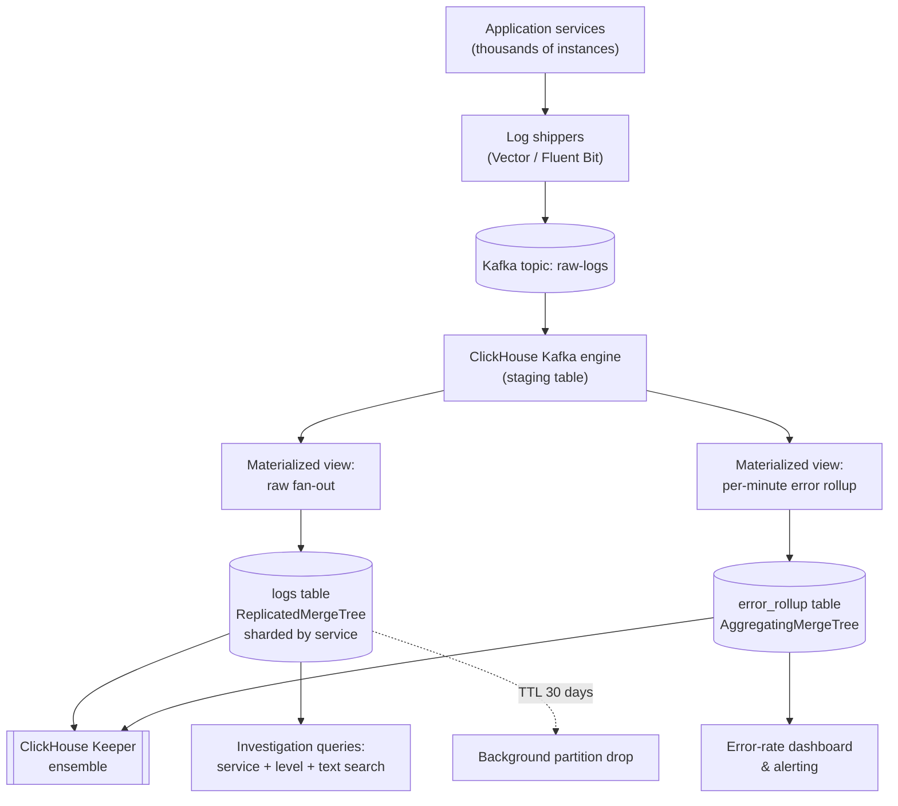

# Interview Preparation

You've built the full stack over nineteen chapters: why columnar storage exists and how it differs from row stores, the MergeTree engine's parts-and-merges internals, data types and schema design, the sparse primary index, table engine selection, aggregate combinators and window functions, materialized views and projections, joins and dictionaries, replication with Keeper, sharding with the `Distributed` engine, performance tuning with `EXPLAIN`, ingestion pipelines, security, best practices, common pitfalls, tooling, and a capstone project. This final chapter is not new material — it is a rehearsal. Its job is to take everything from Chapters 1–19 and drill it into the exact shape a technical interviewer asks for: a crisp conceptual answer under thirty seconds, a calm diagnosis under scenario pressure, a structured system-design walkthrough with justified trade-offs, working SQL under a whiteboard or shared editor, and a war story that proves you've actually operated ClickHouse in production, not just read about it. Work through this chapter the way you'd rehearse for a real loop: read a question, form your own answer before reading the model answer, and treat any gap between the two as a pointer back to the specific earlier chapter you need to revisit tonight.

---

## Learning Objectives

By the end of this chapter, you will be able to:

- Answer 15+ core ClickHouse conceptual interview questions confidently and instructively, spanning columnar storage, the MergeTree model, indexing, engines, aggregation, materialized views/projections, replication, sharding, and security
- Diagnose realistic production scenarios — a schema for high-volume clickstream data, a dashboard query that degraded at scale, a multi-tenant design, a shard-key migration — using the same diagnostic discipline taught in Chapters 13 and 17
- Write correct, performant SQL from a plain-English problem statement under interview conditions, including aggregate combinators, window functions, and dictionary-based lookups
- Deliver a structured, interview-shaped system design answer for a ClickHouse-backed analytics platform, covering schema, `ORDER BY`/partitioning, ingestion, and scaling
- Recognize composite, illustrative production case studies that show how the concepts in this course play out as real incidents and scaling milestones
- Run a full 45-minute mock interview against yourself and honestly self-grade the result
- Walk into a ClickHouse/OLAP-focused interview able to state assumptions, name trade-offs, and justify every design decision instead of reciting definitions

---

## Prerequisites for This Chapter

This is the capstone review chapter of the entire course. It assumes you have completed, or are comfortable quickly skimming back through, **all of Chapters 1–19**:

- **Ch 1–3**: why columnar databases exist, OLAP vs. OLTP, ClickHouse's core terminology, and the MergeTree engine's parts/merges/vectorized-execution internals
- **Ch 4–6**: data types and schema design (`LowCardinality`, `Nullable`, `Array`, `Nested`, `Map`), the MergeTree engine family, and the sparse primary index / `ORDER BY`-as-index mental model
- **Ch 7–10**: batch inserts and query patterns, aggregate function combinators (`-If`, `-Array`, `-State`/`-Merge`), window functions, materialized views and projections, join algorithms and dictionaries
- **Ch 11–12**: `ReplicatedMergeTree` and ClickHouse Keeper, the `Distributed` engine and shard key selection
- **Ch 13–15**: `EXPLAIN`-driven query tuning and system tables, ingestion pipelines (Kafka, files, client libraries), and security (RBAC, TLS, row-level security)
- **Ch 16–18**: the consolidated best-practices checklist, known failure modes, and the tooling ecosystem
- **Ch 19**: the capstone project you designed or built end-to-end

Every answer below is instructive on its own, but if any of it feels unfamiliar rather than "oh right, I remember this," that's your signal to reopen the relevant chapter before the interview — not during it.

---

## 1. Conceptual Q&A

Unlike the "Knowledge Check" sections in earlier chapters, which deliberately withhold answers so you self-test honestly, every question in this section comes with a full model answer — because that's exactly what an interview demands of you in real time.

### Q1. What is columnar storage, and why does it make analytical queries so much faster than row storage?

In a row-oriented database, all the columns of one row are stored contiguously on disk, which is ideal for fetching or updating a single record but means a query touching only 3 of 50 columns still has to read every column of every row it scans. In a columnar database, each column is stored in its own contiguous file, so a query that only needs `event_type` and `user_id` reads only those two columns' data, skipping the other 48 entirely — this alone can be a 10-25x reduction in bytes read for typical analytical queries. Columnar layout also makes compression dramatically more effective, because values within a single column are far more similar to each other than values across a row (a `country` column compresses beautifully; a row mixing a UUID, a timestamp, and a float does not), and it enables vectorized execution, where the CPU operates on batches of same-typed values from one column at a time instead of branching per-row. The trade-off is that inserting or fetching a single full row becomes more expensive, since it means touching every column file — which is exactly why columnar databases are built for read-heavy analytics, not high-frequency single-row transactional writes (Ch 1, 3).

### Q2. Explain the MergeTree model: parts, merges, and why background merges exist at all.

Every `INSERT` into a MergeTree table creates a new, immutable **part** — a self-contained directory on disk holding sorted column files for exactly the rows in that insert, plus its own index and metadata. ClickHouse never modifies a part in place; instead, a background merge process periodically picks several parts and merges them into one larger part, re-sorting and re-indexing the combined data, then marks the old parts for deletion. This exists for two reasons: first, without merging, a table ingesting frequent small batches would accumulate thousands of tiny parts, and every query would need to scan and merge results from all of them at read time, which is far slower than reading from a handful of large, well-sorted parts; second, merges are also where deduplication (`ReplacingMergeTree`), pre-aggregation (`SummingMergeTree`/`AggregatingMergeTree`), and row cancellation (`CollapsingMergeTree`) actually happen, since these engines only resolve their special semantics when parts are merged — never on plain reads unless you force it. The direct consequence for schema design is the "insert in large batches" rule: many small inserts create part-count pressure that a background thread has to work off, and can trigger `Too many parts` throttling if ingestion outpaces merging (Ch 3, 5).

### Q3. Contrast ClickHouse's sparse primary index with a B-tree index in a database like PostgreSQL.

A B-tree index stores (effectively) one entry per row, letting a database jump directly to any single row in roughly `O(log n)` comparisons — ideal for point lookups. ClickHouse's sparse primary index stores only one entry per **granule** (a block of, by default, 8192 rows), so instead of pointing at a row, each index entry says "granule N starts with this `ORDER BY` key value." A query first does a small binary search over this tiny, RAM-resident sparse index to find which granules *could* contain matching rows, then does a full columnar scan of just those granules. This trade-off is deliberate: it makes the index minuscule (fitting comfortably in memory even for a table with billions of rows) at the cost of never pinpointing an exact row — ClickHouse always reads full granules, so a sparse index is coarse and probabilistic rather than precise, which is exactly right for an engine whose queries scan millions of rows anyway rather than fetching one (Ch 6).

### Q4. Why does `ORDER BY` column order matter so much in a MergeTree table, and what's the equivalent of the "ESR rule" here?

The `ORDER BY` clause physically determines the sort order of every part on disk, and the sparse index's granule boundaries are simply checkpoints along that sort order — so choosing `ORDER BY (a, b, c)` means the data (and the index) is sorted first by `a`, then by `b` within each `a`, then by `c` within each `b`. This is the same prefix-locality principle as a compound B-tree index's ESR (Equality, Sort, Range) rule: put your highest-cardinality, most commonly equality-filtered columns first so a query narrows to a small contiguous slice of granules immediately, put range-filtered or lower-cardinality columns after, and be aware that a query filtering only on a *non-leading* `ORDER BY` column gets no index pruning benefit at all — ClickHouse has to scan every granule and filter in memory. Getting this wrong (e.g., leading with a high-cardinality `user_id` when 95% of queries filter by `event_date` first) is one of the single most common causes of "why is this table slow despite having an `ORDER BY`" in production (Ch 6).

### Q5. How do you choose between `MergeTree`, `ReplacingMergeTree`, `SummingMergeTree`, `AggregatingMergeTree`, and `CollapsingMergeTree`?

Start with plain `MergeTree` as the default for immutable event/fact data — most analytical tables never need anything more exotic. Reach for `ReplacingMergeTree` when you need eventual deduplication of rows sharing the same `ORDER BY` key (e.g., re-ingesting a CDC feed where the latest version should win) — but remember deduplication happens only during background merges, so `SELECT` immediately after insert can still see duplicates unless you explicitly run `FINAL` or `OPTIMIZE ... FINAL` (at a real performance cost). Use `SummingMergeTree` when you're storing pre-aggregated numeric rollups and want merges to automatically sum numeric columns sharing the same `ORDER BY` key, which is simple but only supports plain summation. Use `AggregatingMergeTree` when you need richer partial-aggregation state (e.g., a distinct count or quantile that isn't a simple sum) stored via `-State` combinators and resolved with `-Merge` at query time — this is the general-purpose rollup engine. Use `CollapsingMergeTree`/`VersionedCollapsingMergeTree` specifically for the sign-column pattern, where you need to cancel out a previously inserted row (e.g., "this session ended, retract its earlier open-ended row") without an in-place `UPDATE`. The decision should always follow the actual mutation/rollup semantics your data needs, not a reflex toward the plain default or the most powerful option (Ch 5).

### Q6. What are aggregate combinators, and walk through `-If`, `-Array`, and `-State`/`-Merge` specifically.

Aggregate combinators are suffixes that modify how a standard aggregate function operates, without needing a separate function for every variant. `-If` (e.g., `sumIf(amount, status = 'completed')`) computes the aggregate only over rows matching a condition, letting you compute several conditional aggregates over the same scanned data in a single pass instead of running several separate filtered queries — this is a major win because ClickHouse only has to read the underlying columns once. `-Array` (e.g., `sumArray(values)`) applies the aggregate across the elements of an array column rather than across rows, useful when a column is itself a collection needing summarization per-row or in combination with `GROUP BY`. `-State`/`-Merge` are the pair behind pre-aggregation: `-State` (e.g., `uniqState(user_id)`) doesn't return a final scalar — it returns an opaque, mergeable intermediate representation of the aggregation-in-progress, stored via the special `AggregateFunction(...)` column type, typically written into an `AggregatingMergeTree` target table by a materialized view; `-Merge` (e.g., `uniqMerge(state_column)`) later combines any number of these partial states into the final answer. This lets ClickHouse pre-aggregate incrementally as data arrives, and cheaply combine partial daily states into a weekly or monthly total, without ever re-scanning the raw source rows (Ch 8).

### Q7. What's the difference between a materialized view and a projection, and when would you choose one over the other?

A ClickHouse materialized view is not a view in the SQL-standard sense — it's better understood as a trigger that fires on each inserted **block**, running a `SELECT` against just that block and writing the transformed result into a separate target table; querying the MV's target table later is a normal (often much cheaper) query against pre-aggregated data. A projection is an alternative, hidden physical representation of the *same* table, with its own `ORDER BY` (and optionally its own aggregation), which ClickHouse's query planner can automatically choose to read from instead of the base table when it determines the projection would answer the query more efficiently — no separate table name to query, no explicit `-Merge` needed. Choose a materialized view when you want a genuinely different, independently queryable rollup table (different grain, joined with other data, or feeding a totally different access pattern) or when you need chained/multi-stage rollups. Choose a projection when you want the *same* table to be efficiently queryable by a second, different `ORDER BY` (e.g., the base table is ordered by `(user_id, event_time)` but some queries filter by `event_type` first) without maintaining a second table and without changing any application query — at the cost of extra storage and slower merges, since ClickHouse must maintain both representations (Ch 9).

### Q8. What is `POPULATE`, and why is it best avoided for backfilling a materialized view?

`POPULATE` is an option on `CREATE MATERIALIZED VIEW` that runs the view's `SELECT` against the existing rows already in the source table at creation time, filling the target table with historical data. The danger is a race condition: `POPULATE` snapshots and processes existing data at creation time, but any rows inserted into the source table *while* that backfill is still running may be silently missed by the population step (they arrive during the transition and can fall into a gap between "already populated" and "future inserts start triggering the MV"), especially on a busy production table. The safer, standard pattern is to create the materialized view first (so all *new* inserts start flowing into the target table immediately), and then backfill historical data separately with an explicit `INSERT INTO target SELECT ... FROM source WHERE <historical range>` — a pattern that's easy to make idempotent and safe to re-run or resume (Ch 9).

### Q9. What table engines would you never use for a large, high-write analytical fact table, and why?

The `Log` family (`Log`, `TinyLog`, `StripeLog`) and `Memory` are the wrong choice: `Log`-family engines have no primary index at all and support only simple, mostly append-only, single-threaded-safe access patterns intended for small, mostly-static auxiliary tables, not billions of rows of high-throughput analytical data; `Memory` doesn't persist data to disk at all, so all data is lost on server restart, making it suitable only for scratch/temporary intermediate result sets, never a system of record. Both lack the MergeTree family's part-based storage, background merging, sparse indexing, and replication support, which is exactly the machinery that makes MergeTree variants viable at scale. The default, correct starting point for any large fact table is a plain `MergeTree` (or `ReplicatedMergeTree` in a cluster), reaching for a specialized MergeTree variant only when its specific mutation semantics are actually needed (Ch 5).

### Q10. How does ClickHouse Keeper fit into replication, and how is it different from a primary/secondary replication model?

`ReplicatedMergeTree` doesn't ship rows between replicas the way a traditional primary/secondary database streams a write-ahead log — instead, each replica writes its own part locally, then publishes a lightweight *log entry* describing that part to ClickHouse Keeper (a ZooKeeper-compatible coordination service), and every other replica watches that log and fetches the actual part data directly from a peer that has it. Keeper's job is coordination metadata only — the replication log, part existence/checksums, leader election for merges, and distributed DDL synchronization — not carrying the bulk data itself, which keeps Keeper's own storage and load small even for a cluster replicating terabytes. This is also why ClickHouse replication is multi-master by default: any replica can accept an `INSERT` (there's no single designated primary that all writes must go through), and Keeper's job is purely to make sure every replica eventually learns about and fetches every part that any replica produced, in a consistent order (Ch 11).

### Q11. What does `insert_quorum` do, and what durability guarantee does it actually buy you?

By default, an `INSERT` against a `ReplicatedMergeTree` table returns success as soon as the part is written locally and its log entry is committed to Keeper — it does not wait for other replicas to actually fetch and apply that part. Setting `insert_quorum` (e.g., to `2` in a 3-replica table) makes the insert block until at least that many replicas have confirmed they've received and applied the part before returning success to the client, trading insert latency for a durability guarantee: if the replica that took the write is lost immediately after, you're still guaranteed the data survives on at least `insert_quorum - 1` other replicas. This matters specifically for workloads where losing a just-inserted batch is unacceptable (financial or billing data) — most analytics event data tolerates the default weaker guarantee just fine, since replication catches up within seconds regardless (Ch 11).

### Q12. How does sharding work in ClickHouse, and what's the role of the `Distributed` engine?

Sharding splits a logically single table's rows across multiple independent ClickHouse servers (shards), each of which typically also has its own replicas for fault tolerance — sharding and replication are orthogonal, stacked dimensions of a cluster topology. The `Distributed` engine is a lightweight, storage-less "virtual table" created on every node, which doesn't hold any data itself but knows the cluster topology and a sharding key expression; when you query it, it fans the query out to every shard (each executing against its own local MergeTree table), collects partial results, and merges them for the final answer, and when you insert into it (or into a specific shard's local table directly, which is usually preferred for high-throughput ingestion), it routes each row to the correct shard based on the sharding key. Choosing the sharding key is the highest-leverage decision in this design: it must have enough cardinality to spread data evenly, avoid monotonic keys that would concentrate all new writes on one shard, and ideally align with your dominant filter pattern so single-shard queries (avoiding a full cluster fan-out) are possible when only one shard's data is needed (Ch 12).

### Q13. Compare using a `JOIN` versus a Dictionary for enriching fact data with a small dimension table.

A regular `JOIN` re-reads (or holds in memory, depending on the algorithm) the right-hand table for every query execution, and ClickHouse's join algorithms — while much improved with hash and partial-merge joins — are still fundamentally more expensive than a direct in-memory key lookup, especially for a dimension table that rarely changes and is small enough to fit comfortably in RAM (a country-code table, a product catalog, a device-ID mapping). A **Dictionary** loads that reference data into an optimized, refreshable in-memory (or cached) key-value structure once, and functions like `dictGet(...)` perform an O(1)-ish lookup per row directly inside the query's expression evaluation — no join planning, no shuffling — while ClickHouse handles periodic background refresh of the dictionary's contents from its source (a table, file, HTTP endpoint, or external database) on a configurable interval. The rule of thumb: if the "right-hand side" of what would be a join is small, low-churn, and reused across many queries, a dictionary is almost always faster and simpler than a `JOIN`; reach for a genuine `JOIN` when both sides are large fact-scale tables or the relationship is inherently many-to-many and can't be modeled as a lookup (Ch 10).

### Q14. What consistency model does ClickHouse actually offer, and why is "eventual" the right word to use in an interview?

ClickHouse deliberately favors availability and write throughput over strict, immediate consistency: replication is asynchronous by default (a replica may lag behind by parts not yet fetched), deduplication/rollup engines like `ReplacingMergeTree` and `SummingMergeTree` only resolve their semantics during background merges (so a `SELECT` without `FINAL` can return not-yet-merged, not-yet-deduplicated rows), and mutations (`ALTER TABLE ... UPDATE/DELETE`) are applied asynchronously in the background rather than in place and immediately. Every one of these behaviors is *eventual*, not instantaneous, and a candidate who describes ClickHouse's consistency model in absolute terms — implying updates or dedup happen immediately — is missing the single architectural trade-off that explains most "weird" ClickHouse behavior new users hit. The correct framing in an interview: ClickHouse gives you tunable durability knobs (`insert_quorum`, `FINAL`, synchronous mutations) for the specific cases that need stronger guarantees, but the default posture across the whole system is optimized for ingest and query throughput, with convergence happening in the background rather than on the write path (Ch 5, 9, 11, 17).

### Q15. What are the layers of ClickHouse security, and what does each protect against?

Authentication (username/password, X.509 certificates, or LDAP integration) protects against unauthorized connections entirely. Role-based access control (users, roles, and `GRANT`/`REVOKE` on specific databases, tables, and even columns) protects against an authenticated-but-unauthorized user reading or modifying data or performing admin actions beyond their scope. Row-level security (via row policies) protects against a user with legitimate table access seeing rows outside their entitlement — the standard mechanism for multi-tenant isolation at the database layer, layered defense-in-depth on top of application-level tenant filtering, not a replacement for it. Quotas limit how much query load, memory, or result-row volume a user or role can consume in a time window, protecting the cluster's stability against a single runaway query or misbehaving client. TLS encrypts data in transit between clients and the server (and between cluster nodes) against network interception; encryption at rest and disk/network-level isolation (firewalls, VPC placement) round out the picture. Together, these layers form defense in depth, where no single control is assumed sufficient on its own (Ch 15).

### Q16. What's the difference between a `Merge` and a `Mutation`, and why do mutations feel slower than you'd expect?

A merge is the routine, automatic background process combining smaller parts into larger ones, driven purely by MergeTree's own internal scheduling — it happens continuously without any explicit user command. A mutation (`ALTER TABLE ... UPDATE` or `ALTER TABLE ... DELETE`) is an explicit, user-triggered background operation that rewrites *entire parts* containing any row matching the mutation's condition — because MergeTree parts are immutable, ClickHouse can't patch individual rows in place, so it must read each affected part in full, apply the change, and write a brand-new part to replace it. This is why mutations on a large, mostly-unaffected table can be surprisingly slow and I/O-heavy — a mutation touching 0.1% of rows in a part still rewrites 100% of that part's data — and why ClickHouse documentation and this course both steer schema design toward insert-only or `CollapsingMergeTree`-style cancellation patterns instead of routine `UPDATE`/`DELETE` wherever the workload allows it (Ch 5, 17).

### Q17. Explain partitioning and why over-partitioning is a common beginner mistake.

A partition key (commonly `toYYYYMM(event_date)` or similar) groups parts into separate physical partitions, and ClickHouse can prune entire partitions from a query before even consulting the sparse index, if the query's `WHERE` clause logically excludes them (e.g., a date-range filter that only touches two months skips every other month's partitions entirely) — this is a coarser, earlier-stage pruning mechanism than the index itself. The common beginner mistake is choosing a partition key with too many distinct values (partitioning by `user_id`, or by day instead of month on a moderate-volume table) — since every partition is a separate physical directory with its own set of parts, over-partitioning multiplies the total part count across the table, working directly against the "keep part count low" principle merges exist to maintain, and can trigger `Too many parts`/`Too many partitions` errors well before the table is actually large in row count. The rule of thumb: choose a partition key coarse enough that a typical partition holds a healthy number of merged, sizeable parts — not so fine that most partitions only ever hold a handful of small parts (Ch 6).

### Q18. What is the difference between `EXPLAIN PLAN`, `EXPLAIN indexes = 1`, and `EXPLAIN PIPELINE` in ClickHouse?

`EXPLAIN PLAN` (the default) shows the high-level logical query plan — the sequence of steps like aggregation, sorting, and filtering the planner intends to execute, useful for confirming a query's overall shape is what you expect. `EXPLAIN indexes = 1` (appended as a setting to a plan explain) additionally reports how many granules/parts were pruned by the primary key and any skip indexes versus how many were actually selected for reading — this is the single most useful diagnostic for answering "is my `ORDER BY`/index actually helping this query," since it shows the before/after granule counts directly. `EXPLAIN PIPELINE` goes a level deeper, showing the actual physical execution pipeline — the parallel processing threads/stages ClickHouse will run, useful for understanding parallelism and where a query might be bottlenecked on a single-threaded stage. In an interview, reaching first for `EXPLAIN indexes = 1` on a "why is this slow" question demonstrates you know where the actual answer to an indexing question lives, rather than guessing (Ch 13).

---

## 2. Scenario-Based Questions

### Scenario 1: "How would you design a schema for a high-volume clickstream analytics table?"

The dominant access pattern for clickstream data is almost always "filter by a time range, optionally filter by a few high-cardinality dimensions (user, page, event type), and aggregate" — so the schema should optimize for time-range scans and dimension filtering, not point lookups. A reasonable starting schema: `event_time DateTime`, `event_date Date` (materialized from `event_time` for convenient partitioning), `user_id UInt64`, `event_type LowCardinality(String)`, `page_url String`, `session_id UUID`, plus a `Map(String, String)` or `Nested` column for flexible, sparsely-populated event properties rather than one column per possible property. Partition by `toYYYYMM(event_date)` (coarse enough to avoid over-partitioning at high volume, fine enough that old months can be dropped cheaply via `ALTER TABLE ... DROP PARTITION` for retention). `ORDER BY (event_type, toDate(event_time), user_id)` if most dashboards filter by event type first and then a date range, or `ORDER BY (toDate(event_time), event_type, user_id)` if date-range-then-type is more common — the point is to explicitly ask which field is filtered on nearly every query and lead with it, following the same prefix-locality reasoning as Chapter 6. Use `LowCardinality(String)` for `event_type`, `browser`, `country`, and similar low-distinct-value string columns to shrink both storage and scan cost significantly. For write volume, batch inserts client-side (or via a buffering layer like a `Buffer` table or an ingestion queue) into blocks of tens of thousands of rows rather than firing one `INSERT` per event, since per-event inserts would create a ruinous number of tiny parts (Ch 4, 6, 7).

### Scenario 2: "A dashboard query that used to be fast is now slow after the table grew to 2 billion rows — how do you diagnose it?"

Start with `EXPLAIN indexes = 1` on the exact slow query and look at how many granules were selected versus how many exist in total — if the ratio is still small relative to the total table but the query is slow, the bottleneck is likely raw I/O/decompression volume on the selected granules rather than indexing; if the ratio is large (most granules are being read despite a seemingly selective `WHERE` clause), the `ORDER BY` key almost certainly doesn't lead with the columns this query actually filters on, and no amount of hardware will fix a fundamentally unpruned scan. Next, check `system.query_log` and `system.parts` for this table: has the part count crept up (a sign that merges aren't keeping pace with insert volume, leaving the table fragmented into many small parts that each need their own index lookup and open file handles), and has the table's `ORDER BY`/partition scheme simply never been revisited since it was originally sized for a much smaller table. Also check whether the query relies on `JOIN`s or subqueries against tables that have *also* grown — a join that was fine at 10M rows on each side can become the dominant cost at 2B rows if it's not using a dictionary or a properly indexed key. The diagnostic order that signals seniority: index/`ORDER BY` fit first (cheapest to check, most common cause), then part-count/merge health, then join/subquery cost — and only consider adding a projection, materialized view rollup, or reaching for sharding once the existing schema has actually been ruled out as the bottleneck, which is the instinct interviewers most want to see you correct for yourself (Ch 6, 9, 13, 17).

### Scenario 3: "Design a multi-tenant analytics schema with row-level isolation."

The default, cheapest-to-operate approach is a shared table with a `tenant_id` column present on every row, rather than separate databases or tables per tenant (which doesn't scale operationally past a modest number of tenants and multiplies part-count/merge overhead by the tenant count). `tenant_id` should be the **leading column** in the `ORDER BY` (e.g., `ORDER BY (tenant_id, event_date, event_type)`), so every tenant-scoped query — which should be effectively all of them — prunes to a small contiguous slice of granules immediately, and `tenant_id` is also the natural first component of a sharding key if the cluster ever needs to shard, keeping each tenant's data shard-local and avoiding cross-shard fan-out for single-tenant queries. Enforce isolation with a **row policy** (`CREATE ROW POLICY ... ON table USING tenant_id = currentUser() ...` or mapped via a role) as a defense-in-depth database-level guarantee, in addition to — never instead of — the application layer always including an explicit `tenant_id` filter; treat a missing tenant filter anywhere in application code as a security bug, not a performance one. Finally, plan explicitly for tenant-size skew: a "whale" tenant with 100x a typical tenant's volume will eventually justify its own partition strategy or even a dedicated shard, so the design should make that migration realistic (e.g., a sharding key that can incorporate tenant size tiers later) rather than assuming uniform tenant sizes forever (Ch 4, 6, 12, 15).

### Scenario 4: "How would you choose between a materialized view and a projection for a given rollup requirement?"

Ask three questions. First, does the rollup need a genuinely different grain or shape than the base table — fewer columns, a different aggregation level, possibly joined with other data — or is it the *same* table just needing to be efficiently queryable by a different filter/sort pattern? If it's a different shape, that's a materialized view with its own target table; if it's the same rows just needing a second physical sort order or a lightweight aggregate available without a separate query, that's a projection. Second, does the rollup need to be queried by a name completely independent of the base table — a dedicated `daily_active_users` table that a BI tool points at directly — or should it remain transparent, with the query planner silently choosing the faster path without the application ever knowing a projection exists? Materialized views are explicit and independently queryable (and require `-Merge` combinators if they store `AggregateFunction` state); projections are implicit and require no query changes but add merge overhead and can only be built by ClickHouse's planner-approved read paths, which is a real limitation for complex multi-stage rollups. Third, consider chaining: materialized views can feed other materialized views to build a rollup pyramid (raw → hourly → daily → monthly), which projections cannot do. In practice: reach for a projection first when the goal is "make this exact table faster for a second access pattern with zero application changes," and reach for a materialized view when the goal is "maintain a genuinely separate, pre-aggregated table that a dashboard queries directly" (Ch 9).

### Scenario 5: "How would you migrate a shard key after realizing the original choice causes poor data locality?"

First, confirm the diagnosis with `system.parts` and per-shard row/query-count metrics across the cluster — distinguish whether the problem is a monotonic key concentrating new writes on one shard, a low-cardinality key creating a few oversized shards, or a key misaligned with the dominant query filter (forcing every query into a full-cluster fan-out via the `Distributed` engine instead of routing to a single shard). Because ClickHouse has no built-in automatic resharding/rebalancing tool equivalent to some other distributed databases, the practical migration path is: create a new set of tables (local `MergeTree` tables per shard plus a new `Distributed` table) with the corrected sharding key expression, then re-insert the data by reading from the old `Distributed` table and writing into the new one — `INSERT INTO new_distributed SELECT * FROM old_distributed` lets ClickHouse's own insert-side routing logic redistribute rows correctly according to the new key, rather than trying to move data between shards manually. This should be done incrementally in production: dual-write new incoming data to both the old and new schema during the migration window, backfill history in controlled batches (watching cluster load, since a full-table re-insert is itself a heavy operation), validate row counts and spot-check query results against both tables, and only cut reads over to the new `Distributed` table once backfill and dual-write have fully caught up — then decommission the old tables. Throughout, budget for roughly double the storage and meaningfully increased cluster load during the transition, and treat the new key choice with extra scrutiny before committing, since getting the *second* choice wrong is far more expensive to redo than the first (Ch 12, 13).

---

## 3. Query Optimization & SQL Coding Challenges

Assume an `events` table throughout, shaped like this:

```sql
CREATE TABLE events
(
    event_time   DateTime,
    event_date   Date DEFAULT toDate(event_time),
    user_id      UInt64,
    event_type   LowCardinality(String),   -- 'page_view', 'click', 'purchase', ...
    country_code FixedString(2),
    revenue      Decimal(10, 2) DEFAULT 0,
    session_id   UUID
)
ENGINE = MergeTree
PARTITION BY toYYYYMM(event_date)
ORDER BY (event_type, event_date, user_id);
```

### Challenge 1 — Conditional aggregation in one pass using `-If`

**Problem**: In a single query per day, return the count of `page_view` events, the count of `purchase` events, and the total `revenue` from purchases only — without scanning the table three times.

```sql
SELECT
    event_date,
    countIf(event_type = 'page_view')            AS page_views,
    countIf(event_type = 'purchase')              AS purchases,
    sumIf(revenue, event_type = 'purchase')        AS purchase_revenue
FROM events
WHERE event_date >= today() - 7
GROUP BY event_date
ORDER BY event_date;
```

**Why it's correct/performant**: each `-If` combinator evaluates its condition against the same already-scanned block of rows, so the three metrics are computed in one pass over `events` instead of three separate filtered queries each re-reading the table. Because `event_type` is `LowCardinality`, the equality comparisons inside each `-If` are cheap dictionary-code comparisons rather than full string comparisons, and because `event_date` is the second `ORDER BY` column (after `event_type`, which isn't filtered here), the date-range `WHERE` still benefits from partition pruning via `PARTITION BY toYYYYMM(event_date)` even though it can't use the primary index's full prefix.

### Challenge 2 — Pre-aggregated daily active users using `-State`/`-Merge`

**Problem**: Maintain a fast, incrementally-updated daily unique-user count without re-scanning the full `events` history on every dashboard load.

```sql
-- Target table storing partial aggregation state
CREATE TABLE daily_active_users
(
    event_date Date,
    uniq_state AggregateFunction(uniq, UInt64)
)
ENGINE = AggregatingMergeTree
ORDER BY event_date;

-- Materialized view populating it incrementally on every insert block
CREATE MATERIALIZED VIEW mv_daily_active_users
TO daily_active_users
AS
SELECT
    event_date,
    uniqState(user_id) AS uniq_state
FROM events
GROUP BY event_date;

-- Querying it: -Merge combines any number of partial states
SELECT
    event_date,
    uniqMerge(uniq_state) AS active_users
FROM daily_active_users
GROUP BY event_date
ORDER BY event_date;
```

**Why it's correct/performant**: `uniqState` doesn't compute a final scalar at insert time — it produces a small, mergeable intermediate representation of the HyperLogLog-style estimator, stored via `AggregateFunction(uniq, UInt64)`, and `AggregatingMergeTree` merges these states together for rows sharing the same `event_date` as parts merge in the background. The dashboard query then only ever reads tiny, pre-aggregated per-day states and calls `uniqMerge` to finalize them — a query over months of data touches a few hundred small state rows instead of re-scanning billions of raw events, which is the entire point of the `-State`/`-Merge` pattern.

### Challenge 3 — Per-user running revenue total and session rank using window functions

**Problem**: For each user's `purchase` events, compute a running total of their revenue over time, and rank each purchase by revenue size within its calendar day.

```sql
SELECT
    user_id,
    event_time,
    revenue,
    sum(revenue) OVER (
        PARTITION BY user_id
        ORDER BY event_time
        ROWS BETWEEN UNBOUNDED PRECEDING AND CURRENT ROW
    ) AS running_total,
    rank() OVER (
        PARTITION BY toDate(event_time)
        ORDER BY revenue DESC
    ) AS rank_in_day
FROM events
WHERE event_type = 'purchase'
ORDER BY user_id, event_time;
```

**Why it's correct/performant**: the `WHERE event_type = 'purchase'` filter uses the leading `ORDER BY` column of the table (`event_type`), pruning to a small slice of granules before either window function runs at all. Two different `OVER` clauses are required — one partitioning by `user_id` for the running total, one partitioning by day for the rank — because a single window definition can't satisfy both simultaneously, exactly mirroring the same two-window-clause pattern used for per-customer running totals and per-period rankings in SQL generally; ClickHouse's window function syntax matches standard SQL closely enough that this reads almost identically to the equivalent Postgres query.

### Challenge 4 — Designing `ORDER BY`/partitioning for a described access pattern

**Problem**: A support team mostly runs two kinds of queries against `events`: (1) "show me everything for this exact `session_id` " (point-ish lookup for debugging), and (2) "aggregate revenue by country over the last 30 days." The current `ORDER BY (event_type, event_date, user_id)` serves neither well. Redesign the schema.

```sql
CREATE TABLE events
(
    event_time   DateTime,
    event_date   Date DEFAULT toDate(event_time),
    user_id      UInt64,
    event_type   LowCardinality(String),
    country_code FixedString(2),
    revenue      Decimal(10, 2) DEFAULT 0,
    session_id   UUID
)
ENGINE = MergeTree
PARTITION BY toYYYYMM(event_date)
ORDER BY (country_code, event_date, session_id)
SETTINGS index_granularity = 8192;

-- Skip index to accelerate the session_id lookup despite it not being the ORDER BY prefix
ALTER TABLE events ADD INDEX idx_session session_id TYPE bloom_filter(0.01) GRANULARITY 4;
```

**Why it's correct/performant**: since the two access patterns conflict (one wants `session_id` leading, the other wants `country_code`/`event_date` leading), we pick the `ORDER BY` to serve the *more frequent, more expensive* pattern — country+date aggregation, which scans large ranges and benefits enormously from index pruning — and add a **skip index** (`bloom_filter` on `session_id`) as a cheap, secondary mechanism to accelerate the point-ish session lookups without paying for a second full sort order via a projection. This is a direct trade-off call an interviewer wants to hear justified out loud: skip indexes are probabilistic and coarse (they can only skip granules that provably don't match, per Chapter 6), so this design accepts "usually much faster, not universally optimal" for the secondary access pattern in exchange for not doubling storage with a projection for a comparatively rare query type.

### Challenge 5 — Using a Dictionary instead of a `JOIN` for country-name enrichment

**Problem**: Enrich each event with a human-readable country name from a small, rarely-changing `country_code -> country_name` reference table of ~250 rows, for a query that runs frequently against large time ranges.

```sql
CREATE DICTIONARY country_dict
(
    country_code String,
    country_name String
)
PRIMARY KEY country_code
SOURCE(CLICKHOUSE(TABLE 'countries'))
LAYOUT(HASHED())
LIFETIME(MIN 3600 MAX 7200);

SELECT
    dictGet('country_dict', 'country_name', country_code) AS country_name,
    sum(revenue) AS total_revenue
FROM events
WHERE event_date >= today() - 30
GROUP BY country_name
ORDER BY total_revenue DESC;
```

**Why it's correct/performant**: `country_dict` loads all ~250 rows into an in-memory hashed structure once, refreshing on a 1-2 hour cadence in the background, so `dictGet` performs a direct in-memory key lookup per row during aggregation with no join-planning overhead at all. Against a `JOIN countries ON events.country_code = countries.country_code` — functionally equivalent but requiring ClickHouse to plan and execute an actual join for every query execution — the dictionary approach is both simpler to reason about and consistently faster for this exact shape: a large fact table enriched by a tiny, low-churn reference table.

### Challenge 6 — Diagnosing and fixing a bad `EXPLAIN` plan

**Problem**: This query is slow. Diagnose using `EXPLAIN` and fix it.

```sql
-- Slow query
SELECT user_id, count()
FROM events
WHERE toString(user_id) LIKE '123%'
GROUP BY user_id;

EXPLAIN indexes = 1
SELECT user_id, count()
FROM events
WHERE toString(user_id) LIKE '123%'
GROUP BY user_id;
-- Output shows: Selected 48210/48210 granules — i.e., zero pruning at all
```

**Diagnosis**: wrapping `user_id` in `toString(...)` before comparing destroys ClickHouse's ability to use *any* index or type-aware optimization on that column — the planner can't know that `toString(user_id) LIKE '123%'` corresponds to a contiguous numeric range of `user_id`, so it falls back to evaluating the expression against every single row (`EXPLAIN indexes = 1` confirms this: every granule is selected, meaning zero pruning happened, regardless of what `ORDER BY` the table has). This is a common and easy-to-miss mistake: any function wrapped around an indexed column in a `WHERE` clause — `toString()`, `lower()`, date-truncation functions applied inconsistently, arithmetic — can silently disable pruning on that column even if the column itself would otherwise be indexable.

**Fix**:

```sql
SELECT user_id, count()
FROM events
WHERE user_id >= 1230000000000 AND user_id < 1240000000000  -- express the prefix match as a numeric range
GROUP BY user_id;
```

Rewriting the filter as a native numeric range on the unwrapped `user_id` column (if `user_id` sorts and prefixes the way string prefixing implied) lets ClickHouse's index and partition pruning work normally again; more generally, the fix pattern is always "push the transformation out of the filtered column and express the condition in the column's native type and units," and `EXPLAIN indexes = 1` should be re-run afterward to confirm granule selection dropped meaningfully below the full table scan (Ch 13, 17).

---

## 4. System Design Discussion

### System Design 1: Design the analytics data layer for a ride-sharing app's real-time trip dashboard

**Requirements.** Operations staff need a near-real-time (seconds to low tens-of-seconds latency) dashboard showing trip volume, average fare, driver utilization, and surge-pricing zones, sliceable by city and time window, over a fleet generating millions of trip events per day. Historical queries (month-over-month trends) must also be fast, and the system must tolerate node failure without losing data or dashboard availability.

**Schema design.**

```sql
CREATE TABLE trip_events
(
    trip_id       UUID,
    event_time    DateTime64(3),
    event_date    Date DEFAULT toDate(event_time),
    city_id       LowCardinality(String),
    driver_id     UInt64,
    rider_id      UInt64,
    status        LowCardinality(String),   -- 'requested','accepted','started','completed','cancelled'
    fare_amount   Decimal(10, 2) DEFAULT 0,
    surge_multiplier Float32 DEFAULT 1.0,
    pickup_lat    Float64,
    pickup_lon    Float64
)
ENGINE = ReplicatedMergeTree('/clickhouse/tables/{shard}/trip_events', '{replica}')
PARTITION BY toYYYYMM(event_date)
ORDER BY (city_id, event_date, status, trip_id);
```

`city_id` leads the `ORDER BY` because every dashboard view is scoped to a city first, and it doubles as the sharding key so a given city's data (and therefore most dashboard queries) can be served by a single shard without a full cluster fan-out. `status` is included because operational dashboards very commonly filter to `in-progress` trips specifically, and putting it after the date keeps that filter cheap for "what's happening right now" views without competing with the date range for prefix position.

**Rollup layer.** A materialized view feeds a `AggregatingMergeTree` table pre-aggregating per-minute, per-city metrics (trip count, `avgState(fare_amount)`, `uniqState(driver_id)` for active-driver counts), so the live dashboard queries this tiny rollup table rather than the raw `trip_events` fact table — this is the difference between a dashboard refresh scanning a few thousand pre-aggregated rows versus millions of raw events on every refresh tick.

**Ingestion pipeline.** Trip events stream from the app backend into Kafka, and ClickHouse's `Kafka` table engine consumes from the topic into a staging table, with a materialized view fanning out from that staging table into both `trip_events` (raw fact data) and the per-minute rollup table simultaneously — this decouples ingestion rate from dashboard query load and lets the raw and rollup tables be populated from the exact same consumed stream, guaranteeing they never drift out of sync with each other.

**Replication and sharding at scale.** Each city (or group of smaller cities) maps to a shard, keeping city-scoped dashboard queries single-shard; each shard runs as a 3-replica `ReplicatedMergeTree` group coordinated by a ClickHouse Keeper ensemble, so a single node failure doesn't interrupt ingestion or dashboard availability — the multi-master write model means the Kafka-consuming node for a shard can fail over to another replica without a manual promotion step. As trip volume grows, new large cities get dedicated shards while smaller cities are grouped, and the `Distributed` table sits on top of all shards for the rarer cross-city executive-level rollup queries, which fan out but run infrequently enough that the fan-out cost is acceptable.

### System Design 2: Design an observability/log-analytics backend using ClickHouse

**Requirements.** Ingest structured and semi-structured logs from thousands of services at high volume (potentially hundreds of thousands of lines/second across the fleet), support full-text-ish search and filtering by service, log level, and free-text message content, support fast time-range aggregations (error-rate dashboards, latency percentiles), and retain data for a defined window with automatic expiry.

**Schema design.**

```sql
CREATE TABLE logs
(
    ts           DateTime64(3),
    log_date     Date DEFAULT toDate(ts),
    service      LowCardinality(String),
    level        LowCardinality(String),     -- 'DEBUG','INFO','WARN','ERROR'
    host         LowCardinality(String),
    trace_id     String,
    message      String,
    attributes   Map(String, String),        -- flexible structured fields
    duration_ms  UInt32 DEFAULT 0
)
ENGINE = ReplicatedMergeTree('/clickhouse/tables/{shard}/logs', '{replica}')
PARTITION BY toYYYYMM(log_date)
ORDER BY (service, level, ts)
TTL log_date + INTERVAL 30 DAY;

ALTER TABLE logs ADD INDEX idx_message message TYPE tokenbf_v1(30720, 3, 0) GRANULARITY 4;
ALTER TABLE logs ADD INDEX idx_trace trace_id TYPE bloom_filter(0.01) GRANULARITY 4;
```

`service` leads the `ORDER BY` because nearly every real investigation starts with "show me logs for service X," and `level` follows because error-rate dashboards filtering to `ERROR`/`WARN` are the second most common pattern; `ts` trails to give time-range narrowing within a service+level slice. A `tokenbf_v1` skip index on `message` accelerates free-text substring searches (common in log investigation: "find any log mentioning `timeout`") without needing a dedicated full-text search engine, and a `bloom_filter` index on `trace_id` accelerates the "pull every log for this one distributed trace" lookup pattern despite `trace_id` not being part of the primary key. The `TTL` clause gives automatic, zero-maintenance retention — expired partitions are dropped in the background with no application-level cleanup job.

**Ingestion pipeline.** Log shippers (Vector, Fluent Bit, or a custom agent) batch and push structured log lines to Kafka, from which ClickHouse's `Kafka` engine plus a materialized view populate the `logs` table; batching client-side (or at the shipper/queue layer) into blocks of tens of thousands of lines is essential, since a naive per-line insert pattern at this volume would create a catastrophic number of tiny parts. A parallel materialized view maintains a per-minute, per-service error-count rollup (`AggregatingMergeTree`) so alerting and error-rate dashboards never scan the raw `logs` table.

**Replication and sharding at scale.** Shard by `service` (or a hash of service for very high-cardinality service fleets) so that a given service's logs are shard-local, keeping the dominant "logs for this service" query single-shard; each shard is 2-3x replicated for durability given logs are often the *only* record of a past incident and can't be regenerated. At extreme scale, this looks like a dedicated log-ingestion ClickHouse cluster separate from other analytics workloads, since log volume and query patterns (bursty, investigation-driven) differ enough from steady product-analytics workloads to justify isolating blast radius and resource contention between the two.



---

## 5. Practical Troubleshooting Exercises

### Exercise 1 — "The table has thousands of parts and inserts are throttling"

**Symptom**: Inserts start failing intermittently with `Too many parts (300). Merges are processing significantly slower than inserts` or similar, and overall ingestion throughput has degraded.

**Diagnosis**: Query `system.parts` grouped by table and partition to confirm the part count is genuinely elevated, and check the ingestion pattern — this almost always traces back to many small, frequent `INSERT` statements (one row or a handful of rows per insert, from an application doing per-event inserts) rather than batched inserts, since each `INSERT` creates at least one new part regardless of how small it is, and background merges can't keep pace with thousands of tiny inserts per second.

**Fix**: Batch inserts client-side or through a buffering layer (accumulate rows for a few seconds or up to a size threshold before issuing one `INSERT`, or insert through a `Buffer`-engine table, or use an ingestion queue like Kafka with the `Kafka` table engine consuming in batches) so each `INSERT` creates one reasonably large part instead of many tiny ones — this is the single highest-leverage fix for this symptom. As a secondary, temporary relief valve, `background_pool_size`/merge-related settings can be tuned upward to let merges work through the backlog faster, but this treats the symptom, not the cause, and should not replace fixing the insert pattern (Ch 3, 7, 17).

### Exercise 2 — "A `SELECT ... FINAL` query on a `ReplacingMergeTree` table is unacceptably slow"

**Symptom**: A dashboard queries a `ReplacingMergeTree` table with `FINAL` to get deduplicated results, and this query has become the slowest one on the dashboard as the table grew.

**Diagnosis**: `FINAL` forces ClickHouse to perform the merge-time deduplication logic at query time, across every part touched by the query, rather than relying on background merges to have already consolidated overlapping keys — this is inherently expensive because it means doing real merge work synchronously inside the read path, and it gets proportionally more expensive as part count and table size grow, exactly the opposite of ClickHouse's normal "reads are cheap, merges happen in the background" design.

**Fix**: The most robust fix is to avoid needing `FINAL` at query time at all — use `argMax(column, version)` grouped by the key columns to pick the latest version of each row explicitly in the query (this pattern is often faster than `FINAL` because it can be expressed as a normal aggregation ClickHouse is well-optimized for), or maintain a separate, pre-deduplicated rollup table via a scheduled `OPTIMIZE TABLE ... FINAL` run during low-traffic hours (accepting that the base table itself stays eventually-deduplicated) with dashboards reading from the pre-optimized table instead. If `FINAL` is unavoidable for correctness reasons, at minimum ensure the query has strong `WHERE` filtering to minimize the number of parts and rows `FINAL` has to reconcile, rather than running `FINAL` over the whole table (Ch 5, 13, 17).

### Exercise 3 — "A mutation (`ALTER TABLE ... UPDATE`) has been running for hours and the table feels slow"

**Symptom**: An `ALTER TABLE events UPDATE revenue = 0 WHERE trip_id = 'xyz'` was issued to correct bad data, and hours later it's still listed as running in `system.mutations`, with general query performance on the table also degraded.

**Diagnosis**: Because MergeTree parts are immutable, this mutation must rewrite *every part containing at least one row matching the condition* in full — even though the condition matches a single row, if that row's part contains millions of other rows, the mutation rewrites all of them. This is expected mutation behavior, not a malfunction, but it's easy to underestimate the blast radius of what looks like a tiny, targeted `UPDATE`; concurrent mutation I/O also competes with normal background merges and query reads for disk and CPU, which explains the broader performance dip.

**Fix**: Check `system.mutations` for `is_done` and `parts_to_do` to gauge real progress rather than assuming it's stuck, and let genuinely small, one-off corrective mutations finish rather than killing them mid-flight (a killed mutation can leave a table in a confusing partially-applied state across parts). For the underlying pattern, the real fix is architectural: avoid routine `UPDATE`/`DELETE` on large MergeTree tables as a standing practice — model corrections as new compensating rows (the `CollapsingMergeTree` sign-column pattern) or route corrections through a small number of well-scoped, rare mutations rather than a workload that expects frequent updates, which ClickHouse was never designed to serve efficiently (Ch 5, 13, 17).

### Exercise 4 — "A `GROUP BY` query that used to work now fails with a memory limit exceeded error"

**Symptom**: A `GROUP BY user_id` aggregation query, previously fine, now fails with `Memory limit (for query) exceeded` after the table grew and the number of distinct `user_id` values increased substantially.

**Diagnosis**: `GROUP BY` needs to hold an in-progress aggregation state (at minimum, one entry per distinct group key) in memory during execution, and as the cardinality of the grouping key grows, that in-memory hash table grows proportionally — this is a fundamentally different failure mode from a slow-but-completing query, since it's a hard cap (`max_memory_usage`) rather than a gradual degradation, and it commonly appears right after a cardinality threshold is crossed rather than growing gradually with data volume.

**Fix**: First, check whether the query genuinely needs full per-`user_id` granularity in one shot, or whether it can be restructured to aggregate incrementally — e.g., pre-aggregating per-day-per-user via a materialized view/`AggregatingMergeTree` and then rolling those smaller intermediate results up further, so no single query stage holds the full distinct-user cardinality in memory at once. If the query genuinely must group by high-cardinality keys over a large scan, enabling external aggregation (`max_bytes_before_external_group_by`) lets ClickHouse spill the aggregation state to disk once it exceeds a threshold, trading some speed for the ability to complete at all — this is a legitimate tool but, like `allowDiskUse` in other systems, should prompt a follow-up look at whether the access pattern is well-served by ClickHouse's default in-memory aggregation path or needs a pre-aggregation layer instead (Ch 8, 9, 13).

---

## 6. Real-World Production Case Studies

The following are illustrative, composite scenarios reflecting well-known ClickHouse failure and scaling patterns — not citations of a specific company's confidential incident — but each is a realistic, commonly-reported shape of production issue.

**The per-row insert pipeline that quietly throttled itself to death.** A team building a real-time IoT telemetry pipeline wired their device gateway to issue one `INSERT` per sensor reading directly against ClickHouse, reasoning that "real-time" meant "insert immediately, don't batch." This worked fine in testing with a few dozen simulated devices. Once tens of thousands of real devices came online, the table's part count climbed into the tens of thousands within days, background merges fell permanently behind the insert rate, and the system began intermittently rejecting inserts with `Too many parts` errors — during exactly the high-traffic periods when data loss was least acceptable. The fix was introducing a Kafka buffer between the gateway and ClickHouse, with the `Kafka` table engine and a materialized view consuming in batches of tens of thousands of rows, immediately dropping part creation rate by roughly two orders of magnitude. The lesson: ClickHouse's part-per-insert model means "real-time" and "insert one row at a time" are not the same design decision — real-time ingestion at scale is achieved through a short buffering window plus large batched inserts, not by minimizing insert latency for each individual row (Ch 3, 7, 17).

**The `ORDER BY` that was right for launch and wrong for scale.** An analytics startup launched a customer-facing dashboard with an `events` table ordered by `(event_type, event_time)`, which made sense when the dominant early query was "show me a timeline of all events of this type." As the product matured, the actual dashboard usage shifted almost entirely to per-customer views ("show me everything for this account"), but the schema was never revisited — every customer-scoped query now had to scan across the full time range of every event type, filtering out non-matching customers in memory, since `customer_id` wasn't anywhere near the front of the sort key. Query latency degraded gradually as data volume grew, and the team's first instinct was to consider sharding the cluster to "spread the load." A performance review using `EXPLAIN indexes = 1` revealed the real issue immediately: the vast majority of granules were being read and discarded per query, regardless of cluster size, because no sharding topology fixes a fundamentally unpruned local scan. The actual fix was re-creating the table with `ORDER BY (customer_id, event_time)` and backfilling via `INSERT INTO new_table SELECT * FROM old_table`, which dropped p95 dashboard latency dramatically without adding a single node. The lesson: a schema decision made at launch reflects the query patterns of that moment, and as a product's actual usage shifts, revisiting the `ORDER BY` is a legitimate, expected maintenance activity — not a sign the original design was wrong, and a far cheaper fix than reaching for horizontal scale to compensate for a local indexing mismatch.

**The materialized view that fell silently out of sync.** A team built a chain of materialized views — raw events feeding an hourly rollup, the hourly rollup feeding a daily rollup — and used `POPULATE` when creating each view to backfill historical data at creation time, since it was the most convenient one-line option. Weeks later, a data-quality audit found the daily rollup undercounting certain days by a small but consistent margin compared to a from-scratch recomputation against raw data. Investigation traced it to the original `POPULATE` operations: each had run against a live, actively-ingesting table, and a narrow window of rows inserted during the backfill had landed in the gap between "already covered by `POPULATE`'s snapshot" and "new inserts triggering the MV going forward" — silently missed, with no error raised at the time. The fix was rebuilding both rollup tables from scratch using the safer pattern (create the MV first so all new inserts are captured, then backfill history with an explicit, resumable `INSERT INTO ... SELECT` over the historical range), and adding a periodic reconciliation query comparing rollup totals against raw-table recomputations for early detection of any future drift. The lesson: `POPULATE`'s convenience hides a real correctness gap on any table that isn't fully static at creation time, which is exactly why this course teaches the create-first-then-backfill pattern as the default, not an edge-case precaution (Ch 9).

---

## Real-World Scenario

A mock 45-minute ClickHouse technical interview, structured the way a real onsite or virtual loop typically runs — rehearse this end-to-end, out loud, with a timer.

| Time | Segment | Pull from |
|---|---|---|
| 0:00 – 0:05 | Warm-up / background | Briefly describe your Chapter 19 capstone project and one architectural decision you'd defend |
| 0:05 – 0:15 | Rapid conceptual Q&A | Pick 4-5 from Section 1: e.g., Q2 (parts/merges), Q4 (`ORDER BY` prefix rule), Q6 (aggregate combinators), Q10 (Keeper), Q14 (consistency model) |
| 0:15 – 0:20 | One scenario/debugging question | Section 2, Scenario 2 ("dashboard query slow at 2B rows") — narrate your diagnostic order, not just the answer |
| 0:20 – 0:35 | Live SQL coding | Section 3, Challenge 2 or 3 (`-State`/`-Merge` rollup, or window-function running total + rank) — write it from scratch without looking, then check against the model solution |
| 0:35 – 0:44 | System design | Section 4, System Design 1 (ride-sharing trip dashboard) — walk through requirements, schema, `ORDER BY`/partitioning, ingestion, and scaling out loud in under 9 minutes |
| 0:44 – 0:45 | Your questions for the interviewer | Have two ready: e.g., "what does your cluster's sharding topology look like today" or "how do you currently catch `ORDER BY`/indexing regressions before they reach production" |

Time yourself strictly. If you run long on any segment, note which one — running long on conceptual Q&A at the expense of the system design segment is the single most common way candidates mismanage this format.

---

## Best Practices

- **Always state a trade-off, never just a choice** — "I'd use a materialized view here because I need an independently queryable rollup table, at the cost of maintaining a second table that has to be kept in sync" is a materially stronger answer than "I'd use a materialized view."
- **Answer conceptual questions with the definition-mechanism-tradeoff shape**: one sentence defining the concept, one sentence on the underlying mechanism (what actually happens inside ClickHouse), and one sentence on when it breaks down or costs something — this keeps answers tight (30-60 seconds) without sounding rehearsed.
- **In scenario/debugging questions, narrate your diagnostic order out loud** — an interviewer evaluating a "why is this slow" question is watching *how* you isolate the cause (`EXPLAIN indexes = 1` first, then part-count/merge health, then join cost, as in Section 2, Scenario 2), not just whether you eventually guess right.
- **In system design questions, ask clarifying questions before designing** — scale, query latency budget, dominant filter pattern, and retention requirements all change the right `ORDER BY`, partitioning, and sharding strategy; asking first signals senior-level judgment rather than pattern-matching to a memorized architecture.
- **Ground every answer in a mechanism, not a memorized rule** — being able to explain *why* leading `ORDER BY` with the most commonly-filtered column works (sparse index prefix locality, exactly like B-tree prefix locality) is worth far more than reciting "put the equality filter first" without being able to justify it if challenged.
- **Have one real (or realistic capstone-based) war story ready** — most interviewers eventually ask "tell me about a production issue you've seen or can imagine," and a concrete, specific answer (even hypothetical, reasoned from first principles, like the Section 6 case studies) outperforms a generic answer every time.
- **Practice the SQL coding challenges by hand, not by memorizing solutions** — interviewers frequently tweak the problem statement slightly (add a filter, change the grouping key, ask for a different combinator) specifically to see whether you understand the mechanism or memorized an answer.

---

## Common Mistakes

- **Describing ClickHouse as "just a fast Postgres" without explaining the architectural differences** — this under-scores badly against a candidate who can explain *why* it's fast: columnar storage, vectorized execution, the sparse index trade-off, and background merges, none of which a relational OLTP engine is built around.
- **Forgetting to mention the eventual/asynchronous nature of merges and mutations when asked about consistency** — an answer implying `ReplacingMergeTree` deduplicates immediately, or that an `UPDATE` applies in place synchronously, signals you haven't actually operated the system, since this is one of the first surprises anyone hits in practice.
- **Jumping to sharding for problems solvable with a better `ORDER BY` or a materialized view** — in Scenario 2/the second case study's slow-query pattern, proposing "shard the cluster" before checking `EXPLAIN indexes = 1` for an `ORDER BY` mismatch is one of the most common and costly interview missteps, because it signals reaching for the biggest hammer before diagnosing the actual problem.
- **Treating `ORDER BY` as an afterthought rather than the primary schema design decision** — a strong candidate treats choosing `ORDER BY` (and partition key) as the single highest-leverage decision in any ClickHouse schema, not a detail to fill in after the column list is done.
- **Skipping clarifying questions in system design and diving straight into an architecture** — this is the single most common signal of junior-level pattern-matching versus senior-level engineering judgment, and interviewers weight it heavily.
- **Recommending `FINAL` or frequent mutations as a routine solution** — proposing `SELECT ... FINAL` on every query against a `ReplacingMergeTree` table, or routine `UPDATE`/`DELETE` as a standing pattern, without acknowledging the performance cost (full-part rewrites, synchronous merge work at query time) signals a gap in understanding how MergeTree's immutable-parts model actually works.
- **Overclaiming exactness for approximate functions** — describing `uniq()` or quantile functions as always exact without mentioning the exact-vs-approximate trade-off (and that ClickHouse offers both, e.g., `uniqExact` vs. `uniq`) misses a nuance interviewers specifically probe for on analytics-heavy roles.

---

## Summary

This course started with a single question — what is a column store, and why does it exist — and built outward one load-bearing layer at a time. Chapters 1–3 gave you the motivation, ClickHouse's core terminology, and the MergeTree engine's parts-and-merges internals. Chapters 4–6 made you fluent in data types, schema design, table engine selection, and the sparse primary index — the fundamentally different indexing model that underlies nearly everything else in this course. Chapters 7–10 took you from inserting and querying data through aggregate combinators, window functions, materialized views, projections, joins, and dictionaries — the querying and analytics core of the course. Chapters 11–12 widened the lens to scale and reliability: replication with ClickHouse Keeper, and sharding with the `Distributed` engine. Chapters 13–15 took the system into production operations: `EXPLAIN`-driven performance tuning, ingestion pipelines, and security. Chapters 16–18 consolidated everything into a professional best-practices checklist, a catalog of known failure modes, and a map of the tooling ecosystem. Chapter 19 asked you to build something real. And this chapter, Chapter 20, rehearsed all of it under interview conditions — conceptual answers, scenario diagnosis, live SQL coding, system design, troubleshooting, and production war stories.

You are now equipped to:

- **Explain columnar storage and ClickHouse's architecture precisely**, and contrast it with row-oriented databases in terms of mechanism, not just performance claims
- **Design and defend an `ORDER BY`/partitioning strategy**, including the sparse index's prefix-locality reasoning and reading `EXPLAIN indexes = 1` output to distinguish an efficient plan from an inefficient one
- **Write analytical SQL from a plain-English problem statement**, including aggregate combinators, window functions, and dictionary-based enrichment
- **Reason about replication and sharding** well enough to know not just how each works, but when each is genuinely necessary versus avoidable
- **Diagnose a slow or broken production system methodically**, working from the cheapest, most information-dense check outward rather than guessing
- **Deliver a structured system design answer** under time pressure, stating assumptions and trade-offs at every step
- **Talk about ClickHouse the way someone who has operated it talks about it** — in terms of mechanisms and trade-offs, not memorized definitions

Congratulations on completing the course. Go back to the [course index](./00-index.md) and check off every box in the Milestones Checklist from memory — if any box gives you pause, that's your last-mile study list before an interview, not a sign you need to redo the whole course. This is the full arc: from "what is a column store?" to a professional capable of designing, building, optimizing, and defending a production ClickHouse cluster in front of a whiteboard. Good luck.

---

## Knowledge Check

Rate your confidence (1-5) on each of the following, honestly, before your next interview:

1. Can you explain, from memory and without notes, why columnar storage and vectorized execution make analytical queries fast, and why the same design makes single-row transactional writes comparatively expensive?
2. Can you explain the sparse primary index's prefix-locality reasoning (why `ORDER BY` column order matters), and read an `EXPLAIN indexes = 1` output to tell whether a query is pruning granules effectively?
3. Can you write a multi-stage analytical query from a plain-English problem statement in under 10 minutes, including at least one aggregate combinator (`-If` or `-State`/`-Merge`) and one window function, without referring back to this chapter's solutions?
4. Can you explain when a materialized view is preferable to a projection (and vice versa), and describe how ClickHouse Keeper coordinates replication and how sharding via the `Distributed` engine actually routes queries, well enough to defend a design choice under follow-up questions?
5. Can you deliver a full system design answer (requirements → schema → `ORDER BY`/partitioning → ingestion → scaling) for a ClickHouse-backed system you've never seen before, out loud, in under 12 minutes, stating your assumptions as you go?

---

## Hands-On Exercise

Run a full mock interview against yourself:

1. **Pick 3 conceptual questions** from Section 1 (try to pick across different areas — e.g., one on indexing, one on aggregation, one on replication/sharding).
2. **Pick 2 coding challenges** from Section 3 (include at least one you find genuinely uncomfortable, not just the easiest ones).
3. **Pick 1 system design question** from Section 4.

Answer all six out loud or in writing — with a timer, under realistic time pressure — **without looking at the model answers first**. Only after you've committed to your own answer, compare it against the model answer in this chapter and self-grade honestly against these criteria: Did you name the underlying mechanism, not just the term? Did you state at least one trade-off? For the coding challenges, does your SQL actually produce correct output, and did you choose the right combinator/window/index approach for the stated access pattern rather than just something that compiles? For the system design question, did you ask clarifying questions before designing, and did you address replication/sharding explicitly rather than stopping at the initial schema?

Repeat this exercise with a fresh set of questions in a day or two — the goal isn't to memorize this chapter's specific answers, but to build the reflex of structuring any ClickHouse question, seen or unseen, the same disciplined way.

---

## Further Reading

- [ClickHouse Documentation](https://clickhouse.com/docs) — the official reference; the MergeTree settings, SQL reference, and `EXPLAIN` pages are the ones you'll return to most both in interviews and on the job.
- [ClickHouse Engineering Blog](https://clickhouse.com/blog) — ClickHouse's own team publishes deep-dive posts on internals, performance benchmarks, and real production war stories from the systems they and their customers operate.
- [ClickHouse Academy](https://learn.clickhouse.com) — free, official courses covering everything from SQL fundamentals to MergeTree internals and performance tuning, useful both for gap-filling and for interview refreshers.
- [ClickHouse Playground](https://sql.clickhouse.com) — run every coding challenge and scenario in this chapter hands-on against real public datasets rather than reading them passively; nothing replaces having actually executed the query yourself.
- [ClickHouse GitHub Discussions & Community Slack](https://github.com/ClickHouse/ClickHouse/discussions) — real engineers debugging real production issues in the open, an excellent source of the kind of war stories and edge cases interviewers probe for.

---

<div style="display:flex;justify-content:space-between;align-items:center;">
  <a href="./19-capstone-projects.md">← Previous: Capstone Projects</a>
  <a href="./00-index.md">🏠 Index</a>
  <span></span>
</div>
