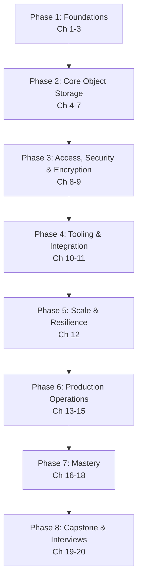

# MinIO & Object Storage — Complete Course

> From "what is object storage?" to designing, securing, and operating production-grade, S3-compatible MinIO clusters — a structured, professional learning path.

---

## Course Overview

MinIO is the leading open-source, S3-compatible **object storage** system — the storage layer behind countless data lakes, backup systems, and cloud-native applications that need to store unstructured data (images, videos, backups, logs, Parquet/ORC files) at massive scale, without the constraints of a traditional filesystem.

This course takes you from absolute beginner to professional, covering:

- What object storage is, and exactly how it differs from block storage and filesystems
- MinIO's internal architecture: erasure coding, distributed server pools, and how objects are physically laid out on disk
- The S3 API: buckets, objects, multipart uploads, and the `mc` client and SDKs
- Data protection: erasure coding math, versioning, and WORM object locking for compliance
- Lifecycle management, identity and access management (IAM), bucket policies, and presigned URLs
- Encryption and key management (SSE-S3, SSE-KMS, SSE-C, KES)
- Event notifications, distributed deployment, site replication, and disaster recovery
- Performance tuning, monitoring, and security hardening for production
- Best practices, common failure modes, and the broader ecosystem (Console, Operator, data-lake integrations)
- Capstone projects and interview preparation

Every chapter builds on the previous one. Concepts are introduced in plain language first, then formalized, then connected to production practice. Because MinIO's value proposition is architectural (erasure coding, S3 compatibility, cloud-native scaling) as much as it is API-shaped, this course spends real time on internals (Chapters 3 and 5) before going deep on day-to-day operations.

---

## Who This Course Is For

You should be comfortable with:

- **Command line basics** — running a shell, installing software, using Docker
- **Basic networking concepts** — what a port, an HTTP request, and TLS are, at a conceptual level
- **General programming literacy** — enough to read a short Python/Go/JS SDK snippet

You do **not** need prior experience with object storage, AWS S3, or distributed storage systems. If you've used AWS S3 before, nearly everything transfers directly — MinIO deliberately implements the S3 API — and this course calls out compatibility points throughout. If you've taken this repo's [PostgreSQL](../postgresql-course/00-index.md), [MongoDB](../mongodb-course/00-index.md), or [ClickHouse](../clickhouse-course/00-index.md) courses, you already have useful contrast: those store structured/semi-structured data behind a query engine, while MinIO stores opaque blobs of any size behind a simple key-based API — a genuinely different storage model worth having side by side.

---

## Learning Roadmap

| Phase | Milestone | Chapters |
|---|---|---|
| 1. Foundations | Explain object storage and MinIO's erasure-coded architecture from memory | 1–3 |
| 2. Core Object Storage | Perform all bucket/object operations, and design for versioning, locking, and lifecycle correctly | 4–7 |
| 3. Access, Security & Encryption | Design IAM policies, bucket policies, presigned URLs, and encryption correctly | 8–9 |
| 4. Tooling & Integration | Operate `mc` and SDKs fluently, and wire up event-driven pipelines | 10–11 |
| 5. Scale & Resilience | Explain distributed deployment and site replication well enough to design a topology | 12 |
| 6. Production Operations | Tune performance, monitor a cluster, and harden it for production | 13–15 |
| 7. Mastery | Apply best practices and recognize known failure modes fluently | 16–18 |
| 8. Capstone & Interviews | Ship a production-grade capstone and pass an object-storage system-design interview | 19–20 |

---

## Estimated Learning Timeline (60 Days)

**Weeks 1–2 — Foundations & Core Object Storage** (Ch 1–7): install MinIO, understand erasure coding and object storage internals, master buckets/objects/multipart uploads, versioning, object locking, and lifecycle rules.
*Project: A media-asset storage service with versioned, lifecycle-managed buckets.*

**Weeks 3–4 — Access, Security & Tooling** (Ch 8–11): IAM policies, bucket policies, presigned URLs, encryption/KES, `mc`/SDK fluency, event-driven pipelines with bucket notifications.
*Project: A secure file-upload service using presigned URLs and event-triggered thumbnail generation.*

**Weeks 5–6 — Scale, Performance & Production Operations** (Ch 12–15): distributed server pools, site replication and DR, performance tuning with `warp`, Prometheus/Grafana monitoring, security hardening.
*Project: A multi-node distributed MinIO cluster with cross-site replication and full observability.*

**Weeks 7–8 — Mastery & Capstone** (Ch 16–20): best practices, common pitfalls, the broader ecosystem (Console, Operator, data-lake integrations), capstone project, interview preparation.
*Project: A production-grade capstone — an S3-compatible data lake backing a Kubernetes-deployed analytics platform.*

If you can commit ~1–1.5 hours/day, 60 days is realistic for professional proficiency. Compress to ~2-3 weeks at 3–4 hours/day if you already know AWS S3 or another object store well.

---

## Prerequisites

See [Chapter 1](./01-introduction-and-prerequisites.md) for a full self-assessment, covering:

- **Command line & Docker**: comfort running containers and a terminal
- **Basic networking**: ports, HTTP, TLS at a conceptual level
- **Optional but helpful**: prior AWS S3 experience (near-total API overlap, never required)

---

## Complete Chapter Index

| # | Chapter | What You'll Learn |
|---|---|---|
| 01 | [Introduction & Prerequisites](./01-introduction-and-prerequisites.md) | What object storage is, MinIO vs. block/file storage, S3 API history, self-assessment, installation |
| 02 | [Core Concepts](./02-core-concepts.md) | Buckets, objects, keys/prefixes, metadata, the S3 API model, terminology |
| 03 | [Architecture & Internals](./03-architecture-and-internals.md) | Erasure coding overview, distributed topology, server pools, how objects are stored on disk |
| 04 | [Buckets, Objects & the S3 API](./04-buckets-objects-and-the-s3-api.md) | CRUD via `mc`/SDK/REST, multipart uploads, metadata/tags, prefixes as pseudo-directories |
| 05 | [Erasure Coding & Data Protection](./05-erasure-coding-and-data-protection.md) | Data/parity blocks, EC:N notation, quorum, healing, bit-rot detection |
| 06 | [Versioning & Object Locking](./06-versioning-and-object-locking.md) | Bucket versioning, delete markers, WORM object lock, retention, legal hold |
| 07 | [Lifecycle Management](./07-lifecycle-management.md) | Expiration rules, tiering to other storage classes, noncurrent version cleanup |
| 08 | [Identity, Access Management & Policies](./08-identity-access-management-and-policies.md) | IAM users/groups/policies, STS, bucket policies, presigned URLs, policy evaluation |
| 09 | [Encryption & Key Management](./09-encryption-and-key-management.md) | SSE-S3, SSE-KMS, SSE-C, KES, encryption at rest vs. in transit |
| 10 | [MinIO Client & SDKs](./10-minio-client-and-sdks.md) | `mc` command deep dive, Python/Go/JS SDK usage |
| 11 | [Event Notifications & Integrations](./11-event-notifications-and-integrations.md) | Bucket notifications, Kafka/webhook/NATS integration, event-driven pipelines |
| 12 | [Distributed Deployment & Site Replication](./12-distributed-deployment-and-site-replication.md) | Multi-node/multi-drive topology, expanding clusters, active-active site replication, DR |
| 13 | [Performance Tuning & Benchmarking](./13-performance-tuning-and-benchmarking.md) | Network/disk tuning, the `warp` benchmarking tool, small vs. large object patterns |
| 14 | [Monitoring & Observability](./14-monitoring-and-observability.md) | Prometheus metrics, Grafana dashboards, MinIO Console, audit logging |
| 15 | [Security Best Practices](./15-security-best-practices.md) | TLS everywhere, network hardening, defense-in-depth checklist |
| 16 | [Best Practices](./16-best-practices.md) | Consolidated professional checklist across the whole stack |
| 17 | [Common Mistakes & Pitfalls](./17-common-mistakes-and-pitfalls.md) | Failure modes and how to avoid them |
| 18 | [Tools & Ecosystem](./18-tools-and-ecosystem.md) | MinIO Console, MinIO Operator (Kubernetes), data-lake integrations (Spark/Trino/Iceberg) |
| 19 | [Capstone Projects](./19-capstone-projects.md) | Beginner → production-grade project specs and architecture |
| 20 | [Interview Preparation](./20-interview-preparation.md) | Q&A, system design, troubleshooting, production case studies |

---

## Milestones Checklist

- [ ] Explain object storage vs. block/file storage, and why erasure coding protects data without full replication's storage cost
- [ ] Perform all bucket/object operations via `mc` and at least one SDK, including multipart uploads
- [ ] Design a bucket's versioning, object-lock, and lifecycle configuration correctly for a compliance requirement
- [ ] Write IAM policies and bucket policies that grant least-privilege access, and issue a presigned URL
- [ ] Configure encryption (SSE-S3 or SSE-KMS) and explain the difference between at-rest and in-transit protection
- [ ] Build an event-driven pipeline triggered by a bucket notification
- [ ] Explain distributed server pools and site replication well enough to design a multi-node, multi-site topology
- [ ] Benchmark a cluster with `warp` and diagnose a throughput bottleneck
- [ ] Set up Prometheus/Grafana monitoring for a MinIO cluster
- [ ] Complete a production-grade capstone project
- [ ] Answer all interview questions in Chapter 20 confidently

---

## Recommended Resources

**Official docs**: `https://min.io/docs/minio/linux/index.html` (the admin guide and S3-compatibility reference are the pages you'll return to most).

**Tools**: `mc` (MinIO Client CLI), MinIO Console (web UI), `warp` (S3 benchmarking tool), MinIO Operator (Kubernetes-native deployment).

**Interactive practice**: run MinIO locally via Docker or the single-binary distribution — every chapter's exercises are designed to work against a local instance.

**Books/talks**: MinIO's own blog and conference talks for production architecture case studies; the AWS S3 API reference, since MinIO tracks it closely.

**Related courses**: [PostgreSQL](../postgresql-course/00-index.md), [MongoDB & the Aggregation Pipeline](../mongodb-course/00-index.md), and [ClickHouse & Columnar Databases](../clickhouse-course/00-index.md), for contrast with relational, document, and columnar-analytical storage models.

Good luck. Start with **01-introduction-and-prerequisites.md**.

---

  
  <a href="./00-index.md">🏠 Index</a>
  <a href="./01-introduction-and-prerequisites.md">Next: Introduction & Prerequisites →</a>

