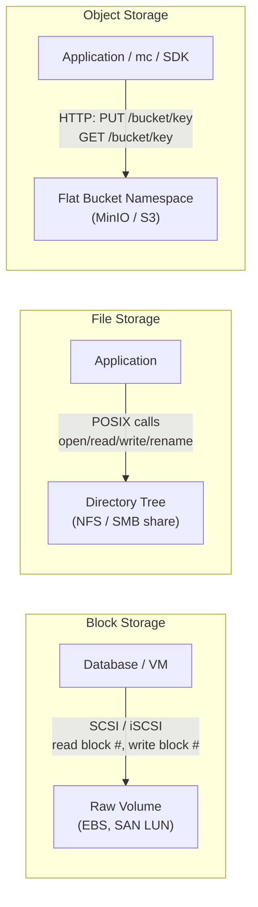
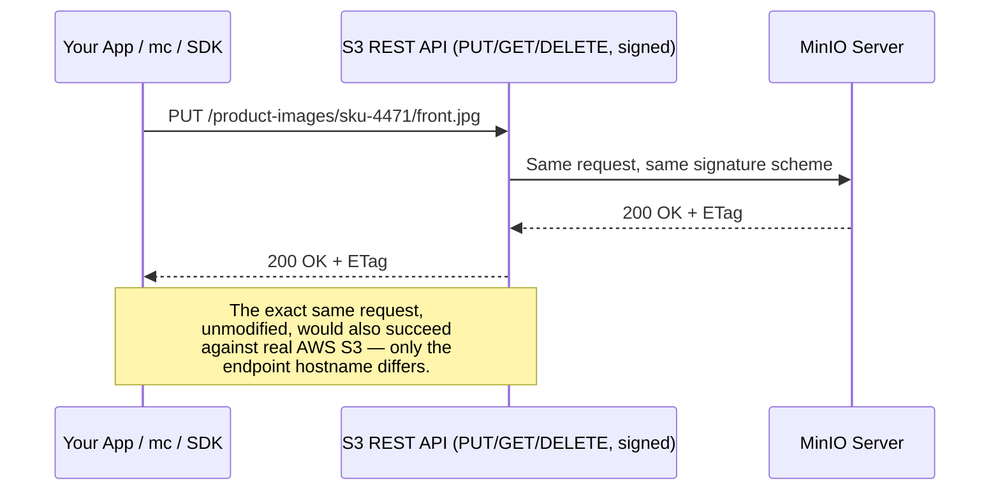

# Introduction & Prerequisites

This is the opening chapter of the MinIO & Object Storage course. Before touching a single `mc` command or spinning up a container, you need a solid mental model of what object storage actually is, how it differs from the storage you may already know (a hard disk, a network share), and where MinIO fits into that landscape. Everything from Chapter 2 onward — buckets, erasure coding, IAM policies, distributed clusters — is built on the foundation laid here. Skimming this chapter will cost you later, because nearly every later chapter assumes you already have this vocabulary and mental model settled.

---

## Learning Objectives

By the end of this chapter, you will be able to:

- Define object storage precisely, and explain how it differs conceptually from block storage and filesystem/file storage.
- Explain what MinIO is, who builds it, and why it exists as a self-hosted alternative to AWS S3.
- Explain why the S3 API became a de facto industry standard, and why MinIO's decision to implement it precisely (rather than invent its own API) is MinIO's single most important design choice.
- Describe MinIO's origin, licensing history, and the business/technical motivations organizations have for self-hosting object storage instead of using a public cloud provider.
- List realistic use cases for object storage (data lakes, backups, user content, AI/ML artifacts, Kubernetes storage) and honestly assess where object storage is a poor fit.
- Install and run a single-node MinIO server using Docker, and interact with it using both the web Console and the `mc` CLI.
- Perform a first end-to-end workflow: create a bucket, upload an object, and download it back.

---

## Prerequisites for This Chapter

This course assumes you are comfortable with foundational tooling, but assumes **nothing** about prior object storage or AWS S3 experience. Specifically, you should already be able to:

- **Use a command line.** Navigate directories, run a program, read its output, and pass flags to it, in a bash-like shell.
- **Run Docker containers.** You don't need to be a Docker expert, but `docker run`, mapping ports with `-p`, and mounting volumes with `-v` should not be new concepts. If they are, spend 30 minutes with Docker's own "Get Started" guide before continuing — this course uses Docker in nearly every hands-on exercise.
- **Understand basic networking and HTTP concepts, conceptually.** You should know what a **port** is (a numbered endpoint on a host that a service listens on), what an **HTTP request** looks like at a high level (a method like `GET`/`PUT`/`POST`/`DELETE`, a URL, headers, and an optional body), and what **TLS** does (encrypts traffic between a client and a server, denoted by `https://`). You do not need to know how to hand-roll a TLS certificate yet — that comes much later (Chapter 15).
- **Read short code snippets.** Later chapters show small SDK examples in Python, Go, or JavaScript. You don't need to write production code in any of them, just follow along.

You do **not** need:

- Any prior experience with AWS S3, Azure Blob Storage, or Google Cloud Storage (though if you have it, nearly everything transfers directly — this chapter calls out the overlap explicitly).
- Any prior distributed-systems background. Concepts like quorum and erasure coding are taught from scratch in Chapter 3 and Chapter 5.
- Any Kubernetes experience. Kubernetes-native deployment is previewed in this chapter and covered in full in Chapter 18; everything before that runs on a single Docker container or a single binary.

**Self-assessment checklist** — before moving to Section 1, confirm you can honestly check off each of these:

- [ ] I can run `docker run <image>` and explain what the `-p` and `-v` flags do.
- [ ] I know what a port number is and can explain the difference between `http://host:9000` and `https://host:9000`.
- [ ] I have a terminal available right now and can install a small CLI tool (`mc`) on my machine.
- [ ] I'm not expecting object storage to behave exactly like the `C:\` drive or `/home` directory on my computer — I'm ready to learn a genuinely different storage model.

If any box is unchecked, address it before continuing — this course moves quickly once the basics are assumed settled.

---

## 1. What Is Object Storage?

**Object storage** is a data storage architecture that manages data as discrete units called **objects**, rather than as files in a directory tree or as raw blocks on a disk.

An **object**, in this sense, is simply:

- A blob of bytes (the actual data — could be a 2 KB JSON file or a 50 GB video file).
- A set of **metadata** describing that blob (content type, size, checksums, custom key-value tags you attach).
- A unique **key** (a string identifier, often looking like a file path, e.g. `product-images/sku-4471/front.jpg`) that addresses it within a **bucket** (a top-level namespace/container — full definitions arrive in Chapter 2).

Three properties define the object storage model, and all three are deliberate departures from how a traditional filesystem works:

1. **Flat namespace, not a directory tree.** There is no real concept of nested folders on disk. A key like `product-images/sku-4471/front.jpg` *looks* like a path with directories, but it's actually just one long string used as a lookup key. The "folder" illusion is purely a convention that clients and consoles render for you — there is no actual directory inode to create, rename, or lock.
2. **Accessed exclusively over HTTP(S), via an API.** You never mount object storage as a local drive and open a file handle to it (not without extra layers, at least). Every read and write is an HTTP request: `PUT` to write an object, `GET` to read one, `DELETE` to remove one. This is the same vocabulary a web browser uses to talk to a web server — which is precisely the point, as Section 3 explains.
3. **Whole-object writes, no in-place partial edits.** You cannot open an object and modify byte 500 of it the way you can with `fseek`/`write` on a local file. To change an object, you upload a brand-new version of it that replaces the old one under the same key. There is no filesystem-style permissions model (no `chmod`, no POSIX ACLs) — access control is handled entirely at the API layer via policies (Chapter 8).

### 1.1 Object storage vs. block storage vs. file storage

To place object storage correctly in your mental map, it helps to contrast it against the two other major storage paradigms you've likely already used, even if you never thought of them by these names.

**Block storage** presents a raw, unformatted volume divided into fixed-size **blocks** (e.g. 4 KB chunks), addressed by block number. This is the storage model behind a physical hard disk, an AWS EBS volume, or a SAN (Storage Area Network) LUN. An operating system or database sits on top of block storage and imposes its own structure on it — a filesystem, or in the case of a database like PostgreSQL, its own internal page/tuple layout. Block storage is what you attach to a single virtual machine when that VM needs low-latency, high-IOPS, randomly-writable storage — exactly what a relational database's write-ahead log needs.

**File storage** (filesystem storage) organizes data in a hierarchical tree of directories and files, accessed via POSIX-style semantics (`open`, `read`, `write`, `rename`, file permissions, symbolic links). Network File System (**NFS**) and Server Message Block (**SMB**/CIFS) are the classic network-attached implementations — think of a shared drive mounted at `/mnt/shared` or `Z:\`. This is the model most people intuitively think of as "how storage works," because it's the model every desktop and laptop OS presents.

**Object storage**, as defined above, discards the directory tree and the POSIX semantics entirely in exchange for radical simplicity and horizontal scalability: a flat key space, whole-object HTTP operations, and rich metadata per object.

| Dimension | Block Storage | File Storage (NFS/SMB) | Object Storage (MinIO/S3) |
|---|---|---|---|
| **Unit of data** | Fixed-size block | File, inside a directory tree | Object (blob + metadata), inside a flat bucket |
| **Addressing** | Block number/offset | Hierarchical path (`/a/b/c.txt`) | Flat key (`a/b/c.txt` — looks hierarchical, isn't) |
| **Access protocol** | SCSI/iSCSI/Fibre Channel (block-level) | POSIX calls over NFS/SMB | HTTP(S) REST API (`GET`/`PUT`/`DELETE`) |
| **Partial in-place edits** | Yes (write to any block/offset) | Yes (`fseek` + `write` mid-file) | No (replace the whole object) |
| **Permissions model** | None (OS/filesystem layer above handles it) | POSIX permissions, ACLs | API-level policies (IAM, bucket policy) — no `chmod` |
| **Typical consumer** | A single VM/database engine (e.g. EBS volume for PostgreSQL) | Shared drives, legacy enterprise apps | Web/mobile apps, data lakes, backups, AI/ML pipelines |
| **Scalability pattern** | Scales by attaching bigger/faster volumes to one host | Scales awkwardly past a certain node/metadata-server limit | Scales horizontally to billions of objects/exabytes |
| **Metadata richness** | Minimal (block has no metadata of its own) | Filesystem attributes (mtime, permissions) | Rich, first-class (content-type, custom tags, arbitrary key-value) |

Keep this table in mind throughout the course — nearly every "why does MinIO work this way?" question in later chapters traces back to one of these rows.



---

## 2. What Is MinIO, Specifically?

**MinIO** is an open-source, high-performance object storage server that you run yourself — on your own hardware, in your own data center, in a private cloud, or in Kubernetes — and that speaks the exact same API as Amazon S3.

Put more plainly: MinIO gives you "your own S3," under your control, wherever you need it. A handful of defining characteristics:

- **Software, not a managed service.** You (or your platform team) install, run, and operate MinIO. There's no MinIO-hosted public cloud endpoint you sign up for and rent by the gigabyte, the way there is with AWS S3 — you deploy the software yourself. (MinIO the company does offer commercial support and an enterprise subscription for that self-hosted software, but the deployment target is always infrastructure you control.)
- **S3-API-compatible by design**, not by accident. This is the single most important fact about MinIO and gets its own full section below.
- **Built to run on commodity hardware.** MinIO doesn't require exotic storage arrays — it's designed to run well on ordinary servers with local disks (JBOD — "just a bunch of disks"), scaling out horizontally by adding more nodes rather than requiring bigger, more expensive single machines.
- **Cloud-native and Kubernetes-friendly from the start.** MinIO ships as a lightweight single binary, runs comfortably in containers, and has a dedicated Kubernetes Operator (previewed in Section 6, covered fully in Chapter 18) for declarative, production-grade deployment on Kubernetes.
- **Positioned as a drop-in alternative to AWS S3** for scenarios where using AWS's actual S3 service isn't the right fit — on-premises data centers, private clouds, regulated industries, edge locations, and air-gapped environments (networks with no internet connectivity at all, common in defense, industrial, and some healthcare settings).

---

## 3. The S3 API: An Industry-Standard Interface

To understand why MinIO exists and why it's designed the way it is, you need to understand the S3 API itself — not as "an AWS product feature" but as a de facto industry standard.

When Amazon launched **S3** (Simple Storage Service) in 2006, it didn't just launch a storage product — it launched a specific **REST API** for interacting with object storage: authenticate a request with a cryptographic signature, then issue an HTTP `PUT` to `https://bucket.s3.amazonaws.com/key` to write an object, a `GET` to the same URL to read it back, a `DELETE` to remove it, and so on, with buckets and object keys as the core addressing scheme.

Because S3 became overwhelmingly popular, this particular shape of API — bucket/key addressing, signed HTTP requests, a specific XML/JSON response format, a specific set of headers for metadata — became something much bigger than "one vendor's product API." It became the **de facto standard interface** for object storage, in the same way that SQL became the de facto standard interface for relational databases regardless of which specific database engine you run. Countless SDKs (`boto3` for Python, the AWS SDK for Java/Go/JS, and dozens more), countless tools (backup software, data pipeline frameworks, analytics engines), and countless other storage vendors all converged on speaking this same API.

This is the context in which MinIO's core design decision makes sense: **MinIO deliberately implements the S3 API as precisely as possible**, rather than inventing its own competing API. The practical payoff is enormous — any application, script, or SDK written to talk to AWS S3 can talk to a MinIO server instead by changing only the **endpoint URL** (and, if self-signed, trusting its TLS certificate). Your code doesn't know or care that it's talking to MinIO instead of AWS; it's issuing the same signed `GET`/`PUT`/`DELETE` requests either way.



This is why the course's self-assessment (and the index page) says: if you already know AWS S3, "nearly everything transfers directly." It isn't a marketing simplification — it's the literal, deliberate engineering goal MinIO was built around.

---

## 4. History and Motivation

### 4.1 Origin

MinIO was founded in 2014 by a team that had previously worked on large-scale storage and infrastructure software (including prior work at companies building storage and cloud infrastructure products). It was built **developer-first and cloud-native from day one** — designed to be started with a single binary and no complex setup, and to run comfortably inside containers and Kubernetes at a time when "cloud-native" was just becoming the industry's default posture for new infrastructure.

On licensing: MinIO's server was originally released under the **Apache License 2.0**, a permissive open-source license. It later moved to the **GNU AGPLv3** (Affero General Public License), a copyleft license that, notably, extends copyleft obligations to software offered as a network service — a detail that matters if you're evaluating MinIO for a commercial product and should be reviewed with your organization's legal/compliance process, alongside MinIO's commercial licensing options for cases where AGPLv3 obligations aren't a fit.

### 4.2 Why organizations choose self-hosted object storage

If AWS S3 already exists as a mature, reliable, pay-as-you-go service, why would anyone run their own object storage at all? The reasons recur constantly in real deployments:

- **Data sovereignty and compliance.** Regulations (data residency laws, industry-specific rules in finance/healthcare/government) sometimes require that data physically stay within a specific country, region, or even a specific building's network, in a way that's simplest to guarantee by controlling the physical infrastructure yourself.
- **Cost at scale.** Public cloud storage costs (storage + egress/data-transfer fees, in particular) can become the largest line item in an infrastructure budget once you're storing and moving petabytes; self-hosting on owned or leased hardware can be substantially cheaper at sufficient scale, especially where cloud egress fees are involved.
- **On-premises, edge, and air-gapped requirements.** Some environments simply cannot reach the public internet at all (regulated industrial control systems, classified government networks, remote edge sites with unreliable connectivity) but still need an S3-compatible API for their applications and tooling to work against.
- **Hybrid-cloud and multi-cloud portability.** Running the same S3-compatible storage layer on-prem and in multiple clouds avoids re-architecting applications per environment, and avoids being structurally locked into one cloud vendor's proprietary storage APIs.
- **Avoiding vendor lock-in.** Because the S3 API is a portable standard (Section 3), choosing MinIO keeps your application code portable too — you can move workloads between on-prem, MinIO-on-Kubernetes, and actual AWS S3 with minimal code changes, preserving negotiating leverage and architectural flexibility.

---

## 5. Real-World Use Cases

Object storage in general, and MinIO specifically, shows up constantly in modern infrastructure. The most common patterns:

- **Data lakes for analytics.** Storing raw and processed data — commonly in columnar formats like **Parquet** or **ORC** — in object storage, then querying it directly with engines like Spark, Trino, or ClickHouse-style analytical engines, without needing to first load it into a traditional database. Object storage's cheap, elastic capacity is what makes "store everything, query it later" economically viable at large scale.
- **Backup and disaster recovery targets.** Object storage's durability (via erasure coding, Chapter 5) and immutability options (via versioning and WORM object locking, Chapter 6) make it a natural target for database backups, VM snapshots, and archival data.
- **User-uploaded content for applications.** Images, videos, documents, and other files uploaded by end users of a web or mobile app are a textbook object storage workload: each upload is a self-contained blob, written once, read many times, rarely edited in place.
- **AI/ML training data and model artifact storage.** Training datasets (often large collections of images, text, or other files) and the resulting trained model checkpoints/artifacts are commonly stored in object storage, where ML training and inference jobs — often running in Kubernetes — can pull them over the S3 API from any node in a cluster.
- **Kubernetes persistent storage via CSI.** Through the Container Storage Interface (CSI), Kubernetes workloads can provision and consume S3-compatible object storage as part of their persistent storage strategy, particularly for stateless-friendly, blob-shaped data (as opposed to the block storage typically used for a database's primary volume).

---

## 6. Honest Tradeoffs: What Object Storage Is Bad At (and Great At)

A good engineer evaluates a tool by knowing where it *doesn't* fit, not just where it does. Be direct with yourself about this before you design anything with MinIO.

**What object storage is bad at:**

- **No partial in-place edits.** You cannot modify a few bytes in the middle of an existing object efficiently. Every update means rewriting (and re-uploading) the full object under its key. Workloads that need frequent small, in-place mutations of a large file are a poor fit.
- **Not a substitute for a database.** Object storage has no query language, no indexes over object *contents*, no transactions, no joins. If you need to query "all rows where `status = 'active'`," you need a real database (or a query engine layered on top of object storage, as in the data lake pattern above) — not object storage doing that job alone.
- **Not a substitute for a POSIX filesystem needing real-time small random writes.** Workloads like a database's write-ahead log, a filesystem-backed message queue doing constant small appends, or an application expecting `fsync`-level durability guarantees on tiny writes should stay on block or file storage.
- **Consistency semantics require care in distributed setups.** Some operations, especially in a distributed, multi-node cluster, can exhibit eventual-consistency-style behavior in specific scenarios (e.g., propagation of certain metadata operations across nodes) — this is an architectural nuance to understand before designing for scenarios with extremely tight consistency requirements. (MinIO's own consistency model is covered precisely in Chapter 3.)

**What object storage is excellent at:**

- **Massive scale of immutable or append-style objects.** Billions of objects, exabytes of data, with a simple, uniform access pattern (write once, read many).
- **High throughput for whole-object reads and writes**, especially when parallelized across many objects and many clients simultaneously.
- **A radically simple access model.** A flat key space and an HTTP API are trivially easy to reason about, cache, load-balance, and scale horizontally, compared to the complexities of distributed POSIX filesystem semantics.
- **Resilience through erasure coding** (Chapter 5 goes deep on the math), giving strong durability guarantees against disk and node failures without paying the full storage cost of naive full replication.

---

## 7. Installation Options

You have three broad ways to run MinIO, each suited to a different stage of adoption:

1. **Docker** — the fastest way to get a working single-node MinIO server for learning and local development. This is what this course's exercises use throughout the early chapters.
2. **Single binary on bare metal / a VM** — MinIO ships as a single statically-linked binary per OS/architecture, with no external runtime dependencies. You download it, mark it executable, and run it directly against one or more local disks — the natural next step once you're past pure learning and want to understand real disk-backed deployment.
3. **Kubernetes, via the MinIO Operator** — a Kubernetes-native way to declaratively deploy, scale, and manage MinIO clusters using Custom Resource Definitions (CRDs). This is the standard production deployment path for cloud-native environments and gets full treatment in Chapter 18; for now, just know it exists as the natural endpoint of the path you're starting on today.

### 7.1 Running MinIO with Docker

Run this to start a single-node MinIO server locally:

```bash
docker run -d \
  --name minio-local \
  -p 9000:9000 \
  -p 9001:9001 \
  -e "MINIO_ROOT_USER=minioadmin" \
  -e "MINIO_ROOT_PASSWORD=minioadmin123" \
  -v ~/minio-data:/data \
  quay.io/minio/minio server /data --console-address ":9001"
```

Breaking this down:

- `-p 9000:9000` exposes the **S3 API port** — this is the endpoint your applications, SDKs, and `mc` will talk to.
- `-p 9001:9001` exposes the **Console (web UI) port** — this is what you open in a browser.
- `-e "MINIO_ROOT_USER=..."` / `-e "MINIO_ROOT_PASSWORD=..."` set the root credentials (the initial admin identity — Chapter 8 covers proper IAM users beyond this root account). The password must be at least 8 characters.
- `-v ~/minio-data:/data` mounts a local directory as MinIO's data directory, so your objects survive a container restart.
- `server /data --console-address ":9001"` is the command MinIO runs: start the server, use `/data` as the storage path, and bind the Console to port 9001.

Verify it's running:

```bash
docker logs minio-local
```

You should see log output confirming the API endpoint (`http://<container-ip>:9000`) and Console endpoint are live, along with the root credentials you set.

---

## 8. The MinIO Console and the `mc` CLI

You'll interact with a MinIO cluster in two primary ways throughout this course:

- **The MinIO Console** — a web-based UI (served on port 9001 in the Docker example above) for browsing buckets and objects, managing users and policies, watching metrics, and performing one-off administrative tasks visually. Open `http://localhost:9001` in a browser and log in with the root user/password you set above.
- **`mc` (MinIO Client)** — a cross-platform command-line tool for everything the Console can do, plus scripting, automation, and the fast day-to-day workflows you'll use constantly in this course and in real operations. `mc` also happens to work against real AWS S3 and any other S3-compatible service, using the same alias-based configuration shown below.

### 8.1 Installing `mc`

On Linux/macOS:

```bash
curl https://dl.min.io/client/mc/release/linux-amd64/mc \
  --create-dirs \
  -o ~/minio-binaries/mc

chmod +x ~/minio-binaries/mc
export PATH=$PATH:~/minio-binaries/

mc --version
```

(macOS users can alternatively run `brew install minio/stable/mc`.)

### 8.2 Your first `mc` workflow

**Step 1 — register an alias.** An **alias** is a named shortcut `mc` uses to remember an endpoint URL plus its credentials, so you don't retype them on every command:

```bash
mc alias set local http://localhost:9000 minioadmin minioadmin123
```

- `local` is the alias name you're choosing (you'll use it as a prefix in every subsequent command).
- `http://localhost:9000` is the S3 API endpoint (not the Console port).
- The last two arguments are the access key and secret key — here, the root credentials from Section 7.1.

**Step 2 — verify connectivity:**

```bash
mc admin info local
```

This should print cluster health information, confirming `mc` can authenticate and talk to your server.

**Step 3 — create a bucket:**

```bash
mc mb local/product-images
```

**Step 4 — upload a file (`cp`, following the S3-inherited convention of `cp` for "copy an object," not `mv` or `put`):**

```bash
echo "hello object storage" > /tmp/hello.txt
mc cp /tmp/hello.txt local/product-images/hello.txt
```

**Step 5 — list and confirm:**

```bash
mc ls local/product-images
```

You've just performed the exact same conceptual operation — a signed HTTP `PUT` to a bucket/key path — that any S3 SDK performs. Chapter 2 formalizes every term used loosely here (bucket, key, object); Chapter 10 goes much deeper on `mc` itself.

---

## Real-World Scenario

**ShelfSnap** is a small startup building an app that lets small retailers photograph their store shelves and get automated inventory insights. ShelfSnap is this course's running example company — you'll see it again in later chapters managing a `product-images` bucket (for the shelf photos themselves) and an `analytics-lake` bucket (for the Parquet files produced by their analytics pipeline).

Right now, ShelfSnap is at an early, painful inflection point. Their app server has been saving every uploaded shelf photo directly onto its own local disk, in a directory structure organized by store ID and date. It worked fine with 50 pilot customers. Six months and 4,000 customers later, three problems have converged at once:

1. **The disk is nearly full**, and resizing it means downtime and a slow, risky migration of millions of small files.
2. **Only one app server can see those files**, which now blocks the team from running more than one server instance for redundancy or scaling — every server would need to see the same photos, but a local disk on one machine is not what any of the others can reach.
3. **A new enterprise customer's procurement team has asked, in writing, exactly where their uploaded photos are physically stored**, for a data-sovereignty and compliance review — a question ShelfSnap's founders realize they can't confidently answer about a laptop-era "just write to disk" architecture designed for a demo, not a real customer base.

The engineering team evaluates two paths: move everything to AWS S3, or self-host MinIO. AWS S3 would solve problems (1) and (2) immediately with minimal engineering effort, but the team is wary of long-term storage and egress costs at their projected growth curve, and the enterprise customer's compliance review specifically favors infrastructure they can point to concretely and, if needed, keep within a named data center for contractual/regulatory reasons.

They decide to pilot **self-hosted MinIO**: a `product-images` bucket replaces the local disk entirely, addressed via the S3 API from every app server instance identically (solving problem 2), scaled by adding disks/nodes instead of resizing one volume (addressing problem 1), and running on hardware in a data center whose physical location and access controls the team can describe precisely to the enterprise customer's compliance team (addressing problem 3). Because the S3 API is what both AWS S3 and MinIO speak, the team also knows this decision isn't permanent lock-in either way — if their calculus changes later, the application code barely has to change to point at AWS S3 instead, or vice versa.

This exact `product-images` bucket, and the `analytics-lake` bucket ShelfSnap builds later for its Parquet-based analytics pipeline, recur throughout this course as the running example for versioning, lifecycle rules, IAM policies, and more.

---

## Best Practices

- **Learn on a local Docker instance before touching anything production-shaped.** Every exercise in this course is designed to work against the single-node Docker setup from Section 7 — there's no reason to risk a shared or production cluster while you're still building fundamentals.
- **Always address objects through the S3 API, never by reaching into MinIO's underlying disk files directly.** MinIO's on-disk layout (Chapter 3) is an internal implementation detail, not a stable interface — treat it the way you'd treat a database's raw data files: never touched directly.
- **Treat every MinIO endpoint like any other S3 endpoint in your tooling.** Configure SDKs, backup tools, and data pipelines to point at MinIO exactly as they would AWS S3 (endpoint URL, access key, secret key) — this is the entire point of S3 compatibility, and fighting it by writing MinIO-specific integration code defeats the purpose.
- **Give your `mc` aliases clear, environment-scoped names** (`local`, `staging`, `prod-dr-site`) from day one — it prevents the extremely common mistake of running a destructive command (like `mc rb --force`) against the wrong cluster.
- **Change default root credentials immediately, even in local learning environments**, to build the habit before it matters in production — Chapter 8 will have you replace root usage with scoped IAM users entirely.
- **Read error messages from `mc` and the S3 API carefully.** They're standard S3 error codes/messages (e.g., `NoSuchBucket`, `AccessDenied`), which means the skill of reading them transfers directly to debugging real AWS S3 issues too.

---

## Common Mistakes

- **Assuming MinIO is a general-purpose network filesystem.** Bucket/key names that *look* like paths (`store-42/2026-07-06/photo.jpg`) trick people into expecting `mkdir`-style directory semantics, symbolic links, or the ability to "cd into" part of a key — none of which exist. It's a flat namespace with path-shaped strings, not a hierarchy.
- **Expecting POSIX rename or partial-write semantics on objects.** There is no atomic "rename" of an object the way there is `mv` on a filesystem (renaming means copying to a new key and deleting the old one), and there is no way to `seek()` into an object and overwrite five bytes in place.
- **Manually inspecting or modifying MinIO's on-disk files directly**, bypassing the API — e.g., poking around in the mounted `/data` volume with `ls`/`cat`/`vim`. This breaks MinIO's internal invariants (erasure-coded shards, metadata consistency) and is never a supported operation.
- **Confusing the Console port and the API port.** Pointing an SDK or `mc alias` at port 9001 (the Console) instead of 9000 (the S3 API), or vice versa when trying to open the web UI, is a very common early setup mistake.
- **Treating the root user as a normal application credential.** Using `MINIO_ROOT_USER`/`MINIO_ROOT_PASSWORD` directly inside application code or CI pipelines, instead of creating scoped IAM users with least-privilege policies (Chapter 8), is a security anti-pattern that's easy to fall into during quick local testing and easy to forget to fix before production.
- **Deploying a single-node, single-disk MinIO instance and expecting production-grade durability from it.** A one-node setup is fine for learning (this chapter) but has none of the erasure-coding-driven fault tolerance that makes MinIO resilient in Chapter 5's distributed designs — don't mistake "it's running" for "it's protected against disk failure."

---

## Summary

- **Object storage** manages data as objects (a blob plus metadata) addressed by a flat key over HTTP, deliberately forgoing directory trees, in-place partial edits, and POSIX permissions — in contrast to **block storage** (raw, block-addressed volumes for VMs/databases) and **file storage** (hierarchical, POSIX-semantic network shares like NFS/SMB).
- **MinIO** is an open-source, self-hosted, S3-API-compatible object storage server built for commodity hardware, bare metal, and Kubernetes, positioned as a drop-in alternative to AWS S3 for on-prem, private cloud, and edge use cases.
- The **S3 API** — signed HTTP `PUT`/`GET`/`DELETE` requests against bucket/key paths — became a de facto industry standard after Amazon popularized it; MinIO's core design bet is to implement that exact API so existing S3 tooling and code work against it unmodified, aside from the endpoint.
- Organizations self-host object storage for **data sovereignty/compliance, cost at scale, on-prem/edge/air-gapped needs, hybrid-cloud portability, and avoiding vendor lock-in**.
- Common real-world uses include **data lakes, backup/DR targets, user-uploaded content, AI/ML data and model artifacts, and Kubernetes persistent storage**.
- Object storage is a poor fit for **in-place partial edits, database-style querying, and workloads needing real-time small random writes**, but excellent for **massive-scale immutable object storage, high throughput, a simple flat access model, and erasure-coded resilience**.
- You can run MinIO via **Docker** (used throughout this course), a **single binary** on bare metal, or via the **Kubernetes Operator** (Chapter 18), and interact with it via the **Console** (web UI) or the **`mc` CLI**.

---

## Knowledge Check

1. Explain, in your own words, why an object storage key like `store-42/2026-07-06/photo.jpg` does not represent a real directory structure the way it would on a local filesystem.
2. A colleague wants to store a relational database's live data files directly in MinIO instead of on a block-storage volume. Using this chapter's tradeoffs section, explain why that's likely a poor fit.
3. Why does MinIO implement the S3 API precisely, rather than designing its own, different API? What concrete benefit does that decision produce for a developer migrating an application from AWS S3 to MinIO?
4. Name two distinct business/technical motivations an organization might have for self-hosting object storage instead of using AWS S3 directly, and explain each in one or two sentences.
5. What is the difference between the port used for the MinIO Console and the port used for the S3 API in the Docker example from this chapter, and what happens if you configure an SDK to use the wrong one?

---

## Hands-On Exercise

Complete this exercise on your own machine before moving to Chapter 2.

1. **Run MinIO via Docker**, using the command from Section 7.1 (adjust the root password if you like, keeping it at least 8 characters):

   ```bash
   docker run -d \
     --name minio-local \
     -p 9000:9000 \
     -p 9001:9001 \
     -e "MINIO_ROOT_USER=minioadmin" \
     -e "MINIO_ROOT_PASSWORD=minioadmin123" \
     -v ~/minio-data:/data \
     quay.io/minio/minio server /data --console-address ":9001"
   ```

2. **Confirm the container is healthy**: `docker logs minio-local` and open `http://localhost:9001` in a browser, logging in with the root credentials.

3. **Install `mc`** following Section 8.1, and confirm it works with `mc --version`.

4. **Register an alias** pointing at your local server:

   ```bash
   mc alias set local http://localhost:9000 minioadmin minioadmin123
   mc admin info local
   ```

5. **Create a bucket** named `product-images` (ShelfSnap's bucket from the Real-World Scenario):

   ```bash
   mc mb local/product-images
   ```

6. **Upload a file** to it:

   ```bash
   echo "ShelfSnap's first uploaded object" > /tmp/shelf-1.txt
   mc cp /tmp/shelf-1.txt local/product-images/shelf-1.txt
   ```

7. **Download it back** to a new local path, and confirm the contents match:

   ```bash
   mc cp local/product-images/shelf-1.txt /tmp/shelf-1-downloaded.txt
   cat /tmp/shelf-1-downloaded.txt
   ```

8. **Verify in the Console too**: refresh `http://localhost:9001`, open the `product-images` bucket, and confirm you can see `shelf-1.txt` listed there — the same object, visible through both interfaces.

If all eight steps succeed, you have a working local MinIO environment and have performed a complete write/read cycle through both the CLI and the web UI — you're ready for Chapter 2.

---

## Further Reading

- [MinIO Object Storage for Linux — Official Documentation](https://min.io/docs/minio/linux/index.html) — the canonical admin guide; you'll return to this repeatedly throughout the course.
- [MinIO Client (`mc`) Complete Guide](https://min.io/docs/minio/linux/reference/minio-mc.html) — full command reference for the CLI introduced in this chapter.
- [Amazon S3 REST API Reference](https://docs.aws.amazon.com/AmazonS3/latest/API/Welcome.html) — the industry-standard API specification MinIO implements; useful background for understanding exactly what "S3-compatible" commits MinIO to.
- [MinIO Docker Quickstart Guide](https://min.io/docs/minio/container/index.html) — official documentation for the Docker-based deployment used throughout this chapter's exercises.
- [MinIO Kubernetes Operator Documentation](https://min.io/docs/minio/kubernetes/upstream/index.html) — previewed in Section 7 of this chapter; full depth arrives in Chapter 18.

---

<div style="display:flex;justify-content:space-between;align-items:center;">
  <a href="./00-index.md">← Previous: Index</a>
  <a href="./00-index.md">🏠 Index</a>
  <a href="./02-core-concepts.md">Next: Core Concepts →</a>
</div>
