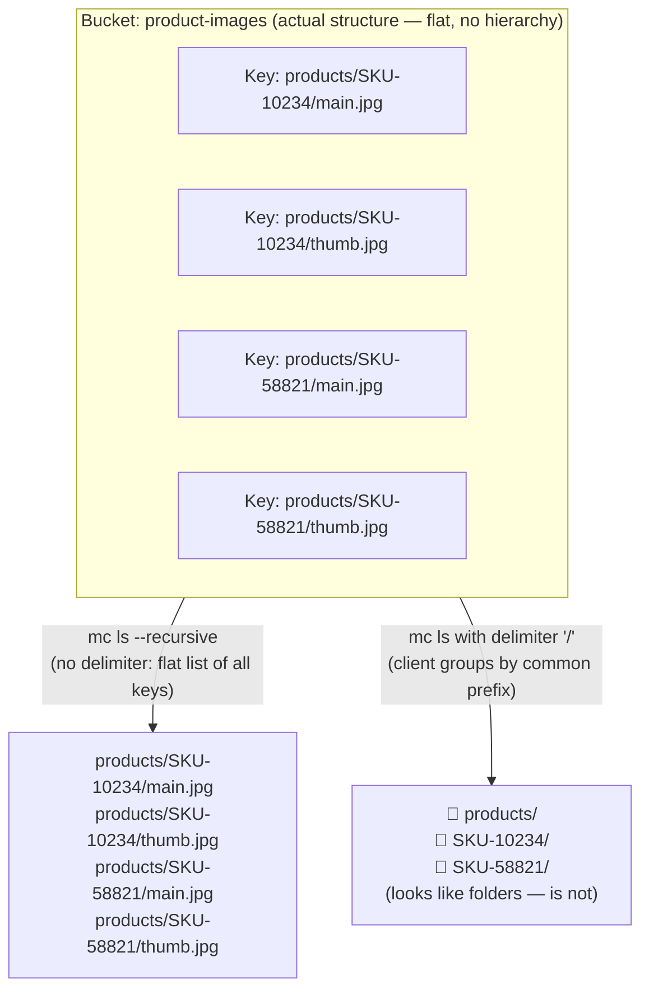
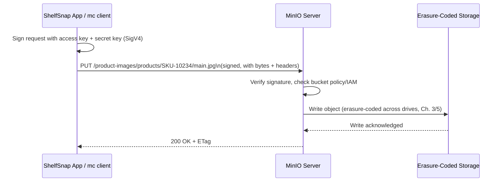

# Core Concepts

Chapter 1 gave you the elevator pitch: MinIO is an S3-compatible object storage system, it's different from the block storage and filesystems you're used to, and you now have it installed and running. That was the "what" and the "why." This chapter is the "how it's structured conceptually" — the vocabulary and mental model you'll use in every remaining chapter of this course, from multipart uploads in Chapter 4 to distributed site replication in Chapter 12.

Nothing here requires a running cluster beyond what you already set up in Chapter 1, and the hands-on exercise at the end only needs a single `mc` alias pointed at your local MinIO instance. This is the chapter where you build the map before you start walking the terrain — skimming it will cost you later. To make the abstract concrete, this chapter introduces a running example — a company called **ShelfSnap** — that later chapters (all the way through Chapter 18) will keep reusing, so the terminology defined here has a concrete anchor for the rest of the course.

---

## Learning Objectives

By the end of this chapter, you will be able to:

- Define **bucket**, **object**, and **key**, and state MinIO's bucket naming rules from memory.
- Explain precisely why an object storage "path" like `products/SKU-10234/main.jpg` is not a real directory path — and why that distinction matters in practice.
- Distinguish system metadata, user-defined metadata, and object tags, and explain when to use each.
- Describe the S3 API conceptually as a small set of HTTP verbs (`PUT`, `GET`, `DELETE`, `LIST`) operating on keys within a bucket, authenticated by a signed request.
- Explain what "S3-compatible" means in practice, and why swapping AWS S3 for a MinIO endpoint is often a one-line configuration change.
- Map MinIO's bucket/object model against the storage models of PostgreSQL, MongoDB, and ClickHouse, if you've taken those courses in this repo.
- Use the `mc` client to create a bucket, upload objects under a key prefix, and inspect an object's metadata.

---

## Prerequisites for This Chapter

This chapter builds directly on [Chapter 1: Introduction & Prerequisites](./01-introduction-and-prerequisites.md). We assume you already have:

- A working MinIO server (local Docker container or single binary) from Chapter 1's installation walkthrough.
- The `mc` (MinIO Client) CLI installed and an alias configured against your local server.
- A conceptual understanding of object storage vs. block storage vs. filesystems, and where MinIO fits, as covered in Chapter 1.
- Basic comfort with HTTP (what a request method, a URL, and a status code are) and the command line.

If any of that feels shaky, go back to Chapter 1 before continuing — everything below assumes it as settled ground.

---

## 1. Introducing the Running Example: ShelfSnap

Throughout this course, examples need somewhere to live. Rather than inventing a new scenario in every chapter, we'll build out one company's storage backend incrementally, chapter by chapter, so that later material can say "recall the `product-images` bucket from Chapter 2" and you'll know exactly what's meant.

**The scenario:** ShelfSnap is a (fictional) e-commerce tooling company. Retailers upload product photos, and ShelfSnap's service generates optimized variants (thumbnails, web-sized main images) for use in online storefronts. ShelfSnap needs somewhere to durably store the original and derived images, at a scale that will eventually reach tens of millions of objects, accessible over a simple HTTP API from web servers, background workers, and a CDN.

ShelfSnap will use two MinIO buckets across this course:

- **`product-images`** — introduced in this chapter — holds product photography: original uploads and generated variants, one object per file, addressed by keys such as `products/SKU-10234/main.jpg` and `products/SKU-10234/thumb.jpg`.
- **`analytics-lake`** — introduced here and used in depth starting in Chapter 7 — holds Parquet files that record ShelfSnap's product-view and click events, forming a small data lake queried by analytical engines (a natural companion to this repo's [ClickHouse course](../clickhouse-course/00-index.md), which covers querying columnar data at scale). We'll create the bucket now and revisit it heavily in Chapters 7, 12, and 18.

Every later chapter that needs a concrete example — versioning (Ch 6), lifecycle rules (Ch 7), IAM policies (Ch 8), encryption (Ch 9), event notifications (Ch 11), distributed replication (Ch 12), and the ecosystem chapter (Ch 18) — will reuse these two buckets rather than introducing new, disconnected examples. Keep the names in mind: `product-images` and `analytics-lake`.

Let's create both buckets now, so the rest of this chapter has something concrete to point at:

```bash
# Create the two buckets that recur throughout this course
mc mb local/product-images
mc mb local/analytics-lake

# Confirm they exist
mc ls local
```

(`local` here is the alias name you configured for your MinIO server in Chapter 1 — substitute whatever alias you actually used.)

---

## 2. Buckets: The Top-Level Namespace

A **bucket** is the top-level container for objects in MinIO — the S3 API's equivalent of a root namespace. Every object you store lives inside exactly one bucket. There is no nesting of buckets inside buckets; the bucket is always the outermost, flat organizational unit.

A few defining properties:

- **A bucket is a flat namespace of keys**, not a filesystem volume. It doesn't have a size limit of its own — it can hold a handful of objects or billions, constrained only by the underlying cluster's storage capacity.
- **Bucket names must be DNS-compatible.** This is inherited directly from the S3 API's design, where a bucket can be addressed as part of a hostname (`bucket-name.s3.amazonaws.com`, and similarly for MinIO with virtual-hosted-style addressing). Concretely, that means:
  - 3–63 characters long
  - lowercase letters, numbers, hyphens, and periods only
  - must start and end with a letter or number
  - no underscores, no uppercase letters, no consecutive periods
  - must not be formatted like an IP address (e.g., `192.168.1.1`)
- **Uniqueness is scoped to the deployment**, not the entire internet. On AWS S3, bucket names must be globally unique across *all* AWS accounts worldwide, which is a frequent source of "bucket name already taken" surprises for newcomers. On a self-hosted MinIO cluster, names only need to be unique within that cluster — you own the whole namespace, so there's no competing with strangers for `product-images`. This is one of the few genuine points of divergence from AWS S3 behavior worth knowing early.
- **One flat bucket per logical collection is the idiomatic pattern.** Rather than trying to recreate a directory tree of buckets (`company/team/project/`), MinIO deployments typically use a small number of purpose-named buckets (`product-images`, `analytics-lake`, `backups`, `logs`) and rely on key prefixes (Section 4) *inside* each bucket to organize things further.

Creating a bucket with `mc` is a single command, which is exactly what we did above:

```bash
mc mb local/product-images
mc mb local/analytics-lake
```

`mb` stands for "make bucket." Under the hood, this issues a `PUT` request to the S3 API's bucket-creation endpoint — more on the request model in Section 5.

---

## 3. Objects: The Data, Plus Its Metadata and Tags

An **object** is the actual unit of data MinIO stores — any sequence of bytes, from a few bytes (a tiny JSON config file) to many terabytes (a single object can be enormous, uploaded via **multipart upload**, which splits it into parts uploaded in parallel and reassembled server-side; Chapter 4 covers multipart uploads in full depth). Unlike a database row or a document, MinIO has no idea what's inside an object — it's opaque bytes as far as the storage layer is concerned. It doesn't matter whether it's a JPEG, a video file, a database backup, or a Parquet file; MinIO stores and returns bytes, and it's entirely up to the application to interpret them.

Every object has three things associated with it:

### 3.1 The object's data (the bytes)

This is simply the content — what you'd get back from a `GET` request. For ShelfSnap, this is the literal JPEG bytes of a product photo.

### 3.2 System metadata

Every object automatically carries a set of system-managed metadata fields, maintained by MinIO itself:

| Field | What it is |
|---|---|
| `Content-Type` | The MIME type of the object (e.g., `image/jpeg`), either supplied at upload time or inferred |
| `ETag` | A content identifier, typically an MD5 hash for a single-part upload (see Section 6) |
| `Last-Modified` | Timestamp of the most recent write to this object |
| `Content-Length` | Size of the object in bytes |

You don't set most of these directly — they're derived from the upload itself (though `Content-Type` is commonly specified explicitly by the uploading client, since MinIO can't always guess it reliably).

### 3.3 User-defined metadata

Beyond system fields, you can attach your own arbitrary key-value metadata to an object at upload time — conventionally prefixed `x-amz-meta-` at the HTTP header level (a naming convention inherited from the S3 API; MinIO honors it identically). For example, ShelfSnap might attach:

```
x-amz-meta-uploaded-by: retailer-portal
x-amz-meta-original-filename: IMG_4821.HEIC
x-amz-meta-sku: SKU-10234
```

User-defined metadata is set once at upload time and is otherwise immutable without rewriting the object (metadata changes typically require a copy-in-place operation) — it's meant for descriptive, mostly-static information about the object itself.

### 3.4 Tags — a separate, queryable mechanism

**Object tags** look superficially similar to user-defined metadata (they're also key-value pairs), but they serve a fundamentally different purpose and live in a fundamentally different system. Tags are:

- **Mutable independently of the object's content** — you can add, change, or remove tags without touching or re-uploading the object's bytes.
- **Designed to be queried and acted upon** by MinIO itself — most importantly, by **lifecycle rules** (Chapter 7), which can say "expire any object tagged `archive=true` after 90 days," and by **bucket policies** (Chapter 8), which can grant or deny access based on an object's tags.

A rough rule of thumb you'll see formalized in Chapter 7: **use metadata to describe what an object *is*; use tags to describe what should *happen* to it.** For ShelfSnap, a product image might carry the tag `retention=standard` or `status=pending-review` — values the lifecycle engine or an access policy can act on — while its metadata carries `original-filename` and `uploaded-by`, purely descriptive facts nothing downstream needs to query in bulk.

---

## 4. Keys and the Flat Namespace: There Are No Folders

This is the single most important — and most frequently misunderstood — concept in this chapter.

### 4.1 A key is just a string

Every object inside a bucket is identified by a **key**: a single, opaque string, unique within that bucket. For ShelfSnap's product images, the keys look like:

```
products/SKU-10234/main.jpg
products/SKU-10234/thumb.jpg
products/SKU-58821/main.jpg
```

It is extremely tempting to read `products/SKU-10234/main.jpg` and think "there's a `products` folder, containing a `SKU-10234` folder, containing a file called `main.jpg`." **This is not what is happening, and the distinction matters.**

There is no `products` folder. There is no `SKU-10234` folder. There is exactly **one object**, whose entire key is the literal 30-character string `products/SKU-10234/main.jpg`. The bucket's actual internal structure is a flat set of (key → object) pairs:

```
product-images/
  "products/SKU-10234/main.jpg"   -> [bytes]
  "products/SKU-10234/thumb.jpg"  -> [bytes]
  "products/SKU-58821/main.jpg"   -> [bytes]
```

There is no tree. There is no directory inode. There is no parent-child relationship stored anywhere. The `/` characters are ordinary characters in a string, with no more inherent meaning to MinIO's storage engine than a hyphen or an underscore.

### 4.2 Where the "folder illusion" comes from

So why does `mc ls product-images/products/` show something that looks exactly like a directory listing? Because the S3 API supports listing a bucket's keys with two optional parameters:

- **`prefix`** — only return keys that start with this string (e.g., `products/SKU-10234/`)
- **`delimiter`** — usually `/`; when set, the listing groups keys by "the part between the prefix and the next occurrence of the delimiter" and reports those groups as `CommonPrefixes` instead of individual keys.

When a client — `mc`, the MinIO Console, a GUI S3 browser, the AWS CLI — lists a bucket with `delimiter=/`, the *client* is asking the API to fold the flat key list into a tree-shaped display, entirely as a listing-time convenience. MinIO computes that grouping on the fly, on every single list request; it isn't a persistent structure sitting on disk waiting to be traversed. Nothing was ever "created" when you uploaded a key with slashes in it, and nothing needs to be "removed" if that were the last key under a given prefix — the "folder" simply stops appearing in delimited listings because no key matches that prefix anymore.

Contrast this precisely with a real filesystem: on disk, `/products/SKU-10234/main.jpg` involves real directory inodes for `products` and `SKU-10234`, each a genuine structure the filesystem maintains, which can be renamed, moved, or listed independently of any file inside them. An empty directory can exist. A directory rename is an O(1) metadata operation. None of that is true in object storage — there is no directory to rename, and no such thing as an empty "folder," because a folder was never a real thing to begin with, only an emergent pattern in a list of strings.



### 4.3 Why this matters in practice

This isn't a pedantic distinction — it has real operational consequences that show up throughout this course:

- **You cannot "rename a folder."** Renaming `products/SKU-10234/` to `products/SKU-10234-v2/` means individually copying every object whose key starts with the old prefix to a new key with the new prefix, then deleting the originals. For a prefix with ten objects, that's instant. For a prefix with ten million objects, that's a real, potentially slow, potentially expensive bulk operation — not a metadata flip.
- **Listing a huge prefix is not instant.** Enumerating keys under a prefix with millions of objects means the API is doing real work to walk and paginate through matching keys, even with a delimiter. Design your prefixes so common access patterns don't require scanning enormous key ranges (more in Chapter 13, performance tuning).
- **Key design is your only organizational lever**, which is exactly why Section 4 exists before you've written a line of application code — get the convention right early (Best Practices, below), because "reorganizing" later is a data-copying exercise, not a metadata edit.

---

## 5. The S3 API: Everything Is a Signed HTTP Request

Conceptually, the entire S3 API — and therefore the entire surface MinIO exposes — boils down to a small number of HTTP operations against two kinds of resources: **buckets** and **objects (keys) within a bucket**.

| Operation | HTTP verb | Target | What it does |
|---|---|---|---|
| Create a bucket | `PUT` | `/{bucket}` | Creates a new bucket |
| Upload/overwrite an object | `PUT` | `/{bucket}/{key}` | Writes the request body as the object's bytes |
| Download an object | `GET` | `/{bucket}/{key}` | Returns the object's bytes (and its metadata as headers) |
| Delete an object | `DELETE` | `/{bucket}/{key}` | Removes the object |
| List objects in a bucket | `GET` | `/{bucket}?prefix=...&delimiter=...` | Enumerates keys, optionally scoped/grouped |
| Get object metadata only | `HEAD` | `/{bucket}/{key}` | Returns headers (metadata) without the body |

Every `mc` command, every SDK call, every click in the MinIO Console ultimately compiles down to one or more of these HTTP requests. `mc cp myfile.jpg local/product-images/products/SKU-10234/main.jpg` is, underneath, a `PUT` request with the file's bytes as the body. `mc ls local/product-images/products/` is a `GET` request against the bucket with a `prefix` and `delimiter` query parameter. There is no other channel — no proprietary binary protocol, no separate control plane API for basic operations. It's all HTTP.

### 5.1 Authentication: access keys and request signing

Because these are just HTTP requests, potentially traveling over the open internet, they need to be authenticated. S3 (and MinIO, implementing the same scheme) uses a credential pair:

- An **access key** — analogous to a username; identifies who is making the request.
- A **secret key** — analogous to a password; never sent over the wire directly.

Rather than sending the secret key itself with each request (which would mean transmitting a password on every call), the client uses the secret key to compute a cryptographic signature over the request's contents — the method, path, headers, and a timestamp — using an algorithm called **AWS Signature Version 4 (SigV4)**. The server, holding the same secret key, recomputes the expected signature and compares it. If they match, the request is authenticated; if the signature doesn't match, or the timestamp is too old, the request is rejected.

You do not need to derive SigV4 by hand — `mc`, every official SDK, and virtually every S3-aware tool implements it for you. What matters conceptually is:

- Every request is signed, not just login requests — there's no persistent "session" the way a web app might use cookies.
- The signature depends on the exact request contents, so a tampered request (different bucket, different bytes, different timestamp) produces an invalid signature and is rejected.
- Losing a secret key is equivalent to losing a password: whoever holds it can sign requests as that identity. Chapter 8 covers issuing scoped-down credentials (IAM policies, STS, presigned URLs) so you're not handing out root-equivalent keys.

### 5.2 ETags, briefly

You saw `ETag` in Section 3.2 as a system metadata field. Conceptually, an ETag is a content-derived identifier — for a simple, single-part upload, it's typically the MD5 hash of the object's bytes. Two uses matter early on:

- **Integrity verification**: a client can compare the ETag it expected against the ETag the server reports, to confirm an upload wasn't corrupted in transit.
- **Conditional requests**: HTTP supports headers like `If-Match` / `If-None-Match`, letting a client say "only perform this operation if the object's current ETag does/doesn't match this value" — useful for avoiding lost-update races. This is revisited when we discuss versioning (Chapter 6) and multipart uploads (Chapter 4), where ETag computation gets more nuanced (it's no longer a plain MD5 once multiple parts are involved).



### 5.3 "S3-compatible" made concrete

MinIO's core value proposition is that it implements this same API surface — same verbs, same signing scheme, same request/response shapes — rather than inventing its own. Practically, this means any tool built to talk to AWS S3 needs exactly three pieces of configuration to talk to MinIO instead:

1. An **endpoint URL** (e.g., `https://s3.amazonaws.com` → `https://minio.internal.shelfsnap.com:9000`)
2. An **access key**
3. A **secret key**

Change those three values, and — for a very large share of tools in the ecosystem (backup tools, data pipeline connectors, Spark/Trino/Iceberg integrations, GUI browsers) — everything else works unmodified. This is precisely why Chapter 18 (Tools & Ecosystem) can survey a long list of pre-existing, S3-aware software running against MinIO without a single line of code changed on the tool's side: they were never written "for AWS" specifically, they were written for the S3 API, and MinIO speaks it.

---

## 6. Terminology Across Storage Models

If you've taken other courses in this repo, it helps to map MinIO's vocabulary against what you already know — while being explicit about where the analogy breaks down.

| Concept | PostgreSQL | MongoDB | ClickHouse | MinIO |
|---|---|---|---|---|
| Top-level namespace | Database / Schema | Database | Database | (Deployment itself; buckets are the next level down) |
| Container for records | Table | Collection | Table | **Bucket** |
| Individual unit of data | Row | Document | Row (within a part) | **Object** |
| How you address a unit | Primary key + `WHERE` clause | `_id` + query filter | Primary/sorting key + `WHERE` | **Key** (an opaque string) |
| How you organize/find data | Indexes, `WHERE`/`JOIN` in SQL | Indexes, query documents | Sparse primary index, partitioning | Key prefixes + optional metadata/tag filtering |
| Interaction model | SQL query language | MongoDB Query Language / aggregation pipeline | SQL query language (columnar execution) | **HTTP verbs** (`PUT`/`GET`/`DELETE`/`LIST`) on keys |

The last row is the one worth internalizing: PostgreSQL, MongoDB, and ClickHouse all give you a **query language** — you describe *what* data you want, and the engine figures out how to fetch it (using indexes, query planning, columnar scans, and so on). MinIO gives you none of that. There is no `WHERE`, no `JOIN`, no aggregation. You either know the exact key you want (`GET`), or you enumerate keys by prefix (`LIST`) and filter/process the results yourself, in your application. Any richer querying — "find all product images uploaded in the last 7 days" — has to be built on top, typically by maintaining your own index (a database row that maps to a key) or, for genuinely analytical questions over the `analytics-lake` bucket's Parquet files, by pointing a real query engine (Trino, Spark, or a ClickHouse table using S3-backed storage) at the objects. That combination — cheap, durable, S3-compatible blob storage underneath a real query engine on top — is exactly the "data lake" pattern `analytics-lake` will illustrate starting in Chapter 7.

---

## Real-World Scenario

Let's design the initial bucket and key layout for ShelfSnap's `product-images` bucket, using only the vocabulary from this chapter.

**The requirement:** ShelfSnap's retailers upload one original photo per product, identified by a SKU (stock-keeping unit). The application then generates a web-optimized "main" image and a small "thumbnail" for storefront listings. All three (original, main, thumbnail) need to live somewhere durable, addressable by the application and by a CDN.

**Step 1 — Choose the bucket.** All product photography, across every retailer and SKU, is one logical collection with the same access patterns and lifecycle needs, so it belongs in one bucket: `product-images`. (Recall from Section 2: buckets are flat, DNS-compatible-named containers — no nested buckets, so "one bucket per logical collection" is the right unit, not "one bucket per retailer" or "one bucket per SKU," which would need thousands of buckets and buy nothing.)

**Step 2 — Choose the key convention.** The team picks:

```
products/{SKU}/original.jpg
products/{SKU}/main.jpg
products/{SKU}/thumb.jpg
```

Why this shape, in terms introduced above:

- The `products/` prefix leaves room to add sibling top-level prefixes later (e.g., `retailers/` for retailer logos) without any migration — since prefixes are just string prefixes, adding a new one costs nothing.
- Grouping all of one SKU's variants under `products/{SKU}/` means a single prefix listing (`mc ls --recursive product-images/products/SKU-10234/`) returns exactly the three related images together — a deliberate use of the "flat namespace, fake directories" mechanic from Section 4 as an organizational tool, not a real hierarchy the team is relying on for anything structural.
- The filename component (`original.jpg`, `main.jpg`, `thumb.jpg`) is a fixed, predictable suffix, so the application never has to *list* a bucket to find a specific variant — it can always construct the exact key (`GET`) directly. This matters because, per Section 4.3, listing is not free at scale, while a direct `GET` on a known key is a single, fast, predictable operation regardless of how many other objects exist in the bucket.

**Step 3 — Decide what's a tag versus what's metadata.** The team does *not* encode the retailer's name or the image's review status into the key (that would require renaming — i.e., copying — objects every time a status changes, per Section 4.3). Instead:

- **User-defined metadata** on each object records static, descriptive facts: `x-amz-meta-sku: SKU-10234`, `x-amz-meta-uploaded-by: retailer-portal`.
- **Tags** record mutable, queryable state: `status=pending-review` (later flipped to `status=approved`), and eventually `retention=standard`, which Chapter 7's lifecycle rules will act on directly.

**Step 4 — Create it.** With the design settled, the bucket and its first object land in `mc` exactly as you'd expect:

```bash
mc mb local/product-images
mc cp ./SKU-10234-original.jpg local/product-images/products/SKU-10234/original.jpg
```

This is the layout every later chapter referencing `product-images` will assume: SKU-scoped prefixes, fixed variant filenames, metadata for static facts, tags for mutable/queryable state.

---

## Best Practices

- **Design your key naming convention deliberately, before you upload anything at scale.** There is no real folder structure to reorganize later — "renaming a folder" means copying every object under the old prefix to a new one, which is slow and costly at millions of objects. Get the convention right in Chapter 2, not in a Chapter 13 performance incident.
- **Use metadata and tags instead of encoding everything into the key.** Mutable or queryable facts (approval status, retention class, owning team) belong in tags; static descriptive facts belong in user-defined metadata. Neither belongs baked into the key string, where changing them means a rename (i.e., a copy).
- **Keep bucket count small and purposeful.** Favor a handful of well-named buckets (`product-images`, `analytics-lake`) organized internally by key prefix, over dozens of narrowly-scoped buckets that all need separate policies, lifecycle rules, and replication configuration.
- **Choose prefixes with your access patterns in mind, not just aesthetics.** If you'll frequently list "everything for SKU X," group by SKU, as ShelfSnap did. If you'll frequently list "everything uploaded on date Y," a date-based prefix (`2026/07/06/...`) may serve better — this becomes especially relevant for high-throughput buckets like `analytics-lake` (Chapter 7).
- **Never assume bucket names are globally unique the way they are on AWS S3.** On your own MinIO deployment they only need to be unique within that deployment — don't build tooling that defensively suffixes bucket names with random strings out of habit carried over from public AWS S3.
- **Treat access keys and secret keys with the same care as passwords.** They're not usernames-only; the secret key is what makes SigV4 signing possible, and anyone holding it can sign requests as that identity (Chapter 8 covers scoping this down with IAM).
- **Set `Content-Type` explicitly on upload rather than relying on inference**, especially for less common file types — a wrong `Content-Type` can cause browsers or CDNs to mishandle an object (e.g., serving an image as `application/octet-stream` and forcing a download instead of an inline preview).

---

## Common Mistakes

- **Assuming you can "rename a folder."** You cannot — there are no folders, only key prefixes shared by coincidence of naming. "Renaming" `products/SKU-10234/` means copying every matching object to new keys and deleting the old ones.
- **Assuming a bucket listing under a huge prefix is instant.** Listing is a real operation that scales with the number of matching keys, even with a delimiter grouping results. Millions of keys under one prefix means a slow, paginated listing, not an instant metadata lookup.
- **Confusing object metadata with tags.** Metadata is set (mostly) once at upload time and describes the object; tags are cheaply mutable and are what lifecycle rules and bucket policies actually filter on. Putting mutable state in metadata and expecting a lifecycle rule to act on it (Chapter 7) will not work as expected.
- **Treating the `/` in a key as structurally meaningful to MinIO.** It's meaningful to your application and to listing tools that use a delimiter — it is not meaningful to the storage engine, which sees one flat string per object.
- **Encoding volatile information into the key itself** (e.g., `products/SKU-10234/status-pending/main.jpg`), which forces a full object copy every time that status changes. Volatile state belongs in a tag, not the key.
- **Sending the secret key on every request instead of understanding it's used to compute a signature.** This is more of a conceptual gap than an operational bug (SDKs handle signing for you), but it leads people to underestimate how sensitive a leaked secret key is — it's not "just a password field," it's the key material behind every signed request an attacker could then forge.
- **Assuming "S3-compatible" means "100% identical in every corner case."** MinIO tracks the S3 API closely and the vast majority of operations transfer directly, but always check MinIO's S3-compatibility documentation for the specific, less-common API you're relying on before assuming parity.

---

## Summary

- A **bucket** is a flat, top-level container for objects, named per DNS-compatible rules; ShelfSnap's `product-images` and `analytics-lake` buckets, created in this chapter, recur throughout the rest of the course.
- An **object** is opaque data of any size (previewed here; multipart upload covered fully in Chapter 4), carrying **system metadata** (`Content-Type`, `ETag`, `Last-Modified`), optional **user-defined metadata** (static descriptive key-value pairs), and optional **tags** (mutable, queryable key-value pairs used by lifecycle and policy engines, covered fully in Chapter 7).
- A **key** is a single opaque string identifying an object within a bucket. There is no real directory hierarchy — `/` characters are a display convention that listing tools apply using a `prefix` and `delimiter`, not a structure MinIO's storage layer maintains.
- The **S3 API** is a small set of HTTP verbs (`PUT`, `GET`, `DELETE`, `LIST`/`HEAD`) applied to buckets and keys, authenticated by a signed request (**AWS Signature Version 4**) using an access key/secret key pair.
- **ETags** provide a content-derived identifier for integrity checks and conditional requests, with more nuance once multipart uploads and versioning enter the picture (Chapters 4 and 6).
- **"S3-compatible"** means any tool speaking the S3 API needs only an endpoint URL, access key, and secret key to work against MinIO instead of AWS S3 — the basis for Chapter 18's ecosystem survey.
- MinIO's bucket/object model is a genuinely different paradigm from PostgreSQL's table/row, MongoDB's collection/document, or ClickHouse's table/row-in-a-part: those are queried with a query language, while object storage is addressed directly via HTTP verbs on keys.

---

## Knowledge Check

1. Explain, precisely, why `products/SKU-10234/main.jpg` is not a filesystem path, and describe what actually happens inside MinIO when you upload an object with that key.
2. What is the difference between object metadata and object tags, and which one would you use to mark an object for deletion in 90 days?
3. A colleague says "I'll just rename the `products/SKU-10234/` folder to `products/SKU-10234-archived/` — it should be instant, like on my laptop." What's wrong with this statement, and what would actually need to happen?
4. What three pieces of configuration does an S3-aware tool need to point at MinIO instead of AWS S3, and why does that make MinIO "S3-compatible" rather than merely "S3-inspired"?
5. Using the terminology comparison table in Section 6, explain to someone who knows PostgreSQL well why they cannot simply "run a `WHERE` query" against a MinIO bucket, and what they would need to do instead to find "all product images uploaded in the last 7 days."

---

## Hands-On Exercise

Using the `mc` alias you configured in Chapter 1 (referred to below as `local`):

1. **Create the bucket** (skip if you already ran this earlier in the chapter):

   ```bash
   mc mb local/product-images
   ```

2. **Upload a few objects** under a SKU-scoped prefix, mirroring the Real-World Scenario's layout. If you don't have real image files handy, any small file will do — the bytes don't matter for this exercise:

   ```bash
   mc cp ./sample.jpg local/product-images/products/SKU-10234/main.jpg
   mc cp ./sample-thumb.jpg local/product-images/products/SKU-10234/thumb.jpg
   mc cp ./sample.jpg local/product-images/products/SKU-58821/main.jpg
   ```

3. **List the bucket without a delimiter** (a full recursive listing of every key):

   ```bash
   mc ls --recursive local/product-images
   ```

   Notice you get a flat list of every key, in full, with no grouping.

4. **List the bucket with an implicit delimiter** (the default, non-recursive `mc ls` behavior), one level at a time:

   ```bash
   mc ls local/product-images
   mc ls local/product-images/products/
   mc ls local/product-images/products/SKU-10234/
   ```

   Observe how each step "descends" one level, exactly like a directory browser — and remember, per Section 4, that this is `mc` computing common prefixes on the fly, not walking a real directory tree.

5. **Inspect an object's metadata** with `mc stat`:

   ```bash
   mc stat local/product-images/products/SKU-10234/main.jpg
   ```

   Identify, in the output, which fields are system metadata (`Content-Type`, `ETag`, `Last-Modified`, size) versus any user-defined metadata you might add with `mc cp --attr` or `mc admin` tooling. As a stretch goal, re-upload the object with a custom metadata key (`mc cp --attr "key=value" ...`) and confirm it appears in `mc stat`'s output.

6. **Create the `analytics-lake` bucket** for later chapters, so it's ready when Chapter 7 needs it:

   ```bash
   mc mb local/analytics-lake
   ```

---

## Further Reading

- [MinIO Documentation — Linux Admin & Client Guide](https://min.io/docs/minio/linux/index.html) — the canonical reference for `mc`, bucket/object operations, and administration.
- [MinIO Documentation — MinIO Client (`mc`) Complete Guide](https://min.io/docs/minio/linux/reference/minio-mc.html) — full command reference for `mc mb`, `mc cp`, `mc ls`, `mc stat`, and more.
- [Amazon S3 API Reference](https://docs.aws.amazon.com/AmazonS3/latest/API/Welcome.html) — the S3 API specification MinIO implements; useful for understanding exact request/response shapes referenced conceptually in this chapter.
- [AWS Signature Version 4 Signing Process](https://docs.aws.amazon.com/general/latest/gr/signature-version-4.html) — the authentication scheme referenced in Section 5.1, for readers who want the full cryptographic detail.
- [MinIO Documentation — Bucket Naming Rules](https://min.io/docs/minio/linux/administration/object-management/create-bucket.html) — the authoritative bucket naming constraints summarized in Section 2.

---

<div style="display:flex;justify-content:space-between;align-items:center;">
  <a href="./01-introduction-and-prerequisites.md">← Previous: Introduction & Prerequisites</a>
  <a href="./00-index.md">🏠 Index</a>
  <a href="./03-architecture-and-internals.md">Next: Architecture & Internals →</a>
</div>
