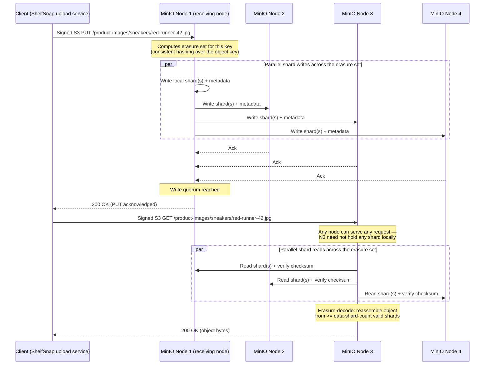
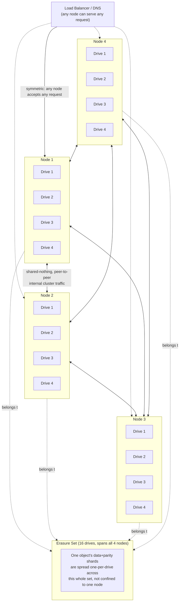

# Architecture & Internals

Chapter 2 gave you the vocabulary of MinIO's object model — buckets, objects, keys, prefixes, metadata — using ShelfSnap's `product-images` bucket as a running example: a bucket holding product photos, each stored under a key like `sneakers/red-runner-42.jpg`, with metadata describing content type and upload time. That chapter treated a `PUT` and a `GET` as black boxes: you hand MinIO some bytes and a key, and later you get the same bytes back. This chapter opens the box. We're going under the hood into exactly how MinIO stores those bytes across a cluster of drives and machines, how it serves a `GET` back correctly even after hardware fails underneath it, and why that internal design is the actual source of MinIO's two headline properties: durability without full-copy replication, and performance that scales roughly linearly as you add nodes. Everything here is architecture-level intuition; the full mathematics of erasure coding is deferred to Chapter 5, and the operational mechanics of growing a live cluster are deferred to Chapter 12.

---

## Learning Objectives

By the end of this chapter, you will be able to:

- Name MinIO's three deployment topologies (standalone, single-node multi-drive, distributed multi-node multi-drive) and state exactly what failure each one tolerates.
- Explain, conceptually and with a numeric example, why erasure coding protects data with less storage overhead than full replication for the same fault tolerance.
- Define an **erasure set** and explain why MinIO partitions a cluster's drives into multiple erasure sets instead of erasure-coding across the entire cluster as one pool.
- Explain what a **server pool** is, why pools scale capacity additively, and why adding a pool does not rebalance existing data.
- Describe, at a conceptual level, what happens on disk across an erasure set when a client issues a `PUT`, including shard placement, checksums, and metadata.
- Trace an S3 API request end-to-end through a distributed MinIO cluster, and explain why MinIO's node symmetry (no primary/leader) matters for availability.
- State MinIO's read-after-write consistency guarantee precisely, and contrast it with "eventually consistent" object stores.
- Explain, at a preview level, how bit-rot detection and self-healing work and why they depend directly on erasure coding.

---

## Prerequisites for This Chapter

This chapter builds directly on [Chapter 2: Core Concepts](./02-core-concepts.md). We assume you already know:

- The object model: buckets, objects, keys, prefixes as pseudo-directories, and object metadata.
- That MinIO speaks the S3 API — clients issue signed HTTP requests (`PUT`, `GET`, `DELETE`, `LIST`, and friends) against buckets and keys.
- The ShelfSnap `product-images` bucket scenario, used throughout this chapter to ground abstract architecture in a concrete example.
- Chapter 1's warning that MinIO's on-disk data is not meant to be inspected or edited directly — this chapter explains *why* that warning exists in engineering terms, rather than just asserting it.

If any of that feels shaky, revisit Chapter 2 before continuing.

---

## 1. Deployment Topologies

MinIO can be deployed three different ways. They share the same binary and the same S3 API surface, but they differ enormously in what failures they survive — which is the single most consequential decision you make before running MinIO anywhere near production data.

### 1.1 Standalone (single node, single drive)

One MinIO process, one drive, no redundancy of any kind. Every object is written once, to one filesystem, on one machine. There is no erasure coding, because erasure coding requires multiple drives to spread shards across — with one drive, there is nothing to spread across.

This topology exists for exactly one purpose: local development and quick experimentation, where you want an S3-compatible endpoint running in ten seconds and you do not care what happens to the data. If that one drive fails, corrupts, or the container's volume is deleted, every object is gone. There is no MinIO-level mechanism to prevent or recover from this — you would be relying entirely on something else (a cloud disk snapshot, a backup job) that is completely outside MinIO's control.

### 1.2 Single-node, multi-drive (erasure coding across drives, one machine)

Point one MinIO process at several drives (say, 4 or 8 mounted volumes on the same machine), and MinIO turns on **erasure coding** across those drives (Section 2). Now an object's data is split into shards distributed across the drives, with enough parity shards mixed in that the loss of some number of drives does not lose the object.

This protects you against **drive failure**, but not against **machine failure** — if the single server itself dies (power supply, motherboard, kernel panic, the whole box catching fire), every drive attached to it becomes unavailable at once, and erasure coding within that one machine cannot help you, because the failure domain is the entire node, not an individual drive. This topology is a legitimate choice for non-critical workloads, CI/test environments that need real erasure-coding behavior, or edge deployments with a single physical box — but it is still a single point of failure at the node level.

### 1.3 Distributed, multi-node, multi-drive (the production topology)

Multiple MinIO nodes (servers), each with multiple drives, all running as one logical MinIO deployment. Erasure coding now spans *machines*, not just drives within one machine — a design detailed fully in Section 2 and Section 3. This is the topology MinIO is actually designed around, and the only one recommended for production data.

Because shards are spread across independent machines, this topology tolerates **losing entire nodes** — not just individual drives — without data loss or downtime, as long as enough nodes/drives remain to reconstruct every object (Section 2 makes "enough" precise). This is also the topology that gives MinIO its horizontal read/write throughput scaling, since requests and shard I/O are spread across many machines' CPUs, memory, and network links rather than funneled through one box.

### 1.4 Comparison: what failure does each topology survive?

| Topology | Drives | Nodes | Survives a single drive failure? | Survives an entire node failure? | Recommended for production? |
|---|---|---|---|---|---|
| Standalone (single node, single drive) | 1 | 1 | No — total data loss | No — total data loss | No — dev/test only |
| Single-node, multi-drive | 4+ | 1 | Yes (erasure coding across drives) | No — the whole node is one failure domain | Rarely — only for non-critical or single-box constraints |
| Distributed, multi-node, multi-drive | 4+ per node, 4+ nodes | 4+ | Yes | Yes (as long as quorum drives/nodes remain) | Yes — this is the production topology |

The pattern to internalize: **redundancy only protects you against failures outside the boundary it spans.** Drive-level erasure coding on one machine cannot survive that machine dying, for the same reason RAID inside a single server can't survive that server's power supply failing — the redundancy never left the box. Only spreading shards across independent machines (and ideally independent racks/availability zones — Chapter 12) gets you real fault tolerance at the node level.

---

## 2. Erasure Coding: The Conceptual Idea

### 2.1 The problem with plain replication

The traditional way to survive losing a copy of your data is to keep more copies of it. RAID-1 mirroring keeps two full copies of every block. Systems that do "3x replication" (an approach popularized by early distributed filesystems) keep three full copies of every object, often on different machines, so that up to two copies can be lost without losing the data.

This works, but it is expensive: 3x replication means your **usable** capacity is one-third of your **raw** capacity. Buy 300 TB of drives, and you can safely store about 100 TB of unique data. Every byte you write costs three bytes of physical storage.

### 2.2 Erasure coding: shards instead of copies

MinIO instead uses **erasure coding**, a technique borrowed from decades of coding-theory work (the same mathematical family behind RAID-6 and behind error correction in CDs, DVDs, and deep-space communications). The intuition, without the algebra (saved for Chapter 5):

Instead of storing N full copies of an object, MinIO splits the object into **data shards**, computes additional **parity shards** derived mathematically from the data shards, and spreads *all* of them — data shards and parity shards alike — across different drives. The key property: you can reconstruct the *entire original object* from *any subset* of the shards that is at least as large as the number of data shards, regardless of which specific shards you lost.

For example, with an "8 data + 4 parity" (commonly written **EC:4**, meaning 4 parity shards) layout across 12 drives: MinIO splits an object into 8 data shards, computes 4 parity shards from them, and writes all 12 shards to 12 different drives. Any 8 of those 12 shards — any combination, data or parity — are enough to fully reconstruct the original object. That means the object survives the loss of **any 4 of the 12 drives** simultaneously.

### 2.3 The numeric payoff versus replication

This is where the storage-efficiency argument becomes concrete. Compare two schemes that both tolerate losing up to 4 drives out of some pool, storing a 1 GB object:

| Scheme | Layout | Raw storage used for a 1 GB object | Drives it can lose | Storage efficiency |
|---|---|---|---|---|
| Full replication (5 copies) | 5x replication | 5 GB | Any 4 of 5 copies | 20% |
| Erasure coding (EC:4) | 8 data + 4 parity | 1.5 GB | Any 4 of 12 shards | 67% |

To tolerate the loss of 4 drives via pure replication, you need 5 full copies (so that even after losing 4, one remains) — 5 GB of raw storage for 1 GB of data, a 20% storage efficiency. The same fault tolerance via 8-data/4-parity erasure coding costs only 1.5 GB of raw storage for that same 1 GB of data — a 67% storage efficiency, more than 3x better use of your drives, for the *same* guarantee ("survive losing any 4 drives").

This is the entire economic case for erasure coding, stated as plainly as possible: **you get comparable or better fault tolerance for a fraction of the storage overhead**, because parity shards are much smaller and more numerous than full duplicate copies, and the reconstruction math only needs *enough* shards, not *specific* ones. The tradeoff is CPU cost (computing and verifying parity is more compute-intensive than just copying bytes) and slightly more complex read/write paths (Section 6) — a tradeoff every modern erasure-coded system, including AWS S3 internally, has judged well worth making.

### 2.4 EC notation preview

You'll see notations like `EC:4` (4 parity shards) or ratios like "8+4" or "12+4" throughout MinIO documentation and later chapters. Chapter 5 covers exactly how MinIO chooses default parity levels based on drive count, how to override them, and the read/write quorum math that falls out of a given data/parity split. For now, the concept to hold onto is: **more parity shards means more drives you can lose, at the cost of more raw storage per object and more parity computation per write.**

---

## 3. Erasure Sets: Grouping Drives Instead of One Giant Pool

### 3.1 Why not erasure-code across the whole cluster?

A natural question: if erasure coding is this good, why not treat every drive in a 200-drive cluster as one giant erasure-coded pool? Three practical reasons MinIO doesn't do this:

- **Blast radius.** In one giant pool, reconstructing or verifying any object might involve coordinating across dozens or hundreds of drives. A small number of simultaneous drive failures that exceeds the parity count anywhere in that pool could threaten a very large share of the cluster's data. Smaller, bounded groups contain the damage: a failure that exceeds parity in one group affects only that group's objects, not the entire cluster.
- **Erasure code width has practical limits.** Coding-theory erasure codes get computationally heavier and offer diminishing returns as the number of shards per object grows very large — there are practical engineering ceilings on how wide a single erasure-coded stripe should be.
- **Parallelism.** Splitting the cluster into many independent erasure-coded groups lets MinIO place different objects into different groups and operate on them fully independently and in parallel, rather than every single object's read/write path having to touch a shared, cluster-wide erasure structure.

### 3.2 What an erasure set actually is

MinIO's answer is the **erasure set**: a fixed-size group of drives (typically between 4 and 16 drives, chosen automatically based on total drive count, though the exact selection algorithm is a Chapter 5/12 detail) that together form one independent erasure-coding unit. A distributed MinIO deployment is partitioned into multiple erasure sets, and every object placed into a bucket lands, deterministically, in exactly one erasure set — never split across sets.

When you `PUT` an object into ShelfSnap's `product-images` bucket, MinIO computes (via a consistent hashing scheme over the object's key) which erasure set that specific object belongs to. All of that object's data and parity shards go to drives within that one erasure set. A different object — even one in the same bucket — might land in a different erasure set. Across millions of objects, this spreads the bucket's data roughly evenly across every erasure set in the cluster, so no single set becomes a hotspot and no single set holds a disproportionate share of the bucket.

### 3.3 Why this design choice pays off

- **Bounded blast radius**: if drive failures in one erasure set exceed its parity count, only objects hashed into that set are affected — not the whole cluster.
- **Parallelism**: different erasure sets can service different requests fully independently, with no cross-set coordination, which is a big part of why distributed MinIO scales throughput roughly linearly with node/drive count.
- **Practical shard-count limits**: keeping each set's width in the 4–16 drive range keeps parity computation and shard-count overhead in a well-understood, well-tested range, rather than pushing erasure codes into widths where the math and the performance both get uncomfortable.

You will not typically choose erasure sets by hand — MinIO computes the set layout automatically from the drives you start the cluster with. What you *do* need to plan ahead of time is the total drive/node count and topology that produces a sensible number of reasonably sized sets, because changing this after the fact is disruptive (more in Section 4 and Chapter 12).

---

## 4. Server Pools: Scaling Capacity by Adding Whole Pools

### 4.1 The problem: a cluster eventually needs more capacity

Erasure sets are computed from the drives present when a MinIO deployment ("pool") is created. That raises an obvious operational question: what happens when ShelfSnap's `product-images` bucket (and every other bucket) outgrows the original cluster's capacity? You can't just plug in a few more drives to an existing, already-erasure-coded set of nodes and expect MinIO to silently absorb them — the erasure set geometry was fixed at creation time.

### 4.2 The answer: server pools

MinIO's scaling model is to add an entirely new **server pool**: a full additional set of nodes and drives, internally erasure-coded exactly like the original deployment, that is then attached to the existing deployment so the two (or more) pools together serve one namespace, one set of buckets, under one endpoint. Clients never see or address a specific pool — they just talk to the MinIO deployment as a whole, and MinIO decides which pool a given new object lands in.

The critical detail — worth stating plainly here because it trips up nearly everyone the first time they scale a cluster — is that **pools are additive, not redistributive**. Adding a new pool gives the deployment more total capacity and more erasure sets to spread *new* objects across, but existing objects already sitting in the original pool **stay exactly where they are**. MinIO does not automatically migrate or rebalance old data onto the new pool's drives. If the original pool is nearly full and you add a second pool, new writes will increasingly favor the pool with free space, but the imbalance in already-written data does not resolve itself without deliberate action.

### 4.3 Why this design, and where the full depth lives

This additive design keeps pool expansion an operationally simple, low-risk event — it's fundamentally "start a new, independent erasure-coded group and wire it into the same namespace," not "reshuffle every object in the cluster across a new drive layout," which would be a slow, resource-intensive, and riskier operation to run against live production traffic. The tradeoff is that you, the operator, need to plan capacity with this behavior in mind — a pool you add today does not retroactively balance load from years of accumulated data in an older, fuller pool.

Chapter 12 covers server pools in full operational depth: how to add one to a live deployment, how MinIO decides new-object placement across pools of different ages/sizes, and strategies for dealing with imbalance over time. For this chapter, the important architectural takeaway is simply: **a MinIO deployment scales by federating multiple independently erasure-coded pools under one namespace, and that federation is additive by design.**

---

## 5. How an Object Is Physically Stored on Disk

### 5.1 What happens, conceptually, when ShelfSnap uploads a product photo

Say ShelfSnap's upload service issues a `PUT` for `sneakers/red-runner-42.jpg` into the `product-images` bucket, in a distributed deployment with an EC:4 erasure set (8 data shards + 4 parity shards across 12 drives). At a conceptual level, here is what happens to those bytes:

1. **The object is split into data shards.** The receiving node (Section 6) computes which erasure set owns this object's key, then splits the object's bytes into the data-shard count for that set (8, in our example).
2. **Parity shards are computed.** Using the erasure-coding math (Chapter 5), MinIO derives the parity shards (4, in our example) from the data shards.
3. **All shards are written across the set's drives, one shard per drive.** Twelve shards, twelve drives, one each — spread across whichever physical machines host those drives in a distributed deployment.
4. **Metadata is written alongside the shards.** For each shard, MinIO writes accompanying metadata: which object and version this shard belongs to, its position in the erasure layout, a **checksum** of the shard's contents (used for bit-rot detection — Section 8), and object-level metadata (content type, size, custom headers, part information for multipart uploads, and version ID if versioning is enabled — Chapter 6).
5. **The write is acknowledged only once enough shards are durably on disk** to satisfy the erasure set's write quorum (the precise quorum math is a Chapter 5 topic) — this is what makes the read-after-write consistency guarantee in Section 7 possible.

Conceptually, this metadata and shard bookkeeping is organized under a hidden system structure on each drive (referred to in MinIO's own documentation and tooling as the `.minio.sys` area) that tracks format information, per-object shard metadata, checksums, and bucket/object configuration separately from the shard data itself. You do not need to know its exact byte layout to operate MinIO successfully, and that is deliberate.

### 5.2 Why you must never touch these files directly

Chapter 1 warned you, in passing, never to poke around inside a MinIO drive's data directory by hand. Now you know exactly why that warning has teeth:

- **Shards are not independently meaningful.** A single shard on a single drive is, by design, not the object — it's a fraction of an erasure-coded stripe. Copying, editing, or "fixing" one file by hand does not fix an object; it more likely corrupts the shard's checksum, so MinIO will now treat that shard as unreadable/corrupted on the next read, which needlessly burns one unit of your parity budget before you've had any real drive failure.
- **Metadata and shard data must stay mutually consistent.** The metadata describing a shard (checksum, version, layout position) must exactly match the shard bytes on disk. Manual edits desynchronize the two, and MinIO's healing and verification logic assumes this never happens outside of MinIO's own code paths.
- **There is no supported direct-access API for this layer.** Every legitimate way to read, write, repair, or inspect MinIO-managed data is through the S3 API or the `mc`/`mcli admin` tooling — both of which understand shards, quorum, and checksums correctly. Direct filesystem access bypasses all of that safety.

The practical rule, worth repeating from Chapter 1 in this more technical context: **treat every MinIO drive's data directory as opaque.** Manage MinIO exclusively through its APIs and admin tools, never through a text editor, `rm`, or a manual `cp` on the underlying filesystem.

---

## 6. The Request Lifecycle, End to End

### 6.1 Node symmetry: there is no leader

Before tracing a request, internalize one design decision that shapes everything else: **every MinIO node in a distributed deployment is symmetric.** There is no distinguished "primary," "leader," "coordinator," or "master" node that all requests must pass through, and no node that other nodes are structurally more dependent on than any other. Any node can receive and fully service any S3 API request for any object in the deployment, regardless of whether that object's shards physically live on that node's own drives.

This is a meaningfully different design from systems built around a distinguished primary (a single node that owns writes, or a leader elected via consensus that coordinates every operation). In a shared-nothing, no-single-coordinator design like MinIO's:

- **There is no single point of failure at the coordination layer** — losing any one node just means that node can no longer serve requests; every other node keeps working exactly as before, because none of them were depending on the lost node to coordinate anything.
- **Load balances trivially** — you can put any load balancer (round-robin, least-connections, whatever) in front of the node set, because every node is an equally valid target for every request.
- **There is no leader-election pause** — systems with a leader node typically have a brief unavailability window while a new leader is elected after the old one fails; MinIO has no such window, because there was never a leader to lose.

### 6.2 Tracing a request

Walking through it in words:

1. **Client sends a signed request to any node.** ShelfSnap's upload service sends a normal S3 `PUT` request, signed with its access/secret key, to whichever MinIO node its load balancer or DNS happens to route it to. That node's identity is irrelevant to the client — it's just "a MinIO endpoint."
2. **The receiving node computes ownership.** The node that receives the request hashes the object's key to determine which erasure set — and therefore which specific drives, on which specific nodes — should hold this object's shards (Section 3.2).
3. **Shards are written (or read) in parallel across the network.** The receiving node coordinates with whichever peer nodes host the relevant drives, sending (or requesting) shards over the internal cluster network, in parallel, rather than sequentially. On a `PUT`, this means shards land on multiple machines simultaneously; on a `GET`, this means multiple machines return shards simultaneously.
4. **Reassembly and verification on read.** For a `GET`, once enough shards (at least the data-shard count) have been retrieved and their checksums verified, the receiving node performs erasure decoding to reconstruct the original object bytes — this works even if some of the shards it asked for were missing or failed a checksum, as long as enough good ones came back (Section 8).
5. **The response returns to the client from the same node it originally contacted.** The client never talks to any node besides the one it sent the request to; all of the internal fan-out to peer nodes is invisible to it.

### 6.3 A distributed deployment, visually

Notice the erasure set in this diagram spans *all four nodes* — a single object's shards are deliberately scattered across every node in the set, not clustered on one machine, which is precisely what lets the deployment survive an entire node going offline (Real-World Scenario, below).

---

## 7. Consistency Model: Strong Read-After-Write

MinIO gives you a guarantee worth stating explicitly, because it is genuinely reassuring and not every object store in history has offered it: **strong read-after-write consistency for new objects.** Once a `PUT` returns a success response to the client, any subsequent `GET` for that same key — from any node, immediately, no waiting — will see the object that was just written. There is no propagation delay, no "usually visible within a few seconds," no window where a `GET` might return stale or missing data for an object that was just successfully written.

This matters because "eventually consistent" object storage has a real, well-known history. Some distributed object stores — and, notably, AWS S3 itself, for a long stretch of its history — historically offered only **eventual consistency** for certain operations, most infamously read-after-write consistency for overwrites of existing objects in some regions, and list operations that could lag behind recent writes. That meant an application could write an object, immediately read it back, and — under just the wrong timing — get a 404 or stale data, purely due to internal replication propagation delays, with no bug in the application at all. AWS eventually strengthened S3 to strong read-after-write consistency for all operations in all regions (announced in late 2020), which removed a whole category of "works most of the time" bugs that had plagued S3-backed applications for over a decade. MinIO was architected with strong consistency from the start, as a direct consequence of its write-quorum design (Section 6.2, step 5): a `PUT` isn't acknowledged to the client until enough shards are durably written to satisfy quorum, and any subsequent read is guaranteed to be able to find and reconstruct that data from the shards already committed.

For ShelfSnap, this means: the moment their upload service gets a `200 OK` back for `sneakers/red-runner-42.jpg`, it can immediately hand that key to the product catalog service, which can immediately `GET` it (or generate a presigned URL for it — Chapter 8) with zero risk of a race condition where the image "isn't there yet." That is one entire class of distributed-systems bug you get to simply not worry about.

---

## 8. Bit-Rot Protection and Self-Healing: A Preview

Two more consequences of the shard-plus-checksum design from Section 5 are worth previewing here, with full mechanics reserved for Chapter 5:

- **Bit-rot detection.** Storage media can silently corrupt bits over time — a phenomenon called bit rot — without the drive itself reporting any error. Because every shard was written with an accompanying checksum (Section 5.1), MinIO recomputes and verifies that checksum every time a shard is read. A shard whose bytes no longer match its checksum is detected immediately and treated as unavailable for that read, exactly as if the drive had failed to return it at all.
- **Self-healing.** Because erasure coding tolerates losing shards (Section 2), a checksum failure or a missing shard doesn't just get detected — it can be *repaired*. MinIO can reconstruct the corrupted or missing shard from the surviving data and parity shards (using the same erasure-decoding math used for a normal read) and rewrite a fresh, correct copy of that shard back to disk, restoring the erasure set to full parity strength without any object ever becoming unreadable in the meantime.

Put together, checksumming plus erasure coding means MinIO doesn't just tolerate a drive dying outright — it actively notices and fixes slow, silent decay before it ever accumulates into unrecoverable data loss. Chapter 5 covers the exact healing process (`mc admin heal`), how MinIO decides when to scan proactively, and the quorum math behind exactly how much simultaneous damage a given erasure-set configuration can absorb before healing becomes impossible.

---

## Real-World Scenario

**Setup:** ShelfSnap's platform team is presenting their MinIO deployment plan to the wider engineering org, who are nervous about storage reliability after a bad experience with a single-server NFS box that died and took two days of uploaded product photos with it. The proposed deployment: **4 nodes, 4 drives per node (16 drives total)**, configured as one erasure set with EC:4 (8+4-style parity, chosen automatically by MinIO for a 16-drive set — exact defaults are a Chapter 5 topic). A skeptical engineer asks: "What actually happens if we lose an entire node — not a drive, the whole machine?"

**Walking through it:**

- With 16 drives in one erasure set and 4 parity shards, this deployment can lose **any 4 drives simultaneously** without losing a single object, and without any downtime for reads or writes to unaffected objects — this falls directly out of the erasure-coding property from Section 2.2 (any *data-shard-count* worth of surviving shards reconstructs the object).
- A node in this topology hosts exactly 4 of those 16 drives (Section 6.3's diagram shows this layout: 4 nodes, 4 drives each, one shared erasure set spanning all of them). Losing the entire node — power supply dies, kernel panics, the box is unplugged — takes out exactly those 4 drives, all at once.
- Four drives lost is *exactly* the parity budget of this EC:4 configuration. For any given object, the 4 shards that lived on the dead node's drives (whichever 4 out of its 16 total shards happened to be placed there) become unavailable — but the remaining 12 drives, spread across the 3 still-healthy nodes, still hold at least 8 valid shards for every object (since only 4 total were lost), which is exactly the data-shard count needed to reconstruct anything.
- Concretely, for `sneakers/red-runner-42.jpg`: before the failure, its 12 shards (8 data + 4 parity) were spread one-per-drive across all 16 drives, roughly 3 shards per node. When the node dies, the 3-ish shards that happened to live there become unreadable. On the next `GET`, whichever node receives the request (Section 6.1 — any of the 3 survivors can do this) requests shards from all remaining drives, gets back the ~9 that are still healthy, notices it already has at least 8 valid shards, and **erasure-decodes the full object without ever needing the shards that were on the dead node.** The client gets a normal `200 OK` with the correct image bytes — no error, no retry logic needed on ShelfSnap's side, no indication anything failed at all.
- Writes continue too: a new `PUT` during the outage still succeeds, because write quorum (Section 6.2, step 5) only needs enough of the 12 remaining drives to accept shards — well above quorum with only one node down.
- What this deployment does *not* survive without intervention: losing a **second** node (or any additional drives) before the first one is repaired or replaced — that would push total lost drives past the EC:4 parity budget for at least some objects. This is why node/drive replacement and healing (Chapter 5) are operational priorities, not optional cleanup, the moment a node failure is detected — the cluster is running with zero further margin for additional loss until it's addressed.

The pitch to the skeptical engineer, in one sentence: **the old NFS box was a single point of failure by construction; this MinIO deployment was designed so that its literal, whole-machine failure domain (one entire node) fits inside its erasure-coding parity budget, which is precisely the guarantee erasure coding across nodes — not just drives — is built to provide.**

---

## Best Practices

- **Always use distributed, multi-node, multi-drive deployments for anything that matters.** Standalone and single-node-multi-drive topologies are appropriate for development, CI, and genuinely disposable data only — see the topology comparison table in Section 1.4.
- **Plan erasure set size and total drive/node count before deploying, not after.** Erasure set geometry is computed at cluster creation and is not casually changed afterward — retrofitting a different topology onto live data is a significant operation (Chapter 12), not a config edit.
- **Never touch files under a MinIO drive's data directory directly.** Manage everything through the S3 API or `mc`/`mcli admin` tooling — Section 5.2 explains exactly why manual edits desynchronize shard data from its metadata and checksums.
- **Design for whole-node failure, not just drive failure.** Choose a parity level with your actual failure domains in mind — Section 1's distinction between drive-level and node-level fault tolerance should directly inform how many parity shards you provision.
- **Understand that server pools are additive before you rely on them for load-balancing old data.** If you add a new pool expecting it to relieve pressure on an old, nearly-full pool's existing objects, you will be surprised — see Section 4.2, and plan capacity headroom accordingly.
- **Treat healing and monitoring as first-class operational tasks, not afterthoughts.** Bit-rot detection and self-healing (Section 8) only protect you if you're watching for and acting on the alerts that MinIO surfaces when parity margin is reduced (Chapter 5, Chapter 14).

---

## Common Mistakes

- **Running standalone, single-drive MinIO in production** and being genuinely surprised when a disk failure wipes out all stored data — there was never any redundancy to lose in that topology (Section 1.1).
- **Assuming server pools automatically rebalance existing data onto newly added pools.** Pools are additive, not redistributive (Section 4.2) — a nearly-full old pool stays nearly full unless you take deliberate rebalancing action.
- **Manually inspecting or editing files under a MinIO data directory** to "fix" something, which corrupts shard/metadata consistency and can trigger unnecessary healing work or outright data loss (Section 5.2).
- **Confusing drive-level erasure coding with node-level fault tolerance.** A single-node, multi-drive deployment survives a drive dying but not the machine dying — conflating the two is exactly the mistake Section 1.2 calls out.
- **Sizing an erasure set too small or too large without understanding the tradeoff**, e.g., picking parity levels that leave almost no margin for simultaneous failures, or over-provisioning parity so aggressively that usable capacity suffers for no real fault-tolerance benefit (Chapter 5 covers sane defaults and how to reason about this).
- **Believing MinIO has a leader/primary node that's more important to keep alive than the others.** All nodes are symmetric (Section 6.1); operational plans that treat any one node as "the important one" are solving a problem MinIO's architecture doesn't have.

---

## Summary

- MinIO has three deployment topologies — standalone, single-node multi-drive, and distributed multi-node multi-drive — that differ sharply in what failures they tolerate; only the distributed topology is appropriate for production (Section 1).
- Erasure coding splits objects into data shards plus parity shards spread across drives, achieving strong fault tolerance at a fraction of the storage cost of full replication (Section 2).
- A cluster's drives are grouped into **erasure sets** (typically 4–16 drives) rather than one cluster-wide pool, bounding blast radius and enabling parallelism (Section 3).
- **Server pools** let a deployment scale capacity by adding whole new erasure-coded pools; pools are additive, and existing data is not automatically rebalanced onto new pools (Section 4).
- A `PUT` splits an object into shards plus parity, writes them across an erasure set's drives with checksums and metadata, and this on-disk structure should never be touched by hand (Section 5).
- Requests can land on any node — MinIO nodes are symmetric with no leader/coordinator — and the receiving node fans out shard reads/writes in parallel to peers before responding to the client (Section 6).
- MinIO guarantees **strong read-after-write consistency** for new objects, unlike historically "eventually consistent" object stores (Section 7).
- Every shard carries a checksum, enabling silent-corruption (bit-rot) detection on read and self-healing reconstruction from surviving shards (Section 8).

---

## Knowledge Check

1. A colleague proposes running MinIO with one node and eight drives for a production workload, reasoning that "eight drives with erasure coding is plenty of redundancy." What failure mode are they missing, and why?
2. Using the "8 data + 4 parity" example from Section 2, explain in your own words why erasure coding achieves the same fault tolerance as 5x replication while using less than a third of the raw storage.
3. Why does MinIO partition a cluster's drives into multiple erasure sets instead of erasure-coding across every drive in the cluster as one pool?
4. Your team adds a second server pool to an existing MinIO deployment because the first pool is 90% full. Will this immediately relieve the storage pressure on the objects already sitting in the first pool? Explain why or why not.
5. Explain what "MinIO nodes are symmetric" means, and describe one concrete availability benefit this design gives you that a system with a distinguished leader/primary node would not have.
6. What does MinIO's strong read-after-write consistency guarantee promise, precisely, and why was this historically not something every object store (including early AWS S3) could promise?

---

## Hands-On Exercise

**Goal:** Stand up a local single-node, multi-drive MinIO instance, observe its erasure-coding configuration, upload an object, and simulate a drive failure to confirm the object survives.

1. **Create four local directories to act as separate drives**, e.g. `mkdir -p ~/minio-lab/drive1 ~/minio-lab/drive2 ~/minio-lab/drive3 ~/minio-lab/drive4`.

2. **Write a `docker-compose.yml`** that runs one MinIO container with four volume mounts, one per drive directory, and starts the server across all four paths (MinIO's multi-drive single-node syntax takes a brace-expandable path, e.g. `minio server /data{1...4} --console-address :9001`). Mount each host directory to a distinct `/dataN` path inside the container, and set `MINIO_ROOT_USER` / `MINIO_ROOT_PASSWORD` environment variables. Expose ports `9000` (S3 API) and `9001` (Console).

3. **Bring it up** with `docker compose up -d`, and confirm the container is healthy.

4. **Configure `mc`** to point at this instance (`mc alias set lab http://localhost:9000 <root-user> <root-password>`), then create the bucket: `mc mb lab/product-images`.

5. **Upload an object** — any small file will do, but stay in the spirit of the running example: `mc cp ./red-runner-42.jpg lab/product-images/sneakers/red-runner-42.jpg`.

6. **Inspect the erasure-coding configuration** with `mc admin info lab`. Look for the reported drive count, online/offline drive counts, and the erasure set layout. Confirm it reflects your 4 drives.

7. **Simulate a drive failure.** Stop the container (`docker compose stop`), and either remove or rename one of the four host drive directories (e.g., `mv ~/minio-lab/drive4 ~/minio-lab/drive4.disabled`), then edit the compose file's volume mount (or path list) so that drive is genuinely missing when MinIO starts back up, and bring the container back up.

8. **Check `mc admin info lab` again.** You should see one drive reported offline/missing, while the deployment as a whole is still reported as functional (with reduced parity headroom).

9. **Read the object back**: `mc cat lab/product-images/sneakers/red-runner-42.jpg > /tmp/recovered.jpg`, and confirm it matches the original file (e.g., compare checksums with `sha256sum`). This confirms erasure decoding reconstructed the object correctly despite the missing drive — the same mechanism walked through in this chapter's Real-World Scenario.

10. **Restore the drive** (move the directory back, restart the container) and re-run `mc admin info lab` to confirm all drives report healthy again, noting that MinIO may need a healing pass (Chapter 5) to fully resynchronize the restored drive's shards.

---

## Further Reading

- [MinIO Erasure Coding Overview](https://min.io/docs/minio/linux/operations/concepts/erasure-coding.html) — the official conceptual and operational reference for erasure coding, extending Sections 2–3 of this chapter.
- [MinIO Deployment Architecture](https://min.io/docs/minio/linux/operations/install-deploy-manage/deploy-minio-single-node-multi-drive.html) — single-node, multi-drive deployment reference, extending Section 1.2.
- [MinIO Distributed Deployment Guide](https://min.io/docs/minio/linux/operations/install-deploy-manage/deploy-minio-multi-node-multi-drive.html) — the multi-node, multi-drive production topology reference, extending Section 1.3 and Section 6.
- [MinIO Server Pools / Expand a Deployment](https://min.io/docs/minio/linux/operations/install-deploy-manage/expand-minio-deployment.html) — the operational reference for server pools previewed in Section 4, expanded fully in Chapter 12.
- [MinIO `mc admin info` Reference](https://min.io/docs/minio/linux/reference/minio-mc-admin/mc-admin-info.html) — command reference for the cluster/erasure-set inspection used in this chapter's Hands-On Exercise.

---

  <a href="./02-core-concepts.md">← Previous: Core Concepts</a>
  <a href="./00-index.md">🏠 Index</a>
  <a href="./04-buckets-objects-and-the-s3-api.md">Next: Buckets, Objects & the S3 API →</a>

