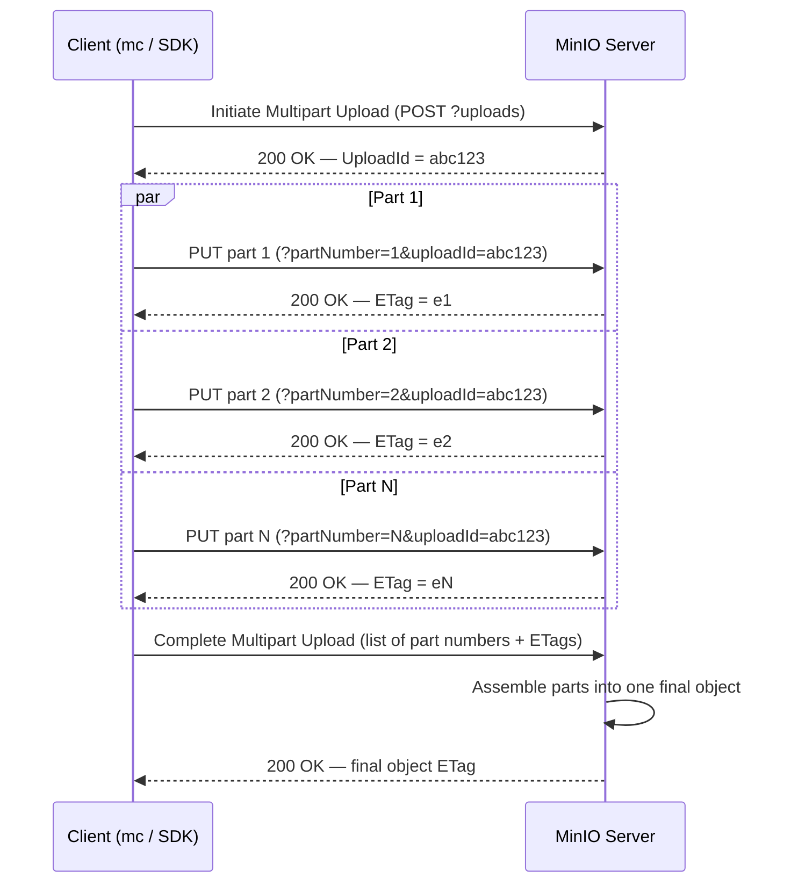
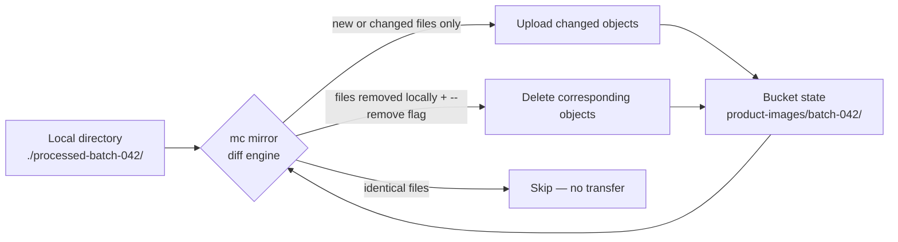

# Buckets, Objects & the S3 API

Chapter 2 gave you the vocabulary — buckets, objects, keys, prefixes, metadata — and Chapter 3 showed you what happens underneath the API call: how MinIO erasure-codes an object across a server pool's drives. You now know *what* a bucket and an object are, and *why* MinIO can survive a drive failure while storing one. This chapter is where that knowledge becomes muscle memory: every `mc` command and SDK call you'll run day-to-day against a real MinIO deployment, from creating a bucket to uploading a 50 GB file in parallel parts. By the end, you'll be able to perform the full CRUD lifecycle on buckets and objects fluently, in both the `mc` CLI and in code, and you'll understand the mechanics behind operations that look simple on the surface — like multipart upload and "moving" an object — but hide real engineering underneath.

We'll build these operations against ShelfSnap's `product-images` bucket, the same scenario introduced in Chapter 2: ShelfSnap is a retail computer-vision company whose field app photographs store shelves so its analytics pipeline can detect stock-outs and planogram compliance. `product-images` holds the raw and processed shelf photos; `analytics-lake` holds the Parquet output that ShelfSnap's ClickHouse-based analytics stack (see this repo's [ClickHouse course](../clickhouse-course/00-index.md)) queries downstream. Everything here is real, runnable syntax — assume a local MinIO instance reachable through an `mc` alias named `local` (`mc alias set local http://localhost:9000 minioadmin minioadmin`), exactly as set up in Chapter 1.

---

## Learning Objectives

By the end of this chapter, you will be able to:

- Create, list, and remove buckets with `mc`, and correctly apply S3's DNS-compatible bucket naming rules.
- Perform the four basic object operations — `PUT`, `GET`, `DELETE`, `HEAD` — with both `mc` and an SDK, and explain what each one does at the HTTP level.
- List objects by prefix, distinguish `mc ls` from `mc find`, and explain concretely how the delimiter makes a flat key space look like nested folders.
- Explain why multipart upload exists, describe its three-phase protocol (initiate, upload parts, complete), and recognize when `mc`/SDKs trigger it automatically.
- Identify and clean up abandoned incomplete multipart uploads before they become a silent storage-cost problem.
- Set custom metadata and tags on an object, and articulate why they are two different mechanisms serving two different purposes.
- Explain why `mc cp` between buckets is a server-side copy, and why "moving" an object is really "copy then delete" in a flat key space.
- Use `mc mirror` to sync a local directory or a bucket, and use ETags conceptually for cache validation and optimistic concurrency.

---

## Prerequisites for This Chapter

This chapter builds directly on [Chapter 2: Core Concepts](./02-core-concepts.md) and [Chapter 3: Architecture & Internals](./03-architecture-and-internals.md). We assume you already know:

- The core object storage vocabulary: bucket, object, key, prefix, and the fact that a bucket is a flat namespace with no real subdirectories — "folders" are a UI/CLI illusion built from key prefixes and a delimiter.
- What system and custom metadata are, at a conceptual level, and that every object has an `ETag`.
- That MinIO erasure-codes each object's data across a server pool's drives, and that this happens transparently underneath every API call you make in this chapter — you never manage erasure coding yourself, but Chapter 5 will show you exactly what it's protecting you from.
- Basic familiarity with the `mc` client and having at least one alias configured, from Chapter 1's installation walkthrough.

If any of that feels shaky, revisit Chapters 2 and 3 before continuing — this chapter assumes that conceptual ground is settled and spends its time on hands-on mechanics instead.

---

## 1. Bucket Operations: Create, List, Remove

A bucket is the top-level container every object lives in, and it's also an IAM/policy boundary (Chapter 8) and a lifecycle/versioning boundary (Chapters 6–7). Creating one is cheap and instantaneous — there's no schema to define, no capacity to pre-allocate.

### 1.1 Create a bucket — `mc mb`

```bash
mc mb local/product-images
mc mb local/analytics-lake
```

`mb` stands for "make bucket." Both buckets now exist as empty, flat namespaces. You can create a bucket with an initial object-lock configuration or a specific region in the same command — covered in Chapter 6 — but for day-to-day use, a bare `mc mb` is what you'll run most often.

**Equivalent raw S3 API call.** Under the hood, `mc mb` issues an HTTP `PUT` against the bucket's root:

```
PUT / HTTP/1.1
Host: product-images.local-minio:9000
Authorization: AWS4-HMAC-SHA256 Credential=minioadmin/20260706/us-east-1/s3/aws4_request, ...
```

The body can optionally carry a `CreateBucketConfiguration` XML block specifying a region. `mc` computes the AWS Signature Version 4 (SigV4) signature for you; if you were hand-rolling this with `curl`, you'd need to compute that `Authorization` header yourself from your access key, secret key, and the request's canonical form — which is exactly why nobody does this by hand in production. Here's the same operation with the Python `boto3` SDK, which handles signing internally:

```python
import boto3

s3 = boto3.client(
    "s3",
    endpoint_url="http://localhost:9000",
    aws_access_key_id="minioadmin",
    aws_secret_access_key="minioadmin",
)
s3.create_bucket(Bucket="product-images")
```

### 1.2 List buckets — `mc ls`

```bash
mc ls local
```

```
[2026-07-06 09:12:03 UTC]     0B product-images/
[2026-07-06 09:12:07 UTC]     0B analytics-lake/
```

With `boto3`:

```python
resp = s3.list_buckets()
for b in resp["Buckets"]:
    print(b["Name"], b["CreationDate"])
```

### 1.3 Remove a bucket — `mc rb`

```bash
mc rb local/product-images
```

This fails loudly if the bucket still contains objects:

```
mc: <ERROR> Cannot remove `local/product-images`. Bucket not empty.
```

That's a deliberate safety rail — S3-compatible object storage will not silently discard data. To force removal of a non-empty bucket, including all objects and any incomplete multipart uploads inside it, add `--force`:

```bash
mc rb --force local/product-images
```

Treat `--force` the way you'd treat `rm -rf`: it is irreversible unless the bucket has versioning enabled (Chapter 6), in which case older versions may still be recoverable. In production, `mc rb --force` should never be a keystroke you type casually against a bucket you didn't personally just create for testing.

---

## 2. Bucket Naming Rules

S3-compatible bucket names are not free-form strings — they're constrained to be valid **DNS labels**, because virtual-hosted-style requests put the bucket name directly into the hostname (`product-images.s3.amazonaws.com`, or `product-images.your-minio-host:9000`). MinIO enforces the same rules:

| Rule | Detail |
|---|---|
| Length | 3–63 characters |
| Case | Lowercase letters only — no uppercase |
| Characters | Lowercase letters, digits, hyphens (`-`), and dots (`.`) |
| Underscores | **Not allowed** — this trips up more people than any other rule |
| Start/end | Must start and end with a letter or digit, not a hyphen or dot |
| IP addresses | Cannot be formatted like an IP address (e.g., `192.168.1.1`) |
| Uniqueness | Must be unique within the deployment (and, on AWS S3 proper, globally unique across all of S3 — MinIO only requires uniqueness within your own cluster) |

`product-images` and `analytics-lake` both satisfy these rules cleanly — this is exactly why the convention throughout this course uses hyphens, never underscores. `Product_Images` or `product_images` would both be rejected outright:

```bash
mc mb local/product_images
mc: <ERROR> Unable to make bucket `local/product_images`. Bucket name contains invalid characters.
```

---

## 3. Basic Object Operations: PUT, GET, DELETE, HEAD

Every object operation maps directly onto a standard HTTP verb against `/bucket/key`. This one-to-one mapping is the core of what makes S3 an elegant API: there is no custom protocol to learn, just HTTP semantics applied to a bucket/key address space.

### 3.1 Upload — `PUT`, via `mc cp`

```bash
mc cp ./aisle-3-shelf-2.jpg local/product-images/store-4521/2026-07-06/aisle-3-shelf-2.jpg
```

```
./aisle-3-shelf-2.jpg: 2.14 MiB / 2.14 MiB [==================] 100.00% 18.20 MiB/s
```

Note the key: `store-4521/2026-07-06/aisle-3-shelf-2.jpg`. There is no `store-4521` "folder" that had to exist beforehand — the entire string is just the object's key. This is the flat-namespace point from Chapter 2, now visible in a real command.

Raw API equivalent (conceptually — signature headers omitted):

```
PUT /product-images/store-4521/2026-07-06/aisle-3-shelf-2.jpg HTTP/1.1
Host: localhost:9000
Content-Type: image/jpeg
Content-Length: 2246156
Authorization: AWS4-HMAC-SHA256 Credential=..., Signature=...

<binary JPEG bytes>
```

With `boto3`:

```python
s3.upload_file(
    "./aisle-3-shelf-2.jpg",
    "product-images",
    "store-4521/2026-07-06/aisle-3-shelf-2.jpg",
)
```

### 3.2 Download — `GET`, via `mc cp` (reversed) and `mc cat`

To pull an object back down to disk, reverse the source and destination:

```bash
mc cp local/product-images/store-4521/2026-07-06/aisle-3-shelf-2.jpg ./downloaded.jpg
```

To stream an object's bytes straight to stdout without writing a file — handy for small text/JSON objects or piping into another tool — use `mc cat`:

```bash
mc cat local/analytics-lake/reports/2026-07-05-summary.json | jq .
```

Raw API equivalent: a plain `GET /product-images/store-4521/2026-07-06/aisle-3-shelf-2.jpg`. With `boto3`:

```python
s3.download_file(
    "product-images",
    "store-4521/2026-07-06/aisle-3-shelf-2.jpg",
    "./downloaded.jpg",
)
```

### 3.3 Delete — `DELETE`, via `mc rm`

```bash
mc rm local/product-images/store-4521/2026-07-06/aisle-3-shelf-2.jpg
```

For bulk deletes matching a prefix, add `--recursive` (and `--force` to skip the confirmation prompt for a recursive delete):

```bash
mc rm --recursive --force local/product-images/store-4521/2026-01-01/
```

Raw API: `DELETE /product-images/<key>`. With `boto3`: `s3.delete_object(Bucket="product-images", Key="store-4521/2026-07-06/aisle-3-shelf-2.jpg")`.

### 3.4 Inspect without downloading — `HEAD`, via `mc stat`

Sometimes you need an object's metadata — size, `Content-Type`, `ETag`, custom metadata, tags — without pulling its body across the network. That's exactly what an HTTP `HEAD` request is for, and `mc stat` exposes it:

```bash
mc stat local/product-images/store-4521/2026-07-06/aisle-3-shelf-2.jpg
```

```
Name      : aisle-3-shelf-2.jpg
Date      : 2026-07-06 09:14:11 UTC
Size      : 2.1 MiB
ETag      : 5d41402abc4b2a76b9719d911017c592
Type      : file
Metadata  :
  Content-Type: image/jpeg
  X-Amz-Meta-Photographer: r-patel
  X-Amz-Meta-Upload-Date: 2026-07-06
```

This is the object-storage equivalent of `stat` on a filesystem file — cheap, fast, and it never transfers the object body. With `boto3`:

```python
resp = s3.head_object(Bucket="product-images", Key="store-4521/2026-07-06/aisle-3-shelf-2.jpg")
print(resp["ContentLength"], resp["ETag"], resp["ContentType"])
```

---

## 4. Listing and Prefixes Revisited, Concretely

Chapter 2 explained that a bucket is a flat key space, and that "folders" you see in the MinIO Console or `mc ls` output are an illusion produced by grouping keys on a shared prefix using `/` as a delimiter. Now let's see it in real output.

Suppose `product-images` contains these keys after a week of uploads:

```
store-4521/2026-07-04/aisle-1-shelf-1.jpg
store-4521/2026-07-04/aisle-1-shelf-2.jpg
store-4521/2026-07-05/aisle-1-shelf-1.jpg
store-4521/2026-07-06/aisle-3-shelf-2.jpg
store-9902/2026-07-06/aisle-2-shelf-1.jpg
```

Listing the bucket root shows only the first path segment, grouped as a "directory":

```bash
mc ls local/product-images
```

```
[2026-07-06 09:20:00 UTC]     0B store-4521/
[2026-07-06 09:20:00 UTC]     0B store-9902/
```

Drilling into a prefix reveals the next level:

```bash
mc ls local/product-images/store-4521/
```

```
[2026-07-06 09:20:00 UTC]     0B 2026-07-04/
[2026-07-06 09:20:00 UTC]     0B 2026-07-05/
[2026-07-06 09:20:00 UTC]     0B 2026-07-06/
```

There is no `store-4521` object and no `2026-07-04` object anywhere in the system — `mc ls` is computing these "directory" entries on the fly by finding the common prefix up to the next `/` across all matching keys. This is precisely the S3 `ListObjectsV2` API's `Delimiter` and `CommonPrefixes` behavior, and it's why renaming a "folder" in S3-compatible storage is not a single cheap metadata operation the way it is on a real filesystem — see Section 7.

### 4.1 `mc find` for recursive, filtered listing

`mc ls` is deliberately shallow — one level per call. When you need every object under a prefix, recursively, optionally filtered, `mc find` is the tool:

```bash
mc find local/product-images/store-4521/ --name "*.jpg"
```

```
local/product-images/store-4521/2026-07-04/aisle-1-shelf-1.jpg
local/product-images/store-4521/2026-07-04/aisle-1-shelf-2.jpg
local/product-images/store-4521/2026-07-05/aisle-1-shelf-1.jpg
local/product-images/store-4521/2026-07-06/aisle-3-shelf-2.jpg
```

`mc find` also supports filtering by size, age, and running an action per match — for example, deleting every object older than 90 days:

```bash
mc find local/product-images/ --older-than 90d --exec "mc rm {}"
```

The raw API equivalent of both `mc ls` and `mc find` is the same underlying call, `ListObjectsV2`, just invoked with or without a `Delimiter` parameter — omit the delimiter and you get every key under the prefix in one flat, recursive result set (paginated via `ContinuationToken` for large buckets), which is exactly how `mc find` gets its recursive behavior.

---

## 5. Multipart Upload In Depth

### 5.1 Why it exists

Uploading a single 50 GB video export or a multi-gigabyte database backup as one HTTP `PUT` has three real problems: a network blip anywhere in the transfer forces you to restart the *entire* upload from byte zero; you cannot parallelize a single HTTP request across multiple TCP connections to use your full available bandwidth; and very large request bodies are awkward for both client and server to buffer in memory. **Multipart upload** solves all three by splitting one logical object into independently uploaded chunks called **parts**.

### 5.2 The protocol, conceptually



Three phases:

1. **Initiate.** The client asks MinIO to begin a multipart upload for a given key. MinIO responds with an `UploadId` — a token that scopes every subsequent part to this specific in-progress upload.
2. **Upload parts.** The client splits the object into parts (typically 5 MiB–5 GiB each, except the last part, which can be smaller) and `PUT`s each one, tagged with a `partNumber` and the `UploadId`. Parts can be uploaded **in parallel**, over multiple connections, and **in any order** — MinIO reassembles them by part number at completion time, not by arrival order. Each successful part upload returns its own ETag.
3. **Complete.** The client sends a final request listing every part number and its ETag. MinIO validates that all parts are present and then assembles them, server-side, into one final object with its own object-level ETag (which is *not* simply the concatenation of part ETags — see Section 9).

If any single part fails to upload — a dropped connection, a timeout — only *that part* needs to be retried, not the whole object. This is the core reliability win multipart upload buys you over a single giant `PUT`.

### 5.3 It's usually automatic — you rarely trigger it by hand

Here's the part that surprises newcomers: **you almost never call the multipart API directly.** `mc cp` and every official SDK (`boto3`, `minio-py`, `minio-go`, `minio-js`) inspect the size of what you're uploading and automatically switch to multipart above an internal threshold (128 MiB is a common default, and it's tunable in most SDKs), splitting, parallelizing, and completing the upload transparently. From your side, the command looks identical whether the file is 2 KB or 200 GB:

```bash
mc cp ./quarterly-shelf-scan-export.tar.gz local/analytics-lake/exports/
```

```python
# boto3's upload_file / upload_fileobj use the TransferManager,
# which multiparts automatically above its configured threshold.
from boto3.s3.transfer import TransferConfig

config = TransferConfig(multipart_threshold=64 * 1024 * 1024, max_concurrency=8)
s3.upload_file(
    "./quarterly-shelf-scan-export.tar.gz",
    "analytics-lake",
    "exports/quarterly-shelf-scan-export.tar.gz",
    Config=config,
)
```

You only reach for the low-level `create_multipart_upload` / `upload_part` / `complete_multipart_upload` calls directly when you need fine-grained control — for example, streaming parts from a source that doesn't fit neatly into "upload this local file" (generating parts on the fly, resuming a specific upload ID after a crash, or building your own upload manager).

### 5.4 The cleanup gotcha: incomplete multipart uploads

If a multipart upload is initiated but never completed — the client crashes mid-upload, a retry loop gives up, a script is killed — the parts that *did* upload successfully **are not automatically deleted**. They sit on disk, consuming real storage capacity and counting against your usage, attached to an `UploadId` that will never be completed and that doesn't show up in a normal `mc ls`. This is a genuinely common, easy-to-miss storage-cost leak in object storage systems generally, not just MinIO.

You can list and inspect incomplete uploads directly:

```bash
mc ls --incomplete local/product-images
```

And abort a specific stale one, or every stale one under a prefix:

```bash
mc rm --incomplete local/product-images/store-4521/2026-07-06/aisle-3-shelf-2.jpg
mc rm --incomplete --recursive --force local/product-images/
```

In production you don't want to hunt these down manually — Chapter 7 (Lifecycle Management) covers configuring a bucket lifecycle rule that automatically aborts incomplete multipart uploads older than N days, which is the standard fix for this problem at scale. File that away now; we'll wire it up concretely there.

---

## 6. Object Metadata and Tags In Depth

Chapter 2 introduced metadata and tags conceptually. Here's how you actually set and read them, and why they're deliberately two separate mechanisms.

### 6.1 System metadata

**System metadata** is metadata MinIO itself manages or that has a standardized HTTP meaning — `Content-Type`, `Content-Length`, `ETag`, `Last-Modified`. Some of it (`Content-Type`) you set at upload time; some of it (`ETag`, `Last-Modified`) MinIO computes and you can only read.

### 6.2 Custom metadata

**Custom metadata** is arbitrary key-value data you attach to an object, stored as HTTP headers prefixed `x-amz-meta-` and returned on every `GET`/`HEAD`. Set it at upload time:

```bash
mc cp ./aisle-3-shelf-2.jpg local/product-images/store-4521/2026-07-06/aisle-3-shelf-2.jpg \
  --attr "photographer=r-patel;upload-date=2026-07-06"
```

```python
s3.upload_file(
    "./aisle-3-shelf-2.jpg",
    "product-images",
    "store-4521/2026-07-06/aisle-3-shelf-2.jpg",
    ExtraArgs={
        "ContentType": "image/jpeg",
        "Metadata": {"photographer": "r-patel", "upload-date": "2026-07-06"},
    },
)
```

The important operational fact: **custom metadata is effectively write-once-per-upload.** Changing it means re-uploading the object (or, server-side, issuing a copy of the object onto itself with new metadata — see Section 7) — there's no lightweight "just patch this one field" call. Read it back with `mc stat` (shown in Section 3.4) or `head_object`.

### 6.3 Tags: a separate, mutable mechanism

**Object tags** look superficially similar (key-value pairs), but they're a genuinely different mechanism, stored separately from the object and its metadata, designed to be:

- **Cheap to change** — updating tags does *not* require re-uploading the object.
- **Used for targeting** — bucket lifecycle rules (Chapter 7) and bucket/IAM policies (Chapter 8) can filter by tag, letting you say "expire everything tagged `status=processed` after 30 days" without touching the key naming scheme.

Set tags with `mc tag set`:

```bash
mc tag set local/product-images/store-4521/2026-07-06/aisle-3-shelf-2.jpg "status=pending-review&store-id=4521"
```

List them back:

```bash
mc tag list local/product-images/store-4521/2026-07-06/aisle-3-shelf-2.jpg
```

```
status       : pending-review
store-id     : 4521
```

With `boto3`:

```python
s3.put_object_tagging(
    Bucket="product-images",
    Key="store-4521/2026-07-06/aisle-3-shelf-2.jpg",
    Tagging={"TagSet": [
        {"Key": "status", "Value": "pending-review"},
        {"Key": "store-id", "Value": "4521"},
    ]},
)
```

Remove tags with `mc tag remove`. The rule of thumb: **if a value describes the object and rarely changes, it's metadata; if a value describes the object's current state and you'll want to filter or automate on it later, it's a tag.** `photographer` and `upload-date` are metadata — facts about how the object was created. `status=pending-review` is a tag — a piece of workflow state that will change to `status=approved` or `status=rejected` without the underlying photo ever changing.

---

## 7. Copying and "Moving" Objects, Server-Side

### 7.1 Server-side copy

`mc cp` between two bucket/prefix locations — as opposed to between your local filesystem and a bucket — is a **server-side copy**. The bytes never round-trip through the machine running `mc`; MinIO copies the object internally, server to server (or, in a single-node deployment, disk to disk), which is dramatically faster and cheaper than downloading and re-uploading:

```bash
mc cp local/product-images/store-4521/2026-07-06/aisle-3-shelf-2.jpg \
      local/analytics-lake/raw-images-archive/store-4521/2026-07-06/aisle-3-shelf-2.jpg
```

The equivalent raw API call is `PUT` with an `x-amz-copy-source` header pointing at the source bucket/key, rather than a body containing bytes:

```python
s3.copy_object(
    Bucket="analytics-lake",
    Key="raw-images-archive/store-4521/2026-07-06/aisle-3-shelf-2.jpg",
    CopySource={"Bucket": "product-images", "Key": "store-4521/2026-07-06/aisle-3-shelf-2.jpg"},
)
```

This same mechanism is how you change metadata "in place" without a client round-trip: copy an object onto itself with a `MetadataDirective=REPLACE` and new metadata values.

### 7.2 There is no atomic rename

Chapter 2 established that a bucket is a flat key space with no real folders. The direct consequence: **there is no atomic "rename" or "move" operation in the S3 API**, because a key's name isn't a pointer you can repoint — it *is* the object's identity. What `mc mv` does, and what you'd do by hand with `copy_object` + `delete_object`, is:

1. Server-side copy the object to its new key.
2. Delete the object at its old key.

```bash
mc mv local/product-images/store-4521/2026-07-06/aisle-3-shelf-2.jpg \
      local/product-images/store-4521/2026-07-06/reviewed/aisle-3-shelf-2.jpg
```

Two consequences worth internalizing: this is **not atomic** — if the process crashes between the copy and the delete, you end up with the object at *both* keys, not neither; and "renaming a folder" (a shared prefix) means copy-then-delete for *every object under that prefix*, one at a time — potentially thousands of individual operations, not one cheap metadata update the way `mv` on a real filesystem would be.

---

## 8. `mc mirror`: Syncing Directories and Buckets

`mc cp` moves one object (or a flat set of them) at a time. `mc mirror` is the tool for keeping a whole tree in sync — local-to-bucket, bucket-to-local, or bucket-to-bucket — and it's one of the most-used `mc` commands in real operational workflows: nightly backups, replicating a processed-images batch, seeding a new bucket from an existing one.



`mc mirror` computes a diff between source and destination (by size and modification time, or ETag) and transfers only what changed — it does not blindly re-upload everything every run, which is what makes it safe to run repeatedly, e.g., on a cron schedule.

**Example: syncing a batch of newly processed images up to the bucket.**

```bash
mc mirror ./processed-batch-042/ local/product-images/store-4521/batch-042/
```

```
...aisle-1-shelf-1.jpg:  2.10 MiB / 2.10 MiB  ┃▓▓▓▓▓▓▓▓▓▓▓▓▓▓▓▓▓▓▓▓▓▓▓▓▓▓▓▓▓▓┃ 100.00%
...aisle-1-shelf-2.jpg:  2.05 MiB / 2.05 MiB  ┃▓▓▓▓▓▓▓▓▓▓▓▓▓▓▓▓▓▓▓▓▓▓▓▓▓▓▓▓▓▓┃ 100.00%
Total: 4.15 MiB, Transferred: 2 files, Skipped: 0 files
```

Add `--watch` to keep the mirror running continuously, picking up new files as they land in the source directory — useful for a field-upload folder that a photo-ingestion agent writes into. Add `--remove` to make the mirror a true two-way-consistent sync that also deletes destination objects whose source file no longer exists (use this deliberately — combined with the wrong direction, it deletes real data).

Bucket-to-bucket mirroring uses the same syntax with two `mc` paths:

```bash
mc mirror local/product-images/store-4521/ local/analytics-lake/raw-images-archive/store-4521/
```

Under the hood, a bucket-to-bucket `mc mirror` uses the same server-side copy mechanism as `mc cp` (Section 7.1) for each object that needs transferring — the diff-and-transfer logic is `mc mirror`'s addition on top of the same primitive operations you've already learned.

---

## 9. Conditional Requests and ETags Revisited

Every object carries an `ETag` — an opaque identifier that changes whenever the object's content changes (for non-multipart uploads, it's the MD5 hash of the content; for multipart uploads, it's a hash of the concatenated part hashes plus a part count suffix, which is why a multipart object's ETag is *not* a plain MD5 of its bytes — don't rely on that assumption in application code).

Two practical uses of the ETag, conceptually, that you'll meet again once presigned URLs and application caching come up in later chapters:

- **Cache validation.** An HTTP client (a browser, a CDN, your own service) can send `If-None-Match: <etag>` on a `GET`. If the object hasn't changed, the server can respond `304 Not Modified` without re-sending the body — the same conditional-GET pattern used across the web, working here because S3-compatible storage exposes the ETag as a standard HTTP header.
- **Optimistic concurrency.** Before overwriting an object, a client can send `If-Match: <etag>` on a `PUT`, so the write only succeeds if the object hasn't changed since the client last read it — protecting against a lost-update race where two processes read-modify-write the same key concurrently. This is the same optimistic-locking idea used in databases, applied to a `PUT` request instead of a row update.

You won't hand-roll conditional headers often when using `mc`, but recognizing `ETag`/`If-Match`/`If-None-Match` in SDK method signatures (`copy_object`'s `CopySourceIfMatch`, for instance) will make sense now that you know what problem they solve.

---

## Real-World Scenario

**Building ShelfSnap's image ingestion pipeline.**

ShelfSnap's field app runs on tablets carried by in-store merchandisers. At the end of each store visit, the app batches that visit's shelf photos and hands them to a small ingestion service, which is where everything from this chapter comes together:

1. **Upload with metadata.** For each photo, the ingestion service uploads to `product-images` under a key like `store-4521/2026-07-06/aisle-3-shelf-2.jpg`, attaching custom metadata at upload time — `photographer` (the merchandiser's employee ID) and `upload-date` — because these facts about *how the object came to exist* never change once it's written:

   ```python
   s3.upload_file(
       local_path, "product-images", key,
       ExtraArgs={
           "ContentType": "image/jpeg",
           "Metadata": {"photographer": "r-patel", "upload-date": "2026-07-06"},
       },
   )
   ```

2. **Tag for workflow state.** Immediately after upload, the service tags the object `status=pending-review`, because review status is exactly the kind of thing that *will* change — a human reviewer or an automated quality-check model will flip it to `status=approved` or `status=flagged-blurry` later, and ShelfSnap's downstream pipeline needs to filter on that state without ever touching the object's bytes or its key:

   ```bash
   mc tag set local/product-images/store-4521/2026-07-06/aisle-3-shelf-2.jpg "status=pending-review"
   ```

3. **Batch reconciliation with `mc mirror`.** Overnight, a processing job pulls down that day's `pending-review` photos, runs them through a shelf-compliance model, writes annotated/cropped derivatives to a local scratch directory, and then syncs the whole processed batch back up in one shot:

   ```bash
   mc mirror ./scratch/processed-batch-2026-07-06/ local/product-images/store-4521/2026-07-06/processed/
   ```

   Because `mc mirror` only transfers new or changed files, re-running the job after a partial failure doesn't re-upload photos that already made it up — exactly the retry-safety property Section 8 described.

4. **Large exports, automatically multipart.** Once a week, ShelfSnap's analytics team exports a consolidated archive of that week's raw photos plus a Parquet summary to `analytics-lake` for the ClickHouse warehouse to ingest. That archive routinely exceeds a few gigabytes — `mc cp` multiparts it automatically, in parallel, with no special flags. The only operational discipline required is a lifecycle rule (previewed in Section 5.4, built in Chapter 7) that aborts any incomplete multipart upload from a failed export run, so a flaky network night doesn't quietly leave orphaned parts billed against ShelfSnap's storage.

Every piece of this pipeline — bucket layout, metadata, tags, multipart, mirroring — is stock `mc`/SDK functionality. Nothing about ShelfSnap's use case required anything beyond what this chapter covered.

---

## Best Practices

- **Let `mc`/SDKs handle the multipart threshold automatically** rather than hand-rolling `create_multipart_upload`/`upload_part` logic yourself; the built-in transfer managers are well-tested for retry behavior and part sizing.
- **Always set `Content-Type` explicitly** at upload time when your SDK or tool doesn't infer it correctly — a browser or CDN serving an object with the wrong (or missing) `Content-Type` will often force-download it instead of rendering it inline.
- **Configure a lifecycle rule to abort incomplete multipart uploads** past some age (a week is a common default) rather than relying on anyone to remember to run `mc rm --incomplete` by hand — this is the single most common invisible storage-cost leak in object storage.
- **Use tags for anything you'll need to filter, audit, or lifecycle-manage later**, rather than baking that information only into the key name — a key naming scheme is hard to change retroactively across millions of objects; a tag is a cheap, targeted update.
- **Reserve custom metadata for facts fixed at creation time** (who created it, what device captured it, source system) and tags for anything that represents evolving state — this separation keeps both mechanisms doing the job they were designed for.
- **Prefer `mc mirror` over scripted loops of `mc cp`** for directory/bucket sync tasks — it already implements diffing, parallelism, and (with `--watch`) continuous sync correctly, which a hand-rolled loop will get wrong in some edge case eventually.
- **Treat `mc rb --force` and `mc mirror --remove` as destructive commands** requiring the same caution as `rm -rf` — always double-check the bucket/path before running them against anything that isn't disposable test data.

---

## Common Mistakes

- **Forgetting to abort failed multipart uploads.** Parts from crashed or abandoned uploads sit on disk consuming billed storage indefinitely and are invisible to a normal `mc ls` — you have to specifically look with `mc ls --incomplete` to find them.
- **Assuming `mc mv` (or any "rename") is atomic.** In a flat key space, a move is a server-side copy followed by a delete — two separate operations, with a real (if narrow) window where a crash leaves the object at both the old and new key, or at neither.
- **Confusing metadata with tags.** Metadata is set once at upload time and is expensive to change (effectively requires a re-copy); tags are designed to be cheap and frequent to update. Trying to track fast-changing workflow state in custom metadata, or trying to record permanent creation facts in tags, works against each mechanism's design.
- **Not setting `Content-Type`, and getting force-downloads instead of inline rendering.** An image or PDF uploaded with a generic `application/octet-stream` content type will typically be force-downloaded by a browser instead of displayed — a frequent, confusing bug in image-serving pipelines.
- **Using underscores or uppercase letters in bucket names** out of filesystem habit, then hitting an opaque "invalid bucket name" error — remember buckets are DNS labels, not filesystem paths.
- **Treating bucket-name uniqueness like AWS S3's global uniqueness** when running MinIO — on a MinIO cluster you only need uniqueness within that deployment, so this isn't usually an error, but assuming the reverse (that a name is safe just because it's unique in your MinIO cluster) can bite you if you ever migrate to or interoperate with AWS S3 proper.
- **Running `mc mirror --remove` in the wrong direction**, deleting objects (or local files) you meant to keep, because the source/destination arguments were swapped. Always dry-run unfamiliar mirror commands or double-check argument order first.

---

## Summary

- Buckets are created, listed, and removed with `mc mb`, `mc ls`, and `mc rb` (`--force` for non-empty buckets); names must be valid DNS labels — lowercase, no underscores, 3–63 characters.
- The four basic object operations map directly onto HTTP verbs: `PUT` (`mc cp` upload), `GET` (`mc cp`/`mc cat` download), `DELETE` (`mc rm`), and `HEAD` (`mc stat`, metadata only, no body transfer).
- `mc ls` lists one prefix level at a time using the delimiter behavior from Chapter 2; `mc find` lists recursively and supports filtering by name, size, and age.
- **Multipart upload** splits a large object into independently uploaded, often-parallel parts via initiate → upload parts → complete; `mc`/SDKs trigger it automatically above a size threshold, and abandoned uploads must be cleaned up (`mc rm --incomplete`, or a lifecycle rule) to avoid silent storage cost.
- **Custom metadata** (set once at upload, e.g. `photographer`, `upload-date`) and **tags** (cheap to update, used for lifecycle/policy targeting, e.g. `status=pending-review`) are two distinct mechanisms serving two distinct purposes.
- `mc cp` between buckets is a **server-side copy**; "moving" an object is copy-then-delete, not an atomic rename, because a flat key space has no pointer to repoint.
- `mc mirror` diffs a source and destination (local↔bucket or bucket↔bucket) and transfers only what changed — the standard tool for directory/bucket sync.
- **ETags** support conditional requests (`If-None-Match` for cache validation, `If-Match` for optimistic concurrency) at the HTTP level.

---

## Knowledge Check

1. Why does `mc rb` refuse to remove a non-empty bucket by default, and what does `--force` actually do differently?
2. Name three bucket-naming constraints that trip up newcomers coming from a filesystem background, and explain the underlying reason (hint: think about virtual-hosted-style requests).
3. Walk through the three phases of a multipart upload and explain what happens if one part's `PUT` fails partway through — does the whole upload need to restart?
4. A teammate says "I just changed the metadata on this object to reflect its new review status." What's wrong with that sentence, and what should they have used instead?
5. Explain, step by step, what actually happens on the wire when you run `mc mv` between two keys in the same bucket, and why it isn't atomic.
6. What's the difference between what `mc ls bucket/prefix/` returns and what `mc find bucket/prefix/` returns?

---

## Hands-On Exercise

Using your local MinIO instance and the `local` alias from Chapter 1:

1. **Upload with metadata and tags.** Create three small local files (`img-1.jpg`, `img-2.jpg`, `img-3.jpg` — any bytes will do). Upload each to `local/product-images/exercise/` using `mc cp --attr` to set `photographer` and `upload-date` custom metadata, then use `mc tag set` to tag each `status=pending-review`.
2. **Inspect them.** Run `mc stat` on each uploaded object and confirm your custom metadata appears. Run `mc tag list` on each and confirm the tag is present. Change one object's tag to `status=approved` with `mc tag set` and re-run `mc tag list` to confirm the update — notice you didn't have to re-upload the file.
3. **Trigger multipart upload.** Create a larger file (150+ MB is enough to reliably cross most default thresholds — `head -c 200000000 /dev/urandom > big-file.bin` on Linux/macOS) and upload it with `mc cp`. While it's uploading, in a second terminal, run `mc ls --incomplete local/product-images` — if you can catch it mid-upload, you'll see the in-progress upload listed there before it completes and disappears from that list.
4. **Sync a directory with `mc mirror`.** Create a local folder with a handful of files, `mc mirror` it to `local/product-images/exercise/mirrored/`, then add one new file to the local folder and re-run the same `mc mirror` command — confirm only the new file transfers, not the whole set again.
5. **Find and abort an incomplete upload deliberately.** Start uploading another large file and interrupt it (Ctrl+C) partway through. Run `mc ls --incomplete local/product-images` to confirm the orphaned parts are visible, then clean them up with `mc rm --incomplete <path>`.
6. **Clean up.** Remove the exercise objects and, if you're done experimenting, the bucket itself with `mc rb --force local/product-images` (only if you don't need `product-images` for later chapters' exercises — otherwise just clear the `exercise/` prefix).

---

## Further Reading

- [MinIO Client (`mc`) Complete Guide](https://min.io/docs/minio/linux/reference/minio-mc.html) — the full command reference for every `mc` subcommand used in this chapter.
- [`mc mirror` Reference](https://min.io/docs/minio/linux/reference/minio-mc/mc-mirror.html) — flags and behavior details beyond what's covered here (`--watch`, `--remove`, filtering options).
- [MinIO: Multipart Upload Overview](https://min.io/docs/minio/linux/administration/object-management/object-lifecycle-management.html) — lifecycle configuration, including automatic abort of incomplete multipart uploads (previewed here, built out in Chapter 7).
- [AWS S3 API Reference — Multipart Upload Overview](https://docs.aws.amazon.com/AmazonS3/latest/userguide/mpuoverview.html) — the canonical protocol description MinIO implements compatibly.
- [AWS S3 API Reference — `PUT Object`, `HEAD Object`, `DELETE Object`](https://docs.aws.amazon.com/AmazonS3/latest/API/API_Operations_Amazon_Simple_Storage_Service.html) — the raw REST operations underlying every `mc`/SDK call in this chapter.

---

<div style="display:flex;justify-content:space-between;align-items:center;">
  <a href="./03-architecture-and-internals.md">← Previous: Architecture & Internals</a>
  <a href="./00-index.md">🏠 Index</a>
  <a href="./05-erasure-coding-and-data-protection.md">Next: Erasure Coding & Data Protection →</a>
</div>
