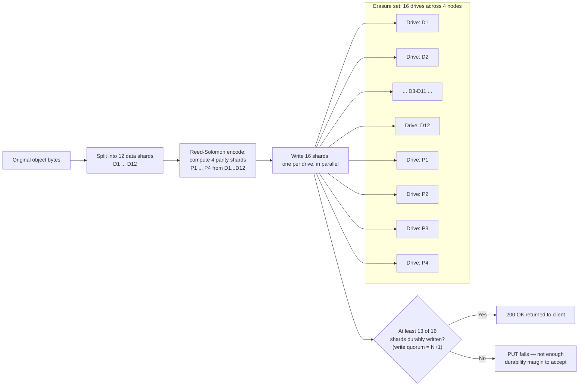
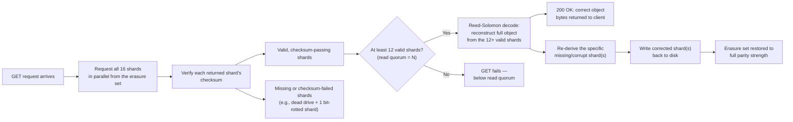

# Erasure Coding & Data Protection

Chapter 3 introduced erasure coding as a preview: split an object into data shards, compute parity shards from them, spread all of it across drives, and any *enough* of the shards reconstruct the object. That chapter used the idea to explain *why* MinIO's topologies behave the way they do — why a single-node multi-drive deployment survives a drive dying but not a machine dying, why erasure sets exist, why bit-rot detection is even possible. This chapter goes all the way into the mechanics: the actual math (at a level you can compute by hand), the exact quorum rules that govern whether a `PUT` or a `GET` succeeds, the checksum-and-reconstruction machinery behind self-healing, and — the heart of the chapter — fully worked arithmetic for exactly how many drives and how many *whole nodes* a real deployment can lose before data becomes unavailable. If Chapter 3 was the map, this chapter is learning to read the terrain well enough to draw your own map for a cluster you're about to deploy.

---

## Learning Objectives

By the end of this chapter, you will be able to:

- Explain Reed-Solomon erasure coding at a conceptual-but-precise level: what it computes, and why "any N of N+M shards" is a fundamentally stronger guarantee than simple XOR parity.
- Read and choose a MinIO `EC:M` parity configuration, and compute usable capacity and drive-failure tolerance for a given data/parity split.
- Quantify the storage-efficiency advantage of erasure coding over full replication for an equivalent fault-tolerance target.
- State MinIO's read-quorum and write-quorum rules precisely, and predict whether a `PUT` or `GET` succeeds under a given set of drive/node outages.
- Explain how bit-rot (silent data corruption) is detected on every read via shard checksums, and how self-healing reconstructs a corrupted or missing shard from surviving data and parity.
- Describe when MinIO heals automatically versus when you must invoke `mc admin heal` manually, and what a healing operation costs operationally.
- Choose an appropriate erasure set size using MinIO's recommended 4–16 drive guidance, and explain why very large single erasure sets are avoided.
- Work through, by hand, exactly how many drive failures and how many whole-node failures a concrete topology (e.g., 4 nodes × 4 drives, `EC:4`) tolerates before data becomes unreadable.

---

## Prerequisites for This Chapter

This chapter builds directly on [Chapter 3: Architecture & Internals](./03-architecture-and-internals.md). We assume you already know:

- The conceptual erasure-coding pitch from Chapter 3, Section 2: data shards plus parity shards, spread across drives, reconstructible from "enough" shards.
- What an **erasure set** is and why MinIO partitions a cluster into multiple erasure sets rather than one cluster-wide pool (Chapter 3, Section 3).
- That a `PUT` writes shards plus metadata (including a per-shard checksum) across an erasure set's drives, and that this on-disk layout should never be touched by hand (Chapter 3, Section 5).
- The distinction between drive-level and node-level failure domains, and Chapter 3's worked scenario showing a 4-node/4-drive/`EC:4` deployment surviving one whole node's death (Chapter 3, Real-World Scenario) — this chapter re-derives that result from first principles rather than assuming it.

If any of that feels shaky, revisit Chapter 3 before continuing — this chapter assumes it as settled ground and spends its entire budget going deeper, not re-explaining the basics.

---

## 1. Erasure Coding Fundamentals: A Small Worked Example First

Before any jargon, a concrete example small enough to hold in your head.

Suppose you have an object — say, a 4 MB file — and you split it into **4 equal data shards**: D1, D2, D3, D4 (1 MB each). Now compute **2 additional parity shards**, P1 and P2, using a mathematical procedure applied across D1–D4 (Section 2 explains exactly what that procedure is). You now have 6 total shards — 4 data, 2 parity — and you write all 6 to 6 different drives, one shard per drive.

Here is the property that makes erasure coding worth an entire chapter: **any 4 of those 6 shards, in any combination, are enough to reconstruct the full original 4 MB object.** Not "any 4 of the 4 data shards" — any 4 shards at all, whether that's D1+D2+D3+D4 (the trivial case, no reconstruction math even needed), or D1+D3+P1+P2, or D2+D4+P1+P2, or any other combination of 4. Lose D2 and D4 to a pair of drive failures, and D1+D3+P1+P2 alone still gets you back the entire original object, bit for bit.

This generalizes directly:

> **General principle:** With **N data shards** and **M parity shards** (total N+M shards, written across N+M drives), **any N of the N+M shards are sufficient to reconstruct the object.** Equivalently, the object survives the loss of **up to M shards**, no matter which M you lose.

MinIO writes this as `EC:M` — the parity count is the number that matters operationally, since it directly answers "how many drives can I lose?" In the example above, 4 data + 2 parity is `EC:2`: you can lose any 2 of the 6 drives holding this object's shards and still read it back correctly.

### 1.1 Why this is not just "RAID with extra steps"

If you've used RAID before, this might sound like RAID-6 (which also tolerates 2 drive failures via parity). The similarity is real — RAID-5/6 and MinIO's erasure coding are both applications of the same coding-theory family — but there's a meaningful difference in *how general* the reconstruction math is, covered next.

---

## 2. Reed-Solomon Coding, at a High Level

MinIO computes its parity shards using **Reed-Solomon coding**, a coding-theory technique from the 1960s that also underlies error correction in CDs, DVDs, QR codes, and deep-space communication — anywhere you need to recover exact original data after some of it is damaged or lost.

### 2.1 What Reed-Solomon actually does (without the field theory)

You do not need to derive Galois-field arithmetic to use MinIO correctly, but the shape of the idea matters, because it explains *why* "any N of N+M" works rather than something more restrictive:

- Treat the N data shards as inputs to a system of mathematical equations (in MinIO's implementation, arithmetic over a finite field, chosen so results always fit cleanly back into the same byte-sized shard format — a "Galois field", if you want the term for further reading).
- The M parity shards are computed as specific, fixed linear combinations of the N data shards — not copies of any of them, not a simple pairwise XOR of two specific shards, but each parity shard mathematically entangled with *all* of the data shards at once.
- Because of how those linear combinations are constructed, the resulting system of N+M equations in N unknowns (the original data) remains **solvable using any N of the N+M shards as inputs** — the specific identities of which N you have don't matter, only that you have at least N of them.

### 2.2 Why this beats simple XOR parity

Classic RAID-5 computes a single parity block as the XOR of specific same-position bytes across a fixed set of data disks. That XOR parity can recover from exactly **one** specific disk's loss — and only that one, because XOR parity encodes just enough information to solve for one missing unknown, not a general "any M of them" guarantee. RAID-6 extends this to two independent parity calculations (typically XOR plus a Reed-Solomon-style calculation) to tolerate exactly two failures, but as you push fault tolerance higher, ad hoc XOR-based schemes become awkward and eventually mathematically insufficient.

Reed-Solomon coding, by contrast, generalizes cleanly to *any* N and M you choose: you are never limited to "1 parity block, tolerate 1 failure" or "2 parity blocks, tolerate 2 failures" via bespoke tricks — you get a uniform, well-understood mathematical guarantee that scales to as much parity as you're willing to pay for in storage overhead. This is precisely why MinIO can offer configurable parity levels (`EC:2`, `EC:4`, `EC:8`, and beyond) using one consistent algorithm, rather than a different bespoke scheme per fault-tolerance target.

The practical takeaway for you as an operator: **you never need to know or care which specific shards survived.** MinIO's erasure decoder takes whatever N valid, checksum-verified shards it can find — however scattered across drives and nodes — and reconstructs the exact original bytes. That "don't care which ones" property is what makes the quorum reasoning in Section 4 so clean.

---

## 3. MinIO's `EC:M` Notation and Choosing a Parity Level

### 3.1 Reading the notation

MinIO expresses erasure coding configuration as **`EC:M`**, where `M` is the number of parity shards per erasure set. You'll also see it written as a ratio like "data+parity" — e.g., "12+4" meaning 12 data shards and 4 parity shards (which is `EC:4`). Both notations describe the same thing; `EC:M` is the shorthand that answers the operational question you actually care about ("how many drives can I lose?") directly, without doing subtraction.

The total shard count (and therefore the number of drives in that erasure set, since MinIO places exactly one shard per drive) is `N + M`, where `N` is the data-shard count. MinIO computes `N` automatically as "however many drives are in the erasure set, minus the parity level you configured" — you generally specify the parity level (or accept MinIO's computed default for your drive count), not the raw data-shard count directly.

### 3.2 Choosing a parity level: the storage-efficiency vs. fault-tolerance tradeoff

More parity shards mean more simultaneous drive failures survived, at the direct cost of usable capacity — every parity shard is raw storage that holds no unique data of its own. The table below fixes a 16-drive erasure set (deliberately the same 16-drive, 4-node shape used throughout Chapter 3, and revisited in Section 9 below) and varies the parity level:

| Configuration | Data shards | Parity shards | Usable capacity (of 16 drives' raw space) | Drives it tolerates losing |
|---|---|---|---|---|
| `EC:2` | 14 | 2 | 14/16 = **87.5%** | Any 2 |
| `EC:4` | 12 | 4 | 12/16 = **75%** | Any 4 |
| `EC:6` | 10 | 6 | 10/16 = **62.5%** | Any 6 |
| `EC:8` | 8 | 8 | 8/16 = **50%** | Any 8 |

Now put the headline comparison next to it — **3x full replication**, the traditional alternative for surviving multiple failures:

| Scheme | Raw drives used | Usable capacity | Failures tolerated |
|---|---|---|---|
| 3x replication | 3 full copies per object | **~33%** | Any 2 of the 3 copies |
| `EC:2` (14+2 of 16) | 16 shards, 14 unique | **87.5%** | Any 2 of 16 |
| `EC:4` (12+4 of 16) | 16 shards, 12 unique | **75%** | Any 4 of 16 |

This is erasure coding's central selling point, stated as concretely as the table allows: **for a "tolerate 2 losses" guarantee, 3x replication gives you 33% storage efficiency; `EC:2` gives you 87.5% — more than double the usable capacity for a comparable class of protection, and `EC:4` still beats replication's 33% by more than 2x while tolerating twice as many simultaneous failures (4 vs. 2).** This is why MinIO (and, internally, most large-scale object stores including AWS S3) is built around erasure coding rather than full replication for its primary durability mechanism: the fault-tolerance-per-byte-of-overhead ratio is simply much better.

### 3.3 What you actually configure

In practice, you rarely hand-pick an arbitrary `EC:M` value from scratch. MinIO computes a sensible default parity level automatically based on the drive count in an erasure set (larger sets generally default to a higher absolute parity count, though the *proportion* of parity to data stays in a similar range). You *can* override the default parity level at deployment time via the `MINIO_STORAGE_CLASS_STANDARD` (and `MINIO_STORAGE_CLASS_RRS` for a lower-parity "reduced redundancy" storage class applied per-object) environment variables, expressed in `EC:M` form — for example, setting `MINIO_STORAGE_CLASS_STANDARD=EC:4` before first starting the cluster fixes the standard storage class's parity level for every erasure set MinIO creates. This is read once, at the cluster's first startup against a given set of drives; changing it later does not retroactively re-encode objects already written under the old parity level, which is one more reason to work through the Section 9-style math *before* the first `PUT` ever lands on production hardware, not after.

What you should take away architecturally: **parity level is a deployment-time decision that trades usable capacity for failure tolerance, and it should be chosen deliberately against your actual failure-domain analysis (Section 9), not left as an afterthought.**

---

## 4. Read and Write Quorum

Erasure coding's fault tolerance is enforced operationally through **quorum** — the minimum number of shards that must be successfully written (for a `PUT`) or successfully read and verified (for a `GET`) before MinIO will consider the operation successful.

### 4.1 Write quorum

For an erasure set with `N` data shards and `M` parity shards (N+M total drives), MinIO requires a `PUT` to durably write to **at least N+1 shards** before acknowledging success to the client. That's one more than the bare minimum needed to reconstruct the object (`N`), not exactly `N` — and that "+1" is deliberate, not an implementation quirk:

- If a `PUT` only guaranteed exactly `N` shards written and then, moments later, one more drive failed, the object would already be sitting at the absolute edge of unrecoverability — one more failure of any kind and it's gone, with zero margin, immediately after being "successfully" written.
- Requiring `N+1` means the object can already tolerate losing **one** shard the instant after a successful write, before any healing has even had a chance to run — durability starts with real margin, not zero margin.

Concretely, for a 12-data/4-parity (`EC:4`) erasure set: a `PUT` needs at least 13 of the 16 drives to accept and durably persist their shard before MinIO returns `200 OK`. If fewer than 13 drives are reachable and healthy at write time — say, 4 drives are down for any reason — the `PUT` fails outright with an error, because MinIO will not acknowledge a write it cannot back up with its own durability margin. This is a deliberate availability tradeoff: **MinIO would rather reject a write than accept one it can't durably protect**, which is exactly the behavior you want from a system whose entire value proposition is durability.

### 4.2 Read quorum

For a `GET`, MinIO needs to retrieve and checksum-verify at least **N shards** (exactly the data-shard count — no "+1" margin needed here, since reading doesn't create new risk the way writing under-provisioned data would). For the same `EC:4` example, any 12 of the 16 drives returning valid, checksum-passing shards is enough to erasure-decode the full object and return it successfully.

If fewer than `N` valid shards are available — because too many drives are down, or too many returned corrupted data that failed checksum verification — the `GET` fails, because there is not enough surviving information, even in principle, to mathematically reconstruct the object. This is the hard floor Section 9's worked examples are built around.

### 4.3 What this means operationally

| Scenario | Outcome |
|---|---|
| Enough drives up to satisfy **write quorum** (`N+1`) | `PUT`s succeed normally |
| Fewer drives up than write quorum, but ≥ read quorum (`N`) | Existing objects remain **readable**, but **new writes to that erasure set are rejected** |
| Fewer drives up than **read quorum** (`N`) | Both `PUT` and `GET` fail for objects in that erasure set — the set is effectively down |

Notice the asymmetry: there's a real window — exactly one drive's worth, by design — where a cluster keeps serving reads perfectly while refusing new writes into the affected erasure set. This is a healthier failure mode than either alternative (blindly accepting under-protected writes, or refusing reads unnecessarily), and it falls directly out of the `N` vs. `N+1` quorum split.

---

## 5. Bit-Rot Detection: Catching Corruption You Can't See Coming

### 5.1 The problem plain filesystems and plain replication both miss

Storage media doesn't only fail by refusing to respond — drives, controllers, and even memory can silently flip or corrupt bits over time (**bit rot**), while still reporting "read successful" to the operating system. A plain filesystem has no way to know the bytes it just handed back aren't the bytes that were originally written; it never notices anything is wrong. Plain replication is not automatically better here: if a replica silently corrupts, whichever process reads it usually has no cheap way to know that's the corrupted copy versus the good one, unless it goes to the expense of independently comparing all copies on every read — an expensive check that most replicated systems don't actually do on every access.

### 5.2 How MinIO detects it

Recall from Chapter 3 that every shard is written with an accompanying checksum, computed with a fast cryptographic hash (conceptually, a function like BLAKE2b, or a hardware-accelerated variant where available — the exact algorithm is an implementation detail; what matters is that it's cheap enough to run on every single read without meaningfully hurting throughput). On **every** `GET`, before a shard's bytes are handed to the erasure decoder, MinIO recomputes that shard's checksum from the bytes actually read off disk and compares it against the checksum stored in that shard's metadata.

- **Checksum matches:** the shard is treated as valid input to reconstruction.
- **Checksum mismatch:** the shard is immediately treated as unavailable — functionally identical, from the decoder's point of view, to that drive having failed to respond at all. The corrupted shard is *not* used, and does not silently poison the reconstructed object.

This is the crucial distinction from a plain filesystem: MinIO doesn't just eventually notice something is wrong when an application complains about bad data — it **actively verifies every shard, every time, before ever using it**, and it has, by construction, enough redundancy already sitting there (the erasure coding itself) to route around a checksum failure without the read even needing to fail.

### 5.3 Healing: from "detected" to "fixed"

Detecting corruption alone would only get you a `GET` that still works today, with one less unit of protective margin — the corrupted shard is still corrupted, and the redundancy budget is already spent on top of it. MinIO closes the loop with **self-healing**:

1. On read, if a shard fails its checksum (or is simply missing — a dead drive), MinIO has already had to reconstruct the object from the remaining valid shards to answer the `GET` at all (this only works if at least `N` valid shards remain — Section 4.2).
2. Having already done that reconstruction, MinIO can re-derive the *specific* shard that was corrupted or missing, using the same erasure-decoding math run in the other direction (solve for the missing shard instead of the whole object).
3. MinIO writes that freshly reconstructed shard back to disk (to the original drive if it's still viable, or wherever the drive/replacement is now mounted), restoring the erasure set to full parity strength for that object — checksum included.

This "heal-on-read" behavior means a *single* corrupted shard, caught on a read that happens to touch it, gets fixed as a side effect of serving that read — before it can accumulate alongside a second, independent failure into genuine data loss. This combination — cheap per-shard checksumming plus a redundancy scheme that already has spare reconstruction capacity built in — is meaningfully stronger than what a plain filesystem or naive replication offers on its own: plain filesystems have no detection mechanism at all, and naive replication has no *cheap* one (real bit-for-bit comparison of every replica on every read is expensive enough that most systems don't do it continuously).

---

## 6. Proactive and Background Healing

Heal-on-read is powerful but reactive — it only catches corruption on objects that are actually being read. Rarely accessed "cold" objects could sit corrupted for a long time without any client ever triggering the check. MinIO addresses this with a **background healing scanner**: a continuously running, low-priority internal process that walks the object namespace over time, verifying checksums and erasure-set health for objects regardless of whether any client is asking for them, and proactively healing anything it finds silently degraded.

### 6.1 When healing happens automatically

- **On read** (Section 5.3), as a side effect of a `GET` encountering a bad or missing shard.
- **Via the background scanner**, continuously and automatically, cycling through the object namespace at a throttled pace so it doesn't compete heavily with foreground client traffic for disk and network bandwidth.

### 6.2 When you invoke healing manually

Some situations warrant an explicit, operator-triggered heal rather than waiting on the passive mechanisms above — most commonly:

- **After replacing a failed drive.** A brand-new, empty drive mounted in place of a dead one holds none of the shards it's supposed to. The background scanner will eventually notice and backfill it, but after a deliberate hardware replacement, you generally want to trigger and monitor a heal immediately rather than wait for the scanner's normal cadence.
- **After an extended outage of a node or drive.** The longer a drive/node was down, the more objects — potentially every object with a shard on it — are running below full parity, and you want that margin restored as quickly as operationally reasonable, not "eventually."
- **When monitoring surfaces degraded erasure-set health** (Chapter 14 covers the metrics for this) and you want to confirm remediation completed rather than assume the background process handled it.

The command for this is `mc admin heal`, run against a MinIO alias (e.g., `mc admin heal myminio` for the whole deployment, or scoped to a specific bucket/prefix). It reports progress and outstanding issues as it runs, and can be run in a dry-run/status mode to inspect current health without kicking off a full heal pass.

### 6.3 What a healing operation actually costs

Healing is not free: reconstructing a shard means reading at least `N` surviving shards (potentially from many different drives and nodes over the network), running the erasure-decode math, and writing the result back out. For a drive that's been offline for a while, or a freshly replaced empty drive, this means **every single object with a shard destined for that drive** needs this treatment — which means the I/O and time cost of a heal is roughly proportional to the total volume of data that needs reconstructing, not to some fixed small overhead. Healing a freshly replaced drive in a cluster holding many terabytes can realistically take hours, and will consume meaningful disk and network bandwidth for that entire window — which is exactly why "kick off `mc admin heal` and then ignore it" is a bad habit (more in Common Mistakes, below): you want to know when it finishes, and you want to avoid stacking a second failure on top of an erasure set that's mid-heal and therefore still running with reduced margin.

### 6.4 Throttling: healing without starving production traffic

Because a full heal pass reads and rewrites large volumes of data, MinIO throttles both the background scanner and manually triggered heals so they don't starve foreground client I/O — the scanner in particular is designed to run at low, continuous intensity rather than in disruptive bursts. Operationally, this means you should expect a large heal to take real wall-clock time (per Section 6.3) rather than assume it will race to completion at full disk/network speed; treat a "heal in progress" state as a multi-hour operational window to actively track, not a fire-and-forget command.

---

## 7. Erasure Sets Revisited: Sizing Guidance

Chapter 3 introduced erasure sets — fixed-size groups of drives (typically 4 to 16) that each form one independent erasure-coding unit, with a cluster's total drives partitioned across possibly many such sets. Here is the sizing guidance in more depth.

### 7.1 The recommended range: 4 to 16 drives per set

MinIO's own deployment guidance keeps individual erasure sets within a **4-to-16-drive** range, and computes the exact set size automatically from your total drive count using a selection algorithm that favors evenly divisible, well-tested set sizes (16, 12, 8, and similar values) over odd or very large ones. As an operator, you generally influence this only indirectly — by choosing your total drive/node counts sensibly before deploying — rather than picking a set size by hand.

### 7.2 Why not go bigger?

It's tempting to think "if 16 drives per set is good, wouldn't 64 or 128 be even better — more parity budget, less relative overhead"? Two concrete reasons MinIO caps this range instead:

- **Diminishing fault-tolerance efficiency.** Reed-Solomon coding gets computationally heavier as the total shard count per object grows, and beyond a certain width, the marginal fault-tolerance benefit per additional parity shard shrinks relative to the added CPU cost of encoding and decoding across a much wider stripe on every single `PUT`/`GET`.
- **Larger healing blast radius.** A bigger erasure set means more total data funneled through that one set's shared fault-tolerance budget. If failures within one (very large) set exceed its parity count, the *entire* set's worth of objects becomes unavailable at once — a much bigger blast radius than the same failure hitting one of several smaller, independent sets. Keeping sets in the 4–16 range, and letting a large cluster be built from *many* such sets rather than one giant one, bounds how much data any single "too many failures at once" event can take down (this is the same "blast radius" argument Chapter 3, Section 3.1 made for why MinIO doesn't erasure-code the entire cluster as one pool — set-size ceilings are the same argument applied one level down).

### 7.3 The practical rule

Choose your total drive and node counts so that MinIO's automatic set-sizing lands on erasure sets in a sensible part of that 4–16 range for your deployment size, and treat "very large single erasure set" as a smell worth double-checking rather than a feature — it usually means the topology should be reconsidered as multiple sets (or, at larger scale, multiple server pools — Chapter 3, Section 4, and full depth in Chapter 12) instead.

---

## 8. Data + Parity Shard Layout: Write Path and Read/Heal Path

The two diagrams below use a concrete `EC:4` example — **12 data shards + 4 parity shards, 16 drives total, one shard per drive** — the same shape used throughout this chapter and matching the 4-node × 4-drive topology from Chapter 3.

### 8.1 Write path

### 8.2 Read / heal path

### 8.3 Failure-tolerance scenarios for this topology (4 nodes × 4 drives, 16 total)

| Failure event | Total drives lost | Within `EC:4`'s 4-drive parity budget? | Result |
|---|---|---|---|
| 1 drive fails, anywhere | 1 | Yes | Reads/writes unaffected (writes still ≥ quorum of 13) |
| 3 drives fail, spread across 3 different nodes | 3 | Yes | Still readable and writable, at the very edge of write quorum |
| 1 entire node fails (4 drives on one machine) | 4 | Yes — exactly at the budget | Reads succeed normally; **writes to this set are now rejected** (only 12 of 16 drives left, below the 13-drive write quorum) until the node is restored/healed |
| 1 entire node fails + 1 more drive fails elsewhere | 5 | **No** — exceeds the 4-drive budget | Object data with shards on all 5 dead drives becomes **unreadable**: fewer than 12 valid shards remain |
| 2 entire nodes fail (8 drives) | 8 | **No** — far exceeds the budget | Deployment-wide data loss for this erasure set — well below read quorum |

---

## 9. Worked Math: How Much Failure Does 4 Nodes × 4 Drives, `EC:4` Actually Tolerate?

This is the calculation the rest of the chapter has been building toward — the same topology Chapter 3 introduced, now derived exactly rather than asserted.

**Topology:** 4 nodes, 4 drives per node, 16 drives total, one erasure set spanning all 16 drives, configured as `EC:4` (12 data shards + 4 parity shards, one shard per drive).

### 9.1 Total drive-failure tolerance

By the general principle from Section 1: any `N` of `N+M` shards reconstruct the object, so the set tolerates losing **up to M = 4 drives**, period — it does not matter which 4, or how they're distributed across nodes, as long as no more than 4 total are down at once (and, per Section 4, writes additionally require write quorum of 13, so writes stop being accepted once *any* 4 are down, even though reads keep working).

> **Answer: up to 4 total drive failures, tolerated for reads; writes require at least 13 of 16 drives up, so writes are rejected once the 4th drive goes down, even though existing data remains fully readable.**

### 9.2 Whole-node-failure tolerance, assuming failures concentrate on one node

Each node hosts exactly 4 of the 16 drives. If an entire node dies at once (power, motherboard, kernel panic — the whole box, all 4 of its drives, simultaneously), that is **exactly 4 drives lost** — which lands *exactly* at the `EC:4` parity budget computed in 9.1.

- **1 whole node down:** 4 drives lost = exactly the parity budget. Every object's shards on that node (roughly 4 of its 16 total shards, since MinIO spreads one shard per drive across the whole set) become unavailable, but the remaining 12 drives across the 3 surviving nodes still hold exactly 12 valid shards for every object — precisely the data-shard count needed. **Reads succeed with zero shards to spare.** Writes, however, are already rejected (only 12 of 16 up, below the 13-drive write quorum) — this deployment has *zero margin* left the moment one node is down.
- **2 whole nodes down:** 8 drives lost — double the 4-drive parity budget. At most 8 valid shards remain for any given object, which is below the 12-shard read quorum. **Data becomes unreadable.** This is true regardless of *which* 2 nodes fail, since every object has shards on every drive in the single erasure set.

> **Answer: this topology tolerates exactly 1 whole node failure (reads only, with zero further margin) and does not tolerate 2 whole node failures under any circumstances.**

### 9.3 The generalizable rule this demonstrates

The clean "1 node = 1 parity budget" result above is not a coincidence — it's because **parity count (4) exactly equals drives-per-node (4)** in this topology. That equality is the entire reason a whole-node failure is survivable at all. If this same 16-drive cluster had used `EC:2` instead, one whole node failure (4 drives) would already exceed the 2-drive parity budget, and the "tolerate one whole node" guarantee would simply not hold — you'd only be protected against isolated single- or double-drive failures, not a whole box going down. This is precisely why parity level has to be chosen against your actual failure domains (drive vs. node vs. rack), not just against a generic "how much fault tolerance sounds like enough" instinct — the Real-World Scenario below works through exactly this decision.

---

## Real-World Scenario

**Setup:** ShelfSnap's platform team (last seen in Chapter 3, sizing a 4-node/4-drive/`EC:4` cluster and defending it against a skeptical engineer worried about the fate of a dead NFS box) is now writing the actual deployment runbook, and their VP of Engineering has handed them one crisp requirement: **"We must be able to lose one entire node out of four, with zero downtime and zero data loss, and keep operating — full stop."** The team needs to pick an `EC:M` level and justify it with real numbers, not vibes.

**Working through it:**

1. **Fix the topology.** 4 nodes, 4 drives per node, 16 drives total, one erasure set (this stays within MinIO's recommended 4–16-drives-per-set range from Section 7 — no adjustment needed there).

2. **Translate the requirement into shard math.** "Lose one entire node" means losing exactly 4 drives simultaneously (one node's worth), since drives-per-node = 4 here. Per Section 9.3's rule, the parity level `M` must be **at least 4** for this to be survivable at all — anything less (`EC:2`, `EC:3`) would mean a single node failure already exceeds the parity budget and the requirement fails outright.

3. **Check `EC:4` against the requirement exactly.** From Section 9.2: `EC:4` on this topology tolerates exactly 1 whole node failure for **reads**, with the remaining 12 drives sitting exactly at read quorum (12 of 12 needed) — zero shards to spare. But the VP's requirement says "keep operating," and Section 4.1 established that a `PUT` needs write quorum of `N+1 = 13` drives — which a single node failure already violates (only 12 remain). **`EC:4` satisfies "don't lose data and keep serving reads" but fails "zero downtime for writes" the moment the node goes down**, since new `PUT`s into this erasure set would be rejected until the node is restored.

4. **Consider `EC:5`.** With 16 drives, `EC:5` means 11 data + 5 parity. A whole-node failure (4 drives) now leaves 12 of 16 drives up — comfortably above the new write quorum of `11 + 1 = 12`. Writes keep succeeding, with the write-quorum threshold met *exactly*, and reads have one full spare shard of margin beyond the 11-shard read quorum. This satisfies the VP's "zero downtime, full stop" requirement with real (if thin) margin, at the cost of usable capacity dropping from `EC:4`'s 75% (12/16) to `EC:5`'s 68.75% (11/16).

5. **Present the tradeoff, not just the answer.** The team's recommendation: **`EC:5`**, not the `EC:4` they originally discussed casually in Chapter 3 — because "tolerate losing an entire node" was loosely true for reads under `EC:4` but not for the stronger "zero downtime" bar the VP actually set, and the gap between those two bars is exactly the write-quorum `+1` term from Section 4.1. They present both configurations' math side by side (as in Sections 4 and 9 above) so the VP is choosing a known tradeoff — roughly 7 percentage points of usable capacity in exchange for writes surviving a whole-node outage with no rejected requests — rather than discovering the gap during an actual incident.

**The lesson worth generalizing:** "tolerates losing an entire node" is not one fact about a deployment — it's at least two separate facts (read tolerance and write tolerance), governed by two different quorum thresholds that differ by exactly one shard. Sizing parity against a stated availability requirement means checking *both*, not just the more forgiving read-quorum number.

---

## Best Practices

- **Choose parity level from a real failure-domain analysis, not a round number.** Decide explicitly whether you're protecting against drive failure, whole-node failure, or (at larger scale) rack/zone failure, and set `M` so it's at least as large as the number of drives that failure domain can take out at once — Section 9.3's "parity must be ≥ drives-per-node to survive a node failure" rule generalizes to any failure domain.
- **Distinguish read-quorum tolerance from write-quorum tolerance when stating an availability guarantee.** "We tolerate losing a node" needs to specify whether that includes continuing to accept writes during the outage — the Real-World Scenario above shows these can require different parity levels.
- **Monitor `mc admin heal` status continuously, and always run/verify it after any hardware replacement.** A drive swapped in after a failure holds no shards until healing backfills it — treat that backfill as a required step of the replacement procedure, not an optional follow-up (Chapter 14 covers wiring this into monitoring/alerting).
- **Don't shrink erasure sets below MinIO's recommended minimum (4 drives), and be wary of pushing them near or above the top of the recommended range (16) without a specific reason.** Section 7.2's blast-radius and coding-overhead arguments apply in both directions.
- **Budget real time and I/O for healing, and avoid triggering avoidable second failures during an active heal.** A heal's cost scales with the data volume being reconstructed (Section 6.3) — know roughly how long a heal on your cluster's data volume takes, and treat "another failure while a heal is in progress" as a genuinely elevated risk window, not background noise.
- **Re-check your parity level whenever your topology changes** — adding drives to existing nodes, or changing drives-per-node on new hardware, can silently invalidate a whole-node-failure guarantee that was true under the old drive-per-node count (Section 9.3).

---

## Common Mistakes

- **Under-provisioning parity for the failure domain that actually matters.** Choosing enough parity for single-drive failure, then deploying multi-drive nodes where a whole node dying takes out far more shards at once than the chosen `M` can absorb — exactly the trap Section 9.3 and the Real-World Scenario walk through in detail.
- **Confusing "reads still work" with "the deployment is fully healthy."** As Section 4.3's table shows, a deployment can sit in a state where reads succeed but writes are being silently rejected — treating that state as "no problem" because a spot-check `GET` still works is a common and costly misdiagnosis.
- **Ignoring background healing status until a second failure occurs mid-heal.** An erasure set that's actively healing is, by definition, still running with reduced margin from the original failure — stacking a second, independent failure on top of an unfinished heal is exactly the scenario that turns "recoverable" into "data loss," and it's entirely avoidable by watching heal status.
- **Confusing erasure coding with backup or replication.** Erasure coding is **intra-cluster** protection against drive/node hardware failure within one deployment — it does nothing for an accidentally deleted bucket, a bad application bug that overwrites good data with garbage, a ransomware event, or the loss of an entire site/datacenter. Cross-site replication and true backups are a separate, complementary layer (Chapter 12 covers site replication in depth) — assuming erasure coding "covers" disaster recovery is a common and dangerous category error.
- **Treating `mc admin heal` as something you run once and forget.** Healing after a drive replacement is a multi-hour-or-longer operation proportional to data volume (Section 6.3); walking away before confirming completion risks believing the cluster is back to full parity when it isn't yet.
- **Picking a parity level once at initial deployment and never revisiting it as the topology grows.** Adding drives to nodes, or adding nodes with a different drives-per-node count, can change which parity level is actually required to preserve a stated failure-domain guarantee (Section 9.3) — a parity level that was correct at launch can silently become insufficient after a hardware refresh.

---

## Summary

- Erasure coding splits an object into **N data shards** plus **M parity shards** (computed via Reed-Solomon coding) spread across N+M drives; **any N of the N+M shards** reconstruct the object, so the object survives losing **up to M** of them (Section 1–2).
- Reed-Solomon coding generalizes cleanly to arbitrary N and M, unlike simple XOR-based RAID parity, which is why MinIO can offer configurable parity levels like `EC:2`, `EC:4`, `EC:8` using one uniform algorithm (Section 2).
- Higher `EC:M` values trade usable capacity for fault tolerance; even generous parity levels comfortably beat 3x replication's ~33% storage efficiency for a comparable fault-tolerance target (Section 3).
- MinIO requires **write quorum (N+1 shards)** for a `PUT` to succeed and **read quorum (N shards)** for a `GET` to succeed — the one-shard gap between them means a deployment can keep serving reads while rejecting new writes under certain failure counts (Section 4).
- Every shard carries a checksum, verified on every read, enabling detection of silent bit-rot corruption — not just missing files — and self-healing reconstructs a bad shard from surviving data+parity and writes it back (Section 5).
- Healing happens automatically on read and via a continuous background scanner, and can be triggered and monitored manually with `mc admin heal`, particularly after hardware replacement; its cost scales with the data volume being reconstructed (Section 6).
- Erasure sets are kept in a recommended 4–16-drive range to bound blast radius and keep coding overhead reasonable, rather than erasure-coding an entire large cluster as one set (Section 7).
- Worked exactly for a 4-node/4-drive `EC:4` topology: the deployment tolerates up to 4 total drive failures for reads, tolerates exactly 1 whole node failure for reads only (zero margin), and does not tolerate 2 whole node failures under any circumstances (Section 9).

---

## Knowledge Check

1. Explain, in your own words, why "any N of N+M shards reconstruct the object" is a stronger guarantee than classic RAID-5's single-parity-block XOR scheme, and connect this to why Reed-Solomon coding scales to arbitrary parity levels while simple XOR parity does not.
2. A 20-drive erasure set is configured as `EC:5`. Compute its usable capacity as a percentage of raw capacity, and state exactly how many simultaneous drive failures it tolerates for reads.
3. For the same `EC:5`, 20-drive set from Question 2, state the write quorum and read quorum in terms of shard counts, and describe a specific drive-failure count at which reads still succeed but writes are rejected.
4. A team deploys 6 nodes with 8 drives each (48 drives total, assume one erasure set) at `EC:6`. Using Section 9.3's rule, determine whether this configuration survives one whole node failing, and justify your answer with the actual numbers.
5. Explain the difference between heal-on-read and the background healing scanner, and describe one scenario where relying on heal-on-read alone would leave an object's corruption undetected indefinitely.
6. A colleague argues that because their MinIO cluster uses `EC:8`, they no longer need a backup or cross-site replication strategy. What is wrong with this reasoning, and what specific failure scenarios does erasure coding not protect against?

---

## Hands-On Exercise

**Goal:** Observe a live erasure-coding configuration, simulate a drive failure, confirm the deployment keeps serving correctly-reconstructed data, and use `mc admin heal` to restore full health after "replacing" the failed volume.

1. **Reuse or rebuild the local multi-drive lab from Chapter 3's Hands-On Exercise** — a single MinIO instance (or small `docker compose` cluster) backed by at least 4 separate drive/volume directories, with `mc` configured against it as an alias (e.g., `lab`).

2. **Inspect the current configuration** with `mc admin info lab`. Note the total drive count, the erasure set layout, and the reported usable capacity — connect the reported numbers back to this chapter's `N`, `M`, and usable-capacity formulas (Section 3.2).

3. **Upload a test object** (e.g., `mc cp ./testfile.bin lab/product-images/testfile.bin`) and record its checksum locally (`sha256sum testfile.bin`).

4. **Simulate a drive failure.** Stop the container/process, remove or rename one drive directory so it's genuinely missing (e.g., `mv drive4 drive4.disabled`), and restart. Run `mc admin info lab` again and confirm one drive now reports offline, while the deployment as a whole is still reported functional.

5. **Confirm reads still work correctly.** Run `mc cat lab/product-images/testfile.bin > recovered.bin` and compare `sha256sum recovered.bin` against the original checksum — they should match exactly, demonstrating erasure-decoded reconstruction in action (Section 8.2's read path, live).

6. **Confirm write-quorum behavior at the edge, if your lab's parity level allows it.** If you're running with more than one drive of parity, try removing additional drives one at a time (up to your configured `M`) and re-testing reads and writes after each, to observe the point where writes start failing before reads do (Section 4.3's table).

7. **"Replace" the failed volume.** Recreate an empty directory at the original path (representing a freshly installed replacement drive) and restart the container/process so MinIO sees a new, empty drive where the old one was.

8. **Run a manual heal.** Execute `mc admin heal lab` (optionally with `--recursive` and bucket scoping) and observe its progress output as it reconstructs and backfills shards onto the replacement drive.

9. **Verify full health is restored.** Run `mc admin info lab` once more and confirm all drives now report online/healthy with no outstanding heal items, and re-verify `testfile.bin`'s checksum one final time to confirm nothing was corrupted during the whole exercise.

---

## Further Reading

- [MinIO Erasure Coding Overview](https://min.io/docs/minio/linux/operations/concepts/erasure-coding.html) — the official conceptual and operational reference for erasure coding, covering parity levels and quorum in MinIO's own words.
- [MinIO Data Recovery and Healing Guide](https://min.io/docs/minio/linux/operations/checklists/data-recovery.html) — background scanner behavior, healing triggers, and recovery procedures extending Sections 5–6.
- [MinIO `mc admin heal` Command Reference](https://min.io/docs/minio/linux/reference/minio-mc-admin/mc-admin-heal.html) — full flag and usage reference for the healing command used in this chapter's Hands-On Exercise.
- [MinIO `mc admin info` Reference](https://min.io/docs/minio/linux/reference/minio-mc-admin/mc-admin-info.html) — inspecting live erasure-coding configuration, drive status, and usable capacity.
- [MinIO Deployment Planning Guidance](https://min.io/docs/minio/linux/operations/install-deploy-manage/deploy-minio-multi-node-multi-drive.html) — erasure set sizing and topology planning referenced in Section 7.

---

  <a href="./04-buckets-objects-and-the-s3-api.md">← Previous: Buckets, Objects & the S3 API</a>
  <a href="./00-index.md">🏠 Index</a>
  <a href="./06-versioning-and-object-locking.md">Next: Versioning & Object Locking →</a>

