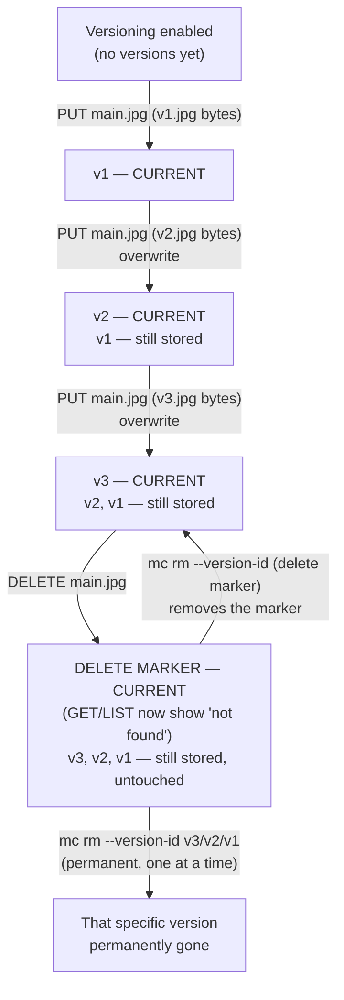
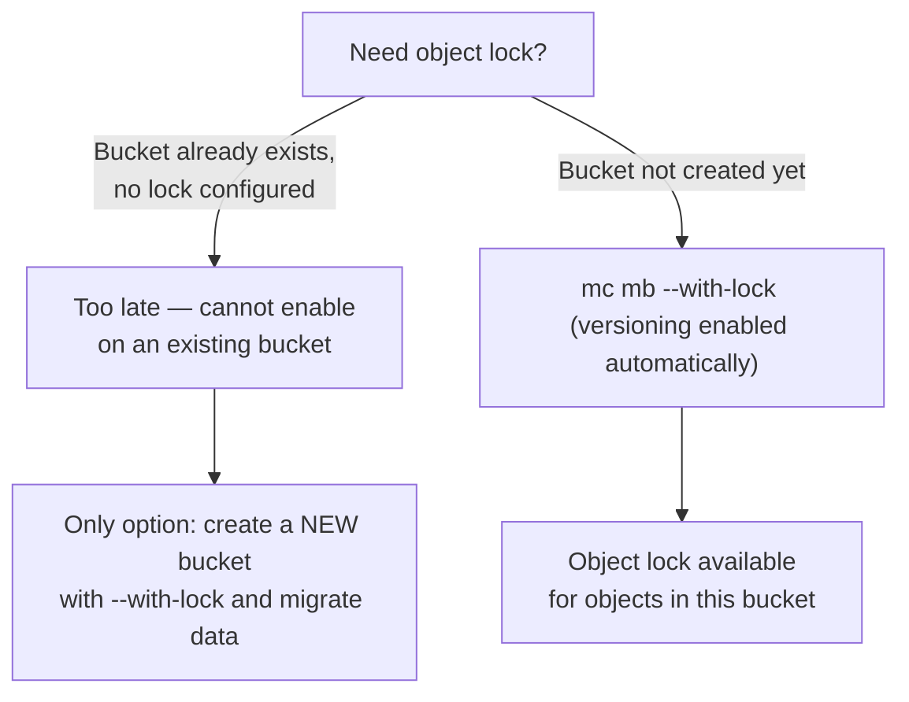
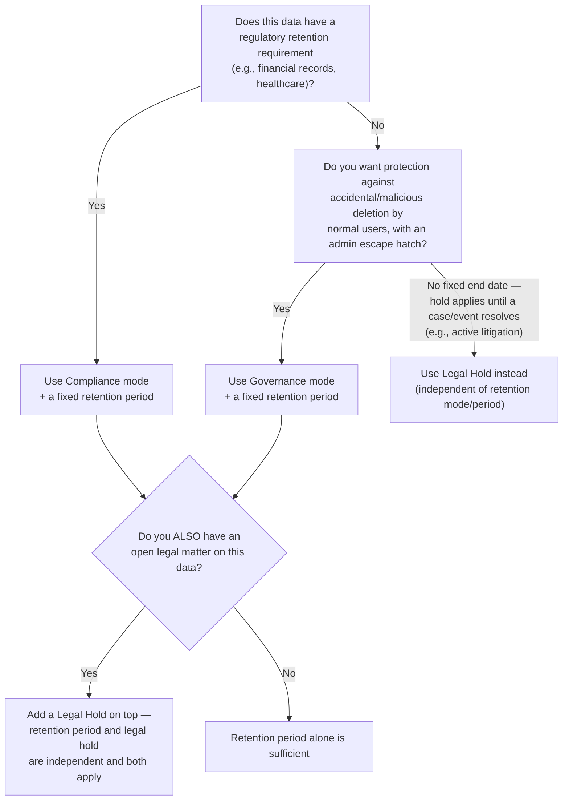

# Versioning & Object Locking

Chapter 4 gave you full command of the S3 API's CRUD surface — `PUT`, `GET`, `DELETE`, `LIST`, multipart uploads, metadata, and tags — against ShelfSnap's `product-images` bucket. Chapter 5 then went underneath that API to explain how erasure coding protects every one of those objects against hardware failure: a failed drive, a corrupted block, a dead node. But erasure coding has nothing to say about a completely different, arguably more common category of data loss: a developer who runs `mc rm --recursive` against the wrong prefix, a bug that overwrites `main.jpg` with the wrong file, or a disgruntled or compromised account that deletes a bucket's contents on purpose. Erasure coding will faithfully and durably reconstruct exactly the bytes you told it to delete — it protects the *disk*, not you from *yourself*. This chapter covers the two features that do that job: **versioning**, which keeps every past copy of an object around instead of silently discarding it on overwrite or delete, and **object locking**, which goes a step further and makes certain versions genuinely undeletable — even by an administrator — for as long as a regulation or a legal hold requires. Together, they are how MinIO answers "how do I make sure this data can't be lost or tampered with, by accident or on purpose?"

---

## Learning Objectives

By the end of this chapter, you will be able to:

- Explain precisely how enabling bucket versioning changes the semantics of `PUT` and `DELETE`, including what a delete marker is and is not.
- List, retrieve, and restore specific object versions using `mc ls --versions`, `mc cat --version-id`, and a copy-back operation.
- Permanently remove a specific version or a delete marker with `mc rm --version-id`, and explain why this is different from an ordinary `DELETE`.
- Articulate the storage cost implications of versioning and why it is almost always paired with a lifecycle policy.
- State the object lock prerequisite that trips up nearly everyone once: it must be enabled at bucket **creation** time, and it requires versioning.
- Distinguish Governance mode from Compliance mode retention, and explain why Compliance mode's irreversibility is the entire point, not a limitation.
- Configure retention periods and Legal Hold correctly, and explain how they differ as two independent hold mechanisms.

---

## Prerequisites for This Chapter

This chapter builds on two prior chapters, and it's worth being explicit about how it relates to each:

- [Chapter 4: Buckets, Objects & the S3 API](./04-buckets-objects-and-the-s3-api.md) — you should be comfortable with `PUT`/`GET`/`DELETE`/`LIST` via `mc`, and with the fact that a "key" addresses exactly one current object at a time. Everything in this chapter is about what happens when that single-current-object assumption is relaxed.
- [Chapter 5: Erasure Coding & Data Protection](./05-erasure-coding-and-data-protection.md) — erasure coding and versioning/object locking are **different kinds of protection, and it's important not to conflate them**. Erasure coding protects against *hardware failure and corruption*: a drive dies, a bit flips, a node goes offline, and MinIO reconstructs the correct bytes from parity. It has no concept of "was this the correct data to begin with?" — it will erasure-code and faithfully protect a mistaken overwrite just as diligently as a correct one. Versioning and object locking protect against *logical* mistakes and malicious action: an accidental overwrite, an accidental `mc rm`, a script gone wrong, or a compromised credential deliberately deleting data. A cluster with perfect erasure coding and no versioning will happily and durably store the fact that you just destroyed your own data. The two protections are complementary and independent — a production bucket holding anything valuable typically wants both.

If either of those chapters feels shaky, revisit them before continuing — this chapter assumes their vocabulary (buckets, keys, the S3 verb model, quorum/healing) as settled ground.

---

## 1. Bucket Versioning: Enabling It and What Changes

By default — and in every example up through Chapter 4 — a MinIO bucket is **unversioned**: each key maps to exactly one current object. A `PUT` to an existing key overwrites it, and there is no way to get the old bytes back once that `PUT` completes. A `DELETE` removes the object outright.

**Versioning** changes this. Once enabled on a bucket, MinIO keeps every past copy of an object under a given key, each tagged with a unique **version ID**, instead of discarding the previous copy on overwrite.

Enabling it with `mc` is a single command:

```bash
mc version enable local/product-images
```

You can confirm the setting at any time:

```bash
mc version info local/product-images
```

Versioning is a bucket-level, not object-level, setting: once enabled, it applies to every key in the bucket going forward. It can also be **suspended** later (`mc version suspend local/product-images`), which stops creating new versions for future writes but does *not* delete any versions that already exist — existing history is preserved, only new history stops accumulating.

### 1.1 How `PUT` semantics change

In an unversioned bucket, `PUT /product-images/products/SKU-10234/main.jpg` overwrites the object in place — there is one object, and its bytes just changed.

In a **versioned** bucket, that same `PUT` does not overwrite anything. It creates a brand-new version of the object, with its own version ID, and that new version becomes the "current" (i.e., the one returned by a plain `GET` or `mc cat` with no version specified). The old version does not disappear — it's still there, still retrievable, just no longer the one returned by default.

### 1.2 How `DELETE` semantics change: the delete marker

This is the part that surprises almost everyone the first time they see it. In an unversioned bucket, `DELETE` removes the object — full stop, nothing left.

In a **versioned** bucket, `DELETE` does *not* remove any actual data. Instead, MinIO inserts a special **delete marker**: a new, zero-byte, marker-only "version" that becomes the current version for that key. A plain `GET` or a plain `mc ls` listing now behaves *as if* the object were deleted — a `GET` returns a 404-style "not found," and a normal listing doesn't show the key — but every real version that existed before the delete marker was inserted is still sitting in storage, fully intact, retrievable by its version ID. The object "looks deleted" without a single byte of real data having actually been removed.

### 1.3 Worked example: `products/SKU-10234/main.jpg` overwritten twice, then "deleted"

Walk through a concrete timeline for one key in the versioned `product-images` bucket:

| Step | Operation | Resulting state of `products/SKU-10234/main.jpg` |
|---|---|---|
| 0 | Versioning enabled on `product-images` | No versions yet |
| 1 | `mc cp v1.jpg local/product-images/products/SKU-10234/main.jpg` | Version `v1` created, current |
| 2 | `mc cp v2.jpg local/product-images/products/SKU-10234/main.jpg` (overwrite) | Version `v2` created and current; `v1` still exists, no longer current |
| 3 | `mc cp v3.jpg local/product-images/products/SKU-10234/main.jpg` (overwrite) | Version `v3` created and current; `v1`, `v2` still exist |
| 4 | `mc rm local/product-images/products/SKU-10234/main.jpg` | A **delete marker** becomes current; `v1`, `v2`, `v3` still exist, untouched, retrievable by version ID |

After step 4, a plain `mc cat local/product-images/products/SKU-10234/main.jpg` fails — the object "isn't there" as far as normal reads and listings are concerned — but `v1`, `v2`, and `v3` are all still fully present in storage (each still subject to erasure coding's protection, per Chapter 5). Nothing was lost. This is precisely the safety net versioning exists to provide: the *default*, easiest-to-run `DELETE` is soft, and reversing an accidental deletion is a matter of removing the delete marker or retrieving/restoring an old version (Section 2), not a disaster-recovery exercise.



---

## 2. Listing and Retrieving Specific Versions

Once a bucket has version history, you need tools to see and use it — a plain `mc ls` or `mc cat` only ever shows you the *current* version, by design, so that ordinary application code doesn't need to change at all when versioning is turned on underneath it.

### 2.1 Listing every version of every key

```bash
mc ls --versions local/product-images/products/SKU-10234/
```

This returns every version of every key under that prefix, each annotated with its version ID, whether it's the current version, and whether it's a delete marker. This is the command you reach for the moment you suspect something was overwritten or deleted and you need to see the full history before acting.

### 2.2 Retrieving a specific version's bytes

```bash
mc cat --version-id <VERSION_ID> local/product-images/products/SKU-10234/main.jpg
```

This reads the exact bytes of that historical version directly — useful for inspection, downloading for comparison, or piping into a restore step.

### 2.3 "Restoring" an old version — there is no literal revert

Here's a point worth internalizing precisely, because it connects directly back to the flat-namespace, no-partial-edit theme from Chapters 2 and 4: **there is no "revert" operation in object storage.** You cannot ask MinIO to "make `v1` current again" the way you might `git checkout` an old commit and have HEAD move backward. Every version is immutable once written, and the *current* version is always whichever version was written most recently (or the delete marker, if the most recent operation was a delete).

The only way to "restore" an old version is to **copy its content into a brand-new current version**:

```bash
# Copy the historical version's bytes into a fresh PUT, making it current again
mc cp --version-id <OLD_VERSION_ID> \
   local/product-images/products/SKU-10234/main.jpg \
   local/product-images/products/SKU-10234/main.jpg
```

This reads `v1`'s bytes and writes them back as a brand-new version (call it `v4`), which becomes current. `v1`, `v2`, `v3`, and the delete marker (if one existed) are all still sitting in history afterward — restoring never deletes anything, it only adds a new "current" on top. This is exactly the same logical move as Chapter 4's observation that there's no partial in-place edit of an object: you don't modify history, you always write something new.

---

## 3. Permanently Deleting Data: `mc rm --version-id`

Section 1.2 established that once versioning is on, a normal `DELETE` is **soft** — it inserts a marker, and every real byte survives. That's a deliberate safety feature, but it means there has to be a *different* operation for the cases where you genuinely, intentionally want data gone — a GDPR erasure request, cleaning up truly obsolete test data, or reclaiming storage from versions you're certain you'll never need.

That operation is deleting a specific version ID:

```bash
# Permanently remove one specific version (irreversible)
mc rm --version-id <VERSION_ID> local/product-images/products/SKU-10234/main.jpg

# Permanently remove a delete marker itself, which "un-deletes" the object
# (the next most recent real version becomes current again)
mc rm --version-id <DELETE_MARKER_VERSION_ID> local/product-images/products/SKU-10234/main.jpg
```

The contrast to hold in your head:

| Operation | What it does | Reversible? |
|---|---|---|
| `mc rm local/.../main.jpg` (no version ID, versioned bucket) | Inserts a delete marker; all real versions untouched | Yes — remove the marker, or restore an old version |
| `mc rm --version-id <ID> local/.../main.jpg` | Permanently destroys that exact version's bytes | **No** |

Removing a delete marker via `mc rm --version-id` is itself a legitimate and common "undo a delete" pattern — it's arguably cleaner than the copy-back restore from Section 2.3 when the goal is simply "make the object visible again exactly as it was," since it doesn't create a new version at all; it just removes the marker that was hiding the existing versions.

---

## 4. The Storage Cost of Versioning

Every version is a full, independent copy of the object's bytes, subject to the same erasure coding overhead described in Chapter 5 — a version stored under `EC:4` parity costs the same proportional overhead as any other object. Versioning does not deduplicate, diff, or delta-encode anything between versions; storing ten versions of a 5 MB image costs roughly ten times the storage of one version (times whatever erasure-coding overhead applies on top).

This has a direct, easy-to-overlook consequence: **versioning alone, with no accompanying cleanup policy, grows storage without bound.** Every overwrite adds a version; nothing ever expires on its own. A frequently-updated object (a log file rewritten hourly, a frequently-corrected product image) can silently accumulate hundreds or thousands of old versions, none of which anyone asked to keep forever, all of them consuming real, billed (or capacity-planned) disk space.

This is precisely why versioning is, in virtually every real deployment, paired with a **lifecycle policy** that expires old ("noncurrent") versions automatically after some retention window — for example, "keep noncurrent versions for 30 days, then delete them." That's the subject of the next chapter in full: [Chapter 7: Lifecycle Management](./07-lifecycle-management.md) covers noncurrent-version-expiration rules as the standard, expected companion to turning versioning on. Treat "enable versioning" and "define a noncurrent-version expiration rule" as a single decision, made at the same time, not two separate steps you might get around to later — Section on Common Mistakes below returns to exactly this failure mode.

---

## 5. Object Locking (WORM): The Bucket-Creation-Time Gotcha

Versioning protects against *accidental* loss by keeping history around and making delete "soft." **Object locking** goes further: it makes specific versions **actually undeletable and unmodifiable** for a defined period, enforced by MinIO itself — a genuine Write-Once-Read-Many (WORM) guarantee, not just a convention or a permissions setting that a sufficiently privileged user could bypass.

Two prerequisites make object locking meaningfully different to operate than versioning, and both matter enough to call out explicitly:

1. **Object lock must be enabled at bucket creation time.** Unlike versioning, which can be flipped on for an existing bucket at any point in its life, object lock **cannot** be retrofitted onto a bucket that already exists. If you create a bucket without object lock and later discover you need it, your only option is to create a *new* bucket with object lock enabled and migrate (copy) the data into it — there is no `mc` command that turns it on after the fact. This is a real, sharp operational gotcha, and it's the single most important practical fact in this chapter: if there's any realistic chance a bucket will need object lock later, the cost of enabling it now is near zero, while the cost of *not* enabling it and needing it later is a full data migration.

   ```bash
   mc mb --with-lock local/analytics-lake-locked
   ```

2. **Object locking requires versioning to be enabled**, and enabling object lock at bucket creation automatically enables versioning as well — this makes sense once you recall that locking is applied to *specific versions*, not to a key in the abstract. You can't have a WORM guarantee on "the object at this key" when that key's content can silently change out from under the guarantee; locking a *version* only means something because that version is immutable content, permanently addressable by its version ID.



---

## 6. Retention Modes: Governance vs. Compliance

Object lock supports two distinct retention modes, and the difference between them is not a matter of degree — it's a difference in *who can never override it*.

### 6.1 Governance mode

In **Governance mode**, a locked object's retention can be shortened, removed, or the object can be deleted early — but only by a user or role explicitly granted the special `s3:BypassGovernanceRetention` permission (via IAM policy). Everyone without that specific permission is blocked, exactly like Compliance mode from their point of view. Governance mode exists to protect against the common case: an accidental `mc rm --force --recursive` by a normal engineer or a buggy script, while still leaving a deliberate escape hatch for someone with elevated, explicitly-granted authority to fix a genuine mistake (e.g., "we locked the wrong object for 90 days by a config error, and we have a specific admin role authorized to correct that").

### 6.2 Compliance mode

In **Compliance mode**, a locked object's retention **cannot be shortened, removed, or overridden by anyone** — not a normal user, not an administrator, not the root credentials, not MinIO support, for the entire duration of the retention period. There is no bypass permission, because none exists to grant. The object is, for practical purposes, physically undeletable and unmodifiable by any API call until the retention date passes.

### 6.3 Why Compliance mode existing at all matters

It's worth being precise about *why* an object storage system would deliberately build a mode that even its own root user cannot override — this is the entire point of the feature, not an inconvenient edge case:

Compliance mode is what lets an organization tell a regulator or an auditor, with technical credibility, **"this data cannot be deleted or altered before this date, even by us."** Many regulatory regimes (financial records retention rules, healthcare record retention, legal e-discovery holds) don't just require that data *happen* to survive for a period — they require that the *organization itself* be structurally incapable of destroying it early, precisely because an organization under regulatory or legal pressure has an obvious incentive to make inconvenient records disappear. A policy that says "we promise not to delete this" is worth far less, to an auditor, than a technical control that says "the system will refuse to delete this no matter who asks, including us." Compliance mode is that technical control. Choosing it is a genuine, irreversible commitment — you are deliberately removing your own organization's ability to delete that data early, which is exactly the property that gives it evidentiary and regulatory weight.

### 6.4 Decision tree: choosing a mode, and choosing retention vs. legal hold



---

## 7. Retention Periods and Legal Hold: Two Independent Mechanisms

### 7.1 Retention periods: `mc retention set`

A **retention period** attaches a mode (Governance or Compliance) and an expiration point — either an absolute date or a duration — to a specific object version. Until that date passes, the object cannot be deleted or overwritten (subject to the mode's override rules from Section 6).

```bash
# Set Compliance-mode retention until a fixed calendar date
mc retention set --default COMPLIANCE 7y local/analytics-lake-locked

# Or, on a specific already-uploaded object/version:
mc retention set COMPLIANCE "2033-07-06T00:00:00Z" \
   local/analytics-lake-locked/reports/2026/q2-financials.parquet
```

A bucket-level `--default` retention configuration (mode + duration) is applied automatically to every new object version uploaded into that bucket from then on — the standard pattern for a bucket whose entire purpose is regulated data, so uploaders don't need to remember to set retention manually on every single object.

### 7.2 Legal Hold: `mc legalhold set` — a separate, indefinite mechanism

**Legal Hold** is a deliberately different tool from retention, and the distinction matters:

- A retention period has a **scheduled end date** — it expires automatically once the clock runs out.
- A Legal Hold has **no expiration schedule at all**. It stays in effect indefinitely, on whatever version it's applied to, until a human explicitly removes it.

Legal Hold exists for situations where you know an object must not be touched, but you don't yet know — and can't schedule — when that requirement ends: active litigation, an ongoing investigation, an open audit. You can't set "retain for the duration of this lawsuit" as a duration, because nobody knows how long the lawsuit will take. Legal Hold solves exactly that shape of requirement.

```bash
# Place an indefinite legal hold on a specific object version
mc legalhold set --version-id <VERSION_ID> local/analytics-lake-locked/reports/2026/q2-financials.parquet

# Remove it explicitly once the matter is resolved
mc legalhold clear --version-id <VERSION_ID> local/analytics-lake-locked/reports/2026/q2-financials.parquet
```

Retention and Legal Hold are **independent and additive**: an object can have a retention period, a legal hold, both, or neither. If both are present, the object is protected as long as *either* one is still in effect — a retention period expiring does not release an object that still has an active legal hold, and clearing a legal hold does not shorten a still-active retention period.

---

## 8. Worked Example: Locking `analytics-lake` for a 7-Year Regulatory Requirement

Recall `analytics-lake` from Chapter 2 — ShelfSnap's Parquet-based data lake of product-view and click events, which Chapter 7 will use heavily for lifecycle rules. Suppose ShelfSnap's finance team starts landing quarterly financial reports into a dedicated prefix in that same style of bucket, and compliance tells engineering: **these specific financial reports must be retained, unmodified and undeletable, for 7 years, and that guarantee must hold even against a compromised or rogue administrator account.**

That requirement — "even against a compromised admin" — is precisely the signal that this is a Compliance-mode job, not Governance mode; nothing short of Compliance mode satisfies "undeletable by anyone."

**Step 1 — create the bucket with object lock enabled at creation** (Section 5's non-negotiable rule):

```bash
mc mb --with-lock local/analytics-lake-financial-reports
```

(A brand-new bucket is used here deliberately, rather than retrofitting the existing `analytics-lake`, precisely because object lock cannot be added to a bucket after creation — this is the gotcha from Section 5 playing out in a realistic scenario.)

**Step 2 — set a bucket-default Compliance retention of 7 years:**

```bash
mc retention set --default COMPLIANCE 7y local/analytics-lake-financial-reports
```

**Step 3 — upload a quarterly report; it inherits the default retention automatically:**

```bash
mc cp q2-2026-financials.parquet \
   local/analytics-lake-financial-reports/reports/2026/q2-financials.parquet
```

**Step 4 — attempt to delete it before the 7 years have passed:**

```bash
mc rm local/analytics-lake-financial-reports/reports/2026/q2-financials.parquet
# Error: Object is under active retention and cannot be deleted
#        (Compliance mode — no override exists, including root credentials)
```

The deletion fails — not because of an access policy that could, in principle, be changed by someone with enough privilege, but because Compliance mode has no override path at all. This is the exact technical property ShelfSnap's compliance team can point to when an auditor asks how they know a compromised admin account couldn't have deleted these records: the answer isn't "we have a policy against it," it's "the storage layer itself refuses the request, unconditionally, until 2033."

---

## Real-World Scenario

ShelfSnap's finance department is informed by external auditors that, under a regulatory requirement applicable to their jurisdiction, **uploaded financial reports must be retained, unaltered, for seven years — and the retention control must be robust even against insider threats, including a compromised administrator credential.** This is a stricter bar than "we have a backup" or "we have a deletion approval process": both of those are policies a sufficiently privileged or malicious actor could subvert. The requirement is explicitly about a *technical* guarantee.

Applying this chapter's concepts:

- **Bucket choice and timing.** Because object lock cannot be enabled on an existing bucket (Section 5), the team creates a purpose-built bucket, `analytics-lake-financial-reports`, with `mc mb --with-lock` from day one — precisely because financial-report retention was a known, if not yet fully specified, requirement before the bucket held any data. Had the team instead tried to retrofit lock onto the general-purpose `analytics-lake` bucket after the fact, they would have discovered it was impossible and would have needed a full data migration to a new bucket.
- **Mode choice.** "Even against a compromised admin" is exactly the language that rules out Governance mode (Section 6.1), which always leaves a bypass path for a specially-permissioned role — a compromised credential with that permission could still delete the data. Only **Compliance mode** (Section 6.2) satisfies the requirement, because no bypass exists at all.
- **Retention period.** A 7-year default retention is set at the bucket level (`mc retention set --default COMPLIANCE 7y ...`), so every report landed into the bucket automatically inherits the correct protection without relying on finance or engineering to remember to set it per-object.
- **Auditor conversation.** When the audit team asks "how do you know this can't be deleted early, even by IT?", the honest, verifiable answer (Section 6.3) is that the storage layer enforces it unconditionally — there's no permission grant, emergency override, or root-credential path that changes the outcome before the retention date. That's a materially stronger claim than a deletion-approval workflow, and it's the reason Compliance mode exists as a feature at all.
- **What's deliberately *not* done here:** the team does not also add a Legal Hold (Section 7.2), because there's no open litigation or investigation — just a scheduled, known-duration regulatory requirement. Legal Hold would be the right tool only if, say, one specific report later became relevant to an active lawsuit, in which case it would be layered on top of the existing 7-year retention, independently.

---

## Best Practices

- **Enable object lock at bucket creation time whenever there's any realistic chance you'll need it later.** The cost of `mc mb --with-lock` on a bucket you never end up needing to lock is effectively zero; the cost of discovering the need after the bucket already holds data is a full migration to a new bucket.
- **Always pair versioning with a lifecycle (noncurrent-version-expiration) policy.** Enabling versioning without deciding, at the same time, how long noncurrent versions live is how storage costs grow silently and unboundedly (Section 4; full mechanics in [Chapter 7](./07-lifecycle-management.md)).
- **Default to Governance mode; reserve Compliance mode for genuine, confirmed regulatory requirements.** Compliance mode is irreversible for the life of the retention period — there is no "oops, undo" once it's set on an object, not even for the account that set it. Don't reach for it out of caution alone.
- **Grant `s3:BypassGovernanceRetention` narrowly and audit its use.** Governance mode's entire safety value depends on that bypass permission being genuinely rare and tightly scoped — handing it out broadly turns Governance mode into no protection at all.
- **Use Legal Hold for open-ended situations, retention periods for scheduled ones — and don't conflate the two.** If you don't know when the protection should end, that's a Legal Hold, not a very long retention duration; retention periods should reflect real, known expiration dates.
- **Treat delete-marker cleanup and version cleanup as deliberate operations, not accidents.** `mc rm --version-id` is permanent and irreversible by design — reserve it for confirmed, intentional destruction (e.g., a verified erasure request), never as a routine cleanup habit run without checking version IDs carefully first.
- **Document, before enabling Compliance mode, exactly which regulation or contractual requirement demands it**, including the required retention duration — this is a decision with real operational consequences (undeletable data, indefinitely, no matter who asks) and deserves a paper trail of its own.

---

## Common Mistakes

- **Trying to enable object lock on an existing, already-populated bucket and discovering it's impossible.** There is no `mc` command or API call for this — object lock is create-time only. The fix is always a new bucket plus a data migration, which is exactly the expensive outcome Best Practices above tries to help you avoid.
- **Enabling versioning without a lifecycle policy and being surprised by runaway storage growth months later.** Every overwrite is a new full copy, forever, with nothing expiring on its own — a frequently-updated key can silently accumulate enormous version history with no cleanup in sight.
- **Confusing a "deleted" object in a versioned bucket with a truly removed version.** A normal `mc rm` on a versioned bucket is soft and fully recoverable (Section 1.2/3) — the data is still there. Deleting a specific `--version-id`, by contrast, is permanent. Treating the two as equivalent — assuming "I ran `mc rm`, so it's really gone" or, worse, assuming "I ran `mc rm --version-id`, so I can still get it back" — leads to either false alarm or genuine, unrecoverable data loss.
- **Setting Compliance mode and then needing to delete data early for a legitimate reason, only to find there is no override.** This is not a bug to work around — it's the feature working exactly as designed (Section 6.3) — but it means Compliance mode must never be applied casually or as a default; verify the regulatory requirement first, because there is no path back.
- **Assuming a Legal Hold will expire on its own.** Unlike a retention period, a Legal Hold has no schedule and stays in force until someone explicitly clears it — forgetting to clear a hold after a legal matter resolves leaves an object needlessly locked indefinitely.
- **Assuming Governance mode protects against everyone, the same way Compliance mode does.** Governance mode always has a bypass path for a specifically-permissioned role; if that permission is granted too broadly, Governance mode provides materially less protection than teams often assume.
- **Forgetting that object lock requires versioning, and being confused when lock-related commands behave unexpectedly on an unversioned bucket.** Since `mc mb --with-lock` enables both together, this mostly bites people trying to reason about the two features as fully separate when locking is, mechanically, always applied to a specific version.

---

## Summary

- **Bucket versioning** (`mc version enable`) changes `PUT` from "overwrite" to "create a new version," and changes `DELETE` from "erase" to "insert a delete marker" — a zero-byte marker that hides the object from normal `GET`/`LIST` while every real version remains fully intact and retrievable by version ID.
- Use `mc ls --versions` to see full version history and `mc cat --version-id` to read a specific historical version's bytes. There is no literal "revert" — restoring an old version means copying its bytes into a brand-new current version, consistent with the no-partial-edit theme from earlier chapters.
- `mc rm --version-id` is the genuinely permanent deletion operation — it destroys a specific version's bytes (or removes a delete marker to "undelete") — in contrast to a normal `DELETE` on a versioned bucket, which is soft and reversible.
- Every version consumes full storage (plus erasure-coding overhead), so versioning without a lifecycle policy for noncurrent-version expiration grows storage unboundedly — pair the two together, as [Chapter 7](./07-lifecycle-management.md) formalizes.
- **Object lock (WORM)** must be enabled at **bucket creation** (`mc mb --with-lock`) — it cannot be added to an existing bucket — and it always requires versioning, since locking is applied to specific versions.
- **Governance mode** allows override by specifically-permissioned users (protects against accidents by normal users); **Compliance mode** allows no override by anyone, including root, for the retention duration — the property that lets an organization credibly promise an auditor that data can't be deleted early even by a compromised admin.
- **Retention periods** (`mc retention set`) expire on a schedule; **Legal Hold** (`mc legalhold set`) is independent, indefinite, and must be explicitly cleared — the two can combine, and an object stays protected as long as either is active.

---

## Knowledge Check

1. Walk through what happens, step by step, to an object's version history when a versioned key is overwritten twice and then deleted once. Is any data actually destroyed at any point in that sequence? Why or why not?
2. Explain the difference between running `mc rm` on a key in a versioned bucket versus running `mc rm --version-id <ID>` on that same key. Which one can be reversed, and how?
3. A team wants to enable object lock on a bucket that has been in production for eight months and already holds several million objects. What are they going to discover, and what is their only real remediation path?
4. A compliance officer says, "just use Governance mode for everything, it's simpler." Explain, in terms an auditor would find convincing, why Governance mode does not satisfy a requirement stated as "undeletable even by a compromised administrator account."
5. A legal team asks storage engineering to "hold onto these records until the lawsuit is resolved," with no known end date. Which mechanism from this chapter fits that requirement, and why would a fixed retention period be the wrong tool here?

---

## Hands-On Exercise

Work through this against your local MinIO instance from Chapter 1, using the `local` alias.

**Part 1 — Versioning and delete markers**

1. Create a fresh test bucket and enable versioning on it:

   ```bash
   mc mb local/versioning-test
   mc version enable local/versioning-test
   mc version info local/versioning-test
   ```

2. Upload an object, then overwrite it twice with different content:

   ```bash
   echo "version one"   > /tmp/obj.txt && mc cp /tmp/obj.txt local/versioning-test/demo.txt
   echo "version two"   > /tmp/obj.txt && mc cp /tmp/obj.txt local/versioning-test/demo.txt
   echo "version three" > /tmp/obj.txt && mc cp /tmp/obj.txt local/versioning-test/demo.txt
   ```

3. List every version of the object, and note the three distinct version IDs:

   ```bash
   mc ls --versions local/versioning-test/demo.txt
   ```

4. Delete the object normally, then list versions again to confirm it's a **delete marker**, not a true deletion — all three real versions should still be listed:

   ```bash
   mc rm local/versioning-test/demo.txt
   mc cat local/versioning-test/demo.txt      # should fail — "object not found"
   mc ls --versions local/versioning-test/demo.txt   # all versions + the delete marker still visible
   ```

5. Restore the original ("version one") content by copying that old version's bytes into a new current version (or, alternatively, remove the delete marker itself with `mc rm --version-id` on the marker's version ID — try both approaches and compare):

   ```bash
   mc cp --version-id <VERSION-ONE-ID> local/versioning-test/demo.txt local/versioning-test/demo.txt
   mc cat local/versioning-test/demo.txt   # should print "version one" again
   ```

**Part 2 — Object lock**

6. Create a **new** bucket with object lock enabled at creation (you cannot add it to `versioning-test` after the fact — confirm this for yourself by trying `mc mb --with-lock` is the only path):

   ```bash
   mc mb --with-lock local/locked-test
   ```

7. Upload an object and set **Governance**-mode retention on it for a short duration (a few minutes, for the sake of the exercise):

   ```bash
   echo "locked content" > /tmp/locked.txt
   mc cp /tmp/locked.txt local/locked-test/locked-demo.txt
   mc retention set GOVERNANCE "$(date -u -d '+5 minutes' +%Y-%m-%dT%H:%M:%SZ)" local/locked-test/locked-demo.txt
   ```

8. Attempt to delete it before the retention expires, and observe the failure:

   ```bash
   mc rm local/locked-test/locked-demo.txt
   # expect a rejection referencing active object-lock retention
   ```

9. (Optional, if your account has the bypass permission configured) retry with the Governance-mode override flag, and compare the outcome to what Compliance mode would have allowed — note that no equivalent override exists for Compliance mode, only for Governance.

---

## Further Reading

- [MinIO Documentation — Bucket Versioning](https://min.io/docs/minio/linux/administration/object-management/object-versioning.html) — the authoritative reference for `mc version enable`/`suspend`, version listing, and delete-marker behavior.
- [MinIO Documentation — Object Locking and Retention](https://min.io/docs/minio/linux/administration/object-management/object-retention.html) — full detail on `--with-lock`, Governance vs. Compliance mode, and `mc retention set`.
- [MinIO Documentation — Legal Hold](https://min.io/docs/minio/linux/administration/object-management/object-retention.html#legal-hold) — the independent, indefinite hold mechanism covered in Section 7.2.
- [MinIO Documentation — `mc` Command Reference](https://min.io/docs/minio/linux/reference/minio-mc.html) — full syntax for `mc version`, `mc retention`, `mc legalhold`, and `mc rm --version-id` used throughout this chapter.
- [MinIO Documentation — Linux Admin & Client Guide](https://min.io/docs/minio/linux/index.html) — the umbrella reference for everything covered in this course.

---

<div style="display:flex;justify-content:space-between;align-items:center;">
  <a href="./05-erasure-coding-and-data-protection.md">← Previous: Erasure Coding & Data Protection</a>
  <a href="./00-index.md">🏠 Index</a>
  <a href="./07-lifecycle-management.md">Next: Lifecycle Management →</a>
</div>
