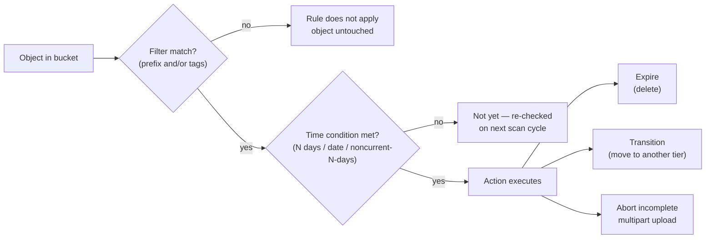
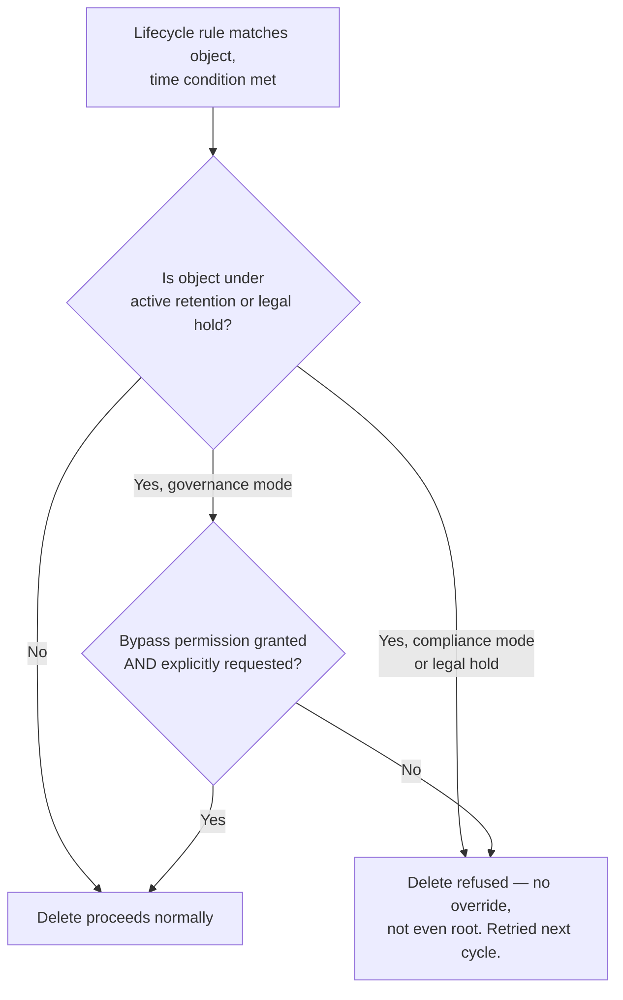
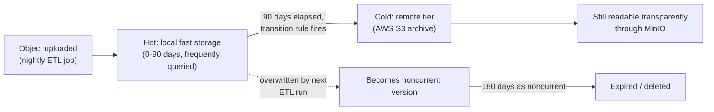

# Lifecycle Management

Chapter 6 gave you a safety net: versioning keeps every prior copy of an object, and object locking makes copies un-deletable for a compliance window, so an accidental overwrite or a malicious `DELETE` never has to be a disaster. But safety nets have a cost. Every version you keep, every delete marker you leave behind, and every abandoned multipart upload you never cleaned up is still sitting on disk, still consuming erasure-coded capacity, still costing money — forever, unless something actively goes and removes it. Versioning solves the "don't lose data" problem by creating more data. Left unmanaged, that trade-off quietly turns into runaway storage growth that nobody notices until a capacity alert fires or a bill triples.

This is exactly the gap **Information Lifecycle Management (ILM)** closes. Rather than relying on a human (or a cron job you have to remember to write) to periodically hunt down and delete stale objects, MinIO lets you attach declarative rules to a bucket that run automatically, in the background, forever, taking specific actions — expire, transition, abort — on objects that match a filter once a time condition is met. This chapter is about designing those rules so that versioning's safety net doesn't become a storage leak, multipart uploads clean up after themselves, and infrequently accessed data automatically migrates to cheaper storage without anyone lifting a finger.

---

## Learning Objectives

By the end of this chapter, you will be able to:

- Explain what a lifecycle rule is, how it's structured (filter, time condition, action), and how MinIO evaluates it in the background.
- Write expiration rules that delete current objects, noncurrent versions, and delete markers on a schedule, and explain why noncurrent-version expiration is the mandatory companion to versioning.
- Configure automatic cleanup of incomplete multipart uploads using `AbortIncompleteMultipartUpload`.
- Explain hot/warm/cold tiering conceptually, and configure a MinIO remote tier target and transition rule with `mc ilm tier` and `mc ilm rule add`.
- Combine prefix and tag filters to scope a lifecycle rule to a precise subset of a bucket.
- Explain the precedence between object locking and lifecycle expiration, and predict what happens when they conflict.
- Design a complete, multi-rule lifecycle policy for a realistic bucket that combines expiration, noncurrent-version cleanup, and tiering.

---

## Prerequisites for This Chapter

This chapter builds directly on [Chapter 6: Versioning & Object Locking](./06-versioning-and-object-locking.md). We assume you're comfortable with:

- Bucket versioning: current vs. noncurrent object versions, and how a `DELETE` on a versioned bucket creates a delete marker rather than removing data.
- WORM object locking: retention mode (governance vs. compliance) and legal hold, and why a locked object cannot be deleted or overwritten while its retention is active.
- The storage-growth problem versioning introduces — every overwrite or delete keeps the old version around, which Chapter 6 flagged and which this chapter's noncurrent-version-expiration rules directly solve.

You should also recall [Chapter 4](./04-buckets-objects-and-the-s3-api.md)'s coverage of multipart uploads: a large object is uploaded in parts, and if the upload is never completed or aborted, those parts sit on disk as billable storage indefinitely. This chapter shows you how to stop relying on remembering to clean that up manually.

---

## 1. What a Lifecycle Rule Is

A **lifecycle rule** is a bucket-level policy, expressed as XML (the S3-compatible wire format MinIO stores internally) or, more commonly in day-to-day use, configured through JSON-like rule definitions via the `mc ilm` command family. Once attached to a bucket, a rule runs automatically as a background scanning process — you don't invoke it per request, and no client needs to be involved. MinIO periodically walks the bucket's objects, evaluates each rule's filter against each object, and if the object matches and its time condition has been satisfied, performs the rule's action.

Every lifecycle rule has three parts:

1. **A filter** — which objects does this rule apply to? Expressed as a key prefix, a tag (or set of tags), or a combination of both. An empty filter matches every object in the bucket.
2. **A time condition** — when does the action fire? Expressed as "N days after object creation," "N days after the object became noncurrent," or an absolute calendar date.
3. **An action** — what happens when the filter matches and the time condition is met? Expiration (delete), transition (move to another storage tier), or abort (for incomplete multipart uploads).



A bucket can have any number of rules, each independently filtered, so a single bucket routinely runs several lifecycle rules side by side — one expiring temporary uploads, another cleaning up noncurrent versions, another tiering old objects to cold storage. You manage rules through the `mc ilm rule` subcommands: `add`, `list`, `edit`, and `remove` (or `rm`, depending on `mc` version).

---

## 2. Expiration Rules

The simplest and most common lifecycle action is **expiration**: automatically deleting objects once a condition is met, without any human running a `DELETE` command. Expiration can be scheduled two ways:

- **Relative — N days after creation.** "Delete this object 30 days after it was uploaded."
- **Absolute — on a specific date.** "Delete this object on 2027-01-01," useful for data with a known, fixed retention deadline rather than a rolling window.

### Worked example: expiring abandoned staging uploads

Imagine `product-images` accepts uploads into a staging area before a human reviewer promotes them into the catalog. Every staged image gets tagged `status=pending-review` at upload time. If nobody reviews it within 30 days, it's dead weight — nobody promoted it, and it should simply disappear rather than linger as unreviewed clutter forever.

```bash
mc ilm rule add myminio/product-images \
  --tags "status=pending-review" \
  --expire-days 30
```

This rule's filter matches only objects tagged `status=pending-review`; anything already promoted (and presumably re-tagged or moved out of staging) is untouched. Thirty days after upload, MinIO's background scanner deletes any object still carrying that tag. No cron job, no manual audit — the bucket cleans up after itself.

---

## 3. Noncurrent Version Expiration

This is the rule type that exists specifically because of what Chapter 6 introduced. Once you enable versioning on a bucket, every overwrite or delete of an object doesn't remove data — it pushes the previous copy into **noncurrent** status and keeps it. That's the entire point of versioning (recoverability), but left alone, a frequently-overwritten object accumulates an unbounded, ever-growing stack of noncurrent versions, each one billable storage that nobody is actively using.

**Noncurrent-version expiration** rules bound that growth in one of two ways, and you can combine both on the same rule:

- **Keep only the newest N noncurrent versions.** Older ones beyond that count are deleted, regardless of age. Configured via a "newer noncurrent versions" limit.
- **Expire noncurrent versions after N days.** Once a version has been noncurrent for longer than the threshold, it's deleted, regardless of how many other noncurrent versions exist.

```bash
mc ilm rule add myminio/product-images \
  --noncurrent-expire-days 90 \
  --newer-noncurrent-versions 5
```

This example keeps at most 5 noncurrent versions per key, and additionally guarantees that no noncurrent version survives longer than 90 days even if fewer than 5 exist — whichever condition triggers first, deletes. This is the standard, expected pairing: **any bucket with versioning enabled in production should have a noncurrent-version-expiration rule attached from day one.** Enabling versioning without one is one of the most common and most expensive lifecycle mistakes teams make (more in the Common Mistakes section below).

Note what this rule does *not* touch: the **current** version of each object is untouched by a noncurrent-version rule. If you want current objects to expire too, that's a separate expiration rule (Section 2) layered on top.

---

## 4. Expiring Delete Markers

Recall from Chapter 6 that deleting an object in a versioned bucket doesn't remove data — it inserts a **delete marker**, a zero-byte placeholder that becomes the new "current version" and effectively hides the object from normal listing and `GET` operations. If you then let noncurrent-version-expiration rules clean up every actual version underneath that delete marker, you're left with an odd situation: a key that has *no real data left at all*, yet still technically "exists" in the bucket as a lone delete marker forever.

This is cosmetic but untidy — it clutters listings, keeps a small amount of metadata alive indefinitely, and can be confusing when auditing a bucket ("why does this key still show up if everything under it expired months ago?"). MinIO's lifecycle engine handles this with an **expired-object-delete-marker** cleanup action: once a delete marker is the *only* thing left for a key (all of its prior versions have already expired), the lifecycle rule can remove the delete marker itself, fully erasing the key.

```bash
mc ilm rule add myminio/product-images \
  --expired-object-delete-marker
```

Paired with a noncurrent-version-expiration rule, this closes the loop: delete an object → delete marker created → noncurrent versions age out and expire → the now-orphaned delete marker is swept away too. The key disappears cleanly instead of leaving a ghost entry behind.

---

## 5. Aborting Incomplete Multipart Uploads

Chapter 4 warned about a subtle cost trap: a multipart upload that is started but never completed or aborted — because a client crashed, a network connection dropped mid-upload, or an application bug never called the completion or abort API — leaves its already-uploaded parts sitting on disk. Those parts are billable storage, but they're invisible in a normal object listing, since the upload never became a real, addressable object. Left unmanaged across a busy bucket, abandoned multipart uploads can silently accumulate into a meaningful chunk of wasted capacity that's easy to miss because it doesn't show up when you casually browse the bucket's contents.

Lifecycle management gives you the automated fix: the `AbortIncompleteMultipartUpload` action.

```bash
mc ilm rule add myminio/analytics-lake \
  --expire-delete-marker false \
  --expired-object-all-versions false
```

More directly, the abort-specific flag:

```bash
mc ilm rule add myminio/analytics-lake \
  --abort-incomplete-multipart-upload-days-after-initiation 7
```

This rule scans for multipart uploads that were initiated more than 7 days ago and never completed, and aborts them — releasing the orphaned parts back to free space. Because this failure mode is so easy to introduce accidentally (crashed clients, buggy retry logic, interrupted large-file uploads) and so easy to never notice, **every production bucket that accepts multipart uploads should have this rule enabled**, generally with no filter at all so it applies bucket-wide.

---

## 6. Tiering: Hot, Warm, and Cold Storage

Not all data deserves to live on your fastest, most expensive storage forever. Most datasets follow a predictable access pattern: **frequently accessed immediately after creation, then accessed less and less as time passes**, until eventually it's almost never read again but still needs to be retained (compliance, historical analytics, audit trails). Paying for fast local NVMe or SSD-backed erasure-coded storage to hold data nobody is reading is wasted spend.

This is the general concept of **tiering**, independent of any specific vendor:

- **Hot tier** — frequently accessed data, kept on your fastest, most local, typically most expensive storage. Low latency, high cost per GB.
- **Warm tier** — less frequently accessed data, often moved to somewhat cheaper storage that may have slightly higher retrieval latency.
- **Cold tier** — rarely accessed data, moved to the cheapest storage available, often with materially higher retrieval latency (or even retrieval fees), because you're optimizing purely for storage cost, not access speed.

MinIO implements this through **ILM tiering**: you configure a **remote tier target** — another MinIO cluster, an AWS S3 bucket, Azure Blob Storage, or Google Cloud Storage — and then attach a **transition rule** that moves objects matching a filter to that remote tier once a time condition is met. Critically, from the client's perspective, nothing changes: the object key stays the same, and a `GET` against MinIO transparently proxies the read from the remote tier if the object has been transitioned there. Tiering is invisible to applications; it only changes where the bytes physically live and what they cost to store.

### Configuring a tier target and a transition rule

First, register the remote tier target (a one-time setup step, independent of any single bucket):

```bash
mc ilm tier add s3 myminio COLD-TIER \
  --endpoint https://s3.amazonaws.com \
  --access-key <AWS_ACCESS_KEY> \
  --secret-key <AWS_SECRET_KEY> \
  --bucket my-cold-archive-bucket \
  --region us-east-1
```

`mc ilm tier add` supports `s3` (AWS S3 or another S3-compatible endpoint, including a second MinIO cluster), `azure` (Azure Blob), and `gcs` (Google Cloud Storage) as tier types — you name the tier (`COLD-TIER` here) so lifecycle rules can reference it.

Then attach a transition rule to a bucket that points matching objects at that tier after a time condition:

```bash
mc ilm rule add myminio/analytics-lake \
  --prefix "parquet/" \
  --transition-days 90 \
  --transition-tier COLD-TIER
```

Ninety days after creation, any object under `parquet/` is transitioned from local hot storage to the `COLD-TIER` remote target. The object's key and metadata remain queryable through MinIO exactly as before; only its physical bytes have moved. You can verify tier configuration with `mc ilm tier ls myminio` and check per-tier usage/status with `mc ilm tier info`.

---

## 7. Rule Filtering: Prefix and Tag Combinations

Nearly every real lifecycle policy needs to apply to a *subset* of a bucket, not the whole thing — you rarely want one blanket rule governing everything a bucket holds, since different prefixes or object categories usually have different retention needs. Lifecycle filters support:

- **Prefix only** — `--prefix "staging/"` matches every key under that prefix, regardless of tags.
- **Tag only** — `--tags "archive=true"` matches any object carrying that tag, regardless of where it lives in the key namespace.
- **Prefix AND tag combined** — both conditions must hold. `--prefix "product-images/staging/" --tags "status=pending-review"` matches only objects that are *both* under that prefix *and* carrying that tag.

Combining filters lets one bucket host several independently-managed lifecycles side by side:

```bash
# Rule A: aggressive cleanup of unreviewed staging uploads
mc ilm rule add myminio/product-images \
  --prefix "staging/" --tags "status=pending-review" \
  --expire-days 30

# Rule B: long-term archive objects, kept much longer, never auto-tiered
mc ilm rule add myminio/product-images \
  --tags "archive=true" \
  --expire-days 3650
```

Without a filter, a rule applies bucket-wide — which is exactly the setup you want for cleanup actions meant to apply universally, like `AbortIncompleteMultipartUpload`, but exactly the setup you want to *avoid* for expiration and transition rules unless you really do mean "every object in this bucket, no exceptions."

---

## 8. Interaction With Object Lock

This is one of the most important cross-chapter interactions in the entire course, and it's worth stating with no hedging: **an object under active WORM retention (Chapter 6) cannot be deleted by anything, including a lifecycle expiration rule.**

Object lock's entire purpose is to guarantee immutability for a compliance window — retention mode (governance or compliance) and legal hold both exist specifically to make an object undeletable by *any* actor, human or automated, privileged or not, for as long as the lock is active. A lifecycle expiration rule is just another actor issuing a delete, from the storage engine's perspective, and it is bound by exactly the same rule everyone else is:

- **Compliance-mode retention or an active legal hold**: the delete is refused outright, full stop, no exceptions — not even by the root/admin identity. The lifecycle scanner will retry on its next cycle and be refused again, indefinitely, until the retention period expires or the legal hold is explicitly removed.
- **Governance-mode retention**: only an identity holding the `s3:BypassGovernanceRetention` permission, on a delete request that explicitly sets the bypass flag, can override it. A lifecycle rule's automated background deletes do **not** carry that bypass — so in practice, governance-locked objects are just as safe from lifecycle expiration as compliance-locked ones, unless you've specifically engineered a bypass path, which defeats the point of using retention in the first place.

The practical implication: **you cannot use a lifecycle expiration rule to "get around" object lock, and you should never assume a locked object will actually vanish on schedule just because an expiration rule matches it.** Design lifecycle policies and retention policies together, deliberately — a rule that says "expire after 30 days" on a bucket where compliance-mode locks routinely run 180 days will simply have its expiration attempts silently deferred by the lock, every cycle, until the lock finally lifts.



---

## 9. Worked Example: A Full Lifecycle Policy for `analytics-lake`

Bring every mechanism in this chapter together for a realistic bucket: `analytics-lake`, a versioned bucket holding Parquet files written by a nightly ETL job. Requirements:

1. Recently-written Parquet files should stay on fast local storage — they're queried frequently by dashboards and ad-hoc analysis.
2. Files older than 90 days are rarely queried but must be retained for historical/audit purposes — move them to a remote cold tier instead of paying for local capacity.
3. Because the bucket is versioned (each nightly job may overwrite partition files), noncurrent versions should expire after 180 days so old, overwritten copies don't accumulate forever.
4. Any incomplete multipart upload (a common risk given large Parquet files) should abort automatically after 7 days.

```bash
# 1. Register the cold tier target once
mc ilm tier add s3 myminio ANALYTICS-COLD \
  --endpoint https://s3.amazonaws.com \
  --access-key <AWS_ACCESS_KEY> \
  --secret-key <AWS_SECRET_KEY> \
  --bucket analytics-lake-cold-archive \
  --region us-east-1

# 2. Transition current Parquet files to cold storage after 90 days
mc ilm rule add myminio/analytics-lake \
  --prefix "parquet/" \
  --transition-days 90 \
  --transition-tier ANALYTICS-COLD

# 3. Bound versioning's storage growth: expire noncurrent versions after 180 days
mc ilm rule add myminio/analytics-lake \
  --noncurrent-expire-days 180

# 4. Clean up abandoned multipart uploads bucket-wide
mc ilm rule add myminio/analytics-lake \
  --abort-incomplete-multipart-upload-days-after-initiation 7
```

The resulting object journey looks like this:



Four independent rules, each scoped to exactly the concern it addresses, together produce a bucket that manages its own storage cost without a human ever running a manual cleanup script.

---

## Real-World Scenario

ShelfSnap — the retail shelf-photo analytics product this course has followed since Chapter 4 — has three distinct object populations sharing infrastructure, and the platform team needs one coherent lifecycle policy covering all of them.

**Staging images.** Field reps upload raw shelf photos into `product-images/staging/`, tagged `status=pending-review`, awaiting a merchandising analyst's approval before being promoted into the permanent catalog. Most staged images that go 30 days unreviewed are effectively dead — the promotion window has passed and the shelf has already been re-stocked. The team adds:

```bash
mc ilm rule add shelfsnap/product-images \
  --prefix "staging/" --tags "status=pending-review" \
  --expire-days 30
```

**Promoted, versioned catalog images.** Once promoted, images move into `product-images/catalog/`, a versioned prefix (Chapter 6) so that re-uploads (say, a corrected photo) don't silently destroy the previous version. But without a noncurrent-version-expiration rule, every correction leaves the old version behind forever. The team adds:

```bash
mc ilm rule add shelfsnap/product-images \
  --prefix "catalog/" \
  --noncurrent-expire-days 90
```

Noncurrent catalog-image versions older than 90 days are cleaned up — long enough to recover from a bad correction, not so long that storage grows unbounded.

**Analytics Parquet exports.** ShelfSnap's nightly job exports shelf-occupancy analytics as Parquet into `analytics-lake`. These files are queried heavily for the first few months by the BI team, then almost never again, but must be retained for a year for trend analysis. The team registers a cold-tier target and transitions files after 90 days, following the exact pattern from Section 9.

The result: three prefixes, three independent lifecycle rules, each addressing a distinct storage-growth risk — unreviewed staging clutter, versioning's noncurrent-version accumulation, and analytics data that outlives its "hot" usefulness — all enforced automatically, with zero manual intervention once configured.

---

## Best Practices

- **Always pair versioning with a noncurrent-version-expiration rule.** Enabling versioning (Chapter 6) without a corresponding cleanup rule is the single most common way to turn a safety feature into an unbounded storage bill.
- **Enable `AbortIncompleteMultipartUpload` on every bucket that accepts multipart uploads**, generally with no filter, since abandoned multipart uploads are an operational accident, not a deliberate use case worth scoping narrowly.
- **Test new lifecycle rules on a small, explicitly tagged subset first.** Tag a handful of objects, apply the rule scoped to that tag, and confirm the behavior in a scan cycle or two before widening the filter to a whole prefix or bucket.
- **Scope expiration and transition rules with a prefix and/or tag filter whenever the action isn't meant for every object in the bucket.** A rule with no filter is a bucket-wide rule — treat that as a deliberate, reviewed decision, not a default.
- **Remember that object lock overrides lifecycle expiration, not the other way around.** Design retention windows and expiration windows together; don't set a shorter expiration than the retention period and assume the object will actually disappear on schedule.
- **Give delete-marker cleanup a rule of its own** (`--expired-object-delete-marker`) alongside noncurrent-version expiration, so keys don't linger as empty ghosts after all their real versions have expired.
- **Monitor tiered storage usage and remote-tier connectivity**, since a broken or misconfigured remote tier target means transitioned objects can become temporarily unreadable — treat the tier target credentials and network path with the same operational care as the primary cluster.

---

## Common Mistakes

- **Enabling versioning with no expiration rule at all**, and discovering months later that storage usage has multiplied several times over from noncurrent versions nobody ever intended to keep forever.
- **Forgetting `AbortIncompleteMultipartUpload`**, letting abandoned multipart parts accumulate silently — invisible in normal object listings, but fully billable, sometimes amounting to a meaningful fraction of total usage in buckets with flaky upload clients.
- **Writing an overly broad lifecycle rule with no prefix or tag filter**, intending to clean up "just the staging stuff" but actually matching — and deleting or transitioning — far more of the bucket than intended.
- **Assuming a lifecycle expiration rule will delete a legally-held or actively-retained locked object.** It won't, and it will keep silently retrying and being refused every scan cycle — the fix is to plan retention and expiration windows together, not to expect lifecycle rules to bypass a lock.
- **Confusing noncurrent-version expiration with current-object expiration.** A rule with `--noncurrent-expire-days` only ever touches noncurrent versions; if you also want the *current*, live object to expire, you need a separate, deliberate expiration rule.
- **Treating tiering as a one-way, "fire and forget" migration without monitoring the remote target.** If the remote tier becomes unreachable (expired credentials, network partition, deleted remote bucket), reads for transitioned objects fail even though MinIO itself is healthy.
- **Setting a transition rule's time threshold shorter than realistic access patterns**, causing frequently-accessed objects to tier to slower, higher-latency remote storage while still under active use — hurting performance for no real cost benefit if the access pattern was misjudged.

---

## Summary

- A **lifecycle rule** is a bucket-level policy with a filter (prefix and/or tags), a time condition, and an action, evaluated automatically by a background scanner — no per-request logic required.
- **Expiration** rules delete current objects after N days or on a fixed date; a worked example expired unreviewed `product-images` staging uploads after 30 days.
- **Noncurrent-version expiration** is the mandatory companion to Chapter 6's versioning — keep only the newest N noncurrent versions, expire them after N days, or both, to bound the storage growth versioning otherwise causes without limit.
- **Expired-object-delete-marker cleanup** removes orphaned delete markers once all their underlying versions have expired, so a key doesn't linger as an empty ghost entry.
- **`AbortIncompleteMultipartUpload`** automatically cleans up abandoned multipart uploads flagged as a risk in Chapter 4, closing that storage leak without manual intervention.
- **Tiering/transition rules** move objects to a cheaper, remote hot/warm/cold storage tier — another MinIO cluster, AWS S3, Azure Blob, or GCS — after N days, configured via `mc ilm tier add` (the target) and a transition rule (the trigger), transparently to reading applications.
- **Prefix and tag filters** combine to scope a rule to exactly the objects it should govern, letting one bucket run several independent lifecycle rules side by side.
- **Object lock always wins over lifecycle expiration** — a locked object under active retention or legal hold cannot be deleted by a lifecycle rule, no exceptions for compliance mode, and only an explicit bypass permission for governance mode.

---

## Knowledge Check

1. What are the three components every lifecycle rule is built from, and what role does each play?
2. Why is noncurrent-version expiration described as the "mandatory companion" to bucket versioning rather than an optional extra?
3. A bucket has a delete-marker cleanup rule and a noncurrent-version-expiration rule, but a particular key's delete marker still hasn't disappeared after a year. What would you check first?
4. Explain, step by step, what happens when a lifecycle expiration rule's time condition is met for an object that is currently under compliance-mode retention. Does the outcome differ for governance-mode retention?
5. You need `analytics-lake`'s Parquet files to move to cheaper storage after they stop being actively queried, while remaining transparently readable through the same bucket and key. Which lifecycle mechanism addresses this, and what two configuration steps does it require?

---

## Hands-On Exercise

Using a local MinIO instance and the `mc` client, configure a complete lifecycle policy on a test bucket:

1. **Create and prepare a bucket.** Create a bucket (e.g., `mc mb myminio/ilm-lab`) and enable versioning on it (`mc version enable myminio/ilm-lab`), recalling the versioning workflow from Chapter 6.

2. **Add a tagged-prefix expiration rule.** Upload a handful of test objects under a `staging/` prefix, tag one or two with `status=pending-review` (`mc tag set myminio/ilm-lab/staging/test.txt "status=pending-review"`), then add a rule expiring that tagged subset after 30 days:
   ```bash
   mc ilm rule add myminio/ilm-lab --prefix "staging/" --tags "status=pending-review" --expire-days 30
   ```

3. **Add a noncurrent-version-expiration rule.** Overwrite one of your test objects a few times to generate noncurrent versions (`mc ls --versions myminio/ilm-lab/staging/test.txt` to confirm), then add:
   ```bash
   mc ilm rule add myminio/ilm-lab --noncurrent-expire-days 90 --newer-noncurrent-versions 3
   ```

4. **Add an `AbortIncompleteMultipartUpload` rule.** Apply it bucket-wide with a short window for lab purposes:
   ```bash
   mc ilm rule add myminio/ilm-lab --abort-incomplete-multipart-upload-days-after-initiation 7
   ```

5. **List and inspect active rules.** Confirm all three rules are attached and review their configuration:
   ```bash
   mc ilm rule list myminio/ilm-lab --json
   ```

6. **Conceptually configure a tiering target.** If you have access to a second MinIO instance or an S3-compatible bucket, register it as a tier and add a transition rule; otherwise, write out the exact `mc ilm tier add` and `mc ilm rule add --transition-days ... --transition-tier ...` commands you *would* run, and explain what each flag controls.

7. **Reflection.** Write two or three sentences on what would happen to an object matching your expiration rule in step 2 if it were also placed under compliance-mode object lock retention — tie your answer back to Section 8.

---

## Further Reading

- [MinIO Object Lifecycle Management](https://min.io/docs/minio/linux/administration/object-management/object-lifecycle-management.html) — the core ILM reference: expiration, transition, and rule configuration.
- [MinIO Tiering Documentation](https://min.io/docs/minio/linux/administration/object-management/transition-objects-to-configured-tier.html) — configuring remote tier targets and transition rules in depth.
- [MinIO `mc ilm` Command Reference](https://min.io/docs/minio/linux/reference/minio-mc/mc-ilm.html) — full flag reference for `mc ilm rule`, `mc ilm tier`, and related subcommands.
- [MinIO Bucket Versioning](https://min.io/docs/minio/linux/administration/object-management/object-versioning.html) — for revisiting the versioning mechanics that noncurrent-version-expiration rules operate on.
- [MinIO Object Locking / Retention](https://min.io/docs/minio/linux/administration/object-management/object-retention.html) — for the retention/legal-hold precedence rules discussed in Section 8.

---

<div style="display:flex;justify-content:space-between;align-items:center;">
  <a href="./06-versioning-and-object-locking.md">← Previous: Versioning & Object Locking</a>
  <a href="./00-index.md">🏠 Index</a>
  <a href="./08-identity-access-management-and-policies.md">Next: Identity, Access Management & Policies →</a>
</div>
