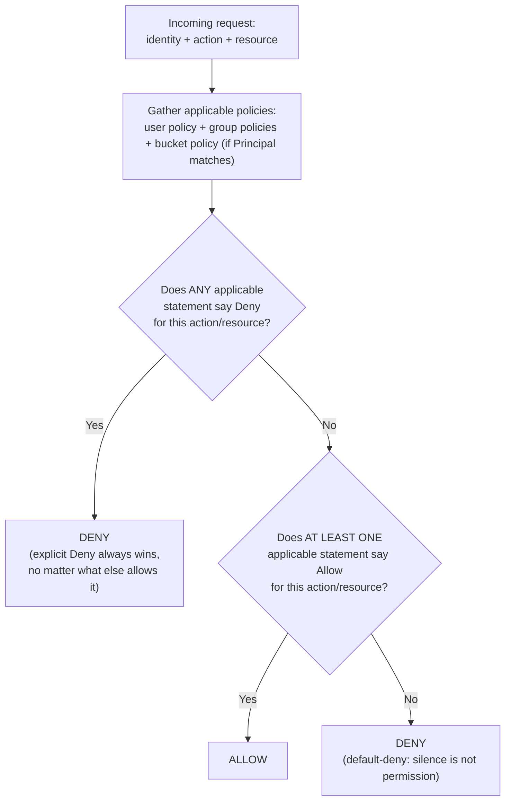
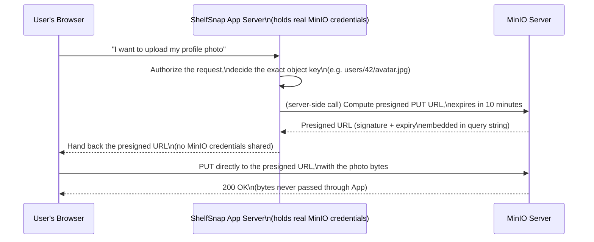

# Identity, Access Management & Policies

Chapter 4 gave you fluent command of the S3 API's verbs — `PUT`, `GET`, `DELETE`, `LIST` — against ShelfSnap's `product-images` and `analytics-lake` buckets. Every example so far has quietly assumed a single, all-powerful identity making those calls: the root user you configured back in Chapter 1. That's fine for learning, and it's exactly how MinIO wants you to *start* — but it is not how MinIO wants you to *operate*. This chapter is about precision: not "can this request succeed against the API," but "who, exactly, is allowed to run this specific request, against this specific bucket or prefix, for how long, and under what conditions." IAM users and groups, the MinIO policy language, service accounts, temporary STS credentials, bucket policies, presigned URLs, and legacy ACLs are all different tools for answering that one question, and by the end of this chapter you'll know which tool fits which situation and — just as importantly — how they interact when more than one applies at once.

This is one of the most operationally important chapters in the course. Get access control wrong in one direction and you leak private data to the internet; get it wrong in the other direction and you spend a week debugging why a perfectly reasonable request keeps returning `403 Access Denied`. Both failure modes are common, and both are avoidable once the mental model in this chapter is solid.

---

## Learning Objectives

By the end of this chapter, you will be able to:

- Explain the difference between the MinIO root user and IAM users, and state why root credentials should almost never be used directly by an application.
- Create IAM users and groups with `mc admin user add` / `mc admin group add`, and attach policies to either.
- Read and write a MinIO policy document: `Version`, `Statement`, `Effect`, `Action`, `Resource`, and `Condition`, including prefix-scoped and IP-scoped examples.
- Distinguish canned (built-in) policies from custom policies, and choose correctly between them.
- Explain what a service account is, why it's the recommended credential type for applications, and how it differs from an IAM user.
- Describe STS `AssumeRole` and when temporary, time-limited credentials are the right tool.
- Explain, at a conceptual level, why organizations federate identity via LDAP/AD or OIDC instead of maintaining MinIO-local accounts.
- State MinIO's exact policy evaluation precedence — including the single most commonly confused rule: an explicit `Deny` anywhere always wins.
- Generate a presigned URL and explain the mechanism that makes it work without the requester holding any credentials.

---

## Prerequisites for This Chapter

This chapter builds on two earlier chapters:

- [Chapter 2: Core Concepts](./02-core-concepts.md) — buckets, objects, keys, and the ShelfSnap scenario (`product-images` and `analytics-lake`) that this chapter continues to use. We'll specifically reuse the `products/` prefix layout designed in Chapter 2's Real-World Scenario.
- [Chapter 4: Buckets, Objects & the S3 API](./04-buckets-objects-and-the-s3-api.md) — the S3 API operations (`s3:GetObject`, `s3:PutObject`, `s3:ListBucket`, and so on) that every policy in this chapter grants or denies access *to*. If you're not comfortable with what those operations actually do at the HTTP level, this chapter's `Action` lists will feel like arbitrary strings rather than familiar operations.

You'll also want a running MinIO server with `mc` configured against it (from Chapter 1), and root/admin access to that server, since creating IAM users and policies requires admin privileges.

---

## 1. The Root User vs. IAM Users

### 1.1 What the root user actually is

When you first stood up MinIO in Chapter 1, you configured (or accepted a default for) exactly one identity: the **root user**, identified by `MINIO_ROOT_USER` and `MINIO_ROOT_PASSWORD` (or `MINIO_ROOT_USER`/`MINIO_ROOT_PASSWORD` equivalents depending on your deployment method). The root user is not an IAM user — it doesn't appear in `mc admin user list`, it can't have a policy attached or detached, and it can't be restricted. It has **unconditional, unrestrictable access to everything**: every bucket, every object, every admin API, including the IAM system itself (creating, deleting, and modifying every other user, group, and policy).

That last point deserves emphasis: the root user isn't just "a very powerful user" — it sits *above* the policy system entirely. You cannot write a policy that limits what the root user can do, because policies are enforced for IAM-managed identities, and the root identity isn't one. In AWS terms, this is closest to the AWS account root user, and the advice is identical: this credential is a master key, not a working credential.

### 1.2 Why the root user is the wrong identity for day-to-day work

Consider what happens if a ShelfSnap application server's environment variables (holding the root credentials) leak — a misconfigured logging pipeline, a committed `.env` file, a compromised dependency. With root credentials, an attacker doesn't just read `product-images` — they can read and delete `analytics-lake`, create new admin users for persistence, rewrite every bucket policy in the deployment, and disable object locking configurations. There is no blast-radius containment, because the root user *is* the entire blast radius.

Contrast that with a scoped IAM user or service account whose policy only allows `s3:GetObject` on `product-images/products/*`: the same leak now exposes read access to product photos and nothing else. No admin API, no other bucket, no ability to modify policies. This is the practical argument for everything else in this chapter — IAM exists so that "credentials leaked" and "entire deployment compromised" are not the same event.

### 1.3 The operating discipline

The practical rule this chapter establishes now (and Chapter 15, Security Best Practices, revisits in full production depth) is simple to state and easy to skip under deadline pressure:

> **Use the root user exactly once per deployment: to bootstrap the first IAM users, groups, and policies. After that, put the root credentials in a vault (a secrets manager, a sealed physical safe for a printed recovery credential — whatever your organization's break-glass process is) and never wire them into an application, a CI pipeline, or a developer's daily shell.**

Every example from this point forward in the course uses IAM users, groups, service accounts, or temporary credentials — never the root user — precisely to model the practice you should follow for real deployments.

---

## 2. IAM Users and Groups

### 2.1 Creating IAM users

An **IAM user** is a named identity with its own access key/secret key pair, created and managed inside MinIO's IAM subsystem (or, as Section 7 covers, federated from an external identity provider). Unlike the root user, an IAM user starts with **zero permissions** — it can authenticate, but every single API call it makes is denied until a policy explicitly grants it, which is exactly the "default deny" posture you want.

```bash
# Create an IAM user for the image-processing service
mc admin user add local svc-image-worker 'a-long-random-secret-value'

# List all IAM users
mc admin user list local

# Check a user's current policy/status
mc admin user info local svc-image-worker
```

At this point, `svc-image-worker` can log in but can do nothing — no bucket is listable, no object is gettable — until Section 3 attaches a policy.

### 2.2 Creating groups

A **group** is a named collection of IAM users used to manage policy attachment in bulk. Rather than attaching the same policy to twelve individual users (and having to remember to attach it to a thirteenth new hire), you attach the policy once to a group and add users to it.

```bash
# Create a group
mc admin group add local image-uploaders

# Add existing users to the group
mc admin group add local image-uploaders svc-image-worker
mc admin group add local image-uploaders alice-retailer-ops

# List members of a group
mc admin group info local image-uploaders
```

Policy attachment happens at the group level (Section 4), and every member inherits it automatically. Remove a user from the group, and they immediately lose whatever access the group's policy granted — a much cleaner offboarding story than hunting down every individually-attached policy across dozens of users.

### 2.3 Users vs. groups — when to use which

| | IAM User | Group |
|---|---|---|
| Represents | A single human or a single application/service identity | A collection of users sharing an access profile |
| Policy attachment | Directly attachable, useful for a one-off exception | Attach once, applies to all current and future members |
| Best for | Service accounts' parent identity (Section 5), individual exceptions | Teams, roles, or classes of application (`image-uploaders`, `analytics-readers`) |

The practical pattern used throughout the rest of this chapter: **model roles as groups, model individual identities as users (or service accounts) added to those groups.** ShelfSnap's Real-World Scenario below does exactly this with `image-uploaders`.

---

## 3. The MinIO Policy Language

### 3.1 Structure of a policy document

A MinIO policy is a JSON document, deliberately compatible with AWS IAM's policy grammar, so if you've written an AWS IAM policy before, this will look immediately familiar.

```json
{
  "Version": "2012-10-17",
  "Statement": [
    {
      "Effect": "Allow",
      "Action": ["s3:GetObject", "s3:ListBucket"],
      "Resource": ["arn:aws:s3:::product-images/*"]
    }
  ]
}
```

The top-level fields:

- **`Version`** — a fixed string (`"2012-10-17"`), inherited from AWS's policy language versioning; you'll always use this exact value.
- **`Statement`** — an array of one or more permission statements. A policy with multiple statements is evaluated as the union of all of them (subject to the Deny-wins rule in Section 8).

Each statement has:

- **`Effect`** — either `"Allow"` or `"Deny"`. There is no third option; anything not explicitly allowed is implicitly denied by default, which is why most statements you write are `Allow` (you're carving out permission from a default-deny baseline) with `Deny` reserved for explicit exceptions (Section 8).
- **`Action`** — one or more S3 API action names, matching the operations from Chapter 4: `s3:GetObject`, `s3:PutObject`, `s3:DeleteObject`, `s3:ListBucket`, `s3:GetBucketLocation`, and many more (including admin actions like `admin:CreateUser` for policies that manage IAM itself, not just data). Wildcards work here too — `s3:Get*` covers every read-style action.
- **`Resource`** — one or more ARN-style patterns identifying which buckets and/or object keys the statement applies to. The format is `arn:aws:s3:::{bucket}` for bucket-level actions (like `s3:ListBucket`) and `arn:aws:s3:::{bucket}/{key-pattern}` for object-level actions (like `s3:GetObject`), where `key-pattern` supports `*` as a wildcard.
- **`Condition`** *(optional)* — additional constraints that must hold for the statement to apply, keyed by a condition operator (e.g., `StringLike`, `IpAddress`) and a condition key (e.g., `s3:prefix`, `aws:SourceIp`).

### 3.2 Worked example: read-only access to one prefix

Let's write the policy ShelfSnap actually needs for a reporting tool that should be able to *read* product images but never write, delete, or see anything outside the `products/` prefix:

```json
{
  "Version": "2012-10-17",
  "Statement": [
    {
      "Sid": "AllowListOnlyProductsPrefix",
      "Effect": "Allow",
      "Action": ["s3:ListBucket"],
      "Resource": ["arn:aws:s3:::product-images"],
      "Condition": {
        "StringLike": {
          "s3:prefix": ["products/*"]
        }
      }
    },
    {
      "Sid": "AllowGetOnlyProductsPrefix",
      "Effect": "Allow",
      "Action": ["s3:GetObject"],
      "Resource": ["arn:aws:s3:::product-images/products/*"]
    }
  ]
}
```

Two statements are needed because `s3:ListBucket` is a **bucket-level** action (its `Resource` is the bucket ARN with no key suffix), while the *scope* of what it's allowed to list is expressed through the `s3:prefix` condition key rather than through the `Resource` field itself. `s3:GetObject`, by contrast, is an **object-level** action, so its `Resource` field directly carries the `products/*` restriction. This Allow-List-plus-Allow-Get pairing is the single most common shape you'll write, and it's worth memorizing this exact structure — a policy that grants `s3:GetObject` on `product-images/products/*` but forgets the `ListBucket` statement will let a caller fetch a *known* key but fail when they try to browse the prefix with `mc ls`, a frequent source of "why can I `mc cp` this file directly but not see it in a listing" confusion.

Save this as a file and create it as a named policy:

```bash
mc admin policy create local product-images-readonly-products ./product-images-readonly-products.json
```

### 3.3 Adding a Condition: restricting by IP

`Condition` blocks generalize beyond prefixes. A common production requirement: allow an admin-style policy's write access only from the office or VPN's IP range.

```json
{
  "Version": "2012-10-17",
  "Statement": [
    {
      "Effect": "Allow",
      "Action": ["s3:PutObject", "s3:DeleteObject"],
      "Resource": ["arn:aws:s3:::product-images/products/*"],
      "Condition": {
        "IpAddress": {
          "aws:SourceIp": ["203.0.113.0/24"]
        }
      }
    }
  ]
}
```

A request matching the `Action`/`Resource` but arriving from outside `203.0.113.0/24` simply fails to match this statement — if no other statement grants it, the request is denied by default.

---

## 4. Canned Policies vs. Custom Policies

### 4.1 The built-in (canned) policies

MinIO ships with several pre-defined policies so you don't have to hand-write JSON for the most common access shapes:

| Canned policy | Grants |
|---|---|
| `readonly` | `s3:GetObject`, `s3:ListBucket` (and similar read actions) on **all** buckets |
| `writeonly` | `s3:PutObject` (and similar write actions) on **all** buckets, without read access |
| `readwrite` | Full read and write access on **all** buckets |
| `diagnostics` | Access to server diagnostic/health admin APIs, no data access |
| `consoleAdmin` | Full administrative access, roughly equivalent in practice to the root user's data/API surface, but attachable to a named IAM user (so actions are individually auditable, unlike root) |

```bash
# See what's already defined
mc admin policy list local

# Inspect exactly what a canned policy grants
mc admin policy info local readonly
```

### 4.2 Why canned policies are usually not enough

Notice the pattern in that table: every canned policy except `diagnostics` and `consoleAdmin` applies to **all buckets**, with no prefix scoping. `readonly` attached to a user grants read access to `product-images` *and* `analytics-lake` *and* every future bucket you ever create — almost never what you actually want for an application-scoped identity. Canned policies are useful for genuinely broad roles (a human admin who legitimately needs `consoleAdmin`, a monitoring tool that legitimately needs `diagnostics`) and as a quick starting point while prototyping, but production application access almost always calls for a **custom policy** scoped to a specific bucket and prefix, exactly like Section 3.2's example.

### 4.3 Attaching policies

The same command attaches either a canned or a custom policy, to either a user or a group:

```bash
# Attach a custom policy to a group
mc admin policy attach local product-images-readonly-products --group image-uploaders

# Attach a canned policy directly to a single user (less common, but valid)
mc admin policy attach local diagnostics --user svc-healthcheck

# See what's attached to an identity
mc admin policy entities local --user svc-image-worker
```

(Older MinIO releases used `mc admin policy set`; `mc admin policy attach`/`detach` is the current interface and supports attaching a policy to multiple users/groups in one call — check `mc admin policy attach --help` against your installed version.)

---

## 5. Service Accounts

### 5.1 What a service account is

A **service account** is a credential (its own access key/secret key pair) that is **tied to a parent user** and inherits that parent's effective permissions — but crucially, a service account can be further scoped down with its *own* policy (a subset of the parent's), and, unlike a plain IAM user, it's designed to be created, rotated, and revoked freely, often one per application instance or per deployment.

```bash
# Create a service account for svc-image-worker, inheriting its policy
mc admin user svcacct add local svc-image-worker

# Create one with an additional restricting policy (further narrows access)
mc admin user svcacct add local svc-image-worker --policy ./restrict-to-incoming-prefix.json

# List service accounts belonging to a parent user
mc admin user svcacct list local svc-image-worker

# Revoke (disable) one immediately, without touching the parent user
mc admin user svcacct disable local <access-key>
```

### 5.2 Why service accounts, not shared user credentials

The naive approach — giving the `svc-image-worker` IAM user's own access key/secret key directly to three different application instances — works, but it means:

- Rotating the credential requires updating it in three places simultaneously, with a coordination window where either the old or new key must work everywhere.
- Revoking access for *one* compromised instance means revoking the shared credential for *all three*, taking down the other two along with it.
- There's no way to tell, from an audit log, *which* of the three instances made a given request — they're indistinguishable.

Service accounts solve all three: each application instance gets its own service account (its own key pair), individually revocable, individually auditable, all while inheriting (or further restricting) the same underlying policy. This is why service accounts — not raw IAM user credentials — are the recommended credential type to actually embed in an application's configuration or environment variables. The IAM user (`svc-image-worker`) becomes a policy-holding identity that mostly stays out of direct use; the service accounts derived from it are what applications actually authenticate with.

---

## 6. STS and `AssumeRole`: Temporary Credentials

### 6.1 The problem temporary credentials solve

Every credential discussed so far — IAM user keys, service account keys — is **long-lived** by default: it works until someone explicitly revokes it. For some use cases, that's the wrong shape entirely. Consider a CI pipeline job that needs to upload a build artifact to `analytics-lake` and finish in four minutes, or a third-party contractor who needs 24 hours of scoped access to debug an issue. Provisioning a long-lived service account for either case means remembering to revoke it later — an easy step to forget, and a real exposure window if you do.

**MinIO's Security Token Service (STS)** issues **temporary, automatically-expiring credentials** via an `AssumeRole`-style API call. The caller authenticates (with an existing identity, an LDAP/AD credential, or an OIDC token — Section 7), specifies how long the credentials should live, and receives back a short-lived access key, secret key, and **session token**, all three of which are required together and all of which stop working the moment the requested duration elapses — no manual revocation step needed.

```bash
# Conceptual shape of an STS AssumeRole call (via the S3-compatible STS API)
# Typically invoked through an SDK rather than mc directly:
#   response = sts_client.assume_role(DurationSeconds=900, Policy=<optional-scoping-policy>)
#   -> temporary AccessKeyId, SecretAccessKey, SessionToken, Expiration
```

### 6.2 When to reach for STS

- **Short-lived automation** (CI/CD jobs, scheduled batch scripts) where the task's natural lifetime is minutes, not months.
- **Federated identity flows** (Section 7): when a user authenticates via your company's OIDC provider, MinIO doesn't create a permanent IAM user for them — it hands back temporary STS credentials scoped to whatever policy the OIDC claim maps to, valid for the duration of that session.
- **Reducing standing privilege**: if an identity only *sometimes* needs elevated access (an on-call engineer during an incident), issuing temporary elevated credentials on demand is safer than a permanently-attached broad policy.

STS credentials can also be scoped down further than the calling identity's own policy at request time (an optional inline policy on the `AssumeRole` call can only *narrow*, never broaden, the caller's existing permissions) — the same least-privilege instinct as service accounts, applied to a time dimension instead of an identity dimension.

---

## 7. External Identity Federation: LDAP/AD and OIDC (Conceptual Overview)

Everything so far assumes MinIO itself is the source of truth for who your users are — accounts created with `mc admin user add`, living only inside this one MinIO deployment. That works fine for a handful of service accounts, but it breaks down at organizational scale: if ShelfSnap runs MinIO alongside a dozen other internal systems, and every system maintains its own local user database, then offboarding a departing employee means remembering to revoke their access in a dozen different places — a well-known source of security incidents (the ex-employee whose access to *one* forgotten system was never revoked).

MinIO supports federating identity to an external provider instead of maintaining local accounts, in two common forms:

- **LDAP / Active Directory integration** — MinIO authenticates users against your organization's existing LDAP or AD directory (the same one that already governs email, VPN, and internal tooling access), and maps LDAP group membership to MinIO policies. A user's MinIO access rides on their existing directory identity; disable their AD account during offboarding, and their MinIO access is gone too, with no separate step.
- **OpenID Connect (OIDC) integration** — MinIO accepts identity tokens issued by an external OIDC provider (Okta, Keycloak, Azure AD, Google Workspace, etc.), typically via the STS `AssumeRoleWithWebIdentity` flow: a user authenticates with the OIDC provider, receives a signed identity token, presents it to MinIO's STS endpoint, and receives back temporary MinIO credentials whose policy is derived from claims in that token (e.g., a group claim mapped to a MinIO policy).

The underlying motivation for both is the same, and it's worth stating plainly because it's the actual business reason organizations invest in this: **a single source of truth for identity, and centralized offboarding.** When identity lives in one place, disabling one account is sufficient to revoke access everywhere that trusts it — you're not hunting across N systems hoping you remembered all of them. This course treats federation at the conceptual level here; the mechanics of configuring an LDAP or OIDC identity provider against a MinIO deployment are an operational deep-dive better suited to your identity provider's own documentation and MinIO's admin guide (linked in Further Reading) once you're ready to wire one up for real.

---

## 8. Bucket Policies (Distinct From IAM Policies)

### 8.1 What makes a bucket policy different

Everything in Sections 3–4 describes an **IAM policy** — a document attached to a *user or group*, governing what that identity can do across whichever buckets/resources the policy names. A **bucket policy** inverts the attachment point: the policy document is attached directly to a *bucket*, and it governs what *any* caller — authenticated or not — can do to that bucket, independent of whether the caller has any IAM policy of their own.

The JSON structure is the same shape you already know, with one addition: a bucket policy's statements include a `Principal` field, specifying *who* the statement applies to. The headline use case is public/anonymous access, where `Principal` is `"*"` — literally everyone, including requests with no credentials at all.

### 8.2 Worked example: a public read prefix

ShelfSnap's storefront website needs to serve certain product images directly to shoppers' browsers, with no authentication — a classic anonymous-read use case. Rather than granting every website visitor an IAM identity (nonsensical) or proxying every image byte through an authenticated backend (wasteful), ShelfSnap attaches a bucket policy to `product-images` that makes exactly one prefix public:

```json
{
  "Version": "2012-10-17",
  "Statement": [
    {
      "Sid": "PublicReadForPublicPrefix",
      "Effect": "Allow",
      "Principal": {"AWS": ["*"]},
      "Action": ["s3:GetObject"],
      "Resource": ["arn:aws:s3:::product-images/public/*"]
    }
  ]
}
```

```bash
mc anonymous set-json ./public-read-policy.json local/product-images
# or, for the common canned shapes:
mc anonymous set download local/product-images/public
```

Everything else in the bucket — `products/`, any other prefix — remains governed exclusively by IAM policies, since this bucket policy statement's `Resource` only names `public/*`. Anonymous requests for `product-images/products/SKU-10234/main.jpg` are still denied; only `product-images/public/*` is world-readable.

### 8.3 Bucket policies vs. IAM policies at a glance

| | IAM Policy | Bucket Policy |
|---|---|---|
| Attached to | A user or group | A bucket, directly |
| Governs access for | That specific identity, across any resource the policy names | *Any* caller (including anonymous, when `Principal: "*"`) to that one bucket |
| Typical use | Day-to-day scoped access for known identities | Public/anonymous access rules, or cross-account-style grants |
| Where you'd look to answer "why can this user do X?" | Their attached user/group policies | The policy attached to the specific bucket in question |

---

## 9. Policy Evaluation Order and Precedence

This is the section worth re-reading until it's automatic, because it resolves what is otherwise a genuinely common source of confused debugging sessions.

### 9.1 The rule, stated precisely

When a request arrives, MinIO gathers **every applicable policy**: the requesting identity's attached IAM policies (directly, and via any groups it belongs to), plus the target bucket's bucket policy (if one exists and the request matches its `Principal`). It then evaluates them together under two rules, in this order:

1. **An explicit `Deny` in *any* applicable policy always wins**, regardless of how many other policies say `Allow`. There is no "majority vote" or "most specific policy wins" — a single matching `Deny` statement anywhere in the applicable set is final and immediate.
2. **If no explicit `Deny` matches, access is granted if *at least one* applicable policy contains a matching `Allow`.** For a normal authenticated user, that means "the IAM policy allows it." For an anonymous/public-style request, that means "the bucket policy allows it" (since an anonymous caller has no IAM policy of its own to contribute an `Allow`). For an authenticated user against a bucket that *also* has a permissive bucket policy, either one granting access is sufficient — the effective permission is the union of what the IAM policy allows and what the bucket policy allows.
3. **If nothing matches at all** — no applicable policy contains a relevant `Allow`, and none contains a `Deny` either — the request is denied. This is the default-deny baseline every policy is layered on top of; silence is not permission.

### 9.2 Decision-flow diagram



### 9.3 Why this trips people up in practice

The classic confusing scenario: an engineer attaches `readwrite` (a broad `Allow`) to a user for convenience, then — trying to lock down one dangerous prefix — adds a second policy with an explicit `Deny` on `s3:DeleteObject` for `analytics-lake/raw/*`, expecting the two to "average out" to "read-write everywhere except that one prefix." That expectation is exactly correct, and it's exactly *because* explicit Deny always wins — this is the intended, correct use of the rule, not a bug. The confusion runs the other way just as often: an engineer *forgets* they (or a teammate, or a Terraform module, or a security baseline policy applied cluster-wide) attached an explicit Deny somewhere, sees an otherwise-well-scoped Allow policy in place, and can't understand why access still fails. The diagnostic habit worth building now: **when access is denied and you expected Allow, don't just re-read the Allow policy more carefully — actively search every applicable policy (user, every group the user belongs to, and the bucket policy) for a Deny statement that matches.** `mc admin policy entities` (Section 4.3) is the tool for enumerating exactly which policies apply to a given identity, which is the first step in that search.

---

## 10. Presigned URLs

### 10.1 The mechanism

A **presigned URL** is a normal HTTPS URL to a specific object, with the SigV4 signature (recall Chapter 2, Section 5.1) embedded directly in the URL's **query string**, along with the permission it grants and its expiration time — instead of the signature living in a request header computed at call time using a credential the caller holds. Because the signature is self-contained in the URL itself, **anyone holding the URL can perform exactly the one operation it was signed for, with no MinIO credentials of their own, for as long as the URL remains unexpired.**

This is a subtle but important shift in the trust model: normally, MinIO trusts *a credential*, and the credential's holder can sign arbitrary requests until the credential is revoked. A presigned URL flips that — MinIO trusts *a specific, already-computed signature* for *one specific action* on *one specific object*, expiring at a fixed clock time no matter what. The party holding the URL never learns any secret key; they can't use it to sign a *different* request, because the signature only validates for the exact method, path, and expiry it was computed for.

```bash
# Generate a presigned download URL, valid for 15 minutes
mc share download --expire 15m local/product-images/products/SKU-10234/main.jpg

# Generate a presigned upload URL, valid for 10 minutes
mc share upload --expire 10m local/product-images/incoming/user-42-avatar.jpg
```

The equivalent in an SDK (Python, for a service generating the URL server-side):

```python
url = client.presigned_get_object(
    "product-images",
    "products/SKU-10234/main.jpg",
    expires=timedelta(minutes=15),
)
# url is a plain HTTPS URL — hand it to a browser, no credentials required to use it
```

```python
upload_url = client.presigned_put_object(
    "product-images",
    "incoming/user-42-avatar.jpg",
    expires=timedelta(minutes=10),
)
```

### 10.2 The classic use case: bypassing the app server for bytes

The reason presigned URLs matter enough to be a named pattern (not just a CLI curiosity) is this deployment shape: a web application wants users to upload or download large files (photos, videos, backups) directly to/from object storage, **without routing the actual bytes through the application server**. Proxying every uploaded byte through your app server doubles your bandwidth cost, ties up application server connections and memory for the duration of large transfers, and adds a hop of latency for no benefit — the app server doesn't need to *see* the bytes, it only needs to authorize the transfer.

Presigned URLs solve this cleanly: the app server, which *does* hold real MinIO credentials, computes a presigned URL for the exact object and operation it wants to authorize, and hands only that URL to the browser. The browser then talks directly to MinIO for the actual data transfer — the app server is involved only in the (cheap, fast) decision of "should this user be allowed to upload/download this specific object right now," never in moving the bytes themselves.



### 10.3 Presigned URLs vs. bucket policies for "public" access

It's worth explicitly distinguishing these, since both can make an object reachable without standing IAM credentials:

- A **public bucket policy prefix** (Section 8.2) is a standing, indefinite grant — anyone, anytime, can `GET` anything under that prefix, until the policy is changed.
- A **presigned URL** is a one-off, time-boxed grant to one specific object — it expires, and it doesn't affect any other object, even in the same prefix.

Use a public bucket policy prefix for content that's genuinely, permanently meant to be public (a storefront's product photos). Use presigned URLs for access that's inherently individual and temporary (this specific user downloading this specific invoice, this specific upload session).

---

## 11. ACLs (Legacy, Briefly)

Before AWS introduced the modern IAM/bucket-policy model, S3 access control was expressed through **Access Control Lists (ACLs)** — a simpler, per-object (or per-bucket) mechanism with a small, fixed set of canned grants like `private`, `public-read`, `public-read-write`, and `authenticated-read`. MinIO supports ACL-compatible operations for backward compatibility with tools and SDKs that still speak the older ACL API surface (`x-amz-acl` headers, `PutObjectAcl`/`GetObjectAcl` calls).

You will occasionally still see ACLs used in the wild, especially in tools or codebases written against S3's older documentation, but for anything you design new: **IAM policies and bucket policies are the modern, strictly more expressive mechanism, and are what this course (and MinIO's own documentation) recommends.** ACLs can only express a handful of fixed, coarse grants and have no concept of prefixes, conditions, groups, or time-limited access — everything Sections 3–10 covered. Know that ACLs exist and roughly what they mean if you encounter `public-read` in an old script, but design your own access model on policies, not ACLs.

---

## Real-World Scenario

Let's design ShelfSnap's actual access model for `product-images`, using every tool introduced in this chapter.

**The requirements**, gathered from three different stakeholders:

1. The image-processing pipeline (a fleet of worker containers) needs to **write** new uploads into `product-images/incoming/*`, and nothing else — it should never be able to read `products/` (the published, reviewed images) or delete anything.
2. The public storefront website needs **anonymous read** access to `product-images/public/*`, since that's where finalized, approved images get copied for the CDN to serve.
3. The mobile app backend needs to let users upload a profile photo **directly from their phone to MinIO**, without the app's own servers proxying the (potentially large) image bytes, and without ever handing a phone app real MinIO credentials.

**Step 1 — the write-only worker fleet, via a group and a service account.**

Create a group for the role, write a prefix-scoped write-only custom policy (canned `writeonly` would be too broad — it covers every bucket), and attach it:

```bash
mc admin group add local image-uploaders
```

```json
{
  "Version": "2012-10-17",
  "Statement": [
    {
      "Effect": "Allow",
      "Action": ["s3:PutObject"],
      "Resource": ["arn:aws:s3:::product-images/incoming/*"]
    }
  ]
}
```

```bash
mc admin policy create local incoming-write-only ./incoming-write-only.json
mc admin policy attach local incoming-write-only --group image-uploaders

mc admin user add local svc-image-worker 'a-long-random-secret'
mc admin group add local image-uploaders svc-image-worker

# Each worker instance gets its own revocable, individually-auditable credential:
mc admin user svcacct add local svc-image-worker
```

Every worker container gets its own service account key, inheriting the group's write-only, `incoming/*`-scoped policy — no worker can ever read `products/`, and a compromised single worker instance's credentials can be revoked without touching the others.

**Step 2 — anonymous public read for the storefront, via a bucket policy.**

```bash
mc anonymous set download local/product-images/public
```

This is deliberately *not* an IAM policy — the storefront's visitors have no MinIO identity at all, so only a bucket policy (Section 8) can grant them anything. It applies only to `public/*`; `incoming/` and `products/` remain inaccessible anonymously.

**Step 3 — presigned upload URLs for user profile photos.**

The mobile app backend holds a scoped service account (its own, separate from `svc-image-worker`, following the same pattern) with `s3:PutObject` on `product-images/users/*`. When a user taps "upload profile photo," the backend — not the phone — calls `presigned_put_object` for the exact key `users/{user-id}/avatar.jpg`, valid for a short window (say, 10 minutes), and returns only that URL to the app. The phone uploads the photo bytes directly to MinIO using that URL; the backend's job was authorization, not data transfer.

**The resulting layered model**, read against Section 9's precedence rule: `product-images/incoming/*` is reachable only by identities in `image-uploaders` (IAM policy, no bucket policy involved). `product-images/public/*` is reachable by everyone (bucket policy `Allow`, `Principal: *`) *and* by any IAM identity that happens to also have an `Allow` on it — the union rule from Section 9.1. `product-images/users/*` is reachable only via a presigned URL scoped to one exact key at a time, or by an IAM identity with an explicit policy grant — there's deliberately no bucket policy or broad IAM `Allow` covering this prefix, since a user's profile photo shouldn't be broadly readable at all.

---

## Best Practices

- **Never use root credentials for applications, CI pipelines, or day-to-day human work.** Bootstrap IAM with root once, then vault the root credentials and use scoped IAM identities for everything else (Section 1.3).
- **Apply least privilege with prefix-scoped policies, not canned all-bucket policies, for application access.** `readonly`/`readwrite` attached to a service is almost always broader than the service actually needs (Section 4.2).
- **Prefer service accounts over sharing a human or shared-service user's raw credentials.** Each application instance should hold its own individually revocable, individually auditable key (Section 5.2).
- **Set short expirations on presigned URLs and STS credentials, matched to the actual task duration.** A 10-minute upload window or a 15-minute STS session for a CI job closes the exposure window far faster than a "just in case" multi-day expiry.
- **Use explicit `Deny` statements for anything that must never be allowed, regardless of what else is attached.** Because Deny always wins (Section 9.1), it's the right tool for hard organizational guardrails (e.g., "no identity may ever delete objects in `analytics-lake/raw/`") that should hold even if someone later attaches an overly broad Allow policy by mistake.
- **Federate identity (LDAP/AD or OIDC) once you have more than a handful of human users**, so offboarding is a single action in your existing directory rather than a per-system checklist item someone can forget (Section 7).
- **Audit `mc admin policy entities` and bucket policies periodically**, not just at creation time — access models drift as teams and requirements change, and a policy that was correctly scoped a year ago may now be broader than the team realizes.

---

## Common Mistakes

- **Using the root user for application access** because it's the credential that was already configured and "just works" — this collapses the entire blast-radius argument for having IAM at all (Section 1.2).
- **Writing overly broad policies**, most commonly `"Resource": ["arn:aws:s3:::*"]` or omitting the prefix restriction entirely, when the identity only ever needs one bucket or one prefix. This usually happens because it's the fastest way to make a `403` go away during development, and it quietly survives into production.
- **Forgetting that an explicit `Deny` anywhere overrides an `Allow` anywhere else**, and spending an hour re-reading a perfectly correct Allow policy instead of searching every applicable policy (user, groups, bucket) for a Deny that's actually causing the failure (Section 9.3).
- **Setting presigned URL expirations far too long** ("just set it to 7 days so we don't have to think about it again"), turning what should be a tightly time-boxed grant into something closer to a standing credential that happens to be embedded in a URL instead of a header.
- **Making an entire bucket public when only one prefix needed to be** — applying a public-read bucket policy with `Resource: ["arn:aws:s3:::product-images/*"]` instead of scoping it to `product-images/public/*`, exposing `incoming/` or `products/`-in-review content that was never meant to be anonymous-readable.
- **Attaching a canned `readwrite` or `consoleAdmin` policy "temporarily" during debugging** and forgetting to replace it with the correctly-scoped policy afterward — the most common real-world source of privilege creep.
- **Confusing an IAM policy's `Resource` ARN format for an object-level action with a bucket-level action's**, e.g., putting `products/*` on an `s3:ListBucket` statement's `Resource` field instead of expressing it via the `s3:prefix` condition key (Section 3.2) — this silently fails to scope the listing the way the author intended.

---

## Summary

- MinIO starts with one **root user** holding unconditional, unrestrictable access to everything, including IAM itself — use it only to bootstrap IAM, then vault it.
- **IAM users** and **groups** are the day-to-day identity primitives; groups let you attach a policy once and have every current and future member inherit it.
- A **policy** is a JSON document (`Version`, `Statement` blocks with `Effect`, `Action`, `Resource`, optional `Condition`) — the same grammar for both IAM policies (attached to users/groups) and bucket policies (attached to buckets).
- **Canned policies** (`readonly`, `writeonly`, `readwrite`, `diagnostics`, `consoleAdmin`) cover common broad shapes but apply across *all* buckets; **custom, prefix-scoped policies** are usually the right choice for application access.
- **Service accounts** give each application instance its own revocable, auditable credential tied to a parent user's (or a further-restricted) policy — the recommended way applications should authenticate, instead of sharing a user's own keys.
- **STS `AssumeRole`** issues temporary, self-expiring credentials for short-lived tasks and is the mechanism behind federated identity flows.
- **LDAP/AD and OIDC federation** let an organization centralize identity and offboarding in one existing directory instead of maintaining MinIO-local accounts.
- **Bucket policies** are attached to a bucket, not a user, and are how anonymous/public access (`Principal: "*"`) gets granted — most commonly to make one prefix world-readable.
- **Policy evaluation**: gather every applicable IAM and bucket policy; if any matching statement is `Deny`, the request is denied, full stop; otherwise, if any matching statement is `Allow`, it's granted; otherwise, default-deny.
- **Presigned URLs** embed a signature, permission, and expiry directly in a URL's query string, letting a credential-less party perform one specific, time-limited operation on one specific object — the standard way to let browsers upload/download directly to/from MinIO without proxying bytes through an application server.
- **ACLs** are a legacy, coarser access-control mechanism MinIO supports for compatibility; IAM and bucket policies are the modern, recommended replacement for everything ACLs used to do.

---

## Knowledge Check

1. Explain precisely why you cannot write a policy that restricts what the MinIO root user is allowed to do, and what practical discipline this implies for how root credentials should be stored and used.
2. Write (in JSON) a custom policy that grants an IAM group read-only access (both listing and getting objects) to only the `analytics-lake/exports/*` prefix, and explain why two separate statements are needed.
3. A user is a member of a group with an `Allow` `readwrite` policy, but a separately attached policy on that same group contains an explicit `Deny` on `s3:DeleteObject` for `analytics-lake/raw/*`. Can that user delete an object at `analytics-lake/raw/2026-07-01.parquet`? Justify your answer using the precedence rule from Section 9.
4. What is the difference between a service account and a plain IAM user, and why is a service account the recommended credential type for an application rather than the IAM user's own access key?
5. Explain, in your own words, the mechanism that lets a presigned URL grant access to someone with no MinIO credentials at all — specifically, what is embedded in the URL, and what happens once the expiry time passes?
6. A teammate proposes making the entire `product-images` bucket public via a bucket policy, since "only the `public/` prefix really needs it, but this is simpler." Explain what could go wrong with this approach and how you would scope the policy instead.

---

## Hands-On Exercise

Using the `mc` alias from earlier chapters (referred to below as `local`), and the `product-images` bucket from Chapter 2:

1. **Create an IAM user:**

   ```bash
   mc admin user add local alice-reporting 'ChangeThisSecretValue123!'
   ```

2. **Write and attach a custom, prefix-scoped read-only policy.** Save the following as `products-readonly.json`:

   ```json
   {
     "Version": "2012-10-17",
     "Statement": [
       {
         "Effect": "Allow",
         "Action": ["s3:ListBucket"],
         "Resource": ["arn:aws:s3:::product-images"],
         "Condition": {"StringLike": {"s3:prefix": ["products/*"]}}
       },
       {
         "Effect": "Allow",
         "Action": ["s3:GetObject"],
         "Resource": ["arn:aws:s3:::product-images/products/*"]
       }
     ]
   }
   ```

   ```bash
   mc admin policy create local products-readonly ./products-readonly.json
   mc admin policy attach local products-readonly --user alice-reporting
   ```

3. **Create a group and add the user to it**, then verify the group membership:

   ```bash
   mc admin group add local reporting-team alice-reporting
   mc admin group info local reporting-team
   ```

4. **Generate a service account for the user**, and use its returned credentials (not `alice-reporting`'s own key) to configure a second `mc` alias, confirming it can list and get objects under `products/` but not under `incoming/`:

   ```bash
   mc admin user svcacct add local alice-reporting
   # Use the returned access key/secret key:
   mc alias set alice-svc http://localhost:9000 <returned-access-key> <returned-secret-key>
   mc ls alice-svc/product-images/products/
   mc cp alice-svc/product-images/products/SKU-10234/main.jpg ./downloaded.jpg
   ```

5. **Generate a presigned download URL for an object, and verify it works with plain `curl` and no credentials:**

   ```bash
   mc share download --expire 5m local/product-images/products/SKU-10234/main.jpg
   # Copy the printed URL, then, from a shell with no mc alias or MinIO credentials configured:
   curl -o test-download.jpg "<the presigned URL>"
   ```

   Confirm `test-download.jpg` downloaded successfully with no credentials passed to `curl` at all — the signature in the URL is doing all the work. Wait past the expiry window and retry the same URL to observe the request now fail.

6. **Set a bucket policy making one prefix publicly readable**, and confirm anonymous access works for that prefix but not others:

   ```bash
   mc cp ./sample.jpg local/product-images/public/banner.jpg
   mc anonymous set download local/product-images/public

   # From a machine/shell with no MinIO credentials configured at all:
   curl -o banner-anon.jpg "http://localhost:9000/product-images/public/banner.jpg"

   # Confirm this still fails anonymously (no bucket policy covers it):
   curl -i "http://localhost:9000/product-images/products/SKU-10234/main.jpg"
   ```

   The second `curl` should return an access-denied response, demonstrating that the public bucket policy statement's `Resource` scoping to `public/*` is doing exactly what Section 8.2 described.

---

## Further Reading

- [MinIO Documentation — Identity and Access Management Overview](https://min.io/docs/minio/linux/administration/identity-access-management.html) — the canonical reference for users, groups, policies, and service accounts covered in this chapter.
- [MinIO Documentation — Policy-Based Access Control](https://min.io/docs/minio/linux/administration/identity-access-management/policy-based-access-control.html) — the full policy grammar reference for `Action`, `Resource`, and `Condition` keys used in Sections 3, 8, and 9.
- [MinIO Documentation — MinIO Security Token Service (STS)](https://min.io/docs/minio/linux/administration/identity-access-management/minio-sts.html) — the `AssumeRole` and federated-identity flows introduced in Sections 6 and 7.
- [MinIO Documentation — Presigned URLs](https://min.io/docs/minio/linux/administration/console/security-and-access.html) — presigned URL generation via `mc` and the MinIO Console, referenced in Section 10.
- [MinIO Documentation — Linux Admin & Client Guide](https://min.io/docs/minio/linux/index.html) — the top-level admin guide index, useful for cross-referencing `mc admin` subcommands used throughout this chapter.

---

<div style="display:flex;justify-content:space-between;align-items:center;">
  <a href="./07-lifecycle-management.md">← Previous: Lifecycle Management</a>
  <a href="./00-index.md">🏠 Index</a>
  <a href="./09-encryption-and-key-management.md">Next: Encryption & Key Management →</a>
</div>
