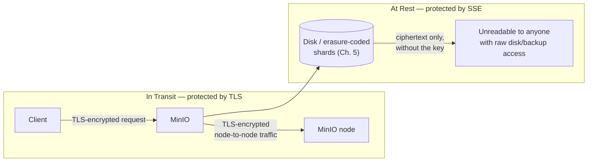
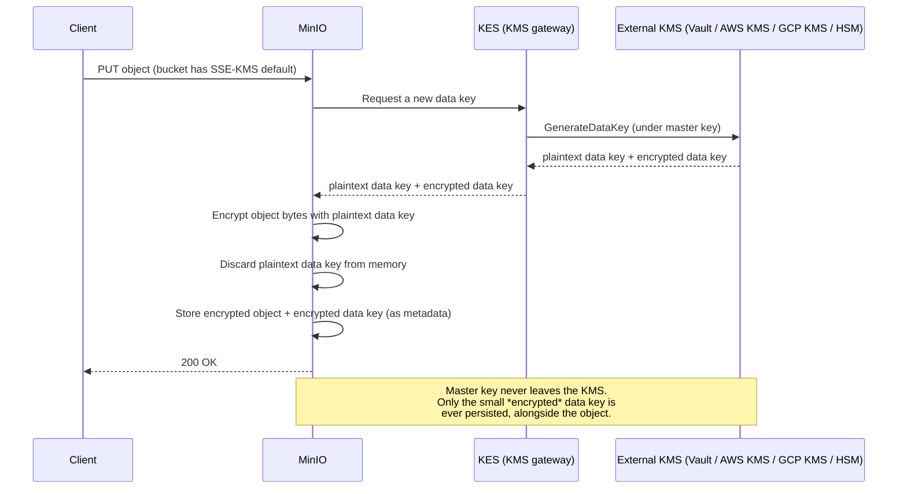
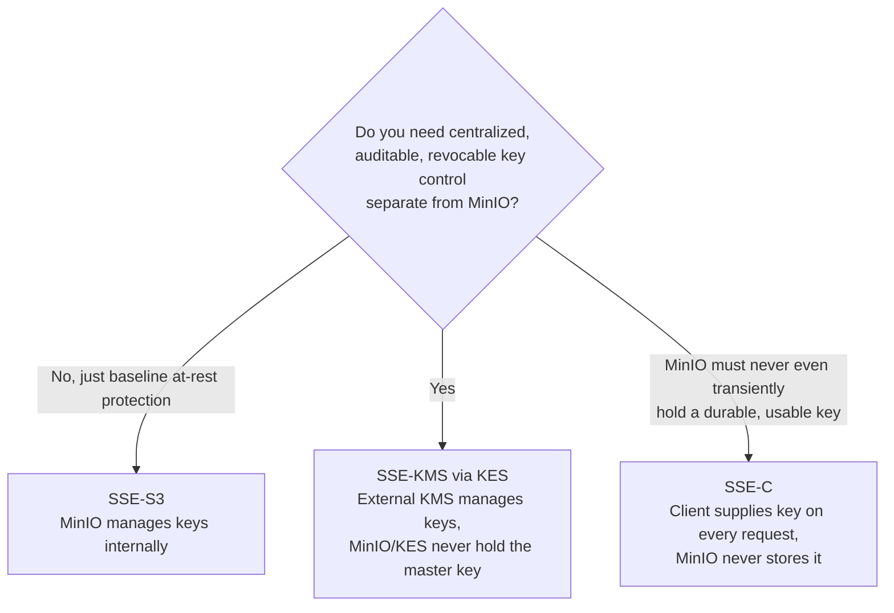
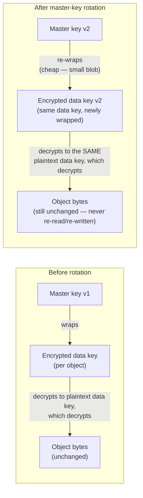

# Encryption & Key Management

Chapter 8 was about **who gets to ask**: IAM users and groups, bucket and access policies, STS-issued temporary credentials, and presigned URLs all exist to answer the question "should this request be allowed to reach this object?" That's an essential layer of defense, but it has a quiet assumption baked into it — it only controls requests that go through MinIO's own API. It says nothing about what happens if someone bypasses the API entirely: a stolen backup tape, a decommissioned drive that wasn't wiped, a misconfigured snapshot copied to the wrong place, a cloud volume snapshot shared with the wrong account, or an attacker who gets raw filesystem access to the nodes underneath MinIO. In every one of those scenarios, IAM policies are irrelevant — there's no request, no policy evaluation, just raw bytes on a disk.

This chapter is about the second, independent layer of defense: **encryption**. Where Chapter 8 protects data by controlling *who can request it*, encryption protects data by making sure that even someone who *does* get their hands on the raw bytes — with no API, no credentials, no policy check involved at all — still can't read anything meaningful without the right key. The two layers are complementary, not redundant: a perfectly designed IAM policy does nothing to protect you from a stolen disk, and perfect encryption does nothing to stop an over-privileged, authenticated user from reading data they should never have been allowed to touch. Production systems need both, and this chapter is dedicated entirely to the second one.

---

## Learning Objectives

By the end of this chapter, you will be able to:

- Precisely distinguish encryption **in transit** from encryption **at rest**, and explain why each protects against a different threat and neither substitutes for the other.
- Explain why TLS is non-negotiable for any production MinIO deployment, and configure it at a basic level.
- Explain how Server-Side Encryption with MinIO-managed keys (SSE-S3) works, and what its operational trade-offs are.
- Explain envelope encryption and how Server-Side Encryption with a Key Management Service (SSE-KMS) uses MinIO's KES component to delegate key management to an external KMS (Vault, AWS KMS, GCP KMS, or an HSM).
- Explain Server-Side Encryption with Customer-provided keys (SSE-C), and why losing the key means permanent, unrecoverable data loss.
- Compare SSE-S3, SSE-KMS, and SSE-C across who controls the keys, operational complexity, auditability, and blast radius on key loss, and choose the right one for a given requirement.
- Explain why envelope encryption makes master-key rotation in SSE-KMS dramatically cheaper than re-encrypting data under SSE-S3's simpler model.

---

## Prerequisites for This Chapter

This chapter builds on two earlier chapters:

- [Chapter 5: Erasure Coding & Data Protection](./05-erasure-coding-and-data-protection.md) — you should recall how an object is physically split into data and parity shards and distributed across drives. Encryption operates on top of that layout: whether an object is encrypted or not, it's still erasure-coded the same way underneath. This chapter answers a *different* question than Chapter 5 — not "how do we survive a drive failure?" but "how do we make the bytes on those drives meaningless to anyone without the key?"
- [Chapter 8: Identity, Access Management & Policies](./08-identity-access-management-and-policies.md) — you should be comfortable with the idea that IAM and bucket policies gate *requests* to MinIO's API. This chapter assumes that framing and builds the second, independent layer on top of it: protecting the *data itself*, regardless of how or whether the API is ever involved.

---

## 1. Encryption in Transit vs. Encryption at Rest

These two terms get used loosely in casual conversation, but they protect against genuinely different threats, and conflating them is one of the most consequential mistakes you can make when designing a secure deployment.

### 1.1 Encryption in transit (TLS)

**Encryption in transit** protects data *while it moves over a network* — between a client and MinIO, or between MinIO nodes in a distributed cluster. MinIO implements this with **TLS** (Transport Layer Security), the same protocol that secures HTTPS traffic everywhere else on the internet. With TLS enabled, anyone who intercepts network traffic between a client and MinIO — on a shared network segment, a compromised router, or via a man-in-the-middle attack — sees only encrypted, unreadable ciphertext instead of object data, credentials, or presigned URLs in the clear.

TLS protects a **path**, not a **place**. Once the data arrives at MinIO and is written to disk, TLS has done its job and is no longer relevant — a request that never leaves the local machine (or was captured *after* decryption at the server) is entirely unaffected by TLS one way or the other.

### 1.2 Encryption at rest (server-side / at-rest encryption)

**Encryption at rest** protects data *as it sits on disk*, independent of any network activity at all. An object encrypted at rest is stored as ciphertext on the physical drives that make up MinIO's erasure-coded backend (Chapter 5). Anyone who gains access to those drives directly — by removing them physically, reading a backup, restoring a leaked snapshot, or exploiting filesystem-level access on a compromised host — sees only ciphertext, not the original object content, unless they also have the decryption key.

At-rest encryption protects a **place**, not a **path**. It says nothing at all about what happens to the data on its way between a client and MinIO — that's TLS's job, not this layer's.

### 1.3 Why both are required, and neither substitutes for the other

These two layers are **independent**. Enabling one does not give you any of the protection the other provides:

| Configuration | Protected against network interception? | Protected against stolen/leaked disks or backups? |
|---|---|---|
| TLS only, no at-rest encryption | Yes | **No** — anyone with raw disk/backup access reads plaintext directly |
| At-rest encryption only, no TLS | **No** — object data and credentials travel as plaintext over the wire | Yes |
| Both TLS and at-rest encryption | Yes | Yes |
| Neither | No | No |

A team that enables SSE-KMS on every bucket but still runs MinIO over plain HTTP has done real, meaningful work — and still has an open network security hole exposing every object, every credential, and every presigned URL to anyone positioned to intercept traffic. A team that runs MinIO behind TLS but skips at-rest encryption has secured the wire and left every disk, snapshot, and backup fully readable to anyone who touches them directly. Treat these as two separate checkboxes on your security checklist, not one.



---

## 2. TLS Setup for MinIO (Brief)

Enabling TLS on MinIO is the baseline, non-optional requirement for any production deployment — this section covers the essentials; full network hardening (reverse proxies, mutual TLS, firewalling, and defense-in-depth checklists) is Chapter 15's dedicated territory.

At a minimum, TLS requires a certificate and a private key. MinIO looks for them in a well-known certificate directory, which you can point at explicitly with `--certs-dir`:

```bash
minio server /data --certs-dir /etc/minio/certs
```

The certs directory expects, at minimum:

```
/etc/minio/certs/
├── public.crt   # the server's TLS certificate
└── private.key  # the corresponding private key
```

For internal/lab use, a self-signed certificate is enough to get TLS running end-to-end (clients will need to explicitly trust it, or skip verification in test tooling only). For production, use a certificate from a trusted CA — an internal enterprise CA is fine, provided your clients trust it — so that clients can validate MinIO's identity without special-casing certificate errors.

Once configured, every `mc` command and every SDK call simply targets `https://` instead of `http://`, and MinIO refuses plaintext connections on the TLS-enabled port entirely.

**Why production should never run without it:** without TLS, every request — including the `Authorization` header carrying signed credentials, and the full body of every object you upload or download — travels as plaintext. Anyone with visibility into the network path (a compromised switch, a rogue VM on the same hypervisor, a misconfigured cloud security group) can read or tamper with traffic freely. "We'll add TLS later" is one of the most common and most dangerous forms of technical debt in object storage deployments — see Common Mistakes below.

---

## 3. Server-Side Encryption with MinIO-Managed Keys (SSE-S3)

**SSE-S3** is the simplest encryption-at-rest option MinIO offers: MinIO transparently encrypts every object as it's written and decrypts it as it's read, generating and managing the encryption keys itself, entirely internally. From the client's point of view, nothing changes — you upload and download objects exactly as before; MinIO handles encryption and decryption transparently on the server side.

Key properties of SSE-S3:

- **Zero client changes required.** Applications don't need to supply, manage, or even be aware of any key material.
- **Minimal operational overhead.** There's no external system to stand up, configure, or keep available — MinIO's own key management handles everything internally.
- **Good default protection.** For a large share of use cases — "make sure data on disk isn't plaintext if a drive walks out the door" — SSE-S3 is a genuinely sufficient, low-effort answer.

The trade-off is architectural, not operational: **the same operator (MinIO itself) controls both the ciphertext and the keys that unlock it.** There's no separation of duties between "the system storing the data" and "the system guarding the keys." If your threat model or compliance requirement specifically calls for keys to be managed, audited, or revocable independently of the storage system itself, SSE-S3 alone does not satisfy that — which is exactly the gap SSE-KMS closes next.

Enabling SSE-S3 as a bucket default is a single `mc` command:

```bash
mc encrypt set sse-s3 myminio/product-images
```

From this point on, every object written to `product-images` is encrypted at rest automatically, with no per-request flag required from clients.

---

## 4. Server-Side Encryption with a Key Management Service (SSE-KMS)

**SSE-KMS** solves precisely the gap SSE-S3 leaves open: instead of MinIO generating and holding the keys itself, key management is delegated to an **external Key Management Service (KMS)** — a system whose entire job is generating, storing, rotating, and auditing access to cryptographic keys, independent of the storage system that uses them.

### 4.1 Why separate the KMS from the storage system

Delegating key management externally buys you three things SSE-S3 structurally cannot:

- **Centralized key rotation.** Keys can be rotated on a schedule, from one place, across every bucket and application that uses the KMS — without touching the storage layer at all (Section 8 below covers exactly how this works for SSE-KMS specifically).
- **Access auditing on the key itself, separate from access to the object.** A KMS logs every request to use a key — who asked, when, for what — as its own audit trail, distinct from and complementary to MinIO's own object-access logs. This gives you two independent audit surfaces instead of one.
- **Revocation without touching object storage.** To cut off access to encrypted data, you can revoke or disable the key at the KMS — instantly denying every future decrypt request — without needing to locate, re-encrypt, or delete a single object in MinIO. This is a powerful operational lever: "kill access to this dataset" becomes a KMS-side action, not a storage-side migration.

### 4.2 KES: MinIO's KMS gateway

MinIO doesn't talk to a KMS directly for every object operation — that would be slow and would require MinIO to embed vendor-specific logic for every possible KMS backend. Instead, MinIO ships **KES (Key Encryption Service)**, a lightweight, purpose-built gateway that sits between MinIO and whatever KMS you actually use. KES speaks a simple, uniform API to MinIO, and translates those requests into whatever protocol the backing KMS expects.

KES is commonly backed by:

- **HashiCorp Vault** — a popular self-hosted secrets/KMS system, often the first choice for teams already running Vault for other secrets management.
- **AWS KMS** — a natural fit for MinIO deployments already living in AWS.
- **Google Cloud KMS** — the GCP equivalent, for deployments on Google Cloud.
- **Thales or Fortanix hardware security modules (HSMs)** — for organizations with compliance requirements mandating hardware-backed key custody rather than software-only key storage.

The backing KMS is pluggable — KES abstracts the differences away, so switching backends later is a KES configuration change, not a MinIO or application change.

### 4.3 Envelope encryption: the actual flow

SSE-KMS uses a pattern called **envelope encryption**, which is worth understanding precisely because it's the mechanism that makes both day-to-day operation and later key rotation efficient.

The naive alternative — encrypting every object directly with a key stored in the external KMS — would mean every single `PUT` and `GET` requires a network round-trip to the KMS to fetch the master key, and every object's size and access pattern becomes directly visible to (and a performance bottleneck against) the KMS. Envelope encryption avoids this:

1. A client uploads an object to MinIO, to a bucket (or with a request) configured for SSE-KMS.
2. MinIO asks **KES** for a new **data key** for this specific object (or, more precisely, KES has KMS generate one).
3. **KES** forwards that request to the backing **KMS** (Vault, AWS KMS, GCP KMS, or an HSM), which holds the **master key** and never exposes it directly.
4. The KMS generates a fresh, random **data key**, and returns two things to KES: the **plaintext data key** (to be used immediately and then discarded) and the same data key **encrypted under the master key** (small, and safe to store).
5. KES passes both back to MinIO.
6. MinIO uses the **plaintext data key** to encrypt the object's actual bytes, then immediately discards the plaintext data key from memory — it is never written to disk anywhere.
7. MinIO stores the **encrypted data key** (tiny — a few dozen bytes) as metadata alongside the encrypted object. The master key itself never leaves the KMS, and the plaintext data key never persists anywhere.

On read, the process reverses: MinIO sends the small encrypted data key back to KES, KES asks the KMS to decrypt it (the KMS uses the master key it holds internally and returns the plaintext data key), and MinIO uses that plaintext data key to decrypt the object before returning it to the client. Again, the plaintext data key exists only transiently, in memory, for the duration of that one operation.



The key structural insight: **the master key protects data keys, and data keys protect object bytes.** This one level of indirection — the "envelope" — is what makes both scale (no per-object round trip to encrypt the actual bytes at the KMS) and rotation (Section 8) practical.

### 4.4 Configuring bucket-default SSE-KMS

Once KES is deployed and configured against a backing KMS, applying SSE-KMS as a bucket default looks like this:

```bash
mc encrypt set sse-kms my-minio-kes-key myminio/analytics-lake
```

Here `my-minio-kes-key` names the key (managed in the backing KMS, referenced through KES) that MinIO should use to request data keys for objects written to `analytics-lake`. From this point forward, every write to the bucket transparently goes through the envelope-encryption flow above — no application changes required.

---

## 5. Server-Side Encryption with Customer-Provided Keys (SSE-C)

**SSE-C** inverts where the key lives entirely: instead of MinIO or a KMS managing any key material, **the client supplies the encryption key on every single request**. MinIO uses the supplied key to encrypt the object on write and decrypt it on read, but **never stores the key anywhere** — not on disk, not in memory beyond the single request's lifetime, not in any metadata.

```bash
mc cp --enc-c "myminio/analytics-lake/report.parquet=B2JJhu1TVZij9wg2n0nJ11+kVfLYAKmYVj8QNv/uAAAA=" \
  ./report.parquet myminio/analytics-lake/report.parquet
```

(The exact flag and key encoding vary by `mc` version and SDK — the conceptual point is the same across all of them: the key travels with the request, every time.)

### 5.1 What SSE-C buys you, and what it costs

SSE-C gives the client **maximum control**: MinIO literally cannot decrypt the object without the client presenting the key again, because MinIO never retained a usable copy of it. This is attractive for organizations with a strict requirement that the storage provider never independently hold a key capable of decrypting their data.

The cost is severe and absolute:

- **The client is fully responsible for key management** — generation, storage, distribution to every application/service that needs to read the object, and protecting the key from loss or leakage. None of that is MinIO's or KES's problem to solve; all of it is the client's.
- **The key is required on every single request** — every `PUT` and every `GET` must include it. There's no "encrypt once, forget about the key" convenience the other two modes offer.
- **Losing the key means losing the data, permanently, with no recovery path.** MinIO holds only ciphertext and never had a durable copy of the key. If the client's key store is lost, corrupted, or simply misplaced, the encrypted objects are mathematically unrecoverable — not "hard to recover," but genuinely, permanently gone. There is no support ticket, no admin override, no backup key anywhere that fixes this.

SSE-C is the right tool only when the client-side key management story is airtight — a mature secrets-management practice, redundant key backups, and rigorous operational discipline. Absent that, SSE-C converts a storage system into a single point of catastrophic, unrecoverable failure the moment a key is mishandled.

---

## 6. Comparing SSE-S3, SSE-KMS, and SSE-C

| Dimension | SSE-S3 | SSE-KMS | SSE-C |
|---|---|---|---|
| **Who manages the keys** | MinIO itself, internally | An external KMS (via KES) — Vault, AWS KMS, GCP KMS, or an HSM | The client, entirely outside MinIO |
| **Operational complexity** | Lowest — nothing extra to deploy | Higher — requires deploying and operating KES plus a backing KMS | Client-side only, but high: the client must build full key lifecycle management |
| **Auditability** | Limited — no independent audit trail on key usage separate from object access logs | Strong — the KMS provides its own access log for every key operation, separate from MinIO's object logs | None from MinIO's side — MinIO never sees or logs anything about the key's lifecycle |
| **Centralized revocation** | Not possible — keys are internal to MinIO, no external kill switch | Yes — disable/revoke the key at the KMS to cut off all future decryption instantly | Not applicable — there's no central key to revoke; the client must stop distributing the key |
| **"Lose the key" blast radius** | Effectively N/A — MinIO manages the key and doesn't lose it as an operational event | Recoverable — master key custody sits with a dedicated, hardened KMS designed not to lose keys, and access-controlled separately from MinIO | **Catastrophic and permanent** — MinIO never held a durable copy; a lost client key means unrecoverable data |
| **Best fit** | Good default when you just need "not plaintext on disk" with minimal ceremony | Compliance/audit requirements demanding centralized, rotatable, independently-audited key control | Only when the client can guarantee airtight key management and requires that MinIO/KES never hold a usable key |



---

## 7. Client-Side Encryption (Brief)

All three modes above are forms of **server-side** encryption: MinIO (possibly with KES/KMS help) does the actual encrypt/decrypt work, which means MinIO handles plaintext at some point during the request, even if only transiently in memory.

**Client-side encryption** removes MinIO from that picture entirely: the application encrypts data *before* it's ever sent to MinIO, using a key MinIO never sees at all, and decrypts it *after* retrieving the ciphertext, again without MinIO's involvement. From MinIO's perspective, every object is simply an opaque encrypted blob — MinIO never has the plaintext, and never has a key capable of producing it.

This is the strongest confidentiality model available: even a fully compromised MinIO server (application layer, not just disks) never sees a plaintext byte of your data. The cost is that **everything is the client's responsibility** — encryption implementation, key management, key distribution to every reader, and correctness of the cryptography itself, with essentially no help from MinIO or KES. Most MinIO SDKs offer helper libraries for client-side encryption, but the operational burden of getting key management right is entirely on the application team, not the storage platform. Client-side encryption is typically reserved for the highest-sensitivity data, layered *on top of*, not instead of, server-side encryption and TLS — defense in depth, not a replacement for the other layers in this chapter.

---

## 8. Worked Example: KES Backed by HashiCorp Vault for `analytics-lake`

Bring the pieces together for `analytics-lake`, the Parquet-holding bucket this course has followed since Chapter 7's lifecycle-management example. The goal: every object written to `analytics-lake` is automatically encrypted with SSE-KMS, with keys centrally managed and rotatable, and no application code changes required.

### 8.1 Stand up Vault (conceptually)

Run a HashiCorp Vault instance — for a lab/dev setup, Vault's own dev-mode server is enough to exercise the full flow locally:

```bash
vault server -dev -dev-root-token-id="root-token-for-lab-only"
```

Enable Vault's **Transit secrets engine**, which is purpose-built for exactly this "generate and manage encryption keys, never expose the raw key" use case:

```bash
export VAULT_ADDR="http://127.0.0.1:8200"
export VAULT_TOKEN="root-token-for-lab-only"

vault secrets enable transit
vault write -f transit/keys/minio-analytics-lake-key
```

This creates a named master key, `minio-analytics-lake-key`, inside Vault's Transit engine — Vault will never export this key in plaintext to anything, including KES.

### 8.2 Deploy and configure KES

KES needs its own TLS identity (it's a server MinIO talks to, so it needs a certificate too) and a configuration file pointing at Vault as its backend:

```yaml
# kes-config.yaml (conceptual — real config is more detailed)
address: 0.0.0.0:7373
tls:
  cert: /etc/kes/certs/server.crt
  key: /etc/kes/certs/server.key
keystore:
  vault:
    endpoint: "http://127.0.0.1:8200"
    engine: "transit"
    approle:
      id: "<vault-approle-id>"
      secret: "<vault-approle-secret>"
```

Start KES against that configuration:

```bash
kes server --config kes-config.yaml
```

KES authenticates to Vault (typically via Vault's AppRole auth method, a machine-friendly credential pattern), and is now ready to serve MinIO's data-key requests by forwarding them to Vault's Transit engine.

### 8.3 Point MinIO at KES

Tell MinIO where KES lives and which client certificate to use to authenticate to it:

```bash
export MINIO_KMS_KES_ENDPOINT="https://127.0.0.1:7373"
export MINIO_KMS_KES_CERT_FILE="/etc/minio/certs/kes-client.crt"
export MINIO_KMS_KES_KEY_FILE="/etc/minio/certs/kes-client.key"
export MINIO_KMS_KES_KEY_NAME="minio-analytics-lake-key"

minio server /data --certs-dir /etc/minio/certs
```

### 8.4 Set a bucket-default SSE-KMS policy on `analytics-lake`

With KES wired up and reachable, apply SSE-KMS as the default for every object written to the bucket:

```bash
mc encrypt set sse-kms minio-analytics-lake-key myminio/analytics-lake
```

From this point forward, the nightly ETL job that writes Parquet files into `analytics-lake` (Chapter 7) doesn't need a single code change. Every `PUT` automatically triggers the envelope-encryption flow from Section 4.3: MinIO requests a data key from KES, KES has Vault's Transit engine generate and wrap it, MinIO encrypts the object with the plaintext data key and discards it, and only the small encrypted data key is stored alongside the Parquet file. Verify the bucket's default encryption configuration at any time with:

```bash
mc encrypt info myminio/analytics-lake
```

---

## 9. Key Rotation

Keys shouldn't live forever unchanged. The longer a single key is in use, the larger the blast radius if it's ever compromised — every object ever encrypted under that key becomes retroactively at risk the moment the key leaks. **Key rotation** — periodically replacing the key used for encryption — limits that blast radius: a compromise of a rotated-out key only threatens the (shrinking, bounded) set of data encrypted under it, not the full accumulated history of everything ever stored.

### 9.1 Why SSE-KMS makes master-key rotation cheap

This is where envelope encryption (Section 4.3) pays for itself operationally. Recall the structure: **the master key only ever encrypts small, per-object data keys — it never touches the actual object bytes directly.** Rotating the master key in Vault (or AWS KMS/GCP KMS) means:

1. The KMS generates a new master key version.
2. Existing **encrypted data keys** (the small blobs stored alongside each object) are **re-wrapped** — decrypted with the old master key version, re-encrypted with the new one.
3. The **actual object data is never touched, never re-read, never re-encrypted.** Only the tiny data-key blobs are re-wrapped, which is orders of magnitude cheaper than reprocessing potentially petabytes of object data.

This re-wrapping step is typically handled transparently by the KMS itself (Vault's Transit engine, for instance, supports exactly this "rewrap" operation), and can often happen lazily — the next time an object is read, its data key is transparently re-wrapped under the current master key version, with no bulk migration job required at all.

### 9.2 Why SSE-S3's rotation story is comparatively rigid

SSE-S3's simpler model — MinIO directly manages keys internally, without the envelope-encryption indirection layered on top of an external KMS — doesn't offer the same cheap lever. There's no small, independently-rewrappable data-key blob sitting between a master key and the object; rotating meaningfully in that model tends toward needing to touch the objects' encryption more directly, which is far more expensive at scale than SSE-KMS's "just re-wrap the small blobs" story. This asymmetry is one of the clearest, most concrete reasons to prefer SSE-KMS over SSE-S3 specifically when your compliance or security posture calls for a real, recurring key-rotation practice rather than a "set once at bucket creation and never touch it again" approach.



---

## Real-World Scenario

Recall the compliance thread this course has been building since Chapter 6: `analytics-lake` holds shelf-occupancy Parquet exports that, under a compliance-mode WORM retention policy, cannot be deleted or overwritten for a fixed audit window once written. That policy protects the data from being tampered with or destroyed — but it says nothing about confidentiality. This quarter, the compliance team adds a second, complementary requirement: **all data in `analytics-lake` must be encrypted at rest with keys that are centrally managed, independently auditable, and rotatable without touching the underlying objects** — plus, unsurprisingly, that all client connections to the cluster use TLS.

Walking through why each earlier option falls short, and what the platform team actually does:

- **SSE-S3 alone is rejected.** It would encrypt the data at rest, satisfying "not plaintext on disk," but it fails the "centrally managed, independently auditable" requirement outright — the keys live entirely inside MinIO with no separate audit trail and no external revocation lever, which is exactly what the compliance language calls for.
- **SSE-C is rejected immediately.** The nightly ETL job writing to `analytics-lake` runs unattended; requiring it to supply and safeguard an encryption key on every write, with total and permanent data loss on any key-management slip, is an unacceptable operational risk for unattended production infrastructure.
- **SSE-KMS via KES, backed by Vault, is adopted** — following exactly the pattern worked through in Section 8: Vault's Transit engine holds the master key, KES bridges MinIO to Vault, and `mc encrypt set sse-kms minio-analytics-lake-key myminio/analytics-lake` makes every object write automatically encrypted with no ETL code changes. Vault's own access logs now give the security team an independent audit trail of every key operation, satisfying the auditability requirement in a way SSE-S3 structurally could not.
- **TLS is enabled cluster-wide**, closing the network-transit gap that at-rest encryption alone never addressed — every client connection, including the ETL job's writes and the BI team's reads, is now encrypted end to end.
- **Key rotation is scheduled quarterly** against Vault's Transit engine, and thanks to envelope encryption (Section 9.1), rotating the master key re-wraps only the small per-object data keys — the (potentially large) Parquet files themselves are never re-read or re-written, keeping the rotation operation fast regardless of how much historical data has accumulated in the bucket.

The combined result: `analytics-lake`'s compliance-mode retention (Chapter 6) guarantees the data can't be destroyed or tampered with early, and SSE-KMS plus TLS (this chapter) guarantee that even a stolen backup, a leaked snapshot, or an intercepted network capture yields nothing readable — two independent controls, addressing two independent threats, both required by the same compliance mandate.

---

## Best Practices

- **Always enable TLS in production, regardless of which at-rest encryption option you choose.** At-rest encryption and TLS protect different things; skipping either leaves a real, exploitable gap, no matter how well the other is configured.
- **Prefer SSE-KMS over SSE-S3 whenever you need centralized key auditing, revocation, or a real rotation practice.** SSE-S3 is a fine default for "just don't leave plaintext on disk," but it cannot satisfy requirements that specifically call for independently managed, auditable keys.
- **Never use SSE-C unless the client can be fully and reliably trusted to manage keys.** Because key loss under SSE-C is permanent and total, reserve it for use cases with mature, redundant, well-tested client-side key management — not as a default choice.
- **Set bucket-default encryption (`mc encrypt set`) rather than relying on every application to specify encryption per request.** A bucket-level default protects every object automatically, even from an application that forgets — or was never told — to request encryption explicitly.
- **Treat the KMS/KES deployment with at least as much operational rigor as MinIO itself.** If KES or its backing KMS becomes unreachable, SSE-KMS-encrypted objects become unreadable even though MinIO is otherwise healthy — high availability for the key path matters as much as for the storage path.
- **Schedule key rotation deliberately, and prefer SSE-KMS where rotation is a real, recurring requirement** — its envelope-encryption model makes rotation cheap; don't design a rotation practice around SSE-S3 and expect the same efficiency.
- **Layer client-side encryption on top of, never instead of, TLS and server-side encryption** for your most sensitive datasets — it's the strongest model available, but only as a supplement to, not a replacement for, the other layers.

---

## Common Mistakes

- **Assuming SSE-S3 alone satisfies a compliance requirement that actually mandates centralized, auditable, revocable key management.** SSE-S3 protects data at rest, but it cannot produce an independent key-access audit trail or a KMS-side revocation lever — read the requirement's actual language carefully before assuming the simplest option covers it.
- **Running MinIO without TLS "temporarily" in production**, with the intention of adding it later. This is one of the most common forms of security debt in object storage deployments, and "temporary" configurations have a well-documented habit of outliving their intended lifespan.
- **Using SSE-C and losing the customer-provided key**, discovering only afterward that there is no recovery path whatsoever — no support escalation, no backup, no admin override can reconstruct data encrypted under a key nobody can produce anymore.
- **Forgetting that at-rest encryption doesn't protect data in transit, and vice versa.** Treat them as two separate line items to verify, not one combined "encryption is on" checkbox.
- **Deploying KES/a backing KMS without planning for its own availability**, then being surprised when a KMS outage makes every SSE-KMS-encrypted object unreadable even though MinIO's storage layer is perfectly healthy.
- **Applying encryption per-request instead of as a bucket default**, leaving objects unencrypted whenever an application forgets, is misconfigured, or is written by a team unaware of the requirement.
- **Confusing "encrypted" with "access-controlled."** Encryption protects confidentiality against someone bypassing the API entirely; it does nothing to stop an authenticated, over-privileged identity from reading data through a normal, policy-permitted request — that's Chapter 8's job, not this chapter's.

---

## Summary

- **Encryption in transit (TLS)** protects data moving over the network; **encryption at rest** protects data sitting on disk. They are independent controls, and production deployments need both.
- **SSE-S3** has MinIO manage encryption keys internally — simplest to operate, good default protection, but no separation between the system storing the data and the system holding the keys.
- **SSE-KMS** delegates key management to an external KMS via **KES**, MinIO's KMS gateway, typically backed by HashiCorp Vault, AWS KMS, GCP KMS, or an HSM — enabling centralized rotation, independent auditing, and revocation without touching object storage.
- **Envelope encryption** is the mechanism underneath SSE-KMS: a master key (held only in the KMS) wraps small, per-object data keys, which in turn encrypt the actual object bytes — only the small wrapped data key is ever stored alongside the object.
- **SSE-C** puts the client fully in control of (and fully responsible for) the key, which must be supplied on every request; losing it means permanent, unrecoverable data loss.
- **Client-side encryption** goes further still, encrypting data before it ever reaches MinIO — the strongest confidentiality model, entirely the client's responsibility.
- **Key rotation** limits the blast radius of a compromised key over time; SSE-KMS's envelope-encryption model makes master-key rotation cheap (re-wrap small data keys only), while SSE-S3's simpler model doesn't offer the same lever.
- A worked example configured KES against a local HashiCorp Vault instance and set a bucket-default SSE-KMS policy on `analytics-lake`, encrypting every object automatically with zero application changes.

---

## Knowledge Check

1. Explain, with a concrete example of each, why encryption in transit and encryption at rest protect against genuinely different threats, and why enabling only one leaves a real gap.
2. Walk through the envelope-encryption flow for SSE-KMS step by step: what does MinIO ask KES for, what does KES ask the backing KMS for, and what is actually stored alongside the object at the end?
3. Why does SSE-KMS make master-key rotation dramatically cheaper than it would be under SSE-S3's model? What specifically gets re-wrapped, and what is never touched?
4. A team enables SSE-C for a bucket used by an unattended nightly batch job, and six months later the job's key store is accidentally deleted with no backup. What happens to the data already written to that bucket, and could it have been avoided by choosing a different SSE mode?
5. A security review finds that `analytics-lake` has SSE-KMS enabled but MinIO is still serving traffic over plain HTTP. Is this bucket adequately protected? Justify your answer using the transit-vs-rest distinction from Section 1.

---

## Hands-On Exercise

Work through this progression on a local MinIO instance:

1. **Enable TLS with a self-signed certificate.** Generate a self-signed certificate and key (e.g., with `openssl req -x509 -newkey rsa:4096 -keyout private.key -out public.crt -days 365 -nodes`), place them in a certs directory, and start MinIO with `minio server /data --certs-dir <path>`. Confirm `mc alias set` and subsequent commands work against `https://` and that plain `http://` requests are refused.

2. **Upload an object with SSE-S3 and confirm bucket-default encryption.** Run `mc encrypt set sse-s3 myminio/encryption-lab`, upload a test file, and check `mc stat myminio/encryption-lab/testfile` for encryption metadata confirming it was written under SSE-S3, without having specified any encryption flag on the upload itself.

3. **Upload an object with SSE-C.** Using `mc cp` with an explicit customer-provided key (or your SDK's equivalent, e.g., Python's `minio` client with an `SSE_C` object), upload a second test file. Attempt to download it *without* supplying the key and observe the failure; then download it again *with* the correct key and confirm it succeeds. This is the clearest possible demonstration of "no key, no data" — do it deliberately, in a lab, so the stakes are visible before they're real.

4. **Stand up KES against a local Vault dev-mode instance (conceptual or hands-on).** If you have Vault available, run it in `-dev` mode, enable the Transit secrets engine, create a named key, and configure KES to use it as its backend, following Section 8.1–8.2. If you don't have Vault available, write out the exact commands you would run at each step and explain, in your own words, what each one accomplishes.

5. **Set a bucket-default SSE-KMS policy on `analytics-lake`.** Once KES is reachable from MinIO (`MINIO_KMS_KES_ENDPOINT` and related environment variables set), run `mc encrypt set sse-kms <key-name> myminio/analytics-lake` and upload a test Parquet file with no encryption flags at all. Confirm via `mc encrypt info myminio/analytics-lake` and `mc stat` that the object was automatically encrypted under SSE-KMS.

6. **Reflection.** Write two or three sentences comparing what you observed in steps 2, 3, and 5: which mode required the fewest client-side changes, and which mode would be catastrophic to lose a key under? Tie your answer back to the comparison table in Section 6.

---

## Further Reading

- [MinIO Server-Side Encryption Overview](https://min.io/docs/minio/linux/administration/server-side-encryption.html) — the core reference covering SSE-S3, SSE-KMS, and SSE-C configuration.
- [MinIO KES (Key Encryption Service) Documentation](https://min.io/docs/minio/linux/administration/server-side-encryption/server-side-encryption-with-a-kms.html) — deploying KES and integrating it with MinIO as a KMS gateway.
- [MinIO Server-Side Encryption with Customer-Provided Keys](https://min.io/docs/minio/linux/administration/server-side-encryption/server-side-encryption-customer-managed-keys.html) — SSE-C configuration details and client requirements.
- [MinIO Network Encryption (TLS) Documentation](https://min.io/docs/minio/linux/operations/network-encryption.html) — certificate setup, `--certs-dir`, and TLS configuration, previewed here and deepened in Chapter 15.
- [MinIO `mc encrypt` Command Reference](https://min.io/docs/minio/linux/reference/minio-mc/mc-encrypt.html) — full flag reference for bucket-level encryption configuration used throughout this chapter.

---

<div style="display:flex;justify-content:space-between;align-items:center;">
  <a href="./08-identity-access-management-and-policies.md">← Previous: Identity, Access Management & Policies</a>
  <a href="./00-index.md">🏠 Index</a>
  <a href="./10-minio-client-and-sdks.md">Next: MinIO Client & SDKs →</a>
</div>
