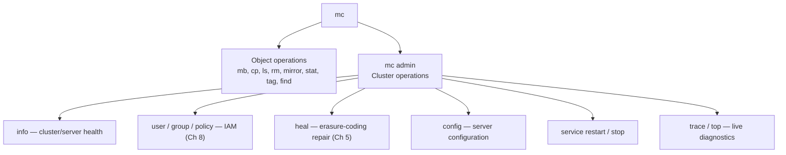
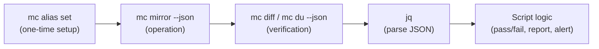
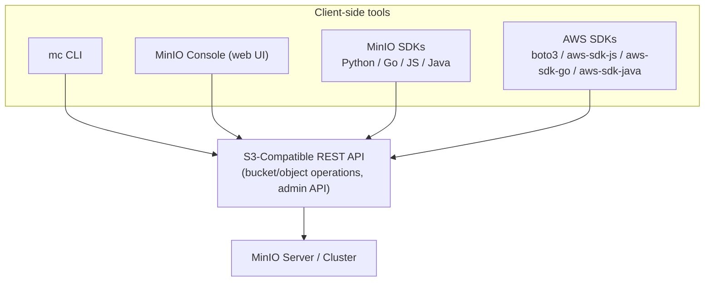

# MinIO Client & SDKs

Chapter 4 got you fluent in the *operations* — CRUD on buckets and objects, multipart upload, metadata versus tags, server-side copy — using just enough `mc` and `boto3` to make each concept concrete. This chapter is where those same operations become part of your daily toolkit rather than one-off examples. We go deep on `mc` itself: how aliases let one binary manage a fleet of endpoints (your laptop, staging, production, and even real AWS S3, side by side), the `mc admin` surface that operates a *cluster* rather than just its objects, `mc mirror`'s full sync semantics, and how to script `mc` reliably with `--json` output instead of scraping human-readable text. Then we turn to writing actual application code: the official MinIO SDKs, why the plain AWS SDK also works unmodified against MinIO, and worked examples in Python (both SDK families), Go, and JavaScript. By the end, you should be able to reach for whichever tool — CLI or code, MinIO-specific or AWS-generic — fits the job in front of you, and know exactly why you picked it.

---

## Learning Objectives

By the end of this chapter, you will be able to:

- Configure and manage multiple `mc` aliases for different environments — local, staging, production, and a real AWS S3 account — and explain why aliasing beats hardcoding endpoints and credentials into commands.
- Survey the `mc admin` command family (`info`, `user`, `group`, `policy`, `heal`, `config`, `service restart`) and explain what makes these operations administrative rather than object-level.
- Use `mc mirror` with `--watch` and `--remove` correctly, and describe at least two real use cases beyond simple backup.
- Use `mc diff` and `mc du` to compare bucket contents and report storage usage, and explain where `mc event` fits (previewed here, covered fully in Chapter 11).
- Write `mc` commands with `--json` output and parse the result programmatically in a shell script, instead of parsing human-readable table output.
- Explain the difference between a MinIO-specific SDK (`minio` for Python, `minio-go`, `minio-js`, `minio-java`) and the AWS SDK (`boto3`, AWS SDK for JS/Go/Java) pointed at a MinIO endpoint, and articulate when you'd choose each.
- Write working code — in Python with both `minio` and `boto3`, and a comparable snippet in Go or JavaScript — that creates a bucket, uploads an object with metadata, generates a presigned URL, and lists objects by prefix.

---

## Prerequisites for This Chapter

This chapter builds directly on [Chapter 4: Buckets, Objects & the S3 API](./04-buckets-objects-and-the-s3-api.md), which introduced the basic `mc` verbs (`mb`, `ls`, `cp`, `rm`, `stat`, `mirror`) and the equivalent `boto3` calls. We assume you already know:

- The core object operations and their HTTP-verb mapping (`PUT`/`GET`/`DELETE`/`HEAD`), and that `mc cp`/SDKs multipart large uploads automatically.
- That a bucket is a flat key space, and what custom metadata and tags are for.
- The concept of an `mc` alias at a basic level, and having at least one configured (`local`), from Chapter 1's installation walkthrough.

We also lean on [Chapter 8: Identity, Access Management & Policies](./08-identity-access-management-and-policies.md) for two things this chapter uses without re-deriving: the **access key/secret key pair** you configure an alias or an SDK client with must belong to an IAM user or the root account with sufficient policy permissions for whatever operation you're running, and **presigned URLs** — introduced there conceptually — reappear here as a concrete SDK method call. If you haven't read Chapter 8 yet, the SDK presigned-URL example below will still run, but the *why it's safe to hand out* reasoning behind it lives there.

---

## 1. `mc` Aliases In Depth

### 1.1 Recap: what an alias actually is

An **alias** is a named shortcut `mc` stores locally (in `~/.mc/config.json`) that bundles together an endpoint URL, an access key, a secret key, and an API signature version. Chapter 1 had you create exactly one:

```bash
mc alias set local http://localhost:9000 minioadmin minioadmin
```

Every `mc` command that follows uses `local/...` as a path prefix instead of repeating the endpoint and credentials. That's the whole point: **`mc` commands are written against aliases, never against raw URLs**, which is what lets the same script run against a laptop instance today and a production cluster tomorrow with a one-line change.

### 1.2 Multiple aliases for multiple environments

In any real project you'll have several MinIO (or S3) endpoints in play — a local dev instance, a shared staging cluster, and production — plus, not infrequently, actual AWS S3 for a workload that hasn't (or won't) move to MinIO. `mc` treats all of these identically: they're just aliases.

```bash
# Local development instance
mc alias set local http://localhost:9000 minioadmin minioadmin

# Staging cluster, behind TLS, with a dedicated IAM user's keys (Chapter 8)
mc alias set staging https://minio-staging.shelfsnap.internal \
  AKIA_STAGING_EXAMPLE_KEY '****************' 

# Production cluster — note the separate, tightly-scoped credentials
mc alias set prod https://minio.shelfsnap.io \
  AKIA_PROD_EXAMPLE_KEY '****************'

# Real AWS S3 — same tool, same syntax, a different provider entirely
mc alias set aws https://s3.amazonaws.com \
  AKIA_REAL_AWS_KEY '****************'
```

List every configured alias at any time:

```bash
mc alias list
```

```
local
  URL       : http://localhost:9000
  AccessKey : minioadmin

staging
  URL       : https://minio-staging.shelfsnap.internal
  AccessKey : AKIA_STAGING_EXAMPLE_KEY

prod
  URL       : https://minio.shelfsnap.io
  AccessKey : AKIA_PROD_EXAMPLE_KEY

aws
  URL       : https://s3.amazonaws.com
  AccessKey : AKIA_REAL_AWS_KEY
```

This is the detail worth sitting with: **`mc` doesn't know or care that `aws` points at Amazon's actual S3 service and `local`/`staging`/`prod` point at MinIO clusters you run yourself.** Every command — `mc ls`, `mc cp`, `mc mirror`, `mc du` — works identically against any alias, because they all speak the same S3 API. That's the practical, day-to-day payoff of S3 compatibility promised since Chapter 1: one tool, one set of commands, regardless of which S3-compatible provider is on the other end.

```bash
mc ls prod/product-images
mc ls aws/some-legacy-bucket
```

Both commands look identical because, from `mc`'s perspective, they *are* identical — only the alias differs.

### 1.3 Removing and updating aliases

```bash
mc alias remove staging          # drop an alias you no longer need
mc alias set prod https://minio.shelfsnap.io NEWKEY NEWSECRET  # rotate credentials in place
```

Rotating credentials is just re-running `alias set` with the same name — `mc` overwrites the stored entry. This matters operationally: when Chapter 8's IAM practices call for periodic key rotation, updating every script that uses `prod/...` paths requires touching `~/.mc/config.json` in one place, not hunting down every hardcoded credential across your tooling. That property — one place to rotate credentials — is the whole architectural argument for using aliases at all, covered further in Best Practices below.

---

## 2. `mc admin`: The Operational Surface

Every command so far — `mb`, `cp`, `ls`, `mirror` — operates on **objects and buckets**. `mc admin` is a different family entirely: it operates on **the cluster itself** — its users, policies, health, and configuration. If plain `mc` is your S3 API client, `mc admin` is your cluster's operations console from the terminal.



### 2.1 `mc admin info` — cluster status at a glance

```bash
mc admin info local
```

```
●  localhost:9000
   Uptime: 3 days
   Version: 2026-06-01T00:00:00Z
   Network: 1/1 OK
   Drives: 4/4 OK
   Pool: 1

Pools:
   1st, Erasure sets: 1, Drives per erasure set: 4

4 drives online, 0 drives offline
```

This is usually the first command you run when something feels off — it surfaces node reachability, drive health, and pool topology in one shot. Chapter 5 covers what "erasure set" and drive health mean at the storage-layout level; here, treat `mc admin info` as your cluster's vital signs check.

### 2.2 `mc admin user`, `mc admin group`, `mc admin policy` — IAM, revisited

Chapter 8 covers IAM design in depth — users, groups, policies, and how they compose. `mc admin` is the CLI surface for all of it:

```bash
mc admin user add local shelfsnap-ingest-svc SUPER-SECRET-PASSWORD
mc admin group add local shelfsnap-services shelfsnap-ingest-svc
mc admin policy attach local readwrite-product-images --user shelfsnap-ingest-svc
mc admin user list local
```

The pattern to notice now, and that Chapter 8 formalizes: **users authenticate, policies authorize, groups let you manage authorization for many users at once.** `mc admin` gives you a command for each of these three concerns as a distinct verb — `user`, `group`, `policy` — which mirrors how you should be thinking about IAM design, not just how you happen to type commands.

### 2.3 `mc admin heal` — triggering erasure-coding repair

Chapter 5 explains *why* healing exists: erasure coding tolerates a certain number of missing or corrupted drives, but a degraded object still needs to be reconstructed back to full redundancy once a failed drive is replaced or a bit-rot error is detected. `mc admin heal` is how you trigger and monitor that process by hand (MinIO also heals automatically in the background):

```bash
mc admin heal local
mc admin heal -r local/product-images   # scope healing to one bucket, recursively
```

```
●  localhost:9000
   Status: Success
   Objects Healed: 1204/1204
   Objects Failed: 0
```

You'll rarely need this in a healthy cluster — it exists for the specific, high-stakes moment right after a drive replacement or a detected inconsistency, and Chapter 5 is where you'll actually reason about when to run it.

### 2.4 `mc admin config` — server configuration

MinIO's server-side configuration (region, compression, notification targets, KMS settings, and more) is managed as key-value config subsystems, readable and writable through `mc admin config`:

```bash
mc admin config get local region
mc admin config set local region name=us-east-1
mc admin config get local compression   # see current compression settings
```

Most configuration changes require a restart of the affected service to take effect — `mc` will tell you explicitly when that's the case:

```
Please restart your server 'mc admin service restart local'.
```

### 2.5 `mc admin service restart` — applying configuration changes

```bash
mc admin service restart local
```

This performs a graceful, rolling restart across every node in the deployment (in a distributed cluster, nodes restart one at a time so the cluster stays available throughout) — it is *not* a hard kill. You'll reach for it after config changes, and Chapter 12 revisits it in the context of rolling out changes across a multi-node deployment without downtime.

### 2.6 Other administrative commands worth knowing exist

- `mc admin trace local` — streams live HTTP request traces hitting the server, useful for debugging exactly what a misbehaving client is sending.
- `mc admin top locks local` — shows currently held internal locks, useful when diagnosing a stuck operation.
- `mc admin prometheus generate local` — emits a scrape config for Prometheus metrics (Chapter 14).

You don't need to memorize all of these now — the point of this section is knowing that `mc admin` *exists as a distinct namespace* from plain object operations, and roughly what lives under it, so that when a later chapter says "run `mc admin heal`" or "check `mc admin info`," it isn't a new tool — it's a corner of `mc` you've already met.

---

## 3. `mc mirror` In Depth

Chapter 4 introduced `mc mirror` as the tool for keeping a directory or bucket in sync, computing a diff and transferring only what changed. Here we go one level deeper on its two most operationally important flags and two concrete use cases beyond a one-off backup.

### 3.1 One-way sync, by default

Plain `mc mirror SOURCE DESTINATION` is **one-directional**: it makes the destination look like the source by uploading new or changed objects. It does **not** delete anything from the destination by default, even if the source no longer has a matching object — that asymmetry is deliberate, so that running `mc mirror` never surprises you with unexpected deletions.

```bash
mc mirror local/product-images/store-4521/ local/analytics-lake/raw-images-archive/store-4521/
```

### 3.2 `--watch`: continuous sync

Add `--watch` and `mc mirror` doesn't exit after the initial sync — it stays running, subscribing to filesystem/bucket change events and mirroring new or modified objects as they appear, in near real time:

```bash
mc mirror --watch ./field-uploads/ local/product-images/store-4521/incoming/
```

This is the right tool for a folder a device or agent is continuously writing into — a field-upload directory, a log-shipping sink, a render farm's output folder — where you want objects to land in MinIO within seconds of being written, without a cron job polling on an interval. Run it as a long-lived process (under `systemd`, a container, or a process supervisor), not as a one-shot script invocation.

### 3.3 `--remove`: propagating deletions

Add `--remove` and `mc mirror` becomes a true mirror in the strict sense: objects present at the destination but no longer present at the source are deleted too.

```bash
mc mirror --remove ./processed-batch-042/ local/product-images/store-4521/batch-042/
```

Treat `--remove` with exactly the caution Chapter 4 asked you to treat `mc rb --force` with — it is the one `mc mirror` flag that can destroy data at the destination, and a swapped source/destination argument turns it from "sync" into "silently wipe the wrong side." Always double-check argument order, and consider a dry run first:

```bash
mc mirror --remove --dry-run ./processed-batch-042/ local/product-images/store-4521/batch-042/
```

`--dry-run` prints exactly what would be uploaded and deleted without doing it — the cheapest insurance available before running `--remove` against anything that matters.

### 3.4 Use case: bucket-to-bucket replication testing

Before committing to MinIO's built-in bucket or site replication (Chapter 12), teams often prototype the *behavior* they want using `mc mirror --watch` between two buckets — either two buckets in the same cluster, or two buckets on different aliases entirely:

```bash
mc mirror --watch --remove staging/product-images/ prod/product-images-mirror/
```

This isn't a substitute for production-grade replication (it lacks conflict resolution, bidirectional sync, and the operational guarantees Chapter 12's mechanisms provide), but it's a fast, zero-configuration way to validate "does object X reliably show up on the other side within N seconds" before investing in the real thing.

### 3.5 Use case: migrating data into MinIO from another S3-compatible source

Because aliases are provider-agnostic (Section 1.2), migrating a bucket's worth of data from any S3-compatible store — real AWS S3, another MinIO cluster, a different vendor's S3-compatible product — into your MinIO cluster is just aliasing both endpoints and mirroring between them:

```bash
mc alias set legacy-aws https://s3.amazonaws.com LEGACY_KEY LEGACY_SECRET
mc alias set local http://localhost:9000 minioadmin minioadmin

mc mirror legacy-aws/old-product-photos/ local/product-images/migrated/
```

`mc` handles the multipart mechanics, retries, and progress reporting on both sides — you get a real, resumable bulk migration tool for free, without writing a line of code. For very large migrations (terabytes, millions of objects), run this inside a long-lived session (`tmux`/`screen`, or a supervised background job) and expect to re-run it — `mc mirror`'s diff-and-transfer-only-what-changed behavior (Chapter 4, Section 8) makes re-running after an interruption safe and cheap, rather than starting the whole migration over.

---

## 4. Comparing and Measuring: `mc diff`, `mc du`, and a Preview of `mc event`

### 4.1 `mc diff` — comparing two locations without transferring anything

`mc mirror` transfers; `mc diff` just **reports** what's different, without moving any bytes — useful for verification after a migration or backup, or for a sanity check before running a destructive `--remove` mirror.

```bash
mc diff local/product-images/store-4521/ local/analytics-lake/raw-images-archive/store-4521/
```

```
< local/product-images/store-4521/2026-07-06/aisle-3-shelf-2.jpg
> local/analytics-lake/raw-images-archive/store-4521/2026-07-01/old-photo.jpg
```

`<` marks an object only present on the left side (source); `>` marks one only on the right. No differing-but-present-on-both-sides objects are shown by plain `mc diff` — it's a presence/absence comparison, not a byte-level diff. This is exactly the tool you reach for to verify a mirror or migration actually completed successfully, before trusting it enough to delete the source.

### 4.2 `mc du` — usage reporting

`mc du` reports aggregate size and object count under a prefix or bucket, recursively — the object-storage equivalent of the Unix `du` command:

```bash
mc du local/product-images
```

```
2.1GiB	4,821 objects	local/product-images
```

Scope it to a prefix to answer narrower questions ("how much has store 4521 uploaded this month?"):

```bash
mc du local/product-images/store-4521/2026-07-06/
```

This is the building block for the usage-reporting scripts in Section 5 and the Real-World Scenario below — `mc du`'s output, especially in `--json` form, is exactly what a daily storage-usage report script parses.

### 4.3 `mc event` — a preview

Buckets can be configured to publish an event (object created, deleted, etc.) to a target — a webhook, a message queue, a Lambda-style function — whenever something happens to their contents. `mc event add`/`list`/`remove` manage these subscriptions:

```bash
mc event add local/product-images arn:minio:sqs::primary:webhook --event put
mc event list local/product-images
```

This is genuinely a big enough topic to deserve its own chapter — event-driven pipelines, notification targets (webhooks, Kafka, NATS, AMQP), and the architecture of reacting to uploads in real time are all covered fully in [Chapter 11: Event Notifications & Integrations](./11-event-notifications-and-integrations.md). File `mc event` away as "the CLI surface for bucket notifications" for now; we build a complete event-driven pipeline on top of it next chapter.

---

## 5. Scripting with `mc`: `--json` Output

### 5.1 Why human-readable output is a scripting trap

Every `mc` command's default output is formatted for a human reading a terminal — aligned columns, progress bars, color. That's exactly the wrong shape for a script: column widths shift, wording changes between `mc` versions, and parsing it with `awk`/`grep`/regular expressions is fragile in a way that *will* break silently someday, usually right when you need the script to work correctly (during an incident).

Every `mc` command that produces structured data supports `--json`, which instead emits one JSON object per line — stable, versioned, and meant to be machine-parsed:

```bash
mc ls --json local/product-images
```

```json
{"status":"success","type":"folder","lastModified":"2026-07-06T09:20:00Z","size":0,"key":"store-4521/","etag":"","url":"http://localhost:9000/product-images/store-4521/"}
{"status":"success","type":"folder","lastModified":"2026-07-06T09:20:00Z","size":0,"key":"store-9902/","etag":"","url":"http://localhost:9000/product-images/store-9902/"}
```

Pipe that through `jq` and you have exactly the field you need, reliably:

```bash
mc ls --json local/product-images | jq -r '.key'
```

### 5.2 Worked example: a backup verification script

Here's a realistic pattern: mirror a bucket to a backup location, then verify the mirror actually succeeded with `mc diff`, then report a clean pass/fail — the kind of script that runs nightly in cron or a CI pipeline, not interactively.

```bash
#!/usr/bin/env bash
# verify-backup.sh — mirror a bucket, diff it, and report success/failure as JSON.
set -euo pipefail

SOURCE="local/product-images"
BACKUP="local/product-images-backup"
LOG_FILE="/var/log/minio-backup-$(date +%F).json"

echo "Mirroring ${SOURCE} -> ${BACKUP}..."
mc mirror --quiet "${SOURCE}/" "${BACKUP}/"

echo "Verifying with mc diff..."
DIFF_OUTPUT=$(mc diff "${SOURCE}/" "${BACKUP}/" || true)

if [[ -z "${DIFF_OUTPUT}" ]]; then
  STATUS="ok"
  MESSAGE="Backup verified: source and backup are identical."
else
  STATUS="mismatch"
  MESSAGE="Backup verification found differences."
fi

OBJECT_COUNT=$(mc du --json "${BACKUP}" | jq -r '.objects')
TOTAL_SIZE=$(mc du --json "${BACKUP}" | jq -r '.size')

jq -n \
  --arg status "$STATUS" \
  --arg message "$MESSAGE" \
  --arg objects "$OBJECT_COUNT" \
  --arg size "$TOTAL_SIZE" \
  --arg timestamp "$(date -Is)" \
  '{status: $status, message: $message, objects: ($objects|tonumber), size_bytes: ($size|tonumber), timestamp: $timestamp}' \
  | tee "${LOG_FILE}"

if [[ "${STATUS}" == "mismatch" ]]; then
  echo "::error::Backup verification failed — see ${LOG_FILE}" >&2
  exit 1
fi
```

This script mirrors, diffs, computes usage totals via `mc du --json`, and emits a single JSON status line — suitable for a CI pipeline to fail on (`exit 1`), for a monitoring system to scrape from the log file, or for a Slack-notification step to read and format into a human message. Nothing about this script parses a progress bar or a formatted table; every data point comes from a `--json`-flagged command or the command's own exit status. That's the scripting discipline this section is asking you to build: **treat `mc`'s JSON output as its real API, and its default terminal output as a display convenience you never parse.**



---

## 6. Official SDKs: Overview

`mc` covers interactive use and scripting well, but application code — a web service handling uploads, a batch job processing images, a Lambda-style function reacting to an event — needs a real client library. You have two genuinely valid families to choose from, and this is a decision worth making deliberately rather than by habit.

### 6.1 MinIO-specific SDKs

MinIO publishes and maintains official SDKs for:

| Language | Package | Import |
|---|---|---|
| Python | `minio` | `from minio import Minio` |
| Go | `minio-go` | `"github.com/minio/minio-go/v7"` |
| JavaScript / Node.js | `minio` | `const { Client } = require("minio")` |
| Java | `minio-java` | `io.minio.MinioClient` |

These SDKs are built specifically against MinIO (though they work against any S3-compatible endpoint, including real AWS S3, for the plain object operations). Their API surface is deliberately close to the `mc` command set — you'll recognize `makeBucket`, `putObject`, `listObjects`, `presignedGetObject` as near-direct code equivalents of `mc mb`, `mc cp`, `mc ls`, and a presigned-URL command. Where they go beyond parity with the AWS SDK is in exposing MinIO-specific administrative and extension features more idiomatically — bucket notification configuration, server-side object versioning helpers tuned for MinIO's implementation, and in some languages, thinner/faster clients purpose-built for MinIO rather than the full generality of the AWS SDK's multi-service design.

### 6.2 The AWS SDK, pointed at MinIO

Because MinIO implements the S3 API, the **plain AWS SDK** — `boto3` for Python, the AWS SDK for JavaScript (`@aws-sdk/client-s3`), AWS SDK for Go (`aws-sdk-go-v2`), AWS SDK for Java (`software.amazon.awssdk`) — works against MinIO **completely unmodified**, provided you do exactly one thing differently from talking to real AWS: set a custom `endpoint_url` (or equivalent) pointing at your MinIO server instead of leaving it at AWS's default.

```python
import boto3

s3 = boto3.client(
    "s3",
    endpoint_url="http://localhost:9000",   # <- the only MinIO-specific line
    aws_access_key_id="minioadmin",
    aws_secret_access_key="minioadmin",
)
```

Every other line of `boto3` code — `put_object`, `get_object`, `list_objects_v2`, `generate_presigned_url`, pagination, `TransferConfig` — is exactly the code you'd write against real AWS S3. This is, concretely, what "S3-compatible" has meant throughout this course: it's not marketing language, it's the literal fact that your existing AWS SDK code, with one endpoint override, runs against MinIO.

### 6.3 Choosing between them

| Consideration | Choose the MinIO SDK | Choose the AWS SDK |
|---|---|---|
| Portability to real AWS S3 matters | Not a priority | **Yes** — same code, zero MinIO-specific dependency |
| You need MinIO-specific admin operations from application code (bucket notification wiring, some extension APIs) | **Yes** — more direct, idiomatic access | Possible via raw API calls, but clunkier |
| Your team already has AWS SDK experience/tooling/mocking (`moto` for `boto3`, etc.) | Adds a second SDK to learn | **Yes** — reuse existing skills and test tooling |
| You want the smallest possible dependency footprint focused purely on object storage | **Yes** — MinIO SDKs are lighter, single-purpose | AWS SDKs are larger, multi-service packages |
| You might migrate this workload between MinIO and AWS S3 someday | Locks you to MinIO's package (though the S3 calls themselves remain portable) | **Yes** — this is the AWS SDK's strongest argument |

Neither choice is wrong, and plenty of real systems use both — the MinIO SDK for an internal tool that manages the cluster itself, and the AWS SDK for application code the team wants to remain cloud-portable. The one mistake is picking without knowing you had a choice, which is exactly what this section fixes.

---

## 7. Worked Example: the `minio` Python SDK

Here's a realistic sequence — connect, create a bucket if it doesn't exist, upload a file with custom metadata, generate a presigned URL, and list objects by prefix — using the MinIO-specific Python SDK.

```python
from datetime import timedelta
from minio import Minio
from minio.error import S3Error

# 1. Connect. secure=False because this is local HTTP; use secure=True in production behind TLS.
client = Minio(
    "localhost:9000",
    access_key="minioadmin",
    secret_key="minioadmin",
    secure=False,
)

BUCKET = "product-images"

# 2. Create the bucket if it doesn't already exist — idiomatic MinIO SDK pattern.
if not client.bucket_exists(BUCKET):
    client.make_bucket(BUCKET)

# 3. Upload a file with custom metadata (Chapter 4, Section 6.2).
result = client.fput_object(
    BUCKET,
    "store-4521/2026-07-06/aisle-3-shelf-2.jpg",
    "./aisle-3-shelf-2.jpg",
    content_type="image/jpeg",
    metadata={"photographer": "r-patel", "upload-date": "2026-07-06"},
)
print(f"Uploaded {result.object_name}, etag={result.etag}")

# 4. Generate a presigned URL (Chapter 8) — a time-limited, credential-free download link.
presigned_url = client.presigned_get_object(
    BUCKET,
    "store-4521/2026-07-06/aisle-3-shelf-2.jpg",
    expires=timedelta(hours=1),
)
print(f"Presigned URL (valid 1 hour): {presigned_url}")

# 5. List objects under a prefix.
objects = client.list_objects(BUCKET, prefix="store-4521/2026-07-06/", recursive=True)
for obj in objects:
    print(obj.object_name, obj.size, obj.etag)
```

A few things worth calling out:

- `bucket_exists` / `make_bucket` is the idiomatic "create if missing" pattern in the MinIO SDK — you'll use it at service startup rather than assuming infrastructure-as-code has already provisioned every bucket.
- `fput_object` (upload from a local file path) and `put_object` (upload from a file-like stream, useful when you don't have bytes on disk — e.g., an in-memory buffer from an image-processing step) are the two upload entry points; both accept the same `metadata`/`content_type` keyword arguments.
- `presigned_get_object`'s `expires` parameter ties directly back to Chapter 8: the URL it returns embeds a signature valid only until the expiry, and needs no credentials from whoever you hand it to.
- Wrap SDK calls in `try`/`except S3Error` in real application code — network blips and permission errors surface as `S3Error` exceptions, and the section on Common Mistakes below flags un-handled SDK exceptions as a recurring production bug.

---

## 8. Worked Example: `boto3` (the AWS SDK), Pointed at MinIO

Here is the exact same conceptual sequence — connect, create bucket, upload with metadata, presigned URL, list by prefix — written in `boto3`, to make the "your existing AWS code often just works" claim completely concrete.

```python
import boto3
from botocore.exceptions import ClientError

# 1. Connect — the only MinIO-specific line is endpoint_url.
s3 = boto3.client(
    "s3",
    endpoint_url="http://localhost:9000",
    aws_access_key_id="minioadmin",
    aws_secret_access_key="minioadmin",
    region_name="us-east-1",   # boto3 requires a region even though MinIO mostly ignores it
)

BUCKET = "product-images"

# 2. Create the bucket if it doesn't already exist.
try:
    s3.head_bucket(Bucket=BUCKET)
except ClientError:
    s3.create_bucket(Bucket=BUCKET)

# 3. Upload a file with custom metadata.
s3.upload_file(
    "./aisle-3-shelf-2.jpg",
    BUCKET,
    "store-4521/2026-07-06/aisle-3-shelf-2.jpg",
    ExtraArgs={
        "ContentType": "image/jpeg",
        "Metadata": {"photographer": "r-patel", "upload-date": "2026-07-06"},
    },
)

# 4. Generate a presigned URL — same concept, boto3's method name and signature differ slightly.
presigned_url = s3.generate_presigned_url(
    "get_object",
    Params={"Bucket": BUCKET, "Key": "store-4521/2026-07-06/aisle-3-shelf-2.jpg"},
    ExpiresIn=3600,  # seconds, not a timedelta
)
print(f"Presigned URL (valid 1 hour): {presigned_url}")

# 5. List objects under a prefix.
resp = s3.list_objects_v2(Bucket=BUCKET, Prefix="store-4521/2026-07-06/")
for obj in resp.get("Contents", []):
    print(obj["Key"], obj["Size"], obj["ETag"])
```

Line up Section 7 and Section 8 side by side and the pattern is unmistakable: same five steps, same underlying HTTP calls, different SDK vocabulary (`fput_object` vs. `upload_file`, `presigned_get_object` vs. `generate_presigned_url`, `metadata=` vs. `ExtraArgs={"Metadata": ...}`). If your organization already standardizes on `boto3` for AWS work elsewhere, this is exactly the code you'd write to add MinIO support to that same codebase — no new SDK, no new error-handling patterns, no new mental model. That's the concrete payoff of S3 compatibility for engineering teams, not just for `mc`.

---

## 9. A Quick Look in Go and JavaScript

The pattern — construct a client with an endpoint and credentials, then call familiar-looking methods — holds across every language MinIO supports an SDK for. Two brief examples, not meant to be exhaustive, just to show the shape is consistent.

### 9.1 Go (`minio-go`)

```go
package main

import (
	"context"
	"log"

	"github.com/minio/minio-go/v7"
	"github.com/minio/minio-go/v7/pkg/credentials"
)

func main() {
	ctx := context.Background()

	client, err := minio.New("localhost:9000", &minio.Options{
		Creds:  credentials.NewStaticV4("minioadmin", "minioadmin", ""),
		Secure: false,
	})
	if err != nil {
		log.Fatalln(err)
	}

	bucket := "product-images"
	exists, err := client.BucketExists(ctx, bucket)
	if err != nil {
		log.Fatalln(err)
	}
	if !exists {
		if err := client.MakeBucket(ctx, bucket, minio.MakeBucketOptions{}); err != nil {
			log.Fatalln(err)
		}
	}

	_, err = client.FPutObject(ctx, bucket, "store-4521/2026-07-06/aisle-3-shelf-2.jpg",
		"./aisle-3-shelf-2.jpg", minio.PutObjectOptions{
			ContentType:  "image/jpeg",
			UserMetadata: map[string]string{"photographer": "r-patel"},
		})
	if err != nil {
		log.Fatalln(err)
	}

	log.Println("upload complete")
}
```

### 9.2 JavaScript / Node.js (`minio`)

```javascript
const { Client } = require("minio");

const client = new Client({
  endPoint: "localhost",
  port: 9000,
  useSSL: false,
  accessKey: "minioadmin",
  secretKey: "minioadmin",
});

const bucket = "product-images";

async function main() {
  const exists = await client.bucketExists(bucket);
  if (!exists) {
    await client.makeBucket(bucket);
  }

  await client.fPutObject(
    bucket,
    "store-4521/2026-07-06/aisle-3-shelf-2.jpg",
    "./aisle-3-shelf-2.jpg",
    { "Content-Type": "image/jpeg", "X-Amz-Meta-Photographer": "r-patel" }
  );

  const presignedUrl = await client.presignedGetObject(
    bucket,
    "store-4521/2026-07-06/aisle-3-shelf-2.jpg",
    60 * 60
  );
  console.log("Presigned URL:", presignedUrl);
}

main().catch(console.error);
```

`New`/`Client` construction takes the same three ingredients every time — endpoint, access key, secret key, TLS flag — and every SDK exposes `bucketExists`/`makeBucket`/`putObject`(or `fPutObject`)/`presignedGetObject`/`listObjects` under names close enough to guess even before checking documentation. Once you've internalized the Python examples in Sections 7–8, reading unfamiliar MinIO SDK code in Go, Java, or another language is mostly a vocabulary lookup, not a new mental model.

### 9.3 The tooling landscape, end to end



Every tool in this course — from Chapter 1's first `mc alias set` through this chapter's SDK code — is ultimately a client speaking the same REST API surface to the same server. Picking `mc` versus a script versus a specific SDK is a question of what's convenient for the task at hand, never a question of what the server can or can't understand.

---

## Real-World Scenario

**ShelfSnap's ops team needs a daily bucket usage report; the main application needs a Python service for image uploads. Same course, same chapter, two very different tools — used correctly for each job.**

**1. The ops CLI tool (`mc` scripting).** ShelfSnap's infrastructure team wants a daily Slack message reporting total storage used per bucket, so they can catch runaway growth before a storage-capacity page fires at 2 a.m. This is a perfect `mc`-scripting job: no application logic, just measurement and reporting, run on a schedule.

```bash
#!/usr/bin/env bash
# daily-usage-report.sh — reports per-bucket usage as a Slack-ready message.
set -euo pipefail

for bucket in product-images analytics-lake product-images-backup; do
  USAGE=$(mc du --json "prod/${bucket}")
  SIZE=$(echo "$USAGE" | jq -r '.size')
  OBJECTS=$(echo "$USAGE" | jq -r '.objects')
  SIZE_GB=$(echo "scale=2; ${SIZE} / 1073741824" | bc)
  echo "• *${bucket}*: ${SIZE_GB} GiB across ${OBJECTS} objects"
done
```

Run nightly via cron, its output piped into a Slack webhook `curl` call. Nobody on the ops team writes a line of SDK code for this — `mc --json` plus `jq` is the entire toolchain, exactly the scripting discipline built in Section 5.

**2. The upload microservice (`minio` Python SDK).** ShelfSnap's main field-app backend has a small internal microservice whose only job is accepting image uploads from merchandiser tablets and writing them to `product-images` with the right metadata and tags, then handing back a presigned URL the mobile app can use to confirm the upload landed. This is application code with real error-handling and retry needs, not a script — a natural fit for the `minio` SDK from Section 7:

```python
from minio import Minio
from minio.error import S3Error

client = Minio("minio.shelfsnap.internal", access_key=..., secret_key=..., secure=True)

def handle_upload(store_id: str, date: str, filename: str, local_path: str, photographer_id: str):
    key = f"store-{store_id}/{date}/{filename}"
    try:
        client.fput_object(
            "product-images", key, local_path,
            content_type="image/jpeg",
            metadata={"photographer": photographer_id, "upload-date": date},
        )
    except S3Error as exc:
        # real service: log, retry with backoff, or surface a clean error to the app
        raise UploadFailedError(str(exc)) from exc
    return client.presigned_get_object("product-images", key)
```

Two tools, two jobs: `mc` scripting for infrastructure reporting where the audience is a human reading Slack, and a proper SDK-based service for the application code path where exceptions, retries, and integration with the rest of the backend actually matter. Reaching for the wrong one in either direction — hand-rolling HTTP calls for the report, or shelling out to `mc` from inside the upload service — would work, technically, but this section's whole point is that you now know why each choice fits its job.

---

## Best Practices

- **Use named `mc` aliases everywhere — never hardcode an endpoint or credential pair directly into a command or script.** Aliases are the one place you rotate credentials; a script full of literal URLs and keys means a rotation touches every script instead of one config file.
- **Prefer `--json` output for any `mc` command whose result you'll parse programmatically.** Human-readable table output is not a stable interface and will eventually break your script when formatting changes.
- **Choose the AWS SDK when portability to real AWS S3 matters, and the MinIO SDK when you want MinIO-specific admin capabilities or the smallest possible dependency.** Make this choice deliberately, once, per project — not inconsistently across files.
- **Never hardcode credentials in application code.** Read access keys and secret keys from environment variables, a mounted secret file, or a secrets manager (Vault, AWS Secrets Manager, etc.) — the same discipline Chapter 8 asks of IAM credentials generally applies with equal force to SDK client construction.
- **Always handle SDK exceptions explicitly** (`S3Error` in the `minio` SDK, `ClientError`/`BotoCoreError` in `boto3`) rather than letting a transient network blip crash a request handler — wrap uploads/downloads in retry logic with backoff for anything running against a network you don't fully control.
- **Dry-run destructive `mc mirror --remove` operations** before running them for real, and treat `--remove` with the same caution Chapter 4 asked for `mc rb --force`.
- **Keep `mc admin` credentials separate from application-facing credentials.** The IAM user your upload service authenticates as should never also hold cluster-admin policy — least privilege applies to tooling identities exactly as it does to human ones (Chapter 8).

---

## Common Mistakes

- **Hardcoding credentials directly in scripts or application code that gets committed to version control.** This is the single most common and most damaging mistake in this chapter's scope — a leaked access key in a public or even a shared-private repository is a real incident, not a hypothetical one.
- **Parsing `mc`'s human-readable output with `grep`/`awk` instead of using `--json`.** It works until an `mc` upgrade reformats a column, and then a production script silently breaks or, worse, silently misparses.
- **Not handling SDK exceptions or retries for transient network errors.** A single dropped connection shouldn't crash an upload handler — both `minio` and `boto3` raise specific, catchable exception types precisely so you can retry or degrade gracefully instead of propagating a raw error to a user.
- **Assuming the MinIO SDK and the AWS SDK are 100% interchangeable in every edge case without testing.** They agree closely on the S3-compatible object surface, but method names, default behaviors (e.g., multipart thresholds, retry policies), and error types differ — don't port code between them and assume zero verification is needed.
- **Running `mc mirror --remove` with source and destination swapped**, deleting data you meant to keep. This bears repeating from Chapter 4 because it's exactly as dangerous in scripted/automated contexts as in interactive ones — arguably more so, since a cron job won't notice the damage until someone else does.
- **Giving an application's SDK client credentials broader policy access than the operation actually needs**, out of convenience — e.g., using root/admin keys in an upload microservice instead of a scoped IAM user with write access to exactly the one bucket it uses.
- **Forgetting `region_name` when using `boto3` against MinIO.** `boto3` requires a region string even though MinIO mostly ignores it; omitting it produces a confusing client-side error that has nothing to do with MinIO itself.

---

## Summary

- `mc alias set` bundles an endpoint, access key, secret key, and signature version under a name; every real project ends up with multiple aliases (local, staging, production, and sometimes real AWS S3), and `mc` treats all of them identically because they're all S3-compatible endpoints.
- `mc admin` is the cluster-operations namespace, distinct from object operations — `info` (health), `user`/`group`/`policy` (IAM, Chapter 8), `heal` (erasure-coding repair, Chapter 5), `config` (server settings), and `service restart` (applying changes) are its core commands.
- `mc mirror` syncs one-way by default; `--watch` makes it continuous, and `--remove` propagates deletions — the latter is destructive and deserves `rm -rf`-level caution. Aliasing two different S3-compatible endpoints and mirroring between them is a real, zero-code migration technique.
- `mc diff` reports presence/absence differences between two locations without transferring data; `mc du` reports aggregate size and object count; `mc event` (previewed here, full depth in Chapter 11) manages bucket notification subscriptions.
- Scripting `mc` reliably means using `--json` output and a tool like `jq` to parse it — never scrape human-readable terminal output.
- MinIO publishes official SDKs (Python `minio`, `minio-go`, `minio-js`, `minio-java`) with an API shaped closely after `mc`; the plain AWS SDK (`boto3`, AWS SDK for JS/Go/Java) also works unmodified against MinIO with just a custom endpoint — pick based on whether AWS portability or MinIO-specific admin access matters more for your use case.
- Real application code needs explicit exception handling and retry logic around SDK calls, and credentials sourced from environment variables or a secrets manager — never hardcoded.

---

## Knowledge Check

1. Why does using named `mc` aliases matter more than it might seem for a solo developer — what operational problem does it solve as a team and its infrastructure grow?
2. What's the conceptual difference between plain `mc` commands and `mc admin` commands? Give one example of a task that belongs to each.
3. You need to migrate 4 TB of objects from a competitor's S3-compatible storage service into your MinIO cluster with minimal custom code. Describe the `mc`-based approach and why it's safe to re-run if interrupted.
4. Why is `--json` output described as `mc`'s "real API" for scripting purposes, and what specifically breaks when a script instead parses default table output?
5. A colleague argues, "we should always use the MinIO SDK since we're all-in on MinIO and never plan to use AWS." Under what circumstances might the AWS SDK still be the better choice for them?
6. In the `boto3` example in Section 8, what is the one line that differs from code you'd write against real AWS S3, and why is that fact significant for this course's broader thesis about S3 compatibility?

---

## Hands-On Exercise

Using your local MinIO instance (the `local` alias from Chapter 1):

1. **Configure a second alias.** If you have access to a second MinIO instance (a second Docker container is enough — `docker run -p 9001:9000 minio/minio server /data`) or a real AWS S3 account with a test bucket, configure a second `mc` alias (`second` or `aws`) pointing at it. If neither is available, create a second bucket on `local` and treat it as a stand-in "second environment" for this exercise.
2. **Write a usage-report script.** Write a shell script that runs `mc ls --json local/product-images` (or `mc du --json`), pipes the output through `jq`, and prints the total object count and total size for the bucket. Run it against a bucket you populated in earlier chapters' exercises.
3. **Try `mc mirror` between your two aliases.** Mirror a small test bucket from `local` to your second alias, then run `mc diff` between them to confirm they match. If you configured `--remove`, delete one object from the source and re-run the mirror to confirm the deletion propagates to the destination.
4. **Upload and presign with the `minio` Python SDK.** Install the SDK (`pip install minio`), adapt the Section 7 script to upload a real file from your machine, and open the presigned URL it prints in a browser (or `curl` it) to confirm it downloads the file without needing any credentials.
5. **Repeat with `boto3` (optional).** Install `boto3` (`pip install boto3`) and adapt the Section 8 script to perform the same upload-and-presign sequence against the same MinIO endpoint. Confirm the presigned URL it generates also works, and note every line where the two scripts differ.
6. **Clean up.** Remove any test buckets, objects, and aliases you created solely for this exercise (`mc alias remove second`, `mc rb --force local/<test-bucket>`).

---

## Further Reading

- [MinIO Client (`mc`) Complete Guide](https://min.io/docs/minio/linux/reference/minio-mc.html) — full reference for every `mc` subcommand, including all flags for `mirror`, `diff`, `du`, and `admin`.
- [`mc admin` Command Reference](https://min.io/docs/minio/linux/reference/minio-mc-admin.html) — the complete `mc admin` command family: `info`, `user`, `group`, `policy`, `heal`, `config`, `service`, and diagnostics commands.
- [MinIO SDK for Python (`minio-py`) Quickstart](https://min.io/docs/minio/linux/developers/python/minio-py.html) — official API reference and quickstart for the SDK used in Section 7.
- [MinIO SDK for Go (`minio-go`) Quickstart](https://min.io/docs/minio/linux/developers/go/minio-go.html) — official API reference for the Go example in Section 9.
- [MinIO SDK for JavaScript (`minio-js`) Quickstart](https://min.io/docs/minio/linux/developers/javascript/minio-javascript.html) — official API reference for the Node.js example in Section 9.

---

<div style="display:flex;justify-content:space-between;align-items:center;">
  <a href="./09-encryption-and-key-management.md">← Previous: Encryption & Key Management</a>
  <a href="./00-index.md">🏠 Index</a>
  <a href="./11-event-notifications-and-integrations.md">Next: Event Notifications & Integrations →</a>
</div>
