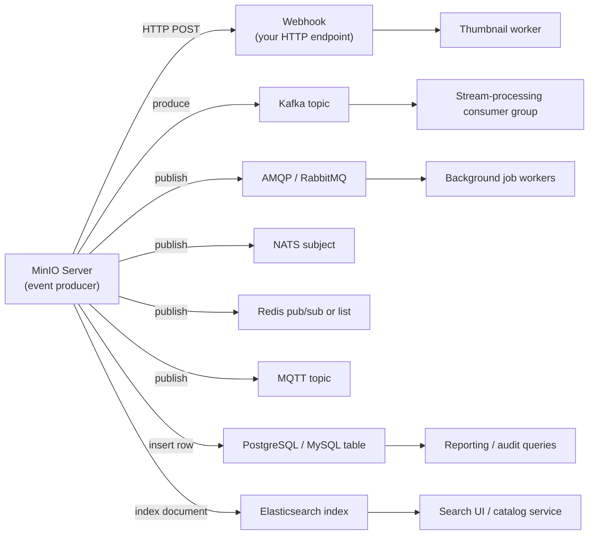
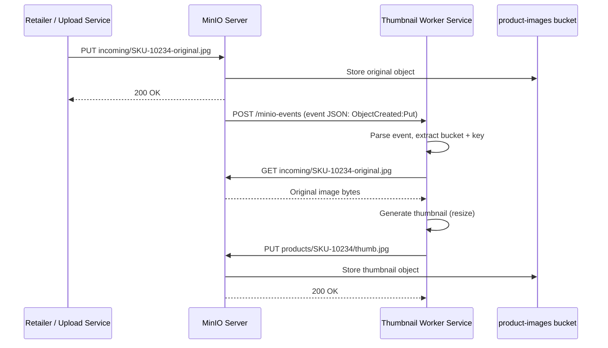

# Event Notifications & Integrations

Chapter 10 gave you fluency with `mc` and the SDKs — you can now script and automate essentially any bucket or object operation, in any language, from a shell or an application. But everything in Chapter 10 was still *pull*-shaped: your code decides when to act, then reaches out and asks MinIO for something, or pushes something to it. If you wanted to know "did a new product photo just land in `product-images/incoming/`?", the only tool you had was to ask, repeatedly — poll a `LIST` call every few seconds, compare it against what you saw last time, and hope you don't miss anything or hammer the server with needless requests.

This chapter removes that limitation. MinIO can be configured to **push an event the instant something happens** — the moment an object is created, overwritten, or deleted, MinIO itself notifies an external system, with no polling loop, no wasted `LIST` calls, and no delay beyond the time it takes to deliver the notification. This is **bucket notifications**, and it's the foundation for building genuinely event-driven pipelines around your object storage: automatic thumbnail generation, real-time search indexing, virus scanning, audit logging, and serverless triggers, all covered in this chapter using ShelfSnap's `product-images` bucket as the running example.

---

## Learning Objectives

By the end of this chapter, you will be able to:

- Explain what a bucket notification is, what triggers one, and what its JSON payload contains.
- Enumerate the event types MinIO can notify on (`s3:ObjectCreated:*`, `s3:ObjectRemoved:*`, and more) and filter them by key prefix/suffix.
- Distinguish MinIO's role as **event producer** from an external system's role as **event consumer**, across webhook and message-queue/broker targets (Kafka, AMQP, NATS, Redis, MQTT, PostgreSQL/MySQL, Elasticsearch).
- Configure a notification target with `mc admin config set` and bind it to a bucket's events with `mc event add`.
- Design and reason through a complete event-driven pipeline — automatic thumbnail generation — from upload to worker to result.
- Explain why event delivery is at-least-once, and design idempotent consumers that handle duplicate events safely.
- Describe what happens when a notification target is unreachable, and why monitoring notification health matters operationally.

---

## Prerequisites for This Chapter

This chapter builds on two earlier chapters:

- **[Chapter 4: Buckets, Objects & the S3 API](./04-buckets-objects-and-the-s3-api.md)** — you should be comfortable with the S3 API's core operations (`PUT`, `GET`, `DELETE`), multipart uploads, and how object keys and prefixes work, since notification event types map directly onto these operations.
- **[Chapter 10: MinIO Client & SDKs](./10-minio-client-and-sdks.md)** — you should be comfortable running `mc` commands against your local alias, and have at least skimmed how an SDK issues authenticated requests, since the worker service in this chapter's pipeline is itself an SDK client of MinIO (it downloads originals and uploads generated thumbnails).

You'll also want a running MinIO server with the `mc` alias you've used throughout this course (referred to below as `local`), and the ShelfSnap `product-images` bucket from Chapter 2.

---

## 1. What a Bucket Notification Actually Is

A **bucket notification** is a standing configuration you attach to a bucket that says, in effect: "whenever event type X happens to an object matching filter Y in this bucket, send a message describing it to target Z." Once configured, MinIO watches for matching operations and fires the notification automatically — there is no polling, no scheduled job, and no delay beyond MinIO's own event-delivery latency (typically milliseconds).

### 1.1 The event payload

When a matching action occurs, MinIO emits a JSON payload conforming to (a close variant of) the same event schema AWS S3 uses for its own bucket notifications — another instance of the S3-compatibility theme from Chapter 2. A trimmed example, for an upload to `product-images`:

```json
{
  "EventName": "s3:ObjectCreated:Put",
  "Key": "product-images/incoming/SKU-10234-original.jpg",
  "Records": [
    {
      "eventVersion": "2.0",
      "eventSource": "minio:s3",
      "awsRegion": "",
      "eventTime": "2026-07-06T14:02:31.104Z",
      "eventName": "s3:ObjectCreated:Put",
      "userIdentity": { "principalId": "retailer-portal" },
      "s3": {
        "bucket": { "name": "product-images", "arn": "arn:aws:s3:::product-images" },
        "object": {
          "key": "incoming/SKU-10234-original.jpg",
          "size": 482113,
          "eTag": "9f8b1c2e...",
          "contentType": "image/jpeg",
          "sequencer": "1735F3A9C1E2B4"
        }
      }
    }
  ]
}
```

Notice what's in there: the exact event type, a precise timestamp, the bucket and key, the object's size and content type, and its ETag — everything a downstream consumer needs to act without making a follow-up `HEAD` request, though it's free to make one anyway (e.g., to fetch user-defined metadata not included in the payload).

### 1.2 Event types

MinIO supports the same event-type taxonomy as AWS S3. The ones you'll use in practice fall into a few families:

| Event type | Fires when |
|---|---|
| `s3:ObjectCreated:Put` | A simple, single-part `PUT` upload completes |
| `s3:ObjectCreated:CompleteMultipartUpload` | A multipart upload (Chapter 4) finishes reassembly |
| `s3:ObjectCreated:Copy` | An object is created via a server-side copy |
| `s3:ObjectCreated:*` | Wildcard — any of the above creation events |
| `s3:ObjectRemoved:Delete` | An object is explicitly deleted |
| `s3:ObjectRemoved:DeleteMarkerCreated` | A delete marker is created on a versioned bucket (Chapter 6) instead of a hard delete |
| `s3:ObjectRemoved:*` | Wildcard — any removal event |
| `s3:ObjectAccessed:Get` / `s3:ObjectAccessed:Head` | An object is read or its metadata is fetched (useful for access auditing, higher volume) |

The wildcard forms (`s3:ObjectCreated:*`, `s3:ObjectRemoved:*`) are the ones you'll reach for most often — you typically don't care *which specific API call* created the object, just that a new object now exists.

### 1.3 Filtering by prefix and suffix

Firing an event for every single object in a bucket is rarely what you want — `product-images` will eventually hold originals, generated variants, and possibly other file types, and most consumers only care about a narrow slice. Notification rules support **prefix** and **suffix** filters, evaluated against the object's key:

- **Prefix filter** `incoming/` — only objects whose key starts with `incoming/` trigger the rule. This is exactly how ShelfSnap scopes the thumbnail pipeline (Section 4) to freshly uploaded originals, rather than also firing when the pipeline itself writes the generated thumbnail back into `products/SKU-XXXX/`.
- **Suffix filter** `.jpg` — only objects whose key ends with `.jpg` trigger the rule, letting you ignore, say, a stray `.json` metadata sidecar file uploaded to the same prefix.

Combining both (prefix `incoming/` **and** suffix `.jpg`) is the standard pattern for a pipeline that should only react to actual, freshly-uploaded photos — covered concretely in Section 3's worked example.

---

## 2. Notification Targets: Where Events Go

MinIO doesn't just fire events into the void — each notification rule is bound to a **target**, a destination MinIO knows how to deliver JSON payloads to. Targets fall into two broad categories.

### 2.1 Webhooks — the simplest target

A **webhook** target is just a plain HTTP(S) endpoint you control. MinIO issues a `POST` request to that URL, with the event JSON as the body, every time a matching event fires. This is the lowest-friction target to stand up: no message broker to run, no client library beyond an HTTP server, and it's the natural starting point for learning event notifications (and for smaller pipelines where losing an occasional event under a rare outage is tolerable — more on this trade-off in Section 6 and Best Practices).

### 2.2 Message-queue and broker targets

For higher-throughput or higher-reliability needs, MinIO can publish events directly into a message broker or queue, which decouples "MinIO fired the event" from "a consumer processed it" — events sit durably in the queue until a consumer is ready, surviving a consumer restart or a brief outage in a way a plain webhook cannot. Supported targets include:

| Target | Typically used for |
|---|---|
| **Kafka** | High-throughput, durable event streams; multiple independent consumer groups can each process the same event stream |
| **AMQP (RabbitMQ)** | Reliable task-queue style delivery to worker pools |
| **NATS** | Lightweight, low-latency pub/sub, often in Kubernetes-native stacks |
| **Redis** | Simple pub/sub or list-based queues for lower-durability, lower-latency needs |
| **MQTT** | Lightweight messaging, common in IoT-adjacent architectures |
| **PostgreSQL / MySQL** | Writing event records directly into a relational table — often used to build a queryable index of "what objects exist and when they changed" without scanning the bucket |
| **Elasticsearch** | Indexing object metadata into a search engine, so objects become full-text/attribute searchable without ever listing the bucket |

### 2.3 MinIO is always the producer

Across every target type, the relationship is the same: **MinIO is the producer, pushing events out; your application is the consumer, reacting to them.** MinIO never asks a target "do you want this event?" and it never waits for a consumer's business logic to finish before considering the delivery attempt complete — it hands the payload to the target (an HTTP endpoint, or a broker's ingestion API) and moves on. Everything past that handoff — parsing the event, deciding what to do, doing it — is entirely your application's responsibility, running on infrastructure you own, decoupled from MinIO's own server processes.



Each arrow on the right is a different **consumer** — a separate piece of software you write and run, reacting to events MinIO produced without MinIO knowing or caring what that reaction is.

---

## 3. Configuring a Target and an Event Rule, End to End

Wiring up notifications is a two-step process: first tell MinIO how to reach the target (a one-time, server-level configuration), then tell MinIO which bucket events should be sent there (a per-bucket rule).

### 3.1 Step 1 — Configure the notification target

Notification targets are configured at the MinIO **server** level (not per-bucket) using `mc admin config set`, then activated with a service restart. Here's a webhook target for ShelfSnap, named `thumbnail-worker`:

```bash
# Configure a webhook target called "thumbnail-worker"
mc admin config set local notify_webhook:thumbnail-worker \
  endpoint="http://thumbnail-worker.internal.shelfsnap.com:8080/minio-events" \
  queue_dir="/mnt/minio-notify-queue" \
  queue_limit="10000"

# Restart MinIO so the new target takes effect
mc admin service restart local
```

A few things worth noting about this command:

- The target name (`thumbnail-worker`) is arbitrary — you choose it, and you'll reference it again in Section 3.2.
- `endpoint` is the URL MinIO will `POST` events to. It must be reachable from the MinIO server itself (not from your laptop) — a common early mistake when the worker service and MinIO run in different networks or containers.
- `queue_dir` and `queue_limit` configure a local on-disk queue MinIO uses to buffer events if the target is briefly unreachable, and to retry delivery (Section 6 covers this in depth) — setting this is a good habit even for a "simple" webhook target.

Confirm the target is active:

```bash
mc admin config get local notify_webhook
```

Setting up a Kafka target follows the identical shape, just with Kafka-specific keys instead:

```bash
mc admin config set local notify_kafka:product-events \
  brokers="kafka-broker-1:9092,kafka-broker-2:9092" \
  topic="minio-product-images-events"

mc admin service restart local
```

### 3.2 Step 2 — Bind a bucket's events to the target

With the target configured server-side, `mc event add` creates the actual per-bucket notification rule — the event types, the bucket, and the optional prefix/suffix filter, bound to the target's ARN:

```bash
mc event add local/product-images \
  arn:minio:sqs::thumbnail-worker:webhook \
  --event put \
  --prefix "incoming/" \
  --suffix ".jpg"
```

Reading this command left to right:

- `local/product-images` — the bucket the rule applies to.
- `arn:minio:sqs::thumbnail-worker:webhook` — the target's ARN, built from the target name you chose in Section 3.1 (`mc admin config get local notify_webhook` will print the exact ARN string if you're unsure — MinIO generates it deterministically from the target type and name).
- `--event put` — shorthand `mc` accepts for `s3:ObjectCreated:Put`-family events; you can also pass full event names or `--event put,delete` for multiple types.
- `--prefix "incoming/"` and `--suffix ".jpg"` — the filter from Section 1.3, so only freshly-uploaded JPEGs under `incoming/` trigger this rule, not every object in the bucket.

Confirm the rule is active:

```bash
mc event list local/product-images
```

which prints the ARN, event types, and filters currently bound to the bucket. Removing a rule later, if the pipeline is retired, is the mirror command:

```bash
mc event remove local/product-images arn:minio:sqs::thumbnail-worker:webhook
```

At this point, every JPEG landing under `product-images/incoming/` triggers an HTTP `POST` to the thumbnail worker's endpoint, carrying the event JSON from Section 1.1. The next section walks through exactly what that worker does with it.

---

## 4. The Classic Use Case: Automatic Thumbnail Generation

This is the pipeline event notifications get built for more than any other, and it's worth walking through in full, because its shape — upload triggers event, event triggers worker, worker writes a derived result back — recurs across nearly every other use case in Section 5.

### 4.1 The pipeline, step by step

1. A retailer (or ShelfSnap's own upload service) uploads a full-resolution product photo to `product-images/incoming/SKU-10234-original.jpg`.
2. MinIO's `s3:ObjectCreated:Put` event fires (Section 1), matching the rule from Section 3.2 (prefix `incoming/`, suffix `.jpg`).
3. MinIO delivers the event JSON to the `thumbnail-worker` webhook endpoint.
4. The worker service receives the `POST`, parses the JSON, and extracts the bucket and key of the newly-created object.
5. The worker downloads the original object's bytes from MinIO (a plain `GET`, using the SDK skills from Chapter 10).
6. The worker generates a thumbnail — resizing the image, typically with an image-processing library (Pillow in Python, `sharp` in Node.js, `imaging` in Go).
7. The worker uploads the resulting thumbnail back into MinIO at a predictable, fixed key: `product-images/products/SKU-10234/thumb.jpg` — reusing exactly the key convention ShelfSnap settled on in Chapter 2's Real-World Scenario.
8. The pipeline is done. No cron job, no polling loop, no manual trigger — the thumbnail exists within moments of the original landing in `incoming/`.



### 4.2 Why the prefix/suffix filter matters here specifically

Notice that the thumbnail worker's own write in step 7 (`products/SKU-10234/thumb.jpg`) does **not** match the rule's `incoming/` prefix filter. This is deliberate, and it's the single most important design detail in this pipeline: without the prefix filter, the rule would match *every* object created in the bucket — including the thumbnail the worker itself just wrote — and you'd have an infinite loop: thumbnail creation triggers a "new object" event, which triggers the worker to try to generate a thumbnail of the thumbnail, which triggers another event, forever. Scoping the notification rule tightly to the upload landing zone (`incoming/`), and having the worker write results *outside* that prefix, is what keeps the pipeline a straight line instead of a loop.

---

## 5. Other Realistic Use Cases

The upload → event → worker → write-back shape from Section 4 generalizes well beyond thumbnails.

- **Search indexing.** Every time an object is created, an Elasticsearch (or PostgreSQL/MySQL) target — or a webhook feeding your own indexing service — records the object's key, size, content type, and any metadata into a searchable store. This builds a queryable catalog ("find all product images uploaded this week for SKUs starting with `SKU-1`") without ever having to `LIST` the bucket itself, sidestepping the "listing isn't free at scale" limitation from Chapter 2.
- **Serverless function triggers.** Instead of a long-running worker service, the webhook (or queue message) can invoke a serverless function — an AWS Lambda function if you're bridging to AWS-adjacent infrastructure, or a self-hosted function runtime (OpenFaaS, Knative) if you're keeping everything on-premises alongside MinIO itself. The function receives the same event JSON and runs the same kind of "download, process, maybe write back" logic, just on infrastructure that scales to zero between events.
- **Audit and compliance logging.** A notification rule scoped to `s3:ObjectRemoved:*` (and optionally `s3:ObjectCreated:*`) feeding a durable target (Kafka, or a database table) gives you an independent, tamper-evident record of every object created or deleted in a bucket — valuable for compliance regimes that require proof of what happened to sensitive data and when, complementing (not replacing) the audit logging covered in Chapter 14.
- **Virus-scan-then-promote pipelines.** A common pattern for user-uploaded content: uploads land in a quarantine prefix (e.g., `incoming/`), a notification fires a scanning worker, and only if the scan passes does the worker copy (promote) the object to a public-facing prefix. Anything that fails the scan simply never gets copied out of quarantine — the public prefix is only ever populated by objects that passed inspection. This is structurally the same pipeline as thumbnail generation, with "scan and conditionally copy" standing in for "resize and unconditionally copy."

---

## 6. Delivery Guarantees, Idempotency, and Monitoring Notification Health

### 6.1 At-least-once delivery

MinIO's notification delivery is **at-least-once**, not exactly-once. If a target is briefly unreachable, MinIO retries delivery (backed by the on-disk queue configured in Section 3.1); if a retry succeeds after the target had, in fact, already processed an earlier attempt that failed to acknowledge cleanly, or under other network-level ambiguity (a request that succeeded but whose response was lost), a consumer can legitimately receive **the same event more than once**. This is not a MinIO bug — it's the standard trade-off every at-least-once delivery system makes, because the alternative (at-most-once) risks silently losing events entirely, which is almost always the worse failure mode for a pipeline like thumbnail generation or audit logging.

### 6.2 Why consumers must be idempotent

The practical consequence is that **every event consumer you write must be safe to run twice on the same event.** For the thumbnail worker from Section 4, that means: before generating and uploading a thumbnail, check whether `products/SKU-10234/thumb.jpg` already exists (a cheap `HEAD`/`mc stat`-equivalent call) and, if it does, skip regeneration rather than blindly redoing the work. This single check turns a duplicate delivery from "wasted work at worst" into "wasted work is what actually happens" — cheap, safe, and correct — instead of leaving room for a subtler bug, like a race between two concurrent workers both processing the same duplicate event and stepping on each other's writes.

The same discipline applies everywhere event notifications appear: an audit-log consumer should use the event's own identifying fields (bucket, key, `eventTime`, `sequencer`) to detect and discard duplicates before inserting a row twice; a billing or "charge the customer per upload" pipeline (the canonical cautionary example) must never treat a duplicate delivery as a second, separate billable action — this is precisely the kind of correctness bug covered in Common Mistakes, below.

### 6.3 Monitoring notification health

A notification pipeline that silently stops working is a uniquely dangerous kind of failure: uploads keep succeeding (the `PUT` itself doesn't depend on notification delivery succeeding), so nothing in your primary upload path complains — but if the target is unreachable for an extended period, the entire event-driven side of your system (thumbnails, search index freshness, audit trail completeness) quietly falls behind or stops entirely, and the first sign of trouble is often a support ticket days later asking "why does this product have no thumbnail?"

MinIO retries delivery to a temporarily-unreachable target using the queue configured in Section 3.1, up to the configured `queue_limit`, but retries are not a substitute for visibility: if a target is down long enough, or the queue fills, events are eventually dropped. This is why monitoring notification delivery — not just monitoring whether MinIO itself is up — deserves a real place in your operational dashboards, a theme Chapter 14 (Monitoring & Observability) develops fully with Prometheus metrics that expose notification-target queue depth and delivery failures directly; for now, the operational takeaway is simply: **treat "is my webhook/queue target reachable and keeping up" as a first-class thing you alert on, not an afterthought you discover is broken only when a downstream artifact goes missing.**

---

## Real-World Scenario

ShelfSnap's operations team is tired of manually running a batch thumbnail-generation script every night, which means new product listings show up on the storefront with no thumbnail for up to 24 hours. They decide to build the event-driven pipeline from Section 4 for real.

**Step 1 — Stand up the worker service.** A small HTTP service (`thumbnail-worker`), written in Python with Flask and the MinIO Python SDK, listens on `/minio-events` for `POST` requests. On each request, it parses the event JSON, extracts `bucket` and `key`, and hands the work to a background task so the HTTP handler can return quickly (MinIO doesn't need to wait for thumbnail generation to finish — just for the `POST` to be accepted).

**Step 2 — Configure the webhook target.**

```bash
mc admin config set local notify_webhook:thumbnail-worker \
  endpoint="http://thumbnail-worker.internal.shelfsnap.com:8080/minio-events" \
  queue_dir="/mnt/minio-notify-queue" \
  queue_limit="10000"
mc admin service restart local
```

**Step 3 — Bind the rule to `product-images`.**

```bash
mc event add local/product-images \
  arn:minio:sqs::thumbnail-worker:webhook \
  --event put \
  --prefix "incoming/" \
  --suffix ".jpg"
```

**Step 4 — Implement idempotent processing in the worker.** The team writes the core handler like this (Python, using the MinIO SDK from Chapter 10):

```python
def handle_event(event):
    key = event["Records"][0]["s3"]["object"]["key"]          # e.g. "incoming/SKU-10234-original.jpg"
    sku = extract_sku(key)                                     # "SKU-10234"
    thumb_key = f"products/{sku}/thumb.jpg"

    # Idempotency check: has this thumbnail already been generated?
    try:
        client.stat_object("product-images", thumb_key)
        log.info(f"Thumbnail for {sku} already exists — skipping duplicate event")
        return
    except S3Error:
        pass  # doesn't exist yet — proceed normally

    original = client.get_object("product-images", key)
    thumbnail_bytes = generate_thumbnail(original.read())
    client.put_object("product-images", thumb_key, thumbnail_bytes, len(thumbnail_bytes))
    log.info(f"Generated thumbnail for {sku}")
```

**Step 5 — Handle the duplicate-delivery edge case.** A few days after launch, the team notices in logs that a handful of SKUs triggered the handler twice within the same second — a symptom of exactly the at-least-once delivery behavior from Section 6.1, likely caused by a brief network blip during the original `POST`'s response. Because of the `stat_object` check in Step 4, the second invocation logged "already exists — skipping duplicate event" and did no redundant work — no double-billing for image-processing compute, no race condition writing the same key twice, no corrupted partial thumbnail from two concurrent uploads. The idempotency check, added proactively rather than reactively, is what turned a real production event into a one-line log message instead of an incident.

**Step 6 — Add monitoring.** The team wires a Prometheus alert (previewing Chapter 14) on the webhook target's queue depth, so that if `thumbnail-worker` ever goes down for more than a few minutes, someone gets paged before hundreds of products silently accumulate without thumbnails.

---

## Best Practices

- **Always write idempotent event consumers.** Given at-least-once delivery (Section 6.1), any consumer that isn't safe to run twice on the same event will eventually double-process something — design the idempotency check (existence check, dedup table, or natural upsert) in from day one, not after the first incident.
- **Filter notifications by prefix/suffix at the rule level, not client-side.** Scoping `mc event add` with `--prefix`/`--suffix` (Section 1.3) means MinIO never sends your consumer events it doesn't care about, saving bandwidth, compute, and — as Section 4.2 showed — preventing accidental infinite loops when a pipeline's own output would otherwise re-trigger itself.
- **Use a durable queue (Kafka, AMQP) rather than a plain webhook for anything where losing an event would be costly.** A webhook target with no consumer running to receive it can only rely on MinIO's local retry queue (Section 3.1), which has a bounded size; a message broker persists events independently of whether a consumer happens to be up at that exact moment, which matters far more for audit/compliance pipelines than for a "regenerate a thumbnail eventually" pipeline.
- **Monitor notification target health as a first-class operational signal**, not an afterthought — per Section 6.3, a broken pipeline fails silently from the upload path's perspective, so you need independent visibility (queue depth, delivery failure counts) to catch it before a downstream gap becomes visible to customers.
- **Keep the worker's write-back path outside the notification rule's filter scope.** As in Section 4.2, generating a derived object (a thumbnail, an index entry) should write somewhere the triggering rule doesn't also match, to avoid feedback loops.
- **Log enough of the event to debug after the fact** — bucket, key, event type, timestamp, and your own dedup decision (processed vs. skipped-as-duplicate) — so a "why didn't this thumbnail get generated" investigation doesn't require reproducing the issue from scratch.
- **Treat notification target configuration as infrastructure, not a one-off command.** Track your `mc admin config set` and `mc event add` invocations in version-controlled scripts or infrastructure-as-code, the same way you would treat IAM policies (Chapter 8) — rebuilding a cluster from scratch should recreate the exact same notification wiring.

---

## Common Mistakes

- **Writing a non-idempotent consumer that double-processes a retried event** — regenerating and re-uploading a thumbnail twice is merely wasteful, but the same pattern applied to a billing or inventory-decrement pipeline (double-charging a customer, double-decrementing stock) is a genuine correctness bug, not just inefficiency.
- **Not filtering event rules, and processing irrelevant object types client-side instead.** Binding a rule to every event in a bucket and then filtering in the consumer wastes delivery bandwidth and consumer CPU on payloads you were always going to discard — and it's the direct cause of the feedback-loop failure mode described in Section 4.2 when a pipeline's own output re-triggers itself.
- **Using a plain webhook for a critical pipeline with no retry/durability story of its own**, assuming MinIO's local delivery queue is an unlimited safety net — it's bounded (`queue_limit`), and an extended outage on the consumer side can still result in dropped events once that queue fills.
- **Not monitoring whether a notification target is even reachable, and silently losing events for days.** Because uploads themselves keep succeeding independent of notification delivery, there is no natural signal in the primary upload path that anything is wrong — you must monitor the notification pipeline itself (Section 6.3), or the first sign of trouble is a support ticket.
- **Forgetting that `endpoint` must be reachable from the MinIO server, not from your laptop or CI runner.** A webhook configured with a URL only resolvable on your local machine will fail silently from MinIO's perspective (it will retry and eventually give up), a frequent point of confusion when first wiring up a target.
- **Assuming event ordering is guaranteed across objects.** MinIO does not promise that events for different objects arrive at a consumer in the exact order the underlying operations happened, especially under retries — design consumers to be correct per-event rather than reliant on strict global ordering.
- **Conflating "the event fired" with "my business logic ran successfully."** A `POST` reaching your webhook endpoint's HTTP layer doesn't guarantee your handler's business logic completed without error — wrap actual processing in its own error handling and retry/dead-letter strategy, rather than assuming receipt equals success.

---

## Summary

- A **bucket notification** configures MinIO to push a JSON event to an external target the instant a matching S3 API action (`s3:ObjectCreated:*`, `s3:ObjectRemoved:*`, and more) happens on a bucket, optionally filtered by key **prefix** and **suffix** — eliminating the need to poll.
- Notification **targets** fall into two families: plain **webhooks** (an HTTP endpoint you run) and **message-queue/broker targets** (Kafka, AMQP, NATS, Redis, MQTT, PostgreSQL/MySQL, Elasticsearch). MinIO is always the **producer**; your application is always the **consumer**.
- Wiring up notifications is two steps: `mc admin config set` to define a server-level target, then `mc event add` to bind a bucket, event types, and an optional filter to that target's ARN.
- **Automatic thumbnail generation** is the canonical event-driven pipeline: upload to a landing prefix triggers an event, a worker downloads the original, generates a thumbnail, and writes it back outside the triggering rule's filter scope to avoid feedback loops.
- The same shape generalizes to search indexing (Elasticsearch/database targets), serverless function triggers, audit/compliance logging, and virus-scan-then-promote pipelines.
- Delivery is **at-least-once** — consumers must be **idempotent**, safely handling duplicate deliveries (e.g., checking whether a thumbnail already exists before regenerating it).
- Notification pipelines fail silently from the upload path's perspective; monitoring target reachability and queue depth (previewed here, developed fully in Chapter 14) is essential to catching a broken pipeline before it causes a visible downstream gap.

---

## Knowledge Check

1. Explain, precisely, what triggers an `s3:ObjectCreated:CompleteMultipartUpload` event versus an `s3:ObjectCreated:Put` event, and why a consumer might care about the distinction.
2. Why does the thumbnail-generation pipeline in Section 4 filter its notification rule to the `incoming/` prefix, and what would go wrong if it were instead bound to every object created in the bucket?
3. Describe the difference between a webhook target and a message-queue target (e.g., Kafka) in terms of what happens if the consumer is down for ten minutes.
4. What does "at-least-once delivery" mean for event notifications, and what specific code-level change does it require of every consumer you write?
5. A colleague says "our thumbnail pipeline hasn't generated a single new thumbnail in three days, but nobody noticed because uploads themselves are working fine." What does this tell you about how the notification pipeline should have been monitored, and what would you add?

---

## Hands-On Exercise

Using your `local` `mc` alias and the `product-images` bucket from Chapter 2:

1. **Stand up a minimal local HTTP listener** that just logs incoming requests. A one-file script is enough — for example, in Python:

   ```python
   from http.server import BaseHTTPRequestHandler, HTTPServer

   class Handler(BaseHTTPRequestHandler):
       def do_POST(self):
           length = int(self.headers["Content-Length"])
           body = self.rfile.read(length)
           print("Received event:", body.decode())
           self.send_response(200)
           self.end_headers()

   HTTPServer(("0.0.0.0", 8080), Handler).serve_forever()
   ```

   Run it (`python3 listener.py`) and confirm it's listening on port 8080.

2. **Configure a webhook notification target** pointing at the listener (adjust the host/port so it's reachable from your MinIO server — `localhost` works if MinIO runs on the same machine outside a container; use the container's host-accessible address otherwise):

   ```bash
   mc admin config set local notify_webhook:test-listener \
     endpoint="http://localhost:8080/" \
     queue_dir="/tmp/minio-notify-queue"
   mc admin service restart local
   ```

3. **Bind the rule** to a test prefix in `product-images`, matching any creation event:

   ```bash
   mc event add local/product-images \
     arn:minio:sqs::test-listener:webhook \
     --event put \
     --prefix "incoming/"
   ```

   Confirm it's active with `mc event list local/product-images`.

4. **Upload a file** under the matching prefix and watch the listener:

   ```bash
   mc cp ./sample.jpg local/product-images/incoming/SKU-99999-original.jpg
   ```

   Within moments, your listener process should print the full event JSON — confirm it contains the expected `eventName` (`s3:ObjectCreated:Put`), `bucket`, and `key` fields matching what you just uploaded.

5. **Extend the listener to "process" the event idempotently.** Modify `do_POST` to parse the JSON body, extract the key, and print a fake thumbnail-generation log line — but only the first time it sees a given key, simulating the idempotency check from Section 6.2:

   ```python
   import json
   seen_keys = set()

   class Handler(BaseHTTPRequestHandler):
       def do_POST(self):
           length = int(self.headers["Content-Length"])
           body = json.loads(self.rfile.read(length))
           key = body["Records"][0]["s3"]["object"]["key"]
           if key in seen_keys:
               print(f"Duplicate event for {key} — skipping (idempotent)")
           else:
               seen_keys.add(key)
               print(f"[fake] Generating thumbnail for {key}")
           self.send_response(200)
           self.end_headers()
   ```

   Re-upload the same file (overwriting the same key) and confirm you see the "Generating thumbnail" line again only if the key changed — then manually `POST` the same captured JSON payload to the listener a second time (e.g., with `curl`) to simulate a duplicate delivery, and confirm it correctly logs "skipping" instead of reprocessing.

6. **Clean up** when done, so the test rule doesn't linger:

   ```bash
   mc event remove local/product-images arn:minio:sqs::test-listener:webhook
   ```

---

## Further Reading

- [MinIO Documentation — Linux Admin & Client Guide](https://min.io/docs/minio/linux/index.html) — the canonical reference this course points to throughout.
- [MinIO Documentation — Bucket Notifications](https://min.io/docs/minio/linux/administration/monitoring/bucket-notifications.html) — the authoritative guide to configuring notification targets and event rules.
- [MinIO Documentation — Publish Events to Webhooks](https://min.io/docs/minio/linux/administration/monitoring/publish-events-to-webhooks.html) — webhook-specific target configuration, referenced throughout Sections 2–3.
- [MinIO Documentation — Publish Events to Kafka](https://min.io/docs/minio/linux/administration/monitoring/publish-events-to-kafka.html) — a durable message-queue target, useful for comparing against the webhook approach in Section 2.2.
- [MinIO Documentation — `mc event` Command Reference](https://min.io/docs/minio/linux/reference/minio-mc-admin/mc-event.html) — the full `mc event add`/`list`/`remove` command surface used in Section 3.

---

<div style="display:flex;justify-content:space-between;align-items:center;">
  <a href="./10-minio-client-and-sdks.md">← Previous: MinIO Client & SDKs</a>
  <a href="./00-index.md">🏠 Index</a>
  <a href="./12-distributed-deployment-and-site-replication.md">Next: Distributed Deployment & Site Replication →</a>
</div>
